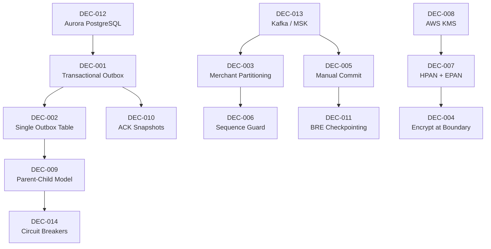

# WDP-DECISIONS.md
**World Dispute Platform — Architecture Decisions**
*Version: 1.0 | Extracted: April 2026 | Source: WDP Documentation Suite v2.0*

---

## How to Read This Document

Each decision follows a consistent structure: the problem that forced the decision, what was chosen and why, what was rejected and why, and the lasting consequences. Decisions are grouped by tier — strategic decisions that shape the whole platform first, tactical decisions that shaped individual processing patterns second, and forward-looking decisions for stages not yet built third.

A decision's tier indicates its change cost: Tier 1 decisions are effectively permanent for the life of the platform. Tier 2 decisions can be revisited stage by stage but require cross-team coordination. Tier 3 decisions are still open.

---

## Decision Registry

| ID | Decision | Tier | Status | Date |
|---|---|---|---|---|
| DEC-001 | Transactional Outbox for Event Delivery | 1 | ✅ Active | Oct 2025 |
| DEC-002 | Single Outbox Table for Multiple Event Types | 2 | ✅ Active | Oct 2025 |
| DEC-003 | Merchant-Scoped Kafka Partitioning | 2 | ✅ Active | Oct 2025 |
| DEC-004 | Encrypt PAN at the Ingestion Boundary | 1 | ✅ Active | Oct 2025 |
| DEC-005 | Manual Kafka Offset Commit | 2 | ✅ Active | Oct 2025 |
| DEC-006 | Deferred Processing with Sequence Guard for Concurrent Updates | 2 | ✅ Active (v1.6) | Oct 2025 |
| DEC-007 | Two-Token PAN Strategy (HPAN + EPAN) | 1 | ✅ Active | Oct 2025 |
| DEC-008 | AWS KMS for Key Management | 1 | ✅ Active | Oct 2025 |
| DEC-009 | Parent-Child Outbox Model for Combined Files | 2 | ✅ Active | Oct 2025 |
| DEC-010 | Immutable Versioned ACK Snapshots | 2 | ✅ Active | Oct 2025 |
| DEC-011 | BRE Crash Recovery via Step Checkpointing | 2 | ✅ Active | Nov 2025 |
| DEC-012 | Aurora PostgreSQL as Operational Database | 1 | ✅ Active | Oct 2025 |
| DEC-013 | Kafka (AWS MSK) as Event Streaming Platform | 1 | ✅ Active | Oct 2025 |
| DEC-014 | Resilience4j for Circuit Breaking | 2 | ✅ Active | Oct 2025 |
| DEC-S3-1 | AWS Redshift as Analytics Warehouse | 1 | 🔴 Proposed | Nov 2025 |
| DEC-S3-2 | Star Schema for Warehouse Design | 2 | 🔴 Proposed | Nov 2025 |
| DEC-S3-3 | Hybrid Real-Time / Batch Analytics | 2 | 🔴 Proposed | Nov 2025 |
| DEC-S3-4 | Apache Parquet for Data Lake Storage | 2 | 🔴 Proposed | Nov 2025 |
| DEC-S3-5 | TensorFlow / XGBoost for ML Models | 2 | 🔴 Proposed | Nov 2025 |
| DEC-S3-6 | Containerised ML Serving | 2 | 🔴 Proposed | Nov 2025 |
| DEC-015 | GraphQL for Merchant Portal API | 2 | 🔴 Proposed | TBD |

---

## Dependency Map

Before reading individual decisions, this map shows which decisions build on others. If you are considering changing a foundational decision, trace the arrows to understand the downstream impact.

---

## Tier 1 — Strategic Decisions

These decisions define the platform's structural identity. They were made at project inception and are effectively irreversible without a significant re-architecture effort.

---

### DEC-012: Aurora PostgreSQL as the Operational Database

**Context:** WDP needed a relational database that could serve as the foundation for the transactional outbox pattern, hold the canonical case record, and satisfy strict compliance requirements around durability and audit. The alternative of using a NoSQL store was also evaluated.

**Decision:** Aurora PostgreSQL in a multi-AZ configuration, with read replicas for query offload.

**Why this over the alternatives:**

A relational database with strong ACID guarantees was essential for the transactional outbox to be reliable — the guarantee that an event row and a business data change land in the same atomic transaction is only possible if the database supports serialisable transactions. NoSQL stores like DynamoDB cannot atomically commit across two logical entity types in a way that would make the outbox pattern reliable. MongoDB was considered and rejected for the same reason, and because the team's operational expertise was in PostgreSQL.

Aurora specifically (rather than vanilla PostgreSQL on RDS) was chosen for its Aurora-native fast failover (typically under 30 seconds), its storage-level replication, and its auto-scaling read replica capability. The JSONB column type also allows flexible evidence metadata payloads within the same schema without requiring separate document storage.

**What was accepted:** Higher cost than a single-region PostgreSQL deployment (~$4k/month across US and EU regions). Schema migration overhead as the data model evolves.

**What was rejected:** DynamoDB (no cross-entity atomic transactions), MongoDB (weaker ACID guarantees, different team skill set), self-managed PostgreSQL on EC2 (operational burden, no automatic failover).

**Consequences:** The entire outbox pattern, deferred processing, BRE checkpointing, and ACK snapshot designs all depend on PostgreSQL's transactional semantics. Changing the database would require revisiting every one of these patterns.

---

### DEC-013: Kafka (AWS MSK) as the Event Streaming Platform

**Context:** WDP processes disputes from multiple sources and coordinates multiple independent workers. The choice of messaging infrastructure determines whether the system can guarantee ordering, replay events, and scale independently per consumer.

**Decision:** Apache Kafka, managed via AWS MSK with three brokers across three availability zones.

**Why this over the alternatives:**

The key requirements that drove this decision were: ordered delivery within a merchant's event stream, the ability to replay messages for recovery, and the capacity to run multiple independent consumer groups reading the same topics (for example, both the Chargeback Worker and a monitoring consumer can read the same topic independently).

SQS does not support ordered delivery across a large consumer pool — FIFO queues are limited to 3,000 messages per second per queue and do not support the consumer group model needed to have different processing pipelines reading the same stream. RabbitMQ was considered but lacks log-based storage and message replay, which are critical for recovery scenarios. ActiveMQ was similarly excluded for the same reasons plus significantly higher operational overhead.

Kafka's partition model enables WDP to achieve both ordering (all events for a merchant go to the same partition) and parallelism (different merchants' partitions are processed concurrently) without distributed locking.

**What was accepted:** Operational complexity of Kafka. ~$1.5k/month operational cost. Schema management overhead. Eventual consistency between write and delivery.

**What was rejected:** SQS FIFO (throughput limits, no consumer groups), RabbitMQ (no log replay), ActiveMQ (operational overhead, no replay).

**Known constraint:** MSK provisioned storage scaling is one-directional. Once storage is scaled up, it cannot be reduced. This must be factored into all capacity planning decisions.

---

### DEC-001: Transactional Outbox for Event Delivery

**Context:** Every time WDP writes a case or updates a processing row, it also needs to publish an event. The naive approach — write to the database, then publish to Kafka — creates a window where a crash between the two operations results in either a lost event (write succeeded, publish failed) or a phantom event (publish succeeded, write failed).

**Decision:** All components write events to an outbox table in the same database transaction as their business data. A separate Publisher Scheduler polls the outbox and publishes to Kafka, then marks the row as published.

**Why this over the alternatives:**

Direct-to-Kafka publishing was the obvious first option. It is simpler to implement and adds no latency. But it cannot be made atomic with the database write. In a financial dispute system where every event must be delivered and every published event must correspond to an actual committed state change, this gap is unacceptable.

Change Data Capture (Debezium reading PostgreSQL WAL) was also evaluated. CDC would eliminate the polling lag and avoid polluting the application schema with outbox logic. However, CDC requires careful operational management of WAL retention, adds an additional infrastructure dependency, and creates complexity around schema evolution. The team's risk tolerance for the foundational messaging layer was low, and the polling-based outbox was chosen as the simpler, more controllable option.

**What was accepted:** Up to 60 seconds of polling latency between a write and the Kafka publish. This is acceptable because WDP processes batch files — sub-second event delivery is not a requirement at Stage 1.

**What was rejected:** Direct Kafka publish (atomicity gap), Change Data Capture / Debezium (operational complexity, additional failure mode).

**Production result:** Zero message loss verified across 10 million+ events over three months of production operation.

---

### DEC-004: Encrypt PAN at the Ingestion Boundary

**Context:** Card network files arrive containing plaintext Primary Account Numbers. WDP must store and process dispute data, but PCI-DSS prohibits storing PANs in plaintext anywhere in the system. The question was where in the processing chain to encrypt.

**Decision:** PAN is encrypted at the moment of file ingestion, before anything is written to the database. The File Processor calls the Encryption API as its first step before writing any outbox rows. No other component ever receives or stores a plaintext PAN.

**Why this over the alternatives:**

Encrypting later in the pipeline — for example, letting the Chargeback Worker encrypt before creating the Case — would mean the PAN travels in plaintext through Kafka messages and sits in the outbox. Even if Kafka topics were encrypted at rest, having plaintext PANs in application-layer messages significantly increases the PCI audit scope and the blast radius of any messaging infrastructure breach.

Encrypting at the network boundary (a dedicated ingress service before the File Processor) was also considered. This was rejected because it would add a synchronous external call in the hot path of file parsing and complicate error handling — a partial file where some rows were encrypted and others were not due to a failure mid-parse would be difficult to recover cleanly.

**What was accepted:** The Encryption API becomes a dependency of the File Processor. If the Encryption API is unavailable, file processing is blocked. The circuit breaker on the Encryption API provides some protection, but this is a meaningful coupling.

**What was rejected:** Encrypt in Kafka consumer (PAN travels in plaintext through outbox and Kafka), dedicated ingress encryption service (synchronous dependency before parsing).

---

### DEC-007: Two-Token PAN Strategy — HPAN for Lookup, EPAN for Recovery

**Context:** WDP needs to do two different things with a PAN that have contradictory requirements. For case deduplication and matching, it needs a consistent identifier that is the same every time the same card number appears — this must be deterministic. For dispute processing, the Chargeback Worker occasionally needs the actual PAN (for network submissions) — this must be reversible. No single token can be both.

**Decision:** Two tokens are generated from every PAN. HPAN (Hashed PAN) is produced using HMAC-SHA256 with a secret key held in AWS Secrets Manager. It is deterministic and non-reversible, used for all matching and lookups. EPAN (Encrypted PAN) is produced using AES-256-GCM with a rotating Data Encryption Key (DEK), stored with its initialisation vector and authentication tag. It is reversible only through the Encryption API.

**Why this over the alternatives:**

Using encryption only (EPAN) and looking up by ciphertext was rejected because AES-GCM produces different ciphertext each time due to the random IV, making it impossible to match two encryptions of the same PAN without decrypting both — which would require the Encryption API to be in every lookup path, creating unacceptable latency and coupling.

Using hashing only (HPAN) was rejected because HMAC-SHA256 is deliberately non-reversible — it cannot satisfy the requirement of recovering the actual PAN when the network requires it for representment submissions.

**What was accepted:** Two tokens per PAN, two separate storage entries, two separate key management concerns (HMAC key + DEK). Additional complexity in the Encryption API.

**What was rejected:** Single reversible encryption only (cannot do lookups without decrypting), single hash only (cannot recover PAN when needed).

---

### DEC-008: AWS KMS for Key Management

**Context:** The encryption strategy requires a key management system that can store and protect the HMAC key and the Customer Master Key (CMK) used to wrap DEKs. The choice determines the compliance posture of the entire PAN encryption design.

**Decision:** AWS KMS with FIPS 140-2 Level 3 validated hardware security modules for the CMK. HMAC key stored in AWS Secrets Manager.

**Why this over the alternatives:**

On-premise HSM was considered and rejected. The operational burden of maintaining on-premise hardware — patching, physical security, replication, failover — is significant. More importantly, WDP is fully AWS-native; a hybrid deployment requiring secure network connectivity to on-premise hardware adds a reliability dependency that goes against the platform's resilience goals.

Envelope encryption with keys stored in the database was rejected outright because it creates a circularity: if the database is breached, both the ciphertext and the key are exposed together.

Self-managed software key storage (application-managed secrets) was rejected because it would require the application to handle key rotation, audit, and access control — all of which KMS provides natively and which are required for PCI-DSS compliance.

**What was accepted:** AWS infrastructure dependency for key operations. KMS latency adds ~25-75ms to each decrypt call (mitigated by DEK caching). DEKs are cached in memory for six hours, creating a brief exposure window if a service instance is compromised.

**What was rejected:** On-premise HSM (operational burden, hybrid connectivity), database-stored keys (breach circularity), software key stores (compliance gap).

---

## Tier 2 — Tactical Decisions

These decisions shaped how specific processing problems were solved within the constraints set by Tier 1. They are stage-scoped and could theoretically be revisited independently.

---

### DEC-002: Single Outbox Table for Multiple Event Types

**Context:** WDP needed its outbox to carry both CHARGEBACK_PROCESS events and EVIDENCE_ATTACH events, potentially from the same file. An obvious approach was a separate outbox table per event type.

**Decision:** A single outbox table with an event_type discriminator column handles all event types.

**Why:** A single table preserves file-level ordering naturally — because all rows from a file land in the same table, a single ordered query by merchant and sequence number returns them in the correct processing order regardless of type. Separate tables would require a merge or union query that is harder to optimise, harder to lock correctly, and harder to reason about operationally. Adding a new event type in future requires only a new discriminator value, not a new table and a new publisher path.

**What was accepted:** Shared table contention under high volume (mitigated with partial indexes per event type and status).

**Known constraint:** The mixed-type outbox means that operational queries for "all pending chargebacks" require a filter on event_type, not just a simple table scan.

---

### DEC-003: Merchant-Scoped Kafka Partitioning

**Context:** Kafka partitions are the unit of both ordering and parallelism. The partition key determines which events go to the same partition (and are therefore processed in order by the same consumer instance) and which events can be processed in parallel.

**Decision:** All events are partitioned by merchant_id.

**Why:** The race condition WDP must prevent is an UPDATE event for a case being processed before the NEW event that creates it, where both events relate to the same merchant's dispute. If both events land in the same partition, the consumer processes them in sequence and the ordering is guaranteed. If they could land in different partitions (for example, if partitioned by some other key), the UPDATE could be processed by a different consumer instance before the NEW, causing a race.

Partitioning by file or by case was considered but rejected: case-level partitioning creates too many distinct keys and makes partition assignment unpredictable, while file-level partitioning does not help when a merchant sends multiple files whose events need to be ordered relative to each other.

**Known constraint:** The top five merchants by volume represent approximately 40% of total event volume, creating partition skew. These high-volume partitions may become a processing bottleneck as volume grows. This risk is accepted for now but should be monitored.

---

### DEC-005: Manual Kafka Offset Commit

**Context:** Kafka consumers can commit offsets automatically (after receiving a message) or manually (after fully processing a message). Automatic commit is simpler but means a consumer crash after receipt but before processing would advance the offset, silently losing the event.

**Decision:** Offsets are committed manually, only after all processing for a message is complete — including all BRE steps and all database writes.

**Why:** In a financial dispute system, losing a chargeback event means a Case is never created and a merchant is never notified. The at-least-once delivery guarantee (where a crash triggers redelivery) is strongly preferred over at-most-once delivery (where a crash silently drops the message). Manual commit combined with idempotent consumers ensures correctness.

**What was accepted:** If processing fails or a consumer crashes mid-way, the message is redelivered. Consumers must be idempotent. BRE checkpointing (DEC-011) was required specifically because manual commit without checkpointing would cause BRE to re-execute all steps on redelivery.

---

### DEC-006: Deferred Processing with Sequence Guard for Concurrent Updates

**Context:** Card networks sometimes send an UPDATE event for a case before the NEW event that creates it — the network has already opened the dispute and is amending it, but WDP has not yet processed the original creation event. Without handling this, the UPDATE is applied to a non-existent case and is lost.

**Decision:** When the Chargeback Worker encounters an UPDATE for a case that does not yet exist, it writes the UPDATE to a deferred holding area. A separate Deferred Update Processor runs on a short schedule and re-applies deferred events once the corresponding Cases exist. A sequence guard (tracking the maximum deferred sequence applied to each case) prevents out-of-order application.

**Why the sequence guard matters (v1.6):** The initial design (v1.0) tracked which updates had been applied but did not track the highest sequence number applied. When multiple deferred updates arrived for the same case, the system could accidentally apply them in the wrong order or skip some. The v1.6 enhancement, which tracks `max_deferred_sequence_applied` on each Case, means the processor can reliably determine whether a given deferred event is stale (already superseded by a later update) or still applicable.

**Deprecated:** The original v1.0 deferred update design had a 10% false-stale detection rate. It was superseded entirely by v1.6.

**What was accepted:** 30-60 seconds of additional latency for UPDATE events that arrive before their corresponding NEW. A small deferred holding area that must be monitored for stuck entries.

---

### DEC-009: Parent-Child Outbox Model for Combined Files

**Context:** When a network file contains both chargeback data and associated evidence for the same disputes, the evidence cannot be attached until the Cases have been created. Both types of events land in the outbox simultaneously, but evidence processing must wait for chargeback processing.

**Decision:** When the File Processor detects a combined file, it creates outbox rows for both event types but marks evidence rows as BLOCKED, with a reference to their corresponding chargeback (parent) row. The Chargeback Worker, after successfully creating the Case, unblocks the child evidence row by clearing its BLOCKED status. An Unblock Reconciler runs every two minutes as a safety net for any cases where the unblock signal was missed.

**Why not synchronous coordination:** Requiring the Chargeback Worker to synchronously call the Evidence Worker would couple two independent processing paths and create cascading failure risk. The BLOCKED status allows both workers to remain fully independent — the Evidence Worker simply skips any row that is still BLOCKED.

**What was accepted:** A maximum of two minutes of additional latency for evidence attachment in combined files (the Reconciler's scan interval). The Unblock Reconciler must be monitored as a safety net, not treated as the primary unblock path.

**What was rejected:** Synchronous worker coordination (coupling), publishing evidence events after chargeback events (race condition on the Kafka consumer side), separate files for chargebacks and evidence (not how networks send data).

---

### DEC-010: Immutable Versioned ACK Snapshots

**Context:** Merchants need an acknowledgment file telling them the outcome of each row in the file they submitted. The challenge is that some rows may still be in processing when the ACK is generated (due to the 10-minute ACK timeout), and those rows may later complete successfully. If the ACK is updated in place, the merchant has no history of what they were originally told.

**Decision:** When the ACK service runs, it captures an immutable snapshot of all row statuses at that point in time and writes it as a versioned record (v1, v2, v3…). If late-completing rows are later detected, a new versioned snapshot is generated and the merchant is notified of the superseding version. The original snapshot is never modified.

**Why:** Immutability eliminates a class of operational confusion: if an ACK is mutated, it becomes impossible to reconstruct what a merchant was told at any given point in time without a separate audit log. The snapshot-per-version model preserves a complete, auditable history by design. This is also a compliance requirement — SOX and PCI-DSS both require immutable audit trails for financial communications.

**What was accepted:** Snapshot storage grows at approximately 100 GB/year. ACK file names include the version number so merchants know which version is most current.

**What was rejected:** Mutating the ACK in place (loses history, audit gap), dual-status fields on the row (schema bloat, complex queries, still loses the communicated snapshot).

---

### DEC-011: BRE Crash Recovery via Step Checkpointing

**Context:** The Business Rules Engine executes multiple sequential steps within a single Kafka message processing cycle. Each step may call an external API. If the consumer crashes after some steps complete but before the message offset is committed (per DEC-005), Kafka redelivers the message and all BRE steps restart — re-calling external APIs that had already been called successfully.

**Decision:** After each BRE step completes, its name is written to the outbox row in a separate, independently committed transaction (not the outer transaction). On redelivery, the worker reads this checkpoint and skips all steps up to and including the recorded one, resuming from the next step.

**Why an independent transaction for checkpointing:** If the checkpoint were written in the same transaction as the outer business logic, a rollback of the outer transaction (for example, due to a later step failing) would also roll back the checkpoint — meaning the completed step would be retried. The checkpoint must survive outer transaction rollbacks, hence the requirement that it commits independently.

**What was accepted:** A small number of outbox rows may get stuck with a partial checkpoint if a step times out without completing. Monitoring for stuck rows (no checkpoint progress for more than 10 minutes) is required operationally.

**Production result:** 100% crash recovery success rate across 50+ crash scenarios tested.

---

### DEC-014: Resilience4j Circuit Breaking

**Context:** The Evidence Worker calls the external Document Management API for every evidence file. If that API becomes slow or unavailable, Evidence Workers pile up blocked threads, which eventually starves the consumer group and causes a Kafka consumer group rebalance cascade affecting all merchants — including those whose Document Management API calls would have succeeded.

**Decision:** Per-merchant circuit breakers using Resilience4j. Each merchant has an independent circuit breaker monitoring its Document Management API calls. When one merchant's breaker opens, that merchant's evidence processing is paused, but other merchants' processing continues unaffected.

**Why per-merchant rather than global:** A global circuit breaker would protect the system from a complete Document Management API outage, but it would also cause all merchants to stop evidence processing even if only one merchant's requests are failing (for example, due to bad data specific to that merchant). Per-merchant isolation means only the affected merchant's processing is paused.

**Configuration thresholds:** 20% failure rate triggers the breaker to open. After 60 seconds, a half-open state allows 10 test calls. If those pass, the breaker closes.

**Production result:** Three cascading failure incidents prevented in production.

---

## Tier 3 — Forward-Looking Decisions (Stage 3 & Beyond)

These decisions are proposals for Stage 3, which has not yet been built. All should be validated during the Q2 2026 planning phase. They are recorded here to capture current thinking, not as commitments.

---

### DEC-S3-1: AWS Redshift as Analytics Warehouse ⚠️ PROPOSED

**Context:** Stage 3 requires a warehouse capable of handling complex analytical queries over years of dispute history, potentially billions of rows.

**Proposed decision:** AWS Redshift (Massively Parallel Processing columnar warehouse).

**Proposed rationale:** Native AWS integration with S3 and Glue, proven at scale for financial analytics, cost-effective relative to alternatives at WDP's projected volume.

**Alternatives under consideration:** Snowflake (more expensive, multi-cloud capable but less AWS-native), BigQuery (Google Cloud, introduces a second cloud vendor dependency).

⚠️ VERIFY: Snowflake and BigQuery evaluations are brief notes, not full analyses. A proper cost and capability comparison should be done before this decision is finalised.

---

### DEC-S3-2: Star Schema for Warehouse Design ⚠️ PROPOSED

**Context:** Redshift schema design choices significantly affect query performance for analytical workloads.

**Proposed decision:** Star schema with separate fact tables (one per event grain) and shared dimension tables (merchant, network, time, reason code).

**Proposed rationale:** Star schemas are optimised for the type of aggregation queries WDP analytics will run (how many disputes by merchant by network by month?), are simpler for analysts to write queries against, and perform better than fully normalised schemas for read-heavy analytical workloads.

---

### DEC-S3-3: Hybrid Real-Time / Batch Analytics ⚠️ PROPOSED

**Context:** WDP already has near-real-time operational metrics in Prometheus/Grafana. Stage 3 needs to add historical analytics without replacing the operational monitoring that teams rely on.

**Proposed decision:** Retain Prometheus/Grafana for operational real-time metrics (processing rates, error rates, queue depths). Add Redshift + daily ETL for historical and trend analytics. Do not attempt real-time streaming into the warehouse.

**Proposed rationale:** Streaming analytics into Redshift in real time is technically possible (Kinesis Firehose) but significantly more complex and expensive. WDP's historical analytics use cases (monthly win/loss trends, annual chargeback volumes) do not require data fresher than 24 hours. The operational use cases that do require near-real-time data are already served by Prometheus.

**What is being intentionally deferred:** Sub-day latency historical analytics. This decision may need to be revisited if business stakeholders require same-day reporting.

---

### DEC-S3-4: Apache Parquet for Data Lake Storage ⚠️ PROPOSED

**Context:** All Kafka events will be archived to S3 as the long-term data lake. The choice of file format determines query performance, storage efficiency, and compatibility with AWS analytics tools.

**Proposed decision:** Apache Parquet with date and topic partitioning.

**Proposed rationale:** Parquet is a columnar format, meaning queries that only read a subset of columns (the common case in analytics) can skip irrelevant data at read time. It has strong native support in AWS Glue, Athena, and Redshift. It compresses well for the type of semi-structured dispute data WDP produces.

**Alternatives considered:** Avro (row-based, better for full-row reads, worse for analytical column scans), ORC (similar to Parquet but weaker AWS tooling support).

---

### DEC-S3-5: TensorFlow / XGBoost Hybrid for ML Models ⚠️ PROPOSED

**Context:** Stage 3 plans three ML models with different characteristics — the Dispute Outcome Predictor uses tabular features over structured dispute history (gradient boosting is typically most effective here), the Chargeback Risk Scorer needs a more expressive model for complex feature interactions (neural network), and the Merchant Behaviour Classifier uses unsupervised clustering.

**Proposed decision:** XGBoost for the Dispute Outcome Predictor, TensorFlow for the Risk Scorer, with sklearn-based clustering for the Behaviour Classifier.

⚠️ VERIFY: The rationale for choosing TensorFlow over XGBoost for the Risk Scorer is stated as "team expertise" in the source documentation. If the team's ML experience is primarily in gradient boosting, a single-framework approach (all XGBoost) may be lower risk. This should be validated before committing to a multi-framework serving infrastructure.

---

### DEC-S3-6: Containerised ML Model Serving ⚠️ PROPOSED

**Context:** ML models need to be deployed, versioned, and updated independently of the main application services.

**Proposed decision:** Each ML model served as an independent containerised microservice on AWS ECS, behind a REST API. A/B testing handled by routing a percentage of traffic to a new model version before full rollout. Weekly retraining jobs run on the same infrastructure.

**Alternatives considered:** AWS SageMaker (higher cost, less direct control over inference environment), AWS Lambda (cold-start latency makes it unsuitable for synchronous prediction requests that must meet sub-second SLA).

---

### DEC-015: GraphQL for Merchant Portal API ⚠️ PROPOSED

**Context:** The merchant-facing portal needs to fetch disputes with many optional filter combinations, present nested data (case + actions + evidence + notes) efficiently, and support a mobile client with bandwidth constraints. REST endpoints designed for these use cases tend to be either too coarse (returning more data than needed) or too fine (requiring multiple round trips).

**Proposed decision:** GraphQL for the Merchant Portal API layer.

**Open questions before finalising:**

The current documentation flags three unresolved questions: whether query complexity limits are needed to prevent abusive queries, whether standard HTTP caching strategies (which are incompatible with POST-based GraphQL by default) can be replaced adequately with application-level caching, and how authentication integration with the existing JWT/OAuth flow will work across the GraphQL layer.

⚠️ VERIFY: DEC-015 has no evaluation score or ARB approval. It should not be treated as decided — it is the beginning of a conversation. REST with well-designed endpoints and field projection is a lower-risk default and should remain the comparison baseline.

---

## Superseded Decisions

### DEC-006-v1.0: Initial Deferred Update Design ❌ SUPERSEDED (Oct 2025)

The original design for handling UPDATE-before-NEW tracked which deferred events had been applied but did not track their ordering. This led to a 10% false-stale detection rate — the system sometimes refused to apply a valid UPDATE because it incorrectly concluded the event was outdated. This was replaced entirely by DEC-006 v1.6, which tracks the maximum sequence number applied to each case, allowing precise staleness detection. Any system or documentation referencing the original deferred update behaviour (without the sequence guard) should be treated as outdated.

---

## Constraints and Risks That Shape Future Decisions

Three constraints from already-committed decisions constrain what future stages can do without re-architecture:

**MSK storage is one-directional.** Once provisioned Kafka storage is scaled up, it cannot be reduced. Every storage increase is permanent. All Stage 2 and Stage 3 capacity planning must account for this.

**PAN handling is centralised in a single service.** Any future capability that needs the actual card number — for example, a Stage 3 ML feature that needs PAN as a feature — must call through the Encryption API. It cannot access EPAN directly and cannot hold plaintext PAN in its own store.

**The transactional outbox couples event delivery latency to the polling interval.** The ~60-second polling lag is baked into the current publisher design. Any future Stage 2 or Stage 3 capability that requires sub-minute event propagation (for example, a real-time fraud alert triggered by a new chargeback) would require either reducing the polling interval (higher database load) or implementing PostgreSQL LISTEN/NOTIFY to trigger the publisher — which the documentation notes was deferred from the initial design.

---

*This document contains architectural decision content only. Implementation details, database schemas, configuration values, and deployment specifications are maintained in the WDP Documentation Suite v2.0.*