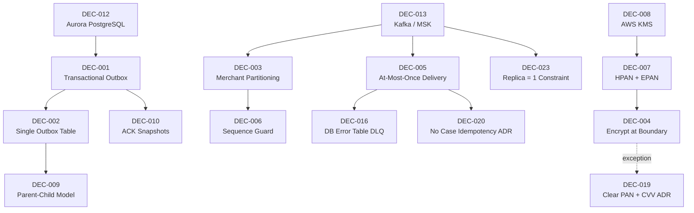

# WDP-DECISIONS.md
**Worldpay Dispute Platform — Architecture Decisions**
*Version: 2.2 | Reconciled: 2026-04-30*
*Source: v2.1 (2026-04-25) + 2026-04-28/29/30 source-verification reconciliation*
*Reconciled v2.2 entries: COMP-01, COMP-02, COMP-03, COMP-04, COMP-05, COMP-06, COMP-22, COMP-25, COMP-26, COMP-28, COMP-30, COMP-32, COMP-35, COMP-36, COMP-39, COMP-40, COMP-42, COMP-51*

---

## How to Read This Document

Each decision follows a consistent structure: the problem that forced the decision, what was chosen and why, what was rejected and why, and the lasting consequences.

Decisions are grouped into four tiers:

- **Tier 1 — Strategic**: Infrastructure and data strategy decisions made at inception. Effectively irreversible for the life of the platform.
- **Tier 2 — Platform patterns**: Processing and delivery patterns that all components are expected to follow. Deviations are explicitly recorded in Deviation Maps.
- **Tier 2 — Operational**: Structural and operational decisions confirmed from component-level analysis in April 2026.
- **Tier 3 — Risk and gap ADRs**: Formally documented exceptions, accepted risks, and known defects identified during the April 2026 component survey.

**Corrected decisions** carry a `⚠️ Corrected` marker and include a Deviation Map.

**Voided decisions** carry a `⛔ VOID` marker.

**Stage 3 proposals** carry a `⚠️ PROPOSED` marker. They have not been committed.

**v2.2 reconciliation:** Deviation maps for DEC-001, DEC-002, DEC-003, DEC-005, DEC-014, DEC-016, DEC-019, DEC-020, DEC-021, DEC-023 enriched with audit findings from the 18-entry source-verification pass. **DEC-008 narrative correction** (DEK rotation is days, not 6 hours). **DEC-019 expanded** to include CVV-at-rest as a third confirmed exception. **DEC-021 scope expansion** from 1 method to 7 methods + COMP-30 added as second offender. **No new DEC numbers introduced in v2.2** — new findings recorded as Candidate ADRs in Section "Candidate ADRs from Reconciliation Pass" pending architect promotion (37 new candidates, ADR-CAND-023 through ADR-CAND-059).

---

## Decision Registry

| ID | Decision | Tier | Status | Date |
|---|---|---|---|---|
| DEC-001 | Transactional Outbox for Event Delivery | 1 | ⚠️ Corrected — deviation map updated 2026-04-30 | Oct 2025 |
| DEC-002 | Single Outbox Table for Multiple Event Types | 2 | ⚠️ Refined — `wdp.outgoing_event_outbox` writers now 5 (2026-04-30) | Oct 2025 |
| DEC-003 | Merchant-Scoped Kafka Partitioning | 2 | ⚠️ Corrected — deviation map updated 2026-04-30 (COMP-04 per-endpoint) | Oct 2025 |
| DEC-004 | Encrypt PAN at the Ingestion Boundary | 1 | ⚠️ Corrected — column name + COMP-43 DB2 sibling 2026-04-25; CVV scope clarified 2026-04-30 | Oct 2025 |
| DEC-005 | At-Most-Once Delivery via Pre-Commit Offset | 2 | ⚠️ Reframed — deviation map updated 2026-04-30 | Oct 2025 |
| DEC-006 | Deferred Processing with Sequence Guard | 2 | ✅ Active (v1.6) | Oct 2025 |
| DEC-007 | Two-Token PAN Strategy (HPAN + EPAN) | 1 | ✅ Active | Oct 2025 |
| DEC-008 | AWS KMS for Key Management | 1 | ⚠️ Corrected — DEK rotation interval **days**, not 6 hours (2026-04-29) | Oct 2025 |
| DEC-009 | Parent-Child Outbox Model for Combined Files | 2 | ✅ Active | Oct 2025 |
| DEC-010 | Immutable Versioned ACK Snapshots | 2 | ✅ Active | Oct 2025 |
| DEC-011 | BRE Crash Recovery via Step Checkpointing | — | ⛔ VOID — confirmed never implemented | Nov 2025 |
| DEC-012 | Aurora PostgreSQL as Operational Database | 1 | ✅ Active | Oct 2025 |
| DEC-013 | Kafka (AWS MSK) as Event Streaming Platform | 1 | ✅ Active | Oct 2025 |
| DEC-014 | Resilience4j for Circuit Breaking | — | ⛔ VOID — evidence base extended to 38 source-verified components 2026-04-30 | Oct 2025 |
| DEC-016 | Database Error Table as Consumer DLQ | 2 | ⚠️ Refined — writers expanded; EXPIRY_BATCH terminal-write-only flagged 2026-04-30 | April 2026 |
| DEC-017 | BusinessRulesProcessor Reads Rules Directly from DB | 2 | ✅ Active | April 2026 |
| DEC-018 | RBAC Not Enforced in CaseActionService — Accepted Risk | 2 | ⚠️ Risk Accepted | April 2026 |
| DEC-019 | Clear PAN Written on Standard Case Creation — Accepted Risk | 1 | ⚠️ Risk Accepted — **CVV-at-rest exception added 2026-04-30 (COMP-04 + COMP-05)** | April 2026 |
| DEC-020 | No Idempotency on Case Creation — Accepted Risk | 2 | ⚠️ Risk Accepted — deviation map extended 2026-04-30 | April 2026 |
| DEC-021 | UAMS Wrong Transaction Manager — Known Defect | — | 🔴 Defect — **scope expanded 2026-04-30: 7 methods in COMP-02 + COMP-30 second offender** | April 2026 |
| DEC-022 | removeItemFromQueueDisabled Operational Safety Switch | 2 | ✅ Active | April 2026 |
| DEC-023 | Polling Batch Replica Count Fixed at 1 | 2 | ⚠️ Refined — extended to include COMP-06, COMP-51 (2026-04-30) | April 2026 |
| DEC-S3-1 to DEC-S3-6 | Stage 3 proposals | 3 | ⚠️ PROPOSED | Nov 2025 |
| DEC-015 | GraphQL for Merchant Portal API | 3 | ⚠️ PROPOSED | TBD |

---

## Dependency Map

---

## Tier 1 — Strategic Decisions

### DEC-012: Aurora PostgreSQL as the Operational Database

[Content unchanged from v2.1.]

⚠️ **Note (2026-04-23):** COMP-37 DocumentManagementService is the only WDP component using AWS S3 and DynamoDB as primary data stores.

⚠️ **Note (2026-04-28):** Three components use non-standard datasource patterns within the Aurora model:
- **COMP-26 QuestionnaireService** uses `DriverManagerDataSource` (no HikariCP, no application-tier pool). Every JPA call opens a new JDBC connection. Architect decision pending — see ADR-CAND-042.
- **COMP-32 RulesService** uses `DataSourceBuilder.create().build()` with no explicit pool tuning on either of two PostgreSQL datasources.
- **COMP-22 DisputeService** has unconfigured HikariCP pools on both datasources — Spring Boot defaults apply (`maximumPoolSize=10`).

---

### DEC-013: Kafka (AWS MSK) as the Event Streaming Platform

[Content unchanged from v2.1.]

⚠️ **Note (2026-04-25):** A second MSK cluster is operated by the BEN team and used by COMP-42 BENConsumer for outbound publish. Distinct bootstrap servers, separate `${ben_sasl_config}` SASL credentials. WDP does not own this cluster.

---

### DEC-007: Two-Token PAN Strategy (HPAN + EPAN)

[Content unchanged from v2.1.]

---

### DEC-008: AWS KMS for Key Management ⚠️ Corrected

**Context:** WDP must protect cardholder data with FIPS 140-2 Level 3 validated key storage and never permit raw key material to leave the HSM boundary.

**Decision:** AWS KMS with HSM-backed master keys. Data encryption keys (DEKs) are KMS-derived and stored encrypted in `wdp.data_enc_key`. Every encryption operation requires a KMS round-trip to decrypt the DEK before in-process AES encryption.

⚠️ **Correction (2026-04-29):** Prior platform documentation stated a "6-hour DEK cache" for COMP-35 EncryptionService. Source verification confirms this is incorrect. **The actual DEK rotation interval is days**, configured via `${dek_rotation_interval_days}`. The 6-hour figure must be removed from any document that references it (verified absent from WDP-NFRS.md v2.2 Section 2.3 "What no longer applies").

⚠️ **Note (2026-04-29) — KMS round-trip held inside `@Transactional`:** COMP-35 decrypt `@Transactional` boundary brackets the KMS network call. A Hikari connection is held during the KMS round-trip on every decrypt request. Pool-exhaustion risk under sustained decrypt load combined with KMS slowdown. See ADR-CAND-049 and RISK-172.

⚠️ **Note (2026-04-29) — Multi-pod DEK rotation race:** No distributed lock; concurrent COMP-35 pods may attempt DEK rotation simultaneously. Source code carries an explicit comment acknowledging this. See ADR-CAND-050 and RISK-173.

⚠️ **Note (2026-04-29) — Reuse-existing-DEK Base64 bug:** `rotateDEK()` reuse-existing-DEK branch passes `dek_enc` to KMS as raw UTF-8 bytes of the Base64 string instead of decoded ciphertext. Symptom only manifests on pod restart that finds a recent-enough DEK row to reuse. Failure is silently swallowed; pod starts with `initialized=false`. See RISK-171. (Implementation defect, not architecture; recorded here for cross-reference.)

**Consequences:** Decrypt latency target (< 75 ms P95 — see WDP-NFRS Section 1.3) is at risk under KMS slowdown given the in-`@Transactional` pattern. EncryptionService is a single global dependency for all PAN ingestion (COMP-07, COMP-08, COMP-09, COMP-11) — outage halts all PAN ingestion. See RISK-170.

---

### DEC-004: Encrypt PAN at the Ingestion Boundary ⚠️ Corrected

**Context:** WDP receives plaintext PAN from card networks and acquiring platforms. PAN must not be stored in plaintext in any persistent data store.

**Decision:** PAN is encrypted at the component that first receives it from an external system, before any database write. The encrypted form (EPAN) is what is stored.

**Confirmed implementations following this decision:**
- VisaDisputeBatch (COMP-07): encrypts PAN via EncryptionService before writing PENDING rows to `wdp.chbk_outbox_row`.
- FirstChargebackBatch (COMP-08): encrypts PAN via EncryptionService before writing PENDING rows to `wdp.chbk_outbox_row`.

**⚠️ Exception recorded — COMP-23 standard case creation (DEC-019, PostgreSQL):** *(unchanged from v2.1)*

**⚠️ Exception recorded — COMP-43 CORE platform (DEC-019 sibling, DB2):** *(unchanged from v2.1)*

**⚠️ Edge case — COMP-11 non-numeric `acctNum` branch:** *(unchanged from v2.1)*

**⚠️ Scope clarification (2026-04-30):** DEC-004 covers PAN. **PCI-DSS 3.2.1 separately prohibits storage of CVV (CVV2/CVC2/CID) after authorisation under any circumstance**, regardless of encryption status. Two confirmed CVV violations are now recorded under DEC-019 as a separate exception class — see DEC-019 below.

**⚠️ Read-only-service attestation pattern (added 2026-04-30):** Four components are now confirmed clean for DEC-004 / DEC-019 by inspection: COMP-03 CHAS, COMP-28 DisplayCodeService, COMP-32 RulesService, COMP-40 VisaResponseQuestionnaire. Each returns zero matches across source for `pan` / `cardNumber` / `accountNumber` / `acctNum` / `primaryAccountNumber` / `cardNum` plus zero persistent writes (COMP-40 also zero writes). Recommend formalising this as a verifiable architecture-level attestation pattern — see ADR-CAND-056.

**Consequences:** Until DEC-019 is remediated for both PostgreSQL (COMP-23) and DB2 (COMP-43), clear PAN exists in `nap.case`, `wdp.CASE`, and `BC.TBC_DM_CASE` for cases that have not completed the enrichment flow. Database access controls on these columns are the interim protection. **(Added 2026-04-30)** CVV at rest in `NAP.DISPUTE_EVENT_CONSUMER_ERROR` and CVV in COMP-04 logs constitute a separate PCI-DSS 3.2.1 deficiency — see DEC-019.

---

## Tier 2 — Platform Patterns

### DEC-001: Transactional Outbox for Event Delivery ⚠️ Corrected

**Context:** WDP components that write to a database and then publish a Kafka event face a distributed consistency problem. A mechanism is needed to guarantee that both the database change and the event delivery either succeed or can be fully recovered.

**Decision:** Kafka events are published via a transactional outbox. The event payload is written to a database outbox table within the same transaction as the business data change. A separate relay process polls the outbox table and publishes confirmed rows to Kafka, marking them PUBLISHED on success.

**Outbox tables confirmed in use:** *(updated 2026-04-30)*

| Table | Owner / relay | Event types |
|---|---|---|
| `wdp.chbk_outbox_row` | COMP-12 InboundDisputeEventScheduler (Scheduler1 — relay) | Chargeback events from COMP-07, COMP-08, COMP-09, COMP-11; status transitions from COMP-14, COMP-15 |
| `wdp.bre_orchestration_outbox` | COMP-12 Scheduler 4 (relay) | BRE triggers (component=BUSINESS_RULES) and notification orchestration triggers (component=NOTIFICATION_ORCHESTRATOR) — shared table, routed by discriminator |
| `wdp.outgoing_event_outbox` | COMP-12 Scheduler3 (relay) | EXPIRY_EVENTS (COMP-17), GP_EVENTS (COMP-41), **BEN_EVENTS (COMP-42 — added 2026-04-30)**, CORE_EVENTS (COMP-43), **EXPIRY_BATCH (COMP-51 — added 2026-04-30, terminal-write-only ⚠️ no consumer)** |
| `wdp.file_evidence` | COMP-12 Scheduler5 (read-only error report) | Evidence file tracking only |

⚠️ **Refinement (2026-04-30) — `wdp.outgoing_event_outbox` is now a 5-channel shared outbox.** COMP-42 BEN_EVENTS and COMP-51 EXPIRY_BATCH were not in the v2.1 writers list. See DEC-002 refinement.

⚠️ **Refinement (2026-04-30) — `wdp.case_expiry` is shared between COMP-17 (writer half) and COMP-51 (reader half) of the Case Expiry Subsystem.** Coordination is **operational-only — no row-level lock, no version column, no SELECT FOR UPDATE**. See ADR-CAND-027 and RISK-091.

**⚠️ Deviation Map — components that do not follow strict outbox pattern:** *(updated 2026-04-30)*

| Component | Topic published | Pattern detail | DEC-001 status |
|---|---|---|---|
| **COMP-04 NAPDisputeEventService** *(refined 2026-04-29)* | `nap-dispute-events` | Direct publish on HTTP thread — no outbox. Source-verified: `kafkaTemplate.send(...).get()` blocking call inside `@Retryable`. Events lost between enrichment and broker ACK are unrecoverable. | ⛔ DEVIATES |
| **COMP-06 NAPDisputeDeclineBatch** *(added 2026-04-30, decommission-scope dampened)* | (no Kafka publish) | Direct REST POST to Case Actions API on the IDCL creation path — no outbox row written. Successful Case Actions POST followed by Spring Batch step-completion failure leaves action created externally but step incomplete. | ⛔ DEVIATES (severity-dampened) |
| COMP-15 EvidenceConsumer | business-rules | Synchronous publish inside `@Transactional` via `kafkaTemplate.send(...).get()` blocking on the future. Ghost-event window. | ⛔ DEVIATES |
| COMP-16 BusinessRulesProcessor | outgoing-events, internal-integration-events | Direct synchronous publish — no outbox. | ⛔ DEVIATES |
| COMP-18 NotificationOrchestrator | case-action-events, core-request-events, external-request-events | ⚠️ **PARTIAL** — `wdp.bre_orchestration_outbox` used as outbox, but **zero `@Transactional` annotations**. Four distinct write points are independent auto-commits. PUBLISHED orphans no automatic re-drive. | ⚠️ PARTIAL |
| COMP-19 AcceptService | internal-integration-events | Direct synchronous publish — no outbox. State permanently inconsistent on Kafka final failure. | ⛔ DEVIATES |
| COMP-20 ContestService | internal-integration-events | Direct synchronous publish — no outbox. | ⛔ DEVIATES |
| COMP-23 CaseManagementService | business-rules | **Kafka-before-commit pattern** — synchronous publish inside `@Transactional` BEFORE commit. | ⛔ DEVIATES |
| COMP-24 CaseActionService | business-rules, ActionEvent topic | ⚠️ **PARTIAL**. BRE publish IS inside `@Transactional`. **ActionEvent publish is OUTSIDE `@Transactional` on EP 2 / 8 / 9** when `napUpdateEvent=true` — genuine post-commit split-brain. | ⚠️ PARTIAL |
| **COMP-25 NotesService** *(refined 2026-04-28)* | business-rules | Synchronous publish inside `@Transactional` boundary, **per-event loop**. Mid-batch partial-failure produces deterministic Kafka-orphan events (K-1 events on topic, 0 rows in DB after rollback) — **not crash-only** as v2.1 implied. | ⛔ DEVIATES |
| COMP-37 DocumentManagementService | business-rules | Direct synchronous publish after DynamoDB write on primary upload paths. **Endpoint 11 questionnaire path mitigates with `@Transactional(rollbackOn=Exception.class)`** — partial mitigation, still no outbox. | ⛔ DEVIATES (PARTIAL on Endpoint 11) |
| COMP-43 CoreNotificationConsumer | (consumer side — `wdp.outgoing_event_outbox` repurposed as outbox) | Outbox INSERT on `wdpTransactionManager` commits **before** `coreDao.saveCoreCase` is invoked on `coreTransactionManager`. No XA. | ⛔ DEVIATES |
| COMP-17 CaseExpiryUpdateConsumer | (consumer side — `wdp.outgoing_event_outbox` repurposed as outbox) | Dual deviation: outbox repurposed as consumer-side audit/idempotency store; outbox INSERT and `case_expiry` write run in **separate** transactional boundaries. | ⚠️ PARTIAL |
| COMP-14 CaseCreationConsumer | (no producer) | **Zero `@Transactional` annotations anywhere.** Parent SUCCESS save and EVIDENCE_ATTACH child `saveAll` are independent auto-commits. | ⛔ DEVIATES (no transactions at all) |
| **COMP-22 DisputeService** *(closed 2026-04-28 — moved off deviation list)* | — | **Confirmed source-verified zero writes** — Kafka producer wired but commented out (commit `c29018cd`, 2025-08-08). Effectively Kafka-free at runtime. | ✅ NOT APPLICABLE |
| **COMP-42 BENConsumer** *(refined 2026-04-29)* | — (consumer side; outbound BEN publish to BEN-owned MSK cluster) | Pre-ACK consumer with `wdp.outgoing_event_outbox` (BEN_EVENTS) used as failure capture. PUBLISHED-orphan crash window Step 4 → Step 13 — same class as COMP-41. | ⛔ DEVIATES |
| **COMP-51 CaseExpiryProcessor** *(NEW added 2026-04-30)* | — (no Kafka publish) | Outbox INSERT and `wdp.case_expiry` DELETE share the Spring Batch chunk transaction (atomic by chunk boundary). Outbox writes `status=ERROR` direct (no PUBLISHED→FAILED transition); **no platform component currently confirmed to consume EXPIRY_BATCH rows**. | ✅ COMPLIES (chunk-transactional) but failure path orphan |

Direct synchronous Kafka publish remains the dominant producer pattern in WDP. The outbox pattern is implemented correctly only in the batch processing path (COMP-07, COMP-08, COMP-09 → `wdp.chbk_outbox_row`) and via COMP-12 relay schedulers. **Candidate ADR ADR-CAND-002 (formalise direct Kafka publish for case-level REST services)** stands.

---

### DEC-002: Single Outbox Table for Multiple Event Types ⚠️ Refined

**Context:** *(unchanged from v2.0).* Multiple event types may share a single outbox table when distinguished by a `channel_type` discriminator and processed by a single relay.

⚠️ **Refinement (2026-04-30) — `wdp.outgoing_event_outbox` is a 5-channel shared outbox:**

| `channel_type` | Writer | `created_by` | Relay |
|---|---|---|---|
| EXPIRY_EVENTS | COMP-17 CaseExpiryUpdateConsumer | WCSEEXPC | COMP-12 Scheduler3 |
| GP_EVENTS *(corrected from `GF_EVENTS` in v2.1)* | COMP-41 ThirdPartyNotificationConsumer | WNEC | COMP-12 Scheduler3 |
| **BEN_EVENTS *(added 2026-04-30)*** | COMP-42 BENConsumer | WBENC | COMP-12 Scheduler3 (filter behaviour TBC) |
| CORE_EVENTS | COMP-43 CoreNotificationConsumer | PCSECRTC | COMP-12 Scheduler3 |
| **EXPIRY_BATCH *(added 2026-04-30)*** | COMP-51 CaseExpiryProcessor | WCSEEXPB | ⚠️ **No platform component currently confirmed to consume these rows.** Scheduler3 reads only FAILED and PENDING_DEFERRED; COMP-51 writes status=ERROR direct. |

⚠️ **OQ-COMP41-1 widened (2026-04-30):** Does Scheduler3 read all five `channel_type` values consistently? Does it ever read PUBLISHED for any channel? Does it pick up EXPIRY_BATCH ERROR rows? Cross-component scan against COMP-12 source needed.

⚠️ **No DB-level UNIQUE constraint visible in any of the five repos** on the dedup composite key `(idempotency_id, channel_type, event_timestamp)`. DBA confirmation required — concurrent writers from different components produce a race window across pods.

---

### DEC-003: Merchant-Scoped Kafka Partitioning ⚠️ Corrected

**Context:** WDP processes multiple concurrent events for the same merchant. Without partition key discipline, events may land on different partitions and be processed by different consumer instances, causing out-of-order execution.

**Decision:** `merchantId` is the stated Kafka partition key for all WDP topics.

**⚠️ Deviation Map — confirmed partition key deviations (updated 2026-04-30):**

| Component | Topic published | Partition key used | Status |
|---|---|---|---|
| COMP-12 → COMP-14 path | new-case-events | Compound `networkCaseId+cardNetwork+platform` | ⛔ DEVIATES |
| COMP-12 Scheduler4 | business-rules | `caseNumber` | ⛔ DEVIATES |
| COMP-15 EvidenceConsumer | business-rules | `caseNumber` | ⛔ DEVIATES |
| COMP-23 CaseManagementService | business-rules | `caseNumber` | ⛔ DEVIATES |
| COMP-24 CaseActionService | business-rules | `caseNumber` | ⛔ DEVIATES |
| COMP-25 NotesService | business-rules | `caseNumber` | ⛔ DEVIATES |
| COMP-37 DocumentManagementService | business-rules | `caseNumber` | ⛔ DEVIATES |
| COMP-18 NotificationOrchestrator | outbound topics | Pass-through `KafkaHeaders.RECEIVED_KEY` | ⚠️ inherits upstream key |
| **COMP-04 NAPDisputeEventService *(added 2026-04-29)*** | `nap-dispute-events` | **Per-endpoint variation:** `merchantId` on case-update and outcome paths; `cardAcceptorCodeId` on POST `/event` (new-dispute path) only. | ⛔ DEVIATES (intra-component) |
| **COMP-42 BENConsumer *(added 2026-04-29)*** | (BEN-owned topic on BEN MSK cluster) | `merchantId` from `CaseSearchResponse` | ✅ COMPLIES |

**Uniform `caseNumber` deviation on `business-rules`:** All six confirmed publishers of `business-rules` use `caseNumber`. The deviation is uniform and is no longer "whether to deviate" but whether to formally update DEC-003 to recognise case-scoped ordering on this topic. See ADR-CAND-010.

**Per-endpoint deviation in COMP-04:** Adds a new pattern class — same component publishing to the same topic with different keys depending on endpoint. Architect decision required: is this an intentional ordering optimisation (new-dispute events ordered by terminal vs subsequent-action events ordered by merchant) or accidental drift?

---

### DEC-005: At-Most-Once Delivery via Pre-Commit Offset ⚠️ Reframed

**Context:** *(unchanged).* WDP commits Kafka offsets before processing the message. A pod crash after commit and before processing completes loses the event permanently.

**⚠️ Confirmed consumer pattern map (updated 2026-04-30):**

| Component | Topic | Pattern |
|---|---|---|
| COMP-14 CaseCreationConsumer | new-case-events | Pre-ACK at `KafkaConsumer.java:38` precedes processing at `:43` |
| COMP-15 EvidenceConsumer | case-evidence-events | Pre-ACK |
| COMP-16 BusinessRulesProcessor | business-rules | Pre-ACK at `KafkaConsumer.java:38`; processing at `:41` |
| COMP-17 CaseExpiryUpdateConsumer | case-action-events | Pre-ACK with poison-message rebalance loop hazard |
| COMP-18 NotificationOrchestrator | outgoing-events | Mid-flow ACK — single ACK call site after Step 3d outbox INSERT, before all Step 7 publishes |
| COMP-39 NAPOutcomeProcessor | internal-integration-events | Pre-ACK *(2026-04-29 confirmed: single `@KafkaListener`; therefore NOT consumer of COMP-24's `${kafka.topic}` ActionEvent topic)* |
| COMP-40 VisaResponseQuestionnaire | internal-integration-events | Pre-ACK; AckMode `MANUAL_IMMEDIATE`; concurrency=1 |
| COMP-41 ThirdPartyNotificationConsumer | external-request-events | Pre-Signifyd ACK |
| COMP-42 BENConsumer | external-request-events | Pre-ACK after idempotency DB check |
| COMP-43 CoreNotificationConsumer | core-request-events | Pre-ACK on all paths |
| **COMP-05 NAPDisputeEventProcessor *(added 2026-04-29)*** | `nap-dispute-events` | Pre-ACK confirmed: `acknowledgment.acknowledge()` is FIRST call in listener. Does NOT read `idempotency-key` Kafka header — no inbound dedup. DEC-020 deviation confirmed. |

**⚠️ Compounding risk (RISK-025) — Empty `CommonErrorHandler{}` silent swallow:** *(extended 2026-04-30)* Now confirmed on **10 components**: COMP-05, COMP-14, COMP-15, COMP-16, COMP-17, COMP-18, COMP-39, COMP-40, COMP-41, COMP-42, COMP-43. Combined with `ErrorHandlingDeserializer` and pre-ACK, deserialisation exceptions are silently swallowed — distinct silent-loss class from the pre-ACK offset window. See ADR-CAND-003.

**⚠️ Notable exception — COMP-23 CaseManagementService (kafka-before-commit pattern):** *(unchanged)*

**Consequences:** *(unchanged)* No Kafka DLQ topics exist in WDP. Database error tables are the compensating mechanism (DEC-016). Idempotency must be added to all downstream services before delivery model can change.

---

### DEC-006: Deferred Processing with Sequence Guard for Concurrent Updates

[Content unchanged from v2.1 plus the COMP-17 cross-action note.]

---

### DEC-009: Parent-Child Outbox Model for Combined Files

[Content unchanged from v2.1.]

---

### DEC-010: Immutable Versioned ACK Snapshots

[Content unchanged from v2.1 plus the file_job COMPLETED contract gap note. ADR-CAND-017 / RISK-088 stands.]

---

## Tier 2 — Operational and Structural Decisions

### DEC-016: Database Error Table as Consumer DLQ ⚠️ Refined

**Context:** Kafka consumers that fail to process a message need an error-visibility and recovery mechanism.

**Decision:** WDP uses database error tables as the consumer error-visibility mechanism. No Kafka DLQ topics exist anywhere in the platform.

**Known implementations (updated 2026-04-30):**

| Error store | Writers (with discriminator) | Notes |
|---|---|---|
| `NAP.DISPUTE_EVENT_CONSUMER_ERROR` | **Four writers confirmed (2026-04-29):** COMP-05 (primary, `OUT_*` event types from this component), COMP-23 (NAP create path blind-merge), COMP-24 (NAP conditional outbox), **COMP-39** (manual reprocess + outbound NAP write — `OUT_SRV118`, `OUT_SRV117`). Discriminator: `C_ACQ_PLATFORM` (`"NAP"` constant) + `C_EVENT_TYPE`. | 🔴 **Cross-component shared-table consumption hazard (RISK-085 / ADR-CAND-024)** — both COMP-05 and COMP-39 prior-error scans query without `C_EVENT_TYPE` filter; rows written by either consumer (plus COMP-23 / COMP-24) may be reprocessed through the wrong outbound pipeline. |
| `wdp.outgoing_event_outbox` (5-channel) | COMP-17 (EXPIRY_EVENTS), COMP-41 (GP_EVENTS), COMP-42 (BEN_EVENTS), COMP-43 (CORE_EVENTS), COMP-51 (EXPIRY_BATCH — terminal-write-only) | Single relay (COMP-12 Scheduler3); see DEC-002 refinement |
| `wdp.bre_orchestration_outbox` | COMP-18 (NOTIFICATION_ORCHESTRATOR rows), COMP-12 Scheduler4 (BUSINESS_RULES rows) | Shared, routed by component discriminator |
| `wdp.chbk_outbox_row` | COMP-14 (status transitions only — no row INSERT), COMP-15 (status transitions) | |
| **`NAP.BUSINESS_RULE_CONSUMER_ERROR`** *(added 2026-04-29)* | COMP-05 (additional) | Fourth NAP-schema error table for COMP-05; not in v1.0 |
| REST SNOTE via NotesService (no DB table) | COMP-16 BusinessRulesProcessor | Weaker error-visibility — if SNOTE REST call also fails, error is silently lost |

⚠️ **Orphan-path gaps (extended 2026-04-30):**
- **PUBLISHED-status orphans on `wdp.outgoing_event_outbox`** are invisible to COMP-12 Scheduler3 if Scheduler3 reads only FAILED and PENDING_DEFERRED. COMP-41 has three distinct PUBLISHED-orphan paths; COMP-43 has a silent-loss window between ACK and FAILED-write. **COMP-42 adds a fourth class:** PUBLISHED-orphan crash window Step 4 → Step 13 (same class as COMP-41).
- **EXPIRY_BATCH outbox channel is terminal-write-only (RISK-090 / ADR-CAND-026):** COMP-51 writes failure rows at `status=ERROR` direct (no PUBLISHED→FAILED transition); Scheduler3 reads only FAILED and PENDING_DEFERRED — so EXPIRY_BATCH rows have **no platform consumer**. Architect decision required: define consumer or accept as audit-only sink.
- **Cross-component shared-error-table consumption (RISK-085 / ADR-CAND-024):** COMP-05 and COMP-39 both scan `NAP.DISPUTE_EVENT_CONSUMER_ERROR` without `C_EVENT_TYPE` filter. Decision needed on uniform recovery model.

**Confirmation pending:** OQ-COMP41-1 (Scheduler3 reads PUBLISHED?) extended to OQ-COMP41-1-Wide (Scheduler3 channel_type filter behaviour for all 5 channels).

**Consequences:** Error recovery requires manual intervention. There is no automatic re-drive mechanism for PUBLISHED-orphan rows or for EXPIRY_BATCH ERROR rows. Operations teams must identify failed records, resolve the root cause, and manually trigger reprocessing.

---

### DEC-017: BusinessRulesProcessor Reads Rules Directly from the Database

[Content unchanged from v2.1.]

---

### DEC-022: removeItemFromQueueDisabled Operational Safety Switch

[Content unchanged from v2.1.]

---

### DEC-023: Polling Batch Replica Count Fixed at 1 ⚠️ Refined 2026-04-30

**Context:** Multiple WDP components are Kubernetes Deployments that process work using a sequential, single-threaded model with no code-level concurrency guard.

**Decision:** Affected components must run with exactly `replica = 1`. Running more than one replica is unsafe and is a hard constraint.

**Affected components (extended 2026-04-30):**

| Component | Workload pattern | Code-level concurrency guard |
|---|---|---|
| COMP-07 VisaDisputeBatch | Polls Visa RTSI external queue | None |
| COMP-08 FirstChargebackBatch | Polls MCM external queue | None |
| COMP-09 CaseFillingBatch | Polls MCM external queue | None |
| **COMP-06 NAPDisputeDeclineBatch *(added 2026-04-30)*** | `@Scheduled` cron polling `nap.action`; calls Visa Adapter HyperSearch | None — same operational-only pattern as COMP-07/08/09 |
| **COMP-51 CaseExpiryProcessor *(added 2026-04-30)*** | `@Scheduled` cron scanning `wdp.case_expiry` | None — no `@SchedulerLock`, no ShedLock, no advisory lock |
| COMP-12 InboundDisputeEventScheduler | Five internal schedulers in one Deployment | None — replicas > 1 produces guaranteed duplicate Kafka publishes (RISK-038 🔴 CRITICAL) |
| **COMP-39 NAPOutcomeProcessor *(added 2026-04-30, qualifier)*** | Kafka consumer with `concurrency=1` | Concurrency=1 is intentional or default-by-omission — open question |

**Why:** Two replicas would each process the same items. External queue acknowledgement and WDP database state are not atomic.

⚠️ **Operational-only enforcement (refined 2026-04-30):** Across all confirmed components, there is **no code-level concurrency guard** — no `@SchedulerLock`, no advisory lock, no `SELECT FOR UPDATE`, no `synchronized` guard, no Kubernetes admission webhook, no HPA configuration protecting this. Replica = 1 is **policy, not enforced by code anywhere**. Any Helm values change, HPA accident, or emergency scaling action that sets replicas > 1 begins duplicate processing immediately with no alerting. **ADR-CAND-019 stands** — formalise the "no code-level concurrency guard" pattern.

**Consequences:** Horizontal scaling is not available for these components. Throughput is bounded by single-instance processing speed.

---

### DEC-NEW-CANDIDATE — Stateless Kafka Consumer Multi-Replica Pattern

⚠️ **(2026-04-29 — clarification surfaced from COMP-40):** COMP-40 VisaResponseQuestionnaire documents an explicit "DEC-023 NOT APPLICABLE" pattern that is worth recording: **stateless Kafka consumers with `concurrency=1` per pod and at-most-once delivery (DEC-005)** can scale to multiple replicas safely because partition assignment distributes work and pre-ACK eliminates duplication risk. Same pattern applies to COMP-14, COMP-15, COMP-16, COMP-17, COMP-18, COMP-39, COMP-41, COMP-42, COMP-43, COMP-51 (the latter is batch, not Kafka — does not qualify).

**Recommendation:** Recognise this as a verifiable architectural attestation pattern alongside DEC-023. Stateless consumers should explicitly attest "DEC-023 NOT APPLICABLE — partition-assignment-based work distribution" rather than be silent. See ADR-CAND-056-class formalisation.

---

## Tier 3 — Risk and Gap ADRs

### DEC-018: RBAC Not Enforced in CaseActionService — Accepted Risk

[Content unchanged from v2.1.]

⚠️ **Note (2026-04-29):** COMP-02 UAMS confirmed second offender of the **programmatic-only RBAC posture** — no method-level Spring Security annotations; programmatic-only authorization with regression risk on every new endpoint. See ADR-CAND-053 for sibling-class formalisation.

---

### DEC-019: Clear PAN and CVV Storage — Accepted Risk (DEC-004 Exception) ⚠️ EXPANDED 2026-04-30

**Context:** DEC-004 requires PAN to be encrypted at the ingestion boundary before any persistent write. PCI-DSS 3.2.1 separately requires that CVV (CVV2/CVC2/CID) **not be stored after authorisation under any circumstance**, regardless of encryption status.

**Confirmed exceptions:**

**(1) PostgreSQL — COMP-23 standard case creation:** *(unchanged from v2.1)* `POST /{platform}/case` writes the card number in clear text to `nap.case.I_ACCT_CDH` and `wdp.CASE.I_ACCT_CDH`. PAN encryption in COMP-23 only occurs during the transaction enrichment flow.

**(2) DB2 — COMP-43 CORE platform CREATE path:** *(unchanged from v2.1)* CoreNotificationConsumer writes clear PAN to `BC.TBC_DM_CASE.I_ACCT_CDH` on Step 7 CREATE + `actionSequence=01` path.

**(3) 🔴 NEW — CVV at rest in COMP-05 + CVV in logs from COMP-04 *(added 2026-04-30)*:**

This is a **NEW MATERIAL DEFICIENCY** under PCI-DSS 3.2.1 Requirement 3.2 (prohibits CVV storage after authorisation under any circumstance). Two cross-linked findings:

- **COMP-05 NAPDisputeEventProcessor — CVV at rest in error table.** `NAP.DISPUTE_EVENT_CONSUMER_ERROR` persists CVV in **two** places per error row: the `C_CVV` column directly mapped on the entity, AND inside `C_KAFKA_EVENT` raw JSON which retains the inbound `cvv` field. Every NAP dispute event that fails primary processing produces a row with CVV on disk.
- **COMP-04 NAPDisputeEventService — CVV in logs.** `NapEvent.toString()` is generated by Lombok and surfaces the `cvv` field. The service logs the outbound event at INFO immediately before Kafka publish. Every published NAP event produces a log line containing CVV. Checkmarx sanitizer is invoked but does not strip the field. (See also COMP-04 base64 file content in `UploadDocumentRequest.toString()` — same family but distinct from CVV — covered by RISK-116.)

**Together these constitute a CVV-on-disk path:** published events are logged with CVV; failed events persist CVV in error tables; both feed downstream log aggregation pipelines that themselves persist for audit.

**Risk:** PCI-DSS 3.2.1 active scope — material deficiency, regardless of access controls.

**Decision:** Architect decision required. Two paths:
- **Remediate** (clear `C_CVV` column on insert in COMP-05; redact `C_KAFKA_EVENT` JSON; remove `toString()` from logging surface in COMP-04; enforce log scrubbing on Logstash side).
- **Document approved exception** with compensating controls.

This is **structurally distinct from PAN-clear** (DEC-019 (1) and (2)) because PCI-DSS does permit encrypted PAN storage with controls, but PCI-DSS does NOT permit CVV storage in any form post-authorisation. Encryption does not make CVV-at-rest compliant.

**Related — COMP-21 in-flight PAN surface (RISK-051):** *(unchanged)*

---

### DEC-020: No Idempotency on Case Creation — Accepted Risk

**Context:** *(unchanged).*

**Decision:** Accepted as a known risk, contingent on the platform's at-most-once delivery model (DEC-005).

⚠️ **`idempotency-key` header void — extended map (2026-04-30):** Source verification confirmed that the `idempotency-key` header is captured but **never used for deduplication at any write site**. Extended list:

| Component | Header behaviour |
|---|---|
| COMP-23 | header captured, no seen-key store |
| COMP-24 | captured by HttpInterceptor, forwarded to Kafka, no validation |
| COMP-37 | propagated as outbound Kafka record header, never used for dedup |
| COMP-15 | forwarded inbound to outbound; nulls pass through |
| COMP-16 | passed through to outgoing event; not used for duplicate detection |
| COMP-17 | composite-key component on Path B only; Path A bypasses dedup |
| **COMP-02** *(added 2026-04-29)* | 6 write endpoint families with no idempotency-key contract; application-level SELECT-then-INSERT only |
| **COMP-04** *(added 2026-04-29)* | No application-level inbound idempotency at all; duplicate POSTs produce duplicate Kafka events; producer idempotence does not span separate inbound HTTP requests |
| **COMP-05** *(added 2026-04-29)* | Does NOT read `idempotency-key` Kafka header; no inbound dedup; no DB UNIQUE on the error table |
| **COMP-06** *(added 2026-04-30)* | No idempotency guard; `nap.action` not flipped after processing; duplicate IDCL drafts possible on re-run within `${past_days}` window |
| **COMP-22** *(added 2026-04-28)* | No idempotency on `POST /documents`; network-retried uploads re-upload, re-transfer ownership, re-publish metadata |
| **COMP-25** *(refined 2026-04-28)* | `idempotency-key` forwarded on Kafka header but never checked. Replays produce N additional rows AND N additional Kafka events |
| **COMP-26** *(added 2026-04-28)* | No application-level pre-existing-row check, no DB-level UNIQUE visible. POST and B1 UPSERT both have race windows |
| **COMP-30** *(added 2026-04-28)* | No `@UniqueConstraint` on any owned table. POST `/{region}/queue` has confirmed app-level race window |

**Critical dependency on DEC-005:** *(unchanged)*

**Remediation path:** *(unchanged)* — DB UNIQUE constraint on composite natural keys + caller-supplied `Idempotency-Key` would enforce idempotency at the database level.

**Candidate ADR ADR-CAND-011 stands** — formalise `idempotency-key` header void OR mandate header-driven dedup on all write endpoints.

---

### DEC-021: UAMS Wrong Transaction Manager — 🔴 Known Defect ⚠️ SCOPE EXPANDED 2026-04-30

**Context:** UAMS (COMP-02) writes to NAP-schema tables (`nap_parent_entity`, `nap_child_entity`, `nap_merchant`, `nap_entity_rel`) but configures these writes to bind to the WDP transaction manager. NAP writes therefore commit per-save without participating in a NAP-side transactional boundary.

**Decision:** Recorded as a known defect pending remediation.

⚠️ **Scope expansion (2026-04-29):** Source verification confirmed the defect is **not a single-method issue** as v2.0/v2.1 implied. **Seven methods across four NAP tables in COMP-02 are affected:**

| Method | NAP table(s) written | Wrong-TM pattern |
|---|---|---|
| `saveChildWithMerchant` *(originally documented)* | `nap_child_entity`, `nap_merchant`, `nap_entity_rel` | All three writes commit per-save under `wdpTransactionManager` |
| `createEntity` *(added 2026-04-29)* | `nap_parent_entity`, `nap_child_entity`, `nap_entity_rel` | Same pattern |
| `updateEntity` *(added 2026-04-29)* | `nap_parent_entity`, `nap_child_entity` | Same pattern (also has separate NPE defect — see RISK-100) |
| `updateMerchantRelationships` *(added 2026-04-29)* | `nap_merchant`, `nap_entity_rel` | Same pattern |
| `deleteMerchantByParent` *(added 2026-04-29)* | `nap_merchant`, `nap_entity_rel` | Same pattern |
| `deleteChildEntity` *(added 2026-04-29)* | `nap_child_entity`, `nap_merchant`, `nap_entity_rel` | Same pattern |
| `deleteParentEntity` *(added 2026-04-29)* | `nap_parent_entity`, `nap_child_entity`, `nap_merchant`, `nap_entity_rel` | Same pattern |

Affected NAP tables (4): `nap_parent_entity`, `nap_child_entity`, `nap_merchant`, `nap_entity_rel`. **Cross-schema partial-failure is possible on every multi-table NAP write in UAMS, not just the originally-documented method.**

⚠️ **Second offender confirmed (2026-04-28) — COMP-30 UserQueueSkillService:** Service-level `@Transactional` on `createQueue` / `updateQueue` binds to `@Primary usTransactionManager` because the annotation has no explicit `transactionManager` attribute. UK writes to `nap.queues`, `nap.queue_criterion`, `nap.user_queue` are NOT covered by the outer TX. Same root cause class as COMP-02. The pattern is **`jakarta.transaction.Transactional` default-bean-selection silently picks `@Primary`** in dual-datasource components.

**Severity:** 🔴 HIGH (promoted from v2.1 implication of single-method scope; aligns with RISK-010 promotion in WDP-NFRS.md v2.2).

**Remediation options:**
- (a) per-method `@Transactional("napTransactionManager")` qualifier on the affected methods
- (b) `ChainedTransactionManager` on affected service methods (synchronisation only, not XA)
- (c) service-per-datasource decomposition

⚠️ **Open question OQ-COMP-02-11** *(2026-04-29)*: Is the wrong-TM scope expansion a regression or has it always been there? Git blame inspection needed.

⚠️ **Platform-level ADR candidate ADR-CAND-033** — formalise multi-datasource service-level `@Transactional` binding contract: explicit `transactionManager` attribute mandatory, OR `@Qualifier`-bound annotations, OR service-per-datasource decomposition. Applies platform-wide to any future component with two or more datasources.

---

## Voided Decisions

### DEC-011: BRE Crash Recovery via Step Checkpointing ⛔ VOID

[Content unchanged from v2.1.]

---

### DEC-014: Resilience4j for Circuit Breaking ⛔ VOID ⚠️ Evidence base extended 2026-04-30

[Content unchanged from v2.1.]

⚠️ **Strengthened evidence (extended 2026-04-30):** The void is now confirmed across **all 38 source-verified components**. Negative-evidence pattern (zero `io.github.resilience4j` artefacts; zero `@CircuitBreaker` / `@Bulkhead` / `@RateLimiter` / `@TimeLimiter`; zero JDBC socket / query / connection timeouts; zero RestTemplate timeouts) is consistent across:

- **From v2.1:** COMP-21 (38 unprotected sites — strongest single-component evidence).
- **Added 2026-04-28:** COMP-22 (zero timeouts on six dependencies, zero circuit breakers, HikariCP and Tomcat at defaults), COMP-25 (no RestTemplate bean — `new RestTemplate()` per call), COMP-26 (outbound REST to `case-actions-service` has no connect/read timeout, no retry, no circuit breaker), COMP-28, COMP-30 (five outbound REST integrations share one `new RestTemplate()` with no timeouts), COMP-32 (no socket timeout on either datasource).
- **Added 2026-04-29:** COMP-02 (bare RestTemplate for IdP and S3, no timeout config), COMP-03 (no JDBC query timeout — neither datasource has socket/query/connection timeout beyond HikariCP pool acquisition default), COMP-04 (3 RestTemplate instances all default-constructor; one shadowed locally), COMP-05 (bare RestTemplate, no timeouts on 11 outbound REST calls), COMP-35 (KMS round-trip held inside `@Transactional`), COMP-39 (RestTemplate without timeouts on single-thread consumer + 8 outbound REST hops), COMP-42 (six outbound dependencies, no read/connect timeout configured).
- **Added 2026-04-30:** COMP-01 (blocking RestTemplate on Netty event-loop with no timeout — single degraded auth service exhausts gateway threads — see ADR-CAND-028), COMP-06 (no RestTemplate timeouts), COMP-51 (handles 7 distinct upstream services with no timeouts).

⚠️ **Adjacent dead code (refined 2026-04-29):** Spring Retry imports are dead code or transitive in multiple components:
- COMP-41 imports `@Retryable` / `@Backoff` but never applies them (RISK-080).
- COMP-42 spring-retry is transitive via spring-kafka — not declared in pom.xml (same risk class as COMP-41).
- COMP-51 `spring-retry` is on classpath but **unused** — uses hand-rolled retry counter persistence on `wdp.case_expiry` (`i_retry_count`) instead. See ADR-CAND-055.

---

## Superseded Decisions

### DEC-006-v1.0: Initial Deferred Update Design ❌ Superseded (Oct 2025)

[Content unchanged from v2.1.]

---

## Stage 3 Proposals

[All Stage 3 proposals — DEC-S3-1 through DEC-S3-6, DEC-015 — unchanged from v2.1.]

---

## Candidate ADRs from Reconciliation Pass (2026-04-25 + 2026-04-30)

The following candidates emerged from source-verification reconciliation. None are committed — they require architect review and formal ADR adoption. Each candidate references the underlying RISK row(s) in WDP-NFRS.md.

### Severity-ranked candidate list

#### Phase 2 candidates (April 2026 — from v2.1 reconciliation, unchanged)

| Candidate ID | Severity | Title | Affected components | Linked RISK(s) |
|--------------|----------|-------|---------------------|----------------|
| ADR-CAND-001 | 🔴 HIGH | Formalise AcceptService NAP split-brain — accept-and-document or fail-close | COMP-19 | RISK-028 |
| ADR-CAND-002 | 🔴 HIGH | "Direct Kafka publish for case-level REST services" — formal accept or remediate | COMP-19, 20, 23, 24, 25, 37 | RISK-018 + DEC-001 deviations |
| ADR-CAND-003 | 🔴 HIGH | Empty `CommonErrorHandler{}` platform pattern — formal accept or platform-wide replacement | COMP-05, 14, 15, 16, 17, 18, 39, 40, 41, 42, 43 *(extended 2026-04-30)* | RISK-025 |
| ADR-CAND-004 | 🔴 HIGH | COMP-43 DB2 clear PAN — extend DEC-019 or remediate | COMP-43 | RISK-035 |
| ADR-CAND-005 | 🔴 HIGH | Batch writer/ACK silent exception swallow — invisible DB save failures | COMP-07, 08, 09 | RISK-052, RISK-053 |
| ADR-CAND-006 | 🟠 HIGH | Skip paths write no audit row in polling batches — invisible drops | COMP-07, 08, 09 | RISK-063 |
| ADR-CAND-007 | 🟠 HIGH | No K8s probes on long-running components — kubelet cannot evict hung pods | COMP-07, 08, 09, 11, 12, 14, 17, 39, 41, 42, 43, 51 *(extended 2026-04-30)* | RISK-024 |
| ADR-CAND-008 | 🟡 MEDIUM | "Kafka-before-commit" pattern naming | COMP-23, 15, 25, 24, 19, 20 | DEC-001 deviation map |
| ADR-CAND-009 | 🟡 MEDIUM | `@Transactional(rollbackOn=Exception.class)` stopgap atomicity pattern | COMP-37 (Endpoint 11) | DEC-001 deviation map |
| ADR-CAND-010 | 🟡 MEDIUM | `business-rules` partition key formalisation | All 6 publishers | DEC-003 deviation map |
| ADR-CAND-011 | 🟡 MEDIUM | `idempotency-key` header void — formalise unused-but-propagated status | Platform-wide (now 13 components) | DEC-020 refinement |
| ADR-CAND-012 | 🟡 MEDIUM | Mark-and-send within `@Transactional` outbox-relay pattern | COMP-12 | DEC-005 reframing |
| ADR-CAND-013 | 🟡 MEDIUM | IDP token caching contract | COMP-21, **COMP-26**, **COMP-40** *(extended 2026-04-30)* | RISK-026 |
| ADR-CAND-014 | 🟡 MEDIUM | Async executor sizing minimum | COMP-21 (template) | RISK-026 |
| ADR-CAND-015 | 🟡 MEDIUM | Shared `RestTemplate` immutability contract | COMP-21, 23, 15 | RISK-049, 066 |
| ADR-CAND-016 | 🟡 MEDIUM | Cross-component blind-merge into table owned by another component | COMP-23 → COMP-05-owned table | RISK-033 |
| ADR-CAND-017 | 🟡 MEDIUM | `file_job` COMPLETED transition ownership contract | COMP-11 / 12 / 13 | RISK-088 |
| ADR-CAND-018 | 🟡 MEDIUM | COMP-17 cross-action predecessor scope — case-level vs action-level | COMP-17 | RISK-045 |
| ADR-CAND-019 | 🟡 MEDIUM | No code-level concurrency guard on polling batches / singleton schedulers | COMP-07, 08, 09, 12, **06, 51** *(extended 2026-04-30)* | DEC-023 refinement, RISK-038 |
| ADR-CAND-020 | 🟡 MEDIUM | COMP-09 MCM acknowledgement | COMP-09 | Component file |
| ADR-CAND-021 | 🟢 LOW | Outbox rows are INSERT-only (never UPDATEd) by polling batches | COMP-07, 08, 09 | Component files |
| ADR-CAND-022 | 🟢 LOW | Inconsistent `v-correlation-id` propagation across REST invokers | COMP-09, 17, 43 | RISK-079 |

#### Phase 3 candidates (added 2026-04-30 from 18-component reconciliation)

| Candidate ID | Severity | Title | Affected components | Linked RISK(s) |
|--------------|----------|-------|---------------------|----------------|
| **ADR-CAND-023** | **🔴 HIGH** | **CVV-at-rest exception (PCI-DSS 3.2.1) — remediate or document approved exception** | **COMP-04 (logs), COMP-05 (persists)** | **RISK-084** |
| **ADR-CAND-024** | **🔴 HIGH** | **Shared error-table consumption rules — uniform `C_EVENT_TYPE` filter policy on `NAP.DISPUTE_EVENT_CONSUMER_ERROR`** | **COMP-05, COMP-39** | **RISK-085** |
| **ADR-CAND-025** | **🔴 HIGH** | **DEC-021 scope expansion remediation — 7 wrong-TM methods in COMP-02 + COMP-30 second offender (multi-datasource `@Transactional` binding)** | **COMP-02, COMP-30** | **RISK-010 (PROMOTED)** |
| **ADR-CAND-026** | **🔴 HIGH** | **EXPIRY_BATCH outbox channel terminal-write-only — define consumer or accept as audit-only sink** | **COMP-51, COMP-12** | **RISK-090** |
| **ADR-CAND-027** | **🟡 MEDIUM** | **Case Expiry Subsystem coordination — shared write to `wdp.case_expiry` between COMP-17 (writer) and COMP-51 (reader)** | **COMP-17, COMP-51** | **RISK-091** |
| **ADR-CAND-028** | **🔴 HIGH** | **COMP-01 blocking `RestTemplate` on Netty event-loop — migrate to `WebClient` or accept latency floor** | **COMP-01** | **RISK-093** |
| **ADR-CAND-029** | **🔴 HIGH** | **CORE/VAP/LATAM gateway authorization gap — these platform types receive no role-level or case-level authorization at gateway** | **COMP-01** | Section 3.4 EXCEPTION |
| **ADR-CAND-030** | **🟠 HIGH** | **`minReadySeconds` platform-wide remediation pass — eight components confirmed misplaced** | **COMP-03, 05, 08, 09, 12, 25, 26, 28, 34, 40** | **RISK-083** |
| **ADR-CAND-031** | **🔴 HIGH** | **COMP-04 unauthenticated SecurityConfig (`/**` permitAll) — Spring Security JWT validation or document infrastructure-layer-only auth** | **COMP-04** | **RISK-115** |
| **ADR-CAND-032** | **🔴 HIGH** | **Logging of inbound DTOs containing payload-bearing fields — Lombok `@Data` `toString()` exposes CVV, base64 file content** | **COMP-04 (NapEvent, UploadDocumentRequest)** | **RISK-114, RISK-116** |
| **ADR-CAND-033** | **🔴 HIGH** | **Multi-datasource service-level `@Transactional` binding contract — explicit `transactionManager` attribute mandatory** | **COMP-02, COMP-30** *(also future dual-datasource components)* | DEC-021 platform-wide |
| **ADR-CAND-034** | **🔴 HIGH** | **Side-effect-with-no-transaction pattern — multi-step write paths require `@Transactional` even when same datasource (COMP-30 POST `/user`)** | **COMP-30** | **RISK-153** |
| **ADR-CAND-035** | **🟡 MEDIUM** | **Decrypt `@Transactional` spans external KMS call — narrow TX or accept pool-exhaustion** | **COMP-35** | **RISK-172** |
| **ADR-CAND-036** | **🟡 MEDIUM** | **Multi-pod DEK rotation race accepted — formal acceptance or distributed lock** | **COMP-35** | **RISK-173** |
| **ADR-CAND-037** | **🟡 MEDIUM** | **Manual operator reprocess endpoint pattern — race coordination between Kafka prior-error scan and operator-driven REST** | **COMP-05, COMP-39** | **RISK-126, RISK-182** |
| **ADR-CAND-038** | **🟡 MEDIUM** | **3-layer authorization pattern formalisation (Spring Security JWT → internal-firm `iss` substring bypass → entity-scope check)** | **COMP-02 UAMS, COMP-03 CHAS** | Pattern formalisation |
| **ADR-CAND-039** | **🟡 MEDIUM** | **Programmatic-only RBAC posture extension (parallel to DEC-018 in COMP-24)** | **COMP-02** | DEC-018 sibling |
| **ADR-CAND-040** | **🟡 MEDIUM** | **Retry-config sharing across Kafka publish + REST dependencies — one env var should not silently retune three downstream contracts** | **COMP-04** | **RISK-117** |
| **ADR-CAND-041** | **🟡 MEDIUM** | **Pass-through degradation flag pattern — `enrichmentFailure` semantics: producer-set vs upstream-pass-through must be distinguishable** | **COMP-04** | Component file |
| **ADR-CAND-042** | **🟡 MEDIUM** | **COMP-26 `DriverManagerDataSource` posture — accepted local deviation (PgBouncer-fronted) or remediate to HikariCP** | **COMP-26** | **RISK-147** |
| **ADR-CAND-043** | **🔴 HIGH** | **COMP-26 no-`@Transactional` posture — accept TOCTOU exposure on PUT/B1 or introduce service-method-level transactions** | **COMP-26** | **RISK-145, RISK-146** |
| **ADR-CAND-044** | **🟡 MEDIUM** | **Mandatory `v-correlation-id` propagation contract on outbound REST calls** | **COMP-01, 17, 22, 27, 51** | **RISK-089** |
| **ADR-CAND-045** | **🟡 MEDIUM** | **Required env vars must declare YAML defaults `${var:default}` where startup is acceptable in unset case, otherwise startup-failure must be deliberate and documented** | **COMP-04, COMP-22, COMP-25** *(four env vars each in COMP-22)* | **RISK-117, RISK-137, RISK-141** |
| **ADR-CAND-046** | **🟡 MEDIUM** | **Cache-key normalisation contract — normalisation must occur in controller or via explicit `key` SpEL, never inside the cached method body** | **COMP-32** *(likely platform-wide)* | **RISK-168** |
| **ADR-CAND-047** | **🟡 MEDIUM** | **Endpoint-pair contract divergence — formal platform read-only-API contract for no-result-found responses** | **COMP-28 (permission shape), COMP-32 (no-rule-found shape)** | **RISK-149, RISK-167** |
| **ADR-CAND-048** | **🟡 MEDIUM** | **JWT claim-absence error contract — auth-claim absence must produce 4xx, not 5xx, for security-monitoring integrity** | **COMP-28, COMP-32** | **RISK-150, RISK-165** |
| **ADR-CAND-049** | **🟠 HIGH** | **COMP-32 `migrationStatus="N"` undocumented production migration kill-switch — runbook or remediation** | **COMP-32** | **RISK-164** |
| **ADR-CAND-050** | **🟡 MEDIUM** | **COMP-32 `/documentType` and `/eventRule` controller mappings commented out with full backing code intact — abandon (delete code + tables) or re-enable** | **COMP-32** | **RISK-169** |
| **ADR-CAND-051** | **🟡 MEDIUM** | **Logback configuration ownership — service-owned (in repo) or platform-owned (mounted at runtime)** | **COMP-30** *(also pattern-class with COMP-21 RISK-050)* | **RISK-161** |
| **ADR-CAND-052** | **🟡 MEDIUM** | **COMP-22 SFG SFTP filename namespacing — case-number / action-seq / timestamp prefix or accept collision risk** | **COMP-22** | **RISK-134** |
| **ADR-CAND-053** | **🟡 MEDIUM** | **Infrastructure-failure-vs-authorization-denial conflation — should infra faults surface as 5xx (e.g. 503) to distinguish them from genuine auth denials?** | **COMP-30** *(also COMP-02 NAP-DB outage class)* | **RISK-154, RISK-098** |
| **ADR-CAND-054** | **🟡 MEDIUM** | **`v-correlation-id` regenerated-per-call anti-pattern remediation — propagate from inbound or per-record** | **COMP-17, COMP-51** *(platform-wide remediation candidate)* | **RISK-089** |
| **ADR-CAND-055** | **🟡 MEDIUM** | **Hand-rolled retry counter persistence vs. spring-retry — formalise platform pattern or replace with uniform abstraction** | **COMP-51, COMP-07/08/09** | Component files |
| **ADR-CAND-056** | **🟢 LOW** | **Read-only service DEC-004/DEC-019 attestation pattern — formalise verifiable architecture-level compliance for components with no PAN field names and no persistent writes** | **COMP-03, COMP-28, COMP-32, COMP-40** *(positive pattern)* | DEC-004 / DEC-019 |
| **ADR-CAND-057** | **🟡 MEDIUM** | **Kafka-path MDC enrichment contract — Kafka listeners need equivalent of HttpInterceptor for log correlation** | **COMP-17, 18, 40, 43, 51** | Multiple component files |
| **ADR-CAND-058** | **🟢 LOW** | **COMP-22 Kafka publish disablement attribution — capture commit `c29018cd` rationale (Shringi Nitin, 2025-08-08, PR #93)** | **COMP-22** | RISK-021 (existing, refresh) |
| **ADR-CAND-059** | **🟡 MEDIUM** | **COMP-04 GUARPAY7 → TIER5 silent mapping — downstream consumers cannot distinguish GUARPAY5 from GUARPAY7** | **COMP-04** | **RISK-119** |

---

### Detailed candidate ADR — ADR-CAND-023: CVV-at-rest exception (PCI-DSS 3.2.1)

**Severity:** 🔴 HIGH — material PCI-DSS 3.2.1 deficiency
**Status:** Candidate — architect decision required

**Context:** Two cross-linked findings constitute a CVV-on-disk path:
1. **COMP-05** persists CVV in `NAP.DISPUTE_EVENT_CONSUMER_ERROR.C_CVV` and inside `C_KAFKA_EVENT` raw JSON.
2. **COMP-04** logs CVV via Lombok-generated `NapEvent.toString()` at INFO before Kafka publish.

PCI-DSS 3.2.1 Requirement 3.2 prohibits CVV storage after authorisation **regardless of encryption status**.

**Options:**
- **(a) Remediate** — clear `C_CVV` column on insert in COMP-05; redact `cvv` field from `C_KAFKA_EVENT` JSON before persist; remove `cvv` from `NapEvent.toString()` in COMP-04 (custom `toString()` or `@ToString.Exclude`); enforce log scrubbing on Logstash side as defence in depth.
- **(b) Document approved exception** with compensating controls (encrypted database access, log retention bounds, restricted query access).

**Recommendation:** Architect decision required. Same severity class as DEC-019 (1) and (2) but structurally distinct — encryption does not make CVV-at-rest compliant.

---

### Detailed candidate ADR — ADR-CAND-024: Shared error-table consumption rules

**Severity:** 🔴 HIGH
**Status:** Candidate — uniform decision required across COMP-05 and COMP-39

**Context:** `NAP.DISPUTE_EVENT_CONSUMER_ERROR` has **four writers** (COMP-05 primary, COMP-23 NAP create, COMP-24 NAP conditional, COMP-39 outbound NAP). Discriminator columns: `C_ACQ_PLATFORM` (`"NAP"`) + `C_EVENT_TYPE` (`OUT_SRV118`, `OUT_SRV117` for COMP-39 — different prefixes per writer).

**Both COMP-05 and COMP-39 prior-error scans query without `C_EVENT_TYPE` filter.** Rows written by either consumer (plus COMP-23 / COMP-24) may be reprocessed through the wrong outbound pipeline.

**Options:**
- **(a) Treat the table as a single platform-wide DLQ** — every co-writer's prior-error scan must coordinate on `C_EVENT_TYPE`; document the recovery contract per event-type prefix.
- **(b) Treat the missing `C_EVENT_TYPE` filter as a defect on both consumers** — remediate uniformly.

**Recommendation:** Architect decision. Decision must be **uniform** — COMP-05 and COMP-39 cannot adopt different policies on the same table.

---

### Detailed candidate ADR — ADR-CAND-025: DEC-021 scope expansion + multi-datasource binding contract

**Severity:** 🔴 HIGH
**Status:** Candidate — promotes existing DEC-021 + introduces platform contract

**Context:** Source verification 2026-04-29 confirmed DEC-021 is not a single-method defect. **Seven methods across four NAP tables in COMP-02** use `wdpTransactionManager` instead of `napTransactionManager`. **COMP-30** is the second offender — `@Transactional` without explicit `transactionManager` attribute binds to `@Primary` in dual-datasource components.

**Root cause:** `jakarta.transaction.Transactional` default-bean-selection silently picks `@Primary`. When a service has two transaction managers and the `@Primary` one is for one datasource, all `@Transactional` annotations without explicit qualifier silently bind to that datasource regardless of which datasource the underlying repository writes to.

**Options:**
- **(a) Per-method remediation** — explicit `@Transactional("napTransactionManager")` qualifier on the affected COMP-02 methods; explicit `@Transactional("ukTransactionManager")` on COMP-30 UK-side writes.
- **(b) `ChainedTransactionManager` synchronisation** on affected service methods (caveat: synchronisation only, not XA).
- **(c) Service-per-datasource decomposition** — the long-term clean answer; significant refactoring.
- **(d) Platform contract:** mandate explicit `transactionManager` attribute on every `@Transactional` in any service with two or more datasources, enforced via static analysis or build-time check.

**Recommendation:** Adopt (d) as platform contract; (a) for immediate COMP-02 / COMP-30 remediation under existing DEC-021 sprint.

---

### Detailed candidate ADR — ADR-CAND-026: EXPIRY_BATCH terminal-write-only

**Severity:** 🔴 HIGH
**Status:** Candidate — architect decision required

**Context:** COMP-51 CaseExpiryProcessor writes failure-capture rows to `wdp.outgoing_event_outbox` with:
- `channel_type = EXPIRY_BATCH` (distinct from COMP-17's `EXPIRY_EVENTS`)
- `created_by = WCSEEXPB` (distinct from COMP-17's `WCSEEXPC`)
- `status = ERROR` direct (no PUBLISHED → FAILED transition)

**COMP-12 Scheduler3 reads only `status IN (FAILED, PENDING_DEFERRED)`** — so EXPIRY_BATCH ERROR rows are terminal-write-only with no recovery path.

**Options:**
- **(a) Define an explicit consumer for EXPIRY_BATCH ERROR rows** — extend Scheduler3 to read this channel; OR add a new manual-operator reprocess endpoint (mirror of COMP-39 pattern).
- **(b) Formally accept the rows as audit-only sink** with no recovery semantics; document operator runbook for periodic review.

**Recommendation:** Architect decision. (b) is the lower-cost option but creates an operational dependency on manual review.

---

### Detailed candidate ADR — ADR-CAND-027: Case Expiry Subsystem coordination

**Severity:** 🟡 MEDIUM
**Status:** Candidate — architect decision required

**Context:** COMP-17 (Kafka consumer, writer half) and COMP-51 (scheduled batch, reader half) of the Case Expiry Subsystem share `wdp.case_expiry` as their coordination surface. Race conditions are possible:
- COMP-17 upsert may collide with COMP-51 retry-counter UPDATE.
- COMP-17 upsert may collide with COMP-51 success-path DELETE.
- COMP-51 retry-counter UPDATE may collide with concurrent COMP-51 chunk processing (mitigated by Replicas=1 operational policy — DEC-023).

**No row-level lock, no `@Version`, no `SELECT FOR UPDATE`** between COMP-17 and COMP-51.

**Options:**
- **(a) Accept-as-low-probability** — both components run replicas=1 by policy; cross-component races require COMP-17 message arrival within the COMP-51 chunk-processing window. Document the assumed low-probability and runbook for stuck rows.
- **(b) Optimistic locking** — add `@Version` column to `wdp.case_expiry`; require both components to handle `OptimisticLockException` retries.
- **(c) Pessimistic locking** — `SELECT FOR UPDATE` in COMP-51's chunk read; COMP-17 writes block until COMP-51 chunk commits.
- **(d) Advisory lock** — coordinate via PostgreSQL advisory lock per `caseNumber`.

**Recommendation:** Architect decision. (a) is operationally simplest; (b) is the cleanest software contract.

---

### Detailed candidate ADR — ADR-CAND-028: COMP-01 blocking RestTemplate on Netty event-loop

**Severity:** 🔴 HIGH
**Status:** Candidate — architect decision required

**Context:** API Gateway (COMP-01) is the platform's externally-visible entry point. It uses Spring Cloud Gateway on Netty (a reactive non-blocking framework), but `CaseNumberFilter` invokes UAMS and CHAS using **blocking `RestTemplate` on Netty event-loop threads with no timeout**. A single degraded auth service can exhaust all gateway threads.

**Blast radius:** the entire gateway. Once event-loop threads are exhausted, no merchant or internal traffic is processed.

**Options:**
- **(a) Migrate to `WebClient`** — fully reactive auth calls with explicit connect/read timeouts and circuit breaker. Aligned with Netty's threading model.
- **(b) Use a separate worker pool for blocking calls** — keep `RestTemplate` but offload to bounded thread pool, isolating Netty event-loop.
- **(c) Accept** — document the latency floor and operational mitigation (UAMS / CHAS replica scaling, monitoring on gateway thread exhaustion).

**Recommendation:** (a) is the architecturally correct fix; (b) is a faster stopgap; (c) is unsustainable for an externally-visible entry point.

---

### Detailed candidate ADR — ADR-CAND-030: minReadySeconds platform-wide remediation

**Severity:** 🟠 HIGH
**Status:** Candidate — DevOps remediation pass

**Context:** Eight components confirmed to place `minReadySeconds: 30` under `spec.template.spec` instead of `spec`:

COMP-03, COMP-05, COMP-08, COMP-09, COMP-12, COMP-25, COMP-26, COMP-28, COMP-34, COMP-40 *(actually 10 — list above expanded)*.

Kubernetes silently ignores the misplaced field. The intended 30-second rolling-update stability gate is **not actually applied** at runtime — pods become Ready as soon as the readiness probe passes, with no minimum stability window.

**Pattern is a copy-paste-class defect** — likely replicated across other WDP manifests not yet audited.

**Options:**
- **(a) Single platform-wide remediation pass** — DevOps sweep across all 50+ components; fix all instances at once. Add a manifest-lint rule to a CI/CD step to prevent regression.
- **(b) Per-component fix as part of normal deployment cycle** — slower, but lower coordination cost.

**Recommendation:** (a). The cost is low (template change + lint rule) and the benefit is significant (rolling-update protection actually applied). Lint rule is essential — without it the pattern will be re-introduced by the next manifest copy-paste.

---

### Other candidate ADRs (summary only)

For brevity, candidate ADRs not detailed above are listed in the table at the start of this section. Detailed analysis is captured in the relevant component file (WDP-COMP-NN-*.md) and in the corresponding RISK row in WDP-NFRS.md v2.2.

Detailed narrative was preserved from v2.1 for **ADR-CAND-001, ADR-CAND-002, ADR-CAND-005, ADR-CAND-007, ADR-CAND-008, ADR-CAND-010, ADR-CAND-012** (see WDP-DECISIONS.md v2.1).

---

## Constraints Shaping Future Decisions

Six constraints from committed decisions limit what future stages can do without re-architecture:

**MSK storage is one-directional.** Once provisioned Kafka storage is scaled up, it cannot be reduced.

**PAN handling is centralised.** Any future capability that needs the actual card number must call through EncryptionService (COMP-35). The clear PAN exceptions (DEC-019: COMP-23 PostgreSQL, COMP-43 DB2) are pending remediation.

**🔴 NEW (2026-04-30) — CVV is non-storable post-authorisation.** PCI-DSS 3.2.1 Requirement 3.2 prohibits CVV storage in any form after authorisation. The current COMP-05 + COMP-04 path is a material deficiency pending architect decision (ADR-CAND-023).

**At-most-once delivery creates a data loss window.** Any future capability requiring guaranteed event delivery must implement compensating mechanism or change platform delivery model (idempotency must be added to all downstream services first).

**COMP-12 outbox-relay is at-least-once with duplicate-possible.** Any consumer of relay-driven topics must implement `idempotency-key`-based dedup.

**Polling batches and singleton schedulers cannot scale horizontally.** COMP-07, 08, 09, **06, 51** are permanently constrained to replica = 1 (DEC-023, extended 2026-04-30). COMP-12 has the same constraint without a formal ADR — replicas > 1 produces guaranteed duplicate Kafka publishes (RISK-038). Operational discipline is the only enforcement.

**🔴 NEW (2026-04-30) — EncryptionService is a single global dependency for all PAN ingestion paths.** COMP-07 / 08 / 09 / 11 all call COMP-35 for PAN encryption before persisting any chargeback or case record. COMP-35 outage halts all four ingestion paths simultaneously (RISK-170). HA posture for COMP-35 is an open question.

**🔴 NEW (2026-04-30) — Multi-datasource components must declare explicit `transactionManager` attribute on every `@Transactional`.** Default-bean-selection silently binds to `@Primary`, which is the root cause of DEC-021 (COMP-02) and its second offender (COMP-30). ADR-CAND-033 formalises this as a platform contract.

---

*This document contains architectural decision content only. Implementation details, database schemas, configuration values, and deployment specifications are maintained in the individual component files (WDP-COMP-[NN]-*.md).*

*v2.2 reconciled 2026-04-30 — deviation maps for DEC-001, DEC-002, DEC-003, DEC-005, DEC-014, DEC-016, DEC-019, DEC-020, DEC-021, DEC-023 enriched. DEC-008 narrative corrected (DEK rotation interval days, not 6 hours). DEC-019 expanded with CVV-at-rest exception (third confirmed exception class). DEC-021 scope expanded from 1 method to 7 methods + COMP-30 second offender. **37 new candidate ADRs surfaced (ADR-CAND-023 through ADR-CAND-059)** for architect promotion, bringing total candidate backlog to 59.*

*NFRs are cross-referenced via WDP-NFRS.md v2.2 RISK IDs.*
