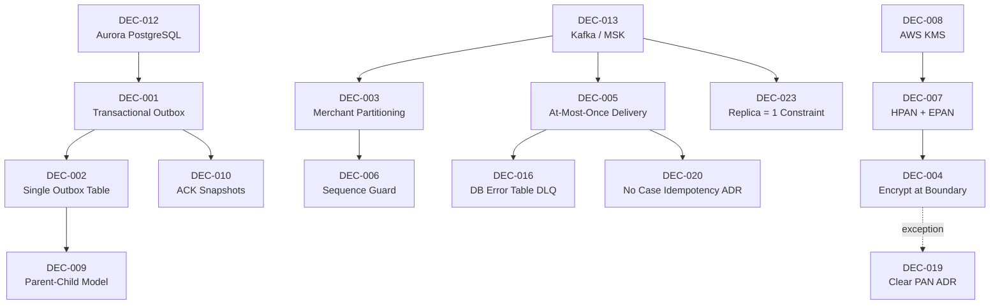

# WDP-DECISIONS.md
**Worldpay Dispute Platform — Architecture Decisions**
*Version: 2.0 | Rebuilt: April 2026*
*Source: WDP component files COMP-01 through COMP-43 (April 2026 survey)*

---

## How to Read This Document

Each decision follows a consistent structure: the problem that forced the decision,
what was chosen and why, what was rejected and why, and the lasting consequences.

Decisions are grouped into four tiers:

- **Tier 1 — Strategic**: Infrastructure and data strategy decisions made at inception.
  Effectively irreversible for the life of the platform.
- **Tier 2 — Platform patterns**: Processing and delivery patterns that all components
  are expected to follow. Deviations are explicitly recorded in Deviation Maps.
- **Tier 2 — Operational**: Structural and operational decisions confirmed from
  component-level analysis in April 2026.
- **Tier 3 — Risk and gap ADRs**: Formally documented exceptions, accepted risks,
  and known defects identified during the April 2026 component survey.

**Corrected decisions** carry a `⚠️ Corrected` marker and include a Deviation Map —
a table showing which components do not follow the stated pattern and the risk each
carries.

**Voided decisions** carry a `⛔ VOID` marker. They were recorded in v1.0 as active
current features but are confirmed absent from all component code.

**Stage 3 proposals** carry a `⚠️ PROPOSED` marker. They have not been committed and
must not be treated as active decisions.

---

## Decision Registry

| ID | Decision | Tier | Status | Date |
|---|---|---|---|---|
| DEC-001 | Transactional Outbox for Event Delivery | 1 | ⚠️ Corrected — deviation map added | Oct 2025 |
| DEC-002 | Single Outbox Table for Multiple Event Types | 2 | ✅ Active | Oct 2025 |
| DEC-003 | Merchant-Scoped Kafka Partitioning | 2 | ⚠️ Corrected — deviation map added | Oct 2025 |
| DEC-004 | Encrypt PAN at the Ingestion Boundary | 1 | ⚠️ Corrected — COMP-23 exception recorded | Oct 2025 |
| DEC-005 | At-Most-Once Delivery via Pre-Commit Offset | 2 | ⚠️ Reframed — v1.0 description was incorrect | Oct 2025 |
| DEC-006 | Deferred Processing with Sequence Guard | 2 | ✅ Active (v1.6) | Oct 2025 |
| DEC-007 | Two-Token PAN Strategy (HPAN + EPAN) | 1 | ✅ Active | Oct 2025 |
| DEC-008 | AWS KMS for Key Management | 1 | ✅ Active | Oct 2025 |
| DEC-009 | Parent-Child Outbox Model for Combined Files | 2 | ✅ Active | Oct 2025 |
| DEC-010 | Immutable Versioned ACK Snapshots | 2 | ✅ Active | Oct 2025 |
| DEC-011 | BRE Crash Recovery via Step Checkpointing | — | ⛔ VOID — confirmed never implemented (April 2026) | Nov 2025 |
| DEC-012 | Aurora PostgreSQL as Operational Database | 1 | ✅ Active | Oct 2025 |
| DEC-013 | Kafka (AWS MSK) as Event Streaming Platform | 1 | ✅ Active | Oct 2025 |
| DEC-014 | Resilience4j for Circuit Breaking | — | ⛔ VOID — confirmed absent platform-wide (April 2026) | Oct 2025 |
| DEC-016 | Database Error Table as Consumer DLQ | 2 | ✅ Active — confirmed platform pattern | April 2026 |
| DEC-017 | BusinessRulesProcessor Reads Rules Directly from DB | 2 | ✅ Active — confirmed COMP-16 behaviour | April 2026 |
| DEC-018 | RBAC Not Enforced in CaseActionService — Accepted Risk | 2 | ⚠️ Risk Accepted | April 2026 |
| DEC-019 | Clear PAN Written on Standard Case Creation — Accepted Risk | 1 | ⚠️ Risk Accepted | April 2026 |
| DEC-020 | No Idempotency on Case Creation — Accepted Risk | 2 | ⚠️ Risk Accepted | April 2026 |
| DEC-021 | UAMS Wrong Transaction Manager — Known Defect | — | 🔴 Defect — pending remediation | April 2026 |
| DEC-022 | removeItemFromQueueDisabled Operational Safety Switch | 2 | ✅ Active | April 2026 |
| DEC-023 | Polling Batch Replica Count Fixed at 1 | 2 | ✅ Active — hard constraint | April 2026 |
| DEC-S3-1 | AWS Redshift as Analytics Warehouse | 3 | ⚠️ PROPOSED | Nov 2025 |
| DEC-S3-2 | Star Schema for Warehouse Design | 3 | ⚠️ PROPOSED | Nov 2025 |
| DEC-S3-3 | Hybrid Real-Time / Batch Analytics | 3 | ⚠️ PROPOSED | Nov 2025 |
| DEC-S3-4 | Apache Parquet for Data Lake Storage | 3 | ⚠️ PROPOSED | Nov 2025 |
| DEC-S3-5 | TensorFlow / XGBoost for ML Models | 3 | ⚠️ PROPOSED | Nov 2025 |
| DEC-S3-6 | Containerised ML Model Serving | 3 | ⚠️ PROPOSED | Nov 2025 |
| DEC-015 | GraphQL for Merchant Portal API | 3 | ⚠️ PROPOSED | TBD |

---

## Dependency Map

Before reading individual decisions, this map shows which decisions build on others.
If you are considering changing a foundational decision, trace the arrows to understand
the downstream impact. The dotted arrow from DEC-004 to DEC-019 indicates a violation
relationship, not a design dependency.

---

## Tier 1 — Strategic Decisions

These decisions define the platform's structural identity. They were made at project
inception and are effectively irreversible without a significant re-architecture effort.

---

### DEC-012: Aurora PostgreSQL as the Operational Database

**Context:** WDP needed a relational database to serve as the foundation for the
transactional outbox pattern, hold the canonical case record, and satisfy strict
compliance requirements around durability and audit.

**Decision:** Aurora PostgreSQL in a multi-AZ configuration, with read replicas for
query offload.

**Why this over the alternatives:** A relational database with strong ACID guarantees
is essential for the transactional outbox to be reliable — the guarantee that an event
row and a business data change land in the same atomic transaction is only possible with
a database that supports serialisable transactions. NoSQL stores like DynamoDB cannot
atomically commit across two logical entity types in a way that makes the outbox pattern
reliable. MongoDB was considered and rejected for the same reason, and because the team's
operational expertise was in PostgreSQL.

Aurora specifically (rather than vanilla PostgreSQL on RDS) was chosen for its fast
failover (typically under 30 seconds), storage-level replication, and auto-scaling read
replica capability. The JSONB column type also allows flexible evidence metadata payloads
within the same schema without requiring separate document storage.

**What was accepted:** Higher cost than a single-region PostgreSQL deployment.
Schema migration overhead as the data model evolves.

**What was rejected:** DynamoDB (no cross-entity atomic transactions), MongoDB (weaker
ACID guarantees, different team skill set), self-managed PostgreSQL on EC2 (operational
burden, no automatic failover).

**Consequences:** The outbox pattern, deferred processing, and ACK snapshot designs all
depend on PostgreSQL's transactional semantics. Changing the database would require
revisiting every one of these patterns.

Note: the v1.0 document listed BRE step checkpointing as a consequence of this decision.
DEC-011 is now void — checkpointing does not exist. That consequence statement is removed.

---

### DEC-013: Kafka (AWS MSK) as the Event Streaming Platform

**Context:** WDP processes disputes from multiple sources and coordinates multiple
independent workers. The choice of messaging infrastructure determines whether the system
can guarantee ordering, replay events, and scale independently per consumer.

**Decision:** Apache Kafka, managed via AWS MSK with three brokers across three
availability zones.

**Why this over the alternatives:** The key requirements were ordered delivery within a
merchant's event stream, the ability to replay messages for recovery, and the capacity to
run multiple independent consumer groups reading the same topics. SQS FIFO queues are
limited to 3,000 messages per second per queue and do not support the consumer group
model needed to have different processing pipelines reading the same stream. RabbitMQ
was considered but lacks log-based storage and message replay, which are critical for
recovery scenarios. ActiveMQ was similarly excluded for the same reasons plus
significantly higher operational overhead.

Kafka's partition model enables ordering (all events for a merchant go to the same
partition) and parallelism (different merchants' partitions are processed concurrently)
without distributed locking.

**What was accepted:** Operational complexity of Kafka. ~$1.5k/month operational cost.
Schema management overhead. Eventual consistency between write and delivery.

**What was rejected:** SQS FIFO (throughput limits, no consumer groups), RabbitMQ
(no log replay), ActiveMQ (operational overhead, no replay).

**Consequences:** MSK storage scales only upward — once provisioned, storage cannot be
reduced. Every storage increase is permanent. All capacity planning must account for this.
Partition key discipline is critical — see DEC-003 for the stated pattern and confirmed
deviation map.

---

### DEC-007: Two-Token PAN Strategy (HPAN + EPAN)

**Context:** WDP must store card numbers to identify disputes but cannot retain plaintext
card numbers in any data store. Two distinct use cases exist: matching disputes against a
card network's hash reference (which requires a hash derived from the PAN) and providing
a masked but recoverable card reference for authorised display (which requires an
encrypted value that can be decrypted). A single token type cannot serve both use cases.

**Decision:** Two tokens are maintained for every PAN ingested: HPAN (hashed PAN — a
one-way hash suitable for card network matching) and EPAN (encrypted PAN — a reversible
encrypted value maintained by EncryptionService, decryptable only for authorised display
purposes).

**Why this over the alternatives:** A single hash cannot satisfy the decryption use case.
A single encrypted value cannot satisfy hash-matching because hash functions require the
raw input. A symmetric encryption approach with a single token creates a single point of
compromise — the two-token model means that even if the EPAN encryption key is
compromised, HPAN (being one-way) exposes no additional plaintext attack surface.

**What was accepted:** Storage overhead of maintaining two tokens per PAN. Operational
complexity of two separate token lifecycles.

**What was rejected:** Single-token approaches that would have required either abandoning
display decryption or storing a reversible hash (which provides weaker security guarantees).

**Consequences:** All components that ingest PAN must produce both HPAN and EPAN before
writing to any data store. EncryptionService (COMP-35) owns derivation and decryption of
EPAN. Any future feature requiring PAN access must go through EncryptionService — no
component can access EPAN directly or hold plaintext PAN in its own store. The clear PAN
exception in COMP-23 is formally recorded in DEC-019.

---

### DEC-008: AWS KMS for Key Management

**Context:** EPAN encryption requires cryptographic keys to be securely managed, rotated,
and audited. Managing encryption keys in application configuration or a self-managed key
store introduces significant operational and security risk.

**Decision:** AWS Key Management Service (KMS) is the key management platform for all
WDP encryption operations.

**Why this over the alternatives:** KMS provides hardware-backed key storage (HSM),
automatic annual key rotation, IAM-integrated access control, and CloudTrail audit logging
of all key operations — without the operational overhead of managing key infrastructure.
The alternative of maintaining a custom key vault would require the WDP team to own
availability, rotation, and audit responsibilities that KMS handles natively.

**What was accepted:** AWS vendor lock-in for key management. KMS API call costs per
encryption and decryption operation.

**What was rejected:** Self-managed key vault, HashiCorp Vault (additional operational
overhead and availability concern), application-level key management in configuration.

**Consequences:** All PAN encryption and decryption flows through KMS API calls. Any data
encrypted by WDP is bound to the AWS region and account where the KMS keys were created.
Key rotation is automatic but applications must handle both old and new key versions during
rotation windows.

---

### DEC-004: Encrypt PAN at the Ingestion Boundary ⚠️ Corrected

**Context:** WDP receives plaintext PAN from card networks and acquiring platforms. PAN
must not be stored in plaintext in any persistent data store — it must be encrypted at
the earliest possible point to minimise the window during which plaintext PAN exists in
the system.

**Decision:** PAN is encrypted at the component that first receives it from an external
system, before any database write. The encrypted form (EPAN) is what is stored.

**Confirmed implementations following this decision:**
- VisaDisputeBatch (COMP-07): encrypts PAN via EncryptionService before writing PENDING
  rows to `wdp.chbk_outbox_row`.
- FirstChargebackBatch (COMP-08): encrypts PAN via EncryptionService before writing
  PENDING rows to `wdp.chbk_outbox_row`.

**⚠️ Exception recorded — COMP-23 standard case creation (see DEC-019):**
CaseManagementService `POST /{platform}/case` (standard path) writes the card number in
clear text to `nap.case.I_ACCI_CDH` and `wdp.CASE.I_ACCT_CDH`. PAN encryption in
COMP-23 occurs only during the transaction enrichment flow
(`POST /{platform}/transactions/enrich`), which is a secondary flow restricted to PIN
and CORE platforms. DEC-019 formally records this as an accepted risk pending remediation.

**Consequences:** Until DEC-019 is remediated, clear PAN exists in `nap.case` and
`wdp.CASE` for cases that have not completed the enrichment flow. Database access controls
on these columns are the interim protection.

---

## Tier 2 — Platform Patterns

These decisions define how WDP components are expected to behave. All components are
expected to follow these patterns. Deviations are recorded in Deviation Maps.

---

### DEC-001: Transactional Outbox for Event Delivery ⚠️ Corrected

**Context:** WDP components that write to a database and then publish a Kafka event face
a distributed consistency problem. If the database write succeeds and the Kafka publish
fails, the event is permanently lost with no recovery path. A mechanism is needed to
guarantee that both the database change and the event delivery either succeed or can be
fully recovered.

**Decision:** Kafka events are published via a transactional outbox. The event payload
is written to a database outbox table within the same transaction as the business data
change. A separate relay process polls the outbox table and publishes confirmed rows to
Kafka, marking them PUBLISHED on success. If Kafka is unavailable, outbox rows accumulate
and are delivered when the broker recovers.

**Why this over direct Kafka publish:** Direct synchronous Kafka publish from application
code is not atomic with the database write. A broker outage between the DB commit and the
Kafka call permanently loses the event. The outbox separates the concern of committing the
business change (synchronous, within the DB transaction) from delivering the event
(asynchronous, via the relay poller).

**Outbox tables confirmed in use:**

| Table | Owner / relay | Event types |
|---|---|---|
| `wdp.chbk_outbox_row` | COMP-09 CaseFillingBatch (relay) | Chargeback events from COMP-07, COMP-08 |
| `wdp.bre_orchestration_outbox` | COMP-12 Schedulers 3 and 4 (relay) | BRE triggers (component=BUSINESS_RULES) and notification triggers (component=NOTIFICATION_ORCHESTRATOR) — shared table, routed by discriminator |
| `wdp.notification_orchestration_outbox` | COMP-12 Scheduler 3 (relay) | Notification orchestration events |
| `wdp.outgoing_event_outbox` | COMP-18 (relay) / COMP-43 (idempotency) | Outgoing events and CORE_EVENTS |

**⚠️ Deviation Map — components that publish Kafka directly (DEC-001 violation):**

| Component | Topic published | Risk |
|---|---|---|
| COMP-04 NAPDisputeEventService | nap-dispute-events | Event loss on broker outage |
| COMP-15 EvidenceConsumer | business-rules | Event loss on broker outage |
| COMP-16 BusinessRulesProcessor | outgoing-events, internal-integration-events | Split-brain: case state updated via REST while outgoing event may never be delivered |
| COMP-19 AcceptService | internal-integration-events | Event loss on broker outage |
| COMP-20 ContestService | internal-integration-events | Event loss on broker outage |
| COMP-23 CaseManagementService | business-rules | Different risk profile: Kafka failure triggers DB rollback, coupling case write availability to Kafka broker availability |
| COMP-24 CaseActionService | business-rules | Event loss on broker outage |
| COMP-25 NotesService | business-rules | Event loss on broker outage |

Direct synchronous Kafka publish is the dominant producer pattern in WDP. The outbox
pattern is implemented correctly in the batch processing path (COMP-07, COMP-08,
COMP-09) and in the notification and scheduling path (COMP-12, COMP-18, COMP-43).
The REST API producer path has not adopted it.

---

### DEC-002: Single Outbox Table for Multiple Event Types

**Context:** WDP has multiple categories of outbound event — chargeback outbox events,
BRE orchestration triggers, notification orchestration triggers, and outgoing events.
A separate outbox table per event type would multiply schema complexity and relay
polling infrastructure.

**Decision:** Where appropriate, a single outbox table serves multiple event types, with
a discriminator column routing rows to the correct relay process.

**Confirmed example:** `wdp.bre_orchestration_outbox` is shared between COMP-18
NotificationOrchestrator (rows with `component = NOTIFICATION_ORCHESTRATOR`) and COMP-12
Scheduler4 (rows with `component = BUSINESS_RULES`). The `component` discriminator
determines which relay is responsible for each row.

**Consequences:** PUBLISHED-status orphan rows in shared outbox tables have no automatic
re-drive mechanism — manual intervention is required. The discriminator must be correctly
set by all writers, or rows will be silently ignored by the wrong relay process. Adding
a new event type to a shared outbox table requires coordination across all components that
read from it.

---

### DEC-003: Merchant-Scoped Kafka Partitioning ⚠️ Corrected

**Context:** WDP processes multiple concurrent events for the same merchant. Without
partition key discipline, events for the same merchant may land on different partitions
and be processed by different consumer instances, causing out-of-order execution. A
consistent partition key ensures all events for a given merchant are processed sequentially
by a single consumer instance.

**Decision:** `merchantId` is the stated Kafka partition key for all WDP topics. All
events for a given merchant route to the same partition, guaranteeing ordered processing
within a merchant's event stream.

**⚠️ Deviation Map — confirmed partition key deviations:**

| Topic | Stated key | Actual key in production | Publishers in violation |
|---|---|---|---|
| business-rules | merchantId | caseNumber | COMP-12 (Scheduler4), COMP-15, COMP-23, COMP-24, COMP-25 — all 5 confirmed publishers |
| outgoing-events | merchantId | caseNumber | COMP-16 BusinessRulesProcessor |
| internal-integration-events | merchantId | caseNumber | COMP-16 BusinessRulesProcessor |

The `business-rules` topic deviates on every confirmed publisher. Ordering guarantees
on `business-rules` are therefore case-scoped, not merchant-scoped. For a merchant with
multiple concurrent cases, events for different cases may be processed on different
partitions by different consumer instances — concurrent case processing for the same
merchant is possible. The sequence guard (DEC-006) addresses ordering within a single
case; the merchant-level ordering guarantee does not hold across the platform.

**Open item:** COMP-14 CaseCreationConsumer is an unverified candidate as a sixth
publisher to the `business-rules` topic. Confirm before closing this deviation map.

---

### DEC-005: At-Most-Once Delivery via Pre-Commit Kafka Offset ⚠️ Reframed

**Context:** The v1.0 document described DEC-005 as "manual Kafka offset commit after
all processing completes, providing at-least-once delivery." This was incorrect. All
confirmed WDP consumers commit the Kafka offset before processing begins, providing
at-most-once delivery. This entry corrects and replaces the v1.0 description.

**Decision:** WDP Kafka consumers use pre-commit offset management as the platform
standard. `acknowledgment.acknowledge()` is called before the processing logic executes.
This provides at-most-once delivery: if a pod crashes after the offset commit but before
processing completes, the event is permanently lost. In exchange, events can never be
double-processed by the same consumer.

**Why at-most-once over at-least-once (commit after processing):** At-least-once delivery
requires all downstream consumers to be idempotent — capable of handling the same event
twice without producing incorrect results. WDP's downstream services do not universally
implement idempotency. CaseManagementService (COMP-23) has no duplicate detection on
case creation (see DEC-020). Redelivering events to a non-idempotent service produces
duplicate case records, duplicate action entries, or duplicate notes — data integrity
failures in a financial system. Pre-commit prevents redelivery entirely, at the cost of
accepting that a pod crash creates an event loss window.

**What was accepted:** Event loss on pod crash is the platform's accepted failure mode
for Kafka consumers. There is no automatic recovery for a lost pre-commit event.

**What was rejected:** At-least-once delivery (commit after processing). Rejected because
it requires idempotency guarantees across all downstream services, which the platform does
not currently have.

**Confirmed consumers using pre-commit:** COMP-05 NAPDisputeEventProcessor, COMP-16
BusinessRulesProcessor, COMP-39 NAPOutcomeProcessor, COMP-40 VisaResponseQuestionnaire.
Additional consumer component files carry the same DEC-005 deviation flag against the
original at-least-once intent.

**Notable exception — COMP-23 CaseManagementService:** COMP-23 couples its Kafka publish
to the same application-level transaction as the database write — a Kafka failure triggers
a DB rollback. This is neither pre-commit nor post-commit. It creates an availability
dependency: Kafka broker unavailability causes case creation to fail entirely.

**Consequences:** No Kafka DLQ topics exist in WDP because they are only needed for
at-least-once delivery. Database error tables are the compensating error-visibility
mechanism (see DEC-016). If the delivery model changes to at-least-once in the future,
idempotency must be added to all downstream services before the commit strategy can change.

---

### DEC-006: Deferred Processing with Sequence Guard for Concurrent Updates

**Context:** An UPDATE event for a case can arrive before the NEW event if events for the
same case are produced on different partitions or if network conditions cause out-of-order
delivery. Applying an UPDATE before the case exists causes processing failures.

**Decision:** When a consumer receives an event it cannot yet apply (because a prerequisite
has not been processed), the event is written to a deferred queue in the database with
PENDING_DEFERRED status. A scheduler periodically re-evaluates deferred events. A sequence
number guard — tracking the maximum sequence number successfully applied to each case —
ensures events are applied in order and that stale events (lower sequence than the current
maximum) are discarded rather than applied incorrectly.

**What was rejected and then corrected:** The v1.0 design (DEC-006-v1.0) tracked which
deferred events had been applied but not their ordering. This led to a 10% false-stale
detection rate. v1.6 introduced the sequence number guard, enabling precise staleness
detection. See Superseded Decisions.

**Consequences:** Deferred events accumulate in the database until the prerequisite event
arrives. Under at-most-once delivery (DEC-005), if the prerequisite event is permanently
lost, deferred events for that case remain PENDING_DEFERRED indefinitely. Monitoring for
long-stuck deferred events is an operational requirement.

---

### DEC-009: Parent-Child Outbox Model for Combined Files

**Context:** Some card network responses require a single outbound file generated only
when all constituent parts are ready. Individual parts may become ready at different times
across different processing paths.

**Decision:** `wdp.chbk_outbox_row` uses a parent-child model. A parent row represents
the combined file; child rows represent individual dispute events contributing to it. The
parent row transitions to PENDING only when all its child rows have been processed. The
file generation component reads PENDING parent rows and generates the combined output.

**Consequences:** File generation is blocked until all children of a parent are complete.
A single stuck child row — for example, due to a processing error — delays the entire
combined file. Monitoring for stuck child rows is an operational requirement.

---

### DEC-010: Immutable Versioned ACK Snapshots

**Context:** Acknowledgement (ACK) files sent to card networks must be generated exactly
once per source file and must not change after generation. If a source file is reprocessed
or partially reprocessed, a new ACK should reflect actual processing state without
overwriting the original.

**Decision:** ACK files are immutable once generated. Each ACK generation event produces
a new versioned snapshot row in the database. FileAcknowledgementProcessor (COMP-13)
polls for COMPLETED file jobs and generates ACK snapshots accordingly.

**Consequences:** ACK file history is fully preserved and auditable. The version chain
grows indefinitely — archival or TTL policy is needed for long-running deployments.

---

## Tier 2 — Operational and Structural Decisions

These decisions were confirmed from component-level analysis during the April 2026 survey.
They have been in operation without being formally recorded.

---

### DEC-016: Database Error Table as Consumer DLQ

**Context:** Kafka consumers that fail to process a message need an error-visibility and
recovery mechanism. Two standard approaches exist: Kafka Dead Letter Queue (DLQ) topics
(failed messages republished to a separate topic for replay) and database error tables
(failed message details written to a relational table for investigation and manual
re-drive).

**Decision:** WDP uses database error tables as the consumer error-visibility mechanism.
No Kafka DLQ topics exist anywhere in the platform.

**Why database tables over Kafka DLQ:** Database error tables integrate with the existing
Aurora PostgreSQL operational store, allowing error records to be queried alongside case
data, correlated by case number, and investigated with existing tooling. Kafka DLQ topics
would require separate consumer infrastructure for replay and introduce a second failure
mode: if the DLQ publish itself fails, the error is silently dropped. A database write to
the same store as the case record is a more reliable and operationally familiar error sink.

**Known implementations:**

| Error store | Consumer |
|---|---|
| `NAP.DISPUTE_EVENT_CONSUMER_ERROR` table | COMP-05 NAPDisputeEventProcessor |
| `wdp.outgoing_event_outbox` error state rows | COMP-43 CoreNotificationConsumer |
| REST SNOTE via NotesService (no DB table) | COMP-16 BusinessRulesProcessor |

Note: COMP-16 does not use a database error table. Errors are written as SNOTE notes via
a REST call to NotesService. If that REST call also fails, the error is silently lost —
a weaker error-visibility guarantee than a database table.

**Consequences:** Error recovery requires manual intervention. There is no automatic
re-drive mechanism. Operations teams must identify failed records, resolve the root cause,
and manually trigger reprocessing.

---

### DEC-017: BusinessRulesProcessor Reads Rules Directly from the Database

**Context:** BusinessRulesProcessor (COMP-16) evaluates business rules on each incoming
event. BusinessRulesService (COMP-31) was built as the authoritative API for rule
management and retrieval. Two approaches were available: call COMP-31 via REST to retrieve
applicable rules, or query the rule tables directly via JPA.

**Decision:** COMP-16 reads rules directly from `nap.rules`, `nap.rule_criterion`,
`nap.rule_action`, and `nap.rule_group` (UK / NAP path) and the equivalent `wdp.rules`
tables (US path) via JPA queries on every message. COMP-31 BusinessRulesService is not
called by COMP-16.

**Why direct DB over API call:** Rule reads on every Kafka message need to be fast and
reliable. An API call to COMP-31 introduces a network hop, an additional failure mode
(COMP-31 unavailability would halt BRE processing), and a REST timeout risk. Direct JPA
queries against Aurora are faster and eliminate the runtime dependency on COMP-31.

**Consequences:** Rule changes made via COMP-31's management API propagate to the database
correctly, and COMP-16 picks them up immediately on the next message (no cache invalidation
is needed). Any future enhancements to rule retrieval logic added to COMP-31 — caching,
rule versioning, pre-validation — will not benefit COMP-16 without separate code changes
in that component. The `rules.audit-log-uri` configuration property in COMP-16 is
configured in production YAML but is never called — it is a dead configuration reference.

---

### DEC-022: removeItemFromQueueDisabled Operational Safety Switch

**Context:** VisaDisputeBatch (COMP-07) and FirstChargebackBatch (COMP-08) poll external
card network queues and must acknowledge each processed item to prevent it from being seen
again on the next poll cycle. During outage recovery, parallel run validation, or incident
investigation, it may be necessary to run both batches in read-only mode — polling and
processing items without consuming them from the external queue.

**Decision:** Both COMP-07 and COMP-08 support a `removeItemFromQueueDisabled` flag. When
`true`, all MarkAsRead / ACK PUT calls to the external network API are suppressed for the
entire batch execution. This flag is active in production configuration.

**Legitimate use cases:** Outage recovery (re-read items already seen without consuming
them), parallel run validation (run new batch alongside old without advancing the queue),
and incident investigation (observe queue contents without processing them).

**Consequences:** If `removeItemFromQueueDisabled = true` is left active in normal
operation, items will be reprocessed on every subsequent batch run, producing duplicate
case records. This is a critical operational configuration item. There is no automated
check that detects when the flag has been left in an unsafe state. It must be explicitly
reset to `false` after any maintenance window that requires it.

---

### DEC-023: Polling Batch Replica Count Fixed at 1

**Context:** VisaDisputeBatch (COMP-07) and FirstChargebackBatch (COMP-08) are Kubernetes
Deployments that poll shared external card network queues using a sequential,
single-threaded processing model.

**Decision:** Both COMP-07 and COMP-08 must run with exactly `replica = 1`. Running more
than one replica is unsafe and is a hard constraint.

**Why:** If two replicas execute concurrently, both poll the same external queue and read
overlapping items. Both will attempt to create case records for the same disputes. External
queue acknowledgement and WDP case creation are not atomic — there is no distributed
locking mechanism that would allow multiple replicas to safely share a queue. Duplicate
case records result.

**Consequences:** Horizontal scaling is not available for these two components. Throughput
is bounded by single-instance processing speed. If processing cannot keep pace with queue
depth, options are limited to optimising single-instance throughput or requesting queue
sharding at the card network level (an external integration change outside WDP control).
Kubernetes pod restarts briefly stall processing but do not create duplicates, because the
restart clears in-flight state before the new pod begins polling.

---

## Tier 3 — Risk and Gap ADRs

These entries document formally accepted risks, known exceptions to platform decisions,
and a confirmed implementation defect. All were identified during the April 2026 component
survey. They are recorded as ADRs to make visible what was previously undocumented.

---

### DEC-018: RBAC Not Enforced in CaseActionService — Accepted Risk

**Context:** WDP uses a layered authorization model. JWT authentication is enforced at
the API Gateway (COMP-01). Entity-level authorization (which cases a user can see) is
delegated to UAMS (COMP-02) for the NAP platform and CHAS (COMP-03) for all other
platforms. Operation-level authorization (RBAC — which actions a user can take on a case)
is intended to be enforced within individual services. CaseActionService (COMP-24)
contains `RestInvoker.authorizeUser()` for this purpose, but this method is never called
in the current implementation.

**Risk:** Any authenticated user with a valid JWT and entity-level access to a case can
execute any action on that case, regardless of their assigned role. Role-based operation
restrictions — for example, preventing a read-only merchant user from submitting a
chargeback, or preventing a junior operator from approving a write-off — are not enforced.

**Decision:** Accepted as a known risk. RBAC enforcement in CaseActionService is deferred.
Entity-level authorization remains the effective access control boundary.

**Rationale for deferral:** Entity-level authorization is enforced and operational.
Operation-level authorization requires a role-to-operation mapping configuration that has
not been defined by the product team. Implementing RBAC enforcement before that mapping
is defined would require re-deployment when definitions change. The deferral is pragmatic.

**Remediation path:** `RestInvoker.authorizeUser()` is already present in the COMP-24
codebase. Activation requires: (1) product team definition of role-to-operation mappings,
(2) a configuration store for those mappings accessible to COMP-24, (3) wiring
`authorizeUser()` into the case action execution path.

**Related gap:** `validateOrgId()` is commented out in COMP-03 CoreHierarchyAuthorizationService
on `GET /orgentity`. This is a second RBAC-adjacent gap to be assessed as part of the
same remediation effort.

---

### DEC-019: Clear PAN Written on Standard Case Creation — Accepted Risk (DEC-004 Exception)

**Context:** DEC-004 requires PAN to be encrypted at the ingestion boundary before any
persistent write. CaseManagementService (COMP-23) standard case creation
(`POST /{platform}/case`) writes the card number in clear text to
`nap.case.I_ACCI_CDH` and `wdp.CASE.I_ACCT_CDH`. PAN encryption in COMP-23 only
occurs during the transaction enrichment flow
(`POST /{platform}/transactions/enrich`), which is a secondary flow restricted to PIN
and CORE platforms.

**Risk:** Clear PAN is persisted in Aurora PostgreSQL in the `nap` and `wdp` schemas for
any case that has not yet completed the enrichment flow. This is a PCI DSS compliance gap.
Any database query, log capture, or backup restore that accesses these columns exposes
readable card numbers.

**Decision:** Accepted as a known risk pending remediation. Clear PAN in these columns
is the current production state.

**Rationale:** The transaction enrichment flow was designed as the path to replace clear
PAN with EPAN after case creation. The current implementation creates a window between
creation and enrichment during which clear PAN exists in persistent storage. Access
controls on Aurora schema tables are the interim mitigation.

**Remediation path:** Move PAN encryption into the standard case creation transaction.
EncryptionService must be called and EPAN derived before the JPA `nap.case` or
`wdp.CASE` save, eliminating the clear-PAN window entirely. This is a COMP-23
implementation change — Claude Code scope.

---

### DEC-020: No Idempotency on Case Creation — Accepted Risk

**Context:** CaseManagementService (COMP-23) case creation (`POST /{platform}/case`)
performs no duplicate detection. No query checks whether a case with equivalent key
attributes already exists before writing. Concurrent identical HTTP requests produce
multiple case records with different case numbers.

**Risk:** Duplicate case records for the same dispute event. Financial operations
performed against a duplicate case — accept, contest, chargeback submission — may not be
reconciled against the original, creating an unresolved case in the card network's view
of the dispute.

**Decision:** Accepted as a known risk, contingent on the platform's at-most-once delivery
model (DEC-005). Since the Kafka offset is committed before processing, Kafka redelivery
cannot produce duplicates. The residual duplicate risk is limited to concurrent HTTP
requests reaching COMP-23 simultaneously.

**Rationale:** Under at-most-once Kafka delivery (DEC-005), the practical duplicate-creation
path is concurrent HTTP requests rather than message redelivery.

**Critical dependency on DEC-005:** If the delivery model changes to at-least-once in
the future, this decision must be revisited immediately. Redelivery would make duplicate
case creation a likely operational event rather than an edge case. Idempotency enforcement
must be added to COMP-23 before the commit strategy can change.

**Remediation path:** A unique constraint on a composite natural key (platform + network +
network-side reference identifier + reason code) on both `nap.case` and `wdp.CASE` would
enforce idempotency at the database level, causing duplicate creation attempts to fail
with a constraint violation rather than succeeding silently.

---

### DEC-021: UAMS saveChildWithMerchant — Wrong Transaction Manager (Known Defect)

**Status: 🔴 Known Defect — not an accepted design decision. Pending remediation.**

**Context:** `saveChildWithMerchant` in UserAccessManagementService (COMP-02) writes to
multiple NAP schema tables. The Spring transaction annotation on this method uses
`@Primary wdpTransactionManager` — the transaction manager for the `wdp` schema
datasource — rather than `napTransactionManager`, which manages the NAP schema datasource.

**Defect:** On any failure within `saveChildWithMerchant`, the rollback targets the `wdp`
datasource. The NAP schema writes are not covered by this rollback and will not be undone.
The NAP schema is left in a partially written state — for example, a user entity written
without its associated ACL entry, leaving the user in an inconsistent access state.

**Production impact:** Assessment pending. The exact tables written by `saveChildWithMerchant`
and the failure modes require confirmation from the COMP-02 repository.

**Remediation:** Replace `@Primary` with explicit `napTransactionManager` on
`saveChildWithMerchant`. This is an implementation change — Claude Code scope.
Production impact assessment should be completed before scheduling remediation.

---

## Voided Decisions

These decisions were recorded in WDP-DECISIONS.md v1.0 as active current features.
They are confirmed absent from all WDP component code as of April 2026. Any
documentation, runbook, or operational procedure referencing them as current must be
treated as incorrect.

---

### DEC-011: BRE Crash Recovery via Step Checkpointing ⛔ VOID

**Status: ⛔ VOID — Confirmed never implemented.**
**Source: WDP-COMP-16-BUSINESS-RULES-PROCESSOR.md, April 2026.**

**What v1.0 assumed:** BusinessRulesProcessor (COMP-16) would execute in discrete named
processing steps — VALIDATE, ENRICH, ATTACH_ISSUER_DOC. On each step completion, a
checkpoint record would be written to a database table. On Kafka message redelivery, the
processor would resume from the last checkpoint, avoiding re-execution of already-completed
steps.

**What is actually implemented:** No named processing steps exist in the BusinessRulesProcessor
codebase. No checkpoint table exists. No checkpoint read or write code exists anywhere in
COMP-16. `ATTACH_ISSUER_DOC` exists only as an action type enum value, not a processing
step name. On any redelivery, all processing would restart from the beginning.

**Why this is void rather than deferred:** The pre-commit offset model (DEC-005) makes
step checkpointing structurally moot. The Kafka offset is committed before any processing
begins, so the broker will never redeliver the message regardless of what happens during
processing. Checkpointing would only become relevant if the platform changed to
at-least-once delivery — at which point the checkpointing design would need to be built
from scratch anyway. DEC-011 was never started.

**Impact on v1.0 dependency map:** The DEC-005 → DEC-011 dependency is removed.

**Impact on DEC-012 consequences:** The v1.0 statement that "BRE checkpointing depends on
PostgreSQL's transactional semantics" is removed — this dependency does not exist.

---

### DEC-014: Resilience4j for Circuit Breaking ⛔ VOID

**Status: ⛔ VOID — Confirmed absent across all 40 WDP component files.**
**Source: April 2026 component survey.**

**What v1.0 assumed:** Resilience4j circuit breakers would be applied to outbound REST
and Kafka producer calls across WDP components, providing automatic failure isolation and
fallback behaviour when downstream services are unavailable.

**What is actually implemented:** Resilience4j is not present in any WDP component.
No circuit breakers, no rate limiters, no retry annotations, and no bulkheads are wired
anywhere in the platform. `spring-retry` is declared in COMP-16's pom.xml but is not
wired — no `@Retryable` or `RetryTemplate` exists in that codebase.

**The most significant gap:** BusinessRulesProcessor (COMP-16) calls seven downstream
REST services with no connection timeout, no read timeout, and no circuit breaker. A
single hung downstream service blocks the consumer thread indefinitely. With consumer
concurrency = 1 per replica, a single hung thread stalls all `business-rules` message
processing for that instance, with no automatic recovery.

**Why this is void rather than deferred:** After reviewing all 40 component files, the
absence of Resilience4j is consistent and platform-wide, not selective. The platform has
operated in this state as an accepted condition. The resilience gap is recorded in the NFR
rebuild (to be completed separately). If circuit breakers are introduced in a future
hardening sprint, new ADRs must be written at that time, scoped to the specific components
and dependency patterns being protected.

---

## Superseded Decisions

### DEC-006-v1.0: Initial Deferred Update Design ❌ Superseded (Oct 2025)

The original design for handling UPDATE-before-NEW events tracked which deferred events
had been applied but did not track their ordering. This led to a 10% false-stale detection
rate — the system sometimes refused to apply a valid UPDATE because it incorrectly
concluded the event was outdated. Replaced entirely by DEC-006 v1.6, which tracks the
maximum sequence number applied to each case, enabling precise staleness detection.
Any system or documentation referencing the original deferred update behaviour (without
the sequence guard) must be treated as outdated.

---

## Stage 3 Proposals

These decisions are proposals for Stage 3, which has not yet been built. All must be
validated during Stage 3 planning. They are recorded here to capture current thinking,
not as commitments. **None of these are active decisions.**

---

### DEC-S3-1: AWS Redshift as Analytics Warehouse ⚠️ PROPOSED

**Context:** Stage 3 requires a warehouse capable of handling complex analytical queries
over years of dispute history, potentially billions of rows.

**Proposed decision:** AWS Redshift (Massively Parallel Processing columnar warehouse).

**Proposed rationale:** Native AWS integration with S3 and Glue, proven at scale for
financial analytics, cost-effective relative to alternatives at WDP's projected volume.

**Alternatives under consideration:** Snowflake (more expensive, multi-cloud capable but
less AWS-native), BigQuery (Google Cloud, introduces a second cloud vendor dependency).

⚠️ VERIFY: Snowflake and BigQuery evaluations are brief notes, not full analyses. A
proper cost and capability comparison should be done before this decision is finalised.

---

### DEC-S3-2: Star Schema for Warehouse Design ⚠️ PROPOSED

**Context:** Redshift schema design choices significantly affect query performance for
analytical workloads.

**Proposed decision:** Star schema with separate fact tables (one per event grain) and
shared dimension tables (merchant, network, time, reason code).

**Proposed rationale:** Star schemas are optimised for the type of aggregation queries
WDP analytics will run (disputes by merchant by network by month), are simpler for
analysts to write queries against, and perform better than fully normalised schemas for
read-heavy analytical workloads.

---

### DEC-S3-3: Hybrid Real-Time / Batch Analytics ⚠️ PROPOSED

**Context:** WDP already has near-real-time operational metrics in Prometheus/Grafana.
Stage 3 needs to add historical analytics without replacing the operational monitoring
that teams rely on.

**Proposed decision:** Retain Prometheus/Grafana for operational real-time metrics
(processing rates, error rates, queue depths). Add Redshift and daily ETL for historical
and trend analytics. Do not attempt real-time streaming into the warehouse.

**Proposed rationale:** Streaming analytics into Redshift in real time is technically
possible (Kinesis Firehose) but significantly more complex and expensive. WDP's historical
analytics use cases (monthly win/loss trends, annual chargeback volumes) do not require
data fresher than 24 hours. The operational use cases that do require near-real-time data
are already served by Prometheus.

**What is being intentionally deferred:** Sub-day latency historical analytics. This
decision may need to be revisited if business stakeholders require same-day reporting.

---

### DEC-S3-4: Apache Parquet for Data Lake Storage ⚠️ PROPOSED

**Context:** All Kafka events will be archived to S3 as the long-term data lake. The
choice of file format determines query performance, storage efficiency, and compatibility
with AWS analytics tools.

**Proposed decision:** Apache Parquet with date and topic partitioning.

**Proposed rationale:** Parquet is a columnar format, meaning queries that only read a
subset of columns (the common case in analytics) can skip irrelevant data at read time.
It has strong native support in AWS Glue, Athena, and Redshift. It compresses well for
the type of semi-structured dispute data WDP produces.

**Alternatives considered:** Avro (row-based, better for full-row reads, worse for
analytical column scans), ORC (similar to Parquet but weaker AWS tooling support).

---

### DEC-S3-5: TensorFlow / XGBoost Hybrid for ML Models ⚠️ PROPOSED

**Context:** Stage 3 plans three ML models with different characteristics — the Dispute
Outcome Predictor uses tabular features over structured dispute history (gradient boosting
is typically most effective here), the Chargeback Risk Scorer needs a more expressive model
for complex feature interactions (neural network), and the Merchant Behaviour Classifier
uses unsupervised clustering.

**Proposed decision:** XGBoost for the Dispute Outcome Predictor, TensorFlow for the Risk
Scorer, with sklearn-based clustering for the Behaviour Classifier.

⚠️ VERIFY: The rationale for choosing TensorFlow over XGBoost for the Risk Scorer is
stated as "team expertise" in the source documentation. If the team's ML experience is
primarily in gradient boosting, a single-framework approach (all XGBoost) may be lower
risk. This should be validated before committing to a multi-framework serving
infrastructure.

---

### DEC-S3-6: Containerised ML Model Serving ⚠️ PROPOSED

**Context:** ML models need to be deployed, versioned, and updated independently of the
main application services.

**Proposed decision:** Each ML model served as an independent containerised microservice
on AWS ECS, behind a REST API. A/B testing handled by routing a percentage of traffic to
a new model version before full rollout. Weekly retraining jobs run on the same
infrastructure.

**Alternatives considered:** AWS SageMaker (higher cost, less direct control over
inference environment), AWS Lambda (cold-start latency makes it unsuitable for
synchronous prediction requests that must meet sub-second SLA).

---

### DEC-015: GraphQL for Merchant Portal API ⚠️ PROPOSED

**Context:** The merchant-facing portal needs to fetch disputes with many optional filter
combinations, present nested data (case + actions + evidence + notes) efficiently, and
support a mobile client with bandwidth constraints. REST endpoints designed for these use
cases tend to be either too coarse (returning more data than needed) or too fine (requiring
multiple round trips).

**Proposed decision:** GraphQL for the Merchant Portal API layer.

**Open questions before finalising:** Whether query complexity limits are needed to prevent
abusive queries; whether standard HTTP caching strategies (incompatible with POST-based
GraphQL by default) can be replaced adequately with application-level caching; and how
authentication integration with the existing JWT/OAuth flow works across a GraphQL layer.

⚠️ VERIFY: DEC-015 has no evaluation score or ARB approval. It must not be treated as
decided — it is the beginning of a conversation. REST with well-designed endpoints and
field projection is a lower-risk default and must remain the comparison baseline.

---

## Constraints Shaping Future Decisions

Four constraints from committed decisions limit what future stages can do without
re-architecture:

**MSK storage is one-directional.** Once provisioned Kafka storage is scaled up, it
cannot be reduced. Every storage increase is permanent. All Stage 2 and Stage 3 capacity
planning must account for this.

**PAN handling is centralised.** Any future capability that needs the actual card number
must call through EncryptionService (COMP-35). No component can access EPAN directly or
hold plaintext PAN in its own store. The clear PAN exception in COMP-23 (DEC-019) is the
only known deviation and is pending remediation.

**At-most-once delivery creates a data loss window.** The platform's current Kafka consumer
model accepts event loss on pod crash. Any future capability that requires guaranteed event
delivery must either implement a compensating mechanism or require the platform delivery
model to change — which in turn requires idempotency to be added to all downstream
services before the commit strategy can change. DEC-020 is a direct consequence of this
constraint.

**Polling batches cannot scale horizontally.** COMP-07 and COMP-08 are permanently
constrained to replica = 1 (DEC-023). Any throughput increase for Visa or MasterCard
dispute ingestion requires single-instance optimisation or a card-network-side queue
sharding arrangement — an external integration change outside WDP control.

---

*This document contains architectural decision content only. Implementation details,
database schemas, configuration values, and deployment specifications are maintained in
the individual component files (WDP-COMP-[NN]-*.md).*

*NFRs will be cross-referenced once WDP-NFRS.md is rebuilt.*
