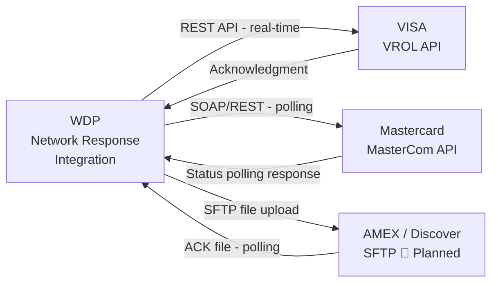
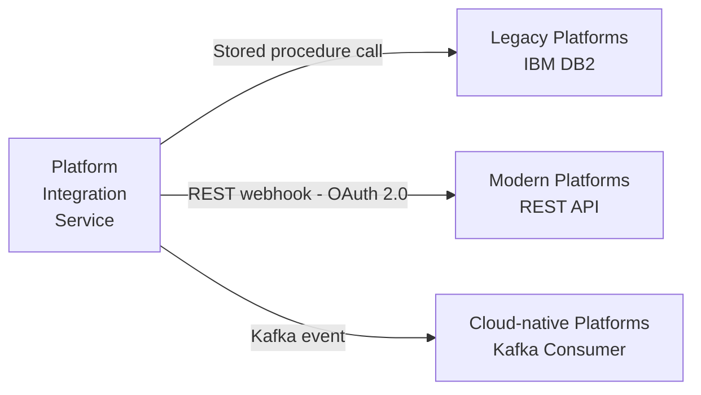
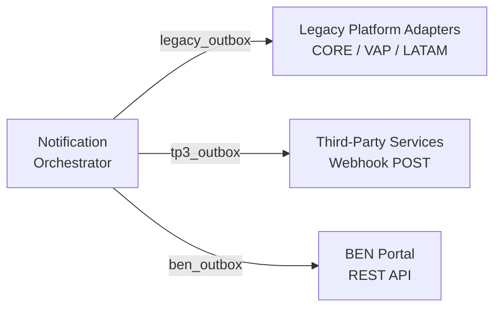
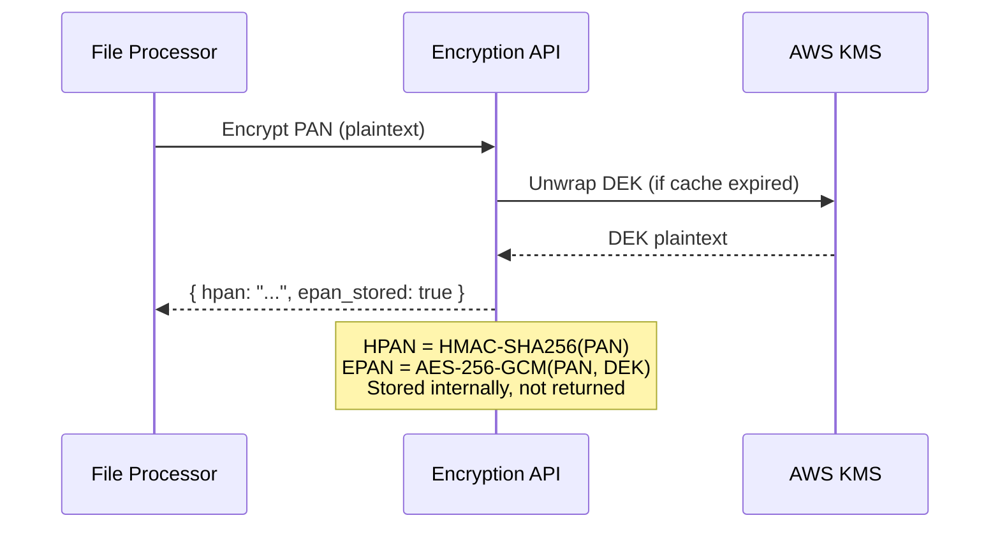
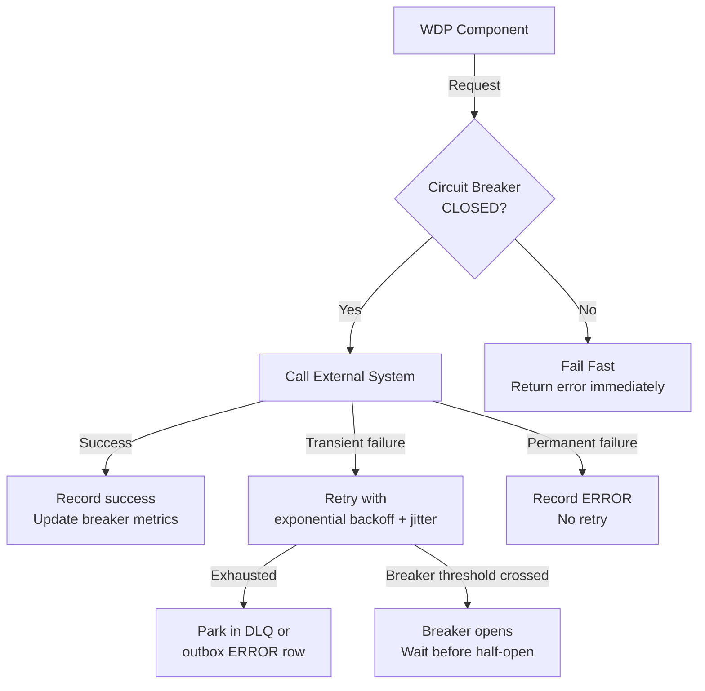

# WDP-INTEGRATIONS.md
**World Dispute Platform — Integration Patterns & External Contracts**
*Version: 1.0 | Extracted: April 2026 | Source: WDP Documentation Suite v2.0*

---

## 1. Overview

This document describes every integration boundary in WDP: the external systems WDP depends on, the internal event contracts between WDP components, the API surface WDP exposes, and the patterns used to make all of these reliable. It is written for architects and engineers who need to understand what WDP connects to, how, and what happens when those connections fail.

Integration boundaries in WDP fall into four categories:

- **Inbound** — external systems that send data to WDP (card networks, acquiring platforms)
- **Outbound** — external systems that WDP sends data to (networks, acquiring platforms, notification targets)
- **Internal event bus** — Kafka topics that carry data between WDP components
- **Shared services** — internal APIs that multiple WDP components consume (Encryption API, Document Management, BRE)

---

## 2. Integration Catalogue — External Systems

### 2.1 Card Networks (Inbound — Dispute Files)

Card networks are the primary source of dispute data into WDP. They transmit files on a regular schedule containing chargeback records and, in some cases, associated evidence.

| Network | Protocol | Direction | Status |
|---|---|---|---|
| VISA | SFTP / S3 | Inbound (dispute files) | ✅ Production |
| Mastercard | SFTP / S3 | Inbound (dispute files) | ✅ Production |
| AMEX | SFTP / S3 | Inbound (dispute files) | ✅ Production |
| Discover | SFTP / S3 | Inbound (dispute files) | ✅ Production |

**File format:** ZIP archives containing a CSV of dispute rows plus any associated evidence files. The CSV structure varies by network but is normalised during ingestion by the File Processor.

**Integration pattern:** Files are deposited to a known S3 bucket or SFTP location. WDP polls or receives an event trigger, downloads the file, and begins processing. The File Processor owns the entire ingestion path from file receipt to outbox write.

**Failure handling:** If a file cannot be parsed, the file-level job is marked as failed and an alert is raised. Row-level failures do not fail the entire file — they are recorded per-row in the outbox and reported in the ACK file delivered back to the merchant.

---

### 2.2 Card Networks (Outbound — Representment Submission)

When a merchant elects to defend a dispute, WDP must submit the merchant's response back to the card network for adjudication. Each network has a different submission protocol.



**VISA (VROL API):** REST API with real-time response submission. WDP calls the VROL endpoint with the representment payload and receives a synchronous acknowledgment. ACK status is polled every 5 minutes to confirm network receipt.

**Mastercard (MasterCom API):** A SOAP/REST hybrid API. WDP submits the dispute response and then polls for status updates because MasterCom does not return a synchronous final acknowledgment.

**AMEX / Discover (SFTP — planned):** File-based submission. WDP generates a network-specific formatted file (CSV or XML), uploads via SFTP, and polls the network's inbound SFTP for an acknowledgment file. This pattern is planned for Q2 2026 and not yet in production.

**Resilience:** All three integration paths use circuit breakers with a 50% failure threshold, 30-second open window, and exponential backoff with jitter on retry. A circuit open for one network does not affect submissions to other networks.

**Submission SLA:** Network acknowledgment is typically received within 24 hours. If no acknowledgment arrives within 48 hours, the submission is escalated to the support team for manual follow-up.

---

### 2.3 Acquiring Platforms (Outbound — Money Movement)

When a dispute is resolved, WDP must notify the acquiring platform so that funds can be settled. Acquiring platforms span a wide range of technical maturity, so WDP supports three integration styles simultaneously. The appropriate style for each platform is determined by configuration.



**DB2 (legacy platforms):** Direct database connection to the acquiring platform's IBM DB2 instance. WDP calls a stored procedure to record the dispute outcome and trigger the platform's internal settlement workflow. This pattern is used for platforms that have not exposed a modern API surface.

**REST webhooks (modern platforms):** HTTP POST to a platform-owned endpoint with a JSON payload describing the dispute outcome. OAuth 2.0 authentication. Retry with exponential backoff for transient failures. Each delivery is logged in an audit table.

**Kafka events (cloud-native platforms):** WDP publishes a dispute outcome event to a shared Kafka topic. The platform's own consumer picks it up. Exactly-once delivery is guaranteed via Kafka transactions.

**Routing:** The integration pattern per platform is stored in a configuration table. The Platform Integration Service reads this configuration and routes each outcome notification to the correct delivery mechanism without requiring any change to the business logic that marks the dispute as resolved.

---

### 2.4 Document Management API (Outbound — Evidence Storage)

Evidence files submitted by merchants or extracted from network files must be stored in an external Document Management system. WDP does not own the evidence storage layer.

**Integration style:** REST API, authenticated with OAuth 2.0 and mutual TLS. Evidence Worker calls this API to upload documents and receive a document identifier that is stored against the Case.

**Batch uploads:** The Evidence Worker batches up to 10 evidence files per API request to reduce call volume.

**Resilience:** Per-merchant circuit breakers (see WDP-DECISIONS.md DEC-014). If one merchant's uploads are failing, that merchant's circuit breaker opens, pausing evidence attachment for that merchant only. Other merchants continue unaffected.

**Failure classification:**
- Transient failures (network timeouts, 5xx responses): retried with exponential backoff
- Permanent failures (400 validation errors, file format rejection): recorded as ERROR in the outbox row, reported in the ACK file, not retried

---

### 2.5 Notification Channels (Outbound — Case Lifecycle Events)

WDP delivers case lifecycle notifications to three distinct channels. The Notification Orchestrator determines which channels are enabled for a given merchant based on merchant configuration, then publishes to the appropriate per-channel Kafka topic.



**Legacy platforms (CORE, VAP, LATAM):** HTTP POST to platform-specific REST endpoints. Each platform has its own payload format. Legacy Adapter handles format transformation per platform. 5 retry attempts with backoff.

**Third-party services (TP3):** Webhook delivery to partner-registered endpoints. OAuth 2.0 authentication. Retry policy is partner-specific.

**BEN portal:** REST API delivery to the merchant notification portal. 3 retry attempts. Merchants can opt in or out of BEN notifications per-case via merchant configuration.

**Outbox isolation:** Each channel has its own outbox table. A failure delivering to one channel does not affect delivery to others. All three channels can be processing simultaneously for the same case event.

---

### 2.6 AWS KMS (Critical Infrastructure)

AWS KMS is not a business integration — it is a dependency of WDP's Encryption API and is treated as critical infrastructure. Every PAN encryption and decryption operation depends on KMS being available to unwrap the DEK.

**Failure mode:** If KMS is unavailable, the Encryption API cannot refresh its DEK. The API has a six-hour cached DEK window — it can continue operating for up to six hours without KMS access using the in-memory DEK. Beyond that window, new encryptions and decryptions will fail until KMS is restored.

**Circuit breaker:** A circuit breaker on the KMS client prevents the Encryption API from hammering KMS during an outage and allows gradual recovery.

**No alternative:** There is no fallback key management path. KMS availability is a direct SLA dependency.

---

### 2.7 Identity Provider (Shared IDP)

WDP participates in a shared OAuth 2.0 / JWT identity infrastructure. The IDP issues tokens consumed by the API Gateway for user authentication and by internal service-to-service calls.

**JWT validation:** The WDP API server validates incoming JWTs using the IDP's public key. Phase 1 of the integration uses a Dashboard-provided public key with a `kid` claim for validation. Phase 2 (planned) will migrate to JWKS URL-based key discovery to support automatic key rotation without WDP configuration changes.

⚠️ VERIFY: The Phase 2 JWKS migration timeline is not confirmed in the documentation. This should be tracked as an open dependency for any external-facing API expansions.

---

## 3. Internal Kafka Event Contracts

All asynchronous communication between WDP components flows through Kafka. This section defines the full set of topics and the shape of events at a conceptual level.

### 3.1 Topic Registry

#### Stage 1 Topics (Production)

| Topic | Partitioned By | Retention | Primary Purpose |
|---|---|---|---|
| `wdp.file.outbox.events` | merchant_id | 7 days | File processing events from outbox to workers |
| `wdp.notification.outbox.events` | merchant_id | 3 days | Notification routing from orchestrator to adapters |
| `wdp.file.ack.generated` | — | 7 days | ACK snapshot generated, triggers downstream audit |

**Note on `wdp.file.outbox.events`:** This single topic carries both CHARGEBACK_PROCESS and EVIDENCE_ATTACH event types. Workers filter on event type. This is a deliberate design choice (see WDP-DECISIONS.md DEC-002).

#### Stage 2 Topics (Production / Planned)

| Topic | Partitioned By | Retention | Primary Purpose | Status |
|---|---|---|---|---|
| `wdp.merchant.action.submitted` | merchant_id | 7 days | Merchant submitted a dispute response or evidence | ✅ Production |
| `wdp.merchant.action.submitted.dlq` | — | 30 days | Failed merchant actions for manual review | ✅ Production |
| `wdp.case.updated` | case_id | 7 days | Case state change notification | ✅ Production |
| `wdp.deadline.approaching` | merchant_id | 7 days | Deadline alert triggers for Notification Orchestrator | ✅ Production |
| `wdp.outbound.file.generated` | network | 30 days | Network submission file created, triggers audit and ACK | ✅ Production |
| `wdp.platform.notification.sent` | platform_id | 7 days | Acquiring platform notified of dispute outcome | ✅ Production |
| `wdp.evidence.uploaded` | case_id | 7 days | Evidence attached to case, triggers Evidence Worker | ✅ Production |

#### Stage 3 Topics (Planned)

Stage 3 will not introduce new Kafka topics for inter-component communication within the analytics layer. Instead, it will read all existing Stage 1 and Stage 2 topics via Kafka Connect and stream them to S3 for the data lake. The Kafka topics listed above serve as the Stage 3 data source.

### 3.2 Key Event Schemas

These schemas represent the conceptual contract for each topic. They are written in JSON for clarity but should not be treated as final API specifications — wire format details are maintained in the WDP API Specifications document.

#### `wdp.file.outbox.events` — Chargeback Processing Event

```json
{
  "event_id": "uuid",
  "event_type": "CHARGEBACK_PROCESS | EVIDENCE_ATTACH",
  "file_job_id": "long",
  "merchant_id": "long",
  "case_id": "long | null",
  "row_number": "int",
  "event_sequence": "long",
  "parent_outbox_row_id": "long | null",
  "payload": {
    "chargeback_id": "string",
    "hpan": "string",
    "network": "VISA | MASTERCARD | AMEX | DISCOVER",
    "reason_code": "string",
    "amount": "decimal",
    "currency": "string"
  }
}
```

The `event_sequence` field is a monotonic counter per merchant within a file job. It is the anchor for the version guard (DEC-006) and must not be reused. The `parent_outbox_row_id` is null for chargeback events and populated for evidence events in a combined file, linking the evidence row to its parent chargeback row.

#### `wdp.merchant.action.submitted`

```json
{
  "event_id": "uuid",
  "event_type": "MERCHANT_RESPONSE_SUBMITTED | EVIDENCE_UPLOADED",
  "event_timestamp": "ISO-8601",
  "case_id": "long",
  "merchant_id": "long",
  "action_type": "ACCEPT | DISPUTE",
  "reason_code": "string | null",
  "evidence_ids": ["uuid"],
  "submitted_by_user_id": "long",
  "response_quality_score": "int (0-100)"
}
```

#### `wdp.deadline.approaching`

```json
{
  "event_id": "uuid",
  "event_type": "DEADLINE_APPROACHING",
  "event_timestamp": "ISO-8601",
  "case_id": "long",
  "merchant_id": "long",
  "deadline_type": "RESPONSE_DEADLINE | PRE_ARBITRATION_DEADLINE | ARBITRATION_DEADLINE | EVIDENCE_SUBMISSION_DEADLINE",
  "deadline_at": "ISO-8601",
  "alert_level": "WARNING | CRITICAL",
  "days_remaining": "int"
}
```

#### `wdp.outbound.file.generated`

```json
{
  "event_id": "uuid",
  "event_type": "OUTBOUND_FILE_GENERATED",
  "event_timestamp": "ISO-8601",
  "file_job_id": "long",
  "file_name": "string",
  "network": "VISA | MASTERCARD | AMEX | DISCOVER",
  "file_type": "REPRESENTMENT | PRE_ARBITRATION",
  "case_ids": ["long"],
  "s3_key": "string",
  "sftp_path": "string | null",
  "status": "PENDING | UPLOADED | ACKNOWLEDGED | ERROR"
}
```

### 3.3 Dead Letter Queue Pattern

Every high-value topic has a corresponding DLQ topic (named `{topic}.dlq`). When a consumer exhausts its retry policy, the message is published to the DLQ rather than being discarded. DLQ messages are retained for 30 days and require manual investigation and reprocessing. Alerts fire when any DLQ receives its first message.

### 3.4 Consumer Group Map

Understanding which consumer group reads which topic is essential for diagnosing lag and throughput issues.

| Topic | Consumer Group | Component |
|---|---|---|
| `wdp.file.outbox.events` (CHARGEBACK_PROCESS) | `chargeback-worker-group` | Chargeback Worker |
| `wdp.file.outbox.events` (EVIDENCE_ATTACH) | `evidence-worker-group` | Evidence Worker |
| `wdp.notification.outbox.events` | `notification-orchestrator-group` | Notification Orchestrator |
| Per-channel topics | `legacy-adapter-group`, `tp3-adapter-group`, `ben-adapter-group` | Channel Adapters |
| `wdp.merchant.action.submitted` | `merchant-action-worker-group` | Merchant Action Worker |
| `wdp.deadline.approaching` | `notification-orchestrator-group` | Notification Orchestrator |

---

## 4. Internal Shared Services

These are WDP-internal APIs consumed by multiple components. They are not external integrations but they have explicit contracts that must be respected.

### 4.1 Encryption / Decryption API

The single authorised handler of plaintext PAN data in the system. All other components treat PAN as either an HPAN token (for lookups) or an EPAN ciphertext (for storage), never as a plaintext value.

**Consumers:** File Processor (encrypt at ingestion), Chargeback Worker (decrypt for processing), any future component that requires actual card number access.

**Interaction model:**



**Contract (encrypt):** Caller provides a plaintext PAN. API returns an HPAN token and confirms the EPAN has been stored. The EPAN is not returned — it is stored internally in the Encryption API's own table and accessed only via HPAN on subsequent decrypt calls.

**Contract (decrypt):** Caller provides an HPAN. API returns the plaintext PAN (or a masked version for non-authorised callers). This call requires full authorisation scope — not all services are permitted to call the decrypt endpoint.

**Performance contract:** Encrypt responds within 50ms at P95. Decrypt responds within 75ms at P95. These include the KMS call when the DEK is expired; cached DEK operations are significantly faster.

**Availability contract:** 99.9% SLA. DEK caching provides up to 6 hours of operation if KMS is unavailable.

---

### 4.2 Business Rules Engine (BRE)

The BRE validates and enriches Cases as part of the Chargeback Worker processing path. It is a configurable rules engine, not a static validator — rules can be modified without a code deployment.

**Consumers:** Chargeback Worker (primary), Merchant Action services (validation of merchant responses in Stage 2).

**Interaction model:** Synchronous REST call from the consuming worker. The BRE executes a defined sequence of steps and returns a validated/enriched Case or a validation failure with a specific error code.

**BRE steps (Stage 1):**
1. VALIDATE — check business rule eligibility
2. ENRICH — fetch and attach transaction data from acquirer APIs
3. ATTACH_ISSUER_DOC — retrieve and attach issuer documentation
4. ATTACH_TRANSACTION_DOC — retrieve and attach transaction documentation
5. TRANSITION — move Case from DRAFT to OPEN

**Idempotency:** Each step is independently checkpointed (see WDP-DECISIONS.md DEC-011). On redelivery, the BRE resumes from the last completed step rather than restarting all steps.

**Performance contract:** Each step has an explicit timeout. Breach of any step timeout triggers a WARNING alert and prevents Kafka consumer group rebalance cascades.

---

## 5. API Surface — What WDP Exposes

### 5.1 Internal Operations API

Used by WDP operations teams via the internal UI. Not exposed externally.

**Authentication:** Session-based for UI users, JWT for service-to-service calls. All authenticated via the shared IDP.

**Key capabilities:**
- Case search and retrieval (25+ filter criteria)
- Case actions: accept, defend, route to queue, write-off, split, advance
- Queue management: create, configure, assign cases
- User and organisation management
- Evidence upload and document retrieval
- Notes and messaging

**Backend:** 11 independent microservices, each owning its own domain. The UI communicates with services through an API Gateway layer that handles authentication and routing.

### 5.2 Merchant Integration API

An externally-accessible REST API for merchants who want to manage disputes programmatically rather than through the portal UI. Production since Q4 2024.

**Authentication:** Dual-layer — API Key for client identification, OAuth 2.0 JWT for access token. OAuth tokens expire after 15 minutes and must be refreshed. API Keys are long-lived and used to identify the merchant application, not the user.

**Rate limiting:** 1,000 requests per hour per merchant. Responses include rate limit headers so callers can track consumption.

**Key endpoints (conceptual):**

| Purpose | Method | Path shape |
|---|---|---|
| List disputes | GET | `/disputes` with filter params |
| Get dispute detail | GET | `/disputes/{id}` |
| Accept dispute | POST | `/disputes/{id}/accept` |
| Defend dispute | POST | `/disputes/{id}/defend` |
| Upload evidence | POST | `/disputes/{id}/evidence` |
| Bulk accept | POST | `/disputes/bulk-accept` (🔴 planned) |
| Webhook registration | POST | `/webhooks` (🔴 planned) |

**Planned enhancements (Q2 2026):** Bulk operations, outbound webhooks for status change notifications.

**Error contract:** All error responses include a machine-readable error code, a human-readable message, and a correlation ID for tracing.

### 5.3 ACK File Delivery (Inbound File Acknowledgment)

For every file submitted by a merchant or network, WDP generates an ACK CSV file deposited to S3. This is not a REST API — it is a file-based callback mechanism.

**Format:** CSV with one row per row of the original input file. Each row contains: the original row number, the merchant-provided chargeback identifier, the processing outcome (SUCCESS / ERROR / PARTIAL_SUCCESS), any error code and message, the WDP-generated Case ID (if a Case was created), and evidence attachment counts.

**Versioning:** ACK files are versioned (v1, v2, v3…). If late-completing rows change the outcome after the initial ACK was generated, a new versioned ACK is produced. Merchants should always use the highest version available.

**Delivery:** ACK files are placed in an S3 path structured by merchant and file job ID. Pre-signed URLs (7-day expiry) are delivered to merchants via notification.

---

## 6. Micro-Frontend Integration (Enterprise Embedding)

The WDP Disputes module operates in two distinct embedding contexts, each with different integration requirements. This reflects the February 2026 MFE architecture proposal.

### 6.1 Internal WDP Shell

Within the WDP application, all modules (disputes, queues, analytics, user management) are composed via Module Federation. Angular versions are aligned, routing is shared, NgRx state is shared, and authentication is shared through the internal IDP session. This is a controlled, single-team environment.

### 6.2 External Enterprise Applications

Enterprise host applications embed the WDP Disputes module as an Angular Element (Web Component), delivered via Module Federation. The key principle: the disputes element must be version-independent of the host Angular runtime, because enterprise teams cannot be required to align their Angular version with WDP's upgrade schedule.

**Three integration strategies are defined, in order of preference:**

**Strategy 2 — Token Factory Function (preferred):** The host provides a structured object including a `getToken` function. This function wraps the host's own auth service token retrieval. The disputes element calls `getToken()` before every API call. Because a plain JavaScript function crosses Angular version boundaries safely (it executes at the JavaScript engine level, below both Angular runtimes), this is immune to Zone.js compatibility issues and handles token refresh automatically — the host's auth service manages refresh, the element only consumes the result.

**Strategy 1 — Shared Service Object:** The host places an auth service instance into shared memory accessible to both Angular runtimes. This works only when both are on compatible Angular major versions. **Strategy 1 must never be used alone** — Strategy 2 values must always be provided as a mandatory fallback, because Strategy 1 fails silently on Angular version divergence.

**Strategy 3 — Service Object Adapter:** WDP authors and maintains a custom adapter that maps the host's internal service structure to the disputes element's expected interface. This is a last resort for hosts that cannot implement Strategy 2. Significant ongoing maintenance burden.

### 6.3 Token Ownership Boundary

A critical boundary: **the disputes element never owns token refresh**. It only owns token consumption and authentication failure signaling. When the element receives a 401 response, it emits an event upward for the host to handle. The host's auth system performs the refresh and provides a new token on the next `getToken()` call.

### 6.4 Integration Contract

Enterprise teams embedding the disputes element must:
- Register their integration in a maintained consumer registry before going live
- Provide contract version they are integrating against
- Accept notification of breaking contract changes
- Implement Strategy 2 (Token Factory Function) as a minimum, Strategy 1 may be added as a performance optimisation alongside it

---

## 7. Resilience Patterns Applied to Integrations

All external integration boundaries follow a consistent resilience model. The specific thresholds vary by integration (documented in the details above) but the pattern is uniform.



**Transient vs permanent failures:** WDP distinguishes between transient failures (timeouts, 5xx responses, network errors) which are retried, and permanent failures (400 validation errors, 404 not found, authentication failures) which are recorded as errors and not retried. Retrying permanent failures wastes resources and delays other processing.

**Idempotency on retry:** Because WDP retries transient failures, every external API call must be idempotent — calling the same operation twice must produce the same result. This is achieved through idempotency keys passed as request headers, which are stored with the outbox row.

**DLQ and manual resolution:** Exhausted retries park the event in a dead letter queue or mark the outbox row as ERROR. Operational runbooks define the investigation and reprocessing steps for each type of failure. An alert fires immediately when any DLQ receives a message.

---

## 8. Integration Status Summary

| Integration | Direction | Protocol | Status |
|---|---|---|---|
| VISA (inbound dispute files) | Inbound | SFTP / S3 | ✅ Production |
| Mastercard (inbound dispute files) | Inbound | SFTP / S3 | ✅ Production |
| AMEX / Discover (inbound dispute files) | Inbound | SFTP / S3 | ✅ Production |
| VISA VROL (representment submission) | Outbound | REST API | ✅ Production |
| Mastercard MasterCom (representment) | Outbound | SOAP/REST | ✅ Production |
| AMEX / Discover (representment via SFTP) | Outbound | SFTP | 🔴 Planned Q2 2026 |
| Acquiring platforms — DB2 | Outbound | DB2 stored procedure | ✅ Production |
| Acquiring platforms — REST webhooks | Outbound | REST API | ✅ Production |
| Acquiring platforms — Kafka events | Outbound | Kafka | ✅ Production |
| Document Management API | Outbound | REST API | ✅ Production |
| Legacy notification platforms (CORE/VAP/LATAM) | Outbound | REST API | ✅ Production |
| Third-party notification services | Outbound | Webhook | ✅ Production |
| BEN Portal | Outbound | REST API | ✅ Production |
| AWS KMS | Outbound | AWS SDK | ✅ Production |
| Shared IDP (JWT validation) | Inbound | OAuth 2.0 / JWKS | ✅ Production (Phase 1) |
| JWKS URL-based key discovery | Inbound | JWKS | 🔴 Planned (Phase 2) |
| Merchant Integration API (external merchants) | Exposed | REST API | ✅ Production |
| Merchant webhook notifications | Outbound | Webhook | 🔴 Planned Q2 2026 |
| Enterprise MFE embedding | Exposed | Web Component | ✅ Proposal v2.0 |

---

*This document contains integration architecture content only. Endpoint URLs, authentication credentials, file path configurations, network-specific payload formats, and environment-specific settings are maintained in the WDP Infrastructure and Deployment documentation.*