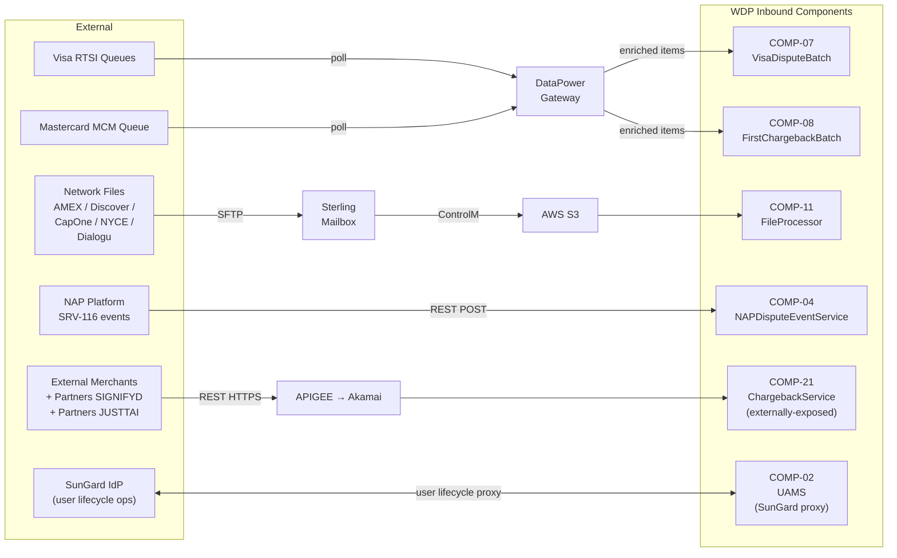

# WDP-INTEGRATIONS.md
**Worldpay Dispute Platform — External Integration Contracts**
*Version: 2.2 | Reconciled: 2026-04-30*
*Source: v2.1 (2026-04-25) + 2026-04-28/29/30 source-verification reconciliation*
*Reconciled v2.2 entries (incremental impacts): COMP-02 (new external surface — SunGard IdP, AWS S3 bulk onboarding), COMP-04 (clarification only), COMP-05 (NAP-DPS attribution clarified), COMP-22 (SFG SFTP cross-reference), COMP-26 (intra-WDP REST contract addition), COMP-35 (KMS caller-list refresh + AWS Secrets Manager added as new §6.9), COMP-39 (NAP-DPS auth gap), COMP-40 (Visa RTSI URL ambiguity closed), COMP-42 (BEN Product API resilience), COMP-51 (no external; 7 internal services). Other components in scope produced no external-integration changes.*

---

## How to Read This Document

This document covers **external integration boundaries only** — the systems outside WDP that WDP sends data to or receives data from. Internal component-to-component communication is documented in WDP-KAFKA.md (Kafka topics and consumer groups) and individual WDP-COMP-[NN]-*.md files (REST contracts between WDP services).

Every entry states: the external system, the WDP component that owns the boundary, the protocol and auth mechanism, and what happens when the external system is unavailable. Resilience capabilities are stated from confirmed source — see Section 9.

**v2.2 reconciliation summary:**
- **DEK rotation interval corrected** — §6.2 AWS KMS narrative previously implied a 6-hour DEK cache. Source-verified 2026-04-29: actual rotation interval is **days** via `${dek_rotation_interval_days}`. Aligned with WDP-DECISIONS.md DEC-008 correction.
- **AWS Secrets Manager added (NEW §6.9)** — formalised as a distinct enterprise service entry; sole caller COMP-35, startup-only.
- **UAMS external surface added** — COMP-02 SunGard IdP integration (two instances: firm-routed MFD vs standard `US_Merchant`) and AWS S3 bulk-onboarding integration (`eu-west-2`, fire-and-forget, no downstream parser identified) added to §6.1 and §7.2 respectively.
- **NAP-DPS authentication gap (RISK-179)** — §4.1 expanded to capture the source-verified finding that COMP-39 sets no Authorization header and loads no client certificate; authentication is handled outside the component at Ingress / service mesh / network layer. `napcacrt.jks` is an unreferenced orphan.
- **NAP SRV-116 attribution clarified** — §2.4 now references COMP-05 NAPDisputeEventProcessor as the runtime consumer of the `nap-dispute-events` Kafka topic (was implicit).
- **CVV-at-rest cross-link** — §2.4 NAP SRV-116 annotated with the new PCI-DSS material deficiency (RISK-084 / ADR-CAND-023) — CVV is logged via Lombok `toString()` in COMP-04 inbound and persisted at rest in COMP-05 error tables.
- **Visa RTSI URL ambiguity closed** — §3.1 now states explicitly that a single `${dispute_rtsi_url}` covers all non-NAP platforms (CORE / VAP / LATAM / PIN); no per-platform DataPower variant.
- **COMP-22 SFG SFTP** — added to §6.5 Sterling Mailbox section as a NAP-platform-only fallback path with confirmed filename-collision risk (RISK-134 / ADR-CAND-052).
- **COMP-26 intra-WDP REST contract** — added under §7.3 (NEW) as a documented WDP-internal REST contract for completeness, even though it is not strictly an external integration.
- **§10 Status Summary table** extended with new rows.

---

## 1. Integration Boundary Overview

### 1.1 Inbound Data Sources



### 1.2 Outbound Delivery Targets

```mermaid
flowchart LR
    subgraph WDP["WDP Outbound Components"]
        C19["COMP-19<br/>AcceptService"]
        C20["COMP-20<br/>ContestService"]
        C21["COMP-21<br/>ChargebackService<br/>(38 outbound call sites)"]
        C22["COMP-22<br/>DisputeService<br/>(SFG SFTP fallback)"]
        C39["COMP-39<br/>NAPOutcomeProcessor"]
        C42["COMP-42<br/>BENConsumer"]
        C43["COMP-43<br/>CoreNotificationConsumer"]
        C41["COMP-41<br/>ThirdPartyNotificationConsumer"]
        C02["COMP-02<br/>UAMS"]
        C35["COMP-35<br/>EncryptionService"]
        CF["COMP-45/46/47<br/>File Processors"]
    end

    DP["DataPower<br/>Gateway"]

    subgraph EXT["External"]
        VISA["Visa RTSI API<br/>/ Visa Adapter"]
        MCM["Mastercard<br/>MCM API"]
        NAPD["NAP-DPS<br/>SRV118 / SRV117"]
        DB2["IBM DB2<br/>Core Platform"]
        BEN["BEN-owned<br/>MSK Cluster"]
        SIG["Signifyd<br/>REST API"]
        STR2["Sterling Mailbox<br/>→ card networks"]
        SFG["SFG SFTP<br/>(NAP fallback)"]
        EAPI["Enterprise<br/>Cert eAPI<br/>(Entitlement Lookup)"]
        S3UAMS["AWS S3<br/>(eu-west-2 bulk onboarding)"]
        KMS["AWS KMS"]
        SECRETS["AWS Secrets<br/>Manager"]
    end

    C19 --> DP
    C20 --> DP
    DP --> VISA
    DP --> MCM
    C21 -.->|inactive in prod;<br/>wired and ready| EAPI
    C22 -->|@Async fire-and-forget| SFG
    C39 --> NAPD
    C43 --> DB2
    C42 --> BEN
    C41 --> SIG
    C02 --> S3UAMS
    C35 --> KMS
    C35 -.->|startup-only| SECRETS
    CF -->|S3 → ControlM| STR2
```

---

## 2. Inbound Integrations

External systems that push or deliver dispute data into WDP.

---

### 2.1 Visa Dispute Events — RTSI Queue Polling

[Content unchanged from v2.1.]

---

### 2.2 Mastercard First Chargeback Events — MCM Queue Polling

[Content unchanged from v2.1.]

---

### 2.3 Network Inbound Files — Sterling → S3 Path

[Content unchanged from v2.1.]

---

### 2.4 NAP Dispute Events — SRV-116 Push ⚠️ Refined 2026-04-30

| Field | Value |
|---|---|
| **External system** | NAP acquiring platform |
| **WDP owner (inbound REST endpoint)** | COMP-04 NAPDisputeEventService |
| **WDP owner (Kafka consumer side)** | COMP-05 NAPDisputeEventProcessor *(attribution clarified 2026-04-30)* |
| **Direction** | NAP pushes REST POST → COMP-04 → `nap-dispute-events` Kafka topic → COMP-05 |
| **Protocol** | REST (inbound to COMP-04); Kafka (COMP-04 → COMP-05) |
| **Auth (REST)** | ⚠️ EXCEPTION (2026-04-29) — **All COMP-04 endpoints unauthenticated at app level.** SecurityConfig whitelist is `/**`. Auth relies entirely on Ingress / network controls. See WDP-NFRS.md RISK-115 / WDP-DECISIONS.md ADR-CAND-031. |
| **Status** | ✅ Production (decommission-scoped — EDIA migration planned) |

NAP pushes SRV-116 dispute event notifications and operator responses to COMP-04 via REST. COMP-04 enriches the event synchronously via internal WDP services and publishes the enriched NapEvent to the `nap-dispute-events` Kafka topic. COMP-05 consumes the topic and processes against the `NAP.*` schema.

COMP-04 is stateless — no database. All persistence is downstream.

⚠️ **Enrichment chain detail (refined 2026-04-29):** The new-dispute enrichment chain is **alternative, not sequential**:
- CaseManagement is tried first
- FraudSwitch only runs when CaseManagement returns null
- DisplayCodeService only runs on the GUARPAY1 / GUARPAY4 + fraudIndemnified branch

This corrects v1.0/v2.0 documentation that implied a sequential three-step chain.

⚠️ **Bypass scope (refined 2026-04-29):** Bypass condition (`enrichment_failure=true OR function_code=603`) is honoured **only on POST /event**. Case-update and outcome paths do not pass through `EventBusinessValidator.validateRequest`. The `enrichmentFailure` field on the outbound `NapEvent` is a **pass-through copy** of the inbound `message.enrichment_failure` — COMP-04 never sets it itself. If COMP-04's own enrichment fails, the request returns HTTP 500 — no event is published.

⚠️ **Hidden retry-config coupling (added 2026-04-29):** `${kafka_retry_count}` and `${kafka_retry_delay}` env vars **also govern** CaseManagement (new-event path), FraudSwitch, and DisplayCodeService outbound REST retries. Tuning Kafka retry silently retunes those three REST dependencies. See WDP-NFRS.md RISK-117 / WDP-DECISIONS.md ADR-CAND-040.

⚠️ **Partition key per-endpoint variation (added 2026-04-29):** COMP-04's outbound `nap-dispute-events` Kafka publish uses `merchantId` as partition key on case-update and outcome paths but `cardAcceptorCodeId` on POST `/event` (new-dispute path) only. See WDP-DECISIONS.md DEC-003 deviation map.

🔴 **NEW MATERIAL DEFICIENCY (2026-04-30) — CVV-at-rest in NAP path (PCI-DSS 3.2.1):** Two cross-linked findings on this integration path:
- **COMP-04 logs CVV** — `NapEvent.toString()` is generated by Lombok and surfaces the `cvv` field. The service logs the outbound event at INFO immediately before Kafka publish. Every published NAP event produces a log line containing CVV.
- **COMP-05 persists CVV at rest** — `NAP.DISPUTE_EVENT_CONSUMER_ERROR` persists CVV in two places per error row: the `C_CVV` column directly mapped on the entity, AND inside `C_KAFKA_EVENT` raw JSON which retains the inbound `cvv` field.

Together these constitute a CVV-on-disk path. PCI-DSS 3.2.1 Requirement 3.2 prohibits CVV storage after authorisation regardless of encryption status. Architect decision required (remediate or document approved exception). See WDP-NFRS.md RISK-084 and WDP-DECISIONS.md ADR-CAND-023.

⚠️ **COMP-04 inbound payload also contains base64 file content via `UploadDocumentRequest.toString()`** — same Lombok `toString()` family as the CVV finding. See WDP-NFRS.md RISK-116.

**Failure handling:** Errors propagated as HTTP error responses to NAP. No DLQ. COMP-05 consumer side uses pre-ACK at-most-once delivery (DEC-005); empty `CommonErrorHandler{}` registered (RISK-025); no inbound `idempotency-key` dedup (DEC-020 deviation).

---

### 2.5 External Merchant API — APIGEE → Akamai → COMP-21

[Content unchanged from v2.1.]

---

## 3. Outbound — Card Network Submission APIs

---

### 3.1 Visa RTSI API and Visa Adapter ⚠️ Clarification 2026-04-29

[Content largely unchanged from v2.1.]

⚠️ **Clarification (2026-04-29) — Single `${dispute_rtsi_url}` for non-NAP:** Source verification of COMP-40 confirmed that a single URL placeholder `${dispute_rtsi_url}` covers all non-NAP platforms (CORE / VAP / LATAM / PIN) — no per-platform DataPower variant. Closes a latent ambiguity in the v2.1 description.

[Existing AMEX/DISCOVER gap and NAP-publish split-brain consequence content preserved from v2.1.]

---

### 3.2 Mastercard MCM API

[Content unchanged from v2.1.]

---

### 3.3 DataPower Enterprise Gateway

[Content unchanged from v2.1.]

---

## 4. Outbound — Acquiring Platform Delivery

---

### 4.1 NAP-DPS ⚠️ Refined 2026-04-29

| Field | Value |
|---|---|
| **External system** | NAP-DPS (NAP Dispute Platform Service) |
| **WDP owner** | COMP-39 NAPOutcomeProcessor |
| **Direction** | WDP → NAP-DPS REST |
| **Protocol** | REST (HTTP POST) |
| **Auth** | ⚠️ EXCEPTION (2026-04-29) — **No Authorization header set in COMP-39 source. No client certificate loaded.** `napcacrt.jks` is an unreferenced orphan in the COMP-39 repo. Authentication is handled outside the component at Ingress / service mesh / network layer — pending team confirmation. See WDP-NFRS.md RISK-179 and WDP-DECISIONS.md ADR-CAND-029-class. |
| **Status** | ✅ Production |

COMP-39 NAPOutcomeProcessor consumes `internal-integration-events` (single `@KafkaListener`) and submits SRV118 / SRV117 outbound updates to NAP-DPS. The component sets `C_ACQ_PLATFORM = "NAP"` on its error rows in `NAP.DISPUTE_EVENT_CONSUMER_ERROR` (writer 4 of 4 — see DEC-016 in WDP-DECISIONS.md).

⚠️ **(2026-04-29) Manual reprocess REST endpoint:** COMP-39 hosts the manual NAP error reprocessing REST endpoint (`POST /event`, JWT-authenticated via `JwtIssuerAuthenticationManagerResolver` resolved from `${trusted_issuers}`). This resolves the long-standing question of which component hosts the manual reprocessing surface — it is COMP-39, not COMP-05. The endpoint drives the same business pipeline as the Kafka path with no per-record locking, so a manual reprocess POST and a Kafka prior-error scan can race on the same row. See ADR-CAND-037 (manual operator reprocess endpoint pattern).

⚠️ **(2026-04-29) Cross-component shared error-table consumption:** COMP-39 prior-error scan filters on `caseNumber` + `sourceSystemName="NAP"` + `status IN (FAILED1, FAILED2)` with **no `C_EVENT_TYPE` filter**. Error records written by COMP-05 / COMP-23 / COMP-24 against the same case may be reprocessed through COMP-39's SRV118/SRV117 outbound pipeline. Same defect class as COMP-05 — uniform ADR required (ADR-CAND-024). See RISK-085.

⚠️ **(2026-04-23) Cross-reference:** The split-brain Kafka publish paths in COMP-19 (Section 3.1, 3.2) deliver `AcceptEvent` to NAP-DPS via COMP-39 even when the card network was not actually notified. NAPOutcomeProcessor consumers should not assume that an `AcceptEvent` implies the network was successfully notified. See ADR-CAND-001.

⚠️ **(2026-04-29) `NAP.NAP_UPDATE_RESPONSE_RULES` table:** COMP-39 reads this NAP-schema rules table; owner unidentified — open question (no DDL in COMP-39 repo).

---

### 4.2 IBM DB2 Core Platform (Write)

[Content unchanged from v2.1.]

---

### 4.3 BEN Kafka Cluster ⚠️ Refined 2026-04-29

| Field | Value |
|---|---|
| **External system** | BEN-owned MSK cluster (operated by BEN team — not WDP-owned) |
| **WDP owner** | COMP-42 BENConsumer |
| **Direction** | WDP → BEN MSK |
| **Protocol** | Kafka (SASL/JAAS) over distinct bootstrap servers |
| **Auth** | Separate `${ben_sasl_config}` SASL credentials |
| **Status** | ✅ Production |

[Existing v2.1 content preserved.]

⚠️ **(2026-04-29) BEN Product API — companion REST contract:** Alongside the Kafka publish to BEN MSK, COMP-42 calls a BEN Product REST API for product enrichment. Contract:
- **Auth:** `Bearer ${ben_product_license}` static license-key (not OAuth)
- **Retry:** Spring Retry, 3 attempts × 1000ms fixed delay
- **Timeout:** None
- **Circuit breaker:** None
- Same dependency-resilience class as the other five COMP-42 dependencies (CMS, CAS, Display Code Service, Notification Rule, IDP).

⚠️ **(2026-04-29) Outbound BEN partition key:** `merchantId` from `CaseSearchResponse` — DEC-003 compliant. (Distinct from the wider DEC-003 deviation map where most publishers use `caseNumber`.)

⚠️ **(2026-04-29) PUBLISHED-orphan crash window:** Same class as RISK-040 (COMP-41 Signifyd). COMP-42 has a crash window between Step 4 (Kafka offset committed) and Step 13 (final outbox UPDATE). Three failure modes invisible to COMP-12 Scheduler3 if Scheduler3 reads only FAILED / PENDING_DEFERRED. See RISK-192.

⚠️ **(2026-04-29) BEN platform idempotency — open question:** A retry-driven re-publish (or manual recovery of a PUBLISHED-orphan) will deliver the same `BENNotificationEvent` to BEN twice. Whether BEN deduplicates at its end is an open question — same class as COMP-41 / Signifyd. BEN integration team confirmation needed.

---

### 4.4 EDIA Platform (Planned)

[Content unchanged from v2.1.]

---

## 5. Outbound — Third-Party Notification

---

### 5.1 Signifyd Fraud Intelligence Platform

[Content unchanged from v2.1.]

---

### 5.2 JustAI

[Content unchanged from v2.1 — JustAI scope correction stands: active in COMP-21 inbound partner identification; planned only in COMP-41 outbound notification.]

---

## 6. Shared Enterprise Services

Services that are shared across WDP components or provided by enterprise infrastructure outside WDP.

---

### 6.1 IDP / SunGard (OAuth 2.0) ⚠️ Extended 2026-04-29

[Existing v2.1 platform-wide OAuth content preserved.]

⚠️ **(2026-04-29) UAMS-specific SunGard IdP integration — added v2.2:** COMP-02 UAMS proxies user lifecycle operations to SunGard IdP. This is a **distinct** integration from the platform-wide JWT validation OAuth flow.

| Field | Value |
|---|---|
| **External system** | SunGard IdP (user lifecycle operations) |
| **WDP owner** | COMP-02 UserAccessManagementService (UAMS) |
| **Direction** | UAMS → SunGard (proxy for create / update / disable / reset / lookup) |
| **Routing** | Two instances, firm-routed: `Merchant_Fraud_Disputes` claim → MFD instance; else → standard `US_Merchant` instance |
| **Protocol** | REST |
| **Auth** | `Bearer ${token}` + `X-SunGard-IdP-API-Key: ${key}` (same auth pattern as COMP-30) |
| **Status** | ✅ Production |

⚠️ **EXCEPTION:** No timeouts, no retry, no circuit breaker. Bare `RestTemplate`. Same DEC-014 VOID pattern as COMP-21's 38 unprotected sites. Authorization fail-mode on SunGard outage is application-layer halt — every UAMS user-lifecycle operation returns 500 → API Gateway 403 (fail-closed). See WDP-NFRS.md RISK-097, RISK-098.

---

### 6.2 AWS KMS ⚠️ Corrected 2026-04-29

| Field | Value |
|---|---|
| **System** | AWS Key Management Service |
| **WDP integration point** | COMP-35 EncryptionService (sole KMS caller) |
| **Protocol** | AWS SDK |
| **Auth** | IAM role (Kubernetes pod identity) |
| **Status** | ✅ Production |

All PAN encryption and decryption in WDP flows through COMP-35 EncryptionService, which is the sole component that calls the AWS KMS API. No other WDP component calls KMS directly.

**Key callers of COMP-35 (refreshed 2026-04-29):**
- COMP-07 VisaDisputeBatch — PAN encrypt on Visa dispute ingest
- COMP-08 FirstChargebackBatch — PAN encrypt on MC dispute ingest
- **COMP-09 CaseFillingBatch *(added 2026-04-29)*** — PAN encrypt on case-filling ingest
- COMP-11 FileProcessor — PAN encrypt on network file ingest (with DEC-004 non-numeric edge case — see RISK-073)
- **COMP-27 CaseSearchService *(added 2026-04-29)*** — v2 search path uses HPAN lookup
- COMP-43 CoreNotificationConsumer — HPAN decrypt to clear PAN at Step 6 PAN gate for DB2 new case inserts (Step 7 CREATE + actionSeq=01)

⚠️ **DEK rotation interval correction (2026-04-29):** Prior platform documentation stated a "6-hour DEK cache." This is **incorrect**. Source verification confirms the actual rotation interval is **days** via `${dek_rotation_interval_days}` — see WDP-DECISIONS.md DEC-008 correction.

⚠️ **(2026-04-29) Resilience and risk findings on KMS path:**
- **Decrypt `@Transactional` brackets the KMS network call** — a Hikari connection is held during the KMS round-trip on every decrypt request. Pool-exhaustion risk under sustained decrypt load + KMS slowdown. See WDP-NFRS.md RISK-172 and WDP-DECISIONS.md ADR-CAND-035.
- **Multi-pod DEK rotation race** — no distributed lock; concurrent COMP-35 pods may attempt rotation simultaneously. Source code carries an explicit comment acknowledging this. See WDP-NFRS.md RISK-173 and WDP-DECISIONS.md ADR-CAND-036.
- **Reuse-existing-DEK Base64 bug** — `rotateDEK()` reuse path passes `dek_enc` to KMS as raw UTF-8 bytes of the Base64 string instead of decoded ciphertext. Failure silently swallowed. See WDP-NFRS.md RISK-171.
- **Single-global-dependency concentration risk** — COMP-35 outage halts all PAN ingestion paths (COMP-07/08/09/11). HA posture is an open architecture question. See WDP-NFRS.md RISK-170.

---

### 6.3 APIGEE (B2B Gateway for External Merchants)

[Content unchanged from v2.1.]

---

### 6.4 Akamai CDN

[Content unchanged from v2.1.]

---

### 6.5 Sterling Mailbox ⚠️ Extended 2026-04-28

[Existing v2.1 platform-wide content preserved.]

⚠️ **(2026-04-28) NAP fallback path via SFG SFTP — added v2.2:** COMP-22 DisputeService uses an SFG SFTP fallback path for NAP-platform document delivery when the primary REST upload to DocumentManagementService fails.

| Field | Value |
|---|---|
| **External system** | SFG SFTP (Sterling-family transport, distinct from the inbound Sterling Mailbox path in §2.3) |
| **WDP owner** | COMP-22 DisputeService |
| **Direction** | WDP → SFG SFTP `/Outgoing/` directory |
| **Trigger** | NAP-platform `POST /documents` fallback when primary upload fails |
| **Protocol** | SFTP |
| **Auth** | SFG SFTP credentials |
| **Pattern** | Fully `@Async` end-to-end — HTTP 200 returned to caller before SFTP write completes; executor exceptions may be lost |
| **Status** | ✅ Production |

⚠️ **EXCEPTIONS (2026-04-28):**
- **Filename collision risk** — file written using raw `getOriginalFilename()` with no namespacing (no case-number prefix, no action-sequence, no timestamp). See WDP-NFRS.md RISK-134 / WDP-DECISIONS.md ADR-CAND-052.
- **HTTP 200 before SFTP write completes** — caller has no signal that file landed. Executor exceptions may be lost. See RISK-133.
- **No idempotency** — network-retried uploads re-upload, re-transfer ownership, re-publish metadata. See RISK-135 (DEC-020 deviation).

---

### 6.6 ControlM

[Content unchanged from v2.1.]

---

### 6.7 DM Mainframe

[Content unchanged from v2.1.]

---

### 6.8 Enterprise Cert eAPI Entitlement Lookup

[Content unchanged from v2.1.]

---

### 6.9 AWS Secrets Manager ⚠️ NEW 2026-04-29

| Field | Value |
|---|---|
| **System** | AWS Secrets Manager |
| **WDP integration point** | COMP-35 EncryptionService (sole caller, startup-only) |
| **Protocol** | AWS SDK v2 |
| **Auth** | IAM role (Kubernetes pod identity) |
| **Status** | ✅ Production |

COMP-35 EncryptionService calls AWS Secrets Manager once at startup to retrieve KMS master-key reference and bootstrap configuration. No runtime calls.

**Failure mode:** Pod fails to start if Secrets Manager is unreachable at startup. Once running, Secrets Manager outage has no effect.

**Note:** Previously not documented as a distinct §6 entry — formalised in v2.2 alongside AWS KMS (§6.2) for completeness. No other WDP component is currently identified as a Secrets Manager caller.

---

## 7. Document and Object Storage

### 7.1 AWS S3 and DynamoDB via DocumentManagementService

[Content unchanged from v2.1.]

---

### 7.2 AWS S3 — UAMS Bulk Onboarding ⚠️ NEW 2026-04-29

| Field | Value |
|---|---|
| **Infrastructure** | AWS S3 |
| **WDP integration point** | COMP-02 UserAccessManagementService (UAMS) — direct caller (not via COMP-37) |
| **Direction** | UAMS → S3 |
| **Bucket** | `${wdp_entity_file}` |
| **Key prefix** | `RECEIVED/{ENV}/` |
| **Region** | Hardcoded `eu-west-2` (not `us-east-1`; not `us-east-2`) |
| **Pattern** | Bulk onboarding fire-and-forget |
| **Auth** | IAM role (Kubernetes pod identity) |
| **Status** | ✅ Production |

UAMS writes bulk-onboarding entity files to S3 directly, without going through COMP-37 DocumentManagementService. The `eu-west-2` region is hardcoded.

⚠️ **EXCEPTION (2026-04-29) — No downstream parser identified.** No WDP component is currently confirmed to read these files from `RECEIVED/{ENV}/`. If a downstream consumer exists, it is outside the audited WDP repo set. Open question — pending team confirmation.

⚠️ **EXCEPTION (2026-04-29) — Region inconsistency:** UAMS hardcodes `eu-west-2`. COMP-11 FileProcessor hardcodes `us-east-2` (per WDP-NFRS Section 5.6 NOTE). Platform-primary region per Section 5.6 is `us-east-1`. Three different region values across three S3-using components. Architect decision pending.

⚠️ **No timeouts, no retry, no circuit breaker** on the S3 SDK call. Same DEC-014 VOID pattern.

**Note:** This is a **distinct** S3 integration from §7.1 (COMP-37 document storage). Two WDP components now confirmed to use S3 directly: COMP-37 (documents — primary use case) and COMP-02 (bulk onboarding files — fire-and-forget).

---

### 7.3 Internal WDP REST contracts of interest *(documented for completeness, not strictly external)*

⚠️ **(2026-04-28) Note:** The following are intra-WDP REST contracts but warrant documentation given their failure-mode implications. These are not external integrations.

#### COMP-26 → CaseActionService (intra-WDP)

| Field | Value |
|---|---|
| **Caller** | COMP-26 QuestionnaireService |
| **Callee** | COMP-24 CaseActionService — `mdvs-gcp-case-actions-service` |
| **Endpoint** | `GET /merchant/gcp/case-actions/{platform}/case/{caseNumber}/actions/{actionSequence}` |
| **Auth** | OAuth2 client-credentials, registration `wdp-internal-auth`, scope `openid` |
| **Profile-dependent transport** | `local` profile uses HTTPS; all other profiles use HTTP intra-cluster |
| **Failure mode** | Hard fail. No retry, no circuit breaker, no timeout. `RestClientException` rethrown → HTTP 500 to caller. |

⚠️ **(2026-04-28)** Why it matters: COMP-26 has TOCTOU race exposure (no `@Transactional` — see RISK-145 / RISK-146). Failure of this REST call between read and write produces inconsistent multi-step state.

---

## 8. Outbound — Network Response Files

[Content unchanged from v2.1.]

---

## 9. Resilience: The Actual Pattern ⚠️ Evidence base extended 2026-04-30

[Existing v2.1 content preserved.]

⚠️ **(2026-04-30) Strengthened evidence:** The DEC-014 VOID is now confirmed across all 38 source-verified components. New per-integration resilience entries added in v2.2:

### Per-integration resilience summary (extended)

| Integration | Retry | Timeout | Error record |
|---|---|---|---|
| Visa RTSI / Visa Adapter (COMP-19, COMP-20) | @Retryable (COMP-20 only) | None | HTTP 400/500 to caller; error note on case |
| MCM API (COMP-19, COMP-20) | @Retryable (COMP-20 only) | None | HTTP 400/500 to caller; error note on case |
| MCM stage-dependent submission (COMP-20) | @Retryable | None | Failure propagates per stage path |
| NAP-DPS SRV118/SRV117 (COMP-39) | @Retryable (`@EnableRetry` wired) | None | `NAP.DISPUTE_EVENT_CONSUMER_ERROR` FAILED1 |
| IBM DB2 Core write (COMP-43) | None (inline) | None | `wdp.outgoing_event_outbox` FAILED → external scheduler |
| BEN MSK Kafka publish (COMP-42) | None confirmed | None | `wdp.outgoing_event_outbox` FAILED/ERROR |
| **BEN Product REST API (COMP-42)** *(added 2026-04-29)* | Spring Retry 3 × 1000ms | None | Same dependency-resilience class as the other five COMP-42 dependencies |
| Signifyd REST API (COMP-41) | None — Spring Retry imports are dead | None | `wdp.outgoing_event_outbox` FAILED/ERROR |
| Transaction / settlement APIs (COMP-34) | None — bare RestTemplate | None | HTTP error propagated to caller |
| Visa RTSI questionnaire (COMP-40) | @Retryable | None | SNOTE via NotesService on failure |
| DataPower gateway (COMP-07, COMP-08) | None (single attempt per item) | None | MarkAsRead suppression or error in outbox |
| COMP-21 ChargebackService — 38 outbound calls | None on any of 38 sites | None on any of 38 sites | `RestClientException` wrapped to `WebServiceException` |
| Cert eAPI Entitlement Lookup (COMP-21) | None | None | HTTP 500 / upstream-forwarded; no fallback to legacy ACL |
| **SunGard IdP — UAMS proxy (COMP-02)** *(added 2026-04-29)* | None | None | HTTP 500 to caller → API Gateway 403 fail-closed |
| **AWS S3 bulk onboarding — UAMS (COMP-02)** *(added 2026-04-29)* | None | None (SDK defaults) | Fire-and-forget; no error visibility downstream |
| **AWS KMS (COMP-35)** *(added 2026-04-29)* | None | None | Decrypt `@Transactional` rolled back on KMS failure; pod startup blocks if KMS unreachable on init |
| **AWS Secrets Manager (COMP-35 startup-only)** *(added 2026-04-29)* | SDK defaults | SDK defaults | Pod fails to start; runtime not affected |
| **SFG SFTP — NAP fallback (COMP-22)** *(added 2026-04-28)* | None | None | Fully `@Async`; executor exceptions may be lost; HTTP 200 returned before SFTP write completes |
| **COMP-51 → 7 internal services (IDP, Case Action, Case Management, Expiry Rules, Update Action, Accept, Add Action)** *(added 2026-04-25)* | Hand-rolled retry counter on `wdp.case_expiry.i_retry_count` (max 3) — `spring-retry` on classpath but unused | None | After 3rd consecutive failure: outbox row written at `status=ERROR` with `channel_type=EXPIRY_BATCH` — ⚠️ **terminal-write-only, no consumer identified** (RISK-090) |

### Failure mode reference (extended 2026-04-30)

[Existing v2.1 content preserved.]

| **NEW (2026-04-29) — SunGard IdP unavailable** | UAMS application-layer halt — every NAP request returns 500 → API Gateway 403 (fail-closed). Platform-wide NAP authorization halt. See RISK-098. |
|---|---|
| **NEW (2026-04-29) — AWS KMS unavailable / slow** | All PAN ingestion paths (COMP-07/08/09/11) halt or stall. COMP-35 decrypt requests hold Hikari connections during KMS round-trip — pool exhaustion under sustained load. See RISK-172. |
| **NEW (2026-04-29) — NAP-DPS auth boundary undefined** | COMP-39 sets no Authorization header; auth handled outside the component. If Ingress / mesh / network auth misconfigures, NAP-DPS calls may fail or succeed with no application-layer awareness. See RISK-179. |
| **NEW (2026-04-29) — BEN MSK cluster unavailable + retry-driven re-publish on recovery** | Manual recovery of a PUBLISHED-orphan delivers the same `BENNotificationEvent` to BEN twice. BEN-side dedup posture unconfirmed. |
| **NEW (2026-04-30) — EXPIRY_BATCH outbox failure rows accumulate** | COMP-51 writes `status=ERROR` directly; no platform component is currently confirmed to read EXPIRY_BATCH rows. Manual operator review required. See RISK-090. |

---

## 10. Integration Status Summary ⚠️ Extended 2026-04-30

| Integration | Direction | Protocol | WDP Owner | Status |
|---|---|---|---|---|
| Visa RTSI queue polling | Inbound | REST via DataPower | COMP-07 | ✅ Production |
| MCM queue polling | Inbound | REST via DataPower | COMP-08 | ✅ Production |
| Network inbound files (Sterling → S3) | Inbound | SFTP → ControlM → S3 | COMP-11 | ✅ Production |
| **NAP SRV-116 events (REST inbound + Kafka relay to COMP-05)** | Inbound | REST → Kafka | **COMP-04 + COMP-05** *(attribution clarified 2026-04-30)* | ✅ Production (decommission-scoped) |
| External merchant API (APIGEE → Akamai) | Inbound | REST HTTPS | COMP-21 | ✅ Production |
| Visa RTSI / Visa Adapter (accept and contest) | Outbound | REST | COMP-19, COMP-20 | ✅ Production |
| Mastercard MCM API (accept and contest) | Outbound | REST | COMP-19, COMP-20 | ✅ Production |
| DataPower enterprise gateway | Shared proxy | REST | COMP-07/08/19/20/34 | ✅ Production (enterprise) |
| NAP-DPS (SRV118 / SRV117) | Outbound | REST | COMP-39 | ✅ Production — ⚠️ auth handled outside component |
| IBM DB2 Core platform (write) | Outbound | JDBC / JPA | COMP-43 | ✅ Production |
| IBM DB2 Core platform (read-only) | Outbound | JDBC / JPA | COMP-03, COMP-34 | ✅ Production |
| BEN MSK Kafka cluster | Outbound | Kafka (SASL/JAAS) | COMP-42 | ✅ Production |
| **BEN Product REST API** *(added 2026-04-29)* | Outbound | REST | COMP-42 | ✅ Production |
| Signifyd REST API | Outbound | REST | COMP-41 | ✅ Production |
| JustAI (inbound partner identity) | Inbound | REST HTTPS | COMP-21 | ✅ Production |
| JustAI (outbound third-party notification) | Outbound | REST (planned) | COMP-41 | 🔴 Planned |
| EDIA platform | Outbound | Kafka | COMP-44 (planned) | 🔴 Planned |
| CapitalOne response files | Outbound | S3 → ControlM → Sterling → DM Mainframe | COMP-45 | ✅ Production |
| Amex / AmexHybrid / Discover / DiscoverHybrid files | Outbound | S3 → ControlM → Sterling | COMP-46 | 🔄 In Development |
| Dialogu issuer documents | Outbound | S3 → ControlM → Sterling SFTP | COMP-47 | ✅ Production |
| NYCE file generation | Outbound | S3 → ControlM → Sterling → DM Mainframe | COMP-48 | 🔴 Planned |
| IDP / SunGard (OAuth 2.0 JWT) | Shared | OAuth 2.0 / JWT | COMP-02, COMP-36, all services | ✅ Production |
| **SunGard IdP — UAMS user-lifecycle proxy** *(added 2026-04-29)* | Outbound | REST | **COMP-02** | ✅ Production — two firm-routed instances |
| AWS KMS | Outbound | AWS SDK | COMP-35 | ✅ Production |
| **AWS Secrets Manager** *(added 2026-04-29)* | Outbound (startup-only) | AWS SDK v2 | **COMP-35** | ✅ Production |
| **AWS S3 — UAMS bulk onboarding (`eu-west-2`)** *(added 2026-04-29)* | Outbound | AWS SDK | **COMP-02** | ✅ Production — ⚠️ no downstream parser identified |
| APIGEE (B2B gateway) | Inbound (via) | REST | COMP-21 (via APIGEE) | ✅ Production (enterprise) |
| Akamai CDN | Shared | HTTPS | COMP-21 + COMP-49 | ✅ Production (enterprise) |
| Sterling Mailbox (inbound files) | Inbound | SFTP | COMP-11, 45, 46, 47 | ✅ Production (enterprise) |
| **SFG SFTP — NAP fallback (COMP-22 outbound)** *(added 2026-04-28)* | Outbound | SFTP | **COMP-22** | ✅ Production — NAP-platform-only fallback |
| ControlM | Shared (file transfer) | File transfer agent | COMP-11, 45, 46, 47 | ✅ Production (enterprise) |
| DM Mainframe | Outbound | Mainframe-to-mainframe | COMP-45, COMP-48 (planned) | ✅ Production (WDP-owned) |
| AWS S3 + DynamoDB (via COMP-37) | Outbound | REST (via COMP-37) | COMP-37 | ✅ Production |
| Visa questionnaire RTSI (5 endpoints) | Outbound | REST | COMP-40 | ✅ Production |
| Enterprise Cert eAPI Entitlement Lookup | Outbound | REST HTTPS | COMP-21 | ⚠️ Wired — inactive in prod (`entitlementFlag=false`) |

---

## 11. Documents Requiring Update

**v2.2 reconciliation status:**

| Document | Required change | Status |
|---|---|---|
| WDP-COMP-INDEX.md | All v2.1 corrections (BEN, JustAI scope, COMP-21 scope) | ✅ Done in v2.2 |
| WDP-COMP-INDEX.md | Add COMP-51 row; update 17 component rows for 2026-04-28/29/30 audit results | ✅ Done in v2.2 |
| WDP-HANDOVER.md | All v2.1 changes + Phase 3 reconciliation (CVV finding, EXPIRY_BATCH terminal-write-only, DEC-021 scope expansion, etc.) | ✅ Done in v3.2 |
| WDP-DECISIONS.md | DEC-008 DEK rotation correction; DEC-019 CVV-at-rest exception; DEC-021 scope expansion; 37 new candidate ADRs (ADR-CAND-023 to 059) | ✅ Done in v2.2 |
| WDP-NFRS.md | Phase 3 risk register expansion (RISK-083 to RISK-194); RISK-010 promoted 🟠→🔴; 9 platform-wide rows extended | ✅ Done in v2.2 |
| WDP-DB.md | New rows for `wdp.queues` / `wdp.queue_criterion` / `wdp.user_queue` / `wdp.hash_key_store` / `wdp.data_enc_key`; ElastiCache row rewritten; outbox writers now 5; CVV PCI-DSS finding documented | ✅ Done in v2.2 |
| WDP-KAFKA.md | Hidden Coupling subsection; CommonErrorHandler list extended to 10 components; COMP-22 Kafka-disablement attribution | ✅ Done in v2.2 |
| WDP-FLOW-INDEX.md | FLOW-11 expanded to "Case Expiry — Subsystem Lifecycle"; new "Per-Flow Authoring Notes" section | ✅ Done in v1.1 |
| WDP-ARCHITECTURE.md | Component count 50→51; Case Expiry Subsystem grouping; AMEX/DISCOVER + MC CHI no-op note; multi-datasource clarification | ⚠️ Pending |

---

*This document covers external integration boundaries only.*
*Internal Kafka topic contracts: WDP-KAFKA.md*
*Internal REST contracts between WDP services: individual WDP-COMP-[NN]-*.md files*
*UI integration patterns (MFE embedding): to be documented in WDP-COMP-49 and WDP-COMP-50*

*v2.2 reconciled 2026-04-30 — DEK rotation interval correction (days, not 6 hours); AWS Secrets Manager added (§6.9); UAMS external surface added (SunGard IdP §6.1, AWS S3 bulk onboarding §7.2); NAP-DPS authentication gap captured (§4.1); NAP SRV-116 attribution clarified (§2.4) with cross-link to CVV PCI-DSS material deficiency; Visa RTSI URL ambiguity closed (§3.1); SFG SFTP NAP fallback added (§6.5); BEN Product REST API resilience added (§4.3 + §9). Status summary table extended with 6 new rows.*
