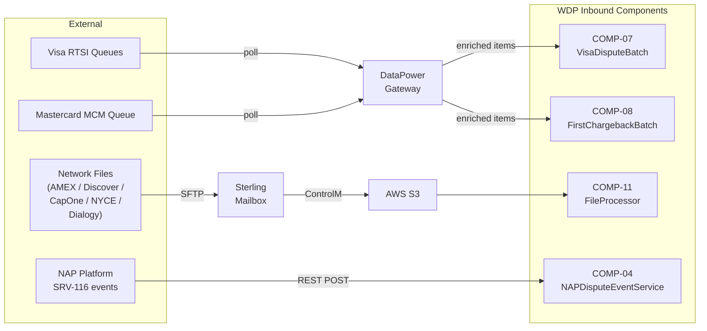
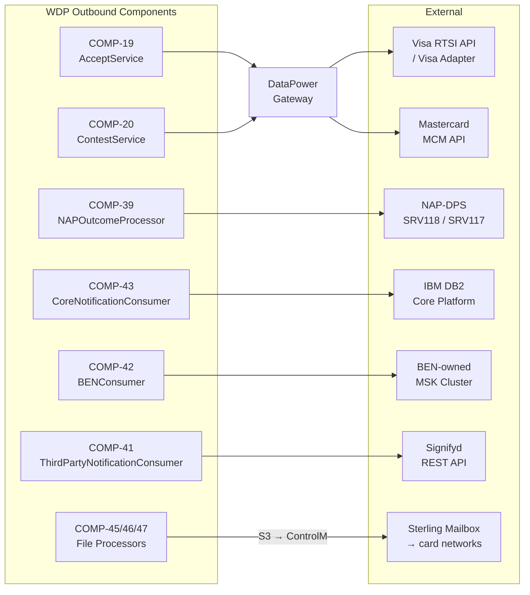

# WDP-INTEGRATIONS.md
**Worldpay Dispute Platform — External Integration Contracts**
*Version: 2.0 | Rebuilt: April 2026*
*Source: Component files COMP-04, COMP-07, COMP-08, COMP-11, COMP-19, COMP-20,*
*COMP-34, COMP-39, COMP-40, COMP-41, COMP-42, COMP-43 (April 2026 survey)*

---

## How to Read This Document

This document covers **external integration boundaries only** — the systems
outside WDP that WDP sends data to or receives data from. Internal
component-to-component communication is documented in WDP-KAFKA.md (Kafka
topics and consumer groups) and individual WDP-COMP-[NN]-*.md files
(REST contracts between WDP services).

Every entry states: the external system, the WDP component that owns the
boundary, the protocol and auth mechanism, and what happens when the external
system is unavailable. Resilience capabilities are stated from confirmed
source — see Section 9 for the platform-wide resilience pattern.

**⚠️ v1.0 document status:** The v1.0 document contained material errors:
circuit breakers described as active (DEC-014 is void), "exactly-once Kafka
delivery" claimed for acquiring platforms (WDP uses at-most-once), BEN
described as REST webhook (it is Kafka), and JustAI listed as live (it is
planned). All of these are corrected in this version. The MFE integration
section from v1.0 has been removed — that content belongs in COMP-49 and
COMP-50 when UI documentation is written.

---

## 1. Integration Boundary Overview

### 1.1 Inbound Data Sources

### 1.2 Outbound Delivery Targets

---

## 2. Inbound Integrations

External systems that push or deliver dispute data into WDP.

---

### 2.1 Visa Dispute Events — RTSI Queue Polling

| Field | Value |
|---|---|
| **External system** | Visa RTSI (Real-Time Service Interface) queue API |
| **WDP owner** | COMP-07 VisaDisputeBatch |
| **Direction** | WDP polls outbound → receives inbound dispute items |
| **Protocol** | REST via DataPower enterprise gateway |
| **Auth** | vantiveLicense header (via DataPower) |
| **Status** | ✅ Production |

COMP-07 polls seven Visa RTSI queue types sequentially via the DataPower
enterprise gateway. For each queued item, COMP-07 calls Visa HyperSearch to
enrich dispute data, encrypts PAN via EncryptionService (COMP-35), and writes
a PENDING row to `wdp.chbk_outbox_row`. Each item is acknowledged back to
the RTSI queue via a MarkAsRead call only after the outbox write succeeds.

Processing is sequential and single-threaded — all seven queue types run in
one job execution.

**Failure handling:** `removeItemFromQueueDisabled` safety flag (DEC-022) can
suppress all MarkAsRead calls globally. No circuit breaker. No retry on queue
poll itself.

**Scaling constraint:** Must run replica = 1 (DEC-023). Multiple replicas
create parallel queue polling and duplicate case creation risk.

---

### 2.2 Mastercard First Chargeback Events — MCM Queue Polling

| Field | Value |
|---|---|
| **External system** | Mastercard MCM (Mastercard Merchant Connect) queue |
| **WDP owner** | COMP-08 FirstChargebackBatch |
| **Direction** | WDP polls outbound → receives inbound dispute items |
| **Protocol** | REST via DataPower enterprise gateway |
| **Auth** | vantiveLicense header (via DataPower) |
| **Poll interval** | Every 5 minutes |
| **Status** | ✅ Production |

COMP-08 polls the MCM unworked first chargeback queue via the DataPower
gateway. For each item, COMP-08 fetches claim detail and settled transaction
PAN from MCM, encrypts PAN via EncryptionService (COMP-35), writes a PENDING
row to `wdp.chbk_outbox_row`, and acknowledges the item back to MCM.

**Failure handling:** `removeItemFromQueueDisabled` safety flag suppresses all
ACK calls globally when active. No circuit breaker.

**Scaling constraint:** Must run replica = 1 (DEC-023).

---

### 2.3 Network Inbound Files — Sterling → S3 Path

| Field | Value |
|---|---|
| **External systems** | AMEX, Discover, CapitalOne, NYCE, Dialogu |
| **WDP owner** | COMP-11 FileProcessor (ingest), COMP-12 InboundEventScheduler (relay) |
| **Direction** | External networks → Sterling → ControlM → S3 → WDP |
| **Protocol** | Sterling SFTP (external → Sterling) / ControlM file transfer (Sterling → S3) |
| **Auth** | Sterling SFTP credentials (managed outside WDP) / AWS S3 IAM role |
| **Status** | ✅ Production |

Card network and issuer dispute files are deposited to the Sterling Mailbox
enterprise file hub via SFTP. ControlM (on-premise file transfer agent) moves
files from Sterling to WDP-owned AWS S3 buckets. COMP-11 FileProcessor polls
S3 for new file job entries, downloads the file, parses rows, and writes
outbox entries for downstream processing.

**DiscoverHybrid exception:** Uses a special on-premise File Transfer Batch
component that pulls via SFTP directly, rather than the standard ControlM push
path. All other networks use the Sterling → ControlM → S3 route.

**Failure handling:** File-level job status tracked in database. Row-level
failures recorded per-row in outbox. An ACK file is generated per source file
and delivered back to the originating network.

---

### 2.4 NAP Dispute Events — SRV-116 Push

| Field | Value |
|---|---|
| **External system** | NAP acquiring platform |
| **WDP owner** | COMP-04 NAPDisputeEventService |
| **Direction** | NAP pushes REST POST → COMP-04 |
| **Protocol** | REST (inbound to COMP-04) |
| **Auth** | Bearer JWT |
| **Status** | ✅ Production (decommission-scoped — EDIA migration planned) |

NAP pushes SRV-116 dispute event notifications and operator responses to
COMP-04 via REST. COMP-04 enriches the event synchronously via internal WDP
services and publishes the enriched NapEvent to the `nap-dispute-events` Kafka
topic. Document uploads arriving on this path are proxied directly to
DocumentManagementService (COMP-37) without Kafka involvement.

COMP-04 is stateless — no database. All persistence is downstream.

**Failure handling:** Errors propagated as HTTP error responses to NAP. No DLQ.

---

## 3. Outbound — Card Network Submission APIs

WDP components that submit dispute responses back to card networks.

---

### 3.1 Visa RTSI API and Visa Adapter

| Field | Value |
|---|---|
| **External system** | Visa RTSI (Real-Time Service Interface) API |
| **WDP owners** | COMP-19 AcceptService, COMP-20 ContestService, COMP-40 VisaResponseQuestionnaire |
| **Direction** | WDP → Visa RTSI |
| **Protocol** | REST |
| **Status** | ✅ Production |

WDP submits Visa dispute acceptances and contests via two paths depending on
acquiring platform:

**NAP path:** WDP calls the local `mdvs-gcp-visa-adapter` service (a WDP-owned
internal adapter), which forwards to the Visa RTSI API using an IDP Bearer
token.

**PIN path and all non-NAP platforms:** WDP calls the Visa RTSI API directly
via the DataPower enterprise gateway using a vantiveLicense header.

COMP-40 additionally retrieves submitted questionnaire images from five Visa
RTSI endpoints after a contest is recorded, uploading each image to
DocumentManagementService (COMP-37) for S3 storage.

**Auth:**
- NAP path: IDP Bearer token via local Visa Adapter
- PIN / non-NAP path: vantiveLicense header via DataPower

**Retry:** Spring Retry `@Retryable` present in COMP-20 (3 attempts, fixed
delay) and COMP-40. No circuit breaker.

**⚠️ AMEX and DISCOVER gap in AcceptService (COMP-19):** AMEX and DISCOVER are
defined as routing constants in AcceptService but have no implementation path
for network submission. Both fall through to a `log.warn` no-op. This is
distinct from the file-based outbound path (Section 8).

---

### 3.2 Mastercard MCM API

| Field | Value |
|---|---|
| **External system** | Mastercard MCM (Mastercard Merchant Connect) API |
| **WDP owners** | COMP-19 AcceptService, COMP-20 ContestService |
| **Direction** | WDP → MCM |
| **Protocol** | REST |
| **Auth** | vantiveLicense header (via DataPower or direct MCM adapter) |
| **Status** | ✅ Production |

WDP submits Mastercard and Maestro dispute acceptances and contests via two
paths depending on acquiring platform:

**NAP path:** WDP calls the MCM adapter directly.
- COMP-19: `PUT /v6/cases/{caseId}` to accept
- COMP-20: direct MCM URL for contest

**PIN path (non-NAP):** WDP routes through the DataPower enterprise gateway.

**MC PIN PAB/ARB special case (COMP-19):** Only PAB and ARB stage codes route
to DataPower for Mastercard on PIN. The CHI stage causes AcceptService to
return without making any network call — a silent no-op.

**Retry:** Spring Retry `@Retryable` present in COMP-20 (3 attempts, fixed
delay). No circuit breaker.

---

### 3.3 DataPower Enterprise Gateway

| Field | Value |
|---|---|
| **System** | DataPower (enterprise shared infrastructure — not WDP-owned) |
| **Direction** | WDP → DataPower → card network API |
| **Protocol** | REST (WDP → DataPower); DataPower handles downstream routing and auth |
| **Status** | ✅ Production — enterprise managed |

DataPower is the enterprise HTTP gateway that proxies WDP card network API
calls for the PIN platform and non-NAP paths. WDP components address DataPower
as their target URL — DataPower handles protocol translation, auth header
injection, and network routing to the actual card network endpoint.

**WDP components that route through DataPower:**

| Component | What routes through DataPower |
|---|---|
| COMP-07 VisaDisputeBatch | Visa RTSI queue polling |
| COMP-08 FirstChargebackBatch | MCM queue polling |
| COMP-19 AcceptService | Visa and MC on PIN platform |
| COMP-20 ContestService | Visa (non-NAP) and MC (non-NAP) |
| COMP-34 MerchantTransactionService | MCM and Visa Pinned API on PIN path |

**Failure handling:** DataPower unavailability causes the calling component's
REST call to fail. No WDP-side circuit breaker on any of these paths.

---

## 4. Outbound — Acquiring Platform Delivery

Components that deliver dispute outcomes and lifecycle events to acquiring
platforms.

---

### 4.1 NAP-DPS

| Field | Value |
|---|---|
| **External system** | NAP-DPS (NAP Dispute Processing System) |
| **WDP owner** | COMP-39 NAPOutcomeProcessor |
| **Direction** | WDP → NAP-DPS |
| **Protocol** | REST (HTTP POST) |
| **Auth** | No auth header confirmed in source — possible mTLS via `napcacrt.jks` (⚠️ confirm) |
| **Status** | ✅ Production |

COMP-39 consumes `internal-integration-events`, filters to NAP platform events
only (all other platforms are silently discarded after pre-commit offset), and
makes up to two HTTP POST calls per event to NAP-DPS:

- **SRV118** — Chargeback outcome and representment notification:
  `POST ${nap_notification_srv118_url}`
- **SRV117** — Department notice letter notification:
  `POST ${nap_notification_srv117_url}`

Prior to calling NAP-DPS, COMP-39 enriches the event by looking up response
codes against `NAP.NAP_UPDATE_RESPONSE_RULES` and resolving display code
descriptions via DisplayCodeService (COMP-28).

**Error handling:** Failed calls are written to `NAP.DISPUTE_EVENT_CONSUMER_ERROR`
with status `FAILED1`. Repeated failures escalate: FAILED1 → FAILED2 → ERROR.
No automatic re-drive — manual intervention required. Built-in compensating
mechanism: on each processing cycle, COMP-39 checks for existing FAILED1 or
FAILED2 records for the same case and attempts to reprocess them alongside
the current event.

**Retry:** Spring Retry `@Retryable` with fixed delay on SRV118, SRV117, and
DisplayCode lookups. No circuit breaker.

**Known gaps:**
- `notesLookup()` step is commented out — `dataRecord` field in all SRV118
  payloads is permanently null.
- `checkCRMRAction()` is commented out in production.

**Planned migration:** Direct NAP-DPS calls will migrate to the EDIA platform
route (COMP-44 — see Section 4.4).

---

### 4.2 IBM DB2 Core Platform (Write)

| Field | Value |
|---|---|
| **External system** | IBM DB2 (CORE platform enterprise database) |
| **WDP owner** | COMP-43 CoreNotificationConsumer |
| **Direction** | WDP → IBM DB2 (write) |
| **Protocol** | Direct JDBC / JPA (Spring Data JPA, DB2 JDBC driver) |
| **Auth** | DB2 credentials managed outside WDP |
| **Status** | ✅ Production |

COMP-43 is the **sole WDP component that writes to the CORE platform IBM DB2
database**. It writes dispute case and occurrence records to three tables:

| Table | Purpose |
|---|---|
| `BC.TBC_DM_CASE` | Dispute case record |
| `BC.TBC_DM_OCCUR` | Dispute occurrence record |
| `BC.TBC_DM_NOTES` | Case notes |

Before writing, COMP-43 enriches the thin Kafka routing event by calling five
WDP REST services in sequence: IDP TokenService, CaseManagementService,
CaseActionsService, NotesService, and conditionally EncryptionService (COMP-35)
to decrypt HPAN to clear PAN for new case inserts.

**All other WDP components that access IBM DB2 are read-only:**
- COMP-03 CHAS reads the Core enterprise merchant hierarchy
- COMP-34 MerchantTransactionService reads `BC.TBC_CC_TR07` for CapOne
  transaction lookups

**Idempotency:** Via `wdp.outgoing_event_outbox` (channel_type = `CORE_EVENTS`).
Composite duplicate key: `{idempotency_id, channel_type, event_timestamp}`.

**Predecessor blocking:** If an earlier event for the same case is in a
non-terminal state in the outbox, the current event is written as
PENDING_DEFERRED and deferred for retry.

**Retry:** No inline retry on DB2 write. Retry is delegated to an external
scheduler that detects FAILED outbox rows and re-submits them.

**Filtering:** Only events with `platform = CORE` or `platform = PIN` AND
`migrationStatus = Y` are processed. All other events (NAP, VAP, LATAM) are
silently discarded.

---

### 4.3 BEN Kafka Cluster

| Field | Value |
|---|---|
| **External system** | BEN (Bank Event Notification) platform — BEN-owned MSK Kafka cluster |
| **WDP owner** | COMP-42 BENConsumer |
| **Direction** | WDP → BEN MSK topic (Kafka publish) |
| **Protocol** | Kafka (SASL/JAAS, BEN-owned cluster — separate from WDP MSK) |
| **Auth** | SASL/JAAS credentials for BEN MSK cluster |
| **Status** | ✅ Production |

**⚠️ There is no REST or webhook call to BEN.** BEN is notified exclusively
by publishing a `BENNotificationEvent` to a BEN-owned AWS MSK Kafka cluster,
using a separate SASL/JAAS configuration distinct from WDP's own MSK instance.
After receiving these events, BEN-enrolled merchants call back WDP's
ChargebackService (COMP-21) for full dispute details and actions.

COMP-42 processes only PIN and CORE platform events. NAP, VAP, and LATAM
events are filtered and not forwarded to BEN.

Display-code enrichment (stage, action, and reason code descriptions) is loaded
once at startup from DisplayCodeService into an in-memory HashMap — no REST
call per event.

**Idempotency and retry:** Via `wdp.outgoing_event_outbox` table. Status
transitions: PUBLISHED → SUCCESS / FAILED / ERROR / PENDING_DEFERRED. No
automatic re-drive — external retry scheduler required.

**⚠️ WDP-COMP-INDEX.md correction required:** COMP-42 entry incorrectly
describes BEN notification as "via webhook." The delivery mechanism is
Kafka-only to a BEN-owned cluster. This must be corrected in COMP-INDEX.

---

### 4.4 EDIA Platform (Planned)

| Field | Value |
|---|---|
| **External system** | EDIA (enterprise Kafka streaming platform — not WDP-owned) |
| **WDP owner** | COMP-44 EDIAConsumer (planned) |
| **Direction** | WDP → EDIA Kafka topic → acquiring platform consumers |
| **Protocol** | Kafka (EDIA-owned cluster) |
| **Status** | 🔴 Planned — no repository available |

COMP-44 is the planned strategic outbound route for NAP, LATAM, and VAP
acquiring platform delivery. It will consume from WDP's `external-request-events`
topic, translate WDP internal dispute events to the EDIA enterprise event
schema, and publish to the EDIA platform Kafka topic.

COMP-44 will act as an anti-corruption layer between WDP's internal event
model and the enterprise EDIA format, decoupling WDP's event schema evolution
from the downstream platform consumers.

**Planned migrations using EDIA route:**
- COMP-39 NAPOutcomeProcessor: direct NAP-DPS REST calls will migrate to EDIA
- COMP-04 NAPDisputeEventService: decommission-scoped; EDIA is the replacement
  inbound path

---

## 5. Outbound — Third-Party Notification

---

### 5.1 Signifyd Fraud Intelligence Platform

| Field | Value |
|---|---|
| **External system** | Signifyd |
| **WDP owner** | COMP-41 ThirdPartyNotificationConsumer |
| **Direction** | WDP → Signifyd REST API |
| **Protocol** | REST (HTTP POST) |
| **Status** | ✅ Production |

COMP-41 consumes `external-request-events` and calls the Signifyd REST API
with one of three notification types depending on dispute lifecycle stage:

| Signifyd call | Trigger condition |
|---|---|
| Create Chargeback | actionSequence = `01`, eventType = `CASE_CREATED`, specific stageCode / actionCode pairs |
| Chargeback Stage | Subsequent lifecycle stage update for an existing case |
| Representment Outcome | Representment result notification |

After receiving these notifications, Signifyd calls back WDP's ChargebackService
(COMP-21) for full dispute details. That callback path is not owned by COMP-41.

**Kafka offset:** Committed after outbox INSERT but before the Signifyd REST
call. At-most-once delivery relative to Signifyd — a crash after the ACK but
before Signifyd responds loses the notification.

**Idempotency and retry:** Via `wdp.outgoing_event_outbox`. No automatic
re-drive — external retry scheduler required for FAILED rows.

---

### 5.2 JustAI (Planned)

| Field | Value |
|---|---|
| **External system** | JustAI |
| **WDP owner** | COMP-41 ThirdPartyNotificationConsumer (planned extension) |
| **Direction** | WDP → JustAI REST API |
| **Protocol** | REST |
| **Status** | 🔴 Planned — not present in codebase |

JustAI is a planned third-party integration that will extend COMP-41 with a
second notification target alongside Signifyd. No JustAI reference exists in
the current COMP-41 codebase.

---

## 6. Shared Enterprise Services

Services that are shared across WDP components or provided by enterprise
infrastructure outside WDP.

---

### 6.1 IDP / SunGard (OAuth 2.0)

| Field | Value |
|---|---|
| **System** | SunGard enterprise identity provider |
| **WDP integration point** | COMP-02 UAMS (user lifecycle proxy), COMP-36 TokenService (JWT lifecycle), all WDP services (JWT validation) |
| **Protocol** | OAuth 2.0 / JWT |
| **Status** | ✅ Production |

All WDP services validate Bearer JWTs issued by the enterprise IDP against
configured trusted issuer URLs (`${jwt_trusted_issuer_urls}`). COMP-02 UAMS
proxies all user lifecycle operations (creation, password reset, role
assignment) to SunGard via REST. COMP-36 TokenService manages JWT lifecycle
for WDP internal service-to-service authentication.

**Open question:** Which external component writes the Redis hash
`wdpinternalidptoken:token` that TokenService reads? Not yet identified from
any component file.

---

### 6.2 AWS KMS

| Field | Value |
|---|---|
| **System** | AWS Key Management Service |
| **WDP integration point** | COMP-35 EncryptionService (sole KMS caller) |
| **Protocol** | AWS SDK |
| **Auth** | IAM role (Kubernetes pod identity) |
| **Status** | ✅ Production |

All PAN encryption and decryption in WDP flows through COMP-35
EncryptionService, which is the sole component that calls the AWS KMS API.
No other WDP component calls KMS directly.

**Key callers of COMP-35:**
- COMP-07 VisaDisputeBatch — PAN encrypt on Visa dispute ingest
- COMP-08 FirstChargebackBatch — PAN encrypt on MC dispute ingest
- COMP-43 CoreNotificationConsumer — HPAN decrypt to clear PAN for DB2
  new case inserts

---

### 6.3 APIGEE (B2B Gateway for External Merchants)

| Field | Value |
|---|---|
| **System** | APIGEE (enterprise B2B API gateway — not WDP-owned) |
| **Direction** | External merchant systems → APIGEE → COMP-01 WDP API Gateway |
| **Protocol** | REST |
| **Status** | ✅ Production — enterprise managed |

External merchant systems access the WDP API surface via APIGEE, which handles
B2B authentication, rate limiting, and routing before forwarding to COMP-01
WDP API Gateway.

---

### 6.4 Akamai CDN

| Field | Value |
|---|---|
| **System** | Akamai (CDN and edge security — not WDP-owned) |
| **Direction** | Internet → Akamai → COMP-49 WDP Merchant Portal |
| **Scope** | Merchant Portal (COMP-49) only |
| **Status** | ✅ Production — enterprise managed |

Merchant-facing UI traffic routes through Akamai before reaching the WDP
Merchant Portal (COMP-49). Akamai provides CDN, DDoS protection, and edge
security for the merchant-facing surface. The WDP Ops Portal (COMP-50)
connects directly to COMP-01 API Gateway — it does not route through Akamai.

---

### 6.5 Sterling Mailbox

| Field | Value |
|---|---|
| **System** | Sterling Mailbox (enterprise file aggregation hub — not WDP-owned) |
| **Direction** | External networks → Sterling (inbound) and S3 → ControlM → Sterling (outbound) |
| **Status** | ✅ Production — enterprise managed |

Sterling is the central file exchange hub for all card network and issuer
file traffic. All inbound network dispute files arrive at Sterling before
being transferred to WDP S3. All outbound network response files (COMP-45,
COMP-46, COMP-47) are deposited to S3, transferred by ControlM to Sterling,
and then delivered onwards to the target network or issuer.

---

### 6.6 ControlM

| Field | Value |
|---|---|
| **System** | ControlM (on-premise file transfer agent — not WDP-owned) |
| **Direction** | Bridges Sterling Mailbox and AWS S3 in both directions |
| **Status** | ✅ Production — enterprise managed |

ControlM is the file transfer agent that moves files between Sterling Mailbox
and WDP-owned S3 buckets. All standard inbound and outbound file paths use
ControlM. DiscoverHybrid is the one exception: it uses an on-premise File
Transfer Batch component that pulls via SFTP, bypassing the ControlM push.

---

### 6.7 DM Mainframe

| Field | Value |
|---|---|
| **System** | DM Mainframe (WDP-owned on-premise) |
| **Direction** | Outbound to CapitalOne and NYCE networks via Sterling |
| **Status** | ✅ Production (WDP-owned, not a microservice) |

DM Mainframe handles mainframe-to-mainframe file transfers for card networks
that require this protocol. Outbound files from COMP-45 (CapitalOne response
files) and the planned COMP-48 (NYCE file generation) are delivered via:
S3 → ControlM → Sterling → DM Mainframe → card network.

---

## 7. Document Storage

### 7.1 AWS S3 and DynamoDB via DocumentManagementService

| Field | Value |
|---|---|
| **Infrastructure** | AWS S3 (document storage), AWS DynamoDB (document metadata) |
| **WDP integration point** | COMP-37 DocumentManagementService |
| **Direction** | WDP components → COMP-37 REST → S3 / DynamoDB |
| **Protocol** | REST (internal — components call COMP-37, not S3/DynamoDB directly) |
| **Auth** | Internal JWT (Bearer token propagation) |
| **Status** | ✅ Production |

All document operations within WDP go through COMP-37 DocumentManagementService.
No WDP component calls S3 or DynamoDB directly. COMP-37 manages the S3 path
structure, DynamoDB metadata records, and presigned URL generation for document
retrieval.

**Key COMP-37 callers:**
- COMP-04 NAPDisputeEventService — proxies NAP document uploads
- COMP-15 EvidenceConsumer — attaches evidence files to cases
- COMP-20 ContestService — attaches contest action documents
- COMP-40 VisaResponseQuestionnaire — stores retrieved Visa questionnaire images

---

## 8. Outbound — Network Response Files

### 8.1 File Generation and Delivery

File processors read from `wdp.file_generation_event` and write generated
files to dedicated S3 `/outbound/` paths. ControlM transfers files from S3
to Sterling for onward delivery to the target network or issuer.

| Component | Target network / issuer | S3 path | Delivery route | Status |
|---|---|---|---|---|
| COMP-45 CapitalOneResponseFileProcessor | CapitalOne | `/outbound/capitalOne/` | S3 → ControlM → Sterling → DM Mainframe | ✅ Production |
| COMP-46 NetworkResponseFileProcessor | Amex, AmexHybrid | `/outbound/amex/`, `/outbound/amexHybrid/` | S3 → ControlM → Sterling | 🔄 In Development — June 2026 |
| COMP-46 NetworkResponseFileProcessor | Discover, DiscoverHybrid | `/outbound/discover/`, `/outbound/discoverHybrid/` | Discover: S3 → ControlM → Sterling. DiscoverHybrid: on-premise File Transfer Batch SFTP pull | 🔄 In Development — June 2026 |
| COMP-47 DialoguIssuerDocumentProcessor | Dialogu (issuer) | `/outbound/dialogu/` | S3 → ControlM → Sterling SFTP | ✅ Production |
| COMP-48 NYCEFileGenerationProcessor | PIN Networks (NYCE) | `/outbound/pinNetworks/` | S3 → ControlM → Sterling → DM Mainframe | 🔴 Planned |

---

## 9. Resilience: The Actual Pattern

The v1.0 document described a circuit breaker pattern with 50% failure
thresholds, 30-second open windows, and exponential backoff. **This was
incorrect.** DEC-014 (Resilience4j circuit breakers) is void — Resilience4j
is confirmed absent from all 40 WDP components. See WDP-DECISIONS.md.

### What WDP actually uses

**Spring Retry (`@Retryable`)** is the sole active resilience mechanism for
external calls. It is present in a subset of components only. Typical
configuration: 3 attempts with a fixed delay interval. Components without
`@Retryable` make a single attempt — failure propagates immediately.

**No timeouts** are configured on any WDP `RestTemplate`. All outbound REST
calls rely on OS-level TCP timeouts, which are effectively infinite. A hung
downstream service will block the calling thread indefinitely.

**No DLQ topics** exist in WDP. Error visibility is via database error tables
(DEC-016) or SNOTE notes via NotesService, depending on component.

### Per-integration resilience summary

| Integration | Retry | Timeout | Error record |
|---|---|---|---|
| Visa RTSI / Visa Adapter (COMP-19, COMP-20) | @Retryable (COMP-20 only) | None | HTTP 400/500 to caller; error note on case |
| MCM API (COMP-19, COMP-20) | @Retryable (COMP-20 only) | None | HTTP 400/500 to caller; error note on case |
| NAP-DPS SRV118/SRV117 (COMP-39) | @Retryable | None | `NAP.DISPUTE_EVENT_CONSUMER_ERROR` FAILED1 |
| IBM DB2 Core write (COMP-43) | None (inline) | None | `wdp.outgoing_event_outbox` FAILED → external scheduler |
| BEN MSK Kafka publish (COMP-42) | None confirmed | None | `wdp.outgoing_event_outbox` FAILED/ERROR |
| Signifyd REST API (COMP-41) | None confirmed | None | `wdp.outgoing_event_outbox` FAILED/ERROR |
| Transaction / settlement APIs (COMP-34) | None — bare RestTemplate | None | HTTP error propagated to caller |
| Visa RTSI questionnaire (COMP-40) | @Retryable | None | SNOTE via NotesService on failure |
| DataPower gateway (COMP-07, COMP-08) | None (single attempt per item) | None | MarkAsRead suppression or error in outbox |

### Failure mode reference

| Failure mode | What happens |
|---|---|
| Card network API transient failure | Spring Retry (if wired on that component). If retries exhausted or no retry: error recorded, HTTP 400/500 to caller |
| Card network API sustained outage | No circuit breaker — all retry attempts exhaust before error is written. Consumer threads may be blocked. |
| NAP-DPS unavailable | @Retryable exhausts → FAILED1 written to `NAP.DISPUTE_EVENT_CONSUMER_ERROR` |
| IBM DB2 unavailable | No inline retry — outbox row marked FAILED for external scheduler |
| Kafka broker unavailable (COMP-19/20 publish) | @Retryable exhausts → HTTP 500 to caller; case action already committed with no rollback |
| Downstream WDP service unavailable | Varies by component — some propagate HTTP error to caller, some swallow silently |
| BEN MSK cluster unavailable | Publish fails → outbox row marked FAILED/ERROR |

---

## 10. Integration Status Summary

| Integration | Direction | Protocol | WDP Owner | Status |
|---|---|---|---|---|
| Visa RTSI queue polling | Inbound | REST via DataPower | COMP-07 | ✅ Production |
| MCM queue polling | Inbound | REST via DataPower | COMP-08 | ✅ Production |
| Network inbound files (Sterling → S3) | Inbound | SFTP → ControlM → S3 | COMP-11 | ✅ Production |
| NAP SRV-116 events | Inbound | REST (push from NAP) | COMP-04 | ✅ Production (decommission-scoped) |
| Visa RTSI / Visa Adapter (accept and contest) | Outbound | REST | COMP-19, COMP-20 | ✅ Production |
| Mastercard MCM API (accept and contest) | Outbound | REST | COMP-19, COMP-20 | ✅ Production |
| DataPower enterprise gateway | Shared proxy | REST | COMP-07/08/19/20/34 | ✅ Production (enterprise) |
| NAP-DPS (SRV118 / SRV117) | Outbound | REST | COMP-39 | ✅ Production |
| IBM DB2 Core platform (write) | Outbound | JDBC / JPA | COMP-43 | ✅ Production |
| IBM DB2 Core platform (read-only) | Outbound | JDBC / JPA | COMP-03, COMP-34 | ✅ Production |
| BEN MSK Kafka cluster | Outbound | Kafka (SASL/JAAS) | COMP-42 | ✅ Production |
| Signifyd REST API | Outbound | REST | COMP-41 | ✅ Production |
| JustAI | Outbound | REST | COMP-41 (planned) | 🔴 Planned |
| EDIA platform | Outbound | Kafka | COMP-44 (planned) | 🔴 Planned |
| CapitalOne response files | Outbound | S3 → ControlM → Sterling → DM Mainframe | COMP-45 | ✅ Production |
| Amex / AmexHybrid / Discover / DiscoverHybrid files | Outbound | S3 → ControlM → Sterling (DiscoverHybrid: SFTP pull) | COMP-46 | 🔄 In Development — June 2026 |
| Dialogu issuer documents | Outbound | S3 → ControlM → Sterling SFTP | COMP-47 | ✅ Production |
| NYCE file generation | Outbound | S3 → ControlM → Sterling → DM Mainframe | COMP-48 | 🔴 Planned |
| IDP / SunGard (OAuth 2.0 JWT) | Shared | OAuth 2.0 / JWT | COMP-02, COMP-36, all services | ✅ Production |
| AWS KMS | Outbound | AWS SDK | COMP-35 | ✅ Production |
| APIGEE (B2B gateway for external merchants) | Inbound (via) | REST | COMP-01 (via APIGEE) | ✅ Production (enterprise) |
| Akamai CDN | Shared | HTTP | COMP-49 only | ✅ Production (enterprise) |
| Sterling Mailbox | Shared (file hub) | SFTP | COMP-11, 45, 46, 47 | ✅ Production (enterprise) |
| ControlM | Shared (file transfer) | File transfer agent | COMP-11, 45, 46, 47 | ✅ Production (enterprise) |
| DM Mainframe | Outbound | Mainframe-to-mainframe | COMP-45, COMP-48 (planned) | ✅ Production (WDP-owned) |
| AWS S3 + DynamoDB (via COMP-37) | Outbound | REST (via COMP-37) | COMP-37 | ✅ Production |
| Visa questionnaire RTSI (5 endpoints) | Outbound | REST | COMP-40 | ✅ Production |

---

## 11. Documents Requiring Update

As a result of this rebuild, the following corrections are required in other
documents:

| Document | Required change |
|---|---|
| **WDP-COMP-INDEX.md** | COMP-42 BENConsumer description — remove "via webhook." Replace with "Kafka publish to BEN-owned MSK cluster." |
| **WDP-COMP-INDEX.md** | COMP-41 ThirdPartyNotificationConsumer description — note JustAI is planned (not yet implemented). Signifyd is the sole live vendor. |
| **WDP-HANDOVER.md** | Mark WDP-INTEGRATIONS.md as complete (v2.0). Add BEN and JustAI correction notes to confirmed architectural facts. |
| **WDP-DECISIONS.md** | Already done (v2.0). Section 9 resilience pattern in this document correctly references DEC-014 VOID and DEC-016. |

---

*This document covers external integration boundaries only.*
*Internal Kafka topic contracts: WDP-KAFKA.md*
*Internal REST contracts between WDP services: individual WDP-COMP-[NN]-*.md files*
*UI integration patterns (MFE embedding): to be documented in WDP-COMP-49 and WDP-COMP-50*
