# WDP-COMP-01-API-GATEWAY
**Worldpay Dispute Platform — Component Reference**
*Version: 1.0 DRAFT | April 2026*
*Extracted from: `wdp-gateway` using GitHub Copilot CLI | Architect-confirmed: PENDING*

---

## ━━━ CORE SKELETON ━━━━━━━━━━━━━━━━━━━━━━━━━━━━━━━━━━━━━━
*Mandatory for every component regardless of type.*

---

## Identity

| Field             | Value                                                        |
|-------------------|--------------------------------------------------------------|
| **Name**          | `API Gateway`                                                |
| **Type**          | `REST API — Reactive Reverse Proxy with Security Filter Pipeline` |
| **Repository**    | `wdp-gateway`                                                |
| **Technology**    | Spring Cloud Gateway 2024.0.0 · Spring Boot 3.4.1 · Java 17 · WebFlux / Netty |
| **Status**        | `✅ Production`                                               |
| **Doc status**    | `📝 DRAFT`                                                   |
| **Sections present** | `Core · Block A`                                          |

---

## Purpose

**What it does**

The API Gateway is the single entry point for all WDP traffic regardless of origin —
Merchant Portal (via Akamai), Ops Portal (direct), and external merchant systems
(via Akamai → APIGEE). It runs on a reactive WebFlux/Netty stack and applies a
4-layer security filter pipeline to every inbound request before proxying it to the
appropriate backend microservice.

The four filters execute in this order:

**Step 1 — JWT Authentication** (Spring Security `SecurityWebFilterChain`). Validates
the caller's Bearer token (or `?jwt` / `?access_token` query parameter) against trusted
IDP issuers. Issuer URLs are injected from environment configuration at startup. Public
keys are fetched from each issuer's `/.well-known/jwks.json` endpoint and cached — no
per-request IDP call is made. Paths listed in the `authExceptions` column of
`wdp.api_route` (loaded once at startup) bypass this step entirely. Failure returns 401
with a Spring-default JSON error body and `WWW-Authenticate` header.

**Step 2 — Request Logging (inbound)** (`LoggingGlobalFilter`, order = -1). Logs the
inbound path and matched route identifier. Never short-circuits. If no route was matched
and the route attribute is null, a `NullPointerException` is thrown (no null guard) and
the request produces a 500.

**Step 3 — Region-Based Role Authorization** (`AuthorizationFilter`, order = 0). Extracts
region from the URL path by substring-matching `/US/`, `/UK/`, `/PIN/`, or `/NAP/`
(case-insensitive). If no region segment is present, the filter is skipped and the request
passes through. If a region is found, the JWT `AuthorizationList` claim is intersected
against the configured allowed roles for that region and firm type. Absence of the
`AuthorizationList` claim throws an uncaught `NullPointerException`, producing a 500.
An empty intersection returns 403 (empty body).

**Step 4 — Case-Level Entity Authorization** (`CaseNumberFilter`, order = 0). If both a
platform identifier and a valid 12-character case ID are present in the URL path, an
external authorization service is called. Platform is derived from the same region
segments (`/US/` or `/PIN/` → PIN; `/UK/` or `/NAP/` → NAP). Case ID is detected by
scanning path segments for exactly 12 characters, starting with an alphabetic character,
with exactly 2 alphabetic characters total. Internal firms (JWT `iss` claim contains
`us_worldpay_fis_int`) are auto-authorized without an external call. NAP requests go to
UAMS `/authorize`; PIN requests go to CHAS `/authorize`. Any non-2xx response or network
exception returns 403 (fail-closed). There is no timeout configured — a hung dependency
blocks the calling thread indefinitely. Steps 3 and 4 are both at `Order = 0`; their
relative execution order is non-deterministic.

After all filters pass, the gateway applies a per-route path rewrite (regex substitution
using `originalPathRegex` and `replacementPath` columns from `wdp.api_route`) and proxies
the request to the backend URI (`uri` column). No other request or response transformation
is applied. Body bytes are passed through as an opaque stream.

All routing configuration is stored in the `wdp.api_route` PostgreSQL table (26+ routes
confirmed). Routes are loaded into memory at startup via R2DBC and cached by Spring Cloud
Gateway's `CachingRouteLocator`. Route changes require a pod restart.

**What it does NOT do**

- Does not write to any database table. The only database interaction is reading
  `wdp.api_route` at startup. No INSERT, UPDATE, or DELETE operations exist anywhere
  in the codebase.
- Does not inspect, log, cache, or transform request or response bodies. All body bytes
  are passed through opaque.
- Does not perform rate limiting. This is delegated to Akamai (portal and B2B) and
  APIGEE (B2B).
- Does not use a service-to-service token when calling UAMS or CHAS. It forwards the
  original caller's Bearer JWT as-is. An `oauth2-client` credential configuration exists
  in all environment YMLs (`wdp-internal-auth`) but the token is never fetched or used —
  this is dead configuration or an incomplete implementation of planned service-to-service
  auth.
- Does not call the CHAS `/entity-authorize` endpoint. The `entityHierarchy` parameter
  required to route to that endpoint is always null in the current `CaseNumberFilter`
  implementation.
- Does not produce to or consume from Kafka. No Kafka dependency exists anywhere in
  `pom.xml`.
- Does not implement the transactional outbox pattern.
- Does not apply Resilience4j circuit breakers, rate limiters, bulkheads, or retry
  annotations on any outbound call. Resilience4j is not present in `pom.xml` and is
  not on the classpath.

---

## Internal Processing Flow

```mermaid
flowchart TD
    IN["External Caller — HTTPS
    Merchant Portal via Akamai
    Ops Portal direct
    B2B via Akamai → APIGEE"]

    NGINX["NGINX Ingress Controller
    proxy-body-size: 25m
    Base path: /api/merchant/gcp"]

    NETTY["Spring WebFlux / Netty
    port 8082
    base-path: /api/merchant/gcp"]

    WL{{"Path in JWT whitelist?
    authExceptions column
    in wdp.api_route"}}

    JWT["Step 1 — JWT Authentication
    Spring Security SecurityWebFilterChain
    Extract Bearer or ?jwt / ?access_token param
    Resolve issuer from JWT 'iss' claim
    Check against trusted issuer list
    Validate signature vs cached JWK Set"]

    E401["↩ 401 Unauthorized
    Spring default JSON error body
    WWW-Authenticate header"]

    LOG_IN["Step 2 — Logging Inbound
    LoggingGlobalFilter · order = -1
    Logs: incoming path + matched routeId"]

    E500_ROUTE["↩ 500 Internal Server Error
    NullPointerException
    route attribute null
    no null guard in LoggingGlobalFilter"]

    ND["⚠ Steps 3 and 4 both at Order = 0
    Relative execution order is non-deterministic"]

    REGION{{"Region segment in path?
    /US/ /UK/ /PIN/ /NAP/
    case-insensitive substring"}}

    CLAIM{{"JWT AuthorizationList
    claim present?"}}

    ROLES{{"Caller roles ∩ allowed roles
    for region + firmType ≠ ∅?"}}

    E500_NPE["↩ 500 Internal Server Error
    NullPointerException
    on null AuthorizationList claim
    latent bug — not caught"]

    E403_ROLE["↩ 403 Forbidden
    empty body — no JSON"]

    CASEID{{"Platform AND valid
    12-char caseId both
    present in path?"}}

    INTERNAL{{"isInternalFirm?
    JWT iss contains
    'us_worldpay_fis_int'"}}

    PLAT{{"platform value?"}}

    UAMS["Step 4a — POST UAMS /authorize
    Body: platform=NAP, caseNumber
    Auth: forwards original caller JWT
    Blocking RestTemplate
    No timeout · No retry · No circuit breaker"]

    CHAS["Step 4b — POST CHAS /authorize
    Body: platform=PIN, caseNumber
    Auth: forwards original caller JWT
    Blocking RestTemplate
    No timeout · No retry · No circuit breaker"]

    UAMS_R{{"UAMS response?"}}
    CHAS_R{{"CHAS response?"}}

    E403_UAMS["↩ 403 Forbidden
    empty body
    RestClientException caught
    FAIL-CLOSED"]

    E403_CHAS["↩ 403 Forbidden
    empty body
    RestClientException caught
    FAIL-CLOSED"]

    BLOCK["⚠ Thread blocked indefinitely
    No timeout configured
    Progressive thread pool exhaustion
    under sustained dependency hang"]

    REWRITE["Step 5 — Path Rewrite
    Per-route regex substitution
    originalPathRegex → replacementPath
    Values loaded from wdp.api_route at startup"]

    E500_RW["↩ 500
    Exception on invalid
    regex in wdp.api_route"]

    PROXY["Step 6 — Backend Proxy
    Spring Cloud Gateway proxy
    HTTP to backend URI from wdp.api_route
    No backend timeout configured"]

    E5XX["↩ 502 / 504
    Backend unreachable
    or Netty timeout"]

    LOG_OUT["Step 7 — Logging Outbound
    LoggingGlobalFilter .then()
    Logs: path + response status code"]

    OUT["Response to Caller"]

    IN --> NGINX --> NETTY --> WL
    WL -->|"yes — bypass JWT"| LOG_IN
    WL -->|"no"| JWT
    JWT -->|"valid JWT"| LOG_IN
    JWT -->|"invalid / missing / untrusted"| E401
    LOG_IN -->|"route matched"| ND
    LOG_IN -->|"route attribute null"| E500_ROUTE
    ND --> REGION
    REGION -->|"null — no region in path"| CASEID
    REGION -->|"region found"| CLAIM
    CLAIM -->|"absent"| E500_NPE
    CLAIM -->|"present"| ROLES
    ROLES -->|"empty — no matching role"| E403_ROLE
    ROLES -->|"non-empty — role matched"| CASEID
    CASEID -->|"platform or caseId null — skip"| REWRITE
    CASEID -->|"both present"| INTERNAL
    INTERNAL -->|"yes — auto-authorize"| REWRITE
    INTERNAL -->|"no — external caller"| PLAT
    PLAT -->|"NAP"| UAMS
    PLAT -->|"PIN"| CHAS
    UAMS --> UAMS_R
    UAMS_R -->|"2xx — authorized"| REWRITE
    UAMS_R -->|"non-2xx or exception"| E403_UAMS
    UAMS_R -->|"hung — no timeout"| BLOCK
    CHAS --> CHAS_R
    CHAS_R -->|"2xx — authorized"| REWRITE
    CHAS_R -->|"non-2xx or exception"| E403_CHAS
    CHAS_R -->|"hung — no timeout"| BLOCK
    REWRITE -->|"regex applied"| PROXY
    REWRITE -->|"invalid regex in DB"| E500_RW
    PROXY -->|"backend responds"| LOG_OUT
    PROXY -->|"backend unreachable"| E5XX
    LOG_OUT --> OUT
```

---

## Boundaries

### Inbound Interfaces

| Source | Protocol | Endpoint / Trigger | Payload / Description |
|--------|----------|--------------------|----------------------|
| WDP Merchant Portal (COMP-49) | HTTPS via Akamai | All routes in `wdp.api_route` | Bearer JWT in `Authorization` header; any request body passed opaque |
| WDP Ops Portal (COMP-50) | HTTPS direct (no Akamai) | All routes in `wdp.api_route` | Bearer JWT in `Authorization` header; any request body passed opaque |
| External merchant systems | HTTPS via Akamai → APIGEE | All routes in `wdp.api_route` | Bearer JWT in `Authorization` header; any request body passed opaque |

*The full route list is database-driven (26+ routes in `wdp.api_route`). Exact paths
require direct DB access — see Remaining Gaps.*

### Outbound Interfaces

| Target | Protocol | Endpoint / Resource | Purpose | On failure |
|--------|----------|---------------------|---------|------------|
| UserAccessManagementService (COMP-02) | REST (blocking RestTemplate) | `POST /merchant/gcp/access-management/authorize` | Case-level entity authorization for NAP platform requests | 403 empty body (fail-closed). Thread blocks indefinitely if UAMS hangs — no timeout |
| CoreHierarchyAuthorizationService (COMP-03) | REST (blocking RestTemplate) | `POST /merchant/gcp/hierarchy-authorization/authorize` | Case-level entity authorization for PIN platform requests | 403 empty body (fail-closed). Thread blocks indefinitely if CHAS hangs — no timeout |
| `wdp.api_route` (PostgreSQL via R2DBC) | Database read | `wdp.api_route` table | Load routing config, path rewrite rules, and JWT whitelist at pod startup | Pod fails to start if DB is unreachable at startup |
| Backend microservices (all) | REST (Spring Cloud Gateway proxy) | Backend URIs from `wdp.api_route` `uri` column | Forward authenticated and authorized requests to target service | 502 / 504 from Netty. No retry. No backend timeout configured. |

---

## Database Ownership

### Tables Owned (written by this component)

This component owns no database state. It is stateless. No INSERT, UPDATE, or DELETE
operations exist in the codebase.

### Tables Read (not owned by this component)

| Schema.Table | Owned by | Why accessed |
|--------------|----------|--------------|
| `wdp.api_route` | ⚠️ Writer unconfirmed — no write operations found in any component to date | Loaded at pod startup via R2DBC. Provides: route path predicates, originalPathRegex, replacementPath, backend URI, and JWT whitelist (authExceptions column). Cached in memory. Changes require pod restart. |

**Confirmed columns in `wdp.api_route`** (from `ApiRoute.java`):

| Column | Type | Description |
|--------|------|-------------|
| `id` | Long (PK) | Auto-generated primary key |
| `path` | String | Path predicate pattern for Spring Cloud Gateway route matching |
| `original_path_regex` | String | Regex applied to inbound path for the rewritePath filter |
| `replacement_path` | String | Replacement expression for the rewritten path |
| `uri` | String | Backend service URI (e.g. `http://service-name.namespace:8082`) |
| `auth_exceptions` | String | Comma-separated paths that bypass JWT validation (the JWT whitelist) |

---

## Architecture Decisions

| Decision | Detail |
|----------|--------|
| Single gateway for all traffic paths | Merchant Portal, Ops Portal, and B2B all enter through one gateway. No traffic type has a dedicated entry point. |
| JWT validation via cached public keys | IDP public keys fetched once from `/.well-known/jwks.json` and cached. No per-request IDP call. |
| Route configuration in database, not code | 26+ routes stored in `wdp.api_route`. No hardcoded routes in source. Loaded at startup — not hot-reloadable. |
| Two-tier authorization model | Region-role check (Step 3) followed by case-level entity check (Step 4). Both must pass. |
| Case-level auth split by platform | NAP → UAMS; PIN → CHAS. Routing determined by path segment substring match. |
| Internal firm bypass | Callers whose JWT `iss` claim contains `us_worldpay_fis_int` bypass external auth call — auto-authorized. |
| Gateway forwards caller JWT | No service-to-service token is used for UAMS/CHAS calls. Caller's original Bearer JWT is forwarded as-is. `oauth2-client` configuration exists in all environment YMLs but the token is never fetched or applied — dead or incomplete implementation. |
| Planned: Consolidate case-level auth | NAP/PIN split between UAMS and CHAS to be replaced by a single unified authorization service. Not yet implemented. |

---

## Risks and Constraints

| Severity | Risk |
|----------|------|
| 🔴 HIGH | **No timeout on UAMS/CHAS calls.** `RestTemplate` instantiated with no `ClientHttpRequestFactory` — connect timeout is JVM/OS default, read timeout is infinite. A single hung auth service will block a gateway thread indefinitely. Under sustained load this causes progressive thread pool exhaustion and gateway-wide degradation. |
| 🔴 HIGH | **Blocking `RestTemplate` inside a reactive WebFlux pipeline.** `GlobalFilter` runs on Reactor event loop threads. Blocking calls inside event loop threads cause thread starvation. Correct approach is a reactive HTTP client (`WebClient` with `subscribeOn(Schedulers.boundedElastic())`). |
| 🔴 HIGH | **No Resilience4j.** Not in `pom.xml`, not on classpath. No circuit breaker, rate limiter, or bulkhead on any outbound call. Combined with no timeout, a degraded UAMS or CHAS instance is a single point of failure for the entire gateway. |
| 🟡 MEDIUM | **`NullPointerException` on missing `AuthorizationList` JWT claim.** If a well-formed JWT reaches a regional path without an `AuthorizationList` claim, `claim.asString().replaceAll()` throws `NullPointerException`. Spring converts this to 500, not 403. Latent bug — not caught. |
| 🟡 MEDIUM | **`AuthorizationFilter` and `CaseNumberFilter` both at `Order = 0`.** Relative execution order is non-deterministic across JVM restarts. For requests that satisfy both filter conditions the result is correct regardless of order — but which filter's 403 fires is unpredictable, affecting log correlation. |
| 🟡 MEDIUM | **No `PodDisruptionBudget` configured.** All pods could theoretically be evicted simultaneously during a node maintenance event with no minimum availability guarantee. |
| 🟡 MEDIUM | **`spring-boot-starter-oauth2-client` imported but never invoked.** Service-account credentials configured for `wdp-internal-auth` across all environment YMLs. No code fetches or uses this token. Either a planned but incomplete service-to-service auth implementation or dead configuration. Requires clarification. |
| 🟡 MEDIUM | **No structured JSON logging.** No Logstash appender or `logstash-logback-encoder` present. Logging uses Spring Boot default Logback with plain-text output. Log aggregation in a centralised platform (ELK/Splunk) relies on unstructured text parsing. |
| 🟡 MEDIUM | **JVM heap not explicitly sized.** No `-Xms`, `-Xmx`, or `-XX:MaxRAMPercentage` set. Java 17 ergonomic defaults apply 25% of container memory limit as max heap (~512Mi against 2048Mi limit). OTel agent adds 50–150Mi overhead. Actual memory usage will far exceed the 256Mi memory request, causing scheduling pressure on nodes near their allocation ceiling. |
| 🟡 MEDIUM | **`LoggingGlobalFilter` has no null guard on route attribute.** If no route is matched and the route attribute is null, the filter throws `NullPointerException`, producing a 500 with no log correlation. |
| 🟢 LOW | **`spring-boot-starter-web` (Tomcat) present alongside reactive gateway.** Suppressed via `spring.main.web-application-type: reactive` but adds classpath weight. |
| 🟢 LOW | **`postgresql` JDBC driver present alongside R2DBC.** Gateway uses R2DBC exclusively. JDBC driver unused but adds classpath weight. |
| 🟢 LOW | **`reactor-netty` pinned to 1.2.2 as a temporary bug fix.** Overrides Spring Cloud BOM. Documented comment in `pom.xml` explains workaround for `reactor-netty#3559`. Should be reviewed when Spring Cloud is next upgraded. |

---

## Scaling and Deployment

| Parameter | Value |
|-----------|-------|
| **Kubernetes resource type** | Deployment |
| **Replica count** | XL Deploy placeholder: `{{ replicas-wdp-gateway }}`. Actual per-environment values not visible in source — injected at deploy time. |
| **Memory limit** | 2048Mi |
| **Memory request** | 256Mi |
| **CPU limit** | None configured |
| **CPU request** | None configured |
| **HPA** | Not configured |
| **Rolling update** | `type: RollingUpdate` · `maxSurge: 1` · `maxUnavailable: 0` · `minReadySeconds: 30` — zero-downtime safe |
| **PodDisruptionBudget** | Not configured — see Risks |
| **Topology spread** | Configured. `topologyKey: kubernetes.io/hostname` · `maxSkew: 1` · `whenUnsatisfiable: ScheduleAnyway` (soft preference). Label selector `app: wdp-gateway${BRANCH_NAME_PLACEHOLDER}` matches pod template labels exactly — no label mismatch. |
| **OpenTelemetry** | OTel Java agent attached via Kubernetes OpenTelemetry Operator. Annotation: `instrumentation.opentelemetry.io/inject-java: opentelemetry-operator-system/default` on pod template. |
| **Spring Actuator** | Endpoints `health` and `gateway` exposed. Port 8082 (same as application — no management port separation). Full path: `/api/merchant/gcp/actuator/health`. |
| **Logstash / structured logging** | Not configured — see Risks. |

---

## Incomplete and Planned Work

| Item | Detail |
|------|--------|
| `pom.xml` comment — reactor-netty pin | Temporary bug fix for `reactor-netty#3559`. Marked for removal when Spring Cloud is next upgraded. |
| Dead `oauth2-client` configuration | `wdp-internal-auth` service-account credentials configured in all environment YMLs. Token never fetched or used. Planned service-to-service auth not wired up. |
| Planned: unified case-level auth service | Consolidate NAP/PIN split (currently UAMS/CHAS) into a single authorization service. Not started. |
| No TODO/FIXME in Java source | None found in any Java source file. |
| No feature flags | No `@ConditionalOnProperty`, `@Profile`, or any conditional bean annotation in any configuration or filter class. |

---

## Remaining Gaps

| Gap | What is missing | Action needed |
|-----|----------------|---------------|
| **Full route list** | The 26+ routes in `wdp.api_route` — path patterns, backend URIs, rewrite rules — are not visible from source alone. | Run: `SELECT id, path, original_path_regex, replacement_path, uri, auth_exceptions FROM wdp.api_route ORDER BY id;` against a non-prod environment. |
| **JWT whitelist paths** | Actual paths in `authExceptions` column are database-driven and not visible in source. Only confirmed entry is the actuator health path. | Same query as above — inspect `auth_exceptions` column values. |
| **Replica count per environment** | XL Deploy placeholder `{{ replicas-wdp-gateway }}` — actual dev/test/prod values not in source. | Ask team: *What are the replica counts for `wdp-gateway` in dev, test, and prod?* |
| **`wdp.api_route` write owner** | No component found that writes to this table. Something must manage route creation and updates. | Ask team: *Which service or process creates and updates rows in `wdp.api_route`?* |
| **CORE / VAP / LATAM case-level auth path** | Gateway source only recognises `NAP` and `PIN` as platform values. No `CORE` string exists in gateway code. How CORE, VAP, and LATAM requests receive case-level entity authorization is not determinable from source alone. | Ask team: *What URL path structure do CORE, VAP, and LATAM requests use? How does case-level entity authorization work for those platforms today?* |
| **`oauth2-client` dead config intent** | Whether `wdp-internal-auth` config is abandoned, planned, or an incomplete implementation is unclear. | Ask team: *Was service-to-service auth between gateway and UAMS/CHAS ever planned? Should this config be removed?* |

---

---

## ━━━ TYPE BLOCK A — REST API CONTRACTS ━━━━━━━━━━━━━━━━━━

---

## REST API Contracts

**Auth model:** Bearer JWT validated against trusted IDP issuers (cached JWK public keys).
No API key. No service-to-service token.

**Note on endpoint structure:** The API Gateway does not expose application-defined REST
endpoints in the traditional sense. Its inbound surface is entirely defined by the 26+
routes stored in `wdp.api_route`. Routes are not visible from source code — they require
direct database access. The contracts below describe the gateway-level response behaviour
and the two external service calls made during the filter pipeline.

---

### Inbound Request Handling — Gateway-Level Response Contract

All requests matching a route in `wdp.api_route` are subject to the 4-filter pipeline.

**HTTP response codes**

| Status | Trigger | Error body |
|--------|---------|------------|
| `2xx` | Backend responded successfully — proxied as-is | Backend response body (opaque passthrough) |
| `401` | JWT missing, expired, or untrusted issuer (non-whitelisted path) | Spring Boot default JSON: `{"timestamp":…,"path":…,"status":401,"error":"Unauthorized","message":…}` + `WWW-Authenticate` header |
| `403` | Region-role intersection empty, OR UAMS/CHAS returned non-2xx or network exception | **Empty body — no JSON.** Callers must handle empty 403 body explicitly. |
| `500` | `NullPointerException` — route attribute null (no route matched), OR missing `AuthorizationList` claim on a regional path | Spring Boot default JSON error body |
| `502` / `504` | Backend service unreachable or Netty timeout | Netty-generated error |

**Known route pattern examples** (from unit tests only — full list requires DB query):

| Pattern | Target service |
|---------|----------------|
| `/api/merchant/gcp/case-search/pin/cases/search/{caseId}/…` | CaseSearchService (COMP — TBC) |
| `/api/merchant/gcp/case-search/nap/cases/search/{caseId}/…` | CaseSearchService (COMP — TBC) |
| `/api/merchant/gcp/actuator/health` | Actuator (self — whitelisted, JWT bypassed) |

**Allowed roles by region and firm type** (from `application.yml` — pod restart required to change):

| Region | Firm Type | Allowed Roles |
|--------|-----------|---------------|
| UK / NAP | Internal | `WDP_NAP_REGULAR`, `WDP_NAP_ADVANCED`, `WDP_NAP_SUPERVISOR`, `WDP_NAP_ADMIN`, `WDP_NAP_READ_ONLY`, `WDP_NAP_CSM`, `WDP_NAP_ORG_MANAGER`, `WDP_NAP_ORG_MNGR` |
| UK / NAP | External | `WDP_NAP_REGULAR`, `WDP_NAP_ADMIN` |
| US / PIN | Internal | `WDP_PIN_REGULAR`, `WDP_PIN_ADVANCED`, `WDP_PIN_SUPERVISOR`, `WDP_PIN_ADMIN`, `WDP_PIN_READ_ONLY`, `vantiv-iq-merchant-chargebacks` |
| US / PIN | External | `WDP_PIN_REGULAR`, `WDP_PIN_ADMIN`, `vantiv-iq-merchant-chargebacks` |

---

### Outbound Call: UserAccessManagementService — `/authorize`

Called by `CaseNumberFilter` for NAP platform requests where both platform and caseId
are present in the path and the caller is not an internal firm.

| Parameter | Value |
|-----------|-------|
| **Config key** | `user.access-management-api-url` |
| **Dev URL** | `http://user-access-management-service-develop.gcp-ff:8082/merchant/gcp/access-management` |
| **Prod URL** | `http://user-access-management-service.wdp-micro:8082/merchant/gcp/access-management` |
| **Endpoint appended** | `/authorize` (always — `/entity-authorize` is never called from this filter) |
| **HTTP Method** | `POST` |
| **Request body** | JSON: `{"platform": "NAP", "caseNumber": "<caseId>"}` — `merchantId`, `level4Entity`, `entityHierarchy` always null and omitted |
| **Auth** | `Authorization: Bearer <original-caller-JWT>` (caller token forwarded as-is — no service token) |
| **Correlation header** | `x-correlation-id: <ThreadLocal value>` |
| **Response read** | None — response type is `void.class`. Pass/fail determined by HTTP status code only. |
| **Pass condition** | HTTP 2xx |
| **Fail condition** | HTTP 4xx/5xx or any network exception → `RestClientException` → 403 returned to caller |
| **Timeout** | None configured — infinite read timeout |
| **Retry** | None |
| **Circuit breaker** | None — Resilience4j not present in `pom.xml` |

---

### Outbound Call: CoreHierarchyAuthorizationService — `/authorize`

Called by `CaseNumberFilter` for PIN platform requests where both platform and caseId
are present in the path and the caller is not an internal firm.

| Parameter | Value |
|-----------|-------|
| **Config key** | `user.core-hierarchy-authorization-service-url` |
| **Dev URL** | `http://core-hierarchy-authorization-service-develop.gcp-ff:8082/merchant/gcp/hierarchy-authorization` |
| **Prod URL** | `http://core-hierarchy-authorization-service.wdp-micro:8082/merchant/gcp/hierarchy-authorization` |
| **Endpoint appended** | `/authorize` (always — `/entity-authorize` never called from this filter) |
| **HTTP Method** | `POST` |
| **Request body** | JSON: `{"platform": "PIN", "caseNumber": "<caseId>"}` |
| **Auth** | `Authorization: Bearer <original-caller-JWT>` (same pattern as UAMS) |
| **All other parameters** | Identical to UAMS — same `RestInvoker.authorizeUser()` implementation |
| **Timeout** | None configured — infinite read timeout |
| **Retry** | None |
| **Circuit breaker** | None — Resilience4j not present in `pom.xml` |

---

## Deviation Flags

| DEC | Status | Detail | Severity |
|-----|--------|--------|----------|
| **DEC-001** (Transactional Outbox) | ✅ Compliant — N/A | Gateway performs no database writes. No outbox table. No INSERT/UPDATE/DELETE anywhere in codebase. | — |
| **DEC-003** (Kafka partition key = merchantId) | ✅ Compliant — N/A | No Kafka involvement. Not a producer. | — |
| **DEC-004** (PAN encryption before write) | ✅ Compliant | Gateway does not inspect or log request/response bodies. Body bytes are opaque passthrough. No PAN exposure risk at this layer. | — |
| **DEC-005** (Kafka offset committed manually after processing) | ✅ Compliant — N/A | No Kafka consumer. | — |
| **DEC-014** (Resilience4j on outbound calls) | 🔴 **DEVIATION** | Resilience4j is **not present in `pom.xml`** — not imported, not on classpath, not configured on any bean. No circuit breaker on UAMS or CHAS calls. Combined with no timeout and a blocking `RestTemplate`, a degraded auth service is a single point of failure for the entire gateway under load. | **HIGH** |

**Additional architectural deviations (non-DEC):**

| Concern | Detail | Severity |
|---------|--------|----------|
| Blocking `RestTemplate` in reactive pipeline | `GlobalFilter` runs on Reactor event loop threads. Blocking I/O inside event loop threads causes thread starvation. Platform standard for reactive services is `WebClient`. | 🔴 HIGH |
| No structured logging | No Logstash appender or JSON log format configured. If platform standard requires structured logs for ELK/Splunk ingestion this is a gap. Confirm with team. | 🟡 MEDIUM |
| No PodDisruptionBudget | All replicas can be evicted simultaneously during node maintenance. Standard practice for production services is a PDB with `minAvailable: 1`. | 🟡 MEDIUM |

---

*End of WDP-COMP-01-API-GATEWAY.md*
*File status: 📝 DRAFT — architect confirmation PENDING*
*Update WDP-COMP-INDEX.md doc status from PENDING to MIGRATING after upload.*
*Update WDP-DB.md `wdp.api_route` row with confirmed column list.*
*Update WDP-HANDOVER.md with two corrections to Confirmed Architectural Facts — see session notes.*
