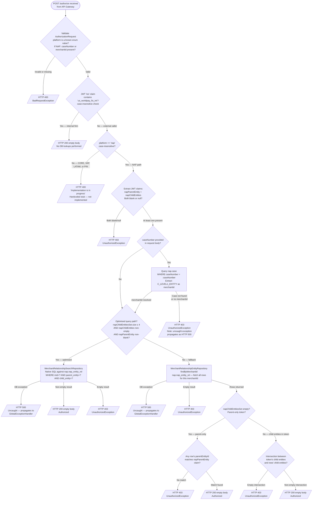
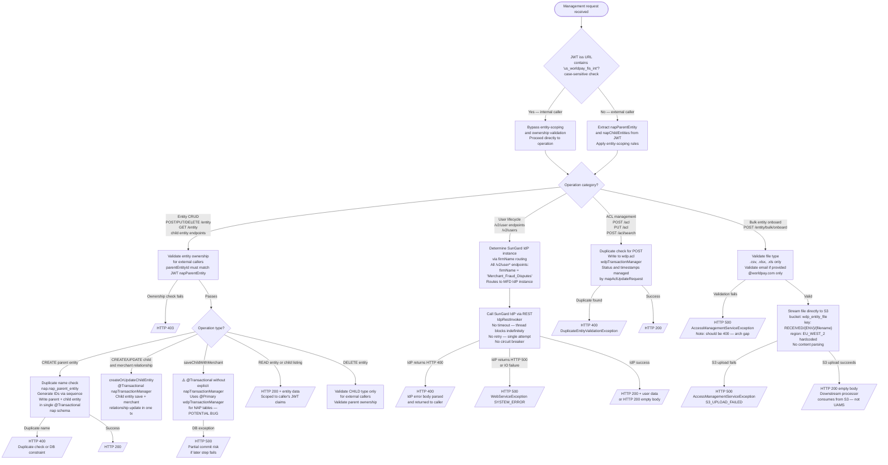

# WDP-COMP-02-UAMS
**Worldpay Dispute Platform — Component Reference**
*Version: 1.0 DRAFT | April 2026*
*Extracted from: gcp-user-access-management-service using GitHub Copilot CLI | Architect-confirmed: PENDING*

---

## ━━━ CORE SKELETON ━━━━━━━━━━━━━━━━━━━━━━━━━━━━━━━━━━━━━━
*Mandatory for every component regardless of type.*

---

## Identity

| Field | Value |
|---|---|
| **Name** | `UserAccessManagementService (UAMS)` |
| **Type** | `REST API` |
| **Repository** | `gcp-user-access-management-service` |
| **Technology** | Spring Boot 3.5.13 / Java 17 |
| **Version** | 1.5.5 |
| **Owner** | Core WDP Team |
| **Status** | ✅ Production |
| **Doc status** | 📝 DRAFT |
| **Sections present** | `Core \| Block A — REST` |
| **Context path** | `/merchant/gcp/access-management` (set via `SERVER_SERVLET_CONTEXT_PATH` environment variable) |

---

## Purpose

**What it does**

UserAccessManagementService (UAMS) is the central access-control and user-lifecycle management service for the WDP NAP ecosystem. It serves two fully independent responsibilities from a single deployable.

The first responsibility is **runtime authorization**: it exposes a `POST /authorize` endpoint consumed exclusively by the API Gateway. When the API Gateway receives a NAP-platform request bearing a case number or merchant ID, it calls this endpoint to determine whether the JWT-bearer's entity claims grant access to that resource. UAMS resolves the merchant from the case if needed, then cross-references the entity relationship data it owns to make the allow/deny decision.

The second responsibility is **reference data management and user lifecycle**: it owns and maintains the NAP merchant entity hierarchy (parent entities, child entities, merchants, and the relationships between them), an Access Control List (ACL) consumed by downstream components, and it acts as an orchestration proxy for all user lifecycle operations (create, update, activate, deactivate, suspend, reset password) against one of two external SunGard Identity Provider instances. No user credentials are stored in UAMS itself.

For bulk entity onboarding, UAMS accepts a file upload via a dedicated endpoint, validates the file type and optional email address, and writes the file directly to AWS S3. No content parsing or downstream processing is performed by UAMS itself — the file lands in S3 for a downstream consumer to process.

**What it does NOT do**

- Does not issue or mint JWT tokens
- Does not store user credentials or passwords
- Does not enforce authorization for PIN, CORE, VAP, or LATAM platforms — those platforms return HTTP 400 stub responses in production
- Does not process or parse the content of bulk onboarding files — S3 write only
- Does not use the ACL data for its own authorization decisions — ACL is maintained purely as a service to downstream consumers
- Does not produce or consume Kafka messages
- Does not use the transactional outbox pattern
- Does not handle any payment card data, PAN, or PCI-scoped fields
- Does not implement queue or skill-based routing (suspected to reside in COMP-30 UserQueueSkillService — open question)

---

## Internal Processing Flow

*This component has two fully independent entry paths. They share no processing steps and are documented separately.*

---

### Path A — POST /authorize (NAP Case-Level Authorization)

---

### Path B — Management Operations

*Path B covers four categories of management endpoint, each with its own sub-flow. All require a valid Bearer JWT. Internal callers (JWT `iss` URL contains `us_worldpay_fis_int` — case-sensitive `.contains()`) bypass entity-scoping and ownership validation. External callers are scoped to their JWT `napParentEntity` and `napChildEntities` claims.*

---

## Boundaries

### Inbound Interfaces

| Source | Protocol | Endpoint | Payload / Description |
|---|---|---|---|
| API Gateway (COMP-01) | REST — Bearer JWT | `POST /authorize` | AuthorizationRequest: platform, caseNumber (optional), merchantId (optional) |
| Merchant Portal (external NAP users) | REST — Bearer JWT | Entity, child, merchant, ACL, user, bulk onboard endpoints | Scoped to caller's JWT entity claims |
| Merchant Fraud/Disputes Portal users | REST — Bearer JWT | User lifecycle endpoints | Scoped to caller's napParentEntity claim |
| Internal Worldpay systems | REST — Bearer JWT (internal issuer) | All endpoints | All entity-scoping bypassed via internal issuer claim |

### Outbound Interfaces

| Target | Protocol | Endpoint / Resource | Purpose | On failure |
|---|---|---|---|---|
| SunGard IdP — US/Default instance | REST — API Key + Bearer token | `${idp_user_api_base_url}` | User lifecycle operations for non-MFD callers | HTTP 500 — no retry, no circuit breaker, no timeout |
| SunGard IdP — Merchant Fraud Disputes instance | REST — API Key + Bearer token | `${idp_mfd_user_api_base_url}` | User lifecycle operations for all `/v2/user*` and `/user/entity/*` endpoints (hardcoded to MFD instance) | HTTP 500 — no retry, no circuit breaker, no timeout |
| AWS S3 (eu-west-2) | S3 SDK — `putObject()` | `RECEIVED/{ENV}/{originalFilename}` in bucket `${wdp_entity_file}` | Bulk entity onboarding file storage | HTTP 500 AccessManagementServiceException |
| nap schema — Aurora PostgreSQL | JPA / PostgreSQL | `nap.nap_parent_entity`, `nap.nap_child_entity`, `nap.nap_merchant`, `nap.nap_entity_rel`, `nap.case` | Entity hierarchy CRUD and case-number resolution | Uncaught exception → HTTP 500 |
| wdp schema — Aurora PostgreSQL | JPA / PostgreSQL | `wdp.acl` | ACL management | Uncaught exception → HTTP 500 |

---

## Database Ownership

### Tables Owned (written by this component)

| Schema.Table | Purpose | Key Columns | Notes |
|---|---|---|---|
| `nap.nap_parent_entity` | Top-level NAP merchant groupings | `id` (PK seq), `i_entity_id` (business key), `c_name`, `x_insrt`, `z_insrt`, `x_updt`, `z_updt`, `X_INSRT_DISPLAY`, `X_UPDT_DISPLAY` | Written in same `@Transactional` as child entity on createEntity |
| `nap.nap_child_entity` | Sub-groupings beneath a NAP parent entity | `id` (PK seq), `i_entity_id`, `i_parent_entity_id` (FK), `c_name`, `x_insrt`, `z_insrt`, `x_updt`, `z_updt`, `X_INSRT_DISPLAY`, `X_UPDT_DISPLAY` | Written in same tx as parent on createEntity; also written by createOrUpdateChildEntity (napTransactionManager) and saveChildWithMerchant (⚠️ wrong TM — see risks) |
| `nap.nap_merchant` | Individual merchant IDs | `id` (PK seq), `i_merchant_id` (MID), `c_merchant_name`, `c_mcc`, `c_wpg_id`, `x_insrt`, `z_insrt`, `x_updt`, `z_updt`, `X_INSRT_DISPLAY`, `X_UPDT_DISPLAY` | Written by saveNewMerchant() and updateMerchant() |
| `nap.nap_entity_rel` | Merchant-to-entity relationships — primary authorization lookup table | `id` (PK seq), `i_mid` (merchant ID), `i_parent_entity_id`, `i_child_entity_id` | Written by saveChildWithMerchant(), createOrUpdateChildEntity(), deleteMerchantByParent(). Also the table queried on every /authorize call. |
| `wdp.acl` | Access control list for downstream consumers | `i_acl_id` (PK, seq `ACL_I_ACL_ID_SEQUENCE`), `c_consumer_name`, `c_source_system`, `c_entity_class`, `c_entity_type`, `c_entity_value`, `c_status`, `c_created_by`, `t_created_timestamp`, `c_updated_by`, `t_updated_timestamp`, `c_activated_by`, `c_activated_timestamp`, `c_deactivated_by`, `t_deactivated_timestamp` | Index: `acl_search_index` on `(c_consumer_name, c_status)`. Written on POST /acl and PUT /acl. Not used by UAMS itself for authorization. |

### Tables Read (not owned by this component)

| Schema.Table | Owned by | Why accessed |
|---|---|---|
| `nap.case` | Core WDP case management (write path unconfirmed) | Read-only. Resolves `caseNumber` → `merchantId` via `C_LEVEL1_ENTITY` during /authorize processing. UAMS never writes to this table. |

### Transaction Boundaries

| Operation | Transaction manager | Tables in scope | Notes |
|---|---|---|---|
| `createEntity` (PARENT type) | `napTransactionManager` — explicit | `nap.nap_parent_entity`, `nap.nap_child_entity` | Single `@Transactional` — both inserts rolled back together on any failure |
| `createOrUpdateChildEntity` | `napTransactionManager` — explicit | `nap.nap_child_entity`, `nap.nap_entity_rel` | Child entity save and merchant relationship updates in one transaction |
| `saveChildWithMerchant` | ⚠️ `wdpTransactionManager` (`@Primary`) — NOT napTransactionManager | `nap.nap_child_entity`, `nap.nap_merchant`, `nap.nap_entity_rel` | **Bug confirmed by Copilot**: `@Transactional` without explicit TM name uses the `@Primary` wdpTransactionManager. All writes target NAP schema tables — managed by napTransactionManager. Rollback on late-step failure may not occur. |
| ACL writes | `wdpTransactionManager` — explicit (primary schema) | `wdp.acl` | Correct — wdp schema uses wdpTransactionManager |

### Caching

No caching of any database reads. No Spring Cache annotations, no EhCache, no Redis, no in-memory maps for entity or relationship data.

---

## Architecture Decisions

| Decision | Detail |
|---|---|
| Single deployable — dual responsibility | UAMS combines the runtime authorization check service (stateless lookup) with the reference data management surface (stateful CRUD). These are architecturally distinct concerns served by the same pod. |
| NAP-only authorization | /authorize implements NAP platform only. CORE, VAP, LATAM, PIN return HTTP 400 stub. PIN authorization is owned by CHAS (COMP-03). |
| Internal caller bypass via JWT issuer | Internal Worldpay systems bypass all entity-scoping via a JWT `iss` claim check. The bypass check on /authorize uses case-insensitive `containsAnyIgnoreCase`; the bypass check on management endpoints uses case-sensitive `.contains()`. These are different implementations of the same logical check — a consistency gap. |
| Firm-based IdP routing in code | The SunGard IdP instance selection is determined by a `firmName` parameter passed internally. All `/v2/user*` and `/user/entity/*` endpoints hardcode `firmName = 'Merchant_Fraud_Disputes'`, routing to the MFD IdP instance. Routing is static in code via `ApplicationConstants` — not runtime-configurable. |
| S3 write — no content processing | Bulk entity onboarding files are streamed directly to S3. UAMS performs no content parsing, validation, or transformation. Downstream processing is delegated to an unidentified consumer of the S3 bucket. |
| Dual PostgreSQL datasources | Two separate Aurora PostgreSQL datasources within the same pod — `nap` schema and `wdp` schema — each with their own transaction manager and HikariCP connection pool. |
| ACL as a downstream service | UAMS maintains the ACL table as a service to downstream consumers. UAMS does not use ACL data for its own authorization decisions. |
| No credential storage | No user passwords or credentials are stored. All credential lifecycle is delegated to SunGard IdP. |
| Planned consolidation | Case-level authorization is planned to be consolidated into a single service, replacing the current NAP/PIN split between UAMS and CHAS. No timeline confirmed. |

---

## Platform Standard Deviations

| Standard | Status | Detail |
|---|---|---|
| DEC-001 Transactional Outbox | ✅ COMPLIANT (N/A) | No Kafka producer. No outbox table. The only Kafka reference in the codebase is a dead-code error code constant — no Kafka dependency in pom.xml. |
| DEC-003 Kafka Partition Key = merchantId | ✅ COMPLIANT (N/A) | No Kafka producer. |
| DEC-004 PAN Encryption | ✅ COMPLIANT | No payment card data, PAN, or PCI-scoped fields exist anywhere in the data model or API contracts. The service handles merchant IDs, entity hierarchy identifiers, and case numbers only. |
| DEC-005 Manual Kafka Offset Commit | ✅ COMPLIANT (N/A) | No Kafka consumer. |
| DEC-014 Resilience4j | ⛔ DEVIANT — HIGH SEVERITY | No Resilience4j dependency in pom.xml. No circuit breakers, bulkheads, or rate limiters on any outbound call. Combined with no timeout on the RestTemplate used for IdP calls, a hung SunGard IdP will block servlet threads indefinitely with no recovery path. Three outbound surfaces are unprotected: SunGard IdP (REST, blocking, no timeout), AWS S3, and PostgreSQL JPA. |

---

## Risks & Constraints

| Risk | Severity | Detail |
|---|---|---|
| No timeout on IdP RestTemplate | HIGH | `CommonConfig` creates RestTemplate as `new RestTemplate()` with no `ClientHttpRequestFactory` customisation. `SimpleClientHttpRequestFactory` default has no connection or read timeout. A hung SunGard IdP call blocks a servlet thread indefinitely. No circuit breaker or retry exists. Under IdP degradation, thread pool exhaustion is a realistic failure mode. |
| saveChildWithMerchant uses wrong transaction manager | HIGH | Confirmed bug: `@Transactional` without specifying `napTransactionManager` falls through to the `@Primary` `wdpTransactionManager`. All tables written by this method (`nap.nap_child_entity`, `nap.nap_merchant`, `nap.nap_entity_rel`) are in the NAP schema — managed by `napTransactionManager`. If a late step in this method fails, rollback may not be issued to the NAP datasource, leaving the hierarchy in a partially committed state. |
| NPE bug in updateEntity — PARENT type | HIGH | Confirmed bug: `entity.get().getParentName()` is called unconditionally before `entity.isPresent()` is checked. If the parent entity does not exist, this throws `NoSuchElementException` → HTTP 500. Intended behaviour is HTTP 400 (`PARENT_NOT_EXISTS`). No ticket or comment references this bug in source. CHILD type branch correctly checks presence before `.get()`. |
| IdP auth token logged at INFO level | HIGH | `IdpRestInvoker` logs the auth token value at INFO level on every outbound call. The auth token (`authCode`) is a credential — logging at INFO means it appears in standard operational log streams and is shipped to Logstash. Security risk — credentials exposed in logs. |
| Topology spread constraint inoperative | MEDIUM | Pod template label: `app: user-access-management-service${BRANCH_NAME_PLACEHOLDER}`. Topology spread `labelSelector.matchLabels.app`: `gcp-user-access-management-service${BRANCH_NAME_PLACEHOLDER}` (prefixed with `gcp-`). Labels do not match. Kubernetes never evaluates the spread constraint. All pods may schedule to the same node with no warning. |
| @Async methods — implicit pool resolution | MEDIUM | Two `@Async` methods in `AccessManagementDaoImpl` do not specify the configured `asyncExecutor` bean name. Spring resolves the pool implicitly because it is the only `TaskExecutor` bean defined. This is behaviourally correct today but breaks if a second `TaskExecutor` bean is added. Explicit pool name reference would be safer. |
| No HPA — static replica count | MEDIUM | Replica count is a fixed XL Deploy variable (`{{ replicas-user-access-management-service }}`). No automated scaling under load. Under IdP latency events, thread exhaustion can occur without any scaling response. |
| No CPU limits configured | MEDIUM | No `cpu:` entries in `resources.limits` or `resources.requests`. CPU is unconstrained. Risk of node CPU starvation affecting co-scheduled pods. |
| No PodDisruptionBudget | MEDIUM | No PDB resource in `resources.yaml`. During node maintenance or rolling updates, all pods could be evicted simultaneously. |
| S3 region hardcoded to eu-west-2 | LOW | `S3ClientConfig.java` hardcodes `Region.EU_WEST_2`. Cross-region latency or access failure if the target bucket is in a different region for a non-eu-west-2 deployment. |
| Unused IBM DB2 JDBC dependency | LOW | `com.ibm.db2:jcc` declared in pom.xml. No DB2 datasource, dialect, or schema exists anywhere in the codebase. Likely a leftover from a prior configuration. Adds to the dependency surface unnecessarily. |
| Dead config — mfdDepartmentName | LOW | `application.yaml` property `idp.mfd-department-name` is injected into `UserServiceImpl` but never referenced in any method — `getFirmDetails()` hardcodes `ApplicationConstants.MERCHANT_FRAUD_DISPUTES_DEPARTMENT_NAME` instead. Dead injection with no effect. |
| Dead code in UserController | LOW | A null/blank check block assigns `loginName` to itself on both branches — a no-op. Leftover from a refactor. No functional impact but reduces code clarity. |
| Commented-out Logstash destination IPs in logback-spring.xml | INFO | Two destinations pointing to an internal development IP (`10.43.145.125:5044`) are commented out. Residual from development configuration — no production impact. |

---

## ━━━ TYPE BLOCK A — REST API CONTRACTS ━━━━━━━━━━━━━━━━━━━
*Block A applies — UAMS is a REST API service.*

---

## REST API Contracts

**Framework:** Spring MVC (blocking servlet)
**Authentication:** Bearer JWT required on all endpoints
**Context path:** `/merchant/gcp/access-management`

---

### Authorization Endpoint

#### POST /authorize

**Controller:** `AuthorizationController`
**Caller:** API Gateway (COMP-01) — NAP platform case-level authorization
**Internal callers:** Bypass all DB lookups — HTTP 200 returned immediately on internal `iss` claim

| Field | Type | Required | Notes |
|---|---|---|---|
| `platform` | String | Yes | Must be one of: CORE, NAP, VAP, LATAM, PIN. Only NAP is implemented. |
| `caseNumber` | String | Conditional | At least one of caseNumber / merchantId required when platform = NAP |
| `merchantId` | String | Conditional | At least one of caseNumber / merchantId required when platform = NAP |

| Status | Condition | Response body |
|---|---|---|
| 200 | Authorized — entity in scope | Empty body (`ResponseEntity<Void>`) |
| 400 | Invalid/missing platform; missing both caseNumber and merchantId for NAP; case not found; merchant not found in case | `BadRequestException` message |
| 403 | JWT entity claims absent; entity not in scope | `StandardErrorResponse` JSON: `errors[{message, target}]` |
| 500 | Unhandled DB exception | No structured body |

**Notes:** HTTP 200 itself is the authorization signal — no body is returned on success. 403 returns a JSON error body. The API Gateway COMP-01 treats any non-200 as a deny. CORE, VAP, LATAM, PIN return HTTP 400 with "Implementation is in progress" — these are live stubs in production.

---

### Entity Management Endpoints

**Controller:** `AccessManagementController`
**Auth model:** Bearer JWT. External callers are scoped to their `napParentEntity` JWT claim. Internal callers bypass scoping.

| Method | Path | Callers | Internal only? | Notes |
|---|---|---|---|---|
| POST | `/entity` | Internal systems | Yes — 403 for external | Creates parent entity + child entity in single transaction |
| GET | `/entity` | Portals, internal | No — scoped for external | Lists parent entities scoped to caller's entity claims |
| PUT | `/entity/{entityId}` | Internal systems | Yes — 403 for external | Updates parent entity. ⚠️ Known NPE bug — entity-not-found returns HTTP 500 instead of HTTP 400 (PARENT type only) |
| DELETE | `/entity` | Portals (restricted), internal | Partial — CHILD type only for external, with parent ownership check | Full delete for internal callers |
| POST | `/entity/bulk/onboard` | Portals, internal | Not enforced at controller | Validates file type + email, then writes to S3. No content processing. |
| GET | `/v2/entity/{parentEntityId}/child` | Portals, internal | No — external scoped to JWT napParentEntity | parentEntityId in path must match JWT napParentEntity for external callers |
| POST | `/{parentEntityId}/child` | Portals, internal | No — external with MID scope check | |
| PUT | `/{parentEntityId}/child/{childEntityId}` | Portals, internal | No — scoped for external | childEntityId must be in token's napChildEntities list |

**POST /entity/bulk/onboard — detail:**

| Field | Type | Required | Notes |
|---|---|---|---|
| `file` | MultipartFile | Yes | Must be `.csv`, `.xlsx`, or `.xls`. Content-type validated. |
| `notifyEmailId` | String | No | Must be a `@worldpay.com` address if provided |

| Status | Condition |
|---|---|
| 200 | File successfully written to S3 |
| 500 | S3 upload failure (`AccessManagementServiceException S3_UPLOAD_FAILED`) |

---

### User Lifecycle Endpoints

**Controller:** `UserController`
**Auth model:** Bearer JWT. External callers require admin role for write operations. Scoped to `napParentEntity` claim for reads. All `/v2/user*` endpoints route to the **Merchant Fraud Disputes** SunGard IdP instance (hardcoded).

| Method | Path | IdP call? | Notes |
|---|---|---|---|
| POST | `/v2/user` | Yes — `createUserIdp()` | External: admin role + entity check required |
| PUT | `/v2/user/{loginName}` | Yes — `updateUser()` | External: admin role check |
| PUT | `/v2/user/reset-password/{userId}` | Yes — `resetUserPassword()` + pre-flight `getIdpUser()` | |
| PUT | `/v2/user/{userId}/{status}` | Yes — `updateUserAccess()` (activate/deactivate/suspend/resume) + pre-flight `getIdpUser()` for external | status values: ACTIVATE, DEACTIVATE, SUSPEND, RESUME |
| GET | `/v2/users` | Yes — `getUsersDetails()` | Returns all users scoped to entity |
| GET | `/user/entity/{loginName}/child` | Yes — `getUsersByLoginName()` then DB query | Scoped for external |
| GET | `/user/entity` | No — DB only | Scoped for external |

**Failure behaviour on IdP calls:**

| IdP response | UAMS behaviour |
|---|---|
| HTTP 400 from IdP | Parsed into error response → HTTP 400 to caller |
| HTTP 500 from IdP | `WebServiceException(SYSTEM_ERROR)` → HTTP 500 to caller |
| IO / connection failure | `WebServiceException(SYSTEM_ERROR)` → HTTP 500 to caller |
| No response (thread blocked) | Thread blocks indefinitely — no timeout, no circuit breaker |

Some methods (`resetUserPassword`, `updateUserAccess`, `getUsersByLoginName`) bypass the standard IdP error handling and throw `AccessManagementServiceException(SYSTEM_ERROR)` directly → HTTP 500.

---

### Merchant Management Endpoints

**Controller:** `MerchantController`
**Auth model:** Bearer JWT. Write operations restricted to internal callers.

| Method | Path | Internal only? | Notes |
|---|---|---|---|
| POST | `/v2/merchant` | Yes — UnauthorizedException for external | |
| GET | `/merchant` | No — scoped for external | |
| PUT | `/merchant/{merchantId}` | Yes — 403 for external | |
| DELETE | `/v2/merchant` | Yes — 403 for external | |

---

### ACL Management Endpoints

**Controller:** `AccessManagementController`
**Auth model:** Bearer JWT. No internal-only check — accessible to all authenticated callers.

| Method | Path | Notes |
|---|---|---|
| POST | `/acl` | Duplicate check before insert. Throws `DuplicateEntityValidationException` → HTTP 400 on duplicate. |
| PUT | `/acl` | Status and timestamps managed by `mapAclUpdateRequest` |
| POST | `/acl/search` | Queries `wdp.acl` filtered by `c_consumer_name` and `c_status` index |

---

## Dependencies

| Dependency | Protocol | Auth | Purpose | Timeout | Retry | Circuit Breaker |
|---|---|---|---|---|---|---|
| SunGard IdP — US/Default | REST (RestTemplate, blocking) | API Key (`X-SunGard-IdP-API-Key`) + Bearer token (`Authorization`) | User lifecycle operations | **None** — `new RestTemplate()` with no timeout config. Thread blocks indefinitely on hang. | **None** — single attempt. Exception thrown on failure. | **None** — no Resilience4j dependency. |
| SunGard IdP — Merchant Fraud Disputes | REST (RestTemplate, blocking) | API Key + Bearer token (MFD-specific keys) | User lifecycle operations for all `/v2/user*` endpoints | **None** | **None** | **None** |
| AWS S3 (eu-west-2) | S3 SDK | IAM role / injected credentials | Bulk entity onboarding file storage | Not explicitly configured | **None** | **None** |
| nap schema — Aurora PostgreSQL | JPA / JDBC | K8s secret injection | Entity hierarchy CRUD + case number resolution | HikariCP defaults | JPA retry: none | None |
| wdp schema — Aurora PostgreSQL | JPA / JDBC | K8s secret injection | ACL management | HikariCP defaults | JPA retry: none | None |

**Connection pools:** Both datasources use HikariCP with default pool size of 10 connections per pod. Not explicitly configured — platform defaults apply.

**Security concern:** IdP authentication tokens (`authCode`) are logged at INFO level in `IdpRestInvoker` on every outbound call. Credentials are present in operational log streams and shipped to Logstash.

---

## Scaling and Deployment

| Parameter | Value | Source |
|---|---|---|
| Kubernetes resource type | Deployment | `resources.yaml` |
| Replica count | `{{ replicas-user-access-management-service }}` — XL Deploy/Helm variable. Actual environment values not in source. | `resources.yaml` |
| Memory limit | `2048Mi` | `resources.yaml` |
| Memory request | `1024Mi` | `resources.yaml` |
| CPU limit | **Not configured** — CPU unconstrained | `resources.yaml` |
| CPU request | **Not configured** | `resources.yaml` |
| HPA | **Absent** — no HorizontalPodAutoscaler resource | `resources.yaml` |
| Rolling update | `type: RollingUpdate`, `maxSurge: 1`, `maxUnavailable: 0` | `resources.yaml` |
| PodDisruptionBudget | **Absent** — no PDB resource | `resources.yaml` |
| Topology spread | **Configured but inoperative** — label mismatch between pod label (`app: user-access-management-service${BRANCH_NAME_PLACEHOLDER}`) and spread constraint selector (`app: gcp-user-access-management-service${BRANCH_NAME_PLACEHOLDER}`). Kubernetes never evaluates the constraint. | `resources.yaml` lines 20 and 29–31 |
| OTel agent | ✅ Present — `instrumentation.opentelemetry.io/inject-java: opentelemetry-operator-system/default` annotation on pod template | `resources.yaml` |
| Spring Actuator | ✅ Enabled — `spring-boot-starter-actuator`. Endpoints: `info`, `health`, `prometheus`. Actuator runs on same port as application (`8082`) — no management port separation. | `application.yaml` |
| Liveness probe | `GET /merchant/gcp/access-management/livez` on port 8082 | `resources.yaml` |
| Readiness probe | `GET /merchant/gcp/access-management/readyz` on port 8082 | `resources.yaml` |
| Logstash | ✅ Configured — `logstash-logback-encoder` via `LogstashTcpSocketAppender`. Ships to `${logstash_server_host_port}`. | `logback-spring.xml` |
| Async thread pool | Bean name: `asyncExecutor`. Core pool size: `${gcp_async_corepoolsize}` (env var). Max pool size: `${gcp_async_maxpoolsize}`. Queue capacity: `${gcp_async_queuecapacity}`. Thread name prefix: `AsyncThread-`. | `AsyncConfiguration.java` |

**Async pool note:** The two `@Async` methods (`searchChildEntitiesByParentEntityIds`, `searchMerchantEntitiesByParentEntityIds`) do not specify `asyncExecutor` by name. Spring resolves to this bean implicitly because it is the only `TaskExecutor` bean defined. Behaviourally correct today but fragile if a second `TaskExecutor` is added.

---

## Planned Work and Incomplete Items

### Stub Implementations — Live in Production

| Platform | Endpoint | Behaviour |
|---|---|---|
| CORE | POST /authorize | HTTP 400 "Implementation is in progress" |
| VAP | POST /authorize | HTTP 400 "Implementation is in progress" |
| LATAM | POST /authorize | HTTP 400 "Implementation is in progress" |
| PIN | POST /authorize | HTTP 400 "Implementation is in progress" |

Note: All four platforms pass the `SourceSystemName` enum validation in `RequestValidator` but are rejected by a hardcoded `BadRequestException` in `AuthorizationServiceImpl`. Callers on these platforms receive a misleading HTTP 400 rather than a meaningful error indicating the platform is unsupported.

### Planned Changes

Case-level authorization consolidation: the current NAP/PIN split between UAMS (/authorize for NAP) and CHAS (COMP-03, /authorize for PIN/CORE/VAP/LATAM) is planned to be replaced by a single consolidated service. No timeline or design confirmed.

### Unused Dependencies

`com.ibm.db2:jcc` (IBM DB2 JDBC driver) is declared in pom.xml. No DB2 datasource configuration, dialect, or schema exists in the codebase. Likely a leftover from a prior integration design.

### Dead Configuration

`application.yaml` property `idp.mfd-department-name` is injected but never used. The field is populated but not referenced in any method — `getFirmDetails()` hardcodes the department name constant directly.

### Dead Code

In `UserController`, a null/blank check block for `loginName` assigns the variable to itself on both branches — a no-op. No functional impact.

### Commented-out Code

Two Logstash destination lines in `logback-spring.xml` point to a development internal IP address (`10.43.145.125:5044`) and are commented out. Residual from development configuration.

### No Feature Flags

No feature flags or migration flags found in source or `application.yaml`.

### No TODO / FIXME References

No `TODO`, `FIXME`, or user-story ticket references (`US-`, `WDF-`) found in any source file.

---

## Idempotency

No explicit idempotency mechanism is implemented. No idempotency keys or request deduplication. Duplicate prevention is handled by:

1. Application-level pre-insert checks (name match, relationship exists, ACL duplicate) — throw HTTP 400 on detection
2. Database unique constraints (`nap_parent_entity_c_name_key`, `nap_child_entity_c_name_key`) — `ConstraintViolationException` is caught and translated to HTTP 400

**Gap:** A race condition between two concurrent create requests can bypass the application-level check before either reaches the DB constraint. In this scenario the DB constraint catches the second insert and returns HTTP 400, not HTTP 500. The window is small but present.

---

*End of WDP-COMP-02-UAMS.md*
*Status: 📝 DRAFT — architect confirmation PENDING*
*Next: Update WDP-COMP-INDEX.md doc status from 📋 PENDING to 📝 MIGRATING*
*Update WDP-DB.md with confirmed table details below*
