# WDP-COMP-03-CHAS
**Worldpay Dispute Platform — Component Reference**
*Version: 1.0 DRAFT | April 2026*
*Extracted from: gcp-core-hierarchy-authorization-service using GitHub Copilot CLI | Architect-confirmed: PENDING*

---

## ━━━ CORE SKELETON ━━━━━━━━━━━━━━━━━━━━━━━━━━━━━━━━━━━━━━━━

---

## Identity

| Field | Value |
|---|---|
| **Name** | `CoreHierarchyAuthorizationService` |
| **Alias** | CHAS |
| **Type** | `REST API` |
| **Repository** | `gcp-core-hierarchy-authorization-service` |
| **Technology** | Spring Boot 3.4.7 / Java 17 |
| **K8s Deployment name** | `core-hierarchy-authorization-service` (with `${BRANCH_NAME_PLACEHOLDER}` suffix on non-main branches) |
| **Status** | `✅ Production` |
| **Doc status** | `📝 DRAFT — architect confirmation PENDING` |
| **Sections present** | `Core | Block A — REST` |

---

## Purpose

**What it does**

CoreHierarchyAuthorizationService (CHAS) is a stateless, read-only authorization and merchant data service for the PIN, CORE, VAP, and LATAM platforms. It provides two distinct capabilities within a single deployable.

Its primary function is runtime case-level entity authorization for the API Gateway. For every non-NAP platform request that carries a case identifier, the API Gateway calls CHAS to confirm the caller is allowed to act on that case. CHAS validates the caller's JWT entity claims — `iqorgid` and `iqentities` — against the Core enterprise merchant hierarchy in IBM DB2. It confirms the requested merchant or chain is a descendant of the caller's entity scope. An HTTP 200 empty-body response signals authorization granted; HTTP 403 with a JSON body signals denial.

Its secondary function is a read-only merchant hierarchy data API for PIN platform consumers. This surface exposes four endpoints: entity hierarchy lookup by org ID, entity-type search, individual merchant detail lookup, and product entitlement query. All reads target IBM DB2 directly. No WDP-owned data is returned from this surface.

Authorization runs in two sequentially evaluated layers before any database call is made. The first is JWT validation, handled entirely by the Spring Security framework before the controller is reached — invalid or missing tokens produce HTTP 401 before service code executes. The second is an internal firm bypass: if the JWT `iss` claim contains `us_worldpay_fis_int` (case-insensitive), the caller is treated as an internal Worldpay system and HTTP 200 is returned immediately with no database lookup. External callers proceed to DB2 entity scope validation.

The authorization endpoint applies a chain-first, merchant-fallback strategy. When a chain ID (level4Entity) is available — either supplied directly or resolved from a case number via PostgreSQL — CHAS attempts chain-level (CH type) DB2 lookup. If that lookup fails for any reason — including a DB2 connection failure — control falls through via a broad `catch (Exception e)` to a merchant-level (MT type) lookup. This pattern means DB2 connectivity failures during chain lookup are indistinguishable from a missing chain relationship and are never surfaced to the caller as an error on the CH path.

**What it does NOT do**

- Issue, mint, or validate JWT tokens — JWT validation is delegated entirely to Spring Security OAuth2 Resource Server
- Write to any database — all access across PostgreSQL and DB2 is read-only with no exceptions
- Handle NAP platform authorization — NAP requests to `/authorize` reach the service layer and are rejected with HTTP 400; NAP case-level authorization is owned by UserAccessManagementService (COMP-02)
- Manage users, entities, or merchants — no CRUD of any kind
- Cache authorization results — every request produces live database queries with no caching layer
- Produce to or consume from any Kafka topic
- Apply circuit breakers or retry logic on any outbound dependency (Resilience4j absent from codebase)
- Check DB2 or PostgreSQL connectivity in its health probes — probes serve Spring Actuator health data only

---

## Internal Processing Flow

*This diagram covers the POST /authorize path in full detail. The POST /entity-authorize path shares the same service method entry point but diverges at the entityHierarchy list check (step 8). Its downstream logic is not fully confirmed — see Remaining Gaps.*

```mermaid
flowchart TD
    IN_AUTH["POST /merchant/gcp/hierarchy-authorization/authorize
    AuthorizationRequest:
    platform (required), caseNumber?, merchantId?, level4Entity?"]

    IN_EAUTH["POST /merchant/gcp/hierarchy-authorization/entity-authorize
    EntityHierarchyAuthorizationRequest:
    entityHierarchy: List of EntityHierarchyType
    (parentEntity + childEntity list)"]

    SPRING_SEC{{"[1] Spring Security
    Bearer JWT present and
    from trusted issuer?
    (${jwt_trusted_issuer_urls})"}}

    E401["↩ 401 Unauthorized
    Spring Security framework default
    No service code involved"]

    CONTROLLER["[2] AuthorizationController.authorizeEntity()
    receives request + decoded JWT"]

    VALIDATOR{{"[3] RequestValidator.validateAuthorizeRequest()
    platform value in enum?
    (CORE, NAP, VAP, LATAM, PIN)"}}

    E400_PLAT["↩ 400 Bad Request
    JSON: Platform not in enum"]

    BLANK_CHECK{{"[3] If platform ≠ NAP:
    at least one of caseNumber,
    merchantId, level4Entity non-blank?"}}

    E400_BLANK["↩ 400 Bad Request
    JSON: Either case number or merchant id
    or chain is required."]

    MAPPER["[4] AuthorizationMapper.formatAuthorizationRequest()
    Copy fields to EntityAuthorizationRequest via BeanUtils"]

    SVC["[5] AuthorizationServiceImpl.authorizeEntity()"]

    JWT_NULL{{"[6] JWT claims null?"}}
    E400_JWT["↩ 400 Bad Request"]

    INTERNAL{{"[7] Internal firm bypass:
    JWT iss claim contains
    'us_worldpay_fis_int'?
    (case-insensitive)"}}

    E200_INT["↩ 200 OK — empty body
    Internal caller — auto-authorized
    No DB lookup performed"]

    ENTITY_HIER{{"[8] entityHierarchy list non-empty?
    (always empty for /authorize path)"}}

    EAUTH_BRANCH["→ /entity-authorize branch
    Processing not fully confirmed
    See Remaining Gaps"]

    NAP_CHECK{{"[9] platform == NAP?"}}
    E400_NAP["↩ 400 Bad Request
    JSON: Platform is not supported
    target: platform : NAP"]

    EXTRACT["[10] Extract JWT claims:
    iqorgid (String)
    iqentities (String) → split on ';' or ','
    → iqentitiesList (List)"]

    CLAIMS_BLANK{{"[11] iqorgid blank AND
    iqentitiesList empty?"}}

    E403_CLAIMS["↩ 403 Forbidden
    JSON: Token doesn't contain orgId & entities"]

    RESOLVER{{"Which identifier
    was provided?"}}

    PATH_CASE["PATH A — caseNumber provided
    [12a] pinCaseRepository.findByCaseNumber()
    SELECT WDP.CASE (PostgreSQL)
    Projects: caseNumber, levelEntity, level4Entity"]

    PATH_MERCH["PATH B — merchantId provided
    (no caseNumber)
    [12b] levelEntity = request.merchantId
    level4Entity = null"]

    PATH_CHAIN["PATH C — level4Entity provided
    (no caseNumber, no merchantId)
    [12c] levelEntity = null
    level4Entity = request.level4Entity"]

    PG_UNAVAIL["⚠ PostgreSQL unavailable
    DataAccessException — OUTSIDE try/catch
    Propagates to GlobalExceptionHandler
    No handler registered
    ↩ 500 (Spring default JSON, not service format)"]

    CASE_FOUND{{"[13a] Case found?"}}
    E403_CASE["↩ 403 Forbidden
    JSON error body — case not found"]

    ENTITIES_BLANK{{"[14a] Both levelEntity
    and level4Entity blank?"}}
    E403_BLANK["↩ 403 Forbidden
    JSON error body — entities blank
    after case resolution"]

    CASE_SET["[15a] Set levelEntity = case.levelEntity
    level4Entity = case.level4Entity
    Continue to entity scope check"]

    TRY_CH{{"[16] TRY:
    level4Entity not blank?"}}

    THROW_EX["→ throw new Exception()
    Explicit throw — forces fall-through
    to catch block and MT lookup"]

    DB2_CH_SCOPE{{"iqentitiesList
    non-empty?"}}

    DB2_CH_PARENT["orgEntityRepository
    .getLocalEntitiesByParentEntity()
    SELECT MD.TMD_ENTY + MD.TMD_ENTY_REL (DB2)
    Type filter: 'CH'"]

    DB2_CH_ORG["orgEntityRepository
    .getLocalEntitiesByOrgId()
    SELECT MD.TMD_ENTY + MD.TMD_ENTY_REL
    + DC.TDC_VIQ_ORG_ENTY (DB2)
    Type filter: 'CH'"]

    CH_MATCH{{"CH match
    found?"}}
    E200_CH["↩ 200 OK — empty body
    Chain-level authorized"]

    CH_NO_MATCH["UnauthorizedException thrown
    → caught by outer catch (Exception e)
    Falls through to MT lookup"]

    CATCH["[17] CATCH (Exception e) — broadest possible
    Catches ALL of:
    • explicit throw if level4Entity blank (step 16)
    • UnauthorizedException (no CH match)
    • DataAccessException (DB2 failure on CH path)
    ⚠ DB2 failures on CH path are silently swallowed"]

    MT_BLANK{{"levelEntity
    not blank?"}}

    BOTH_BLANK_RESULT["return false — isAuthorized stays false
    No exception thrown
    ↩ 200 OK — UNEXPECTED BYPASS
    (both identifiers blank after case resolution)"]

    DB2_MT["getFromCoreEntityRelations()
    type = 'MT' [levelEntity]
    Same DB2 query logic as CH path
    SELECT MD.TMD_ENTY + MD.TMD_ENTY_REL (DB2)"]

    DB2_MT_UNAVAIL["⚠ DB2 unavailable on MT path
    DataAccessException — NOT inside try/catch
    Propagates to GlobalExceptionHandler
    No handler registered
    ↩ 500 (Spring default JSON, not service format)
    API Gateway sees HTTP 500"]

    MT_MATCH{{"MT match
    found?"}}
    E200_MT["↩ 200 OK — empty body
    Merchant-level authorized"]
    E403_MT["↩ 403 Forbidden
    JSON: level4Entity or chainId
    doesnt have relation
    target: level4Entity : value"]

    IN_AUTH --> SPRING_SEC
    IN_EAUTH --> SPRING_SEC
    SPRING_SEC -->|"invalid / missing JWT"| E401
    SPRING_SEC -->|"valid JWT"| CONTROLLER
    CONTROLLER --> VALIDATOR
    VALIDATOR -->|"not in enum"| E400_PLAT
    VALIDATOR -->|"in enum"| BLANK_CHECK
    BLANK_CHECK -->|"all blank — non-NAP"| E400_BLANK
    BLANK_CHECK -->|"at least one non-blank"| MAPPER
    MAPPER --> SVC
    SVC --> JWT_NULL
    JWT_NULL -->|"null"| E400_JWT
    JWT_NULL -->|"present"| INTERNAL
    INTERNAL -->|"YES — internal firm"| E200_INT
    INTERNAL -->|"NO — external caller"| ENTITY_HIER
    ENTITY_HIER -->|"non-empty — entity-authorize"| EAUTH_BRANCH
    ENTITY_HIER -->|"empty — authorize path"| NAP_CHECK
    NAP_CHECK -->|"YES — NAP"| E400_NAP
    NAP_CHECK -->|"NO — PIN/CORE/VAP/LATAM"| EXTRACT
    EXTRACT --> CLAIMS_BLANK
    CLAIMS_BLANK -->|"YES — both blank"| E403_CLAIMS
    CLAIMS_BLANK -->|"NO — at least one present"| RESOLVER
    RESOLVER -->|"caseNumber"| PATH_CASE
    RESOLVER -->|"merchantId"| PATH_MERCH
    RESOLVER -->|"level4Entity"| PATH_CHAIN
    PATH_CASE -->|"PostgreSQL unavailable"| PG_UNAVAIL
    PATH_CASE -->|"DB reachable"| CASE_FOUND
    CASE_FOUND -->|"not found"| E403_CASE
    CASE_FOUND -->|"found"| ENTITIES_BLANK
    ENTITIES_BLANK -->|"both blank"| E403_BLANK
    ENTITIES_BLANK -->|"entities present"| CASE_SET
    CASE_SET --> TRY_CH
    PATH_MERCH --> TRY_CH
    PATH_CHAIN --> TRY_CH
    TRY_CH -->|"NO — level4Entity blank"| THROW_EX
    THROW_EX --> CATCH
    TRY_CH -->|"YES — level4Entity present"| DB2_CH_SCOPE
    DB2_CH_SCOPE -->|"non-empty"| DB2_CH_PARENT
    DB2_CH_SCOPE -->|"empty"| DB2_CH_ORG
    DB2_CH_PARENT --> CH_MATCH
    DB2_CH_ORG --> CH_MATCH
    CH_MATCH -->|"found"| E200_CH
    CH_MATCH -->|"not found"| CH_NO_MATCH
    CH_NO_MATCH --> CATCH
    CATCH --> MT_BLANK
    MT_BLANK -->|"NO — levelEntity also blank"| BOTH_BLANK_RESULT
    MT_BLANK -->|"YES — levelEntity present"| DB2_MT
    DB2_MT -->|"DB2 unavailable — MT path"| DB2_MT_UNAVAIL
    DB2_MT -->|"DB2 reachable"| MT_MATCH
    MT_MATCH -->|"found"| E200_MT
    MT_MATCH -->|"not found"| E403_MT
```



*Note: An `HttpInterceptor` logs all inbound requests. `GlobalExceptionHandler` translates all thrown exceptions into JSON error responses, except `DataAccessException` which has no handler registered and falls through to Spring Boot's default 500 error handling.*

---

## Boundaries

### Inbound Interfaces

| Source | Protocol | Endpoint / Trigger | Payload / Description |
|--------|----------|--------------------|----------------------|
| API Gateway (COMP-01) | REST — HTTPS | `POST /merchant/gcp/hierarchy-authorization/authorize` | AuthorizationRequest: platform, caseNumber?, merchantId?, level4Entity?. Bearer JWT forwarded from original caller. |
| API Gateway (COMP-01) | REST — HTTPS | `POST /merchant/gcp/hierarchy-authorization/entity-authorize` | EntityHierarchyAuthorizationRequest: entityHierarchy list (parentEntity + childEntity). Bearer JWT forwarded. |
| PIN platform callers | REST — HTTPS | `GET /merchant/gcp/hierarchy-authorization/{platform}/merchant/orgentity/{orgId}` | Platform path param (must be PIN), orgId path param. Bearer JWT. |
| PIN platform callers | REST — HTTPS | `POST /merchant/gcp/hierarchy-authorization/{platform}/merchant/entitytype` | Platform path param (must be PIN), MerchantEntityTypeRequest body. Bearer JWT. |
| Any authenticated caller | REST — HTTPS | `POST /merchant/gcp/hierarchy-authorization/merchant` | MerchantDetailsRequest: merchantId (numeric, max 16 chars). Bearer JWT. |
| Any authenticated caller | REST — HTTPS | `GET /merchant/gcp/hierarchy-authorization/productentitlement` | Query params: chain (optional), mid (optional). Bearer JWT. `v-correlation-id` header optional. |

### Outbound Interfaces

| Target | Protocol | Endpoint / Resource | Purpose | On failure |
|--------|----------|---------------------|---------|------------|
| WDP PostgreSQL — `WDP.CASE` | JPA/JDBC (read-only) | `WDP.CASE` — `findByCaseNumber()` | Resolve caseNumber → levelEntity (merchantId) + level4Entity (chainId) on /authorize path | DataAccessException — unhandled — HTTP 500. Outside try/catch block. |
| IBM DB2 — Core merchant master | JPA/JDBC (read-only) | `MD.TMD_ENTY`, `MD.TMD_ENTY_REL`, `DC.TDC_VIQ_ORG_ENTY` | CH-type and MT-type entity scope validation on /authorize path | On CH path: caught silently by `catch (Exception e)` — falls through to MT. On MT path: DataAccessException — unhandled — HTTP 500. |
| IBM DB2 — Core merchant master | JPA/JDBC (read-only) | Multiple tables (see Database Ownership) | Merchant hierarchy data API — all four hierarchy data endpoints | DataAccessException — propagates — HTTP 500. |

---

## Database Ownership

### Tables Owned (written by this component)

This component owns no database state. It is stateless. No INSERT, UPDATE, or DELETE operations exist anywhere in the codebase.

### Tables Read (not owned by this component)

**PostgreSQL — WDP schema**

| Schema.Table | Owned by | Why accessed | Columns read |
|---|---|---|---|
| `WDP.CASE` | Write path unconfirmed | Resolve `caseNumber` → `levelEntity` (merchantId) and `level4Entity` (chainId) for /authorize processing | `I_CASE` (caseNumber), `C_LEVEL1_ENTITY` (levelEntity/merchantId), `C_LEVEL4_ENTITY` (level4Entity/chainId). PK column `I_CASE_ID` not projected. |

**IBM DB2 — Core merchant master (external — not WDP owned)**

| Schema.Table | Entity class | Usage |
|---|---|---|
| `MD.TMD_ENTY` | EntityDetails | Entity master — used in all entity scope queries |
| `MD.TMD_ENTY_REL` | EntityRelDetails | Entity relationship (parent/child) — used in scope validation |
| `DC.TDC_VIQ_ORG_ENTY` | OrgEntity | Org-to-entity mapping — used when iqentitiesList is empty |
| `BC.TBC_MRCHNT_MAST_BO` | MerchantEntity | Merchant master — used by POST /merchant endpoint |
| `MD.TMD_DISPLAY_CODES` | DisplayCode | Display code lookup — used by GET /orgentity hierarchy endpoint |
| `MD.TMD_MRCHNT_WOMPLY` | MerchantWomplyEntity | Product entitlement data (DEFRDR/CHGBD) — used by GET /productentitlement |
| `BC.TMD_CHAIN` | ChainEntity | Chain pre-note indicator — used by GET /productentitlement |
| `MD.TMD_CHAIN_ANALY` | ProductEntitlementEntity | Chain product entitlement — ⚠️ declared via `ProductEntitlementRepository` but **never called at runtime** (see Planned and Incomplete Work) |

**Additional DB2 tables accessed via native SQL (MerchantDaoImpl — not via JPA entity annotations):**

| Table | Alias | Purpose |
|---|---|---|
| `MD.TMD_CHAIN` | TMD1 | Chain-superchain hierarchy queries |
| `MD.TMD_SUPR_CHAIN` | TMD4 | Superchain lookup |
| `MD.TMD_STORE` | TMD3 | Store-level data |
| `MD.TMD_MRCHNT` | TMD5 | Merchant-level data |
| `MD.TMD_DIVISION` | TMD2 | Division-level data |
| `MD.TMD_ADDRESS` | address alias | Address lookup (C_ADR = 'PH' filter) |

### Transaction Boundaries

Two completely separate transaction managers exist. No shared transaction is possible between PostgreSQL and DB2.

| Transaction manager | Database | Scope |
|---|---|---|
| `wdpTransactionManager` (PostgreSQL/JPA) | WDP PostgreSQL | `WDP.CASE` reads |
| `coreTransactionManager` (DB2/JPA) | IBM DB2 Core merchant master | All DB2 entity reads |

Service methods in `AuthorizationServiceImpl` are **not** annotated with `@Transactional`. PostgreSQL reads and DB2 reads are independent, non-transactional operations — they cannot be part of the same transaction.

---

## Configuration and Scaling

| Parameter | Value | Notes |
|---|---|---|
| Replica count | `{{ replicas-core-hierarchy-authorization-service }}` | XL Deploy template variable — actual count is environment-specific and resolved at deploy time |
| HPA | None | Scaling is purely static |
| Memory request | 1024Mi | |
| Memory limit | 2048Mi | |
| CPU request | Not configured | |
| CPU limit | Not configured | Poor scheduling and node starvation risk |
| Deployment type | Kubernetes Deployment | |
| Rollout strategy | Not confirmed | |
| PodDisruptionBudget | None | No PDB manifest in resources.yaml — simultaneous eviction risk |
| Topology spread | Configured — **non-functional** | Label mismatch confirmed: pod label `app: core-hierarchy-authorization-service`; constraint matchLabels `app: gcp-core-hierarchy-authorization-service`. The `gcp-` prefix is present in constraint but absent from pod labels. Constraint never matches any pods — effectively a no-op. All pods can schedule to the same node. |
| DB connection pool — PostgreSQL | HikariCP default (10 connections per pod) | Not explicitly configured |
| DB connection pool — DB2 | HikariCP default (10 connections per pod) | Not explicitly configured. A single /authorize call may consume from both pools simultaneously. |
| JDBC timeout — DB2 | None configured | No connection-timeout, socket-timeout, or query-timeout in any YAML. HikariCP defaults apply: connectionTimeout 30s, idleTimeout 600s, maxLifetime 1800s. **No query-level timeout.** |
| JDBC timeout — PostgreSQL | None confirmed | As per DB2 — HikariCP defaults only |
| Observability | OpenTelemetry Java agent (runtime inject) | Adds ~100–200MB to JVM non-heap footprint. Not accounted for in resource limits. |
| Health probes | HTTP GET — Readiness: `/readyz` (port 8082, initialDelay 20s, timeout 5s, period 10s, failureThreshold 3); Liveness: `/livez` (port 8082, initialDelay 30s) | Mapped to Spring Actuator health groups. **Neither probe checks DB2 or PostgreSQL connectivity.** show-details: never. |
| Swagger UI | Enabled in non-prod environments | Controlled by `gcp_env` environment variable. Not whitelisted in prod security config. |

---

## Key Architectural Decisions

| Decision | ADR reference | Notes |
|---|---|---|
| Authorization only — no data ownership | Local decision | Owns no state. Pure read-only service — deliberate contrast to UAMS (COMP-02) which combines auth with data management. |
| PIN/CORE/VAP/LATAM only — NAP explicitly excluded | Local decision | NAP platform is rejected at service layer with HTTP 400. Clear platform boundary with UAMS. Enum `SourceSystemName` contains: CORE, NAP, VAP, LATAM, PIN — NAP is a valid enum value but rejected in service logic. |
| Internal firm bypass consistent with platform pattern | Local decision | JWT `iss` claim check using `ApplicationConstants.INTERNAL_FIRM`. Case-insensitive check via `containsAnyIgnoreCase`. Consistent with API Gateway and UAMS internal bypass pattern. |
| Chain-first, merchant-fallback with broad exception catch | Local decision | `catch (Exception e)` wraps chain lookup — swallows DB2 connection failures silently. This is the primary exception-swallowing risk in this service. See Risks. |
| Dual database dependency | Local decision | WDP PostgreSQL for case resolution; IBM DB2 (enterprise, not WDP-owned) for entity scope validation. Two separate transaction managers — operations cannot be atomic across both. |
| HTTP 200 empty body as authorization signal | Local decision | 200 status code itself is the signal — no body on success. Consumers must not parse a response body on 200. |
| No Resilience4j on any outbound dependency | DEC-014 — DEVIATION | Resilience4j not in pom.xml. No circuit breaker, retry, or bulkhead on DB2 or PostgreSQL. A hung DB2 connection will block the calling thread with no timeout. |
| Planned consolidation to single auth service | Planned — not implemented | NAP/PIN split between UAMS and CHAS to be replaced by a unified authorization service. No delivery date confirmed. |

---

## Risks and Constraints

| Severity | Risk | Consequence |
|---|---|---|
| 🔴 HIGH | **No circuit breaker or timeout on DB2 (chain lookup path).** A slow or unavailable DB2 during the chain lookup is silently caught and falls through to merchant lookup. A slow or unavailable DB2 during the **merchant lookup** (MT path) is unhandled — propagates as HTTP 500. The API Gateway sees 500 and returns 403 fail-closed to the caller, but the root cause is invisible. No Resilience4j configured. | All external authorization requests fail with 500. DB2 degradation is hidden on CH path and catastrophic on MT path. |
| 🔴 HIGH | **PostgreSQL unavailable → HTTP 500 on caseNumber path.** The `findByCaseNumber()` call is outside the try/catch block. A DataAccessException propagates uncaught to Spring Boot's default error handler — not the service's `GlobalExceptionHandler`. The API Gateway receives a 500 with Spring's default error JSON (not the service error format), which it returns as 403 to the caller. | Any caseNumber-based authorization request fails with 500 during a PostgreSQL outage. |
| 🔴 HIGH | **No Resilience4j on any dependency.** Confirmed absent from pom.xml and codebase. No circuit breaker, rate limiter, or bulkhead on DB2 or PostgreSQL. No timeout on DB2 JDBC connection beyond HikariCP defaults (30s connection, no query timeout). | Under sustained DB2 latency, threads accumulate blocked on query execution. Progressive thread pool exhaustion possible under load. |
| 🔴 HIGH | **`validateOrgId()` commented out on GET /orgentity endpoint.** `//RequestValidator.validateOrgId(orgId, jwt)` is commented out in `MerchantController.getMerchantHierarchyByOrgId()`. Any authenticated caller can query any orgId's hierarchy without scope validation. No JWT entity claim scoping is applied on this endpoint. | Unauthorized data exposure — any PIN-platform authenticated caller can retrieve the full entity hierarchy for any org ID. |
| 🟡 MEDIUM | **`catch (Exception e)` on chain lookup silently swallows DB2 connection failures.** If DB2 is degraded and the CH lookup throws a `DataAccessException`, it is caught and the MT lookup is attempted next. If the MT lookup also fails (DB2 fully down), the MT `DataAccessException` is unhandled and results in 500. There is no log entry or metric distinguishing a missing chain relationship from a DB2 connection failure on the CH path. | Operational blindness — CH-path DB2 failures are silent in production. Misdiagnosis of authorization failures during DB2 degradation events. |
| 🟡 MEDIUM | **Topology spread constraint non-functional — label mismatch.** Pod label: `app: core-hierarchy-authorization-service`. Constraint matchLabels: `app: gcp-core-hierarchy-authorization-service`. The `gcp-` prefix is in the constraint selector but not on pods. Constraint is a no-op — all pods can schedule to the same node. | Single-node failure takes down all CHAS pods simultaneously, making all non-NAP case-level authorization unavailable. |
| 🟡 MEDIUM | **No CPU limits or requests configured.** No CPU resource constraints on pods. | Poor Kubernetes scheduling decisions. Risk of CPU starvation on shared nodes under load. |
| 🟡 MEDIUM | **No PodDisruptionBudget.** No PDB manifest in resources.yaml. | All pods could theoretically be evicted simultaneously during node maintenance with no minimum availability guarantee. |
| 🟡 MEDIUM | **No health check on DB2 or PostgreSQL.** Liveness and readiness probes use Spring Actuator health only. A pod will pass health checks even if both databases are unreachable. | Pod continues to receive traffic from the gateway during a DB outage, returning 500 for every request instead of being removed from the load balancer pool. |
| 🟡 MEDIUM | **Unexpected HTTP 200 when both levelEntity and level4Entity are blank after case resolution.** If authorizeToken() reaches the catch block and `levelEntity` is also blank, `isAuthorized` stays false and the method returns false — but no exception is thrown. The service returns HTTP 200. Authorization is implicitly granted. | Silent authorization bypass for an edge case (case resolves but both entity fields are blank). Impact probability is low but consequence is a security gap. |
| 🟢 LOW | **`ProductEntitlementRepository` injected but never called at runtime.** `@Autowired ProductEntitlementRepository` is declared in `ProductEntitlementServiceImpl` but the implementation uses `MerchantWomplyRepository` and `ChainRepository` instead. The repository is a dead dependency. | No functional impact. Misleading to maintainers — gives false impression that `MD.TMD_CHAIN_ANALY` is actively read at runtime. |
| 🟢 LOW | **Native SQL queries simplified — original versions commented out.** Three native SQL queries in `MerchantDaoImpl` had joins removed (last deposit date joins, address/bank joins). Simplification was likely for performance but the original scope intent is lost. | Possible data completeness gap in hierarchy and entity detail responses. No confirmed functional regression — low confidence. |

---

## Planned and Incomplete Work

**Commented-out code**

- `ProductEntitlementResponse.java` — `chain` field removed from response model (with `@Schema` annotation). Corresponding `response.setChain()` calls commented out in `ProductEntitlementServiceImpl`. Rationale: presumed decision to not expose chain data in entitlement response. No replacement approach confirmed.
- `MerchantDaoImpl.java` — Three native SQL queries (`RETRIEVE_CHAIN_SUPERCHAIN_DETAILS`, `RETRIEVE_CUSTOM_ENTITY_DETAILS`, `RETRIEVE_ENTITY_DETAILS`) replaced with simplified versions. Originals had: last deposit date joins (`MAX(TMD4.D_DEP_LST)`), address joins (`TMD_AGT_BANK_BR`, `TMD_AGT_BANK_RGN`, `TMD_ISO`, `TMD_ISC`), and `GROUP BY` clauses. Removed likely for performance or data availability reasons.
- `MerchantController.java` — `//RequestValidator.validateOrgId(orgId, jwt);` commented out on the GET /orgentity endpoint. ⚠️ This is a security gap — see Risks.

**Unused injected repository**

- `ProductEntitlementRepository` maps to `MD.TMD_CHAIN_ANALY` and declares `findFirstByChainAndProduct()`. The repository is `@Autowired` into `ProductEntitlementServiceImpl` but the implementation method never calls it. It uses `MerchantWomplyRepository` and `ChainRepository` instead. The field is injected and unused at runtime.

**No feature flags, no TODO/FIXME references**

No feature flag frameworks, migration flags, TODO, or FIXME references found in any source file. Environment-conditional logic is limited to Swagger UI visibility in non-prod via `gcp_env` check.

**Injected property with no Java consumer**

`${logstash_server_host_port}` is declared in `application.yaml` as `logstash.server.host.port` but no `@Value` injection was found in any Java class. Likely consumed by Logback XML configuration rather than Java code (medium confidence).

---

---

## ━━━ TYPE BLOCK A — REST API CONTRACTS ━━━━━━━━━━━━━━━━━━━━

---

## REST API Contracts

**Authentication model:**
All endpoints require a valid Bearer JWT validated by Spring Security OAuth2 Resource Server. Trusted issuers are configured via `${jwt_trusted_issuer_urls}` (injected from Kubernetes secret). Multi-issuer support via `JwtIssuerAuthenticationManagerResolver`. CSRF is disabled. Unauthenticated paths: `/actuator/health`, `/livez`, `/readyz`. In non-prod environments, Swagger UI paths are also permitted. Internal callers whose JWT `iss` claim contains `us_worldpay_fis_int` bypass entity-scope checks on the /authorize endpoint — HTTP 200 returned immediately.

**Base URL:**
`https://<host>/merchant/gcp/hierarchy-authorization`

---

### Authorization Endpoints

---

### Endpoint: `POST /authorize`

**Purpose:** Case-level entity authorization for API Gateway — confirms the caller's JWT entity scope grants access to a specific case, merchant, or chain.
**Caller(s):** API Gateway (COMP-01) — for all non-NAP platform requests carrying a caseId
**Auth required:** Bearer JWT (Spring Security). Internal firm bypass applies.

**Request**

| Field | Type | Required | Description |
|---|---|---|---|
| `platform` | String | Yes (`@NotBlank`) | Platform identifier. Enum values: CORE, NAP, VAP, LATAM, PIN. NAP is accepted by validator but rejected in service layer with 400. |
| `caseNumber` | String | No | Case number. If provided, triggers PostgreSQL case table lookup to resolve merchant and chain IDs. |
| `merchantId` | String | No | Direct merchant identifier. Used if caseNumber not provided. |
| `level4Entity` | String | No | Direct chain identifier. Used if caseNumber not provided. |

Business rule: if platform ≠ NAP, at least one of `caseNumber`, `merchantId`, or `level4Entity` must be non-blank. Enforced by `RequestValidator.validateAuthorizeRequest()`.

**Response — Success**

| HTTP Status | Condition | Body |
|---|---|---|
| 200 | Authorization granted (internal bypass OR entity scope confirmed) | Empty — no body. `ResponseEntity.status(HttpStatus.OK).build()` |

**Response — Error**

| HTTP Status | Condition | Body |
|---|---|---|
| 400 | Platform not in enum | `{ "errors": [ { "errorMessage": "...", "target": "..." } ] }` |
| 400 | NAP platform (rejected in service layer) | `{ "errors": [ { "errorMessage": "Platform is not supported", "target": "platform : NAP" } ] }` |
| 400 | All three identifiers absent (non-NAP) | `{ "errors": [ { "errorMessage": "Either case number or merchant id or chain is required.", "target": "platform : <value>" } ] }` |
| 401 | JWT missing or from untrusted issuer | Spring Security default — no service-level handler |
| 403 | Entity not in scope | `{ "errors": [ { "errorMessage": "level4Entity or chainId doesnt have relation", "target": "level4Entity : <value>" } ] }` |
| 403 | Case not found | JSON error body |
| 403 | JWT claims `iqorgid` and `iqentities` both absent | `{ "errors": [ { "errorMessage": "Token doesn't contain orgId & entities", "target": "..." } ] }` |
| 500 | PostgreSQL unavailable (during caseNumber resolution) | Spring Boot default error JSON — not service error format |
| 500 | DB2 unavailable (during MT merchant lookup) | Spring Boot default error JSON — not service error format |

**Notes:**
The 200 status code itself is the authorization signal — callers must not depend on a response body. The API Gateway returns 403 to its own callers whenever CHAS returns any non-2xx response, including 500.

---

### Endpoint: `POST /entity-authorize`

**Purpose:** Entity hierarchy authorization — validates caller's access to a list of entity hierarchies. Processing path not fully confirmed.
**Caller(s):** Unconfirmed — not called by API Gateway (COMP-01) based on current gateway source. Caller unknown.
**Auth required:** Bearer JWT (Spring Security). Internal firm bypass applies.

**Request**

| Field | Type | Required | Description |
|---|---|---|---|
| `entityHierarchy` | `List<EntityHierarchyType>` | Yes (validated) | List of entity hierarchy items. Each item contains `parentEntity` (EntityIDType) and `childEntity` (List of EntityIDType). `EntityIDType` has `type` (String) and `value` (String). |

**Response:** Not fully confirmed from Copilot report. Shares the same service method entry point as /authorize but diverges at entityHierarchy list check. See Remaining Gaps.

---

### Merchant Hierarchy Data API Endpoints

*All four endpoints below serve the read-only merchant hierarchy data surface for PIN-platform consumers. All require Bearer JWT via Spring Security. No internal firm bypass applies to these endpoints.*

---

### Endpoint: `GET /{platform}/merchant/orgentity/{orgId}`

**Purpose:** Retrieve the full entity hierarchy for a given org ID.
**Caller(s):** PIN platform consumers. Unconfirmed specific callers.
**Auth required:** Bearer JWT. ⚠️ OrgId JWT scope validation is commented out — any authenticated caller can query any orgId.

**Request**

| Field | Location | Required | Description |
|---|---|---|---|
| `platform` | Path param | Yes | Must be `PIN` (case-insensitive check). Returns 400 if not PIN. |
| `orgId` | Path param | Yes | Org identifier to look up. |
| `v-correlation-id` | Header | No | Correlation ID for tracing. |

**Response — Success**

| HTTP Status | Condition | Body |
|---|---|---|
| 200 | Entities found | `{ "entityTypeDescriptionMap": { "CH": "Chain", ... }, "localEntities": ["123", "456", ...], "entityLevel": [ { "entityLevel": "P", "type": "CH", "value": "070111" } ] }` |

**Response — Error**

| HTTP Status | Condition | Body |
|---|---|---|
| 400 | Platform not PIN | JSON error body |
| 404 | No entities found for orgId | JSON error body |

DB2 tables used: `DC.TDC_VIQ_ORG_ENTY`, `MD.TMD_ENTY_REL`, `MD.TMD_ENTY`, `MD.TMD_DISPLAY_CODES`

---

### Endpoint: `POST /{platform}/merchant/entitytype`

**Purpose:** Search for merchant entities by type, scoped to the caller's JWT entity claims.
**Caller(s):** PIN platform consumers. Unconfirmed specific callers.
**Auth required:** Bearer JWT. For non-internal callers, `iqentities` JWT claim is extracted and used to scope results.

**Request**

| Field | Type | Required | Description |
|---|---|---|---|
| `entityType` | String | Yes | Entity type to search (e.g. MT, CH, DV, SC, PT) |
| `localEntityId` | `List<String>` | No | Entity ID filter list |
| `orgId` | String | No | Org ID scope |

**Response — Success**

| HTTP Status | Condition | Body |
|---|---|---|
| 200 | Entities found | `{ "count": int, "entityDisplayColumns": List<Map.Entry<String,String>>, "entityDetailsRowData": List<LinkedHashMap<String,String>> }` — row data format varies by `entityType` |

**Response — Error**

| HTTP Status | Condition | Body |
|---|---|---|
| 400 | Platform not PIN, or neither `orgId` nor entity ID present | JSON error body |
| 200 | No entities found (via `NotFoundException` swallowed to 200) | Body structure not confirmed |

DB2 tables used: `DC.TDC_VIQ_ORG_ENTY`, `MD.TMD_ENTY`, `MD.TMD_ENTY_REL`, `MD.TMD_MRCHNT`, `MD.TMD_STORE`, `MD.TMD_DIVISION`, `MD.TMD_CHAIN`, `MD.TMD_SUPR_CHAIN`, `MD.TMD_ADDRESS`

---

### Endpoint: `POST /merchant`

**Purpose:** Retrieve detailed merchant information by merchant ID.
**Caller(s):** Unconfirmed.
**Auth required:** Bearer JWT. No platform restriction.

**Request**

| Field | Type | Required | Description |
|---|---|---|---|
| `merchantId` | String | Yes (`@NotBlank`, numeric only, max 16 chars) | Merchant identifier |

**Response — Success**

| HTTP Status | Condition | Body |
|---|---|---|
| 200 | Merchant found | `{ iso, isc, superChain, chainCode, division, storeNumber, merchantEntity, merchantName, merchantCity, merchantState, merchantCountry, agentBank }` |

**Response — Error**

| HTTP Status | Condition | Body |
|---|---|---|
| 400 | Blank or non-numeric merchantId | JSON error body |
| 404 | Merchant not found | JSON error body |

DB2 table used: `BC.TBC_MRCHNT_MAST_BO`

---

### Endpoint: `GET /productentitlement`

**Purpose:** Retrieve product entitlement data for a given chain and/or merchant.
**Caller(s):** Unconfirmed.
**Auth required:** Bearer JWT. No platform restriction.

**Request**

| Field | Location | Required | Description |
|---|---|---|---|
| `chain` | Query param | No | Chain identifier for entitlement lookup |
| `mid` | Query param | No | Merchant ID for entitlement lookup |
| `v-correlation-id` | Header | No | Correlation ID for tracing |

**Response — Success**

| HTTP Status | Condition | Body |
|---|---|---|
| 200 | Match found | `{ preNoteIndicator, rdrdefProductName, rdrdefOptOutDate, rdrdefOptInDate, defProductName, defOptOutDate, defOptInDate }` |
| 200 | No match | Null body |

DB2 tables used: `MD.TMD_MRCHNT_WOMPLY` (DEFRDR and CHGBD lookups), `BC.TMD_CHAIN` (pre-note indicator)

---

## Idempotency

No idempotency mechanism required. This component is fully read-only — no writes occur. All operations are safe to retry by the caller.

---

---

## Remaining Gaps

The following items could not be fully determined from the Copilot report and require follow-up.

---

**GAP 1 — POST /entity-authorize processing flow**

*What is unknown:* The exact processing logic inside `AuthorizationController.authorizeEntityHierarchy()`. The Copilot report confirms the endpoint and its request model but does not trace the full flow — specifically: what DB2 queries are made, what the response contract is, and which callers invoke it.

*What is needed:* A follow-up Copilot question.

**Exact question to ask:**
```
In AuthorizationController.authorizeEntityHierarchy() and its downstream service method,
walk me through the complete processing flow from request receipt to response. For each step:
(a) what happens, (b) which service or repository is called, (c) what the outcome of that
step is. Include all decision points and failure paths. What DB2 queries are made?
What is the full response contract — all HTTP status codes and body structure?
Who calls this endpoint — is it called by any other WDP component?
```

---

**GAP 2 — POST /entitytype: NotFoundException → 200 behaviour**

*What is unknown:* The report states HTTP 200 is returned via `NotFoundException` if no entities found — but a 200 with no entities is unusual. Whether this is intentional (empty result set = 200) or a bug (exception swallowed to 200) needs confirming.

*What is needed:* Confirm with team or follow-up Copilot question.

**Exact question to ask:**
```
In MerchantController.getMerchantEntitiesByType(): when no entities are found,
is NotFoundException thrown and caught internally (returning empty 200 body),
or is it propagated to GlobalExceptionHandler (returning 404)?
What is the actual HTTP response and body when the result set is empty?
```

---

**GAP 3 — Callers of hierarchy data API endpoints**

*What is unknown:* Which WDP components or external systems call the four merchant hierarchy data API endpoints (GET /orgentity, POST /entitytype, POST /merchant, GET /productentitlement). These are not called by the API Gateway — they appear to be called directly by PIN platform services.

*What is needed:* Team confirmation or grep of callers in the wider WDP codebase.

---

**GAP 4 — DB2 connection timeout behaviour under sustained latency**

*What is unknown:* HikariCP's `connectionTimeout` (30s) governs pool acquisition time — not query execution time. There is no query-level timeout configured. Whether this means a slow DB2 query can block a thread indefinitely (until HikariCP pool exhaustion) requires confirming the actual JDBC driver timeout behaviour.

*What is needed:* Architect decision — whether to add query-level timeout configuration.

---

*End of WDP-COMP-03-CHAS.md*
*Status: 📝 DRAFT — architect confirmation PENDING*
*Next: Update WDP-COMP-INDEX.md doc status from 📋 PENDING to 📝 MIGRATING*
*Update WDP-DB.md with confirmed WDP.CASE column details*
