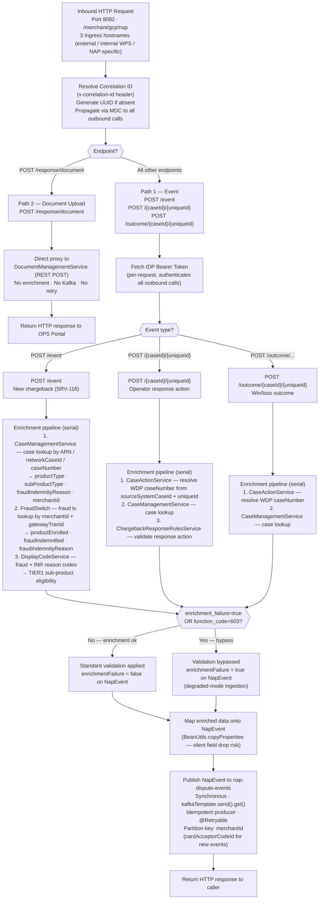

# WDP-COMP-04-NAP-DISPUTE-EVENT-SERVICE
**Worldpay Dispute Platform — Component Reference**
*Version: 1.0 DRAFT | April 2026*
*Source: WDP-COMPONENTS.md section 2.1.1 (✅ COMPLETE) |
 Architect-confirmed: PENDING*

> ⚠️ DECOMMISSION-SCOPED COMPONENT
> This component sits on the NAP/WPG inbound path which is planned
> for decommission. No new development or design work is planned.
> This file is produced for knowledge-base completeness only.
> Do not use as a design reference for new inbound integration work.

---

## ━━━ CORE SKELETON ━━━━━━━━━━━━━━━━━━━━━━━━━━━━━━━━━━━━━━

---

## Identity

| Field                | Value                                                                 |
|----------------------|-----------------------------------------------------------------------|
| **Name**             | `NAPDisputeEventService`                                              |
| **Type**             | `REST API + Kafka Producer`                                           |
| **Repository**       | `mdvs-gcp-nap-dispute-event-service`                                  |
| **Maven artifact**   | `nap-event-service v1.4.4`                                            |
| **Technology**       | Spring Boot 3.x / Java                                                |
| **Owner**            | Integration Team                                                      |
| **Status**           | `✅ Production`                                                       |
| **Doc status**       | `📝 DRAFT`                                                            |
| **Sections present** | `Core \| Block A (REST) \| Block C (Kafka Producer)`                  |
| **Decommission flag**| `⚠️ NAP/WPG inbound path — planned for decommission. No new work.`   |

---

## Purpose

**What it does**

NAPDisputeEventService is the inbound integration boundary between the
NAP (Network Acquirer Processing) acquiring platform and the WDP internal
event architecture. It acts as a pure REST-to-Kafka event bridge with
enrichment logic — it receives raw dispute lifecycle notifications over
REST, enriches each event by making synchronous lookups against internal
WDP services, and then publishes the enriched event to AWS MSK (Kafka)
for downstream consumption.

It handles two fundamentally different inbound paths with asymmetric
behaviour:

**Path 1 — NAP-DPS dispute events (Kafka path):** Receives new disputes,
case updates, and win/loss outcomes from NAP-DPS and the WDP OPS Portal.
Each event is validated and enriched via a synchronous REST pipeline
resolving product type, sub-type, fraud indemnity status, and reason
codes before being published to the `nap-dispute-events` Kafka topic.
Validation may be conditionally bypassed to support degraded-mode
ingestion when enrichment fails.

**Path 2 — WPG response document uploads (direct proxy path):** Receives
base64-encoded evidence documents from the WDP OPS Portal and proxies
them directly to DocumentManagementService. This path has no Kafka
involvement, no enrichment, and no retry.

The component is entirely stateless — no database, no cache, no Kafka
consumer side.

**What it does NOT do**

- Does not consume from any Kafka topic — Kafka producer only.
- Does not own or write to any database table.
- Does not perform any business logic on dispute outcomes — enrichment
  and routing only. All processing logic lives in downstream consumers.
- Does not handle NAP platform authorization — that belongs to
  UserAccessManagementService (COMP-02).
- Does not encrypt or tokenise PAN — confirmed that NAP dispute data
  carries no full PAN so EncryptionService (COMP-35) is not called.
- Does not perform application-level authentication of inbound callers
  despite having OAuth2 dependencies wired — all endpoints are
  whitelisted. Authentication relies entirely on network/Ingress controls.
- Does not apply circuit-breaking to any downstream REST dependency.
- Does not persist events for replay — no transactional outbox. Events
  lost in transit between enrichment and Kafka publish are unrecoverable.

---

## Internal Processing Flow

---

## Boundaries

### Inbound Interfaces

| Source | Protocol | Endpoint | Payload / Description |
|--------|----------|----------|-----------------------|
| NAP-DPS | REST | `POST /event` | New chargeback dispute notification — SRV-116 message format. New disputes for migrated NAP merchants. |
| WDP OPS Portal (`gcp-ops-portal-dev`) | REST | `POST /{caseId}/{uniqueId}` | Case update — operator response actions: write-off, representment, merchant charge |
| WDP OPS Portal | REST | `POST /outcome/{caseId}/{uniqueId}` | Win/loss outcome recording |
| WDP OPS Portal | REST | `POST /response/document` | Evidence document upload — base64-encoded. Proxied directly to DocumentManagementService. No Kafka. |

**Transport:** Port 8082, context path `/merchant/gcp/nap`. Three Ingress
hostnames: external, internal WPS, NAP-specific. TLS terminated at Ingress.

### Outbound Interfaces

| Target | Protocol | Endpoint / Resource | Purpose | On failure |
|--------|----------|---------------------|---------|------------|
| IDPTokenService | REST | ⚠️ NOT DOCUMENTED | Fetch Bearer JWT to authenticate all other outbound REST calls. Per-request. | ⚠️ NOT DOCUMENTED — no circuit breaker |
| CaseManagementService | REST | Case lookup by ARN / networkCaseId / caseNumber | Returns productType, subProductType, fraudIndemnityReason, merchantId | `@Retryable` — retry count and delay ⚠️ NOT DOCUMENTED |
| CaseActionService | REST | Case lookup by sourceSystemCaseId + uniqueId | Resolves internal WDP caseNumber from NAP identifiers | `@Retryable` |
| FraudSwitch (Transaction Lookup) | REST | Lookup by merchantId + gatewayTranId | Returns productEnrolled (GUARPAY1–GUARPAY5), fraudIndemnified, fraudIndemnityReason | `@Retryable` |
| DisplayCodeService | REST | Reason code list by userId + displayCodeTypes | Returns fraud and INR reason codes. Determines TIER1 sub-product eligibility | `@Retryable` |
| ChargebackResponseRulesService | REST | Validate by responseCode + responseType | Validates operator response actions for case update events only | `@Retryable` |
| DocumentManagementService | REST | POST — attach document to NAP dispute case | Direct proxy of base64-encoded evidence documents. Path 2 only. | No retry — fail fast |
| `nap-dispute-events` (AWS MSK) | Kafka | `kafka.nap-topic` | Publish enriched NapEvent for downstream consumption | `@Retryable` — blocking synchronous `.get()` |

---

## Database Ownership

### Tables Owned (written by this component)

This component owns no database state. It is stateless.

### Tables Read (not owned by this component)

This component makes no direct database reads. All data is
obtained via synchronous REST calls to other WDP services.

---

## Configuration and Scaling

| Parameter | Value | Notes |
|-----------|-------|-------|
| Replica count | XL Deploy placeholder | Resolved per environment at deploy time. Actual counts not confirmed. |
| HPA | None | Scaling is entirely static and environment-managed |
| Memory request | 1024Mi | |
| Memory limit | 3072Mi | |
| CPU request | Not set | Prevents CPU-based HPA. Noisy-neighbour risk on node. |
| CPU limit | Not set | |
| Deployment type | Kubernetes Deployment | |
| Rollout strategy | ⚠️ NOT DOCUMENTED | |
| PodDisruptionBudget | ⚠️ NOT DOCUMENTED | |
| Topology spread | ⚠️ NOT DOCUMENTED | |
| Database connection pool | N/A — no direct DB connection | Stateless component |
| Thread pool | Embedded Tomcat thread pool | No async pool. All HTTP threads block on enrichment + Kafka publish. |
| Observability | ⚠️ NOT DOCUMENTED | OpenTelemetry presence not confirmed from WDP-COMPONENTS.md for this component |
| Correlation ID | `v-correlation-id` header | Accepted on all endpoints. UUID generated if absent. Propagated via MDC. |
| Kafka idempotence | `ENABLE_IDEMPOTENCE_CONFIG=true` | |
| Kafka max-in-flight | `MAX_IN_FLIGHT_REQUESTS_PER_CONNECTION=1` | Ordering within partition preserved on retry |

---

## Key Architectural Decisions

| Decision | ADR reference | Notes |
|----------|---------------|-------|
| REST-to-Kafka bridge only — no business logic | Local decision | Enriches and routes. All dispute processing logic lives in downstream Kafka consumers. |
| Push model from NAP-DPS | Local decision | NAP-DPS pushes SRV-116 events. WDP does not poll NAP. Inbound contract for migrated NAP merchants. |
| Two-path design with asymmetric behaviour | Local decision | Document upload path is a deliberate direct-proxy pattern — no Kafka, no enrichment, no retry. This is not an omission. |
| Enrichment before publish, not after | Local decision | productType, subProductType, fraudIndemnityStatus resolved synchronously before Kafka publish. Consumers receive fully enriched events. |
| Degraded-mode ingestion | Local decision | When `enrichment_failure=true` OR `function_code=603`, validation is bypassed. `enrichmentFailure` flag carried on the Kafka event to signal consumers. |
| Stateless by design | Local decision | No database, JPA, cache, or Kafka consumer dependency. All state is in the inbound request and outbound Kafka event. |
| Idempotent Kafka producer | DEC-013 | `ENABLE_IDEMPOTENCE_CONFIG=true`, `MAX_IN_FLIGHT_REQUESTS_PER_CONNECTION=1`. Prevents duplicate messages on retry and preserves partition ordering. |
| Replica count managed externally via XLDeploy | Local decision | No HPA. Pod count is environment-managed. |
| Security enforcement delegated to network layer | Local decision — DEVIATION | All HTTP endpoints whitelisted (`/**`). OAuth2 client registration present but not used for endpoint protection. Inconsistency with OAuth2 wiring. |
| **No transactional outbox** | **DEC-001 — DEVIATION** | Publishes directly to Kafka on the HTTP thread. If the process crashes between enrichment completion and Kafka publish, the event is unrecoverably lost. No at-least-once guarantee. |
| **Direct Kafka publish on HTTP thread (blocking)** | **DEC-001 — DEVIATION** | `kafkaTemplate.send().get()` holds the HTTP thread for the full broker roundtrip. No async or timeout-bounded publish pattern. |
| **New event partition key is cardAcceptorCodeId** | **DEC-003 — PARTIAL DEVIATION** | Platform standard is merchantId. New dispute events (`POST /event`) use `cardAcceptorCodeId` as partition key. All other event types use `merchantId`. |
| **No circuit breaker** | **DEC-014 — DEVIATION** | No Resilience4j, no Hystrix. Confirmed absent from codebase. Slow or unavailable downstream services block HTTP threads indefinitely. |

---

## Risks and Constraints

| Severity | Risk | Consequence |
|----------|------|-------------|
| 🔴 HIGH | No HTTP timeout on RestTemplate — instantiated with default constructor. No connection or read timeout configured. | Any slow or hung downstream service (CaseManagement, FraudSwitch, IDP, etc.) blocks the inbound HTTP thread indefinitely. Under load, exhausts embedded Tomcat thread pool and causes cascading unavailability. |
| 🔴 HIGH | Blocking synchronous Kafka publish on HTTP thread — `kafkaTemplate.send().get()` with `@Retryable`. Worst-case blocking time per request = `retry_count × retry_delay`. | HTTP threads held for full Kafka roundtrip including retries. Combined with no RestTemplate timeouts, the service has no upper bound on per-request latency. |
| 🔴 HIGH | CVV logged in plain text at INFO level — `NapEvent.toString()` includes CVV field. Full NapEvent logged immediately before Kafka publish. `CheckmarxUtil.sanitizeString()` used elsewhere but not on this log call. | CVV is PCI-DSS 3.2.1 restricted data. Logging to Logstash constitutes effective persistence. Active PCI compliance violation. |
| 🔴 HIGH | All endpoints unauthenticated — SecurityConfig whitelists `/**`. OAuth2 client registration present but not enforced. | Any caller reaching the Ingress can invoke dispute events, case updates, win/loss outcomes, or document uploads without authentication. |
| 🟡 MEDIUM | Up to 5 serial synchronous REST hops per new dispute request — all serial on the same HTTP thread. Each hop has its own `@Retryable` loop. No overall request deadline. | A single slow downstream service degrades the entire dispute ingestion pipeline. No partial enrichment fallback. |
| 🟡 MEDIUM | No CPU limits or requests configured. | Prevents CPU-based HPA. Creates noisy-neighbour risk on the node. Kubernetes scheduler has no CPU guarantee for this pod. |
| 🟡 MEDIUM | GUARPAY7 silently maps to TIER5 (same as GUARPAY5). No `PRODUCT_SUB_TYPE_GUARPAY7` constant exists. | Downstream Kafka consumers (COMP-05) cannot distinguish GUARPAY5 from GUARPAY7 merchants via `productSubType` alone. Whether intentional is undocumented. |
| 🟡 MEDIUM | No transactional outbox (DEC-001 deviation). Direct publish to Kafka on HTTP thread. | Events lost in the window between enrichment completion and successful Kafka publish are unrecoverable. No at-least-once delivery guarantee for this path. |
| 🟢 LOW | `RestServiceInvoker` autowired but unused in NapEventServiceImpl — declared `@Autowired` dependency never called. | Dead code. Adds confusion to the dependency graph. No functional impact. |
| 🟢 LOW | `BeanUtils.copyProperties` silent field drop — fields where property name does not match between source and target are silently skipped. | Future additions to EventRequestDTO may be silently lost in NapEvent with no exception or warning. |

---

## Planned Changes

- No planned changes confirmed as of April 2026.
- ⚠️ OPEN QUESTION: Whether application-level authentication should be
  enforced, resolving the inconsistency between the OAuth2 client
  registration (`gcp-ops-portal-dev`) present in the codebase and the
  SecurityConfig whitelist of `/**`.
- ⚠️ OPEN QUESTION: GUARPAY7 → TIER5 mapping — confirm whether intentional
  and document the decision if so.
- ⚠️ DECOMMISSION SCOPE: This component is on the NAP/WPG inbound path
  which is planned for decommission. No new development is planned.
  The decommission timeline and migration path are not confirmed at the
  time of writing.

---

---

## ━━━ TYPE BLOCK A — REST API CONTRACTS ━━━━━━━━━━━━━━━━━━━

---

## REST API Contracts

**Authentication model:**
All endpoints are unauthenticated at application level. SecurityConfig
whitelists `/**`. Despite OAuth2 client registration being present in
the codebase (`gcp-ops-portal-dev`), no application-level token
validation is enforced. Authentication relies entirely on Kubernetes
Ingress and network firewall controls. This is a confirmed HIGH risk —
see Risks and Constraints.

**Base URL pattern:** `https://<host>/merchant/gcp/nap`

---

### Endpoint: `POST /event`

**Purpose:** Receive a new chargeback dispute notification from NAP-DPS
in SRV-116 format, enrich it, and publish to Kafka.
**Caller(s):** NAP-DPS (acquiring platform)
**Auth required:** Unauthenticated (SecurityConfig whitelist)

**Request**

| Field | Type | Required | Description |
|-------|------|----------|-------------|
| *(SRV-116 EventRequestDTO fields)* | Object | — | ⚠️ NOT DOCUMENTED — full field list not captured in WDP-COMPONENTS.md. Known fields include: merchantId, cardAcceptorCodeId, functionCode, gatewayTranId, enrichment_failure flag, CVV (present — PCI risk). |

**Response — Success**

| HTTP Status | Condition | Body |
|-------------|-----------|------|
| 200 | Successful enrichment and Kafka publish | ⚠️ NOT DOCUMENTED |

**Response — Error**

| HTTP Status | Condition | Body |
|-------------|-----------|------|
| ⚠️ NOT DOCUMENTED | ⚠️ NOT DOCUMENTED | ⚠️ NOT DOCUMENTED |

**Notes:**
Correlation ID (`v-correlation-id`) accepted in request header.
UUID generated if absent. Propagated to all outbound REST calls via MDC.
Validation may be bypassed if `enrichment_failure=true` OR
`function_code=603` — event is still published to Kafka with
`enrichmentFailure=true` flag set.

---

### Endpoint: `POST /{caseId}/{uniqueId}`

**Purpose:** Record an operator response action (write-off, representment,
or merchant charge) against an existing NAP dispute case.
**Caller(s):** WDP OPS Portal
**Auth required:** Unauthenticated (SecurityConfig whitelist)

**Request**

| Field | Type | Required | Description |
|-------|------|----------|-------------|
| `caseId` | String (path param) | Yes | NAP case identifier |
| `uniqueId` | String (path param) | Yes | NAP unique action identifier |
| *(body fields)* | Object | — | ⚠️ NOT DOCUMENTED |

**Response — Success**

| HTTP Status | Condition | Body |
|-------------|-----------|------|
| ⚠️ NOT DOCUMENTED | Successful enrichment and Kafka publish | ⚠️ NOT DOCUMENTED |

**Response — Error**

| HTTP Status | Condition | Body |
|-------------|-----------|------|
| ⚠️ NOT DOCUMENTED | ⚠️ NOT DOCUMENTED | ⚠️ NOT DOCUMENTED |

---

### Endpoint: `POST /outcome/{caseId}/{uniqueId}`

**Purpose:** Record a win/loss arbitration outcome for an existing NAP
dispute case.
**Caller(s):** WDP OPS Portal
**Auth required:** Unauthenticated (SecurityConfig whitelist)

**Request**

| Field | Type | Required | Description |
|-------|------|----------|-------------|
| `caseId` | String (path param) | Yes | NAP case identifier |
| `uniqueId` | String (path param) | Yes | NAP unique action identifier |
| *(body fields)* | Object | — | ⚠️ NOT DOCUMENTED |

**Response — Success**

| HTTP Status | Condition | Body |
|-------------|-----------|------|
| ⚠️ NOT DOCUMENTED | Successful enrichment and Kafka publish | ⚠️ NOT DOCUMENTED |

**Response — Error**

| HTTP Status | Condition | Body |
|-------------|-----------|------|
| ⚠️ NOT DOCUMENTED | ⚠️ NOT DOCUMENTED | ⚠️ NOT DOCUMENTED |

---

### Endpoint: `POST /response/document`

**Purpose:** Accept a base64-encoded evidence document from the OPS Portal
and proxy it directly to DocumentManagementService to attach it to a
NAP dispute case. **No Kafka involvement. No enrichment. No retry.**
**Caller(s):** WDP OPS Portal
**Auth required:** Unauthenticated (SecurityConfig whitelist)

**Request**

| Field | Type | Required | Description |
|-------|------|----------|-------------|
| *(body fields)* | Object | — | ⚠️ NOT DOCUMENTED — includes base64-encoded document payload and case reference |

**Response — Success**

| HTTP Status | Condition | Body |
|-------------|-----------|------|
| ⚠️ NOT DOCUMENTED | Document successfully proxied to DocumentManagementService | ⚠️ NOT DOCUMENTED |

**Response — Error**

| HTTP Status | Condition | Body |
|-------------|-----------|------|
| ⚠️ NOT DOCUMENTED | DocumentManagementService failure | ⚠️ NOT DOCUMENTED — no retry on this path |

**Notes:**
This endpoint is architecturally distinct from all others. It is a
deliberate direct-proxy pattern — the WPG 119-response document bypass
of Kafka is a confirmed architectural decision recorded in
WDP-HANDOVER.md Confirmed Architectural Facts.

---

---

## ━━━ TYPE BLOCK C — KAFKA PRODUCER CONTRACTS ━━━━━━━━━━━━━

---

## Kafka Producer Contracts

**Producer framework:** Spring Kafka KafkaTemplate
**Idempotent producer:** Yes — `ENABLE_IDEMPOTENCE_CONFIG=true`
**Max in-flight requests:** `MAX_IN_FLIGHT_REQUESTS_PER_CONNECTION=1`
(preserves partition ordering on retry)
**Publish mode:** Synchronous — `kafkaTemplate.send(...).get()` — blocking
on HTTP thread. No timeout bound.
**Retry on publish failure:** Yes — `@Retryable`. Retry count and delay
⚠️ NOT DOCUMENTED from WDP-COMPONENTS.md.

---

### Topic: `nap-dispute-events`

| Parameter | Value |
|-----------|-------|
| **Topic name** | `nap-dispute-events` (configured via `kafka.nap-topic`) |
| **Message key** | `merchantId` (all event types except new disputes) · `cardAcceptorCodeId` (new disputes via `POST /event`) — **partial deviation from DEC-003** |
| **Ordering guarantee** | Per partition (key-scoped) — within a merchant's events |
| **Published on** | Successful enrichment of any Kafka-path event: new dispute (SRV-116), case update (operator response), win/loss outcome |
| **NOT published on** | Document upload (`POST /response/document`) — direct proxy path only |
| **Consumed by** | COMP-05 NAPDisputeEventProcessor |
| **Partition count** | ⚠️ NOT DOCUMENTED |
| **Retention** | ⚠️ NOT DOCUMENTED |

**Message payload structure**

The payload is a `NapEvent` object. Exact field list is ⚠️ NOT
DOCUMENTED in full from WDP-COMPONENTS.md. Known fields and characteristics:

| Field | Type | Description |
|-------|------|-------------|
| `merchantId` | String | Merchant identifier — resolved during enrichment |
| `cardAcceptorCodeId` | String | Card acceptor code — used as partition key for new events |
| `productType` | String | Resolved from CaseManagementService during enrichment |
| `subProductType` | String | Resolved from enrichment. GUARPAY1–GUARPAY5 → TIER1–TIER5. GUARPAY7 maps to TIER5 (same as GUARPAY5 — undocumented intent) |
| `fraudIndemnityReason` | String | Resolved from CaseManagementService or FraudSwitch |
| `fraudIndemnified` | Boolean | Resolved from FraudSwitch lookup |
| `productEnrolled` | String | GUARPAY1–GUARPAY5 — resolved from FraudSwitch |
| `enrichmentFailure` | Boolean | `true` if degraded-mode ingestion — enrichment was bypassed. Signal for downstream consumers. |
| *(remaining fields)* | — | ⚠️ NOT DOCUMENTED — mapped via `BeanUtils.copyProperties` from EventRequestDTO. Field list not fully captured. |

**Payload notes**

- When `enrichmentFailure=true`, downstream consumers (COMP-05) receive
  an event with partially-populated enrichment fields. Consumers must
  handle this gracefully.
- `BeanUtils.copyProperties` is used for mapping between EventRequestDTO
  and NapEvent. Fields with mismatched property names are silently
  dropped — future EventRequestDTO additions may not appear in the
  published NapEvent.
- GUARPAY7 maps to TIER5 (same as GUARPAY5). Downstream consumers cannot
  distinguish GUARPAY5 from GUARPAY7 via `productSubType` alone.
- CVV is present in `NapEvent.toString()` and is logged at INFO level
  before publish — PCI-DSS violation, see Risks and Constraints.

---

---

## Appendix — Supporting Outputs

*The following sections record the Kafka, DB, deviation, and gap analyses
produced alongside this component file. They are reproduced here for
self-contained reference. The authoritative update targets are
WDP-KAFKA.md, WDP-DB.md, and WDP-COMP-INDEX.md.*

---

### A1 — WDP-KAFKA.md Updates Required

**Update existing `nap-dispute-events` row in Section 3 — Topic Registry:**

| Column | Update |
|--------|--------|
| Partition Key | `merchantId (standard) / cardAcceptorCodeId (new dispute events only — POST /event)` |
| Payload Schema | `See WDP-COMP-04-NAP-DISPUTE-EVENT-SERVICE.md — Block C (DRAFT)` |

**Add to Notes below Topic Registry:**

> [2] **nap-dispute-events partition key deviation from DEC-003:** The
> partition key for new dispute events (`POST /event`) is
> `cardAcceptorCodeId`, not `merchantId`. All other event types use
> `merchantId`. This is a confirmed partial deviation from DEC-003.
> See WDP-COMP-04, Key Architectural Decisions.

**Add to Section 2 — Known deviations from platform standards:**

> - WDP-COMP-04 NAPDisputeEventService — No transactional outbox
>   (DEC-001 deviation). Publishes directly to Kafka on the HTTP thread.
>   No at-least-once delivery guarantee. Events lost between enrichment
>   and Kafka publish are unrecoverable.

---

### A2 — WDP-DB.md Updates Required

COMP-04 is stateless. No table rows to add to the Schema Ownership Map.
No shared table risk. No direct database connections of any kind.

Recommended annotation on the NAP PostgreSQL database instance row:

> COMP-04 NAPDisputeEventService does **not** connect to any database.
> All data is obtained via synchronous REST calls to other WDP services.
> Confirmed stateless — no JPA, no JDBC, no datasource.

---

### A3 — Deviation Flags (DEC-001, 003, 004, 005, 014)

| ADR | Standard | Status | Detail |
|-----|----------|--------|--------|
| DEC-001 | Transactional Outbox for Event Delivery | 🔴 DEVIATION | No outbox table. Publishes directly to Kafka on the HTTP thread. Events lost between enrichment completion and Kafka acknowledge are unrecoverable. |
| DEC-003 | Merchant-Scoped Kafka Partitioning | 🟡 PARTIAL DEVIATION | `POST /event` (new disputes) uses `cardAcceptorCodeId` as partition key. All other event types correctly use `merchantId`. Whether deliberate or accidental is undocumented. |
| DEC-004 | Encrypt PAN at the Ingestion Boundary | ✅ NOT APPLICABLE | Confirmed: NAP dispute data carries no full PAN. EncryptionService not called. No DEC-004 violation. CVV plaintext logging is a separate 🔴 HIGH PCI-DSS risk documented above. |
| DEC-005 | Manual Kafka Offset Commit | ✅ NOT APPLICABLE | COMP-04 is a Kafka producer only. No consumer side. Offset commit strategy does not apply. |
| DEC-014 | Resilience4j for Circuit Breaking | 🔴 DEVIATION | No Resilience4j, no Hystrix, no circuit-breaker library present. Confirmed from WDP-HANDOVER.md. Compounds the thread-blocking risk from no RestTemplate timeouts. |

---

### A4 — Accepted Gaps

No Copilot CLI pass is planned for this component (decommission-scoped).
The following are known unknowns that will not be resolved unless scope changes.

| Section | Gap |
|---------|-----|
| REST Endpoints — Request bodies | Full field-level schemas for all four endpoints not captured in WDP-COMPONENTS.md. |
| REST Endpoints — Response contracts | HTTP status codes and response body structures absent for all endpoints. |
| Kafka payload — NapEvent full schema | Only a subset of NapEvent fields named. Full list requires source code inspection. |
| Kafka @Retryable configuration | Retry count and delay for Kafka publish and each enrichment REST call not captured. |
| Rollout strategy / PDB / Topology spread | Kubernetes deployment configuration details not captured. |
| Observability | OpenTelemetry Java agent presence not confirmed for this specific component. |
| IDPTokenService endpoint | Exact REST endpoint called for token fetch not captured. |
| Kafka partition count and retention | Not captured in WDP-COMPONENTS.md for `nap-dispute-events`. |
| GUARPAY7 → TIER5 mapping intent | Whether deliberate business decision or defect is unresolved and unconfirmable without source access. |
| Decommission timeline | NAP/WPG inbound path decommission planned but no timeline or migration path confirmed. |

---

### A5 — Documents to Update After Confirmation

| Document | Update required |
|----------|----------------|
| WDP-KAFKA.md | Update `nap-dispute-events` row per A1. Add partition key deviation note. Add DEC-001 deviation to standards section. |
| WDP-COMP-INDEX.md | Update COMP-04 row: set doc status to 📝 DRAFT, add decommission flag, reference this file. |
| WDP-HANDOVER.md | Advance COMP-04 from migration queue to DRAFT in Tier 3 component table. |
| WDP-DB.md | No table rows to add. Optional: annotate COMP-04 as confirmed stateless in NAP PostgreSQL database instance entry. |

---

*End of WDP-COMP-04-NAP-DISPUTE-EVENT-SERVICE.md*
*Status: 📝 DRAFT — content confirmed from WDP-COMPONENTS.md.*
*Architect sign-off: PENDING*
*Next action: Ram to confirm or correct, then update WDP-COMP-INDEX.md,*
*WDP-KAFKA.md, and WDP-DB.md per Appendix A5.*
*Last updated: April 2026*
