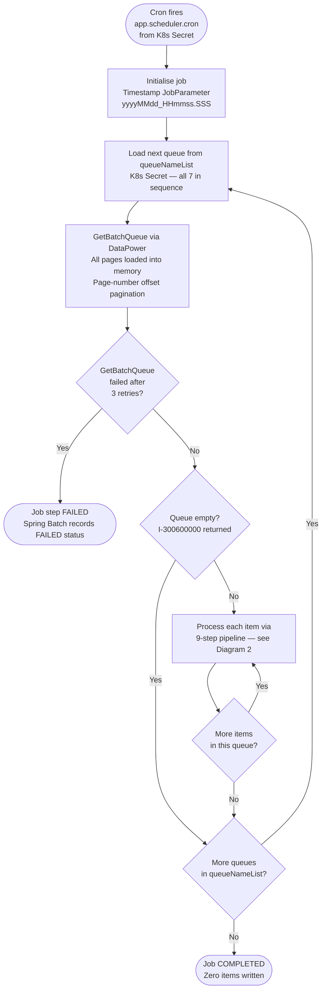

# WDP-COMP-07-VISA-DISPUTE-BATCH
**Worldpay Dispute Platform — Component Reference**
*Version: 1.0 DRAFT | April 2026*
*Extracted from: gcp-visa-disputes-processor-batch using GitHub Copilot CLI | Architect-confirmed: PENDING*

---

## ━━━ CORE SKELETON ━━━━━━━━━━━━━━━━━━━━━━━━━━━━━━━━━━━━━━

---

## Identity

| Field                | Value |
|----------------------|-------|
| **Name**             | `VisaDisputeBatch` |
| **Type**             | `Batch/Scheduler` |
| **Repository**       | `gcp-visa-disputes-processor-batch` |
| **Maven artifact**   | `com.wp.gcp:visa-disputes-processor-batch v1.2.5` |
| **Technology**       | `Java 17 · Spring Boot 3.5.3 · Spring Batch` |
| **Status**           | `✅ Production` |
| **Doc status**       | `📝 DRAFT` |
| **Sections present** | `Core · Block D (Batch)` |

---

## Purpose

**What it does**

VisaDisputeBatch is the sole inbound batch responsible for ingesting all Visa dispute lifecycle
events into WDP. It polls Visa's RTSI (Real-Time Settlement Interface) API queues on a cron
schedule via the DataPower Gateway, processes all seven Visa queue types strictly sequentially
in a single job execution, enriches each event against multiple internal WDP services, and
writes structured case events to the `wdp.chbk_outbox_row` transactional outbox for downstream
Kafka publishing. PAN is encrypted before any persistence occurs.

This batch is the **origin of all Visa dispute data in WDP**. If this batch fails or falls
behind, no new Visa dispute cases are created or updated downstream.

The batch processes items one at a time (chunk size = 1, commit-per-item). All seven queues
are processed sequentially within a single Spring Batch step — there is no parallelism across
queues or within a queue. When all queues are exhausted the job completes normally with status
`COMPLETED` and zero items written.

Each queue item passes through a 9-step enrichment and classification pipeline. Failure at any
step causes the item to be silently skipped — the processor returns `null` and the job advances
to the next item. There is no dead-letter store for null-return failures; the only persisted
failure evidence for these items is ELK log entries. Items that reach the writer may be
persisted as SKIPPED (duplicate) or ERROR (missing key data) status rows.

Three runtime feature flags injected from a Kubernetes Secret control processing behaviour:
`coreDataNeedToMigrate` (PIN validation outcome and CORE item Visa queue consumption),
`removeItemFromQueueDisabled` (global MarkAsRead kill-switch), and `readSpecificItemFromQueue`
(debug toggle to restrict processing to specific case numbers).

**What it does NOT do**

- Does not process Mastercard disputes — Visa-only
- Does not publish to Kafka directly — writes to outbox only; COMP-12 InboundDisputeEventScheduler
  reads PENDING rows and publishes to Kafka
- Does not send dispute decisions or outcomes back to Visa — only consumption acknowledgement
  via MarkAsRead (conditional per item)
- Does not perform PAN encryption itself — delegates entirely to `wdp-encryption-service`
  before the item enters the writer
- Does not process NAP disputes
- Does not call the Visa RTSI API directly — all Visa API calls are mediated through
  DataPower Gateway using `vantiveLicense` static key authentication

---

## Internal Processing Flow

### Diagram 1 — Queue Processing Loop (outer)

### Diagram 2 — Per-Item Processing Pipeline (inner)

```mermaid
flowchart TD
    IN([Item from Visa RTSI queue]) --> STEP1[Step 1: Platform mapping\nnetworkId = 0002 → CORE initial\nAll others → PIN]

    STEP1 --> STEP2[Step 2: IDP token fetch\nwdp-idp-token-service\nFresh HTTP GET per item — no caching no retry]
    STEP2 --> STEP2F{ServiceException?}
    STEP2F -- Yes --> SKIP_NULL([Return null\nItem skipped\nNot marked as read\nNo error record written])
    STEP2F -- No --> STEP3[Step 3: Queue rules check\nmdvs-gcp-rules-service\n3 retries 2s delay]

    STEP3 --> STEP3A{No rule found?\nLoggingException empty=true}
    STEP3A -- Yes --> SKIP_CASE[setSkipCase=true\nReturn processedItem to writer]
    SKIP_CASE --> WRITER_SKIP[Skip chbk_outbox_row write]
    WRITER_SKIP --> MAR_GATE1{MarkAsRead gate\nsee gate logic below}
    MAR_GATE1 -- Qualifies --> MARK1[MarkAsRead via DataPower\n3 retries 2s delay]
    MAR_GATE1 -- Does not qualify --> ITEM_END([Item done\nConsumed from Visa queue\nor left unconsumed])
    MARK1 --> ITEM_END

    STEP3A -- No --> STEP3B{Other exception\nafter 3 retries?}
    STEP3B -- Yes --> SKIP_NULL
    STEP3B -- No --> STEP4[Step 4: HyperSearch enrichment\nVisa RTSI HyperSearch via DataPower\n3 retries 2s delay]

    STEP4 --> STEP4F{LoggingException\nafter 3 retries?}
    STEP4F -- Yes --> SKIP_NULL
    STEP4F -- No --> STEP5Q{networkId = 0002?}

    STEP5Q -- Yes --> STEP5[Step 5: PIN validation\nVisa VisaTransSearch via DataPower\n3 retries 2s delay\nCheck CardholderIdMethodCode = 2]
    STEP5 --> STEP5V{isValidPinTransaction\nresult?}
    STEP5V -- Exception after 3 retries --> SKIP_NULL
    STEP5V -- false AND\ncoreDataNeedToMigrate=false --> SKIP_NULL
    STEP5V -- false AND\ncoreDataNeedToMigrate=true --> PLAT_CORE[Set platform = CORE\nContinue processing]
    STEP5V -- true --> PLAT_PIN[Set platform = PIN\nContinue processing]

    STEP5Q -- No --> STEP6[Step 6: Set migrationStatus = Y\nhardcoded — no toggle no conditional]
    PLAT_CORE --> STEP6
    PLAT_PIN --> STEP6

    STEP6 --> STEP7Q{Queue type?}
    STEP7Q -- PRECOMP --> STEP7PC[Case lookup: searchDisputesForPreComp\nFilter actionDetails on stageCode = APC\nError thrown if more than 1 result]
    STEP7Q -- COMP --> STEP7C[Case lookup: searchDisputeCasesForComp\nLook for open cases first\nMatch max-action stageCode to recordType\nFall back to CLOSED cases if none found]
    STEP7Q -- Other 5 queues --> STEP7G[Case lookup: generic\nGET mdvs-gcp-case-search-service\nNo retry on this call]

    STEP7PC --> STEP7F{LoggingException?}
    STEP7C --> STEP7F
    STEP7G --> STEP7F
    STEP7F -- Yes --> SKIP_NULL
    STEP7F -- No --> STEP7D{caseNumber\nblank?}
    STEP7D -- Yes --> CREATE[setCreateNewCase = true]
    STEP7D -- No --> UPDATE[setCreateNewCase = false\nUpdate existing case]

    CREATE --> STEP8[Step 8: PAN encryption\nwdp-encryption-service\nOnly if accountNumber present\n3 retries 2s delay]
    UPDATE --> STEP8
    STEP8 --> STEP8F{Exception\nafter 3 retries?}
    STEP8F -- Yes --> SKIP_NULL
    STEP8F -- No --> STEP9[Step 9 — WRITER\nDuplicate check\nSELECT on networkCaseId +\nnetworkPhaseId + disputeStage]

    STEP9 --> STEP9D{Duplicate\nfound?}
    STEP9D -- Yes --> WRITE_SKIP[Write SKIPPED row\nto wdp.chbk_outbox_row]
    STEP9D -- No --> STEP9M{Missing key data?\nblank networkCaseId or\nnetworkPhaseId or disputeStage}
    STEP9M -- Yes --> WRITE_ERR[Write ERROR row\nto wdp.chbk_outbox_row]
    STEP9M -- No --> WRITE_PEND[Write PENDING row\nto wdp.chbk_outbox_row]

    WRITE_SKIP --> MAR_GATE2{MarkAsRead gate}
    WRITE_ERR --> MAR_GATE2
    WRITE_PEND --> MAR_GATE2

    MAR_GATE2 -- removeItemFromQueueDisabled=true --> ITEM_END
    MAR_GATE2 -- platform=PIN AND disabled=false --> MARK2[MarkAsRead via DataPower\n3 retries 2s delay]
    MAR_GATE2 -- platform=CORE AND\ncoreDataNeedToMigrate=true AND disabled=false --> MARK2
    MAR_GATE2 -- platform=CORE AND\ncoreDataNeedToMigrate=false AND disabled=false --> ITEM_END
    MARK2 --> ITEM_END
```

**MarkAsRead gate summary**

| Condition | MarkAsRead called? |
|-----------|-------------------|
| `removeItemFromQueueDisabled = true` | Never — global kill-switch |
| Platform = PIN, disabled = false | Yes |
| Platform = CORE, `coreDataNeedToMigrate = true`, disabled = false | Yes |
| Platform = CORE, `coreDataNeedToMigrate = false`, disabled = false | No |
| Processor returned null (item not passed to writer) | No |
| `skipCase = true` | Delegated to gate above — outcome depends on platform |
| Duplicate found (SKIPPED row written) | Delegated to gate above |
| Missing data (ERROR row written) | Delegated to gate above |

> ⚠️ **RECALL queue note:** RECALL items have no explicit MarkAsRead bypass. RECALL items map
> to CORE platform (networkId "0002"). Whether they are marked as read depends entirely on
> `coreDataNeedToMigrate`. If this flag is `true`, RECALL items WILL be consumed from the
> Visa queue. Previous knowledge base entry stating "RECALL items NOT marked as read" is
> **incorrect** — this is a correction. See WDP-HANDOVER.md — Confirmed Architectural Facts.

---

## Boundaries

### Inbound Interfaces

| Source | Protocol | Endpoint / Topic / Trigger | Payload / Description |
|--------|----------|----------------------------|-----------------------|
| Kubernetes `@Scheduled` cron | Internal cron | `app.scheduler.cron` → env `${scheduler_cron}` (K8s Secret: `gcp-visa-disputes-processor-batch-secrets`) | Fires the Spring Batch job. Architecture confirms 2-minute interval in production. |
| Visa RTSI via DataPower Gateway | REST POST | GetBatchQueue endpoint (DataPower URL) | Paginated Visa dispute queue items. Server-driven page-number offset pagination. All pages loaded into memory before processing. |

### Outbound Interfaces

| Target | Protocol | Endpoint / Resource | Purpose | On failure |
|--------|-----------|-----------------------------|---------|------------|
| DataPower → Visa RTSI GetBatchQueue | REST POST | DataPower URL | Poll each of 7 queues for dispute items | 3 retries, 2s fixed delay. Exhaustion (I-300600000) = advance to next queue. Other failure after retries = job step FAILED. |
| DataPower → Visa RTSI HyperSearch | REST POST | DataPower URL | Per-item rich case detail enrichment | 3 retries, 2s delay. Exception after retries → item skipped, not marked as read. |
| DataPower → Visa RTSI MarkAsRead | REST POST | DataPower URL | Acknowledge item consumption (conditional per platform and flags) | 3 retries, 2s delay. Final failure behaviour: not confirmed from source. |
| DataPower → Visa RTSI VisaTransSearch | REST POST | DataPower URL | PIN routing confirmation — networkId=0002 items only | 3 retries, 2s delay. Exception after retries → item skipped, not marked as read. |
| `wdp-idp-token-service` | REST GET | Internal URL | Bearer token acquisition — per item, no caching | **No retry** (`@Retryable` absent on IdpRestInvoker). Exception → item skipped, not marked as read. |
| `mdvs-gcp-rules-service` | REST POST | Internal URL | Queue rules check — determines skip and assigns dispute stage | 3 retries, 2s delay. "No rule found" → skipCase path. Other exception → item skipped. |
| `mdvs-gcp-case-search-service` | REST GET | Internal URL | Case lookup — create vs update; queue-specific logic for PRECOMP and COMP | **No retry** (`@Retryable` absent on GET method). Exception → item skipped, not marked as read. |
| `wdp-encryption-service` | REST POST | Internal URL | PAN encryption — if accountNumber present, replaces with HPAN before writer | 3 retries, 2s delay. Exception after retries → item skipped, not marked as read. |
| `wdp.chbk_outbox_row` | PostgreSQL (JPA) | `wdp.chbk_outbox_row` | Transactional outbox — PENDING / SKIPPED / ERROR row per item | Single JPA save per item, own transaction (chunk size = 1). |

> ⚠️ **INFINITE TIMEOUT on all calls.** `RestTemplate` uses `SimpleClientHttpRequestFactory`
> with no connection or read timeout configured in any profile YAML. A hung call blocks the
> processing thread indefinitely.
>
> ⚠️ **`mdvs-gcp-case-search-service` — no retry.** Case lookup uses a GET method with no
> `@Retryable`. A single transient failure silently skips the item with no error record.
>
> ⚠️ **`wdp-idp-token-service` — no retry.** Token is fetched per item. A transient IDP
> outage fails every item in the current run.

---

## Database Ownership

### Tables Owned (written by this component)

| Schema.Table | Purpose | Key columns | Notes |
|--------------|---------|-------------|-------|
| `wdp.chbk_outbox_row` | Transactional outbox. Stores Visa dispute events pending Kafka publication. PENDING (normal), SKIPPED (duplicate), ERROR (missing data). | `id` (seq), `c_ntwk_case_id`, `c_ntwk_phase_id`, `c_case_stage` (duplicate check key), `status`, `payload` (full CommonEvent JSON with HPAN), `c_acq_platform`, `c_case_ntwk` | ⚠️ SHARED TABLE — also written by COMP-08, COMP-09, COMP-11. No cross-component write lock. Duplicate check is application-level SELECT-before-INSERT. No DB unique constraint. |

**Columns written by this batch (confirmed from source):**

| Column | Value |
|--------|-------|
| `id` | Auto-generated via `CHBK_OUTBOX_ROW_ID_SEQ` |
| `event_type` | `"CHARGEBACK_PROCESS"` |
| `c_acq_platform` | Platform string (PIN or CORE) |
| `i_acq_refnce_num` | ARN from `originalTransactionIdentifier.arn` |
| `i_ntwk_tran_id` | From `originalTransactionIdentifier.networkTransactionId` |
| `c_case_ntwk` | `"VISA"` |
| `retry_count` | `"0"` (constant) |
| `payload` | Full `CommonEvent` serialized as JSON — HPAN in accountNumber field, not plain PAN |
| `status` | `PENDING` / `SKIPPED` / `ERROR` |
| `error_message` | null for PENDING; log message for SKIPPED/ERROR |
| `created_by` / `updated_by` | `"WVDPB"` (constant) |
| `created_at` / `updated_at` | Current system timestamp |
| `c_case_stage` | disputeStage from CommonEvent |
| `c_ntwk_phase_id` | networkPhaseId from CommonEvent.schemeRef |
| `c_ntwk_case_id` | networkCaseNumber from CommonEvent.schemeRef |

**Columns present in entity but NOT written by this batch:**
`file_job_id`, `row_number`, `parent_row_number`, `i_case`, `i_action_id`, `c_reason`,
`kafka_partition`, `kafka_offset`, `kafka_topic`, `error_code`, `document_type`,
`source_event`, `next_retry_at`, `published_at`, `c_level1_entity`, `c_migration_sta`

### Tables Read (not owned by this component)

| Schema.Table | Owned by | Why accessed |
|--------------|----------|--------------|
| `wdp.chbk_outbox_row` | This component (write) | SELECT-before-INSERT duplicate check on (networkCaseId + networkPhaseId + disputeStage) before every PENDING write |

All other enrichment and lookup data is retrieved via REST calls to internal WDP services.
No other database reads occur in this component.

---

## Platform Compliance

| Standard | Status | Detail |
|----------|--------|--------|
| DEC-001 — Transactional outbox | ✅ COMPLIANT | Writes PENDING rows to `wdp.chbk_outbox_row`. Outbox write is the sole domain write at step 9 — single JPA save per item in its own transaction. No risk of partial commit across a domain write and the outbox write. |
| DEC-003 — Partition key = merchantId | ✅ NOT APPLICABLE | No Kafka producer active. Kafka dependencies staged in POM (`spring-kafka`, `kafka-clients`, `aws-msk-iam-auth`) but no KafkaTemplate, `@EnableKafka`, or producer configuration class exists in main source. |
| DEC-004 — PAN encrypted before persistence | ✅ COMPLIANT | `wdp-encryption-service` called at step 8. `caseEvent.accountNumber` replaced with HPAN before item enters the writer. The `payload` JSON column holds HPAN, not plain PAN. No plain PAN written to any column or table. |
| DEC-005 — Manual Kafka offset commit | ✅ NOT APPLICABLE | No Kafka consumer. |
| DEC-014 — Resilience4j circuit breaker | ⚠️ DEVIATION | No `io.github.resilience4j` dependency in `pom.xml`. No circuit breaker annotation on any outbound call. All 8 outbound dependencies (DataPower ×4, wdp-idp-token-service, mdvs-gcp-rules-service, mdvs-gcp-case-search-service, wdp-encryption-service) are unprotected. |

---

## Risks and Constraints

| Severity | Risk | Consequence |
|----------|------|-------------|
| 🔴 HIGH | Replicas > 1 creates parallel Visa queue polling with no distributed lock. Multiple pods each fire the cron independently, poll the same queues simultaneously, and attempt to write the same events. The `chbk_outbox_row` duplicate check fires at write time — not at poll time. | Duplicate PENDING rows possible between the poll and the write. Replica count must remain 1 until a distributed coordination mechanism is in place. |
| 🔴 HIGH | No HPA. Scaling is entirely manual via XL Deploy placeholder `{{ replicas-gcp-visa-disputes-processor-batch }}`. No autoscaling path under queue backlog. | Queue backlog grows silently; no automated scale-out. |
| 🔴 HIGH | Infinite timeouts on all outbound calls. `SimpleClientHttpRequestFactory` with no connection or read timeout configured in any YAML. A single hung call blocks the processing thread indefinitely with no recovery path. | Entire job stalls on a single hung call. Risk amplified by the DEC-014 deviation — no circuit breaker to trip the dependency open. |
| 🟡 MEDIUM | IDP token fetched fresh per item — no caching, no TTL. For N total items across a run, N serial HTTP GETs are made to `wdp-idp-token-service`. There is also no retry on IDP calls. | Unnecessary IDP load; a brief IDP outage silently skips all items until the service recovers on the next run. |
| 🟡 MEDIUM | `mdvs-gcp-case-search-service` has no retry. Case lookup is a GET with no `@Retryable`. A single transient failure silently skips the item — no error record written. | Items permanently unprocessed with no trace other than ELK log entries. |
| 🟡 MEDIUM | All pages for each queue are loaded into memory before processing begins. Very large queue responses create heap pressure against the 2GiB memory limit (256Mi request). | OOM risk under unexpectedly large queue volumes. |
| 🟡 MEDIUM | RECALL queue has no idempotency protection. The `chbk_outbox_row` duplicate check does not apply to RECALL items. If the pod restarts after polling but before writing, RECALL items will be re-processed and may be double-written. | Duplicate PENDING rows for RECALL items — downstream case creation duplication risk. |
| 🟡 MEDIUM | No PodDisruptionBudget. Node drain during job execution terminates the pod mid-batch. Items not yet marked as read will be re-polled on next run; RECALL items may be duplicated. | Mid-batch termination risk on node maintenance events. |
| 🟡 MEDIUM | No CPU limit or CPU request set. Pod runs Burstable QoS — first candidate for eviction under node memory pressure. | Pod may be evicted mid-batch during cluster resource contention. |
| 🟡 MEDIUM | Cron expression fully externalized via K8s Secret. Schedule changes require secret update — not a code or config change. Cron value is not auditable from the repository. | Schedule misconfig is not version-controlled and not reviewable without direct secret access. |
| 🟢 LOW | RECALL MarkAsRead behaviour depends on `coreDataNeedToMigrate` flag, not on queue type. RECALL items have CORE platform (networkId "0002"). If `coreDataNeedToMigrate=true`, RECALL items will be marked as read and consumed from the Visa queue. | Unexpected consumption of RECALL items if the flag is toggled without understanding this dependency. |
| 🟢 LOW | `gcp-merchant-transaction-service` URL configured in all environment profiles; call is permanently commented out. `DisputeService.saveApiLog()` configured with `apiLogUrl` but never called from processor or writer. | Dead configuration may mislead operators during environment audits. |
| 🟢 LOW | PreArbDetail (`prearbDetailUrl`) and PreArbResponseDetail (`prearbResponseDetailUrl`) Visa RTSI endpoints are configured in all environments but never invoked at runtime. | Dead configuration. |

---

## Planned Changes

- **Planned Kafka event publish (not yet implemented):** Structural evidence of a planned
  post-processing Kafka publish — unused `KafkaConstant.java` (MSK IAM constants interface),
  unused `Event.java` (empty marker interface), and staged POM dependencies (`spring-kafka`,
  `kafka-clients`, `aws-msk-iam-auth:2.3.2`). No `KafkaTemplate`, `@EnableKafka`, or
  producer configuration class exists in main source. Intent and target topic are not
  documented in source. Requires an ADR before implementation.

- **PreArbDetail call (deferred):** `visaRTSIService.getDisputeDetail()` for PREARB queue
  (PAB and FAR stages) is fully implemented in `VisaRTSIServiceImpl` but commented out at the
  call site in `BatchItemProcessor`. Both `prearbDetailUrl` and `prearbResponseDetailUrl` are
  configured but unused. The `VisaDisputeDetail` field on processed items is always null at
  runtime.

- **PIN routing via transaction lookup (removed):** Full alternative routing algorithm using
  `gcp-merchant-transaction-service` (original PIN routing) was removed and replaced by Visa
  VisaTransSearch. Dead code block remains in `BatchItemProcessor` (lines 105–139). The
  `transactionUrl` config property remains in all profiles but the call is permanently
  unreachable.

- **PAB-stage disputed amount calculation (commented out):** Amount calculation logic in the
  `PreArbCreateCaseRequest` path (`ProcessorUtil.java:598–618`) is commented out. The field
  is not populated at runtime.

- **Migration flag intent (unresolved):** `processedItem.setMigrationStatus("Y")` is
  hardcoded with no TODO, annotation, or surrounding comment. Whether this is a permanent
  design or a migration-era workaround planned for removal is **not determinable from source
  alone**. Requires team confirmation.

---

---

## ━━━ TYPE BLOCK D — BATCH AND SCHEDULER CONTRACTS ━━━━━━━━

---

## Batch and Scheduler Contracts

**Batch framework:** Spring Batch
**Deployment type:** Kubernetes `Deployment` (internal `@Scheduled` cron — not a CronJob)
**Trigger mechanism:** Internal Spring `@Scheduled` cron — expression injected from K8s Secret
**Job uniqueness:** Single `String` JobParameter named `"date"` formatted `yyyyMMdd_HHmmss.SSS`
at job launch time. Every execution unique at millisecond precision. No `JobExecutionDecider`
guard against concurrent execution or failed-instance re-run.

---

### Job: Visa Dispute Ingest

**Purpose:** Poll all seven Visa RTSI queue types sequentially via DataPower Gateway, enrich
each dispute event through a 9-step pipeline, and write PENDING rows to the
`wdp.chbk_outbox_row` transactional outbox for downstream Kafka publishing by COMP-12.

**Schedule**

| Parameter | Config key | Value / Source |
|-----------|------------|----------------|
| Cron expression | `app.scheduler.cron` → env var `${scheduler_cron}` | K8s Secret: `gcp-visa-disputes-processor-batch-secrets`. Value not auditable from source repository. Production interval: 2 minutes (confirmed from WDP-ARCHITECTURE.md). |
| Queue list | `app.batchProperties.queueNameList` → env var `${queue_name_list}` | K8s Secret — controls which queues are polled and in what order at runtime. |

**Feature flags (all injected from K8s Secret `gcp-visa-disputes-processor-batch-secrets`)**

| Flag | Config key | Effect on processing |
|------|-----------|----------------------|
| `coreDataNeedToMigrate` | `app.batchProperties.coreDataNeedToMigrate` → `${core_data_need_to_migrate}` | Step 5: if `CardholderIdMethodCode != "2"` AND flag=true → platform set to CORE, item continues. If false → item skipped. Also gates CORE item MarkAsRead. |
| `removeItemFromQueueDisabled` | `app.batchProperties.removeItemFromQueueDisabled` → `${remove_item_from_queue_disabled}` | If true, suppresses ALL MarkAsRead calls globally across all 7 queues. |
| `readSpecificItemFromQueue` | `app.batchProperties.readSpecificItemFromQueue` → `${read_specific_item_from_queue}` | Debug/test toggle. If true, filters queue to process only case numbers in the `visaDisputeCaseNumbers` list. |

**Input source — The Seven Visa Queues (processed strictly sequentially)**

| Queue | Visa Queue Name | Dispute Stage |
|-------|----------------|---------------|
| FIRSTCHARGEBACK | `AWAITING_ACTION_BQ_DISPUTE` | First chargeback — acquirer must respond |
| PREARB | `AWAITING_ACTION_BQ_PRE_FILING` | Pre-arbitration filing pending |
| ARB | `INCOMING_BQ_ARBITRATIONS` | Incoming arbitration filing |
| ACCEPT | `INCOMING_BQ_ACCEPTANCES_RECEIVED` | Issuer acceptance of chargeback |
| RECALL | `INCOMING_BQ_RECALLS` | Issuer recall of previously filed dispute |
| PRECOMP | `INCOMING_BQ_PRECOMPLIANCES` | Incoming pre-compliance |
| COMP | `INCOMING_BQ_COMPLIANCES` | Incoming compliance filing |

Queue order is runtime-controlled via `queueNameList` K8s Secret. Queue exhaustion detected
by Visa RTSI status code `I-300600000` (configured via `app.rtsiService.emptyQueueCode`).

**Pagination:** Page-number offset-based. Reader fetches page 1 first, reads `totalPages`
from `pageInfo`, then loops pages 2 to `totalPages`. All pages for a queue are loaded into
memory before item processing begins.

**Processing steps (per item — Spring Batch ItemReader → ItemProcessor → ItemWriter)**

| Step | Name | Description | Chunk size | On failure |
|------|------|-------------|------------|------------|
| 1 | Platform mapping | networkId="0002" → CORE (initial); all others → PIN. No external call. | 1 | N/A |
| 2 | IDP token fetch | Fresh HTTP GET to `wdp-idp-token-service` per item. No caching. | 1 | **No retry.** ServiceException → null → item skipped, not marked as read, no error record. |
| 3 | Queue rules check | POST to `mdvs-gcp-rules-service`. Determines skip decision and assigns dispute stage. | 1 | 3 retries, 2s delay. "No rule found" → skipCase path. Other exception → null → item skipped. |
| 4 | HyperSearch enrichment | POST to Visa RTSI HyperSearch via DataPower. Rich case detail: dispute IDs, transaction data, merchant info, document lists, reason codes, fraud classification. | 1 | 3 retries, 2s delay. Exception after retries → null → item skipped, not marked as read. |
| 5 | PIN validation | POST to Visa VisaTransSearch via DataPower. networkId=0002 only. Checks `CardholderIdMethodCode="2"`. Flag `coreDataNeedToMigrate` controls outcome for non-PIN items. | 1 | 3 retries, 2s delay. Exception → null → item skipped. Non-PIN + flag=false → null → item skipped. Non-PIN + flag=true → platform=CORE, continues. |
| 6 | Migration status | Sets `migrationStatus="Y"` hardcoded. No toggle, no conditional logic. | 1 | N/A |
| 7 | Case lookup | GET `mdvs-gcp-case-search-service`. PRECOMP: filter on stageCode="APC", error if >1 result. COMP: open case search first, fallback to CLOSED. Others: generic. CaseNumber blank → create new case. Non-blank → update. | 1 | **No retry** (GET method, no `@Retryable`). Exception → null → item skipped, not marked as read, no error record. |
| 8 | PAN encryption | POST `wdp-encryption-service`. Only if accountNumber present. Replaces accountNumber with HPAN. | 1 | 3 retries, 2s delay. Exception after retries → null → item skipped, not marked as read, no error record. |
| 9 (Writer) | Outbox write + MarkAsRead | SELECT-before-INSERT duplicate check on (networkCaseId + networkPhaseId + disputeStage). Writes PENDING (normal), SKIPPED (duplicate), or ERROR (missing key data). MarkAsRead called if platform qualifies and `removeItemFromQueueDisabled=false`. | 1 | Write failure behaviour not fully documented in source. |

**Downstream calls per record (worst case — all steps execute, PIN platform item)**

8 serial network calls per item in worst case:
1. GET `wdp-idp-token-service` — no retry
2. POST `mdvs-gcp-rules-service` — up to 3 attempts
3. POST Visa RTSI HyperSearch via DataPower — up to 3 attempts
4. POST Visa RTSI VisaTransSearch via DataPower — networkId=0002 only, up to 3 attempts
5. GET `mdvs-gcp-case-search-service` — no retry
6. POST `wdp-encryption-service` — up to 3 attempts (if accountNumber present)
7. JPA write to `wdp.chbk_outbox_row`
8. POST Visa RTSI MarkAsRead via DataPower — if platform qualifies, up to 3 attempts

With infinite timeouts and no circuit breakers on any of these, per-item processing
time under dependency instability is unbounded.

**Outputs**

| Target | Type | What is written | On failure |
|--------|------|-----------------|------------|
| `wdp.chbk_outbox_row` | PostgreSQL JPA write (wdpTransactionManager) | PENDING, SKIPPED, or ERROR row. Each write is its own transaction (chunk size = 1). `payload` column holds full CommonEvent JSON with HPAN. | Not fully documented in source. |
| Visa RTSI MarkAsRead via DataPower | REST POST | Item acknowledgement — conditional on platform and flags. Called even for SKIPPED and ERROR rows if platform qualifies. | 3 retries, 2s delay. Final failure behaviour not confirmed from source. |

**Failure and recovery**

Items where the processor returns null are permanently lost from this run — no error record
is written, no DLQ table, no dead-letter store. The only trace is ELK log entries.
These items will be re-polled from Visa RTSI on the next cron run (they are not marked as
read). The duplicate check guards against double-write for non-RECALL items on re-run.

Items where the duplicate check fires are written as SKIPPED status rows — trackable in
`wdp.chbk_outbox_row`.

Items with missing key data are written as ERROR status rows — trackable in
`wdp.chbk_outbox_row`.

The job does not resume from a checkpoint on restart. Each cron fire creates a new
JobInstance (new timestamp JobParameter). A prior FAILED execution status does not block
the next run — no `JobExecutionDecider` guard is present.

**Spring Batch metadata**

| Table | Schema | Purpose |
|-------|--------|---------|
| `BATCH_JOB_INSTANCE` | Determined at runtime by `table_prefix` K8s Secret (same PostgreSQL instance as wdp schema, `wdpDataSource` @Primary) | Job identity |
| `BATCH_JOB_EXECUTION` | Same | Execution status per run |
| `BATCH_STEP_EXECUTION` | Same | Step-level progress and item counts |

⚠️ Exact schema name is not determinable from source — depends on injected `table_prefix`
value. Whether Spring Batch metadata is in the `wdp` schema or a separate schema requires
environment inspection.

---

## Scaling and Deployment

| Parameter | Value | Source |
|-----------|-------|--------|
| Kubernetes resource type | `Deployment` — not a CronJob | `resources.yaml:2` |
| Replica count | XL Deploy placeholder: `{{ replicas-gcp-visa-disputes-processor-batch }}` — not a fixed integer | `resources.yaml:8` |
| Memory limit | `2048Mi` (2GiB) | `resources.yaml:38-40` |
| Memory request | `256Mi` | `resources.yaml:38-40` |
| CPU limit | **Not set** — `resources.limits` block has memory only, no `cpu` key | `resources.yaml:37-41` |
| CPU request | **Not set** — no `requests.cpu` key in manifest | `resources.yaml:37-41` |
| HPA | **Absent** — no `HorizontalPodAutoscaler` in any repository file | Full repo scan |
| Rolling update | `type: RollingUpdate`, `maxSurge: 1`, `maxUnavailable: 0` | `resources.yaml:9-13` |
| PodDisruptionBudget | **Absent** — no `PodDisruptionBudget` resource in repository | Full repo scan |
| Topology spread | **Not configured** — no `topologySpreadConstraints` key in manifest | `resources.yaml` |
| OTel Java agent | **Present** — `instrumentation.opentelemetry.io/inject-java: opentelemetry-operator-system/default` annotation on pod template | `resources.yaml:22-23` |
| Spring Actuator | **Present** — `spring-boot-starter-actuator` dependency; port 8082 exposed | `pom.xml:24-35` |
| Logstash appender | **Present** — `LogstashTcpSocketAppender` configured in `logback-spring.xml:15-23`; destination `${logstash_server_host_port}` from K8s Secret | `pom.xml:79-83` |

> ⚠️ Replica count must remain at 1. Replicas > 1 creates parallel Visa queue polling with
> no distributed lock. See HIGH risk entry above.

> ⚠️ No CPU limit or request. Pod is Burstable QoS — first candidate for eviction under
> node memory pressure during a batch run.
