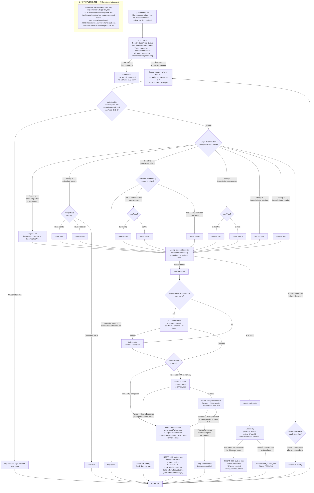

# WDP-COMP-09-CASE-FILLING-BATCH
**Worldpay Dispute Platform — Component Reference**
*Version: 1.0 DRAFT | April 2026*
*Extracted from: wdp-mcm-receiver-case-filing-queue-batch using GitHub Copilot CLI*
*Architect-confirmed: PENDING*

> ⚠️ **CORRECTION TO WDP-COMPONENTS.md** — Eight material corrections confirmed
> from source by Copilot CLI. See Key Architectural Decisions and Risks sections.
> Most significant: MCM Acknowledgement (Step 9) is **not implemented**.
> Artifact ID is `wdp-mcm-prearb-arb-queue-batch` (not `wdp-mcm-prearb-queue-batch`).

---

## ━━━ CORE SKELETON ━━━━━━━━━━━━━━━━━━━━━━━━━━━━━━━━━━━━━━

---

## Identity

| Field              | Value |
|--------------------|-------|
| **Name**           | `CaseFillingBatch` |
| **Type**           | `Batch/Scheduler` |
| **Repository**     | `wp-mfd/wdp-mcm-receiver-case-filing-queue-batch` |
| **Maven artifact** | `wdp-mcm-prearb-arb-queue-batch` *(correction — see note above)* |
| **Main class**     | `com.wp.wdp.mcm.prearb.arb.queue.batch.McmPrearbArbQueBatchApplication` |
| **Technology**     | Spring Boot 3.5.3 / Spring Batch / Java 17 |
| **Owner**          | Integration Team |
| **Status**         | `✅ Production` |
| **Doc status**     | `📝 DRAFT` |
| **Sections present** | `Core \| Block D — Batch` |

---

## Purpose

**What it does**

CaseFillingBatch is the MasterCard inbound batch responsible for ingesting
Pre-Arbitration and Arbitration dispute lifecycle events into WDP after a
first chargeback has already been raised. It polls the MasterCard Connect
Merchant (MCM) ReceiverCaseFiling queue on a configurable cron schedule,
fetches full claim detail for each qualifying event, determines the dispute
stage from the claim fields, optionally encrypts the cardholder PAN for new
claims, constructs a `CommonEvent` payload, and writes a structured row to
the `wdp.chbk_outbox_row` transactional outbox for downstream Kafka publishing
by COMP-12 InboundDisputeEventScheduler.

This batch is the origin of all MasterCard Pre-Arb and Arb dispute data in
WDP. It exclusively handles five dispute lifecycle stages that arise after
the merchant has already received or ignored a first chargeback:

| Stage | Description |
|-------|-------------|
| `PAB` | Incoming Pre-Arbitration filed by issuer |
| `ARB` | Incoming Arbitration or escalation to Arb |
| `PRA` | Withdrawal of either Pre-Arb or Arb |
| `AII` | Arbitration ruling — issuer favour (FAVOR_SENDER) |
| `AIM` | Arbitration ruling — merchant favour (FAVOR_RECEIVER) |

If this batch fails or falls behind, no new Pre-Arb or Arb cases are created
or updated in WDP downstream.

**What it does NOT do**

- Does not process MasterCard First Chargeback events — those are handled
  by COMP-08 FirstChargebackBatch in a separate repository
- Does not process Compliance events (caseType 3 or 4) — these are
  implicitly skipped; constants are defined in source for documentation
  only, not referenced in processing logic
- Does not publish to Kafka directly — writes to the outbox table only;
  COMP-12 InboundDisputeEventScheduler reads PENDING rows and publishes
- Does not acknowledge claims back to MCM — the MCM acknowledgement
  PUT method exists in the codebase but is **never called**; no claim
  is ever acknowledged (see Key Architectural Decisions)
- Does not call any case-lookup or case-creation API — the `caseLookupUrl`
  is configured in all environments but is a dead configuration value,
  never called at runtime; case create vs update logic is handled downstream
  by the CaseCreationConsumer after reading from Kafka
- Does not write to S3, emit metrics externally, or produce any file output
- Does not process any card network other than MasterCard
- Does not serve any platform other than CORE

---

## Internal Processing Flow

---

## Boundaries

### Inbound Interfaces

| Source | Protocol | Endpoint / Trigger | Payload / Description |
|--------|----------|--------------------|-----------------------|
| Internal Spring scheduler | `@Scheduled` cron | K8s secret key: `scheduler_cron` | Cron fires → launches Spring Batch job with timestamp `JobParameters` |
| MCM ReceiverCaseFiling Queue | REST via DataPower | `app.mcm-service.receiver-case-filing-queue-v6-url` (K8s secret: `receiver_case_filing_queue_url`) | All open Pre-Arb/Arb claims within the configured date window; paginated |

### Outbound Interfaces

| Target | Protocol | Endpoint / Resource | Purpose | On failure |
|--------|----------|---------------------|---------|------------|
| MCM ReceiverCaseFiling Queue | REST/HTTPS via DataPowerRestInvoker | Same URL as input — claim list poll | Fetch all pages of open claims | Silent abort of entire run — zero records processed; no alert |
| MCM Claim Detail API | REST/HTTPS via DataPowerRestInvoker | Per-claim GET | Fetch full case filing detail per claim | Claim silently skipped — 3 retries · 2s delay before skip |
| MCM Settled Transaction API | REST/HTTPS via DataPowerRestInvoker | Per-claim GET | Fetch Mapping Service account number for PAN | Fallback to `primaryAccountNum` from claim detail — 3 retries · 2s |
| IDP Token Service | REST/HTTPS via IdpRestInvoker | `app.idp-service.token-uri` | Obtain Bearer token for Encryption Service call | Claim silently skipped — **no retry on IDP** |
| Encryption Service | REST/HTTPS via RestInvoker | `app.dispute-service.encryption-uri` (e.g. `http://wdp-encryption-service.wdp-micro:8082/merchant/gcp/encryption/v1/pan/encrypt`) | Encrypt clear PAN to HPAN before persistence | Claim silently skipped — 3 retries · 2000ms delay |
| `wdp.chbk_outbox_row` | PostgreSQL JPA | `wdp` schema | Write PENDING or SKIPPED outbox rows for downstream Kafka publisher | Item-level: writer catches and logs exception; batch continues |

---

## Database Ownership

### Tables Owned (written by this component)

| Schema.Table | Purpose | Key columns | Notes |
|--------------|---------|-------------|-------|
| `wdp.chbk_outbox_row` | Transactional outbox — holds Pre-Arb/Arb events for downstream Kafka publishing by COMP-12 | `c_ntwk_case_id` (networkCaseId), `c_ntwk_phase_id` (networkPhaseId), `c_case_stage`, `c_case_ntwk`, `c_acq_platform`, `payload` (CommonEvent JSON), `process_status` | Kafka cols (`kafka_partition`, `kafka_offset`, `kafka_topic`) are null at INSERT time — populated by COMP-12. `error_code` and `error_message` columns exist on the entity but are **never set** by this batch. Shared table — see WDP-DB.md shared table risk register. |

### Spring Batch Metadata Tables (written by this component)

| Table | Schema | Purpose |
|-------|--------|---------|
| `BATCH_JOB_INSTANCE` | ⚠️ Controlled by K8s secret `table_prefix` — not determinable from source | Job identity and deduplication |
| `BATCH_JOB_EXECUTION` | ⚠️ As above | Execution status per run |
| `BATCH_STEP_EXECUTION` | ⚠️ As above | Step-level progress and read/write counts |

> ⚠️ **Schema gap** — Spring Batch `tablePrefix` is injected from K8s secret
> `table_prefix` at runtime. The schema name cannot be confirmed from source.
> Convention in similar batches is `WDP.BATCH_` but this must be confirmed
> from the live K8s secret value.

### Tables Read (not owned by this component)

This component performs no direct reads of tables owned by other components.
All external data is fetched via REST calls to MCM (DataPower).

---

---

## ━━━ TYPE BLOCK D — BATCH AND SCHEDULER CONTRACTS ━━━━━━━━

---

## Batch and Scheduler Contracts

**Batch framework:** Spring Batch (chunk-oriented, chunk size = 1)
**Deployment type:** Kubernetes Deployment (long-running pod, not CronJob — JVM stays warm)
**Trigger mechanism:** Internal Spring `@Scheduled` cron — cron value injected from K8s secret
**Job uniqueness:** Millisecond-precision timestamp `JobParameters` (`date` key, format `yyyyMMdd_HHmmss.SSS`). Spring Batch throws `JobInstanceAlreadyCompleteException` on collision — in practice impossible within a single JVM given millisecond precision.

---

### Job: ReceiverCaseFilingQueueBatch

**Purpose:** Poll MCM ReceiverCaseFiling queue, classify each claim's dispute stage,
optionally encrypt PAN, and write outbox rows for downstream Kafka publishing.

**Schedule**

| Parameter | Config key | Value / Source |
|-----------|------------|----------------|
| Cron expression | `app.scheduler.cron` → K8s secret `scheduler_cron` | ⚠️ Not determinable from source — no hardcoded default; application fails to bind if secret absent |
| Date window from | `app.mcm-service.receiver-case-filing-queue-v6-url` includes date params | Injected via K8s secret |
| Cron overlap guard | None | No ShedLock, no `@SchedulerLock`, no `synchronized` block — overlap limited in practice by replica count = 1 only |

**Input source**

| Source | Type | Filter | Pagination |
|--------|------|--------|------------|
| MCM ReceiverCaseFiling Queue | REST poll via DataPower | `lastModifiedBy ≠ P106040` (self-processing guard); items outside `[fromDate, toDate]` window excluded; optional `readSpecificItemFromQueue` filter for targeted reprocessing | Two modes: (1) page-count-based — default, loop until `pageCount` pages fetched; (2) sentinel-value-based — `disablePageCount=true`, loop until `pageCount` response field equals configured sentinel string. No hardcoded upper page limit in either mode. All pages loaded into memory before processing begins — no streaming. |

**Processing steps**

| Step | Name | Description | Chunk size | On failure |
|------|------|-------------|------------|------------|
| Pre-step | Claim list load | POST to MCM ReceiverCaseFiling queue — all pages loaded into memory as a list | N/A | Silent abort — zero records processed; no alert |
| 1 | Claim validation | Skip if `caseFilingInfo` or `caseFilingDetails` null; skip if `caseType` ∉ {1, 2} | — | Skip item; batch continues |
| 2 | Stage determination | Priority-ordered branch evaluation on `caseFilingStatus`, `rulingDate`, `rulingStatus`, `issuerAction`, `caseType`, and `caseFilingRespHistory` to resolve one of: PAB, ARB, PRA, AII, AIM. No match → skip. | — | Skip item |
| 3 | Outbox lookup | Lookup `chbk_outbox_row` by `networkCaseId` — routes to new claim or update path | — | — |
| 4a | New claim: PAN acquisition | GET MCM Settled Transaction Detail (if `networkSettledTransactionId` non-blank); fallback to `primaryAccountNum` on failure | — | Fallback to primary account num |
| 4b | New claim: PAN encryption | GET IDP token (no retry); POST Encryption Service (3 retries · 2000ms); HPAN replaces clear PAN | — | Skip item silently |
| 5 | Outbox write | INSERT `chbk_outbox_row` — PENDING (new/no-phase-match) or SKIPPED (phase already exists as non-SKIPPED) | 1 | Log and skip item; batch continues |

**Downstream calls per record (new claim, worst case)**

Up to 4 serial REST calls per new claim: (1) MCM Claim Detail GET, (2) MCM Settled Transaction Detail GET, (3) IDP Token Service GET, (4) Encryption Service POST — all sequential, all on the same processing thread. All MCM calls use a bare `RestTemplate` with no connection or read timeout configured. Update claims make only the MCM Claim Detail GET call — no PAN fetch or encryption.

**Idempotency**

Two-stage soft idempotency:

1. **Phase-agnostic** — `findByNetworkCaseId(networkCaseId)` — non-empty result routes to update path
2. **Phase-specific** — `findByNetworkCaseIdAndNetworkPhaseIdAndStatusNot(networkCaseId, networkPhaseId, "SKIPPED")` — if a non-SKIPPED row exists for the exact (caseId, phaseId) pair, a new SKIPPED row is inserted; no row updated. If none found, new PENDING row inserted.

Idempotency gaps:
- **Concurrent runs (replicas > 1)** — no distributed lock, no optimistic lock on INSERT. Two pods could each poll the same claim IDs, both find no outbox row, and both INSERT a PENDING row — producing duplicate PENDING rows before the idempotency check can fire.
- **Restart from partial run** — all claims re-fetched from MCM on restart; claims already PENDING from a prior partial run are detected and written as SKIPPED.

**Failure and recovery**

- **Single claim failure** — item-level catch; claim is silently skipped; batch continues with next item. No DLQ entry, no error table write, no alert.
- **Queue poll failure** — silent abort of the entire run. Zero records processed. No alert.
- **Job-level failure** — next cron trigger starts a brand-new job instance (new timestamp `JobParameters`). No Spring Batch checkpoint restart — all claims re-fetched from MCM.
- **IDP token failure** — no retry; claim silently skipped.
- **Encryption Service failure** — 3 retries exhausted; claim silently skipped.
- **MCM Acknowledgement** — **not implemented** (see Key Architectural Decisions). No claim is ever acknowledged to MCM. Claims remain in the MCM queue after WDP processes them — the downstream lifecycle of unacknowledged claims in MCM is an **open architectural question**.

**Spring Batch metadata**

| Table | Schema | Purpose |
|-------|--------|---------|
| `BATCH_JOB_INSTANCE` | ⚠️ K8s secret `table_prefix` — unconfirmed | Job identity |
| `BATCH_JOB_EXECUTION` | ⚠️ As above | Execution status per run |
| `BATCH_STEP_EXECUTION` | ⚠️ As above | Step-level progress and counts |

Uses the same `wdpDataSource` (`@Primary`) as the outbox writes. No dedicated `BatchDataSource` configured. Spring Batch auto-configures `JobRepository` using the `@Primary` datasource.

---

---

## Configuration and Scaling

| Parameter | Value | Source |
|-----------|-------|--------|
| Replica count | 1 (XL Deploy placeholder `{{ replicas-wdp-mcm-receiver-case-filing-queue-batch }}`) | `resources.yaml:8` |
| HPA | None | `resources.yaml` — not configured |
| Memory limit | 2048Mi | `resources.yaml:37` |
| Memory request | 256Mi | `resources.yaml:40` |
| CPU limit | Not set | — |
| CPU request | Not set | — |
| Deployment type | `Kubernetes Deployment` | Internal `@Scheduled` cron — not a Kubernetes CronJob |
| Rollout strategy | `RollingUpdate` — maxSurge: 1, maxUnavailable: 0 | `resources.yaml:10-12` |
| PodDisruptionBudget | None | Not configured |
| Topology spread | None | No `topologySpreadConstraints` block in `resources.yaml` |
| OTel agent | Injected via annotation `instrumentation.opentelemetry.io/inject-java` | `resources.yaml:22` |
| Actuator port | 8082 | `resources.yaml:34` |
| TLS / CA certs | Volume `ws-int-infoftps` secret mounted into JRE truststore | `resources.yaml:25-44` |
| Chunk size | 1 | `application.yml:29` — hardcoded |
| `minReadySeconds` | 30 — **misplaced** | Set at `spec.template.spec` level in `resources.yaml:29` — Kubernetes does not recognise it there; has no effect |

**Component-specific parameters**

| Parameter | Config key | Value / Source |
|-----------|------------|----------------|
| Cron expression | `app.scheduler.cron` | K8s secret `scheduler_cron` — not determinable from source |
| MCM queue URL | `app.mcm-service.receiver-case-filing-queue-v6-url` | K8s secret `receiver_case_filing_queue_url` |
| Vantiv license key | `app.mcm-service.vantiv-license` | K8s secret `vantive_license` (note: typo in secret key — 'vantive' not 'vantiv') |
| Disable page count | `app.mcm-service.disable-page-count` | K8s secret `disable_page_count` — value not determinable from source |
| IDP Token URI | `app.idp-service.token-uri` | Standalone `@Value` injection — e.g. dev: `http://wdp-idp-token-service-develop.gcp-ff:8082/merchant/gcp/idp-token/token` |
| Encryption URI | `app.dispute-service.encryption-uri` | e.g. prod: `http://wdp-encryption-service.wdp-micro:8082/merchant/gcp/encryption/v1/pan/encrypt` |
| Batch table prefix | `spring.batch.jdbc.tablePrefix` | K8s secret `table_prefix` — schema not determinable from source |
| Case number filter | `app.batch-properties.read-specific-item-from-queue` | K8s secret `read_specific_item_from_queue` — no production guard |
| Specific case IDs | `app.batch-properties.mcm-dispute-case-numbers` | K8s secret `mcm_case_numbers` — used only when above flag is true |

---

## Key Architectural Decisions

| Decision | ADR reference | Rationale | Notes |
|----------|---------------|-----------|-------|
| Transactional outbox pattern | DEC-001 — ✅ COMPLIANT | Decouples Pre-Arb/Arb ingestion from Kafka availability — outbox rows survive Kafka outages | INSERT into `chbk_outbox_row` is the sole write in each Spring Batch chunk transaction (chunk size = 1, `wdpTransactionManager`) |
| PAN encrypted at ingestion boundary | DEC-004 — ✅ COMPLIANT with ⚠️ finding | Clear PAN never persisted — encryption delegated to wdp-encryption-service via IDP-authenticated call | ⚠️ HPAN (encrypted) is logged at INFO level post-encryption in two places (`DisputeServiceImpl` and `ProcessorUtil`). `CommonEvent` (containing HPAN via `OriginalTransIdentifier`) is logged in full via Lombok `@Data` toString. `CheckmarkUtil.sanitizeString()` is defined but never called. No `@ToString.Exclude` on HPAN-bearing fields. HPAN is shipped to Logstash/ELK via TCP appender — constitutes effective persistence of encrypted cardholder data in logs. Needs architect and PCI review. |
| No Kafka involvement at runtime | DEC-003/005 — N/A | Outbox pattern replaces direct Kafka publish | Three Kafka artifacts are declared in `pom.xml` (compile scope) but unused at runtime — `spring-kafka`, `kafka-clients`, `aws-msk-iam-auth`. The only active reference is an accidental `import` of a Protobuf `ServiceException` from inside the Kafka artifact's shaded packages. |
| No circuit breaker | DEC-014 — ⚠️ DEVIATION | No Resilience4j dependency present | Retry provided entirely by `spring-retry`. Bare `RestTemplate` with no connection or read timeout — all three invokers (`DataPowerRestInvoker`, `IdpRestInvoker`, `RestInvoker`) inject the same no-timeout bean from `CommonConfig`. A hung downstream call blocks the processing thread for the full retry cycle (up to ~6s per call, or indefinitely for IDP which has no retry). |
| **MCM Acknowledgement NOT implemented** | No ADR — undocumented gap | ⚠️ `DataPowerRestInvoker.put()` is fully implemented with `@Retryable` but is never called from any code path. `McmService` interface declares only 3 methods — no acknowledge method exists. `BatchItemWriter` calls only `chbkOutboxService.saveEventChbkOutbox()`. | **Open architectural question:** What is the downstream lifecycle of a processed claim in the MCM ReceiverCaseFiling queue if WDP never sends an acknowledgement? Does MCM re-queue it? Is there a TTL? This must be confirmed from the MasterCard MCM team or integration documentation before this gap can be assessed as risk or accepted behaviour. |
| Pull model — no push from MCM | Local decision | WDP polls MCM ReceiverCaseFiling queue rather than receiving pushed events | Polling window and frequency are externalized. No rate limiting at the batch level. |
| Kubernetes Deployment — not CronJob | Local decision | JVM stays warm between cron fires — avoids cold-start latency | Trade-off: replicas > 1 creates parallel polling risk with no distributed lock |
| Chunk size = 1 (deliberate) | Local decision | Each claim is its own JPA transaction — failure on one claim does not roll back others | Enables partial-run progress at the cost of throughput |
| Static license key auth for MCM | Local decision | No OAuth token lifecycle to manage — Vantiv proprietary credential | Long-lived credential; no automatic rotation. Secret key name has a typo: `vantive_license` (not `vantiv_license`) |
| Per-request IDP token fetch | Local decision | No token caching — fresh token on every new claim encryption call | No retry on IDP call — failure silently skips the claim |

---

## Platform Standard Deviations

| Standard | Status | Detail |
|----------|--------|--------|
| DEC-001 — Transactional outbox | ✅ COMPLIANT | Writes PENDING rows to `wdp.chbk_outbox_row`. INSERT is the sole write in each chunk transaction (chunk size = 1). No other table written in the same transaction. |
| DEC-003 — Kafka partition key = merchantId | N/A | This component has no Kafka producer surface. |
| DEC-004 — PAN encrypted before persistence | ✅ COMPLIANT + ⚠️ FINDING | Clear PAN is never written to any persistent store. However, HPAN (encrypted) is logged at INFO level post-encryption and ships to Logstash/ELK. `CheckmarkUtil.sanitizeString()` is defined but never called. No redaction of HPAN-bearing fields in log output. Needs PCI-DSS scoping review. |
| DEC-005 — Kafka offset committed after processing | N/A | This component has no Kafka consumer. |
| DEC-014 — Resilience4j circuit breaker | ⚠️ DEVIATION | No `resilience4j-spring-boot2`, `resilience4j-spring-boot3`, or `spring-cloud-circuitbreaker` artifacts in `pom.xml`. No circuit breaker on any outbound call. All calls use a bare `RestTemplate` with no timeout configuration. |

---

## Risks and Constraints

🔴 **HIGH — MCM Acknowledgement gap: unknown MCM queue lifecycle**
No claim is ever acknowledged to MCM after WDP processes it.
`DataPowerRestInvoker.put()` exists but is never called. The downstream
behaviour of unacknowledged claims in the MCM ReceiverCaseFiling queue
is unknown. If MCM re-queues unacknowledged items, WDP will repeatedly
re-process the same claims on every poll cycle — relying entirely on the
idempotency mechanism to suppress duplicates indefinitely. If MCM has a
TTL or expiry on unacknowledged claims, WDP may silently lose Pre-Arb/Arb
events that expire before being acknowledged.
**Action required:** Confirm MCM queue behaviour for unacknowledged items
with the MCM integration team before this gap can be risk-assessed.

🔴 **HIGH — Replicas > 1 creates parallel MCM polling with no distributed lock**
Multiple pods would independently poll the same ReceiverCaseFiling queue
on the same cron tick and attempt concurrent INSERTs with no poll-time guard.
The idempotency check fires at write time only — duplicate PENDING rows before
the check executes are not protected against. Production replica count is
confirmed as 1 — risk is controlled today but becomes immediately critical
if replica count is ever increased. No ShedLock or coordination mechanism
is in place or planned.

🔴 **HIGH — No HPA**
Scaling is entirely manual via XL Deploy placeholder. No autoscaling under
queue backlog growth. If the batch falls behind, the queue accumulates and
the next run loads all backlogged pages into memory in a single pre-step
call — amplifying heap pressure and increasing duplicate-detection risk.

🟡 **MEDIUM — HPAN logged at INFO level post-encryption**
After encryption, HPAN is logged in two locations (`DisputeServiceImpl`
and `ProcessorUtil`) via Lombok `@Data` toString output. `CommonEvent`
containing HPAN ships to Logstash/ELK via TCP appender, constituting
effective persistence of encrypted cardholder data in logs.
`CheckmarkUtil.sanitizeString()` is defined but never called anywhere.
Needs PCI-DSS scoping review.

🟡 **MEDIUM — All claim pages loaded into memory before processing**
The BatchItemReader loads all MCM queue pages into memory in a single
pre-step call. Under normal 5-minute cadence the queue delta is small.
Under backlog conditions, the full accumulated queue is loaded against a
256Mi memory request (2048Mi limit). Risk elevates significantly if the
batch falls behind for an extended period.

🟡 **MEDIUM — No dead letter mechanism**
Failed claims are silently logged and skipped. No DLQ topic, no error
table, no alert. `error_code` and `error_message` columns exist on the
`ChbkOutboxEntity` but are never populated. There is no durable record
of which claims failed and no automated reprocessing path.

🟡 **MEDIUM — `readSpecificItemFromQueue` flag has no production guard**
When enabled, restricts processing to a pre-configured list of specific
claim IDs from K8s secret `mcm_case_numbers`. No profile check, no
environment assertion, and no startup validation prevents this flag from
being silently active in production if the secret is accidentally set.

🟡 **MEDIUM — No rate limiting on MCM API calls**
No throttle, sleep, or back-pressure between per-claim REST calls.
If MasterCard enforces server-side API quotas, high-volume runs risk
hitting rate limits with no protection.

🟡 **MEDIUM — No PodDisruptionBudget**
Node drain during a job execution terminates the pod mid-batch. Claims
not yet processed are re-fetched from MCM on the next run; idempotency
guards prevent most duplicates. The concurrent-INSERT gap remains for
any claim being processed at the moment of eviction.

🟡 **MEDIUM — No CPU limits or requests**
Pod runs at Burstable QoS — first candidate for eviction under node
memory pressure.

🟡 **MEDIUM — Cron schedule not auditable from source**
Expression is exclusively injected from K8s secret `scheduler_cron`.
No hardcoded default — application fails to bind if the secret is absent.
Schedule changes require a secret update, not a code or config change.

🟢 **LOW — `minReadySeconds: 30` misplaced in `resources.yaml`**
Value is set at `spec.template.spec` level (inside the Pod spec) instead
of `spec` level (Deployment level). Kubernetes does not recognise it in
its current position — the field has no effect. No functional impact today
but correcting the YAML path requires a deployment change.

🟢 **LOW — Bare `RestTemplate` with no timeout**
No connection or read timeout configured on `CommonConfig` `RestTemplate`.
All three REST invokers (`DataPowerRestInvoker`, `IdpRestInvoker`,
`RestInvoker`) inject the same bean. A hung downstream call blocks the
processing thread indefinitely (IDP has no retry — blocks until OS timeout
or process death). Under normal 5-minute cadence the blast radius is one
claim per hung call, not a consumer stall as in Kafka components.

🟢 **LOW — Kafka artifacts in pom.xml, unused at runtime**
`spring-kafka`, `kafka-clients`, and `aws-msk-iam-auth` declared in
compile scope. No Kafka producer or consumer code exists. The only active
Kafka reference is an accidental import of a Protobuf `ServiceException`
from inside the Kafka artifact's shaded packages — used as the exception
type thrown on encryption failure. This creates an unintentional dependency
on Kafka artifact internals.

🟢 **LOW — `spring-boot-starter-oauth2-client` declared but unused**
Declared in compile scope in `pom.xml`. No `@EnableOAuth2Client`,
no `@OAuth2RestTemplate`, and no `spring.security.oauth2.*` properties
exist anywhere in source or config.

---

## Planned and Incomplete Work

**Confirmed from source:**

| Item | Status | Detail |
|------|--------|--------|
| MCM Acknowledgement (PUT) | ⚠️ Not implemented | `DataPowerRestInvoker.put()` fully implemented with `@Retryable` — never called. ADR required to decide: implement, formally remove, or accept current behaviour. |
| IDP token caching | Not implemented | Per-request token fetch on every new claim. Low risk at normal cadence; degrades under backlog. |
| `error_code` / `error_message` population | Not implemented | Columns exist on `ChbkOutboxEntity` (lines 100-104) — `setErrorCode()` and `setErrorMessage()` are never called anywhere. Both always null at INSERT. |
| `readSpecificItemFromQueue` documentation | Undocumented debug tool | No ADR. Flag controlled by K8s secret `read_specific_item_from_queue`; specific IDs via `mcm_case_numbers`. No guard against accidental activation in production. |
| `minReadySeconds` YAML bug | Known bug | `spec.template.spec` path — not recognised by Kubernetes. Correct path is `spec.minReadySeconds` (Deployment-level field). |
| Kafka dependency resolution | Ambiguous | Three Kafka artifacts in compile scope with no Kafka usage. Accidental Kafka import drives a runtime type dependency. Resolve: either wire Kafka publishing or formally remove all three dependencies. |
| `spring-boot-starter-oauth2-client` | Unused | Declared, no configuration or usage found. Remove or activate. |
| Dead code — response model classes | Unused | `CaseEvent`, `WebResponse`, `MerchantDetails` — all in package `com.wp.wdp.mcm.prearb.arb.queue.batch.dispute.response` — never instantiated. `HistoricalDisputeDetail` declared as field in `CommonEvent` but never set (always null). `SearchCaseRequest` does not exist in the codebase — may be confused with another class. |
| Dead code — utility and enum classes | Unused | `BigDecimalUtil.toBigDecimal()`, `CheckmarkUtil.sanitizeString()`, `CaseActionStatus` enum, `CaseLibability` enum, `CardNetwork` enum, `Flag` enum, `LoggingException` class — all defined but never called or referenced in active processing logic. |
| Rate limiting on MCM calls | Not implemented | No throttle or back-pressure mechanism. |
| Dead letter / alerting for failed claims | Not implemented | No DLQ, no error table, no alert. Failed claims are invisible beyond application logs. |

---

*File status: 📝 DRAFT — architect confirmation pending.*
*Update WDP-COMP-INDEX.md (status: PENDING → DRAFT), WDP-KAFKA.md,*
*and WDP-DB.md after confirmation.*
