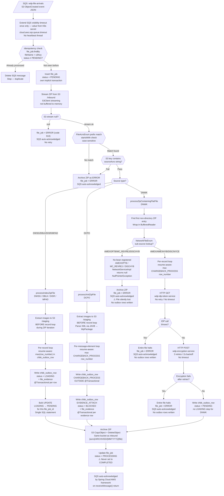

# WDP-COMP-11-FILE-PROCESSOR
**Worldpay Dispute Platform — Component Reference**
*Version: 1.0 DRAFT | April 2026*
*Extracted from: wdp-file-processor using GitHub Copilot CLI | Architect-confirmed: PENDING*

---

## ━━━ CORE SKELETON ━━━━━━━━━━━━━━━━━━━━━━━━━━━━━━━━━━━━━━

---

## Identity

| Field | Value |
|---|---|
| **Name** | `FileProcessor` |
| **Type** | `Batch/Scheduler — SQS-triggered Kubernetes Deployment` |
| **Repository** | `wdp-file-processor` |
| **Technology** | `Spring Boot 4.0.3 / Java 17 / Spring Cloud AWS 4.0.0` |
| **Owner** | `Integration Team` |
| **Status** | `✅ Production` |
| **Doc status** | `📝 DRAFT` |
| **Sections present** | `Core | Block D` |

---

## Purpose

**What it does**

FileProcessor is the primary inbound file-ingestion component for the WDP platform. It is the sole component responsible for converting raw source ZIP files — received from card networks, acquiring platforms, and merchants via the Sterling→ControlM→S3 pipeline — into structured outbox records that downstream consumers can act on.

When an inbound ZIP file lands in S3, an SQS event notification from the `wdp-file-arrivals` queue triggers the component. FileProcessor identifies the source from the filename prefix, streams the ZIP from S3, routes to a source-specific handler, parses every record according to source-specific format rules, writes dispute events and evidence metadata to three PostgreSQL outbox tables, stages evidence documents to S3 `/staging`, and encrypts PAN data for DNWK (network file) sources before any database write occurs.

FileProcessor handles six source types with fundamentally different file formats and dispute lifecycle roles. Evidence-only sources (DWSG, DBLK, DISR, MFAD) produce only EVIDENCE_ATTACH outbox rows. The Capital One XML source (DCPO) produces both CHARGEBACK_PROCESS and EVIDENCE_ATTACH rows per file element. The network file source (DNWK) produces only CHARGEBACK_PROCESS rows and is the sole path requiring PAN encryption.

Processing is strictly sequential: one file is fully processed before the next SQS message is dequeued. The SQS listener is configured `maxConcurrentMessages = 1` and `maxMessagesPerPoll = 1`. The component does not publish to Kafka — the transactional outbox (`chbk_outbox_row`) is the sole output, consumed by InboundDisputeEventScheduler (COMP-12).

**What it does NOT do**

- Does not publish to Kafka — no KafkaTemplate, no Kafka dependency in pom.xml
- Does not consume from Kafka — no `@KafkaListener` anywhere in the codebase
- Does not use Spring Batch — all record iteration is custom per-source processing logic
- Does not perform case enrichment, case lookup, or dispute workflow logic
- Does not generate ACK file content — it only sets `ack_required = true` and `ack_status = PENDING` on `file_job`; ACK file generation is handled by COMP-13 FileAcknowledgementProcessor
- Does not produce outbound network response files
- Does not set Kafka-related columns (`kafka_topic`, `kafka_partition`, `kafka_offset`) on `chbk_outbox_row` — those are set by COMP-12
- Does not expose any HTTP endpoint — no REST API, no Actuator health endpoints
- Does not cache IDP tokens — one HTTP GET per encryption call
- Does not have a circuit breaker on any outbound call — Resilience4j is not on the classpath

---

## Internal Processing Flow

**Flow notes**

- The SQS visibility timeout is extended **once only** before processing starts. There is no background heartbeat thread. If a file takes longer to process than the timeout value (read from K8s secret), the message becomes visible again and is redelivered. The resume logic handles safe redelivery.
- SQS message deletion on the normal processing path is handled **automatically** by the Spring Cloud AWS framework when `receiveMessage()` returns without throwing. FileProcessor does not explicitly delete the SQS message except in the idempotency duplicate path.
- On the DCPO path, the CHARGEBACK_PROCESS row is written **outside** any `@Transactional` boundary. If the pod crashes after this write but before evidence rows are committed, orphaned CHARGEBACK_PROCESS rows without evidence can result.
- The bulk LOADING→PENDING promotion applies **only** to DWSG, DBLK, DISR, MFAD. DCPO evidence rows stay BLOCKED. DNWK rows are written directly as PENDING.
- The final `file_job` status after a successful processing run is **PROCESSING**, not COMPLETED. No code path writes COMPLETED.

---

## Boundaries

### Inbound Interfaces

| Source | Protocol | Trigger | Payload / Description |
|---|---|---|---|
| AWS SQS `wdp-file-arrivals` | SQS `@SqsListener` (Spring Cloud AWS 4.0.0) | S3 ObjectCreated event notification | JSON message referencing the S3 bucket and key of the arriving ZIP file |

### Outbound Interfaces

| Target | Protocol | Resource | Purpose | On failure |
|---|---|---|---|---|
| AWS S3 `wdp-files` (prod) | AWS SDK v2 S3Client synchronous streaming | `{acro}/INBOUND/...` read | Stream ZIP file for processing | Returns null → file_job = ERROR (code 910), SQS acknowledged, no retry |
| AWS S3 `wdp-files` (prod) | AWS SDK v2 S3Client | `{acro}/STAGING/...` write | Stage extracted evidence documents | For index/XML path: outer catch archives as ERROR. Per-row: `file_evidence.failed_s3_key` populated |
| AWS S3 `wdp-files` (prod) | AWS SDK v2 S3Client | `{acro}/ARCHIVED/{MMYYYY}/...` CopyObject + DeleteObject | Archive processed ZIP | Returns null → original stays in /inbound; file_job status still set to PROCESSING or ERROR |
| AWS S3 `wdp-evidence-failed-files-prod` | AWS SDK v2 S3Client | Separate failed-evidence bucket | Receive failed evidence documents | Swallowed silently |
| `wdp-idp-token-service` | REST HTTP GET (RestTemplate, no timeout configured) | `http://wdp-idp-token-service.wdp-micro:8082/merchant/gcp/idp-token/token` | Retrieve Bearer token per encryption call. No caching. DNWK only. | Exception → entire file halts, file_job = ERROR, no outbox rows written |
| `wdp-encryption-service` | REST HTTP POST (RestTemplate, no timeout configured) | `http://wdp-encryption-service.wdp-micro:8082/merchant/gcp/encryption/v1/pan/encrypt` | Encrypt PAN for DNWK records. 3 retries, 2s fixed backoff via Spring Retry `@Retryable`. | After retries exhausted → entire file halts, file_job = ERROR, no outbox rows written |
| `wdp.file_job` | PostgreSQL Aurora | `wdp.file_job` insert + update | Track file-level processing status | If insert fails — unhandled exception; if update fails — status not persisted |
| `wdp.chbk_outbox_row` | PostgreSQL Aurora | `wdp.chbk_outbox_row` insert | Stage dispute events and evidence for Kafka publish via COMP-12 | DWSG/DBLK/DISR/MFAD: exception swallowed, loop continues. DCPO: swallowed. DNWK: error-status row attempted, if that fails both saves fail silently |
| `wdp.file_evidence` | PostgreSQL Aurora | `wdp.file_evidence` insert | Store evidence document metadata and S3 staging path | Swallowed inside `@Transactional` of insertEvidenceOutBox |

---

## Database Ownership

### Tables Owned (written by this component)

| Schema.Table | Purpose | Key columns | Notes |
|---|---|---|---|
| `wdp.file_job` | File-level processing ledger. One row per inbound ZIP file. Tracks status lifecycle, row counts, and ACK flags. | `id` (PK auto), `file_name`, `s3_key`, `s3_bucket`, `file_size_bytes`, `status` (PENDING/PROCESSING/ERROR), `source`, `ack_required`, `ack_status`, `ack_generated_at`, `total_rows`, `successful_rows`, `failed_rows`, `error_rows`, `total_evidences`, `attached_evidences`, `failed_evidences`, `error_code`, `error_message`, `completed_at`, `created_by` (always "WPFLEPR"), `updated_by` (always "WPFLEPR") | Idempotency lookup key is composite `(file_name, s3_key)`. No `@UniqueConstraint` on JPA entity — DB-level unique index not determinable from source (no DDL in repo). Status COMPLETED is never written — successful runs end at PROCESSING. ⚠️ See Risk: cross-component impact on COMP-13. |
| `wdp.file_evidence` | Evidence document index. S3 staging path, case linkage, attachment status. One row per extracted document. | `id` (PK auto), `file_job_id` (FK → file_job.id, not-null), `chbk_outbox_row_id` (FK → chbk_outbox_row.id, not-null), `file_name`, `s3_key` (staging path, not-null), `s3_bucket` (not-null), `attachment_status` (default PENDING), `attached_at`, `attachment_error`, `failed_s3_key`, `i_case`, `c_ntwk_case_id`, `created_by` (always "WPFLEPR") | Written inside `@Transactional` together with its linked `chbk_outbox_row` evidence row (inside `insertEvidenceOutBox()`). Not written for DNWK sources — those carry no evidence documents. |
| `wdp.chbk_outbox_row` *(shared)* | Shared transactional outbox. Dispute events and evidence handoff for Kafka publishing via COMP-12. | `id` (PK), `file_job_id` (FK), `row_number`, `parent_row_number` (evidence rows → parent CHARGEBACK_PROCESS row_number), `event_type` (CHARGEBACK_PROCESS / EVIDENCE_ATTACH), `i_case`, `i_action_id`, `c_acq_platform`, `i_acq_refnce_num`, `c_reason`, `i_ntwk_tran_id`, `c_case_ntwk`, `c_ntwk_case_id`, `c_ntwk_phase_id`, `c_case_stage`, `c_levell_entity`, `c_migration_sta`, `payload` (JSON), `status` (LOADING/PENDING/ERROR/BLOCKED), `error_code`, `source_event`, `document_type`, `action_seq`, `record_detail` (JSON), `discover_payload` (JSON), `network_notes` (JSON), `created_by` (always "WPFLEPR") | Shared table — also written by COMP-07, COMP-08, COMP-09. FileProcessor does NOT set `kafka_topic`, `kafka_partition`, or `kafka_offset` — those columns are not mapped in this codebase and are set by COMP-12 only. DCPO CHARGEBACK_PROCESS row written outside `@Transactional`. BLOCKED status for DCPO evidence rows is in the `status` column — no separate flag column. |

### Tables Read (not owned by this component)

| Schema.Table | Owned by | Why accessed |
|---|---|---|
| `wdp.chbk_outbox_row` | COMP-12 InboundDisputeEventScheduler (publisher) | Resume-point detection only — queries max `row_number` for current `file_job_id` to determine where to restart on SQS redelivery |

---

## Key Architectural Decisions

- **SQS as file processing trigger** — S3 ObjectCreated events routed via SQS rather than direct Lambda or S3 polling. SQS visibility timeout provides natural re-delivery on pod failure without external coordination.
- **Strictly sequential single-file processing** — `maxConcurrentMessages = 1` and `maxMessagesPerPoll = 1`. Simplifies state management and avoids concurrent write contention on shared outbox tables. Trade-off: throughput bounded by single-file processing time per pod.
- **Transactional outbox pattern (DEC-001)** — FileProcessor writes to `chbk_outbox_row` with PENDING status (after promotion); InboundDisputeEventScheduler (COMP-12) reads and publishes to Kafka. File processing fully decoupled from Kafka availability. Caveat: file_job, chbk_outbox_row, and file_evidence writes are NOT in a single DB transaction — committed separately.
- **Three-table outbox model** — `file_job` (file-level ledger and ACK tracking), `chbk_outbox_row` (dispute events and evidence handoff), `file_evidence` (document metadata and S3 paths) separate concerns cleanly.
- **PAN encrypted at ingestion boundary (DEC-004)** — clear PAN is never persisted for DNWK sources. Encryption delegated to `wdp-encryption-service` via IDP-token-authenticated REST. No crypto performed in-process.
- **S3 streaming** — ZIP files streamed from S3 rather than buffered into memory. Supports large files without proportional heap pressure.
- **No Kafka producer** — zero Kafka dependency. No staged Kafka pattern (unlike COMP-07/08/09).
- **BLOCKED status for DCPO evidence** — evidence rows from Capital One XML files written BLOCKED to prevent downstream consumers from attaching evidence before the parent chargeback case is created. The unblocking component is outside this service's boundary.
- **Filename-only source routing** — no metadata in the SQS message identifies the source. All routing decisions derive entirely from S3 key and filename prefix. Any filename convention change breaks routing silently.

---

## Risks and Constraints

🔴 **HIGH — No Actuator endpoints and no Kubernetes health probes.**
`spring-boot-starter-actuator` is not in pom.xml. No `/health`, `/liveness`, or `/readiness` endpoints exist. No K8s liveness or readiness probes configured. Kubernetes cannot detect a stuck or degraded pod.

🔴 **HIGH — No timeout on RestTemplate for encryption or IDP calls.**
Both `wdp-encryption-service` and `wdp-idp-token-service` calls use default RestTemplate with no connection or read timeout. A slow or unresponsive downstream service will block the single SQS processing thread indefinitely — the entire file ingestion pipeline stalls.

🔴 **HIGH — Three DNWK sub-sources result in silent file loss.**
MC_REVREJ and DISCHYB are routable by FileAcroEnum to the DNWK path but have no NetworkFileService bean registered — `NetworkServiceImpl` returns null, causing NullPointerException. File is archived, `file_job` = ERROR, SQS acknowledged, no outbox rows written. No exception surfaced to operations. AMEXOPTB has no FileAcroEnum prefix entry — files with this sub-source are unroutable and fail at the source identification step.

🔴 **HIGH — No HPA configured.**
File processing throughput scales only by increasing replica count manually. No autoscaling under queue backlog growth.

🟡 **MEDIUM — file_job successful status is PROCESSING, not COMPLETED.**
No code path advances `file_job` to COMPLETED after a successful run. COMP-13 FileAcknowledgementProcessor queries `status IN (COMPLETED, ERROR)` — if FileProcessor never writes COMPLETED, ACK processing for successfully completed DWSG and DBLK files may never trigger. Requires cross-component confirmation with COMP-13.

🟡 **MEDIUM — Idempotency gap with multiple replicas.**
No `@UniqueConstraint` or DB-level unique index on `(file_name, s3_key)` in `file_job`. Two pods receiving the same SQS message simultaneously can both pass the idempotency check before either has inserted. With `maxConcurrentMessages = 1` the race is low probability but is not prevented at the DB layer.

🟡 **MEDIUM — DCPO CHARGEBACK_PROCESS row written outside @Transactional.**
If a pod crash occurs after the CHARGEBACK_PROCESS row is saved but before evidence rows are committed, orphaned chargeback rows without evidence will exist in `chbk_outbox_row`. No compensating mechanism.

🟡 **MEDIUM — Potential DEC-004 gap on null encryption response.**
If `wdp-encryption-service` returns a null value (rather than throwing), the `encrypt()` method sets the account number field to the raw PAN. If this null-return path can occur in production, clear PAN would be written to `chbk_outbox_row.payload`. Requires team confirmation.

🟡 **MEDIUM — DBLK production record length unconfirmed.**
`CoreBulkResponseConstants.DETAIL_RECORD_LENGTH = 102` with source comment `// 134; // need to check the size in prod`. If production DBLK files use 134-byte records, DBLK parsing silently misparsed or drops content beyond byte 102.

🟡 **MEDIUM — No retry on S3 reads, S3 writes, or database operations.**
Transient failures result in ERROR status or swallowed exceptions — no automatic recovery path.

🟢 **LOW — DISR and MFAD `record_detail` field always null.**
Code to populate `record_detail` from the raw source record string is commented out in both `DiscoverMapIncomingServiceImpl` and `DiscoverMapNoticeProcessorServiceImpl`. Downstream consumers or diagnostics relying on this field receive null for these sources.

🟢 **LOW — DWSG image size validation removed.**
The 3 MB cap validation in `WalmartSignatureCapServiceImpl` is commented out. Responsibility attributed to `wdp consumer` in the code comment but not formally assigned with a ticket reference or ADR.

🟢 **LOW — No dead letter mechanism for file-level ERROR outcomes.**
Failures visible only via `file_job.status = ERROR`. No automated alerting, no reprocessing queue. Manual intervention required.

---

## Planned Changes and Known Gaps

- Implement three missing DNWK sub-source services: AMEXOPTB (also needs FileAcroEnum prefix entry), MC_REVREJ, DISCHYB. Currently result in silent file loss.
- Confirm DBLK production record length against a live production file before trusting DBLK parse output.
- Activate or formally remove image size validation (3 MB cap) for DWSG. Assign responsibility with formal ADR.
- Re-activate or formally remove `record_detail` population for DISR and MFAD.
- Add K8s liveness and readiness probes — requires adding Actuator to pom.xml.
- Add RestTemplate timeouts for `wdp-encryption-service` and `wdp-idp-token-service`.
- Add DB-level unique index on `(file_name, s3_key)` in `wdp.file_job`.
- Clarify and formally document `file_job` terminal status — PROCESSING vs COMPLETED. Resolve cross-component impact on COMP-13.
- Formally document or remove the DNWK flat-file decryption commented-out code path in `FileProcessingServiceImpl`.
- Resolve four active TODOs in source: TIFF extension double-append risk (`FileJobUtils.java:64`, `WalmartSignatureCapServiceImpl.java:214`), index file extension detection (`FileProcessingServiceImpl.java:285`), DNWK decryption path (`FileProcessingServiceImpl.java:185`).
- DCPO `batchHeader` variable declared but commented out in `processRecords` — batch metadata processing not implemented.

---

## ━━━ TYPE BLOCK D — BATCH AND SCHEDULER CONTRACTS ━━━━━━━━

---

## Batch and Scheduler Contracts

**Batch framework:** Custom — no Spring Batch. All record iteration is source-specific per-handler logic.
**Deployment type:** Kubernetes Deployment (not CronJob)
**Trigger mechanism:** AWS SQS event-driven — one SQS message per file arrival
**Job uniqueness:** File-level idempotency via `file_job` lookup on composite `(file_name, s3_key)` before insert. No DB-level unique constraint confirmed.

---

### Job: File Ingestion (SQS-triggered, one execution per inbound ZIP file)

**Purpose:** Process one inbound ZIP file from SQS notification to outbox records staged for Kafka publishing via COMP-12.

**Schedule**

| Parameter | Config key | Value / Source |
|---|---|---|
| Trigger | `cloud.aws.sqs.queue.name` | Event-driven — SQS `@SqsListener`. No cron schedule. |
| SQS queue name (prod) | `cloud.aws.sqs.queue.name` | `wdp-file-arrivals` |
| SQS queue URL (prod) | `cloud.aws.sqs.queue.url` | `https://sqs.us-east-2.amazonaws.com/713582017757/wdp-file-arrivals` |
| Visibility timeout | `cloud.aws.sqs.queue.timeout` | Injected from K8s secret `wdp-file-processor-secrets` via `${extend_timeout}` — numeric value not in source ⚠️ |
| Max concurrent messages | `@SqsListener` annotation attribute | `1` |
| Max messages per poll | `@SqsListener` annotation attribute | `1` |

**Input source**

| Source | Type | Description | Pagination |
|---|---|---|---|
| AWS SQS `wdp-file-arrivals` | SQS `@SqsListener` | S3 ObjectCreated event JSON — contains S3 bucket and key of arriving ZIP | None — one message per file |
| AWS S3 `wdp-files` /inbound | S3 streaming read | ZIP file content streamed via `S3Client.getObject()` returning `ResponseInputStream` | None — full file streamed |

**Source routing table**

| FileAcroEnum prefix (startsWith, case-sensitive) | Resolves to | Handler class |
|---|---|---|
| `MEJR_DBLK_CHRGRESPF` | DBLK | `CoreBulkResponseServiceImpl` |
| `AUE2_IWSG_F0BCMI3_WMSIG` | DWSG | `WalmartSignatureCapServiceImpl` |
| `AUE2_MFAD_F0DGDWCI_DISC_DISPUTENOTIFY` | MFAD | `DiscoverMapNoticeProcessorServiceImpl` |
| `AUE2_DISR_F0BCD71C_DISC_ISSUERDOC` | DISR | `DiscoverMapIncomingServiceImpl` |
| `DCPO_PODMDC81.BJWC` | DCPO | `CaponeDisputesIncomingServiceImpl` |
| `AUE2_DNWK_P0DMDMAX.AMEX.CASES` | DNWK → AMEX | `AmexNetworkFileServiceImpl` |
| `AUE2_DNWK_P0DMDMAH.AMEXHYB.CASES` | DNWK → AMEXHYB | `AmexHybNetworkFileServiceImpl` |
| `AUE2_DNWK_P0DMDMDI.DISC.CASES` | DNWK → DISC | `DiscoverNetworkFileServiceImpl` |
| `AUE2_DNWK_P0DMDMIM.MC.REVREJ` | DNWK → MC_REVREJ | ⚠️ No bean registered — silent ERROR, file lost |
| `AUE2_DNWK_P0DMDPIN.NYCE.CASES` | DNWK → NYCE | `NyceNetworkFileServiceImpl` |
| `AUE2_DNWK_P0DMDMDY.DISCHYB.CASES` | DNWK → DISCHYB | ⚠️ No bean registered — silent ERROR, file lost |
| *(no prefix registered)* | AMEXOPTB | ⚠️ Not routable — fails at FileAcroEnum level |

**Per-handler processing details**

*processIndexZipFile (DWSG, DBLK, DISR, MFAD):*
- `extractIndexFileFromZip()` is called first — iterates all ZIP entries, reads `.txt` files into a `String[]` lines array, uploads all non-txt files (images/documents) to S3 staging immediately during extraction
- Record loop then runs against the already-extracted lines array
- S3 staging writes happen **before** the record loop; `chbk_outbox_row` writes happen **during** the record loop — S3 staging always precedes the corresponding outbox write

*processXmlZipFile (DCPO):*
- `extractXmlFromZip()` is called first — uploads non-`.xml` files (document images) to S3 staging during ZIP iteration; parses the `.xml` file via JAXB into a `WpPackage` object
- S3 staging writes happen before the record loop
- Per `WpPackage` message element: one CHARGEBACK_PROCESS `ChbkOutboxRow` is inserted **outside** `@Transactional`, then N EVIDENCE_ATTACH rows (one per ImageMeta) are inserted via `CommonService.insertEvidenceOutBox()` each in their own `@Transactional`
- BLOCKED status is set explicitly on the `RowDetail.status` field before `insertEvidenceOutBox()` is called — the status column in `chbk_outbox_row` carries the BLOCKED value directly

*processZipContainingFlatFile (DNWK):*
- Iterates ZIP entries, finds the first non-directory entry, wraps stream in a `BufferedReader`, calls `processFlatFile()` immediately
- No images in DNWK flat files — no S3 staging upload occurs
- DNWK rows are written directly with PENDING status — the LOADING→PENDING bulk promotion does not apply to this path

**Downstream calls per record (DNWK only)**

Each DNWK record triggers two serial REST calls before any DB write:
1. HTTP GET `wdp-idp-token-service` — retrieve Bearer token. No retry. No timeout. No caching — one call per record.
2. HTTP POST `wdp-encryption-service` — encrypt PAN (account number field). Spring Retry `@Retryable`: 3 attempts, 2s fixed backoff. No timeout. No circuit breaker.

IDP failure → entire file halts (exception propagates up, outer catch sets file_job = ERROR).
Encryption failure after retries → entire file halts (same path).

**Outputs**

| Target | Type | What is written | On failure |
|---|---|---|---|
| `wdp.file_job` | DB insert then update | One row per file. Insert: status = PENDING. Update: status = PROCESSING (success) or ERROR. | Insert failure: unhandled. Update failure: status not persisted. |
| `wdp.chbk_outbox_row` | DB insert | CHARGEBACK_PROCESS rows (all sources except evidence-only). EVIDENCE_ATTACH rows (DWSG, DBLK, DISR, MFAD, DCPO). Status: LOADING (promoted to PENDING for index sources), PENDING direct (DNWK), BLOCKED (DCPO evidence). | Index: exception swallowed, loop continues. DNWK: error-status row attempted. DCPO: exception swallowed. |
| `wdp.file_evidence` | DB insert | One row per extracted document (not for DNWK). S3 staging path, file_job_id FK, chbk_outbox_row_id FK. | Swallowed inside `@Transactional` of insertEvidenceOutBox. |
| AWS S3 /staging | S3 write | Extracted evidence and issuer documents | Index/XML outer catch archives as ERROR. Per-row: `file_evidence.failed_s3_key` populated via move to failed bucket. |
| AWS S3 /archived | S3 CopyObject + DeleteObject | Original ZIP moved to `{acro}/ARCHIVED/{MMYYYY}/{fileName}` in same bucket (`wdp-files`). | `moveS3Object()` returns null — original stays in /inbound; `file_job.s3_key` not updated to archive path; file_job status set as intended. |

**Failure and recovery**

The per-record loop is resume-aware. On SQS redelivery:
- For DWSG/DBLK/DISR/MFAD: resume point is the highest `row_number` for the `file_job_id` in `chbk_outbox_row` (any event type)
- For DCPO/DNWK: resume point is the highest CHARGEBACK_PROCESS `row_number` for the `file_job_id`
- `rowStartNumber = chbkOutboxRow.getRowNumber() + 1` — processing skips all rows up to this point

Safe restart requires `file_job.status` to still be PENDING at the time of redelivery. If the first run updated status to PROCESSING or ERROR before crashing, the idempotency check will treat the file as already processed — the redelivered message is deleted without reprocessing.

There is no DLQ, no error table, and no automated alerting for file-level failures. Manual investigation required via `file_job.status = ERROR` and `file_job.error_code`.

**Spring Batch metadata:** Not applicable — Spring Batch is not used.

---

## Scaling and Deployment

| Parameter | Value | Notes |
|---|---|---|
| Kubernetes type | Deployment | Not CronJob |
| Replica count | `{{ replicas-wdp-file-processor }}` | XL Deploy / Deploy.it template placeholder — actual prod value not in source |
| Memory limit | 2048Mi | |
| Memory request | 1024Mi | |
| CPU limit | Not configured | No CPU limits or requests in resources.yaml |
| HPA | Not configured | No HorizontalPodAutoscaler manifest in repository |
| PodDisruptionBudget | Not configured | No PDB manifest in repository |
| Rolling update strategy | type: RollingUpdate, maxSurge: 1, maxUnavailable: 0 | |
| minReadySeconds | 30 | ⚠️ WDP-COMPONENTS.md incorrectly states 50 — confirmed 30 from source |
| Topology spread | Not configured | No topologySpreadConstraints in pod spec |
| OTel Java agent | Injected | Pod annotation: `instrumentation.opentelemetry.io/inject-java: opentelemetry-operator-system/default` |
| Logstash | Configured | `logstash-logback-encoder` v8.1; host/port from K8s secret via `${logstash_server_host_port}` |
| Spring Actuator | **Not present** | `spring-boot-starter-actuator` not in pom.xml. No `/health`, `/liveness`, or `/readiness` endpoints. No K8s health probes configured. |
| Auth (S3 + SQS) | IAM / IRSA | `InstanceProfileCredentialsProvider.create()` when `isiamuser = true` in all deployed environments |

---

## Platform Standard Deviations

| Decision | Status | Detail |
|---|---|---|
| DEC-001 Transactional outbox | ✅ Pattern followed — ⚠️ atomicity partial | Outbox pattern intent honoured — `chbk_outbox_row` written before COMP-12 publishes. However `file_job` insert, `chbk_outbox_row` write, and `file_evidence` write are NOT in a single DB transaction — committed separately. For DCPO, CHARGEBACK_PROCESS row written outside `@Transactional`. Crash between commits can leave partial state. |
| DEC-003 Kafka partition key = merchantId | ✅ N/A | No Kafka producer in this component. Zero KafkaTemplate anywhere in codebase confirmed. |
| DEC-004 PAN encrypted before persistent write | ✅ Confirmed — ⚠️ one conditional gap | DNWK: PAN encrypted in-flight, clear PAN never written. Non-DNWK: no PAN fields in record layouts confirmed. Caveat: if `wdp-encryption-service` returns HTTP 200 with null body (vs throwing), raw PAN may be written to `chbk_outbox_row.payload`. Requires team confirmation. |
| DEC-005 Kafka offset after full processing | ✅ N/A | No Kafka consumer. Zero `@KafkaListener` in codebase confirmed. |
| DEC-014 Resilience4j circuit breakers | ✗ **DEVIATED** 🔴 HIGH | Resilience4j not on classpath — not in pom.xml. No `@CircuitBreaker`, `@Bulkhead`, or `@RateLimiter` annotation exists anywhere. Only resilience mechanism is Spring Retry `@Retryable` on encryption call (3 attempts, 2s backoff). No timeout on either outbound REST call — slow downstream services block indefinitely. |

---

## Open Questions Requiring Resolution

| # | Question | Resolution path |
|---|---|---|
| OQ-1 | SQS visibility timeout numeric value — K8s secret only, not in source | Check `wdp-file-processor-secrets` K8s secret or XL Deploy / Terraform values store |
| OQ-2 | SQS DLQ at AWS infrastructure level — not determinable from source | Check AWS SQS console or Terraform/CDK config for `wdp-file-arrivals` queue |
| OQ-3 | DB unique index on `(file_name, s3_key)` in `wdp.file_job` — no DDL in repo | Run `\d wdp.file_job` in psql or check Flyway/Liquibase migration scripts |
| OQ-4 | `file_job` PROCESSING terminal status vs COMP-13 query for COMPLETED — possible ACK generation break | Architect decision required. Investigate during COMP-13 migration. |
| OQ-5 | DEC-004 null encryption return path — does `wdp-encryption-service` ever return HTTP 200 with null body? | Team confirmation required |
| OQ-6 | Replica count in production | Check XL Deploy / Deploy.it configuration |
| OQ-7 | DCPO `ack_required` setting and source code written to `file_job.source` (CAPONE_CMRTR vs CAPONE_BJWC) | Follow-up Copilot question: *"In CaponeDisputesIncomingServiceImpl, is `ack_required` set to true on `file_job`? What value is written to `file_job.source` and how is the CMRTR vs BJWC sub-type determined?"* |

---

*End of component file.*
*File status: 📝 DRAFT — pending architect confirmation.*
*After confirmation: update WDP-COMP-INDEX.md (status → ✅ COMPLETE), WDP-KAFKA.md (add Kafka-free row), WDP-DB.md (enrich three COMP-11 table rows), WDP-HANDOVER.md (correct minReadySeconds 50→30; add OQ-4 and OQ-5 to open questions).*
