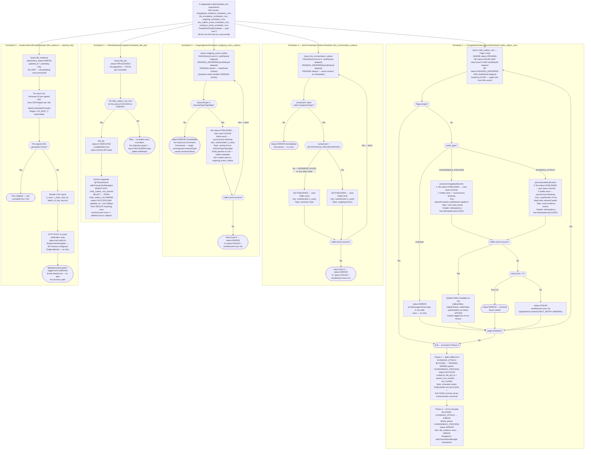

# WDP-COMP-12-INBOUND-EVENT-SCHEDULER
**Worldpay Dispute Platform — Component Reference**
*Version: 1.0 DRAFT | April 2026*
*Extracted from: wdp-chargeback-evidence-event-scheduler using GitHub Copilot CLI*
*Architect-confirmed: PENDING*

> ⚠️ **CORRECTIONS TO WDP-COMPONENTS.md** — Three material corrections confirmed from source:
> 1. The "up to 53 rows" claim for Scheduler5 is **incorrect** — there is no LIMIT clause in the query and no truncation occurs.
> 2. Scheduler3 and Scheduler4 PENDING-absent is **intentional architectural contract**, not a bug — the upstream writer service handles initial PENDING delivery directly.
> 3. Scheduler1 writes `PUBLISHED` status, **not** `SUCCESS`. The Phase 2 unblock query requires `SUCCESS` on the parent `CHARGEBACK_PROCESS` row — this transition must be made by a downstream consumer (most likely COMP-14 CaseCreationConsumer). This is an open architecture question that requires confirmation.

---

## ━━━ CORE SKELETON ━━━━━━━━━━━━━━━━━━━━━━━━━━━━━━━━━━━━━━

---

## Identity

| Field | Value |
|-------|-------|
| **Name** | `InboundDisputeEventScheduler` |
| **Type** | `Kafka Producer / Batch-Scheduler` |
| **Repository** | `wdp-chargeback-evidence-event-scheduler` |
| **Maven artifact** | `com.wp.gcp:chargeback-evidence-event-scheduler:1.0.5` |
| **Technology** | Spring Boot 3.5.7 / Spring Data JPA / Spring Kafka / Java 17 |
| **Owner** | Integration Team |
| **Status** | `✅ Production` |
| **Doc status** | `📝 DRAFT` |
| **Sections present** | `Core | Block C — Kafka Producer | Block D — Batch/Scheduler` |

---

## Purpose

**What it does**

`InboundDisputeEventScheduler` is the **transactional outbox relay layer** for the WDP chargeback and evidence domain. It is a continuously-running Kubernetes `Deployment` hosting five independent `@Scheduled` cron jobs — each draining a specific outbox or tracking table and relaying events to AWS MSK Kafka topics or to an external email endpoint.

This component is the **only Kafka producer** in the inbound processing chain. The upstream batch jobs and file processors (COMP-07, COMP-08, COMP-09, COMP-11) write dispute events to PostgreSQL outbox tables and rely entirely on this service to relay those events into the Kafka event bus. None of those components have a Kafka dependency.

Scheduler1 (`ChargebackEvidenceEventScheduler`) is the highest-criticality path. It drains `wdp.chbk_outbox_row` and routes each row to either `new-case-events` (dispute creation events) or `case-evidence-events` (evidence attachment events) based on the row's `event_type`. It also manages the sequencing gate that prevents evidence events from being published before their parent chargeback case has been successfully created downstream — using a `BLOCKED` status on evidence rows that is only released after the parent `CHARGEBACK_PROCESS` row reaches `SUCCESS` status.

Scheduler2 (`FileJobStatusCompletionScheduler`) monitors file processing completion by inspecting terminal-state counts on `wdp.chbk_outbox_row` and promoting completed file jobs to `COMPLETED` on `wdp.file_job`. It also archives `SUCCESS` rows older than 30 days to `wdp.chbk_outbox_row_archive`.

Schedulers 3 and 4 handle retry and deferred-delivery paths for two additional outbox tables (`wdp.outgoing_event_outbox`, `wdp.bre_orchestration_outbox`). Initial PENDING delivery for these tables is handled by the upstream writer service — these schedulers handle only the `FAILED` retry and `PENDING_DEFERRED` future-publish paths.

Scheduler5 (`EvidenceErrorEmailScheduler`) does not publish to Kafka. It polls `wdp.file_evidence` for rows where S3 evidence attachment failed on the previous day, generates S3 pre-signed URLs for all failed rows, renders a CSV report, and POSTs it to an internal email notification relay. This is an alerting mechanism only — it does not retry or recover failed evidence records.

**What it does NOT do**

- Does not consume from Kafka — no `@KafkaListener`, no consumer group
- Does not expose any REST endpoints — no `@RestController`
- Does not call EncryptionService, IDP, any card scheme endpoint, or any acquiring platform API
- Does not parse or validate file uploads — that is COMP-11 FileProcessor
- Does not perform schema migration — Hibernate DDL auto is `false`
- Does not manage the initial PENDING→PUBLISHED delivery for `wdp.outgoing_event_outbox` or `wdp.bre_orchestration_outbox` — that is the upstream writer service's responsibility
- Does not set `chbk_outbox_row.status = SUCCESS` — the scheduler sets `PUBLISHED`; the transition to `SUCCESS` is made by a downstream consumer (unconfirmed which component)
- Does not have distributed locking — no ShedLock, no SELECT FOR UPDATE, no advisory lock

---

## Internal Processing Flow

*Five schedulers fire concurrently from a shared 5-thread pool. Scheduler1 is shown in full detail; Schedulers 2–5 are shown at decision-step level.*

---

## Boundaries

### Inbound Interfaces

| Source | Protocol | Trigger | Payload / Description |
|--------|----------|---------|-----------------------|
| Spring `@Scheduled` (Scheduler1) | Internal cron | K8s secret: `chargeback_evidence_scheduler_cron` | Fires → drains `wdp.chbk_outbox_row` |
| Spring `@Scheduled` (Scheduler2) | Internal cron | K8s secret: `file_completion_scheduler_cron` | Fires → evaluates `wdp.file_job` completion |
| Spring `@Scheduled` (Scheduler3) | Internal cron | K8s secret: `outgoing_scheduler_cron` | Fires → drains `wdp.outgoing_event_outbox` |
| Spring `@Scheduled` (Scheduler4) | Internal cron | K8s secret: `bre_outbox_event_scheduler_cron` | Fires → drains `wdp.bre_orchestration_outbox` |
| Spring `@Scheduled` (Scheduler5) | Internal cron | K8s secret: `evidence_email_scheduler_cron` | Fires → polls `wdp.file_evidence` for yesterday's errors |
| `wdp.chbk_outbox_row` | PostgreSQL poll | Scheduler1 query | PENDING / FAILED / PENDING_DEFERRED dispute and evidence events |
| `wdp.file_job` | PostgreSQL poll | Scheduler2 query | PROCESSING file job records |
| `wdp.chbk_outbox_row` | PostgreSQL read | Scheduler2 terminal-count queries | Row counts by status per file_job_id and event_type |
| `wdp.outgoing_event_outbox` | PostgreSQL poll | Scheduler3 query | FAILED / PENDING_DEFERRED outgoing event rows |
| `wdp.bre_orchestration_outbox` | PostgreSQL poll | Scheduler4 query | FAILED / PENDING_DEFERRED BRE orchestration rows |
| `wdp.file_evidence` | PostgreSQL poll | Scheduler5 query | ERROR attachment rows from yesterday |

### Outbound Interfaces

| Target | Protocol | Resource | Purpose | On failure |
|--------|----------|----------|---------|------------|
| AWS MSK `new-case-events` | Kafka (SASL_SSL / MSK IAM) | Topic | Publish CHARGEBACK_PROCESS events (Scheduler1) | Row → FAILED + nextRetryAt=+1hr; after 3 attempts → ERROR terminal |
| AWS MSK `case-evidence-events` | Kafka (SASL_SSL / MSK IAM) | Topic | Publish EVIDENCE_ATTACH events (Scheduler1) | Same retry / ERROR pattern |
| AWS MSK `case-action-events` / `core-request-events` / `external-request-events` | Kafka (SASL_SSL / MSK IAM) | Topic (dynamic — channelTypeTopicMap) | Publish outgoing events (Scheduler3) | Same retry pattern; unknown channelType → immediate terminal ERROR (no retry) |
| AWS MSK `business-rules` | Kafka (SASL_SSL / MSK IAM) | Topic | Publish BRE orchestration events — BUSINESS_RULES component (Scheduler4) | Same retry / ERROR pattern |
| AWS MSK `outgoing-events` | Kafka (SASL_SSL / MSK IAM) | Topic | Publish BRE orchestration events — NOTIFICATION_ORCHESTRATOR component (Scheduler4) | Same retry / ERROR pattern |
| `wdp.chbk_outbox_row` | PostgreSQL (JPA + native UPDATE) | `wdp` schema | Status transitions (PUBLISHED, FAILED, ERROR), Kafka metadata writes, bulk unblock UPDATE, error-cascade UPDATE (Scheduler1) | Failure logged — outer try/catch prevents context crash |
| `wdp.chbk_outbox_row_archive` | PostgreSQL (native INSERT + DELETE) | `wdp` schema | Archive SUCCESS rows older than 30 days (Scheduler2) | `@Transactional` rollback if archiveCount ≠ deleteCount |
| `wdp.file_job` | PostgreSQL (JPA save) | `wdp` schema | PROCESSING → COMPLETED transition (Scheduler2) | Auto-commit JPA save; failure skips this job — retried next invocation |
| `wdp.file_evidence` | PostgreSQL (native UPDATE) | `wdp` schema | Set attachment_status=ERROR for rows whose EVIDENCE_ATTACH sibling hit ERROR (Scheduler1 Phase 3) | Within wdpTransactionManager transaction; rollback on failure |
| `wdp.outgoing_event_outbox` | PostgreSQL (JPA save) | `wdp` schema | Status transitions (PUBLISHED, FAILED, ERROR) — Scheduler3 | Per-row catch — one failure does not stop the run |
| `wdp.bre_orchestration_outbox` | PostgreSQL (JPA save) | `wdp` schema | Status transitions (PUBLISHED, FAILED, ERROR) — Scheduler4 | Same per-row isolation |
| Email notification relay | REST / HTTP POST | `app.email.notify.url` → K8s secret `${email_notification_url}` | POST CSV report of yesterday's failed evidence attachments (Scheduler5) | Single attempt — no retry; WebServiceException swallowed; email silently lost |
| AWS S3 | S3Presigner SDK v2 | `app.s3.bucketname` → K8s secret `${bucket_name}` | Generate pre-signed URLs for failed evidence files (Scheduler5 — read-only, no upload) | Per-URL exception swallowed; that row excluded from CSV |

---

## Database Ownership

### Tables Owned (written by this component)

| Schema.Table | Purpose | Key columns | Retention / Notes |
|--------------|---------|-------------|-------------------|
| `wdp.chbk_outbox_row` | Primary outbox — status transitions, Kafka metadata, unblock and error-cascade updates (shared writer — see shared table risk) | `status`, `event_type`, `retry_count`, `next_retry_at`, `published_at`, `kafka_offset`, `kafka_partition`, `kafka_topic`, `idempotency_id` | SUCCESS rows archived to `chbk_outbox_row_archive` after 30 days by Scheduler2 (30-day threshold hardcoded) |
| `wdp.chbk_outbox_row_archive` | Long-term archive of SUCCESS rows from chbk_outbox_row | Mirrors `chbk_outbox_row` + `archived_at` | No purge policy confirmed for archive table itself |
| `wdp.file_job` | Completion status update only (PROCESSING → COMPLETED) | `status`, `completed_at` | Written only by Scheduler2 completion path; upstream rows created by COMP-11 |
| `wdp.file_evidence` | Error-cascade only — sets attachment_status=ERROR when parent EVIDENCE_ATTACH row reaches ERROR | `attachment_status` | Written only on error-cascade; read by Scheduler5 for daily error report |
| `wdp.outgoing_event_outbox` | Status transitions for outgoing event retry/deferred rows (Scheduler3) | `status`, `retry_count`, `next_retry_at`, `idempotency_id` | ⚠️ This component handles FAILED and PENDING_DEFERRED only — does not write initial PENDING rows |
| `wdp.bre_orchestration_outbox` | Status transitions for BRE orchestration retry/deferred rows (Scheduler4) | `status`, `retry_count`, `next_retry_at`, `idempotency_id` | ⚠️ Same constraint — FAILED and PENDING_DEFERRED only |

### Tables Read (not owned by this component)

| Schema.Table | Owned by | Why accessed |
|--------------|----------|--------------|
| `wdp.chbk_outbox_row` | COMP-07, COMP-08, COMP-09, COMP-11 (writers) | Scheduler1: poll eligible rows; Scheduler2: count terminal-state rows per file_job_id to evaluate completion |
| `wdp.file_job` | COMP-11 FileProcessor | Scheduler2: poll PROCESSING jobs; also read to join against file_evidence in Scheduler5 query |
| `wdp.file_evidence` | COMP-11 FileProcessor | Scheduler5: poll ERROR rows for daily email report |

---

## Configuration and Scaling

| Parameter | Value | Notes |
|-----------|-------|-------|
| Replica count | XLD Deploy placeholder: `{{ replicas-wdp-chargeback-evidence-event-scheduler }}` | Actual production count NOT in source — must be confirmed from XLD |
| HPA | None | No `HorizontalPodAutoscaler` resource in `resources.yaml` |
| Memory request | 1024Mi | |
| Memory limit | 2048Mi | |
| CPU request | Not set | Pod runs Burstable QoS — first eviction candidate under node pressure |
| CPU limit | Not set | |
| Deployment type | Kubernetes `Deployment` (not `CronJob`) | JVM stays warm between cron fires; avoids cold-start latency |
| Rollout strategy | `RollingUpdate` — `maxSurge: 1`, `maxUnavailable: 0` | |
| PodDisruptionBudget | None | `resources.yaml` contains Deployment only |
| Topology spread | None | No `topologySpreadConstraints` in `resources.yaml` |
| Thread pool | `ThreadPoolTaskScheduler` — pool size 5, prefix `ChargebackEvidence` | One thread per scheduler; all five can execute concurrently |
| Kafka send mode | Synchronous blocking — `kafkaTemplate.send().get()` | Provides natural backpressure; no rate limiting between rows |
| Page size (Scheduler1) | K8s secret: `${page_size}` | No default in YAML — startup fails (`BeanCreationException`) if secret absent |
| Channel topic map (Scheduler3) | K8s secret: `${channel_topic_map}` | JSON map — no default in non-local environments |
| 30-day archive window | Hardcoded | Not configurable via K8s secret |
| Server port | 8082 | Actuator runs on same port (no separate management port) |
| OTel agent | Annotation injection: `instrumentation.opentelemetry.io/inject-java: opentelemetry-operator-system/default` | Injected by OpenTelemetry Operator — not an init container |
| Logstash encoder | `logstash-logback-encoder:7.4` | Structured JSON via `LogstashTcpSocketAppender` → `${LOGSTASH_SERVER_HOST_PORT}` |
| minReadySeconds | Set at `spec.template.spec.minReadySeconds: 30` | ⚠️ **BUG** — wrong YAML path; Kubernetes ignores this field at pod spec level. Same bug as COMP-09. Correct path is `spec.minReadySeconds` at Deployment level |

---

## Key Architectural Decisions

| Decision | ADR reference | Notes |
|----------|---------------|-------|
| Transactional outbox pattern — upstream writers populate outbox tables; this service relays to Kafka | DEC-001 | Decouples file ingestion and batch processing from Kafka availability. Four outbox tables drained by five schedulers |
| Mark-before-send (at-most-once delivery) | DEC-001 — deviation | Status set to `PUBLISHED` and committed to DB **before** Kafka send. Pod crash between DB commit and Kafka send = silent permanent message loss. Deliberate design trade-off: prevents duplicate publish at the cost of potential loss |
| No distributed locking | Local decision | No ShedLock, no `SELECT FOR UPDATE`, no `SKIP LOCKED`. Race condition mitigation is consumer-side only via `idempotency-key` header |
| EVIDENCE_ATTACH sequencing gate via BLOCKED status | Local decision | EVIDENCE_ATTACH rows written BLOCKED by upstream; Phase 2 bulk unblock requires parent CHARGEBACK_PROCESS to reach SUCCESS. Prevents orphaned evidence publishing for cases not yet created downstream |
| Kubernetes Deployment (not CronJob) | Local decision | JVM stays warm between cron fires. Trade-off: replica count > 1 creates concurrency race risk with no database-level guard |
| Dynamic topic routing via `channelTypeTopicMap` (Scheduler3) | Local decision | Topic resolved at runtime from K8s secret JSON map. Allows new channel types without code change. Unknown channelType causes immediate terminal ERROR with no retry |
| Scheduler5 as alerting-only — no recovery | Local decision | Daily email report provides visibility of failed evidence attachments; does not retry or re-queue them |
| `idempotencyId` on `OutgoingEventOutboxEntity` is `String` type | ⚠️ Note | Different from `ChbkOutboxEntity` where `idempotencyId` is `UUID` type. Same Kafka header name `idempotency-key` used. Downstream consumers must handle both types |
| Kafka metadata NOT written back for Scheduler3 rows | Local decision | `null` entity passed to `kafkaService.publishEventToKafka` for Scheduler3. `handleSuccess` skips metadata update when entity is null. Outgoing event rows never have `kafka_offset`, `kafka_partition`, `kafka_topic` populated |
| Partition key is `caseNumber` or compound `networkCaseId+cardNetwork+platform` — not `merchantId` | DEC-003 — **DEVIATION CONFIRMED** | All five Kafka-publishing paths use case-level or network-level keys, not merchantId. This is a platform-wide deviation from DEC-003 for this component. See deviation flags below |
| IAM role-based auth for Kafka (MSK IAM / SASL_SSL) | DEC-014 | `aws-msk-iam-auth:2.1.1` — IAM used for Kafka; no static Kafka credentials |
| Static AWS credentials for S3 (Scheduler5) | Security risk — Local decision | `StaticCredentialsProvider` with `AwsBasicCredentials` via K8s secrets `${aws_access_key}` / `${aws_secret_key}`. Migration from `InstanceProfileCredentialsProvider` was started and completed but old IAM code kept as commented reference |

---

## Risks and Constraints

| Severity | Risk | Consequence |
|----------|------|-------------|
| 🔴 HIGH | **At-most-once delivery — pod crash window.** Status written to `PUBLISHED` and DB-committed before Kafka send. A pod killed between the DB commit (step 1) and Kafka send (step 2) leaves the row permanently stuck in `PUBLISHED`. No scheduler query includes `PUBLISHED` in its filter — the row is silently and permanently stranded. No DLQ, no alert, no recovery path. | Silent message loss — a dispute or evidence event is never published to Kafka and never created in WDP downstream. Undetectable without external monitoring on outbox row age |
| 🔴 HIGH | **Concurrency race window with replicas > 1.** No `SELECT FOR UPDATE`, `SKIP LOCKED`, or ShedLock. Two pods running the same cron can read and begin processing the same row before either commits the `PUBLISHED` status update. Race window = time between query and DB commit. | Duplicate Kafka publish for the same outbox row. Consumer-side deduplication via `idempotency-key` header is the only mitigation. Production replica count is unconfirmed from source |
| 🔴 HIGH | **PUBLISHED → SUCCESS gap — EVIDENCE_ATTACH unblocking depends on a downstream consumer.** Scheduler1 Phase 2 unblock query requires `CHARGEBACK_PROCESS.status = SUCCESS`. The scheduler sets `PUBLISHED`, not `SUCCESS`. A downstream consumer (COMP-14 CaseCreationConsumer is the likely candidate) must transition the row to `SUCCESS`. If that consumer fails or is delayed, EVIDENCE_ATTACH rows remain permanently `BLOCKED`. | Evidence never published for any case where the downstream SUCCESS transition fails or is delayed. This is an implicit cross-component dependency with no timeout or fallback |
| 🟡 MEDIUM | **No dead letter queue or error archive for terminal ERROR rows.** After 3 failed attempts, rows reach terminal `ERROR` on `chbk_outbox_row`, `outgoing_event_outbox`, or `bre_orchestration_outbox`. They are never requeued. The only visibility mechanism is Scheduler5's daily email report, which covers `file_evidence` only — not the other three tables. | Terminal ERROR rows require manual intervention. No ops runbook. No automated alert |
| 🟡 MEDIUM | **No staleness guard on PROCESSING file_job rows (Scheduler2).** A file_job stuck in `PROCESSING` indefinitely (e.g. upstream events that never reach terminal state) is polled on every invocation with no remediation path. | Scheduler2 accumulates stale jobs in its query result set. No alerting. Manual investigation required to identify stuck jobs |
| 🟡 MEDIUM | **Static AWS credentials for S3 (Scheduler5).** `InstanceProfileCredentialsProvider` migration was replaced with `StaticCredentialsProvider` using `AwsBasicCredentials` from K8s secrets. | Static credentials are a security concern. Keys must be rotated manually. Rotation requires K8s secret update and pod restart |
| 🟡 MEDIUM | **No CPU limits or requests configured.** Pod runs Burstable QoS. | First eviction candidate on nodes under memory pressure. Combined with the concurrency race risk, scaling is unsafe without a distributed locking solution |
| 🟡 MEDIUM | **No timeout on `RestTemplate` used by Scheduler5.** Default `SimpleClientHttpRequestFactory` with `connectTimeout=-1` and `readTimeout=-1` (infinite). | If the email notification relay is unresponsive, the Scheduler5 thread blocks indefinitely — consuming one of the 5 scheduler threads permanently |
| 🟡 MEDIUM | **Unknown `channelType` causes permanent ERROR with no retry (Scheduler3).** An unrecognised `channelType` value is set to `ERROR` immediately — retryCount is not incremented. No retry, no alert. | Rows with unrecognised channelType are permanently silently discarded. New channel types require K8s secret update to the `channelTypeTopicMap` before any rows arrive |
| 🟢 LOW | **S3Presigner created per call (Scheduler5), not per injection.** `s3PresignerConfiguration.s3Presigner()` is called directly (not via Spring bean injection), creating a new presigner instance on each URL generation call. | New SDK client objects and connections created per call. Under large error report sets, this creates unnecessary object churn. Low risk at normal cadence |
| 🟢 LOW | **`minReadySeconds: 30` at wrong YAML path.** Set at `spec.template.spec` (inside pod spec) instead of `spec.minReadySeconds` (Deployment level). Kubernetes silently ignores it. Same bug as COMP-09. | Pods do not observe the 30-second readiness settling delay during rolling updates. Premature traffic routing during rollout is possible |
| 🟢 LOW | **`commons-beanutils:1.11.0` declared in pom.xml but not imported or used anywhere in source.** Confirmed dead dependency. | Unused transitive risk — dependency footprint and potential vulnerability surface with no benefit |
| 🟢 LOW | **`json-path` version declared in `<properties>` but no `<dependency>` block and no source import.** Dead reference. | No runtime impact. Dead `<properties>` entry |
| 🟢 LOW | **`HistoricalDisputeDetail` DTO retains two deprecated fields (`rejectDate`, `rejectReason`) marked for removal.** Fields promoted to `ChargebackEvent` but not cleaned from nested DTO. | Dead fields. No runtime impact but misleading to future maintainers |
| 🟢 LOW | **All cron expressions and `channelTypeTopicMap` externalised to K8s secrets.** Schedule values not visible in source repository. | Operational debugging requires K8s secret access. Schedule changes require secret update rather than config PR |

---

## Planned Changes

- Resolve replica count — confirm actual XLD value and document. If replicas > 1, a distributed locking solution (ShedLock or `SELECT FOR UPDATE SKIP LOCKED`) is required to eliminate the concurrency race risk. Current state is an unmitigated 🔴 HIGH risk
- Resolve PUBLISHED → SUCCESS gap — confirm which downstream component transitions `CHARGEBACK_PROCESS` rows from `PUBLISHED` to `SUCCESS`, and document the cross-component contract formally. Likely candidate: COMP-14 CaseCreationConsumer
- Fix `minReadySeconds` YAML placement — move from `spec.template.spec.minReadySeconds` to `spec.minReadySeconds` at Deployment level (same fix needed as COMP-09)
- Remove unused `commons-beanutils` dependency from pom.xml
- Remove dead `json-path` version property from pom.xml
- Clean `rejectDate` / `rejectReason` from `HistoricalDisputeDetail` DTO
- Evaluate S3Presigner factory pattern — consolidate to Spring bean injection or confirm per-call creation is intentional
- Migrate S3 credentials from `StaticCredentialsProvider` back to IAM instance profile — current static credentials approach is a security regression
- Add operational alerting for terminal ERROR rows on all four outbox tables (currently only `file_evidence` covered by Scheduler5 email — three other tables have no error visibility)
- ⚠️ OPEN QUESTION: Which component writes initial PENDING rows to `wdp.outgoing_event_outbox` and `wdp.bre_orchestration_outbox`? The upstream writer must be identified and the initial delivery contract documented. Candidate: COMP-18 NotificationOrchestrator — requires Copilot CLI confirmation against that repository

---

---

## ━━━ TYPE BLOCK C — KAFKA PRODUCER CONTRACTS ━━━━━━━━━━━━━

---

## Kafka Producer Contracts

**Producer framework:** Spring Kafka `KafkaTemplate<String, Event>` — one shared bean across all five schedulers via `KafkaServiceImpl`
**Idempotent producer:** Yes — `ENABLE_IDEMPOTENCE_CONFIG = true`, `ACKS_CONFIG = "all"`
**Transactional producer:** No — `TRANSACTIONAL_ID_CONFIG` not set; no `KafkaTransactionManager`
**Publish mode:** Synchronous blocking — `kafkaTemplate.send(message).get()`
**Kafka-client retries:** 3 retries per send call before exception propagates to application level
**Auth:** MSK IAM — `SASL_SSL` + `AWS_MSK_IAM` mechanism via `aws-msk-iam-auth:2.1.1`
**Bootstrap servers:** `spring.kafka.bootstrap-servers`
**Key serialiser:** `org.apache.kafka.common.serialization.StringSerializer`
**Value serialiser:** `org.springframework.kafka.support.serializer.JsonSerializer`
**Kafka metadata header:** `idempotency-key` — forwarded from outbox entity `idempotencyId` field on every publish

---

### Topic: `new-case-events`

| Parameter | Value |
|-----------|-------|
| **Topic name** | `new-case-events` |
| **Message key** | Compound string: `networkCaseId + cardNetwork + platform` (string concatenation) — source fields: `c_ntwk_case_id`, `c_case_ntwk`, `c_acq_platform` on `ChbkOutboxEntity` |
| **Ordering guarantee** | Per partition — scoped to network case + card network + platform combination |
| **Published on** | Scheduler1 processes a `CHARGEBACK_PROCESS` row from `wdp.chbk_outbox_row` |
| **Consumed by** | COMP-14 CaseCreationConsumer |

**Message payload:** `ChargebackEvent` (JSON) — deserialised from `chbk_outbox_row.payload` column. Payload produced by upstream batch writers (COMP-07, COMP-08, COMP-09, COMP-11). `enrichmentFailure = true` is hardcoded by some upstream writers — downstream consumer must handle partial events.

**Payload notes:** `eventId` is set to the outbox row `id` before publish. Kafka metadata (`kafkaOffset`, `kafkaPartition`, `kafkaTopic`) is written back to the outbox row after successful publish via native UPDATE. Row status transitions: `PENDING → PUBLISHED` (before send) → Kafka metadata populated (after send).

⚠️ **DEC-003 deviation:** Partition key is NOT `merchantId`. See deviation flags.

---

### Topic: `case-evidence-events`

| Parameter | Value |
|-----------|-------|
| **Topic name** | `case-evidence-events` |
| **Message key** | `caseNumber` (column `i_case`) if non-blank; else `networkCaseId` (column `c_ntwk_case_id`) on `ChbkOutboxEntity` |
| **Ordering guarantee** | Per partition — scoped to case number when available |
| **Published on** | Scheduler1 processes an `EVIDENCE_ATTACH` row from `wdp.chbk_outbox_row` that has been unblocked (status = `PENDING`) |
| **Consumed by** | COMP-15 EvidenceConsumer |

**Message payload:** `EvidenceEvent` (JSON) — deserialised from `chbk_outbox_row.payload`. Same Kafka metadata writeback pattern as `new-case-events`. Row status: `PENDING → PUBLISHED` before send.

**Payload notes:** EVIDENCE_ATTACH rows originating from DWSG/DBLK/DISR/MFAD sources are evidence-only (no chargeback). DCPO sources produce paired CHARGEBACK_PROCESS + EVIDENCE_ATTACH rows. DNWK sources produce CHARGEBACK_PROCESS only (no evidence rows).

⚠️ **DEC-003 deviation:** Partition key is NOT `merchantId`.

---

### Topic: `case-action-events` / `core-request-events` / `external-request-events` (dynamic)

| Parameter | Value |
|-----------|-------|
| **Topic name** | Resolved at runtime from `channelTypeTopicMap` (K8s secret `${channel_topic_map}`) by `channelType` field value. Known production mappings: `EXPIRY_EVENTS→case-action-events`, `CORE_EVENTS→core-request-events`, `GP_EVENTS→external-request-events`, `SEN_EVENTS→external-request-events` |
| **Message key** | `caseNumber` — column `i_case` on `OutgoingEventOutboxEntity` |
| **Ordering guarantee** | Per partition — scoped to case number |
| **Published on** | Scheduler3 processes a `FAILED` (retryCount < 3) or `PENDING_DEFERRED` row from `wdp.outgoing_event_outbox` |
| **Consumed by** | Varies by topic — `case-action-events`: COMP-17 CaseExpiryUpdateConsumer; `core-request-events`: COMP-43 CoreNotificationConsumer; `external-request-events`: COMP-41, COMP-42, COMP-44 |

**Payload notes:** `OutgoingEvent` (JSON). **Kafka metadata is NOT written back** to `outgoing_event_outbox` for Scheduler3 rows — `null` entity is passed to the Kafka service, so `kafka_offset`, `kafka_partition`, `kafka_topic` are never populated. `idempotencyId` on `OutgoingEventOutboxEntity` is `String` type (not UUID).

⚠️ **DEC-003 deviation:** Partition key is NOT `merchantId`.

---

### Topic: `business-rules`

| Parameter | Value |
|-----------|-------|
| **Topic name** | `spring.kafka.breEventTopic` → `business-rules` (prod) |
| **Message key** | `caseNumber` — column `i_case` on `BreOrchestrationOutboxEntity` |
| **Ordering guarantee** | Per partition — scoped to case number |
| **Published on** | Scheduler4 processes a row from `wdp.bre_orchestration_outbox` where `component = BUSINESS_RULES` (or any value that is not `NOTIFICATION_ORCHESTRATOR`) |
| **Consumed by** | COMP-16 BusinessRulesProcessor |

**Payload notes:** `BREOutboxEvent` (JSON). One row → exactly one topic publish (if/else routing is mutually exclusive with outgoing-events). Kafka metadata NOT written back (same null-entity pattern as Scheduler3).

⚠️ **DEC-003 deviation:** Partition key is NOT `merchantId`.
⚠️ **Publisher TBC resolution:** This confirms COMP-12 is the publisher of `business-rules` topic for BRE orchestration rows. Update WDP-KAFKA.md topic registry accordingly. However — who writes initial PENDING rows to `wdp.bre_orchestration_outbox` remains unconfirmed. Candidate: COMP-18 NotificationOrchestrator.

---

### Topic: `outgoing-events`

| Parameter | Value |
|-----------|-------|
| **Topic name** | `spring.kafka.notificationOrchestratorEventTopic` → `outgoing-events` (prod) |
| **Message key** | `caseNumber` — column `i_case` on `BreOrchestrationOutboxEntity` |
| **Ordering guarantee** | Per partition — scoped to case number |
| **Published on** | Scheduler4 processes a row from `wdp.bre_orchestration_outbox` where `component = NOTIFICATION_ORCHESTRATOR` |
| **Consumed by** | COMP-18 NotificationOrchestrator |

**Payload notes:** `NotificationOrchestrationOutboxEvent` (JSON). Kafka metadata NOT written back.

⚠️ **DEC-003 deviation:** Partition key is NOT `merchantId`.

---

---

## ━━━ TYPE BLOCK D — BATCH AND SCHEDULER CONTRACTS ━━━━━━━━

---

## Batch and Scheduler Contracts

**Batch framework:** Spring `@Scheduled` cron — not Spring Batch (no Spring Batch metadata tables)
**Deployment type:** Kubernetes `Deployment` (continuously running — JVM warm between cron fires)
**Trigger mechanism:** Five independent `@Scheduled` cron expressions — all values externalised to K8s secrets. No cron value is committed to source.
**Job uniqueness:** No distributed locking. No Spring Batch deduplication. No `SELECT FOR UPDATE`. Concurrency risk is live if replica count > 1.

---

### Job: Scheduler1 — ChargebackEvidenceEventScheduler

**Purpose:** Primary dispute event relay. Drains `wdp.chbk_outbox_row` and publishes `CHARGEBACK_PROCESS` rows to `new-case-events` and `EVIDENCE_ATTACH` rows to `case-evidence-events`. Also manages the BLOCKED → PENDING sequencing gate and error-cascades on failure.

**Schedule**

| Parameter | Config key | Value / Source |
|-----------|------------|----------------|
| Cron expression | K8s secret | `chargeback_evidence_scheduler_cron` — value not in source |
| Timezone | Not specified | JVM default |

**Input source**

| Source | Type | Query / Filter | Pagination |
|--------|------|----------------|------------|
| `wdp.chbk_outbox_row` | PostgreSQL poll | `status=PENDING` OR `status=FAILED AND retryCount<3 AND nextRetryAt<=now` OR `status=PENDING_DEFERRED AND nextRetryAt<=now` — sorted by `id` ASC | Page-0 drain loop — always fetches page 0; repeats until page is empty. Page size: K8s secret `${page_size}` — no default, startup fails if absent |

**Processing steps**

| Step | Name | Description | On failure |
|------|------|-------------|------------|
| 1 | Classify event type | Inspect `event_type` field — `CHARGEBACK_PROCESS`, `EVIDENCE_ATTACH`, or unknown | Unknown type → status=ERROR immediately; no retry |
| 2 | Mark PUBLISHED | Set `status=PUBLISHED` + `updatedBy/updatedAt` → `chbkOutboxRepository.save(entity)` auto-commit | Cannot fail silently — JPA save exception would propagate to row-level catch |
| 3 | Kafka send | `kafkaTemplate.send(message).get()` — synchronous blocking. Up to 3 Kafka-client retries before exception propagates | Exception caught in service method catch block |
| 4 | Update Kafka metadata | Native UPDATE: set `kafka_offset`, `kafka_partition`, `kafka_topic`, `published_at` on the row | Failure logged but not re-thrown — row status remains PUBLISHED with metadata absent |
| 5 (failure path) | Retry / Error | Increment `retryCount`. If >2: `status=ERROR` (terminal). Else: `status=FAILED`, `nextRetryAt=now+1hr` | FAILED rows re-eligible on next invocation when nextRetryAt elapses |
| 6 | Phase 2 — Bulk unblock | `UPDATE chbk_outbox_row SET status=PENDING WHERE event_type=EVIDENCE_ATTACH AND status=BLOCKED AND parent CHARGEBACK_PROCESS.status=SUCCESS` | Native UPDATE in wdpTransactionManager transaction |
| 7 | Phase 3 — Error cascade | `UPDATE chbk_outbox_row SET status=ERROR WHERE event_type=EVIDENCE_ATTACH AND status=BLOCKED AND parent CHARGEBACK_PROCESS.status=ERROR`. Also: `UPDATE file_evidence SET attachment_status=ERROR` for paired rows | Both updates wrapped in wdpTransactionManager transaction |

**Failure and recovery:**  Per-row `try/catch` in the service method — one failing row does not halt the run. An outer `try/catch` at the scheduler method level catches catastrophic failures (e.g. DB connection loss on initial query). PUBLISHED-stuck rows have NO recovery path — this is the at-most-once design risk. Rows in terminal ERROR are never requeued.

---

### Job: Scheduler2 — FileJobStatusCompletionScheduler

**Purpose:** Monitors file processing completion by counting terminal-state rows on `chbk_outbox_row` per file job. Promotes complete jobs to `COMPLETED` on `file_job`. Archives SUCCESS rows older than 30 days to `chbk_outbox_row_archive`.

**Schedule**

| Parameter | Config key | Value / Source |
|-----------|------------|----------------|
| Cron expression | K8s secret | `file_completion_scheduler_cron` — value not in source |

**Input source**

| Source | Type | Query / Filter | Pagination |
|--------|------|----------------|------------|
| `wdp.file_job` | PostgreSQL poll | `status=PROCESSING` — ordered by `id` | None — full list per invocation |

**Processing steps**

| Step | Name | Description | On failure |
|------|------|-------------|------------|
| 1 | Count terminal rows | For each PROCESSING file_job: count SUCCESS + ERROR rows on `chbk_outbox_row` by `file_job_id` and `event_type` | DB query failure skips this job — retried next invocation |
| 2 | Evaluate completion | `isTotalChargebackMatch = (successfulChargebacks + errorChargebacks) == totalChargebackCount`. `isTotalEvidenceMatch = (attachedEvidences + failedEvidences) == totalEvidenceCount`. Both must be true. Only SUCCESS and ERROR count — PUBLISHED, PENDING, etc. prevent completion | — |
| 3 | Mark COMPLETED | `fileJobRepository.save(fileJobEntity)` — `status=COMPLETED`, `completedAt=now` (auto-commit) | JPA save failure — job retried next invocation |
| 4 | Archive SUCCESS rows | `@Transactional(wdpTransactionManager)`: INSERT SUCCESS rows (>30 days old) into `chbk_outbox_row_archive`, then DELETE from `chbk_outbox_row`. If `archiveCount ≠ deleteCount` → rollback both | Transaction rollback — archive not applied; retried next invocation |

**Failure and recovery:** No per-row try/catch documented. A stuck `PROCESSING` job (upstream rows never reaching terminal state) is polled indefinitely — no staleness guard and no alerting.

---

### Job: Scheduler3 — OutgoingEventScheduler

**Purpose:** Retry and deferred-delivery relay for `wdp.outgoing_event_outbox`. Handles `FAILED` (retryCount < 3) and `PENDING_DEFERRED` rows only. Initial PENDING delivery is the responsibility of the upstream writer service.

**Schedule**

| Parameter | Config key | Value / Source |
|-----------|------------|----------------|
| Cron expression | K8s secret | `outgoing_scheduler_cron` — value not in source |

**Input source**

| Source | Type | Query / Filter | Pagination |
|--------|------|----------------|------------|
| `wdp.outgoing_event_outbox` | PostgreSQL poll | `status=FAILED AND retryCount<3 AND nextRetryAt<=now` OR `status=PENDING_DEFERRED AND nextRetryAt<=now` — **PENDING intentionally absent** | Not documented — assumed full list or page |

**Processing steps**

| Step | Name | Description | On failure |
|------|------|-------------|------------|
| 1 | Validate channelType | Check `entity.getChannelType()` against `channelTypeTopicMap`. Unknown value → `status=ERROR` immediately — no retryCount increment, permanent | — |
| 2 | Resolve topic | `topic = channelTypeTopicMap.get(channelType)` | Covered by step 1 validation |
| 3 | Mark PUBLISHED | `status=PUBLISHED` → `outgoingEventOutboxRepository.save(entity)` auto-commit | JPA exception propagates to row-level catch |
| 4 | Kafka send | Synchronous blocking. `null` entity passed — Kafka metadata NOT written back | Exception → retry/error logic |
| 5 (failure) | Retry / Error | Same pattern as Scheduler1: retryCount>2 → ERROR; else FAILED + nextRetryAt=now+1hr | — |

---

### Job: Scheduler4 — BreOrchestrationOutboxScheduler

**Purpose:** Retry and deferred-delivery relay for `wdp.bre_orchestration_outbox`. Routes each row to either `business-rules` (COMP-16) or `outgoing-events` (COMP-18) based on the `component` field. Handles FAILED and PENDING_DEFERRED only.

**Schedule**

| Parameter | Config key | Value / Source |
|-----------|------------|----------------|
| Cron expression | K8s secret | `bre_outbox_event_scheduler_cron` — value not in source |

**Input source**

| Source | Type | Query / Filter | Pagination |
|--------|------|----------------|------------|
| `wdp.bre_orchestration_outbox` | PostgreSQL poll | `status=FAILED AND retryCount<3 AND nextRetryAt<=now` OR `status=PENDING_DEFERRED AND nextRetryAt<=now` — **PENDING intentionally absent** | Not documented |

**Processing steps**

| Step | Name | Description | On failure |
|------|------|-------------|------------|
| 1 | Validate component type | Pre-validate `entity.getComponent()` against `ComponentType` enum (values: `BUSINESS_RULES`, `NOTIFICATION_ORCHESTRATOR`). Unknown → `status=ERROR` immediately | Permanent terminal ERROR |
| 2 | Route to topic | `if component=NOTIFICATION_ORCHESTRATOR → outgoing-events; else → business-rules`. Routing is mutually exclusive — exactly one topic per row | — |
| 3 | Mark PUBLISHED | `status=PUBLISHED` → `breOrchestrationOutboxRepository.save(entity)` auto-commit | JPA exception → row-level catch |
| 4 | Kafka send | Synchronous blocking. Kafka metadata NOT written back | Exception → retry/error logic same as other schedulers |

---

### Job: Scheduler5 — EvidenceErrorEmailScheduler

**Purpose:** Daily alerting job for failed evidence attachments. Polls `wdp.file_evidence` for ERROR rows updated yesterday. Generates S3 pre-signed URLs and sends a CSV report to an internal email notification relay. **Alerting only — no recovery, no retry, no Kafka.**

**Schedule**

| Parameter | Config key | Value / Source |
|-----------|------------|----------------|
| Cron expression | K8s secret | `evidence_email_scheduler_cron` — value not in source |
| Look-back window | Hardcoded | Yesterday only (`updated_at >= CURRENT_DATE - INTERVAL '1 day' AND updated_at < CURRENT_DATE`) — not configurable |

**Input source**

| Source | Type | Query / Filter | Pagination |
|--------|------|----------------|------------|
| `wdp.file_evidence` (joined with `wdp.file_job`) | PostgreSQL poll | `attachment_status=ERROR AND updated_at=yesterday` | None — all qualifying rows in one query. No LIMIT. ⚠️ Previous claim of "up to 53 rows" is **incorrect** — no truncation in source |

**Processing steps**

| Step | Name | Description | On failure |
|------|------|-------------|------------|
| 1 | Generate pre-signed URLs | For each row: create new `S3Presigner` instance (via direct method call — not Spring bean injection). `StaticCredentialsProvider`. Region: `US_EAST_2` (hardcoded). Bucket: `app.s3.bucketname` | URL generation failure → row returns null → excluded from CSV; processing continues |
| 2 | Render CSV | Compile non-null rows into CSV report (`i_case`, `c_ntwk_case_id`, `failed_s3_key`, `source`, pre-signed URL) | — |
| 3 | POST to email relay | `restTemplate.exchange(...)` — shared `RestTemplate` bean, **no timeout**. Multipart POST to `app.email.notify.url` (→ K8s secret `${email_notification_url}`) | `WebServiceException` caught and swallowed — email silently lost; no alert, no retry |

---

*End of WDP-COMP-12-INBOUND-EVENT-SCHEDULER.md*
*File status: 📝 DRAFT — awaiting architect confirmation*
*Remember to update WDP-COMP-INDEX.md (doc status), WDP-KAFKA.md (topic registry + Section 5 outbox table entries), and WDP-DB.md (enrich all six table rows owned by this component)*
