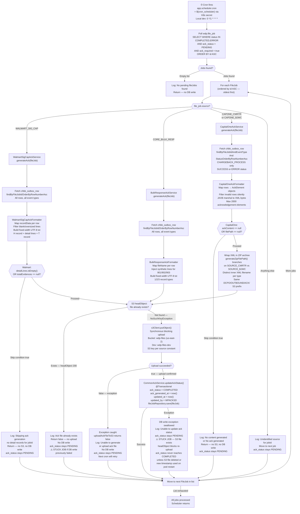

# WDP-COMP-13-FILE-ACK-PROCESSOR
**Worldpay Dispute Platform — Component Reference**
*Version: 1.0 DRAFT | April 2026*
*Extracted from: wdp-evidence-ack-scheduler using GitHub Copilot CLI | Architect-confirmed: PENDING*

---

## ━━━ CORE SKELETON ━━━━━━━━━━━━━━━━━━━━━━━━━━━━━━━━━━━━━━
*Mandatory for every component regardless of type.*

---

## Identity

| Field             | Value                                                                    |
|-------------------|--------------------------------------------------------------------------|
| **Name**          | `FileAcknowledgementProcessor`                                           |
| **Type**          | `Batch/Scheduler`                                                        |
| **Repository**    | `wdp-evidence-ack-scheduler`                                             |
| **Artifact**      | `com.wp.wdp.evidence.ack.scheduler:wdp-evidence-ack-scheduler:1.0.3`   |
| **Stack**         | Spring Boot 3.5.11 · Java 17 · Spring Data JPA · AWS SDK v2 (via Spring Cloud AWS 3.1.0) · JAXB 4.0.6 |
| **Database**      | Aurora PostgreSQL — `wdp` schema                                         |
| **Status**        | `✅ Production`                                                          |
| **Doc status**    | `📝 DRAFT`                                                               |
| **Sections present** | `Core \| Block D — Batch/Scheduler`                                  |

---

## Purpose

**What it does**

FileAcknowledgementProcessor is a continuously-running Kubernetes Deployment that polls the shared WDP Aurora PostgreSQL database on a scheduled cron cadence and generates outbound acknowledgement files for inbound file jobs that have completed processing and require confirmation.

On each cron fire, the component queries `wdp.file_job` for all rows where `status IN (COMPLETED, ERROR)`, `ack_required = true`, and `ack_status = PENDING`. For each eligible job it fetches per-row processing detail from `wdp.chbk_outbox_row`, formats an ACK file in one of four merchant-specific layouts, uploads the result to AWS S3, and — only if the S3 upload succeeds — marks the job `ack_status = COMPLETED` in the database.

The component handles four distinct merchant ACK file types: Walmart Signature Capture (fixed-width text), Meijer / Core Bulk Response (fixed-width text), CapitalOne CMRTR Commercial Card (JAXB-serialised XML-in-ZIP), and CapitalOne BJWC Bank Card (JAXB-serialised XML-in-ZIP). Each type has its own formatter, service implementation, and S3 key pattern. Source routing is determined entirely by the `source` field on `file_job`, matched against four constants defined in `ApplicationConstants`.

S3 is the sole delivery target. Downstream file transfer to external partners is handled by ControlM → Sterling Mailbox → DM Mainframe, which this component has no awareness of.

**What it does NOT do**

- Does not receive or parse inbound files — that is COMP-11 FileProcessor
- Does not deliver ACK files via SFTP, MQ, or API — S3 is the only output
- Does not process jobs where `ack_required = false` — these are silently skipped by the poll query
- Does not expose any HTTP endpoint — no `spring-boot-starter-web` dependency
- Does not produce to or consume from Kafka
- Does not write to `wdp.chbk_outbox_row` — read-only access
- Does not call FileProcessor — coupling is via the shared database schema only
- Does not set `ack_status = ERROR` — the only terminal write is `COMPLETED`; all failure paths leave `ack_status = PENDING`
- Does not use Spring Batch — all iteration is custom `@Scheduled` logic
- Does not use Resilience4j — no circuit breaker, retry, or bulkhead on any outbound call

---

## Internal Processing Flow

**S3 key patterns by source:**

| Source constant | S3 prefix | Key pattern |
|---|---|---|
| `WALMART_SIG_CAP` | `DWSG/OUTBOUND/ACK/` | `DWSG/OUTBOUND/ACK/AUF2_DWSG_ROBCDWL1_WMSIG_CONF_<yyyyMMddHHmmss>.txt` |
| `CORE_BULK_RESP` | `DBLK/OUTBOUND/ACK/` | `DBLK/OUTBOUND/ACK/DBLK_MEJR_CHRGRESP_CONF_<yyyyMMddHHmmSS>.txt` |
| `CAPONE_CMRTR` | `DCPO/OUTBOUND/ACK/` | `DCPO/OUTBOUND/ACK/DCPO_RODMRDOA.WP01.ACK.<yyyyMMddHHmm>.zip` (inner XML: `WP.CL.CMRTRTROUBLE.ACK.PROD.<ts>.xml`) |
| `CAPONE_BJWC` | `DCPO/OUTBOUND/ACK/` | `DCPO/OUTBOUND/ACK/DCPO_RODMRDOA.WP01.ACK.<ts>.zip` (inner XML: `WP.BJW.CL.TRANTROUBLE.ACK.PROD.<ts>.xml`) |

> ⚠️ **Source constant vs S3 prefix clarification:** `WALMART_SIG_CAP`, `CORE_BULK_RESP`, `CAPONE_CMRTR`, and `CAPONE_BJWC` are the values stored in `file_job.source` and matched at runtime. `DWSG`, `DBLK`, and `DCPO` are S3 path prefixes only — they do not appear as source constants. Earlier project documentation (WDP-COMPONENTS.md, WDP-COMP-INDEX.md) incorrectly listed DWSG/DBLK as source constants. This has been corrected here from Copilot source analysis.

---

## Boundaries

### Inbound Interfaces

| Source | Protocol | Endpoint / Topic / Trigger | Payload / Description |
|--------|----------|-----------------------------|----------------------|
| Kubernetes cron scheduler | `Schedule` | `app.scheduler.cron` = `${cron_scheduler}` (injected from K8s secret `wdp-evidence-ack-scheduler-secrets` or `wdp-common-secrets`). Local dev hardcoded: `0 */1 * * * *` | No payload — scheduler fires internally |
| `wdp.file_job` | `DB poll` | JPQL: `SELECT f FROM FileJob f WHERE f.status IN :status AND f.ackStatus = :ackStatus AND f.ackRequired = true ORDER BY f.id ASC` | Eligible jobs: `status IN (COMPLETED, ERROR)`, `ack_required = true`, `ack_status = PENDING`. No date range or page limit — all qualifying rows fetched per cron fire |
| `wdp.chbk_outbox_row` | `DB read` | Per-job reads via `ChkbOutboxRowRepository` | Per-row processing detail. JSONB `record_detail` field. Read-only — no writes |

### Outbound Interfaces

| Target | Protocol | Endpoint / Topic / Resource | Purpose | On failure |
|--------|-----------|-----------------------------|---------|------------|
| AWS S3 (`wdp-files`) | `S3` | Bucket: `wdp-files` (us-east-2). Dev: `wdp-files-dev`. Key per source — see S3 key table above | Upload formatted ACK file | Exception caught — `uploadAckFileToS3` returns `false`. No retry. No DB write. `ack_status` stays `PENDING`. Next cron re-attempts |
| `wdp.file_job` | `PostgreSQL write` | `wdp.file_job` via `fileJobRepository.save()` within `@Transactional` `updateAckStatus()` | Write `ack_status = COMPLETED`, `ack_generated_at`, `updated_at`, `updated_by = WPACKSD` after successful S3 upload | Exception swallowed — logs "Unable to update ack status or timestamp". `ack_status` stays `PENDING`. ⚠️ Creates stuck-job scenario — see Risk Register |

---

## Database Ownership

### Tables Owned (written by this component)

| Schema.Table | Purpose | Key columns written | Retention / Notes |
|--------------|---------|---------------------|-------------------|
| `wdp.file_job` | Writes ACK lifecycle fields only. COMP-11 FileProcessor owns all other columns. Field-level separation — no conflict. | `ack_status`, `ack_generated_at`, `updated_at`, `updated_by` | Written only when S3 upload returns `true`. Write is `@Transactional`. |

### Tables Read (not owned by this component)

| Schema.Table | Owned by | Why accessed |
|--------------|----------|--------------|
| `wdp.file_job` | COMP-11 FileProcessor | Poll for eligible ACK jobs per cron fire |
| `wdp.chbk_outbox_row` | COMP-12 InboundDisputeEventScheduler (publisher) | Fetch per-row processing detail for ACK file generation. No writes. |

---

## Risks and Constraints

### Risk Register

| Risk | Severity | Detail |
|------|----------|--------|
| **No concurrency guard — duplicate ACK file generation** | 🔴 HIGH | If deployed with replica count > 1, two pods independently poll the same PENDING jobs simultaneously. No `SELECT FOR UPDATE`, no ShedLock, no `@Version` optimistic locking, no advisory lock, no distributed lock (Redis/Zookeeper). Partial S3 mitigant: if Pod A uploads first, Pod B's `headObject` returns 200 and upload is skipped. However, if both pods race through the `headObject` check before either uploads, both can call `putObject` with different timestamps (via `UniqueTimestampGenerator`), producing **two distinct ACK files** for the same job. The DB write is idempotent (last write wins = COMPLETED), but the duplicate file is already in S3. |
| **Stuck-job scenario — S3-uploaded-but-DB-write-failed** | 🔴 HIGH | If S3 upload succeeds but the subsequent `@Transactional` `updateAckStatus()` call fails and its exception is swallowed, `ack_status` remains `PENDING`. On the next cron fire, the same job is re-selected, but the `headObject` check finds the existing S3 file and `uploadAckFileToS3` returns `false`. `updateAckStatus()` is never called. The job is permanently stuck in `PENDING` unless the S3 file is manually deleted or a pod restart generates a new timestamp key. There is no automated recovery path. |
| **ack_status = PENDING permanently for unrecognised source constants** | 🟡 MEDIUM | If a new source type is added to `file_job` but not to `ApplicationConstants`, the job is logged as "Unidentified source" and skipped on every cron fire. `ack_status` never changes. There is no alert or error state written. |
| **Walmart recordData opacity — unconfirmed PAN exposure** | 🟡 MEDIUM | The `recordData` field passed through to the Walmart ACK file is an opaque string from `chbk_outbox_row.record_detail.walmartSigCap.recordData`. This component does not inspect or strip the string. Whether upstream systems populate this field with masked or unmasked PAN is not determinable from this codebase. PAN content in the ACK file cannot be confirmed or excluded without upstream data analysis. |
| **CapitalOne claim-response / outcome-no-chargeback handling gap** | 🟡 MEDIUM | The XSD `worldpay-cbpackage.xsd` defines four `MessageType` enum values: `claim-request`, `claim-response`, `outcome-chargeback`, `outcome-no-chargeback`. The formatter only implements `claim-request` and `outcome-chargeback` correctly. `claim-response` and `outcome-no-chargeback` fall through to a catch-all `else` branch that sets `status = REJECTED` and `validReject = false`. This is likely incomplete implementation, not intentional business logic. |
| **No Resilience4j on S3 or DB calls** | 🟡 MEDIUM | Transient AWS S3 failures and Aurora connection failures have no circuit breaker, no retry, and no backoff. Both are caught as exceptions and result in `ack_status` staying `PENDING`. The next cron fire provides natural retry, but with no delay control or failure rate visibility. |
| **No Spring Actuator health endpoint** | 🟢 LOW | `spring-boot-starter-actuator` is not in `pom.xml`. The container exposes port 8082 in the K8s manifest but no HTTP server is started (no web starter). Port 8082 is a manifest artifact without backing functionality. Kubernetes liveness/readiness probes cannot use an HTTP check. |
| **No page limit on file_job poll query** | 🟢 LOW | All eligible PENDING jobs are fetched in a single JPQL query with no `LIMIT`, no `Pageable`. Under normal operation this is fine, but if a backlog of unprocessed jobs accumulates (e.g. after an outage), the in-memory list could be large and processing could run beyond the next cron interval. |

---

## Key Architectural Decisions

- **DB poll as trigger, not event-driven** — No Kafka consumer, no SQS, no S3 event. The component polls `wdp.file_job` directly. Decouples ACK generation from inbound file processing (COMP-11) — they share only the database schema, not any messaging contract.

- **S3 idempotency check before upload** — `headObject` is called before `putObject`. If the object already exists, upload is skipped. This prevents duplicate file delivery to downstream transfer agents. However, this same mechanism causes the stuck-job scenario described in the Risk Register.

- **Field-level table sharing with COMP-11** — Both COMP-11 (FileProcessor) and this component write to `wdp.file_job`, but on non-overlapping field sets. COMP-11 owns `status`, `source`, `ack_required`, and all content fields. This component owns `ack_status`, `ack_generated_at`, `updated_at`, and `updated_by`. Shared table risk is rated LOW due to field-level separation.

- **S3 write and DB write are not atomic** — The S3 upload and the `@Transactional` `updateAckStatus()` are separate, non-compensating operations. There is no outbox, no saga, and no rollback on S3 if the DB write fails. This is a deliberate implementation choice, not a documented deviation from DEC-001. See Deviation Flags.

- **DEC-010: Immutable Versioned ACK Snapshots** — Verify whether this decision still applies. The `UniqueTimestampGenerator` in key naming implies versioning by timestamp, but the stuck-job scenario shows this is not reliable for recovery.

---

## ━━━ TYPE BLOCK D — BATCH AND SCHEDULER CONTRACTS ━━━━━━━━
*This component runs entirely on a Spring `@Scheduled` cron. No Spring Batch framework. No Kafka.*

---

## Batch and Scheduler Contracts

**Batch framework:** Spring `@Scheduled` annotation — not Spring Batch
**Deployment type:** Kubernetes Deployment (internal scheduler — not CronJob)
**Trigger mechanism:** Internal `@Scheduled` cron via `ScheduledTasks.scheduledTask()`. Main class annotated `@EnableScheduling`.
**Job uniqueness:** None. No Spring Batch job deduplication, no database lock, no ShedLock. Concurrent execution across replicas is not prevented.

---

### Job: ACK File Generation

**Purpose:** On each cron fire, process all eligible file jobs requiring acknowledgement — format and upload ACK files to S3, then mark jobs COMPLETED.

**Schedule**

| Parameter | Config key | Value / Source |
|-----------|------------|----------------|
| Cron expression | `app.scheduler.cron` | `${cron_scheduler}` — injected at runtime via K8s secret (`wdp-evidence-ack-scheduler-secrets` or `wdp-common-secrets`). Production value not in source. |
| Local dev value | `app.scheduler.cron` (application-local.yml) | `0 */1 * * * *` — every minute |
| Look-back window | — | None. No date predicate on the poll query. All PENDING jobs eligible regardless of age. |
| Timezone | — | Not specified in source. Spring default (JVM timezone). |

**Input source**

| Source | Type | Query / Filter | Pagination |
|--------|------|----------------|------------|
| `wdp.file_job` | DB poll | `status IN (COMPLETED, ERROR) AND ack_status = PENDING AND ack_required = true` | None — `List<FileJob>` returned. No `LIMIT`, no `Pageable`. All qualifying rows per cron fire. Ordered by `id ASC` (oldest first). |

**Processing steps**

| Step | Name | Description | On failure |
|------|------|-------------|------------|
| 1 | Poll eligible jobs | JPQL query to `wdp.file_job`. Returns `List<FileJob>`. | Empty list → log and return. Query exception → caught by outer `try/catch`, logged, no retry, next cron fire re-attempts. |
| 2 | Source dispatch | Switch on `file_job.source`. Routes to one of three service beans. | Unknown source → log "Unidentified source", `ack_status` stays PENDING permanently, move to next job. |
| 3 | Fetch row detail | Per-source `ChkbOutboxRowRepository` query. Walmart/DBLK: all rows. CapitalOne: CHARGEBACK_PROCESS rows in SUCCESS or ERROR only. | Empty result or exception → format-specific skip / return. `ack_status` stays PENDING. |
| 4 | Format ACK file | In-memory formatting per source type. Walmart: fixed-width txt. DBLK: fixed-width txt (Meijer error codes inject synthetic lines). CapitalOne: JAXB XML-in-ZIP, max 2000 elements. | Null content returned on skip conditions → no S3, no DB write. |
| 5 | S3 existence check | `headObject` call on computed S3 key. | Object exists → skip upload, return false, no DB write. `ack_status` stays PENDING (stuck-job risk if prior DB write failed). |
| 6 | S3 upload | `s3Client.putObject()` — synchronous blocking. Bucket `wdp-files` (us-east-2). Dev: `wdp-files-dev`. | Exception → caught, `uploadAckFileToS3` returns false. No retry. No DB write. `ack_status` stays PENDING. Next cron re-attempts. |
| 7 | Write ack_status COMPLETED | `CommonAckService.updateAckStatus()` — `@Transactional`. Only called if step 6 returns true. Writes `ack_status = COMPLETED`, `ack_generated_at`, `updated_at`, `updated_by = WPACKSD`. | Exception swallowed — logs "Unable to update ack status or timestamp". `ack_status` stays PENDING. Stuck-job scenario (see Risk Register). |

**Downstream calls per record**

Each `FileJob` triggers: (1) one `ChkbOutboxRowRepository` read (query varies by source type); (2) one `S3Client.headObject()` call; (3) conditionally, one `S3Client.putObject()` synchronous upload; (4) conditionally, one `fileJobRepository.save()` write within `@Transactional`. No REST calls to any external service.

**Outputs**

| Target | Type | What is written | On failure |
|--------|------|-----------------|------------|
| AWS S3 (`wdp-files`) | S3 write | ACK file in source-specific format at key pattern per source constant | Exception → no upload, no DB write, next cron retries |
| `wdp.file_job` | DB write (`@Transactional`) | `ack_status = COMPLETED`, `ack_generated_at = now()`, `updated_at = now()`, `updated_by = WPACKSD` | Exception swallowed, stuck-job risk |

**Failure and recovery**

Re-run safety: Partially safe. The S3 `headObject` idempotency check prevents duplicate file uploads on re-run. However, if the S3 upload succeeded and the DB write failed, re-running will find the S3 file already exists, skip the upload, and never reach `updateAckStatus()`. The job is permanently stuck at `PENDING` unless the S3 object is manually deleted. There is no automated recovery, no error state written, and no alert mechanism for stuck jobs.

Partial processing: If the scheduler processes 10 jobs and the pod crashes after job 5, jobs 1–5 that completed fully are marked COMPLETED. Jobs 1–5 that completed S3 but failed DB write are stuck (see above). Jobs 6–10 remain PENDING and will be processed on the next cron fire.

No Spring Batch checkpoint or step execution tracking — restarts begin from the next full query of eligible PENDING rows.

---

## Scaling and Deployment

| Parameter | Value |
|-----------|-------|
| Kubernetes type | `Deployment` (not CronJob) |
| Replica count | XL Deploy placeholder: `{{ replicas-wdp-evidence-ack-scheduler }}` — exact prod value resolved at deploy time |
| Memory limit | `2048Mi` |
| Memory request | `1024Mi` |
| CPU limit | Not configured |
| CPU request | Not configured |
| HPA | Absent |
| PodDisruptionBudget | Absent |
| Topology spread constraints | Not configured |
| Rolling update | `type: RollingUpdate`, `maxSurge: 1`, `maxUnavailable: 0`, `minReadySeconds: 30` (at pod spec level) |
| OTel Java agent | ✅ Present — annotation `instrumentation.opentelemetry.io/inject-java: opentelemetry-operator-system/default` on pod template |
| Logstash shipping | ✅ Present — `logstash-logback-encoder` v9.0 in `pom.xml`; `logstash.server.host.port: ${logstash_server_host_port}` in `application*.yml` |
| Spring Actuator health | ❌ Absent — `spring-boot-starter-actuator` not in `pom.xml`. Port 8082 exposed in manifest but no HTTP server started. |

---

## Deviation Flags

| Decision | Deviation | Severity | Detail |
|----------|-----------|----------|--------|
| **DEC-001 — Transactional Outbox Pattern** | ⛔ DEVIATION — not using outbox | 🔴 HIGH | This component writes `ack_status = COMPLETED` directly to `wdp.file_job` in a separate transaction from the S3 upload. There is no outbox table, no mark-before-send, and no compensating mechanism. The S3 `headObject` check partially prevents duplicate uploads but actively blocks recovery in the stuck-job failure scenario. There is no comment or annotation in source acknowledging this as a deliberate deviation. |
| **DEC-004 — PAN Encryption** | ⚠️ UNVERIFIABLE for Walmart format | 🟡 MEDIUM | The `recordData` field written to the Walmart ACK file is an opaque string passed through from `chbk_outbox_row.record_detail`. This component does not inspect, mask, or strip the string. PAN content cannot be confirmed or excluded from the ACK file without upstream data analysis. All other three formats have no card number fields — confirmed clean. |
| **DEC-005 — Kafka offset commit** | N/A | — | No Kafka involvement. Not applicable. |
| **DEC-003 — Kafka partition key** | N/A | — | No Kafka involvement. Not applicable. |
| **DEC-014 — Resilience4j** | ⛔ ABSENT | 🟡 MEDIUM | No Resilience4j dependency. No circuit breaker, retry, or bulkhead on S3 SDK calls or database operations. Confirmed by `pom.xml` inspection and full source scan. |

---

## Planned and Open Items

| Item | Status | Detail |
|------|--------|--------|
| Confirm production replica count | Open | XL Deploy placeholder — exact value requires XL Deploy / deployit inspection or team confirmation. If > 1, the HIGH duplicate ACK risk is active in production. |
| Stuck-job recovery mechanism | Architecture decision required | No automated path exists to recover a job stuck with S3-uploaded-but-DB-write-failed. Decision needed: manual ops procedure, periodic cleanup job, or architectural fix (e.g. ShedLock + atomic S3+DB via outbox). |
| Concurrency guard | Architecture decision required | If replica count > 1 in production, a concurrency guard is needed. Options: ShedLock (`@SchedulerLock`), `SELECT FOR UPDATE`, or enforce replica count = 1 and document as operational constraint. |
| CapitalOne claim-response / outcome-no-chargeback handling | Confirm with Integration Team | These two `MessageType` values fall to a catch-all REJECTED branch. Confirm whether this is intentional (these types never appear in data) or a gap to be implemented. |
| Walmart recordData PAN content | Confirm with upstream team | Determine whether `chbk_outbox_row.record_detail.walmartSigCap.recordData` can contain unmasked PAN. If yes, DEC-004 is violated by this component. |
| Unused / redundant pom.xml dependencies | Low priority | `logback-classic`/`logback-core` (transitive), `spring-cloud-aws-starter-s3` auto-config may conflict with manual `S3ClientConfig` bean. No clearly dead dependency found. |
| Spring Actuator health endpoint | Open | Port 8082 exposed in manifest but no HTTP server. K8s liveness/readiness cannot use HTTP check. Consider adding actuator or removing port from manifest. |

---

*End of WDP-COMP-13-FILE-ACK-PROCESSOR.md*
*File status: 📝 DRAFT — awaiting architect confirmation.*
*After confirmation: update WDP-COMP-INDEX.md doc status to ✅ COMPLETE.*
