# WDP-COMP-14-CASE-CREATION-CONSUMER
**Worldpay Dispute Platform — Component Reference**
*Version: 1.0 DRAFT | April 2026*
*Extracted from: gcp-case-creation-consumer (v1.3.7) using GitHub Copilot CLI | Architect-confirmed: PENDING*

---

## ━━━ CORE SKELETON ━━━━━━━━━━━━━━━━━━━━━━━━━━━━━━━━━━━━━━

---

## Identity

| Field | Value |
|---|---|
| **Name** | `CaseCreationConsumer` |
| **Type** | `Kafka Consumer` |
| **Repository** | `gcp-case-creation-consumer` |
| **Version** | 1.3.7 |
| **Status** | ✅ Production |
| **Doc status** | 📝 DRAFT |
| **Sections present** | `Core | Block B` |

---

## Purpose

**What it does**

CaseCreationConsumer is the primary dispute case creation component for all non-NAP acquiring
platforms. It consumes from the `new-case-events` Kafka topic and orchestrates a sequential chain
of downstream REST calls to enrich dispute events with merchant and transaction data, then create
or update dispute cases in WDP Core. The component handles CORE, LATAM, VAP, and PIN acquiring
platforms.

The component operates as a sequential state machine. Each processing step determines the next API
name to call. If any step fails, the chain halts and the `chbk_outbox_row` record is written to
FAILED or ERROR status. All error outcomes — transient and permanent — are recorded in
`wdp.chbk_outbox_row`. There is no separate error table and no Kafka DLQ.

PAN handling follows a two-step cycle: if the event carries an HPAN, it is decrypted transiently
to extract the `issuerBIN` (first 6 digits) and then a fresh HPAN is obtained by encrypting the
clear PAN returned from the transaction enrichment service. Clear PAN exists in memory only during
this cycle and is explicitly excluded from logging. HPAN is stored in the case record by the case
management service — never in a table owned by this component.

The component handles two logical flows determined by the `notificationType` field in the inbound
event: NEW case creation and UPDATE action insertion. The flow may be overridden at the Case Lookup
step — if notificationType is "Update" but no case is found, the flow is rerouted to NEW case
creation.

The Kafka offset is acknowledged immediately on receipt — before any downstream processing begins.
This is an at-most-once delivery pattern and a confirmed deviation from the platform DEC-005
standard.

**What it does NOT do**

- Does not process NAP acquiring platform events by design — however, no code guard prevents NAP
  events from arriving at this topic and being processed if they do. This is a confirmed gap.
- Does not publish to any Kafka topic. No outbound Kafka producer is configured in this codebase.
- Does not use a Kafka DLQ topic. All error outcomes land in `wdp.chbk_outbox_row`.
- Does not implement a transactional outbox. The `chbk_outbox_row` row pre-exists (created
  upstream by COMP-12). This component only updates the status of pre-existing rows. The outbox
  status update and the downstream REST case creation call are not atomic — they are separate JPA
  saves with no encompassing transaction.
- Does not configure REST connection or read timeouts. A plain `new RestTemplate()` with no timeout
  is created in CommonConfig. All 11+ downstream REST calls can hang indefinitely, which with a
  single consumer thread effectively halts all consumption.
- Does not apply Resilience4j circuit breakers. Spring Retry `@Retryable` is used for
  retry-with-backoff only.
- Does not store HPAN locally. HPAN is stored only by `mdvs-gcp-case-management-service`.
- Does not own the creation of `chbk_outbox_row` rows. Rows are created by upstream batch
  components and published via COMP-12 InboundDisputeEventScheduler. This component updates
  those rows.
- Does not perform NAP platform authorization — that is COMP-02 UAMS.

---

## Internal Processing Flow

```mermaid
flowchart TD
    IN["Kafka message received\nnew-case-events / AWS MSK\nSASL_SSL / IAM\nNotificationEvent payload"]

    ACK["⚠️ DEC-005 DEVIATION\nMANUAL_IMMEDIATE offset commit\nOffset ACK'd BEFORE any downstream\nprocessing or DB write"]

    CORR["Assign correlationId / idempotencyId\nif absent from event or Kafka header\nidempotencyId delegated downstream\nas HTTP header on every REST call"]

    PRIOR["Prior chargeback check\nwdp.chbk_outbox_row (DB read)\nnetworkCaseId + cardNetwork\nwhere id < current_id\nstatus NOT IN SUCCESS/SKIPPED"]

    P1{{"Prior rows found?"}}

    ERR_PRIOR["Set status = ERROR\nHalt ⛔"]
    DEFER["Set status = PENDING_DEFERRED\nHalt — prior event still in-flight ⛔"]

    HIST{{"historicalDeptDetail\n!= null?"}}

    VALIDATE["Validate notification\nnetworkRuling value check\nnote type allowlist check\nCapone platform and stage rules\nskipStageList check"]

    VOUT{{"Validation outcome?"}}
    ERR_VAL["Set status = ERROR\nHalt ⛔"]
    SKIP_VAL["Set status = SKIPPED\nHalt ⛔"]

    IDP["Fetch IDP Bearer token\nwdp-idp-token-service (GET)\n/merchant/gcp/idp-token/token\nNo @Retryable — 1 attempt only"]

    CASE_LOOKUP["Case Lookup\nmdvs-gcp-case-search-service (GET)\n/{platform}/case/lookup\n3 retries, 2s backoff"]

    NT{{"notificationType\n(may override to New\nif case not found)?"}}

    FAILED["Set status = FAILED\nwdp.chbk_outbox_row\nretryCount++\n⚠️ retryCount > 2 → auto-promote to ERROR"]

    subgraph NEW ["NEW CASE PATH"]
        EF{{"enrichmentFailure\n= true?"}}

        PAN_DEC["PAN Decrypt\nwdp-encryption-service (POST)\n/v1/pan/decrypt\ndPan in memory only\nexcluded from all logging\n1 attempt"]

        FRAUD["Fraud Switch Lookup\n${fraud_transaction_url} (GET)\n3 retries\n@Recover → null\nNo FAILED write at this step"]

        TXN["Transaction Lookup\ngcp-merchant-transaction-service (POST)\n/{platform}/transaction/search\n1 attempt\n@Recover → null\nNo FAILED write at this step"]

        PAN_ENC["PAN Encrypt\nwdp-encryption-service (POST)\n/v1/pan/encrypt\nePan (HPAN) stored on event\n1 attempt"]

        PROD_ENT["Product Entitlement\ncore-hierarchy-authorization-service (GET)\n/productentitlement\n3 retries\nnull @Recover → FAILED"]

        WF_CAT{{"schemeRef.category\n= COMP or PRECOMP?"}}
        WF_HARD["workflowName = VISA_COMPLIANCE\nhardcoded — rules service bypassed"]
        WF_SVC["Workflow Rule Lookup\nmdvs-gcp-rules-service (POST)\n/rules/workflow\n3 retries\nnull @Recover → FAILED"]

        FIRST_ACT["First Action Rule Lookup\nmdvs-gcp-rules-service (POST)\n/rules/firstaction\n3 retries\n@Recover → FAILED"]

        DISP["Display Code Lookup\nmdvs-gcp-display-code-service (POST)\n/display-code/search\nCurrency ISO conversion\nReason category derivation\n1 attempt — null @Recover → FAILED"]

        CREATE["Create Case\nmdvs-gcp-case-management-service (POST)\n/{platform}/case\n3 retries\n@Recover → FAILED"]

        ATTACH["Update EVIDENCE_ATTACH rows\nwdp.chbk_outbox_row (DB write)\nstatus = PENDING"]
    end

    subgraph UPDATE ["UPDATE PATH (case already exists)"]
        PRE["Pre-Action Status Lookup\nmdvs-gcp-rules-service (POST)\n/rules/pre-action\n1 attempt"]
        DUSER["Display UserId Lookup\nAID user-detail service (GET)\nhttps://ws-int.infoftps.com/...\n3 retries"]
        NEW_ACT["New Action Rule Lookup\nmdvs-gcp-rules-service (POST)\n/rules/newactions\n3 retries"]
        PROD_U["Product Entitlement\ncore-hierarchy-authorization-service (GET)\n/productentitlement\n3 retries"]
        INS_ACT["Insert Action\nmdvs-gcp-case-actions-service (POST)\n/{platform}/case/lookup\n3 retries\n@Recover → FAILED"]
        UPD_ACT["Update Action\nmdvs-gcp-case-actions-service (POST)\n/{platform}/case/{caseNumber}/actions\n1 attempt\nnull response → FAILED"]
        INS_NOTES["Insert Notes\nmdvs-gcp-notes-service (PUT/POST)\n/{platform}/case/{caseNumber}\n1 attempt\nSoft failure — exception logged only\nDoes NOT write FAILED"]
        MOD_EV["Modify Evidence Event Status\nwdp.chbk_outbox_row (DB write)\n1 attempt\nSoft failure — exception logged only"]
    end

    SUCCESS["Set outbox row status = SUCCESS\nwdp.chbk_outbox_row\nSet via ChkbOutbox object\nin case management service response"]

    IN --> ACK --> CORR --> PRIOR --> P1
    P1 -->|"Prior row in ERROR"| ERR_PRIOR
    P1 -->|"Prior row in-flight\nnon-SUCCESS/SKIPPED"| DEFER
    P1 -->|"No blocking prior rows"| HIST

    HIST -->|"Yes — historical\nskip validate step"| IDP
    HIST -->|"No — live event"| VALIDATE
    VALIDATE --> VOUT
    VOUT -->|"networkRuling invalid\nnote type invalid\nCapone invalid platform"| ERR_VAL
    VOUT -->|"Capone invalid stage\ndisputeStage in skipStageList"| SKIP_VAL
    VOUT -->|"Pass"| IDP

    IDP -->|"Throws exception\n→ errorHandler → FAILED"| FAILED
    IDP --> CASE_LOOKUP
    CASE_LOOKUP -->|"All retries exhausted\n→ errorHandler → chain halts"| FAILED
    CASE_LOOKUP --> NT

    NT -->|"New (or Update overridden\nbecause case not found)"| EF
    NT -->|"Update (case exists)"| PRE

    EF -->|"false — HPAN on event\nstandard enrichment path"| PAN_DEC
    EF -->|"true — no HPAN\nenrichment failed upstream"| TXN

    PAN_DEC -->|"Fails → FAILED"| FAILED
    PAN_DEC --> FRAUD --> PROD_ENT

    TXN --> PAN_ENC
    PAN_ENC -->|"Fails → FAILED"| FAILED
    PAN_ENC --> PROD_ENT

    PROD_ENT -->|"Fails → null → FAILED"| FAILED
    PROD_ENT --> WF_CAT
    WF_CAT -->|"Yes"| WF_HARD
    WF_CAT -->|"No"| WF_SVC
    WF_HARD --> FIRST_ACT
    WF_SVC -->|"Fails → null → FAILED"| FAILED
    WF_SVC --> FIRST_ACT
    FIRST_ACT -->|"Fails → FAILED"| FAILED
    FIRST_ACT --> DISP
    DISP -->|"Fails → null → FAILED"| FAILED
    DISP --> CREATE
    CREATE -->|"Fails → FAILED"| FAILED
    CREATE --> ATTACH --> SUCCESS

    PRE --> DUSER --> NEW_ACT --> PROD_U
    PROD_U -->|"Fails → FAILED"| FAILED
    PROD_U --> INS_ACT
    INS_ACT -->|"Fails → FAILED"| FAILED
    INS_ACT --> UPD_ACT
    UPD_ACT -->|"null response → FAILED"| FAILED
    UPD_ACT --> INS_NOTES --> MOD_EV --> SUCCESS
```

---

## Boundaries

### Inbound Interfaces

| Source | Protocol | Topic / Trigger | Payload |
|---|---|---|---|
| COMP-12 InboundDisputeEventScheduler | Kafka / AWS MSK | `new-case-events` | `NotificationEvent` — dispute event for CORE, LATAM, VAP, PIN platforms |

### Outbound Interfaces

| Target | Protocol | Endpoint | Purpose | On failure |
|---|---|---|---|---|
| `wdp-idp-token-service` | REST GET | `/merchant/gcp/idp-token/token` | Bearer token for all downstream calls | Propagates to errorHandler → FAILED |
| `wdp-encryption-service` | REST POST | `/v1/pan/decrypt` | Decrypt HPAN to clear PAN (in memory only) | 1 attempt → @Recover → FAILED |
| `wdp-encryption-service` | REST POST | `/v1/pan/encrypt` | Re-encrypt clear PAN from transaction lookup to HPAN | 1 attempt → @Recover → FAILED |
| `gcp-merchant-transaction-service` | REST POST | `/{platform}/transaction/search` | Enrich event with transaction data and clear PAN | 1 attempt → @Recover → null (no error write) |
| `mdvs-gcp-case-search-service` | REST GET | `/{platform}/case/lookup` | Check if case already exists | 3 retries → @Recover → FAILED, chain halts |
| `mdvs-gcp-case-management-service` | REST POST | `/{platform}/case` | Create new dispute case | 3 retries → @Recover → FAILED |
| `mdvs-gcp-rules-service` | REST POST | `/rules/workflow` | Determine workflow name for new case | 3 retries → null → FAILED |
| `mdvs-gcp-rules-service` | REST POST | `/rules/firstaction` | Determine first action rule for new case | 3 retries → FAILED |
| `mdvs-gcp-rules-service` | REST POST | `/rules/pre-action` | Pre-action status for UPDATE path | 1 attempt |
| `mdvs-gcp-rules-service` | REST POST | `/rules/newactions` | New action rule for UPDATE path | 3 retries |
| `mdvs-gcp-display-code-service` | REST POST | `/display-code/search` | Convert numeric currency ISO to alpha; derive reason category | 1 attempt → null → FAILED |
| `mdvs-gcp-case-actions-service` | REST POST | `/{platform}/case/lookup` | Insert action on UPDATE path | 3 retries → @Recover → FAILED |
| `mdvs-gcp-case-actions-service` | REST POST | `/{platform}/case/{caseNumber}/actions` | Update action on UPDATE path | 1 attempt → null → FAILED |
| `mdvs-gcp-notes-service` | REST PUT/POST | `/{platform}/case/{caseNumber}` | Insert case notes | 1 attempt → soft failure, logged only |
| `core-hierarchy-authorization-service` | REST GET | `/productentitlement` | Product entitlement — fraud indemnity, productType, teamId | 3 retries → null → FAILED |
| AID user-detail service (external) | HTTPS REST GET | `https://ws-int.infoftps.com/IDPUserFirmMapping/search/{userId}` | Display UserId lookup for historical and UPDATE path | 3 retries |
| Fraud Switch (external) | REST GET | `${fraud_transaction_url}` (env var) | Fraud/indemnity fields | 3 retries → null returned, no FAILED write |
| `dataservice` (historical, conditional) | REST GET | `${ds_search_case_number_url}` (env var) | Historical case lookup when dsCaseLookup = true | 1 attempt |
| `wdp.chbk_outbox_row` | PostgreSQL (JPA) | `wdp` schema | Outbox/error table — read for prior check, write for all status transitions | Individual JPA saves — no transaction wrapping |
| `wdp.case` | PostgreSQL (JPA) | `wdp` schema | Duplicate case check for Capone REQ events — read only | — |

⚠️ **No timeouts configured on any REST call.** A plain `new RestTemplate()` with no connection
or read timeout is used for all outbound HTTP calls. With a single consumer thread, any hanging
call halts the entire consumer.

All internal service URLs follow the pattern:
`http://{service-name}.wdp-micro:8082/merchant/gcp/{service-path}`
All calls use Bearer IDP token authentication.

---

## Database Ownership

### Tables Owned (written by this component)

| Schema.Table | Purpose | Key columns | Notes |
|---|---|---|---|
| `wdp.chbk_outbox_row` | Outbox and error state for all inbound dispute events | `id` (PK), `c_ntwk_case_id`, `c_case_ntwk`, `c_acq_platform`, `status`, `retry_count`, `error_message`, `updated_at`, `next_retry_at`, `i_case` (caseNumber) | ⚠️ Shared write table — rows created by COMP-07/08/09/11 and published by COMP-12. This component only updates status of pre-existing rows. Status lifecycle: FAILED → ERROR (retryCount > 2), PENDING_DEFERRED, SKIPPED, SUCCESS, PENDING (EVIDENCE_ATTACH rows). |

### Tables Read (not owned by this component)

| Schema.Table | Owned by | Why accessed |
|---|---|---|
| `wdp.case` | `mdvs-gcp-case-management-service` | Capone REQ stage duplicate check — queries by merchantId, transactionDate, accountNumberLast4, transactionAmount, disputeAmount. Read only. |

---

## Reliability and Recovery Scenarios

### Duplicate Case Detection

This component applies three layers of duplicate detection. They are independent — no single
mechanism covers all scenarios.

**Layer 1 — Prior chargeback outbox check (within COMP-14)**

Before any enrichment begins, the component reads `wdp.chbk_outbox_row` for any existing rows
with the same `networkCaseId + cardNetwork` where `id < current_id` and `eventType =
CHARGEBACKS_PROCESS` and `status NOT IN (SUCCESS, SKIPPED)`.

| Outcome | Action |
|---|---|
| Prior row in ERROR status | Current row set to ERROR. Processing halts. No case creation attempted. |
| Prior row in any other non-terminal status (in-flight) | Current row set to PENDING_DEFERRED. Processing halts. Reprocessed by COMP-12 scheduler based on `next_retry_at`. |
| No blocking prior rows | Processing continues normally. |

This check prevents a later event from racing ahead of an earlier event for the same dispute.

**Layer 2 — idempotency-key HTTP header delegation**

The `idempotency-key` Kafka message header is extracted and stored as `idempotencyId` on the
`NotificationEvent`. It is passed as the HTTP header `idempotency-key` on every outbound REST
call. Deduplication at the downstream service level depends entirely on those services implementing
idempotent endpoints — no local deduplication table exists in this component.

**Layer 3 — Capone REQ explicit case existence check**

For Capone REQ stage events only, the component queries `wdp.case` directly by
`merchantId + transactionDate + accountNumberLast4 + transactionAmount + disputeAmount` before
case creation. If a match is found, the outbox row is set to ERROR and processing halts.

**Known gaps in duplicate protection**

| Gap | Scenario | Consequence |
|---|---|---|
| Pre-ACK crash window | JVM crashes after `acknowledgment.acknowledge()` but before the `chbk_outbox_row` status write | Event permanently lost — no row in outbox, no redelivery. No duplicate but silent data loss. |
| Non-atomic outbox and case creation | Outbox row written to SUCCESS but case creation REST call fails | Outbox shows SUCCESS, no case in WDP Core. Inconsistent state, no auto-reconciliation. |
| Non-atomic outbox and case creation (inverse) | Case created in WDP Core but pod crashes before outbox status update | Case exists in WDP Core, outbox row stays in prior status. If redelivered (only possible if crash was pre-ACK), a duplicate case creation attempt is made. |
| idempotency-key delegation gap | Downstream services do not implement idempotent endpoints | No local guard — duplicates can slip through at the case creation layer. |
| No local deduplication table | No table owned by COMP-14 tracks processed eventIds | Crash-and-redeliver scenarios (pre-ACK only) have no deduplication backstop in this component. |

---

### PENDING_DEFERRED — Hold and Recovery

A dispute event is placed in PENDING_DEFERRED when a prior event for the same dispute
(`networkCaseId + cardNetwork`) is still in-flight — i.e. not yet in SUCCESS or SKIPPED status.

**What COMP-14 does:**
- Writes `status = PENDING_DEFERRED` and sets `next_retry_at` on the `chbk_outbox_row` record
- Halts all further processing for the current event
- Does NOT attempt any enrichment or case creation

**What reprocesses PENDING_DEFERRED rows:**
- COMP-12 InboundDisputeEventScheduler — polls `chbk_outbox_row` for rows where
  `status = PENDING_DEFERRED` and `next_retry_at <= now()`
- When the retry window elapses, COMP-12 republishes the event to `new-case-events`
- COMP-14 then re-evaluates the prior chargeback check on re-receipt
- If the prior event has since resolved (status = SUCCESS or SKIPPED), processing proceeds
- If the prior event is still in-flight, the current event is deferred again with a new
  `next_retry_at`

**Ownership boundary:** COMP-14 owns writing PENDING_DEFERRED. COMP-12 owns the retry
scheduling and republication. Neither component owns the resolution of the prior event — that
depends on independent processing of the earlier event completing successfully.

**Risk:** If the prior event is permanently stuck in ERROR, PENDING_DEFERRED rows for the
same dispute will be retried by COMP-12 indefinitely. Each retry will find the prior row still
in ERROR and write PENDING_DEFERRED again — or may now set ERROR depending on error detection
logic. The maximum deferral depth and any circuit-break on repeated deferral is not confirmed.

---

### Crash Recovery — Scenarios by Crash Window

There is no checkpoint or resume mechanism in COMP-14. Recovery behaviour depends entirely on
when the crash occurs relative to the offset commit.

| Crash window | Kafka offset state | chbk_outbox_row state | Case in WDP Core | Recovery path |
|---|---|---|---|---|
| **Window 1:** After message received, before `acknowledgment.acknowledge()` | Not committed | Unchanged (COMP-12 set it before publish) | Does not exist | Kafka redelivers on consumer restart. Processing retries from scratch. This is the only window where redelivery occurs. |
| **Window 2:** After `acknowledgment.acknowledge()`, before `chbk_outbox_row` status write | Committed ⚠️ | Unchanged — row stays in original status | Does not exist | No redelivery. Event permanently lost. No error record created. Silent data loss. |
| **Window 3:** After `chbk_outbox_row` written to FAILED/ERROR, before case creation REST call | Committed | FAILED or ERROR | Does not exist | No redelivery. Row is in error state — visible to operations. Manual reprocessing required if applicable. |
| **Window 4:** After case creation REST call succeeds, before `chbk_outbox_row` SUCCESS write | Committed | Unchanged (prior to SUCCESS) | ✅ Created | No redelivery. Case exists in WDP Core. Outbox row not updated to SUCCESS — inconsistent state. No auto-reconciliation. Operations must manually align. |
| **Window 5:** After `chbk_outbox_row` SUCCESS write completes | Committed | SUCCESS ✅ | ✅ Created | Fully consistent. No action needed. |

**Key conclusions:**
- Only Window 1 produces automatic recovery via Kafka redelivery.
- Windows 2–4 require either manual intervention or are silently lost.
- Window 2 (the most dangerous) is a direct consequence of the DEC-005 pre-ACK deviation.
- Window 4 leaves the platform in an inconsistent state that is not self-healing.

---

### Partial Failure — Mid-Chain Crash on NEW Case Path

The NEW case path makes 11+ sequential REST calls. A failure at any point beyond IDP token
fetch halts the chain and writes FAILED to the outbox. The `retryCount` is incremented on each
FAILED write. When `retryCount > 2`, the row is automatically promoted to ERROR.

**There is no step-level checkpoint.** On FAILED status, COMP-12 republishes the full event
and COMP-14 reprocesses from the beginning of the chain — including re-fetching IDP token,
re-running PAN decrypt, re-running all enrichment calls, and re-attempting case creation.

**Re-entrant case creation risk:** If the case creation REST call (`/{platform}/case`) succeeded
before the crash but the subsequent `chbk_outbox_row` SUCCESS write failed, the event will be
retried from the start. On retry, Case Lookup will find the existing case and route to the UPDATE
path instead of creating a duplicate. This is the one scenario where the Case Lookup acts as an
implicit deduplication guard on retry.

---

## Key Architectural Decisions

| ID | Decision / Finding | Severity | Notes |
|---|---|---|---|
| DEC-005 DEVIATION | Kafka offset committed via `acknowledgment.acknowledge()` at the very start of processing — **before** any DB write or REST call. If the JVM crashes after ACK but before the `chbk_outbox_row` write, the event is permanently lost without any error record. | 🔴 HIGH | Matches the deliberate pattern in COMP-05 NAPDisputeEventProcessor. `MANUAL_IMMEDIATE` explicitly configured. Known event loss window exists on every pod restart during processing. |
| DEC-001 DEVIATION | No transactional outbox pattern. The `chbk_outbox_row` update and the downstream REST call to `mdvs-gcp-case-management-service` are separate, non-atomic JPA saves using `wdpTransactionManager`. The `ChkbOutbox` object in the case management request body partially delegates outbox closure to the downstream service — an inverted data integrity dependency. | 🔴 HIGH | A crash between the outbox write and the case creation REST response leaves the outbox in an inconsistent state. |
| DEC-003 UNCONFIRMED | The partition key on `new-case-events` is logged on receipt as `keyNetworkCaseCardNetworkId` but not used for routing within this consumer. What the upstream publisher sets as the key cannot be determined from this codebase alone. | 🟡 MEDIUM | Must confirm against COMP-12 publisher. No formal deviation note in the code. |
| DEC-004 COMPLIANT | Clear PAN (`dPan`) is never written to any persistent store, S3 bucket, or log line. Excluded from `toString()` via `@ToString(exclude = "dPan")`. `wdp-encryption-service` is used for both EPAN-to-clear and clear-to-HPAN conversion — the same service as COMP-11 FileProcessor. HPAN stored only in the case management service's data store. | ✅ — | Confirmed from source. |
| DEC-014 DEVIATION | No Resilience4j circuit breakers anywhere in this codebase. `pom.xml` contains no Resilience4j dependency. Spring Retry `@Retryable` provides retry-with-backoff only — no fast-fail after threshold, no half-open probe. | 🟡 MEDIUM | Consistent with platform-wide pattern confirmed in COMP-04 and COMP-05. |
| RISK — No REST timeouts | No connection or read timeout is set on the `RestTemplate` bean (`new RestTemplate()` in `CommonConfig`). Default Java `HttpURLConnection` timeouts apply — effectively infinite. With a single consumer thread (concurrency=1), any hanging downstream call halts the entire consumer. 11+ sequential REST calls are made per event on the NEW case path. | 🔴 HIGH | Not covered by any existing DEC. Candidate for new ADR. |
| RISK — Silent deserialiser swallow | `ErrorHandlingDeserializer` wraps `JsonDeserializer<NotificationEvent>`. The `CommonErrorHandler` is a no-op empty implementation — deserialization failures are silently swallowed. Because the offset is pre-ACK'd, a malformed message is permanently lost with no record in `chbk_outbox_row`. | 🔴 HIGH | Two compounding risks: pre-ACK + silent deserialiser = undetectable message loss. |
| RISK — No NAP guard | NAP is not the intended scope, but no code guard prevents a NAP event from entering and being processed by this component if it arrives at `new-case-events`. `SourceSystemName` enum includes `NAP`. | 🟡 MEDIUM | If NAP inbound migration (planned work) publishes to `new-case-events`, this component will process those events. Intentional or accidental overlap must be resolved before migration. |
| RISK — COMP/PRECOMP workflow bypass | When `schemeRef.category = COMP` or `PRECOMP`, the component hardcodes `workflowName = "VISA_COMPLIANCE"` and bypasses the rules service entirely. | 🟡 MEDIUM | Business rule embedded in code — changes require a deployment, not a rules configuration change. |
| RISK — Incomplete error handling stubs | Multiple `@Recover` methods in `EventProcessingServiceImpl` return `null` with only a `// Error handling -- todo` comment. Failures on `transactionLookup` and `productEntitlementLookup` are absorbed silently with no FAILED outbox write. Acknowledged as incomplete at time of writing. | 🟡 MEDIUM | `fraudSwitch @Recover` also returns null with no error write. Transactions can proceed without complete enrichment data. |

---

## Deployment and Scaling

| Parameter | Value | Confidence |
|---|---|---|
| Kubernetes resource type | `Deployment` | High |
| Replica count | `{{ replicas-gcp-case-creation-consumer }}` — Helm/Spinnaker placeholder; actual value not in repo | High (placeholder confirmed); Low (actual value) |
| Memory limit | `2048Mi` | High |
| Memory request | `256Mi` | High |
| CPU limit | Not specified in `resources.yaml` — Kubernetes best-effort QoS for CPU | High |
| CPU request | Not specified | High |
| HPA | Absent | High |
| Rolling update strategy | `maxSurge: 1, maxUnavailable: 0, minReadySeconds: 30` | High |
| PodDisruptionBudget | Absent | High |
| Topology spread constraints | Absent — not configured in `resources.yaml` | High |
| OpenTelemetry agent | **Not injected** — no OTel annotation or init-container in `resources.yaml` | High |
| Spring Actuator | Present — healthcheck at `/merchant/gcp/case-creation/actuator/health` | High |
| Readiness probe | HTTP GET `/actuator/health:8082`, `initialDelaySeconds: 120`, `periodSeconds: 10`, `failureThreshold: 3` | High |
| Logstash appender | Present — `LogstashTcpSocketAppender` to `${logstash_server_host_port}` (env var) | High |

⚠️ `maxSurge: 1, maxUnavailable: 0` means a two-replica overlap exists during every rolling
update. With MANUAL_IMMEDIATE pre-ACK and a single consumer thread per replica, a second replica
can pick up and ACK a message the first has already ACK'd but not yet processed, creating a
duplicate case creation risk on every deployment.

⚠️ OTel not injected — this component is not covered by distributed tracing via the OTel
operator. Logstash appender provides log shipping only.

---

## Planned and Incomplete Work

### Feature Flags

| Flag | Config key | Effect |
|---|---|---|
| `dsCaseLookup` | `app.properties.dsCaseLookup` / `${ds_case_lookup}` | `true` = call DS service for historical case lookup; `false` = skip DS lookup, set `notifyToBr = true` and proceed directly to fraud switch / workflow rule |
| `skipStageList` | `app.properties.skipStageList` / `${skip_stage_list}` | List of `disputeStage` values that cause SKIPPED status without processing on new-case events where no case exists |

### Commented-out Code

1. `USCaseEntity.java` lines 91–95: `C_ISSUER_REF_NUMBER` and `C_DEPOSIT_ID` columns commented
   out then reinstated at lines 315–319 as separate `@Column` mappings. Suggests a mid-development
   refactor — both column definitions now coexist.
2. `USCaseEntity.java` lines 120–151: Four currency columns (`C_SOURCE_CCY_EXP`, `C_SOURCE_CCY`,
   `C_DEST_CCY_EXP`, `C_DEST_CCY`) commented out. Schema columns exist but are not mapped —
   planned work deprioritised.
3. `logback-spring.xml` lines 15–16: Two hardcoded Logstash IP addresses (`10.43.145.125:5044`)
   commented out, replaced by env-var-driven destination. Suggests an environment migration.
4. `EventProcessingServiceImpl.java` (multiple `@Recover` methods): Error handling comment
   `// Error handling -- todo` appears in several recover methods. These return `null` only —
   acknowledged as incomplete at time of writing.
5. `RestInvoker.java`: Multiple `throw new Exception(...)` blocks are commented out — richer error
   propagation with HTTP status code details was planned but disabled.

### TODO / FIXME References

- `// Error handling -- todo` — multiple occurrences in `EventProcessingServiceImpl`'s
  `@Recover` methods.

### Unused / Suspect pom.xml Dependencies

- `spring-boot-starter-oauth2-client` and `spring-boot-starter-oauth2-resource-server` — present
  but auth is done via IDP token REST call, not Spring Security OAuth2 flows. Vestigial from an
  earlier architecture.
- `springdoc-openapi-starter-webmvc-ui` (Swagger) — present in a consumer application. Suggests
  a REST endpoint was added or planned. Actuator health confirmed. Whether additional REST endpoints
  exist requires investigation — if present, Block A must be added to this file.
- `modelmapper` — `@Bean` declaration in `CommonConfig` but not visibly used in processing logic.

### Stub Implementations

- All `@Recover` methods in `EventProcessingServiceImpl` that return `null` with
  `// Error handling -- todo` are effectively stubs — they suppress errors rather than handling
  them.

---

## ━━━ TYPE BLOCK B — KAFKA CONSUMER CONTRACTS ━━━━━━━━━━━━━

---

## Kafka Consumer Contracts

**Consumer framework:** Spring Kafka `@KafkaListener` / `ConcurrentKafkaListenerContainerFactory`
**Offset commit strategy:** `MANUAL_IMMEDIATE` — pre-ACK before all processing. ⚠️ Deviation from DEC-005.
**Error handling strategy:** Database outbox table (`wdp.chbk_outbox_row`). No Kafka DLQ topic.
Deserialization errors silently swallowed via no-op `CommonErrorHandler`.

---

### Topic: `new-case-events`

| Parameter | Value |
|---|---|
| **Topic name (prod)** | `new-case-events` |
| **Topic name (dev)** | `new-case-events-dev` |
| **Config key** | `spring.kafka.consumer.topic` |
| **Consumer group (prod)** | `new-case-events-group` |
| **Consumer group (dev)** | `new-case-events-group-dev` |
| **Config key** | `spring.kafka.consumer.groupId` |
| **AckMode** | `MANUAL_IMMEDIATE` — offset committed at very start of processing, before any DB write or REST call |
| **Offset commit timing** | **Pre-ACK** — `acknowledgment.acknowledge()` called at line 36 of `KafkaConsumer.java`, before `processKafkaNotificationEvent()` is invoked |
| **Concurrency** | `1` — not configured in `ConcurrentKafkaListenerContainerFactory`; defaults to single thread |
| **auto.offset.reset** | `earliest` |
| **enable.auto.commit** | `false` |
| **Max poll records** | `${max_poll_records}` (environment variable) |
| **Max poll interval** | `${max_poll_interval}` (environment variable) |
| **Session timeout** | `${session_timeout_ms}` (environment variable) |
| **Heartbeat interval** | `${heartbeat_interval_ms}` (environment variable) |
| **Key deserialiser** | `StringDeserializer` |
| **Value deserialiser** | `ErrorHandlingDeserializer` wrapping `JsonDeserializer<NotificationEvent>` |
| **Security** | `SASL_SSL`, `AWS_MSK_IAM`, `IAMLoginModule` + `IAMClientCallbackHandler` |
| **Ordering guarantee** | Per partition — partition key unconfirmed from this codebase (DEC-003 pending) |

**Message payload structure — `NotificationEvent`**

| Field | Type | Description |
|---|---|---|
| `eventType` | String | Type of event |
| `eventTimestamp` | String | When the event occurred |
| `sourceSystem` | String | **Platform identifier** — `CORE`, `LATAM`, `VAP`, `PIN`, `NAP` (NAP not intended but no guard present) |
| `eventId` | Long | PK of `chbk_outbox_row` — links event to its outbox record |
| `correlationId` | String | Tracing ID — generated UUID if absent |
| `sourceSystemCaseId` | String | Source system's case identifier |
| `disputeAmount` | BigDecimal | Dispute amount |
| `disputeCurrency` | String | Currency code (may be numeric ISO — converted to alpha by display code service) |
| `reasonCode` | String | Network reason code |
| `disputeStage` | String | Stage code: CHI, REQ, PAB, ARB, RE2, APC, others |
| `notificationType` | String | `"New"` or `"Update"` — may be overridden to New at Case Lookup step if no case found |
| `caseType` | String | e.g. `PLCC`, `BJPLCC`, `CMRCL` (Capone) |
| `networkRuling` | String | Optional: `MERCHANT_FAVOR`, `ISSUER_FAVOR`, `SPLIT_RULING` |
| `reversal` | String | `Y`/`N` — triggers Mastercard reversal edge case routing |
| `schemeRef` | Object | `cardNetwork`, `networkCaseNumber`, `networkChargebackId`, `networkPhaseId`, `queueName`, `notes[]`, `category` |
| `merchantDetail` | Object | `mid` and merchant info |
| `originalTransIdentifier` | Object | `accountNumber` (HPAN — field name is misleading), `accountNumberLast4`, `arn`, `date`, `amount`, `currency`, `networkTransactionId`, `enrichmentFailure` flag |
| `originalTransDetail` | Object | Original transaction detail fields |
| `historicalDeptDetail` | Object | Present only for historical events — triggers historical processing path, skips validation step |
| `ePan` | String | HPAN — set during processing (not on inbound message) |
| `dPan` | String | Clear PAN — in memory only during processing; excluded from all logging via `@ToString(exclude = "dPan")` |

**Platform identifier field:** `sourceSystem` (JSON field name: `sourceSystem`).
Used as the `{platform}` path variable in all downstream service URLs.

| sourceSystem value | Platform | Routing notes |
|---|---|---|
| `CORE` | CORE | Historical case lookup uses DS service; all standard enrichment paths apply |
| `LATAM` | LATAM | No special code branches; same URL template as CORE |
| `VAP` | VAP | Historical lookup same as non-CORE |
| `PIN` | PIN | Extra validation fields required: `termSequence`, `fromAcro`, `toAcro` |
| `NAP` | (unintended) | Present in `SourceSystemName` enum; no guard prevents processing if event arrives |

**notificationType routing:**
- `"New"` → `processNewNotificationEvent()` — case creation flow
- `"Update"` → `processUpdateNotificationEvent()` — action insertion flow
- Override: if `notificationType = "Update"` but Case Lookup finds no case → rerouted to NEW

**Mastercard edge cases:**
- `cardNetwork = MASTERCARD` AND `disputeStage = RE2` AND case exists → route to UPDATE_ACTION (reject MCM flow)
- `cardNetwork = MASTERCARD` AND `reversal = Y` → complex action filtering by `networkChargebackId` or `networkPhaseId`

**On processing failure**

| Failure scenario | Behaviour |
|---|---|
| Deserialization error | `ErrorHandlingDeserializer` catches; `CommonErrorHandler` is no-op — error silently swallowed; event permanently lost (offset already pre-ACK'd); no record in `chbk_outbox_row` |
| IDP token fetch fails | Exception propagates to `errorHandler()` → outbox row = FAILED; retryCount incremented |
| Case Lookup exhausts retries | `@Recover` → `errorHandler()` → FAILED; `errorOccured = true`; chain halts |
| PAN Decrypt / Encrypt fails | `@Recover` → FAILED; chain halts |
| Transaction Lookup fails | `@Recover` → returns null; logged only; no FAILED write; downstream null check may proceed |
| Fraud Switch fails | `@Recover` → returns null; no FAILED write; processing continues |
| Product Entitlement fails | `@Recover` → returns null; downstream null check → FAILED |
| Workflow / First Action Rule fails | `@Recover` → FAILED |
| Display Code fails | `@Recover` → null → FAILED |
| Create Case fails | `@Recover` → FAILED |
| Insert Action fails | `@Recover` → FAILED |
| Update Action — null response | Null check → FAILED |
| Insert Notes exception | Logged only — does NOT write FAILED (soft failure) |
| Modify Evidence Event Status exception | Logged only — does NOT write FAILED (soft failure) |
| retryCount > 2 on FAILED write | Status automatically promoted to ERROR — no further retry |
| Prior row in ERROR found | Current row set to ERROR; halt — no processing |
| Prior row in-flight found | Current row set to PENDING_DEFERRED; halt |

---

## Remaining Gaps

| Gap | Detail | Action needed |
|---|---|---|
| DEC-003 — Partition key | Cannot confirm from consumer source whether `new-case-events` partition key is `merchantId`. Key logged on receipt but origin unknown. | **Follow-up Copilot question** in COMP-12 repo: *"What field is used as the Kafka message key when publishing to the `new-case-events` topic in InboundDisputeEventScheduler? Show the exact field and the KafkaTemplate send call."* |
| Insert Action URL / retry discrepancy | `mdvs-gcp-case-actions-service (insert)` shows URL `/{platform}/case/lookup` (POST) with 3 retries, but retry config lists `insertAction` as 1 attempt. These may be two separate calls — Case Action Search then Insert. | **Follow-up Copilot question** in this repo: *"In EventProcessingServiceImpl, what is the full sequence of calls to `mdvs-gcp-case-actions-service` during the UPDATE path? Give exact URLs and @Retryable counts for each."* |
| Display UserId scope | Labelled "historical flow only" in step table but included in UPDATE path narrative without qualification. Scope unclear. | **Follow-up Copilot question**: *"Is the Display UserId Lookup called on all Update events, or only when historicalDeptDetail is non-null on an Update event?"* |
| Replica count | Helm placeholder `{{ replicas-gcp-case-creation-consumer }}` — actual production value unknown. | **Confirm from:** infrastructure team or Spinnaker/XL Deploy configuration. |
| REST endpoints beyond Actuator | `springdoc-openapi-starter-webmvc-ui` in pom.xml suggests a REST endpoint may be present. If confirmed, Block A must be added to this file. | **Follow-up Copilot question**: *"Are there any Spring `@RestController` or `@Controller` classes in this codebase beyond the KafkaConsumer listener? If yes, list all endpoints, methods, and paths."* |
| PIN platform coverage | PIN confirmed as a 4th platform but PIN-specific validation fields and enrichment path not fully documented. WDP-ARCHITECTURE.md lists only CORE, LATAM, VAP. | **Architect decision:** Update WDP-ARCHITECTURE.md §7.1 CaseCreationConsumer table to add PIN. Confirm whether PIN follows the same enrichment path as other platforms or has distinct behaviour. |

---

*End of file.*
*Doc status: 📝 DRAFT — architect confirmation pending.*
*Remember to update WDP-COMP-INDEX.md, WDP-KAFKA.md, WDP-DB.md, and WDP-HANDOVER.md after confirmation.*
