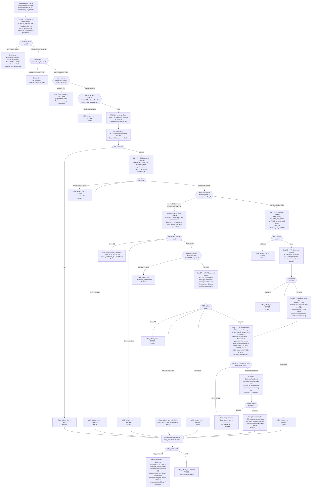

# WDP-COMP-15-EVIDENCE-CONSUMER
**Worldpay Dispute Platform — Component Reference**
*Version: 1.0 DRAFT | April 2026*
*Extracted from: wdp-evidence-consumer (Spring Boot 3.5.6 / Java 17) using GitHub Copilot CLI | Architect-confirmed: PENDING*

---

## ━━━ CORE SKELETON ━━━━━━━━━━━━━━━━━━━━━━━━━━━━━━━━━━━━━━
*Mandatory for every component regardless of type.*

---

## Identity

| Field                | Value                                                                          |
|----------------------|--------------------------------------------------------------------------------|
| **Name**             | `EvidenceConsumer`                                                             |
| **Type**             | `Kafka Consumer + Kafka Producer`                                              |
| **Repository**       | `wdp-evidence-consumer`                                                        |
| **Repository URL**   | `https://github.worldpay.com/GCP/wdp-evidence-consumer.git`                   |
| **Status**           | `✅ Production`                                                                 |
| **Doc status**       | `📝 DRAFT`                                                                     |
| **Sections present** | `Core \| Block B — Kafka Consumer \| Block C — Kafka Producer`                |

---

## Purpose

**What it does**

EvidenceConsumer attaches dispute evidence documents to active cases on the Worldpay Dispute Platform. It consumes file-upload notification events from the `case-evidence-events` Kafka topic — published upstream by InboundDisputeEventScheduler (COMP-12) after FileProcessor (COMP-11) stages documents to S3.

Critically, the Kafka event does not carry the document location. The S3 bucket and key are stored in the `wdp.file_evidence` database table, written by FileProcessor at ingest time. EvidenceConsumer reads that record to locate and download the document binary before any upload attempt.

The component supports two processing paths, controlled by the `coreMigrationFlag` runtime feature flag. The **WDP path** applies to all PIN-platform events and to CORE-platform events when the migration flag is enabled. It retrieves the dispute case via `mdvs-gcp-case-search-service`, uploads the document to `mdvs-gcp-document-management-service`, and publishes a `BusinessRuleEvent` to the `business-rules` Kafka topic to trigger downstream rule evaluation. The **V3 path** applies to legacy CORE-platform events when the migration flag is disabled. It queries IBM DB2 directly for case lookup, uploads to the V3 Core legacy upload endpoint, and does not publish any Business Rules event.

After a successful upload on the WDP path, the component performs additional ownership and questionnaire updates within the same database transaction: for `RESPDOC` document types where the action owner is `MERCHANT`, it transfers ownership to `WPAYOPS` and updates the `disputes_questionnaire` table with the complete set of attached file names for the action.

**What it does NOT do**

- Does not create dispute cases — that is COMP-14 CaseCreationConsumer.
- Does not parse or inspect the binary content of evidence documents. S3 bytes are passed through opaquely to the document management service.
- Does not handle NAP-platform dispute events.
- Does not use the DocumentManagementService for V3/CORE path uploads — V3 uses its own proprietary Core upload endpoint with `vantiveLicense` authentication, not an IDP Bearer token.
- Does not implement the transactional outbox pattern for downstream publishing. Business Rules Kafka events are published synchronously inside a JPA `@Transactional` block — a confirmed deviation from DEC-001.
- Does not retry any outbound call on failure. No Resilience4j circuit breaker or Spring `@Retryable` is active on any dependency.
- Does not delete or archive the staging S3 object after successful processing. The source file remains in place.
- Does not route `MISCDOC` or `DRFTDOC` document types to any upload path. Events with these types silently fall through all upload conditionals and remain in an unfinished state. See Functional Gaps below.

---

## Internal Processing Flow

**Flow notes:**

- **⚠️ Pre-ACK at Step 1:** The Kafka offset is committed before any business logic. All FAILED, ERROR, and silent-skip outcomes operate on a message that Kafka will never redeliver. Evidence loss (not duplication) is the primary risk.
- **FAILED vs ERROR terminal states:** ERROR is written directly for: field validation failure, S3 object not found, WDP case 404, V3 DB2 record not found, WDP upload 404. FAILED is written for: IDP failure, S3 generic exception, WDP case 5xx, WDP upload size/generic errors, V3 upload generic errors, and BR Kafka rollback. FAILED outcomes increment `retry_count`; when `retry_count > 2` the record escalates to ERROR.
- **Deserialization failure path:** `ErrorHandlingDeserializer` produces a null `EvidenceEvent`. The empty `CommonErrorHandler` on the container does nothing. The NPE from accessing fields on null is caught and logged. No DB record is written. Message is permanently lost.
- **MISCDOC / DRFTDOC gap:** Events with these document types pass Step 2 validation (no required field check) but fall through all upload conditionals in Step 5 without executing any upload call. `doTransactionalCall()` is never invoked. The record remains in an unfinished state indefinitely.

---

## Boundaries

### Inbound Interfaces

| Source | Protocol | Topic / Resource | Payload |
|--------|----------|-----------------|---------|
| COMP-12 InboundDisputeEventScheduler | Kafka | `case-evidence-events` | `EvidenceEvent` JSON — contains `eventId`, `eventType`, `sourceSystem`, `documentType`, `correlationId`, `caseNumber`, `networkCaseId`, `cardNetwork`, `recordType`. Does **not** carry S3 path. |
| COMP-11 FileProcessor (indirect) | PostgreSQL | `wdp.file_evidence` | Written by FileProcessor at ingest time. Contains `s3_bucket`, `s3_key`, `file_name`, `attachment_status`, `fileJobId`. Read by this component at Step 2. |

### Outbound Interfaces

| Target | Protocol | Endpoint / Resource | Purpose | On failure |
|--------|----------|---------------------|---------|------------|
| wdp-idp-token-service | REST HTTP GET | `http://wdp-idp-token-service.wdp-micro:8082/merchant/gcp/idp-token/token` | Fetch Bearer token for all WDP service calls — Step 2 | `chbk_outbox_row → FAILED`; no retry |
| AWS S3 staging bucket | AWS SDK v2 | Per-record bucket from `file_evidence.s3_bucket` | Download evidence document binary — Step 3 | NoSuchKeyException → ERROR; other → FAILED; no retry |
| mdvs-gcp-case-search-service | REST HTTP GET | `http://mdvs-gcp-case-search-service.wdp-micro:8082/merchant/gcp/case-search/{platform}/case/lookup` | WDP path case lookup — Step 4A | 404/400 → ERROR; 5xx → FAILED; no retry |
| IBM DB2 BC schema | JDBC (WITH UR) | `BC.TBC_DM_CASE`, `BC.TBC_DM_OCCUR` | V3 path case lookup — Step 4B | Record not found → ERROR; no retry |
| mdvs-gcp-document-management-service | REST HTTP POST multipart | `http://mdvs-gcp-document-management-service.wdp-micro:8082/merchant/gcp/document-management/{platform}/documents/{caseNumber}` | WDP path document upload — Step 5A | 404/400 → ERROR; size exceeded → FAILED; other → FAILED; no retry |
| V3 Core Upload Service | REST HTTP POST multipart | `${v3_upload_doc_url}` (env var) | V3 path document upload — Step 5B | 404/400 → ERROR; other → FAILED; no retry |
| V3 Core Update Action Service | REST HTTP PATCH | `${v3_upload_action_url}` (env var) | V3 path only — RESPDOC transfer of case ownership after upload — Step 5B | See note [1] |
| `business-rules` Kafka topic | Kafka (synchronous, inside `@Transactional`) | `spring.kafka.producer.businessEventTopic` | Trigger Business Rules evaluation — Step 6, WDP path, `isMultiDocPending=false` only | Exception → @Transactional rollback → FAILED; no retry |
| AWS S3 failed-file bucket | AWS SDK v2 | `app.failedFileS3Bucket` — pattern `{sourceEvent}/{yyyy-MM-dd}/{originalFilename}` | Archive downloaded file when retry_count escalates to ERROR | Silently swallowed — exception caught and logged, not re-thrown |
| `wdp` PostgreSQL schema | JPA / PostgreSQL | `wdp.chbk_outbox_row`, `wdp.file_evidence`, `wdp.ACTION`, `wdp.CASE`, `wdp.disputes_questionnaire` | Status updates and outcome writes — Steps 2, 6 | See Database Ownership section |

**Note [1]:** The V3 Update Action call is the **only outbound call in this entire component with explicit timeout values configured** — 30 seconds connection and 30 seconds read. All other outbound REST calls use a shared `RestTemplate` bean with no timeout configuration (effectively infinite). With a single consumer thread, any hanging downstream call halts the entire consumer.

---

## Database Ownership

### Tables Owned (written by this component)

| Schema.Table | Purpose | Key columns | Notes |
|--------------|---------|-------------|-------|
| `wdp.chbk_outbox_row` | Status tracking for inbound dispute events. Written on every processing outcome. | `id` (PK, equals `event.eventId`) | Shared table — written by multiple components. This consumer writes `status`, `error_message`, `error_code`, `retry_count`. Step 6 write is in the same `@Transactional` as `file_evidence`. |
| `wdp.file_evidence` | Evidence document attachment status and metadata. | `chbk_outbox_row_id`, `file_job_id`, `i_case` | `attachment_status` transitions: (initial) → `ATTACHED` on success, `ERROR` on escalation. `appended_file_name`, `attached_at`, `updated_at`, `failed_s3_key` also written. Step 6 write in same transaction as `chbk_outbox_row`. |
| `wdp.ACTION` | Case action record. Owner field updated after WDP document upload. | `I_CASE`, `I_ACTION_SEQ` | Written only on WDP path, RESPDOC, when owner == MERCHANT and action not CLOSED. Transfers `C_OWNR` to `WPAYOPS`. Same transaction as Step 6. |
| `wdp.CASE` | Case record. Timestamp updated when action owner changes. | `I_CASE` | Written only on WDP path, RESPDOC owner transfer. Same transaction as Step 6. |
| `wdp.disputes_questionnaire` | Questionnaire record for the dispute action. Upserted with list of attached file names. | `I_CASE`, `I_ACTION_SEQ` | Written only on WDP path, RESPDOC. Same transaction as Step 6. |

### Tables Read (not owned by this component)

| Schema.Table | Owned by | Why accessed |
|--------------|----------|--------------|
| `wdp.file_evidence` | COMP-11 FileProcessor (primary writer) | Read at Step 2 to retrieve `s3_bucket`, `s3_key`, `file_name`, and `attachment_status` for idempotency check. Also read for sibling multi-doc pending check. |
| `wdp.chbk_outbox_row` | Shared | Read at Step 2 for idempotency — verifies `attachment_status` of the corresponding `file_evidence` row. |
| `BC.TBC_DM_CASE` | Enterprise / IBM DB2 (V3 Core) | V3 path only — case lookup by `I_CASE` or `I_NTWK_CASE`. JDBC read with `WITH UR` (uncommitted read isolation). |
| `BC.TBC_DM_OCCUR` | Enterprise / IBM DB2 (V3 Core) | V3 path only — occurrences associated with the case. Loaded eagerly via join with `TBC_DM_CASE`. Read-only. |

---

## Key Architectural Decisions

| Decision | Detail | Severity |
|----------|--------|----------|
| DEC-001 DEVIATION — No transactional outbox | Business Rules Kafka `send()` is called synchronously inside `@Transactional(wdpTransactionManager)`. If Kafka succeeds but the DB transaction rolls back, the Kafka message is in-flight and cannot be recalled — a ghost BR event with no corresponding DB state enters the `business-rules` topic. If Kafka fails, the DB transaction rolls back and the failure is recoverable. | 🔴 HIGH |
| DEC-003 DEVIATION — Partition key is caseNumber | The Kafka message key on the inbound `case-evidence-events` topic is `caseNumber` (received via `KafkaHeaders.RECEIVED_KEY`). The outbound `business-rules` topic also uses `caseNumber` as the key. Neither conforms to the platform standard of `merchantId`. | 🟡 MEDIUM |
| DEC-005 DEVIATION — Pre-ACK at-most-once | Kafka offset is committed at Step 1 — immediately upon message receipt, before all database reads, S3 download, document upload, and DB writes. This is at-most-once semantics. If the pod dies after Step 1 but before Step 6 completes, evidence is permanently lost. Kafka will not redeliver. | 🔴 HIGH |
| DEC-014 DEVIATION — No Resilience4j | `io.github.resilience4j` is absent from `pom.xml`. `spring-retry` is declared and `@EnableRetry` is active on the main class, but zero `@Retryable` annotations exist in any service class. No circuit breaker, bulkhead, or rate limiter is configured on any of the eight outbound dependencies. | 🔴 HIGH |
| RISK — No REST timeouts (7 of 8 calls) | Only the V3 Core Update Action call has explicit timeout values (30s/30s). All other REST calls use a shared `RestTemplate` with no timeout — default Java `HttpURLConnection` behaviour, effectively unlimited. With concurrency=1, any hanging call halts the entire consumer. | 🔴 HIGH |
| RISK — Silent deserialization swallow | `ErrorHandlingDeserializer` wraps the value deserializer. The `CommonErrorHandler` registered on the container is an empty anonymous implementation. A malformed message is silently acknowledged and dropped. No error record is written anywhere. Combined with pre-ACK, a bad message is permanently undetectable from any monitoring surface. | 🔴 HIGH |
| RISK — Concurrent replica duplicate upload | With `maxUnavailable=0` and `maxSurge=1` during rolling deployments, two pod replicas may simultaneously process the same partition. Both can pass the idempotency check at Step 2 before either writes `ATTACHED` to the database. No unique constraint or pessimistic lock exists on `(chbk_outbox_row_id, attachment_status)`. A duplicate document upload to DMS is theoretically possible within this window. | 🟡 MEDIUM |
| RISK — MISCDOC / DRFTDOC functional gap | Events with `documentType = MISCDOC` or `DRFTDOC` pass all Step 2 checks but fall through all upload conditionals in Step 5 without any upload call. `doTransactionalCall()` is never invoked. The record remains in an unfinished state indefinitely with no error written. | 🔴 HIGH |
| DECISION — coreMigrationFlag gates entire CORE processing path | This runtime feature flag is the single most impactful configuration parameter in the component. When `true`, CORE-platform events follow the full WDP path (IDP token, REST case lookup, DMS upload, BR publish). When `false`, CORE events follow the legacy V3 path (DB2 lookup, V3 upload, no BR events, `vantiveLicense` auth). Flag gates routing at Steps 2, 4, 5, and 6. | — |
| DECISION — S3 staging object left in place | After a successful document upload, the staging S3 object is not deleted, moved, or archived. This is intentional. No lifecycle management is performed by this component on the source object. | — |

---

## Risks and Constraints

| Risk | Impact | Status |
|------|--------|--------|
| Evidence loss on pod death (pre-ACK) | Any crash between Step 1 offset commit and Step 6 DB write results in permanently lost evidence. No recovery mechanism exists. | 🔴 Active |
| Ghost BR events from Kafka-in-transaction | If DB commit succeeds but downstream state is inconsistent (rare), a BR event may trigger rules evaluation with no corresponding DB case state. | 🔴 Active |
| No timeout on 7 of 8 outbound REST calls | Consumer thread can be blocked indefinitely by any hanging downstream service. Single-thread concurrency amplifies impact. | 🔴 Active |
| Silent drop on deserialization failure | Malformed messages are permanently lost with no audit trail or alert. | 🔴 Active |
| Unhandled MISCDOC / DRFTDOC events | These document types are defined in the `DocumentType` enum but have no upload path. Records remain silently stuck. | 🔴 Active |
| Duplicate upload during rolling deploy | Two replicas may upload the same document to DMS if both pass the idempotency check concurrently. No DB-level guard. | 🟡 Active |
| Dead AWS static credentials | `app.aws.accessKey` / `app.aws.secretKey` are dead in all deployed environments (IAM instance profile used). Dead config presents no risk but should be removed for hygiene. | 🟢 Low |

---

## Planned and Incomplete Work

| Item | Detail | Type |
|------|--------|------|
| MISCDOC / DRFTDOC upload path | `DocumentType` enum includes `MISCDOC` and `DRFTDOC` but the `uploadDocumentToWdp()` method has no explicit branches for them. Events with these types are silently unprocessed. | ⚠️ Functional gap |
| `RESPQDOC` / `ISSRQDOC` undefined routing | These two types are defined in the `DocumentType` enum but have no explicit routing in either the WDP or V3 upload methods. | ⚠️ Functional gap |
| Commented-out exception throws (RestInvoker) | Three locations in `RestInvoker.java` have dead `throw new Exception(...)` statements replaced by re-throw of `RestTemplateCustomException`. Dead code. | 🧹 Hygiene |
| Commented-out former URL parameter | `//urlParams.put("case-number", caseNumber)` in `V3CoreDisputeServiceImpl.updateActionToV3` — replaced with `caseNumber`. | 🧹 Hygiene |
| Commented-out original filename returns | Two locations where `file.getOriginalFilename()` was replaced by the transformed timestamped/sanitised filename logic. | 🧹 Hygiene |
| Commented-out S3 file-copy implementation | `ProcessorUtil.buildFile()` — `Files.copy(s3Object, dest.toPath())` replaced by `Files.write(dest.toPath(), fileBytes)`. Memory-safe rewrite. | 🧹 Hygiene |
| Likely unused OAuth2 dependencies | `spring-boot-starter-oauth2-client` and `spring-boot-starter-oauth2-resource-server` present in `pom.xml` but IDP token is fetched via plain `RestTemplate` GET. No JWT/JWK config, no `@EnableWebSecurity`. | 🧹 Hygiene |
| Unused `modelMapper` dependency | `ModelMapper` bean defined but never `@Autowired` in any service. | 🧹 Hygiene |
| Unused `httpclient5` dependency | `HttpComponentsClientHttpRequestFactory` used for V3 Update Action relies on httpclient v4, not v5. | 🧹 Hygiene |
| Dead AWS static key properties | `app.aws.accessKey` / `app.aws.secretKey` are never used in deployed environments (`isiamuser=true` on all envs). | 🧹 Hygiene |
| `ActionEntity.duplicateInd` field commented out | `@Column(name="C_DUPLICATE_IND")` commented out — possibly not yet present in DB schema. | ⚠️ Incomplete |
| Historical Logstash destinations in logback | Two hardcoded IB-based `<destination>` entries in `logback-spring.xml` superseded by env-var-driven destination. | 🧹 Hygiene |

---

## Scaling and Deployment

| Parameter | Value | Source |
|-----------|-------|--------|
| Kubernetes resource type | `Deployment` | `resources.yaml` |
| Replica count | `{{ replicas-wdp-evidence-consumer }}` — XL Deploy / Helm template placeholder | External config store — value not in repository |
| Memory limit | `2048Mi` | `resources.yaml` |
| Memory request | `1024Mi` | `resources.yaml` |
| CPU limit | **Not configured** — best-effort QoS | `resources.yaml` |
| CPU request | **Not configured** | `resources.yaml` |
| HPA | **Absent** — no `HorizontalPodAutoscaler` manifest | — |
| Rolling update — maxSurge | `1` | `resources.yaml` |
| Rolling update — maxUnavailable | `0` | `resources.yaml` |
| minReadySeconds | `30` | `resources.yaml` |
| PodDisruptionBudget | **Absent** | — |
| Topology spread constraints | **Absent** — no `topologySpreadConstraints` in pod spec | — |
| OpenTelemetry | **Yes** — pod annotation `instrumentation.opentelemetry.io/inject-java` — OTel Java agent injected by operator | `resources.yaml` |
| Spring Actuator | **Yes** — on port 8082; default endpoints active | `pom.xml` |
| Logstash | **Yes** — `LogstashTcpSocketAppender` to `${logstash_server_host_port}` with structured JSON; custom fields `Environment`, `AppName`; keep-alive 5 minutes | `logback-spring.xml` |
| Console appender | **Yes** — plain-text pattern alongside Logstash | `logback-spring.xml` |

**Deployment note:** `maxUnavailable=0` and `maxSurge=1` means one extra pod is created before any old pod is removed during rolling updates. Combined with the idempotency gap (no DB-level unique constraint on attachment), two consumer replicas may process the same partition concurrently during the rollout window, creating a duplicate upload risk.

---

---

## ━━━ TYPE BLOCK B — KAFKA CONSUMER CONTRACTS ━━━━━━━━━━━━━

---

## Kafka Consumer Contracts

**Consumer framework:** Spring Kafka `@KafkaListener` (`notificationListener`)
**Offset commit strategy:** ⚠️ Pre-ACK at-most-once — `MANUAL_IMMEDIATE` with `SyncCommits=true`. Offset committed at Step 1, before all processing. **Deviation from DEC-005.**
**Error handling strategy:** No DLQ topic. No error table for deserialization failures. Per-step error outcomes write to `wdp.chbk_outbox_row` (FAILED or ERROR status). Consumer never halts.

---

### Topic: `case-evidence-events`

| Parameter | Value |
|-----------|-------|
| **Topic name (prod)** | `case-evidence-events` |
| **Topic name (dev/stg/cert)** | `case-evidence-events-dev` / `case-evidence-events-stg` / `case-evidence-events-cert` |
| **Config key** | `spring.kafka.consumer.topic` |
| **Consumer group (prod)** | `case-evidence-events-group` |
| **Consumer group (dev/stg/cert)** | `case-evidence-events-group-dev` / `-stg` / `-cert` |
| **Consumer group config key** | `spring.kafka.consumer.groupId` — injected from K8s secrets `wdp-evidence-consumer-secrets` / `wdp-common-secrets` |
| **AckMode** | `MANUAL_IMMEDIATE` with `SyncCommits=true` |
| **Offset commit timing** | ⚠️ Step 1 — before all downstream processing. At-most-once. |
| **Partition key (inbound)** | `caseNumber` — received via `KafkaHeaders.RECEIVED_KEY` as `String`. ⚠️ Not `merchantId` — DEC-003 deviation. |
| **Concurrency** | `1` — default Spring Kafka (no `setConcurrency()` call) |
| **Max poll records** | `500` — config key `spring.kafka.consumer.maxPollRecords` |
| **Max poll interval** | `600000 ms` (10 minutes) — config key `spring.kafka.consumer.maxPollInterval` |
| **Key deserializer** | `StringDeserializer` |
| **Value deserializer** | `JsonDeserializer<EvidenceEvent>` wrapped in `ErrorHandlingDeserializer<EvidenceEvent>` |
| **Ordering guarantee** | Per partition by `caseNumber` (not by `merchantId`) |

**EvidenceEvent payload — key fields**

| Field | Type | Description |
|-------|------|-------------|
| `eventId` | String | Primary key — maps to `chbk_outbox_row.id` and `file_evidence.chbk_outbox_row_id`. Used as idempotency key. |
| `eventType` | String | Must equal `EVIDENCE_ATTACH` — events with other values are silently discarded at Step 2. |
| `sourceSystem` | String | Platform identifier — `PIN`, `CORE` etc. Drives WDP vs V3 path routing with `coreMigrationFlag`. |
| `documentType` | String | Document classification — `ISSRDOC`, `RESPDOC`, `DSNOTDOC`, `MISCDOC`, `DRFTDOC`, `RESPQDOC`, `ISSRQDOC`. Drives document-level routing within each path. |
| `caseNumber` | String | Required for RESPDOC. Used as Kafka message key, URL path param to DMS, and case lookup key. |
| `networkCaseId` | String | Required for ISSRDOC. Used as case lookup key. |
| `cardNetwork` | String | Used in ISSRDOC WDP case lookup query. |
| `correlationId` | String | Forwarded as `v-correlation-id` HTTP header. Auto-generated (UUID) if blank in event. |
| `recordType` | String | Used for `imageType` derivation on V3 path (ISSRDOC) and for RESPDOC V3 ownership transfer direction. |

**Note:** The S3 document path (`s3_bucket`, `s3_key`, `file_name`) is **not** in the Kafka payload. It is read from `wdp.file_evidence` using `event.eventId` as the lookup key at Step 2.

**Event classification / routing**

Single event type — `eventType == EVIDENCE_ATTACH` — is the gate check at Step 2. All events on this topic are expected to be of this type; non-matching events are silently discarded.

Within the matching event type, routing is driven by two dimensions:
1. **Platform + migration flag:** `sourceSystem == PIN` or (`sourceSystem == CORE` AND `coreMigrationFlag == true`) → WDP path. `sourceSystem == CORE` AND `coreMigrationFlag == false` → V3 legacy path.
2. **Document type:** determines case lookup key, upload request fields, owner transfer behaviour, and Business Rules `source` field value.

**On processing failure**

| Failure scenario | Behaviour |
|-----------------|-----------|
| Deserialization failure (malformed JSON) | `ErrorHandlingDeserializer` produces null. Empty `CommonErrorHandler` does nothing. NPE caught and logged. No DB write. Message permanently lost. |
| Wrong `eventType` | Silent return — no DB writes. Offset already committed. |
| Already processed (`attachment_status = ATTACHED`) | `chbk_outbox_row → SUCCESS` with note. Return. |
| Required field missing (ISSRDOC/RESPDOC) | `chbk_outbox_row → ERROR`. Return. |
| IDP token fetch failure | `chbk_outbox_row → FAILED`. No retry. Consumer continues to next message. |
| S3 object not found | `chbk_outbox_row → ERROR` (error_code=404). No retry. |
| S3 generic exception | `chbk_outbox_row → FAILED`. No retry. |
| WDP case lookup 404/400 | `chbk_outbox_row → ERROR` (CASE_NOT_FOUND or NEED_MANUAL_ATTACHMENT). No retry. |
| WDP case lookup 5xx | `chbk_outbox_row → FAILED`. No retry. |
| V3 DB2 record not found | `chbk_outbox_row → ERROR`. No retry. |
| Document upload 404/400 | `chbk_outbox_row → ERROR`. No retry. |
| Document upload — file size exceeded | `chbk_outbox_row → FAILED`, `error_code = DOC_SIZE_LIMIT_EXCEEDED`. No retry. |
| Document upload — other error | `chbk_outbox_row → FAILED`. No retry. |
| Business Rules Kafka publish failure | Exception propagates → `@Transactional` rollback (all Step 6 DB writes undone) → `updateFailedStep(FAILED)` called in new transaction. No retry on Kafka publish. |
| Any FAILED outcome — retry escalation | `updateFailedStep` increments `retry_count`. If `retry_count > 2`: status escalates to `ERROR`, `file_evidence → ERROR`, failed S3 archive attempted (silently swallowed on failure), compensating BR events published for previously successful siblings (where applicable). |

---

---

## ━━━ TYPE BLOCK C — KAFKA PRODUCER CONTRACTS ━━━━━━━━━━━━━

---

## Kafka Producer Contracts

**Producer framework:** Spring Kafka `KafkaTemplate`
**Idempotent producer:** Yes — `ENABLE_IDEMPOTENCE = true`, `acks = all`, `max.in.flight.requests.per.connection = 5`
**Publish mode:** Synchronous — called blocking inside `@Transactional(wdpTransactionManager)`. ⚠️ Kafka publish is inside a JPA transaction — DEC-001 violation.
**Auth:** AWS MSK IAM (SASL_SSL)
**Retry on publish failure:** No — publish failure propagates as exception, triggering `@Transactional` rollback.

---

### Topic: `business-rules`

| Parameter | Value |
|-----------|-------|
| **Topic name (prod)** | `business-rules` |
| **Config key** | `spring.kafka.producer.businessEventTopic` |
| **Message key** | `caseNumber` — ⚠️ not `merchantId`. DEC-003 deviation. |
| **Serializer** | `JsonSerializer` |
| **Ordering guarantee** | Per partition by `caseNumber` |
| **Published on** | Successful WDP-path document upload at Step 6, when `isMultiDocPending = false`. Suppressed when `isMultiDocPending = true` (sibling documents still pending in the same file job). |
| **Consumed by** | COMP-16 BusinessRulesProcessor |

**Message payload — BusinessRuleEvent**

| Field | Notes |
|-------|-------|
| `source` | Varies by documentType: `BRISUP` for ISSRDOC; `BRMRUP` for RESPDOC and DRFTDOC; `BRMCUP` for MISCDOC |
| `caseNumber` | Case identifier — also the Kafka message key |
| Other case fields | Derived from the case lookup response (Step 4) |

**Payload notes**

- The `source` field drives downstream routing in COMP-16. It is set by this component based on `documentType`, not from the Kafka event.
- The `notifyBRQueue=false` parameter is hardcoded on the DMS upload call to prevent the Document Management Service from independently publishing its own BR event. This component takes sole responsibility for triggering Business Rules after a WDP-path upload.
- Publish is suppressed when `isMultiDocPending = true` — this prevents partial-job BR events when a file upload job contains multiple documents and some have not yet been processed.
- When a record escalates to ERROR after retry exhaustion, compensating BR events may be published for **previously successful** sibling documents in the same file job (where `documentType != DSNOTDOC` and `isMultiDocPending` can be resolved to false). This is a recovery action to unblock downstream processing for the siblings.
- ⚠️ If Kafka publish succeeds but the enclosing `@Transactional` subsequently rolls back for any reason, the `BusinessRuleEvent` message is already in-flight on the `business-rules` topic and cannot be recalled. Business Rules processing would evaluate a case whose DB state was rolled back. This is the DEC-001 dual-write risk.

---

*End of WDP-COMP-15-EVIDENCE-CONSUMER.md*
*Status: 📝 DRAFT — awaiting architect confirmation*
*After confirmation: update WDP-COMP-INDEX.md, WDP-KAFKA.md, WDP-DB.md, WDP-HANDOVER.md*
