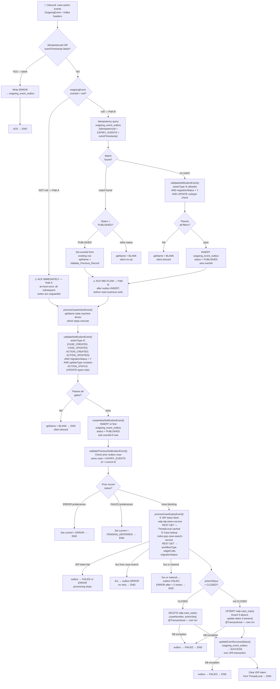

# WDP-COMP-17-CASE-EXPIRY-CONSUMER.md
**Worldpay Dispute Platform — Component Reference**
*Version: 1.0 DRAFT | April 2026*
*Extracted from: gcp-case-expiry-consumer using GitHub Copilot CLI | Architect-confirmed: PENDING*

---

## ━━━ CORE SKELETON ━━━━━━━━━━━━━━━━━━━━━━━━━━━━━━━━━━━━━━

---

## Identity

| Field | Value |
|---|---|
| **Name** | `CaseExpiryUpdateConsumer` |
| **Type** | Kafka Consumer |
| **Artefact** | `gcp-case-expiry-consumer v1.1.1` |
| **Repository** | `gcp-case-expiry-consumer` |
| **Runtime** | Spring Boot 3.5.7 / Java 17 |
| **Status** | ✅ Production |
| **Doc status** | 📝 DRAFT |
| **Sections present** | Core \| Block B (Kafka Consumer) |

---

## Purpose

**What it does**

CaseExpiryUpdateConsumer maintains the `wdp.case_expiry` table, which stores the active expiry schedule per case and action. It is the single writer of expiry scheduling data consumed by downstream expiry-driven workflows. Every expiry state change in the platform flows through this component.

The component consumes `OutgoingEvent` messages from the `case-action-events` Kafka topic. On receipt, it executes a multi-step state-machine pipeline driven by an internal `apiName` token. The pipeline validates message headers, performs idempotency detection, checks for predecessor blocking, retrieves workflow metadata from a case-lookup REST service, and either upserts or deletes the `wdp.case_expiry` record depending on the action status of the received event.

The component operates two distinct entry paths depending on whether the inbound message carries a non-null `eventId`. When `eventId` is present (Path A), the Kafka offset is acknowledged before any downstream write — at-most-once semantics for the main business write. When `eventId` is null (Path B), an idempotency query and outbox INSERT run first, and the offset is acknowledged mid-flow after that initial outbox write but before the main case-expiry write. This inconsistency in ACK timing is a confirmed deviation from the platform-standard pre-ACK pattern and differs between the two paths.

All side-effects are database writes to `wdp.outgoing_event_outbox` (audit, idempotency, predecessor control) and `wdp.case_expiry` (business state). There is no outbound Kafka publish from this component.

**What it does NOT do**

- Does NOT publish to any Kafka topic — all outbound side-effects are database writes and one REST GET call.
- Does NOT use the transactional outbox pattern as a Kafka producer. The `wdp.outgoing_event_outbox` table is used here as a consumer-side audit and idempotency store, not as a producer-side outbox for guaranteed Kafka delivery.
- Does NOT write the `wdp.outgoing_event_outbox` INSERT and the `wdp.case_expiry` write in the same transaction. These are two independent JPA transactions — a crash between them leaves the outbox in `PUBLISHED` state with the expiry record already written.
- Does NOT apply circuit breakers, retries, or timeouts on any outbound call. Both REST dependencies use a plain `RestTemplate` with no connection or read timeout configured.
- Does NOT process events without `migrationStatus = Y`. Events with any other migration status are silently discarded. This gate is a compile-time constant, not a runtime flag.
- Does NOT handle deserialization errors explicitly. The registered `CommonErrorHandler` is a no-op — a malformed payload causes a `NullPointerException` that is caught and swallowed, with offset commit behaviour depending on which path was active.
- Does NOT use OAuth2, Spring Security, or JWT validation. There are no REST endpoints exposed by this component and no resource server configuration despite OAuth2 dependencies being declared in `pom.xml`.

---

## Internal Processing Flow



---

## Boundaries

### Inbound Interfaces

| Source | Protocol | Endpoint / Topic | Payload / Description |
|---|---|---|---|
| COMP-12 InboundDisputeEventScheduler (via `EXPIRY_EVENTS` channelType row in `outgoing_event_outbox`) | Kafka | `case-action-events` | `OutgoingEvent` JSON + Kafka headers (`idempotencyId`, `eventTimestamp`, `RECEIVED_KEY` = caseNumber) |

### Outbound Interfaces

| Target | Protocol | Endpoint / Resource | Purpose | On failure |
|---|---|---|---|---|
| `wdp-idp-token-service` | REST GET | `http://wdp-idp-token-service.wdp-micro:8082/merchant/gcp/idp-token/token` | Obtain IDP bearer token before case lookup | outbox → FAILED/ERROR; processing stops |
| `mdvs-gcp-case-search-service` | REST GET | `http://mdvs-gcp-case-search-service.wdp-micro:8082/merchant/gcp/case-search/{platform}/case/lookup` | Retrieve `workflowType`, `stageCode`, `migrationStatus` by caseNumber + actionSeq | 4xx → outbox ERROR (no retry); 5xx/network → outbox FAILED (ERROR after >2 retries) |
| `wdp.outgoing_event_outbox` | PostgreSQL (JPA) | `wdp` schema | Idempotency, audit, predecessor blocking, status tracking | Exceptions propagate to service layer; best-effort FAILED write; consumer continues |
| `wdp.case_expiry` | PostgreSQL (JPA) | `wdp` schema | Write or delete active expiry schedule per case+action | outbox → FAILED; processing stops |

---

## Database Ownership

### Tables Owned (written by this component)

| Schema.Table | Purpose | Key columns | Notes |
|---|---|---|---|
| `wdp.case_expiry` | Active expiry schedule per case+action. Consumed by downstream expiry-driven workflows | `i_case` (caseNumber), `i_action_seq`, `c_acq_platform`, `d_expiry_due`, `d_response_due`, `i_retry_count`, `c_workflow_name`, `z_insr`, `z_updt` | Read before write (SELECT → INSERT or UPDATE). DELETE on `actionStatus = CLOSED`. Each write is its own `@Transactional` JPA transaction, independent of the outbox write. |
| `wdp.outgoing_event_outbox` | Consumer-side audit, idempotency store, and predecessor blocking for all EXPIRY_EVENTS messages | `id` (PK), `i_case`, `i_action_seq`, `channel_type` (hardcoded `EXPIRY_EVENTS`), `idempotency_id`, `event_timestamp`, `status`, `retry_count`, `next_retry_at`, `error_code`, `error_message`, `original_event` (JSON), `created_by` (hardcoded `WCSEEXPC`), `created_at`, `updated_at` | ⚠️ Shared write table — also written by COMP-16 BusinessRulesProcessor and others for different `channel_type` values. Each JPA operation is its own transaction (no `@Transactional` on `OutgoingEventOutboxServiceImpl` methods). Status lifecycle: `PUBLISHED → SUCCESS`, `PUBLISHED → FAILED (retry++) → ERROR (>2 retries)`, `PUBLISHED → ERROR (4xx direct)`, `PUBLISHED → PENDING_DEFERRED (predecessor blocked)`. |

### Tables Read (not owned by this component)

*This component reads only from tables it also writes to. No read-only table dependencies.*

---

## Key Architectural Decisions

| ID | Decision | Rationale | Status |
|---|---|---|---|
| DEC-PLACEHOLDER | `wdp.outgoing_event_outbox` used as consumer-side audit and idempotency store (not producer outbox) | No Kafka publishing required; outbox pattern repurposed for deduplication and predecessor sequencing within the expiry event path | Confirmed — source |
| DEC-PLACEHOLDER | Outbox INSERT and `case_expiry` write are separate JPA transactions — not atomic | No explicit architectural decision found. Non-atomicity is a risk: crash between the two leaves outbox in `PUBLISHED` state with `case_expiry` already written | ⚠️ Risk — confirm with team |
| DEC-PLACEHOLDER | ACK timing is inconsistent across paths (Path A: pre-ACK at-most-once; Path B: mid-flow ACK) | Appears to be an emergent behaviour from the two-method structure (`processNewCaseActionEvent` / `processCaseActionEvent`), not a deliberate architectural decision | ⚠️ Deviation — flag for DEC-005 |
| DEC-PLACEHOLDER | `migrationStatus = Y` gate is a compile-time constant, not a runtime feature flag | Events with any other migration status are silently discarded. Cannot be changed without a code release | ⚠️ Operational risk — no runtime toggle |
| DEC-PLACEHOLDER | IDP token cached per-message in `ThreadLocal` (`KafkaTokenHolder`), cleared in `finally` block | Avoids repeated token fetches within a single message processing cycle; `finally` guarantees cleanup even on failure | Confirmed — source |
| DEC-PLACEHOLDER | `CommonErrorHandler` registered in `KafkaConsumerConfig` is a no-op implementation | No consumer-level error handling configured. All exceptions caught at listener level; consumer never halts or pauses on any failure | ⚠️ Risk — malformed payloads may loop until max.poll.interval exceeded |

---

## Risk Register

| Risk | Severity | Detail |
|---|---|---|
| Non-atomic outbox + case_expiry writes | High | A pod crash after the `case_expiry` write but before the `outgoing_event_outbox → SUCCESS` update leaves the outbox in `PUBLISHED` state. The message has been ACKed (Path A) or the offset moves on (Path B mid-flow). No reprocessing will occur — the expiry record is written but the outbox shows an incomplete state. |
| Path A at-most-once semantics | High | When `eventId` is non-null, the Kafka offset is committed before any downstream write. A pod crash after ACK loses the message permanently. No retry, no DLQ, no alert. |
| Malformed payload — no-op error handler | Medium | A deserialization failure produces a `NullPointerException` inside the listener. The `CommonErrorHandler` is a no-op. For Path A messages the offset is already ACKed and the message is lost. For Path B messages the offset is not ACKed and the message redelivers until `max.poll.interval.ms` (10 min) is exceeded, at which point the consumer may be kicked from the group. |
| No timeouts on REST calls | Medium | Both `wdp-idp-token-service` and `mdvs-gcp-case-search-service` are called via a plain `RestTemplate` with no connection or read timeout. A hanging call blocks the single consumer thread indefinitely. `max.poll.interval.ms` = 10 minutes is the only backstop before consumer group rebalance. |
| PENDING_DEFERRED accumulation | Medium | If a predecessor outbox row is permanently stuck in `ERROR`, all subsequent events for the same case will be set to `PENDING_DEFERRED` or `ERROR` in a loop. No circuit-break or maximum deferral depth is implemented. |
| 7 unused pom.xml dependencies | Low | `spring-boot-starter-cache`, `spring-boot-starter-oauth2-client`, `spring-boot-starter-oauth2-resource-server`, `modelmapper`, `springdoc-openapi-starter-webmvc-ui`, `spring-aspects`, `apache httpclient`. None are wired in source. Increase JAR size and attack surface. |

---

## Deviation Flags

| Standard | Status | Detail |
|---|---|---|
| DEC-001 — Transactional outbox | ⚠️ PARTIAL DEVIATION | `wdp.outgoing_event_outbox` is used as a consumer-side idempotency and audit store — not as a producer-side transactional outbox. No Kafka publishing occurs. The outbox INSERT and the `case_expiry` business write are in separate JPA transactions and are not atomic with each other. |
| DEC-003 — Partition key = merchantId | ✅ N/A | This component does not publish to any Kafka topic. No partition key applies. |
| DEC-004 — PAN encryption | ✅ COMPLIANT | The `OutgoingEvent` model carries no PAN, card number, or sensitive cardholder data. The `original_event` JSON column in `outgoing_event_outbox` stores the full `OutgoingEvent` — which is confirmed PAN-free. |
| DEC-005 — Offset after processing | ⚠️ DEVIATED | ACK timing is not uniform. Path A (eventId non-null): ACK before all processing — at-most-once. Path B (eventId null): ACK after initial outbox write but before main `case_expiry` write — hybrid mid-flow. Missing-headers path: ACK after error outbox write — after partial processing. None of these match the standard post-processing ACK pattern. |
| DEC-014 — Resilience4j circuit breakers | ✅ ABSENT — consistent with platform pattern | `io.github.resilience4j` is not present in `pom.xml`. No circuit breaker, rate limiter, retry, or bulkhead annotations exist anywhere in the codebase. Consistent with all peer consumer components reviewed to date. |

---

## Deployment and Operations

### Kubernetes Configuration

| Parameter | Value |
|---|---|
| **Resource type** | Deployment |
| **Replica count** | `{{ replicas-gcp-case-expiry-consumer }}` — templated; resolved at deploy time via XLD. Exact prod value not visible in source. |
| **Memory limit** | 2048Mi |
| **Memory request** | 1024Mi |
| **CPU limit** | Not configured |
| **CPU request** | Not configured |
| **HPA** | Absent |
| **Rolling update** | Present — `maxSurge: 1`, `maxUnavailable: 0`, `minReadySeconds: 30` |
| **PodDisruptionBudget** | Absent |
| **Topology spread constraints** | Absent |

### Observability

| Component | Status | Detail |
|---|---|---|
| OpenTelemetry agent | ✅ Present | Annotation `instrumentation.opentelemetry.io/inject-java: opentelemetry-operator-system/default` on pod template |
| Spring Actuator | ✅ Present | `spring-boot-starter-actuator` in `pom.xml` |
| Logstash appender | ✅ Present | `LogstashTcpSocketAppender` in `logback-spring.xml` — sends to `${logstash_server_host_port}` |
| Console appender | ✅ Present | Standard pattern appender in `logback-spring.xml` |

### Planned and Incomplete Work

**Commented-out code:** Two `<destination>` entries in `logback-spring.xml` (lines 15–16) for hardcoded IP `10.43.145.125:5044` — leftover development/test Logstash destinations. Disabled in favour of the environment-variable-driven destination.

**Unused dependencies (7):** `spring-boot-starter-cache`, `spring-boot-starter-oauth2-client`, `spring-boot-starter-oauth2-resource-server`, `org.modelmapper:modelmapper`, `springdoc-openapi-starter-webmvc-ui`, `org.springframework:spring-aspects`, `apache httpclient:4.5.14`. None are wired in source. See Risk Register.

**Migration gate:** The `migrationStatus = Y` filter is a hard-coded compile-time constant in `ApplicationConstants`. It functions as a migration gate, not a runtime flag. Removing or toggling it requires a code release.

**No TODOs, FIXMEs, stub implementations, or active feature flags** found in source.

---

## ━━━ TYPE BLOCK B — KAFKA CONSUMER CONTRACTS ━━━━━━━━━━━━━

---

## Kafka Consumer Contracts

**Consumer framework:** Spring Kafka `@KafkaListener`
**Offset commit strategy:** MANUAL_IMMEDIATE with `syncCommits = true` — ⚠️ ACK timing is inconsistent across paths (see DEC-005 deviation above)
**Error handling strategy:** No Kafka DLQ. Failures written to `wdp.outgoing_event_outbox` with `status = FAILED` or `ERROR`. The registered `CommonErrorHandler` is a no-op — consumer never halts.

---

### Topic: `case-action-events`

| Parameter | Value |
|---|---|
| **Topic name (prod)** | `case-action-events` |
| **Config key** | `spring.kafka.consumer.topic` |
| **Consumer group (prod)** | `case-action-events-group` |
| **Consumer group config key** | `spring.kafka.consumer.groupId` |
| **Partition key (inbound)** | Received as `KafkaHeaders.RECEIVED_KEY` (mapped to `caseNumber`) — this component consumes the key only, does not publish |
| **AckMode** | `MANUAL_IMMEDIATE` |
| **syncCommits** | `true` |
| **Concurrency** | 1 (default — `setConcurrency()` not called) |
| **Max poll records** | 280 (prod) |
| **Max poll interval** | 300,000 ms (10 minutes, prod) |
| **Auto-offset-reset** | `latest` |
| **Enable auto commit** | `false` (`ENABLE_AUTO_COMMIT_CONFIG = false`) |
| **Auto-create topics** | `false` |
| **Key deserializer** | `StringDeserializer` |
| **Value deserializer** | `ErrorHandlingDeserializer` wrapping `JsonDeserializer<OutgoingEvent>` |
| **Ordering guarantee** | Per partition — scoped to caseNumber when key is present |

**Message payload — `OutgoingEvent`**

| Field | Type | Notes |
|---|---|---|
| `actionType` | String | Gate field — must be in `{CASE_CREATED, CASE_UPDATED, ACTION_CREATED, ACTION_UPDATED}` |
| `migrationStatus` | String | Gate field — must equal `Y` (compile-time constant) |
| `updateType` | String | Gate field for UPDATE subtypes — must contain `ACTION_STATUS` |
| `actionStatus` | String | Routing field — `CLOSED` → DELETE from `case_expiry`; any other → UPSERT |
| `caseNumber` | String | Primary case identifier — written to `i_case` in both tables |
| `actionSeq` | String | Action sequence — written to `i_action_seq` in both tables |
| `platform` | String | Written to `c_acq_platform` in `case_expiry` |
| `expirationDate` | String | Converted to SQL Date (yyyy-MM-dd) → `case_expiry.d_expiry_due` |
| `responseDueDate` | String | Converted to SQL Date (yyyy-MM-dd) → `case_expiry.d_response_due` |
| `correlationId` | String | Forwarded as HTTP header `v-correlation-id` on case lookup REST call |
| `eventId` | String | Controls path selection (null = Path B; non-null = Path A) and outbox row linkage |
| `level1Entity`–`level5Entity` | String | Pass-through — written to `outgoing_event_outbox.original_event` JSON |
| `caseNetwork`, `disputeStage`, `dateReceivedByAcquirer`, `documentIndicator`, `hybridMerchant`, `networkCaseId` | String | Pass-through to outbox original_event JSON — not written to `case_expiry` |

**No PAN, card number, or sensitive cardholder data present in payload.**

**Event classification / routing**

Routing is controlled by the `apiName` state-machine token on the internal `NotificationMessageEvent` wrapper. The token progresses through a fixed sequence:

```
Validate_Notification
  → Create_New_Record
    → Validate_Previous_Record
      → Process_Event
        → Update_Outbox_Success_Status
          → [BLANK = terminal / discard]
```

Any validation failure or exception sets `apiName = BLANK`, causing all remaining processing steps to be skipped. The state is never persisted — it lives only within the scope of a single message processing cycle.

**On processing failure**

| Failure scenario | Behaviour |
|---|---|
| Headers blank (idempotencyId or eventTimestamp) | Write `ERROR` to outgoing_event_outbox; ACK offset; END — message effectively lost |
| Invalid actionType or migrationStatus ≠ Y | apiName = BLANK; silent discard; no outbox write; offset committed (Path A) or committed mid-flow (Path B) |
| UPDATE event without ACTION_STATUS in updateType | apiName = BLANK; silent discard — same as above |
| Idempotency match found with non-PUBLISHED status | apiName = BLANK; silent no-op; processing stops without any write |
| Predecessor in ERROR | Set current outbox row = ERROR; END — no case_expiry write |
| Predecessor in FAILED | Set current outbox row = PENDING_DEFERRED; END — no case_expiry write |
| IDP token fetch fails | outbox → FAILED (escalates to ERROR after >2 retries); processing stops |
| Case lookup — HTTP 4xx | outbox → ERROR directly (no retry); processing stops |
| Case lookup — HTTP 5xx or network | outbox → FAILED (retry_count++); ERROR after >2 retries; processing stops |
| case_expiry upsert or delete fails (DB) | outbox → FAILED; processing stops |
| outbox SUCCESS update fails (DB) | outbox → FAILED; case_expiry already written — non-atomic split |
| Deserialization failure | `ErrorHandlingDeserializer` sets value to null; `CommonErrorHandler` is no-op; NullPointerException caught at listener level; Path A: offset already ACKed — message lost; Path B: offset not yet ACKed — message redelivers until max.poll.interval exceeded |
| Any unhandled exception | Caught and logged at listener level; consumer continues to next message — never halts |

---

## Remaining Gaps

| Gap | Action required |
|---|---|
| Exact prod replica count | Inspect XLD deployment config for `{{ replicas-gcp-case-expiry-consumer }}` value |
| Downstream consumers of `wdp.case_expiry` | Copilot follow-up: *"Which components or services read from `wdp.case_expiry`? Search for any JPA entity, repository interface, or JDBC query that references the `case_expiry` table or entity."* |
| Publisher of `case-action-events` — COMP-12 vs COMP-18 | WDP-KAFKA.md lists both COMP-12 (via Scheduler3 channelTypeTopicMap) and COMP-18 NotificationOrchestrator as publishers. Confirm which is correct — or whether both publish to this topic on different paths — when COMP-18 is documented. |
| State machine skip behaviour when apiName = Validate_Previous_Record | Copilot follow-up: *"When apiName is set to Validate_Previous_Record before processCaseActionEvent() is called, does processCaseActionEvent() skip the validateNotificationEvent() call, or does it run again? Show the if-condition that gates validateNotificationEvent."* |
| Non-atomic outbox + case_expiry write — accepted risk or open gap? | Architect decision required. Confirm with team before WDP-DECISIONS.md rebuild. |

---

*End of WDP-COMP-17-CASE-EXPIRY-CONSUMER.md*
*File status: 📝 DRAFT — architect confirmation pending*
*Remember to update WDP-COMP-INDEX.md, WDP-KAFKA.md, and WDP-DB.md after confirmation.*
