# WDP-COMP-18 — NotificationOrchestrator
**Worldpay Dispute Platform — Component Reference**
*Version: 1.0 DRAFT | April 2026*
*Extracted from: wdp-outgoing-consumer (wp-mfd/wdp-outgoing-consumer) using GitHub Copilot CLI | Architect-confirmed: PENDING*

---

## ━━━ CORE SKELETON ━━━━━━━━━━━━━━━━━━━━━━━━━━━━━━━━━━━━━━

---

## Identity

| Field | Value |
|-------|-------|
| **Name** | `NotificationOrchestrator` |
| **Also known as** | `NOTIFICATION-ORCHESTRATOR-CONSUMER` (README title), `wdp-outgoing-consumer` (Maven artifact) |
| **Type** | Kafka Consumer + Kafka Producer |
| **Repository** | `wp-mfd/wdp-outgoing-consumer` |
| **Maven artifact** | `com.wp.gcp:wdp-outgoing-consumer:1.0.0` |
| **Framework** | Spring Boot 3.5.7 / Java 17 / Spring Kafka |
| **Status** | ✅ Production |
| **Doc status** | 📝 DRAFT — Copilot CLI complete, architect confirmation pending |
| **Sections present** | Core \| Block B (Kafka Consumer) \| Block C (Kafka Producer) |

---

## Purpose

**What it does**

NotificationOrchestrator is the central outbound routing component for WDP. It consumes dispute lifecycle events from the `outgoing-events` topic and fans each event out to up to four simultaneous destinations based on a code-defined routing decision. Outputs are **not mutually exclusive** — a single inbound event can trigger all three Kafka publishes and a DB write in the same processing cycle.

Routing is determined by four independent filter methods that evaluate a combination of `platform`, `eventType`, `migrationStatus`, and two active production feature flags (`coreMigration`, `disputesAPIMigration`). There is no routing configuration table — all logic is code-defined.

An outbox table (`WDP.bre_orchestration_outbox`, component = `NOTIFICATION_ORCHESTRATOR`) tracks idempotency state, processing progress, and error recovery. The outbox is the handoff point for the COMP-12 InboundDisputeEventScheduler Scheduler4 retry loop, which re-drives FAILED and PENDING_DEFERRED rows back to `outgoing-events`.

This component also writes to `wdp.file_generation_event` to stage requests for downstream file-based output batch components (CapitalOne Response, Dialogu Issuer, NetworkResponse, NYCE-planned). For `ACTION_CREATED` events where no document names are pre-populated, the component makes a conditional REST call to Document Management Service to retrieve them before writing.

⚠️ **CRITICAL — TABLE NAME CORRECTION:** All existing WDP platform documents reference `file_notifications` as the DB write target of this component. The actual table name confirmed from source is `wdp.file_generation_event`. The name `file_notifications` does not exist in the codebase. WDP-ARCHITECTURE.md (§8.4, §8.5), WDP-KAFKA.md, and WDP-COMP-INDEX.md must all be corrected.

**What it does NOT do**

- Does not publish to `internal-integration-events` — that topic is published exclusively by AcceptService (COMP-19) and ContestService (COMP-20)
- Does not publish to `business-rules` — that is published by COMP-12 Scheduler4 for BRE orchestration rows
- Does not perform any card-network-level routing (BEN vs third-party vs EDIA distinction is handled by the downstream consumers of `external-request-events`)
- Does not perform PAN handling or encryption — no PAN fields are present in any event model
- Does not implement circuit breakers — Resilience4j is absent from the codebase
- Does not use Spring Batch — scheduling is internal Spring Kafka listener, not a batch framework

---

## Internal Processing Flow

```mermaid
flowchart TD
    IN([outgoing-events\nKafka topic]) --> S1

    S1["Step 1: Consume & wrap\nNotificationMessageEvent envelope\nHeaders captured: RECEIVED_KEY,\nidempotency-key, event-timestamp"]

    S1 --> S2{"Step 2: eventId null?\nnotificationEvent.getEventId()"}

    S2 -->|"Not null\nskip pipeline"| ACK

    S2 -->|"Null\nenter filterAndSaveNotification"| S3A

    S3A{"Step 3a: idempotencyId OR\neventTimeStamp header blank?"}

    S3A -->|"Blank"| ERR_HDR["Write bre_orchestration_outbox\nstatus=ERROR\nerrorOccured=true\nPipeline terminates"]
    ERR_HDR --> ACK

    S3A -->|"Both present"| S3B["Step 3b: Idempotency lookup\nQuery bre_orchestration_outbox\nby {idempotencyId,\ncomponent=NOTIFICATION_ORCHESTRATOR,\neventTimeStamp}"]

    S3B -->|"Found — status=PUBLISHED\n⚠️ Crash-window duplicate gap\nsee Risk R2"| DUP_PUB["Set eventId from existing row\ntargetAction NOT re-derived\nerrorOccured=false\nPipeline terminates"]
    DUP_PUB --> ACK

    S3B -->|"Found — status≠PUBLISHED\nSUCCESS / FAILED / ERROR"| DUP_OTHER["errorOccured=true\nPipeline terminates"]
    DUP_OTHER --> ACK

    S3B -->|"Not found\nnew event"| S3C["Step 3c: Derive targetAction list\nRun four independent filter methods:\n1. filterExpiryEventInfo\n2. filterCoreEvent\n3. filterExternalEvent\n4. filterFileGenerationEvent\n(see routing table below)"]

    S3C --> S3D["Step 3d: INSERT bre_orchestration_outbox\nstatus=PUBLISHED\ncomponent=NOTIFICATION_ORCHESTRATOR\nretryCount=0\ntargetAction=[derived list]\npublishedAction=[]"]

    S3D --> ACK

    ACK["⚠️ DEC-005 DEVIATION — Step 4: Commit Kafka Offset\nacknowledgment.acknowledge() fires HERE\nAFTER outbox INSERT\nBEFORE Kafka publishes and file_generation_event writes\nCrash after ACK = Kafka will NOT redeliver\nRecovery path = outbox retry via COMP-12 Scheduler4 only"]

    ACK --> S5{"Step 5: errorOccured?"}

    S5 -->|"true"| SKIP([End — no downstream publishes])

    S5 -->|"false"| S6["Step 6: Previous-event guard\nQuery bre_orchestration_outbox:\ncaseId=caseNumber, id < eventId\nstatus NOT IN (SUCCESS, SKIPPED)"]

    S6 -->|"Prior ERROR row found"| BLK_ERR["Update current row: ERROR\nstop"]
    BLK_ERR --> STOP1([End])

    S6 -->|"Prior non-success row found\nFAILED, PENDING_DEFERRED etc."| BLK_DEF["Update current row: PENDING_DEFERRED\nstop — Scheduler4 will retry"]
    BLK_DEF --> STOP2([End])

    S6 -->|"No blocking prior rows"| S7["Step 7: publishOutgoingEvent\nSequential chain — fixed order\nEach step is pass-through if\naction absent from targetAction"]

    S7 --> S7A{"EXPIRY_EVENT\nin targetAction?"}
    S7A -->|"Yes"| PUB_EXP["Publish to case-action-events\nSync blocking\nSuccess: remove from targetAction\nadd to publishedAction"]
    S7A -->|"No — pass through"| S7B
    PUB_EXP -->|"Success"| S7B
    PUB_EXP -->|"Failure"| F1["errorOccured=true\nretain EXPIRY_EVENT in targetAction"]
    F1 --> S7B

    S7B{"CORE_EVENT\nin targetAction?"}
    S7B -->|"Yes"| PUB_CORE["Publish to core-request-events\nSync blocking"]
    S7B -->|"No — pass through"| S7C
    PUB_CORE -->|"Success"| S7C
    PUB_CORE -->|"Failure"| F2["errorOccured=true\nretain CORE_EVENT"]
    F2 --> S7C

    S7C{"EXTERNAL_EVENT\nin targetAction?"}
    S7C -->|"Yes"| PUB_EXT["Publish to external-request-events\nSync blocking"]
    S7C -->|"No — pass through"| S7D
    PUB_EXT -->|"Success"| S7D
    PUB_EXT -->|"Failure"| F3["errorOccured=true\nretain EXTERNAL_EVENT"]
    F3 --> S7D

    S7D{"FILE_GENERATION_EVENT\nin targetAction?"}
    S7D -->|"No — pass through"| S7E
    S7D -->|"Yes"| FCHK{"ACTION_CREATED AND\ndocumentNameList empty?"}
    FCHK -->|"No\nlist already populated"| FW
    FCHK -->|"Yes"| DMS["Call Document Mgmt Service\nGET documents per caseNumber\nBearer token from IDP Token Service\n@Retryable: 3 attempts, 2000ms fixed delay"]
    DMS -->|"List returned"| FW["INSERT wdp.file_generation_event\n1 row per document name\nstatus=STAGED hardcoded\nfileType set in filter step"]
    DMS -->|"Empty after all retries"| FERR["errorOccured=true\nskip file_generation_event write"]
    FW --> S7E
    FERR --> S7E

    S7E["Step 7e: Update bre_orchestration_outbox"]
    S7E --> FINAL{"errorOccured=true\nOR targetAction non-empty?"}
    FINAL -->|"Yes — partial or full failure"| FAIL_STAT["status=FAILED\nauto-escalates to ERROR\nwhen retryCount > 2"]
    FINAL -->|"No — all succeeded"| OK_STAT["status=SUCCESS"]
    FAIL_STAT --> DONE1([End])
    OK_STAT --> DONE2([End])
```



---

### Routing Decision — targetAction Derivation (Step 3c detail)

Four independent filter methods build the `targetAction` list. A single event can satisfy multiple filters simultaneously — all matched actions are added and all corresponding outputs fire in Step 7.

#### Filter 1 — `case-action-events` topic → action: `EXPIRY_EVENT`

| eventType | platform | migrationStatus | coreMigration flag | Result |
|-----------|---------|----------------|---------------------|--------|
| ACTION_CREATED, CASE_CREATED, ACTION_UPDATED, CASE_UPDATED | NOT CORE | Y | any | ✅ Add EXPIRY_EVENT |
| ACTION_CREATED, CASE_CREATED, ACTION_UPDATED, CASE_UPDATED | CORE | any | true | ✅ Add EXPIRY_EVENT |
| Any other combination | — | — | — | ❌ Skip |

#### Filter 2 — `core-request-events` topic → action: `CORE_EVENT`

| eventType | platform | coreMigration flag | Result |
|-----------|---------|---------------------|--------|
| ACTION_CREATED, CASE_CREATED, ACTION_UPDATED, CASE_UPDATED | PIN | any | ✅ Add CORE_EVENT |
| ACTION_CREATED, CASE_CREATED, ACTION_UPDATED, CASE_UPDATED | CORE | true | ✅ Add CORE_EVENT |
| Any other combination | — | — | ❌ Skip |

#### Filter 3 — `external-request-events` topic → action: `EXTERNAL_EVENT`

| eventType | platform | migrationStatus | disputesAPIMigration flag | Result |
|-----------|---------|----------------|--------------------------|--------|
| ACTION_CREATED, CASE_CREATED, ACTION_UPDATED, CASE_UPDATED, DOC_ATTACHED, NOTE_ADDED | PIN | any | any | ✅ Add EXTERNAL_EVENT |
| ACTION_CREATED, CASE_CREATED, ACTION_UPDATED, CASE_UPDATED, DOC_ATTACHED, NOTE_ADDED | CORE | any | true | ✅ Add EXTERNAL_EVENT |
| ACTION_CREATED, CASE_CREATED, ACTION_UPDATED, CASE_UPDATED, DOC_ATTACHED, NOTE_ADDED | NAP | Y | any | ✅ Add EXTERNAL_EVENT |
| Any other combination | — | — | — | ❌ Skip |

#### Filter 4 — `wdp.file_generation_event` table → action: `FILE_GENERATION_EVENT`

**Gate condition:** `(platform=CORE AND coreMigration=true) OR (platform=PIN)`

Within gate — **Sub-condition A (ISSUER_DOCS):**
- eventType=`DOC_ATTACHED` AND type in `{ISSRDOC, ISSRQDOC}` AND caseNetwork NOT IN `{AMEX, PRIVATELABEL, COBRAND}`
- → fileType = `ISSUER_DOCS`

Within gate — **Sub-condition B (RESPONSE_DOCS by network):**
- eventType=`ACTION_CREATED` AND (disputeStage + actionCode) in: `{RE2+REFR}`, `{PAB+MDCL}`, `{REQ+RRSP}`, `{ARB+MDCL}`
- AND documentIndicator=`Y` AND caseNetwork NOT IN `{MASTERCARD, MAESTRO, VISA}`
- fileType resolved by caseNetwork / caseType:
  - AMEX + hybridMerchant=true → `AMEX_HYBRID`
  - AMEX + hybridMerchant=false → `AMEX`
  - DISCOVER + hybridMerchant=true → `DISCOVER_RMO`
  - DISCOVER + hybridMerchant=false → `DISCOVER`
  - caseType=BJPLCC → `BJS_PLCC`
  - type in `{ISSRDOC, ISSRQDOC}` → `ISSUER_DOCS`

If neither sub-condition met within gate → ❌ Skip (FILE_GENERATION_EVENT not added)

---

### Outbox Status Lifecycle (`WDP.bre_orchestration_outbox`)

```
Step 3a (missing headers)      → ERROR    (terminal — no automatic recovery)
Step 3d (new event, first)     → PUBLISHED
Step 6 (prior ERROR guard)     → ERROR    (current row updated, terminal)
Step 6 (prior FAILED guard)    → PENDING_DEFERRED  (Scheduler4 will retry)
Step 7e (any publish fails)    → FAILED   (Scheduler4 will retry)
  retryCount > 2               → ERROR    (terminal)
Step 7e (all succeed)          → SUCCESS  (terminal)
```

⚠️ **PUBLISHED-status orphan gap:** If COMP-18 crashes after Step 4 (ACK) but before Step 7e completes, the outbox row remains at PUBLISHED. COMP-12 Scheduler4 queries only FAILED and PENDING_DEFERRED — it does not pick up PUBLISHED rows. These rows have no automatic re-drive path. Manual intervention is required.

---

### Data Transformation

| Field | Source | Destination | Notes |
|-------|--------|-------------|-------|
| All event fields | `NotificationEvent` (Kafka JSON) | `PublishedNotificationEvent` (outbound Kafka payload) | Mapped via ModelMapper — subset only |
| `idempotencyId` | Inbound Kafka header | NOT published to Kafka or DB | Used for outbox idempotency check only |
| `networkCaseId` | `NotificationEvent` field | NOT in `PublishedNotificationEvent` | IS written to `wdp.file_generation_event.c_ntwk_case_id` |
| `hybridMerchant` | `NotificationEvent` field | NOT published | Used for fileType derivation in Filter 4 only |
| `documentNameList` | `NotificationEvent` or DMS REST call | NOT published | Drives `file_generation_event` row count |
| `fileType` | Derived in Filter 4 | NOT published | Written to `wdp.file_generation_event.file_type` |
| `eventTimeStamp` | Inbound Kafka header | NOT in Kafka payload | Forwarded as `event-timestamp` header on all outbound publishes |
| `idempotency-key` | Inbound Kafka header | NOT in Kafka payload | Forwarded as `idempotency-key` header on all outbound publishes |
| `actionSeq` | Set from `eventType` value before publish | Published in `PublishedNotificationEvent` | |
| `targetAction`, `publishedAction` | Internal tracking only | NOT published | Written to `bre_orchestration_outbox` only |

---

## Boundaries

### Inbound Interfaces

| Source | Protocol | Topic / Trigger | Payload |
|--------|----------|----------------|---------|
| COMP-16 BusinessRulesProcessor | Kafka | `outgoing-events` | `NotificationEvent` JSON |
| COMP-12 InboundDisputeEventScheduler (Scheduler4) | Kafka (retry path) | `outgoing-events` | `NotificationEvent` JSON — re-published from `bre_orchestration_outbox` rows with component=NOTIFICATION_ORCHESTRATOR |

### Outbound Interfaces

| Target | Protocol | Topic / Resource | Purpose | On failure |
|--------|----------|-----------------|---------|------------|
| `case-action-events` topic | Kafka (synchronous blocking) | `case-action-events` | Case expiry lifecycle events — EXPIRY_EVENT path | errorOccured=true; outbox → FAILED; retried by Scheduler4 |
| `core-request-events` topic | Kafka (synchronous blocking) | `core-request-events` | CORE platform money movement notifications — CORE_EVENT path | Same |
| `external-request-events` topic | Kafka (synchronous blocking) | `external-request-events` | Third-party notifications, BEN, EDIA — EXTERNAL_EVENT path | Same |
| `wdp.file_generation_event` | PostgreSQL (JPA write) | `wdp.file_generation_event` | Stage file generation requests — FILE_GENERATION_EVENT path | errorOccured=true; outbox → FAILED |
| `WDP.bre_orchestration_outbox` | PostgreSQL (JPA read+write) | `WDP.bre_orchestration_outbox` | Idempotency check and processing state tracking | Exception caught per-call; consumer continues |
| IDP Token Service | HTTP REST (cluster-internal) | `/merchant/gcp/idp-token/token` | Retrieve Bearer token for DMS auth (Step 7d only) | Exception propagates; errorOccured=true; file write skipped |
| Document Management Service | HTTP GET (cluster-internal) | `/merchant/gcp/document-management/{platform}/documents/{caseNumber}` | Fetch document names for file gen events (ACTION_CREATED, empty list only) | @Retryable 3 attempts, 2000ms; on exhaustion: errorOccured=true; file write skipped |

---

## Database Ownership

### Tables Owned (written by this component)

| Schema.Table | Purpose | Key columns written | Notes |
|--------------|---------|---------------------|-------|
| `WDP.bre_orchestration_outbox` | Idempotency state and processing lifecycle tracking | `idempotency_id`, `component`, `status`, `i_case`, `target_action`, `published_action`, `retry_count`, `error_code`, `error_message`, `event_time_stamp` | Also read (idempotency lookup, previous-event guard). No `@Transactional` — each write is independent commit. |
| `wdp.file_generation_event` | Stage file generation requests for downstream batch file producers | `idempotency_id`, `i_case`, `i_action_seq`, `c_case_ntwk`, `c_acq_platform`, `c_ntwk_case_id`, `document_name`, `file_type`, `status` | Write only. Initial status hardcoded `STAGED`. No `@Transactional`. One row per document name. |

⚠️ **Schema inconsistency:** `bre_orchestration_outbox` entity declares `schema="WDP"` (uppercase); `file_generation_event` entity declares `schema="wdp"` (lowercase). PostgreSQL folds unquoted identifiers to lowercase — functionally harmless but inconsistent.

### Tables Read (not owned by this component)

This component reads only from tables it also writes to (`WDP.bre_orchestration_outbox`). No read-only tables.

---

## Configuration and Scaling

| Parameter | Value | Notes |
|-----------|-------|-------|
| Replica count | `{{replicas-wdp-outgoing-consumer}}` — XL Deploy placeholder | Actual value not in source |
| HPA | None | No `HorizontalPodAutoscaler` in `resources.yaml` |
| Memory request | 256Mi | |
| Memory limit | 2048Mi | |
| CPU request | Not configured | Only memory is specified in `resources.yaml` |
| CPU limit | Not configured | |
| Deployment type | Kubernetes Deployment | Not StatefulSet |
| Rollout strategy | RollingUpdate — maxSurge:1, maxUnavailable:0 | |
| PodDisruptionBudget | None | Absent from `resources.yaml` |
| Topology spread | None | Absent from `resources.yaml` |
| Observability | OpenTelemetry Java agent (injected via annotation) + Spring Actuator (`/merchant/gcp/outgoing-event/actuator/health`) + Logstash (`LogstashTcpSocketAppender`, destination: `${LOGSTASH_SERVER_HOST_PORT}`) | |
| Kafka consumer concurrency | 1 thread (Spring default) | `setConcurrency()` not called on factory |
| Max poll records | `${max_poll_records}` — K8s secret | Value not in source |
| Max poll interval | `${max_poll_interval}` — K8s secret | Value not in source |

### Active Production Feature Flags

| Flag | Config key | Env var | Effect when true | Effect when false |
|------|-----------|---------|-----------------|------------------|
| `coreMigration` | `app.properties.coreMigration` | `${core_migration}` | CORE platform events routed to `core-request-events`, `case-action-events`, and `file_generation_event` | CORE events not routed to those destinations |
| `disputesAPIMigration` | `app.properties.disputesAPIMigration` | `${disputes_api_migration}` | CORE platform events also routed to `external-request-events` | CORE events skip `external-request-events` |

---

## Key Architectural Decisions

| Decision | ADR reference | Notes |
|----------|---------------|-------|
| Routing logic is code-defined — no configuration table | Local decision | Platform, eventType, migrationStatus, and feature flags evaluated in four filter methods. Adding a new platform requires a code change. |
| `wdp.bre_orchestration_outbox` used as idempotency and state store | DEC-001 (partial compliance) | Outbox exists but critical gap: no `@Transactional` on writes; offset committed between outbox INSERT and Kafka publishes |
| Offset committed AFTER outbox INSERT but BEFORE Kafka publishes | DEC-005 — CONFIRMED DEVIATION | Significant deviation. Recovery after crash depends entirely on Scheduler4 outbox retry. PUBLISHED-status orphan rows have no automatic re-drive path. |
| No Resilience4j circuit breakers on any outbound dependency | DEC-014 — CONFIRMED DEVIATION | Consistent with platform-wide absence. IDP Token Service has no timeout at all — unbounded thread block risk. |
| Message key is pass-through of inbound RECEIVED_KEY | DEC-003 — LIKELY DEVIATION (unconfirmed) | This component does not set merchantId explicitly. Key identity depends on COMP-16 upstream. |
| No `@Transactional` on any service method | Local decision | Each DB write is an independent commit. No rollback possible across write boundaries. |
| CommonErrorHandler is a no-op empty implementation | Local decision | Deserialization failures produce a null event, caught by outer try/catch, offset committed, event silently lost. No DLT, no alerting. |

---

## Risks and Constraints

| Severity | Risk | Consequence |
|----------|------|-------------|
| 🔴 HIGH | DEC-005 violation — offset committed before Kafka publishes and file_generation_event writes | If COMP-18 crashes after Step 4 (ACK), Kafka will not redeliver. All recovery depends on outbox retry. Events where Step 7e never writes FAILED to the outbox (crash between ACK and Step 7e) are permanently lost. |
| 🔴 HIGH | PUBLISHED-status orphan gap — no automatic re-drive path | Rows stuck at PUBLISHED after an ACK-to-Step7e crash are invisible to COMP-12 Scheduler4 (which queries only FAILED and PENDING_DEFERRED). Manual runbook required. No current mechanism identified. |
| 🔴 HIGH | IDP Token Service — no timeout configured | Default RestTemplate with no timeout. If IDP is slow or unavailable, the consumer thread blocks indefinitely. Can stall the single consumer thread for this topic. |
| 🟡 MEDIUM | No-op CommonErrorHandler — deserialization errors silently lost | A malformed event on `outgoing-events` produces a null payload. The NullPointerException is caught and swallowed. No DLT, no alerting, no recovery. Event is permanently skipped. |
| 🟡 MEDIUM | DEC-003 — partition key identity unconfirmed | Message key is pass-through from inbound `outgoing-events`. Whether downstream topic consumers receive merchantId-scoped ordering depends on COMP-16's publish key. If COMP-16 does not use merchantId, ordering guarantees on all three outbound topics are undefined. |
| 🟡 MEDIUM | No `@Transactional` on any service method | A crash between two DB writes in the same step leaves partial state. For example: outbox INSERT succeeds, consumer crashes before ACK — on redeliver, idempotency check finds PUBLISHED row, sets eventId, processes normally. This path is safe. But a crash mid-Step 7 leaving some publish steps done and others not is only detectable via outbox FAILED status on retry. |
| 🟡 MEDIUM | No HPA — single-threaded consumer with undefined replica count | Throughput is capped at one event at a time. Replica count is an XL Deploy placeholder. If replica count > 1, job uniqueness for idempotency depends entirely on outbox dedup — which has the PUBLISHED-status gap noted above. |
| 🟡 MEDIUM | DEC-014 — no Resilience4j on any outbound dependency | Consistent with platform-wide absence. Dependency failures do not trip a circuit breaker, causing repeated slow failures that block the consumer thread. |
| 🟢 LOW | Schema name inconsistency in entity annotations | WDP vs wdp case mismatch between `bre_orchestration_outbox` and `file_generation_event` entities. Harmless on standard PostgreSQL but fragile. |
| 🟢 LOW | Unused repository method `findByIdempotencyIdAndComponent` | Defined in `BreOrchestrationOutboxRepository` but never called. Actual dedup uses the three-argument version including `eventTimeStamp`. Dead code — no runtime risk. |
| 🟢 LOW | `httpclient` dependency potentially unused | `org.apache.httpcomponents:httpclient` in pom.xml; `RestTemplate` uses `SimpleClientHttpRequestFactory` — httpclient not wired in. |

---

## Planned Changes

- **EDIA route for NAP outbound:** `disputesAPIMigration=true` routes NAP platform events to `external-request-events` → EDIA Consumer (COMP-44). Logic is already coded — awaiting production flag enablement.
- **CORE migration completion:** `coreMigration=true` is the gate for routing CORE platform events. Full enablement brings CORE fully onto this component's routing paths.
- **LATAM and VAP integration:** Not present in any filter method. Will require new platform conditions when those platforms are onboarded.
- ⚠️ OPEN QUESTION: Is `coreMigration` currently `true` in production? What is the current value of `disputesAPIMigration`? The routing table changes significantly depending on these values.
- ⚠️ OPEN QUESTION: What is the actual production replica count? Undefined from source.
- ⚠️ OPEN QUESTION: Who owns the manual re-drive process for PUBLISHED-status orphan rows? Is there a runbook? Should COMP-12 Scheduler4 be extended to cover PUBLISHED rows?
- ⚠️ OPEN QUESTION: Does COMP-16 BusinessRulesProcessor set `merchantId` as the Kafka message key when publishing to `outgoing-events`? This resolves DEC-003 compliance on all three outbound topics from this component.

---

---

## ━━━ TYPE BLOCK B — KAFKA CONSUMER CONTRACTS ━━━━━━━━━━━━━

---

## Kafka Consumer Contracts

**Consumer framework:** Spring Kafka `@KafkaListener` (`KafkaConsumer.java`)
**Offset commit strategy:** ⚠️ At-most-once deviation — ACK committed AFTER outbox INSERT but BEFORE Kafka publishes. Confirmed DEC-005 violation.
**Error handling strategy:** Outer try/catch swallows all exceptions; offset already committed; consumer continues. No DLT topic. Deserialization errors produce null event — silently lost.

---

### Topic: `outgoing-events`

| Parameter | Value |
|-----------|-------|
| **Topic name** | `outgoing-events` (prod) |
| **Config key** | `spring.kafka.consumer.topic` |
| **Env-suffix pattern** | `outgoing-events-{env}` (dev, uat, stg, cert) |
| **Consumer group** | `outgoing-events-group` (prod) |
| **Consumer group config key** | `spring.kafka.consumer.groupId` |
| **AckMode** | `MANUAL_IMMEDIATE` — explicitly configured. `syncCommits=true`. |
| **Offset commit** | ⚠️ After Step 3d (outbox INSERT) but BEFORE Step 7 (Kafka publishes). DEC-005 deviation. |
| **Concurrency** | 1 thread (Spring default — `setConcurrency()` not called) |
| **Max poll records** | `${max_poll_records}` — K8s secret, value unknown |
| **Max poll interval** | `${max_poll_interval}` — K8s secret, value unknown |
| **Auto offset reset** | `latest` |
| **Auto commit** | `false` |
| **Value deserializer** | `ErrorHandlingDeserializer<NotificationEvent>` wrapping `JsonDeserializer<NotificationEvent>` |
| **Key deserializer** | `StringDeserializer` |
| **Ordering guarantee** | Depends on upstream publisher key — not set by this component |
| **Kafka broker** | Amazon MSK — SASL_SSL + AWS IAM auth |

**Inbound payload: `NotificationEvent`**

Key fields used in routing and writes:

| Field | Type | Used for |
|-------|------|---------|
| `eventId` | Long (nullable) | Step 2 gate — null triggers the full filterAndSaveNotification pipeline |
| `platform` | String | Routing filter conditions — all four filters evaluate this |
| `eventType` | String | Routing filter conditions — all four filters evaluate this |
| `migrationStatus` | String | Filter 1 (EXPIRY) and Filter 3 (EXTERNAL) conditions |
| `caseNumber` | String | Written to outbox `i_case`; previous-event guard query key |
| `actionSequence` | String | Written to outbox `i_action_seq`; written to `file_generation_event` |
| `caseNetwork` | String | Filter 4 exclusion conditions and fileType derivation |
| `disputeStage`, `actionCode` | String | Filter 4 sub-condition B gate |
| `documentIndicator` | String | Filter 4 sub-condition B gate — must be `Y` |
| `documentNameList` | List | Filter 4 — if empty on ACTION_CREATED, triggers DMS REST call |
| `type` | String | Filter 4 sub-conditions — ISSRDOC, ISSRQDOC detection |
| `hybridMerchant` | Boolean | Filter 4 — fileType AMEX_HYBRID vs AMEX, DISCOVER_RMO vs DISCOVER |
| `networkCaseId` | String | Written to `wdp.file_generation_event.c_ntwk_case_id` only |

**On processing failure**

| Failure scenario | Behaviour |
|----------------|-----------|
| Deserialization error | `ErrorHandlingDeserializer` returns null event; NullPointerException caught by outer try/catch; offset committed; event silently lost. No DLT, no alerting. |
| Missing idempotency headers (Step 3a) | ERROR written to outbox; offset committed; downstream skipped |
| DB failure on outbox INSERT (Step 3d) | Exception propagates to outer try/catch; offset committed; downstream skipped. Outbox row not written — event is permanently lost from outbox perspective. |
| Kafka publish failure (Step 7a-7c) | Per-method catch; `errorOccured=true`; item retained in targetAction; Step 7e writes FAILED to outbox; retryCount incremented; escalates to ERROR after retryCount > 2. Scheduler4 will retry. |
| Document Management Service failure (Step 7d) | @Retryable: 3 attempts, 2000ms; on exhaustion: `errorOccured=true`; file_generation_event write skipped; Step 7e writes FAILED. |
| Consumer halt | Never. Outer try/catch in `KafkaConsumer.listener()` swallows all exceptions and the consumer continues. Offset was already committed before the exception. |

---

---

## ━━━ TYPE BLOCK C — KAFKA PRODUCER CONTRACTS ━━━━━━━━━━━━━

---

## Kafka Producer Contracts

**Producer framework:** Spring Kafka `KafkaTemplate<String, Event>` — single `kafkaOutgoingTemplate` bean for all three topics
**Payload type:** `PublishedNotificationEvent` (implements `Event`)
**Idempotent producer:** Yes — `ENABLE_IDEMPOTENCE_CONFIG=true`, `ACKS_CONFIG=all`, `MAX_IN_FLIGHT=5`
**Publish mode:** Synchronous blocking (`kafkaTemplate.send(message).get()`)
**Retry on publish failure:** No producer-level retry — exception caught per-method; `errorOccured=true`; outbox written FAILED; COMP-12 Scheduler4 re-drives via outgoing-events on next retry cycle

**Headers forwarded on all outbound publishes:** `event-timestamp` (from inbound), `idempotency-key` (from inbound)

⚠️ **DEC-003 note — message key:** The Kafka message key on all three topics is a pass-through of `KafkaHeaders.RECEIVED_KEY` from the inbound `outgoing-events` message. This component does NOT set `merchantId` explicitly. The actual partition key identity depends on what COMP-16 BusinessRulesProcessor sets when publishing to `outgoing-events`. Confidence: Medium. Confirm during COMP-16 documentation.

---

### Topic: `case-action-events`

| Parameter | Value |
|-----------|-------|
| **Topic name** | `case-action-events` (prod) |
| **Config key** | `spring.kafka.producer.caseActionEventTopic` |
| **Message key** | Pass-through of `KafkaHeaders.RECEIVED_KEY` from inbound — ⚠️ DEC-003 likely deviation |
| **Ordering guarantee** | Depends on upstream key identity |
| **Published on** | `EXPIRY_EVENT` present in `targetAction` — Step 7a |
| **Triggered by** | platform/eventType conditions per Filter 1 routing table above |
| **Consumed by** | COMP-17 CaseExpiryUpdateConsumer |

**Payload notes:**
`PublishedNotificationEvent` — same schema as the other two outbound topics. No secondary dispatch within this topic — consumers receive the full event and determine their own action. Fields `idempotencyId`, `hybridMerchant`, `documentNameList`, `fileType`, `eventTimeStamp`, `targetAction`, `publishedAction` are absent from the published payload.

**On failure:** Exception caught; `errorOccured=true`; `EXPIRY_EVENT` retained in `targetAction`; outbox written FAILED; retryCount incremented; escalates to ERROR after retryCount > 2.

---

### Topic: `core-request-events`

| Parameter | Value |
|-----------|-------|
| **Topic name** | `core-request-events` (prod) |
| **Config key** | `spring.kafka.producer.coreRequestEventTopic` |
| **Message key** | Pass-through of `KafkaHeaders.RECEIVED_KEY` — ⚠️ DEC-003 likely deviation |
| **Ordering guarantee** | Depends on upstream key identity |
| **Published on** | `CORE_EVENT` present in `targetAction` — Step 7b |
| **Triggered by** | platform=PIN (any) or platform=CORE with coreMigration=true — per Filter 2 routing table |
| **Consumed by** | COMP-43 CoreNotificationConsumer |

**Payload notes:** Same `PublishedNotificationEvent` schema. Platform=CORE events only reach this topic when `coreMigration=true`. Platform=PIN events always reach this topic regardless of flag.

**On failure:** Same pattern as `case-action-events`.

---

### Topic: `external-request-events`

| Parameter | Value |
|-----------|-------|
| **Topic name** | `external-request-events` (prod) |
| **Config key** | `spring.kafka.producer.externalEventTopic` |
| **Message key** | Pass-through of `KafkaHeaders.RECEIVED_KEY` — ⚠️ DEC-003 likely deviation |
| **Ordering guarantee** | Depends on upstream key identity |
| **Published on** | `EXTERNAL_EVENT` present in `targetAction` — Step 7c |
| **Triggered by** | platform=PIN, or platform=CORE with disputesAPIMigration=true, or platform=NAP with migrationStatus=Y — per Filter 3 routing table |
| **Consumed by** | COMP-41 ThirdPartyNotificationConsumer, COMP-42 BENConsumer, COMP-44 EDIAConsumer (🔴 Planned) |

**Payload notes:** Single `PublishedNotificationEvent` publish. This component applies NO secondary routing within `external-request-events` — there is no BEN vs third-party vs EDIA distinction at publish time. The downstream consumers each consume this topic with their own consumer group and apply their own filtering. The NAP route via EDIA Consumer is a planned future path — currently NAP outcomes go via `internal-integration-events` (AcceptService / ContestService → NAPOutcomeProcessor).

**On failure:** Same pattern as `case-action-events`.

---
