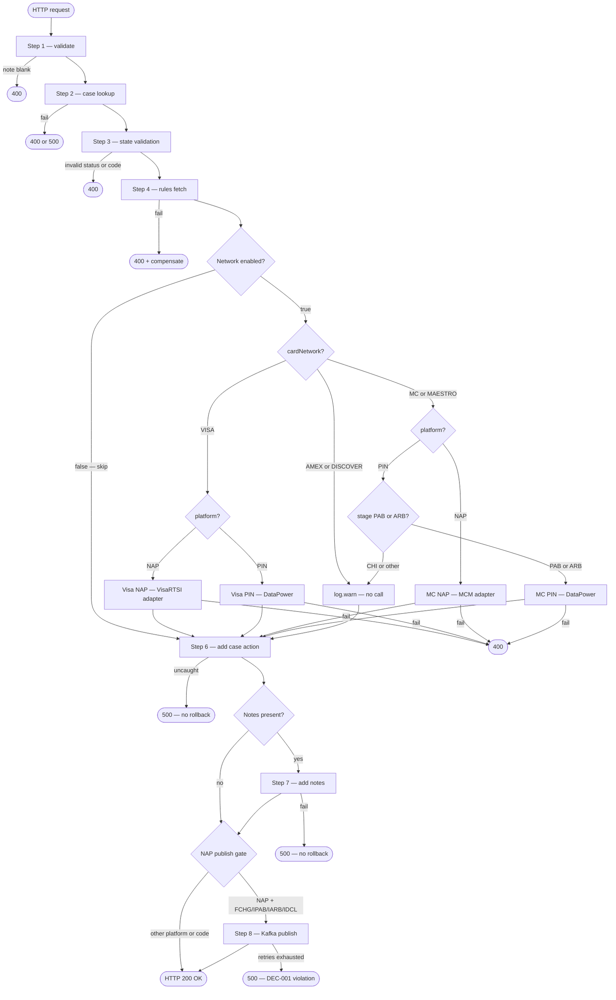

# WDP-COMP-19-ACCEPT-SERVICE
**Worldpay Dispute Platform — Component Reference**
*Version: 1.0 DRAFT | April 2026*
*Extracted from: mdva-gcp-disputes-accept-service using GitHub Copilot CLI | Architect-confirmed: PENDING*

---

## ━━━ CORE SKELETON ━━━━━━━━━━━━━━━━━━━━━━━━━━━━━━━━━━━━━━

## Identity

| Field             | Value |
|-------------------|-------|
| **Name**          | `AcceptService` |
| **Type**          | `REST API + Kafka Producer` |
| **Repository**    | `mdva-gcp-disputes-accept-service` |
| **Status**        | `✅ Production` |
| **Doc status**    | `📝 DRAFT` |
| **Sections present** | `Core | Block A | Block C` |

---

## Purpose

**What it does**

AcceptService processes a merchant's decision to accept a card-network
dispute. It exposes a single REST endpoint that receives the accept
instruction, validates case eligibility, fetches accept-specific rules,
optionally calls the relevant card-network acceptance API, records the
resulting case action via the internal case action service, and — for
NAP-platform disputes with a recognised action code — publishes a Kafka
event to `internal-integration-events` so that the NAP Outcome Processor
can forward the acceptance decision to NAP-DPS.

Card-network routing is code-defined and platform-driven. NAP disputes
route through internal adapter services (VisaRTSI adapter and MCM
adapter). PIN disputes route through DataPower gateway URLs. AMEX and
DISCOVER are defined as constants but appear in no routing branch —
those disputes fall through to a log.warn with no network notification.

The component is entirely stateless. It holds no database, no
JPA/Hibernate, and no repository beans. All persistence — case lookup,
action creation, error recording, and notes — is delegated to downstream
internal services via synchronous REST calls. Two distinct REST invokers
are used: RestInvoker passes the inbound Bearer JWT for internal service
calls; ExternalRestInvoker uses a vantive licence header for card-network
adapter calls.

The Kafka publish is synchronous (blocking `.get()`) with
`ENABLE_IDEMPOTENCE_CONFIG = true` and Spring Retry `@Retryable`. If all
retries are exhausted the HTTP response fails with 500. At that point the
case action has already been committed downstream — there is no rollback.

**What it does NOT do**

- Does not persist any database state — no DataSource, JPA, JDBC, or
  repository beans present
- Does not consume from any Kafka topic — no listener or consumer group
- Does not call Visa or Mastercard APIs directly — routes through adapter
  services (NAP) or DataPower (PIN)
- Does not call CaseManagementService or CaseActionService by name —
  calls URL config keys resolved at deployment time
- Does not perform case-level authorisation — no UAMS/CHAS call; relies
  on JWT validation by Spring Security; authorizeUser method exists in
  RestInvoker but is not called from any flow path
- Does not route AMEX or DISCOVER disputes to a network API — both fall
  through to a log.warn no-op (dead code paths)
- Does not use a transactional outbox — Kafka publish is a direct
  synchronous call with no intermediate database write (DEC-001 deviation)
- Does not implement idempotency — no duplicate detection on repeated
  accept requests for the same case
- Does not publish to any Kafka topic other than `${kafka_nap_topic}`
- Does not call the BusinessRulesProcessor or BRE — fetches accept-
  specific rules from a DisputeRules endpoint directly

---

## Internal Processing Flow



---

## Boundaries

### Inbound Interfaces

| Source | Protocol | Endpoint / Topic / Trigger | Payload / Description |
|--------|----------|----------------------------|-----------------------|
| Merchant Portal (NAP) | REST | `POST /merchant/gcp/accept/{platform}/{caseNumber}/accept?actionSequence=X` | AcceptRequest body + Bearer JWT |
| PIN Portal (inferred) | REST | Same endpoint — platform=PIN path | AcceptRequest body + Bearer JWT |
| API Gateway (COMP-01) | REST | Routes all inbound to above | JWT propagated |

### Outbound Interfaces

| Target | Protocol | Endpoint / Topic / Resource | Purpose | On failure |
|--------|----------|-----------------------------|---------|------------|
| Case Lookup Service | REST (RestInvoker + JWT) | `GET ${case_lookup_url}/{platform}?caseNumber=X&actionSequence=Y` | Retrieve case + action details — Step 2 | 500 or 400 to caller |
| Dispute Rules Service | REST (RestInvoker + JWT) | `POST ${gcp_respond_new_case_action_rules_url}` | Fetch accept eligibility rules — Step 4 | updateAction then 400 |
| Accept Item Type Rules | REST (RestInvoker + JWT) | `GET ${gcp_rule_accept_type_url}` | Fetch Visa accept item type — Step 5a/5b | updateAction + addErrorNotes + 400 |
| Visa HyperSearch — NAP adapter | REST (ExternalRestInvoker + vantive) | `POST ${hyper_search_adapter_url}` | Retrieve Visa dispute IDs — Step 5a | updateAction + addErrorNotes + 400 |
| Visa Accept Adapter — NAP | REST (ExternalRestInvoker + vantive) | `POST ${gcp_visa_accept_adapter_url}` | Submit Visa acceptance — Step 5a | updateAction + addErrorNotes + 400 |
| Visa HyperSearch — PIN DataPower | REST (ExternalRestInvoker + vantive) | `POST ${hyper_search_url}` | Retrieve Visa dispute IDs — Step 5b | updateAction + addErrorNotes + 400 |
| Visa Accept — PIN DataPower | REST (ExternalRestInvoker + vantive) | `POST ${gcp_visa_accept_url}` | Submit Visa acceptance via DataPower — Step 5b | updateAction + addErrorNotes + 400 |
| MCM Claim Retrieve — NAP | REST (ExternalRestInvoker + vantive) | `GET ${gcp_mastercard_base_url}/v6/claims/{claimId}` | Retrieve MC claim ID — Step 5c | updateAction + addErrorNotes + 500 |
| MCM Case Accept — NAP | REST (ExternalRestInvoker + vantive) | `PUT ${gcp_mastercard_base_url}/v6/cases/{caseId}` | Submit MC acceptance via MCM adapter — Step 5c | updateAction + addErrorNotes + 500 |
| MC Claim Retrieve — PIN DataPower | REST (ExternalRestInvoker + vantive) | `GET ${mastercard_retrieve_claim_datapower_url}/{claimId}` | Retrieve MC claim ID — Step 5d | updateAction + addErrorNotes + 400/500 |
| MC Case Accept — PIN DataPower | REST (ExternalRestInvoker + vantive) | `PUT ${mastercard_update_casefiling_datapower_url}` | Submit MC acceptance via DataPower — Step 5d | updateAction + addErrorNotes + 400/500 |
| Case Action Add Service | REST (RestInvoker + JWT) | `POST ${gcp_case_action_add_url}` | Create accept case action — Step 6 | 500 — no catch, no rollback |
| Case Action Update Service | REST (RestInvoker + JWT) | `PUT ${gcp_case_action_update_url}` | Set existing action to ERROR (compensation only) | Not re-caught |
| Notes Service | REST (RestInvoker + JWT) | `POST ${gcp_notes_add_url}` | Attach user or error notes — Step 7 | 500 — no catch |
| `${kafka_nap_topic}` | Kafka SASL_SSL + AWS IAM | `${kafka_nap_topic}` | Publish AcceptEvent for NAP disputes — Step 8 | Spring Retry then 500 — case action already committed |

---

## Database Ownership

### Tables Owned

This component owns no database state. It is fully stateless — no
DataSource, JPA/Hibernate, JDBC, or repository beans are present. All
persistence is delegated via REST calls to downstream services.

### Tables Read

This component reads no database tables directly. All data retrieval is
via synchronous REST calls to downstream services.

---

## Key Architectural Decisions

| Decision | Description | Severity |
|----------|-------------|----------|
| DEC-001 DEVIATION | No transactional outbox. Kafka publish is a direct synchronous `.get()` call after `addCaseAction` completes. If Kafka fails after case action commits, the case action is recorded but `internal-integration-events` consumers are not notified — state is permanently inconsistent with no compensating transaction. | 🔴 HIGH |
| DEC-003 DEVIATION | Kafka partition key is `caseNumber` (from `AddActionResponse.caseNumber`), not `merchantId`. `merchantId` is present in `CaseLookupResponse` but never populated into `AcceptEvent`. No documented reason in source. | 🟡 MEDIUM |
| DEC-004 N/A | AcceptService does not handle PAN data. `CaseLookupResponse` includes `cardNumberLast4` (last 4 digits only — not persisted). No full PAN fields anywhere in the codebase. | ✅ N/A |
| DEC-005 N/A | Kafka Producer only. No `@KafkaListener`, no listener factory, no consumer group. DEC-005 offset commit strategy does not apply. | ✅ N/A |
| DEC-014 DEVIATION | Resilience4j absent — confirmed. `io.github.resilience4j` not in pom.xml. No circuit breaker on any of the 11+ outbound REST calls. Platform-wide pattern confirmed. | 🟡 MEDIUM |
| RISK — No REST timeouts | `CommonConfig` creates `new RestTemplate()` with no connection or read timeout configured. Any hanging downstream call blocks the request thread indefinitely. 11+ sequential REST calls are made per request on the full NAP path. | 🔴 HIGH |
| RISK — No idempotency | No duplicate detection. A repeated accept on the same caseNumber + actionSequence re-executes the full flow — repeats the network call, adds a second case action, and (for NAP) publishes a second Kafka message. Partial guard only: if prior accept changed case status out of OPEN/AUTOACP/ERROR, Step 3 rejects the repeat. | 🟡 MEDIUM |
| RISK — Kafka publish failure leaves inconsistent state | HTTP 500 informs caller, but case action is already committed and notes may already be added. NAP Outcome Processor will not be notified of the acceptance. Direct consequence of DEC-001 deviation. | 🔴 HIGH |
| RISK — Error Log Service fully commented out | `ErrorLogServiceImpl` is fully implemented and wired, but all `saveErrorLog(...)` calls across VisaRTSIServiceImpl, MasterCardServiceImpl, and CaseServiceImpl are commented out. No error events are forwarded to the error log service at any call site. Reason not documented in source. | 🟡 MEDIUM |
| RISK — AMEX/DISCOVER dead code paths | AMEX and DISCOVER defined as constants but appear in no routing branch. Disputes with those card networks receive no network notification — log.warn only. Case action is still added. Merchants cannot see that the network was not notified. | 🟡 MEDIUM |
| RISK — spring-boot-devtools in pom.xml | Development dependency included. No confirmed exclusion from production builds in source. | 🟡 MEDIUM |
| INCOMPLETE — writeOffAmount / ctmAmount features | `AcceptEvent` fields `writeOffAmount`, `ctmAmount`, `userId` are commented out of the Kafka payload mapping. Corresponding `AcceptRequest` fields are commented out of the request model. `AmountCalculationUtil` compiled but never called. Features were planned but never activated. | 🟡 MEDIUM |

---

## Scaling and Deployment

| Property | Value | Source |
|----------|-------|--------|
| Kubernetes resource type | Deployment | resources.yaml |
| API version | `{{ deploymentApiVersion }}` | XL Deploy placeholder |
| Replica count | `{{ replicas-gcp-disputes-accept-service }}` | XL Deploy placeholder |
| Memory limit | 2048Mi | resources.yaml |
| Memory request | 512Mi | resources.yaml |
| CPU limit | Not configured | Absent from resources.yaml |
| CPU request | Not configured | Absent from resources.yaml |
| HPA | Absent | No HorizontalPodAutoscaler resource |
| Rolling update strategy | RollingUpdate — maxSurge: 1, maxUnavailable: 0 | resources.yaml |
| PodDisruptionBudget | Absent | Not present |
| minReadySeconds | 30 | resources.yaml |
| Topology spread | Present — maxSkew: 1, whenUnsatisfiable: ScheduleAnyway, topologyKey: kubernetes.io/hostname | resources.yaml |
| Topology spread label | `app: mdvs-gcp-disputes-accept-service${BRANCH_NAME_PLACEHOLDER}` | ✅ Matches pod label — no mismatch |
| OTel agent | Present — opentelemetry-operator-system/default | resources.yaml annotation |
| Actuator endpoints | info, health, prometheus | application.yaml |
| Liveness probe | `GET /merchant/gcp/accept/liver` port 8082 | resources.yaml |
| Readiness probe | `GET /merchant/gcp/accept/ready` port 8082 | resources.yaml |
| Logstash | Logstash Logback Encoder 7.4 — configured | pom.xml + application.yaml |
| Service type | ClusterIP | resources.yaml |
| Ingress | nginx — CORS enabled, multiple hostnames (external, internal, WDP, reverse proxy) | resources.yaml |

---

## Incomplete and Planned Work

| Item | Type | Detail |
|------|------|--------|
| Error Log Service — all call sites commented out | Deliberate disablement | `saveErrorLog(...)` calls commented out in VisaRTSIServiceImpl, MasterCardServiceImpl, CaseServiceImpl. `ErrorLogServiceImpl` fully implemented but never invoked. Reason not in source. `${gcp_api_error_log_url}` configured but never called at runtime. |
| AcceptEvent financial fields inactive | Incomplete feature | `writeOffAmount`, `ctmAmount`, `userId` commented out of AcceptEvent mapping. `writeOffAmount`, `ctmAmount`, `writeOffDirection`, `writeOffReason` commented out of AcceptRequest model. `AmountCalculationUtil` compiled but never called. |
| spring-boot-devtools in pom.xml | Environment risk | Development dependency — confirm excluded from production packaging. |
| spring-boot-starter-oauth2-client present but unused | Unused dependency | OAuth2 client registration wdp-internal-auth present; OAuth2AuthorizedClientManager beans in OAuthConfigUtils unused in actual request flows. RestTemplate uses JWT pass-through instead. |
| `ACCEPT_RESPONSE_TYPE` constant duplicated | Code artefact | ApplicationConstants.java contains a duplicate declaration — likely a merge artefact. Compiles to version 1.4.7 correctly. |
| TODO in GlobalExceptionHandler | Open item | `StandardError error = new StandardError(e.getMessage(), ApplicationConstants.METHOD_NOT_ALLOWED); // TODO` |
| Visa/DataPower URLs configured on NAP-only environments | Dead config | `${gcp_visa_accept_url}` and `${hyper_search_url}` (DataPower PIN URLs) configured but never triggered on NAP-only environments. |

---

## Open Questions

| ID | Question | How to Resolve |
|----|----------|----------------|
| OQ-1 | Actual literal topic name for `${kafka_nap_topic}` — is this `internal-integration-events`? | Confirm from deployment environment config or team |
| OQ-2 | Actual replica count and deploymentApiVersion values — XL Deploy placeholders | Check XL Deploy / Deploy.it manifests |
| OQ-3 | Exact internal service names behind URL config keys (`${case_lookup_url}`, `${gcp_respond_new_case_action_rules_url}`, `${gcp_case_action_add_url}`) — which WDP components do these map to? | Confirm from environment config or team |
| OQ-4 | Why is `caseNumber` used as Kafka partition key instead of `merchantId` (DEC-003)? — no documented reason in source | Architect decision required — ADR candidate |
| OQ-5 | Why are all `errorLogService.saveErrorLog` calls commented out? — intentional? temporary? awaiting replacement? | Team confirmation required |
| OQ-6 | Is AMEX/DISCOVER exclusion from network routing intentional scope limitation or a gap? | Team confirmation required |
| OQ-7 | Is spring-boot-devtools excluded from production packaging? | Confirm at build pipeline level |
| OQ-8 | Known callers — confirm which portals and services call this endpoint | Not determinable from source alone |

---

---

## ━━━ TYPE BLOCK A — REST API CONTRACTS ━━━━━━━━━━━━━━━━━━━━━

## REST API Contracts

**Framework:** Spring Boot 3.5.3 / Java 17
**Context path:** `/merchant/gcp/accept`
**Auth model:** OAuth2 Resource Server (spring-boot-starter-oauth2-resource-server). Bearer JWT required — validated against `${jwt_trusted_issuer_urls}` (multi-value). Case-level authorisation NOT enforced — no UAMS/CHAS call. JWT passed through to downstream internal service calls via RestInvoker.

---

### Endpoint: Accept Dispute

| Parameter | Value |
|-----------|-------|
| **Method** | `POST` |
| **Path** | `/{platform}/{caseNumber}/accept?actionSequence={actionSequence}` |
| **Full path** | `POST /merchant/gcp/accept/{platform}/{caseNumber}/accept?actionSequence={actionSequence}` |
| **Auth** | Bearer JWT — OAuth2 Resource Server. Case-level auth delegated to downstream. |
| **Known callers** | Merchant Portal (NAP), PIN Portal — ⚠️ not confirmed from source alone |

**Request Fields**

| Field | Location | Type | Required | Description |
|-------|----------|------|----------|-------------|
| `platform` | Path variable | String | Yes | Platform — e.g. `NAP`, `PIN`. Controls adapter vs DataPower routing and Kafka publish eligibility. |
| `caseNumber` | Path variable | String | Yes | Dispute case number — `@NotBlank` |
| `actionSequence` | Query param | String | Yes | Current action sequence — e.g. `"01"` |
| `userId` | Request body | String | Yes | `@NotBlank` — user performing the accept |
| `expiryFlow` | Request body | Boolean | No (default: `false`) | If `true`, overrides first action code to `EACP` for Visa mapping |
| `isNetworkEnabled` | Request body | Boolean | No (default: `true`) | If `false`, skips card network call entirely — all other steps still execute |
| `notes` | Request body | `List<Notes>` | No | Optional notes list |
| `notes[].noteType` | Request body | String | No (default: `NOTE`) | Enum: ANOTE, FRMRCH, MNOTE, QNOTE, JOMRCH, TONETW, UNOTE, USER1-4, XDISCA, XDISCE, XDISCM |
| `notes[].text` | Request body | String | Required if notes present | Max 750 chars — must not be blank |
| `v-correlation-id` | Request header | String | No | Correlation ID — generated if absent |

**Success Response — HTTP 200 OK**

```json
{ "newActionSequence": "02" }
```

| Field | Type | Description |
|-------|------|-------------|
| `newActionSequence` | String | Sequence number of the newly created case action |

**HTTP Status Codes**

| Code | Condition |
|------|-----------|
| `200 OK` | Accept flow completed successfully |
| `400 Bad Request` | Note text blank; caseStatus or actionStatus not in {OPEN, AUTOACP, ERROR}; stageCode + actionCode invalid combination; rules service 404; rules response empty; Visa status code not `>= I-300000000`; MC accept response contains errors; MC case filing not found; amount mismatch |
| `401 Unauthorized` | JWT absent, invalid, or from untrusted issuer |
| `404 Not Found` | No handler for path — framework level only |
| `405 Method Not Allowed` | Wrong HTTP method used |
| `500 Internal Server Error` | External REST call failure; Kafka publish failure after all retries; uncaught exception in addCaseAction or addNotes |

**Error Response Body**

```json
{
  "errors": [
    {
      "errorMessage": "Case is not in valid state to be accepted",
      "target": "stageCode:CH2"
    }
  ]
}
```

| Field | Type | Description |
|-------|------|-------------|
| `errors` | Array | List of error entries |
| `errors[].errorMessage` | String | Human-readable error description |
| `errors[].target` | String | Field, value, or system that caused the error |

**Stage / ActionCode Validation Matrix** (applied locally in Step 3 before rules fetch)

| Network | stageCode | Permitted actionCodes |
|---------|-----------|----------------------|
| VISA | CH1 | FCHG, CHGM, WDNL |
| VISA | PAB | IDCL, IPAB, CHGM |
| VISA | APC | CHGM, POMP, WDNL |
| MASTERCARD / MAESTRO | CH1 | FCHG, CHGM, WDNL |
| MASTERCARD / MAESTRO | PAB | WDNL, IPAB, CHGM |
| MASTERCARD / MAESTRO | ARB | IARB, CHGM |
| OTHER | CH1 | FCHG, CHGM, WDNL |
| OTHER | CH2 | SCHG, CHGM, WDNL |
| OTHER | PAB | IDCL, CHGM, IPAB, WDNL |
| OTHER | ARB | IARB, CHGM |
| OTHER | REQ | RREQ |

**Notes:**
- `isNetworkEnabled=false` is a runtime bypass toggle — not a feature flag framework.
  The full processing chain (case lookup, rules, add action, notes, Kafka publish) still executes.
- `expiryFlow=true` overrides the first action code to `EACP` in Visa accept item type mapping.
- The `authorizeUser` method in RestInvoker exists but is never called in any AcceptService flow.
  Case-level auth is entirely absent from this component.
- For MC PAB/ARB on PIN platform, the stage gate sits inside `MasterCardServiceImpl.accept` —
  CHI stage causes the method to return without a network call.

---

---

## ━━━ TYPE BLOCK C — KAFKA PRODUCER CONTRACTS ━━━━━━━━━━━━━━

## Kafka Producer Contracts

**Producer framework:** Spring Kafka `KafkaTemplate`
**Idempotent producer:** Yes — `ENABLE_IDEMPOTENCE_CONFIG = true`; `MAX_IN_FLIGHT_REQUESTS_PER_CONNECTION = 1`
**Publish mode:** Synchronous (blocking `.get()`) — calling thread blocks until broker ACK
**Retry on publish failure:** Yes — Spring Retry `@Retryable`; count = `${kafka_retry_count}`; delay = `${kafka_retry_delay}` ms; `@Recover` logs and re-throws `WebServiceException` (HTTP 500 to caller)

---

### Topic: `${kafka_nap_topic}` (maps to `internal-integration-events`)

| Parameter | Value |
|-----------|-------|
| **Topic name** | `${kafka_nap_topic}` — injected via `@Value("${kafka.nap-topic}")`. Literal name not visible in source — resolved at deployment time. Known from WDP-KAFKA.md to be `internal-integration-events`. ⚠️ Confirm literal name — OQ-1. |
| **Message key** | `caseNumber` — ⚠️ **DEC-003 deviation** — not `merchantId`. Derived from `AddActionResponse.caseNumber`. |
| **Ordering guarantee** | Per partition by caseNumber |
| **Published on** | Step 8 — after addCaseAction and addNotes complete — conditional on **both**: (1) `platform == "NAP"` (case-insensitive) AND (2) `actionCode ∈ {FCHG, IPAB, IARB, IDCL}` |
| **Not published when** | platform = PIN; or platform = NAP with actionCode ∈ {CHGM, WDNL, EACP, POMP, SCHG, RREQ, or any other non-listed code} |
| **Consumed by** | COMP-39 NAPOutcomeProcessor, COMP-40 VisaResponseQuestionnaire |

**Message payload structure — AcceptEvent**

| Field | Type | Description |
|-------|------|-------------|
| `caseNumber` | String | WDP internal case number — also the Kafka partition key |
| `actionSequences` | `List<String>` | New action sequence(s) created by this accept |
| `currentActionSequence` | `List<String>` | Original action sequence from the inbound request |
| `platform` | String | Platform identifier — always `"NAP"` when published |
| `networkCaseId` | String | Card network case ID from CaseLookup |

**Commented-out fields** (declared in model — excluded from all mapping):

| Field | Type | Status |
|-------|------|--------|
| `writeOffAmount` | BigDecimal | Inactive — feature not completed |
| `ctmAmount` | BigDecimal | Inactive — feature not completed |
| `userId` | String | Inactive — feature not completed |

**Payload notes:**
- Publish is conditional — PIN platform disputes NEVER trigger a publish.
- `platform` field in the published event will always be `"NAP"`.
- `writeOffAmount`, `ctmAmount`, `userId` are null on all published events.
  Consumers of `internal-integration-events` must not depend on these fields.
- ⚠️ **DEC-001 deviation** — no transactional outbox. If all Kafka retries are
  exhausted, the case action is already committed in the downstream service with
  no compensating rollback. The HTTP 500 informs the caller but does not undo
  the case action. State is permanently inconsistent for that event.

---

*End of component file.*
*File status: 📝 DRAFT — pending architect confirmation.*
*After confirmation: update WDP-COMP-INDEX.md (COMP-19 status → 📝 DRAFT),*
*WDP-KAFKA.md (enrich internal-integration-events row — resolve ⚠️ TBC for COMP-19 partition key → confirmed caseNumber + DEC-003 deviation),*
*WDP-DB.md (add COMP-19 stateless entry),*
*WDP-HANDOVER.md (resolve internal-integration-events partition key open question — RESOLVED: caseNumber, DEC-003 deviation confirmed).*
