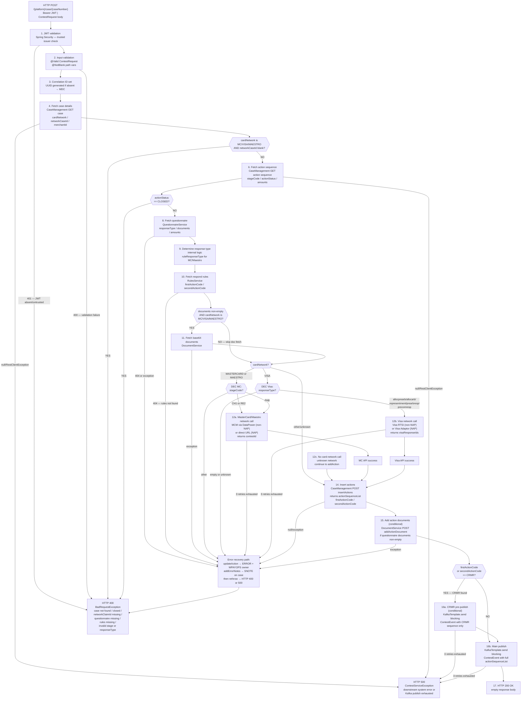

# WDP-COMP-20-CONTEST-SERVICE
**Worldpay Dispute Platform — Component Reference**
*Version: 1.0 DRAFT | April 2026*
*Extracted from: gcp-disputes-contest-service (dispute-contest-service v1.6.6) using GitHub Copilot CLI | Architect-confirmed: PENDING*

---

## ━━━ CORE SKELETON ━━━━━━━━━━━━━━━━━━━━━━━━━━━━━━━━━━━━━━

---

## Identity

| Field | Value |
|---|---|
| **Name** | `ContestService` |
| **Type** | `REST API + Kafka Producer` |
| **Repository** | `gcp-disputes-contest-service` |
| **Status** | `✅ Production` |
| **Doc status** | `📝 DRAFT` |
| **Sections present** | `Core | Block A — REST | Block C — Producer` |

---

## Purpose

**What it does**

ContestService orchestrates the end-to-end processing of merchant decisions to contest a chargeback dispute. It accepts a single authenticated REST request, executes a sequential chain of internal WDP service calls to validate the case state and enrich data with questionnaire and rules lookups, then routes to either the Visa RTSI/Adaptor or MasterCard/Maestro MCM card-network API depending on the `cardNetwork` value from the case. After the card-network call, it records the new action set in Case Management and publishes a `ContestEvent` to a Kafka topic for downstream consumers.

The service is fully stateless — it owns no database tables and performs no direct persistence. All case state is read from and written to downstream WDP services via REST. The service acts purely as an orchestration layer that sequences and correlates calls across CaseManagement, QuestionnaireService, RulesService, DocumentService, the card-network adapter, and the Kafka bus.

Visa contest events and MasterCard/Maestro contest events are published to the same `internal-integration-events` Kafka topic using the same `ContestEvent` schema. There is no type discriminator field — consumers distinguish the network by reading the `responseType` field (Visa-specific values vs `NON_VISA_REPRESENTMENT` constant) and the `visaResponseIds` field (null for non-Visa).

For cases where the response rules return a CRMR action code, up to three Kafka publishes occur per request: a CRMR pre-publish (for the CRMR action sequence only), followed by the main publish (full action sequence list). This sequence is required to ensure downstream consumers process CRMR actions before the main contest event.

**What it does NOT do**

- Does not own or write to any database table — it is completely stateless at the persistence layer
- Does not use the transactional outbox pattern — Kafka is published directly within the HTTP request handler (⚠️ DEC-001 deviation — see Deviation Flags)
- Does not perform PAN encryption or handle any PAN data — no card number flows through this component
- Does not consume from any Kafka topic — producer only
- Does not implement Resilience4j circuit breakers on any outbound call (⚠️ DEC-014 deviation)
- Does not handle NAP-only dispute routing — it processes all platforms (CORE, NAP, PIN, VAP, LATAM) through the same endpoint, routing to the appropriate card-network API based on case data
- Does not call BusinessRulesService (COMP-31) or BusinessRulesProcessor (COMP-16) — it calls RulesService (COMP-32) for respond-rules lookup only
- Does not log structured errors to ErrorLogService — those call sites are commented out; error notes are written via `disputeService.addErrorNotes()` instead

---

## Internal Processing Flow



---

## Boundaries

### Inbound Interfaces

| Source | Protocol | Endpoint / Topic / Trigger | Payload / Description |
|--------|----------|----------------------------|-----------------------|
| WDP Merchant Portal (COMP-49) | REST | `POST /merchant/gcp/contest/{platform}/case/{caseNumber}` | JWT-authenticated contest request with `actionSequence` and `userId` |
| WDP Ops Portal (COMP-50) | REST | `POST /merchant/gcp/contest/{platform}/case/{caseNumber}` | Same contract — ops-initiated contest |
| Automated workflow / orchestration services | REST | `POST /merchant/gcp/contest/{platform}/case/{caseNumber}` | No `@KnownCallers` annotation present — callers inferred from platform role |

### Outbound Interfaces

| Target | Protocol | Endpoint / Topic / Resource | Purpose | On failure |
|--------|-----------|-----------------------------|---------|------------|
| CaseManagement (COMP-23) | HTTPS REST | `GET ${case_get_url}` | Fetch case details — step 4 | ContestServiceException → HTTP 500; no retry |
| CaseManagement (COMP-23) | HTTPS REST | `GET ${action_sequence_get_url}` | Fetch action sequence — step 6 | ContestServiceException → HTTP 500; no retry |
| QuestionnaireService (COMP-26) | HTTPS REST | `GET ${questionnaire_base_url}` | Fetch questionnaire — step 8 | updateAction ERROR + addErrorNotes → HTTP 400 |
| RulesService (COMP-32) | HTTPS REST | `GET ${respond_rule_url}` | Fetch respond rules — step 10 | updateAction ERROR + addErrorNotes → HTTP 400 |
| DocumentService (COMP-37) | HTTPS REST | `GET ${base64_document_url}` | Fetch base64 documents — step 11 (conditional) | updateAction ERROR + addErrorNotes → HTTP 400 |
| MCM via DataPower (non-NAP) | HTTPS REST multipart | `${mcm_chargeback_datapower_url}`, `${mcm_retrieve_claim_datapower_url}`, `${mcm_update-casefiling-datapower-url}` | MasterCard/Maestro network contest — step 12 | Spring Retry 3 attempts; then updateAction ERROR → HTTP 500 |
| MCM direct (NAP) | HTTPS REST multipart | `${mcm_chargeback_url}`, `${mcm_retrieve-claim-url}`, `${mcm_update-casefiling-url}` | MasterCard/Maestro network contest — NAP path — step 12 | Same as above |
| Visa RTSI (non-NAP) | HTTPS REST multipart | `${visa_rtsi_service_url}` | Visa card-network contest — step 13 | Spring Retry 3 attempts; then updateAction ERROR → HTTP 400 |
| Visa Adaptor (NAP) | HTTPS REST multipart | `${visa_adaptor_service_url}` | Visa card-network contest — NAP path — step 13 | Spring Retry 3 attempts; then updateAction ERROR → HTTP 400 |
| CaseManagement (COMP-23) | HTTPS REST | `POST ${insertAction_url}` | Insert contest actions — step 14 | updateAction ERROR + addErrorNotes → rethrow |
| CaseManagement (COMP-23) | HTTPS REST | `PUT ${update_action_url}` | Set action status ERROR on failure — error recovery | No further retry |
| CaseManagement (COMP-23) | HTTPS REST | `POST ${add-note-url}` | Write SNOTE error note — error recovery | No further retry |
| DocumentService (COMP-37) | HTTPS REST | `POST ${add_action_document_url}` | Attach documents to action — step 15 (conditional) | addErrorNotes → rethrow |
| IdP / Token Server (COMP-36) | HTTPS OAuth2 | `${idp_token_url}` — client credentials | Outbound bearer token for all WDP REST calls | Exception propagates → HTTP 500 |
| AWS MSK Kafka | SASL SSL / AWS IAM | `${kafka_topic}` (internal-integration-events) | Publish ContestEvent — step 16 | Spring Retry 3 attempts; then addErrorNotes → HTTP 500. No DLQ. No outbox fallback. |

---

## Database Ownership

### Tables Owned (written by this component)

This component owns no database state. It is completely stateless at the persistence layer. `pom.xml` contains no JDBC, JPA, Hibernate, or Spring Data dependency. No `DataSource` or `EntityManager` bean exists in the application context. Confirmed by Copilot from source.

### Tables Read (not owned by this component)

This component performs no direct database reads. All case and dispute data is fetched via REST from CaseManagement (COMP-23) and related services.

---

## Architecture Risks and Notes

| Risk | Severity | Detail |
|------|----------|--------|
| No transactional outbox — DEC-001 deviation | ⚠️ HIGH | Kafka publish occurs directly in the HTTP request handler after case actions have been inserted in CaseManagement. If Kafka publish fails after all retries are exhausted, the actions are permanently committed in Case Management but no `ContestEvent` is delivered. NAPOutcomeProcessor (COMP-39) and VisaResponseQuestionnaire (COMP-40) will never receive the event. Manual recovery or replay is required. |
| No idempotency mechanism | ⚠️ MEDIUM | A replayed POST request re-executes the full chain: re-calls the card-network API, inserts another action, and publishes another Kafka event. The only partial guard is the action-status CLOSED check — which only applies if a prior run completed fully. |
| No RestTemplate timeouts | ⚠️ MEDIUM | `RestTemplate` is created with no explicit connection or read timeout. All outbound REST calls rely on OS-level TCP timeouts (effectively infinite). A hung downstream service will block the HTTP request thread indefinitely. |
| ErrorLogService commented out | ℹ️ LOW | The `ErrorLogService` bean, its implementation, and its URL config (`${case.errorlog-url}`) are all wired up but the call sites are commented out throughout `ContestServiceImpl`. The property must still be provided in the environment or the application will fail to start. A dead configuration dependency. |
| Commented-out CAD/USD currency logic (US2159614) | ℹ️ LOW | Conditional currency selection based on reason code prefix was deliberately removed. `disputeCurrency` is now passed unconditionally. Regression from user story US2159614. |

---

## ━━━ TYPE BLOCK A — REST API CONTRACTS ━━━━━━━━━━━━━━━━━━

---

## REST API Contracts

**Framework:** Spring MVC — single `@RestController`
**Context path:** `/merchant/gcp/contest`
**Auth model:** OAuth2 JWT Bearer token (OAuth2 Resource Server). Trusted issuers configured via `${jwt_trusted_issuer_urls}` (multi-value list). Spring Security validates JWT before the handler is reached.
**Unauthenticated endpoints:** `/actuator/health`, `/lives`, `/readyz` in production; Swagger UI also unauthenticated in non-prod.

**Error body structure (all errors):**

```json
{
  "errors": [
    {
      "errorMessage": "<human-readable message>",
      "target": "<caseNumber with actionSequence>"
    }
  ]
}
```

---

### Endpoint: `POST /{platform}/case/{caseNumber}`

**Full path:** `POST /merchant/gcp/contest/{platform}/case/{caseNumber}`

#### Path Parameters

| Parameter | Type | Required | Validation | Description |
|-----------|------|----------|------------|-------------|
| `platform` | String | Yes | `@NotBlank` | Source system — `nap`, `core`, `pin`, `vap`, `latam` (case-insensitive) |
| `caseNumber` | String | Yes | `@NotBlank` | WDP case identifier |

#### Request Headers

| Header | Required | Description |
|--------|----------|-------------|
| `Authorization` | Yes | Bearer JWT — OAuth2 token from trusted issuer |
| `v-correlation-id` | No | Correlation ID — UUID auto-generated if absent |
| `Content-Type` | Yes | `application/json` |

#### Request Body

```json
{
  "actionSequence": "48",
  "userId": "user123"
}
```

| Field | Type | Required | Validation | Description |
|-------|------|----------|------------|-------------|
| `actionSequence` | String | Yes | Pattern `^(0?[1-9]\|[1-9][0-9])$`, `@NotBlank` | Action sequence number 01–99 |
| `userId` | String | Yes | Max 50 chars, `@NotBlank` | Operator user ID initiating the contest |

#### Success Response

`HTTP 200 OK` — empty body

#### HTTP Status Codes

| Status | Trigger |
|--------|---------|
| `200 OK` | Contest processed successfully — actions inserted, Kafka published |
| `400 Bad Request` | `BadRequestException` — case not found, action sequence closed, networkCaseId missing for MC/VISA/MAESTRO, questionnaire not found, rules not found, invalid MC stageCode, invalid Visa responseType, empty responseType |
| `400 Bad Request` | `MethodArgumentNotValidException` — `@Valid` failures on request body |
| `400 Bad Request` | `ConstraintViolationException` — path variable constraint failures |
| `400 Bad Request` | `MethodArgumentTypeMismatchException` — type conversion errors |
| `404 Not Found` | `NoHandlerFoundException` — unrecognised path |
| `405 Method Not Allowed` | `HttpRequestMethodNotSupportedException` |
| `401 Unauthorized` | JWT absent or not from a trusted issuer — rejected by Spring Security before handler |
| `500 Internal Server Error` | `RuntimeException`, `ContestServiceException` — downstream system error, Kafka publish exhausted after retries, IdP token failure |
| `500 Internal Server Error` | `HttpMessageNotReadableException` — unreadable request body |

**Notes:**
No idempotency key or `If-Match` mechanism is implemented. Duplicate or replayed requests will re-execute the full processing chain. The `v-correlation-id` header is propagated to all downstream calls via MDC for log correlation but provides no deduplication guarantee.

---

## ━━━ TYPE BLOCK C — KAFKA PRODUCER CONTRACTS ━━━━━━━━━━━━━

---

## Kafka Producer Contracts

**Producer framework:** Spring Kafka `KafkaTemplate`
**Idempotent producer:** Yes — `ENABLE_IDEMPOTENCE_CONFIG = true`, `MAX_IN_FLIGHT_REQUESTS_PER_CONNECTION = 1`
**Publish mode:** Synchronous (blocking) — `kafkaTemplate.send(...).get()` blocks the HTTP request thread until broker acknowledgement
**Retry on publish failure:** Yes — Spring Retry `@Retryable`, 3 attempts, 1000ms fixed delay (configurable via `${kafka_retry_count}` and `${kafka_retry_delay}`)
**Broker:** AWS MSK — SASL SSL with AWS IAM auth (`aws-msk-iam-auth`)
**Outbox pattern:** None — direct publish within HTTP request handler (⚠️ DEC-001 deviation)

---

### Topic: `internal-integration-events`

| Parameter | Value |
|-----------|-------|
| **Topic name** | `${kafka_topic}` — environment variable; exact name is environment-specific, not hardcoded |
| **Message key** | `merchantId` — from `caseResponse.getMerchantId()` |
| **Key serializer** | `StringSerializer` |
| **Value serializer** | `JsonSerializer` (Spring Kafka) |
| **Ordering guarantee** | Per partition — scoped by merchantId (DEC-003 compliant) |
| **Publish mode** | Synchronous (blocking `.get()`) |
| **Published on** | Successful completion of step 14 (actions inserted) and step 15 (docs attached if applicable) |
| **Consumed by** | NAPOutcomeProcessor (COMP-39) — NAP contest events for all networks; VisaResponseQuestionnaire (COMP-40) — Visa contest events for all platforms |

#### ContestEvent Payload Schema

```json
{
  "platform": "nap",
  "caseNumber": "NN234567890",
  "actionSequences": ["49", "50"],
  "userId": "user123",
  "visaResponseIds": ["VISA-12345"],
  "networkCaseId": "MC-NETWORK-001",
  "currentActionSequence": ["48"],
  "responseType": "representment"
}
```

| Field | Type | Description |
|-------|------|-------------|
| `platform` | String | Source system platform value — from path variable |
| `caseNumber` | String | WDP case number — from path variable |
| `actionSequences` | List\<String\> | New action sequences created by addAction. CRMR pre-publish: single-element list. Main publish: full list from `addActionResponse` |
| `userId` | String | Operator ID — from request body |
| `visaResponseIds` | List\<String\> | Visa RTSI response IDs. **null for non-Visa networks** |
| `networkCaseId` | String | Card-network case reference — from case lookup |
| `currentActionSequence` | List\<String\> | Single-element list wrapping the input `actionSequence` |
| `responseType` | String | Questionnaire response type. Visa values: `allocprearb`, `allocarb`, `representment`, `prearbresp`, `precomresp`. MasterCard/Maestro: `NON_VISA_REPRESENTMENT` constant |

#### Network Event Distinction — NAP vs Visa vs MasterCard

There is **no type discriminator field** in `ContestEvent`. All card networks use the same schema on the same topic. Consumers distinguish the network path by:

- `responseType` — Visa-specific string for Visa events; `NON_VISA_REPRESENTMENT` constant for MasterCard/Maestro
- `visaResponseIds` — null for non-Visa; non-null list for Visa events
- There is **no separate MasterCard-specific event category** — the same `ContestEvent` is published regardless of card network

#### CRMR Pre-Publish Behaviour

Up to three Kafka publishes may occur per request, all within `sendUpdateEventToKafka()`, in this order:

1. **CRMR pre-publish** (conditional): if `firstActionCode == "CRMR"` — publishes `ContestEvent` with CRMR sequence as `actionSequences`
2. **CRMR pre-publish** (conditional): else if `secondActionCode == "CRMR"` — same logic using `secondAction`
3. **Main publish** (always): `ContestEvent` with full `actionSequenceList` from `addActionResponse`

#### On Kafka Publish Failure

Spring Retry retries up to 3 times with fixed delay. After exhaustion: `recoverKafka()` throws `ContestServiceException`. The caller catches, calls `disputeService.addErrorNotes()` to write a SNOTE on the case, then rethrows → HTTP 500.

**No dead-letter topic. No database fallback. No outbox.** The actions inserted at step 14 remain committed in CaseManagement with no corresponding downstream event delivered.

---

## Scaling and Deployment

| Property | Value | Source |
|----------|-------|--------|
| **Kubernetes resource type** | Deployment | `resources.yaml:1` |
| **Replica count** | `{{ replicas-mdvs-gcp-dispute$-contest-service }}` — XL Deploy/Helm variable; exact production value not in source | `resources.yaml:63` |
| **Memory limit** | 2048Mi | `resources.yaml:63` |
| **Memory request** | 1024Mi | `resources.yaml:63` |
| **CPU limit** | Not configured — no CPU limits/requests block | `resources.yaml` |
| **CPU request** | Not configured | `resources.yaml` |
| **HPA** | Not configured | `resources.yaml` |
| **Rolling update strategy** | `RollingUpdate` — maxSurge: 1, maxUnavailable: 0 | `resources.yaml:9-15` |
| **PodDisruptionBudget** | Not configured | `resources.yaml` |
| **Topology spread** | Configured — maxSkew: 1, whenUnsatisfiable: ScheduleAnyway, topologyKey: `kubernetes.io/hostname` | `resources.yaml:30-37` |
| **Topology spread label note** | Label selector `app: mdvs-gcp-disputes-contest-service${BRANCH_NAME_PLACEHOLDER}` — matches pod template label for main branch; branch-specific deployments should be verified | `resources.yaml:35-36` |
| **minReadySeconds** | 30 | `resources.yaml:39` |
| **OTel agent** | Yes — `instrumentation.opentelemetry.io/inject-java: opentelemetry-operator-system/default` | `resources.yaml:22` |
| **Spring Actuator** | Exposed — `info`, `health`, `prometheus` | `application.yaml:8-9` |
| **Liveness probe** | `GET /merchant/gcp/contest/liver` port 8082, delay 30s, period 10s, timeout 5s, threshold 3 | `resources.yaml:49-36` |
| **Readiness probe** | `GET /merchant/gcp/contest/readyz` port 8082, delay 20s, period 10s, timeout 5s, threshold 3 | `resources.yaml:40-47` |
| **Logstash** | Logstash encoder via `logstash-logback-encoder 7.4` and `${logstash_server_host_port}` | `application.yaml:91-94`, `pom.xml:65-68` |
| **Container port** | 8082 | `resources.yaml:59` |
| **Service type** | ClusterIP on port 8082 | `resources.yaml:88-93` |
| **Ingress** | Nginx, CORS enabled, 5 host entries (external, internal, WDP external, WDP internal, WDP reverse-proxy) | `resources.yaml:95-175` |

---

## Incomplete and Planned Work

### Commented-Out Code

**ErrorLogService call sites** — `errorLogService.errorLog()` calls are commented out at 6 locations in `ContestServiceImpl`:
- After questionnaire failure (line 251-252)
- After respond-rules failure (line 304-306)
- After MC network call failure (line 350-352)
- After Visa network call failure (line 430-432)
- After add-action failure (line 547-549)
- In `sendUpdateEventToKafka` (line 227-228)

The `ErrorLogService` bean, its implementation (`ErrorLogServiceImpl`), and its URL config (`${case.errorlog-url}`) are all still present and wired in the codebase. The property must be provided in the environment or the application will fail to start. Call sites have been replaced with `disputeService.addErrorNotes()` (SNOTE notes).

**Commented-out CAD/USD currency logic** — In `VisaRTSIServiceImpl.createDisputePreArb` (line 279-293), a block is commented out with user story reference `US2159614`. This block contained conditional CAD vs USD currency selection based on reason code prefix (`"10"` or `"11"`). The replacement is unconditional — `disputeCurrency` is passed in directly regardless of reason code.

### No Unused pom.xml Dependencies

All declared dependencies are confirmed in use. `jasypt.spring.boot.starter.version` is defined in `<properties>` but the artifact is not declared as a dependency — defined but not used.

### Feature Flags

No feature flags found. No flag evaluation library (LaunchDarkly, Unleash, etc.) in `pom.xml`. No feature flag configuration in `application.yaml`. The `spring.profiles.active: ${gcp_env}` profile controls authentication whitelist (prod vs non-prod) but is an environment selector, not a feature flag.

### TODOs / FIXMEs

No `TODO` or `FIXME` comments found in source. User story reference `US2159614` is present as a comment in `VisaRTSIServiceImpl.java`.

### Configured Properties Never Called at Runtime

`${case.errorlog-url}` / `errorlog-url` — injected into `ErrorLogServiceImpl` but the service is never called because all call sites are commented out. The property must still be provided in the environment or the application will fail to start.

---

## Deviation Flags

| Decision | Status | Severity | Detail |
|----------|--------|----------|--------|
| **DEC-001** — Transactional Outbox | ⚠️ NON-COMPLIANT | HIGH | ContestService publishes directly to Kafka within the HTTP request handler (`sendUpdateEventToKafka()`) after case actions are inserted via CaseManagement REST. There is no outbox table write, no scheduler relay. If Kafka publish fails after 3 retries are exhausted, the actions are permanently committed in CaseManagement (step 14) but no `ContestEvent` is delivered. COMP-39 and COMP-40 will never receive the event. No dead-letter store exists. Same pattern confirmed for AcceptService (COMP-19). |
| **DEC-003** — Kafka Partition Key | ✅ COMPLIANT | — | `merchantId` used as Kafka message key (`caseResponse.getMerchantId()`). Consistent with platform standard. |
| **DEC-004** — PAN Encryption | ✅ NOT APPLICABLE | — | ContestService handles no PAN data. No card number, expiry, or PAN-adjacent data in any model class. No EncryptionService call. Confirmed from full model inspection. |
| **DEC-005** — Kafka Offset Commit | ✅ NOT APPLICABLE (producer only) | — | ContestService has no Kafka consumer. On the producer side, `ENABLE_IDEMPOTENCE_CONFIG = true` and `MAX_IN_FLIGHT_REQUESTS_PER_CONNECTION = 1` ensure exactly-once delivery to the broker from the protocol perspective. |
| **DEC-014** — Resilience4j | ⚠️ NON-COMPLIANT | MEDIUM | No Resilience4j dependency in `pom.xml`. No circuit breaker, rate limiter, or bulkhead on any outbound call. The only resilience mechanism is Spring Retry (fixed delay, 3 attempts) on Visa RTSI, MasterCard MCM, and Kafka publish. RestTemplate has no explicit connection or read timeouts — all outbound REST calls rely on OS-level TCP timeouts (effectively infinite). |

---

## Remaining Gaps

| Gap | Type | Action needed |
|-----|------|---------------|
| Exact Kafka topic name for `internal-integration-events` | Environment config | Topic injected via `${kafka_topic}` — exact per-environment value not in source. Confirm the actual topic name matches `internal-integration-events` as documented in WDP-KAFKA.md. Check Kubernetes secret or environment config. |
| Replica count | Environment config | Replica count is `{{ replicas-mdvs-gcp-dispute$-contest-service }}` — XL Deploy/Helm variable. Exact production value not in source. Confirm with infrastructure team. |
| Known callers — formal confirmation | Team confirmation | No `@KnownCallers` annotation in source. Callers inferred from architecture role (portal UIs, automated workflows). Confirm whether any orchestration service or component not currently documented calls this endpoint. |
| DEC-001 risk — accepted or remediation planned? | Architect decision | The direct Kafka publish pattern is confirmed for both ContestService (COMP-20) and AcceptService (COMP-19). Recommend recording a formal ADR when WDP-DECISIONS.md is rebuilt — either accepting the risk with a documented recovery procedure or adding outbox as a future remediation item. |

---

## WDP-KAFKA.md Update Reference

**Section 3 — Topic Registry update for `internal-integration-events`:**

| Topic | Publishers | Consumers | Key | Notes |
|-------|-----------|-----------|-----|-------|
| `internal-integration-events` | AcceptService (COMP-19), ContestService (COMP-20) | NAPOutcomeProcessor (COMP-39), VisaResponseQuestionnaire (COMP-40) | `merchantId` | Single `ContestEvent` schema used for all networks. Network distinguished by `responseType` and `visaResponseIds`. Up to 3 publishes per ContestService request when CRMR action code present. No DLQ. No outbox. |

**Section 4 — Producer/Consumer Map row for COMP-20:**

| Component | Produces to | Consumes from | Notes |
|-----------|------------|---------------|-------|
| COMP-20 ContestService | `internal-integration-events` | None | Direct publish — no outbox. Synchronous blocking. Idempotent producer. Up to 3 events per request (CRMR pre-publish + main). |

---

## Documents Requiring Update

| Document | Update required |
|----------|----------------|
| **WDP-COMP-INDEX.md** | Update COMP-20 doc status from `📋 PENDING` to `📝 DRAFT` |
| **WDP-KAFKA.md** | Add COMP-20 as confirmed publisher to `internal-integration-events` — see WDP-KAFKA.md Update Reference section above |
| **WDP-HANDOVER.md** | Add COMP-20 to DRAFT list; confirm `internal-integration-events` publishers now include COMP-19 + COMP-20 (both confirmed); add ErrorLogService dead-config note |
| **WDP-DECISIONS.md** (when rebuilt) | Record DEC-001 non-compliance for ContestService + AcceptService as a platform-wide pattern; record DEC-014 absence; record no-timeout RestTemplate risk as platform-wide concern |

---

*End of WDP-COMP-20-CONTEST-SERVICE.md*
*File status: 📝 DRAFT — content complete, architect confirmation pending.*
*Remember to update WDP-COMP-INDEX.md, WDP-KAFKA.md, and WDP-HANDOVER.md after confirmation.*
