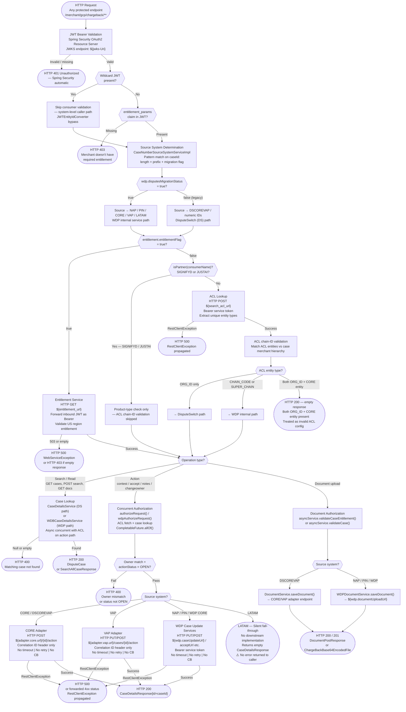

# WDP-COMP-21-CHARGEBACK-SERVICE
**Worldpay Dispute Platform — Component Reference**
*Version: 1.0 DRAFT | April 2026*
*Extracted from: Worldpay/mdvs-gcp-chargeback-service using GitHub Copilot CLI | Architect-confirmed: PENDING*

---

## ━━━ CORE SKELETON ━━━━━━━━━━━━━━━━━━━━━━━━━━━━━━━━━━━━━━
*Mandatory for every component regardless of type.*

---

## Identity

| Field | Value |
|---|---|
| **Name** | `ChargebackService` |
| **Type** | `REST API` |
| **Repository** | `Worldpay/mdvs-gcp-chargeback-service` |
| **Artifact** | `com.wp.gcp:chargeback-service v1.1.8` |
| **Base context path** | `/merchant/gcp/chargeback` |
| **Port** | `8082` |
| **Runtime** | Java 17 / Spring Boot 3.5.8 |
| **Status** | `✅ Production` |
| **Doc status** | `📝 DRAFT` |
| **Sections present** | `Core | Block A — REST` |

---

## Purpose

**What it does**

ChargebackService is the sole externally-exposed WDP REST API and the primary merchant-facing and partner-facing gateway for the entire Worldpay Dispute Platform. It handles two broad categories of operation: dispute *read* operations (case search, case detail by ID, activity search, document retrieval and listing) and dispute *action* operations (contest, accept, add note, change owner, document upload).

All inbound requests are authenticated via OAuth 2.0 JWT Bearer tokens validated against a configured JWKS endpoint. Two mutually-exclusive authorization modes are present at runtime, toggled by the `entitlement_flag` environment variable: the **legacy ACL mode** (queries an ACL service for chain-level merchant hierarchy validation) and the **newer Entitlement mode** (queries an entitlement service directly using the inbound JWT for US-region validation). Only one mode is active at any time.

Platform routing — determining whether a request belongs to CORE, VAP, NAP, PIN, LATAM, or the legacy DisputeSwitch (DS) path — is derived entirely from the format of the inbound `caseId` string using length and prefix pattern matching. A second runtime flag (`wdp_disputes_migration_status`) selects between the legacy DisputeSwitch adapter path and the WDP internal service path for ambiguous case ID formats.

ChargebackService is exposed externally through APIGEE and Akamai for merchant traffic. Third-party systems (SignifyD and JustAI) are identified as "partners" at auth time and receive a simplified authorization flow — product-type check only; ACL chain-ID validation is skipped for these callers. BEN is referenced in operational documentation as a callback caller, but no BEN-specific endpoint or routing logic is visible in the source code (see Remaining Gaps).

**What it does NOT do**

- Does not persist any state — no database reads or writes of any kind; it is a pure API gateway and request orchestrator
- Does not produce to or consume from any Kafka topic — no Kafka dependency exists in this service
- Does not implement the transactional outbox pattern — no persistence layer of any kind
- Does not perform dispute state transitions itself — all state writes are owned by downstream adapters (CORE adapter, VAP adapter) or WDP internal case services
- Does not encrypt or decrypt PAN — PAN handling, if any, is the responsibility of downstream adapters; this service passes response objects through opaquely without inspecting card data fields
- Does not implement retry logic on any downstream call — all HTTP calls use a plain Spring RestTemplate with no retry, no timeout, and no circuit breaker
- Does not implement idempotency for action endpoints — submitting the same action twice produces two separate downstream calls
- Does not handle LATAM disputes in any functional sense — `SourceSystem.LATAM` is in the routing table for 12-char `L`-prefix case IDs but has no downstream service implementation; requests fall through silently (see Risk Register R1)
- Does not serve the Ops Portal — Ops Portal connects to API Gateway (COMP-01); ChargebackService is the merchant-facing and partner-facing surface only

---

## Internal Processing Flow

*This diagram shows the primary processing paths through ChargebackService from JWT validation through to response. All paths share the JWT validation, source system determination, and auth mode steps. Action paths additionally share the concurrent authorize-and-dispatch sequence.*



---

## Boundaries

### Inbound Interfaces

| Source | Protocol | Endpoint / Trigger | Payload / Description |
|---|---|---|---|
| Merchants (via APIGEE → Akamai → Ingress) | REST HTTPS | All `/cases/*` and `/nap/cases/*` endpoints | JWT Bearer token; dispute read and action requests |
| SignifyD (partner, via APIGEE) | REST HTTPS | All `/cases/*` endpoints | JWT Bearer; identified by `entitlement_params` consumer name = `SIGNIFYD`; ACL chain-ID skipped |
| JustAI (partner, via APIGEE) | REST HTTPS | All `/cases/*` endpoints | JWT Bearer; identified by `entitlement_params` consumer name = `JUSTAI`; ACL chain-ID skipped |
| BEN (unconfirmed — see Remaining Gaps) | REST HTTPS | Assumed `/cases/*` endpoints | JWT Bearer; no BEN-specific endpoint or consumer identity check visible in source |
| Actuator / infrastructure | REST HTTP | `GET /livez`, `GET /readyz` | No auth; liveness and readiness probe only |

### Outbound Interfaces

**Group 1 — DisputeSwitch (DS) data services** *(Correlation ID header only — no Bearer token)*

| Target | Protocol | Endpoint / Resource | Purpose | On failure |
|---|---|---|---|---|
| DS Case Search | REST POST | `${dataService.searchCaseDsl}` | Case search (DSCOREVAP path) | RestClientException → HTTP 500 or propagated 4xx |
| DS Case By ID | REST GET | `${dataService.searchCaseByIdUrl}` | Case detail by ID (DSCOREVAP path) | RestClientException → HTTP 500 or propagated 4xx |
| DS Case Search All | REST POST | `${dataService.searchCaseAllUrl}` | List cases (DSCOREVAP path) | RestClientException → HTTP 500 or propagated 4xx |
| DS Case Update (ownership) | REST POST | `${dataService.openCaseUrl}` | Update ownership metadata after changeowner — DSCOREVAP path only | RestClientException → HTTP 500 or propagated 4xx |
| DS Activities | REST POST | `${dataService.activitiesCaseUrl}` | Activities search (DSCOREVAP path) | RestClientException → HTTP 500 or propagated 4xx |

**Group 2 — Platform adapters** *(Correlation ID header only — no Bearer token)*

| Target | Protocol | Endpoint / Resource | Purpose | On failure |
|---|---|---|---|---|
| CORE Adapter | REST POST | `${adapter.core.url}/{sourceSystemCaseId}/contest\|accept\|addnote\|changeowner` | Dispute actions on CORE platform cases | RestClientException → HTTP 500 or forwarded status |
| VAP Adapter | REST PUT/POST | `${adapter.vap.url}/cases/{sourceSystemCaseId}/contest\|accept\|addnote\|changeowner` | Dispute actions on VAP platform cases | RestClientException → HTTP 500 or forwarded status |

**Group 3 — WDP internal services** *(Bearer service-account token — obtained via OAuth2 client credentials flow)*

| Target | Protocol | Endpoint / Resource | Purpose | On failure |
|---|---|---|---|---|
| WDP Case Lookup | REST GET | `${wdp.caseLookupUrl}` | Look up case in WDP platform | RestClientException → HTTP 400 / 500 |
| WDP Chargeback Search | REST POST | `${wdp.chargebackSearchUrl}` | Search WDP cases (region-routed) | RestClientException → HTTP 500 |
| WDP Case Update | REST POST/PUT | `${wdp.caseUpdateUrl}` | Update case on WDP | RestClientException → HTTP 500 |
| WDP Update Action | REST PUT | `${wdp.updateActionUrl}` | Update action on WDP case | RestClientException → HTTP 500 |
| WDP Accept | REST POST | `${wdp.acceptUrl}` | Accept dispute on WDP | RestClientException → HTTP 500 |
| WDP Add Note | REST POST | `${wdp.addNoteUrl}` | Add note on WDP case | RestClientException → HTTP 500 |
| WDP Notes Search | REST GET | `${wdp.notesSearchUrl}` | Retrieve notes | 404 → null (logged as warn); other errors re-thrown |
| WDP Document List | REST GET | `${wdp.documentListUrl}` | List documents for case | RestClientException → HTTP 500 |
| WDP Document Content | REST GET | `${wdp.documentContentUrl}` | Retrieve document content (base64) | RestClientException → HTTP 500 |
| WDP Document Upload | REST POST | `${wdp.documentUploadUrl}` | Upload document/evidence | RestClientException → HTTP 500 |
| WDP Update Doc | REST POST | `${wdp.updateDocUrl}` | Update document metadata post-upload | RestClientException → HTTP 500 |
| WDP ACL Search | REST POST | `${wdp.searchACLUrl}` | Get ACL entitlements for consumer | RestClientException → HTTP 500 |

**Group 4 — Auth and token services**

| Target | Protocol | Endpoint / Resource | Purpose | On failure |
|---|---|---|---|---|
| Entitlement Service | REST GET | `${entitlement.getEntitlementUrl}` | Get entitlement details; inbound JWT forwarded as Bearer | HTTP 503 → WebServiceException → HTTP 500; empty response → HTTP 403 |
| IDP Token Service (WDP internal) | REST GET | `${wdp.tokenUrl}` / `${wdp.dp_token_url}` | Retrieve cached/pre-issued service token | Exception → null token; downstream Bearer header malformed |
| OAuth2 Token Endpoint | REST POST (client credentials) | `${idp_token_url}` (spring.security.oauth2 config) | Obtain service-account access token for WDP internal calls | RestClientException propagated; downstream header malformed |

> ⚠️ **Platform-wide note — all 23 downstream calls:** No timeout configured. No retry configured. No Resilience4j circuit breaker configured. All calls use a single shared `RestTemplate` bean with default (no-timeout) settings. This is a confirmed deviation from DEC-014.

---

## Database Ownership

### Tables Owned (written by this component)

This component owns no database state. It is a stateless API gateway and orchestrator — no database writes of any kind.

### Tables Read (not owned by this component)

This component reads no database tables directly. All data access is via HTTP calls to downstream services.

---

## Configuration and Scaling

| Parameter | Value | Notes |
|---|---|---|
| Replica count | `{{ replicas-gcp-chargeback-service }}` — templated | Exact value supplied at deploy time; not visible in source |
| HPA | None | No HorizontalPodAutoscaler in resources.yaml |
| Memory request | 1024 Mi | |
| Memory limit | 4096 Mi | |
| CPU request | Not set | Explicitly absent from resources.yaml |
| CPU limit | Not set | Explicitly absent from resources.yaml |
| Deployment type | Kubernetes Deployment | |
| Rollout strategy | RollingUpdate — maxSurge: 1, maxUnavailable: 0 | |
| PodDisruptionBudget | None | Not present in resources.yaml |
| Topology spread | ScheduleAnyway — `kubernetes.io/hostname` | Label selector uses `${BRANCH_NAME_PLACEHOLDER}`; no mismatch on main branch; branch deployments may render constraint ineffective |
| Observability | OpenTelemetry Java agent | `instrumentation.opentelemetry.io/inject-java` annotation present |
| Actuator endpoints | `info`, `health`, `prometheus` | Liveness at `/livez`; readiness at `/readyz`; show-details: never |
| Logstash | LogstashTcpSocketAppender | Sends to `${logstash_server_host_port}`; custom fields: `Environment`, `AppName` |
| Correlation ID | `v-correlation-id` | Extracted or generated by `HttpInterceptor`; propagated to all downstream calls |
| Swagger UI | `/chargeback-documentation` | API docs at `/chargeback-api-docs` |
| mTLS | Not configured at application level | May be handled at Kubernetes/Ingress layer via `gcp-chargeback-service-certs` secret |

---

## Key Architectural Decisions

| Decision | ADR reference | Notes |
|---|---|---|
| No Resilience4j circuit breaker on any downstream call | DEC-014 — **DEVIATION** | All 23 downstream HTTP calls unprotected. pom.xml contains no Resilience4j dependency. Plain RestTemplate with no timeout, no retry, no bulkhead. |
| No Kafka production or consumption | DEC-003, DEC-005 — Compliant (N/A) | No Kafka dependency of any kind confirmed. |
| No transactional outbox | DEC-001 — Compliant (N/A) | No persistence layer; outbox pattern not applicable. |
| PAN handling — opaque passthrough | DEC-004 — Medium-confidence gap | No PAN field, masking, or encryption code visible in this service. Response objects from downstream adapters may contain card data; this service passes them through without inspection. Downstream adapters own PAN responsibility. |
| Two runtime routing flags active in production | Local decision | `entitlement_flag` toggles ACL vs Entitlement auth mode. `wdp_disputes_migration_status` toggles DS vs WDP routing. Both are environment variables — state is not visible from source alone. |
| Source system derived from caseId format | Local decision | Platform routing is a pure pattern-match on string format — no database lookup, no header, no explicit platform claim in the request. LATAM routing stub present with no implementation. |
| Partner identity derived from JWT claim value | Local decision | `SIGNIFYD` and `JUSTAI` consumer names in `entitlement_params` claim trigger simplified auth. No separate partner credential or API key. |

---

## Risks and Constraints

| Severity | Risk | Consequence |
|---|---|---|
| 🔴 HIGH | **LATAM silent stub — live production gap.** `SourceSystem.LATAM` is in the routing table for 12-char `L`-prefix case IDs and receives real traffic. No downstream service implementation exists. Action requests fall through the controller branch check silently, returning an empty `CaseDetailsResponse` with HTTP 200 — no error is raised. | Merchants with LATAM cases receive misleading successful-looking empty responses. Disputes may go unprocessed with no audit trail and no alert. |
| 🔴 HIGH | **No circuit breaker, no timeout, no retry on any downstream call.** All 23 downstream HTTP calls use plain RestTemplate. One slow or hung downstream service blocks the calling thread indefinitely. | Thread pool exhaustion → cascading service-level failure. Under heavy load, a single slow downstream (e.g. ACL service, entitlement service) can take down the entire externally-visible API. Confirmed DEC-014 deviation. |
| 🟡 MEDIUM | **No idempotency on action endpoints.** Duplicate contest, accept, or changeowner submissions produce two downstream calls. | If a merchant retries due to network error, a double-action may be committed on the card network or WDP case. Downstream idempotency is unverified. |
| 🟡 MEDIUM | **USCaseController dead code receives live traffic.** `/us/cases/*` endpoints are marked "NOT IN USE" in source but the controller is a live `@RestController`. No guard returns 404 or 410. | Any traffic routed to these paths is processed through `USCaseDetailsService` with no intent. Potential for unintended data exposure or incorrect results. |
| 🟡 MEDIUM | **Jasypt master password committed in plaintext to source.** `application.yaml` contains `FaxQUEu8Dm`. Prod secrets arrive from K8s secrets so practical blast radius may be limited. | Violates platform secret management policy. Risk if the repository access boundary is ever widened. |
| 🟡 MEDIUM | **CORE and VAP validation logic incomplete.** Multiple `TODO` comments across action controller methods state: "will validate CORE and VAP after migrate to WDP". | Merchant validation against CORE and VAP platform rules is not fully implemented. Disputed cases on these platforms may bypass intended validation gates. |
| 🟢 LOW | **`spring-boot-devtools` present in production build.** Listed as runtime dependency without `scope: runtime`. Adds classpath scanning overhead and enables remote restart. | Minor security surface and performance overhead in production. |
| 🟢 LOW | **DELETE document endpoint commented out.** `@DeleteMapping("/{id}/documents/{docId}")` commented out in `DocumentController` with no explanation. | If document deletion is a required operation, it is silently absent from the API surface with no 501 / 405 response. |
| 🟢 LOW | **BEN callback integration unconfirmed in source.** BEN is referenced in operational documentation as a callback caller, but no BEN-specific endpoint, routing logic, or consumer identity check is present in source. | If BEN uses standard merchant endpoints, no gap. If BEN requires dedicated handling, that handling does not exist in this service. |

---

## Planned Changes

- **LATAM integration** — `SourceSystem.LATAM` stub in routing table. No downstream implementation. Integration work not yet started (see COMP-INDEX — Planned).
- **NAP inbound migration to common WDP path** — currently on separate NAP/UK controller path; planned migration to common chbk_outbox_row path (platform roadmap item).
- **NAP outbound migration from direct NAP-DPS API to EDIA route** — downstream of this service but relevant to routing decisions.
- ⚠️ **OPEN QUESTION:** BEN caller integration — confirm whether BEN uses standard `/cases/*` merchant endpoints or requires a dedicated endpoint. No BEN-specific code visible in source.
- ⚠️ **OPEN QUESTION:** CORE and VAP validation TODO — confirm whether validation logic after WDP migration is actively planned in the next quarter or has been deferred.
- ⚠️ **OPEN QUESTION:** `entitlement_flag` current production value — is Entitlement mode now the default, or is ACL still active for some environments?
- ⚠️ **OPEN QUESTION:** `wdp_disputes_migration_status` current production value — which routing path is primary today?

---

---

## ━━━ TYPE BLOCK A — REST API CONTRACTS ━━━━━━━━━━━━━━━━━━━

---

## REST API Contracts

**Authentication model:**
All protected endpoints require a JWT Bearer token. The token is validated against the JWKS endpoint at `${jwks-Uri}` using Spring Security OAuth2 Resource Server. The `entitlement_params` claim in the JWT identifies the caller (consumer name and entity ID). A wildcard path in `JWTEntityIdConverter` bypasses consumer validation for internal system-level callers. Auth model is uniform across all protected endpoints — no per-endpoint variation.

For outbound calls to WDP internal services, this component obtains its own service-account token via OAuth2 client credentials flow (`wdp-internal-auth` registration, `client_credentials` grant type), cached via `CachedTokenServiceImpl`. This token is not used for DS or platform adapter calls.

No mTLS is configured at the application level. May be handled at the Kubernetes/Ingress layer.

**Base URL pattern:** `https://<host>/merchant/gcp/chargeback`

**Error response body (all endpoints):**
```json
{
  "errors": [
    {
      "errorMessage": "human-readable error description",
      "target": "field or entity that caused the error"
    }
  ]
}
```
URLs are stripped from `errorMessage` and `target` before returning to prevent sensitive information leakage.

**HTTP status codes — applicable across all endpoints:**

| HTTP Status | Condition |
|---|---|
| 200 OK | Successful read or action |
| 201 Created | Successful document upload |
| 400 Bad Request | Validation failure — caseId not found, stage mismatch, owner check fail, invalid parameters, non-migrated NAP case, date range exceeds 60 days |
| 401 Unauthorized | JWT missing or invalid — Spring Security automatic |
| 403 Forbidden | No entitlement claim, ACL chain-ID mismatch, no ACL data for consumer |
| 404 Not Found | No handler found for URL; some downstream 404s are converted to 400 |
| 405 Method Not Allowed | Wrong HTTP method |
| 500 Internal Server Error | Downstream service failure; RestClientException propagated |

---

### Case Read Endpoints

---

#### Endpoint: `GET /cases/{id}` — Case detail by ID

**Purpose:** Retrieve full dispute case detail for a single case, including full activity history.
**Caller(s):** Merchants (via APIGEE → Akamai); SignifyD (partner); JustAI (partner)
**Auth required:** JWT Bearer

**Request**

| Field | Type | Required | Description |
|---|---|---|---|
| `id` (path variable) | String | Required | Case ID — max 19 chars, not blank. Source system derived entirely from format (length + prefix). |

**Response — Success**

| HTTP Status | Condition | Body |
|---|---|---|
| 200 | Case found | `DisputeCase` — case header fields (external case number, source system case ID, card scheme, merchant info) plus `activities` list of `CoreActivity` objects (stage, action code/description, owner, amount, timestamp, note, actionSequence) |

**Notes:**
- Source system routing: DSCOREVAP → DS data service path; NAP/PIN/CORE/VAP → WDP internal path; LATAM → silent fall-through returning empty response (⚠️ Risk R1)
- When `wdp.disputesMigrationStatus=true` and caseId is exactly 10 numeric digits: WDP lookup attempted first; if found → `CORE`; if not → DS lookup

---

#### Endpoint: `POST /cases/search` — Search cases (paginated)

**Purpose:** Search and list dispute cases matching filter criteria, paginated.
**Caller(s):** Merchants (via APIGEE → Akamai); SignifyD; JustAI
**Auth required:** JWT Bearer

**Request** (`SearchCaseListRequest`)

| Field | Type | Required | Description |
|---|---|---|---|
| `arn` | String | Optional | Acquirer Reference Number. At least one of `arn` or `activityDate` required for non-partner callers. |
| `activityDate` | String | Optional | Date filter |
| `pageSize` | Integer | Optional | Default 25; max 200. Normalised if not supplied. |
| `startRecordNumber` | Integer | Optional | Pagination start offset; default 1 |
| `merchantId`, `cardLastFour`, others | String | Optional | Additional search filter criteria |

**Response — Success**

| HTTP Status | Condition | Body |
|---|---|---|
| 200 | Search complete | `SearchAllCaseResponse<SearchAllDisputeCaseResponse>` — `totalCount`, `pageSize`, `startRecordNumber`, `cases` list |

**Notes:**
- ACL entity type determines DS vs WDP routing: `ORG_ID` only → DS; `CHAIN_CODE`/`SUPER_CHAIN` → WDP; both ORG_ID + CORE entity → empty response
- Partner callers (SIGNIFYD, JUSTAI) bypass ACL chain-ID validation — product-type check only

---

#### Endpoint: `POST /cases/activities` — Search case activities

**Purpose:** Retrieve activity records for cases matching filter criteria.
**Caller(s):** Merchants (via APIGEE → Akamai); SignifyD; JustAI
**Auth required:** JWT Bearer

**Request:** Same structure as `/cases/search`. Date range (`to` - `from`) must not exceed 60 days.

**Response — Success**

| HTTP Status | Condition | Body |
|---|---|---|
| 200 | Search complete | Activity list — routes to DS or WDP activities endpoint based on same ACL entity type logic as case search |

---

#### Endpoint: `POST /nap/cases/search` — NAP/UK case search

**Purpose:** Case search scoped to NAP/UK disputes.
**Caller(s):** Merchants with NAP/UK disputes (via APIGEE → Akamai)
**Auth required:** JWT Bearer

**Notes:**
- Handled by `UKCaseController`. Uses `UKCaseDetailsService` / `USCaseDetailsService`. Region fixed to `UK`. Same ACL/entitlement branching structure as `/cases/search`.

---

#### Endpoint: `POST /nap/cases/activities` — NAP/UK activities search

**Purpose:** Activity search for NAP/UK cases.
**Caller(s):** Merchants with NAP/UK disputes
**Auth required:** JWT Bearer

**Notes:**
- Handled by `UKCaseController`. Re-uses `USCaseDetailsService` for activities — same service as `USCaseController`. May be intentional or a gap; `USCaseDetailsService` appears in both UK and legacy US paths.

---

### Case Action Endpoints

*All four action endpoints share the same high-level processing sequence: JWT validation → source system determination → concurrent ACL/entitlement + case lookup (`CompletableFuture.allOf()`) → owner and action status validation → adapter dispatch → response.*

---

#### Endpoint: `POST /cases/{id}/contest` — Contest a dispute

**Purpose:** Submit a merchant contest decision (respond to) a dispute at a given stage.
**Caller(s):** Merchants (via APIGEE → Akamai)
**Auth required:** JWT Bearer

**Request** (`ContestCaseDetailsRequest`)

| Field | Type | Required | Description |
|---|---|---|---|
| `stage` | String | Required | Dispute stage code (e.g. `CH1`, `CH2`, `ARB`, `PAB`) — must be a valid `StageEnum` value |
| `userId` | String | Required | User performing the action — alphanumeric only, max 8 chars |
| `note` | String | Optional | Note text — max 750 chars |
| `responseAmount` | BigDecimal | Optional | Contest amount — transformed to `representedAmount` (Long, ×100 rounded) before dispatch |

**Response — Success**

| HTTP Status | Condition | Body |
|---|---|---|
| 200 | Action submitted | `CaseDetailsResponse` — contains `id` set to external caseId. Downstream adapter response not fully surfaced. |

**Transformations applied:**
- `responseAmount` (BigDecimal) → `representedAmount` (Long) multiplied by 100 and rounded
- Transaction type `SAL` → `D`; `RET` → `R`
- CAD ISO codes (`ISOCAD`, `IPCAD`) → `CAD`; anything else → `USD`

**Adapter dispatch:** CORE/DSCOREVAP → CORE adapter POST; VAP → VAP adapter PUT; NAP/PIN/WDP CORE → WDP case update services; LATAM → silent fall-through (⚠️ Risk R1)

---

#### Endpoint: `POST /cases/{id}/accept` — Accept liability on a dispute

**Purpose:** Submit a merchant decision to accept liability for a dispute.
**Caller(s):** Merchants (via APIGEE → Akamai)
**Auth required:** JWT Bearer

**Request** (`CaseDetailsRequest`)

| Field | Type | Required | Description |
|---|---|---|---|
| `stage` | String | Required | Dispute stage code — must be valid `StageEnum` |
| `userId` | String | Required | User ID — alphanumeric only, max 8 chars |
| `note` | String | Optional | Note text |

**Validation:** Consumer must be `Merchant`-type for non-partner callers, or matching partner type. Fails with HTTP 400 on mismatch.

**Response — Success**

| HTTP Status | Condition | Body |
|---|---|---|
| 200 | Action submitted | `CaseDetailsResponse{id=caseId}` |

---

#### Endpoint: `POST /cases/{id}/notes` — Add a note to a dispute

**Purpose:** Add a text note to a dispute case.
**Caller(s):** Merchants (via APIGEE → Akamai)
**Auth required:** JWT Bearer

**Request** (`AddNotesRequest`)

| Field | Type | Required | Description |
|---|---|---|---|
| `note` | String | Required | Note text — must not be null/empty; max 750 chars |
| `stage` | String | Required | Dispute stage — must be valid `StageEnum` |
| `userId` | String | Required | User ID — alphanumeric only, max 8 chars |

**Response — Success**

| HTTP Status | Condition | Body |
|---|---|---|
| 200 | Note added | `CaseDetailsResponse{id=caseId}` |

---

#### Endpoint: `POST /cases/{id}/changeowner` — Change case ownership

**Purpose:** Transfer dispute ownership between Merchant and SignifyD (partner).
**Caller(s):** Merchants; SignifyD (partner)
**Auth required:** JWT Bearer

**Request** (`ChangeOwnerRequest`)

| Field | Type | Required | Description |
|---|---|---|---|
| `owner` | String | Required | `MERCHANT`, `SIGNIFYD`, or `EXTERNAL` — `EXTERNAL` is normalised to `MERCHANT` before downstream call |
| `stage` | String | Required | Stage code |
| `userId` | String | Required | User ID — alphanumeric only, max 8 chars |
| `note` | String | Optional | Note text |

**Transformations applied:**
- `EXTERNAL` owner value → normalised to `MERCHANT` before adapter call
- When assigning to SIGNIFYD: `subProductType` set to `TIER1`
- When returning to MERCHANT: `subProductType` set to ` ` (single space) in DS update
- `{region}` URL template substituted with either `US` or `UK` at runtime

**Additional DS write (DSCOREVAP path only):** After adapter call succeeds, `InvokeDataService.updateCase()` also POSTs to `${update_case_url}` to update ownership metadata in the DS data layer. This is a second sequential call after the primary adapter call.

**Response — Success**

| HTTP Status | Condition | Body |
|---|---|---|
| 200 | Ownership changed | `CaseDetailsResponse{id=caseId}` |

---

### Document Endpoints

---

#### Endpoint: `POST /cases/{id}/documents` — Upload document / evidence

**Purpose:** Upload a document or evidence file to attach to a dispute case.
**Caller(s):** Merchants (via APIGEE → Akamai)
**Auth required:** JWT Bearer
**Content-type:** `multipart/form-data`

**Request**

| Field | Type | Required | Description |
|---|---|---|---|
| `file` | MultipartFile | Required | File content — max 10 MB |
| `fileName` | String | Optional | Override file name |
| `userId` | String | Optional | User ID — max 8 chars |
| `stage` | String | Optional | Stage code |

**Validation:**
- File type must be one of: `pdf, tiff, tif, jpg, jpeg, JPG, TIFF, gif, png` — other types → HTTP 400
- Both `fileName` and `originalFilename` checked — blank fails with HTTP 400

**Response — Success**

| HTTP Status | Condition | Body |
|---|---|---|
| 201 | Document uploaded | `DocumentPostResponse` — contains `caseId` and document identifier |

**Routing:** DSCOREVAP → `DocumentService.saveDocument()` → CORE/VAP adapter; NAP/PIN/WDP → `WDPDocumentService.saveDocument()` → WDP document upload endpoint.

**Notes:**
- After DSCOREVAP upload, `saveDocument.setCaseId(caseId)` overrides the source system case ID with the external case ID from the response

---

#### Endpoint: `GET /cases/{id}/documents/{docId}` — Retrieve specific document

**Purpose:** Retrieve a specific evidence document as base64-encoded content.
**Caller(s):** Merchants (via APIGEE → Akamai)
**Auth required:** JWT Bearer

**Response — Success**

| HTTP Status | Condition | Body |
|---|---|---|
| 200 | Document found | `ChargeBackBase64EncodedFile` — base64-encoded file content and metadata |

---

#### Endpoint: `GET /cases/{id}/documents` — List all documents for a case

**Purpose:** List all evidence documents attached to a dispute case.
**Caller(s):** Merchants (via APIGEE → Akamai)
**Auth required:** JWT Bearer

**Response — Success**

| HTTP Status | Condition | Body |
|---|---|---|
| 200 | Success | `List<GetAllEvidenceResponse>` — supports both DSCOREVAP and WDP paths |

---

### Legacy and Inactive Endpoints

#### ⚠️ `POST /us/cases/search` and `POST /us/cases/activities` — Legacy US case search

**Status:** Documented as "NOT IN USE" in source code class-level JavaDoc. Handled by `USCaseController`. Uses `USCaseDetailsService` directly.

**⚠️ Note:** The controller is a live `@RestController` — it will receive and attempt to process any traffic routed to these paths. No guard returns 404 or 410. No confirmed active callers. See Risk Register R4.

---

### Actuator Endpoints

| Method | Path | Description | Auth |
|---|---|---|---|
| GET | `/livez` | Liveness probe | None |
| GET | `/readyz` | Readiness probe | None |
| GET | `/actuator/prometheus` | Prometheus metrics | None (internal scrape) |
| — | `/chargeback-documentation` | Swagger UI | Excluded from JWT filter |
| — | `/chargeback-api-docs` | OpenAPI spec | Excluded from JWT filter |

---

*End of WDP-COMP-21-CHARGEBACK-SERVICE.md*
*File status: 📝 DRAFT — awaiting architect confirmation*
*Update WDP-COMP-INDEX.md, WDP-KAFKA.md, and WDP-DB.md after confirmation.*
