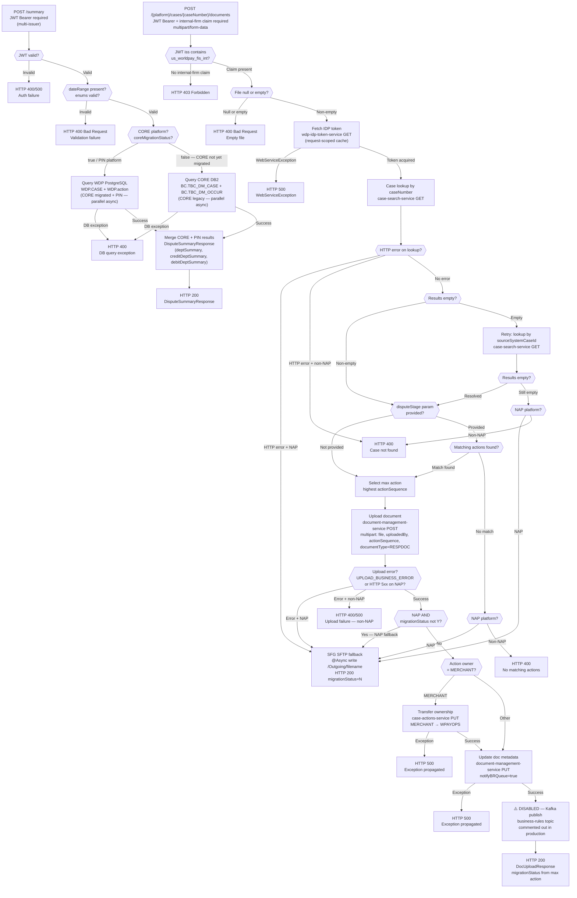

# WDP-COMP-22-DISPUTE-SERVICE
**Worldpay Dispute Platform — Component Reference**
*Version: 1.0 DRAFT | April 2026*
*Extracted from: mdvs-gcp-disputes-service using GitHub Copilot CLI |
Architect-confirmed: PENDING*

---

## ━━━ CORE SKELETON ━━━━━━━━━━━━━━━━━━━━━━━━━━━━━━━━━━━━━━
*Mandatory for every component regardless of type.*

---

## Identity

| Field             | Value |
|-------------------|-------|
| **Name**          | `DisputeService` (spring.application.name: `Disputes-Service`) |
| **Type**          | `REST API` |
| **Repository**    | `mdvs-gcp-disputes-service` |
| **K8s deployment**| `mdvs-gcp-disputes-service` |
| **Context path**  | `/merchant/gcp/disputes` (port 8082) |
| **Status**        | `✅ Production` |
| **Doc status**    | `📝 DRAFT` |
| **Sections present** | `Core \| Block A — REST` |

> ⚠️ **Name mismatch warning:** The WDP-COMP-INDEX.md entry for this
> component describes it as "Authoritative service for dispute state."
> This is **incorrect**. Copilot CLI confirms this service performs
> **no database writes and owns no dispute state**. It is a
> read-and-orchestration layer. WDP-COMP-INDEX.md must be corrected.

---

## Purpose

**What it does**

DisputeService is a Spring Boot 3.5 / Java 17 read-and-orchestration
service. It exposes two independent REST endpoints — a dispute summary
reporting endpoint and a document-upload orchestration endpoint.

The **summary endpoint** (`POST /summary`) reads dispute case data
in parallel from two databases — WDP Aurora PostgreSQL (PIN platform
and CORE platform when migrated) and a legacy IBM DB2 system (CORE
platform only, when not yet migrated). It aggregates counts, amounts,
and win/loss outcomes grouped by dispute stage and returns a combined
response. A data-migration flag (`core_migration_status`) switches the
CORE platform data source between DB2 and PostgreSQL, supporting an
in-flight platform migration without a code deployment.

The **document-upload endpoint**
(`POST /{platform}/cases/{caseNumber}/documents`) orchestrates a
multi-step document delivery flow. It accepts an internal-firm-only
multipart upload, looks up the target case via CaseSearchService,
uploads the document to DocumentManagementService, conditionally
transfers action ownership via CaseActionService, and updates document
metadata. For NAP platform cases that are not yet migrated to WDP, it
falls back to a legacy SFG SFTP delivery path.

The service is also wired as a Kafka producer to the `business-rules`
topic, but the publish call site is **commented out in production code**
and is not active at runtime.

**What it does NOT do**

- Does NOT own or write dispute state. No `INSERT`, `UPDATE`, or
  `DELETE` statement exists in the codebase. This service is read-only
  against its two databases.
- Does NOT manage case state transitions. The `StageCode` enum values
  (REQ, CH1, RE2, PAB, ARB, APC, CH2, ACF) are read from the database
  for filtering — this service does not trigger or validate transitions.
- Does NOT call CaseManagementService (COMP-23). Case lookup is
  delegated to CaseSearchService (COMP-27).
- Does NOT call ChargebackService (COMP-21). No runtime dependency
  exists in either direction.
- Does NOT expose any endpoint to external merchants. The document-upload
  endpoint enforces an internal-firm JWT claim (`us_worldpay_fis_int`);
  external callers receive HTTP 403.
- Does NOT consume from any Kafka topic. No `@KafkaListener` or
  consumer group is configured.
- Does NOT publish to Kafka at runtime. The `business-rules` producer
  is wired but its call site is commented out.
- Does NOT use the transactional outbox pattern. No outbox table exists
  in this service.

---

## Internal Processing Flow

*Two independent entry paths. They do not converge.*

---

## Boundaries

### Inbound Interfaces

| Source | Protocol | Endpoint | Payload / Description |
|--------|----------|----------|-----------------------|
| Portal UIs / internal WDP services (callers unconfirmed from source) | REST | `POST /merchant/gcp/disputes/summary` | JWT Bearer required. `DisputeSummaryRequest` JSON body. No internal-firm restriction — any authenticated caller. |
| Internal WDP services / Worldpay staff portal (internal firm only) | REST | `POST /merchant/gcp/disputes/{platform}/cases/{caseNumber}/documents` | JWT Bearer required + `us_worldpay_fis_int` issuer claim. `multipart/form-data`. Path: platform, caseNumber. Query: uploadedBy (required), disputeStage (optional). |

### Outbound Interfaces

| Target | Protocol | Endpoint / Resource | Purpose | On failure |
|--------|----------|---------------------|---------|------------|
| CaseSearchService (COMP-27) | REST in-cluster | `GET /merchant/gcp/case-search/{platform}/case/lookup` | Case lookup by caseNumber (primary) then sourceSystemCaseId (fallback) | NAP: SFG SFTP fallback; non-NAP: HTTP 400 |
| DocumentManagementService (COMP-37) | REST in-cluster | `POST /merchant/gcp/document-management/{platform}/documents/{caseNumber}` | Upload document file for the target action | NAP: sets UPLOAD_BUSINESS_ERROR → SFG fallback; non-NAP: rethrow 400/500 |
| DocumentManagementService (COMP-37) | REST in-cluster | `PUT /merchant/gcp/document-management/{platform}/document/{caseNumber}/action/{actionSeq}` | Update document metadata, set notifyBRQueue=true | Exception rethrown → HTTP 500 |
| CaseActionService (COMP-24) | REST in-cluster | `PUT /merchant/gcp/case-actions/{platform}/case/{caseNumber}/action` | Transfer action ownership MERCHANT → WPAYOPS when owner=MERCHANT | Exception rethrown → HTTP 500 |
| IDP Token Service (wdp-idp-token-service) | REST in-cluster | `GET /merchant/gcp/idp-token/token` | Obtain service-to-service bearer token. Request-scoped cache via RequestTokenHolder. | WebServiceException → HTTP 500 |
| SFG SFTP Server | SFTP (Spring Integration) | `/Outgoing/{filename}` port 3222 | NAP platform fallback: deliver document when WDP document management unavailable or migrationStatus ≠ Y. Runs @Async. | InternalServerError → HTTP 500 |
| WDP Aurora PostgreSQL | PostgreSQL read-only | `WDP.CASE`, `WDP.action` | Dispute summary — PIN always; CORE when coreMigrationStatus=true | BusinessValidationException → HTTP 400 |
| CORE DB2 — BC schema (legacy) | IBM DB2 read-only | `BC.TBC_DM_CASE`, `BC.TBC_DM_OCCUR` | Dispute summary — CORE platform only when coreMigrationStatus=false | BusinessValidationException → HTTP 400 |
| AWS MSK Kafka (`business-rules`) | Kafka synchronous | `business-rules` topic | ⚠️ WIRED BUT INACTIVE — intended to publish business-rule trigger after document upload. Call site commented out in production. | N/A — not invoked |

---

## Database Ownership

### Tables Owned (written by this component)

This component owns no database state. It is a read-only orchestration
layer. No `INSERT`, `UPDATE`, or `DELETE` statements exist in the
codebase.

### Tables Read (not owned by this component)

**Data Source 1: WDP Aurora PostgreSQL (`spring.datasource.wdp`)**
Used for: PIN platform always; CORE platform when `coreMigrationStatus=true`

| Schema.Table | Owned by | Why accessed | Key columns |
|--------------|----------|--------------|-------------|
| `WDP.CASE` | CaseManagementService (COMP-23) — TBC | Case-level header data for dispute summary aggregation | `I_CASE_ID`, `C_CASE_STA`, `C_LEVEL1_ENTITY`, `C_IR_TYPE`, `C_CASE_FINAL_LIABILITY`, `i_case_action_max_seq`, `i_action_seq`, `E_PRE_NOTE` |
| `WDP.action` | ⚠️ Multiple writers — TBC | Action/stage-level data: amounts, stage, type, dates, status | `I_CASE_ID`, `A_DISPUTE_AMT`, `C_CASE_STAGE`, `C_ACTION_TYPE`, `D_ACTION_REPORTED`, `D_ACTION_PROCESSED`, `C_ACTION_STA` |

**Data Source 2: CORE DB2 — BC schema (`spring.datasource.core`)**
Used for: CORE platform only when `coreMigrationStatus=false`

| Schema.Table | Owned by | Why accessed | Key columns |
|--------------|----------|--------------|-------------|
| `BC.TBC_DM_CASE` | Enterprise — not WDP owned | Legacy CORE case-level data for dispute summary | `I_CASE_ID`, `I_CASE_OCCR_MAX`, `C_CASE_STA`, `C_CC_TYPE`, `C_CASE_RSLT`, `I_CHK`, `I_MRCHNT`, `I_ISO`, `I_ISC` |
| `BC.TBC_DM_OCCUR` | Enterprise — not WDP owned | Legacy CORE occurrence/action-level data for dispute summary | `I_CASE_OCCUR`, `A_DISPUTE`, `C_REC_TYPE`, `X_DSPT_AMT_SGN`, `C_OCCUR_STA`, `D_OCCUR`, `D_OCCUR_ACTN`, `C_OCCUR_ACTN`, `C_PRE_NOTE` |

**Transaction note:** All interactions are read-only selects. Two separate
`JpaTransactionManager` instances (`coreTransactionManager` and
`wdpTransactionManager`) — neither used for write transactions. No
cross-datasource transactions.

---

## Resilience and Operational Posture

**No timeout configuration on any outbound call.** All downstream REST
calls use a plain `RestTemplate` with no connection timeout, read timeout,
or circuit breaker. A slow or unresponsive downstream service will block
the HTTP thread indefinitely. Under load this will exhaust the thread pool.

**No Resilience4j circuit breakers on any dependency** — confirmed absent
from `pom.xml`. Spring Retry `@Retryable` is present on the disabled Kafka
publish path only (3 attempts, 100ms fixed delay) — not on any active REST
call path.

**SFG SFTP fallback** provides graceful degradation for the NAP platform
document-upload path. All NAP error paths return HTTP 200 — callers must
inspect `migrationStatus` in the response body to determine which delivery
path was used.

**`core_migration_status` flag** is an active in-production feature flag
(env var `core_migration_status`). When `true`, CORE platform queries run
against WDP PostgreSQL. When `false`, they run against legacy CORE DB2.
This is the primary in-flight migration control for the CORE platform data
source.

---

## Key Architectural Decisions

| Decision ID | Decision | Status | Notes |
|-------------|----------|--------|-------|
| DEC-001 | Transactional outbox | ❌ DOES NOT APPLY | No Kafka writes at runtime — disabled. No database writes exist. No outbox table. |
| DEC-003 | merchantId partition key | ⚠️ COMPLIANT WHEN ACTIVE | Disabled Kafka producer uses merchantId as message key. Not active in production. |
| DEC-004 | PAN encryption | ✅ NOT APPLICABLE | No PAN, card number, or payment credential fields handled anywhere in this service. |
| DEC-005 | Manual Kafka offset commit | ✅ NOT APPLICABLE | No Kafka consumer. |
| DEC-014 | Resilience4j circuit breakers | ❌ DEVIATION | No Resilience4j dependency in pom.xml. No circuit breaker on any of 6 outbound dependencies. Plain RestTemplate with no timeouts. **HIGH severity.** |

---

## Risk Register

| Risk | Severity | Detail |
|------|----------|--------|
| No timeouts on REST dependencies | 🔴 HIGH | All 5 active outbound REST calls use plain `RestTemplate` with no connection or read timeout. A single slow dependency (CaseSearchService, DocumentManagementService, CaseActionService, IDP Token Service) blocks the HTTP thread until OS TCP timeout fires — typically minutes. Systemic thread pool exhaustion risk under load. |
| No circuit breakers — DEC-014 deviation | 🔴 HIGH | Confirmed absent from pom.xml. Any downstream service failure causes unbounded blocking or exception cascades. No automated recovery. |
| NAP error path silently returns HTTP 200 | 🟡 MEDIUM | Any exception in the NAP document-upload flow routes to SFG SFTP fallback and returns HTTP 200. Callers cannot distinguish successful WDP delivery from SFG fallback without inspecting `migrationStatus` in the response body. Operational visibility gap. |
| Kafka producer wired but inactive | 🟡 MEDIUM | `business-rules` Kafka infrastructure fully configured but call site commented out. If uncommented without an outbox write in the same transaction, event loss is possible on Kafka unavailability. DEC-001 deviation risk if publish path is ever re-enabled. |
| CORE DB2 dependency with no resilience | 🟡 MEDIUM | DB2 is a legacy enterprise system not owned by WDP. No timeout, retry, or circuit breaker on the DB2 JDBC connection. CORE platform summary unavailable when DB2 is down. No graceful degradation. |
| `constructNativeQuery` dead method | 🟢 LOW | A DB query-building method exists in USDisputeSummaryDaoImpl but is never called at runtime. Only `constructNativeFilterQuery` is invoked. No production impact — technical debt, should be removed. |

---

## Scaling and Deployment

| Parameter | Value |
|-----------|-------|
| Kubernetes resource type | Deployment |
| Replica count | `{{ replicas-mdvs-gcp-disputes-service }}` — XL Deploy / Helm variable. Exact production value not in source. |
| Memory limit | `2048Mi` |
| Memory request | `1024Mi` |
| CPU limit | Not configured — absent from resources.yaml |
| CPU request | Not configured — absent from resources.yaml |
| HPA | Absent |
| PodDisruptionBudget | Absent |
| Topology spread | Configured — `topologyKey: kubernetes.io/hostname`, `whenUnsatisfiable: ScheduleAnyway`. No label mismatch. Best-effort preference, not hard requirement. |

### Observability

| Feature | Status | Detail |
|---------|--------|--------|
| OTel agent | ✅ Present | Pod annotation `instrumentation.opentelemetry.io/inject-java` — OTel Operator auto-injection |
| Actuator | ✅ Present | `/info`, `/health`, `/prometheus` exposed. Liveness port 8082. Readiness port 8052. `show-details: never`. |
| Logstash | ✅ Present | `LogstashTcpSocketAppender` in logback-spring.xml. Destination via env var `${LOGSTASH_SERVER_HOST_PORT}`. JSON encoding via LogstashEncoder. Console appender also present. |
| Prometheus | ✅ Present | Metrics endpoint enabled; tagged with `application: ${app.name}`. |
| Correlation ID | ✅ Present | `HttpInterceptor` reads/generates `v-correlation-id` header, placed in MDC for all requests. |

---

## Incomplete and Planned Work

### Commented-Out Code

| Block | Location | What it did | Reason disabled |
|-------|----------|-------------|-----------------|
| Kafka publish — `sendBusinessRules()` | DocumentServiceImpl.java line 174 | Would have published a `business-rules` trigger event to Kafka after successful document upload to an open case (`DOCUMENT_ATTACHED_TO_OPEN_CASE` rule group). Synchronous with 3-attempt Spring Retry. Idempotent producer configured. | Not determinable from source. Infrastructure wired and ready. |
| DB2 `WITH DR` hint — `constructNativeQuery()` | USDisputeSummaryDaoImpl.java line 120 | DB2 uncommitted-read isolation hint. Entire parent method (`constructNativeQuery`) is dead code — replaced by `constructNativeFilterQuery`. | Not determinable from source. Method never called at runtime. |
| Logstash hardcoded IPs | logback-spring.xml | Previous Logstash destination with hardcoded IP addresses. | Replaced by env-var-driven `${LOGSTASH_SERVER_HOST_PORT}`. |

### Active Feature Flags

| Flag | Config Key | Behaviour |
|------|------------|-----------|
| Core migration status | `app.core-migration-status` / env var `core_migration_status` | `true` → CORE platform queries run against WDP PostgreSQL (USDisputeSummaryDaoImpl). `false` → queries run against CORE DB2 (CoreDisputeSummaryDaoImpl). **Active in production.** |

### TODO / FIXME

| Location | Comment | Impact |
|----------|---------|--------|
| ApplicationProps.java line 10 | `// TODO: Utilize this going forward` — ApplicationProps introduced as placeholder; not all consumers refactored to use it yet | Low — technical debt |
| GlobalExceptionHandler.java line 185 | `// TODO` on HttpRequestMethodNotSupportedException handler | Low — handler functional, TODO is refinement only |

### Configured Properties Not Used at Runtime

| Property | Configured | Actual behaviour |
|----------|------------|-----------------|
| `kafka.retry-count`, `kafka.retry-delay` | Set in all environment application-*.yaml files (retry-count: 3, retry-delay: 100) | Never injected via @Value — retry in BusinessRuleServiceImpl is hardcoded. Kafka path disabled. |

---

## ━━━ TYPE BLOCK A — REST API CONTRACTS ━━━━━━━━━━━━━━━━━━━

---

## REST API Contracts

**Framework:** Spring Boot 3.5 / Spring MVC
**Auth model:** OAuth2 Resource Server — multi-issuer JWT Bearer token.
Trusted issuers configured in `jwt.trustedIssuers`.
**Context path (production):** `/merchant/gcp/disputes` (port 8082)
**Internal-firm restriction:** Document upload endpoint additionally
enforces `us_worldpay_fis_int` issuer claim — external callers receive
HTTP 403.

---

### Endpoint Group A — Dispute Summary Reporting

#### POST /summary

**Full in-cluster path:** `POST /merchant/gcp/disputes/summary`

**Purpose:** Returns an aggregated dispute summary — counts and amounts
grouped by dispute stage (`C_CASE_STAGE`), plus win/loss outcome totals
and outstanding item figures. Data is fetched in parallel from CORE
platform (DB2 or WDP PostgreSQL depending on `core_migration_status`
flag) and PIN platform (WDP PostgreSQL only). Results are merged into a
single combined response.

**Known callers:** Not determinable from source. Likely portal UIs or
internal reporting consumers. No caller annotation present in source.

**Auth:** JWT Bearer required. No internal-firm restriction — any
authenticated caller may use this endpoint.

**Request body — `DisputeSummaryRequest`:**

| Field | Type | Required | Description |
|-------|------|----------|-------------|
| `dateType` | Enum | No | `REPORT_DATE` or `DISPUTE_ACTION_DATE` — selects which date column drives the query filter |
| `dateRange` | Object | Yes | `startDate` and `endDate` date range (inclusive) |
| `merchantId` | List\<String\> | No | Filter by merchant IDs |
| `entities` | EntityListType | No | Hierarchical entity filter — SO/SA/SC/CM/MT/DV/ST entity types |
| `getOpenAction` | Boolean | No | If true, restricts to max-sequence action per case only |
| `groupby` | Enum | No | Currently only `DISPUTE_STAGE` is valid |
| `disputeStage` | List\<String\> | No | Filter to specific stage codes: REQ, CH1, RE2, PAB, ARB, APC, CH2, ACF |

**Response body — `DisputeSummaryResponse`:**

| Field | Description |
|-------|-------------|
| `deptSummary` | Combined summary — CORE + PIN data merged |
| `creditDeptSummary` | CORE platform dispute summary |
| `debitDeptSummary` | PIN platform dispute summary |

Each `DisputeSummary` contains: `totalAmount`, `totalCount`,
`outstandingAmount`, `outstandingItems`, `groupByType`,
`groupedResults` (list of stage/amount/count), `deptOutcome`
(WIN/LOSS breakdown).

**HTTP status codes:**

| Code | Trigger |
|------|---------|
| 200 OK | Successful summary retrieval |
| 400 Bad Request | Validation failure — invalid enum, missing dateRange, illegal date format, DB query exception, interrupted parallel thread |
| 404 Not Found | No handler found for the URL |
| 405 Method Not Allowed | Wrong HTTP method |
| 500 Internal Server Error | Unhandled runtime exception, message parse failure |

**Notes:** Outstanding items figure is a separate DAO call. If the result
list is empty, `outstandingAmount=0` and `outstandingItems=0` are set on
the response — not a 400 error.

---

### Endpoint Group B — Document Operations

#### POST /{platform}/cases/{caseNumber}/documents

**Full in-cluster path:**
`POST /merchant/gcp/disputes/{platform}/cases/{caseNumber}/documents`

**Purpose:** Uploads a document to a case. Orchestrates: JWT
internal-firm check → IDP token fetch → case lookup via CaseSearchService
→ document upload via DocumentManagementService → conditional action
ownership transfer via CaseActionService → document metadata update via
DocumentManagementService. For NAP platform — falls back to SFG SFTP
delivery when case is not yet migrated or any downstream call fails.

**Known callers:** Internal WDP services or Worldpay staff portal only.
Internal-firm JWT claim enforced — external merchants cannot call this
endpoint.

**Auth:** JWT Bearer required. Additionally, JWT `iss` claim must contain
`us_worldpay_fis_int`. External callers receive HTTP 403.

**Content type:** `multipart/form-data`

**Path parameters:**

| Parameter | Description |
|-----------|-------------|
| `platform` | Platform code — e.g. `NAP` |
| `caseNumber` | WDP case number or source-system case ID |

**Query parameters:**

| Parameter | Required | Description |
|-----------|----------|-------------|
| `uploadedBy` | Yes | User ID of the uploader |
| `disputeStage` | No | Filter actions to a specific stage code (e.g. `CH1`). If absent, all actions are included. |

**Request part:** `file` — multipart binary file (required, non-empty).

**Response body — `DocUploadResponse`:**

| Field | Description |
|-------|-------------|
| `migrationStatus` | `"Y"` = delivered to WDP document management; `"N"` = legacy SFG SFTP fallback used |

**HTTP status codes:**

| Code | Trigger |
|------|---------|
| 200 OK | Document processed — including when routed to SFG SFTP fallback for NAP |
| 400 Bad Request | Empty file; case not found (non-NAP); no matching actions for stage (non-NAP); case lookup or upload failure (non-NAP) |
| 401 / 403 Forbidden | JWT has no issuer claim or issuer does not contain `us_worldpay_fis_int` |
| 500 Internal Server Error | SFTP failure, IDP token failure, action update failure, document info update failure, unhandled exception |

**Notes:**
- NAP platform errors are **never surfaced as 4xx/5xx** to the caller —
  all error paths for NAP route to SFG SFTP fallback and return HTTP 200.
  Callers must inspect `migrationStatus` in the response to determine
  which delivery path was used.
- The SFG SFTP write runs `@Async` (fire-and-forget) on the normal
  processing path. On error paths it is called synchronously inline.
- The Kafka `business-rules` publish that would follow document metadata
  update is commented out in production and does not execute.

---

## Remaining Gaps

| Gap | What is unknown | Resolution needed |
|-----|-----------------|-------------------|
| Callers of POST /summary | No caller annotation in source. Inferred as portal UIs or reporting consumers. | Confirm from team or API Gateway routing table. |
| Callers of POST /documents | Internal-firm claim confirmed but which specific WDP services or portals invoke this endpoint is not determinable from source. | Confirm from team. |
| Replica count | `{{ replicas-mdvs-gcp-disputes-service }}` — template variable, value not in source. | Confirm from XL Deploy / Helm environment config or ops team. |
| CPU resource limits | Absent from resources.yaml — whether intentional or configuration gap is not determinable. | Confirm with platform team. |
| Why Kafka publish was disabled | `sendBusinessRules()` is fully implemented and wired but commented out. Reason not in source. | Ask team — if planned for re-enablement, DEC-001 outbox gap must be addressed first. |

---

## Documents to Update After Architect Confirmation

| Document | What to update |
|----------|---------------|
| WDP-COMP-INDEX.md | COMP-22 description — replace with: "Read-and-orchestration service for dispute reporting and document delivery. Exposes POST /summary (aggregates dispute counts/amounts from WDP PostgreSQL and/or legacy CORE DB2 depending on migration flag) and POST /{platform}/cases/{caseNumber}/documents (orchestrates document upload via DocumentManagementService with SFG SFTP fallback for NAP platform). Performs no database writes and owns no dispute state. ⚠️ Previous description ('Authoritative service for dispute state') was incorrect." |
| WDP-KAFKA.md | Update business-rules topic note [1] — add COMP-22 as inactive configured producer (merchantId key, synchronous, commented out in production). |
| WDP-DB.md | Add COMP-22 to read-only accessor columns for WDP.CASE and WDP.action; add COMP-22 to IBM DB2 external dependency row (BC.TBC_DM_CASE, BC.TBC_DM_OCCUR). |
| WDP-HANDOVER.md | Add to Confirmed Architectural Facts: "COMP-22 DisputeService is a read-and-orchestration layer — performs no database writes and owns no dispute state. The Kafka producer to business-rules is wired but commented out in production." |

---

*End of WDP-COMP-22-DISPUTE-SERVICE.md*
*File status: 📝 DRAFT — architect confirmation pending*
*Update WDP-COMP-INDEX.md, WDP-KAFKA.md, WDP-DB.md, and WDP-HANDOVER.md
after architect confirms this file.*
