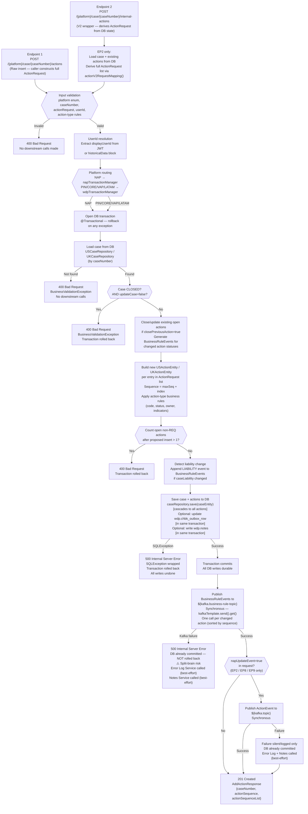

# WDP-COMP-24-CASE-ACTION-SERVICE
**Worldpay Dispute Platform — Component Reference**
*Version: 1.0 DRAFT | April 2026*
*Extracted from: mdvs-gcp-case-actions-service using GitHub Copilot CLI | Architect-confirmed: PENDING*

---

## ━━━ CORE SKELETON ━━━━━━━━━━━━━━━━━━━━━━━━━━━━━━━━━━━━━━━

---

## Identity

| Field             | Value                                                        |
|-------------------|--------------------------------------------------------------|
| **Name**          | `CaseActionService`                                          |
| **Type**          | `REST API + Kafka Producer`                                  |
| **Repository**    | `mdvs-gcp-case-actions-service`                              |
| **Spring app name** | `CaseActionsService`                                       |
| **Context path**  | `/merchant/gcp/case-actions` (port 8082)                     |
| **Status**        | `✅ Production`                                              |
| **Doc status**    | `📝 DRAFT`                                                   |
| **Sections present** | `Core \| Block A — REST \| Block C — Kafka Producer`     |

---

## Purpose

**What it does**

CaseActionService is the single authoritative service for creating, reading, and updating dispute actions across all WDP acquiring platforms (NAP, PIN, CORE, VAP, LATAM). It is the action management layer for the platform — every transition in a dispute action's lifecycle flows through this service.

The service exposes nine REST endpoints covering the full action lifecycle: raw action insert, wrapper-based automated action transitions, action retrieval, update, CORE-specific synchronisation, source-system search, business-rules combined update+insert, and retrieval-respond document registration. It maintains two parallel geographic data domains — the WDP schema (`wdp`) for PIN/CORE/VAP/LATAM platforms and the NAP schema (`nap`) for the NAP platform — with platform routing applied per request.

After every successful database write, the service publishes one or both of two Kafka topics synchronously: a `BusinessRuleEvent` to trigger downstream business rules evaluation, and optionally an `ActionEvent` for NAP update notification. The Kafka publish happens post-commit — the database transaction is committed before any Kafka call is made. This is a confirmed architectural split-brain risk: a Kafka publish failure leaves the DB committed with no compensating transaction.

The `historicalData` block in the insert request acts as an active migration mechanism — when present, the service uses a historical insertion path with custom timestamps and suppresses Kafka business-rule events.

**What it does NOT do**

- Does not enforce role-based access control (RBAC). `RestInvoker.authorizeUser()` exists in source but is not called from any controller. JWT validity is the sole gate — any authenticated caller can perform any action type on any case. This is a confirmed security gap.
- Does not consume from any Kafka topic. Producer only.
- Does not handle PAN data in any form. Card account number references in entity models (`I_ACCT_CDM`, `I_ACCT_CDM_LST`) are tokenised values, not clear PAN.
- Does not implement Resilience4j circuit breakers on any outbound call.
- Does not implement explicit duplicate/idempotency detection. The `idempotency-key` header is accepted and forwarded to Kafka but not checked against a seen-key store. Repeated POSTs create duplicate action rows.
- Does not call BusinessRulesService (COMP-31) or CaseManagementService (COMP-23) — it writes directly to the action and case tables.

---

## Internal Processing Flow

*Primary flow — POST /actions and /internal-actions insert path (Endpoints 1 and 2).
Endpoint variations are documented in the REST Contracts section below.*

---

## Boundaries

### Inbound Interfaces

| Source | Protocol | Endpoint / Topic / Trigger | Payload / Description |
|--------|----------|----------------------------|-----------------------|
| NAPDisputeDeclineBatch (COMP-06) | REST | `GET /{platform}/case/{caseNumber}/actions` then `POST /{platform}/case/{caseNumber}/actions` | GET existing actions, then POST IDCL draft action insert |
| Internal WDP services — automated lifecycle (BRE, accept, contest, advance flows) | REST | `POST /{platform}/case/{caseNumber}/internal-actions` | V2 wrapper — action type drives derived ActionRequest |
| Internal WDP services — BRE combined transition | REST | `POST /{platform}/case/{caseNumber}/br-internal-actions` | Combined close-current + open-new action atomically |
| Internal WDP services — retrieval-respond | REST | `POST /{platform}/case/{caseNumber}/internal-retrieval-actions` | Insert RETRIVAL_RESPOND action + register document |
| CORE platform synchronisation | REST | `PUT /{platform}/case/action/{sourceUniqueId}` | CORE-side status sync back into WDP by sourceUniqueId |
| Downstream services — action update (advance, write-off confirm) | REST | `PUT /{platform}/case/{caseNumber}/action` | Update existing action status, owner, liability |
| Any authenticated caller | REST | `GET /{platform}/case/{caseNumber}/actions` | Read all/one actions for a case |
| Any authenticated caller | REST | `GET /{platform}/action` | Search actions by sourceSystemCaseId or sourceSystemUniqueId |

### Outbound Interfaces

| Target | Protocol | Endpoint / Topic / Resource | Purpose | On failure |
|--------|-----------|-----------------------------|---------|------------|
| WDP Aurora PostgreSQL (`wdp` schema) | PostgreSQL | `wdp.case`, `wdp.action`, `wdp.chbk_outbox_row`, `wdp.notes` | Case and action reads/writes for PIN/CORE/VAP/LATAM | 500 — transaction rolled back |
| NAP Aurora PostgreSQL (`nap` schema) | PostgreSQL | `nap.case`, `nap.action` | Case and action reads/writes for NAP platform | 500 — transaction rolled back |
| AWS MSK Kafka | Kafka | `${kafka.business-rule-topic}` | BusinessRuleEvent — triggers downstream BRE evaluation | 500 — DB committed, NOT rolled back ⚠️ |
| AWS MSK Kafka | Kafka | `${kafka.topic}` | ActionEvent — NAP update event (conditional on napUpdateEvent=true) | Logged/swallowed — DB committed |
| Error Log Service (COMP-38) | REST | `POST ${errorlog_url}` | Record Kafka publish failure — best-effort error audit | Caught and logged, execution continues |
| Notes Service (COMP-25) | REST | `POST ${add_notes_url}` | Insert system error note when Kafka publish fails | Caught and logged |
| Document Service (COMP-37) | REST | `POST ${document.add-url}/{platform}/{caseNumber}` | Register retrieval-respond document metadata (EP9 only) | 500 propagated to caller |
| Internal OAuth2 / IDP Token Service | REST (client_credentials) | IDP token endpoint (`${idp_client_id}`, `${idp_client_secret}`) | Obtain Bearer token for Error Log, Notes, Document Service calls | 500 |

---

## Database Ownership

### Tables Owned (written by this component)

| Schema.Table | Purpose | Key columns | Notes |
|--------------|---------|-------------|-------|
| `wdp.case` | Central case record — read/write for PIN/CORE/VAP/LATAM platforms. Updated on case open/close/reopen transitions. | `I_CASE` (caseNumber, PK), `C_CASE_STA` (OPEN/CLOSED), `C_CASE_FINAL_LIABILITY`, `I_CASE_ACTION_MAX_SEQ`, `Z_UPDT` | wdpTransactionManager. All case + action + outbox + notes writes in same transaction. ⚠️ Shared with other writers — see Shared Table Risk below. |
| `wdp.action` | WDP action records — insert new actions; update existing action status, owner, liability. | `I_ACTION_SEQ`, `C_SOURCE_CASE_ID`, `C_SOURCE_UNIQUE_ID`, `C_ACTION_TYPE`, `C_ACTION_STA`, `C_ACTION_STAGE`, `C_OWNER` | Cascaded via USCaseEntity one-to-many. Same transaction as case write. ⚠️ Shared — confirm all writers. |
| `nap.case` | NAP platform mirror of wdp.case. Entity: UKCaseEntity. | Parallel to wdp.case | napTransactionManager |
| `nap.action` | NAP platform mirror of wdp.action. Entity: UKActionEntity. | Parallel to wdp.action | Same transaction as nap.case write |
| `wdp.chbk_outbox_row` | Transactional outbox row — status updated (not inserted) when caller provides chbkOutbox block | `id`, `status`, `_case` (caseNumber), `updated_at` | **CONDITIONAL** — only when chbkOutbox block present in request. Same transaction as case/action write. This is an inbound outbox status update (not a new outbox row creation). See DEC-001 note. |
| `wdp.notes` | Inserts a note record when `note` field is present in request | Inferred from USNotesRepository | **CONDITIONAL** — only when note field present. Same transaction as case/action write. |

### Tables Read (not owned by this component)

| Schema.Table | Owned by | Why accessed |
|--------------|----------|--------------|
| `wdp.case` | CaseManagementService (COMP-23) / shared | Load case entity for validation and update; reads C_CASE_STA, C_CASE_FINAL_LIABILITY, I_CASE_ACTION_MAX_SEQ |
| `wdp.action` | This component (cascaded from wdp.case) | Read existing actions to determine open count, copy fields for V2 wrapper derivation, detect status/owner/liability changes |
| `nap.case` | This component (NAP path) | Load NAP case entity for NAP platform requests |
| `nap.action` | This component (NAP path) | Read existing NAP actions — same purposes as wdp.action |

### Dormant Table (mapped but not used)

| Schema.Table | Status | Notes |
|--------------|--------|-------|
| `wdp.dispute_event_change_log` | **DORMANT** — EventChangeLogRepository declared but not injected or called in any production code path | Suggests a planned audit/event-log feature. Table exists and entity is mapped but not exercised at runtime. |

---

## Risk Register

| Risk | Severity | Detail |
|------|----------|--------|
| Kafka publish failure post DB commit | 🔴 HIGH | DB transaction commits at step 15. BusinessRuleEvent Kafka publish at step 16 is synchronous post-commit. If Kafka fails, DB is durable with no compensating transaction and no retry queue. Error Log and Notes service calls are best-effort. This is a confirmed split-brain risk. |
| No RBAC enforcement | 🟠 MEDIUM-HIGH | `RestInvoker.authorizeUser()` exists but is not called from any controller. JWT validity is the only gate. Any authenticated WDP service can create, update, or close any action on any case regardless of caller identity or case ownership. |
| No idempotency detection | 🟠 MEDIUM | `idempotency-key` header forwarded to Kafka but not checked against a seen-key store. Duplicate POSTs generate duplicate action rows. No 409 returned. |
| UAT IDP URL hardcoded as fallback | 🟡 LOW-MEDIUM | `application.yaml` line 42 contains a hardcoded UAT token-uri. Production relies on `${gcp_env}` secrets to override. If those secrets are absent, service calls a UAT IDP endpoint from production. |
| `wdp.dispute_event_change_log` dormant | 🟢 LOW | Entity declared, repository mapped, but never injected. Planned audit feature not exercised. Risk: schema drift if table structure evolves without code path awareness. |
| `spring-boot-devtools` in non-test scope | 🟢 LOW | Developer oversight — should be runtime/optional scope. |

---

## ━━━ TYPE BLOCK A — REST API CONTRACTS ━━━━━━━━━━━━━━━━━━━━━

---

## REST API Contracts

**Framework:** Spring Boot 3.x REST (`@RestController`)
**Auth model:** JWT Bearer token required on all business endpoints. Trusted issuers from `${jwt_trusted_issuer_urls}`. No role/scope enforcement — JWT validity is the only gate.
**Public paths (no JWT):** `/actuator/health`, `/livez`, `/readyz`, non-PROD Swagger
**Context path prefix:** `/merchant/gcp/case-actions`
**Port:** 8082

---

### Endpoint 1 — POST `/{platform}/case/{caseNumber}/actions`

**Purpose:** Raw action insert. Caller constructs the full `ActionRequest` directly. The core insert path for callers that know the exact action shape — e.g. NAPDisputeDeclineBatch (COMP-06) creating IDCL draft actions.

**Path variables:** `platform` (NAP / PIN / CORE / VAP / LATAM), `caseNumber`
**Headers:** `v-correlation-id` (optional), `idempotency-key` (optional — not validated server-side)

**Request body — `AddActionRequest`**

| Field | Required | Description |
|-------|----------|-------------|
| `actionRequest` | Yes (list) | One or more full `ActionRequest` objects with all action fields |
| `updateCase` | No | If true, also update case metadata |
| `copyFromPrevsAction` | No | Copy fields from prior action if true |
| `copyFromPrevsActionSequence` | No | Specific action sequence to copy from |
| `closePreviousAction` | No | Close prior open actions if true |
| `closeSequence` | No | Specific sequence to close |
| `caseLiability` | No | NLIAB / ALIAB / NLIAB override |
| `userId` | Conditional | Required unless `historicalData` is present |
| `chbkOutbox` | No | Optional outbox row update `{id, status}` — written in same transaction |
| `note` | No | Optional note to insert into wdp.notes in same transaction |
| `historicalData` | No | Migration mode block — enables historical insert path, suppresses Kafka BRE events |

**HTTP Responses**

| Status | Trigger |
|--------|---------|
| 201 Created | Action(s) inserted successfully |
| 400 Bad Request | Platform blank/invalid; caseNumber blank; case CLOSED with updateCase=false; two or more open non-REQ actions would result; owner missing when copyFromPrevsAction=false; chbkOutbox present but id/status blank; userId blank |
| 500 Internal Server Error | DB save failure (SQLException); Kafka BusinessRuleEvent publish failure (⚠️ DB already committed at this point) |

**Response body — `AddActionResponse`:** `{ caseNumber, actionSequence, actionSequenceList: [String] }`

**Known callers:** NAPDisputeDeclineBatch (COMP-06) confirmed. Other internal WDP services that construct full ActionRequest objects directly.

---

### Endpoint 2 — POST `/{platform}/case/{caseNumber}/internal-actions`

**Purpose:** V2 wrapper endpoint. Derives the full `ActionRequest` from existing case/action state in the DB by looking up `currentActionSequence`. Used by internal services performing automated lifecycle transitions — the caller specifies an action type and the service resolves defaults. Supports: `FULL_WRITEOFF`, `FULL_CTM`, `FULL_REV_CTM`, `FULL_REV_WRITEOFF`, `RETRIVAL_RESPOND`, `DENY`, `ADV_ACTION`, `ISSUER_ACCEPT`, `FULL_ISSUER_REV_CTM`, `FULL_ISSUER_REV_WO`, and split types `WRITEOFF`, `CTM`, `REV_CTM`, `REV_WRITEOFF`, `ISSUER_REV_WO`, `ISSUER_REV_CTM`.

**Path variables:** `platform`, `caseNumber`
**Headers:** `v-correlation-id`, `idempotency-key`

**Request body — `InsertActionWrapperV2Request`**

| Field | Required | Description |
|-------|----------|-------------|
| `actionType` | Yes | One of the `ActionType` enum values listed above |
| `actionRequest` | Yes (list) | `ActionWrapperV2Request` items with `currentActionSequence` and optional overrides |
| `caseLiability` | No | Optional liability override |
| `copyFromPrevsActionSequence` | Conditional | Required for issuer-reversal action types |
| `userId` | Yes | Operator ID |
| `napUpdateEvent` | No | If true, also publish `ActionEvent` to `${kafka.topic}` after DB commit |

**HTTP Responses:** Same as Endpoint 1. 201 Created on success.

**Response body:** `AddActionResponse` (same as Endpoint 1)

**Known callers:** Internal WDP services performing automated write-off, CTM routing, advance, and issuer-reversal lifecycle transitions.

---

### Endpoint 3 — GET `/{platform}/case/{caseNumber}/actions`

**Purpose:** Retrieve all actions for a case (or a specific action if `actionSequence` supplied). This is the GET step in NAPDisputeDeclineBatch's GET-then-POST pattern for IDCL draft creation.

**Path variables:** `platform`, `caseNumber`
**Query params:** `actionSequence` (optional, numeric)

**HTTP Responses**

| Status | Trigger |
|--------|---------|
| 200 OK | Success — body may have empty actionSummary list if case exists but has no actions |
| 400 Bad Request | Platform blank/invalid; caseNumber blank; actionSequence non-numeric |

**Response body — `SearchActionDetailsResponse`:** `{ caseNumber, actionSummary: [ActionSummary] }`. Returns null body (no 404) when no actions found.

**Known callers:** NAPDisputeDeclineBatch (COMP-06), UI services, any service needing current action state.

---

### Endpoint 4 — GET `/{platform}/case/{caseNumber}/actions/{actionSequence}`

**Purpose:** Retrieve a single specific action by its sequence number.

**Path variables:** `platform`, `caseNumber`, `actionSequence`

**HTTP Responses:** 200 OK (may return null body if not found — no 404), 400 Bad Request (platform or actionSequence invalid)

**Response body — `ActionSummary`:** Single action summary object.

---

### Endpoint 5 — PUT `/{platform}/case/{caseNumber}/action`

**Purpose:** Update an existing action — change status, owner, liability; optionally close the case. Used by downstream services to advance case state (e.g., mark action CLOSED after a write-off is confirmed by the card network).

**Path variables:** `platform`, `caseNumber`
**Query param:** `actionSequence` (optional — defaults to `caseActionMaxSeq`)
**Headers:** `v-correlation-id`, `idempotency-key`

**Request body — `UpdateActionRequest`:** `actionStatus`, `owner`, `caseLiability`, `updateCase`, `userId`, `chbkOutbox`, `rejectReason`, `merchantDocIndicator`, and others.

**Branching logic on update (USCaseActionDaoImpl.updateAction()):**

| new actionStatus | Case state | updateCase | Outcome |
|-----------------|------------|------------|---------|
| CLOSED | Case already CLOSED | Any | Update action + optionally update liability → SUCCESS |
| CLOSED | Other open action exists | Any | Update this action only, no case close → SUCCESS |
| CLOSED | Case OPEN, only this action | true | Close case (set CLOSED, set caseEndDate) → SUCCESS |
| CLOSED | Case OPEN, only this action | false | 400 OPEN_CASE_FOUND |
| non-CLOSED | Case CLOSED | true | Reopen case (set OPEN, clear caseEndDate, clear liability) |
| non-CLOSED | Case CLOSED | false | 400 CLOSED_CASE_FOUND |

**HTTP Responses**

| Status | Trigger |
|--------|---------|
| 200 OK | Update successful |
| 400 Bad Request | Platform invalid; more than one open non-REQ action; case CLOSED + updateCase=false; status inconsistency |
| 500 Internal Server Error | DB or Kafka failure |

**Response body — `UpdateActionResponse`:** `{ caseNumber, actionSequence, updateStatus: "SUCCESS" / "OPEN_CASE_FOUND" / "CLOSED_CASE_FOUND" }`

---

### Endpoint 6 — PUT `/{platform}/case/action/{sourceUniqueId}`

**Purpose:** CORE-only endpoint. Update an action identified by its `sourceUniqueId` (C_SOURCE_UNIQUE_ID in wdp.action). Used by the CORE acquiring platform to synchronise dispute action status back into WDP. **No Kafka events published on this path.**

**Path variables:** `platform` (must be CORE — hardcoded check), `sourceUniqueId`
**Headers:** `v-correlation-id`, `idempotency-key`

**Request body — `UpdateCoreActionRequest`:** `status`, `processDate`, `dueDate`, `expirationDate`, `owner`, `liability`, `updateCase`, `userId`

**HTTP Responses:** 200 OK always — response body status field distinguishes outcomes. No 404.

**Response body — `UpdateCoreActionResponse`:** `{ caseNumber, sourceUniqueId, updateStatus }`. Possible updateStatus values: `SUCCESS`, `OPEN_CASE_FOUND`, `CLOSED_CASE_FOUND`, `"Action do not exist in WDP."`, `"Other non closed action exist"`.

**Key AMEX special treatment:** For AMEX network cases, Endpoint 6 updates the action regardless of other non-closed actions being present (bypasses the constraint that applies to other networks).

---

### Endpoint 7 — GET `/{platform}/action`

**Purpose:** Search for dispute actions by `sourceSystemCaseId` or `sourceSystemUniqueId`. Returns only the action with the highest sequence number matching the criteria.

**Path variables:** `platform`
**Query params:** `sourceSystemCaseId`, `sourceSystemUniqueId`

**HTTP Responses:** 200 OK, 400 Bad Request (platform blank or invalid)

**Response body — `SearchActionResponse`:** Single action search result.

---

### Endpoint 8 — POST `/{platform}/case/{caseNumber}/br-internal-actions`

**Purpose:** Business-rules combined endpoint. Simultaneously closes the current action and opens a new one in a single transaction. Used by business-rule processes (BRE path) for atomic state transitions.

**Path variables:** `platform`, `caseNumber`
**Headers:** `v-correlation-id`

**Request body — `UpdateCaseAndActionsRequest`:** Wraps `addActionRequest` (actionType + actionRequest list), optional `updateCaseRequest` (case status, liability), optional `updateActionRequest` (action fields to update), and `userId`.

**HTTP Responses:** 201 Created; 400 Bad Request (platform/case validation; CLOSED case + OPEN action status contradiction)

**Response body:** `AddActionResponse`

---

### Endpoint 9 — POST `/{platform}/case/{caseNumber}/internal-retrieval-actions`

**Purpose:** Retrieval-respond specific endpoint. Inserts a `RETRIVAL_RESPOND` / `RRSP` action, calls Document Service (COMP-37) to register document metadata (type=RESPDOC, stageCode=REQ), then updates `merchantDocIndicator` to `"Y"` on the inserted action.

**Path variables:** `platform`, `caseNumber`
**Headers:** `v-correlation-id`

**Request body — `RetrievalActionRequest`:** `actionType` (must be RETRIVAL_RESPOND), `actionRequest` list, `documentName` list, `userId`, `napUpdateEvent`, `copyFromPrevsActionSequence`

**Processing sequence:**
1. Map to `InsertActionWrapperV2Request` with action type forced to RETRIVAL_RESPOND/RRSP
2. Insert action (same path as Endpoint 2)
3. POST to Document Service — `${document.add-url}/{platform}/{caseNumber}` — if this fails → 500
4. Update `merchantDocIndicator` to `"Y"` on the inserted action via `updateCaseAction()`
5. Optional `ActionEvent` Kafka publish if `napUpdateEvent=true`

**HTTP Responses:** 201 Created; 400 Bad Request

**Response body:** `AddActionResponse`

---

## Action Type Business Rules

*Applied inside this service during insert/wrapper derivation. Not delegated to any downstream service.*

| Action Type | Action Code | Status Set | Owner Derivation | Key Rules |
|-------------|-------------|------------|------------------|-----------|
| FULL_WRITEOFF / WRITEOFF (split) | AQWO | CLOSED | WPAYOPS | writeOffReason mandatory; caseLiability defaults to ALIAB; respondPercentage=100; splits use pro-rated amounts |
| FULL_CTM / CTM (split) | CHMR | OPEN | Derived from existing action owner via getOwnerDetails() — WPAYOPS/NETWORK → MERCHANT | recordTypeIndicator defaults to T |
| FULL_REV_CTM / REV_CTM (split) | CRMR | CLOSED | — | Credit/debit indicator inverted (unless IACF/RCAL action code); NAP: revrnlInd set to Y on previous action |
| FULL_REV_WRITEOFF / REV_WRITEOFF (split) | AQWO | CLOSED | WPAYOPS | Credit/debit inverted |
| ADV_ACTION | — | — | — | All fields required explicitly |
| RETRIVAL_RESPOND | RRSP | CLOSED | NETWORK | recordTypeIndicator=0; triggers Document Service call |
| DENY | WDNL | OPEN | — | — |
| FULL_ISSUER_REV_CTM / ISSUER_REV_CTM (split) | CRMR | — | — | Copies amounts from copyFromPrevsActionSequence not currentActionSequence |
| FULL_ISSUER_REV_WO / ISSUER_REV_WO (split) | AQWO | — | — | Copies amounts from copyFromPrevsActionSequence |

**Action sequence generation:** `maxExistingSeq + index`, padded to 2 characters (e.g., `"01"`)

**Open-action constraint:** No more than one non-REQ non-CLOSED action permitted at any time. Enforced at insert (all write endpoints) and at update (Endpoint 5).

**Migration mode (`historicalData` block):** When present, triggers `insertHistoricalAction()` with caller-supplied timestamps. Kafka `BusinessRuleEvent` is suppressed (`isNotifyToBr=false`). Active migration mechanism.

---

## Platform Standard Compliance

| Standard | Status | Detail |
|----------|--------|--------|
| **DEC-001** Transactional outbox | ⚠️ PARTIAL — **NOT a full outbox for Kafka** | `wdp.chbk_outbox_row` is updated within the same DB transaction as case/action saves when caller provides `chbkOutbox` block. This is an inbound outbox status update (upstream producer, WDP signals processing completion). The Kafka publish (BusinessRuleEvent) is direct and synchronous post-commit — there is no separate outbox table written for Kafka event guarantee. DEC-001 is NOT fully implemented for outbound Kafka events. |
| **DEC-003** Kafka key = merchantId | 🔴 NON-COMPLIANT | Kafka message key for **both** topics is `caseNumber` (set via `KafkaHeaders.KEY`). Not merchantId. This deviates from DEC-003 for both `${kafka.business-rule-topic}` and `${kafka.topic}`. |
| **DEC-004** PAN encryption | ✅ NOT APPLICABLE | No PAN in this service. Entity models contain `I_ACCT_CDM` / `I_ACCT_CDM_LST` which are tokenised values. No EncryptionService call. |
| **DEC-005** Manual Kafka offset commit | ✅ NOT APPLICABLE | Producer only — no Kafka consumer. No offset commit to assess. |
| **DEC-014** Resilience4j circuit breakers | 🔴 NON-COMPLIANT | No Resilience4j dependency in `pom.xml`. No circuit breakers on any outbound call: PostgreSQL (WDP), PostgreSQL (NAP), Kafka (MSK), Error Log Service, Notes Service, Document Service, IDP Token Service. All failures propagate as HTTP 500. Consistent with platform-wide pattern. |

---

## ━━━ TYPE BLOCK C — KAFKA PRODUCER CONTRACTS ━━━━━━━━━━━━━━━

---

## Kafka Producer Contracts

**Producer framework:** Spring Kafka `KafkaTemplate`
**Idempotent producer:** Yes — `ENABLE_IDEMPOTENCE_CONFIG=true`, `ACKS_CONFIG="all"`, `MAX_IN_FLIGHT_REQUESTS_PER_CONNECTION=5`
**Publish mode:** Synchronous — `kafkaTemplate.send(message).get()` blocks until broker acknowledgement
**Retry on publish failure:** Yes — `${kafka_retry_count}` retries at Kafka producer level (at-least-once delivery)
**Auth:** SASL/SSL with AWS MSK IAM (`IAMLoginModule`, `IAMClientCallbackHandler`)
**Circuit breaker:** None

---

### Topic: `${kafka.business-rule-topic}`

| Parameter | Value |
|-----------|-------|
| **Topic name** | `${kafka.business-rule-topic}` — environment variable; actual name not visible in source |
| **Message key** | `caseNumber` ⚠️ deviates from DEC-003 (platform standard is merchantId) |
| **Ordering guarantee** | Per partition by caseNumber — not per merchantId |
| **Published on** | Any insert or update that changes action status, owner, or liability. One event per changed action, sorted by action sequence. |
| **Consumed by** | BusinessRulesProcessor (COMP-16) — to be confirmed via Copilot |

**Message payload — `BusinessRuleEvent` fields:**
`eventType`, `platform`, `caseNumber`, `actionSequence`, `previousActionSequence`, `disputeStage`, `type`, `startRuleGroup`, `source`, `documentNameList`, `updateType` (list: OWNER / ACTION_STATUS / LIABILITY), `correlationId`, `updatedTimestamp`

**Payload notes:**
- `historicalData` block present on request → Kafka publish suppressed (`isNotifyToBr=false`). No BusinessRuleEvent emitted on historical/migration inserts.
- Publish failure → 500 returned to caller, but DB already committed. No retry mechanism at application level beyond Kafka producer retries.

---

### Topic: `${kafka.topic}`

| Parameter | Value |
|-----------|-------|
| **Topic name** | `${kafka.topic}` — environment variable; actual name not visible in source |
| **Message key** | `caseNumber` ⚠️ deviates from DEC-003 |
| **Ordering guarantee** | Per partition by caseNumber |
| **Published on** | Endpoints 2, 8, and 9 only — **conditional** on `napUpdateEvent=true` in the request body |
| **Consumed by** | Suspected NAP update path — exact consumer TBC |

**Message payload — `ActionEvent` fields:**
`caseNumber`, `actionSequences`, `platform`, `currentActionSequence`, `networkCaseId`

**Payload notes:**
- This is a second, distinct topic from the business-rule topic.
- Publish failure on this topic is silent/logged only — does NOT return 500 to caller. Error Log and Notes Service called as best-effort.
- The `idempotency-key` header from the inbound request is forwarded as a Kafka header but not validated server-side.

---

## Scaling and Deployment

| Attribute | Value | Source |
|-----------|-------|--------|
| Kubernetes resource type | Deployment | resources.yaml line 2 |
| Replica count | `{{replicas-gcp-case-actions-service}}` — placeholder; actual value set by deploy config | resources.yaml line 9 |
| Memory limit | ⚠️ `409EM` as read from source — likely 4096Mi or 409Mi; **confirm exact value** | resources.yaml line 60 |
| Memory request | 2048Mi | resources.yaml line 62 |
| CPU limit | Not configured — absent from resources.yaml | resources.yaml |
| CPU request | Not configured | resources.yaml |
| HPA | Not present | resources.yaml |
| PodDisruptionBudget | Not present — not determinable from source alone | — |
| Topology spread | Configured — `topologySpreadConstraints` with `topologyKey: kubernetes.io/hostname`, `maxSkew: 1`, `whenUnsatisfiable: ScheduleAnyway`. **No label mismatch** — `labelSelector` matches `app: mdvs-gcp-case-actions-service${BRANCH_NAME_PLACEHOLDER}` which is the same label on the pod template. | resources.yaml lines 27–33 |
| Rolling update strategy | `maxUnavailable: 0`, `minReadySeconds: 30` | resources.yaml lines 10–14, 26 |
| OTel agent | Yes — `instrumentation.opentelemetry.io/inject-java: opentelemetry-operator-system/default` annotation | resources.yaml line 23 |
| Actuator endpoints | `/info`, `/health`, `/prometheus` exposed | application.yaml lines 5–10 |
| Health liveness/readiness | `/livez`, `/readyz` custom paths via Spring Actuator groups; probes at port 8082 | application.yaml lines 14–18 |
| Prometheus metrics | `management.metrics.export.prometheus.enabled: true` | application.yaml lines 21–26 |
| Structured logging | logstash-logback-encoder 7.4 dependency in pom.xml; `logstash.server.host/port` config present | pom.xml line 79, application.yaml line 79 |
| Swagger / OpenAPI | springdoc 2.6.5; exposed at `/caseactionsservice-documentation`; disabled in PROD auth whitelist | pom.xml line 74, SecurityConfig.java |

---

## Planned and Incomplete Work

| Category | Detail |
|----------|--------|
| Commented-out: `C_SOURCE_CCY` / `C_DEST_CCY` columns | Currency columns excluded from entity mapping in `USCaseEntity.java` lines 120–131. Likely unused in current schema or deprecated. |
| Commented-out: `C_DUPLICATE_IND` column | Duplicate indicator excluded from `USActionEntity.java` lines 180–182. Not used in current flow. |
| Commented-out: liability validation | `CaseActionsDaoImpl.java` lines 467–475 — liability-required validation for non-REQ/ARB stage codes disabled in `updateAction()`. |
| Commented-out: PIN `disputeTransPercentage` | `CaseActionsServiceImpl.java` — `actionReq.setDisputeTransPercentage()` for PIN platform write-off/CTM/rev-CTM paths commented out. Field not available/applicable on PIN. NAP paths still set this field. |
| Planned: `wdp.dispute_event_change_log` | `EventChangeLogRepository` / `DisputeEventChangeLog` entity declared and mapped but not injected anywhere. The audit/event-log feature was planned and wired but never completed or moved elsewhere. |
| Planned: Kafka consumer capability | `spring-kafka` + `aws-msk-iam-auth` present as producer dependencies in `pom.xml`. Consumer capability available but not exercised. |
| Active migration flag: `historicalData` | When `historicalData != null` in `AddActionRequest`, the service uses `insertHistoricalAction()` with custom timestamps and suppresses Kafka BRE events. Active in production for data migration. |
| Hardcoded UAT IDP URL | `application.yaml` line 42: token-uri contains a hardcoded UAT FIS CloudServices endpoint. Production relies on `${gcp_env}` secrets to override. Risk if secret absent. |
| Hardcoded `dsptNoticeId = "DMT007"` | Default for NAP `FULL_REV_CTM` actions in `CaseActionsServiceImpl.java` line 1951. Business constant hardcoded in application code. |
| `spring-boot-devtools` in non-test scope | Should be runtime/optional scope. Developer oversight — not a functional risk but should be corrected. |

---

## Open Questions and Gaps

| Gap | Type | Action required |
|-----|------|----------------|
| Memory limit value — OCR read as `409EM` from resources.yaml line 60 | Confirm from environment config | Check XL Deploy / K8s secret for exact `replicas-gcp-case-actions-service` and memory limit values |
| `${kafka.business-rule-topic}` actual topic name | Confirm from deployment config | Check MSK configmaps or XL Deploy for `kafka.business-rule-topic` value |
| `${kafka.topic}` actual topic name | Confirm from deployment config | Check MSK configmaps for `kafka.topic` value — this is the ActionEvent / NAP update topic |
| Consumer of `${kafka.topic}` (ActionEvent) | Architect decision / Copilot | Which component consumes the ActionEvent topic? Likely NAP Outcome Processor (COMP-39) — confirm via Copilot on COMP-39 repo |
| `wdp.action` and `wdp.case` — all writers | Confirm from Copilot on remaining components | These tables are confirmed shared. COMP-24 is confirmed writer. Other writers must be confirmed (CaseManagementService COMP-23, etc.) — update Shared Table Risk Register |
| RBAC gap — formal ADR | Architect decision | `RestInvoker.authorizeUser()` exists but is uncalled. This is a security gap — no scope/role enforcement beyond JWT. Consider formal ADR when WDP-DECISIONS.md is rebuilt. |
| `UKCaseActionDaoImpl` (NAP DAO) — not fully read | Copilot follow-up | Behaviour inferred to be symmetric with WDP DAO based on shared interface. Ask Copilot: *"In UKCaseActionDaoImpl, does the updateAction() method follow the same branching logic as USCaseActionDaoImpl lines 399–558? Are there any NAP-specific deviations in the CLOSED/non-CLOSED case state branches?"* |
| Publisher of `${kafka.business-rule-topic}` — confirm COMP-24 is sole publisher | Copilot on COMP-14 repo | COMP-14 CaseCreationConsumer candidacy on business-rules topic is still unverified. COMP-24 is confirmed as one publisher. |
