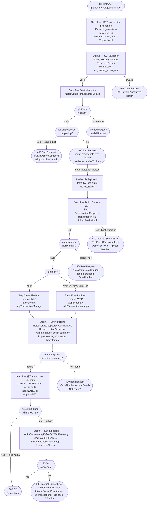
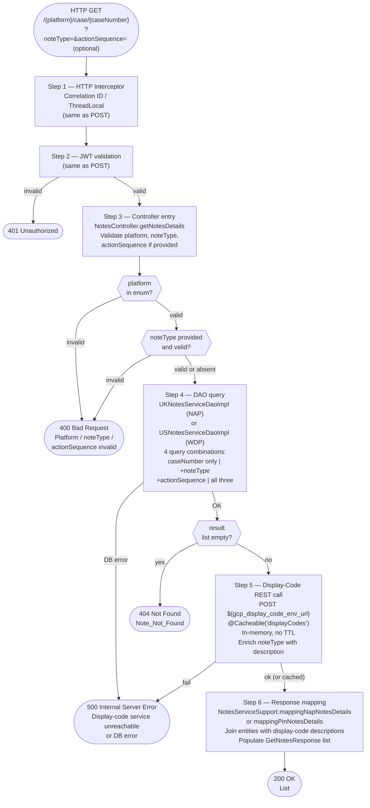

# WDP-COMP-25-NOTES-SERVICE
**Worldpay Dispute Platform — Component Reference**
*Version: 1.0 DRAFT | April 2026*
*Extracted from: mdvs-gcp-notes-service using GitHub Copilot CLI | Architect-confirmed: PENDING*

---

## ━━━ CORE SKELETON ━━━━━━━━━━━━━━━━━━━━━━━━━━━━━━━━━━━━━━

## Identity

| Field                | Value |
|----------------------|-------|
| **Name**             | `NotesService` |
| **Type**             | `REST API + Kafka Producer` |
| **Repository**       | `mdvs-gcp-notes-service` |
| **Artifact**         | `notes-service` (group `com.wp.gcp`) — v1.4.5 |
| **Runtime**          | Java 17 / Spring Boot 3.x |
| **Context path**     | `/merchant/gcp/notes` (injected via `SERVER_SERVLET_CONTEXT_PATH` env var) |
| **Status**           | `✅ Production` |
| **Doc status**       | `📝 DRAFT` |
| **Sections present** | `Core \| Block A \| Block C` |

---

## Purpose

**What it does**

NotesService is a platform-aware Spring Boot REST API that provides two
operations against dispute-case notes: a POST endpoint to append notes to
a case and a GET endpoint to search and retrieve them. It is the authoritative
write surface for dispute notes across all WDP acquiring platforms.

The service is platform-aware at the data-tier level. The `{platform}` path
variable controls which of two entirely separate PostgreSQL schemas is used:
`nap` for NAP/UK-platform disputes and `wdp` for VAP, LATAM, CORE, and PIN
disputes. The two schemas have identical table structures but use separate
JPA entity managers, separate transaction managers, and separate datasource
connections — they are never mixed in a single transaction.

On write, for every note whose `noteType` does NOT start with `SNOTE`, the
service publishes an `AddNotesBREvent` synchronously to an AWS MSK Kafka
topic. The DB write and the Kafka publish share the same Spring
`@Transactional` boundary but are **not atomically coupled** — if Kafka fails
after the DB write is flushed, the transaction is rolled back and a 500 is
returned. If the JVM crashes between DB commit and Kafka send completing, the
event is silently lost. There is no transactional outbox.

The service calls the internal Action Service on the POST path to validate
that the case and action sequence exist before writing any note. The GET
path calls the Display-Code Service to enrich the `noteType` code with a
human-readable description. All bearer tokens for downstream service calls
are obtained via OAuth2 client credentials from the IDP through `TokenServiceImpl`.

**What it does NOT do**

- Does not consume from any Kafka topic — producer-only; no listener, no
  consumer group, no `@KafkaListener`
- Does not use a transactional outbox — Kafka publish is a direct synchronous
  call within the `@Transactional` boundary (DEC-001 deviation)
- Does not perform PAN encryption or handle any card payment data — no
  `EncryptionService` dependency; no PAN field exists anywhere in the service
- Does not update any case-level status, action table, or case-state machine
  — notes are supplementary metadata only
- Does not implement idempotency checking — the `idempotency-key` header is
  forwarded on the Kafka message header but is never checked against any
  store; duplicate submissions create duplicate note rows
- Does not enforce note immutability at the database level — append-only
  constraint is enforced solely by the absence of PUT/PATCH/DELETE endpoints
- Does not apply case-status eligibility checks (e.g. whether notes can be
  added to a closed case) — such a check could exist in the upstream Action
  Service but is not visible in this service's codebase
- Does not apply role-based access control beyond JWT issuer validation —
  `displayUserId` derivation distinguishes internal ops from merchant callers
  but does not block any request

---

## Internal Processing Flow

### POST `/{platform}/case/{caseNumber}` — Add Notes



> **Note on @Transactional coupling:** Steps 7 and 8 execute within the same
> Spring `@Transactional` boundary. If Kafka send fails (Step 8), the
> `InternalServerError` is thrown inside the transaction, causing Spring to
> roll back the DB write from Step 7. However, if the JVM crashes between DB
> flush and Kafka send completing, the note row is committed but the Kafka
> event is never sent. There is no outbox to recover this scenario.

---

### GET `/{platform}/case/{caseNumber}` — Search Notes



---

## Boundaries

### Inbound Interfaces

| Source | Protocol | Endpoint / Topic / Trigger | Payload / Description |
|--------|----------|----------------------------|-----------------------|
| Merchant Portal (COMP-49) | REST via API Gateway (COMP-01) | `POST /merchant/gcp/notes/{platform}/case/{caseNumber}` | JSON array of `AddNotesRequest`; Bearer JWT |
| Ops Portal (COMP-50) | REST via API Gateway (COMP-01) | `POST /merchant/gcp/notes/{platform}/case/{caseNumber}` | Same — internal ops caller path |
| Any authenticated portal or service | REST via API Gateway (COMP-01) | `GET /merchant/gcp/notes/{platform}/case/{caseNumber}` | Path + optional query params; Bearer JWT |

> ⚠️ Known callers are not determinable from this service's source alone. The
> service exposes itself via Nginx Ingress on multiple hostnames
> (`hostName`, `externalHostName`, `internalHostName`, `wdpExternalHostName`,
> `wdpInternalHostName`). No explicit caller registry is present in this repo.

### Outbound Interfaces

| Target | Protocol | Endpoint / Topic / Resource | Purpose | On failure |
|--------|-----------|-----------------------------|---------|------------|
| Action Service (case-actions) | REST GET — Bearer JWT via TokenServiceImpl | `${gcp_env_url}/case-actions/{platform}/case/{caseNumber}/actions` | POST path Step 4 — validate case existence and retrieve action summary | RestClientException → 500. No retry, no circuit breaker |
| Display-Code Service | REST POST — Bearer JWT via TokenServiceImpl | `${gcp_display_code_env_url}` | GET path Step 5 — enrich noteType codes with human-readable descriptions | RestClientException → 500. Cached in-memory; failure only on first call per JVM session |
| OAuth2 / IDP | HTTPS — OAuth2 client credentials | `${idp_token_url}` | Token acquisition for Action Service and Display-Code Service calls | InternalError thrown → 500. No retry, no circuit breaker |
| AWS MSK Kafka | SASL_SSL + IAM (`aws-msk-iam-auth`) | `${kafka_business_event_topic}` | POST path Step 8 — publish AddNotesBREvent for non-SNOTE notes | Kafka failure → isErrorOccurred=true → @Transactional rollback → 500 |
| nap.NOTES | PostgreSQL (NAP schema) | `nap.NOTES` | POST path — INSERT note rows (NAP platform) | JPA exception → @Transactional rollback → 500 |
| wdp.NOTES | PostgreSQL (WDP schema) | `wdp.NOTES` | POST path — INSERT note rows (VAP/LATAM/CORE/PIN platforms) | JPA exception → @Transactional rollback → 500 |
| nap.NOTES | PostgreSQL (NAP schema) | `nap.NOTES` | GET path — SELECT notes for NAP platform | DB error → 500 |
| wdp.NOTES | PostgreSQL (WDP schema) | `wdp.NOTES` | GET path — SELECT notes for WDP platforms | DB error → 500 |

---

## Database Ownership

### Tables Owned (written by this component)

| Schema.Table | Purpose | Key columns | Notes |
|--------------|---------|-------------|-------|
| `nap.NOTES` | Stores dispute notes for NAP / UK-platform disputes | `I_NOTE_ID` (PK, sequence-gen), `I_CASE` (case number FK-equivalent), `I_ACTION_SEQ` | Append-only at API layer. No DB-level constraint prevents UPDATE/DELETE — DDL not in this repo. |
| `wdp.NOTES` | Stores dispute notes for VAP / LATAM / CORE / PIN disputes | `I_NOTE_ID` (PK, sequence-gen), `I_CASE`, `I_ACTION_SEQ` | Identical column structure to `nap.NOTES`. Uses sequence `wdp.NOTES_I_NOTE_ID_SEQUENCE`. |

> ⚠️ **Dual-schema ownership.** This is the only confirmed WDP Core service
> that owns tables in *both* `nap` and `wdp` schemas simultaneously via
> separate JPA entity managers. This creates a shared-schema risk: any team
> writing to either table directly must coordinate with this service.

**Column map (applies to both tables):**

| Column | Java field | Type | Notes |
|--------|------------|------|-------|
| `I_NOTE_ID` | `note_id` | BigInteger | PK — sequence-generated |
| `I_CASE` | `caseNumber` | String | FK-equivalent to dispute record — no JPA FK declared |
| `I_ACTION_SEQ` | `actionSequence` | String | Links note to a case action |
| `C_NOTE_TYPE` | `noteType` | String | NoteType enum code stored as plain string |
| `T_NOTE` | `t_Note` | String | Note text content |
| `D_NOTE` | `d_note` | Date | Server-generated date of note |
| `X_INSRT` | `insertedBy` | String | Original `userId` from request |
| `Z_INSRT` | `insertedTimestamp` | Timestamp | Server-generated insert timestamp |
| `X_UPDT` | `updatedBy` | String | Set to `userId` on initial insert |
| `Z_UPDT` | `updatedTimestamp` | Timestamp | Set to current time on initial insert |
| `X_INSRT_DISPLAY` | `insertedDisplayUserId` | String | Derived display user ID (see displayUserId derivation below) |
| `X_UPDT_DISPLAY` | `updatedDisplayUserId` | String | Same as `insertedDisplayUserId` on initial insert |

### Tables Read (not owned by this component)

This component reads only from the tables it owns (`nap.NOTES`, `wdp.NOTES`)
on the GET path. It does not read from any table owned by another component.

---

## Configuration and Scaling

| Parameter | Value | Notes |
|-----------|-------|-------|
| Replica count | `{{ replicas-mdvs-gcp-notes-service }}` — XL Deploy / Helm placeholder | Exact value not determinable from source |
| HPA | None | No `HorizontalPodAutoscaler` manifest in repository |
| Memory request | `1024Mi` | |
| Memory limit | `2048Mi` | |
| CPU request | Not configured | Absent from `resources.yaml` — ⚠️ risk under high load |
| CPU limit | Not configured | Absent from `resources.yaml` — ⚠️ risk under high load |
| Deployment type | Kubernetes `Deployment` | |
| Rollout strategy | `RollingUpdate` — maxSurge: 1, maxUnavailable: 0 | `minReadySeconds: 30` — new pod must be stable 30 s before considered available |
| PodDisruptionBudget | None | No PDB manifest in repository |
| Topology spread | `ScheduleAnyway` — `topologyKey: kubernetes.io/hostname` | Label `app: mdvs-gcp-notes-service${BRANCH_NAME_PLACEHOLDER}` matches pod template — **no label mismatch** |
| Database connection pool | Two separate HikariCP pools | `napTransactionManager` (NAP schema) + `wdpTransactionManager` (WDP schema) |
| Observability | OpenTelemetry Java agent | Annotation: `instrumentation.opentelemetry.io/inject-java: opentelemetry-operator-system/default` |
| Actuator | Enabled | Endpoints: `info`, `health`, `prometheus` |
| Logstash | Configured | `LogstashTcpSocketAppender` → `${logstash_server_host_port}` — JSON via `LogstashEncoder` with `Environment` and `AppName` custom fields |
| Prometheus metrics | Enabled via Actuator exposure | |
| Swagger UI | Non-prod only | Suppressed when `ENV_NAME = "prod"` |

---

## Key Architectural Decisions

| Decision | ADR reference | Notes |
|----------|---------------|-------|
| DB write and Kafka publish share `@Transactional` boundary — no outbox | DEC-001 — **DEVIATION** | Best-effort coupling. Kafka failure rolls back DB write. JVM crash between DB commit and Kafka send → event lost. No recovery mechanism. |
| Kafka partition key is `caseNumber` | DEC-003 — **DEVIATION** | `merchantId` is not present anywhere in the event payload or service logic. `caseNumber` is the only available correlation key. |
| No PAN data in any path | DEC-004 — Compliant | Service processes note text, user IDs, case numbers, and action sequences only. No `EncryptionService` dependency. |
| Producer-only — no Kafka consumer | DEC-005 — Not applicable | No consumer configuration, no `@KafkaListener`, no consumer factory bean. |
| No Resilience4j on any outbound dependency | DEC-014 — **DEVIATION** | `resilience4j` absent from `pom.xml`. No circuit breaker, retry, bulkhead, or time limiter annotation present anywhere. All outbound calls fail fast with 500. |
| Dual-schema JPA entity managers | Local architectural decision | Two entirely separate entity managers and transaction managers (NAP/UK vs WDP/US). Notes are stored in the schema matching the platform of the dispute. |
| `SNOTE` noteType suppresses Kafka publish | Local business rule | Applied inside `AddNotesTransactionServiceImpl`. `SNOTE` notes are written to DB but never produce a business-rules event. |
| `displayUserId` derived from JWT issuer | Local security design | Issuer `us.worldpay.fis.int` → internal ops derivation (`WORLDPAY` or `*SYSTEM*`). All other issuers → `userId` unchanged (merchant-facing). This distinguishes call origin without blocking requests. |
| No idempotency enforcement | Local decision | `idempotency-key` header forwarded to Kafka message header but never checked against any store. Duplicate submissions create duplicate note rows. |

---

## Risks and Constraints

| Severity | Risk | Consequence |
|----------|------|-------------|
| 🔴 HIGH | **No transactional outbox (DEC-001 deviation).** JVM crash between DB commit and Kafka send → note row committed but `AddNotesBREvent` never published. | Downstream BRE consumers do not process the note event. Notes exist in DB but are invisible to Kafka-driven workflows. No recovery path exists unless the note is resubmitted manually. |
| 🔴 HIGH | **No Resilience4j on Action Service call (DEC-014 deviation).** Action Service is called on every POST with no timeout, no retry, and no circuit breaker. | If Action Service degrades, all POST requests hang until connection times out (timeout not configured — relies on OS default). Full service unavailability possible under Action Service failure. |
| 🟡 MEDIUM | **No timeout on any outbound REST call.** Neither the Action Service nor Display-Code Service call has connection or read timeout configured (`new RestTemplate()` with no timeout settings). | Slow upstream services cause thread exhaustion under load. No HPA to scale out. CPU not capped. |
| 🟡 MEDIUM | **No idempotency check on POST.** Duplicate `idempotency-key` is forwarded to Kafka but never de-duplicated at the service or DB level. | Retry storms or accidental double-submit create duplicate note rows in `nap.NOTES` / `wdp.NOTES`. Audit trail integrity is at risk. |
| 🟡 MEDIUM | **CPU limit not configured.** Absent from `resources.yaml`. | CPU throttling not enforced. Under high Kafka or REST call load, a single pod can consume excessive node CPU, affecting co-located services on the same node. |
| 🟡 MEDIUM | **No PodDisruptionBudget.** | During node drain or rolling upgrades, all replicas could be terminated simultaneously if replica count is low. Zero-downtime guarantee is weakened. |
| 🟡 MEDIUM | **Display-Code cache has no TTL.** `@Cacheable("displayCodes")` uses Spring's default `ConcurrentMapCache` — no eviction, no expiry. Cache key is the full request object. | Stale display-code descriptions are served for the lifetime of the JVM. Cache is also shared across all platform requests — a NAP noteType lookup populates the cache for all subsequent platform calls with identical keys. |
| 🟡 MEDIUM | **Dual-schema transaction managers — cross-schema consistency not guaranteed.** Each write targets one schema exclusively; there is no XA or distributed transaction. | If a business process requires notes in both `nap` and `wdp` schemas in the same operation, no atomicity guarantee exists. |
| 🟢 LOW | **`RequestValidator.validateCaseNumber` is dead code.** Declared and queries `UKNotesRepository.findByCaseNumber` but never called from any controller or service path. | Misleading presence — any developer who sees the method may assume case-existence is validated by this service when it is not (validated by Action Service instead). |
| 🟢 LOW | **Commented-out hardcoded Logstash destinations in `logback-spring.xml`.** Two hardcoded `10.43.145.125:5044` destinations remain as XML comments. | No runtime impact. Should be removed to avoid confusion during incident investigation. |
| 🟢 LOW | **`createErrorResponseEntity` and `createDuplicateResponseEntity(HttpStatus, ...)` in `GlobalExceptionHandler` are dead code — never called.** | Dead code adds maintenance overhead and misleads code readers about error handling paths. |

---

## Planned Changes

- ⚠️ OPEN QUESTION: Confirm the literal value of `${kafka_business_event_topic}` at runtime. Source code only exposes the env var name — the actual topic name (and its entry in WDP-KAFKA.md) cannot be confirmed from source alone. Verify via deployment config or team.
- ⚠️ OPEN QUESTION: Confirm which components consume from `${kafka_business_event_topic}`. Copilot could not determine downstream consumers of `AddNotesBREvent` from this repo alone.
- ⚠️ OPEN QUESTION: Confirm whether case-status eligibility gates (e.g. preventing notes on closed cases) are enforced by the Action Service, or are entirely absent from the platform. NotesService applies no such check.
- Commented-out Logstash destinations in `logback-spring.xml` should be removed — these are legacy dev/test config replaced by the `${LOGSTASH_SERVER_HOST_PORT}` property.
- Dead code (`validateCaseNumber`, `createErrorResponseEntity`, `createDuplicateResponseEntity`) should be removed to reduce maintenance noise.
- No transactional outbox — if DEC-001 compliance is required, an outbox table and relay scheduler would need to be introduced. Assess priority given that SNOTE suppression provides a partial volume reduction on Kafka dependency.

---

---

## ━━━ TYPE BLOCK A — REST API CONTRACTS ━━━━━━━━━━━━━━━━━━━

## REST API Contracts

**Authentication model:**
All endpoints require a valid Bearer JWT. Multi-issuer validation via
`JwtIssuerAuthenticationManagerResolver` with trusted issuers from
`${jwt_trusted_issuer_urls}`. No additional role-based authorisation check
at the service level — the `displayUserId` derivation logic distinguishes
internal vs. external callers by JWT issuer but does not gate access.
Actuator health / liveness / readiness probes are unauthenticated.

**Base URL pattern:**
`https://<host>/merchant/gcp/notes/{platform}/case/{caseNumber}`

**Error response body (all endpoints):**
```json
{
  "errors": [
    {
      "errorMessage": "Human-readable error description",
      "target": "field:rejectedValue"
    }
  ]
}
```
This is a **bespoke format** (`StandardErrorResponse` wrapping
`List<StandardDisplayError>`) — not a WDP platform-standard error schema.

---

### Endpoint: POST `/{platform}/case/{caseNumber}` — Add Notes

**Purpose:** Append one or more notes to a dispute case. Publishes an
`AddNotesBREvent` to Kafka for each note where `noteType` is not `SNOTE`.

**Caller(s):** Not determinable from source — inferred: Merchant Portal
(COMP-49), Ops Portal (COMP-50), and potentially other internal services
routing through API Gateway (COMP-01).

**Auth required:** Bearer JWT

**Request**

| Field | Location | Type | Required | Validation |
|-------|----------|------|----------|------------|
| `platform` | Path variable | String | Yes | Must match Platform enum: `NAP`, `VAP`, `LATAM`, `CORE`, `PIN` (case-insensitive) — `@NotBlank` |
| `caseNumber` | Path variable | String | Yes | `@NotBlank` |
| `v-correlation-id` | Request header | String | No | Generated as UUID if absent; propagated on response headers |
| `idempotency-key` | Request header | String | No | Generated as UUID if absent; forwarded on Kafka message header but **never checked against any store** |
| Request body | JSON Array of `AddNotesRequest` | — | Yes | `@Valid` |
| `userId` | Body field | String | Yes | `@NotBlank` — stored as `X_INSRT` / `X_UPDT` in the notes table |
| `actionSequence` | Body field | String | No | `@Pattern("[0-9]*$")`, `@Range(min=01, max=99)` — single-digit values (`1`–`9`) additionally rejected by `RequestValidator.validateActionSequence`; must be two-digit zero-padded |
| `noteType` | Body field | String | Yes | `@NotBlank` — must match `NoteType` enum: `ANOTE`, `FRMRCH`, `MNOTE`, `QNOTE`, `TOMRCH`, `TONETW`, `UNOTE`, `USER1`–`USER4`, `XDISCA`, `XDISCE`, `XDISCM`, `NOTE`, `SNOTE` |
| `text` | Body field | String | Yes | `@NotBlank`, `@Size(max=1000)` |

**NoteType behaviour:**

| Code | Meaning | Kafka published? |
|------|---------|-----------------|
| `ANOTE` | Agent / operator note | Yes |
| `FRMRCH` | Note from merchant | Yes |
| `MNOTE` | Merchant note | Yes |
| `QNOTE` | Queue note | Yes |
| `TOMRCH` | Note to merchant | Yes |
| `TONETW` | Note to network | Yes |
| `UNOTE` | User note | Yes |
| `USER1`–`USER4` | User-defined types | Yes |
| `XDISCA` / `XDISCE` / `XDISCM` | Disclosure-related notes | Yes |
| `NOTE` | Generic note | Yes |
| `SNOTE` | System note | **No — Kafka publish suppressed** |

**displayUserId derivation (applied at write time):**

| JWT issuer contains | userId prefix | displayUserId stored |
|--------------------|--------------|----------------------|
| `us.worldpay.fis.int` | `E` or `EC` | `WORLDPAY` (internal ops) |
| `us.worldpay.fis.int` | anything else | `*SYSTEM*` |
| Any other issuer | any | `userId` unchanged (merchant-facing) |

**Response — Success**

| HTTP Status | Condition | Body |
|-------------|-----------|------|
| `200 OK` | All notes persisted and Kafka published (or SNOTE — Kafka skipped) | Empty body |

**Response — Error**

| HTTP Status | Condition | Body |
|-------------|-----------|------|
| `400 Bad Request` | Platform invalid; `noteType` invalid; `actionSequence` invalid (single-digit, non-numeric, out of range); `text` blank or >1000 chars; `userId` blank; case not found (Action Service returned null / blank caseNumber); `actionSequence` not found in case's action summary | `StandardErrorResponse` |
| `401 Unauthorized` | JWT absent, invalid, expired, or from untrusted issuer | Spring Security default |
| `500 Internal Server Error` | Action Service unreachable (`RestClientException`); IDP token fetch failure; DB write failure; Kafka publish failure (all retries exhausted — Kafka producer-level retries only; `${kafka_retry_count}` env var) | `StandardErrorResponse` |

**Notes:**
- The `actionSequence` field, if omitted, is computed as the maximum numeric
  sequence from the Action Service response.
- All timestamps (`D_NOTE`, `Z_INSRT`, `Z_UPDT`) are server-generated at
  write time — the caller cannot supply a timestamp.
- DB write and Kafka publish are in the same `@Transactional` boundary.
  Kafka failure rolls back the DB write. There is no outbox — see risks.
- Notes are **append-only** at the API layer. There is no update or delete
  endpoint. This is not enforced at the database level (DDL not in this repo).
- `actionSequence` validation: zero-padded two-digit format is required.
  Single-digit values `1`–`9` are rejected by `RequestValidator.validateActionSequence`
  even if they pass Bean Validation `@Pattern` — the validator rejects before
  entity building.

---

### Endpoint: GET `/{platform}/case/{caseNumber}` — Search Notes

**Purpose:** Retrieve all notes for a given dispute case, with optional
filtering by note type and action sequence.

**Caller(s):** Not determinable from source — inferred: Merchant Portal
(COMP-49), Ops Portal (COMP-50).

**Auth required:** Bearer JWT

**Request**

| Field | Location | Type | Required | Validation |
|-------|----------|------|----------|------------|
| `platform` | Path variable | String | Yes | Platform enum validation |
| `caseNumber` | Path variable | String | Yes | `@NotBlank` |
| `noteType` | Query param | String | No | If present, must match `NoteType` enum |
| `actionSequence` | Query param | String | No | If present, validated — single-digit rejection applied |
| `v-correlation-id` | Request header | String | No | Generated if absent |

**Response fields (`GetNotesResponse`):**

| Field | Type | Notes |
|-------|------|-------|
| `caseNumber` | String | Always present if notes found |
| `actionSequence` | String | Always present |
| `noteType` | Object — `{ code, description, longDescription }` | Enriched by Display-Code Service |
| `text` | String | Note content |
| `dateTime` | String | `insertedTimestamp.toString()` — e.g. `"2024-01-15 10:25:45.123"` |
| `insertedBy` | String | Original `userId` from write |
| `insertedDisplayUserId` | String | Derived display user ID at write time |
| `updatedBy` | String | Same as `insertedBy` on initial write |
| `updatedDisplayUserId` | String | Same as `insertedDisplayUserId` on initial write |

**Response — Success**

| HTTP Status | Condition | Body |
|-------------|-----------|------|
| `200 OK` | Notes found matching criteria | `List<GetNotesResponse>` |

**Response — Error**

| HTTP Status | Condition | Body |
|-------------|-----------|------|
| `400 Bad Request` | Platform invalid; `noteType` filter value invalid; `actionSequence` filter value invalid | `StandardErrorResponse` |
| `401 Unauthorized` | JWT invalid | Spring Security default |
| `404 Not Found` | No notes found for given `caseNumber` (with optional filters applied) | `StandardErrorResponse` |
| `500 Internal Server Error` | Display-Code Service unreachable; DB error | `StandardErrorResponse` |

**Notes:**
- The Display-Code Service call is `@Cacheable("displayCodes")` — in-memory,
  no TTL, shared across all platform requests (cache key is the full request
  object). On first call per JVM session the live service is called; subsequent
  calls with identical request objects return cached data until pod restart.
- The `actionSequence` query filter uses the same single-digit rejection logic
  as the POST path.

---

### Probe / Actuator Endpoints (unauthenticated)

| Path | Purpose |
|------|---------|
| `/merchant/gcp/notes/live` | Kubernetes liveness probe (actuator health group) |
| `/merchant/gcp/notes/ready` | Kubernetes readiness probe (actuator health group) |
| `/merchant/gcp/notes/actuator/health` | Actuator health — unauthenticated |

**Non-prod only:**

| Path | Purpose |
|------|---------|
| `/merchant/gcp/notes/notesservice-documentation` | Swagger UI — suppressed when `ENV_NAME = "prod"` |
| `/merchant/gcp/notes/notesservice-api-docs` | OpenAPI JSON — suppressed in prod |

---

---

## ━━━ TYPE BLOCK C — KAFKA PRODUCER CONTRACTS ━━━━━━━━━━━━━

## Kafka Producer Contracts

**Producer framework:** Spring Kafka `KafkaTemplate`
**Idempotent producer:** Yes — `ENABLE_IDEMPOTENCE_CONFIG = true`
**Publish mode:** Synchronous via `kafkaService.retryKafkaCallWithRecovery` — blocking
**Acks:** `all`
**Max in-flight requests:** 5
**Retry on publish failure:** Yes — `${kafka_retry_count}` retries (env var; exact value not visible in source). Kafka producer-level retries only — no application-level sleep/backoff configured.
**Auth:** SASL_SSL with AWS MSK IAM (`aws-msk-iam-auth` library v2.3.2)

---

### Topic: `${kafka_business_event_topic}`

| Parameter | Value |
|-----------|-------|
| **Topic name** | `${kafka_business_event_topic}` — injected at deployment. Literal topic name not visible in source. ⚠️ **Confirm actual topic name via deployment config — required for WDP-KAFKA.md entry.** |
| **Message key** | `caseNumber` — ⚠️ **DEC-003 deviation** — not `merchantId`. `merchantId` is absent from event payload and service logic. |
| **Ordering guarantee** | Per partition by `caseNumber` |
| **Published on** | POST path Step 8 — after successful `saveAll` DB insert — conditional: published for every note where `noteType` does **not** start with `SNOTE` |
| **Not published when** | `noteType` starts with `SNOTE`; or if Kafka send fails (in which case DB write is also rolled back) |
| **Consumed by** | ⚠️ Unknown — not determinable from this service's source. Confirm downstream consumers of `AddNotesBREvent`. |

**Message payload structure — `AddNotesBREvent`:**

| Field | Type | Description |
|-------|------|-------------|
| `caseNumber` | String | WDP internal case number — also the Kafka partition key |
| `noteType` | String | NoteType code (e.g. `ANOTE`, `MNOTE`) |
| `userId` | String | Original `userId` from the POST request |
| `actionSequence` | String | Resolved action sequence (from request or computed from max) |
| `platform` | String | Platform from path variable |
| `idempotencyKey` | String | Value from `idempotency-key` header — forwarded for consumer use; **not checked for dedup in this service** |

> ⚠️ Exact field names in `AddNotesBREvent` are inferred from entity mapping
> logic visible in Copilot report. Confirm full payload schema via source.

**Payload notes:**
- `SNOTE` notes are written to the database but never trigger a Kafka publish.
  Consumers of this topic will never see `SNOTE` events.
- The `idempotencyKey` header is forwarded on the Kafka message header. If a
  consumer uses it for dedup, they must implement their own dedup store —
  this service provides no guarantee.
- ⚠️ **DEC-001 deviation** — no transactional outbox. If the JVM crashes
  between DB commit and Kafka send completing, the DB row is committed but the
  event is permanently lost. Consumers will never process it. There is no
  outbox table, no relay scheduler, and no reprocessing path.
- ⚠️ **DEC-003 deviation** — partition key is `caseNumber`, not `merchantId`.
  Consumers relying on per-merchant ordering of note events will not receive
  that guarantee.

---

*End of component file.*
*File status: 📝 DRAFT — pending architect confirmation.*

---

## Post-Confirmation Update Checklist

After Ram confirms this file, update the following:

1. **WDP-COMP-INDEX.md** — change COMP-25 `Doc Status` from `📋 PENDING` to `📝 DRAFT`

2. **WDP-KAFKA.md** — add new producer row:
   - Topic: `${kafka_business_event_topic}` ⚠️ confirm literal name first
   - Publisher: COMP-25 NotesService
   - Key: `caseNumber` (DEC-003 deviation)
   - Consumers: TBC — open question

3. **WDP-DB.md** — add two new table rows:
   - `nap.NOTES` — owned by COMP-25 — write + read
   - `wdp.NOTES` — owned by COMP-25 — write + read
   - ⚠️ Flag dual-schema ownership as a shared-table risk

4. **WDP-HANDOVER.md** — add to Open Questions:
   - Confirm literal topic name for `${kafka_business_event_topic}`
   - Confirm downstream consumers of `AddNotesBREvent`
   - Confirm whether case-status eligibility gates exist upstream in Action Service
