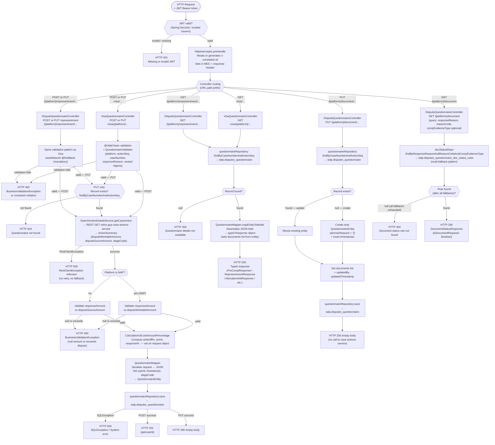

# WDP-COMP-26-QUESTIONNAIRE-SERVICE
**Worldpay Dispute Platform — Component Reference**
*Version: 1.0 DRAFT | April 2026*
*Extracted from: mdvs-gcp-questionnaire-service using GitHub Copilot CLI | Architect-confirmed: PENDING*

---

## ━━━ CORE SKELETON ━━━━━━━━━━━━━━━━━━━━━━━━━━━━━━━━━━━━━━
*Mandatory for every component regardless of type.*

---

## Identity

| Field             | Value                                                                 |
|-------------------|-----------------------------------------------------------------------|
| **Name**          | `QuestionnaireService`                                                |
| **Type**          | `REST API`                                                            |
| **Repository**    | `mdvs-gcp-questionnaire-service`                                      |
| **App name**      | `Questionnaire-Service` (Spring application name)                     |
| **Artifact ID**   | `questionnaire-service` (Maven)                                       |
| **Version**       | `2.1.8`                                                               |
| **Base path**     | `/merchant/gcp/questionnaire` (env var `SERVER_SERVLET_CONTEXT_PATH`) |
| **Status**        | `✅ Production`                                                        |
| **Doc status**    | `📝 DRAFT`                                                            |
| **Sections present** | `Core \| Block A — REST`                                           |

---

## Purpose

**What it does**

QuestionnaireService is the persistence and retrieval store for all dispute-response
questionnaires in WDP. A questionnaire captures the structured evidence and reasoning
a merchant submits to the card network as part of a representment or arbitration
response. This service receives questionnaire payloads from the WDP dispute portals,
enriches them with financial figures from the case-actions-service, serialises the
full payload to a PostgreSQL JSON blob, and serves them back on demand.

The service exposes two logically distinct controller families. The
`VisaQuestionnaireController` (prefix `/visa`) handles Visa-specific dispute stages:
Representment, Pre-Compliance Response, Pre-Arbitration Response, Allocation
Arbitration, and Allocation Pre-Arbitration. The `DisputeQuestionnaireController`
(no prefix) handles Non-Visa representment (MasterCard, Amex, Discover, etc.) and
the document-status lookup that tells callers whether a supporting document is
required for a given combination of response reason, reason code, and compelling
evidence type.

Each questionnaire type has a dedicated request object. The entire request object
is serialised as a JSON blob into a single text column (`C_QSTNNAIR`) in
`wdp.disputes_questionnaire`. There are no questionnaire templates stored in the
database; the schema is code-defined and enforced by JSR-303 bean validation
annotations on the request POJOs.

For every mutating operation (POST and PUT), the service makes exactly one outbound
REST call to `mdvs-gcp-case-actions-service` to retrieve the `ActionSummary`
containing the workable dispute amount, source amount, and stage code. It uses these
values to validate the merchant's response amount and compute write-off, CTM, and
response amount percentages before persisting. GET operations involve no outbound
calls — they are pure database reads.

**What it does NOT do**

- Does not trigger any case state transition. Saving or submitting a questionnaire
  does not call CaseManagementService or DisputeService.
- Does not handle PAN data. No card number field in any request or response POJO,
  and no EncryptionService dependency.
- Does not publish to Kafka. No Kafka dependency of any kind.
- Does not use a transactional outbox. All writes are synchronous JPA saves.
- Does not delegate document storage to DocumentManagementService, S3, or DynamoDB.
  All questionnaire data is stored in its own PostgreSQL tables.
- Does not perform role or scope authorization beyond JWT issuer validation. There
  are no `@PreAuthorize` annotations or scope assertions.
- Does not determine which questionnaire a ContestService submission should use.
  Whether ContestService reads from this service before submitting to the card
  network is not determinable from source — requires team confirmation.

---

## Internal Processing Flow



**Multi-fallback lookup chain for GET /{platform}/document**
(when `compEvidenceType` is provided, applied in order until a non-null result is found):
1. Exact match: `responseReason` + `reasonCode` + `compEvidenceType`
2. `reasonCode = "NA"` + `compEvidenceType`
3. `reasonCode` + `compEvidenceType = "NA"`
4. If still null → HTTP 404

**NAP amount branch note**
On the Visa POST/PUT path, when `platform = NAP`, the amount is validated against
`disputeWorkableAmount`. For all other platforms the validation uses
`disputeSourceAmount`. Both values are returned by `case-actions-service` in the
`ActionSummary`.

**Asymmetric write-off validation (incomplete work)**
On POST endpoints: `checkWriteOffReasonWriteOffNote` is commented out. A merchant
can create a questionnaire with a `writeOffAmount` but without providing
`writeOffReason` or `writeOffNote`.
On PUT endpoints: the same check is active. A merchant cannot update without
providing both fields when `writeOffAmount` is present.
This is a known asymmetry. See Risk Register below.

---

## Boundaries

### Inbound Interfaces

| Source | Protocol | Endpoint / Topic / Trigger | Payload / Description |
|--------|----------|----------------------------|-----------------------|
| WDP Merchant Portal (COMP-49) | REST / HTTPS | All `/visa/` and `/{platform}/` endpoints | Merchant questionnaire submissions and reads |
| WDP Ops Portal (COMP-50) | REST / HTTPS | All endpoints (probable) | Operations team questionnaire management |
| Unknown orchestration service | REST / HTTPS | All endpoints | Copilot confirmed callers not determinable from source — team confirmation required |

*Platform path parameter valid values: `CORE`, `NAP`, `VAP`, `LATAM`, `PIN`*

### Outbound Interfaces

| Target | Protocol | Endpoint / Topic / Resource | Purpose | On failure |
|--------|-----------|-----------------------------|---------|------------|
| `mdvs-gcp-case-actions-service` | HTTP REST (plain within cluster) | `GET /merchant/gcp/case-actions/{platform}/case/{caseNumber}/actions/{actionSequence}` | Retrieve `ActionSummary` (disputeWorkableAmount, disputeSourceAmount, stageCode, creditDebitIndicator) on every mutating request | `RestClientException` rethrown → HTTP 500. No retry, no circuit breaker, no fallback |
| `wdp.disputes_questionnaire` | PostgreSQL (WDP Aurora) | JPA `save()` | Persist or update questionnaire JSON payload | `SQLException` → HTTP 500 |
| `wdp.disputes_questionnaire_doc_status_rules` | PostgreSQL (WDP Aurora) | JPA read-only | Document-requirement rule lookup for GET /document | Null result → HTTP 404 |
| IdP (token endpoint) | HTTPS | `idp_token_url` (env var) | Client-credentials token for outbound call to case-actions-service (`wdp-internal-auth` registration, scope `openid`) | Exception propagated → HTTP 500 |

---

## Database Ownership

### Tables Owned (written by this component)

| Schema.Table | Purpose | Key columns | Retention / Notes |
|--------------|---------|-------------|-------------------|
| `wdp.disputes_questionnaire` | Primary questionnaire store. One row per (caseNumber, actionSeq). Entire request payload stored as a serialised JSON blob. Also stores attached document names. | `I_QSTNNAIR_ID` (PK, auto-increment sequence), `I_CASE` (caseNumber), `I_ACTION_SEQ`, `C_CASE_STAGE`, `C_QSTNNAIR` (JSON blob — full request), `N_DOCUMENT_NAME` (document list), `userId`, `createdAt`, `updatedAt` | ⚠️ **SHARED TABLE** — also written by COMP-15 EvidenceConsumer (upserts document names on RESPDOC WDP path). JPA entity has index on `(I_CASE, I_ACTION_SEQ)` but no `@UniqueConstraint`. A second POST for the same (caseNumber, actionSeq) will insert a duplicate row. DB-level unique constraint existence not determinable from source — DBA confirmation required. |

### Tables Read (not owned by this component)

| Schema.Table | Owned by | Why accessed |
|--------------|----------|--------------|
| `wdp.disputes_questionnaire_doc_status_rules` | ⚠️ Owner TBC (likely config/admin managed) | Document-status lookup: determines whether a supporting document is required for a given `responseReason` + `reasonCode` + `compEvidenceType` combination. Read-only via `docStatusRepo`. |

---

## Risks and Known Issues

| Risk | Description | Severity | Action |
|------|-------------|----------|--------|
| ⚠️ POST idempotency gap | No duplicate-prevention check on POST. A second POST for the same `(caseNumber, actionSeq)` inserts a new row rather than updating. JPA entity has a DB index but no `@UniqueConstraint`. Whether a DB-level unique constraint exists outside JPA is unknown. | 🔴 HIGH | DBA must confirm constraint. If absent, concurrent POSTs can create phantom questionnaire rows. |
| ⚠️ No timeout on `case-actions-service` | `CommonConfig` creates a plain `new RestTemplate()` with no `HttpComponentsClientHttpRequestFactory`. Default JVM socket timeout applies — typically unlimited. Any slowness or hang in `case-actions-service` blocks the mutating request thread with no bound. | 🔴 HIGH | DEC-014 deviation. Architect decision required: configure explicit connection and read timeouts. |
| ⚠️ No circuit breaker on `case-actions-service` | No Resilience4j dependency in `pom.xml`. No circuit breaker, bulkhead, or rate limiter on the outbound REST call. If `case-actions-service` is degraded, all mutating requests will fail or hang. | 🟠 MEDIUM-HIGH | DEC-014 deviation. Confirm with team whether a formal exception to DEC-014 has been accepted. |
| ⚠️ Asymmetric write-off validation | `checkWriteOffReasonWriteOffNote` is commented out on all POST endpoints but active on PUT. A merchant can create a questionnaire with `writeOffAmount` but no `writeOffReason`/`writeOffNote`, but cannot then update it in the same state. | 🟡 MEDIUM | Requires team decision: restore validation on POST or formally document the asymmetry as intentional. |
| ⚠️ CTM template never validated | `checkCTMTemplate` is commented out on all POST and PUT endpoints. The method body is also fully commented out. `ctmTemplate` is never validated as required when `ctmAmount` is present. | 🟡 MEDIUM | Confirm with team whether CTM template validation is deferred or deprecated. |
| ⚠️ Known callers unconfirmed | Copilot cannot determine callers from source alone. `@OpenAPIDefinition` describes the service as "used to create, update and search questionnaire info". Whether ContestService or another orchestration component reads from this service before submitting to the card network is unknown. | 🟡 MEDIUM | Team confirmation required. |
| ⚠️ `${app.name}` env var | `management.metrics.tags.application: ${app.name}` references an env var not declared in `application.yaml` or `resources.yaml`. If not injected at runtime, the metric tag will be unresolved. | 🟢 LOW | Confirm env var injection source in XL Deploy / DeployIt config. |

---

## ━━━ TYPE BLOCK A — REST API CONTRACTS ━━━━━━━━━━━━━━━━━━━
*REST API component. No Kafka consumer or producer side. No batch/scheduler.*

---

## REST API Contracts

**Framework:** Spring Boot 3.5.4 / Java 17
**Auth model:** Spring OAuth2 Resource Server with `JwtIssuerAuthenticationManagerResolver`.
Trusted issuers loaded from config key `jwt.trustedIssuers` (env var `jwt_trusted_issuer_urls`).
JWT required on all endpoints except `/actuator/health`, `/livez`, `/readyz`,
and (non-prod only) Swagger UI paths.
**Role/scope check:** None. No `@PreAuthorize` or scope assertions. Any valid JWT from
a trusted issuer is accepted.
**Outbound auth:** Client-credentials OAuth2 token obtained from IdP (`wdp-internal-auth`
registration, grant type `client_credentials`, scope `openid`). Attached as `Bearer`
on all outbound calls to `case-actions-service`.

---

### Group A — VisaQuestionnaireController (prefix `/visa`)

*All paths below are relative to base path `/merchant/gcp/questionnaire`.*

*Platform path parameter valid values: `CORE`, `NAP`, `VAP`, `LATAM`, `PIN`*

---

#### Endpoint Group A-POST — Create Visa Questionnaire (5 endpoints)

| # | Method | Path (after base) | Request object | 201 Response |
|---|--------|-------------------|----------------|-------------|
| A1 | POST | `/visa/{platform}/representment/{caseNumber}/action/{actionSeq}` | `RepresentmentRequest` | `{"qstnnairId": "<id>"}` |
| A2 | POST | `/visa/{platform}/precomresp/{caseNumber}/action/{actionSeq}` | `QuestionnairePreCompRequest` | `{"qstnnairId": "<id>"}` |
| A3 | POST | `/visa/{platform}/prearbresp/{caseNumber}/action/{actionSeq}` | `QuestionnairePreArbRequest` | `{"qstnnairId": "<id>"}` |
| A4 | POST | `/visa/{platform}/allocarb/{caseNumber}/action/{actionSeq}` | `AllocationArbRequest` | `{"qstnnairId": "<id>"}` |
| A5 | POST | `/visa/{platform}/allocprearb/{caseNumber}/action/{actionSequence}` | `VISAAllocationPreArbRequest` | `{"qstnnairId": "<id>"}` |

All POST endpoints share the same 11-step processing flow (see Internal Processing Flow
above). Key differences per endpoint:

- **A2 (precomresp):** Additional cross-field validation — if `preCompResponse == DECL`
  then `continuePreFilingReason` required and `partialAcceptanceReason` absent; if
  `PART` then `partialAcceptanceReason` required.
- **A3 (prearbresp):** `reasonForNotFullResponsibility` is `@NotBlank`.
- **A4 (allocarb):** Amount validation uses `caseFilingAmount` instead of `responseAmount`.
  Extra validation: `contactFax` and `contactOther` within `issuerAcquirerContactInfo`
  cannot both be set (HTTP 400).
- **A5 (allocprearb):** Additional `prearbitrationReason` validation via
  `validatePreArbitrationResponseReason` — applies CREDIT_PROCESSED / COMPELLING_EVIDENCE
  checks same as A1.

**⚠️ Commented-out validation on all POST endpoints:**
`checkWriteOffReasonWriteOffNote` is commented out — `writeOffReason` and `writeOffNote`
are not validated on POST even when `writeOffAmount` is present.
`checkCTMTemplate` is commented out — `ctmTemplate` is not validated when `ctmAmount` is present.

---

**`RepresentmentRequest` (A1 POST/PUT Visa Representment):**

| Field | Type | Required | Notes |
|-------|------|----------|-------|
| `disputeResponse` | String (enum) | ✅ | `DECL` or `PART` |
| `responseReason` | String (enum) | ✅ | Values from `ResponseReason` enum |
| `responseAmount` | BigDecimal | ✅ | > 0, max 16 integer + 4 decimal places |
| `writeOffAmount` | BigDecimal | Optional | > 0 |
| `writeOffDirection` | String (enum) | Conditional | Required if `writeOffAmount` present |
| `writeOffReason` | String | Conditional | Required on PUT if `writeOffAmount` present; NOT validated on POST (commented out) |
| `writeOffNote` | String | Conditional | Required on PUT if `writeOffAmount` present; NOT validated on POST (commented out) |
| `ctmAmount` | BigDecimal | Optional | |
| `ctmTemplate` | String | Optional | Validation commented out — never checked as required |
| `reasonForNotFullResponsibility` | String | Optional | max 10,000 chars |
| `comments` | String | Optional | max 5,000 chars |
| `explanation` | String | Optional | max 10,000 chars |
| `creditProcessed` | List\<CreditProcessed\> | Conditional | Required (non-null, non-empty) if `responseReason == CREDIT_PROCESSED` |
| `compellingEvidence` | CompellingEvidence | Conditional | Required (non-null) if `responseReason == COMPELLING_EVIDENCE` |
| `invalidDispute` | InvalidDispute | Optional | |
| `nonFiatCurrencyNonFungibleToken` | Object | Optional | |
| `transactionMatching` | String | Optional | |
| `userId` | String | ✅ | |
| `writeOffAmountPercentage` | BigDecimal | Computed | Overwritten by service; may be present in body but is ignored |
| `ctmAmountPercentage` | BigDecimal | Computed | Same |
| `responseAmountPercentage` | BigDecimal | Computed | Same |

---

**`QuestionnairePreCompRequest` (A2 POST/PUT Visa Pre-Compliance):**

| Field | Type | Required | Notes |
|-------|------|----------|-------|
| `preCompResponse` | String | ✅ | `DECL` or `PART` |
| `responseAmount` | BigDecimal | ✅ | |
| `writeOffAmount` | BigDecimal | Optional | |
| `writeOffDirection` | String | Conditional | |
| `continuePreFilingReason` | String | Conditional | Required if `preCompResponse == DECL` |
| `partialAcceptanceReason` | String | Conditional | Required if `preCompResponse == PART` |
| `userId` | String | ✅ | |
| Amount percentages | BigDecimal ×3 | Computed | writeOff%, ctm%, response% |

---

**`AllocationArbRequest` (A4 POST/PUT Visa Allocation Arbitration):**

| Field | Type | Required | Notes |
|-------|------|----------|-------|
| `filingReason` | String | ✅ | max 5,000 chars |
| `allocationArbResponse` | String | ✅ | `DECL` or `PART` |
| `caseFilingAmount` | BigDecimal | ✅ | Used for amount validation (not `responseAmount`) |
| `writeOffAmount` | BigDecimal | Optional | |
| `writeOffDirection` | String | Conditional | |
| `comments` | String | Optional | |
| `issuerAcquirerContactInfo` | Object | Optional | `contactFax` XOR `contactOther` — both set simultaneously → HTTP 400 |
| `userId` | String | ✅ | |

---

**`NonVisaRepresentmentRequest` (B2 POST / B4 PUT Non-Visa):**

| Field | Type | Required | Notes |
|-------|------|----------|-------|
| `disputeResponse` | String | ✅ | `DECL` or `PART` |
| `caseNetwork` | String | ✅ | `@NotBlank` — mandatory for non-Visa path |
| `responseAmount` | BigDecimal | ✅ | |
| `comments` | String | ✅ | `@NotBlank` |
| `writeOffAmount` | BigDecimal | Optional | |
| `writeOffDirection` | String | Conditional | |
| `representmentReasonCodes` | String | Optional | |
| `userId` | String | ✅ | |

---

**`DocumentRequest` (B1 PUT Document names):**

| Field | Type | Required | Notes |
|-------|------|----------|-------|
| `documents` | List\<String\> | ✅ | Not empty |
| `userId` | String | ✅ | |

---

**GET /{platform}/document — Query Parameters:**

| Parameter | Type | Required | Notes |
|-----------|------|----------|-------|
| `responseReason` | String | ✅ | |
| `reasonCode` | String | ✅ | |
| `compEvidenceType` | String | Optional | max 6 chars |

---

#### Endpoint Group A-PUT — Update Visa Questionnaire (5 endpoints)

| # | Method | Path (after base) | Request object | 200 Response |
|---|--------|-------------------|----------------|-------------|
| A11 | PUT | `/visa/{platform}/representment/{caseNumber}/action/{actionSeq}` | `RepresentmentRequest` | 200 empty body |
| A12 | PUT | `/visa/{platform}/precomresp/{caseNumber}/action/{actionSeq}` | `QuestionnairePreCompRequest` | 200 empty body |
| A13 | PUT | `/visa/{platform}/prearbresp/{caseNumber}/action/{actionSeq}` | `QuestionnairePreArbRequest` | 200 empty body |
| A14 | PUT | `/visa/{platform}/allocarb/{caseNumber}/action/{actionSeq}` | `AllocationArbRequest` | 200 empty body |
| A15 | PUT | `/visa/{platform}/allocprearb/{caseNumber}/action/{actionSequence}` | `VISAAllocationPreArbRequest` | 200 empty body |

PUT differs from POST in two ways:
1. `findByCaseNumberAndActionSeq` called first — HTTP 404 if not found (no upsert).
2. `checkWriteOffReasonWriteOffNote` is **active** — `writeOffReason` and `writeOffNote`
   are validated on PUT when `writeOffAmount` is present.

Note: `checkCTMTemplate` remains commented out on PUT as well — `ctmTemplate` is
never validated on any endpoint.

---

#### Endpoint Group A-GET — Read Visa Questionnaire (5 endpoints)

| # | Method | Path (after base) | 200 Response object |
|---|--------|-------------------|---------------------|
| A6 | GET | `/visa/{platform}/precomresp/{caseNumber}/action/{actionSeq}` | `PreCompResponse` |
| A7 | GET | `/visa/{platform}/allocarb/{caseNumber}/action/{actionSeq}` | `AllocationArbResponse` |
| A8 | GET | `/visa/{platform}/representment/{caseNumber}/action/{actionSeq}` | `RepresentmentResponse` |
| A9 | GET | `/visa/{platform}/prearbresp/{caseNumber}/action/{actionSeq}` | `CollaborationPreArbResponse` |
| A10 | GET | `/visa/{platform}/allocprearb/{caseNumber}/action/{actionSequence}` | `VISAAllocationPreArbResponse` |

All GET endpoints share the same pattern:
1. JWT + correlation-id + path validation
2. `questionnaireRepository.findByCaseNumberAndActionSeq` → `wdp.disputes_questionnaire`
3. If null → HTTP 404 "Questionnaire details not available"
4. `QuestionnaireMapper.mapEntityToModel` — deserialises JSON blob + sets `documents`
   list from entity column
5. Returns HTTP 200 + typed response

No outbound call to `case-actions-service` on GET operations.

---

### Group B — DisputeQuestionnaireController (no prefix)

*All paths below are relative to base path `/merchant/gcp/questionnaire`.*

---

#### B1 — PUT /{platform}/document/{caseNumber}/action/{actionSeq}

**Upsert endpoint — creates a minimal stub row if none exists, then sets document names.**

| Step | What happens |
|------|-------------|
| 1–4 | JWT + correlation-id + path validation |
| 5 | `findByCaseNumberAndActionSeq` → `wdp.disputes_questionnaire` |
| 6a | If null → create new `QuestionnaireEntity` with `qstnnairRequest = "{}"` + insert timestamps |
| 6b | If found → reuse existing entity |
| 7 | Set `documents` list, `updatedBy`, `updatedTimestamp` |
| 8 | `questionnaireRepository.save()` |
| 9 | HTTP 200 empty body |

**Does NOT call `case-actions-service`.** This endpoint only manages the document
name list — it does not validate amounts or compute percentages.

---

#### B2 — POST /{platform}/representment/{caseNumber}/action/{actionSeq}

Same 11-step flow as Visa POST (A1) using `NonVisaRepresentmentRequest`.
`caseNetwork` is mandatory (`@NotBlank`).
Returns HTTP 201 **empty body** (unlike Visa POST which returns `{"qstnnairId": "<id>"}`).

---

#### B3 — GET /{platform}/representment/{caseNumber}/action/{actionSeq}

Same pattern as Visa GET group. Returns `NonVisaRepresentmentResponse` which
includes `caseNetwork`.

---

#### B4 — PUT /{platform}/representment/{caseNumber}/action/{actionSeq}

Same as Visa PUT group using `NonVisaRepresentmentRequest`.
Both `checkWriteOffReasonWriteOffNote` and `checkCTMTemplate` are active on this
endpoint (although `checkCTMTemplate`'s method body is commented out, so CTM
validation is still a no-op).

---

#### B5 — GET /{platform}/document

Document-requirement lookup. Determines whether a supporting document is required
for a given combination of `responseReason`, `reasonCode`, and (optional)
`compEvidenceType`.

Multi-fallback lookup pattern against `wdp.disputes_questionnaire_doc_status_rules`:
1. Exact match on all three fields
2. `reasonCode = "NA"` + `compEvidenceType`
3. `reasonCode` + `compEvidenceType = "NA"`
4. If still null → HTTP 404

Returns HTTP 200 + `DocumentStatusResponse { isDocumentRequired: Boolean }`.

---

### HTTP Status Codes (all endpoints)

| Code | Trigger |
|------|---------|
| 200 | Successful GET; successful PUT |
| 201 | Successful POST (create) |
| 400 | Bean validation failure; business validation failure; invalid path params; conflicting fields (contactFax + contactOther); method not supported |
| 401 | Missing or invalid JWT |
| 404 | Questionnaire not found for `(caseNumber, actionSeq)`; document-status rule not found |
| 500 | PostgreSQL error; `case-actions-service` unreachable or RestClientException; JSON mapping error; any uncaught RuntimeException |

**Error response body structure (all non-2xx responses):**
```json
{
  "errors": [
    {
      "message": "Human-readable error message",
      "target": "Field name or error category"
    }
  ]
}
```

**Notes:**
- `StandardEntityError` format (with `status`, `errorCode`, `entity` fields) exists in
  `GlobalExceptionHandler` for duplicate-detection scenarios but is not wired to any
  active exception path in current code.
- All mutating endpoints propagate `RestClientException` from `case-actions-service`
  as HTTP 500 with no retry, no fallback, and no circuit breaker.

---

## Scaling and Deployment

| Item | Value | Source |
|------|-------|--------|
| K8s resource type | `Deployment` | `resources.yaml:2` |
| Replica count | `{{ replicas-gcp-questionnaire-service }}` — XL Deploy / DeployIt template placeholder; exact production value not in source | `resources.yaml:8` |
| Memory limit | `2048Mi` | `resources.yaml:57` |
| Memory request | `1024Mi` | `resources.yaml:59` |
| CPU limit | **Not configured** — no `cpu` field under `limits` | `resources.yaml:55–59` |
| CPU request | **Not configured** | `resources.yaml:55–59` |
| HPA | **Absent** — no `HorizontalPodAutoscaler` in `resources.yaml` | |
| Rolling update | `RollingUpdate`, `maxSurge: 1`, `maxUnavailable: 0` | `resources.yaml:10–13` |
| `minReadySeconds` | 30 seconds | `resources.yaml:24` |
| PodDisruptionBudget | **Absent** — not in `resources.yaml` | |
| Topology spread | Configured: `maxSkew: 1`, `whenUnsatisfiable: ScheduleAnyway`, `topologyKey: kubernetes.io/hostname`, `matchLabels: app: mdvs-gcp-questionnaire-service` | `resources.yaml:25–31` |
| Topology label mismatch | **None observed** — Deployment selector and topology spread both use the same `app:` label | |
| K8s namespace | **Not in source** — inferred as `wdp-micro` from peer-service URL pattern in `application.yaml`. Confirm from DeployIt config. | |
| OTel agent | Configured via annotation `instrumentation.opentelemetry.io/inject-java` | `resources.yaml:29–31` |
| Spring Actuator | Exposed: `info`, `health`, `prometheus`. Liveness: `/livez`. Readiness: `/readyz`. Both on server port 8082. | `application.yaml` |
| Logstash appender | Present: `LogstashTcpSocketAppender` (`awselk`) in `logback-spring.xml`. Destination from `logstash.server.host.port` env var. | |
| Log level | Runtime-configurable via `log_level` env var | `application.yaml` |

---

## Planned and Incomplete Work

| Item | Description | Impact |
|------|-------------|--------|
| `checkWriteOffReasonWriteOffNote` commented out on POST | Commented out in all 5 Visa POST handlers and both Non-Visa POST handlers. No code comment explaining why. Likely a deferred validation. | POST/PUT asymmetry — see Risk Register |
| `checkCTMTemplate` commented out on all POST and PUT | Method body also fully commented out in `QuestionnaireValidator.java`. `ctmTemplate` never validated when `ctmAmount` present. Effect: `ctmTemplate` field in `RepresentmentRequest` is functionally optional despite its presence. | Data quality risk — CTM data may be stored incomplete |
| TODO in `GlobalExceptionHandler.java:167` | `StandardError error = new StandardError(e.getMessage(), ApplicationConstants.METHOD_NOT_ALLOWED); // TODO` | Minor — error handler incomplete for METHOD_NOT_ALLOWED case |
| Commented-out Logstash IPs | Two hardcoded Logstash destinations (`10.43.145.125:5044`) commented out in `logback-spring.xml` | Development/staging artifact — no production impact |
| `${app.name}` metrics tag | `management.metrics.tags.application: ${app.name}` — env var not declared in `application.yaml` or `resources.yaml`. Unresolved if not injected at runtime. | Metrics tagging gap |

---

## Platform Standard Deviation Flags

| Decision | Status | Detail | Severity |
|----------|--------|--------|----------|
| **DEC-001** — Transactional outbox | ⛔ DEVIATION | No outbox table. No Kafka producer. All writes are synchronous JPA `save()` calls. This is by design for a pure REST API — however, if DEC-001 is interpreted as applying to all WDP services, this is a deviation. | 🟡 LOW (by design for REST API) |
| **DEC-003** — Kafka partition key = merchantId | ✅ NOT APPLICABLE | Service does not publish to Kafka. No Kafka dependency in `pom.xml`. | — |
| **DEC-004** — PAN encryption | ✅ NOT APPLICABLE | No PAN-related field in any request or response POJO. No encryption utilities. PAN is not touched by this service. | — |
| **DEC-005** — Manual Kafka offset commit | ✅ NOT APPLICABLE | No Kafka consumer. | — |
| **DEC-014** — Resilience4j on all outbound calls | ⛔ DEVIATION | No Resilience4j dependency in `pom.xml`. The single outbound call to `case-actions-service` uses a bare `RestTemplate` with no circuit breaker, bulkhead, rate limiter, or timeout configuration. **This is the highest-severity deviation.** | 🔴 HIGH |

---

## Remaining Gaps

| Gap | What is needed | Action |
|-----|---------------|--------|
| **Known callers** — not determinable from source | Team confirmation of which portals and orchestration services call QuestionnaireService | Team confirmation |
| **ContestService relationship** — not determinable from source | Does ContestService (COMP-20) read questionnaire data from this service before submitting to the card network? Or does it own that retrieval via another path? | Team confirmation — also follow-up Copilot question on COMP-20 repo: *"Does ContestService or any other component make an HTTP call to the gcp-questionnaire-service before submitting a representment or arbitration to a card network?"* |
| **DB-level unique constraint on `(I_CASE, I_ACTION_SEQ)`** | JPA entity has an `@Index` but no `@UniqueConstraint`. Whether a DB-level unique constraint exists outside JPA is not visible in source. | DBA confirmation — run: `SELECT constraint_name, constraint_type FROM information_schema.table_constraints WHERE table_name = 'disputes_questionnaire';` |
| **Exact replica count** | `{{ replicas-gcp-questionnaire-service }}` is a template placeholder. Exact production value lives in XL Deploy or DeployIt config. | XL Deploy / DeployIt config review |
| **K8s namespace** | Inferred as `wdp-micro` from peer-service URL patterns. Not explicitly in source. | Confirm from DeployIt deployment manifest |
| **`wdp.disputes_questionnaire_doc_status_rules` owner** | Who writes this lookup table? Likely managed by an admin or configuration service. | Team confirmation |
| **DEC-014 formal exception** | Whether the absence of Resilience4j has been formally accepted as a platform exception for this service, or whether it is an unaddressed gap. | Architect decision required |

---

*End of WDP-COMP-26-QUESTIONNAIRE-SERVICE.md*
*File status: 📝 DRAFT — awaiting architect confirmation*
*Remember to update WDP-COMP-INDEX.md, WDP-KAFKA.md, and WDP-DB.md with entries from this file.*
