# WDP-COMP-27-CASE-SEARCH-SERVICE
**Worldpay Dispute Platform — Component Reference**
*Version: 1.0 DRAFT | April 2026*
*Extracted from: mdvs-gcp-case-search-service (v3.2.1) using GitHub Copilot CLI | Architect-confirmed: PENDING*

---

## ━━━ CORE SKELETON ━━━━━━━━━━━━━━━━━━━━━━━━━━━━━━━━━━━━━━

---

## Identity

| Field             | Value                                                        |
|-------------------|--------------------------------------------------------------|
| **Name**          | `CaseSearchService`                                          |
| **Type**          | `REST API`                                                   |
| **Repository**    | `mdvs-gcp-case-search-service`                               |
| **Runtime**       | `Java 17 / Spring Boot 3.5.13 / port 8082`                  |
| **Context path**  | `/merchant/gcp/case-search`                                  |
| **Status**        | `✅ Production`                                              |
| **Doc status**    | `📝 DRAFT`                                                   |
| **Sections present** | `Core \| Block A — REST API`                              |

---

## Purpose

**What it does**

CaseSearchService is the platform-wide read layer for dispute case data. It provides dispute case search, case detail retrieval, queue management, and dispute summary aggregation across all five WDP acquiring platforms — NAP, PIN, CORE, VAP, and LATAM — from a single codebase. Platform routing is driven by a `{platform}` or `{region}` path variable that selects between two physical PostgreSQL schemas: `nap.*` for NAP/UK traffic and `wdp.*` for US/PIN/CORE/VAP/LATAM traffic.

The service exposes 14 active REST endpoints across six controllers. V1 endpoints use `{platform}` as the path variable (NAP, PIN, CORE, VAP, LATAM). V2 and queue endpoints use `{region}` (UK, US). Authorization is JWT-based with a multi-issuer OAuth2 resource server. Data-level filtering is applied from JWT claims — external NAP callers have their results scoped to their merchant entity hierarchy; external PIN/CORE/VAP/LATAM callers have entity-scope conditions applied from the request body (verified by CoreHierarchyAuthorizationService). Internal NAP regular users are filtered to their queue assignment; internal non-regular users receive unfiltered results.

Case detail endpoints use a parallel async fan-out pattern (Spring `@Async`, thread pool 10 core / 10 max / 50 queue). Up to five downstream services are called concurrently — CaseManagementService, CaseActionsService, NotesService, DocumentManagementService, and DisplayCodeService — and results are joined before response mapping. Display code lookups are in-memory cached for the lifetime of the JVM instance. The v2 detail endpoint is a slimmer variant: case + actions + display codes only, no notes or documents, no lock check.

The service has one narrow write operation: `PATCH /{platform}/case/lock/{caseNumber}` performs a direct synchronous UPDATE on `nap.case` or `wdp.case` to set or clear a case lock flag. This is the only non-read operation in the service. No transactional outbox, no Kafka publishing, and no event emission occur on this write.

**What it does NOT do**

- Does NOT own or write dispute state beyond the case lock flag. No INSERT and no DELETE operations exist anywhere in the codebase.
- Does NOT call CaseManagementService for search operations — search queries go directly to the PostgreSQL database via JDBC. CaseManagementService is only called for case detail fan-out.
- Does NOT consume from any Kafka topic. No `@KafkaListener` or consumer group is configured.
- Does NOT publish to any Kafka topic. No Kafka dependency exists in `pom.xml`.
- Does NOT use the transactional outbox pattern. No outbox table is written.
- Does NOT apply Resilience4j circuit breakers, retry, or rate limiting on any outbound REST call. All calls use a plain `new RestTemplate()` with no timeouts configured.
- Does NOT use Redis or any distributed cache. The only cache is an in-memory Spring `@Cacheable("displayCodes")` on the display-code service call.
- Does NOT perform PAN-to-HPAN encryption before persisting — it only encrypts a supplied PAN in-flight before using it as a DB query filter value (v2 search path only). No raw PAN is ever written to the database by this service.
- Does NOT expose any endpoint to external merchants directly. External access is via ChargebackService (COMP-21) and the API Gateway (COMP-01) which enforce additional authorization.

---

## Internal Processing Flow

*Three independent processing patterns share a common JWT/auth entry. They are shown as separate paths below.*

```mermaid
flowchart TD

    %% ═══════════════════════════════════════
    %% COMMON ENTRY — JWT + AUTH PIPELINE
    %% ═══════════════════════════════════════

    ALL_IN["All endpoints\n(14 active + health/swagger whitelisted)"]
    JWT{{"Bearer JWT valid?\nSpring Security\nmulti-issuer JWKS"}}
    JWT_FAIL["401 Unauthorized"]
    ENDPOINT_ROUTE{{"Endpoint type?"}}

    %% ═══════════════════════════════════════
    %% PATH 1 — SEARCH ENDPOINTS
    %% POST /{platform}/cases/search
    %% POST /{region}/v2/cases/search
    %% POST /{region}/chargeback/cases/search
    %% POST /{region}/queues/search etc.
    %% ═══════════════════════════════════════

    INTERNAL_CHK{{"iss claim contains\nINTERNAL_FIRM?"}}
    EXT_PLATFORM{{"Platform?"}}
    UAMS_CALL["POST user-access-management-service\n/authorize (NAP external)"]
    CHAS_CALL["POST core-hierarchy-authorization-service\n/authorize (PIN/CORE/VAP/LATAM external)"]
    CHBK_INTERNAL{{"POST /chargeback:\nisInternalFirm?"}}
    AUTH_FAIL["403 Forbidden"]

    SCHEMA{{"Platform routing"}}
    NAP_DAO["napJdbcClient → nap.* schema\nNAP / UK"]
    WDP_DAO["wdpJdbcClient → wdp.* schema\nPIN / CORE / VAP / LATAM / US"]

    NAP_ROLE{{"WDP_NAP_REGULAR role?\n(NAP internal regular)"}}
    QUEUE_FILTER["Fetch queue IDs from nap.users\n→ nap.user_queue\n→ nap.queue_criterion"]
    QUEUE_EMPTY{{"Queue IDs or\ncriteria found?"}}
    EMPTY_OUT["200 OK\nSearchCaseResponse — empty list\ntotalRowsCount=0"]

    PAN_CHK{{"v2 search: full PAN\nsupplied (no '*', short length)?"}}
    ENCRYPT["POST wdp-encryption-service\n/v1/pan/encrypt\nPAN → HPAN for query filter"]
    ENCRYPT_FAIL["500 InternalServerError"]

    SKIP_COUNT{{"isSkipCountQuery?\n(caseNumber/ARN/networkCaseNumber\n/SOURCE_CASE filter present)"}}
    COUNT_Q["Execute COUNT(*)\nDynamic SQL with WHERE filters"]
    COUNT_ZERO{{"count = 0?"}}
    OVER_LIMIT{{"count > configTotalCount?"}}
    RECOUNT["Re-count up to lftTotalCount"]
    OVER_MAX{{"count > lftTotalCount\nor (not LFT search)?"}}
    COUNT_ERR["200 — DisputeCaseSearchResponse\nerrors list set, no case data\n(SYSTEM_ERROR_TOO_MANY_RECORDS)"]
    DATA_Q["Execute paginated SELECT\nROW_NUMBER() OVER window\nmax pageSize=200"]
    DB_FAIL["RuntimeException → 500"]
    MAP_SEARCH["Map DB rows to\nDisputeSearchCase / SearchCaseList\nactionStatus override for external NAP"]
    MASK_CHK{{"PIN/CORE/VAP/LATAM:\nmaskRoles absent from\nJWT AuthorizationList?"}}
    MASK_CARD["Mask card number\nCaseSearchUtil.maskCardNumber"]
    SEARCH_OUT["200 OK\nSearchCaseResponse or\nDisputeCaseSearchResponse"]

    %% ═══════════════════════════════════════
    %% PATH 2 — CASE DETAIL (ASYNC FAN-OUT)
    %% GET /{platform}/case/{caseNumber} (v1)
    %% GET /{platform}/v2/case/{caseNumber}
    %% GET /{platform}/case/{caseNumber}/progress
    %% GET /{platform}/case/{caseNumber}/actions
    %% POST /{region}/queues/case-details
    %% ═══════════════════════════════════════

    DETAIL_AUTH["Auth pipeline (same as search)"]
    ASYNC_FAN["Parallel @Async fan-out\nthread pool 10/10/50\n→ CaseManagementService GET case\n→ CaseActionsService GET actions\n→ DisplayCodeService POST (cached)\n+ v1 only:\n→ NotesService GET notes\n→ DocumentManagementService GET docs\n+ /actions only:\n→ BusinessRulesService GET audit-log"]
    SVC_404["Null returned\n(404+known msg: notes/docs omitted)"]
    SVC_FAIL["WebServiceException → 500"]
    LOCK_CHK{{"v1 only: case locked\nby different user?"}}
    LOCKED_OUT["200 OK — null body\n(locked — empty response)"]
    MAP_DETAIL["mapCaseDetailResponse\nor mapCaseActivityResponse\nDisplay code enrichment merged\nCard masking for PIN/CORE/VAP/LATAM"]
    DETAIL_OUT["200 OK\nDisputeCaseDetailResponse\nor DisputeCaseResponse (v2)\nor CaseProgressResponse\nor List<ActionResponse>"]

    %% ═══════════════════════════════════════
    %% PATH 3 — CASE LOCK (ONLY WRITE PATH)
    %% PATCH /{platform}/case/lock/{caseNumber}
    %% ═══════════════════════════════════════

    LOCK_IN["PATCH /{platform}/case/lock/{caseNumber}"]
    LOCK_AUTH["Auth pipeline (same as search)"]
    READ_LOCK["READ caseLock + lockedBy\nnap.case or wdp.case"]
    CASE_EXISTS{{"Case found?"}}
    CASE_NOT_FOUND["400 BadRequestException"]
    ALREADY_CHK{{"isCheckRequired=true\nAND isLock=true\nAND lockedBy ≠ loginName?"}}
    ALREADY_LOCKED["200 CaseLockResponse\nCASE_ALREADY_LOCKED\n(no DB write)"]
    UPDATE_LOCK["UPDATE nap.case or wdp.case\nset lock flag + lockedBy\n⚠️ ONLY WRITE IN SERVICE"]
    LOCK_OUT["200 CaseLockResponse\nCASE_LOCKED or CASE_UNLOCKED"]

    %% ═══════════════════════════════════════
    %% CONNECTIONS
    %% ═══════════════════════════════════════

    ALL_IN --> JWT
    JWT -->|"invalid"| JWT_FAIL
    JWT -->|"valid"| ENDPOINT_ROUTE

    ENDPOINT_ROUTE -->|"search/queue/summary"| INTERNAL_CHK
    ENDPOINT_ROUTE -->|"case detail"| DETAIL_AUTH
    ENDPOINT_ROUTE -->|"case lock"| LOCK_IN

    INTERNAL_CHK -->|"external"| EXT_PLATFORM
    INTERNAL_CHK -->|"internal"| CHBK_INTERNAL
    CHBK_INTERNAL -->|"external + /chargeback"| AUTH_FAIL
    CHBK_INTERNAL -->|"internal or other endpoint"| SCHEMA

    EXT_PLATFORM -->|"NAP"| UAMS_CALL
    EXT_PLATFORM -->|"PIN/CORE/VAP/LATAM"| CHAS_CALL
    UAMS_CALL -->|"fail"| AUTH_FAIL
    CHAS_CALL -->|"fail"| AUTH_FAIL
    UAMS_CALL -->|"pass"| SCHEMA
    CHAS_CALL -->|"pass"| SCHEMA

    SCHEMA -->|"NAP / UK"| NAP_DAO
    SCHEMA -->|"PIN/CORE/VAP/LATAM/US"| WDP_DAO

    NAP_DAO --> NAP_ROLE
    NAP_ROLE -->|"yes — regular"| QUEUE_FILTER
    NAP_ROLE -->|"no — other role"| PAN_CHK
    QUEUE_FILTER --> QUEUE_EMPTY
    QUEUE_EMPTY -->|"empty"| EMPTY_OUT
    QUEUE_EMPTY -->|"found"| PAN_CHK
    WDP_DAO --> PAN_CHK

    PAN_CHK -->|"yes — v2 full PAN"| ENCRYPT
    ENCRYPT -->|"fail"| ENCRYPT_FAIL
    ENCRYPT -->|"HPAN returned"| SKIP_COUNT
    PAN_CHK -->|"no / masked"| SKIP_COUNT

    SKIP_COUNT -->|"yes — skip count"| DATA_Q
    SKIP_COUNT -->|"no"| COUNT_Q
    COUNT_Q -->|"DB fail"| DB_FAIL
    COUNT_Q --> COUNT_ZERO
    COUNT_ZERO -->|"yes"| EMPTY_OUT
    COUNT_ZERO -->|"no"| OVER_LIMIT
    OVER_LIMIT -->|"yes"| RECOUNT
    OVER_LIMIT -->|"no"| DATA_Q
    RECOUNT --> OVER_MAX
    OVER_MAX -->|"yes"| COUNT_ERR
    OVER_MAX -->|"no"| DATA_Q
    DATA_Q -->|"DB fail"| DB_FAIL
    DATA_Q --> MAP_SEARCH
    MAP_SEARCH --> MASK_CHK
    MASK_CHK -->|"yes — mask"| MASK_CARD
    MASK_CARD --> SEARCH_OUT
    MASK_CHK -->|"no"| SEARCH_OUT

    DETAIL_AUTH --> ASYNC_FAN
    ASYNC_FAN -->|"404 + known msg"| SVC_404
    ASYNC_FAN -->|"other failure"| SVC_FAIL
    ASYNC_FAN --> LOCK_CHK
    SVC_404 --> LOCK_CHK
    LOCK_CHK -->|"yes — v1 locked"| LOCKED_OUT
    LOCK_CHK -->|"no"| MAP_DETAIL
    MAP_DETAIL --> DETAIL_OUT

    LOCK_IN --> LOCK_AUTH
    LOCK_AUTH --> READ_LOCK
    READ_LOCK --> CASE_EXISTS
    CASE_EXISTS -->|"not found"| CASE_NOT_FOUND
    CASE_EXISTS -->|"found"| ALREADY_CHK
    ALREADY_CHK -->|"yes — already locked"| ALREADY_LOCKED
    ALREADY_CHK -->|"no"| UPDATE_LOCK
    UPDATE_LOCK --> LOCK_OUT
```

---

## Boundaries

### Inbound Interfaces

| Source | Protocol | Endpoint / Trigger | Payload / Description |
|--------|----------|-------------------|-----------------------|
| API Gateway (COMP-01) | REST (in-cluster) | All 14 endpoints — routed by URL pattern | JWT-bearing HTTP requests from Merchant Portal, Ops Portal, and internal services |
| DisputeService (COMP-22) | REST (in-cluster) | `GET /{platform}/case/lookup` | Case lookup by caseNumber (primary) and/or sourceSystemCaseId, arn, networkCaseID, cardNetwork, sourceSystemUniqueId |
| LFT Report Runner (external tooling) | REST (in-cluster) | `POST /lft` | Large File Transfer report search — wraps DisputeCaseSearchRequest with LftSearchParams |
| WDP Merchant Portal (COMP-49) | REST via API Gateway | Multiple read endpoints | Dispute search, case detail, queue lists, dispute summary |
| WDP Ops Portal (COMP-50) | REST via API Gateway | Multiple read endpoints | Dispute search, case detail, queue management, dispute summary |
| VisaDisputeBatch (COMP-07) | REST (in-cluster) | `GET /{platform}/case/lookup` | Inferred — case existence lookup during batch ingestion |
| NAPDisputeDeclineBatch (COMP-06) | REST (in-cluster) | `GET /{platform}/case/lookup` | Case lookup by caseNumber during PAB action creation |

### Outbound Interfaces

| Target | Protocol | Endpoint / Resource | Purpose | On failure |
|--------|----------|---------------------|---------|------------|
| NAP PostgreSQL (`spring.datasource.nap`) | JDBC (HikariCP) | `nap.*` schema | All NAP/UK search, queue, and case lock operations | RuntimeException → HTTP 500 |
| WDP PostgreSQL (`spring.datasource.wdp`) | JDBC (JdbcClient) + JPA (EntityManager) | `wdp.*` schema | All US/PIN/CORE/VAP/LATAM search, summary, and case lock operations | Exception → HTTP 500 |
| CaseManagementService (COMP-23) | REST (in-cluster) | `GET /merchant/gcp/case-management/{platform}/case/{caseNumber}` | Case detail fan-out (async) | 404 + known message → null (treated as not found); else → 500 |
| CaseActionsService (COMP-24) | REST (in-cluster) | `GET /merchant/gcp/case-actions/{platform}/case/{caseNumber}/actions` | Action detail fan-out (async) | 404 → null; else → 500 |
| NotesService (COMP-25) | REST (in-cluster) | `GET /merchant/gcp/notes/{platform}/case/{caseNumber}` | Notes fan-out (v1 detail and /actions endpoints, async) | 404 + NOTE_NOT_FOUND → null (notes omitted); else → 500 |
| DocumentManagementService (COMP-37) | REST (in-cluster) | `GET /merchant/gcp/document-management/{platform}/documents/{caseNumber}` | Document list fan-out (v1 detail and /actions endpoints, async) | 404 + DOCUMENT_NOT_FOUND → null (docs omitted); else → 500 |
| DisplayCodeService (COMP-28) | REST (in-cluster) | `POST /merchant/gcp/display-code/search` | Resolve stage/action/reason/liability codes to labels (async, in-memory cached) | Exception → 500 |
| BusinessRulesService (COMP-31) | REST (in-cluster) | `GET /merchant/gcp/business-rules/{platform}/audit-log/case/{caseNumber}/actions` | Case audit log (called from `/{caseNumber}/actions` endpoint, async) | 404 → null; else → 500 |
| UserAccessManagementService (COMP-02) | REST (in-cluster) | `POST /merchant/gcp/access-management/authorize` | Authorize external NAP callers — entity scope check | RestClientException → 403 |
| CoreHierarchyAuthorizationService (COMP-03) | REST (in-cluster) | `POST /merchant/gcp/hierarchy-authorization/authorize` | Authorize external PIN/CORE/VAP/LATAM callers | RestClientException → 403 |
| EncryptionService (COMP-35) | REST (in-cluster) | `POST /merchant/gcp/encryption/v1/pan/encrypt` | Encrypt supplied full PAN → HPAN before using as DB query filter (v2 search only) | Exception → 500 |
| FIS IDP (OAuth2) | OAuth2 client credentials | `https://login8.fiscloudservices.com/idp/us_worldpay_fis_int/rest/1.0/accesstoken` | Obtain service-to-service bearer token for `/lft` and non-user-context REST calls (TokenServiceImpl) | Exception → 500 |

> **No retry, no circuit breaker, no timeout is configured on any outbound REST call.** All calls use a plain `new RestTemplate()` with no builder configuration.

---

## Database Ownership

### Tables Owned (written by this component)

This component has one narrow write operation only — case locking.

| Schema.Table | Purpose | Key columns | Notes |
|--------------|---------|-------------|-------|
| `nap.case` | Case lock SET/CLEAR via PATCH endpoint | `caseLock`, `lockedBy` (lock flag and owner columns) | Direct synchronous UPDATE — no outbox, no event emission. Write is guarded by a pre-read lock-state check. |
| `wdp.case` | Case lock SET/CLEAR via PATCH endpoint | Lock flag and `lockedBy` columns | Same as nap.case — UPDATE only. ⚠️ SHARED TABLE — CaseManagementService (COMP-23) is the primary writer for all other columns. |

### Tables Read (not owned by this component)

| Schema.Table | Owned by | Why accessed |
|--------------|----------|--------------|
| `nap.case` | CaseManagementService (COMP-23) primary writer | Case search, case detail lookup, lock state read |
| `nap.action` | CaseManagementService / CaseActionsService (primary writers TBC) | Dispute action records for search filter and detail |
| `nap.users` | UAMS (COMP-02) | User lookup for queue-filtered NAP internal regular user path |
| `nap.user_queue` | UAMS (COMP-02) | User-to-queue mapping for queue-filtered search |
| `nap.queues` | Owner TBC | Queue definitions and criteria summary for NAP internal search |
| `nap.queue_criterion` | Owner TBC | Queue filter criteria (column/operator/value) applied as SQL WHERE conditions for NAP internal regular users |
| `wdp.case` / `WDP.CASE` | CaseManagementService (COMP-23) primary writer | Case search, case detail lookup, lock state read, dispute summary aggregation |
| `wdp.action` / `WDP.action` | CaseActionsService (COMP-24) primary writer TBC | Dispute action records for search and aggregation |

---

## Configuration and Scaling

| Parameter | Value | Notes |
|-----------|-------|-------|
| Replica count | `{{ replicas-mdvs-gcp-case-search-service }}` | XL Deploy variable — exact production value not in source |
| HPA | None | No HorizontalPodAutoscaler resource configured |
| Memory request | `1024Mi` | |
| Memory limit | `2048Mi` | |
| CPU request | Not set | Absent from resources.yaml |
| CPU limit | Not set | Absent from resources.yaml |
| Deployment type | Kubernetes Deployment | |
| Rollout strategy | RollingUpdate — maxSurge:1, maxUnavailable:0, minReadySeconds:30 | |
| PodDisruptionBudget | None | Not present in resources.yaml |
| Topology spread | ScheduleAnyway — topologyKey: kubernetes.io/hostname, maxSkew:1 | ⚠️ Label mismatch risk: `labelSelector.matchLabels.app` uses `mdvs-gcp-case-search-service${BRANCH_NAME_PLACEHOLDER}` — branch deploys produce non-matching labels |
| Database connection pool | HikariCP default — two pools (nap datasource + wdp datasource) | No explicit pool sizing configured |
| Thread pool | Spring @Async — 10 core / 10 max / 50 queue capacity | Used for parallel case detail fan-out |
| Display code cache | In-memory Spring @Cacheable("displayCodes") — Caffeine/ConcurrentHashMap | No TTL — cached for JVM instance lifetime. No Redis or distributed cache. |
| Observability | OpenTelemetry Java agent (inject-java annotation); Actuator (info, health, prometheus); Logstash appender (LogstashTcpSocketAppender → ${LOGSTASH_SERVER_HOST_PORT}); Prometheus metrics enabled | Liveness: GET /livez; Readiness: GET /readyz |
| Kubernetes Service | ClusterIP — port 8082 | |
| Ingress | nginx — CORS enabled, TLS configured — 6 host configurations (hostname, externalHostName, internalHostName, wdpExternalHostName, wdpInternalHostName, wdpreverseproxyHostName) | |

---

## Key Architectural Decisions

| Decision | ADR reference | Notes |
|----------|---------------|-------|
| Separate physical DB schemas per platform | Local decision | NAP/UK traffic → `nap.*` via `napJdbcClient`; US/PIN/CORE/VAP/LATAM → `wdp.*` via `wdpJdbcClient`. Schema selection is driven by `{platform}` or `{region}` path variable at runtime. |
| Async parallel fan-out for case detail | Local decision | Case detail endpoints call 3–6 downstream services concurrently using Spring @Async (pool 10/10/50) and CompletableFuture.allOf(). Reduces latency but means partial failures are possible — notes/docs return null on 404, auth service failures return 403. |
| No circuit breaker on any outbound call | DEC-014 — DEVIATION | Resilience4j is absent from pom.xml. Plain RestTemplate with no timeouts. All downstream failures propagate immediately as 500s (or 403 for auth failures). |
| In-memory display code cache — no TTL | Local decision | Display codes are cached per JVM instance for its lifetime. Cache is not invalidated — stale codes persist until pod restart. No Redis or distributed cache. |
| Case lock as direct synchronous write | Local decision — deviates from DEC-001 spirit | The PATCH lock endpoint performs a direct UPDATE with no outbox, no event emission, and no distributed lock. Concurrent lock attempts by different users are handled by optimistic pre-read check only. |
| PAN encrypted in-flight for query — never persisted | DEC-004 compliant | v2 search encrypts supplied full PAN via EncryptionService before using HPAN as a DB filter. Raw PAN is never written to any table by this service. |
| External callers receive actionStatus override | Local decision | For external NAP callers, the SQL itself overrides `C_ACTION_STA` to 'CLOSED' when `A_D_RESPONSE_DUE < (CURRENT_DATE - INTERVAL '1 day')`. Internal callers see the raw status. |

---

## Risks and Constraints

| Severity | Risk | Consequence |
|----------|------|-------------|
| 🔴 HIGH | No timeouts on any RestTemplate call. Case detail fan-out calls 3–6 downstream services concurrently with no read or connection timeout configured. | A hung downstream service holds all threads in the @Async pool indefinitely. Under load this exhausts the thread pool and blocks all case detail endpoints globally. |
| 🔴 HIGH | No circuit breaker on any outbound dependency. A failing downstream service (DisplayCodeService, CaseManagementService, etc.) receives every request until it recovers. | Cascading failure — all case detail endpoints return 500 until the failing service recovers. No degraded-mode fallback exists. |
| 🟡 MEDIUM | Case lock uses optimistic pre-read check with no distributed lock. Two concurrent PATCH lock requests for the same case from different users may both pass the check if they arrive simultaneously. | Two users believe they hold the lock. The second UPDATE overwrites the first. Data integrity for the locked-case workflow is violated. |
| 🟡 MEDIUM | Display code cache has no TTL and no invalidation path. Codes are cached for the pod lifetime. | If display codes change in DisplayCodeService, running pods continue serving stale codes until restarted. Different pod replicas may serve different code sets during a rolling deploy. |
| 🟡 MEDIUM | Topology spread label mismatch: `labelSelector.matchLabels.app` uses a branch-name suffix. | On non-main-branch deployments, the topology spread constraint is ineffective — all pods may land on the same node. ScheduleAnyway means pods still schedule, so this does not block deployment but removes AZ protection. |
| 🟡 MEDIUM | `nap.queues` and `nap.queue_criterion` table owners are not confirmed. COMP-27 reads these tables for NAP internal regular user search filtering. | If the owning component changes the schema of these tables without co-ordinating with CaseSearchService, NAP internal queue-filtered search breaks silently or throws a runtime exception. |
| 🟢 LOW | `gcp.displayCodeEnvUrl` config key is defined in `application-prod.yaml` but `AsyncServiceImpl` uses `${displaycode.search}` separately. Two display code URL config keys exist. | Potential misconfiguration during environment setup. The redundant key may silently be wrong while the active key works — creates confusion during troubleshooting. |
| 🟢 LOW | `GET /{region}/queue/{queueName}` endpoint stub exists in QueueController (method body commented out). | Dead code risk — external tooling or documentation may reference the endpoint. Returns 405 Method Not Allowed at runtime (GlobalExceptionHandler placeholder). |
| 🟢 LOW | `migrationStatus` field is populated in the DB query for `searchPinCase` but the mapping line is commented out — the field is suppressed from the response. | Planned capability incomplete. If a consumer expects `migrationStatus` in the response it will always receive null without an obvious error. |

---

## Planned Changes

- Queue "REVIEW" status handling not implemented — TODO comments in `UKQueueCaseDetailDAOImpl` and `UKQueueCaseSearchDAOImpl` indicate this was discussed and deferred.
- BSA_CODE, RECEIVED_DOCUMENT, REGION, and EQUAL_RECONCILIATION_AMOUNT column mappings in `QueueCriterionColumn` are unresolved — TODO references confirm column names are not finalized.
- External CaseDetail Search via queue (`QueueCaseDetailServiceImpl:294`) — not yet implemented.
- `migrationStatus` suppression (`searchPinCase`) — intended to be surfaced in response when migration work is complete.
- ⚠️ OPEN QUESTION: Who owns `nap.queues` and `nap.queue_criterion`? COMP-27 reads these tables but the owning component is not confirmed. Confirm with team.
- ⚠️ OPEN QUESTION: Exact production replica count — XL Deploy placeholder value not readable from source. Confirm from environment configuration or deployment pipeline.
- ⚠️ OPEN QUESTION: Is the `/lft` endpoint caller (LFT report runner) an internal WDP service or an external tooling component? Clarify for caller registry.

---

---

## ━━━ TYPE BLOCK A — REST API CONTRACTS ━━━━━━━━━━━━━━━━━━━

---

## REST API Contracts

**Authentication model:** Bearer JWT required on all endpoints except whitelisted health/swagger paths. Multi-issuer trust configured via `jwt.trustedIssuers` — JWKS URI per-issuer. Role/entitlement logic is in application code, not in the Spring Security filter chain. The `/lft` endpoint requires a valid JWT (filter chain enforces this) but bypasses entity-level authorization in controller code — the `LftSearchParams.isInternal` field drives the internal/external path.

**Base URL pattern:** `https://<host>/merchant/gcp/case-search`

---

### CaseSearchController Endpoints — `/{platform}/*`

> `{platform}` accepts: NAP, PIN, CORE, VAP, LATAM (enum-validated; 400 if invalid)

---

#### Endpoint: `POST /{platform}/cases/search`

**Purpose:** V1 dispute case list search — all platforms. Core search endpoint for portal UIs.
**Caller(s):** WDP Merchant Portal (COMP-49), WDP Ops Portal (COMP-50) — other internal callers possible but not confirmed from source.
**Auth required:** Bearer JWT. External callers: NAP → UAMS authorization; PIN/CORE/VAP/LATAM → CHAS authorization. Internal callers: no entity authorization call.

**Key request fields — `SearchCaseRequest`**

| Field | Type | Required | Effect |
|-------|------|----------|--------|
| `cardNumberLast4` | String (4 digits) | Optional | WHERE on `I_ACCT_CDH_LST` |
| `token` | String (≤19 chars) | Optional | WHERE on `C_TOKEN` |
| `actionable` | Boolean String | Optional | Filters to open/actionable cases |
| `arn` | String (≤30 chars) | Optional | WHERE on `I_ACQ_REFNCE_NUM` |
| `cardNetwork` | Enum (AMEX, VISA, …) | Optional | WHERE on `C_CASE_NTWK` |
| `caseNumber` | String (≤30 chars) | Optional | WHERE on `I_CASE`; triggers case-ID pre-lookup for optimised join |
| `sourceSystemCaseId` | String (≤30 chars) | Optional | WHERE on `C_SOURCE_CASE_ID` |
| `caseLiability` | Enum (MLIAB/NLIAB/ALIAB) | Optional | WHERE on `C_CASE_FINAL_LIABILITY` |
| `caseStatus` | List<String> (OPEN/CLOSED/DRAFT) | Optional | WHERE on `C_CASE_STA` |
| `desk` | String | Optional | WHERE on `I_DESK` |
| `networkCaseID` | String (≤20 chars) | Optional | WHERE on `C_NTWK_CASE_ID` |
| `actionStatus` | Enum | Optional | WHERE on `C_ACTION_STA` |
| `merchantId` | List<String> | Optional | WHERE on `C_OWNR` |
| `amount` | List<Amount> | Optional | WHERE on dispute/purchase amount columns with range/type |
| `date` | List<Date> | Optional | WHERE on date columns |
| `level1Entity`–`level5Entity` | List<String> | Optional | WHERE on entity hierarchy columns |
| `stage` | List<String> (CH1, APC, …) | Optional | WHERE on `C_CASE_STAGE` |
| `action` | List<String> | Optional | WHERE on `C_ACTION_TYPE` |
| `startRecordNumber` | Integer (min 1) | Optional (default 1) | Pagination offset |
| `pageSize` | Integer (max 200) | Optional (default 200) | Page size |
| `sortResultsBy` | List<SortResultsBy> | Optional | ORDER BY clause |

No combination rejection — all filters are additive AND conditions.

**Response — Success**

| HTTP Status | Condition | Body |
|-------------|-----------|------|
| 200 OK | Search complete (including 0 results) | `SearchCaseResponse` — `{ searchCaseListResponse: [DisputeSearchCase], totalRowsCount: int, paginationResponse: { startRecordNumber, endRecordNumber } }` |

**Response — Error**

| HTTP Status | Condition | Body |
|-------------|-----------|------|
| 400 | Platform invalid; date range / enum validation failure; NAP external merchant ID not resolvable | Standard error response |
| 401 | JWT missing, expired, or untrusted issuer | Spring Security default |
| 403 | UAMS or CHAS authorization failure; REST call to auth service fails | Empty body or standard error response |
| 500 | DB exception; downstream service failure | Standard error response |

**Notes:** External NAP callers receive `actionStatus` overridden by SQL expression (CLOSED when response due date < today-1). Internal callers receive raw `C_ACTION_STA`. Card number masking applied for PIN/CORE/VAP/LATAM responses if `maskRoles` absent from JWT.

---

#### Endpoint: `GET /{platform}/case/{caseNumber}`

**Purpose:** V1 case detail — full fan-out including notes, documents, display codes.
**Caller(s):** WDP Merchant Portal (COMP-49), WDP Ops Portal (COMP-50).
**Auth required:** Bearer JWT.

**Request**

| Field | Location | Type | Required |
|-------|----------|------|----------|
| `platform` | Path variable | Enum | Yes |
| `caseNumber` | Path variable | String | Yes |
| `actionSequence` | Query param | String | Yes |
| `maxAction` | Query param | Boolean String | Optional |
| `v-correlation-id` | Header | String | Optional |

**Response — Success**

| HTTP Status | Condition | Body |
|-------------|-----------|------|
| 200 OK | Case found and accessible | `DisputeCaseDetailResponse` |
| 200 OK (null body) | Case locked by a different user (NAP internal regular) | Empty response body |

**Response — Error**

| HTTP Status | Condition | Body |
|-------------|-----------|------|
| 400 | Bad params; case or action not found; actionStatus = NAP DRAFT | Standard error |
| 401 | JWT invalid | Spring Security default |
| 403 | Entity authorization failure | Empty or standard error |
| 500 | Downstream service failure (non-404) | Standard error |

---

#### Endpoint: `GET /{platform}/case/lookup`

**Purpose:** Case lookup by one or more identifiers — used by internal services for case resolution.
**Caller(s):** DisputeService (COMP-22) — confirmed. VisaDisputeBatch (COMP-07), NAPDisputeDeclineBatch (COMP-06) — inferred from COMP-INDEX.
**Auth required:** Bearer JWT (security filter chain enforces this — no `@AuthenticationPrincipal` in controller).

**Request**

| Field | Location | Type | Required |
|-------|----------|------|----------|
| `platform` | Path variable | Enum | Yes |
| `caseNumber` | Query param | String | At least one required |
| `actionSequence` | Query param | String | Optional |
| `arn` | Query param | String | Optional |
| `networkCaseID` | Query param | String | Optional |
| `cardNetwork` | Query param | String | Optional |
| `sourceSystemCaseId` | Query param | String | Optional |
| `sourceSystemUniqueId` | Query param | String | Optional |

All provided parameters are added as SQL WHERE conditions — no explicit primary/fallback ordering.

**Response — Success**

| HTTP Status | Condition | Body |
|-------------|-----------|------|
| 200 OK | Lookup complete (may return empty list) | `List<CaseLookupResponse>` — `[{ caseNumber, actionSequence, sourceCaseId, … }]` |

**Response — Error**

| HTTP Status | Condition | Body |
|-------------|-----------|------|
| 400 | Platform invalid; no lookup params provided | Standard error |
| 401 | JWT invalid | Spring Security default |
| 500 | DB exception | Standard error |

---

#### Endpoint: `GET /{platform}/v2/case/{caseNumber}`

**Purpose:** V2 case detail — slimmer variant. No notes, no documents, no lock check. Calls case + actions + display codes only.
**Caller(s):** WDP Merchant Portal (COMP-49), WDP Ops Portal (COMP-50).
**Auth required:** Bearer JWT.

**Request**

| Field | Location | Type | Required |
|-------|----------|------|----------|
| `platform` | Path variable | Enum | Yes |
| `caseNumber` | Path variable | String | Yes |
| `actionSequence` | Query param | String | Optional (defaults to max action if omitted) |

**Response**

| HTTP Status | Condition | Body |
|-------------|-----------|------|
| 200 OK | Success | `DisputeCaseResponse` (slimmer v2 structure) |
| 400 | Bad params | Standard error |
| 401 | JWT invalid | Spring Security default |
| 500 | Downstream failure | Standard error |

---

#### Endpoint: `PATCH /{platform}/case/lock/{caseNumber}`

**Purpose:** Lock or unlock a dispute case. The only write operation in the service.
**Caller(s):** WDP Merchant Portal (COMP-49), WDP Ops Portal (COMP-50) — inferred.
**Auth required:** Bearer JWT. `loginName` extracted from JWT claim.

**Request body — `LockCaseRequest`**

| Field | Type | Required |
|-------|------|----------|
| `isLock` | Boolean | Yes |
| `isCheckRequired` | Boolean | Yes |
| `lockReason` | String | Optional |

**Response — Success**

| HTTP Status | Condition | Body |
|-------------|-----------|------|
| 200 OK | Lock SET or CLEAR successful | `CaseLockResponse` — `{ message: "CASE_LOCKED" \| "CASE_UNLOCKED" }` |
| 200 OK | Case already locked by another user (no DB write) | `CaseLockResponse` — `{ message: "CASE_ALREADY_LOCKED" }` |

**Response — Error**

| HTTP Status | Condition | Body |
|-------------|-----------|------|
| 400 | Case not found; validation failure | Standard error |
| 401 | JWT invalid | Spring Security default |
| 500 | DB exception | Standard error |

**Notes:** Lock check is optimistic — a pre-read of `caseLock` and `lockedBy` is performed, then an UPDATE is issued if the check passes. No distributed lock is used. Concurrent lock attempts from different users can both pass the pre-read check in a race window.

---

#### Endpoint: `GET /{platform}/case/{caseNumber}/progress`

**Purpose:** Case progress/activity view — parallel fan-out of case + actions + display codes.
**Caller(s):** WDP Merchant Portal (COMP-49), WDP Ops Portal (COMP-50).
**Auth required:** Bearer JWT.

| HTTP Status | Condition | Body |
|-------------|-----------|------|
| 200 OK | Success | `CaseProgressResponse` |
| 400/401/500 | Validation / auth / downstream failure | Standard error |

**Notes:** Document fetch is intentionally commented out — only `actionDetails` and `displayCodeInformation` are joined. No notes are fetched.

---

#### Endpoint: `GET /{platform}/case/{caseNumber}/actions`

**Purpose:** Case actions list — parallel fan-out of actions + notes + documents + display codes + business rules audit log.
**Caller(s):** WDP Merchant Portal (COMP-49), WDP Ops Portal (COMP-50).
**Auth required:** Bearer JWT.

| HTTP Status | Condition | Body |
|-------------|-----------|------|
| 200 OK | Success | `List<ActionResponse>` |
| 400/401/500 | Validation / auth / downstream failure | Standard error |

---

### DisputeCaseSearchController Endpoints — `/{region}/v2/*`

> `{region}` accepts: UK, US

---

#### Endpoint: `POST /{region}/v2/cases/search`

**Purpose:** V2 dispute case search — richer filter model, count-capping, PAN encryption support.
**Caller(s):** WDP Merchant Portal (COMP-49), WDP Ops Portal (COMP-50), LFT report runner (converges at service layer with `isLftSearch=true`).
**Auth required:** Bearer JWT. Same NAP/PIN external authorization branching as V1 search.

**Key request fields — `DisputeCaseSearchRequest`**

| Field | Type | Notes |
|-------|------|-------|
| `searchCriteria` | Object | Nested — caseNumber, arn, networkCaseNumber, cardNumber, platform, etc. |
| `filterCriteria` | List | `[{ columnName, operator, value }]` — dynamic filter list |
| `entityHierarchy` | List | Entity scope for external PIN callers |
| `startRecordNumber` | Integer | Default 1 |
| `pageSize` | Integer | Default 200 |
| `sortFields` | List | |
| `maxActionSeqOnly` | Boolean | |
| `allActionSeq` | Boolean | |

**Response**

| HTTP Status | Condition | Body |
|-------------|-----------|------|
| 200 OK | Search complete — including too-many-records case | `DisputeCaseSearchResponse` — `{ SearchCaseList, pagination: {...}, totalCount, errors: [...] }`. Errors list is populated in-body for count-exceed cases — HTTP status remains 200. |
| 400/401/403/500 | Validation / auth / downstream failure | Standard error |

**Notes:** If `cardNumber` is a full unmasked PAN (no `*`, length < DEFAULT_ACCOUNT_NUMBER_LENGTH), it is encrypted to HPAN via EncryptionService before the DB query. Count capping: if `totalCount > configTotalCount`, a second count is run up to `lftTotalCount`. Exceeding `lftTotalCount` returns `SYSTEM_ERROR_TOO_MANY_RECORDS` in the errors list. Between the two limits without `isLftSearch=true` also returns error with count.

---

### ChargebackCaseSearchController Endpoints — `/{region}/chargeback/*`

---

#### Endpoint: `POST /{region}/chargeback/cases/search`

**Purpose:** Chargeback case search — internal firm only.
**Caller(s):** WDP internal tools — external callers receive 403 immediately.
**Auth required:** Bearer JWT — internal firm check is the first gate.

**Request body:** `ChargebackCaseSearchRequest`
**Response:** `DisputeCaseSearchResponse`

| HTTP Status | Condition | Body |
|-------------|-----------|------|
| 200 OK | Search complete | `DisputeCaseSearchResponse` |
| 400/401 | Validation / auth | Standard error |
| 403 | External caller | Forbidden |
| 500 | DB exception | Standard error |

---

### QueueController Endpoints — `/{region}/queues/*`

---

#### Endpoint: `GET /{region}/queues`

**Purpose:** Queue list with counts — internal and external routing based on role/orgId.
**Caller(s):** WDP Merchant Portal (COMP-49), WDP Ops Portal (COMP-50).
**Auth required:** Bearer JWT.

**Query params:** `startPage` (required), `sortBy` (optional), `platform` (optional)
**Response:** `QueueResponse`

Internal path: checks `isSupervisorUserRole` → calls `queueCountService.getInternalQueueCount`.
External path: extracts `orgId` from JWT (`napParentEntity` for UK, `igorgid` for US) → calls `queueCountService.getExternalQueueCount`.

| HTTP Status | Condition | Body |
|-------------|-----------|------|
| 200/400/401/500 | | Standard |

---

#### Endpoint: `POST /{region}/queues/search`

**Purpose:** Queue case list search — internal or external with platform/loginName/orgId branching.
**Request body:** `QueueDisputeSearchRequest` | **Response:** `DisputeCaseSearchResponse`

---

#### Endpoint: `POST /{region}/queues/case-details`

**Purpose:** Full case detail for a case identified from a queue. Calls CaseManagementService, CaseActionsService, DisplayCodeService, BusinessRulesService.
**Request body:** `QueueCaseDetailRequest` | **Response:** `DisputeCaseResponse`

> **Note:** `GET /{region}/queue/{queueName}` — entire method body is commented out in QueueController. Endpoint is not active. Method signature is still present. Returns 405 at runtime.

---

### DisputeSummaryController Endpoints — `/{region}/summary`

---

#### Endpoint: `POST /{region}/summary`

**Purpose:** Aggregated dispute summary — counts and amounts grouped by dispute stage. Used for reporting and dashboards.
**Caller(s):** WDP Merchant Portal (COMP-49), WDP Ops Portal (COMP-50), LFT report runner.
**Auth required:** Bearer JWT (no controller-level auth check — security filter chain still validates JWT).

**Request body — `DisputeSummaryRequest`**

| Field | Type | Notes |
|-------|------|-------|
| `entities` | Object | `{ entity: [{ type, value }] }` |
| `dateRange` | Object | `{ startDate, endDate, dateType }` |
| `caseNumber` | String | Optional — triggers card number pre-lookup |
| `groupBy` | String | Grouping dimension (e.g. disputeStage) |

**Response:** `DisputeSummaryResponse` — `{ pin: { totalAmount, totalCount, groupByType, groupedResults: [{key, amount, count}] }, core: {...} }`

Uses JPA `EntityManager` (persistence unit `wdp`) for native SQL query against `WDP.CASE + WDP.action`. Results aggregated by PIN/CORE platform, grouped by `disputeStage` or specified `groupBy` value.

| HTTP Status | Condition | Body |
|-------------|-----------|------|
| 200 OK | Success | `DisputeSummaryResponse` |
| 400 | Invalid region; validation failure; case number not found | Standard error |
| 401 | JWT invalid | Spring Security default |
| 500 | DB exception | Standard error |

---

### UserReportController Endpoint — `/lft`

---

#### Endpoint: `POST /lft`

**Purpose:** Large File Transfer report search — bypasses the "too many records" intermediate count gate that applies to standard V2 search. Uses service-to-service OAuth2 token from FIS IDP.
**Caller(s):** LFT report runner (internal tooling — exact identity not confirmed from source).
**Auth required:** Bearer JWT (filter chain enforces); entity-level authorization driven by `LftSearchParams.isInternal` in request body — not JWT claim.

**Request body — `UserReportSearchRequest`**

| Field | Type | Notes |
|-------|------|-------|
| `caseSearchRequest` | `DisputeCaseSearchRequest` | Full V2 search criteria |
| `lftSearchParams` | Object | `{ isInternal, region, caseSources: [String], platform, entity: [...] }` |

**Response:** `DisputeCaseSearchResponse`

| HTTP Status | Condition | Body |
|-------------|-----------|------|
| 200 OK | Search complete | `DisputeCaseSearchResponse` |
| 500 | `response.getErrors()` non-empty | Standard error |

**Notes:** Routes to `disputeCaseSearchService.searchDisputeCase` with `isLftSearch=true` flag. This flag bypasses the intermediate count error response — records are returned even when count falls between `configTotalCount` and `lftTotalCount`.

---

*End of WDP-COMP-27-CASE-SEARCH-SERVICE.md*
*File status: 📝 DRAFT — awaiting architect confirmation.*
*Remember to update WDP-COMP-INDEX.md (status → DRAFT), WDP-DB.md (nap.queues, nap.queue_criterion read entries), and WDP-KAFKA.md (no entries required — no Kafka involvement).*
