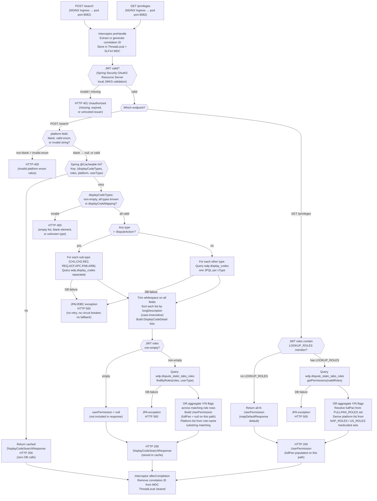

# WDP-COMP-28-DISPLAY-CODE-SERVICE
**Worldpay Dispute Platform — Component Reference**
*Version: 1.0 DRAFT | April 2026*
*Extracted from: gcp-display-code-service (Worldpay-mdvs-gcp-display-code-service.git)*
*Using GitHub Copilot CLI | Architect-confirmed: PENDING*

---

## ━━━ CORE SKELETON ━━━━━━━━━━━━━━━━━━━━━━━━━━━━━━━━━━━━━━

---

## Identity

| Field             | Value |
|-------------------|-------|
| **Name**          | `DisplayCodeService` |
| **Type**          | `REST API` |
| **Repository**    | `gcp-display-code-service` (Worldpay-mdvs-gcp-display-code-service.git) |
| **Artifact ID**   | `display-code-service` v1.5.6 |
| **Runtime**       | Spring Boot 3 / Java 17 |
| **Status**        | `✅ Production` |
| **Doc status**    | `📝 DRAFT` |
| **Sections present** | `Core | Block A (REST)` |

---

## Purpose

**What it does**

DisplayCodeService is a stateless, read-oriented microservice that acts as the
**reference-data lookup hub** for the Worldpay Dispute Platform. Given a list of
requested code domain names (e.g. reason codes, card networks, action codes,
stage codes) and an optional platform filter, it queries the `wdp.display_codes`
table in a shared PostgreSQL database and returns structured
code/short-description/long-description lists for each requested domain.

The service serves approximately 40 distinct code domain types, covering
everything from dispute stage labels and case status codes to business-rules
engine supporting codes (BR_* series). For the `disputeAction` domain, it
performs multiple sub-queries — one per action sub-type (CH1, CH2, RE2, REQ,
ACF, APC, PAB, ARB) — and assembles the results into a nested sub-object in
the response.

A **secondary function** resolves UI tab permissions for the calling user. On
the `POST /search` path, a `userPermission` object is included in the response,
derived by querying `wdp.dispute_static_tabs_rules` and OR-aggregating Y/N flags
across all matching role rows. A separate `GET /privileges` endpoint resolves
the same permissions data with additional signals: full-PAN access eligibility
and platform membership, derived from hardcoded role-name sets rather than
database data.

All results on the `POST /search` path are cached in-process using Spring
`@Cacheable`. The cache is a simple in-memory concurrent map with no TTL and
no proactive eviction; the cache key covers the full argument tuple
(displayCodeTypes, roles, platform, userType). Cache is populated lazily on
first request and invalidated only by pod restart.

**What it does NOT do**

- Does **not** determine TIER1 sub-product eligibility from fraud or INR reason
  code lists. It returns raw code lists filtered only by platform. Any
  eligibility logic is the responsibility of the calling service (e.g.
  COMP-04 NAPDisputeEventService). The COMP-INDEX description implying this
  service determines eligibility is **incorrect** — confirmed by Copilot source
  analysis.
- Does **not** perform any write operations at runtime (no INSERT, UPDATE, or
  DELETE). The `JpaTransactionManager` is configured but no transactional write
  path exists in the service layer. Both tables are populated via database
  migrations or DBA scripts, not by this service.
- Does **not** publish to or consume from any Kafka topic.
- Does **not** handle, store, or process PAN data of any kind. The `fullPan`
  field in `UserPermission` is a **permission indicator** (does the caller have
  full-PAN view rights?), not PAN data itself.
- Does **not** delegate JWT validation entirely to the API Gateway. It validates
  JWTs itself via Spring Security OAuth2 Resource Server, reading
  `AuthorizationList` and `iss` claims directly. This creates a second
  JWT validation layer in addition to any gateway-level auth.
- Does **not** use a connection pool. `DriverManagerDataSource` opens a new JDBC
  connection per `getConnection()` call. See Risks section.
- Does **not** apply locale or language mapping. `shortDescription` and
  `longDescription` are returned as stored. No grouping by category is applied.
- Does **not** expose any administrative CRUD endpoints. The service is entirely
  read-only at the HTTP layer.

---

## Internal Processing Flow



**Two-level code-type routing (POST /search):**
The `displayCodeMapping` config map (injected from the `display_code_types`
environment variable at startup) translates logical domain names (e.g. `"stage"`)
to database `c_type` column values (e.g. `"STAGE_CODE"`). This map is immutable
at runtime. The `disputeAction` key is special: its config value is a
comma-separated list of sub-type cType constants, each queried individually.

---

## Boundaries

### Inbound Interfaces

| Source | Protocol | Endpoint / Topic / Trigger | Payload / Description |
|--------|----------|--------------------------|-----------------------|
| COMP-04 NAPDisputeEventService | HTTPS / Bearer JWT | `POST /merchant/gcp/display-code/search` | Code domain lookup during enrichment (confirmed) |
| WDP Merchant Portal (COMP-49) | HTTPS / Bearer JWT | `POST /merchant/gcp/display-code/search` | Display code lookup for UI rendering (inferred — not source-confirmed) |
| WDP Ops Portal (COMP-50) | HTTPS / Bearer JWT | `POST /merchant/gcp/display-code/search` | Display code lookup + UI permission resolution (inferred) |
| WDP Merchant Portal (COMP-49) | HTTPS / Bearer JWT | `GET /merchant/gcp/display-code/privileges` | UI privilege flag resolution (inferred) |
| WDP Ops Portal (COMP-50) | HTTPS / Bearer JWT | `GET /merchant/gcp/display-code/privileges` | UI privilege flag resolution (inferred) |
| Other WDP workflow services | HTTPS / Bearer JWT | `POST /merchant/gcp/display-code/search` | ⚠️ Additional callers not determinable from source alone |
| Kubernetes | HTTP | `GET /actuator/health`, `GET /livez`, `GET /readyz` | Liveness and readiness probes (unauthenticated) |

### Outbound Interfaces

| Target | Protocol | Endpoint / Topic / Resource | Purpose | On failure |
|--------|-----------|-----------------------------|---------|------------|
| PostgreSQL (wdp schema) | JDBC / JPA | `wdp.display_codes` | Code/description lookup — primary function | HTTP 500 (no retry, no circuit breaker) |
| PostgreSQL (wdp schema) | JDBC / JPA | `wdp.dispute_static_tabs_rules` | UI permission resolution | HTTP 500 (no retry, no circuit breaker) |
| External IdP | HTTPS (Spring Security internal) | JWKS endpoint (config: `jwt_trusted_issuer_urls`) | JWT public key retrieval at startup; cached by Spring Security | May prevent application startup if unreachable; 401 at runtime |
| Logstash | TCP socket | `${logstash_server_host_port}` | Structured JSON log shipping | Non-fatal — log events lost silently |

---

## Database Ownership

### Tables Owned (written by this component)

*"Owned" in the JPA entity sense — both tables are declared as JPA entities
in this service's codebase. However, this service performs **no runtime writes**
(no INSERT/UPDATE/DELETE). Both tables are populated via database migrations
or DBA scripts outside the service runtime.*

| Schema.Table | Purpose | Key columns | Retention / Notes |
|--------------|---------|-------------|-------------------|
| `wdp.display_codes` | Maps internal code values to human-readable short and long descriptions, filtered by platform and code domain type | PK: `i_display_code` (sequence); `c_type` (domain e.g. REASON_CODE, STAGE_CODE); `c_code` (the value e.g. CH1, 4853); `c_desc_shrt` (short label); `c_desc_long` (long label); `c_acq_platform` (ALL / NAP / PIN etc.); `i_display_seq` (display order — not used by service, sorts by `c_desc_long` instead); audit cols `z_insrt`, `x_insrt`, `x_updt`, `z_updt` | Populated via DB migrations. No runtime writes. Key query: `WHERE c_type = :cType AND (:platform IS NULL OR c_acq_platform IN ('ALL', :platform))` |
| `wdp.dispute_static_tabs_rules` | Maps WDP role names to UI tab permission flags (Y/N per feature area) and user type (INTERNAL/EXTERNAL) | PK: `id` (sequence); `role` (WDP role name e.g. WDP_NAP_REGULAR); `user_type` (INTERNAL / EXTERNAL); Y/N flag columns: `disputes`, `queues`, `automation`, `skills_mgmt_edit`, `rule_mgmt_edit`, `org_mgmt_view`, `org_edit`, `murch_org_edit`, `user_mgmt_view`, `user_mgmt_edit`, `adv_action`, `fax_match`, `fax_report`, `trans_detail`, `auth_detail`, `settle_detail`, `dispute_history`; audit cols | Populated via DB migrations. No runtime writes. Multiple rows per role possible; resolved by OR-aggregation across all matching rows. |

### Tables Read (not owned by this component)

*This service does not read any tables it does not own. Both tables above
are JPA entities declared within this service's repository.*

---

## Configuration and Scaling

| Parameter | Value | Notes |
|-----------|-------|-------|
| Replica count | `{{ replicas-mdvs-gcp-display-code-service }}` | XL Deploy (Digital.ai Deploy) template variable — exact integer not determinable from source |
| HPA | None | No HorizontalPodAutoscaler resource present in resources.yaml |
| Memory request | `1024Mi` | Confirmed from resources.yaml |
| Memory limit | `2048Mi` | Confirmed from resources.yaml |
| CPU request | Not set | Neither `limits.cpu` nor `requests.cpu` defined — container is CPU-unlimited (node-bounded) |
| CPU limit | Not set | See above |
| Deployment type | `Kubernetes Deployment` | Declared as `kind: Deployment` in resources.yaml |
| Rollout strategy | `RollingUpdate — maxSurge: 1, maxUnavailable: 0` | One extra pod spun up before any existing pod is taken offline |
| PodDisruptionBudget | None | No PDB resource in resources.yaml |
| Topology spread | `ScheduleAnyway` (best-effort, hostname spread) | Label selector uses `${BRANCH_NAME_PLACEHOLDER}` CI/CD token — matches correctly on main/production branch; feature branches also match correctly as suffix is applied consistently. Constraint is advisory, not enforced. |
| Database connection pool | **None — DriverManagerDataSource** | ⚠️ No HikariCP or DBCP2. Each `getConnection()` opens a new JDBC connection. No connection timeout or read timeout configured. See Risks section. |
| Spring Cache | `@Cacheable("displayCodes")` — ConcurrentMapCacheManager | In-memory, no TTL, no eviction, lazy population. Invalidated only by pod restart. Cache key = (displayCodeTypes, roles, platform, userType). |
| Observability | OpenTelemetry Java agent + Spring Actuator + Micrometer/Prometheus + Logstash | OTel: `instrumentation.opentelemetry.io/inject-java` annotation on pod template. Actuator: info, health, prometheus exposed. Prometheus: `micrometer-registry-prometheus` dependency. Logstash: LogstashTcpSocketAppender v7.4 shipping to `${logstash_server_host_port}`. ⚠️ `hibernate.show-sql = true` is active in PersistenceConfig — logs raw SQL to application log; acceptable in non-prod but potentially verbose in production. |

---

## Key Architectural Decisions

| Decision | ADR reference | Notes |
|----------|---------------|-------|
| Read-only service, stateless at runtime | Local decision | No writes at runtime. Both owned tables populated by migrations only. Simplifies deployment and replica scaling — no write-ordering concerns. |
| Spring `@Cacheable` for code lookup — no external cache | Local decision | In-memory ConcurrentMapCacheManager. Zero latency on cache hit. Trade-off: stale codes persist until pod restart; no cross-replica cache sharing. |
| Self-validates JWT via Spring Security OAuth2 | Local decision | Service reads JWT `AuthorizationList` and `iss` claims directly. This creates a second JWT validation layer beyond any API Gateway pass-through. Callers must present a valid JWT regardless of upstream auth. |
| No Kafka involvement | Local decision | Complies by absence. DEC-001, DEC-003, DEC-005 not applicable. |
| No PAN data handled | Local decision — complies with DEC-004 | `fullPan` in UserPermission is a permission flag, not PAN data. Full compliance confirmed by Copilot codebase scan. |
| No Resilience4j circuit breakers | DEC-014 — DEVIATION | No `resilience4j` dependency in pom.xml. No `@CircuitBreaker` annotation anywhere. Sole outbound DB dependency has no circuit breaker, retry, or timeout. All dependencies also have no CB. Confirmed explicit deviation from DEC-014. |
| DriverManagerDataSource (no connection pool) | Local decision — ⚠️ RISK | `DriverManagerDataSource` opens a new JDBC connection per call. No HikariCP. No pooling timeouts configurable. Identified as a significant production throughput concern in Copilot analysis. |
| TIER1 sub-product eligibility NOT performed here | Local decision | Raw code lists returned to caller. Eligibility determination is the caller's responsibility (e.g. COMP-04 NAPDisputeEventService). ⚠️ WDP-COMP-INDEX.md description implies this service performs eligibility — that description is incorrect and should be updated. |

---

## Risks and Constraints

| Severity | Risk | Consequence |
|----------|------|-------------|
| 🔴 HIGH | **No database connection pool** — `DriverManagerDataSource` opens a new JDBC connection per request with no pooling, no timeout, and no retry. Under load, the service will exhaust database connections at the PostgreSQL server level. | Connection exhaustion at moderate request rates. No graceful degradation — all in-flight requests return HTTP 500. Full service outage for all callers including UI rendering and inbound enrichment paths. |
| 🔴 HIGH | **No circuit breaker or timeout on PostgreSQL dependency** — if the database is slow or unavailable, all threads block indefinitely. No Resilience4j configured (confirmed DEC-014 deviation). | Thread pool starvation. Service becomes unresponsive until database recovers or pods are restarted. Cascading failure upstream to all callers. |
| 🟡 MEDIUM | **Spring Cache has no TTL and evicts only on pod restart** — code/description data updated in the database does not propagate to in-process caches until the pod restarts. Cache is not shared across replicas. | Different replicas may serve different code values after a database update. Operators must restart all pods to propagate reference data changes. |
| 🟡 MEDIUM | **Self-JWT-validation in addition to API Gateway** — the service validates JWTs locally via Spring Security OAuth2. The JWKS endpoint is fetched at startup; if the IdP is unreachable at startup, the application may fail to start. | Application startup failure in environments where IdP is momentarily unavailable. No explicit startup retry configured. |
| 🟡 MEDIUM | **Known callers not source-confirmed beyond COMP-04** — the full set of WDP components that call this service is not determinable from the service's own source. If callers are not catalogued, breaking changes to the response contract cannot be safely assessed. | Undetected contract breaks on schema changes. Callers receive unexpected null fields or HTTP 400s after deployment. |
| 🟡 MEDIUM | **`userId` field in `DisplayCodeSearchRequest` model is declared but never read** — present in the request model and Swagger spec but ignored by all service logic. | Misleading API contract. Callers may populate it expecting some effect. Dead field creates maintenance confusion. |
| 🟢 LOW | **`hibernate.show-sql = true` active in `PersistenceConfig`** — logs raw SQL to application log in all environments including production. | Verbose production logs. Potential for sensitive query structure or parameter values to appear in log aggregation systems (Logstash/Kibana). |
| 🟢 LOW | **Commented-out hardcoded Logstash IP addresses in `logback-spring.xml`** — development/staging remnants not cleaned up. | No runtime impact. Latent confusion in configuration review. |
| 🟢 LOW | **Bare `// TODO` comment in `GlobalExceptionHandler.java`** — no description of what remains to be done on the `HttpRequestMethodNotSupportedException` handler. | No functional impact. Technical debt marker. |

---

## Planned Changes

- ⚠️ **OPEN QUESTION — Architect decision required:** The `DriverManagerDataSource`
  (no connection pool) is a confirmed production throughput risk. Has this been
  identified and is a HikariCP migration planned? Confirm with team.

- ⚠️ **OPEN QUESTION — Confirm full caller inventory:** Known callers beyond
  COMP-04 NAPDisputeEventService are not source-determinable. UI portals
  (COMP-49, COMP-50) are strongly inferred but not source-confirmed. Full
  caller list needed before any contract changes.

- ⚠️ **OPEN QUESTION — Correct WDP-COMP-INDEX.md description:** Current entry
  states this service "determines TIER1 sub-product eligibility from fraud and
  INR reason code lists." Copilot analysis confirms this is incorrect — the
  service returns raw code lists; eligibility determination is performed by the
  caller. COMP-INDEX should be updated.

- ⚠️ **OPEN QUESTION — Database instance confirmation:** The Copilot report
  labels the PostgreSQL dependency as "GCP-hosted" and the service artifact
  prefix is `gcp-`. Confirm whether this service connects to the standard WDP
  Aurora PostgreSQL (globaldisputedatabase) or a separate PostgreSQL instance.
  WDP-HANDOVER.md states all components run on the same AWS EKS cluster —
  confirm this applies to DisplayCodeService.

- No feature flags, migration flags, or sprint-scoped planned changes confirmed
  as of April 2026.

---

---

## ━━━ TYPE BLOCK A — REST API CONTRACTS ━━━━━━━━━━━━━━━━━━━

---

## REST API Contracts

**Authentication model:**
JWT Bearer token validation is performed **by this service itself** via Spring
Security OAuth2 Resource Server — it is not delegated to an upstream API
Gateway. The service configures `JwtIssuerAuthenticationManagerResolver` with
trusted issuer URLs injected from the `jwt_trusted_issuer_urls` runtime secret.
The JWT is not merely passed through — the service reads `AuthorizationList`
and `iss` claims directly. Any request to a non-whitelisted endpoint without a
valid JWT receives HTTP 401. In non-prod environments, Swagger UI and API docs
paths are whitelisted (unauthenticated).

**Base URL pattern:**
`https://<host>/merchant/gcp/display-code`

**Context path:** `/merchant/gcp/display-code`
**Service port:** 8082

---

### Endpoint: `POST /search`

**Purpose:** Retrieve display code lists for one or more code domains, and
resolve the calling user's UI permission flags — all in a single response.

**Caller(s):** COMP-04 NAPDisputeEventService (confirmed); UI portals COMP-49
and COMP-50 (strongly inferred — not source-confirmed); other WDP workflow
services (potential — not source-confirmed).

**Auth required:** Bearer JWT (enforced by Spring Security OAuth2)

**Request**

| Source | Field | Type | Required | Description |
|--------|-------|------|----------|-------------|
| Request body | `displayCodeTypes` | `List<String>` | Yes (`@NotEmpty`) | One or more logical code domain names (e.g. `"reasonCode"`, `"stage"`, `"disputeAction"`) — must be non-empty and each entry must be a known domain from the `displayCodeMapping` config |
| Request body | `platform` | `String` | No | Platform filter — valid values: `NAP`, `PIN`, `VAP`, `LATAM`, `CORE` (case-insensitive); blank or absent treated as null (matches ALL platforms) |
| Request body | `userId` | `String` | No | Present in request model and Swagger spec — **⚠️ never read by any service logic** |
| Header | `v-correlation-id` | `String` | No | Correlation ID propagated to MDC; auto-generated as UUID if absent |
| Header | `Authorization` | `String` | Yes | Bearer JWT token |

**Supported `displayCodeTypes` values (logical name → DB cType):**

The full mapping is controlled by the `display_code_types` environment variable.
The following domains are confirmed from `ApplicationConstants`:

| Logical name (request) | DB `c_type` value | Notes |
|------------------------|-------------------|-------|
| `reasonCode` | `REASON_CODE` | |
| `stage` | `STAGE_CODE` | |
| `caseStatus` | `CASE_STATUS` | |
| `noteType` | `NOTE_TYPE` | |
| `documentType` | `DOCUMENT_TYPE` | |
| `cardNetwork` | `CARD_NETWORK` | |
| `owner` | `OWNER` | |
| `fraudReasonCode` | `FRAUD_REASON_CODE` | |
| `nonFraudRsnCode` | `NONFRAUD_RSN_CODE` | |
| `action` / `actionStatus` | `ACTION_STATUS` | |
| `caseLiability` | `CASE_LIABILITY` | |
| `currency` | `CURRENCY` | |
| `subProductType` | `SUB_PRODUCT_TYPE` | |
| `writeOffReason` | `WRITOFF_RSN` | |
| `workQueue` | `WORK_QUEUE` | |
| `inrReasonCode` | `INR_REASON_CODE` | |
| `networkAcro` | `NETWORK_ACRO` | |
| `disputeAction` | `ACTION_CH1, ACTION_CH2, ACTION_RE2, ACTION_REQ, ACTION_ACF, ACTION_APC, ACTION_PAB, ACTION_ARB` | ⚠️ Special — comma-separated sub-types; each queried separately |
| `cardPresent` | `BR_CARD_PRSNT` | Business rules engine supporting codes |
| `cardInputMode` | `BR_CARD_IF_MODE` | |
| `pendReason` | `BR_PEND_RSN` | |
| `schemeResponseCode` | `BR_SCHEME_RESP_CODE` | |
| `inputMethod` | `BR_INPUT_METHOD` | |
| `userAssignmentReason` | `BR_USR_ASSIGNMT_RSN` | |
| `inputCapability` | `BR_INPUT_CAP` | |
| `cardHolderPresent` | `BR_CARD_HLDR_PRSNT` | |
| `avs` | `BR_AVS` | |
| `heldReason` | `BR_HELD_REASON` | |
| `disputeResponseReason` | `BR_DSPT_RESP_RSN` | |
| `ruleGroup` | `BR_RULE_GRP` | |
| `transactionType` | `BR_TRANS_TYPE` | |
| `authenticationMethod` | `BR_AUTH_MTND` | |
| `cardSecurityProtocol` | `BR_CARD_SEC_PROT` | |
| `authenticationEntity` | `BR_AUTH_ENITY` | Note: cType value appears to contain a typo (ENITY vs ENTITY) — confirm from DB |
| `sendMerchantTmp` | `BR_SND_MRCH_TMP` | |
| `outOfHoldReason` | `BR_OUT_HOLD_REASON` | |
| `cardHolderAuthentication` | `BR_CARD_HLDR_AUTH` | |
| `networkDocumentIndicator` | `BR_NTWK_DOC_IND` | |
| `ucafIndicator` | `BR_UCAF_IND` | |
| `cvv` | `BR_CVV` | |
| `workflowName` | `WORKFLOW_NAME` | |
| `functionCode` | `FUNCTION_CODE` | |
| `adjustmentReason` | `ADJ_RSN` | |
| `assignmentReason` | `ASSIGNMENT_REASON` | |
| `bsaCode` | `BSA_CODE` | |
| `gcmsProduct` | `GCMS_PRODUCT` | |
| `region` | `REGION` | |
| `cardOutputCapability` | `BR_CARD_OUTPUT_CAP` | |
| `userRoleAccess` | `USER_ACCESS_TAB` | |
| `adjAccountType` | `ADJ_ACCT_TYPE` | |
| `adjTransType` | `ADJ_TRANS_TYPE` | |
| `adjDenialRsn` | `ADJ_DENIAL_RSN` | |
| `adjustmentType` | `ADJ_TYPE` | |
| `adjustmentStatus` | `ADJ_STATUS` | |
| `adjDeleteRsn` | `ADJ_DELETE_RSN` | |
| `faxQueue` | `FAX_QUEUE` | |

**Response — Success**

| HTTP Status | Condition | Body |
|-------------|-----------|------|
| 200 | Successful processing (cache hit or DB query) | `DisplayCodeSearchResponse` — top-level JSON object where each requested code domain is a named field containing `List<DisplayCodeDetail>` (or `null` if not requested); plus a `userPermission` object (or `null` if caller has no WDP roles). |

`DisplayCodeDetail` structure (per code item):
```
{ "code": "CH1", "description": "FIRST Chargeback", "longDescription": "FIRST Chargeback" }
```

`disputeAction` is returned as a nested sub-object:
```
"disputeAction": { "CH1": [...], "CH2": [...], "RE2": [...], ... }
```

`userPermission` structure (when JWT roles non-empty):
```
{
  "disputes": "Y|N",  "queues": "Y|N",  "automation": "Y|N",
  "skillsMgmtEdit": "Y|N",  "ruleMgmtEdit": "Y|N",
  "orgMgmtView": "Y|N",  "orgEdit": "Y|N",  "mrchOrgEdit": "Y|N",
  "userMgmtView": "Y|N",  "userMgmtEdit": "Y|N",  "advAction": "Y|N",
  "faxMatch": "Y|N",  "faxReport": "Y|N",  "transDetail": "Y|N",
  "authDetail": "Y|N",  "settleDetail": "Y|N",  "disputeHistory": "Y|N",
  "fullPan": null,          ← always null on POST /search path
  "platform": ["NAP", ...]  ← derived from role-name substring matching
}
```

**Response — Error**

| HTTP Status | Condition |
|-------------|-----------|
| 400 | `displayCodeTypes` is empty (`@NotEmpty` violation) |
| 400 | Any element of `displayCodeTypes` is blank |
| 400 | Any element of `displayCodeTypes` is not in the `displayCodeMapping` config ("not supported") |
| 400 | `platform` is non-blank but not a valid `Platform` enum value |
| 400 | Malformed request body (`MethodArgumentNotValidException`, `ConstraintViolationException`, `MethodArgumentTypeMismatchException`) |
| 400 | JWT is null or has null claims (`BadRequestException` "Token is blank") |
| 401 | JWT missing, expired, or signed by untrusted issuer (Spring Security OAuth2) |
| 404 | No handler found for requested path |
| 405 | Wrong HTTP method for existing path |
| 500 | Unreadable request body (`HttpMessageNotReadableException`) |
| 500 | Database unreachable or query failure (JPA/JDBC exception) |
| 500 | JWT `iss` claim blank (falls through to `RuntimeException` handler) |
| 500 | Any other unhandled `RuntimeException` |

**Notes:**
- Cache hit path returns HTTP 200 with zero DB calls. Cache key includes the
  full argument tuple — different callers with different role sets get separate
  cache entries.
- If JWT roles are empty, `userPermission` is `null` in the response — no error
  is raised.
- If a DB query returns zero rows, the corresponding response field is set to
  an empty list — HTTP 200 is still returned. No 404 is raised for missing codes.
- `fullPan` is always `null` on the `POST /search` path — use `GET /privileges`
  to obtain a populated `fullPan` value.

---

### Endpoint: `GET /privileges`

**Purpose:** Resolve UI privilege flags for the calling user, including
full-PAN access eligibility and acquiring platform membership, based on JWT
roles. Does not return any display code lists.

**Caller(s):** WDP Merchant Portal (COMP-49) and WDP Ops Portal (COMP-50) —
inferred from data served. Not source-confirmed.

**Auth required:** Bearer JWT (enforced by Spring Security OAuth2)

**Request**

| Source | Field | Type | Required | Description |
|--------|-------|------|----------|-------------|
| Header | `v-correlation-id` | `String` | No | Correlation ID |
| Header | `Authorization` | `String` | Yes | Bearer JWT token |

No request body. No query parameters.

**Response — Success**

| HTTP Status | Condition | Body |
|-------------|-----------|------|
| 200 | Successful processing | `UserPermission` object |

`UserPermission` structure (GET /privileges path):
```
{
  "disputes": "Y|N",  "queues": "Y|N",  "automation": "Y|N",
  "skillsMgmtEdit": "Y|N",  "ruleMgmtEdit": "Y|N",
  "orgMgmtView": "Y|N",  "orgEdit": "Y|N",  "mrchOrgEdit": "Y|N",
  "userMgmtView": "Y|N",  "userMgmtEdit": "Y|N",  "advAction": "Y|N",
  "faxMatch": "Y|N",  "faxReport": "Y|N",  "transDetail": "Y|N",
  "authDetail": "Y|N",  "settleDetail": "Y|N",  "disputeHistory": "Y|N",
  "fullPan": "Y|N",    ← populated on this path (from FULLPAN_ROLES set)
  "platform": ["NAP", "PIN", "CORE", ...]  ← derived from NAP_ROLES/US_ROLES hardcoded sets
}
```

If JWT roles contain no `LOOKUP_ROLES` members, all flags default to `"N"` and
lists to `null` via `mapDefaultResponse()` — HTTP 200 still returned.

**Response — Error**

Same HTTP status codes as `POST /search` (400, 401, 404, 405, 500) — same
conditions apply.

**Notes:**
- This endpoint is **not cached** with `@Cacheable`. Each call queries the
  database.
- `fullPan` is populated here via `fullPanAccess(roles)` which checks
  `FULLPAN_ROLES` (contains `merchantSpecialFunctions.MRViewFullCardNumber`).
- Platform list is derived from `NAP_ROLES` and `US_ROLES` hardcoded sets —
  not from database data. This differs from `POST /search` which uses role-name
  substring matching against `Platform` enum values.
- The two platform-derivation strategies (search path vs privileges path) are
  different code paths and may produce different results for the same caller.
  Confirm whether this is intentional design or inconsistency.

---

*End of component file.*
*Update WDP-COMP-INDEX.md doc status from 📋 PENDING to 📝 DRAFT.*
*Add wdp.display_codes and wdp.dispute_static_tabs_rules to WDP-DB.md.*
*No WDP-KAFKA.md updates required — confirmed no Kafka involvement.*
