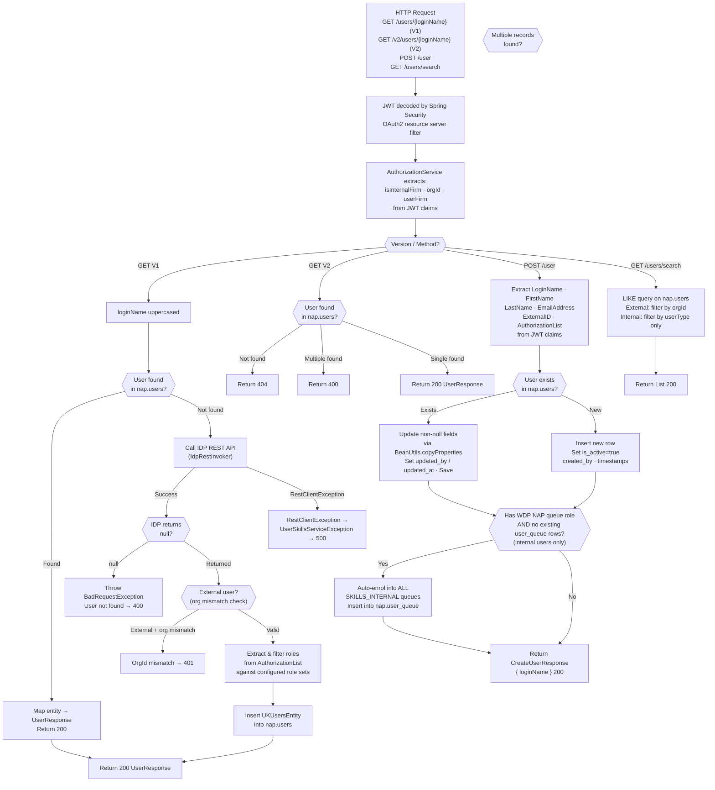
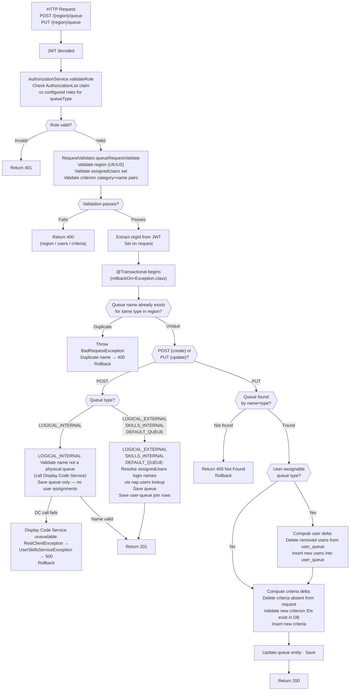
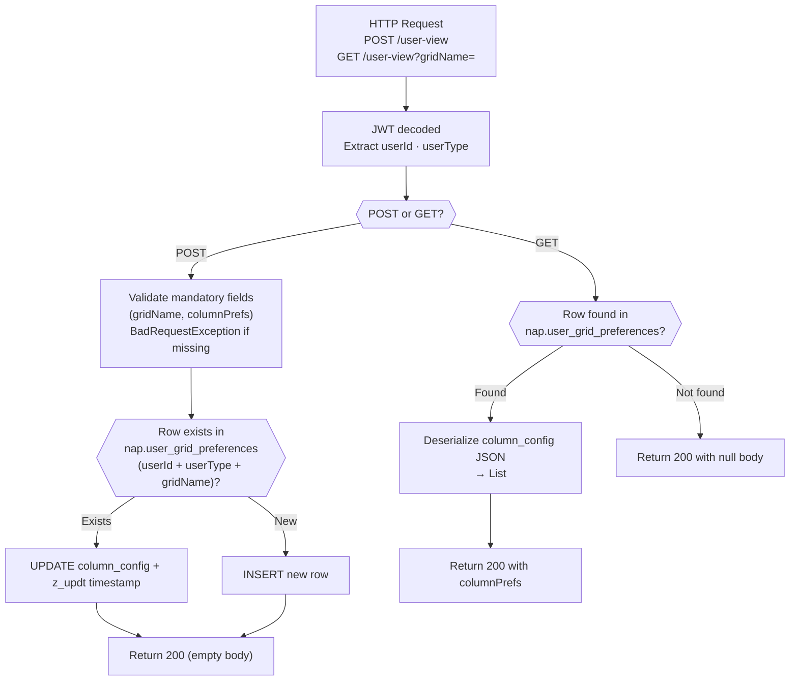
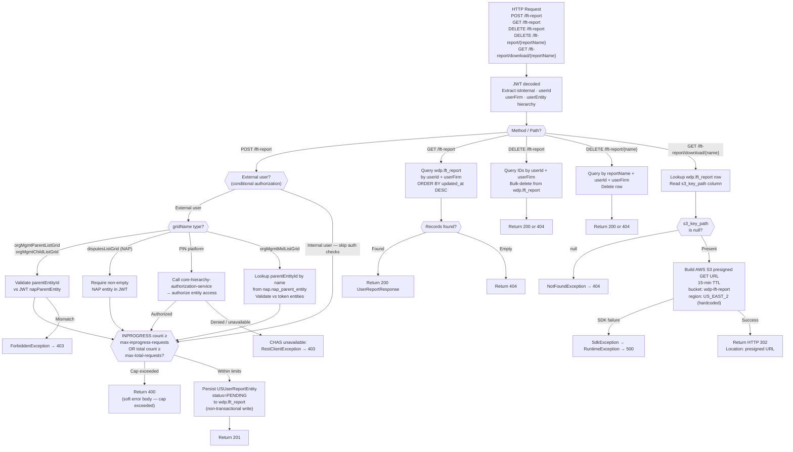

# WDP-COMP-30-USER-QUEUE-SKILL-SERVICE
**Worldpay Dispute Platform — Component Reference**
*Version: 1.0 DRAFT | April 2026*
*Extracted from: gcp-user-queue-skill-service using GitHub Copilot CLI | Architect-confirmed: PENDING*

---

## ━━━ CORE SKELETON ━━━━━━━━━━━━━━━━━━━━━━━━━━━━━━━━━━━━━━
*Mandatory for every component regardless of type.*

---

## Identity

| Field             | Value                                                        |
|-------------------|--------------------------------------------------------------|
| **Name**          | `UserQueueSkillService`                                      |
| **Artifact**      | `gcp-user-queue-skill-service`                               |
| **Type**          | REST API                                                     |
| **Repository**    | `gcp-user-queue-skill-service`                               |
| **Runtime**       | Java 17 / Spring Boot 3.5.5 / PostgreSQL                     |
| **Version**       | 1.1.7                                                        |
| **Status**        | ✅ Production                                                 |
| **Doc status**    | 📝 DRAFT                                                     |
| **Sections present** | Core \| Block A (REST API)                              |

---

## Purpose

**What it does**

`UserQueueSkillService` is the **data management and light-eligibility service** for user, queue, and skill relationships on the Worldpay Dispute Platform. It owns the user registry, queue definitions, queue-criterion (skill filter) rules, user-to-queue assignments, user column-view preferences, and async large-file-transfer (LFT) export request lifecycle. It is the authoritative store for *which queues exist*, *what criteria those queues define*, and *which users are assigned to which queues*.

The service operates across two regions served from the same deployed pod. UK operations use the `nap` PostgreSQL schema (via a dedicated UK datasource). US operations use the `wdp` PostgreSQL schema (via a separate US datasource). The two datasources are entirely independent — no XA or distributed transaction spans them.

On first encounter with a user (V1 GET by login name), the service calls an upstream Identity Provider (IDP) to retrieve user details and persists them locally. Subsequent lookups are served from the local database. A V2 endpoint performs DB-only lookup with no IDP fallback.

When a new internal user is registered via `POST /user` and holds a recognised WDP NAP queue role, the service auto-enrols that user into all queues of type `SKILLS_INTERNAL` as an atomic side-effect of the upsert.

The service additionally manages an async LFT report request lifecycle: users submit export requests, the service validates counts and persists a `PENDING` row in `wdp.lft_report`, and report files (once generated externally) are made available for download via 15-minute AWS S3 presigned URLs.

**What it does NOT do**

- Does **not** make real-time eligibility routing decisions on live cases. It stores the criteria and assignments; the matching of a live case against those criteria is performed by a downstream component (not determinable from source alone).
- Does **not** publish to any Kafka topic.
- Does **not** consume from any Kafka topic.
- Does **not** use a transactional outbox pattern — all writes are direct table mutations.
- Does **not** handle PAN (Primary Account Number) data in any form.
- Does **not** generate LFT report files — it only tracks request status and provides presigned download URLs once files are available in S3.
- Does **not** configure Resilience4j circuit breakers on any outbound call.

---

## Internal Processing Flow

*The service exposes four logical endpoint groups. Each is shown as a separate flow below.*

### Flow A — User Lookup and Registration



---

### Flow B — Queue Create and Update



---

### Flow C — User View (Column Preferences)



---

### Flow D — LFT Report Lifecycle



---

## Boundaries

### Inbound Interfaces

| Source | Protocol | Endpoint / Trigger | Payload / Description |
|--------|----------|--------------------|-----------------------|
| WDP Ops Portal (COMP-50) | REST | All endpoints under `/merchant/gcp/user-queue-skill` | JWT-authenticated portal UI requests — user management, queue management, view preferences |
| WDP Merchant Portal (COMP-49) | REST | All endpoints under `/merchant/gcp/user-queue-skill` | JWT-authenticated portal UI requests |
| Unknown downstream callers | REST | `POST /user` | Likely invoked on login/session-start to register or sync user from IDP. Callers not determinable from source — no `@KnownCallers` annotation present |
| Unknown export scheduler or portal | REST | `POST /lft-report` | Async export request submission |

### Outbound Interfaces

| Target | Protocol | Endpoint / Resource | Purpose | On failure |
|--------|----------|---------------------|---------|------------|
| IDP Internal (`idp.internal.user-api-base-url`) | HTTPS REST GET | IDP internal user API | Fetch user details on first V1 login (IDP fallback path only) | RestClientException → UserSkillsServiceException → 500 |
| IDP External (`idp.external.user-api-base-url`, `idp.external.user-api-fraud-disputes-merchant-url`) | HTTPS REST GET | IDP external user API (two endpoints: standard and MFD) | Fetch external user details on first V1 login | RestClientException → 500 |
| Display Code Service (`mdvs-gcp-display-code-service.wdp-micro:8082`) | HTTP POST (in-cluster) | `/merchant/gcp/display-code/search` | Validate LOGICAL_INTERNAL queue name is not already a physical queue name | RestClientException → UserSkillsServiceException → 500 |
| Core Hierarchy Authorization Service (`core-hierarchy-authorization-service.wdp-micro:8082`) | HTTP POST (in-cluster) | `/merchant/gcp/hierarchy-authorization` or `/entity-authorize` | Authorize entity hierarchy access for PIN platform users submitting LFT reports | RestClientException → ForbiddenException → 403 |
| AWS S3 (`wdp-lft-report` bucket, region `us-east-2`) | AWS SDK v2 | S3 presigned URL generation | Generate 15-minute presigned GET URL for report download | SdkException → RuntimeException → 500 |
| PostgreSQL (`nap` schema — UK datasource) | JPA/JDBC | Multiple tables — see Database Ownership | All UK user/queue/criterion/assignment operations | Uncaught DB exception → 500 |
| PostgreSQL (`wdp` schema — US datasource) | JPA/JDBC | Multiple tables — see Database Ownership | All US queue/LFT report operations | Uncaught DB exception → 500 |

---

## Database Ownership

### Tables Owned (written by this component)

#### UK Datasource — `nap` schema

| Schema.Table | Purpose | Key columns | Notes |
|--------------|---------|-------------|-------|
| `nap.users` | User registry — all WDP platform users | `id`, `login_name`, `user_type`, `orgid`, `is_active`, `c_usr_firm`, `role` (array) | Upserted on V1 GET (IDP fallback) and POST /user. Auto-enrol side-effect writes to `nap.user_queue`. |
| `nap.queues` | Queue definitions (UK region) | `id`, `name`, `type`, `orgid`, `criteria_summary` | Written by POST and PUT /{region}/queue (UK path). @Transactional with queue_criterion and user_queue. |
| `nap.queue_criterion` | Filter criteria per queue (UK region) | `id`, `queue_id` (FK), `type`, `category`, `name`, `value`, `operator_symbol` | One-to-many child of nap.queues. Cascade ALL. Same transaction as queue write. |
| `nap.user_queue` | User-to-queue assignments (UK region) | `id`, `user_id` (FK→users), `queue_id` (FK→queues) | Join table. Written in same transaction as queue create/update. Also written on auto-enrol (POST /user). |
| `nap.user_grid_preferences` | User column-view preferences (serialized JSON) | `id`, `user_id`, `user_type`, `grid_name`, `column_config` (JSON) | Upserted by POST /user-view. |

#### US Datasource — `wdp` schema

| Schema.Table | Purpose | Key columns | Notes |
|--------------|---------|-------------|-------|
| `wdp.queues` | Queue definitions (US region) | `id`, `name`, `type`, `orgid` | Written by POST and PUT /{region}/queue (US path). Separate transaction manager from nap — no XA. |
| `wdp.queue_criterion` | Filter criteria per queue (US region) | `id`, `queue_id` (FK), `type`, `category`, `name`, `value`, `operator_symbol` | Same transaction scope as wdp.queues. |
| `wdp.user_queue` | User-to-queue assignments (US region) | `id`, `user_id`, `queue_id` | Same transaction scope as wdp.queues. |
| `wdp.lft_report` | Async LFT export request tracking | `id`, `user_id`, `user_firm`, `grid_name`, `report_name`, `status`, `s3_key_path`, `criteria` (JSON), `user_entity` (JSON), `platform` | Written by POST /lft-report. Read by GET, DELETE, and download endpoints. Write is **not** transactional — no `@Transactional` on create path. |

### Tables Read (not owned by this component)

| Schema.Table | Owned by | Why accessed |
|--------------|----------|--------------|
| `nap.nap_parent_entity` | Unknown — read-only consumer | LFT report creation: lookup `parentEntityId` by name for `orgMgmtMidListGrid` validation |
| `wdp.case` | CaseManagementService or DisputeService | LFT report creation: Merchant/chain ID lookup for PIN platform authorization |
| `wdp.action` | CaseManagementService or DisputeService | LFT report creation: source case ID lookup (fallback join with wdp.case) |

### Transaction Scope Notes

- `createQueue` and `updateQueue` are `@Transactional(rollbackOn = Exception.class)` — queue + criterion + user_queue inserts and deletes are all in **one transaction per datasource**.
- The UK (`nap`) and US (`wdp`) datasources use **separate JPA EntityManagerFactory instances and separate transaction managers**. There is **no XA/distributed transaction** between them. A failure after committing one datasource but before committing the other cannot be automatically rolled back.
- `lft_report` inserts are **not transactional** — no `@Transactional` annotation on the `createUserReport` path.

---

## Configuration and Scaling

| Parameter | Value | Notes |
|-----------|-------|-------|
| Replica count | `{{ replicas-gcp-user-queue-skill-service }}` | XL Deploy / Helm placeholder. Exact production value not determinable from source. |
| HPA | None | No HorizontalPodAutoscaler manifest present |
| Memory request | `1024Mi` | |
| Memory limit | `2048Mi` | |
| CPU request | Not set | Not specified in resources.yaml |
| CPU limit | Not set | Not specified in resources.yaml |
| Deployment type | Kubernetes Deployment | Standard stateless deployment |
| Rollout strategy | RollingUpdate — maxSurge: 1, maxUnavailable: 0 | |
| minReadySeconds | 30 | Set in resources.yaml |
| PodDisruptionBudget | None | No PDB manifest present |
| Topology spread | ScheduleAnyway — best-effort, not enforced | Label selector uses `${BRANCH_NAME_PLACEHOLDER}` suffix — functional limitation if branch name contains special characters |
| Observability | OTel Java agent · Spring Actuator · Logstash · Prometheus | OTel: `instrumentation.opentelemetry.io/inject-java: opentelemetry-operator-system/default`. Actuator: `/info`, `/health`, `/prometheus`. Liveness: `/livez`. Readiness: `/readyz`. |
| Context path | `/merchant/gcp/user-queue-skill` | Set via `SERVER_SERVLET_CONTEXT_PATH` env var |
| Async thread pool | `async.corePoolSize`, `async.maxPoolSize`, `async.queueCapacity` configured in application.yaml | AsyncConfiguration.java is present but async task execution is **not used** in any active endpoint — dead configuration |
| S3 region | `us-east-2` (hardcoded — `Region.US_EAST_2`) | Not environment-configurable |
| S3 presigned URL TTL | 15 minutes (hardcoded) | Not configurable |
| Internal firm constant | `us_worldpay_fis_int` (hardcoded) | `ApplicationConstants.INTERNAL_FIRM` |

---

## Key Architectural Decisions

| Decision | ADR reference | Notes |
|----------|---------------|-------|
| Service is a data provider only — routing decisions made externally | Local decision | Stores queue criteria and user assignments. Matching of live cases to queues is NOT performed here — downstream caller responsibility. |
| Dual-datasource design: separate nap (UK) and wdp (US) schemas from same pod | Local decision | No XA transaction. UK and US writes cannot be atomically coordinated. |
| No transactional outbox | DEC-001 — ABSENT | All writes are direct table mutations. No event publication accompanies any write. Confirmed explicitly from source. |
| No Kafka involvement | DEC-003, DEC-005 — NOT APPLICABLE | No Kafka dependency in pom.xml. Neither producer nor consumer. |
| No PAN data | DEC-004 — NOT APPLICABLE | Service stores dispute routing metadata only. No PAN fields in any entity. |
| No Resilience4j on any outbound call | DEC-014 — DEVIATION | No `resilience4j` dependency in pom.xml. All four external dependencies (IDP internal, IDP external, Display Code Service, CHAS, AWS S3 SDK) have no circuit breaker, bulkhead, or rate-limiter. |
| No REST timeouts on any outbound call | Local decision | All `RestTemplate` instances use `CommonConfig.getRestTemplate()` — plain `new RestTemplate()` with no connection or read timeout configured. |
| SKILLS_INTERNAL queue type used as skill model | Local decision | No dedicated "skill" entity exists. Skills are represented by `SKILLS_INTERNAL` queue type. User skill assignment = user_queue join row to a SKILLS_INTERNAL queue. |
| lft_report insert is non-transactional | Local decision | `@Transactional` is absent on the LFT report create path. A partial failure cannot be automatically rolled back. |
| Region-specific UK/US role validation removed | Local decision | A commented-out `validateUserRole` method with separate UK/US role sets (`internalUKRoles`, `externalUKRoles`, `internalUSRoles`, `externalUSRoles`) was replaced by a single queue-type-based `validateRole`. The removed config properties no longer exist in application YAML. |

---

## Risks and Constraints

| Severity | Risk | Consequence |
|----------|------|-------------|
| 🔴 HIGH | No Resilience4j circuit breaker on IDP calls. IDP unavailability causes all V1 GET /users/{loginName} calls for non-cached users to return 500, blocking user session establishment across all portals. | Complete portal access failure for users not yet in local DB during IDP outage. |
| 🔴 HIGH | No Resilience4j circuit breaker on Core Hierarchy Authorization Service. CHAS unavailability causes all POST /lft-report requests from external PIN users to return 403, misrepresenting the error as an authorization failure rather than an infrastructure fault. | Silent service degradation — PIN external users unable to create LFT reports; error appears as authorization denial. |
| 🔴 HIGH | No XA transaction between UK (nap) and US (wdp) datasources. A queue operation that writes to both schemas cannot be atomically coordinated. | Partial write inconsistency between UK and US data if one datasource fails mid-operation. |
| 🟡 MEDIUM | No REST timeout on any outbound call (`RestTemplate` has no connect or read timeout). | Any slow response from IDP, Display Code Service, CHAS, or AWS S3 blocks the calling thread indefinitely. Thread pool exhaustion under sustained slowness. |
| 🟡 MEDIUM | lft_report insert is non-transactional. If the write partially fails (e.g. mid-field), no rollback occurs. | Orphaned or corrupt rows in wdp.lft_report. |
| 🟡 MEDIUM | S3 region hardcoded to `us-east-2`. | LFT download will silently fail if the report bucket is ever moved to a different region without a code change and redeployment. |
| 🟡 MEDIUM | Topology spread constraint uses `whenUnsatisfiable: ScheduleAnyway` with a `${BRANCH_NAME_PLACEHOLDER}` label selector suffix. | Spread is best-effort only — not enforced. Label matching may fail if branch name contains special characters, reducing availability isolation. |
| 🟡 MEDIUM | Replica count is an XL Deploy/Helm placeholder. Exact production replica count is not determinable from source. | Cannot validate HA posture from code alone. Confirm with deployment team. |
| 🟢 LOW | `spring-boot-devtools` present in pom.xml without `<scope>runtime</scope>`. | Developer tooling deployed to production pod — increased memory footprint, potential class-reload interference. |
| 🟢 LOW | `AsyncConfiguration.java` exists and async thread pool is configured (`async.corePoolSize`, `async.maxPoolSize`, `async.queueCapacity`) but async task execution is not used in any active endpoint. | Dead configuration — may create confusion during future development if async is added without checking the existing but dormant config. |
| 🟢 LOW | No `// TODO` or `// FIXME` markers in source. Commented-out `validateUserRole` block has no accompanying ADR or ticket reference. | Technical debt with no tracking artifact — may be forgotten. |
| 🟢 LOW | POST /lft-report has no deduplication constraint — multiple rows with same `reportName` for the same user are not prevented by DB constraint. Only soft rate-limited by count caps. | Duplicate report requests can accumulate in wdp.lft_report if a caller retries without checking existing records. |

---

## Planned Changes

- ⚠️ OPEN QUESTION: Confirm production replica count — XL Deploy variable `{{ replicas-gcp-user-queue-skill-service }}` value not visible in source. Check deployment tooling.
- ⚠️ OPEN QUESTION: Confirm identity of callers to `POST /user` — suspected to be called on portal session start but not verifiable from source alone. No `@KnownCallers` annotation present.
- ⚠️ OPEN QUESTION: Confirm which downstream component performs the actual live-case-to-queue eligibility matching using the criteria stored in this service. This resolves the open question flagged in WDP-HANDOVER.md.
- ⚠️ OPEN QUESTION: Confirm whether the absence of a CPU limit in `resources.yaml` is intentional or an oversight. No CPU limit or request is set.
- Add Resilience4j circuit breakers to all four external dependencies (IDP internal, IDP external, Display Code Service, CHAS) as part of platform-wide DEC-014 remediation.
- Add REST timeout configuration to all `RestTemplate` instances — currently all use `new RestTemplate()` with no connect or read timeout.
- Remove `spring-boot-devtools` from production pom.xml scope.
- Formally document or remove the dead async configuration (`AsyncConfiguration.java` and associated properties) — currently configured but never invoked.

---

---

## ━━━ TYPE BLOCK A — REST API CONTRACTS ━━━━━━━━━━━━━━━━━━━
*This component exposes HTTP REST endpoints.*

---

## REST API Contracts

**Authentication model:**
All endpoints require a valid Bearer JWT validated by Spring Security's `JwtIssuerAuthenticationManagerResolver` with trusted issuers from config `jwt.trustedIssuers`. Scope/role enforcement is done in application code (not Spring Security filter chain) by reading the `AuthorizationList` JWT claim and intersecting with configured `user.roles.internal` / `user.roles.external` role sets.

Whitelisted endpoints (no auth required): `/actuator/health`, `/readyz`, `/livez`, `/user-queue-skill-service-api-docs/**`, `/swagger-ui/**`

Auth tokens for outbound calls:
- IDP internal: Static Bearer token (`idp.internal.auth-token`) + `X-SunGard-IdP-API-Key` header
- IDP external: Auth token + Sungard key selected based on `userFirm` (`us_merchant` vs others)
- Display Code Service: OAuth2 client credentials token via `TokenServiceImpl` from `us_worldpay_fis_int` IDP
- CHAS: Caller's JWT forwarded as Bearer token

**Base URL pattern:** `https://<host>/merchant/gcp/user-queue-skill`

**Error body format (all error responses):**
```json
{
  "errors": {
    "message": "<error message>",
    "target": "<field or component>"
  }
}
```

**Common header:** `v-correlation-id` — optional correlation ID propagated on all endpoints for request tracing.

---

### Endpoint Group: User Management

#### `GET /users/{loginName}?userId=<id>` — Get User by Login Name (V1)

**Purpose:** Retrieve a user by login name. Falls back to IDP if not found locally; persists on first encounter.
**Caller(s):** Not determinable from source — no `@KnownCallers` annotation
**Auth required:** Bearer JWT

**Request**

| Field | Type | Required | Description |
|-------|------|----------|-------------|
| `loginName` | String (path) | Yes | User's login name — uppercased internally |
| `userId` | String (query) | Yes | User ID — used for correlation |
| `v-correlation-id` | String (header) | No | Request tracing correlation ID |

**Response — Success**

| HTTP Status | Condition | Body |
|-------------|-----------|------|
| 200 | User found in DB or successfully fetched from IDP and persisted | `UserResponse` JSON |

**Response — Error**

| HTTP Status | Condition | Body |
|-------------|-----------|------|
| 400 | IDP returned null — user not found in IDP | Error body |
| 401 | External user: `napParentEntity`/`iqorgid` from IDP does not match caller's JWT `orgId` | Error body |
| 500 | IDP call threw `RestClientException` | Error body |

---

#### `GET /v2/users/{loginName}` — Get User by Login Name (V2)

**Purpose:** DB-only user lookup — no IDP fallback, no write-on-miss.
**Caller(s):** Not determinable from source
**Auth required:** Bearer JWT

**Request**

| Field | Type | Required | Description |
|-------|------|----------|-------------|
| `loginName` | String (path) | Yes | User login name |
| `v-correlation-id` | String (header) | No | Correlation ID |

**Response — Success**

| HTTP Status | Condition | Body |
|-------------|-----------|------|
| 200 | Single user found | `UserResponse` JSON |

**Response — Error**

| HTTP Status | Condition | Body |
|-------------|-----------|------|
| 400 | Multiple records found for loginName | Error body |
| 404 | No user found | Empty |

---

#### `POST /user` — Add or Update User

**Purpose:** Upsert a user from JWT claims. Auto-enrols internal users with WDP NAP queue roles into all `SKILLS_INTERNAL` queues on first insert if no queue assignments exist.
**Caller(s):** Not determinable — likely invoked on portal session start
**Auth required:** Bearer JWT

**Request:** No body. All data sourced from JWT claims (`LoginName`, `FirstName`, `LastName`, `EmailAddress`, `ExternalID`, `AuthorizationList`).

**Response — Success**

| HTTP Status | Condition | Body |
|-------------|-----------|------|
| 200 | User upserted successfully | `CreateUserResponse { loginName }` |

**Response — Error**

| HTTP Status | Condition | Body |
|-------------|-----------|------|
| 500 | DB write failure | Error body |

---

#### `GET /users/search?loginName=<partial>` — Search Users

**Purpose:** Partial-match user search by login name, scoped by firm/org.
**Caller(s):** Not determinable from source
**Auth required:** Bearer JWT

**Request**

| Field | Type | Required | Description |
|-------|------|----------|-------------|
| `loginName` | String (query) | Yes | Partial login name — LIKE '%value%' search |
| `v-correlation-id` | String (header) | No | Correlation ID |

**Response — Success**

| HTTP Status | Condition | Body |
|-------------|-----------|------|
| 200 | Always (even if empty result) | `List<UserResponse>` |

---

### Endpoint Group: Queue Management

#### `POST /{region}/queue` — Create Queue

**Purpose:** Create a new queue with associated criterion rules and user assignments for a given region.
**Caller(s):** Portal UI (Ops Portal or Merchant Portal) — not determinable from source
**Auth required:** Bearer JWT with WDP role matching queue type

**Request**

| Field | Type | Required | Description |
|-------|------|----------|-------------|
| `region` | String (path) | Yes | `UK` or `US` |
| Body | `CreateQueueRequest` JSON | Yes | Queue name, type, assignedUsers, criteria |
| `v-correlation-id` | String (header) | No | Correlation ID |

**Response — Success**

| HTTP Status | Condition | Body |
|-------------|-----------|------|
| 201 | Queue created successfully | Empty |

**Response — Error**

| HTTP Status | Condition | Body |
|-------------|-----------|------|
| 400 | Invalid region / duplicate name / invalid assigned user / invalid criterion / assignedUsers required but missing | Error body |
| 401 | JWT role does not match queue type | Error body |
| 500 | DB failure (rolled back) / Display Code Service unavailable | Error body |

**Notes:** `createQueue` is `@Transactional(rollbackOn=Exception.class)`. Queue + criterion + user_queue rows are all written in one transaction per datasource. For `LOGICAL_INTERNAL` queue type, Display Code Service is called to validate the name is not already a physical queue name — failure returns 500.

---

#### `PUT /{region}/queue` — Update Queue

**Purpose:** Update an existing queue's assigned users and/or criterion rules.
**Caller(s):** Portal UI — not determinable from source
**Auth required:** Bearer JWT with WDP role matching queue type

**Request**

| Field | Type | Required | Description |
|-------|------|----------|-------------|
| `region` | String (path) | Yes | `UK` or `US` |
| Body | `UpdateQueueRequest` JSON | Yes | Queue name, type, updated assignedUsers and criteria |
| `v-correlation-id` | String (header) | No | Correlation ID |

**Response — Success**

| HTTP Status | Condition | Body |
|-------------|-----------|------|
| 200 | Queue updated | Empty |

**Response — Error**

| HTTP Status | Condition | Body |
|-------------|-----------|------|
| 400 | Queue not found / invalid criterion ID not in DB | Error body |
| 401 | Role mismatch | Error body |
| 500 | DB failure (rolled back) | Error body |

**Notes:** `updateQueue` is `@Transactional(rollbackOn=Exception.class)`. Delta computation: removed users deleted from `user_queue`, new users inserted; removed criteria deleted, new criteria inserted. Criterion IDs in request must exist in DB — unknown IDs throw 400.

---

### Endpoint Group: User View (Column Preferences)

#### `POST /user-view` — Create / Upsert User View

**Purpose:** Store or update the user's column-view configuration for a named grid.
**Auth required:** Bearer JWT

**Request**

| Field | Type | Required | Description |
|-------|------|----------|-------------|
| Body | `UserViewRequest { gridName, columnPrefs[] }` | Yes | Grid name and column preference array |

**Response — Success**

| HTTP Status | Condition | Body |
|-------------|-----------|------|
| 200 | Upserted | Empty |

**Response — Error**

| HTTP Status | Condition | Body |
|-------------|-----------|------|
| 400 | Missing mandatory fields | `StandardErrorResponse` |

---

#### `GET /user-view?gridName=<name>` — Get User View

**Purpose:** Retrieve stored column preferences for a named grid.
**Auth required:** Bearer JWT

**Response — Success**

| HTTP Status | Condition | Body |
|-------------|-----------|------|
| 200 | Found or not found (null body if not found) | `UserViewResponse { gridName, columnPrefs[] }` or null body |

---

### Endpoint Group: LFT Report (Large File Transfer)

#### `POST /lft-report` — Create LFT Report Request

**Purpose:** Submit an async export/report request. Validates entity authorization for external users, enforces count caps, persists a PENDING request row.
**Auth required:** Bearer JWT

**Request**

| Field | Type | Required | Description |
|-------|------|----------|-------------|
| Body | `UserReportRequest { gridName, reportName, searchCriteria, platform }` | Yes | Report parameters |
| `v-correlation-id` | String (header) | No | Correlation ID |

**Response — Success**

| HTTP Status | Condition | Body |
|-------------|-----------|------|
| 201 | Request accepted and persisted as PENDING | Empty |

**Response — Error**

| HTTP Status | Condition | Body |
|-------------|-----------|------|
| 400 | INPROGRESS count ≥ max-inprogress-requests OR total count ≥ max-total-requests OR validation failure (merchantName < 4 chars, merchantId non-numeric) | `StandardErrorResponse` (soft error body) |
| 403 | External PIN user: CHAS authorization denied or CHAS unavailable | `StandardErrorResponse` |

**Notes:** Write to `wdp.lft_report` is non-transactional. No deduplication on `reportName` — multiple rows with same name are not blocked by DB constraint, only soft-limited by count caps.

---

#### `GET /lft-report` — Get Report List

**Purpose:** List all LFT report requests for the authenticated user.
**Auth required:** Bearer JWT

**Response**

| HTTP Status | Condition | Body |
|-------------|-----------|------|
| 200 | Reports found | `UserReportResponse { reportDetailsList: [{ reportName, status, creationDate, lastUpdateDate }] }` |
| 404 | No reports found | Empty |

---

#### `DELETE /lft-report` — Delete All Reports

**Purpose:** Bulk-delete all LFT report requests for the authenticated user.
**Auth required:** Bearer JWT

**Response:** 200 on success, 404 if no reports found.

---

#### `DELETE /lft-report/{reportName}` — Delete Named Report

**Purpose:** Delete a specific LFT report request by name.
**Auth required:** Bearer JWT

**Response:** 200 on success, 404 if not found.

---

#### `GET /lft-report/download/{reportName}` — Download Report (Presigned URL)

**Purpose:** Generate and return a 15-minute AWS S3 presigned URL for report download.
**Auth required:** Bearer JWT

**Response**

| HTTP Status | Condition | Body |
|-------------|-----------|------|
| 302 | Report file available in S3 | `Location: <presigned-url>` header |
| 404 | `s3_key_path` is null in `wdp.lft_report` — file not yet generated | Empty |
| 500 | AWS SDK exception during presigned URL generation | Error body |

---

## Platform Standard Deviations

| Standard | Status | Detail |
|----------|--------|--------|
| DEC-001 (Transactional Outbox) | ⚠️ ABSENT | No outbox table. All writes are direct DB mutations. No event publication accompanies any write. Confirmed explicitly from source. |
| DEC-003 (Kafka partition key = merchantId) | ✅ NOT APPLICABLE | No Kafka publishing. No Kafka dependency in pom.xml. |
| DEC-004 (PAN encryption) | ✅ NOT APPLICABLE | No PAN data handled. No encryption configuration. Confirmed from full entity and schema review. |
| DEC-005 (Kafka offset manual commit) | ✅ NOT APPLICABLE | No Kafka consumption. |
| DEC-014 (Resilience4j circuit breaker) | 🔴 DEVIATION | No `resilience4j` dependency in pom.xml. No circuit breaker, bulkhead, or rate-limiter on any of the four external REST integrations or AWS S3 SDK. |

---

## WDP-KAFKA.md Update Reference

**No Kafka involvement.** This component neither produces to nor consumes from any Kafka topic. No rows to add to sections 3 or 4.

Add the following row to Section 4 (Component Kafka Summary):

| Component | Produces to | Consumes from | Notes |
|-----------|-------------|---------------|-------|
| COMP-30 UserQueueSkillService | None | None | No Kafka dependency in pom.xml. Confirmed explicitly. |

---

## WDP-DB.md Update Reference

Add or enrich the following rows:

### nap schema

| Schema.Table | Owner Component | R/W | Purpose |
|--------------|----------------|-----|---------|
| `nap.users` | COMP-30 UserQueueSkillService | Read + Write | User registry — upserted on V1 GET (IDP fallback) and POST /user |
| `nap.queues` | COMP-30 UserQueueSkillService | Read + Write | UK queue definitions |
| `nap.queue_criterion` | COMP-30 UserQueueSkillService | Read + Write | Filter criteria per UK queue — child of nap.queues |
| `nap.user_queue` | COMP-30 UserQueueSkillService | Read + Write | UK user-to-queue assignments |
| `nap.user_grid_preferences` | COMP-30 UserQueueSkillService | Read + Write | User column-view preferences (serialized JSON) |
| `nap.nap_parent_entity` | Unknown — read-only consumer in COMP-30 | Read only | LFT report: lookup parentEntityId by name for orgMgmtMidListGrid validation |

### wdp schema

| Schema.Table | Owner Component | R/W | Purpose |
|--------------|----------------|-----|---------|
| `wdp.queues` | COMP-30 UserQueueSkillService | Read + Write | US queue definitions |
| `wdp.queue_criterion` | COMP-30 UserQueueSkillService | Read + Write | Filter criteria per US queue |
| `wdp.user_queue` | COMP-30 UserQueueSkillService | Read + Write | US user-to-queue assignments |
| `wdp.lft_report` | COMP-30 UserQueueSkillService | Read + Write | Async LFT export request tracking |
| `wdp.case` | Unknown — read-only consumer in COMP-30 | Read only | PIN authorization: merchant/chain ID lookup |
| `wdp.action` | Unknown — read-only consumer in COMP-30 | Read only | PIN authorization: source case ID lookup |

---

## Documents Requiring Update

| Document | Update required |
|----------|----------------|
| **WDP-COMP-INDEX.md** | Update COMP-30 doc status from `📋 PENDING` to `📝 DRAFT` |
| **WDP-KAFKA.md** | Add COMP-30 as Kafka-free row to Section 4 |
| **WDP-DB.md** | Add all 10 table rows above; flag `nap.nap_parent_entity`, `wdp.case`, `wdp.action` as read-only consumers — ownership TBC |
| **WDP-HANDOVER.md** | (1) Move COMP-30 from PENDING to DRAFT list. (2) RESOLVE open question: "Queue and skill-based routing logic owner — suspected COMP-30" — COMP-30 is confirmed as a **data provider only**, not a routing decision-maker. The actual case-to-queue matching component is still unconfirmed. (3) Add new open question: which component performs live-case-to-queue eligibility matching using criteria stored by COMP-30? |
| **WDP-DECISIONS.md** (when rebuilt) | Record DEC-014 absence across COMP-30 (pattern consistent with rest of platform). Record no-timeout RestTemplate pattern as platform-wide concern. Record dual-datasource no-XA pattern. |

---

## Remaining Gaps

| Gap | Type | Action required |
|-----|------|-----------------|
| Known callers of `POST /user`, `GET /users/{loginName}` and queue endpoints | Follow-up Copilot question | Ask: *"Is there any annotation, comment, Swagger tag, or Spring Security configuration in gcp-user-queue-skill-service that identifies which services or portals are the intended callers of each controller endpoint?"* |
| Which component performs live-case-to-queue eligibility matching | Architect decision | The criteria are stored here but matching is performed elsewhere. Identify the component that reads `queue_criterion` rows and applies them against live cases. |
| Production replica count | Environment config | Check XL Deploy / Helm variable `{{ replicas-gcp-user-queue-skill-service }}` value for each environment |
| Owner of `nap.nap_parent_entity` table | Team confirmation | Confirm which service owns this table — COMP-30 is a read-only consumer |
| CPU limit absence | Architect decision | Confirm whether no CPU limit is intentional. No CPU limit or request is set in resources.yaml. |
| `wdp.case` and `wdp.action` ownership | Team confirmation | Confirm which component owns these tables — candidates are DisputeService or CaseManagementService |

---

*End of WDP-COMP-30-USER-QUEUE-SKILL-SERVICE.md*
*File status: 📝 DRAFT — content complete, architect confirmation pending.*
*Remember to update WDP-COMP-INDEX.md, WDP-KAFKA.md, WDP-DB.md, and WDP-HANDOVER.md after confirmation.*
