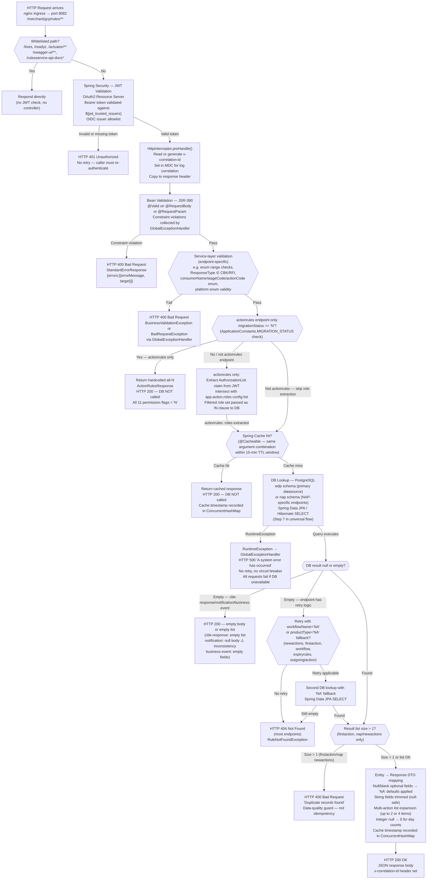

# WDP-COMP-32-RULES-SERVICE.md
**Worldpay Dispute Platform — Component Reference**
*Version: 1.0 DRAFT | April 2026*
*Extracted from: gcp-rules-service using GitHub Copilot CLI | Architect-confirmed: PENDING*

---

## ━━━ CORE SKELETON ━━━━━━━━━━━━━━━━━━━━━━━━━━━━━━━━━━━━━━━

---

## Identity

| Field             | Value |
|-------------------|-------|
| **Name**          | `RulesService` |
| **Type**          | REST API (read-only) |
| **Artefact**      | `com.wp.gcp:rules-service:1.5.6` |
| **Repository**    | `gcp-rules-service` |
| **K8s Deployment**| `mdvs-gcp-rules-service` |
| **Context path**  | `/merchant/gcp/rules` |
| **Port**          | `8082` |
| **Status**        | ✅ Production |
| **Doc status**    | 📝 DRAFT |
| **Sections present** | Core \| Block A (REST API) |

---

## Purpose

**What it does**

RulesService is the **dispute workflow configuration dictionary** for the WDP
platform. It is a pure read-only, synchronous REST API that serves
configuration-table-backed rules governing how dispute cases should be processed
across all WDP acquiring platforms. Every call is a lookup — the service never
creates, modifies, or deletes any rule record.

The service exposes 14 active HTTP endpoints (plus two fully-implemented but
commented-out endpoints), each serving a distinct rule category. Together these
14 rule types cover the full lifecycle of a dispute case: initial action
routing, follow-on action chains, UI action permissions, expiry behaviour,
notification routing, queue-skip eligibility, chargeback response mapping,
workflow name derivation, and document-type classification.

The service is backed by PostgreSQL with two schemas — `wdp` (primary, 15
tables) and `nap` (1 table) — both on the same Aurora cluster. All DB access
is read-only SELECT. It uses Spring Cache (`@Cacheable`) with a 15-minute TTL
eviction scheduler as its primary performance optimisation. The in-process cache
is the only non-DB performance layer; there is no external cache (no Redis, no
ElastiCache) and no Kafka dependency of any kind.

The `/actionrules` endpoint carries a special migration control flag
(`migrationStatus = "N"`) that, when active, bypasses the database entirely and
returns a hardcoded all-N (all-blocked) permission response. This is an active
production mechanism used to lock down UI actions for cases not yet migrated to
the WDP platform.

**What it does NOT do**

- Does NOT write to any database table. Every operation is a read-only SELECT.
  There are no `@Transactional` write scenarios, no outbox writes, no audit log
  writes, and no state changes of any kind.
- Does NOT consume or produce Kafka messages. There is no Kafka dependency in
  `pom.xml`.
- Does NOT execute business rules. It serves rule configuration data. Rule
  execution is performed by BusinessRulesProcessor (COMP-16), which reads
  directly from the `nap.rules` / `wdp.rules` tables (owned by
  BusinessRulesService, COMP-31) — completely different tables from those
  served by this component.
- Does NOT manage rule definitions. Rule CRUD operations are the responsibility
  of BusinessRulesService (COMP-31) for BRE rules and OrgManagementService
  (COMP-33) for org-level settings. RulesService is a read-only consumer of
  configuration data loaded into its tables by other means.
- Does NOT handle PAN data. The data model contains only workflow configuration
  — no payment card numbers, no transaction amounts.
- Does NOT implement Resilience4j circuit breakers. Database unavailability
  propagates directly to the caller as HTTP 500.
- Does NOT implement request-level idempotency. It is read-only and stateless;
  the Spring Cache TTL provides the only deduplication mechanism (for repeated
  reads within the TTL window).

---

## Internal Processing Flow

*This diagram represents the universal flow shared by all 14 active endpoints.
Endpoint-specific deviations in service-layer validation and null-result
handling are annotated on the relevant nodes.*



---

## Boundaries

### Inbound Interfaces

| Source | Protocol | Endpoint / Topic / Trigger | Payload / Description |
|--------|----------|----------------------------|-----------------------|
| UI portals (Merchant Portal, Ops Portal) via API Gateway | REST / HTTPS | POST `/merchant/gcp/rules/actionrules` | JWT with `AuthorizationList` claim; role-filtered UI action permission lookup |
| Dispute workflow orchestration services (inferred — not caller-tagged) | REST / HTTPS | POST `/merchant/gcp/rules/newactions` | New action determination for WDP platform |
| NAP processing services (inferred) | REST / HTTPS | POST `/merchant/gcp/rules/nap/newactions` | NAP-specific first action routing |
| Dispute workflow orchestration services (inferred) | REST / HTTPS | POST `/merchant/gcp/rules/outgoing/action` | Respond new case action chain lookup |
| Dispute workflow orchestration services (inferred) | REST / HTTPS | POST `/merchant/gcp/rules/firstaction` | Initial action code lookup for brand-new cases |
| Dispute workflow orchestration services (inferred) | REST / HTTPS | POST `/merchant/gcp/rules/expiryrules` | Case expiry action lookup |
| Dispute workflow orchestration services (inferred) | REST / HTTPS | POST `/merchant/gcp/rules/business-event` | Backend/external integration event routing |
| Notification routing services (inferred) | REST / HTTPS | GET `/merchant/gcp/rules/notification` | External consumer notification routing |
| Queue/batch processors (inferred) | REST / HTTPS | POST `/merchant/gcp/rules/queue-status/skip` | Queue skip eligibility lookup |
| Chargeback response mapping service (inferred) | REST / HTTPS | GET `/merchant/gcp/rules/cbk-response` | NAP chargeback response code mapping |
| Dispute workflow orchestration services (inferred) | REST / HTTPS | POST `/merchant/gcp/rules/workflow` | Workflow name derivation |
| Dispute workflow orchestration services (inferred) | REST / HTTPS | POST `/merchant/gcp/rules/accepttype` | Visa accept-item type lookup |
| Dispute workflow orchestration services (inferred) | REST / HTTPS | POST `/merchant/gcp/rules/pre-action` | Pre-action status prerequisite lookup |
| Dispute workflow orchestration services (inferred) | REST / HTTPS | POST `/merchant/gcp/rules/docdetailstype` | Document detail type lookup |

> ⚠️ **CALLER IDENTITY GAP:** The service performs no caller identity checking.
> All endpoints accept any valid JWT. Caller attribution above is inferred from
> rule type semantics — it is not verifiable from this service's source alone.
> A follow-up Copilot pass across calling services is required to confirm which
> components call which endpoints. This is an open question.

### Outbound Interfaces

| Target | Protocol | Endpoint / Topic / Resource | Purpose | On failure |
|--------|-----------|-----------------------------|---------|------------|
| PostgreSQL Aurora — `wdp` schema | JDBC | `wdp.*` (15 rule tables — see Database section) | All rule-lookup queries; step 7 in processing flow | RuntimeException → HTTP 500 to caller; no retry; no circuit breaker |
| PostgreSQL Aurora — `nap` schema | JDBC | `nap.dispute_nap_new_case_action_rules` | NAP new case action routing — `/nap/newactions` endpoint only | RuntimeException → HTTP 500 to caller; no retry; no circuit breaker |

---

## Database Ownership

### Tables Owned (written by this component)

**This component owns no database state. It is purely read-only. All operations
are SELECT queries. There are no `@Transactional` write scenarios, no INSERT,
no UPDATE, and no DELETE in any code path.**

### Tables Read (not owned by this component)

*All tables below are in the same PostgreSQL Aurora cluster (`globaldisputedatabase`).
Table ownership (who writes these rows) is managed outside this service — by
rule administration tooling or by other WDP components.*

#### WDP Primary Datasource (`spring.datasource.wdp`)

| Schema.Table | Endpoint served | Key query columns |
|---|---|---|
| `wdp.dispute_action_rules` | POST /actionrules | `c_stage_code`, `c_action_code`, `c_action_status`, `c_owner`, `c_workflow_name`, `c_user_type`, `c_user_role`, `c_acq_platform` |
| `wdp.business_event_rules` | POST /business-event | `c_case_stage`, `c_action_type`, `c_owner`, `c_case_ntwk`, `c_workflow_name`, `c_event_type` |
| `wdp.dispute_accept_item_rules` | POST /accepttype | `c_case_stage`, `c_action_type`, `c_owner` |
| `wdp.dispute_new_action_rules` | POST /newactions | `c_visa_status_or_reversal_ind`, `c_case_ntwk`, `c_workflow_name`, `c_action_code`, `c_stage_code`, `c_acq_platform`, `c_product_type`, `c_input_partial` |
| `wdp.dispute_new_case_action_respond_rules` | POST /outgoing/action | `c_release_version`, `c_workflow_name`, `c_response_type`, `c_action_sta`, `c_action_type`, `c_case_stage`, `c_partial`, `c_input_prenote_ind`, `c_acq_platform`, `c_product_type` |
| `wdp.dispute_first_action_rules` | POST /firstaction | `c_stage_code`, `c_case_ntwk`, `c_workflow_name`, `c_action_code`, `c_acq_platform`, `c_reverse` |
| `wdp.dispute_case_exp_rules` | POST /expiryrules | `c_action_code`, `c_stage_code`, `c_owner`, `c_workflow_name`, `c_acq_platform`, `c_product_type`, `c_pre_note` |
| `wdp.pre_action_status_rules` | POST /pre-action | `c_current_stage_code`, `c_current_action_code`, `c_current_action_status` |
| `wdp.disputes_visa_queue_status_rules` | POST /queue-status/skip | `c_batch_queue_name`, `c_case_status` |
| `wdp.notification_rules` | GET /notification | `c_consumer_name`, `c_case_stage`, `c_action_type` |
| `wdp.nap_chbk_response_rules` | GET /cbk-response | `c_response_code`, `c_response_type` |
| `wdp.workflow_rules` | POST /workflow | `c_case_src`, `c_case_ntwk`, `c_case_workflow_type`, `c_product_type`, `c_product_sub_type`, `c_reason` |
| `wdp.dispute_doc_details_type_rules` | POST /docdetailstype | `c_stage_code`, `c_action_code` |
| `wdp.document_type_rules` | *(endpoint disabled — commented out)* | `c_ntwk`, `c_stage`, `c_action_type`, `c_reason`, `c_owner_code` |
| `wdp.dispute_update_event_log_rules` | *(endpoint disabled — commented out)* | `c_case_stage`, `c_action_type`, `c_owner`, `c_action_sta` |

#### NAP Datasource (`spring.datasource.nap`)

| Schema.Table | Endpoint served | Key query columns |
|---|---|---|
| `nap.dispute_nap_new_case_action_rules` | POST /nap/newactions | `c_function_code`, `c_reversal_ind`, `c_workflow_name`, `c_current_stage`, `c_case_upde_type`, `c_current_action` |

> ⚠️ **OPEN QUESTION — DB Bypass Pattern:**
> Whether any WDP component reads these rule tables directly from the database
> (bypassing this service's API) is **not determinable from this service's
> source alone**. Given the read-only nature of the data this pattern is
> architecturally possible and likely. Confirmation requires a Copilot pass
> across all suspected callers. The precedent set by BusinessRulesProcessor
> (COMP-16) reading BusinessRulesService tables directly (DEC confirmed fact)
> makes this a real risk.

---

## Scaling and Deployment

| Parameter | Value | Notes |
|---|---|---|
| K8s resource type | `Deployment` | `apiVersion: {{ deploymentApiVersion }}`, `kind: Deployment` |
| Replica count | `{{ replicas-gcp-rules-service }}` | XL Deploy placeholder — actual production value not visible in source |
| Memory limit | `2048Mi` | Confirmed from `resources.yaml` |
| Memory request | `1024Mi` | Confirmed from `resources.yaml` |
| CPU limit | **NOT SET** | ⚠️ Absent from `resources.yaml` — platform risk, no CPU cap on pod |
| CPU request | **NOT SET** | ⚠️ Absent from `resources.yaml` |
| HPA | **ABSENT** | No HorizontalPodAutoscaler resource in any file |
| Rolling update | `maxSurge: 1`, `maxUnavailable: 0`, `type: RollingUpdate` | `minReadySeconds: 30` also set on pod spec |
| PodDisruptionBudget | **ABSENT** | No PDB resource in `resources.yaml` |
| Topology spread | Configured — **BRANCH_NAME_PLACEHOLDER risk** | `maxSkew: 1`, `whenUnsatisfiable: ScheduleAnyway`, `topologyKey: kubernetes.io/hostname`. Label `app: mdvs-gcp-rules-service{BRANCH_NAME_PLACEHOLDER}` used as selector — same class of label-mismatch risk seen in other WDP components. `ScheduleAnyway` means this is **advisory only** — not a hard spread guarantee. |
| OTel agent | **PRESENT** | `instrumentation.opentelemetry.io/inject-java: opentelemetry-operator-system/default` annotation on pod template |
| Spring Actuator | **PRESENT** | `spring-boot-starter-actuator`; exposes `info`, `health`, `prometheus` endpoints |
| Prometheus / Micrometer | **PRESENT** | `micrometer-registry-prometheus` runtime dependency; metrics export enabled |
| Logstash | **PRESENT** | `logstash-logback-encoder` 7.4; `LogstashTcpSocketAppender` → `${logstash_server_host_port}`; `keepAliveDuration: 5 minutes` |
| Liveness probe | GET `/merchant/gcp/rules/lives` port 8082 | `initialDelaySeconds: 30`, `periodSeconds: 10`, `failureThreshold: 3` |
| Readiness probe | GET `/merchant/gcp/rules/ready` port 8082 | |

---

## Architecture Decision Log

| DEC | Requirement | Actual Behaviour | Severity |
|---|---|---|---|
| DEC-001 | Transactional outbox for Kafka publish | NOT APPLICABLE — this service performs no writes of any kind and publishes no Kafka events | ✅ N/A |
| DEC-003 | Kafka partition key = `merchantId` | NOT APPLICABLE — no Kafka dependency | ✅ N/A |
| DEC-004 | PAN encryption before any write | NOT APPLICABLE — service handles no PAN data | ✅ N/A |
| DEC-005 | Manual offset commit after processing | NOT APPLICABLE — no Kafka consumer | ✅ N/A |
| DEC-014 | Resilience4j circuit breaker on outbound calls | **DEVIATION** — No `resilience4j` or `io.github.resilience4j` dependency in `pom.xml`. No circuit breaker, no timeout, no retry on either PostgreSQL datasource. Database unavailability returns HTTP 500 to all callers. This is consistent with the confirmed platform-wide absence of circuit breakers. | 🟠 MEDIUM (platform-wide pattern, not isolated) |

---

## Risk Register

🟠 **HIGH — No circuit breaker or timeout on database connections (DEC-014)**
Both the `wdp` and `nap` datasources have no explicit connection or socket
timeout configured in any YAML. Spring Boot defaults apply. Resilience4j is
entirely absent. A database outage causes all 14 endpoints to return HTTP 500
with no degradation path, no fallback, and no automatic isolation. All
downstream callers are equally affected simultaneously.

🟠 **HIGH — migrationStatus bypass flag is an undocumented operational lever**
The `migrationStatus = "N"` field on `/actionrules` is an active production
migration control mechanism. When passed with value `"N"`, all UI actions for
a case are blocked — the database is bypassed entirely and a hardcoded all-N
permission set is returned. This flag is not documented in any runbook.
Operations teams using the UI or calling the API must be aware of this bypass.
The string constant `ApplicationConstants.MIGRATION_STATUS = "Y"` is misleading
(it holds the non-bypass value, not "N"). Recommend formal documentation.

🟡 **MEDIUM — /notification returns HTTP 200 with null body when rule not found**
All other endpoints return HTTP 404 when no rule is found. The `/notification`
endpoint returns HTTP 200 with a null response body when the consumerName /
stageCode / actionCode combination has no matching rule. This is an
inconsistency confirmed in the Copilot report. Callers of this endpoint must
handle both a populated body and a null body on HTTP 200. Confirmed in source,
reason not stated.

🟡 **MEDIUM — Two disabled endpoints backed by fully-implemented code**
POST `/documentType` (backed by `wdp.document_type_rules`) and GET `/eventRule`
(backed by `wdp.dispute_update_event_log_rules`) are fully implemented —
entity, service, DAO, repository — but their controller mappings are commented
out. The reason is not stated in source. These tables are in the database and
queries can be executed if the endpoints are re-enabled. If these endpoints are
permanently abandoned, the backing code and tables should be formally removed.

🟡 **MEDIUM — No CPU limits set**
CPU limit and CPU request are absent from `resources.yaml`. A runaway thread
or cache-eviction storm has no CPU cap. Other pods on the same node are exposed
to CPU starvation. Consistent with the absence seen in some other WDP
components — recommend platform-wide remediation.

🟢 **LOW — Topology spread advisory only (BRANCH_NAME_PLACEHOLDER risk)**
The topology spread constraint uses `whenUnsatisfiable: ScheduleAnyway`, making
it non-enforcing. The `BRANCH_NAME_PLACEHOLDER` in the pod label selector raises
the same label-mismatch risk seen in other WDP components — if the placeholder
resolves inconsistently between the pod template and the spread selector,
topology spreading is silently inoperative. No hard cross-AZ guarantee exists.

🟢 **LOW — No PodDisruptionBudget**
Rolling updates and node maintenance can terminate all replicas simultaneously
if replica count is low. Without a PDB, zero guaranteed minimum availability
during disruption events.

🟢 **LOW — Unused `app.version` property loaded at startup**
`ApplicationProps.version` is a `Map<String, String>` loaded from config prefix
`app.version` but `applicationProps.getVersion()` is never called in any active
controller or service. Leftover from a prior versioning mechanism.

---

## Planned and Incomplete Work

| Item | Status | Detail |
|---|---|---|
| POST `/documentType` endpoint | Commented out — intentionally disabled | Fully implemented (DocumentTypeService, DocumentTypeRuleEntity, DocumentTypeRulesDao, DocumentTypeRulesDaoImpl) but controller mapping is commented out. Backing table: `wdp.document_type_rules`. Reason for disablement not stated in source. |
| GET `/eventRule` endpoint | Commented out — reason unclear | UpdateEventRuleService, UpdateEventRulesEntity, UpdateEventRulesDaoImpl fully implemented. UpdateEventRulesDao interface referenced. Backing table: `wdp.dispute_update_event_log_rules`. Endpoint commented out; reason not stated. |
| `releaseVersionMap` in NewActionRulesServiceImpl and RespondNewCaseActionServiceImpl | Commented out | Was a hardcoded network-to-release-version mapping (e.g. "VISA" → "18.1"). Replaced by caller-supplied `releaseVersion` field (defaulted to "NA"). Original network-specific version derivation logic is no longer active. |
| Alternative Logstash destination | Commented out | `<!-- <destination>10.43.145.125:5044</destination> -->` in `logback-spring.xml`. Development/migration leftover. |
| `json-path 2.8.0` property | Unused declaration | Listed in `<properties>` section of `pom.xml` but no corresponding `<dependency>` entry. No `JsonPath` import in source. Likely a leftover property declaration. |
| `migrationStatus` bypass flag | Active production flag | If set to "N" on `/actionrules` request, all UI actions blocked via hardcoded all-N response. Active platform migration control. Not documented in runbooks — flag as operational risk. |
| WorkflowRulesDaoImpl `getWorkflowName()` TODO | Stale comment | Eclipse-generated `// TODO Auto-generated method stub` comment. Method is fully implemented. Comment was never removed. |
| GlobalExceptionHandler `httpRequestMethodNotSupportedException()` TODO | Stale comment | `// TODO` inline in error message construction. Low priority. |
| `applicationProps.getVersion()` | Configured but not called | `app.version` properties loaded into `ApplicationProps` but never referenced at runtime. |

---

## ━━━ TYPE BLOCK A — REST API CONTRACTS ━━━━━━━━━━━━━━━━━━━━

---

## REST API Contracts

**Base context path:** `/merchant/gcp/rules`
*(All endpoint paths below are relative to this base)*

**Authentication model:** JWT Bearer token required on all non-whitelisted
paths. OAuth2 Resource Server (`spring-boot-starter-oauth2-resource-server`).
Trusted issuers configured via `${jwt_trusted_issuers}`. Whitelisted paths:
`/lives`, `/readyz`, `/actuator/health`, `/swagger-ui/**`,
`/rulesservice-api-docs*`.

**Role enforcement:** No scope enforcement in `SecurityConfig.filterChain()`.
The JWT body is not inspected for roles on most endpoints — validity alone is
checked. **Exception: `/actionrules`** reads the `AuthorizationList` JWT claim
and intersects it with the configured `app.action.roles` list; the filtered set
is passed as an `IN` clause to the database query.

**Error response structure (all non-2xx responses):**
```json
{
  "errors": [
    {
      "errorMessage": "Human-readable message",
      "target": "field name or system area"
    }
  ]
}
```
Produced by `GlobalExceptionHandler` → `StandardErrorResponse` containing a
list of `StandardDisplayError` objects.

**Caching:** All endpoints use Spring Cache (`@Cacheable`). Repeated calls with
identical argument combinations return the cached response without hitting the
database. Cache is in-process (JVM `ConcurrentHashMap`). TTL-based eviction
runs every 15 minutes (`cacheEvictScheduler = 900000 ms`).

---

### Endpoint Group 1 — UI Action Permissions

#### POST `/actionrules`

**Purpose:** Returns the set of UI action flags permitted for a given
stage/action/status/owner/user-type/platform/workflow combination. The primary
UI-facing endpoint — called by portals to determine which buttons to display.

**Special behaviour:**
- Reads `AuthorizationList` JWT claim and intersects with `app.action.roles` to
  filter permitted user roles. Role set passed as `IN` clause to DB query.
- If `migrationStatus = "N"`: returns hardcoded all-N response immediately —
  database is NOT called. Active production migration control flag.
- Falls back through 3 progressively looser queries if empty: first with
  `workflowName = "NA"`, then with `platform = "NA"`, then with both.

| Parameter | Value |
|---|---|
| **Method / Path** | `POST /actionrules` |
| **Table** | `wdp.dispute_action_rules` |

**Request fields:**

| Field | Type | Required | Notes |
|---|---|---|---|
| `actionCode` | ActionCode enum | Yes | HTTP 400 if invalid enum |
| `stageCode` | StageCode enum | Yes | HTTP 400 if invalid enum |
| `actionStatus` | RespondStatus enum | Yes | HTTP 400 if invalid enum |
| `owner` | Owner enum | Yes | HTTP 400 if invalid enum |
| `userType` | UserType enum | Yes | INTERNAL / EXTERNAL; HTTP 400 if invalid |
| `productType` | String | No | Null/blank → "NA" for DB query |
| `migrationStatus` | String | No | If "N": bypass DB, return all-N |
| `workflowName` | String | No | Null/blank → "NA"; retry fallback applied |
| `platform` | Platform enum | No | Null/blank → "NA"; retry fallback applied |

**Response:** `ActionRulesResponse` — 11 boolean-as-string permission flags.
Each flag is `"Y"` if ANY matched entity row has `"y"` for that field;
`"N"` otherwise.

| Flag | Controls |
|---|---|
| `respond` | Respond action permitted |
| `accept` | Accept action permitted |
| `deny` | Deny action permitted |
| `addDocs` | Add documents permitted |
| `writeOff` | Write-off permitted |
| `chargeToMerchant` | Charge to merchant permitted |
| `reverse` | Reversal permitted |
| `getIssuerDoc` | Get issuer document permitted |
| `retrivalRespond` | Retrieval respond permitted |
| `issuerReversal` | Issuer reversal permitted |
| `issuerAccept` | Issuer accept permitted |

**HTTP status codes:**

| Code | Condition |
|---|---|
| 200 | Success — including migrationStatus=N bypass (all-N returned) |
| 400 | Invalid enum value, blank required field, or JWT AuthorizationList claim absent ("Token is blank") |
| 401 | Missing or invalid JWT |
| 404 | No matching rule found |
| 500 | Database unavailable or unhandled exception |

---

#### POST `/pre-action`

**Purpose:** Returns the list of prior actions that must be in a specific status
before a case can advance to a new stage.

| Parameter | Value |
|---|---|
| **Method / Path** | `POST /pre-action` |
| **Table** | `wdp.pre_action_status_rules` |

**Request:** `PreActionStatusRulesRequest`

| Field | Type | Required |
|---|---|---|
| `currentStageCode` | String | Yes |
| `currentActionCode` | String | Yes |
| `currentActionStatus` | String | Yes |

**Response:** `List<PreActionStatusRulesResponse>` — each entry: `preStageCode`,
`preActionCode`, `preActionStatus`.

**HTTP status codes:** 200 success | 400 validation | 401 | 404 no rule | 500

---

### Endpoint Group 2 — Case Action Routing

#### POST `/newactions`

**Purpose:** Determines first and second follow-on actions for a WDP-platform
dispute case given its current state. Returns up to 2 action entries from a
single matching entity row.

| Parameter | Value |
|---|---|
| **Method / Path** | `POST /newactions` |
| **Table** | `wdp.dispute_new_action_rules` |

**Request:** `NewActionRulesRequest`

| Field | Type | Required | Notes |
|---|---|---|---|
| `caseNetwork` | CardScheme enum | Yes | HTTP 400 if invalid |
| `actionCode` | String | Yes | |
| `stageCode` | String | Yes | |
| `workflowType` | String | Yes | Retry with "NA" if no result |
| `platform` | Platform enum | Yes | CORE/NAP/VAP/LATAM/PIN/ALL; HTTP 400 if invalid |
| `caseStatusOrReversalInd` | String | No | |
| `productType` | String | No | Null/blank → "NA" |
| `partialIndicator` | String | No | Null/blank → "NA" |

**Response:** `List<NewActionRulesResponse>` (1 or 2 entries) — each entry:
`stageCode`, `actionCode`, `status`, `owner`, `stageCodeIndicator`,
`partialAmountIndicator`, `numDaysToReqDate` (Integer), `numDaysToExpDate`
(Integer), `preNoteIndicator`, `caseLiability` (null if "NA"), `isCaseSkippable`.

**HTTP status codes:** 200 | 400 (invalid platform/enum) | 401 | 404 | 500

---

#### POST `/nap/newactions`

**Purpose:** NAP-platform-specific first action routing. Equivalent of
`/newactions` for NAP acquiring platform, reading from the `nap` schema.
Returns HTTP 400 if more than one matching rule is found (data quality guard).

| Parameter | Value |
|---|---|
| **Method / Path** | `POST /nap/newactions` |
| **Table** | `nap.dispute_nap_new_case_action_rules` |

**Request:** `NewCaseActionRulesRequest`

| Field | Type | Required | Notes |
|---|---|---|---|
| `functionCode` | String | Yes | |
| `workflowName` | String | Yes | |
| `reversalIndicator` | String | No | Null/blank → "NA" |
| `currentStage` | String | No | Null/blank → "NA" |
| `caseUpdateType` | String | No | Null/blank → "NA" |
| `currentAction` | String | No | Null/blank → "NA" |

**Response:** `NewCaseActionRulesResponse` — `stageCode`, `actionCode`, `owner`,
`actionStatus`, `caseFinalLiability`, `expDays` (Integer), `reqDays` (Integer).

**HTTP status codes:** 200 | 400 (validation or duplicate records found) | 401 | 404 | 500

---

#### POST `/outgoing/action`

**Purpose:** Returns up to 4 sequential follow-on actions (first/second/
third/fourth) for a case being responded to. The respond new case action chain.
Retries with `productType = "NA"` if first query returns no result.

| Parameter | Value |
|---|---|
| **Method / Path** | `POST /outgoing/action` |
| **Table** | `wdp.dispute_new_case_action_respond_rules` |

**Request:** `RespondNewCaseActionRulesRequest`

| Field | Type | Required | Notes |
|---|---|---|---|
| `workflowType` | String | Yes | |
| `actionStatus` | String | Yes | |
| `actionCode` | String | Yes | |
| `stageCode` | String | Yes | |
| `platform` | Platform enum | Yes | HTTP 400 if invalid |
| `releaseVersion` | String | No | Null/blank → "NA" |
| `responseType` | String | No | Null/blank → "NA" |
| `productType` | String | No | Retry with "NA" on miss |
| `preNoteIndicator` | String | No | Null/blank → "N" |
| `partialAmountIndicator` | String | No | Null/blank → "N" |

**Response:** `RespondNewCaseActionResponse` — up to 4 action sets
(first/second/third/fourth), each: `ActionCode`, `StageCode`, `ActionOwner`,
`ActionStatus`, `ActionTypeIndicator`, `caseFinalLiability`,
`outputPreNoteIndicator`, `ActionPartialAmountIndicator`.
Integer null day counts → 0.

**HTTP status codes:** 200 | 400 (invalid platform) | 401 | 404 | 500

---

#### POST `/firstaction`

**Purpose:** Returns first and second initial action codes and stages for a
brand-new dispute case arrival. Branches on `reversalInd = "Y"` to use a
different DB query. Returns HTTP 400 if more than one matching rule exists.
Retries with `workflowName = "NA"` on miss.

| Parameter | Value |
|---|---|
| **Method / Path** | `POST /firstaction` |
| **Table** | `wdp.dispute_first_action_rules` |

**Request:** `FirstActionRulesRequest`

| Field | Type | Required | Notes |
|---|---|---|---|
| `stageCode` | String | Yes | |
| `cardNetwork` | String | Yes | |
| `workflowName` | String | Yes | Retry with "NA" on miss |
| `platform` | String | Yes | |
| `productType` | String | No | Null/blank → "NA" |
| `reversalInd` | String | No | "Y" → uses reversal-specific repository query |

**Response:** `List<FirstActionRulesResponse>` (1 or 2 entries) — each:
`stageCode`, `actionCode`, `status`, `owner`, `actionTypeIndicator`,
`numDaysToDueDate`, `numDaysToExpDate`, `caseFinalLiability`.

**HTTP status codes:** 200 | 400 (duplicate records found) | 401 | 404 | 500

---

#### POST `/expiryrules`

**Purpose:** Returns what action/stage/owner/status to use when a case expires,
whether a network call is required, and due-date offsets. Retries with
`workflowName = "NA"` and `preNoteIndicator = "NA"` on miss.

| Parameter | Value |
|---|---|
| **Method / Path** | `POST /expiryrules` |
| **Table** | `wdp.dispute_case_exp_rules` |

**Request:** `ExpiryRulesRequest`

| Field | Type | Required | Notes |
|---|---|---|---|
| `actionCode` | ActionCode enum | Yes | HTTP 400 if invalid |
| `stageCode` | StageCode enum | Yes | HTTP 400 if invalid |
| `owner` | Owner enum | Yes | HTTP 400 if invalid |
| `platform` | Platform enum | Yes | HTTP 400 if invalid |
| `workflowType` | String | No | Retry with "NA" on miss |
| `productType` | String | No | Null/blank → "NA" |
| `preNoteIndicator` | String | No | Retry with "NA" on miss |
| `partialAmountIndicator` | String | No | |

**Response:** `ExpiryRulesResponse` — `stageCode`, `stageCodeIndicator`,
`owner`, `status`, `caseLiability`, `isNtwkCallReq`, `firstActionNumDaysToReqDate`,
`firstActionNumDaysToExpDate`.

**HTTP status codes:** 200 | 400 (invalid platform/enum) | 401 | 404 | 500

---

### Endpoint Group 3 — Routing and Classification

#### POST `/workflow`

**Purpose:** Derives the workflow name for a dispute case from its source,
network, type, and reason code. Retries with `reasonCode = "NA"` if first
query returns no result.

| Parameter | Value |
|---|---|
| **Method / Path** | `POST /workflow` |
| **Table** | `wdp.workflow_rules` |

**Request:** `WorkflowRuleRequest` — `caseSource`, `caseNetwork`, `caseType`,
`reasonCode`. Bean validation constraints on request class not fully visible
from Copilot report — follow-up recommended.

**Response:** `WorkflowRuleResponse` — `workflowName` (String).

**HTTP status codes:** 200 | 400 | 401 | 404 | 500

---

#### POST `/business-event`

**Purpose:** Returns the backend/external integration events that should be
fired for a given stage/action/owner/network/workflow combination. Dynamic
native SQL — only non-blank fields become WHERE clauses.
**Does NOT throw 404 if not found — returns empty/null BusinessEventRulesResponse
with HTTP 200.**

| Parameter | Value |
|---|---|
| **Method / Path** | `POST /business-event` |
| **Table** | `wdp.business_event_rules` |

**Request:** `BusinessEventRulesRequest` — all fields optional: `stageCode`,
`actionCode`, `owner`, `networkType`, `workflowType`, `eventType`.

**Response:** `BusinessEventRulesResponse` — `backendIntegrationEvent`,
`caseExpireAddEvent`, `caseExpireDeleteEvent`, `caseIssuerDoc`,
`externalIntegrationEvent`, `caseAutoEvent` (all String).

**HTTP status codes:** 200 (even if no rule found — returns empty fields) |
400 validation | 401 | 500

---

#### GET `/notification`

**Purpose:** Returns the external notification API name and final outcome for
a given consumer/stage/action combination.

⚠️ **Known inconsistency:** Returns HTTP 200 with null body if no rule is
found. All other endpoints return HTTP 404. Reason not stated in source.

| Parameter | Value |
|---|---|
| **Method / Path** | `GET /notification` |
| **Table** | `wdp.notification_rules` |

**Request:** `@RequestParam` — `consumerName` (required, ConsumerName enum —
e.g. SIGNIFYD), `stageCode` (required, StageCode enum), `actionCode` (required,
ActionCode enum). HTTP 400 if invalid enum.

**Response:** `NotificationRulesResponse` — `apiName`, `finalOutcome`.
Returns null body with HTTP 200 if not found (⚠️ inconsistency — should be 404).

**HTTP status codes:** 200 (including null body if not found — ⚠️) |
400 (invalid enum) | 401 | 500

---

#### GET `/cbk-response`

**Purpose:** Maps a NAP chargeback response code and response type to stage
code, action code, action status, due days, and owner. Returns an empty list
(not 404) if no matching rules exist.

| Parameter | Value |
|---|---|
| **Method / Path** | `GET /cbk-response` |
| **Table** | `wdp.nap_chbk_response_rules` |

**Request:** `@RequestParam` — `responseCode` (String, required, not blank),
`responseType` (String, required, not blank). Service-layer check: `responseType`
must be in {`CBK`, `RFI`}; literal string `"null"` for either field triggers
HTTP 400.

**Response:** `List<NapChargebackRulesResponse>` — each entry: `responseDesc`,
`actionCode`, `stageCode`, `actionStatus`, `dueDays`, `owner`.
Returns empty list (HTTP 200) if not found.

**HTTP status codes:** 200 (empty list if not found) |
400 (invalid responseType or literal "null" value) | 401 | 500

---

### Endpoint Group 4 — Queue and Batch

#### POST `/queue-status/skip`

**Purpose:** Determines whether a case in a given status and queue is eligible
to be skipped in batch processing.

| Parameter | Value |
|---|---|
| **Method / Path** | `POST /queue-status/skip` |
| **Table** | `wdp.disputes_visa_queue_status_rules` |

**Request:** `QueueStatusRulesRequest` — `queueName` (required), `caseStatus`
(required).

**Response:** `QueueStatusRulesResponse` — `caseStatus`, `queueName`,
`isSkippable`, `disputeStage`.

**HTTP status codes:** 200 | 400 | 401 | 404 | 500

---

### Endpoint Group 5 — Document Classification

#### POST `/accepttype`

**Purpose:** Returns the Visa accept-item type code for a given stage, action,
and owner combination.

| Parameter | Value |
|---|---|
| **Method / Path** | `POST /accepttype` |
| **Table** | `wdp.dispute_accept_item_rules` |

**Request:** `AcceptItemRulesRequest` — `stageCode` (String, required, @NotBlank),
`actionCode` (String, required, @NotBlank), `owner` (String, required,
@NotBlank).

**Response:** `AcceptItemRulesResponse` — `outputAcceptItemType` (String).

**HTTP status codes:** 200 | 400 validation | 401 | 404 | 500

---

#### POST `/docdetailstype`

**Purpose:** Returns the document details type for a given stage and action
code combination.

| Parameter | Value |
|---|---|
| **Method / Path** | `POST /docdetailstype` |
| **Table** | `wdp.dispute_doc_details_type_rules` |

**Request:** `DocDetailTypeRulesRequest` — `stageCode` (required),
`actionCode` (required).

**Response:** `DocDetailTypeRulesResponse` — `detailsType` (String).

**HTTP status codes:** 200 | 400 | 401 | 404 | 500

---

### Disabled Endpoints (commented out in controller)

| Endpoint | Method | Backing Table | Status | Notes |
|---|---|---|---|---|
| `/documentType` | POST | `wdp.document_type_rules` | Commented out | Fully implemented — DocumentTypeService, entity, DAO all present. Reason for disablement unknown. |
| `/eventRule` | GET | `wdp.dispute_update_event_log_rules` | Commented out | UpdateEventRuleService, entity, DAO all present. Reason unknown. |

---

## WDP-KAFKA.md Update

**No update required.** COMP-32 RulesService has no Kafka involvement.
There is no Kafka dependency in `pom.xml`. It neither produces nor consumes
any Kafka topic.

---

## WDP-DB.md Update

Add the following rows to the WDP-DB.md table for `wdp` schema (READS ONLY
column — this component is a reader, not owner):

| Schema.Table | Owner (writes) | COMP-32 access | Purpose |
|---|---|---|---|
| `wdp.dispute_action_rules` | TBC | Reader | UI action permission flags per stage/action/owner/role |
| `wdp.business_event_rules` | TBC | Reader | Integration event routing per stage/action/owner/network |
| `wdp.dispute_accept_item_rules` | TBC | Reader | Visa accept-item type per stage/action/owner |
| `wdp.dispute_new_action_rules` | TBC | Reader | WDP new action chain per case state |
| `wdp.dispute_new_case_action_respond_rules` | TBC | Reader | Respond action chains (up to 4) |
| `wdp.dispute_first_action_rules` | TBC | Reader | Initial action codes for new case arrivals |
| `wdp.dispute_case_exp_rules` | TBC | Reader | Case expiry action parameters |
| `wdp.pre_action_status_rules` | TBC | Reader | Pre-action prerequisite status |
| `wdp.disputes_visa_queue_status_rules` | TBC | Reader | Queue skip eligibility |
| `wdp.notification_rules` | TBC | Reader | External notification routing |
| `wdp.nap_chbk_response_rules` | TBC | Reader | NAP chargeback response code mapping |
| `wdp.workflow_rules` | TBC | Reader | Workflow name derivation |
| `wdp.dispute_doc_details_type_rules` | TBC | Reader | Document details type |
| `wdp.document_type_rules` | TBC | Reader (endpoint disabled) | Document image type mapping |
| `wdp.dispute_update_event_log_rules` | TBC | Reader (endpoint disabled) | Update event type |
| `nap.dispute_nap_new_case_action_rules` | TBC | Reader | NAP new case action routing |

> ⚠️ **Table ownership (who writes these rows) is unknown from RulesService
> source alone.** The "Owner (writes)" column is TBC for all 16 tables. These
> are configuration/reference data tables — the write path likely comes from a
> rule administration UI or database migration scripts. This is an open
> question requiring confirmation from the team.

---

## Remaining Gaps

| Gap | Gap type | Action required |
|---|---|---|
| Actual replica count value | Environment config | Confirm actual production value of XL Deploy variable `replicas-gcp-rules-service` from team or deployment config |
| Caller identity for each endpoint | Follow-up Copilot pass | Run Copilot across COMP-16, COMP-05, COMP-06, COMP-12, COMP-18, COMP-19, COMP-20 to confirm which component calls which RulesService endpoint. Question to ask: *"Does this component make any REST calls to `gcp-rules-service` or to any URL matching `/merchant/gcp/rules/*`? If yes, which endpoints and under what conditions?"* |
| DB bypass pattern — do other components read rule tables directly? | Follow-up Copilot pass | Per Section 6.6: cannot be determined from RulesService source alone. Ask in suspect callers: *"Does this component read any of these tables directly from the database: `wdp.dispute_action_rules`, `wdp.dispute_new_action_rules`, `wdp.workflow_rules`, `wdp.dispute_case_exp_rules`, or any other `wdp.dispute_*_rules` table?"* |
| /notification null-body inconsistency — intentional? | Architect decision | The `/notification` endpoint returns HTTP 200 with null body when no rule is found, while all other endpoints return 404. Confirm with team whether this is intentional (backward-compatibility contract) or a defect to be remediated. |
| Who writes the 16 rule tables? | Team confirmation | The "Owner (writes)" column in WDP-DB.md is TBC for all 16 rule tables. Confirm whether rows are managed by a rule administration UI (which service?), database migration scripts, or another component. |
| WorkflowRuleRequest validation constraints | Follow-up Copilot question | Bean validation on `WorkflowRuleRequest` was not fully visible from source. Ask: *"What @NotBlank, @NotNull, or other constraints are present on the fields of WorkflowRuleRequest (caseSource, caseNetwork, caseType, reasonCode)?"* |
| Whether COMP-16 BusinessRulesProcessor calls any RulesService endpoint | Follow-up Copilot pass | The COMP-16 Copilot report does not mention any calls to RulesService. However COMP-32 Copilot inferred that "BRE" may call /expiryrules, /business-event etc. Requires explicit confirmation. |

---

*End of WDP-COMP-32-RULES-SERVICE.md*
*File status: 📝 DRAFT — awaiting architect confirmation.*
*After confirmation, update WDP-COMP-INDEX.md (PENDING → DRAFT), WDP-DB.md
(add reader rows), and WDP-HANDOVER.md (confirmed facts section).*
