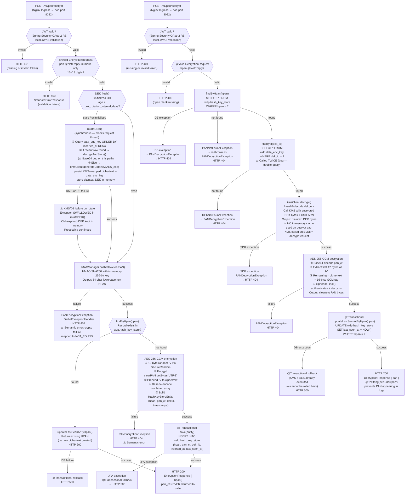

# WDP-COMP-35-ENCRYPTION-SERVICE
**Worldpay Dispute Platform — Component Reference**
*Version: 1.0 DRAFT | April 2026*
*Extracted from: wdp-encryption-service (CORE-SERVICES) using GitHub Copilot CLI | Architect-confirmed: PENDING*

---

## ━━━ CORE SKELETON ━━━━━━━━━━━━━━━━━━━━━━━━━━━━━━━━━━━━━━

---

## Identity

| Field | Value |
|---|---|
| **Name** | `EncryptionService` |
| **Type** | `REST API` |
| **Repository** | `wdp-encryption-service` |
| **Status** | `✅ Production` |
| **Doc status** | `📝 DRAFT` |
| **Sections present** | `Core \| Block A — REST` |
| **Runtime** | `Spring Boot 3.5 / Java 17` |
| **Port** | `8082` |
| **Context path** | `/merchant/gcp/encryption` |

---

## Purpose

**What it does**

EncryptionService is the sole component in WDP authorised to handle plaintext PAN (Primary Account Number) data. It acts as the PCI-DSS cryptographic boundary for the entire platform. No other service stores, processes, or transmits clear PAN in any form.

The service implements a two-token PAN strategy (DEC-007). On every encrypt call, it produces two artefacts from the plaintext PAN: an HPAN (Hashed PAN) — a 64-character lowercase hex string generated via HMAC-SHA256 with a fixed secret key — and a pan_ct (ciphertext) — an AES-256-GCM encrypted representation stored internally alongside the HPAN. The HPAN is returned to callers and used platform-wide for case lookups and matching. The ciphertext (pan_ct) is never returned to any caller — it is held exclusively in this service's database table (`wdp.hash_key_store`) and recovered only by this service when a decrypt is requested.

On decrypt, the service accepts an HPAN, locates the corresponding ciphertext and DEK reference in its own table, decrypts the Data Encryption Key (DEK) from AWS KMS, performs AES-256-GCM decryption in memory, and returns the cleartext PAN to the caller transiently. The cleartext PAN is never written to any persistent store at any point.

The DEK is managed via an envelope encryption model (DEC-008). AWS KMS holds the Customer Master Key (CMK). The service generates a plaintext DEK + a KMS-wrapped ciphertext of that DEK. Only the KMS-wrapped ciphertext is persisted (`wdp.data_enc_key`). The plaintext DEK is held in memory and used for all encrypt operations until the rotation interval elapses. The HMAC key is loaded once at startup from AWS Secrets Manager and held in memory for the JVM lifetime.

⚠️ **Design document correction — DEK rotation interval is DAYS, not hours.** The design premise stated a 6-hour DEK cache. Source analysis confirms the rotation interval is configured in days via `${dek_rotation_interval_days}`. The "6-hour" assumption in WDP-ARCHITECTURE.md, WDP-DECISIONS.md, WDP-COMPONENTS.md, and WDP-COMP-INDEX.md is incorrect and must be corrected in all documents.

**What it does NOT do**

- Does **not** return the AES ciphertext (pan_ct) to any caller. Only HPAN is ever returned on the encrypt path. Callers that need the actual PAN must call the decrypt endpoint with the HPAN.
- Does **not** handle JWT PAN tokenisation or any form of network token. It is purely a PAN encrypt/decrypt service. (TokenService, COMP-36, handles JWT management — a separate concern.)
- Does **not** produce to or consume from any Kafka topic. No Kafka dependency exists anywhere in the codebase.
- Does **not** use the transactional outbox pattern. It is a synchronous REST API with no asynchronous messaging.
- Does **not** technically enforce which callers may call the decrypt endpoint. The design intent that only CaseCreationConsumer (COMP-14) may decrypt is a **policy convention only** — there is no JWT claim inspection or allowlist in code. Any caller with a valid JWT from a trusted issuer can call `/v1/pan/decrypt`.
- Does **not** cache the DEK on the decrypt path. Every decrypt request makes a live KMS call to decrypt the wrapped DEK from the database record.
- Does **not** apply Resilience4j circuit breakers, rate limiters, or bulkheads on any outbound call. No Resilience4j dependency is present in `pom.xml`.
- Does **not** configure explicit REST connection or read timeouts on any outbound call (AWS KMS, AWS Secrets Manager, PostgreSQL).
- Does **not** enforce a UNIQUE constraint on `hpan` at the JPA entity level — whether a DB-level unique index exists cannot be determined from source alone (migration scripts not in repository).
- Does **not** refresh the HMAC key after startup. Once loaded from Secrets Manager, the key is held in memory for the lifetime of the JVM process.
- Does **not** include a HPA, PodDisruptionBudget, or Topology Spread configuration.

---

## Internal Processing Flow



---

## Boundaries

### Inbound Interfaces

| Source | Protocol | Endpoint | Payload / Description |
|---|---|---|---|
| COMP-11 FileProcessor | REST (in-cluster) | `POST /merchant/gcp/encryption/v1/pan/encrypt` | Plaintext PAN from inbound dispute file |
| COMP-07 VisaDisputeBatch | REST (in-cluster) | `POST /merchant/gcp/encryption/v1/pan/encrypt` | Plaintext PAN from Visa dispute record |
| COMP-08 FirstChargebackBatch | REST (in-cluster) | `POST /merchant/gcp/encryption/v1/pan/encrypt` | Plaintext PAN from MC chargeback record |
| COMP-09 CaseFillingBatch | REST (in-cluster) | `POST /merchant/gcp/encryption/v1/pan/encrypt` | Plaintext PAN from case filling record |
| COMP-14 CaseCreationConsumer | REST (in-cluster) | `POST /merchant/gcp/encryption/v1/pan/decrypt` | HPAN — decrypt for transient acquiring platform API call |
| COMP-27 CaseSearchService | REST (in-cluster) | `POST /merchant/gcp/encryption/v1/pan/encrypt` | Raw PAN supplied by search caller — converts to HPAN for DB query filter (v2 search path only) |
| Kubernetes liveness probe | HTTP | `GET /merchant/gcp/encryption/livez` | No auth — liveness check |
| Kubernetes readiness probe | HTTP | `GET /merchant/gcp/encryption/readyz` | No auth — readiness check |
| Prometheus scraper | HTTP | `GET /actuator/prometheus` | No auth — metrics scrape |

### Outbound Interfaces

| Target | Protocol | Resource | Purpose | On failure |
|---|---|---|---|---|
| AWS KMS | HTTPS (AWS SDK v2) | CMK ARN — region-only config, no explicit timeout | DEK generation (startup + rotation) and DEK decryption (every decrypt request) | Startup: silently swallowed, service starts degraded. Rotation: silently swallowed, old DEK kept. Decrypt: exception re-thrown → HTTP 404 |
| AWS Secrets Manager | HTTPS (AWS SDK v2) | HMAC key secret — region-only config, no explicit timeout | Load HMAC key once at startup | Startup: RuntimeException propagates from @PostConstruct → Spring context fails → pod crash-loops |
| PostgreSQL (`wdp` schema) | JDBC (HikariCP defaults) | `wdp.hash_key_store`, `wdp.data_enc_key` | HPAN idempotency check, ciphertext storage, DEK record management, last-seen-at audit | Startup: swallowed, service degraded. Requests: JPA exception → @Transactional rollback → HTTP 500 |

---

## Database Ownership

### Tables Owned (written by this component)

| Schema.Table | Purpose | Key columns | Notes |
|---|---|---|---|
| `wdp.hash_key_store` | Maps HPAN → AES-256-GCM ciphertext (pan_ct) + DEK reference. Primary lookup table for both encrypt idempotency and decrypt recovery. | `id` (BIGINT PK, sequence), `hpan` (VARCHAR 64-char hex), `pan_ct` (VARCHAR — Base64 IV‖ciphertext), `dek_id` (BIGINT FK), `inserted_at` (TIMESTAMP), `last_seen_at` (TIMESTAMP) | ⚠️ No UNIQUE constraint declared in JPA entity on `hpan`. DB-level unique index existence not determinable from source — migration scripts not in repository. `pan_ct` is never returned to any caller. |
| `wdp.data_enc_key` | Stores KMS-wrapped (encrypted) DEK ciphertext per rotation cycle. Plaintext DEK is never persisted. | `dek_id` (BIGINT PK, sequence), `dek_enc` (VARCHAR — Base64-encoded KMS-wrapped DEK), `inserted_at` (TIMESTAMP) | Written by this service on first startup and on each rotation. Read by DEKManager at startup/rotation and by PANDecryptionServiceImpl on every decrypt. |

### Tables Read (not owned)

None. Both tables accessed by this service are owned by this service.

---

## Key Architectural Decisions

| Decision | ADR reference | Notes |
|---|---|---|
| Two-token PAN strategy — HPAN for lookup, pan_ct for recovery | DEC-007 ✅ Compliant | HPAN returned to callers. pan_ct held internally only. Callers never receive AES ciphertext. |
| Encrypt PAN at ingestion boundary | DEC-004 ✅ Compliant | This service is the DEC-004 enforcement point. PAN never written to any persistent store. @ToString excludes `pan` fields. Log statements mask all but last 4 digits. |
| AWS KMS for key management | DEC-008 ✅ Compliant — with correction | CMK in AWS KMS (FIPS 140-2 Level 3). HMAC key in AWS Secrets Manager. DEK rotation interval is DAYS (configurable via `${dek_rotation_interval_days}`), not hours as stated in design documents. |
| No transactional outbox | DEC-001 — Not applicable | Synchronous REST API. No Kafka, no outbox table. |
| No Kafka producer or consumer | DEC-003, DEC-005 — Not applicable | No `spring-kafka` dependency. No `KafkaTemplate` or `@KafkaListener`. Confirmed. |
| No Resilience4j | DEC-014 — **DEVIATION** | No Resilience4j dependency in `pom.xml`. No circuit breaker, rate limiter, bulkhead, or retry annotation on any outbound call (KMS, Secrets Manager, PostgreSQL). AWS SDK v2 default retry policy applies to KMS and Secrets Manager (legacy mode, 3 attempts) but is not explicitly configured. No timeout configured on any outbound call. |
| Decrypt caller not technically enforced | Local decision | Design intent: COMP-14 CaseCreationConsumer only. Actual enforcement: none. Any caller with a valid JWT from a trusted issuer may call the decrypt endpoint. JWT principal is injected by controller but ignored by service implementation. |
| Synchronous DEK rotation on request thread | Local decision | When DEK freshness check fails, `rotateDEK()` is called synchronously on the request thread that triggered it. The encrypt request is blocked until KMS responds and the new DEK is stored. No background/async refresh. |
| KMS called on every decrypt request | Local decision | The decrypt path does NOT use the in-memory DEK cache. `kmsClient.decrypt()` is called on every decrypt request. This adds KMS latency (~25–75ms) to every decrypt. |
| DEK rotation failure is silently swallowed | Local decision — **RISK** | If KMS fails during DEK rotation, the exception is caught and logged but not re-thrown. The service continues using the expired DEK indefinitely with no hard failure, no alerting, and no circuit breaker. |
| DEK startup failure is silently swallowed | Local decision — **RISK** | If KMS or PostgreSQL is unavailable at startup, `initializeDEK()` catches and swallows the exception. The service starts in a degraded state (`initialized = false`). First encrypt request will attempt rotation and fail with HTTP 500. |

---

## Startup Behaviour

| Key | Behaviour at startup | Failure outcome |
|---|---|---|
| HMAC key (Secrets Manager) | `@PostConstruct loadHMACKey()` — fetched once, held as `byte[] hmacKey`. Key must be exactly 32 bytes. | If Secrets Manager unreachable: RuntimeException propagates from @PostConstruct → Spring context fails → pod crash-loops immediately. Not swallowed. |
| DEK (KMS + PostgreSQL) | `@PostConstruct initializeDEK()` — queries `data_enc_key` for most recent row. If found: decrypt via KMS and cache. If not found: generate new DEK via KMS, persist wrapped ciphertext, cache plaintext. | If KMS or DB unreachable: exception **silently swallowed**. `initialized` remains false. Service starts in broken state. All subsequent encrypt requests attempt rotation and fail with HTTP 500. |
| Memory safety on shutdown | `@PreDestroy cleanup()` zeros out `currentDEK` byte array (`Arrays.fill(currentDEK, (byte) 0)`). | Prevents plaintext DEK from remaining in heap memory after JVM shutdown. |

---

## Risks and Constraints

🔴 **HIGH — No technical enforcement of decrypt caller identity (PCI-DSS risk)**
The decrypt endpoint is intended for CaseCreationConsumer (COMP-14) only. There is no allowlist, no JWT claim inspection (`sub`, `client_id`, `azp`), and no technical control. Any service with a valid JWT from a trusted issuer can decrypt any HPAN. The `reason` field accepted by the request is ignored entirely. This is a PCI-DSS boundary gap — decryption of stored PANs is not access-controlled beyond network authentication. Candidate for a formal ADR when WDP-DECISIONS.md is rebuilt.

🔴 **HIGH — KMS called on every decrypt request — no DEK cache on decrypt path**
Unlike the encrypt path (which uses the in-memory DEK), the decrypt path calls `kmsClient.decrypt()` on every request. No timeout is configured on the KMS client. A single hung KMS call blocks the request thread indefinitely. Under concurrent decrypt load, this can exhaust the Tomcat thread pool. Compounded by the absence of Resilience4j (DEC-014 deviation).

🔴 **HIGH — No Resilience4j on any outbound call (DEC-014 deviation)**
No circuit breaker, rate limiter, bulkhead, or retry annotation exists anywhere in the service. AWS KMS, AWS Secrets Manager, and PostgreSQL are all called with no explicit timeout, no Resilience4j protection, and no fallback path beyond error logging. Platform-wide pattern confirmed absent — consistent with COMP-04, COMP-05, COMP-11, COMP-14 findings.

🔴 **HIGH — Base64 bug in `decryptAndStore()` during DEK reuse**
When `rotateDEK()` detects that another pod has already generated a new DEK (the reuse path), it passes the raw UTF-8 bytes of the Base64 string to `kmsClient.decrypt()` instead of Base64-decoding first. This will cause KMS to reject the request with an exception. The DEK reuse path fails silently (exception swallowed in `rotateDEK()`), and the pod continues using its old in-memory DEK. In a multi-pod deployment, this means pods that are not the first to rotate will be unable to adopt the new DEK via the reuse path and will either generate a redundant new DEK (multi-pod race) or continue with stale DEK.

🔴 **HIGH — DEK rotation failure silently swallowed — service uses expired DEK indefinitely**
If KMS is unavailable at the moment of DEK rotation, the exception is caught and logged but not propagated. The service continues using the expired DEK with no alerting, no circuit breaker, and no forced failure. Records encrypted with an expired DEK can still be decrypted (the DEK ID is stored per record), but this creates an indefinite window of non-compliance with the configured rotation policy.

🟡 **MEDIUM — Multi-pod DEK rotation race condition**
No distributed lock (no Redis advisory lock, no `SELECT FOR UPDATE`, no DB advisory lock) guards the `rotateDEK()` path. Multiple pods can simultaneously call `kmsClient.generateDataKey()` and insert separate rows into `wdp.data_enc_key`. Each pod then uses its own independently generated in-memory DEK. Records encrypted by different pods with different DEK IDs coexist in `wdp.hash_key_store` — this is handled correctly on decrypt (each record carries its `dek_id`), but the proliferation of DEK rows is uncontrolled. Operations teams should be aware.

🟡 **MEDIUM — No UNIQUE constraint on `hpan` column (concurrent duplicate risk)**
The `HashKeyStoreEntity` JPA entity declares no `unique=true` on the `hpan` column. Whether a DB-level unique index exists cannot be determined from source alone (migration scripts not in repository). Without this constraint, two concurrent encrypt requests for the same PAN that both pass the `findByHpan` idempotency check before either commits could insert two rows for the same HPAN with different `pan_ct` values. Subsequent `findByHpan` would return a single result — one of the duplicates — non-deterministically. Architect should confirm DB schema state.

🟡 **MEDIUM — HTTP 404 returned for crypto failures (semantic error)**
`GlobalExceptionHandler` maps both `PANEncryptionException` and `PANDecryptionException` to HTTP 404 NOT_FOUND. A crypto or processing failure is not a "resource not found" condition and should return HTTP 500. Callers that inspect HTTP status to detect "HPAN not in database" vs "crypto failed" cannot distinguish the two. Confirmed known deviation from REST conventions.

🟡 **MEDIUM — `DEKServiceImpl.findById()` double query bug**
On the decrypt path, `dekRepository.findById(id)` is called twice in succession — once for `isPresent()` and once for `get()`. This causes two identical `SELECT` queries against `wdp.data_enc_key` per decrypt request. Performance impact under decrypt load.

🟡 **MEDIUM — DEK startup failure silently swallowed**
If KMS or PostgreSQL is unavailable at pod startup, `initializeDEK()` catches and swallows the exception. The service starts with `initialized = false`. All subsequent encrypt requests will attempt DEK rotation (and likely fail with HTTP 500) until KMS and PostgreSQL are available. Kubernetes liveness/readiness probes do not check DEK initialisation state — the pod appears healthy to Kubernetes while in a broken operational state.

🟡 **MEDIUM — Unused OAuth2 client dependency (`spring-boot-starter-oauth2-client`)**
An `OAuthAuthorizationClientManager` bean is configured (registered as `wdp-internal-auth`) but no outbound HTTP calls use this client anywhere in the visible service code. This appears to be dead code or scaffolding for a future outbound call integration. The dependency is present in `pom.xml` and increases the classpath and attack surface without current operational benefit.

🟢 **LOW — `EncryptionKeys.java` dead code**
A `@Component` class with fields `hmac`, `dek`, `decEnc` — none populated via `@Value` or `@ConfigurationProperties` — is present but never injected anywhere. Dead code that should be removed.

🟢 **LOW — GlobalExceptionHandler TODO comment**
One `// TODO` comment exists in `GlobalExceptionHandler.java` referencing `METHOD_NOT_ALLOWED` error target string. No functional impact confirmed, but the error response body for that path may be incomplete.

---

## ━━━ TYPE BLOCK A — REST API CONTRACTS ━━━━━━━━━━━━━━━━━━━

---

## REST API Contracts

**Framework:** Spring Boot 3.5 (Spring MVC)
**Port:** 8082
**Context path prefix:** `/merchant/gcp/encryption`
**Auth model:** Bearer JWT validated by Spring Security OAuth2 Resource Server (`JwtIssuerAuthenticationManagerResolver`). Service validates tokens itself against configured JWKS URI (`${jwt_trusted_issuer_urls}` — prod: `https://login8.fiscloudservices.com/...`). No gateway delegation.
**Auth whitelist (no token required):** `/merchant/gcp/encryption/readyz`, `/merchant/gcp/encryption/livez`, `/actuator/health`, `/actuator/prometheus`, `/actuator/info`, `/encryptionservice-api-docs/**`, `/swagger-ui/**`

---

### Endpoint 1: POST /v1/pan/encrypt

**Full path:** `POST /merchant/gcp/encryption/v1/pan/encrypt`

**Auth:** Bearer JWT — validated by Spring Security before controller is invoked. No per-caller identity enforcement.

**Request body:**

| Field | Type | Constraints |
|---|---|---|
| `pan` | String | Required; numeric only (`^[0-9]*$`); length 13–19 digits |

**Response body — HTTP 200:**

| Field | Type | Description |
|---|---|---|
| `hpan` | String | 64-character lowercase hex HMAC-SHA256 of the PAN. The AES ciphertext is never returned. |

**HTTP status codes:**

| Status | Trigger |
|---|---|
| 200 | PAN encrypted successfully (new PAN) or HPAN already exists — returns existing HPAN |
| 400 | Bean validation failure: `pan` missing, non-numeric, or wrong length |
| 401 | Missing or invalid JWT |
| 404 | `PANEncryptionException` thrown during AES encryption — ⚠️ semantic error, crypto failure mapped to NOT_FOUND |
| 500 | KMS failure, DEK rotation failure, DB failure, or any other RuntimeException |

**Error response body structure (all non-200):**

```
{
  "errors": [
    {
      "errorMessage": "<description>",
      "target": "<field:value>"
    }
  ]
}
```

**Idempotency:** Same PAN submitted multiple times always returns the same HPAN. If a record exists in `wdp.hash_key_store` for the computed HPAN, `last_seen_at` is updated and the existing HPAN is returned immediately. No new AES ciphertext is generated.

**Known callers:** COMP-11 FileProcessor, COMP-07 VisaDisputeBatch, COMP-08 FirstChargebackBatch, COMP-09 CaseFillingBatch, COMP-27 CaseSearchService (v2 search path)

---

### Endpoint 2: POST /v1/pan/decrypt

**Full path:** `POST /merchant/gcp/encryption/v1/pan/decrypt`

**Auth:** Bearer JWT — same validation as encrypt. **No per-caller identity enforcement.** Design intent: COMP-14 CaseCreationConsumer only. Technical enforcement: none. Any valid JWT from a trusted issuer may call this endpoint.

**Request body:**

| Field | Type | Constraints |
|---|---|---|
| `hpan` | String | Required (`@NotEmpty`) |
| `reason` | String | Optional — accepted but not validated, not used for authorisation or audit |

**Response body — HTTP 200:**

| Field | Type | Description |
|---|---|---|
| `pan` | String | Cleartext PAN recovered via AES-256-GCM decryption. `@ToString(exclude="pan")` prevents PAN appearing in any toString() serialisation. |

**HTTP status codes:**

| Status | Trigger |
|---|---|
| 200 | PAN decrypted successfully |
| 400 | `hpan` is blank or missing |
| 401 | Missing or invalid JWT |
| 404 | HPAN not found in DB; DEK not found in DB; KMS decrypt failed; AES decrypt failed — all four conditions map to `PANDecryptionException` → 404. ⚠️ Caller cannot distinguish "HPAN not found" from "crypto failure" via HTTP status alone. |
| 500 | `last_seen_at` timestamp update fails, or any other RuntimeException |

**Error response body structure:** Same `{ "errors": [...] }` structure as encrypt endpoint.

**Idempotency:** The same HPAN may be decrypted an unlimited number of times. No one-time-use flag, rate limit, session constraint, or consume-on-read mechanism. Each call updates `last_seen_at` and returns the same cleartext PAN.

**Known callers (design intent):** COMP-14 CaseCreationConsumer. Not technically enforced.

---

### Endpoints 3–7: Actuator / Health / Observability (no auth)

| Path | Method | Description |
|---|---|---|
| `GET /merchant/gcp/encryption/readyz` | GET | Spring readiness probe — Kubernetes readiness check |
| `GET /merchant/gcp/encryption/livez` | GET | Spring liveness probe — Kubernetes liveness check |
| `GET /actuator/health` | GET | Full Spring Actuator health (show-details: never) |
| `GET /actuator/prometheus` | GET | Prometheus metrics scrape endpoint |
| `GET /actuator/info` | GET | Application info |

**Kubernetes probe configuration:**
- Readiness: `GET /merchant/gcp/encryption/readyz` — initial delay 20 s, period 10 s, timeout 5 s, failure threshold 3
- Liveness: `GET /merchant/gcp/encryption/livez` — initial delay 30 s, period 10 s, timeout 5 s, failure threshold 3

⚠️ Neither probe checks DEK initialisation state. A pod that started with `initialized = false` (DEK not loaded) will pass both probes and receive traffic while unable to process encrypt requests.

---

### Endpoint 8–10: Swagger / OpenAPI (no auth)

| Path | Description |
|---|---|
| `GET /encryptionservice-api-docs` | OpenAPI JSON specification |
| `GET /encryptionservice-api-docs/swagger-config` | Swagger UI configuration |
| `GET /swagger-ui/**` | Swagger UI |

---

## Scaling and Deployment

| Attribute | Value | Source |
|---|---|---|
| Kubernetes resource type | `Deployment` | `resources.yaml` |
| Replica count | `{{ replicas-wdp-encryption-service }}` (templated — exact value in external deployment config system, not in this repository) | `resources.yaml` |
| Memory limit | `2048Mi` | `resources.yaml` |
| Memory request | `1024Mi` | `resources.yaml` |
| CPU limit | Not configured | `resources.yaml` |
| CPU request | Not configured | `resources.yaml` |
| HPA | Not configured — no HPA manifest in `resources.yaml` | `resources.yaml` |
| Rolling update — maxSurge | `1` | `resources.yaml` |
| Rolling update — maxUnavailable | `0` | `resources.yaml` |
| PodDisruptionBudget | Not configured | `resources.yaml` |
| Topology spread | Not configured | `resources.yaml` |
| minReadySeconds | `30` | `resources.yaml` |
| Service type | `ClusterIP` — exposed via Nginx Ingress on `/merchant/gcp/encryption` with TLS | `resources.yaml` |
| OpenTelemetry | OTel Java agent injected via pod annotation `instrumentation.opentelemetry.io/inject-java: opentelemetry-operator-system/default` | `resources.yaml` |
| Spring Actuator | Present (`spring-boot-starter-actuator` in `pom.xml`) — `info`, `health`, `prometheus` exposed | `pom.xml`, `application.yaml` |
| Liveness probe | `GET /merchant/gcp/encryption/livez` — port 8082, initial delay 30 s, period 10 s, timeout 5 s, failure threshold 3 | `resources.yaml` |
| Readiness probe | `GET /merchant/gcp/encryption/readyz` — port 8082, initial delay 20 s, period 10 s, timeout 5 s, failure threshold 3 | `resources.yaml` |

---

## Planned and Incomplete Work

### Commented-out code
None found. No commented-out business logic blocks in source.

### TODOs and FIXMEs
One `// TODO` in `GlobalExceptionHandler.java` (line 138):
```
StandardDisplayError error = new StandardDisplayError(e.getMessage(), ApplicationConstants.METHOD_NOT_ALLOWED); // TODO
```
No further context. The error target string for the METHOD_NOT_ALLOWED handler appears intended to be improved.

### Feature flags / migration flags
None. No feature flag framework present (`LaunchDarkly`, `FF4j`, Unleash, etc.).

### Stub implementations
None. All service implementations are functional.

### Unused dependencies / dead code
- `spring-boot-starter-oauth2-client` — OAuth2 client configured as `wdp-internal-auth` but no visible outbound HTTP calls use it. Dead code or scaffolding for a future outbound integration.
- `EncryptionKeys.java` — `@Component` with fields `hmac`, `dek`, `decEnc` — none populated, never injected. Dead code.

---

## Deviation Flags

| Decision | Deviation | Severity |
|---|---|---|
| DEC-014 Resilience4j | No circuit breaker, rate limiter, bulkhead, or Resilience4j dependency on any outbound call. AWS KMS, Secrets Manager, and PostgreSQL all called with no timeout and no Resilience4j protection. | 🔴 HIGH — consistent with platform-wide pattern but especially dangerous here: this is a global dependency; its unavailability halts all inbound processing. |
| DEC-008 (design doc) | DEK rotation interval is **days**, not hours. All prior documentation stating "6-hour DEK cache" is incorrect. The unit is configured via `${dek_rotation_interval_days}` in days. | 🟡 MEDIUM — design correction, not a runtime risk, but all documentation must be updated. |
| REST convention | `PANEncryptionException` and `PANDecryptionException` both mapped to HTTP 404 by `GlobalExceptionHandler`. Crypto failures are not "resource not found" conditions. Should be HTTP 500. Callers cannot distinguish "HPAN not in database" (legitimate 404) from "crypto processing failed" (incorrectly 404). | 🟡 MEDIUM — semantic error; impacts caller error-handling logic. |
| DEC-004 (caveat) | PAN is excluded from Lombok `toString()` and from log statements. However, full assurance that PAN does not appear in structured log output (Logstash serialisation of HTTP request bodies) requires confirming no HTTP request body logging filter is active. None found in source — but cannot be determined from source alone without confirming log pipeline config. | 🟢 LOW — source evidence is strong; caveat is operational. |

---

## Remaining Gaps

| Gap | What is missing | Resolution needed |
|---|---|---|
| UNIQUE index on `wdp.hash_key_store.hpan` | JPA entity has no `unique=true`. Whether a DB-level unique index exists cannot be determined from source — migration scripts not in repository. | **Architect + DBA confirmation required.** Ask DBA to confirm: `SELECT indexname, indexdef FROM pg_indexes WHERE tablename = 'hash_key_store' AND schemaname = 'wdp';` |
| Replica count exact value | `{{ replicas-wdp-encryption-service }}` is a deployment system template variable. Actual replica count not in repository. | **Confirm from XL Deploy or deployment config with ops team.** |
| DB-level unique constraint on `data_enc_key` | Whether `dek_id` has additional constraints or whether there is any protection against duplicate DEK rows from the multi-pod race is unknown. | **DBA confirmation or follow-up Copilot question on DB migration scripts.** |
| Log pipeline PAN assurance | Logstash structured logging could serialise HTTP request objects — `@ToString` exclusion covers Lombok but not all serialisation paths. | **Confirm no HTTP request body logging filter active — ask ops/platform team.** |
| DEK rotation interval in production | `${dek_rotation_interval_days}` — exact production value unknown. | **Confirm from Kubernetes secret or environment config with ops team.** |

---

*End of WDP-COMP-35-ENCRYPTION-SERVICE.md*
*File status: 📝 DRAFT — awaiting architect confirmation*
*Update WDP-COMP-INDEX.md doc status from PENDING to DRAFT after upload.*
*See WDP-KAFKA.md update, WDP-DB.md update, and WDP-DECISIONS.md correction notes below.*
