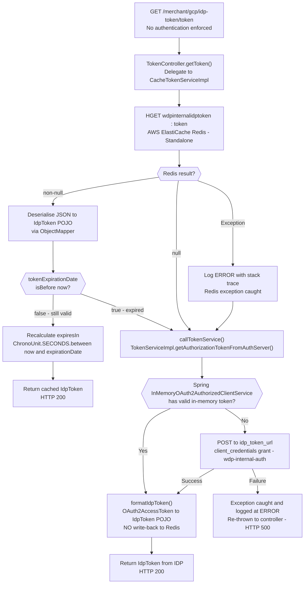

# WDP-COMP-36-TOKEN-SERVICE
**Worldpay Dispute Platform — Component Reference**
*Version: 1.0 DRAFT | April 2026*
*Extracted from: wdp-idp-token-service (C:\workspace-intel\wdp\CORE-SERVICES\wdp-idp-token-service) using GitHub Copilot CLI | Architect-confirmed: PENDING*

---

## ━━━ CORE SKELETON ━━━━━━━━━━━━━━━━━━━━━━━━━━━━━━━━━━━━━━
*Mandatory for every component regardless of type.*

---

## Identity

| Field                | Value                                                          |
|----------------------|----------------------------------------------------------------|
| **Name**             | `TokenService`                                                 |
| **Type**             | `REST API`                                                     |
| **Repository**       | `wdp-idp-token-service`                                        |
| **Namespace**        | `gcp-ff` (Jenkinsfile confirmed) — image: `frauddispute/globalswitch/wdp-idp-token-service` |
| **Stack**            | Java 17 · Spring Boot 3.5.6 · Spring Security OAuth2 · Spring Data Redis (Jedis) · Kubernetes |
| **Status**           | `✅ Production`                                                |
| **Doc status**       | `📝 DRAFT`                                                    |
| **Sections present** | `Core \| Block A (REST)`                                       |

---

## Purpose

**What it does**

TokenService is the centralised JWT token management service for the Worldpay Dispute Platform.
It exposes a single REST endpoint — `GET /merchant/gcp/idp-token/token` — which returns a valid
JWT obtained via the OAuth2 `client_credentials` grant against the enterprise IDP.

The service operates a two-layer cache strategy. The primary cache is an AWS ElastiCache Redis
hash (`wdpinternalidptoken:token`), which is read on every request. If a non-expired token is
found in Redis, it is returned immediately — no IDP call is made. If the Redis entry is absent,
expired, or unreadable, the service falls through to a secondary in-memory cache maintained by
Spring's `InMemoryOAuth2AuthorizedClientService` within the same JVM. If the in-memory store
also holds no valid token, Spring issues a `client_credentials` POST to the IDP endpoint and
caches the result in-memory only. There is no write-back to Redis — this service is read-only
with respect to ElastiCache.

All WDP consumers and batch jobs are intended to call TokenService to obtain JWT tokens for
making authenticated outbound API calls. This eliminates the need for every component to
implement its own IDP integration.

**Critical architectural finding:** The Redis hash `wdpinternalidptoken:token` must be written
by an external component that is NOT present in this repository. If that external writer is
absent or fails, every request will be a Redis miss and every token request will fall through
to the IDP directly. The identity of this external writer is an open question.

**What it does NOT do**

- Does **not** handle PAN tokenisation in any form — this service is JWT management only.
  PAN tokenisation is the responsibility of COMP-35 EncryptionService.
- Does **not** write to ElastiCache — it is read-only on Redis. The Redis hash is populated
  by an external process outside this codebase.
- Does **not** enforce any authentication on its own inbound endpoint — the SecurityConfig
  builds an empty Spring Security filter chain. Any client reachable on port 8082 can call it.
- Does **not** connect to any relational database.
- Does **not** publish to or consume from any Kafka topic.
- Does **not** apply any per-caller routing, per-scope routing, or platform-specific paths
  (NAP / PIN / CORE / VAP / LATAM). It manages exactly one token type and one OAuth2
  registration (`wdp-internal-auth`).
- Does **not** implement Resilience4j circuit breakers on any outbound call.
- Does **not** retry on Redis failure or IDP failure.
- Does **not** return a stale token if IDP is unavailable — the caller receives HTTP 500.

---

## Internal Processing Flow



**Important flow notes:**

- Redis is **always consulted first** — there is no path that bypasses the Redis HGET.
- The warm cache-hit path (Redis non-null + not expired) short-circuits entirely; Spring
  OAuth2 is never invoked.
- Expiry threshold is **strict past-expiry** — a token expiring in one second is not
  refreshed until it has actually passed. There is no lead-time buffer.
- After IDP fetch, the resulting `IdpToken` is returned to the caller but **never written
  to Redis**. Redis is populated only by the unknown external writer.
- `expiresIn` is **recalculated on every response** from the stored `expirationDate` —
  the caller always receives a freshly computed seconds-remaining value.

---

## Boundaries

### Inbound Interfaces

| Source                  | Protocol | Endpoint / Topic / Trigger               | Payload / Description                              |
|-------------------------|----------|-------------------------------------------|----------------------------------------------------|
| All WDP consumers and batch jobs | REST (HTTP GET) | `GET /merchant/gcp/idp-token/token` | No request body, no query params, no path variables. No authentication enforced. |

*Known callers are NOT determinable from this repository alone. Jenkinsfile namespace is `gcp-ff`
(frauddispute team). All WDP components making authenticated outbound calls are the intended
callers. A consumer list is not maintained in this codebase.*

### Outbound Interfaces

| Target                    | Protocol          | Resource                                        | Purpose                                          | On failure                                      |
|---------------------------|-------------------|-------------------------------------------------|--------------------------------------------------|-------------------------------------------------|
| AWS ElastiCache (Redis)   | Redis (Jedis — Standalone) | Hash key: `wdpinternalidptoken`, field: `token` | Read cached JWT token                           | Exception caught → log ERROR → fall through to IDP path. No retry. No circuit breaker. |
| IDP Token Endpoint        | HTTPS (OAuth2 `client_credentials`) | `${idp_token_url}` (env var) | Obtain fresh JWT when Redis cache is cold or expired | Exception caught → log ERROR → re-thrown → HTTP 500 to caller. No retry. No circuit breaker. |

---

## Database Ownership

### Tables Owned (written by this component)

This component owns no relational database state. It is stateless with respect to all
relational databases. No JPA/JDBC dependency is present in pom.xml. No `DataSource`
configuration, no `@Repository`, no entity class, and no SQL query exist in the source tree.

The component's only persistent store dependency is AWS ElastiCache (Redis), which it reads
but does **not** write. See WDP-DB.md for the ElastiCache entry.

### Tables Read (not owned by this component)

This component reads from no relational database tables.

---

## Configuration and Scaling

| Parameter              | Value                                                        | Notes                                                                          |
|------------------------|--------------------------------------------------------------|--------------------------------------------------------------------------------|
| **Replica count**      | `{{ replicas-wdp-idp-token-service }}`                      | XL Deploy / Helm placeholder. Exact production value not in source.            |
| **HPA**                | None                                                         | No `HorizontalPodAutoscaler` manifest in `resources.yaml`.                    |
| **Memory request**     | 1024Mi                                                       | Confirmed from `resources.yaml`.                                               |
| **Memory limit**       | 2048Mi                                                       | Confirmed from `resources.yaml`.                                               |
| **CPU request**        | Not set                                                      | CPU section absent from `resources.yaml`.                                      |
| **CPU limit**          | Not set                                                      | CPU section absent from `resources.yaml`.                                      |
| **Deployment type**    | Kubernetes `Deployment`                                      | Continuously running JVM.                                                      |
| **Rollout strategy**   | `RollingUpdate` — maxSurge: 1, maxUnavailable: 0            | `minReadySeconds: 30` also set.                                                |
| **PodDisruptionBudget**| None                                                         | No PDB manifest in `resources.yaml`.                                           |
| **Topology spread**    | Present — maxSkew: 1, whenUnsatisfiable: ScheduleAnyway, topologyKey: `kubernetes.io/hostname` | `labelSelector.matchLabels.app: wdp-idp-token-service${BRANCH_NAME_PLACEHOLDER}` — matches pod template label. **No label mismatch.** |
| **Container port**     | 8082                                                         | Confirmed from pod spec and Service targetPort.                                |
| **Service type**       | ClusterIP on port 8082                                       |                                                                                |
| **Observability**      | OpenTelemetry Java agent present                             | `instrumentation.opentelemetry.io/inject-java: opentelemetry-operator-system/default` |
| **Actuator**           | `info`, `health`, `prometheus` exposed                       | `show-details: never`. Liveness: `/merchant/gcp/idp-token/livez`. Readiness: `/merchant/gcp/idp-token/readyz`. Both on port 8082 (main server port, not a separate management port). |
| **Logstash**           | `logstash-logback-encoder` v7.4 present                     | `${logstash_server_host_port}` configured. `LogstashTcpSocketAppender` with `keepAliveDuration: 5 minutes`. Two hardcoded destinations (`10.43.145.125:5044`) commented out in `logback-spring.xml` — legacy, not active. |
| **Ingress**            | Nginx — 2 host entries                                       | External: `{{ hostName }}/merchant/gcp/idp-token`. Internal: `{{ internalHostName }}/merchant/gcp/idp-token`. CORS enabled (permissive nginx defaults). TLS via `{{ ingressTLSSecretName }}`. |

---

## Key Architectural Decisions

| Decision | ADR reference | Notes |
|----------|---------------|-------|
| Centralised JWT management — single service rather than per-component IDP integration | DEC-PLACEHOLDER | Eliminates duplicated `client_credentials` grant logic across all consumers and batch jobs. Single blast radius if service is unavailable. |
| ElastiCache Redis as shared JWT cache across pods | DEC-PLACEHOLDER | Allows any pod to serve a warm cache hit written by the external Redis writer. Means no write is ever performed by this service — Redis is read-only from this service's perspective. |
| No authentication on the inbound endpoint | Local decision | SecurityConfig builds an empty Spring Security filter chain. The endpoint is unauthenticated. Swagger documents a Bearer JWT requirement but this is not enforced. Any pod-reachable client can call the token endpoint. |
| No Resilience4j on any outbound call | DEC-014 — DEVIATION | Neither the Redis client nor the IDP HTTP client is wrapped with a circuit breaker. Redis failure silently falls through to IDP. IDP failure propagates as HTTP 500. Explicit absence confirmed from `pom.xml`. |
| No write-back to Redis after IDP fetch | Local decision | The service is architecturally read-only on Redis. The Redis hash is populated by an external process not present in this repository. The identity of that writer is an open question. |
| Strict past-expiry threshold — no lead-time buffer | Local decision | Token refresh triggered only when `tokenExpirationDate.isBefore(now)`. A token expiring in one second is served from cache and not refreshed until it has actually expired. |

---

## Risks and Constraints

| Severity | Risk | Consequence |
|----------|------|-------------|
| 🔴 HIGH | **Unknown external Redis writer** — the Redis hash `wdpinternalidptoken:token` must be populated by a component not present in this repository. If that writer is absent, misconfigured, or fails, every request to TokenService is a Redis miss and every token request goes directly to IDP. | Increased IDP load. If IDP is also unavailable, all WDP components making outbound authenticated API calls receive HTTP 500 from TokenService — platform-wide authentication failure. |
| 🔴 HIGH | **No Resilience4j on IDP call (DEC-014 deviation)** — IDP failure throws an unguarded exception to the caller. Under IDP unavailability all callers get HTTP 500 with no graceful degradation. | Any WDP component that calls TokenService in a critical path will fail hard, with no backoff, no retry, and no queued retry mechanism. |
| 🔴 HIGH | **TokenService unavailability = platform-wide auth failure** — all WDP consumers and batch jobs that call TokenService to get a JWT for outbound API calls lose authentication capability if this service is down. No per-component fallback exists. | Mass processing halt across any component that depends on outbound authenticated calls. |
| 🟠 HIGH | **Thundering herd on pod cold start** — no distributed lock, no single-flight mechanism, no Redisson-based coordination on IDP calls. If N pods restart simultaneously (e.g. rolling deployment) and the Redis cache is cold or just expired, each pod independently calls IDP in parallel. | N simultaneous `client_credentials` POSTs to IDP. IDP rate limiting could cause failures across all pods simultaneously, compounding the cold-start problem. |
| 🟡 MEDIUM | **No HTTP timeouts on IDP client** — Spring's default `RestTemplate`-based `DefaultClientCredentialsTokenResponseClient` is used with no connection or read timeout configured. | A hung IDP response holds a Tomcat thread indefinitely. Under concurrent load or a slow IDP, thread pool exhaustion is possible. |
| 🟡 MEDIUM | **Redis connection timeout is 60 seconds** — an unresponsive Redis will block the request thread for up to 60 seconds before falling through to IDP. | Tomcat thread held for up to 60 seconds per request during Redis unavailability. Under concurrent load this can exhaust the thread pool while silently degrading to IDP. |
| 🟡 MEDIUM | **In-memory OAuth2 token lost on pod restart** — Spring's `InMemoryOAuth2AuthorizedClientService` stores the authorised client in a `ConcurrentHashMap` in JVM heap. State is lost on pod restart or rolling update. | Every restarted pod must call IDP on its first cache-miss request. Combined with the thundering herd risk above, rolling updates increase IDP load. |
| 🟡 MEDIUM | **Latent NPE in error path** — `TokenServiceImpl.getAuthorizationTokenFromAuthServer()` logs an error when `authorizedClient` is null but does not return early. Execution continues to `formatIdpToken(authorizedClient.getAccessToken())`, which throws `NullPointerException`. | The NPE propagates as HTTP 500 but the error log fires without a guard return. Debugging is misleading — the root cause is the null-check log, not the NPE stack trace. |
| 🟡 MEDIUM | **`jwt.trustedIssuers` property declared but never consumed** — declared in `application.yml` and injected via Kubernetes secret `wdp-common-secrets`, but no `@Value` binding or class reads this property in the source tree. | The `spring-security-oauth2-resource-server` dependency is also unused. The intent to validate inbound JWTs appears abandoned without the security enforcement being removed or documented as a deliberate decision. |
| 🟢 LOW | **Unused pom.xml dependencies** — `spring-security-oauth2-resource-server`, `spring-boot-starter-validation`, `commons-lang3` — all present in pom.xml but not used in any meaningful way. | Unnecessary classpath overhead. No functional impact. `spring-security-oauth2-resource-server` could mislead reviewers into thinking inbound JWT validation is active. |
| 🟢 LOW | **CORS is permissive** — nginx Ingress has CORS enabled with no specific `allowed-origins` or `allowed-methods` configured, defaulting to nginx permissive behaviour. | Any origin can make a CORS-preflight request to the token endpoint. Combined with the absence of inbound authentication, this is a low-severity exposure from within the cluster network perimeter. |

---

## Planned Changes

- ⚠️ **OPEN QUESTION — Identity of the external Redis writer**: The Redis hash `wdpinternalidptoken:token` is read by this service but written by an external component not present in this repository. The identity of that writer must be confirmed. If it does not exist in production, this component's cache layer is non-functional and every request hits IDP. **Requires team confirmation.**
- ⚠️ **OPEN QUESTION — Known callers**: No consumer list is present in this codebase. Callers are described generically as "all WDP consumers and batch jobs." An explicit caller inventory is needed to assess the blast radius of TokenService unavailability. **Requires team confirmation.**
- ⚠️ **OPEN QUESTION — Inbound authentication intent**: The `spring-security-oauth2-resource-server` dependency and `jwt.trustedIssuers` property are present but unused. It is unclear whether inbound JWT validation was planned and abandoned, or is planned for a future release. This decision should be formally recorded when WDP-DECISIONS.md is rebuilt.
- No confirmed planned changes or migration flags as of April 2026. Review quarterly.

---

---

## ━━━ TYPE BLOCK A — REST API CONTRACTS ━━━━━━━━━━━━━━━━━━━

---

## REST API Contracts

**Authentication model:**
None enforced. The `SecurityConfig` builds an empty Spring Security filter chain
(`http.build()` with no rules). No bearer token validation, no caller identity check,
no rate limiting is applied to inbound calls. Any client that can reach the Kubernetes
ClusterIP service on port 8082 can call the token endpoint without credentials.

The Swagger UI documents the endpoint as requiring a Bearer JWT
(`SecurityScheme.Type.HTTP / bearer / JWT`) but this is **documentation metadata only**
and is not enforced at runtime.

**Base URL pattern:**
`https://<host>/merchant/gcp/idp-token`

**Context path:** `/merchant/gcp/idp-token`
**Service port:** 8082

---

### Endpoint: `GET /token`

**Purpose:** Return a valid JWT token obtained from the enterprise IDP, served from
ElastiCache cache where available.

**Caller(s):** All WDP consumers and batch jobs making authenticated outbound API calls
(exact caller list not determinable from this repository).

**Auth required:** None enforced (see authentication model above).

**Request**

No request body, no query parameters, no path variables. The `@Validated` annotation
is declared on the controller but there are no constraint annotations on any request
parameter. Inbound request body validation is a no-op.

**Response — Success**

| HTTP Status | Condition | Body |
|-------------|-----------|------|
| 200 OK | Token returned — either from Redis cache (warm hit) or from IDP (cache miss / expired / Redis exception) | `IdpToken` JSON object (see schema below) |

**Response body (HTTP 200):**

```
{
  "tokenValue":      "<JWT string>",
  "expiresIn":       3546,
  "tokenType":       "Bearer",
  "expirationDate":  "2026-04-08T12:22:08.123456"
}
```

| Field            | Type    | Description                                                                                        |
|------------------|---------|----------------------------------------------------------------------------------------------------|
| `tokenValue`     | String  | Raw IDP JWT string. Callers should use as `Authorization: Bearer <tokenValue>`.                    |
| `expiresIn`      | Integer | Seconds from **time of response** until token expires. Recalculated per-request from `expirationDate` — not the value stored in Redis. |
| `tokenType`      | String  | Always `"Bearer"`.                                                                                 |
| `expirationDate` | String  | `LocalDateTime.toString()` in UTC (no zone offset), e.g. `"2026-04-08T12:22:08.123456"`. Stored and returned as-is from the Redis cache object or derived from the IDP response. |

**Response — Error**

| HTTP Status | Condition | Body |
|-------------|-----------|------|
| 500 Internal Server Error | IDP call fails and exception propagates uncaught to the controller | Spring Boot default `/error` response (see below) |

**Error response body (HTTP 500) — Spring Boot default:**

```
{
  "timestamp":  "...",
  "status":     500,
  "error":      "Internal Server Error",
  "path":       "/merchant/gcp/idp-token/token"
}
```

No custom error body is defined in this service. Errors are Spring Boot's default `/error`
endpoint response.

**Notes:**

- Redis is always consulted first on every request. There is no path that bypasses the Redis HGET.
- `expiresIn` is recalculated on every response — the caller always receives a freshly computed value even on a cache hit.
- No write-back occurs after an IDP fetch. A Redis cache miss on one request does not warm the cache for the next request (from this service).
- The `expirationDate` field uses `LocalDateTime` with no timezone offset. Behaviour depends on JVM timezone (local vs UTC). If JVM timezone is not explicitly set, time comparison logic in the expiry check may behave unexpectedly in environments where local time ≠ UTC.

---

## Dependency Detail

### Dependency 1 — AWS ElastiCache (Redis)

| Property | Value |
|---|---|
| Client library | Jedis (`redis.clients:jedis`) — version managed by Spring Boot BOM |
| Spring wrapper | `spring-data-redis` |
| Connection mode | Standalone (`RedisStandaloneConfiguration`) — not cluster, not sentinel |
| Connection pooling | Yes — `jedisClientConfiguration.usePooling()` called; pool parameters use Jedis defaults |
| SSL | Conditional — `useSsl()` called if `${redis_ssl_enabled}` is `true` |
| Connection timeout | 60 seconds (`connectTimeout(Duration.ofSeconds(60))`) |
| Read timeout | Not configured — Jedis default applies (2000 ms) |
| Redis commands used | `HGET` only: `opsForHash().get("wdpinternalidptoken", "token")` — **read only** |
| Commands NOT issued | `HSET`, `SET`, `SETEX`, `DEL`, `EXPIRE` — none called by this service |
| Hash key | `wdpinternalidptoken` (from `app.token-key` config) |
| Hash field | `"token"` (string literal) |
| TTL set | None — this service does not write to Redis |
| Retry on failure | None |
| Resilience4j | **Absent** — not in `pom.xml` |
| On failure | `Exception` caught by broad `catch(Exception e)` → logged at ERROR with stack trace → falls through to IDP path silently |

⚠️ **Critical gap:** This service is **read-only** on Redis. The hash `wdpinternalidptoken:token`
must be populated by an external process. If no external writer exists or it has failed,
every request is a Redis miss and every token request goes directly to IDP.

---

### Dependency 2 — IDP Token Endpoint

| Property | Value |
|---|---|
| URL | `${idp_token_url}` (environment variable — exact URL not in source) |
| OAuth2 grant type | `client_credentials` (confirmed: `authorization-grant-type: client_credentials` in `application.yml`) |
| Scope | `openid` |
| Client registration ID | `wdp-internal-auth` |
| Principal name | `wdp-internal-auth` |
| Client ID | `${idp_client_id}` (environment variable) |
| Client Secret | `${idp_client_secret}` (environment variable) |
| Secrets source | Kubernetes secret `wdp-token-service-secrets` (via `secretRef` in `resources.yaml`) |
| HTTP client | Spring default `RestTemplate`-based `DefaultClientCredentialsTokenResponseClient` |
| Connection timeout | **Not configured** — Spring/JDK default applies |
| Read timeout | **Not configured** — Spring/JDK default applies |
| Retry | None — Spring's `OAuth2AuthorizedClientManager` does not retry by default |
| Resilience4j | **Absent** — not in `pom.xml` |
| On failure | Exception caught → logged at ERROR → re-thrown → propagates to HTTP 500 |
| In-memory caching | Spring's `InMemoryOAuth2AuthorizedClientService` keeps authorised client in `ConcurrentHashMap`. Spring will not re-call IDP until stored token expires. **State is lost on pod restart.** |
| Success handler | `authorizedClientService.saveAuthorizedClient(...)` — saves to in-memory store only |
| Failure handler | `RemoveAuthorizedClientOAuth2AuthorizationFailureHandler` — removes authorised client from in-memory store on failure |

---

## ━━━ DEVIATION FLAGS ━━━━━━━━━━━━━━━━━━━━━━━━━━━━━━━━━━━━

| ADR | Status | Detail |
|-----|--------|--------|
| DEC-001 (Transactional Outbox) | ✅ Not applicable | Service produces no Kafka events. No outbox table, no `spring-kafka` dependency, no `KafkaTemplate`, no `@KafkaListener`. |
| DEC-003 (Kafka partition key = merchantId) | ✅ Not applicable | Service does not publish to any Kafka topic. Confirmed by absence of Kafka dependency in `pom.xml`. |
| DEC-004 (PAN Encryption) | ✅ Compliant / Not applicable | Service handles no PAN data. Sole function is JWT token retrieval. No payment card fields exist in any model, request, or response. |
| DEC-005 (Kafka offset after all processing) | ✅ Not applicable | Service does not consume from any Kafka topic. No `@KafkaListener`, no `KafkaConsumer`, no `AckMode`. |
| DEC-014 (Resilience4j on outbound calls) | 🔴 **DEVIATING** | Neither ElastiCache nor IDP is wrapped with a Resilience4j circuit breaker. `io.github.resilience4j:resilience4j-spring-boot3` is absent from `pom.xml`. Redis failure silently falls through to IDP. IDP failure throws HTTP 500 directly to caller. Severity: HIGH. |

---

## ━━━ WDP-KAFKA.md UPDATE ━━━━━━━━━━━━━━━━━━━━━━━━━━━━━━━━

**No update required.** COMP-36 TokenService has no Kafka involvement — confirmed by absence
of any Kafka dependency in `pom.xml`. No rows to add to WDP-KAFKA.md Sections 3 or 4.

---

## ━━━ WDP-DB.md UPDATE ━━━━━━━━━━━━━━━━━━━━━━━━━━━━━━━━━━━

The WDP-DB.md entry for AWS ElastiCache already exists and records:

> `AWS ElastiCache | Redis | WDP Team | JWT token cache for TokenService | COMP-36 TokenService (owns)`

That entry should be **enriched** with the following correction and detail:

```
| AWS ElastiCache | Redis | WDP Team | JWT token cache. Redis hash key:
  wdpinternalidptoken, field: token. Value: JSON-serialised IdpToken (tokenValue,
  expiresIn, tokenType, expirationDate). COMP-36 TokenService reads this hash
  (HGET only — no writes). Hash is populated by an UNKNOWN EXTERNAL COMPONENT
  not present in the wdp-idp-token-service repository. ⚠️ External writer identity
  is an open question — see COMP-36 risks. | COMP-36 TokenService (reads only —
  does NOT own writes) |
```

**Shared table risk:** None — ElastiCache is used exclusively by TokenService per existing
WDP-DB.md. The only new finding is that this service does not write to it, which contradicts
the implication of "owns" in the current entry. Recommend changing ownership label to
**reads (external writer unknown)**.

---

## ━━━ REMAINING GAPS ━━━━━━━━━━━━━━━━━━━━━━━━━━━━━━━━━━━━━

| Gap | How to resolve |
|-----|----------------|
| **Identity of the external Redis writer** — the component that writes `wdpinternalidptoken:token` to ElastiCache is not present in this repository. Without it, the cache layer is non-functional. | **Team confirmation required.** Ask: "Which component or process writes the Redis hash `wdpinternalidptoken:token`? Is it a WDP component, an infrastructure bootstrap job, or something else? Is it running in production today?" |
| **Known callers** — no consumer list is present in this codebase. Callers are described generically. | **Copilot follow-up on consumer repositories.** Ask in each consumer/batch repo: "Does this component call `GET /merchant/gcp/idp-token/token`? If yes, at which step and under what conditions?" Alternatively, search the Jenkinsfile or Kubernetes service-to-service network policy for upstream consumers. |
| **Replica count** — `{{ replicas-wdp-idp-token-service }}` is an XL Deploy placeholder. Production value not determinable from source. | **Environment config or team confirmation.** Check XL Deploy variable store or production Helm values for actual replica count. |
| **Inbound authentication intent** — `spring-security-oauth2-resource-server` and `jwt.trustedIssuers` are present but unused. Deliberate or abandoned? | **Architect decision required.** Should inbound caller authentication be enforced? If yes, the planned resource-server configuration should be completed. If deliberately absent, this should be recorded as a formal local decision in WDP-DECISIONS.md when it is rebuilt. |
| **JVM timezone** — `LocalDateTime` used for token expiry with no explicit timezone. Behaviour in non-UTC environments may cause early expiry or stale token serving. | **Copilot follow-up question:** "Is the JVM timezone explicitly set in the Kubernetes deployment manifest (e.g. `TZ` environment variable or JVM arg `-Duser.timezone=UTC`)? If not, what is the host timezone?" |
| **IDP URL** — `${idp_token_url}` exact production value not in source. | **Environment config.** Check Kubernetes secret `wdp-token-service-secrets` or environment-specific YAML for the production IDP endpoint URL. Confirm it matches the IDP endpoint documented in WDP-INTEGRATIONS.md. |
