# WDP-COMP-37-DOCUMENT-MANAGEMENT-SERVICE
**Worldpay Dispute Platform — Component Reference**
*Version: 1.0 DRAFT | April 2026*
*Extracted from: `gcp-document-management-service` (artifact: `document-management-service` v2.2.8) using GitHub Copilot CLI | Architect-confirmed: PENDING*

---

## ━━━ CORE SKELETON ━━━━━━━━━━━━━━━━━━━━━━━━━━━━━━━━━━━━━━

---

## Identity

| Field                | Value |
|----------------------|-------|
| **Name**             | `DocumentManagementService` |
| **Type**             | `REST API + Kafka Producer` |
| **Repository**       | `gcp-document-management-service` |
| **Git SCM**          | `https://github.worldpay.com/Worldpay/mdvs-gcp-document-management-service` |
| **Context path**     | `/merchant/gcp/document-management` (set via `SERVER_SERVLET_CONTEXT_PATH` env var) |
| **Status**           | ✅ Production |
| **Doc status**       | 📝 DRAFT |
| **Sections present** | Core \| Block A — REST \| Block C — Kafka Producer |

---

## Purpose

**What it does**

DocumentManagementService is the central document storage and retrieval hub for the Worldpay Dispute Platform. It handles all evidence document lifecycle operations: upload (multipart and base64), list, download, metadata update, and issuer document attachment. Storage is physically split by platform: NAP (UK) writes to AWS `eu-west-2` (S3 bucket `nap-dispute-documents`, DynamoDB table `NAP_DISPUTE_DOCUMENTS`), while all other platforms (CORE, PIN, VAP, LATAM) write to `us-east-2` (S3 bucket `wdp-pin-dispute-documents`, DynamoDB table `WDP_PIN_DISPUTE_DOCUMENTS`). The platform routing decision is driven by a NAP/non-NAP binary check — not by the `{platform}` path variable directly.

The service exposes **thirteen REST endpoints** across two controllers: `DocumentManagementController` (12 endpoints for the primary dispute document flow) and `CoreDocumentManagementController` (1 endpoint for CORE-platform historical document backfill). Document bytes are treated as opaque content — the service does not parse, inspect, or extract data from document content. File conversion (TIFF→PDF, image→PDF) is performed internally using PDFBox and ImageConverter before S3 upload.

On document upload, when `notifyBRQueue=true` and a `startRuleGroup` is provided, the service publishes synchronously to the `business-rules` Kafka topic on AWS MSK (IAM auth). This is a **direct Kafka publish with no transactional outbox** — the publish occurs after DynamoDB write but outside any spanning transaction. This is a confirmed DEC-001 deviation.

The service also maintains questionnaire state and case desk-number records in two PostgreSQL databases (WDP/US and NAP/UK) accessed via separate Spring Data JPA datasources.

**What it does NOT do**

- Does not consume from any Kafka topic — it is a producer only.
- Does not use a transactional outbox for Kafka publishing (DEC-001 deviation).
- Does not parse or inspect document content — bytes are treated as opaque.
- Does not perform PAN encryption or PAN data handling of any kind.
- Does not interact with any staging S3 bucket — it receives raw bytes from the HTTP request and writes directly to the target bucket.
- Does not delete or archive source files after upload — no staging-to-production move exists.
- Does not implement Resilience4j circuit breakers on any outbound dependency (DEC-014 — consistent with platform-wide pattern).
- Does not implement endpoint-level RBAC — no `@PreAuthorize` or role checks.
- Does not trust the API Gateway for JWT validation — it acts as an OAuth2 Resource Server and validates JWTs itself.

---

## Internal Processing Flow

*Primary path shown: `POST /{platform}/documents/{caseNumber}` — the multipart document upload flow.
This is the most complex path and exercises all major dependencies. Other endpoint flows are simpler subsets.*

```mermaid
flowchart TD
    IN["HTTP POST /{platform}/documents/{caseNumber}\nmultipart/form-data + Bearer JWT"]

    BEANVAL{"Bean validation\nplatform, caseNumber, actionSeq,\ndocumentType, uploadedBy, file"}
    BEANVAL_FAIL["HTTP 400 BAD_REQUEST"]

    JWTCHECK{"JWT claims\nnull or blank?"}
    JWT_FAIL["HTTP 400 / 401 UNAUTHORIZED"]

    USERID["Extract & mask displayUserId\nif issuer = us_worldpay_fis_int\n→ WORLDPAY or System"]

    CASELOOKUP["Case lookup\nGET case-management-service\n(cardNetwork, merchantId,\ncaseStatus, deskNumber, entities)"]
    CASELOOKUP_FAIL["HTTP 404 NOT_FOUND"]

    ACTIONLOOKUP["Action lookup\nGET case-actions-service\n(actionStatuses, stageCode)"]
    ACTIONLOOKUP_FAIL["HTTP 404 NOT_FOUND"]

    DUPCHECK["Duplicate file check\nDynamoDB query by caseNumber PK\nin-memory filename comparison\n(extension-stripped)"]
    DUP_FOUND["HTTP 400 BAD_REQUEST\nFile already present"]

    ACTIONSTATUS{"Case status CLOSED\n+ action status OPEN?"}
    ACTIONSTATUS_FAIL["HTTP 400 BAD_REQUEST"]

    DOCTYPE{"docType = RESPDOC\n+ action CLOSED or blank?"}
    DOCTYPE_RECLASSIFY["Reclassify docType\nRESPDOC → MISCDOC"]

    PAGECOUNT["Calculate page count\nPDFBox / ImageIO"]
    NETLIMIT["Network limit lookup\nYAML config DocumentLimitConfig"]

    PAGELIMIT{"Page count\nexceeds network limit?"}
    PAGELIMIT_FAIL["HTTP 400 BAD_REQUEST"]

    CONVERT{"convertDocument\n= true?"}

    FORMAT{"File extension?"}
    PDF_PATH["PDF: resolution check\nPDFDocumentUtil"]
    TIFF_PATH["TIFF/TIF → PDF\nImageConverter.getTiffToPdfConvertedData()"]
    IMG_PATH["JPG/JPEG/BMP/PNG/GIF → PDF\nImageConverter.getPdfConvertedData()"]
    FORMAT_FAIL["HTTP 400 BAD_REQUEST\nUnsupported format"]
    CONV_FALSE["convertDocument=false\nOnly PDF/TIFF/TIF accepted\nImages rejected → 400"]

    SIZECHECK{"File size\nexceeds network limit?"}
    SIZECHECK_FAIL["HTTP 400 BAD_REQUEST"]

    PLATFORM{"platform\n== NAP?"}

    S3_NAP["S3 PutObjectRequest\nnap-dispute-documents\neu-west-2\nNAPS3Client"]
    S3_WDP["S3 PutObjectRequest\nwdp-pin-dispute-documents\nus-east-2\nS3Client"]
    S3_FAIL["HTTP 500\nDynamoDB NOT yet written\nNo compensating action"]

    DDB_NAP["DynamoDB putItem\nNAP_DISPUTE_DOCUMENTS\neu-west-2"]
    DDB_WDP["DynamoDB putItem\nWDP_PIN_DISPUTE_DOCUMENTS\nus-east-2"]
    DDB_FAIL["HTTP 500\nS3 object ORPHANED in bucket\nNo compensating action"]

    DESKNUM{"docType = ISSRDOC\n+ deskNumber = WPISDOC\nor WMISDOC?"}
    DESKNUM_UPDATE["Null desk number in PostgreSQL\nUSCaseRepository or UKCaseRepository\n(JPA)"]

    ACTIONUPDATE["PUT case-actions-service\nUpdate action indicator"]
    ACTIONUPDATE_FAIL["HTTP 500\nS3 + DynamoDB already committed"]

    BROUTE{"notifyBRQueue = true\n+ startRuleGroup not blank?"}

    KAFKA["Publish to business-rules topic\nKafkaTemplate.send().get()\nSynchronous — blocks\n3 retries × 100ms"]
    KAFKA_FAIL["HTTP 500\nS3 + DynamoDB already committed\nDocument stored, BR not triggered"]

    OUT["HTTP 201 CREATED\nDocumentResponse\n{caseNumber, documentName,\ndocumentRef (S3 key),\ndateUploaded, documentType,\ndisputeStage}"]

    IN --> BEANVAL
    BEANVAL -->|"blank field or empty file"| BEANVAL_FAIL
    BEANVAL -->|"valid"| JWTCHECK
    JWTCHECK -->|"null / no claims"| JWT_FAIL
    JWTCHECK -->|"valid JWT"| USERID
    USERID --> CASELOOKUP
    CASELOOKUP -->|"any exception"| CASELOOKUP_FAIL
    CASELOOKUP -->|"success"| ACTIONLOOKUP
    ACTIONLOOKUP -->|"any exception"| ACTIONLOOKUP_FAIL
    ACTIONLOOKUP -->|"success"| DUPCHECK
    DUPCHECK -->|"duplicate found"| DUP_FOUND
    DUPCHECK -->|"no duplicate"| ACTIONSTATUS
    ACTIONSTATUS -->|"yes"| ACTIONSTATUS_FAIL
    ACTIONSTATUS -->|"no"| DOCTYPE
    DOCTYPE -->|"yes"| DOCTYPE_RECLASSIFY
    DOCTYPE -->|"no"| PAGECOUNT
    DOCTYPE_RECLASSIFY --> PAGECOUNT
    PAGECOUNT --> NETLIMIT
    NETLIMIT --> PAGELIMIT
    PAGELIMIT -->|"exceeds"| PAGELIMIT_FAIL
    PAGELIMIT -->|"within limit"| CONVERT
    CONVERT -->|"true"| FORMAT
    CONVERT -->|"false"| CONV_FALSE
    FORMAT -->|"PDF"| PDF_PATH
    FORMAT -->|"TIFF / TIF"| TIFF_PATH
    FORMAT -->|"JPG / JPEG / BMP / PNG / GIF"| IMG_PATH
    FORMAT -->|"any other extension"| FORMAT_FAIL
    PDF_PATH --> SIZECHECK
    TIFF_PATH --> SIZECHECK
    IMG_PATH --> SIZECHECK
    CONV_FALSE --> SIZECHECK
    SIZECHECK -->|"exceeds"| SIZECHECK_FAIL
    SIZECHECK -->|"within limit"| PLATFORM
    PLATFORM -->|"NAP"| S3_NAP
    PLATFORM -->|"non-NAP"| S3_WDP
    S3_NAP -->|"exception"| S3_FAIL
    S3_WDP -->|"exception"| S3_FAIL
    S3_NAP -->|"success"| DDB_NAP
    S3_WDP -->|"success"| DDB_WDP
    DDB_NAP -->|"exception"| DDB_FAIL
    DDB_WDP -->|"exception"| DDB_FAIL
    DDB_NAP -->|"success"| DESKNUM
    DDB_WDP -->|"success"| DESKNUM
    DESKNUM -->|"yes"| DESKNUM_UPDATE
    DESKNUM -->|"no"| ACTIONUPDATE
    DESKNUM_UPDATE --> ACTIONUPDATE
    ACTIONUPDATE -->|"exception"| ACTIONUPDATE_FAIL
    ACTIONUPDATE -->|"success"| BROUTE
    BROUTE -->|"no"| OUT
    BROUTE -->|"yes"| KAFKA
    KAFKA -->|"all retries exhausted"| KAFKA_FAIL
    KAFKA -->|"broker ACK received"| OUT
```

**Critical architectural note on failure atomicity:**
There is no distributed transaction or compensating saga across S3, DynamoDB, PostgreSQL, and Kafka. Each write is independent:
- S3 succeeds → DynamoDB fails: S3 object is orphaned in bucket with no cleanup.
- DynamoDB succeeds → Kafka fails (after 3 retries): document is stored but Business Rules processing is never triggered. The dispute case is effectively stuck without a BR event.

---

## Boundaries

### Inbound Interfaces

| Source | Protocol | Endpoint / Trigger | Payload / Description |
|--------|----------|--------------------|-----------------------|
| WDP Ops Portal | REST | `POST /{platform}/documents/{caseNumber}` | Multipart file upload — dispute evidence |
| WDP Ops Portal / dispute services | REST | `GET /{platform}/documents/{caseNumber}` | List documents for a case |
| Internal case processing services | REST | `POST /{platform}/documents/{caseNumber}/actions` | Add/update document metadata (transmission date) |
| WDP Ops Portal | REST | `PUT /{platform}/documents/{caseNumber}` | Update document metadata (updatedBy, timestamp) |
| Internal services needing doc bytes | REST | `POST /{platform}/documents/base64/{caseNumber}` | Fetch document content as base64 |
| WDP Ops Portal / Merchant Portal | REST | `GET /{platform}/document/{caseNumber}/download` | Download document via S3 presigned URL (302 redirect) |
| WDP Ops Portal / Merchant Portal | REST | `GET /{platform}/documents/{caseNumber}/unique-document` | Get unique document list with display codes |
| NAP EvidenceConsumer / WDP Ops Portal | REST | `POST /nap/response/document` | Upload NAP base64 document (fixed platform=NAP) |
| Internal dispute workflow / FileProcessor | REST | `POST /{platform}/documents/{caseNumber}/issuerdoc` | Add issuer document (v1, JSON body) |
| Internal dispute workflow | REST | `POST v2/{platform}/documents/{caseNumber}/issuerdoc` | Add issuer document (v2, multipart) |
| WDP Ops Portal / Questionnaire service | REST | `PUT /{platform}/document/{caseNumber}/action/{actionSeq}` | Update document info + optional Kafka BR notify |
| WDP Ops Portal / Questionnaire service | REST | `POST /{platform}/documents/{caseNumber}/validate` | Validate total file size against network limits |
| WDP Ops Portal / data migration jobs | REST | `POST /{platform}/documents/{caseNumber}/history-doc` | Upload historical document (CORE platform only) |
| Kubernetes | HTTP | `GET /actuator/health`, `/readyz`, `/liveness` | Liveness / readiness probes |

### Outbound Interfaces

| Target | Protocol | Endpoint / Resource | Purpose | On failure |
|--------|----------|---------------------|---------|------------|
| `mdvs-gcp-case-management-service` | REST (RestTemplate) | `GET {casesearch.url}` | Case lookup — cardNetwork, merchantId, caseStatus, deskNumber, entity hierarchy | Exception → HTTP 404 to caller |
| `mdvs-gcp-case-actions-service` | REST (RestTemplate) | `GET {actionsearch.url}` | Action lookup — actionStatuses, stageCode | Exception → HTTP 404 to caller |
| `mdvs-gcp-case-actions-service` | REST (RestTemplate) | `PUT` action update | Update action indicator after document upload | Exception → HTTP 500; S3+DynamoDB already committed |
| `mdvs-gcp-case-management-service` | REST (RestTemplate) | `PUT` case update | Update case desk number | Exception logged; propagates → 500 |
| `mdvs-gcp-case-search-service` | REST (RestTemplate) | `GET` case lookup by ARN | Used in NAP base64 upload path only | Exception → HTTP 500 |
| `mdvs-gcp-rules-service` | REST (RestTemplate) | `GET` issuer doc detail type | Issuer doc endpoint — doc type lookup from rules | Exception → HTTP 500 |
| `mdvs-gcp-visa-adapter` | REST (RestTemplate) | Visa RTSI proxy | Issuer doc endpoint — Visa RTSI calls | Exception → HTTP 500 |
| `mdvs-gcp-mastercard-adapter` | REST (RestTemplate) | Mastercard MCOM proxy | Issuer doc endpoint — Mastercard MCOM calls | Exception → HTTP 500 |
| `mdvs-gcp-display-code-service` | REST (RestTemplate) | Display code lookup | Enrich doc type/stage descriptions (unique-document endpoint) | Exception caught; response field left empty |
| `gcp-api-log-service` | REST | Error logging | URL configured; no active usage observed in main processing paths | — |
| AWS S3 (`wdp-pin-dispute-documents`) | AWS SDK v2 (`S3Client`) | `PutObjectRequest` / presigned GET | Store/retrieve WDP/CORE/PIN/VAP/LATAM documents (us-east-2) | Exception → HTTP 500; no retry |
| AWS S3 (`nap-dispute-documents`) | AWS SDK v2 (`S3Client`) | `PutObjectRequest` / presigned GET | Store/retrieve NAP documents (eu-west-2) | Exception → HTTP 500; no retry |
| AWS DynamoDB (`WDP_PIN_DISPUTE_DOCUMENTS`) | AWS SDK v2 Enhanced Client | `putItem` / `query` | Document metadata store — WDP/CORE/PIN/VAP/LATAM (us-east-2) | Exception → HTTP 500; S3 object orphaned |
| AWS DynamoDB (`NAP_DISPUTE_DOCUMENTS`) | AWS SDK v2 Enhanced Client | `putItem` / `query` | Document metadata store — NAP (eu-west-2) | Exception → HTTP 500; S3 object orphaned |
| AWS MSK Kafka (`business-rules`) | Spring Kafka producer (SASL/SSL IAM) | `business-rules` topic | Notify Business Rules Processor after document upload | 3 retries × 100ms; exhaustion → HTTP 500; document already stored |
| PostgreSQL WDP/US (`spring.datasource.wdp`) | Spring Data JPA (HikariCP) | `USCaseRepository` / `QuestionnaireRepository` | Questionnaire state + desk number blanking — WDP platform | Exception → HTTP 500 |
| PostgreSQL NAP/UK (`spring.datasource.nap`) | Spring Data JPA (HikariCP) | `UKCaseRepository` | Desk number blanking — NAP platform | Exception → HTTP 500 |

---

## Database Ownership

### Tables Owned (written by this component)

| Store | Table / Resource | Purpose | Key columns | Retention / Notes |
|-------|-----------------|---------|-------------|-------------------|
| Amazon DynamoDB (us-east-2) | `WDP_PIN_DISPUTE_DOCUMENTS` | Document metadata for WDP/CORE/PIN/VAP/LATAM platforms | PK: `I_CASE` (caseNumber), SK: `C_ACTION_SEQ_DOC_NAME` (actionSeq + documentName) | ⚠️ S3 lifecycle/expiry policy not configured in application code — requires AWS console verification |
| Amazon DynamoDB (eu-west-2) | `NAP_DISPUTE_DOCUMENTS` | Document metadata for NAP platform | PK: `I_CASE` (caseNumber), SK: `C_ACTION_SEQ_DOC_NAME` (actionSeq + documentName) | ⚠️ S3 lifecycle/expiry policy not configured in application code — requires AWS console verification |
| AWS S3 (us-east-2) | `wdp-pin-dispute-documents` | Document file storage — WDP/CORE/PIN/VAP/LATAM | Key pattern: `{yyyy/MM/dd}/{caseNumber}/{documentName}` | S3 lifecycle policy not configured in application code |
| AWS S3 (eu-west-2) | `nap-dispute-documents` | Document file storage — NAP platform | Key pattern: `{yyyy/MM/dd}/{caseNumber}/{documentName}` | S3 lifecycle policy not configured in application code |
| PostgreSQL WDP (US) | `QuestionnaireEntity` table | Questionnaire state per case/action | caseNumber, actionSeq | Managed via `QuestionnaireRepository` |
| PostgreSQL NAP (UK) | `UKCaseEntity` table | NAP case records — used for desk number blanking on issuer doc upload | caseNumber | Managed via `UKCaseRepository` |

**DynamoDB attribute schema — full attribute set written on upload:**

| Java Field | DynamoDB Attribute | Type | Description |
|-----------|-------------------|------|-------------|
| `caseId` | `I_CASE` | String | Case number (Partition Key) |
| `actionSeqDocName` | `C_ACTION_SEQ_DOC_NAME` | String | actionSequence + documentName (Sort Key) |
| `stageCode` | `C_STAGE_CODE` | String | Dispute stage (CHI, PAS, etc.) |
| `actionSeq` | `I_ACTION_SEQ` | String | Action sequence number |
| `docType` | `C_DOC_TYPE` | String | Document type code (RESPDOC, MISCDOC, ISSRDOC, etc.) |
| `docName` | `B_DOC_NAME` | String | Document filename |
| `docS3Ref` | `C_DOC_S3_REF` | String | Full S3 key path |
| `insertedBy` | `X_INSERT` | String | userId of uploader |
| `insertedTimestamp` | `Z_INSERT` | String | Upload timestamp |
| `insertedDisplayUserId` | `X_INSERT_DISPLAY` | String | Masked display userId |
| `updatedDisplayUserId` | `X_UPDT_DISPLAY` | String | Same as insertedDisplayUserId on first write |
| `fileSize` | `I_FILE_SIZE` | String | File size in bytes (stored as String) |
| `pageCount` | `I_PAGE_COUNT` | String | Page count (stored as String) |
| `merchantId` | `c_level1_entity` | String | Merchant ID from case search |
| `level2Entity` | `c_level2_entity` | String | L2 entity from case search |
| `level3Entity` | `c_level3_entity` | String | L3 entity from case search |
| `level4Entity` | `c_level4_entity` | String | L4 entity from case search |
| `level5Entity` | `c_level5_entity` | String | L5 entity from case search |
| `docPreview` | `b_doc_preview` | String | Base64 PNG thumbnail |

**Attributes written on metadata update (`PUT /{platform}/documents/{caseNumber}`):**
`updatedBy` (`X_UPDT`), `updatedTimestamp` (`Z_UPDT`), `updatedDisplayUserId` (`X_UPDT_DISPLAY`). All other fields preserved via read-then-update pattern.

**Attributes written on `POST .../actions` (Add Document Action):**
Updates existing record: adds `transmittedBy` (`X_TRANSMITTED`), `transmittedTimestamp` (`Z_TRANSMITTED`), `updatedBy`, `updatedTimestamp`, `updatedDisplayUserId`.

**DynamoDB write ordering:** S3 write occurs **before** DynamoDB `putItem()`. They are sequential but independent — no AWS transaction spans both. There is a crash window between S3 success and DynamoDB write.

**No DynamoDB conditional expressions:** Duplicate prevention is application-level only (query by PK, iterate, in-memory filename comparison). Not a DynamoDB condition expression. Concurrent uploads of the same filename can both pass the duplicate check before either writes.

### Tables Read (not owned by this component)

| Store | Table / Resource | Owned by | Why accessed |
|-------|-----------------|---------|--------------|
| PostgreSQL WDP (US) | `USCaseEntity` | COMP-22 DisputeService (shared) | Desk number blanking on issuer doc upload |
| DynamoDB (both tables) | `WDP_PIN_DISPUTE_DOCUMENTS` / `NAP_DISPUTE_DOCUMENTS` | This component | Duplicate check (query by PK), document list retrieval, update operations |

---

## Configuration and Scaling

| Parameter | Value | Notes |
|-----------|-------|-------|
| Replica count | `{{ replicas-gcp-document-management-service }}` | XL Deploy variable — actual value not determinable from source |
| HPA | None | Not present in `resources.yaml` |
| Memory request | `1024Mi` | |
| Memory limit | `4096Mi` | |
| CPU request | Not set | Absent from `resources.yaml` |
| CPU limit | Not set | Absent from `resources.yaml` |
| Deployment type | Kubernetes Deployment | `kind: Deployment` confirmed |
| Rollout strategy | RollingUpdate — maxSurge:1, maxUnavailable:0 | Zero-downtime; `minReadySeconds: 30` |
| PodDisruptionBudget | None | Not present in `resources.yaml` |
| Topology spread | ScheduleAnyway — maxSkew:1 by `kubernetes.io/hostname` | ⚠️ Label uses `${BRANCH_NAME_PLACEHOLDER}` — mismatch risk if branch substitution fails |
| Observability | OpenTelemetry Java agent (auto-instrumentation via OTel operator) | Pod annotation: `instrumentation.opentelemetry.io/inject-java` |
| Actuator | `/actuator/health`, `/merchant/gcp/prometheus`, `/readyz`, `/liveness` | Health show-details: `never` |
| Logstash | `logstash-logback-encoder` — Logstash host injected via `${logstash_server_host_port}` | Declared **twice** in pom.xml (lines 92-96 and 169-174) — harmless duplicate |
| Metrics | Prometheus scraping on `/actuator/prometheus` | |
| Service type | ClusterIP — external access via NGINX Ingress | Ingress: proxy body size `25m`, CORS enabled, multiple host rules |
| Spring Boot version | 3.1 | |
| Java version | 17 | |
| AWS SDK version | v2 (DynamoDB Enhanced, S3) | |
| PostgreSQL datasources | Two: WDP/US (`spring.datasource.wdp`) + NAP/UK (`spring.datasource.nap`) | Separate HikariCP pools — default pool size (10) |

---

## Key Architectural Decisions

| Decision | ADR reference | Notes |
|----------|---------------|-------|
| DynamoDB for document metadata — not Aurora | DEC-PLACEHOLDER | Only WDP component with a DynamoDB dependency. Two separate tables split by platform (NAP vs WDP). |
| S3 for document storage — not DB blob | DEC-PLACEHOLDER | Documents stored as opaque bytes. S3 key pattern: `{yyyy/MM/dd}/{caseNumber}/{documentName}`. |
| Single service owns all document operations | DEC-PLACEHOLDER | All callers go through this service — no direct S3 access by other components. |
| Service acts as OAuth2 Resource Server | Local decision | Validates JWT tokens itself via `JwtIssuerAuthenticationManagerResolver`. Does NOT trust API Gateway for JWT bypass. Multi-issuer support configured. |
| Storage split by platform (NAP eu-west-2, WDP us-east-2) | Local decision | Driven by data residency — NAP (UK) data must remain in eu-west-2. |
| No transactional outbox for Kafka publish | **DEC-001 — DEVIATION** 🔴 | Direct Kafka publish after DynamoDB write. No outbox table. If service dies between DynamoDB write and Kafka send, BR event is lost. |
| Kafka partition key inconsistent across code paths | **DEC-003 — DEVIATION** 🔴 | Legacy `sendBusinessRules()` uses `merchantId` as key. Newer `sendBusinessRulesToKafka()` uses `caseNumber` as key. Ordering guarantee differs per code path. Requires remediation. |
| No Resilience4j circuit breakers | DEC-014 — ABSENT | Consistent with platform-wide pattern. All outbound calls (S3, DynamoDB, REST, Kafka) fail directly to caller. |
| No timeout on RestTemplate | Local — operational gap 🔴 | Plain `new RestTemplate()` with no timeout, no retry, no connection pool tuning. All REST calls can block indefinitely. |
| Synchronous Kafka publish blocking caller thread | Local decision | `kafkaTemplate.send().get()` — caller waits for broker ACK. Failure propagates HTTP 500 to upstream. |

---

## Risks and Constraints

| Severity | Risk | Consequence |
|----------|------|-------------|
| 🔴 HIGH | **No distributed transaction across S3, DynamoDB, and Kafka.** S3 write precedes DynamoDB write; Kafka follows. Any crash between steps leaves partial state with no compensating action. | S3 object orphaned (DynamoDB fails); or document stored but BR never triggered (Kafka fails). |
| 🔴 HIGH | **DEC-001 deviation — no transactional outbox.** If service crashes or Kafka is unavailable after DynamoDB write, the BR event is permanently lost. No retry or recovery mechanism exists. | Dispute case stalls at document-attached state; business rules processing never fires; manual intervention required. |
| 🔴 HIGH | **DEC-003 deviation — inconsistent Kafka partition key.** Legacy path uses `merchantId`; questionnaire path uses `caseNumber`. Messages for the same case may land on different partitions depending on code path taken. | Ordering guarantee broken. Two BR events for the same case may be consumed out of order by BusinessRulesProcessor. |
| 🔴 HIGH | **RestTemplate with no timeout on all outbound REST calls.** Any hanging downstream service (case-management, case-actions, rules-service, visa-adapter, etc.) blocks the handler thread indefinitely. | Thread exhaustion under load; full service unresponsive. |
| 🟡 MEDIUM | **No DynamoDB conditional write for duplicate prevention.** Duplicate check is application-level (query + in-memory compare). Two concurrent requests can both pass the check. | Same document uploaded twice to S3 and DynamoDB. |
| 🟡 MEDIUM | **Topology spread label uses `${BRANCH_NAME_PLACEHOLDER}`.** If branch substitution fails at deploy time, the `matchLabels` in `topologySpreadConstraints` will not match the pod template label. | Topology spread constraint is silently ignored; pods may concentrate on a single node. |
| 🟡 MEDIUM | **No CPU limit or request defined.** Only memory limits/requests are set in `resources.yaml`. | CPU can be starved by other pods or can consume unbounded CPU, impacting co-located workloads. |
| 🟡 MEDIUM | **No HPA configured.** Replica count is static (XL Deploy variable). | Service cannot auto-scale under document upload load spikes. |
| 🟡 MEDIUM | **Kafka publish blocked on slow broker.** Synchronous `.get()` call blocks the HTTP handler thread until broker acknowledgment or retry exhaustion. | Under Kafka latency spikes, upload endpoint response times degrade significantly. |
| 🟢 LOW | **S3 lifecycle / document retention policy not configured in application code.** Requires direct AWS console verification. | Documents may accumulate indefinitely; retention compliance risk for PCI-DSS 7-year rule. |
| 🟢 LOW | **`spring-boot-devtools` present in pom.xml as runtime-optional.** If not excluded from production Docker image, it could cause unexpected class reloading behaviour. | Operational instability in rare scenarios. |
| 🟢 LOW | **`logstash-logback-encoder` declared twice in pom.xml.** Functionally harmless but indicates stale dependency management. | No runtime impact. |

---

## Planned Changes

- ⚠️ OPEN QUESTION: S3 bucket lifecycle / document retention policy — confirm whether expiry rules are configured at the bucket level in AWS console. Required for PCI-DSS 7-year retention compliance confirmation.
- ⚠️ OPEN QUESTION: Actual replica count for `replicas-gcp-document-management-service` XL Deploy variable — confirm prod and non-prod values.
- ⚠️ OPEN QUESTION: Whether `spring-boot-devtools` is excluded from the production Docker build image.
- TODO (in source): `DocumentManagementServiceImpl.java` line 2189 — eventType currently inferred from documentType as a fallback. Intended future state: eventType passed explicitly from caller. Technical debt in Kafka event type handling.
- `pdfThumbnailService.generatePNGThumbnail()` on the historical doc endpoint returns a fixed placeholder thumbnail from `Thumbnail.png` resource — may indicate incomplete migration path for historical document display.
- Commented-out code in `DocumentManagementServiceImpl.entityToResponse()` (lines 1932-1938) — previously set dispute stage and document type directly from DynamoDB enum values. Replaced by display code service lookup. Candidate for removal.

---

---

## ━━━ TYPE BLOCK A — REST API CONTRACTS ━━━━━━━━━━━━━━━━━━

---

## REST API Contracts

**Authentication model:**
The service acts as a **Spring OAuth2 Resource Server**. It validates JWT Bearer tokens itself against a configurable list of trusted issuers (`jwt.trustedIssuers`). Spring Security's `JwtIssuerAuthenticationManagerResolver` handles multi-issuer support. There is no API Gateway JWT bypass — JWTs are validated at this service boundary.

All endpoints except `/actuator/health`, `/readyz`, and `/liveness` require a valid Bearer JWT. In non-prod environments, Swagger UI paths (`/v3/api-docs/**`) are also whitelisted.

Internal vs external caller detection: if the JWT `iss` claim contains `us_worldpay_fis_int`, the userId is masked to `WORLDPAY` or `System` for audit purposes. No endpoint-level RBAC is implemented (`@PreAuthorize` not present).

**Base URL pattern:** `https://<host>/merchant/gcp/document-management/{platform}/...`

**Common headers (all endpoints):**

| Header | Required | Description |
|--------|----------|-------------|
| `Authorization: Bearer <JWT>` | Yes | OAuth2 JWT token |
| `v-correlation-id` | No | Correlation ID for distributed tracing |
| `idempotency-key` | No | Accepted and logged but **not used for deduplication** in application code |

---

### Endpoint 1: `POST /{platform}/documents/{caseNumber}` — Upload File (Multipart)

**Purpose:** Primary document upload endpoint. Accepts multipart file. Performs duplicate check, image conversion, S3 upload, DynamoDB metadata write, desk-number update, and optional Kafka BR notification.
**Caller(s):** WDP Ops Portal, internal dispute workflow services, COMP-15 EvidenceConsumer
**Auth required:** Bearer JWT

**Request**

| Parameter | Type | Location | Required | Description |
|-----------|------|----------|----------|-------------|
| `platform` | String | Path | Yes | NAP / CORE / PIN / VAP / LATAM |
| `caseNumber` | String | Path | Yes | Case identifier |
| `actionSequence` | String | Query | Yes | Action sequence number |
| `uploadedBy` | String | Query | Yes | User identifier |
| `convertDocument` | Boolean | Query | No | Default `true`. If false, only PDF/TIFF/TIF accepted. |
| `notifyBRQueue` | Boolean | Query | No | Default `false`. If `true` and `startRuleGroup` not blank, publishes to Kafka. |
| `file` | MultipartFile | Body (form-data) | Yes | Document file |
| `documentType` | String | Query | Yes | RESPDOC / MISCDOC / ISSRDOC / DRFTDOC etc. |

**Response — Success**

| HTTP Status | Condition | Body |
|-------------|-----------|------|
| 201 CREATED | Document stored successfully in S3 + DynamoDB | `DocumentResponse` {caseNumber, documentName, documentRef (S3 key), dateUploaded, documentType, disputeStage} |

**Response — Error**

| HTTP Status | Condition |
|-------------|-----------|
| 400 | File empty; blank required params; duplicate filename; unsupported format; case CLOSED + action OPEN; page count exceeds limit; file size exceeds limit |
| 401 | Missing or invalid JWT |
| 404 | Case not found; action sequence not found |
| 500 | S3 failure; DynamoDB failure; Kafka failure (after 3 retries); downstream REST exception |

---

### Endpoint 2: `GET /{platform}/documents/{caseNumber}` — List Documents

**Purpose:** Returns list of all documents stored for a case, with optional filters.
**Caller(s):** WDP Ops Portal, internal dispute services
**Auth required:** Bearer JWT

**Request**

| Parameter | Type | Location | Required | Description |
|-----------|------|----------|----------|-------------|
| `platform` | String | Path | Yes | |
| `caseNumber` | String | Path | Yes | |
| `actionSequence` | String | Query | No | Filter by action sequence |
| `documentType` | String | Query | No | Filter by document type |
| `disputeStage` | String | Query | No | Filter by dispute stage |

**Response — Success**

| HTTP Status | Body |
|-------------|------|
| 200 | `List<DocumentGetResponse>` — each item: {caseNumber, documentName, documentRef, dateUploaded, uploadedBy, actionSequence, dateTransmitted, transmittedBy, disputeStage, insertedDisplayUserId, updatedDisplayUserId, docPreview} |

**Response — Error:** 401, 404 (no documents found), 500

---

### Endpoint 3: `POST /{platform}/documents/{caseNumber}/actions` — Add Document Action

**Purpose:** Adds or updates document metadata — specifically network transmission date and related fields.
**Caller(s):** Internal case processing services
**Auth required:** Bearer JWT

**Request body:** `List<AddDocumentActionRequest>` — each item: {documentName, actionSequence, documentType, stageCode, transmittedBy, transmittedDate}

**Response — Success:** HTTP 200 (empty body)

**Response — Error:** 400 (doc not found, transmitted date missing), 401, 500

---

### Endpoint 4: `PUT /{platform}/documents/{caseNumber}` — Update Document Metadata

**Purpose:** Updates document metadata fields (updatedBy, timestamp). Read-then-update pattern on DynamoDB.
**Caller(s):** WDP Ops Portal
**Auth required:** Bearer JWT

**Request body:** `UpdateDocumentRequest` {actionSequence, documentName, updatedBy}

**Response — Success:** HTTP 200 (empty body)

**Response — Error:** 400, 401, 404, 500

---

### Endpoint 5: `POST /{platform}/documents/base64/{caseNumber}` — Fetch Base64 Documents

**Purpose:** Returns document content as base64-encoded strings. Fetches from S3.
**Caller(s):** Internal services needing document bytes
**Auth required:** Bearer JWT

**Request body:** `Base64DocumentRequest` {documentRefIds: List\<String\>, documentNames: List\<String\>} — one of the two required.

**Response — Success**

| HTTP Status | Body |
|-------------|------|
| 200 | `List<Base64DocumentResponse>` — each item: {documentRefId, documentName, base64Data, status: DOCUMENT_FOUND \| DOCUMENT_NOT_FOUND \| INVALID_REFERENCE \| INTERNAL_SERVER_ERROR} |

**Response — Error:** 400, 401, 500

---

### Endpoint 6: `GET /{platform}/document/{caseNumber}/download` — Download Document (Presigned URL)

**Purpose:** Generates and returns a presigned S3 URL (15-minute validity) via HTTP 302 redirect.
**Caller(s):** WDP Ops Portal, Merchant Portal
**Auth required:** Bearer JWT

**Request**

| Parameter | Type | Location | Required | Description |
|-----------|------|----------|----------|-------------|
| `documentRefId` | String | Query | Conditionally | One of documentRefId or documentName required |
| `documentName` | String | Query | Conditionally | One of documentRefId or documentName required |

**Response — Success:** HTTP 302 FOUND with `Location` header = presigned S3 URL (15-minute validity). Region for presigner: NAP → eu-west-2; all others → us-east-2.

**Response — Error:** 400, 401, 404 (doc not found in DynamoDB), 500

---

### Endpoint 7: `GET /{platform}/documents/{caseNumber}/unique-document` — Unique Document List

**Purpose:** Returns deduplicated document list enriched with display code descriptions via call to `mdvs-gcp-display-code-service`.
**Caller(s):** WDP Ops Portal, Merchant Portal
**Auth required:** Bearer JWT

**Response — Success:** HTTP 200, `List<DocumentActionResponse>` enriched with display code descriptions.

**Response — Error:** 401, 404, 500

---

### Endpoint 8: `POST /nap/response/document` — NAP Base64 Upload

**Purpose:** Upload NAP document as base64 string. Platform is fixed to NAP. `notifyBRQueue` is forced to `false` in controller — no BR event published from this path.
**Caller(s):** NAP EvidenceConsumer (COMP-15), WDP Ops Portal
**Auth required:** Bearer JWT

**Request body:** `UploadDocumentRequest` {userId, fileName, file (base64 string), arn, acquirerCaseNumber, uniqueId, notifyBRQueue (forced false by controller)}

**Behaviour:** Looks up case by ARN/acquirer case number, selects max action sequence, determines docType (RESPDOC for open actions, MISCDOC for closed), calls internal `uploadFile()`, then updates questionnaire, then attempts action owner update to WPAYOPS.

**Response — Success:** HTTP 201 (empty body)

**Response — Error:** 400, 401, 404, 500

---

### Endpoint 9: `POST /{platform}/documents/{caseNumber}/issuerdoc` — Add Issuer Doc (v1, JSON)

**Purpose:** Attach issuer document to a case. v1 JSON body variant. Calls rules-service for doc type, Visa adapter or Mastercard adapter depending on card network.
**Caller(s):** Internal dispute workflow, FileProcessor
**Auth required:** Bearer JWT

**Request body:** `IssuerDocRequest` {userId, addDocToCase (bool), skipDocStatus (bool), notifyToBr (bool, defaults to `true`)}

**Request query:** `actionSequence` (optional)

**Response — Success:** HTTP 201, `IssuerDocResponse` {issuerDocAddedToCase: bool, base64EncodedFiles: List, networkDocStatus: string}

**Response — Error:** 400, 401, 404, 500

**Note:** `notifyToBr=true` (default) triggers Kafka publish to `business-rules` after successful issuer doc upload.

---

### Endpoint 10: `POST v2/{platform}/documents/{caseNumber}/issuerdoc` — Add Issuer Doc (v2, Multipart)

**Purpose:** Attach issuer document as multipart file upload. v2 variant of Endpoint 9.
**Caller(s):** Internal dispute workflow
**Auth required:** Bearer JWT

**Request**

| Parameter | Type | Location | Required | Description |
|-----------|------|----------|----------|-------------|
| `actionSequence` | String | Query | No | |
| `uploadedBy` | String | Query | Yes | |
| `skipDocStatus` | Boolean | Query | No | Default false |
| `addDocToCase` | Boolean | Query | No | Default false |
| `notifyToBr` | Boolean | Query | No | Default true |
| `file` | MultipartFile | Part | No | Optional multipart file |

**Response — Success:** HTTP 201, `IssuerDocResponse`

**Response — Error:** 400, 401, 404, 500

---

### Endpoint 11: `PUT /{platform}/document/{caseNumber}/action/{actionSeq}` — Update Document Info / Questionnaire

**Purpose:** Updates questionnaire state in PostgreSQL. If `notifyBRQueue=true`, publishes to Kafka after PostgreSQL write. This is the endpoint used by the questionnaire flow; uses `caseNumber` as the Kafka partition key (newer `sendBusinessRulesToKafka()` code path).
**Caller(s):** WDP Ops Portal, Questionnaire service (COMP-26)
**Auth required:** Bearer JWT

**Request body:** `UpdateQuestionnaireDocumentRequest` {documents: List\<String\>, userId, notifyBRQueue (bool, defaults to false)}

**Validation:** If `notifyBRQueue=false` and documents list is null/empty → HTTP 400

**Side effects:** Writes/updates `QuestionnaireEntity` in PostgreSQL. PostgreSQL write is `@Transactional` but the transaction does **not** span the Kafka publish that follows. If `notifyBRQueue=true`, publishes to Kafka outside the transaction.

**Response — Success:** HTTP 200 (empty body)

**Response — Error:** 400, 401, 500

---

### Endpoint 12: `POST /{platform}/documents/{caseNumber}/validate` — Validate Max File Size

**Purpose:** Validates total file size of a list of named documents against per-network limits. Returns 400 if total exceeds limit.
**Caller(s):** WDP Ops Portal, Questionnaire service
**Auth required:** Bearer JWT

**Request body:** `List<String>` (document names)

**Response — Success:** HTTP 200 (empty body if within limits)

**Response — Error:** 400 (total exceeds network limit), 401, 500

---

### Endpoint 13: `POST /{platform}/documents/{caseNumber}/history-doc` — Upload Historical Document (CORE only)

**Purpose:** Backfill endpoint for historical CORE platform documents. Accepts base64 document content. Only routes to WDP S3/DynamoDB bucket (NAP bucket not used). Returns a fixed placeholder thumbnail.
**Caller(s):** WDP Ops Portal pre-submission check, data migration jobs
**Auth required:** Bearer JWT

**Request body:** `UploadHistoricalDocRequest` {docName, imageData (base64), actionSeq, docType, updatedBy, insertedTimestamp, stageCode}

**Note:** Served by `CoreDocumentManagementController` — this is the single endpoint on that controller. The `insertedTimestamp` from the request is used as the S3 key date prefix (not the current date). `pdfThumbnailService.generatePNGThumbnail()` returns a fixed `Thumbnail.png` resource — likely a placeholder.

**Response — Success:** HTTP 200, `CoreDocumentResponse` {caseNumber, documentName, documentRef (S3 key), dateUploaded, disputeStage}

**Response — Error:** 400, 401, 500

---

---

## ━━━ TYPE BLOCK C — KAFKA PRODUCER CONTRACTS ━━━━━━━━━━━━

---

## Kafka Producer Contracts

**Producer framework:** Spring Kafka `KafkaTemplate`
**Idempotent producer:** Yes — `ENABLE_IDEMPOTENCE_CONFIG = true`, `MAX_IN_FLIGHT_REQUESTS_PER_CONNECTION = 1`
**Publish mode:** **Synchronous** — `kafkaTemplate.send(message).get()` blocks until broker acknowledgment
**Auth:** SASL_SSL with AWS MSK IAM (`AWS_MSK_IAM` mechanism, `IAMLoginModule`)
**Retry on publish failure:** Yes — Spring Retry `@Retryable`, 3 attempts, 100ms fixed delay. After exhaustion, `@Recover` throws `EventServiceException` → HTTP 500 to caller.

---

### Topic: `business-rules`

| Parameter | Value |
|-----------|-------|
| **Topic name** | `business-rules` (prod) / `business-rules-dev` (dev) |
| **Config key** | `kafka.businessrule-topic` |
| **Message key** | ⚠️ **INCONSISTENT** — see note below |
| **Ordering guarantee** | Per-partition — but inconsistent key means same case may land on different partitions per code path |
| **Consumed by** | COMP-16 BusinessRulesProcessor |

**⚠️ Kafka partition key inconsistency (DEC-003 deviation):**

There are two publish methods in the codebase with different partition keys:

| Method | Key Used | Code Paths |
|--------|----------|-----------|
| `sendBusinessRules()` (legacy, still present) | `merchantId` | Legacy upload paths |
| `sendBusinessRulesToKafka()` (newer) | `caseNumber` | Questionnaire flow (Endpoint 11); newer upload paths |

This inconsistency means that messages for the same case can land on different partitions depending on which code path was taken. Ordering guarantees across these paths are broken.

**Triggering endpoints and conditions:**

| Endpoint | Trigger Condition | Kafka Key Used | After Which Step |
|---------|------------------|----------------|-----------------|
| `POST /{platform}/documents/{caseNumber}` | `notifyBRQueue=true` AND `startRuleGroup` not blank | `merchantId` (legacy path) | After DynamoDB write |
| `POST /nap/response/document` | `notifyBRQueue` forced to `false` in controller | N/A — no publish | Never |
| `POST /{platform}/documents/{caseNumber}/issuerdoc` (v1) | `notifyToBr=true` (default) AND doc successfully uploaded to case | `merchantId` (legacy path) | After upload |
| `POST v2/{platform}/documents/{caseNumber}/issuerdoc` (v2) | `notifyToBr=true` (default) AND doc successfully uploaded to case | `merchantId` (legacy path) | After upload |
| `PUT /{platform}/document/{caseNumber}/action/{actionSeq}` | `notifyBRQueue=true` in request body | `caseNumber` (newer path) | After PostgreSQL write |

**Source code mapping (documentType → source field):**

| docType | source value |
|---------|-------------|
| ISSRDOC | `BRISUP` |
| RESPDOC | `BRMRUP` |
| MISCDOC | `BRMCUP` |
| DRFTDOC | `BRMRUP` |

**Message payload structure (`BusinessRulesData`):**

| Field | Type | Description |
|-------|------|-------------|
| `platform` | String | e.g. `NAP` |
| `caseNumber` | String | Case identifier |
| `actionSequence` | String | Action sequence number |
| `stage` | String | Dispute stage e.g. `CHI` |
| `documentType` | String | e.g. `RESPDOC` |
| `startRuleGroup` | String | `DOCUMENT_ATTACHED_TO_OPEN_CASE` (upload) or `QUEUE` (questionnaire empty-doc path) |
| `topicCreatedTimestamp` | String | ISO-8601 timestamp of event creation |
| `caseCreatedDate` | String | May be null |
| `merchantId` | String | Merchant ID from case search |
| `documentNameList` | List\<String\> | Document names associated with this event |
| `source` | String | Source code derived from docType (BRISUP, BRMRUP, BRMCUP) |
| `eventType` | String | `DOC_ATTACHED` — inferred from documentType as fallback if not passed from caller |
| `previousActionSequence` | String | May be null |
| `correlationId` | String | Correlation identifier |
| `disputeStage` | String | Dispute stage |
| `type` | String | Document type |

**Payload notes:**
- `eventType` is currently inferred from documentType as a fallback when not explicitly provided by the caller. A TODO comment in source marks this as technical debt — future intent is for callers to pass eventType explicitly.
- `startRuleGroup` is hardcoded to `DOCUMENT_ATTACHED_TO_OPEN_CASE` from the upload controller for the primary upload path.
- For the questionnaire endpoint (`PUT .../action/{actionSeq}`): if `notifyBRQueue=true` and the documents list is **non-empty**, publishes with document-derived `startRuleGroup`. If documents list is **empty**, publishes with `startRuleGroup=QUEUE`.

**Transaction boundary:**
The Kafka publish is **outside** any transaction that covers S3 or DynamoDB writes. S3 and DynamoDB writes complete first. Kafka publish follows. If Kafka fails after 3 retries: S3 and DynamoDB are already committed, document is stored, but BR processing is never triggered. No compensating action exists.

For the questionnaire endpoint: PostgreSQL write is `@Transactional` but the transaction does **not** span the Kafka publish. Same atomicity risk applies.

---

---

## Deviation Summary

| Standard | Status | Detail | Severity |
|----------|--------|--------|----------|
| DEC-001 — Transactional Outbox | ⛔ DEVIATION | Direct Kafka publish inside `sendBusinessRulesToKafka()` after DynamoDB write. No outbox table. No spanning transaction. If service dies between DynamoDB write and Kafka send, BR event is permanently lost. | 🔴 HIGH |
| DEC-003 — Partition Key = merchantId | ⚠️ PARTIAL / INCONSISTENT | Legacy `sendBusinessRules()` uses `merchantId`. Newer `sendBusinessRulesToKafka()` uses `caseNumber`. Both are active in production. Partition routing is inconsistent per code path. | 🔴 HIGH |
| DEC-004 — PAN Encryption | ✅ COMPLIANT | Documents treated as opaque byte arrays. No PAN parsing, inspection, or logging. S3 SSE is bucket-policy responsibility. | — |
| DEC-005 — Kafka Offset Commit Timing | ✅ NOT APPLICABLE | This service has no Kafka consumer side. Producer only. | — |
| DEC-014 — Resilience4j Circuit Breakers | ℹ️ ABSENT | No Resilience4j imports in pom.xml. No `@CircuitBreaker` annotations. No circuit breaker config. Consistent with platform-wide pattern. | — |

---

## Remaining Gaps

| Gap | Action needed |
|-----|---------------|
| S3 bucket lifecycle / document retention policy | Confirm with AWS console/CLI — not visible in application code |
| Actual production replica count | Confirm XL Deploy variable `replicas-gcp-document-management-service` value |
| JWT trusted issuer URLs in prod | Injected via `${jwt.trusted_issuer_urls}` — confirm prod values |
| `spring-boot-devtools` exclusion from Docker image | Confirm with team or Dockerfile review |
| DEC-003 remediation plan — Kafka key inconsistency | Architect decision required: standardise on `caseNumber` or `merchantId` and migrate legacy method |
| DEC-001 remediation plan — no outbox | Architect decision required: whether to accept risk or implement outbox pattern for this service |
| `user-access-management-service` URL configured but not called in observed paths | Confirm with team — dead config or used in path not analysed? |

---

*End of WDP-COMP-37-DOCUMENT-MANAGEMENT-SERVICE.md*
*Status: 📝 DRAFT — awaiting architect confirmation*
*After confirmation: update WDP-COMP-INDEX.md, WDP-KAFKA.md, WDP-DB.md, WDP-HANDOVER.md*
