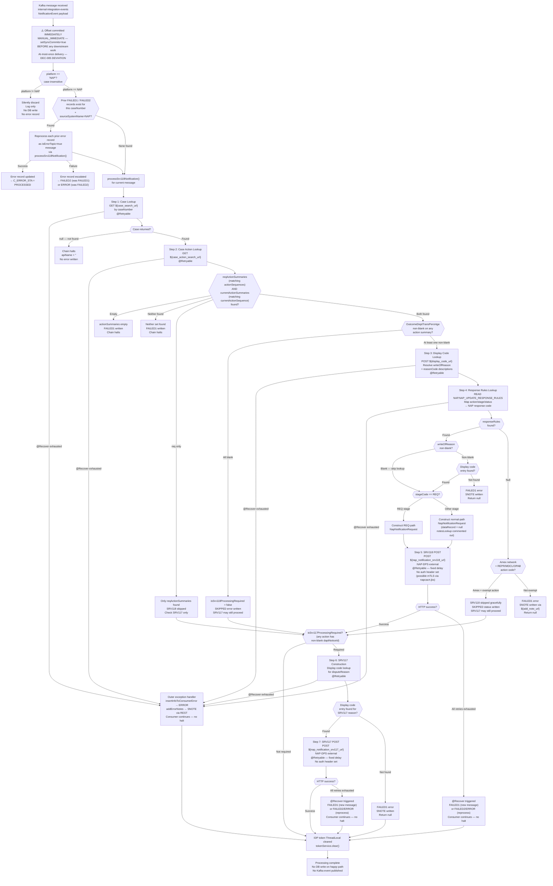

# WDP-COMP-39-NAP-OUTCOME-PROCESSOR
**Worldpay Dispute Platform — Component Reference**
*Version: 1.0 DRAFT | April 2026*
*Extracted from: gcp-nap-dispute-update-consumer using GitHub Copilot CLI | Architect-confirmed: PENDING*

---

## ━━━ CORE SKELETON ━━━━━━━━━━━━━━━━━━━━━━━━━━━━━━━━━━━━━━

---

## Identity

| Field | Value |
|---|---|
| **Name** | `NAPOutcomeProcessor` |
| **Type** | `Kafka Consumer` |
| **Repository** | `gcp-nap-dispute-update-consumer` |
| **Maven artifact** | `com.wp.gcp:gcp-nap-dispute-update-consumer:1.2.2` |
| **Technology** | `Spring Boot 3.5.7 / Java 17 / Spring Kafka / Spring Data JPA / Spring Retry` |
| **Owner** | `Integration Team` |
| **Status** | `✅ Production` |
| **Doc status** | `📝 DRAFT` |
| **Sections present** | `Core \| Block B (Kafka Consumer)` |

---

## Purpose

**What it does**

NAPOutcomeProcessor is the outbound delivery component for the NAP acquiring platform. It consumes `NotificationEvent` messages from the `internal-integration-events` AWS MSK topic, filters to NAP platform events only, and drives a multi-step internal workflow that terminates in one or both of two HTTP POST calls to the NAP-DPS external system: an SRV118 call (chargeback outcome / representment notification) and/or an SRV117 call (department notice letter notification).

The component operates as a stateful processing state machine. For each inbound message it first inspects the case's action summaries via REST calls to internal WDP services to determine which of the two NAP-DPS endpoints must be called and constructs the appropriate request payloads. Response codes and write-off reason descriptions are resolved against the `NAP.NAP_UPDATE_RESPONSE_RULES` database table and the WDP Display Code Service respectively before the NAP-DPS calls are made.

The component has a built-in compensating error mechanism: on any processing failure, a record is written to the `NAP.DISPUTE_EVENT_CONSUMER_ERROR` table with status `FAILED1`. On startup and during processing, the component checks for pre-existing `FAILED1` or `FAILED2` records for the same case and reprocesses them as error-topic messages alongside the current event. This is the sole retry path — there is no Kafka dead-letter topic.

The Kafka offset is committed **before** all downstream processing via `MANUAL_IMMEDIATE` AckMode. This is a deliberate at-most-once delivery posture. If the JVM crashes or processing fails after the commit, the message is not redelivered; the `DISPUTE_EVENT_CONSUMER_ERROR` table provides application-level compensating recovery only, not transport-level recovery.

**What it does NOT do**

- Does not publish to any Kafka topic. No `KafkaTemplate`, no `@KafkaProducer`, no outbox table, and no Kafka producer configuration is present. DEC-001 is not applicable.
- Does not filter by `responseType` or `messageType` at the consumer level. Platform differentiation from COMP-40 VisaResponseQuestionnaire (which shares the `internal-integration-events` topic) is achieved solely by the `platform == "NAP"` check. Non-NAP messages are silently dropped after the offset is already committed.
- Does not perform authorization. JWT validation is not present in this component — it is a background consumer with no inbound REST surface.
- Does not handle PAN or card data. The `NapNotificationSrv117Request` has a `cardNumber` field but this is sourced from WDP transaction data passed through the event — no encryption or PAN tokenisation is performed by this component.
- Does not use Resilience4j circuit breakers. Spring Retry (`@Retryable`) is used for retry logic on all outbound calls, but no circuit breaker, rate limiter, or bulkhead is configured.
- Does not perform notes lookup at runtime. The `notesLookUp()` step and its associated `notesLookup` REST call are fully commented out in source. The `dataRecord` field in every SRV118 payload is currently always null.
- Does not implement the planned EDIA migration route. No feature flag, commented-out route, or TODO referencing EDIA is visible in source. The `migrationStatus` field propagated from action summaries may relate to a broader migration context but drives no routing logic in this component.

---

## Internal Processing Flow

**Flow notes**

- The offset commit (step 2) always precedes all downstream work. A JVM crash after the commit and before `processNotificationEvent()` completes results in permanent message loss with no redelivery. The `DISPUTE_EVENT_CONSUMER_ERROR` table provides application-level recovery only for errors that are recorded before the crash.
- Prior error reprocessing runs first for each inbound message, before the current message's own processing path. A prior FAILED1 record is reprocessed as `isErrorTopic=true`; on second failure it escalates to FAILED2, and on subsequent failure to ERROR. No new DB row is inserted — the existing record is updated.
- The consumer never halts. All failure paths return control to the outer handler which writes an error record and continues. No path re-commits the offset.
- The `notesLookup` step (which would populate `dataRecord` in the SRV118 payload) is entirely commented out. Every SRV118 call currently sends `dataRecord = null`.
- The `checkCRMRAction()` method (CRMR routing for Credit-side Merchant Reversals) is also fully commented out. CRMR action type mapping is not active.

---

## Boundaries

### Inbound Interfaces

| Source | Protocol | Topic / Trigger | Payload |
|--------|----------|-----------------|---------|
| COMP-19 AcceptService | Kafka | `${kafka_consumer_topic}` (runtime) — confirmed as `internal-integration-events` | `NotificationEvent` (AcceptEvent schema) |
| COMP-20 ContestService | Kafka | `${kafka_consumer_topic}` — same topic | `NotificationEvent` (ContestEvent schema) |

*Note: COMP-40 VisaResponseQuestionnaire also consumes this same topic. Topic separation between COMP-39 and COMP-40 is achieved by platform field value only — `platform == "NAP"` routes to this component; non-NAP platforms fall through to COMP-40 or are silently discarded.*

### Outbound Interfaces

| Target | Protocol | Endpoint / Resource | Purpose | On failure |
|--------|----------|---------------------|---------|------------|
| WDP Case Search | REST GET | `${case_search_url}` | Look up case by caseNumber | @Retryable; on exhaustion → FAILED1 error record |
| WDP Case Action Service | REST GET | `${case_action_search_url}` | Retrieve action summaries for case | @Retryable; on exhaustion → FAILED1 error record |
| WDP Display Code Service | REST POST | `${display_code_url}` | Resolve writeOfReason / reasonCode to long description | @Retryable; on exhaustion → FAILED1 error record |
| WDP Notes Service *(commented out)* | REST GET | `${note_lookup_url}` | Fetch existing case notes into dataRecord — **currently disabled** | — |
| WDP Notes Service (error path) | REST POST | `${add_note_url}` | Write SNOTE on failure — fire-and-forget in catch block | Not retried; exception swallowed |
| WDP IDP Token Service | REST GET | `${wdp_token_service_url}` | Obtain bearer token for all WDP-internal REST calls | Exception propagates to outer catch; ERROR record written |
| NAP-DPS SRV118 | REST POST | `${nap_notification_srv118_url}` | Deliver chargeback outcome / representment notification to NAP money movement | @Retryable; on exhaustion → FAILED1 / FAILED2 / ERROR |
| NAP-DPS SRV117 | REST POST | `${nap_notification_srv117_url}` | Deliver department notice letter notification to NAP money movement | @Retryable; on exhaustion → FAILED1 / FAILED2 / ERROR |
| PostgreSQL — NAP schema | DB | `NAP.DISPUTE_EVENT_CONSUMER_ERROR` | Write / update error records on processing failure | Each write is standalone JPA save — not transactional with any other write |
| PostgreSQL — NAP schema | DB READ | `NAP.NAP_UPDATE_RESPONSE_RULES` | Lookup table: action/stage/status → NAP response code | @Retryable; on exhaustion → null returned; flows to response-not-found path |

---

## Database Ownership

### Tables Owned (written by this component)

| Schema.Table | Purpose | Key columns | Notes |
|---|---|---|---|
| `NAP.DISPUTE_EVENT_CONSUMER_ERROR` | Dead-letter store for failed/skipped message processing. Supports application-level retry and audit. | `I_CONSUMER_ERR_ID` (PK seq), `I_CASE` (caseNumber), `C_NTWK_CASE_ID` (networkCaseId), `C_ERROR_STA` (FAILED1/FAILED2/SKIPPED/ERROR/PROCESSED), `C_ERROR_REASON` (apiName:errorMessage), `C_KAFKA_EVENT` (full NotificationEvent JSON), `I_OFFSET_SEQ` (Kafka offset), `C_PARTITION_NAME`, `C_EVENT_TYPE` (OUT_SRV118/OUT_SRV117), `C_MIGRATION_STATUS` | Writes are standalone JPA `save()` / `saveAll()` — no multi-table transactions. Audit columns: `X_INSERT`, `Z_INSERT`, `X_UPDT`, `Z_UPDT` — user hardcoded as `"NCSEUDPTC"`. |

### Tables Read (not owned by this component)

| Schema.Table | Owned by | Why accessed |
|---|---|---|
| `NAP.NAP_UPDATE_RESPONSE_RULES` | ⚠️ Owner not determinable from source — likely a shared reference / config table | Lookup: maps action type / stage / status combination to NAP response code and response reason for SRV118 payload construction. Read-only via JPA query. |

---

## Configuration and Scaling

| Parameter | Value | Notes |
|-----------|-------|-------|
| Replica count | `{{ replicas-gcp-nap-dispute-update-consumer }}` | XL Deploy (XebiaLabs) template variable — exact value not determinable from source |
| HPA | None | No `HorizontalPodAutoscaler` resource in `resources.yaml` |
| Memory request | 1024Mi | Confirmed from `resources.yaml` |
| Memory limit | 2048Mi | Confirmed from `resources.yaml` |
| CPU request | Not configured | No CPU request set in `resources.yaml` |
| CPU limit | Not configured | No CPU limit set in `resources.yaml` |
| Deployment type | Kubernetes Deployment | `kind: Deployment` in `resources.yaml` |
| Rollout strategy | Not determinable from source | Not specified in `resources.yaml` extract |
| PodDisruptionBudget | None | No `PodDisruptionBudget` resource in `resources.yaml` |
| Topology spread | ScheduleAnyway (best-effort) | `maxSkew: 1`, `whenUnsatisfiable: ScheduleAnyway`, `topologyKey: kubernetes.io/hostname`. Label `app: gcp-nap-dispute-update-consumer${BRANCH_NAME_PLACEHOLDER}` — **labels aligned** between pod template and labelSelector |
| Kafka consumer concurrency | 1 | Default — no `setConcurrency()` call in `ConcurrentKafkaListenerContainerFactory` |
| Max poll records | `${max_poll_records}` | Config key confirmed; runtime value injected at deployment — not determinable from source |
| Max poll interval | `${max_poll_interval}` | Config key confirmed; runtime value injected at deployment — not determinable from source |
| Observability | OpenTelemetry Java agent + Spring Actuator + Logstash + Prometheus | OTel via pod annotation `instrumentation.opentelemetry.io/inject-java: opentelemetry-operator-system/default`. Actuator endpoints: `info`, `health`, `prometheus`. Logstash: `logstash-logback-encoder:7.4` configured in `application.yml`. Prometheus custom tag: `application: ${app.name}`. Readiness/Liveness probes on `/merchant/gcp/update-consumer/nap/readyz` and `/livez` port 8082. |

---

## Key Architectural Decisions

| Decision | ADR reference | Notes |
|---|---|---|
| Offset committed before processing — at-most-once delivery | DEC-005 — **DEVIATION** | Offset committed inside `KafkaConsumer.onMessage()` via `acknowledgment.acknowledge()` before `processNotificationEvent()` is called. JVM crash post-commit results in permanent message loss. No redelivery. `DISPUTE_EVENT_CONSUMER_ERROR` compensates for application-level failures only. |
| No Resilience4j — Spring Retry used instead | DEC-014 — **DEVIATION** | `io.github.resilience4j` is absent from `pom.xml`. `spring-retry` + `@Retryable` is the retry mechanism on all outbound calls. No circuit breaker, rate limiter, or bulkhead on any dependency. Platform-wide pattern. |
| No transactional outbox | DEC-001 — Not applicable | This component does not publish to Kafka. DEC-001 is not applicable. |
| Partition key N/A | DEC-003 — Not applicable | Consumer only — no Kafka production. |
| PAN encryption N/A | DEC-004 — Not applicable | No PAN or card data handled in main flow. `cardNumber` in SRV117 payload is sourced from WDP transaction data passed through the event; no encryption library present in `pom.xml`. |
| No Kafka DLQ — database error table as dead-letter store | Local decision | All failed messages written to `NAP.DISPUTE_EVENT_CONSUMER_ERROR`. No Kafka dead-letter topic. Reprocessing of prior errors is built into the consumer's startup logic. |
| Single consumer thread — concurrency = 1 | Local decision (implicit) | No `setConcurrency()` configured. Spring Kafka default of 1 thread. Intentional or oversight — not documented in source. |
| NAP-DPS auth mechanism not determinable | ⚠️ OPEN | No `Authorization` header is set for SRV118 / SRV117 calls. `getHttpHeaders(isSrv118)` sets only `Accept` and `Content-Type`. A `napcacrt.jks` file is present in the repo root suggesting possible mTLS — but this is not confirmed from source alone. Must be confirmed with the team. |

---

## Risks and Constraints

| Severity | Risk | Consequence |
|---|---|---|
| 🔴 HIGH | **At-most-once delivery — JVM crash causes permanent message loss** | Kafka offset is committed before processing starts. A JVM crash, OOM kill, or pod eviction after the commit but before `processNotificationEvent()` completes results in the NAP-DPS calls never being made. The `DISPUTE_EVENT_CONSUMER_ERROR` table is not written in this scenario (crash = no write). Message is silently lost with no redelivery. NAP money movement outcome is not delivered. |
| 🔴 HIGH | **NAP-DPS authentication mechanism not confirmed** | SRV118 and SRV117 HTTP calls set no `Authorization` header. Auth relies on network-level trust or mTLS (napcacrt.jks present in repo). If the auth mechanism changes or cert expires, all NAP outcome deliveries fail silently with no alert. |
| 🟡 MEDIUM | **No timeouts on RestTemplate — hung downstream blocks consumer thread** | `CommonConfig` creates `new RestTemplate()` with no connection or read timeout. `getDisplayCodeDetails()` creates a second inline `RestTemplate` also without timeouts. A hung WDP internal service or NAP-DPS endpoint will block the single consumer thread indefinitely until OS-level TCP timeout. No messages can be processed during this period. |
| 🟡 MEDIUM | **Silent deserialization failure — message dropped without error record** | `ErrorHandlingDeserializer` wraps `JsonDeserializer<NotificationEvent>`. On failure it returns null. The `CommonErrorHandler` registered is a no-op anonymous class. The listener receives a null `NotificationEvent`, throws `NullPointerException`, which propagates to the no-op handler. Message is silently dropped — no `DISPUTE_EVENT_CONSUMER_ERROR` record written. Not explicitly tested or documented. |
| 🟡 MEDIUM | **`dataRecord` always null — SRV118 payload incomplete** | The `notesLookup` step (which fetches existing case notes to populate `dataRecord` in the SRV118 request) is entirely commented out in `NotificationServiceImpl.processSrv118Notification()`. Every SRV118 POST sends `dataRecord = null`. Impact on NAP-DPS processing is not documented in source. |
| 🟡 MEDIUM | **`checkCRMRAction()` commented out — CRMR routing not active** | CRMR (Credit-side Merchant Reversal) action mapping is disabled. CRMR routing for SRV118 action types (ACMO / CHBM) is not operational. Cases requiring CRMR routing may be processed incorrectly or silently skipped. |
| 🟡 MEDIUM | **No CPU limits or requests configured** | CPU resource constraints are absent from `resources.yaml`. During retry storms or hung calls, the pod can consume unbounded CPU, competing with other workloads on the node. |
| 🟡 MEDIUM | **No HPA and no PodDisruptionBudget** | Single replica (runtime value). No autoscaling on lag or CPU. No pod disruption protection — rolling upgrades or node maintenance can cause availability gaps in NAP outcome delivery. |
| 🟢 LOW | **Unused pom.xml dependencies** | `spring-boot-starter-cache` declared but no `@EnableCaching` or `@Cacheable` in source. `springdoc-openapi-starter-webmvc-ui` declared but no `@Operation` annotations. `spring-boot-starter-oauth2-resource-server` declared but exercise not confirmed. Dead weight increases image size and attack surface. |
| 🟢 LOW | **Dead config properties — workFlowRequired / workFlowNames** | `napnotification.workFlowRequired` and `napnotification.workFlowNames` are referenced only in commented-out code. Not injected at runtime. If accidentally set in environment config they have no effect. Misleading configuration surface. |
| 🟢 LOW | **`status` hardcoded to "2" (SUCCESS_STATUS) in SRV118 payload** | Always sends `status = "2"` regardless of actual processing outcome. If NAP-DPS uses this field for conditional processing, it may always receive a success indicator even on partial or error flows. |
| 🟢 LOW | **Inline `RestTemplate` instantiation in display code lookup** | A second `new RestTemplate()` is created inline in `getDisplayCodeDetails()` rather than using the Spring-managed bean. Both lack timeouts. Two separate HTTP client instances with no lifecycle management. Likely a defect. |

---

## Planned Changes

- **EDIA migration (strategic):** Direct NAP-DPS API calls (SRV118 / SRV117) are planned for migration to the EDIA route via COMP-44 EDIAConsumer. No source evidence of this work has started — no feature flag, commented-out route, or TODO referencing EDIA is present. Migration not visible in this codebase as of April 2026.
- **notesLookup reinstatement:** The entire `notesLookup` step is commented out. If reinstated, `dataRecord` in the SRV118 payload will be populated from existing case notes. No user story or timeline confirmed from source.
- **checkCRMRAction reinstatement:** CRMR routing logic commented out. No timeline or user story confirmed from source.
- ⚠️ OPEN QUESTION: Confirm NAP-DPS authentication mechanism — IDP bearer token, mTLS via napcacrt.jks, or network-level trust. `napcacrt.jks` is present in the repo root but its usage in the HTTP client is not confirmed from source.
- ⚠️ OPEN QUESTION: Confirm `NAP.NAP_UPDATE_RESPONSE_RULES` table ownership — which component or team manages this data? Is it static reference data or dynamically maintained?
- ⚠️ OPEN QUESTION: Confirm exact `${kafka_consumer_topic}` runtime value. Assumed to be `internal-integration-events` based on COMP-19 / COMP-20 confirmed publishers, but the environment variable name `${kafka_consumer_topic}` is injected at deployment and the exact topic name was not determinable from source.
- ⚠️ OPEN QUESTION: Confirm exact replica count, `${max_poll_records}`, and `${max_poll_interval}` runtime values. All are injected via XL Deploy / environment — not visible in source.
- ⚠️ OPEN QUESTION: Is concurrency = 1 (Spring Kafka default) intentional? Single-threaded consumption of an outcome topic shared with COMP-40 creates a throughput ceiling. Confirm whether this is by design given at-most-once semantics.

---

---

## ━━━ TYPE BLOCK B — KAFKA CONSUMER CONTRACTS ━━━━━━━━━━━━━

---

## Kafka Consumer Contracts

**Consumer framework:** Spring Kafka `@KafkaListener` — single listener, single topic
**Offset commit strategy:** `MANUAL_IMMEDIATE` — **pre-ACK before any processing (DEC-005 deviation — at-most-once)**
**Error handling strategy:** Database dead-letter table (`NAP.DISPUTE_EVENT_CONSUMER_ERROR`) — no Kafka DLQ topic — consumer never halts

---

### Topic: `${kafka_consumer_topic}` (internal-integration-events)

| Parameter | Value |
|-----------|-------|
| **Topic name** | `${kafka_consumer_topic}` — environment variable; confirmed as `internal-integration-events` based on COMP-19/COMP-20 publisher analysis. Runtime value injected at deployment. |
| **Consumer group** | `${kafka_group_id}` — environment variable; exact runtime value not determinable from source |
| **Partition key** | Message key is `merchantId` (set by publishers COMP-19, COMP-20 — DEC-003 compliant on producer side). This component does not use the key for routing — filters by `platform` field in payload. |
| **Concurrency** | 1 — Spring Kafka default; no `setConcurrency()` call in `ConcurrentKafkaListenerContainerFactory` |
| **Max poll records** | `${max_poll_records}` — runtime value not determinable from source |
| **Max poll interval** | `${max_poll_interval}` — runtime value not determinable from source |
| **Offset commit** | `MANUAL_IMMEDIATE` with `setSyncCommits(true)` — committed **before** all downstream processing (at-most-once). `acknowledgment.acknowledge()` is called as the first action in `KafkaConsumer.onMessage()`. |
| **Ordering guarantee** | Per partition (inherited from publisher key = `merchantId`) |
| **Deserializer** | `ErrorHandlingDeserializer` wrapping `JsonDeserializer<NotificationEvent>` |
| **Deserialization failure** | `CommonErrorHandler` is a no-op anonymous class. Failed deserialization returns null payload → NPE in listener → swallowed by no-op handler → message silently dropped. No error record written. ⚠️ Untested behaviour. |

**Message payload structure (NotificationEvent)**

| Field | Type | Description |
|---|---|---|
| `platform` | String | Acquiring platform identifier. This component processes `platform == "NAP"` (case-insensitive) only. All other values are silently discarded. |
| `caseNumber` | String | WDP case number — primary key for case lookup |
| `actionSequences` | List\<String\> | Action sequences created by the upstream service (AcceptService or ContestService) |
| `currentActionSequence` | List\<String\> | Single-element list — the action sequence being processed |
| `userId` | String | Operator ID from the upstream request |
| `visaResponseIds` | List\<String\> | Visa RTSI response IDs — null for non-Visa networks |
| `networkCaseId` | String | Card network case reference |
| `responseType` | String | Questionnaire response type (Visa-specific values) |
| `noteDesc` | String | Notes description — **currently always null** (notesLookup step commented out) |
| `migrationStatus` | String | Migration tracking field — propagated from action summaries; no routing logic on this field in current source |

**Event classification / routing**

This component does not classify event sub-types from the payload. Routing logic is purely by `platform` field:
- `platform == "NAP"` (case-insensitive) → enter processing pipeline
- All other platform values → silently discard after offset commit

SRV118 vs SRV117 call gating is determined at processing time by inspecting the case's action summaries via REST — not from the inbound Kafka payload fields. `isSrv118ProcessingRequired` is derived from whether matching `reqActionSummaries` + `currentActionSummaries` exist and have a non-blank `OutcomeDeptTransPercntge`. `isSrv117ProcessingRequired` is derived from whether any action summary has a non-blank `daptNoticeId`.

**On processing failure**

| Failure scenario | Behaviour |
|---|---|
| Case not found in WDP | Chain halts silently — `apiName = ""`; no error record written; offset not re-committed |
| Action summaries empty or neither set found | FAILED1 written to `NAP.DISPUTE_EVENT_CONSUMER_ERROR`; offset not re-committed; consumer continues |
| OutcomeDeptTransPercntge blank on all actions | SKIPPED written to error table; SRV118 skipped; SRV117 may still proceed |
| Amex + REPR/MDCL/OPAB action, no response code | SRV118 skipped gracefully (SKIPPED status); SRV117 may still proceed |
| Response rules null (non-exempt) | FAILED1 written; SNOTE via Add Notes REST; processing continues |
| writeOfReason / reasonCode display code not found | FAILED1 written; SNOTE via Add Notes REST; processing continues |
| NAP-DPS SRV118 call fails — all @Retryable retries exhausted | @Recover invoked: FAILED1 (new message) or FAILED2/ERROR (reprocess). Consumer continues — no halt. Offset not re-committed. |
| NAP-DPS SRV117 call fails — all @Retryable retries exhausted | Same as SRV118 failure path |
| Any WDP internal REST call fails — all @Retryable retries exhausted | @Recover invoked → FAILED1 or escalation. Consumer continues. |
| IDP token fetch fails | Exception propagates to outer catch → ERROR written + SNOTE; consumer continues |
| Deserialization failure | Null NPE → no-op handler → message silently dropped. ⚠️ No error record written. |
| Outer unhandled exception | `insertInfoToConsumerError(ERROR)` + `addErrorNotes(SNOTE)`; consumer continues |

**Retry configuration (all @Retryable methods)**

| Parameter | Config key | Runtime value |
|---|---|---|
| Max attempts | `${napnotification.retrycount}` | Not determinable from source |
| Delay | `${napnotification.retrydelay}` | Not determinable from source |
| Backoff type | Fixed delay — `@Backoff(delayExpression = ...)` | No multiplier configured |
| Exception types | `Exception.class` | All exceptions caught |

**Prior error reprocessing (compensating mechanism)**

On each message received, before processing the current message, the component queries `NAP.DISPUTE_EVENT_CONSUMER_ERROR` for any records with `C_ERROR_STA = FAILED1` or `FAILED2` matching the current `caseNumber` and `sourceSystemName = "NAP"`. Each found record is reprocessed as an `isErrorTopic=true` message through the full `processSrv118Notification()` pipeline. On success the record is updated to `PROCESSED`. On failure the record escalates: `FAILED1 → FAILED2`; `FAILED2 → ERROR`. The current message then proceeds regardless of the prior error reprocessing outcome.

---

---

## ━━━ DEVIATION FLAGS ━━━━━━━━━━━━━━━━━━━━━━━━━━━━━━━━━━━━━

| ADR | Status | Finding | Severity |
|---|---|---|---|
| DEC-001 — Transactional Outbox | ✅ N/A | This component does not publish to Kafka. No `KafkaTemplate`, no `@KafkaProducer`, no outbox table. Standard not applicable. | N/A |
| DEC-003 — Partition key = merchantId | ✅ N/A | Consumer only. No Kafka production. Standard not applicable. | N/A |
| DEC-004 — PAN encryption before persistence | ✅ N/A | No PAN or card data handled in main flow. `cardNumber` in SRV117 payload sourced from WDP transaction data passed through event — not read or written to persistent store by this component. No encryption library in `pom.xml`. | N/A |
| DEC-005 — Manual offset commit after all processing | 🔴 **DEVIATION** | Offset committed **before** all processing via `acknowledgment.acknowledge()` as the first call in `KafkaConsumer.onMessage()`. Delivery guarantee is at-most-once. JVM crash after commit results in permanent message loss with no redelivery. The error table provides application-level recovery only. | 🔴 HIGH |
| DEC-014 — Resilience4j on all outbound calls | 🟠 **DEVIATION** | `io.github.resilience4j` is absent from `pom.xml`. No circuit breaker, rate limiter, or bulkhead configured on any dependency. `spring-retry` is used instead. Platform-wide pattern — consistent with COMP-04, COMP-05, and other confirmed components. | 🟠 HIGH (platform-wide) |

---

## ━━━ WDP-KAFKA.md UPDATE REFERENCE ━━━━━━━━━━━━━━━━━━━━━━━

**Section 3 — Topic Registry: update consumer column for `internal-integration-events`**

Add COMP-39 NAPOutcomeProcessor as a confirmed consumer of `internal-integration-events`:

| Topic | Publishers | Consumers | Key | Notes |
|---|---|---|---|---|
| `internal-integration-events` | AcceptService (COMP-19), ContestService (COMP-20) | NAPOutcomeProcessor (COMP-39), VisaResponseQuestionnaire (COMP-40) | `merchantId` | COMP-39 filters to `platform == "NAP"` only. COMP-40 handles non-NAP. Offset committed pre-ACK by COMP-39 (at-most-once). No DLQ topic. No outbox. |

**Section 4 — Producer/Consumer Map: add COMP-39 row**

| Component | Produces to | Consumes from | Notes |
|---|---|---|---|
| COMP-39 NAPOutcomeProcessor | None | `internal-integration-events` | Platform filter: NAP only. At-most-once offset commit. Consumer-only — no Kafka production. |

---

## ━━━ WDP-DB.md UPDATE REFERENCE ━━━━━━━━━━━━━━━━━━━━━━━━━

**Schema: `nap`**

Add or update the following rows:

| Table | Owning Component | Purpose | Key Columns | Read-Only By | Confirmed |
|---|---|---|---|---|---|
| `NAP.DISPUTE_EVENT_CONSUMER_ERROR` | COMP-39 NAPOutcomeProcessor | Dead-letter / error store for failed NAP outcome message processing. Supports application-level retry, escalation, and audit. | `I_CONSUMER_ERR_ID` (PK), `I_CASE`, `C_NTWK_CASE_ID`, `C_ERROR_STA`, `C_ERROR_REASON`, `C_KAFKA_EVENT` (JSON), `I_OFFSET_SEQ`, `C_PARTITION_NAME`, `C_EVENT_TYPE`, `C_MIGRATION_STATUS` | COMP-05 NAPDisputeEventProcessor also owns a table of the same name (`NAP.DISPUTE_EVENT_CONSUMER_ERROR`) — ⚠️ **CONFIRM whether these are the same table or two separate tables**. See shared table risk below. | 📝 DRAFT |
| `NAP.NAP_UPDATE_RESPONSE_RULES` | ⚠️ Owner TBC — not determinable from source | Reference / config table mapping action type / stage / status combinations to NAP response codes. Read by COMP-39 for SRV118 payload construction. | `ID` (PK), `C_INPUT_FIRST_ACTION_STA`, `C_INPUT_SECOND_ACTION_STA`, `C_INPUT_THIRD_ACTION_STA`, `C_INPUT_ACTION_TYPE`, `C_INPUT_CASE_STAGE`, `C_RESPONSE_CODE` | COMP-39 NAPOutcomeProcessor (read-only) | 📝 DRAFT — ⚠️ OWNER UNKNOWN |

**⚠️ Shared table risk — IMMEDIATE FLAG:**
COMP-05 `NAPDisputeEventProcessor` also writes to a table named `NAP.DISPUTE_EVENT_CONSUMER_ERROR` (confirmed in COMP-05 file). COMP-39 also writes to `NAP.DISPUTE_EVENT_CONSUMER_ERROR`. These may be:
- The same shared table (discriminated by `C_EVENT_TYPE` = `OUT_SRV118` / `OUT_SRV117` for COMP-39, and inbound event types for COMP-05)
- Two separate tables that happen to share the same name in different schemas

Confirm with team before WDP-DB.md is finalised. The `sourceSystemName = "NAP"` filter in COMP-39's prior-error query suggests shared table with source-based partitioning.

---

## ━━━ REMAINING GAPS ━━━━━━━━━━━━━━━━━━━━━━━━━━━━━━━━━━━━━

| Gap | Needs |
|---|---|
| NAP-DPS authentication mechanism — no `Authorization` header set; `napcacrt.jks` present in repo but usage unconfirmed | **Team confirmation** — Is mTLS active? Is network-level trust the auth model? |
| `NAP.NAP_UPDATE_RESPONSE_RULES` table owner | **Team confirmation** — Which component or team owns this reference data? Is it static or dynamically maintained? |
| `NAP.DISPUTE_EVENT_CONSUMER_ERROR` — shared with COMP-05 or separate? | **Team confirmation** — Same table or two tables? If shared, confirm discriminator column. |
| Exact topic name for `${kafka_consumer_topic}` | **Environment config** — Assumed `internal-integration-events` based on COMP-19/20 publisher analysis. Confirm exact runtime value. |
| Exact consumer group ID for `${kafka_group_id}` | **Environment config** — Runtime value only. |
| Exact retry values: `${napnotification.retrycount}`, `${napnotification.retrydelay}` | **Environment config** — Runtime values injected at deployment. |
| Exact `${max_poll_records}` and `${max_poll_interval}` runtime values | **Environment config** |
| Replica count runtime value | **Environment config** — XL Deploy variable `{{ replicas-gcp-nap-dispute-update-consumer }}` |
| SRV118 / SRV117 response body structure from NAP-DPS | **Follow-up Copilot question:** *"In NapNotificationServiceImpl, what is the full response structure returned by NAP-DPS for SRV118 and SRV117 calls? Is there a response DTO class? What fields are checked beyond the HTTP status code?"* |
| Whether concurrency = 1 is intentional | **Architect decision** — Single-threaded consumption of a shared outcome topic. Confirm whether this is by design or an oversight given at-most-once semantics already limit ordering guarantees. |
| EDIA migration readiness — no source evidence visible | **Architect decision** — Confirm approach and timeline for migrating SRV118/SRV117 direct calls to EDIA route. No feature flag or commented-out route exists as a migration scaffold. |

---

## ━━━ DOCUMENTS REQUIRING UPDATE ━━━━━━━━━━━━━━━━━━━━━━━━━

| Document | Update required |
|---|---|
| **WDP-COMP-INDEX.md** | Update COMP-39 doc status from `📋 PENDING` to `📝 DRAFT` |
| **WDP-KAFKA.md** | Add COMP-39 as confirmed consumer of `internal-integration-events` — see WDP-KAFKA.md Update Reference section above |
| **WDP-DB.md** | Add `NAP.DISPUTE_EVENT_CONSUMER_ERROR` (owned) and `NAP.NAP_UPDATE_RESPONSE_RULES` (read-only) — see WDP-DB.md Update Reference section above. Flag shared table risk. |
| **WDP-HANDOVER.md** | Move COMP-39 from `📋 PENDING` to `📝 DRAFT` in component status table. Add confirmed architectural facts: (1) COMP-39 confirms at-most-once pre-ACK as a second component with this pattern; (2) NAP-DPS auth mechanism open question added; (3) NAP.DISPUTE_EVENT_CONSUMER_ERROR shared table question flagged. |
| **WDP-DECISIONS.md** (when rebuilt) | Record DEC-005 deviation as confirmed for COMP-39 (second component with pre-ACK, alongside COMP-05). Record DEC-014 absence as platform-wide pattern. Record no-timeout RestTemplate risk as platform-wide concern. |

---

*End of WDP-COMP-39-NAP-OUTCOME-PROCESSOR.md*
*File status: 📝 DRAFT — content complete, architect confirmation pending.*
*Remember to update WDP-COMP-INDEX.md, WDP-KAFKA.md, WDP-DB.md, and WDP-HANDOVER.md after confirmation.*
