# WDP-COMP-40-VISA-RESPONSE-QUESTIONNAIRE
**Worldpay Dispute Platform — Component Reference**
*Version: 1.0 DRAFT | April 2026*
*Extracted from: gcp-visa-respond-questionnaire-consumer using GitHub Copilot CLI | Architect-confirmed: PENDING*

---

## ━━━ CORE SKELETON ━━━━━━━━━━━━━━━━━━━━━━━━━━━━━━━━━━━━━━

---

## Identity

| Field | Value |
|---|---|
| **Name** | `VisaResponseQuestionnaire` |
| **Type** | `Kafka Consumer` |
| **Repository** | `gcp-visa-respond-questionnaire-consumer` |
| **Artefact** | `com.wp.gcp:gcp-visa-respond-questionnaire-consumer:0.0.1-SNAPSHOT` |
| **Runtime** | Spring Boot 3.5.7 · Java 17 |
| **Status** | ✅ Production |
| **Doc status** | 📝 DRAFT |
| **Sections present** | `Core · Block B (Kafka Consumer)` |

---

## Purpose

**What it does**

VisaResponseQuestionnaire is a Kafka Consumer that listens on the
`internal-integration-events` topic for `ContestEvent` messages generated
by ContestService (COMP-20) when a merchant contests a Visa dispute. On
receipt of a qualifying event, it retrieves the dispute questionnaire image
from the Visa RTSI (Real-Time Service Interface) API and uploads that image
to DocumentManagementService (COMP-37) for persistent storage in S3 with
DynamoDB metadata.

The component routes Visa API calls through one of two paths depending on
the acquiring platform: non-NAP platforms use a DataPower gateway with a raw
licence key (`vantiveLicense`); NAP platform uses a local Visa Adapter
(`mdvs-gcp-visa-adapter`) with an IDP Bearer token. The `platform` field
from the inbound event drives this routing — it is not used to filter which
events are processed.

The component supports five Visa questionnaire response types — representment,
pre-compliance response, pre-arbitration response, allocation arbitration, and
allocation pre-arbitration — each mapped to a distinct Visa RTSI endpoint. An
event with any other `responseType` value is silently discarded.

On a processing failure after all retries are exhausted, the component adds an
SNOTE to the case via NotesService (COMP-25) as the sole error recording
mechanism. There is no dead-letter queue and no local error table.

**What it does NOT do**

- Does not filter events by acquiring platform — all platform values are
  accepted; `platform` is used only to select the RTSI URL/auth combination.
- Does not process non-Visa disputes — events with a null or empty
  `visaResponseIds` are silently discarded at the filter check.
- Does not update any case table or action table after uploading the document
  — case association is handled entirely by DocumentManagementService using
  the `platform`, `caseNumber`, and `actionSequence` URL parameters.
- Does not upload the `additionalImagesList` from the RTSI response — only
  the primary questionnaire image (`disputeAsImageResponseDescriptor`) is
  uploaded. Additional images are extracted but silently discarded.
  **⚠️ This is confirmed incomplete work.**
- Does not persist any local state — no JPA, JDBC, Hibernate, or DynamoDB SDK
  dependency exists in this component. It is fully stateless.
- Does not use a transactional outbox — DEC-001 deviation.
- Does not use Resilience4j — DEC-014 deviation. Spring Retry provides the
  sole resilience mechanism.
- Does not use case-level authorisation. There is no auth check on the
  inbound event; auth is only applied on outbound calls.

---

## Internal Processing Flow

```mermaid
flowchart TD
    IN["Kafka: internal-integration-events\nContestEvent received\n(caseNumber partition key header)"]

    S1["Step 1 — Message receipt + deserialisation\nConcurrentKafkaListenerContainerFactory\nErrorHandlingDeserializer → ContestEvent"]

    S2["Step 2 — Offset committed\nMANUAL_IMMEDIATE — BEFORE processing\n⚠️ At-most-once semantics"]

    S3["Step 3 — processContestEvent() invoked\nEventConsumerServiceImpl"]

    S4["Step 4 — IDP Token retrieval\nGET wdp-idp-token-service\nNo retry · No CB"]

    DECF{{"Decision A\nvisaResponseIds non-null\nAND non-empty\nAND responseType non-blank?"}}

    SKIP_F["Silent return\nNo log · No error\nOffset already committed"]

    DECR{{"Decision B\nresponseType\n(case-insensitive match\nagainst 5 constants)"}}

    SKIP_R["Unknown responseType\nSilent fall-through\nNo log · No error"]

    DECP{{"Decision C\nplatform == 'nap'?"}}

    RTSI_DP["Step 7a — Visa RTSI via DataPower\nPOST ${dispute_rtsi_url}\nAuth: vantiveLicense\n(non-NAP platforms)"]

    RTSI_AD["Step 7b — Visa RTSI via Visa Adapter\nPOST mdvs-gcp-visa-adapter\nAuth: Bearer idpToken\n(NAP platform only)"]

    DECV{{"Decision D\nstatusCode == I-300000000\nAND responseData != null?"}}

    RETRY["Spring Retry\nServiceException\nRetry count: ${app.retrycount}\nDelay: ${app.retrydelay}\nFixed backoff · No CB"]

    S9["Step 9 — Image extraction\ndisputeAsImageResponseDescriptor.imageData\n→ quesImageBase64Encoded\ncontentType → quesImageContentType\n⚠️ additionalImagesList extracted but NOT uploaded"]

    S10["Step 10 — Upload to DocumentManagementService\nPOST mdvs-gcp-document-management-service\nFile: RESPQDOC + actionSequence + ext\nmultipart/form-data · Auth: Bearer idpToken\nSpring Retry same count/delay"]

    DECN{{"Decision E\ndocumentResponse == null?"}}

    ERR_SE["ServiceException thrown\n'response from upload\ndocument api is null'"]

    CATCH{{"Decision F\nServiceException caught\nfrom any step 4–10?"}}

    S11["Step 11 — Add case note\nPOST mdvs-gcp-notes-service\nnoteType=SNOTE · userId=WVRQCONSUM\nNo retry · Exception caught + logged only"]

    OUT["Document stored in DocumentManagementService\n(S3 + DynamoDB via COMP-37)\nProcessing complete"]

    DESER_ERR["Deserialization failure\nErrorHandlingDeserializer delivers\nnull/default ContestEvent\nCommonErrorHandler: empty no-op\nOffset already committed\nFilter check (Decision A) silently discards"]

    IDP_ERR["IDP token failure\nServiceException propagates\nto KafkaConsumer catch\nLogged + swallowed\nOffset already committed"]

    IN --> S1
    S1 -->|"Valid payload"| S2
    S1 -->|"Deserialisation failure"| DESER_ERR
    S2 --> S3
    S3 --> S4
    S4 -->|"Token obtained"| DECF
    S4 -->|"ServiceException"| IDP_ERR
    DECF -->|"Either check fails"| SKIP_F
    DECF -->|"Both pass"| DECR
    DECR -->|"allocprearb → getDisputePreArbDetails\nallocarb → getDisputeFilingDetails (loops all IDs)\nrepresentment → getDisputeResponseDetails\nprearbresp → getDisputePreArbResponseDetails\nprecomresp → getDisputePreCompResponseDetails"| DECP
    DECR -->|"No match"| SKIP_R
    DECP -->|"nap"| RTSI_AD
    DECP -->|"non-NAP"| RTSI_DP
    RTSI_DP --> DECV
    RTSI_AD --> DECV
    DECV -->|"Success"| S9
    DECV -->|"Failure"| RETRY
    RETRY -->|"Max attempts reached"| CATCH
    S9 --> S10
    S10 -->|"Response received"| DECN
    S10 -->|"ServiceException"| CATCH
    DECN -->|"Non-null"| OUT
    DECN -->|"Null"| ERR_SE
    ERR_SE --> CATCH
    CATCH -->|"ServiceException caught"| S11
    S11 --> OUT
```

---

## Boundaries

### Inbound Interfaces

| Source | Protocol | Topic / Trigger | Payload |
|---|---|---|---|
| ContestService (COMP-20) | Kafka | `internal-integration-events` | `ContestEvent` — Visa contest events for all acquiring platforms |
| AcceptService (COMP-19) | Kafka | `internal-integration-events` | `AcceptEvent` — silently discarded at filter check (visaResponseIds null) |

> **Note:** Both COMP-19 and COMP-20 publish to `internal-integration-events`.
> COMP-40 is only interested in events with non-null, non-empty `visaResponseIds`.
> AcceptService events never carry `visaResponseIds` and are therefore silently
> discarded at Decision A without any error or log entry.

### Outbound Interfaces

| Target | Protocol | Endpoint / Resource | Purpose | On failure |
|---|---|---|---|---|
| `wdp-idp-token-service` | REST HTTP GET | `/merchant/gcp/idp-token/token` | Obtain IDP Bearer token for outbound auth | ServiceException propagates; caught + swallowed; processing lost |
| Visa RTSI via DataPower | REST HTTP POST JSON | `${dispute_rtsi_url}` (non-NAP) | Retrieve Visa questionnaire image | Spring Retry then ServiceException → addCaseNote |
| Visa Adapter (`mdvs-gcp-visa-adapter`) | REST HTTP POST JSON | `/merchant/wdp/visaadapter` (NAP only) | Retrieve Visa questionnaire image via local adapter | Spring Retry then ServiceException → addCaseNote |
| DocumentManagementService (COMP-37) | REST HTTP POST multipart/form-data | `/merchant/gcp/document-management/{platform}/documents/{caseNumber}` | Upload questionnaire image as RESPQDOC | Spring Retry then ServiceException → addCaseNote |
| NotesService (COMP-25) | REST HTTP POST JSON | `/merchant/gcp/notes/{platform}/case/{caseNumber}` | Write SNOTE on processing failure | Exception caught + logged only; not re-thrown |

---

## Database Ownership

### Tables Owned (written by this component)

This component owns no database state. It is fully stateless.

There is no JPA, JDBC, Hibernate, DynamoDB SDK, or any database driver in
`pom.xml`. No `@Entity`, `@Repository`, or `DataSource` bean exists anywhere
in the codebase.

### Tables Read (not owned by this component)

This component reads no database tables directly. All persistent state is
managed by downstream services it calls.

---

## Architecture Risks and Notes

| Risk | Severity | Detail |
|---|---|---|
| At-most-once Kafka semantics — DEC-005 violation | ⚠️ HIGH | `acknowledgement.acknowledge()` is called at `KafkaConsumer.java:30`, **before** `processContestEvent()` at line 32. If the JVM crashes or any downstream call fails after the offset is committed, the message is permanently lost with no reprocessing path. |
| No timeouts on RestTemplate | ⚠️ HIGH | `CommonConfig.java` creates `new RestTemplate()` with no `ClientHttpRequestFactory` customisation. All outbound REST calls — IDP token, Visa RTSI, DocumentManagementService, NotesService — rely on OS-level TCP timeouts (effectively infinite). With concurrency=1, a single hung dependency blocks all consumer processing. |
| additionalImagesList never uploaded | ⚠️ MEDIUM | `VisaRTSIServiceImpl.setImageDataFromRTSIResponse()` extracts `disputeImageAttachment.attachment[]` into `additionalImagesList` in `DisputesRTSIResult`, but `DisputeServiceImpl.uploadDocument()` only uses `quesImageBase64Encoded`. The additional images are silently discarded. Confirmed incomplete work — no TODO comment, no issue reference. |
| No idempotency mechanism | ⚠️ MEDIUM | No duplicate check before calling RTSI or uploading. Under at-most-once semantics this is low-risk in practice, but any requeue or replay scenario would result in duplicate RTSI calls and duplicate document uploads. |
| IDP token failure swallowed with at-most-once offset | ⚠️ MEDIUM | If `wdp-idp-token-service` is unavailable at Step 4, a `ServiceException` is thrown, propagates to the `KafkaConsumer.listener()` catch block, is logged and swallowed. The offset is already committed. The event is permanently lost with no case note written (case note path only fires inside `processContestEvent` try-catch, which is after IDP token call). |
| No Resilience4j — DEC-014 violation | ℹ️ LOW | `pom.xml` contains no `resilience4j` dependency. Spring Retry (`spring-retry`, `spring-aspects`) provides the sole retry mechanism via `@Retryable` on `VisaRTSIService` and `DisputeService` interfaces. No circuit breaker, rate limiter, or bulkhead is configured on any outbound call. Consistent with platform-wide pattern. |
| Consumer group ID assumption corrected | ℹ️ INFO | The production consumer group is `internal-integration-events-ques-group` (from `application-prod.yaml`). The previously documented assumption of `visa-response-questionnaire-group` was incorrect. |
| Log label mismatch — DEC-003 signal | ℹ️ INFO | `KafkaConsumer.java` logs `"key-MerchantId:{}"` but binds the `caseNumber` variable. This suggests the partition key convention was changed from `merchantId` to `caseNumber` on the producer side but the log label was not updated. |
| `DisputeFilingInfo` field commented out | ℹ️ INFO | `ResponseData.java` lines 44–45 have `@JsonProperty("DisputeFilingInfo")` and its `List<DisputeFilingInfo>` field commented out. The class exists in the codebase but is not wired into deserialisation. Likely a deserialization conflict or speculative addition. |
| `testUploadDocument_valid` unit test disabled | ℹ️ INFO | The happy-path test for `uploadDocument` is commented out due to a mock setup issue. The document upload success path has no working unit test coverage. |

---

## ━━━ TYPE BLOCK B — KAFKA CONSUMER CONTRACTS ━━━━━━━━━━━━━

---

## Kafka Consumer Contracts

**Consumer framework:** Spring Kafka `@KafkaListener` via `ConcurrentKafkaListenerContainerFactory`
(`notificationListener` bean)
**Offset commit strategy:** `MANUAL_IMMEDIATE` — ⚠️ committed **before** processing begins
(at-most-once — **DEC-005 deviation**)
**Error handling strategy:** Spring Retry on RTSI and DocumentManagementService calls;
SNOTE written to NotesService on final failure; no DLQ topic; no local error table.

---

### Topic: `internal-integration-events`

| Parameter | Value |
|---|---|
| **Topic name (prod)** | `internal-integration-events` |
| **Config key** | `spring.kafka.consumer.topic` |
| **Non-prod suffix** | Per-environment suffix applied: `-dev`, `-uat`, `-stg`, `-cers`, `-test` |
| **Consumer group (prod)** | `internal-integration-events-ques-group` |
| **Consumer group config key** | `spring.kafka.consumer.groupId` |
| **AckMode** | `MANUAL_IMMEDIATE` — hardcoded in `KafkaConsumerConfig` |
| **SyncCommits** | `true` — hardcoded |
| **auto.commit** | `false` — hardcoded (`ENABLE_AUTO_COMMIT_CONFIG = false`) |
| **auto.offset.reset** | `latest` — hardcoded |
| **Offset commit timing** | ⚠️ Committed at `KafkaConsumer.java:30` — **before** `processContestEvent()` at line 32. At-most-once. |
| **Concurrency** | `1` — default (no `factory.setConcurrency()` call present) |
| **Max poll records** | `500` — `spring.kafka.consumer.maxPollRecords` |
| **Max poll interval** | `600,000 ms` (10 min) — `spring.kafka.consumer.maxPollInterval` |
| **Key deserialiser** | `StringDeserializer` — hardcoded |
| **Value deserialiser** | `ErrorHandlingDeserializer` wrapping `JsonDeserializer<ContestEvent>` — type headers retained (`setRemoveTypeHeaders(false)`) |
| **Security protocol** | `SASL_SSL` — hardcoded |
| **SASL mechanism** | `AWS_MSK_IAM` — `software.amazon.msk.auth.iam.IAMLoginModule` |
| **Ordering guarantee** | Per partition — key is `caseNumber` (from producer side); key used for logging only in this consumer |

**Inbound message payload — `ContestEvent`**

| Field | Type | Notes |
|---|---|---|
| `platform` | String | Acquiring platform value — `NAP`, `CORE`, `VAP`, `LATAM`, `PIN`. Used solely to select RTSI URL/auth. No platform filter applied. |
| `caseNumber` | String | WDP internal case number — also the Kafka partition key |
| `actionSequences` | List\<String\> | New action sequences created by ContestService |
| `currentActionSequence` | List\<String\> | Single-element list — used as `actionSequence` query param in DocumentManagementService upload URL |
| `userId` | String | Operator ID — not used by this consumer (case note uses hardcoded `WVRQCONSUM` instead) |
| `visaResponseIds` | List\<String\> | Visa RTSI response IDs. **Null for non-Visa events — triggers silent discard at filter check.** |
| `networkCaseId` | String | Card network case reference — mapped to `visaCaseNumber` in RTSI request |
| `responseType` | String | Questionnaire response type — drives routing to one of five RTSI methods: `allocprearb`, `allocarb`, `representment`, `prearbresp`, `precomresp` |

**Event classification / routing**

Routing is a two-stage filter:

**Stage 1 (Decision A):** `visaResponseIds` must be non-null AND non-empty,
AND `responseType` must be non-blank (`StringUtils.isNotBlank`). If either
check fails, the method exits silently with no log message. The offset is
already committed at this point.

**Stage 2 (Decision B):** `responseType` is matched case-insensitively
against five string constants. Each constant maps to a specific Visa RTSI
endpoint:

| responseType value | Constant | RTSI method |
|---|---|---|
| `allocprearb` | `ALLOC_PREARBITRATION_VISA` | `getDisputePreArbDetails` |
| `allocarb` | `ALLOC_ARBITRATION_VISA` | `getDisputeFilingDetails` (iterates all `visaResponseIds`) |
| `representment` | `COLL_DISPUTE_RESPONSE_VISA` | `getDisputeResponseDetails` |
| `prearbresp` | `PREARBITRATION_RESPONSE_VISA` | `getDisputePreArbResponseDetails` |
| `precomresp` | `PRECOMPLIANCE_RESP_VISA` | `getDisputePreCompResponseDetails` |

If `responseType` matches none of the five constants, the `if/else-if`
chain falls through silently — no log, no error.

**Platform routing inside each RTSI method (Decision C):**

| Platform | RTSI route | Auth |
|---|---|---|
| `NAP` (case-insensitive) | `mdvs-gcp-visa-adapter` (local Visa Adapter) | `Authorization: Bearer <idpToken>` |
| All other platforms | DataPower gateway `${dispute_rtsi_url}` | `Authorization: <vantiveLicense>` (raw string, not Bearer-prefixed) |

**On processing failure**

| Failure scenario | Retry? | Behaviour |
|---|---|---|
| Deserialization failure | No | `ErrorHandlingDeserializer` delivers null/default `ContestEvent`; `CommonErrorHandler` is empty no-op; filter check silently discards; offset already committed |
| IDP token service unavailable (Step 4) | No | `ServiceException` propagates to `KafkaConsumer.listener()` catch; logged + swallowed; offset already committed; **no case note written** |
| Visa RTSI call fails — non-success status code (Step 7–8) | Yes — Spring Retry | `@Retryable` retries with count `${app.retrycount}` and fixed delay `${app.retrydelay}`; after max attempts → `ServiceException` caught → `addCaseNote()` called |
| DocumentManagementService upload fails (Step 10) | Yes — Spring Retry | Same `@Retryable` as above; after max attempts → `ServiceException` caught → `addCaseNote()` called |
| DocumentManagementService returns null response (Step 10) | No | `ServiceException("response from upload document api is null")` thrown → caught → `addCaseNote()` called |
| NotesService unavailable (Step 11 — error path) | No | Exception caught inside `addCaseNote()`; logged at `ERROR` level; not re-thrown |
| Any hung dependency (RestTemplate no timeout) | N/A | Thread blocked indefinitely; with concurrency=1, entire consumer processing halts |

---

## ━━━ DEPENDENCIES ━━━━━━━━━━━━━━━━━━━━━━━━━━━━━━━━━━━━━━━

> ⚠️ **Platform-wide risk present in this component:** No timeouts on
> `RestTemplate`. `CommonConfig.java` creates `new RestTemplate()` with no
> `ClientHttpRequestFactory` customisation. With `concurrency=1`, a single
> hung dependency blocks all consumer processing indefinitely.
> No Resilience4j dependency present. Spring Retry is the sole resilience mechanism.

### 1. IDP Token Service (`wdp-idp-token-service`)

| Property | Value |
|---|---|
| Service name | `wdp-idp-token-service` |
| Prod URL | `http://wdp-idp-token-service.wdp-micro:8082/merchant/gcp/idp-token/token` |
| Config key | `idpService.tokenUrl` |
| Protocol | HTTP GET |
| Auth | None (no auth headers sent on this call) |
| Processing step | Step 4 — before any routing logic |
| Connect timeout | None configured |
| Read timeout | None configured |
| Retry | **No** — no `@Retryable` on `IdpTokenService` interface |
| Circuit breaker | **None** — no Resilience4j |
| On unavailable | `ServiceException` propagates to `KafkaConsumer.listener()` catch; logged + swallowed; offset already committed; event permanently lost; no case note written |

### 2. Visa RTSI API via DataPower (non-NAP platforms)

| Property | Value |
|---|---|
| Service name | Visa RTSI via DataPower gateway |
| Prod URL | `${dispute_rtsi_url}` (Kubernetes secret; local config: `https://ws-int.cert.infoftps.com/merchant/claimsresolution/visasysteminterface/v1`) |
| Config key | `app.rtsiService.disputeRtsiUrl` |
| Protocol | HTTP POST (JSON) |
| Auth | `Authorization: <vantiveLicense>` (raw string from `vantive_license` secret; not Bearer-prefixed) |
| Platforms | All non-NAP platforms |
| Processing step | Step 7 |
| Connect timeout | None configured |
| Read timeout | None configured |
| Retry | `@Retryable(retryFor = ServiceException.class, maxAttemptsExpression = "${app.retrycount}", backoff = @Backoff(delayExpression = "${app.retrydelay}"))` — fixed delay, no multiplier |
| Retry count | From env var `api_retrycount` (no default in YAML) |
| Retry delay | From env var `api_retrydelay` (no default in YAML) |
| Circuit breaker | **None** — no Resilience4j |
| On unavailable after retries | `ServiceException` caught in `EventConsumerServiceImpl`; `addCaseNote()` called |

### 3. Visa Adapter (`mdvs-gcp-visa-adapter`) — NAP platform only

| Property | Value |
|---|---|
| Service name | `mdvs-gcp-visa-adapter` |
| Prod URL | `http://mdvs-gcp-visa-adapter.wdp-micro:8082/merchant/wdp/visaadapter` |
| Config key | `app.rtsiService.disputeRtsiAdapterUrl` |
| Protocol | HTTP POST (JSON) |
| Auth | `Authorization: Bearer <idpToken>` |
| Platforms | NAP only |
| Processing step | Step 7 (NAP path) |
| Connect timeout | None configured |
| Read timeout | None configured |
| Retry | Same `@Retryable` as Visa RTSI above |
| Circuit breaker | **None** — no Resilience4j |
| On unavailable after retries | Same as Visa RTSI above |

**Visa RTSI request data (both routes):**

| Field in RTSI request | Source in ContestEvent |
|---|---|
| `visaCaseNumber` | `contestEvent.networkCaseId` |
| Response ID field | `contestEvent.visaResponseIds.get(0)` (first element, except `allocarb` which iterates all) |
| `includeDisputeAsImageInd` | `"true"` (hardcoded) |
| `RequestHeader` | Empty object (no fields populated) |

**Visa RTSI response fields used:**

| Response field | Mapped to | Notes |
|---|---|---|
| `statusList[0].code` | Success check | Must equal `"I-300000000"` |
| `responseData.disputeAsImageResponseDescriptor.imageData` | `quesImageBase64Encoded` | Base64-encoded questionnaire image |
| `responseData.disputeAsImageResponseDescriptor.contentType` | `quesImageContentType` | `image/tiff`, `application/pdf`, or `image/jpeg` |
| `responseData.imagesList[]` | `docIdList` | Existing doc attachment IDs — extracted but not used in upload |
| `responseData.disputeImageAttachment.attachment[]` | `additionalImagesList` | ⚠️ Extracted but **never uploaded** — confirmed incomplete work |

### 4. Document Management Service (`mdvs-gcp-document-management-service`)

| Property | Value |
|---|---|
| Service name | `mdvs-gcp-document-management-service` |
| Prod URL | `http://mdvs-gcp-document-management-service.wdp-micro:8082/merchant/gcp/document-management/{platform}/documents/{caseNumber}` |
| Config key | `app.disputeService.addDocumentUrl` |
| Protocol | HTTP POST (`multipart/form-data`) |
| Auth | `Authorization: Bearer <idpToken>` |
| Processing step | Step 10 |
| Connect timeout | None configured |
| Read timeout | None configured |
| Retry | `@Retryable` on `DisputeService.uploadDocument` — same count/delay as RTSI |
| Circuit breaker | **None** — no Resilience4j |
| On unavailable after retries | `ServiceException` caught → `addCaseNote()` called |

**Upload request parameters:**

| Parameter | Value |
|---|---|
| Query: `actionSequence` | `contestEvent.currentActionSequence[0]` |
| Query: `documentType` | `RESPQDOC` (hardcoded) |
| Query: `uploadedBy` | `WVRQCONSUM` (hardcoded constant) |
| File name | `RESPQDOC` + `currentActionSequence[0]` + `.` + extension (tiff/pdf/jpeg mapped from contentType) |
| File content | Base64-decoded bytes of `quesImageBase64Encoded` (raw binary — not base64) |

**Upload response fields received:**

| Field | Type |
|---|---|
| `caseNumber` | String |
| `dateUploaded` | String/Date |
| `documentName` | String |
| `documentRef` | String |
| `disputeStage` | String |

### 5. Notes Service (`mdvs-gcp-notes-service`)

| Property | Value |
|---|---|
| Service name | `mdvs-gcp-notes-service` |
| Prod URL | `http://mdvs-gcp-notes-service.wdp-micro:8082/merchant/gcp/notes/{platform}/case/{caseNumber}` |
| Config key | `app.disputeService.insertCaseNoteUrl` |
| Protocol | HTTP POST (JSON) |
| Auth | `Authorization: Bearer <idpToken>` |
| Processing step | Step 11 — error path only |
| Connect timeout | None configured |
| Read timeout | None configured |
| Retry | **No** — no `@Retryable` on `addCaseNote()` |
| Circuit breaker | **None** — no Resilience4j |
| On unavailable | Exception caught inside `addCaseNote()`; logged at `ERROR` level; not re-thrown |

**Note written on failure:**

| Field | Value |
|---|---|
| `actionSequence` | `contestEvent.currentActionSequence.get(0)` |
| `noteType` | `SNOTE` |
| `userId` | `WVRQCONSUM` (hardcoded constant — **not** the `userId` from the event) |
| Note body | Fixed error message (not dynamic per failure type) |

---

## ━━━ PLATFORM STANDARD DEVIATIONS ━━━━━━━━━━━━━━━━━━━━━━━

| Decision | Status | Severity | Detail |
|---|---|---|---|
| **DEC-001** — Transactional Outbox | ⚠️ NON-COMPLIANT | HIGH | Not implemented. This component writes no local state before making outbound calls. No outbox table, no outbox write, no outbox poller. The component is a pass-through: event → RTSI API → DocumentManagementService. |
| **DEC-003** — Kafka Partition Key | ✅ N/A (consumer) | — | This component reads from the topic but does not produce to it. The partition key received is `caseNumber` (as logged), though the log label erroneously says `key-MerchantId` — a copy-paste mismatch from when the convention was `merchantId`. The key plays no role in consumer processing logic. |
| **DEC-004** — PAN Encryption | ✅ NOT APPLICABLE | — | No PAN data is processed or stored. This component handles binary document images from Visa's dispute system. No card number fields exist in `ContestEvent`, `DisputesRTSIResult`, or any request/response model. No `EncryptionService` call. |
| **DEC-005** — Kafka Offset Commit | ⚠️ NON-COMPLIANT | HIGH | At-most-once semantics. `acknowledgement.acknowledge()` is called at `KafkaConsumer.java:30`, **before** `eventConsumerService.processContestEvent()` at line 32. If any processing step fails, the offset is already committed and the message is permanently lost. Remediation: move `acknowledge()` to after `processContestEvent()` succeeds. |
| **DEC-014** — Resilience4j | ⚠️ NON-COMPLIANT | LOW | No `resilience4j` dependency in `pom.xml`. Spring Retry (`spring-retry`, `spring-aspects`) via `@Retryable` on `VisaRTSIService` and `DisputeService` interfaces is the sole resilience mechanism. No circuit breaker, rate limiter, or bulkhead is configured. Consistent with platform-wide pattern. |

---

## ━━━ SCALING AND DEPLOYMENT ━━━━━━━━━━━━━━━━━━━━━━━━━━━━━

| Property | Value | Source |
|---|---|---|
| Kubernetes resource type | `Deployment` | `resources.yaml:2` |
| Replica count | `{{ replicas-gcp-visa-respond-questionnaire-consumer }}` | Template variable — environment-specific, resolved at deploy time |
| Memory limit | `2048Mi` | `resources.yaml:55` |
| Memory request | `1024Mi` | `resources.yaml:57` |
| CPU limit | **Not specified** | `resources.yaml` — no CPU limit defined |
| CPU request | **Not specified** | `resources.yaml` — no CPU request defined |
| HPA | **Not present** | No `HorizontalPodAutoscaler` in `resources.yaml` |
| PodDisruptionBudget | **Not present** | Not in `resources.yaml` |
| Topology spread constraints | **Not configured** | Not in `resources.yaml`. With multiple replicas all pods could land on the same node. Given concurrency=1 per pod, multiple replicas create multiple consumer instances in the same group; Kafka partition assignment handles distribution. |
| Rolling update strategy | `maxSurge: 1, maxUnavailable: 0` | `resources.yaml:9–11` |
| minReadySeconds | `30` | `resources.yaml:29` |
| OTel agent | **Present** | Annotation: `instrumentation.opentelemetry.io/inject-java: opentelemetry-operator-system/default` (`resources.yaml:22`) |
| Actuator health | **Exposed** | `management.endpoints.web.exposure.include: info,health,prometheus` (`application.yml:15`) |
| Liveness probe | `/merchant/gcp/respond-questionnaire/livez` (port 8082) | `resources.yaml:47` |
| Readiness probe | `/merchant/gcp/respond-questionnaire/readyz` (port 8082) | `resources.yaml:39` |
| Logstash appender | **Present** | `logback-spring.xml:13` — destination from `${logstash_server_host_port}` (two previous hardcoded IPs commented out) |

---

## ━━━ PLANNED AND INCOMPLETE WORK ━━━━━━━━━━━━━━━━━━━━━━━━

### Confirmed Incomplete Features

| Item | Location | Detail |
|---|---|---|
| `additionalImagesList` never uploaded | `DisputeServiceImpl.uploadDocument()` | `VisaRTSIServiceImpl.setImageDataFromRTSIResponse()` populates `additionalImagesList` from `disputeImageAttachment.attachment[]` in `DisputesRTSIResult`, but `uploadDocument()` only uses `quesImageBase64Encoded`. Additional images are silently discarded. No TODO comment, no issue reference. Likely a to-be-implemented feature. |
| `DisputeFilingInfo` field commented out | `ResponseData.java:44–45` | `@JsonProperty("DisputeFilingInfo")` and `List<DisputeFilingInfo>` commented out. Class still exists in codebase but not wired into deserialisation. Likely a deserialisation conflict or speculative addition. |
| `testUploadDocument_valid` unit test disabled | `DisputeServiceTest.java:75` | Happy-path test for `uploadDocument` commented out — mock setup incompatibility (`post` vs `postUploadDoc`). The document upload success path has no working unit test coverage. |

### Operational Anomalies

| Item | Location | Detail |
|---|---|---|
| Log label mismatch | `KafkaConsumer.java` | Log label says `key-MerchantId` but binds `caseNumber` variable. Suggests partition key convention changed from `merchantId` to `caseNumber` on the producer side but the log was not updated. |
| `addCaseNote` userId constant mismatch | `ApplicationConstants.java` | `USER_ID = "WVRQCONSUM"` used in production case notes. Test utility `TestDataUtil.buildContestEvent()` sets `userId = "WQRCONSU"` — different strings. The hardcoded system identity `WVRQCONSUM` is used in notes regardless of the event's `userId` field. |
| `DisputeFilingInfo` field in RTSI response suppressed | `ResponseData.java` | Field added speculatively or causing JSON deserialisation conflict; disabled without issue reference. |

### pom.xml Dependencies Declared But Potentially Unused at Runtime

| Dependency | Notes |
|---|---|
| `spring-boot-devtools` | Dev-only tooling; should be `<scope>runtime</scope>` or `<optional>true</optional>` — it is neither |
| `springdoc-openapi-starter-webmvc-ui` | OpenAPI / Swagger UI; Swagger paths excluded from security whitelist in PROD but library is still loaded |
| `httpclient` (Apache 4.5.14) | Declared but not used explicitly — `RestTemplate` defaults to `SimpleClientHttpRequestFactory` unless an `HttpClient` factory is configured. No `HttpClient` bean present. Likely unused at runtime. |

### Feature Flags / Migration Flags

None found in source code or configuration.

### Stub Implementations

None found. All service implementations contain real logic.

---

## ━━━ WDP-KAFKA.md UPDATE REFERENCE ━━━━━━━━━━━━━━━━━━━━━━

**Section 3 — Topic Registry: correct consumer group entry for `internal-integration-events`**

| Topic | Consumer | Consumer Group | Notes |
|---|---|---|---|
| `internal-integration-events` | COMP-40 VisaResponseQuestionnaire | `internal-integration-events-ques-group` | **Corrects prior assumption of `visa-response-questionnaire-group`** — confirmed from `application-prod.yaml` |

**Section 4 — Consumer Map row for COMP-40:**

| Component | Consumes from | Produces to | Notes |
|---|---|---|---|
| COMP-40 VisaResponseQuestionnaire | `internal-integration-events` | None | AckMode: MANUAL_IMMEDIATE. Offset committed **before** processing — at-most-once. Concurrency=1. No DLQ. No local error table. Stateless. |

---

## ━━━ WDP-DB.md UPDATE REFERENCE ━━━━━━━━━━━━━━━━━━━━━━━━━

**No entries required.** This component owns no database tables and reads no database tables directly. All persistence is delegated to DocumentManagementService (COMP-37) which manages its own S3 + DynamoDB state.

---

## ━━━ REMAINING GAPS ━━━━━━━━━━━━━━━━━━━━━━━━━━━━━━━━━━━━━

| Gap | Type | Action |
|---|---|---|
| Exact replica count per environment | Environment config | Confirm from Kubernetes / XL Deploy for each environment — value is a template variable |
| Exact `app.retrycount` and `app.retrydelay` values in production | Environment config | Confirm from Kubernetes secrets `api_retrycount` / `api_retrydelay` — no default in YAML |
| `additionalImagesList` — intentional gap or planned feature? | Architect decision | Decide: (1) is this a known backlog item with a user story? (2) should it be recorded as a formal gap in WDP-DECISIONS.md rebuild? |
| DEC-005 remediation — is at-most-once accepted? | Architect decision | The pre-ACK pattern means any processing failure permanently loses the event. Recommend formal ADR when WDP-DECISIONS.md is rebuilt — either accept the risk with documented recovery procedure, or remediate by moving `acknowledge()` after `processContestEvent()` succeeds. |
| No timeout on RestTemplate — accepted or remediation planned? | Architect decision | `CommonConfig.java` creates `new RestTemplate()` with no timeout. With concurrency=1, a hung dependency blocks all consumer processing. Consistent with platform-wide pattern but high operational risk. |

---

*End of WDP-COMP-40-VISA-RESPONSE-QUESTIONNAIRE.md*
*File status: 📝 DRAFT — content complete, architect confirmation pending.*
*Remember to update WDP-COMP-INDEX.md, WDP-KAFKA.md, and WDP-HANDOVER.md after confirmation.*
