# WDP-COMP-41-THIRD-PARTY-NOTIFICATION-CONSUMER
**Worldpay Dispute Platform — Component Reference**
*Version: 1.0 DRAFT | April 2026*
*Extracted from: wdp-gp-notification-event-consumer using GitHub Copilot CLI | Architect-confirmed: PENDING*

---

## ━━━ CORE SKELETON ━━━━━━━━━━━━━━━━━━━━━━━━━━━━━━━━━━━━━━━

---

## Identity

| Field             | Value |
|-------------------|-------|
| **Name**          | `ThirdPartyNotificationConsumer` |
| **Repository**    | `wdp-gp-notification-event-consumer` |
| **Type**          | `Kafka Consumer` |
| **Status**        | ✅ Production |
| **Doc status**    | 📝 DRAFT |
| **Sections present** | `Core \| Block B (Kafka Consumer)` |

---

## Purpose

**What it does**

ThirdPartyNotificationConsumer is the WDP outbound notification bridge for the Signifyd
fraud intelligence platform. It consumes `BusinessRuleEvent` messages from the
`external-request-events` Kafka topic — published upstream by NotificationOrchestrator
(COMP-18) — and translates each event into one of three Signifyd REST API calls depending
on the dispute lifecycle stage: Create Chargeback (initial notification), Chargeback Stage
(subsequent stage update), or Representment Outcome (representment result).

For every inbound Kafka message — including events that are skipped, duplicate, or
terminal failures — the component writes a tracking row to `wdp.outgoing_event_outbox`
before committing the Kafka offset. This row is the primary mechanism for idempotency,
retry scheduling, and audit. Its status transitions from `PUBLISHED` through
`SUCCESS`, `SKIPPED`, `FAILED`, `ERROR`, or `PENDING_DEFERRED` as processing proceeds.

The routing decision to Signifyd is two-stage and partly configuration-driven. For
initial chargeback notifications (actionSequence=`01`, eventType=`CASE_CREATED`, with
specific stageCode/actionCode pairs), the component calls the Signifyd Create Chargeback
API directly. The response from that call, or from a separate WDP Notification Rule
service lookup (for all other lifecycle stages), determines whether a Chargeback Stage
or Representment Outcome call follows.

The Kafka offset is committed **after** the DB INSERT of the outbox row but **before**
any outbound REST call to Signifyd. This is a deliberate at-most-once delivery model
relative to Signifyd — a crash after the ACK but before Signifyd responds will result
in a lost notification, recoverable only by an external retry scheduler processing
`FAILED` / `PENDING_DEFERRED` outbox rows.

**What it does NOT do**

- Does **not** call JustAI. Despite earlier documentation suggesting a JustAI integration,
  **there is no JustAI reference anywhere in the codebase**. Signifyd is the sole
  external fraud vendor called. ⚠️ WDP-COMP-INDEX.md description requires correction.
- Does **not** publish to any Kafka topic. This component is a pure consumer — no
  Kafka producer side.
- Does **not** perform case management operations (no case creation, action creation,
  or case status updates). It reads case and action data from WDP services for enrichment
  only.
- Does **not** process or forward PAN data. `cardNumberLast4` is present in WDP service
  response models but is explicitly excluded from all Signifyd request payloads.
- Does **not** have a REST API surface. There are no inbound HTTP endpoints.
- Does **not** implement the retry mechanism itself. `FAILED` / `PENDING_DEFERRED`
  rows in `wdp.outgoing_event_outbox` must be picked up by an external retry scheduler
  (suspected COMP-12 Scheduler3 — not confirmed).
- Does **not** use Resilience4j circuit breakers on any outbound call.

---

## Internal Processing Flow

```mermaid
flowchart TD
    IN["AWS MSK: external-request-events\nBusinessRuleEvent message arrives"]

    DESER["Deserialise to BusinessRuleEvent POJO\nExtract idempotencyId + eventTimestamp from Kafka headers"]

    SKIP{"Skip filter — shouldSkipEvent()\neventType ∈ {ACTION_CREATED, CASE_CREATED}?\nplatform ∈ {PIN, CORE, NAP}?\nchannelType ∈ {blank, GF_EVENTS}?"}
    SKIP_ACK["ACK offset — return\nNo DB write\nEvent silently dropped"]

    HDR{"Idempotency headers present?\nidempotencyId AND eventTimestamp\nboth non-blank?"}
    HDR_ERR["DB INSERT: wdp.outgoing_event_outbox\nstatus = ERROR\nACK offset — return"]

    IMP{"imdempotencyCheck()\nDB lookup by composite key:\nidempotencyId + channelType=GF_EVENTS + eventTimestamp"}
    IMP_SKIP_DUPE["ACK offset — return\nNon-PUBLISHED duplicate or terminal status\nNo DB write"]

    DB_INS["DB INSERT: wdp.outgoing_event_outbox\nstatus = PUBLISHED\nchannel_type = GF_EVENTS\ncreated_by = WNEC\neventId assigned (sequence)"]

    ACK["⚠️ KAFKA ACK HERE\nMANUAL_IMMEDIATE + syncCommits=true\nOffset committed BEFORE any Signifyd REST call"]

    PREV{"handlePreviousEventStatus()\nLook up most recent prior outbox row\nfor same case. Previous status?"}
    PREV_DEFER["DB UPDATE: status = PENDING_DEFERRED\nnextRetryAt set\nDefer — return"]
    PREV_ERR_UPD["DB UPDATE: status = ERROR\nDefer — return"]

    SEARCH["Step: searchCase()\nGET WDP Case Search Service\nReturns SearchCaseResponse"]
    PROD{"productType\n== SIGNIFYD?\n(case-insensitive)"}
    PROD_SKIP["DB UPDATE: status = SKIPPED\nStep = COMPLETED — return"]

    ACTIONS["Step: getActions()\nGET WDP Case Action Lookup\nMatch ActionSummary by actionSequence"]
    REASON["Step: getReason()\nPOST WDP Display Code Service\nMaps action.reason to fraudReasonCode description\n@Cacheable(displaycodedetails)"]
    TOKEN["Step: getToken()\nGET fraudswitch token cache\nFallback: OAuth2 client_credentials\nto fraudswitch-signifyd IDP"]

    ROUTE{"getSignifydApi()\nactionSequence == '01' AND\neventType == 'CASE_CREATED' AND\nstageCode/actionCode ∈\n{CH1/FCHG or REQ/RREQ}?"}

    CREATE["Step: createSignifyd()\nPOST Signifyd Create Chargeback API\nAuth: Bearer + SIGNIFYD-TEAM-ID header"]
    CREATE_API{"createSignifyd response\napiName?"}

    NOTIF["Step: getNotificationRule()\nGET WDP Notification Rule Service\nconsumerName=SIGNIFYD\n@Cacheable(notificationRule)"]
    NOTIF_API{"getNotificationRule response\napiName?"}

    CHBK["Step: chargebackStage()\nPOST Signifyd Chargeback Stage API\nAuth: Bearer + SIGNIFYD-TEAM-ID header"]
    REPR["Step: representmentOutcome()\nPOST Signifyd Representment Outcome API\nAuth: Bearer + SIGNIFYD-TEAM-ID header"]

    NR_SKIP2["DB UPDATE: status = SKIPPED\nStep = COMPLETED"]
    NR_FAIL2["DB UPDATE: status = FAILED\nStep = COMPLETED"]

    SUCCESS["DB UPDATE: wdp.outgoing_event_outbox\nstatus = SUCCESS"]

    FAIL_BLOCK["Exception handler\nRetryableException → status = FAILED\nUnretryableException → status = ERROR\nretryCount ≥ 3: promote FAILED → ERROR\nAll paths write to outgoing_event_outbox\nConsumer does NOT halt or nack"]

    IN --> DESER
    DESER --> SKIP
    SKIP -->|"Any filter fails"| SKIP_ACK
    SKIP -->|"All 3 filters pass"| HDR
    HDR -->|"Missing headers"| HDR_ERR
    HDR -->|"Headers present"| IMP
    IMP -->|"Non-PUBLISHED duplicate\nor other terminal status"| IMP_SKIP_DUPE
    IMP -->|"New event, PUBLISHED duplicate\nor eventId already set on event"| DB_INS
    DB_INS --> ACK
    ACK --> PREV
    PREV -->|"null / SUCCESS / SKIPPED\n→ proceed"| SEARCH
    PREV -->|"FAILED / PENDING_DEFERRED\nor PUBLISHED"| PREV_DEFER
    PREV -->|"ERROR"| PREV_ERR_UPD
    SEARCH --> PROD
    PROD -->|"!= SIGNIFYD or null/empty\nresponse"| PROD_SKIP
    PROD -->|"== SIGNIFYD"| ACTIONS
    ACTIONS --> REASON
    REASON --> TOKEN
    TOKEN --> ROUTE
    ROUTE -->|"Yes — initial chargeback\nSIGNIFYD_CREATE path"| CREATE
    ROUTE -->|"No — all other cases\nNOTIFICATION_RULE path"| NOTIF
    CREATE --> CREATE_API
    CREATE_API -->|"CHARGEBACK_STAGE"| CHBK
    CREATE_API -->|"REPRESENTMENT_OUTCOME"| REPR
    NOTIF --> NOTIF_API
    NOTIF_API -->|"Chargeback_Stage"| CHBK
    NOTIF_API -->|"Representment_Outcome"| REPR
    NOTIF_API -->|"null / empty"| NR_SKIP2
    NOTIF_API -->|"Unrecognised value"| NR_FAIL2
    CHBK --> SUCCESS
    REPR --> SUCCESS
    SEARCH -->|"Exception"| FAIL_BLOCK
    ACTIONS -->|"Exception"| FAIL_BLOCK
    REASON -->|"Exception"| FAIL_BLOCK
    TOKEN -->|"Exception"| FAIL_BLOCK
    CREATE -->|"Exception"| FAIL_BLOCK
    NOTIF -->|"Exception"| FAIL_BLOCK
    CHBK -->|"Exception"| FAIL_BLOCK
    REPR -->|"Exception"| FAIL_BLOCK
```

**Status lifecycle for `wdp.outgoing_event_outbox` rows:**

| Status | Written when |
|--------|-------------|
| `PUBLISHED` | DB INSERT on new event (before Kafka ACK is committed, before Signifyd called) |
| `ERROR` | Missing idempotency headers; or previous event was ERROR; or UnretryableException in pipeline |
| `PENDING_DEFERRED` | Previous event was FAILED / PENDING_DEFERRED / PUBLISHED |
| `SUCCESS` | Signifyd REST call completed successfully |
| `SKIPPED` | Product type ≠ SIGNIFYD; or notification rule returns null/empty apiName |
| `FAILED` | RetryableException in pipeline; promoted to ERROR when retryCount ≥ 3 |

---

## Boundaries

### Inbound Interfaces

| Source | Protocol | Topic / Trigger | Payload |
|--------|----------|-----------------|---------|
| COMP-18 NotificationOrchestrator | Kafka (AWS MSK) | `external-request-events` (env-injected as `${spring.kafka.consumer.topic}`) | `BusinessRuleEvent` JSON — contains caseNumber, actionSequence, platform, eventType, channelType, idempotencyId |

### Outbound Interfaces

| Target | Protocol | Endpoint / Resource | Purpose | On failure |
|--------|----------|---------------------|---------|------------|
| WDP Case Search Service | REST (GET) | `${case_search_url}` (`caseactionlog.searchCaseUrl`) | Case enrichment — merchantOrderId, cardNetwork, fraudVendorGroupingId | Status=FAILED; RetryableException |
| WDP Case Action Lookup Service | REST (GET) | `${case_action_search_url}` (`caseactionlog.actionSearchUrl`) | Action enrichment — amount, currency, reason, dates, owner, stageCode, actionCode | Status=FAILED; RetryableException |
| WDP Display Code Service | REST (POST) | `${display_code_url}` (`caseactionlog.displayCodeUrl`) | Map action.reason to Signifyd fraudReasonCode description. In-memory Spring Cache. | Status=FAILED or ERROR depending on exception type |
| WDP Notification Rule Service | REST (GET) | `${notification_rule_url}` (`caseactionlog.notificationRuleUrl`) | Determine which Signifyd API to call for non-initial-chargeback events. In-memory Spring Cache. | Status=FAILED or ERROR |
| fraudswitch token cache | REST (GET) | `${fraudswitch_cache_url}` (`fraudswitch.cache.url`) | Retrieve cached Signifyd OAuth2 access token | Fallback to direct OAuth2 call to fraudswitch-signifyd IDP |
| WDP internal OAuth2 IDP (`wdp-internal-auth`) | OAuth2 client_credentials | — | Bearer token for WDP internal REST calls (Case, Action, DisplayCode, NotificationRule services) | Status=FAILED |
| fraudswitch-signifyd IDP | OAuth2 client_credentials | — | Signifyd OAuth2 access token (fallback when cache returns null) | Status=FAILED |
| Signifyd — Create Chargeback API | REST (POST) | `${signifyd_create_chargeback_url}` (`signifyd.createChargebackUrl`) | Initial chargeback notification for new disputes (actionSeq=01, CASE_CREATED, specific stageCode/actionCode) | 400 → UnretryableException (ERROR); other HTTP error → RetryableException (FAILED); empty response → "NO_DATA_FROM_SIGNIFYD" error |
| Signifyd — Chargeback Stage API | REST (POST) | `${signifyd_chargeback_stage_url}` (`signifyd.chargebackStageUrl`) | Stage update notification for in-progress chargebacks | Same as Create Chargeback |
| Signifyd — Representment Outcome API | REST (POST) | `${signifyd_representment_outcome_url}` (`signifyd.representmentOutcomeUrl`) | Representment result notification | Same as Create Chargeback |
| `wdp.outgoing_event_outbox` | PostgreSQL (write) | WDP Aurora PostgreSQL | Inbound-event tracking outbox — idempotency, status, retry scheduling | Exception bubbles to listener catch block; logged; no re-queue |

---

## Database Ownership

### Tables Owned (written by this component)

| Schema.Table | Purpose | Key columns | Notes |
|--------------|---------|-------------|-------|
| `wdp.outgoing_event_outbox` | Inbound-event tracking outbox. Every consumed message is INSERT'd with status=PUBLISHED before Kafka ACK. Status updated to SUCCESS / SKIPPED / FAILED / ERROR / PENDING_DEFERRED after processing. Provides idempotency, retry scheduling, and predecessor-event blocking. | `id` (sequence), `i_case`, `i_action_seq`, `channel_type` (fixed to `GF_EVENTS`), `idempotency_id`, `event_timestamp`, `status`, `retry_count`, `next_retry_at`, `error_code`, `error_message`, `original_event` (JSONB), `created_by` (fixed to `WNEC`), `created_at`, `updated_at` | ⚠️ SHARED TABLE — also written by COMP-17 CaseExpiryUpdateConsumer (channel_type=EXPIRY_EVENTS) and COMP-18 NotificationOrchestrator. channel_type discriminates rows by component. Each JPA save/update is an independent implicit transaction — no @Transactional spanning multiple writes. |

### Tables Read (not owned by this component)

| Schema.Table | Owned by | Why accessed |
|--------------|----------|--------------|
| `wdp.outgoing_event_outbox` | Shared — see above | Idempotency check (SELECT by composite key) and previous-event status lookup (SELECT most recent prior row for same case) |

---

## Configuration and Scaling

| Parameter | Value | Notes |
|-----------|-------|-------|
| Replica count | `{{ replicas-wdp-gp-notification-event-consumer }}` | XL Deploy / Helm placeholder — env-specific, not determinable from source |
| HPA | None | No HorizontalPodAutoscaler resource defined |
| Memory request | 512Mi | |
| Memory limit | 2048Mi | |
| CPU request | Not set | Container runs with unbounded CPU — ⚠️ risk under load |
| CPU limit | Not set | |
| Deployment type | Kubernetes `Deployment` | |
| Rollout strategy | RollingUpdate — maxSurge: 1, maxUnavailable: 0 | `minReadySeconds: 30` also set at pod spec level |
| PodDisruptionBudget | None | No PDB resource defined |
| Topology spread | `ScheduleAnyway` (soft constraint) | `topologyKey: kubernetes.io/hostname`. LabelSelector uses `${BRANCH_NAME_PLACEHOLDER}` suffix — consistent across Deployment label and spread constraint, so labels should match within a deployment. Soft constraint only — spread not guaranteed. |
| Observability | OpenTelemetry Java agent, Spring Boot Actuator, Logstash appender | OTel: injected via annotation `instrumentation.opentelemetry.io/inject-java`. Actuator: `info`, `health`, `prometheus` exposed; liveness at `/lives`, readiness at `/readyz`. Logstash: `logstash-logback-encoder:7.4` in pom.xml; configured via `logstash.server.host.port`. |
| Kafka consumer concurrency | 1 (default) | No `setConcurrency()` call on `ConcurrentKafkaListenerContainerFactory` |
| max.poll.records | `${max_poll_records}` | Runtime value env-injected — not determinable from source |
| max.poll.interval.ms | `${max_poll_interval}` | Runtime value env-injected — not determinable from source |

---

## Key Architectural Decisions

| Decision | ADR reference | Notes |
|----------|---------------|-------|
| Kafka offset committed after DB INSERT but before Signifyd REST call | DEC-005 — DEVIATION | At-most-once delivery to Signifyd. A crash after ACK and before Signifyd responds loses the notification. Recovery requires external retry scheduler picking up PUBLISHED rows. Deliberate — avoids redelivery of Kafka message and double-insert to outbox. |
| No Resilience4j on any outbound call | DEC-014 — DEVIATION | No circuit breaker, bulkhead, or rate limiter on any of the 8 outbound REST targets (4 WDP internal + 3 Signifyd + 1 fraudswitch cache). All bare `RestTemplate` calls. |
| wdp.outgoing_event_outbox used as inbound-event tracking store | DEC-001 — Partial compliance | The table is named as an outbox and used for idempotency and retry tracking, but is not a producer-side transactional outbox in the DEC-001 sense. The outbox write is independent of any upstream business write (none exists — this is a consumer). The table serves as a consumer-side audit and retry ledger. |
| Signifyd-only integration | Local decision | Despite prior documentation referencing JustAI, there is no JustAI integration in the codebase. Only Signifyd is called. |
| Display Code and Notification Rule responses are in-memory cached | Local decision | `@Cacheable("displaycodedetails")` and `@Cacheable("notificationRule")`. Cache is per-instance Spring in-memory cache — no distributed cache. Cache invalidation is not visible in source. |
| Display Code Service RestTemplate instantiated locally | Local deviation | `getReason()` creates `new RestTemplate()` locally rather than using the injected Spring bean — inconsistency with all other REST calls in this component. No functional impact confirmed but violates Spring bean management conventions. |
| Kafka partition key read but not used | DEC-003 — Low confidence | Consumer reads partition key as `@Header(KafkaHeaders.RECEIVED_KEY)` but only logs it; not used for routing or processing. Producer-side key (merchantId per DEC-003) cannot be confirmed from consumer source alone. |

---

## Risks and Constraints

| Severity | Risk | Consequence |
|----------|------|-------------|
| 🔴 HIGH | **At-most-once Signifyd delivery (DEC-005 deviation).** Kafka offset is committed before Signifyd REST call completes. A pod crash or OOM kill between ACK and Signifyd response permanently loses the notification. | Signifyd never receives the fraud signal for that dispute event. Downstream fraud decisions are made without complete data. Recovery requires the external retry scheduler to identify and reprocess PUBLISHED rows — but if the row remains PUBLISHED and is never transitioned, the retry scheduler may not pick it up. |
| 🔴 HIGH | **No circuit breakers on any outbound call (DEC-014 deviation).** All 8 REST targets — including 3 external Signifyd endpoints — are unprotected. | A slow or failing external service (e.g. Signifyd rate-limiting) will block consumer threads indefinitely (no timeout configured). With concurrency=1, this halts all processing for the consumer instance. |
| 🔴 HIGH | **No connection or read timeouts configured on any RestTemplate.** All REST calls use JVM default socket timeouts. | Any hung connection blocks the single consumer thread indefinitely. Combined with no circuit breaker, this is a full consumer stall risk. |
| 🟡 MEDIUM | **wdp.outgoing_event_outbox shared table — COMP-41 adds third writer.** COMP-17 (EXPIRY_EVENTS) and COMP-18 also write to this table. COMP-41 adds channel_type=GF_EVENTS rows. | If channel_type filtering is not applied consistently in all read paths (e.g. Scheduler3 in COMP-12), rows from one component could be processed by another component's retry scheduler. Confirm Scheduler3's channel_type filter before marking safe. |
| 🟡 MEDIUM | **External retry scheduler dependency is implicit.** FAILED / PENDING_DEFERRED rows require an external scheduler to pick them up. The scheduler is not visible in this consumer's code. | If the retry scheduler is misconfigured, not running, or processes the wrong channel_type rows, FAILED notifications are never retried. There is no self-healing mechanism within this component. |
| 🟡 MEDIUM | **Crash window gap for in-flight messages.** If the service crashes between the DB INSERT (status=PUBLISHED) and the Kafka ACK, the message is redelivered. The idempotency check finds the PUBLISHED row and continues — this race is handled. However, if the crash is between ACK and Signifyd REST call completion, the Kafka offset is committed, the row remains PUBLISHED, and the notification is lost unless the retry scheduler picks up PUBLISHED rows. | Signifyd notifications silently lost for events in this window. |
| 🟡 MEDIUM | **CPU unbounded.** No CPU limit or request set in resources.yaml. | Under high load (e.g. bursty dispute volume, slow Signifyd responses), the pod may consume disproportionate CPU on the node, affecting other tenants. |
| 🟢 LOW | **commons-lang3 declared twice in pom.xml.** Lines 69-71 (explicit version) and lines 104-106 (Spring Boot BOM). Maven deduplicates at build time. | No runtime impact. Maintenance noise. |
| 🟢 LOW | **spring-boot-starter-oauth2-resource-server dependency present but likely unused.** This consumer has no inbound REST endpoints. The resource server JWT config appears to be a template carry-over. | No runtime impact. Dead dependency inflates build. |
| 🟢 LOW | **Dead configuration: `signifyd.consumerName=SIGNIFYD`.** Set in all environment YAML files but never injected via `@Value`. Constant `ApplicationConstants.SIGNIFYD = "SIGNIFYD"` is used directly instead. | No runtime impact. Misleading configuration. |

---

## Planned Changes

- ⚠️ OPEN QUESTION: Is `wdp.outgoing_event_outbox` as written by COMP-41 (channel_type=GF_EVENTS,
  status lifecycle starting at PUBLISHED) the same table that COMP-12 Scheduler3 reads? If yes,
  does Scheduler3 filter by channel_type? Does Scheduler3 process PUBLISHED rows or only
  FAILED/PENDING_DEFERRED? Confirm before any schema or retry scheduler changes.
  Copilot question: *"Does InboundDisputeEventScheduler Scheduler3 filter wdp.outgoing_event_outbox
  reads by channel_type? If yes, which values? Does it read PUBLISHED status rows, or only
  FAILED / PENDING_DEFERRED?"*
- ⚠️ OPEN QUESTION: What is the external retry scheduler that processes FAILED / PENDING_DEFERRED
  rows in wdp.outgoing_event_outbox for channel_type=GF_EVENTS? Is this COMP-12 Scheduler3,
  a separate unregistered component, or a manual process? This must be confirmed — retry
  without this scheduler means failed Signifyd notifications are permanently lost.
- ⚠️ OPEN QUESTION: Exact runtime values of `kafka_topic`, `kafka_group_id`, `max_poll_records`,
  and `max_poll_interval` — confirm from environment configuration or infrastructure team.
- ⚠️ OPEN QUESTION: Replica count — confirm from XL Deploy / Helm environment configuration.
  Multiple replicas with concurrency=1 each means parallel consumer threads across pods.
  Verify idempotency holds under concurrent pod processing (outbox INSERT is the guard).
- Knowledge base correction required: WDP-COMP-INDEX.md description for COMP-41 references
  JustAI. This must be corrected — JustAI does not exist in this codebase.
- No planned decommission or migration flagged in source as of April 2026.

---

---

## ━━━ TYPE BLOCK B — KAFKA CONSUMER CONTRACTS ━━━━━━━━━━━━━

---

## Kafka Consumer Contracts

**Consumer framework:** Spring Kafka `@KafkaListener` — single listener on `KafkaConsumer.listener()`
**Offset commit strategy:** `MANUAL_IMMEDIATE` + `syncCommits=true` — committed after DB INSERT
but **before** outbound REST calls to Signifyd (at-most-once delivery to Signifyd — DEC-005 deviation)
**Error handling strategy:** Database outbox table (`wdp.outgoing_event_outbox`) tracks all
failure states. No Kafka DLQ topic. Consumer does not halt or nack on failure.
Failed messages are retained in outbox as FAILED/ERROR rows for external retry processing.

---

### Topic: `external-request-events`

| Parameter | Value |
|-----------|-------|
| **Topic name** | `${spring.kafka.consumer.topic}` (env variable `kafka_topic`) — resolved to `external-request-events` |
| **Consumer group** | `${spring.kafka.consumer.groupId}` (env variable `kafka_group_id`) — ⚠️ runtime value not in source |
| **Partition key** | Read as `@Header(KafkaHeaders.RECEIVED_KEY)` but only logged — not used for routing or processing. Producer-side key (merchantId per DEC-003) cannot be confirmed from consumer source. |
| **Concurrency** | 1 (default — no `setConcurrency()` call on container factory) |
| **Max poll records** | `${max_poll_records}` — runtime value env-injected |
| **Max poll interval** | `${max_poll_interval}` — runtime value env-injected |
| **Offset commit** | `MANUAL_IMMEDIATE` + `syncCommits=true`. Committed after: (1) skip filter passes, (2) idempotency check passes, (3) DB INSERT of PUBLISHED row completes. Committed **before** `processEvent()` — i.e., before any Signifyd REST call. ⚠️ DEC-005 deviation — at-most-once relative to Signifyd. |
| **Ordering guarantee** | Per partition — ordering within a merchantId partition (assuming DEC-003 on producer) |
| **Deserialiser** | Key: `StringDeserializer`. Value: `ErrorHandlingDeserializer<BusinessRuleEvent>` wrapping `JsonDeserializer<BusinessRuleEvent>`. `setRemoveTypeHeaders(false)` and `setUseTypeMapperForKey(true)` set. |

**Inbound message payload — `BusinessRuleEvent`**

| Field | Type | Description |
|-------|------|-------------|
| `caseNumber` | String | WDP case identifier — primary lookup key for Case and Action services |
| `actionSequence` | String | Action sequence within the case — used for Signifyd API routing decision |
| `platform` | String | Acquiring platform (PIN, CORE, NAP) — used in skip filter |
| `eventType` | String | Event classification (ACTION_CREATED, CASE_CREATED) — used in skip filter and API routing |
| `channelType` | String | Channel identifier (GF_EVENTS or blank passes filter; others are skipped) |
| `idempotencyId` | String | Idempotency header — part of composite key for outbox deduplication |
| `eventTimestamp` | String | Event timestamp header — part of composite key for outbox deduplication |

*Note: Most Signifyd request payload fields are NOT in the Kafka message. They are enriched
by calling WDP Case Search and Case Action Lookup services during processing.*

**Event classification / routing**

This consumer does not classify events into different processing types. All events follow
the same pipeline. Routing between Signifyd APIs is determined mid-pipeline by the
`getSignifydApi()` step, which evaluates `actionSequence`, `eventType`, `stageCode`, and
`actionCode` fields retrieved from WDP services (not from the Kafka message directly).

**On processing failure**

| Failure scenario | Behaviour |
|-----------------|-----------|
| Skip filter fails (wrong eventType / platform / channelType) | ACK offset, return. No DB write. Message silently dropped. |
| Missing idempotency headers | DB INSERT `wdp.outgoing_event_outbox` with status=ERROR. ACK offset. Return. |
| Non-PUBLISHED duplicate detected | ACK offset, return. No new DB write. |
| Previous event status is ERROR | DB UPDATE current row to status=ERROR. Return. |
| Previous event status is FAILED / PENDING_DEFERRED / PUBLISHED | DB UPDATE current row to status=PENDING_DEFERRED, set `nextRetryAt`. Return. |
| WDP internal service unavailable (Case, Action, DisplayCode, Notification Rule) | `RetryableException` → status=FAILED. `UnretryableException` → status=ERROR. Consumer does NOT halt. |
| Signifyd API returns 400 | `UnretryableException` → status=ERROR (terminal — no retry). |
| Signifyd API returns other HTTP error | `RetryableException` → status=FAILED (eligible for retry up to retryCount=3, then promoted to ERROR). |
| Signifyd API returns empty response | Error ChargebackResponse with message "NO_DATA_FROM_SIGNIFYD" → FAILED. |
| Notification rule returns null/empty apiName | status=SKIPPED, Step=COMPLETED. |
| Bad / unparseable Kafka payload | Spring Kafka default behaviour — message silently dropped (empty `CommonErrorHandler`). No DB write. No re-queue. |
| retryCount ≥ 3 on any FAILED row | Promoted to status=ERROR (terminal). |

---

---

*End of component file.*
*Status: 📝 DRAFT — architect confirmation pending.*
*Remember to update WDP-COMP-INDEX.md, WDP-KAFKA.md, and WDP-DB.md with entries from this file after confirmation.*
