# WDP-COMP-42-BEN-CONSUMER
**Worldpay Dispute Platform — Component Reference**
*Version: 1.0 DRAFT | April 2026*
*Extracted from: wdp-ben-consumer using GitHub Copilot CLI | Architect-confirmed: PENDING*

---

## ━━━ CORE SKELETON ━━━━━━━━━━━━━━━━━━━━━━━━━━━━━━━━━━━━━━
*Mandatory for every component regardless of type.*

---

## Identity

| Field             | Value                                                              |
|-------------------|--------------------------------------------------------------------|
| **Name**          | `BENConsumer`                                                      |
| **Type**          | `Kafka Consumer + Kafka Producer`                                  |
| **Repository**    | `wdp-ben-consumer`                                                 |
| **Framework**     | Spring Boot 3.8.7 / Java 17                                        |
| **Status**        | ✅ Production                                                       |
| **Doc status**    | 📝 DRAFT                                                           |
| **Sections present** | `Core \| Block B (Consumer) \| Block C (Producer)`              |

---

## Purpose

**What it does**

BENConsumer bridges the WDP internal event stream to the BEN (Bank Event
Notification) platform. It consumes `BusinessRuleEvent` messages from the
WDP-owned MSK topic `external-request-events`, applies a three-layer filter
(event type → platform → channel), performs idempotency and predecessor-event
ordering checks against the `wdp.outgoing_event_outbox` table, enriches the
filtered event by calling two internal WDP services (Case Management and Case
Actions), and publishes a `BENNotificationEvent` to a **BEN-owned MSK Kafka
cluster** on a separate topic. BEN then uses these notifications to inform
enrolled merchants of dispute lifecycle events.

The component owns the full processing lifecycle of a BEN notification event:
it records an outbox row at ingest time, tracks status transitions (PUBLISHED
→ SUCCESS / FAILED / ERROR / PENDING_DEFERRED) through processing, and
delegates crash-recovery re-injection to an external retry scheduler (not
part of this codebase) that detects stale PUBLISHED rows and re-submits them.

Display-code enrichment (stage codes, action codes, reason codes) is loaded
once at application startup from the WDP Display Code Service into an
in-memory HashMap. No REST call is made per event for display codes — only a
HashMap lookup occurs during processing.

An IDP bearer token is obtained lazily on the first WDP REST call per event
via a ThreadLocal holder and cleared in a `finally` block after each event
completes.

**⚠️ Architectural correction — no REST webhook to BEN:**
The WDP-COMP-INDEX.md entry describes this component as delivering
notifications "via webhook." This is incorrect. BEN is notified exclusively
via a synchronous Kafka produce call to a BEN-owned MSK cluster using a
separate SASL/JAAS configuration. There is no outbound HTTP call to BEN at
any point in the flow. The WDP-COMP-INDEX.md entry must be corrected.

**What it does NOT do**

- Does not call BEN via REST/HTTP — BEN notification is Kafka-only, to a BEN-owned MSK cluster
- Does not process NAP, VAP, or LATAM platform events — only PIN and CORE are forwarded to BEN
- Does not use a Kafka dead-letter topic — failures are written to `wdp.outgoing_event_outbox` with status ERROR/FAILED
- Does not implement Resilience4j circuit breaking on any dependency — no circuit breaker is configured anywhere
- Does not call BusinessRulesService (COMP-31) — BRE is not involved in this flow
- Does not manage its own retry scheduling — crash recovery requires an external retry scheduler (not in this repository)
- Does not forward full PAN — only the last 4 digits of the card number are included in the BEN payload
- Does not load display codes per event — display codes are loaded at startup only

---

## Internal Processing Flow

```mermaid
flowchart TD
    IN["AWS MSK — external-request-events\nBusinessRuleEvent received\n(ErrorHandlingDeserializer)"]

    FILTER{"Layer 1 Filter\nshouldSkipEvent()\neventType ∈ {CASE_CREATED, ACTION_CREATED}?\nplatform ∈ {PIN, CORE}?\nchannelType blank OR BEN_EVENTS?"}

    SKIP_FILTER["ACK offset\nreturn\n(no outbox write)"]

    HDRS{"Mandatory headers present?\nidempotencyId + eventTimestamp\nnon-blank?"}

    HDR_ERR["Write ERROR row to outbox\nACK offset\nreturn"]

    IDMP{"Idempotency check\nfindByIdempotencyId\nAndChannelType\nAndEventTimestamp()\nRow exists?"}

    IDMP_NONE["INSERT PUBLISHED row\nto wdp.outgoing_event_outbox"]
    IDMP_PUB["Re-use existing entity ID\n(PUBLISHED — re-process path)"]
    IDMP_OTHER["ACK offset\nsilently drop\n(non-PUBLISHED duplicate)"]

    ACK["⚠️ OFFSET COMMITTED\nacknowledgment.acknowledge()\n[DEC-005 DEVIATION — pre-ACK]"]

    PREV{"handlePreviousEventStatus()\nPrior outbox row for same\ncaseNumber (lower id) exists?"}

    PREV_ERR["Set current → ERROR\nwrite outbox\nreturn (deferred)"]
    PREV_PEND["Set current → PENDING_DEFERRED\nwrite outbox\nreturn (deferred)"]

    CMS["Step 6: GET case details\nmdvs-gcp-case-management-service\n/{platform}/case?caseNumber="]

    CMS_ERR{"CMS response OK?"}
    CMS_FAIL["4xx/null → Status.ERROR\n5xx → Status.FAILED\nwrite outbox + return"]

    BEN_PROD["Step 7: GET BEN product list\nBEN Product API (cached)\n${ben_product_url}\nSpring Retry: 3 attempts, 1000ms"]

    BEN_PROD_ERR{"BEN Product API OK?\nResponse non-empty?"}
    BEN_PROD_FAIL["Empty → NonRetryableException → ERROR\nAll retries exhausted → ERROR/FAILED\nwrite outbox + return"]

    ENTITLE{"Layer 2: BEN entitlement check\nlevel4Entity (chainCode) OR\nlevel5Entity (superChainCode)\nmatches BEN product?"}

    NO_ENTITLE["Status.SUCCESS\nwrite outbox\nreturn (no BEN publish)"]

    CLASSIFY{"Layer 3: identifyEvent()\neventType + actionSequence?"}

    NEW_EVT["eventType = NEW\ntransaction.disputecases.created"]
    UPD_EVT["eventType = UPDATE\ntransaction.disputecases.status.updated"]
    UNK_EVT["eventType = empty string\n(unmatched combination)"]

    CAS["Step 10: GET action summary\nmdvs-gcp-case-actions-service\n/{platform}/case/{caseNumber}/actions?actionSequence="]

    CAS_ERR{"CAS response OK?\nactionSummary non-empty?"}
    CAS_FAIL["Empty list → NonRetryableException → ERROR\n4xx → ERROR / 5xx → FAILED\nwrite outbox + return"]

    BUILD["Step 11: buildBenNotificationEvent()\nEnrich from CaseSearchResponse +\nActionSummary + DisplayCode HashMap\n(in-memory — no REST call)"]

    PUBLISH["Step 12: Publish BENNotificationEvent\nto BEN MSK cluster\n${ben_topic}\nkey = merchantId (synchronous .get())"]

    PUB_ERR{"Publish succeeded?\nProducer retry: 3x, 1000ms backoff"}

    PUB_FAIL["BenServiceException → Status.FAILED\nretry logic applies\nAt exhaustion → Status.ERROR\nwrite outbox"]

    STATUS["Step 13: updateStatus()\nwrite SUCCESS to outbox"]

    CLEAR["Step 14: KafkaTokenHolder.clear()\nThreadLocal IDP token reset"]

    IN --> FILTER
    FILTER -->|"eventType / platform / channelType\nfilter — skip condition met"| SKIP_FILTER
    FILTER -->|"All 3 filters pass"| HDRS

    HDRS -->|"Header blank"| HDR_ERR
    HDRS -->|"Headers present"| IDMP

    IDMP -->|"No existing row"| IDMP_NONE
    IDMP -->|"Existing row — PUBLISHED"| IDMP_PUB
    IDMP -->|"Existing row — non-PUBLISHED"| IDMP_OTHER

    IDMP_NONE --> ACK
    IDMP_PUB --> ACK

    ACK --> PREV

    PREV -->|"Prior row status = ERROR"| PREV_ERR
    PREV -->|"Prior row non-null, non-SUCCESS"| PREV_PEND
    PREV -->|"No prior row OR prior = SUCCESS"| CMS

    CMS --> CMS_ERR
    CMS_ERR -->|"Fail"| CMS_FAIL
    CMS_ERR -->|"OK"| BEN_PROD

    BEN_PROD --> BEN_PROD_ERR
    BEN_PROD_ERR -->|"Fail / empty"| BEN_PROD_FAIL
    BEN_PROD_ERR -->|"OK"| ENTITLE

    ENTITLE -->|"No BEN product match"| NO_ENTITLE
    ENTITLE -->|"Match found"| CLASSIFY

    CLASSIFY -->|"CASE_CREATED + actionSeq=01"| NEW_EVT
    CLASSIFY -->|"ACTION_CREATED"| UPD_EVT
    CLASSIFY -->|"Other combination"| UNK_EVT

    NEW_EVT --> CAS
    UPD_EVT --> CAS
    UNK_EVT --> CAS

    CAS --> CAS_ERR
    CAS_ERR -->|"Fail / empty"| CAS_FAIL
    CAS_ERR -->|"OK"| BUILD

    BUILD --> PUBLISH
    PUBLISH --> PUB_ERR
    PUB_ERR -->|"Fail"| PUB_FAIL
    PUB_ERR -->|"Success"| STATUS

    STATUS --> CLEAR
```

**Outbox status lifecycle:**

| Status | Written at step | Trigger |
|---|---|---|
| `PUBLISHED` | Step 3 (INSERT) | New event passes idempotency check — written before offset commit |
| `ERROR` | Step 3 (INSERT) | Missing mandatory headers |
| `PENDING_DEFERRED` | Step 5 | Prior outbox row for same caseNumber is non-null and non-SUCCESS |
| `ERROR` | Step 5 | Prior outbox row is ERROR |
| `SUCCESS` | Step 13 | BEN Kafka publish succeeded (also written when merchant not in BEN — entitlement no-match path) |
| `FAILED` | Step 13 | Retriable error — 5xx from CMS/CAS, BenServiceException on BEN Kafka; retryCount incremented, nextRetryAt set |
| `ERROR` | Step 13 | retry exhausted (retryCount ≥ 3); OR non-retriable failure (4xx, null body, empty action list) |
| `SKIPPED` | **Never written** | Defined in Status enum; no code path sets this value |

---

## Boundaries

### Inbound Interfaces

| Source | Protocol | Topic | Payload |
|--------|----------|-------|---------|
| COMP-18 NotificationOrchestrator (upstream publisher) | Kafka / AWS MSK (WDP cluster) | `external-request-events` (prod) / `external-request-events-stg` (stg) / `external-request-events-dev` (dev) | `BusinessRuleEvent` JSON — eventType, platform, caseNumber, actionSequence, channelType, correlationId, level1Entity–level5Entity, caseNetwork, idempotencyId (header), eventTimestamp (header) |
| External retry scheduler *(not in this codebase)* | Internal — re-injects stale PUBLISHED rows | Same topic | Same BusinessRuleEvent format; event.eventId pre-set to signal retry path — idempotency DB query skipped |

### Outbound Interfaces

| Target | Protocol | Endpoint / Topic | Purpose | On failure |
|--------|----------|-----------------|---------|------------|
| `mdvs-gcp-case-management-service` | REST HTTP GET / Bearer token | `/{platform}/case?caseNumber={caseNumber}` | Fetch case details (hierarchy, merchant, transaction, card network, status, ARN) — Step 6 | 4xx/null → Status.ERROR (no retry). 5xx → Status.FAILED (up to 3 retries) |
| `mdvs-gcp-case-actions-service` | REST HTTP GET / Bearer token | `/{platform}/case/{caseNumber}/actions?actionSequence={actionSeq}` | Fetch action summary (stageCode, actionCode, amounts, dates, owner, reason) — Step 10 | 4xx/empty list → Status.ERROR. 5xx → Status.FAILED |
| BEN Product API | REST HTTP GET / Static license key (`${ben_product_license}`) | `${ben_product_url}` | Fetch BEN merchant product list for entitlement check — Step 7 | Spring Retry 3 attempts, 1000ms fixed. Empty response → NonRetryableException → ERROR immediately. Exhausted → ERROR/FAILED |
| `mdvs-gcp-display-code-service` | REST HTTP POST / Bearer token | `/merchant/gcp/display-code/search` | Load display codes (stage, action, reasonCode) into in-memory HashMap — **application startup only** | @PostConstruct failure → application fails to start |
| `wdp-idp-token-service` | REST HTTP GET / None (unauthenticated) | `/merchant/gcp/idp-token/token` | Obtain IDP bearer token for WDP REST calls — lazily on first call per event | BenServiceException → Status.FAILED |
| BEN MSK Kafka cluster | Kafka / SASL_SSL + SASL/IAM (`${ben_sasl_config}`) | `${ben_topic}` — BEN-owned MSK cluster, separate bootstrap servers from WDP | Deliver BENNotificationEvent to BEN platform — Step 12 | BenServiceException → Status.FAILED → retry logic (up to 3). Exhaustion → Status.ERROR |
| `wdp.outgoing_event_outbox` | PostgreSQL / JPA | `wdp.outgoing_event_outbox` | Idempotency, predecessor-event ordering, retry state tracking, status lifecycle | Each write in its own auto-committed JPA transaction — no spanning @Transactional |

---

## Database Ownership

### Tables Owned (written by this component)

| Schema.Table | Purpose | Key columns | Retention / Notes |
|---|---|---|---|
| `wdp.outgoing_event_outbox` | Idempotency store, predecessor-event ordering, outbox status tracking, and retry state for BEN notification events. No separate error table — ERROR rows written to same table using error_code / error_message columns. | id (PK, sequence), i_case (caseNumber), i_action_seq, channel_type (always `BEN_EVENTS`), idempotency_id, event_timestamp, status (PUBLISHED / SUCCESS / FAILED / ERROR / PENDING_DEFERRED), retry_count, next_retry_at, error_code, error_message, original_event (JSONB — serialised BusinessRuleEvent), created_by (always `WBENC`), updated_by (always `WBENC`) | ⚠️ SHARED TABLE — also written by COMP-17 CaseExpiryUpdateConsumer (channel_type=EXPIRY_EVENTS) and COMP-18 NotificationOrchestrator. Each consumer uses a distinct channel_type to partition its rows. COMP-42 writes channel_type=BEN_EVENTS. DDL not managed by this service (hbm2ddl.auto=none). |

### Tables Read (not owned by this component)

This component reads only `wdp.outgoing_event_outbox`, which it also writes. No other tables are accessed directly. All case and action data is fetched via REST from downstream services at runtime.

---

## Dependency Resilience Summary

| Dependency | Retry | Circuit Breaker | Timeout | On exhaustion |
|---|---|---|---|---|
| IDP Token Service | None | Absent | Not configured (infinite) | Status.FAILED |
| Case Management Service | None | Absent | Not configured (infinite) | 4xx → ERROR; 5xx → FAILED |
| Case Actions Service | None | Absent | Not configured (infinite) | 4xx/empty → ERROR; 5xx → FAILED |
| BEN Product API | Spring Retry — 3 attempts, 1000ms fixed | Absent | Not configured (infinite) | Empty → ERROR immediately; exhausted → FAILED |
| Display Code Service | None | Absent | Not configured (infinite) | Application fails to start |
| BEN Kafka Producer | Kafka-level — retries=3, retry.backoff.ms=1000ms | Absent | N/A | Status.FAILED → ERROR at exhaustion |

**Platform deviation note:** No Resilience4j artifact is present in pom.xml.
`spring-retry` is used only for the BEN Product API call. All other dependencies
are unprotected by any circuit-breaking, bulkhead, or fallback pattern.
This is a DEC-014 non-compliance across all five outbound dependencies.

---

## Key Architectural Decisions

| Decision | Value | Reference | Confirmed |
|---|---|---|---|
| BEN notification transport | Kafka publish to BEN-owned MSK cluster — NOT an HTTP webhook | COMP-42 source confirmed | ✅ |
| Offset commit strategy | Pre-ACK — MANUAL_IMMEDIATE after idempotency DB check, BEFORE all REST calls and BEN publish | DEC-005 deviation | ✅ |
| Outbox initial status | PUBLISHED (not PENDING) — record inserted before BEN Kafka publish occurs | DEC-001 partial deviation | ✅ |
| No relay/poller in this service | BEN publish happens inline in the consumer thread — outbox serves idempotency and retry tracking only | DEC-001 partial deviation | ✅ |
| Crash recovery owner | External retry scheduler (not in this repo) must detect stale PUBLISHED rows and re-inject | Architecture gap | ✅ |
| Concurrency | 1 (default) — no setConcurrency() configured | Listener factory config | ✅ |
| BEN entitlement check | level4Entity (chainCode) and level5Entity (superChainCode) matched against BEN product list in-process | Business rule in consumer | ✅ |
| Display codes | Loaded once at startup via @PostConstruct — in-memory HashMap lookup per event | Startup dependency | ✅ |
| IDP token | ThreadLocal, fetched lazily per event, cleared in finally block | Token management | ✅ |
| No Resilience4j | No circuit breaker on any dependency — DEC-014 non-compliant | DEC-014 deviation | ✅ |

---

## Platform Standard Deviation Flags

### ⚠️ DEC-001 — Transactional Outbox — PARTIAL DEVIATION (Severity: High)

`wdp.outgoing_event_outbox` is used as an outbox, but deviates from the
standard pattern in four ways:

1. **Initial status is PUBLISHED** — the row is inserted before the BEN Kafka
   publish has occurred. This is semantically misleading: PUBLISHED normally
   implies the event has already been sent.
2. **Outbox INSERT and Kafka offset commit are not atomic** — they are separate
   auto-committed JPA transactions. A crash between them leaves an orphaned
   PUBLISHED row with a committed offset.
3. **No relay/poller in this codebase** — the BEN publish happens inline in
   the same consumer thread. There is no background process that reads PUBLISHED
   rows and drives delivery. The outbox is used for idempotency and retry
   tracking, not guaranteed-delivery relay.
4. **Recovery depends on an external retry scheduler** not present in this
   repository. If that scheduler is unavailable, stale PUBLISHED rows are
   never re-processed.

### ⚠️ DEC-003 — Partition Key = merchantId — DEVIATION ON INBOUND TOPIC (Severity: Medium)

The `@KafkaListener` maps `@Header(KafkaHeaders.RECEIVED_KEY)` to a local
variable named `caseNumber`, strongly implying the partition key on
`external-request-events` is `caseNumber`, not `merchantId`. This contradicts
the current WDP-KAFKA.md entry for that topic which states `merchantId`.

**Action required:** The upstream producer (COMP-18 NotificationOrchestrator)
must be checked to confirm the actual partition key written to
`external-request-events`. If the key is `caseNumber`, WDP-KAFKA.md must be
corrected and this should be formally noted as a DEC-003 deviation.

The outbound BEN Kafka publish correctly uses `merchantId` as the partition
key, which is consistent with BEN's ordering requirements.

### ✅ DEC-004 — PAN Encryption — COMPLIANT

`BusinessRuleEvent` (inbound DTO) has no card number field. The
`CaseSearchResponse` contains a full card number but BENConsumerUtils maps
only the last 4 digits (`cardNumberLast4`) to the BEN payload. Full card
number is never forwarded. No PAN is written to any database column or
included in the BEN notification.

### ⚠️ DEC-005 — Manual Offset Commit After Full Processing — NON-COMPLIANT (Severity: High)

The Kafka offset is committed at Step 4 — after the idempotency DB check but
**before** all of the following:

| Step committed before | Type |
|---|---|
| Step 6 — Case Management REST call | External HTTP |
| Step 7 — BEN Product API REST call | External HTTP |
| Step 10 — Case Actions REST call | External HTTP |
| Step 12 — BEN Kafka publish | External Kafka |
| Step 13 — Outbox status UPDATE | Database write |

A pod crash after Step 4 and before Step 12 results in a permanently committed
offset with no BEN notification sent. The PUBLISHED outbox row remains;
recovery depends on the external retry scheduler detecting and re-injecting it.

### ⚠️ DEC-014 — Resilience4j Circuit Breaker — NON-COMPLIANT (Severity: Medium)

No `resilience4j-spring-boot3` or any Resilience4j artifact is present in
`pom.xml`. No `@CircuitBreaker`, `@Bulkhead`, `@RateLimiter`, or
`@TimeLimiter` annotations exist anywhere in the codebase. Spring Retry
(`@Retryable`) is used on the BEN Product API call only. All other outbound
dependencies (IDP, CMS, CAS, BEN Kafka) have no circuit-breaking, fallback,
or bulkhead behaviour.

---

## Deployment

| Parameter | Value | Source |
|---|---|---|
| Kubernetes resource type | Deployment | resources.yaml:2 |
| Replica count | `{{ replicas-wdp-ben-consumer }}` — XL Deploy (DAI) templated variable | resources.yaml — exact value environment-specific, not in source |
| Memory limit | 2048Mi | resources.yaml:41 |
| Memory request | 512Mi | resources.yaml:43 |
| CPU limit | **Not configured** — no cpu entry in resources.limits | resources.yaml confirmed |
| CPU request | **Not configured** — no cpu entry in resources.requests | resources.yaml confirmed |
| HPA | **Absent** — no HorizontalPodAutoscaler manifest | Confirmed |
| Rolling update strategy | maxSurge: 1, maxUnavailable: 0, minReadySeconds: 30 | resources.yaml:9-13,26 |
| PodDisruptionBudget | **Absent** — no PDB manifest | Confirmed |
| Topology spread | Configured — maxSkew: 1, whenUnsatisfiable: ScheduleAnyway, topologyKey: kubernetes.io/hostname. Labels self-consistent in production (BRANCH_NAME_PLACEHOLDER resolves to empty → `wdp-ben-consumer`). Feature-branch deployments correctly target branch-specific pods only. | resources.yaml:26-32 |
| Service account | `ben-msk-access` — used for MSK IAM authentication | resources.yaml:25 |
| OpenTelemetry | Active — auto-instrumentation via OTel operator annotation `instrumentation.opentelemetry.io/inject-java` | Pod annotation |
| Actuator | Present — spring-boot-starter-actuator in pom.xml; Spring Boot defaults apply | pom.xml:36 |
| Logstash / ELK | Active — LogstashTcpSocketAppender to `${logstash_server_host_port}`, keepAliveDuration=5 min | Logback config |
| Log level | Runtime-configurable via Kubernetes secret (`logger.level`) | K8s secret |

---

## Risks and Constraints

| Risk | Severity | Detail |
|---|---|---|
| No-notification crash window | High | Offset committed at Step 4. Pod crash between Steps 4–12 → committed offset, no BEN notification, stale PUBLISHED outbox row. Recovery depends entirely on external retry scheduler not in this repo. |
| Duplicate BEN notification on crash recovery | Medium | Stale PUBLISHED row will be re-processed by retry scheduler and re-published to BEN. BEN must be idempotent to avoid merchant double-notification. Not confirmed. |
| Bad payload silently dropped | Medium | ErrorHandlingDeserializer converts parse failure to null. CommonErrorHandler is an empty anonymous class — no override, no logging, no dead-letter write. Malformed messages disappear silently. |
| No timeout on any WDP REST dependency | Medium | All RestTemplate calls use bare default (infinite). A hung CMS or CAS response will block the consumer thread indefinitely. Combined with concurrency=1 this can stall the entire consumer. |
| outgoing_event_outbox shared table | Medium | wdp.outgoing_event_outbox is written by COMP-17, COMP-18, and COMP-42. Each consumer uses channel_type as a discriminator. Cross-consumer data integrity is not enforced by the DB schema. |
| spring-retry undeclared direct dependency | Low | @EnableRetry and @Retryable are used but spring-retry is not declared in pom.xml. It is a transitive dependency of spring-kafka. Transitive dependency eviction in a future Spring Boot upgrade could break retry silently. |
| TODO: per-platform monetary exponent | Low | originalTransactionAmount and action.amount are scaled using a hardcoded exponent of 2 decimal places. Correct for PIN and CORE. TODO at BenConsumerUtils.java:59 acknowledges that NAP, VAP, LATAM enablement will require per-platform exponent logic. |
| spring-boot-starter-oauth2-resource-server likely unused | Low | No @EnableResourceServer or SecurityFilterChain with oauth2ResourceServer() found. Dead dependency should be removed to avoid security surface and confusion. |
| spring-boot-starter-oauth2-client likely unused | Low | Token acquisition uses plain unauthenticated REST GET to IDP service. OAuth2 client library appears unused. |

---

## Planned and Incomplete Work

| Item | File / Location | Impact |
|---|---|---|
| TODO: per-platform monetary exponent | BenConsumerUtils.java:59 | originalTransactionAmount and action.amount hardcoded to 2dp exponent. Will be incorrect if NAP, VAP, or LATAM platforms are ever enabled for BEN. |
| External retry scheduler | Not in this repository | Crash recovery for stale PUBLISHED outbox rows depends on this scheduler. Without it, failed events are permanently lost. |
| Feature flags | None | No feature flag library or conditional property evaluated as a feature gate. |
| Commented-out code | None (production code paths) | Two developer advisory comments in KafkaConsumerConfig and KafkaBenProducerConfig instruct developers to comment out SASL/IAM lines for local testing only. Not production code paths. |

---

## ━━━ TYPE BLOCK B — KAFKA CONSUMER CONTRACTS ━━━━━━━━━━━━━

---

## Kafka Consumer Contracts

**Consumer framework:** Spring Kafka `@KafkaListener`
**Offset commit strategy:** MANUAL_IMMEDIATE — pre-ACK after idempotency check, **before** all downstream writes and calls. ⚠️ DEC-005 non-compliant.
**Error handling strategy:** Database-backed — failures written to `wdp.outgoing_event_outbox` with status ERROR/FAILED. No Kafka dead-letter topic. Bad/undeserializable payloads silently dropped (empty CommonErrorHandler — no logging, no dead-letter write).

---

### Topic: `external-request-events`

| Parameter | Value |
|---|---|
| **Topic name (prod)** | `external-request-events` |
| **Topic name (stg)** | `external-request-events-stg` |
| **Topic name (dev)** | `external-request-events-dev` |
| **Consumer group (prod)** | `external-request-ben-events` |
| **Consumer group (stg)** | `external-request-ben-events-stg` |
| **Consumer group (dev)** | `external-request-ben-events-dev` |
| **Partition key** | ⚠️ Inbound key mapped to local variable `caseNumber` — strongly implies key is caseNumber, not merchantId. WDP-KAFKA.md currently states merchantId. **Requires confirmation from COMP-18 source.** |
| **AckMode** | `MANUAL_IMMEDIATE`, syncCommits=true |
| **Offset commit timing** | After idempotency DB check (Step 3); **before** CMS call (Step 6), BEN Product call (Step 7), CAS call (Step 10), BEN Kafka publish (Step 12), outbox status update (Step 13) |
| **Concurrency** | 1 (default — no setConcurrency() configured) |
| **Max poll records** | `${max_poll_records}` — Kubernetes secret; value not in source |
| **Max poll interval** | `${max_poll_interval}` — Kubernetes secret; value not in source |
| **auto.offset.reset** | `latest` |
| **allow.auto.create.topics** | `false` |
| **Security** | SASL_SSL / AWS_MSK_IAM / IAMClientCallbackHandler |
| **Deserializer** | `ErrorHandlingDeserializer<BusinessRuleEvent>` wrapping `JsonDeserializer<BusinessRuleEvent>` |
| **Bad payload handling** | ErrorHandlingDeserializer converts parse failure to null. CommonErrorHandler is an empty anonymous class — no override. Bad messages silently dropped: no logging, no dead-letter write. ⚠️ Observability gap. |
| **Ordering guarantee** | Per partition (by inbound key — likely caseNumber, not merchantId pending confirmation) |

**Message payload — BusinessRuleEvent (inbound)**

| Field | Type | Description |
|---|---|---|
| `eventType` | String | CASE_CREATED or ACTION_CREATED — drives filter and classification |
| `platform` | String | Acquiring platform — PIN or CORE pass filter; NAP/VAP/LATAM skipped |
| `channelType` | String | blank or BEN_EVENTS pass filter; any other value skipped |
| `caseNumber` | String | WDP case identifier — used for CMS lookup and predecessor-event check |
| `actionSequence` | String | Action sequence — used with eventType to classify NEW vs UPDATE |
| `correlationId` | String | Correlation ID — generated as new UUID if absent |
| `level1Entity`–`level5Entity` | String | Merchant hierarchy fields — level4Entity (chainCode) and level5Entity (superChainCode) used for BEN entitlement check |
| `caseNetwork` | String | Card network identifier |
| `idempotency-key` *(Kafka header)* | String | idempotencyId — part of composite idempotency key |
| `event-timestamp` *(Kafka header)* | Timestamp | eventTimestamp — part of composite idempotency key |

**Event classification / routing**

Three-layer filter applied in sequence. All three layers must pass for the event to be processed:

- **Layer 1 — Primary filter:** eventType ∈ {CASE_CREATED, ACTION_CREATED} AND platform ∈ {PIN, CORE} AND channelType ∈ {blank, BEN_EVENTS}. Any failure → offset acked, return. No outbox write on filter-skip.
- **Layer 2 — BEN entitlement:** After case enrichment, level4Entity (chainCode) and level5Entity (superChainCode) matched against BEN product list. No match → Status.SUCCESS written to outbox, return. No BEN Kafka publish.
- **Layer 3 — Event classification:** CASE_CREATED + actionSequence "01" → NEW (transaction.disputecases.created). ACTION_CREATED + any → UPDATE (transaction.disputecases.status.updated). Any other combination → empty eventType (still published to BEN).

**On processing failure**

| Failure scenario | Behaviour |
|---|---|
| Deserialization failure (bad JSON, unknown field) | Silently dropped — empty CommonErrorHandler, no logging, no dead-letter write |
| Missing idempotencyId or eventTimestamp header | ERROR row written to outbox; offset acked; return |
| Non-PUBLISHED duplicate in outbox | Offset acked; silently dropped; no outbox write |
| Predecessor event in ERROR state | Current event status set to ERROR; write outbox; return (deferred) |
| Predecessor event in non-SUCCESS state | Current event status set to PENDING_DEFERRED; nextRetryAt set; write outbox; return |
| CMS 4xx or null body | Status.ERROR written to outbox; no retry |
| CMS 5xx | Status.FAILED written to outbox; retryCount incremented; nextRetryAt set; at 3 retries → ERROR |
| BEN Product API empty response | NonRetryableException → Status.ERROR immediately (bypasses Spring Retry) |
| BEN Product API retries exhausted | Status.FAILED → ERROR at retry exhaustion |
| CAS empty actionSummary | NonRetryableException → Status.ERROR |
| BEN Kafka publish failure | BenServiceException → Status.FAILED; Kafka producer retry: 3x, 1000ms. At exhaustion → Status.ERROR |
| Display Code Service startup failure | Application fails to start — @PostConstruct re-throws exception |
| IDP token fetch failure | BenServiceException → Status.FAILED |

---

## ━━━ TYPE BLOCK C — KAFKA PRODUCER CONTRACTS ━━━━━━━━━━━━━

---

## Kafka Producer Contracts

**Producer framework:** Spring Kafka KafkaTemplate (custom `KafkaBenProducerConfig`)
**Producer cluster:** BEN-owned MSK cluster — separate bootstrap servers from WDP MSK (`${ben_bootstrap_servers}`)
**Idempotent producer:** Yes — enable.idempotence=true, acks=all, max.in.flight.requests.per.connection=1
**Publish mode:** Synchronous — `.get()` on ListenableFuture
**Retry on publish failure:** Yes — Kafka-level: retries=3, retry.backoff.ms=1000ms (fixed, no multiplier)
**Circuit breaker:** Absent — no Resilience4j

---

### Topic: `${ben_topic}` (BEN-owned MSK cluster)

| Parameter | Value |
|---|---|
| **Topic name** | `${ben_topic}` — Kubernetes secret; exact topic name not in source |
| **Kafka cluster** | BEN-owned MSK cluster — `${ben_bootstrap_servers}` (separate from WDP MSK) |
| **Authentication** | SASL/IAM via `${ben_sasl_config}` JAAS config — separate from WDP MSK credentials |
| **Message key** | `merchantId` — from CaseSearchResponse. ✅ DEC-003 compliant on outbound. |
| **Ordering guarantee** | Per partition by merchantId — correct for BEN's merchant-scoped notification ordering |
| **Published on** | Step 12 — after BEN entitlement check passes, case and action details fetched, and BENNotificationEvent built |
| **Consumed by** | BEN platform (external, not WDP-owned) |

**Message payload — BENNotificationEvent (outbound)**

| BEN field path | Source | Transformation |
|---|---|---|
| `eventType` | identifyEvent() result | "transaction.disputecases.created" (NEW) or "transaction.disputecases.status.updated" (UPDATE) or empty string (unmatched) |
| `data.hierarchy.merchantId` | CaseSearchResponse.merchantId | Pass-through |
| `data.hierarchy.merchantName` | CaseSearchResponse.merchantName | Pass-through |
| `data.hierarchy.chainCode` | CaseSearchResponse.level4Entity | nullIfBlank() |
| `data.hierarchy.divisionCode` | CaseSearchResponse.level5Entity | nullIfBlank() |
| `data.hierarchy.salesChannelCode` | CaseSearchResponse.level1Entity | nullIfBlank() |
| `data.hierarchy.salesOrganizationCode` | CaseSearchResponse.level10Entity | nullIfBlank() |
| `data.caseDetails.id` | CaseSearchResponse.caseNumber | Pass-through |
| `data.caseDetails.status` | CaseSearchResponse.caseStatus | Pass-through |
| `data.caseDetails.result` | CaseSearchResponse.caseLiability | Conditional — only if caseStatus = "CLOSED"; else null |
| `data.caseDetails.cardNetwork` | TransactionDetails.cardNetwork | Pass-through |
| `data.caseDetails.cardNumber` | TransactionDetails.cardNumberLast4 | **Last 4 digits only — full card number never forwarded** |
| `data.caseDetails.bin` | TransactionDetails.issuerBin | Pass-through |
| `data.caseDetails.originalTransactionAmount` | TransactionDetails.originalTransAmount | Scaled to 2 decimal places (hardcoded exponent ⚠️ — see TODO in Risks) |
| `data.caseDetails.transactionType` | TransactionDetails.transactionType | SAL → {D, Deposit}; RTN → {R, Refund}; other → {code, null} |
| `data.caseDetails.action.code` | ActionSummary.actionCode | Pass-through |
| `data.caseDetails.action.description` | ActionSummary.actionCode | Display-code lookup → longDescription (in-memory HashMap) |
| `data.caseDetails.action.amount` | ActionSummary.disputeWorkableAmount | Scaled to 2dp; null if original is null |
| `data.caseDetails.reason` | ActionSummary.reason | Display-code lookup — exact network match first, falls back to "ALL" |
| `data.caseDetails.createdDate` | ActionSummary.dateReceivedByAcquirer | Conditional — null for NEW events; set for UPDATE events |
| `data.caseDetails.processedDate` | ActionSummary.dateReceivedByAcquirer | Pass-through |
| `data.caseDetails.reportDate` | ActionSummary.issuerReportedDate | Pass-through |
| `data.caseDetails.replyByDate` | ActionSummary.responseDueDate | Pass-through |
| `data.caseDetails.owner` | ActionSummary.owner | Pass-through |
| `data.caseDetails.sourceSystemCaseId` | ActionSummary.sourceSystemCaseId | Pass-through |
| `data.caseDetails.acquirerReferenceNumber` | CaseSearchResponse.arn | Pass-through |
| `data.caseDetails.orderId` | TransactionDetails.merchantOrderId | Pass-through |
| `data.caseDetails.transactionId` | TransactionDetails.transactionId | Pass-through |
| `data.caseDetails.fisTsransactionId` | TransactionDetails.worldpayTranId | Pass-through |
| `data.caseDetails.originalTransactionDate` | TransactionDetails.transactionDate | Pass-through |
| `data.caseDetails.originalTransactionAmountCurrencyType` | TransactionDetails.originalTransAmountCurrency | nullIfBlank() |

**Payload notes**

- `data.caseDetails.result` is only populated when caseStatus = "CLOSED" — null otherwise.
- `data.caseDetails.createdDate` is null for NEW events and set for UPDATE events.
- Amount fields use a hardcoded 2 decimal place exponent, correct for PIN and CORE platforms only.
- The full card number is never included — only the last 4 digits.
- `eventType` will be an empty string if the eventType/actionSequence combination does not match either classified path. This is a known edge case — events are still published with a blank eventType.

**On publish failure**

| Failure | Behaviour |
|---|---|
| InterruptedException | BenServiceException thrown; thread interrupt flag re-set |
| ExecutionException | BenServiceException thrown |
| Any other Exception | BenServiceException thrown |
| BenServiceException | Caught as generic Exception → Status.FAILED → retry logic. At retry exhaustion (retryCount ≥ 3) → Status.ERROR |

---

## Idempotency

**Idempotency key:** Composite of three values — `idempotencyId` (Kafka header `idempotency-key`) + constant `channelType = BEN_EVENTS` + `eventTimestamp` (Kafka header `event-timestamp`).

**Storage:** `wdp.outgoing_event_outbox` — columns `idempotency_id` + `channel_type` + `event_timestamp`. Query: `findByIdempotencyIdAndChannelTypeAndEventTimestamp()`.

**Duplicate handling by status:**

| Existing row status | Action |
|---|---|
| `PUBLISHED` | Re-use existing entity ID; proceed with full processing (re-process path for crash recovery) |
| Any other status | Acknowledge offset; return without processing |

**Known idempotency gaps:**

1. **Crash window (ack before status write):** Offset committed at Step 4; final outbox status written at Step 13. Pod crash between Steps 4 and 13 → PUBLISHED row remains, offset committed. Kafka will not re-deliver. Recovery requires external retry scheduler to detect stale PUBLISHED row and re-inject.
2. **Crash window (INSERT before ack):** Pod crash after outbox INSERT (Step 3) but before ack (Step 4) → Kafka re-delivers. Idempotency check finds PUBLISHED row and re-processes correctly. This gap is handled.
3. **No DB-level lock on idempotency check:** SELECT then INSERT without a database lock. Safe at concurrency=1 (single thread per partition), but would be a race condition at concurrency > 1.
4. **PUBLISHED re-process creates duplicate BEN notification:** Stale PUBLISHED row re-processed by retry scheduler → BEN receives a duplicate notification for the same event. BEN's idempotency handling is not confirmed.

---

*End of WDP-COMP-42-BEN-CONSUMER.md*
*Doc status: 📝 DRAFT — architect confirmation pending*
*Remember to update WDP-COMP-INDEX.md description, WDP-KAFKA.md (consumer group, partition key correction), and WDP-DB.md (add COMP-42 as writer to wdp.outgoing_event_outbox)*
