# WDP-COMP-43 — CoreNotificationConsumer
**Worldpay Dispute Platform — Component Reference**
*Version: 1.0 DRAFT | April 2026*
*Extracted from: `Worldpay/gcp-case-action-core-consumer` using GitHub Copilot CLI | Architect-confirmed: PENDING*

---

## ━━━ CORE SKELETON ━━━━━━━━━━━━━━━━━━━━━━━━━━━━━━━━━━━━━━

---

## Identity

| Field | Value |
|-------|-------|
| **Name** | `CoreNotificationConsumer` |
| **Also known as** | `gcp-case-action-core-consumer` (Maven artifact / repository name) |
| **Type** | Kafka Consumer |
| **Repository** | `Worldpay/gcp-case-action-core-consumer` |
| **Maven artifact** | `com.wp.gcp:gcp-case-action-core-consumer:1.2.8` |
| **Framework** | Spring Boot 3.4.5 / Java 17 / Spring Kafka / Spring Data JPA |
| **Status** | ✅ Production |
| **Doc status** | 📝 DRAFT — Copilot CLI complete, architect confirmation pending |
| **Sections present** | Core \| Block B (Kafka Consumer) |

---

## Purpose

**What it does**

CoreNotificationConsumer is the outbound notification delivery component for the CORE and PIN acquiring platforms. It consumes dispute lifecycle events from the `core-request-events` Kafka topic — published by NotificationOrchestrator (COMP-18) — and delivers them to the CORE acquiring platform by writing directly to three IBM DB2 tables: `BC.TBC_DM_CASE`, `BC.TBC_DM_OCCUR`, and `BC.TBC_DM_NOTES`.

Before writing to DB2, the component enriches the inbound Kafka message (which is a lightweight routing trigger, not a full data payload) by calling five WDP REST services in sequence: IDP Token Service for authentication, Case Management Service for case-level data, Case Actions Service for action/occurrence data, Notes Service for case notes, and conditionally Encryption Service to decrypt the HPAN to clear PAN for new case inserts. This enrichment-then-write pattern converts the thin Kafka event into a fully populated DB2 case record.

Processing is state-machine driven. An `apiName` field on an internal event wrapper object advances through a fixed sequence of named steps: `Validate_Notification` → `Create_New_Record` → `Validate_Previous_Record` → `Get_Token` → `Get_Case_Action_Notes_Decryption_Detail` → `Process_Event` → `Update_Outbox_Success_Status`. Setting `apiName = BLANK` at any step terminates processing. This design makes the flow fully traceable step-by-step without branching return paths.

Idempotency and retry state are managed via a WDP PostgreSQL table `wdp.outgoing_event_outbox` using `channel_type = 'CORE_EVENTS'`. The outbox provides duplicate detection via a composite key of `{idempotency_id, channel_type, event_timestamp}`, predecessor-event blocking (a later event is deferred if an earlier event for the same case is in a non-terminal state), and FAILED escalation to ERROR after two retries (retry managed externally — no internal retry loop is present in this component).

**What it does NOT do**

- Does not call EDIA. The CORE platform is WDP-owned infrastructure with a direct DB2 connection. The EDIA route (COMP-44) is used for external platforms only. There is no EDIA migration path reference anywhere in this component's source code.
- Does not consume from `external-request-events`. That topic is consumed by COMP-41 ThirdPartyNotificationConsumer, COMP-42 BENConsumer, and (planned) COMP-44 EDIAConsumer.
- Does not implement circuit breakers. Resilience4j is entirely absent — no dependency in pom.xml, no annotations, no YAML configuration — on any of its six outbound dependencies.
- Does not perform inline retries on any step. Retry management is delegated entirely to the FAILED→ERROR outbox escalation mechanism, which is assumed to be polled by an external retry process not present in this component.
- Does not implement HPA or PodDisruptionBudget. Scaling is exclusively by replica count.
- Does not expose any REST endpoints that trigger its processing pipeline. The application includes `spring-boot-starter-web` and Actuator endpoints but no REST controller drives the dispute pipeline.
- Does not evaluate a `coreMigration` runtime feature flag. The `migrationStatus = "Y"` gate is a data-driven filter on the Kafka message payload field, not a flag evaluated against a feature management system. There is no `coreMigration` named flag anywhere in the source.
- Does not process NAP, VAP, or LATAM platform events. Only `platform = CORE` and `platform = PIN` are accepted.

---

## Internal Processing Flow

```mermaid
flowchart TD
    IN([core-request-events\nKafka topic]) --> S0

    S0["Step 0 — Consume\nDeserialize to OutgoingEvent\nExtract headers:\nidempotency-key → idempotencyId\nevent-timestamp → eventTimestamp\nWrap in NotificationMessageEvent\napiName = Validate_Notification"]

    S0 --> HDR{"Header check:\nidempotencyId OR\neventTimestamp blank?"}

    HDR -->|"Blank"| HDR_ERR["Write wdp.outgoing_event_outbox\nstatus = ERROR\n'IdempotencyId or EventTimeStamp\nnot available'\nACK offset immediately\nStop — no retry"]
    HDR_ERR --> TERM1([End])

    HDR -->|"Both present"| EID{"eventId null?\n(outgoingEvent.eventId)"}

    EID -->|"Not null\n(already tracked in outbox\nbefore this delivery)"| ACK_B["ACK offset immediately\n⚠️ DEC-005 DEVIATION\nBEFORE any DB2 write\nPath B"]
    ACK_B --> PCA_B["processCaseActionEvent\n(state machine — see below)"]
    PCA_B --> TERM_B([End])

    EID -->|"Null\n(new message)"| NEW["processNewCaseActionEvent\nStep 1a — Idempotency lookup\nQuery wdp.outgoing_event_outbox:\n{idempotencyId, CORE_EVENTS,\neventTimestamp}"]

    NEW -->|"Found — status = PUBLISHED\n(prior delivery — PUBLISHED record exists)"| REUSE["Set outgoingEvent.eventId\nfrom existing record\napiName = Validate_Previous_Record\n(skip outbox INSERT)"]
    NEW -->|"Found — status ≠ PUBLISHED\n(duplicate in non-terminal state)"| STOP_DUP["apiName = BLANK\nStop — no outbox write"]
    STOP_DUP --> ACK_C1([End])

    NEW -->|"Not found\n(genuinely new)"| ACK_C["ACK offset\n⚠️ DEC-005 DEVIATION\nPath C — after outbox insert\nbut BEFORE DB2 write"]

    REUSE --> ACK_C

    ACK_C --> PCA_C["processCaseActionEvent\n(state machine — see below)"]
    PCA_C --> TERM_C([End])

    subgraph SM["processCaseActionEvent — State Machine (all paths converge here)"]

        S2{"Step 2 — validateNotification\n(when apiName = Validate_Notification)\nThree-part gate:\n① eventType ∈ {CASE_CREATED, CASE_UPDATED,\n   ACTION_CREATED, ACTION_UPDATED}\n② platform ∈ {CORE, PIN}\n③ migrationStatus = Y (case-insensitive)"}

        S2 -->|"Any gate fails\nsilent stop"| SKIP_VAL["apiName = BLANK\nNo outbox write\nStop silently"]
        SKIP_VAL --> TERM2([End])

        S2 -->|"All three pass"| S3["Step 3 — createNewNotificationEvent\n(when apiName = Create_New_Record)\nIf outgoingEvent.eventId == null:\nINSERT wdp.outgoing_event_outbox\nstatus = PUBLISHED\nSet outgoingEvent.eventId\napiName = Validate_Previous_Record"]

        S3 --> S4["Step 4 — validatePreviousNotification\n(when apiName = Validate_Previous_Record)\nQuery wdp.outgoing_event_outbox:\nsame caseNumber, CORE_EVENTS channel,\nid < currentEventId,\nstatus NOT IN {SUCCESS, SKIPPED}"]

        S4 -->|"Prior record status = ERROR"| BLOCK_ERR["Update current row → ERROR\napiName = BLANK\nStop"]
        BLOCK_ERR --> TERM3([End])

        S4 -->|"Prior record status = FAILED"| BLOCK_DEF["Update current row → PENDING_DEFERRED\napiName = BLANK\nStop — Scheduler retry will re-drive"]
        BLOCK_DEF --> TERM4([End])

        S4 -->|"No blocking prior records"| S5["Step 5 — getToken\n(when apiName = Get_Token)\nGenerate correlationId (UUID if blank in event)\nREST GET IDP Token Service\nStore Bearer token in notificationMessageEvent.idpToken"]

        S5 -->|"Failure — WebServiceException"| TOK_FAIL["Update outbox → FAILED\napiName = BLANK\nStop — no inline retry"]
        TOK_FAIL --> TERM5([End])

        S5 -->|"Success"| S6["Step 6 — getCaseActionNotesDecryptionDetail\n(when apiName =\nGet_Case_Action_Notes_Decryption_Detail)\n① REST GET Case Management Service\n   → caseResponse\n② REST GET Case Actions Service\n   → actionResponse\n③ REST GET Notes Service\n   → notesResponse\n   (404 non-fatal: empty list, continue)"]

        S6 --> PAN_GATE{"PAN decryption gate:\neventType ∈ CREATE_EVENTS\nAND actionSequence = 01?"}

        PAN_GATE -->|"Yes"| PAN_DECRYPT["⚠️ DEC-004 DEVIATION\nREST POST WDP Encryption Service\nSend HPAN (caseResponse.cardNumber)\nDecrypted clear PAN overwrites\ncaseResponse.cardNumber\nWritten to BC.TBC_DM_CASE.I_ACCT_CDR"]
        PAN_DECRYPT -->|"Failure"| ENC_FAIL["Update outbox → FAILED\napiName = BLANK\nStop"]
        ENC_FAIL --> TERM6([End])
        PAN_DECRYPT -->|"Success"| S7_ENTRY

        PAN_GATE -->|"No\nskip decryption"| S7_ENTRY["apiName = Process_Event"]

        S6 -->|"4xx / 404 on Case Mgmt or Case Actions"| REST_ERR["Update outbox → ERROR\napiName = BLANK\nStop"]
        REST_ERR --> TERM7([End])

        S6 -->|"5xx / other REST errors"| REST_FAIL["Update outbox → FAILED\napiName = BLANK\nStop"]
        REST_FAIL --> TERM8([End])

        S7_ENTRY --> S7{"Step 7 — processEvent\nRoute by eventType"}

        S7 -->|"CASE_CREATED or ACTION_CREATED"| CREATE_GATE{"actionSequence = 01?\n(first action for this case)"}

        CREATE_GATE -->|"Yes — first action"| CREATE_FIRST["Map CaseEntity + OccurrenceEntity\n+ optional NoteEntity (if notes non-empty)\ncoreDao.saveCoreCase()\n→ INSERT BC.TBC_DM_CASE\n+ INSERT BC.TBC_DM_OCCUR\n+ INSERT BC.TBC_DM_NOTES\n(single @Transactional coreTransactionManager)\n⚠️ Inside same transaction:\nREST PUT WDP Case Actions Service\n(sourceCaseId + sourceSystemUniqueId)\nREST failure → DB2 rollback"]

        CREATE_GATE -->|"No — subsequent action"| CREATE_SUBSEQ["findByWdpCaseNumber(caseNumber)\n→ load existing CaseEntity\nMap new OccurrenceEntity\ncoreDao.addOccurrence()\n→ UPDATE BC.TBC_DM_CASE\n+ INSERT BC.TBC_DM_OCCUR\n(same transaction)\n⚠️ Inside same transaction:\nREST PUT WDP Case Actions Service"]

        S7 -->|"CASE_UPDATED or ACTION_UPDATED"| UPDATE_PATH{"sourceCaseId and\nsourceUniqueId non-blank?"}

        UPDATE_PATH -->|"Blank"| UPD_GUARD["Throw Exception\nUpdate outbox → FAILED\nStop"]
        UPD_GUARD --> TERM9([End])

        UPDATE_PATH -->|"Non-blank"| UPDATE_EXEC["findByCaseId(sourceCaseId)\n→ load CaseEntity\nMap updated fields onto\nmatching occurrence (occurId=sourceUniqueId)\ncoreCaseRepository.save()\n→ UPDATE BC.TBC_DM_CASE\n+ UPDATE BC.TBC_DM_OCCUR\nNo WDP Update Action call on UPDATE path"]

        CREATE_FIRST -->|"Success"| S8
        CREATE_SUBSEQ -->|"Success"| S8
        UPDATE_EXEC -->|"Success"| S8

        CREATE_FIRST -->|"4xx/404 REST or DB2 exception"| DB2_ERR["Update outbox → ERROR or FAILED\nDB2 @Transactional rolled back\nStop"]
        CREATE_SUBSEQ -->|"Exception"| DB2_ERR
        UPDATE_EXEC -->|"Exception"| DB2_ERR
        DB2_ERR --> TERM10([End])

        S8["Step 8 — updateEventSuccessStatus\nUPDATE wdp.outgoing_event_outbox\nstatus = SUCCESS\napiName = BLANK\nProcessing complete"]
        S8 --> TERM_OK([End — SUCCESS])

    end
```

---

### State Lifecycle — `wdp.outgoing_event_outbox`

| Status | Set by | Meaning |
|--------|--------|---------|
| `PUBLISHED` | Step 3 (createNewNotificationEvent) | Outbox record created; DB2 write not yet attempted |
| `SUCCESS` | Step 8 (updateEventSuccessStatus) | DB2 write confirmed — terminal success |
| `FAILED` | Steps 5, 6, 7 | Transient failure — eligible for external retry. Retry count incremented. When `retry_count > 2` → auto-escalated to ERROR. `next_retry_at = now + 1 hour` |
| `ERROR` | Step 0 (missing headers), Step 4 (prior ERROR blocking), Step 7 (4xx/404 REST) | Terminal failure — no automatic recovery. Requires manual intervention. |
| `PENDING_DEFERRED` | Step 4 (prior FAILED blocking) | Blocked pending resolution of earlier event for same case. Retry process re-drives when predecessor resolves. |
| `SKIPPED`, `BLOCKED`, `PENDING` | Defined in enum — not written by any code path in this component. May be consumed by external retry/reprocessing service. |

---

### FAILED Escalation Rule

Each time a record is written with `FAILED`, `retry_count` is incremented by 1. When `retry_count > 2`, status is automatically escalated to `ERROR`. The `next_retry_at` is set to `now + 1 hour`. No retry loop exists inside this component — recovery is entirely dependent on an assumed external polling process.

---

## Boundaries

### Inbound Interfaces

| Source | Protocol | Endpoint / Topic | Payload / Description |
|--------|----------|------------------|-----------------------|
| COMP-18 NotificationOrchestrator | Kafka | `core-request-events` | `OutgoingEvent` — lightweight routing trigger. Contains: `eventType`, `platform`, `caseNumber`, `actionSequence`, `actionStatus`, `dateReceivedByAcquirer`, `level1–5Entity`, `caseNetwork`, `correlationId`, `disputeStage`, `migrationStatus`, `channelType`, `eventId`. **No transaction or merchant detail in payload — all data is fetched via enrichment REST calls.** |

### Outbound Interfaces

| Target | Protocol | Endpoint / Topic / Resource | Purpose | On failure |
|--------|----------|-----------------------------|---------|------------|
| WDP PostgreSQL | JDBC (JPA) | `wdp.outgoing_event_outbox` | Idempotency detection, state tracking, error/retry management | Exception propagates; if outbox write fails in initial header-error path, no outbox record created |
| IDP Token Service | REST GET | `http://wdp-idp-token-service.wdp-micro:8082/merchant/gcp/idp-token/token` | Obtain Bearer token for all subsequent WDP API calls | Exception → outbox FAILED; stop |
| WDP Case Management Service | REST GET | `http://mdvs-gcp-case-management-service.wdp-micro:8082/merchant/gcp/case-management/{platform}/case?caseNumber={caseNumber}` | Fetch case-level enrichment data | 4xx/404 → outbox ERROR; 5xx/other → outbox FAILED; stop |
| WDP Case Actions Service (read) | REST GET | `http://mdvs-gcp-case-actions-service.wdp-micro:8082/merchant/gcp/case-actions/{platform}/case/{caseNumber}/actions?actionSequence={seq}` | Fetch action/occurrence enrichment data | Same as Case Management Service |
| WDP Notes Service | REST GET | `http://mdvs-gcp-notes-service.wdp-micro:8082/merchant/gcp/notes/{platform}/case/{caseNumber}?actionSequence={seq}` | Fetch case notes for enrichment | **404 non-fatal** — empty list returned, processing continues. Other errors → outbox FAILED; stop |
| WDP Encryption Service | REST POST | `http://wdp-encryption-service.wdp-micro:8082/merchant/gcp/encryption/v1/pan/decrypt` | Decrypt HPAN to clear PAN for DB2 write (CREATE + actionSeq=01 only) | Exception → outbox FAILED; stop |
| WDP Case Actions Service (update) | REST PUT | `http://mdvs-gcp-case-actions-service.wdp-micro:8082/merchant/gcp/case-actions/{platform}/case/{caseNumber}/action?actionSequence={seq}` | Write back `sourceCaseId` + `sourceSystemUniqueId` to WDP after DB2 INSERT (CREATE paths only) | ⚠️ **Called inside DB2 @Transactional block**. REST failure triggers DB2 rollback. |
| IBM DB2 — BC schema | JDBC (JPA) | `BC.TBC_DM_CASE`, `BC.TBC_DM_OCCUR`, `BC.TBC_DM_NOTES` | Write dispute case, action/occurrence, and notes records to CORE platform | Exception → DB2 transaction rolled back → outbox FAILED; stop |

---

## Database Ownership

### Tables Owned (written by this component)

**IBM DB2 — Core Platform Schema: `BC`**

| Schema.Table | Purpose | Key Columns | Notes |
|--------------|---------|-------------|-------|
| `BC.TBC_DM_CASE` | Parent dispute case record for CORE platform. One row per WDP case. | `I_CASE_ID` (IDENTITY PK generated by DB2), `I_CASE` (patched case number — left-padded caseId to 10 chars with "9"), `c_wdp_case` (WDP case number backlink) | Two-phase insert: first save generates `I_CASE_ID`; second save patches `I_CASE = leftPad(I_CASE_ID, 10, "9")`. DB2 reads use `WITH UR` (uncommitted read isolation). Written by INSERT on CREATE events, UPDATE on UPDATE events. |
| `BC.TBC_DM_OCCUR` | Action/occurrence records as children of TBC_DM_CASE. | `I_OCCUR_ID` (IDENTITY PK), `I_CASE_ID` (FK to TBC_DM_CASE), `I_CASE_OCCUR` (occurrence number / actionSequence) | Same `@Transactional(coreTransactionManager)` as TBC_DM_CASE. Written by INSERT on CREATE, UPDATE on UPDATE events. |
| `BC.TBC_DM_NOTES` | First note for a case/occurrence. Written only on CREATE + actionSequence=01, when notes list is non-empty. | `I_NOTE_ID` (IDENTITY PK), `I_CASE_ID` (FK), `I_OCCUR_ID` (set to occurrence id after save) | Same transaction as TBC_DM_CASE and TBC_DM_OCCUR. INSERT only. |

**WDP PostgreSQL Schema: `wdp`**

| Schema.Table | Purpose | Key Columns | Notes |
|--------------|---------|-------------|-------|
| `wdp.outgoing_event_outbox` | Idempotency detection, event state lifecycle tracking, error recording, retry management for CORE_EVENTS channel. | `id` (sequence PK), `idempotency_id`, `channel_type` (= `CORE_EVENTS`), `event_timestamp` (composite idempotency key), `status`, `i_case` (caseNumber), `i_action_seq`, `retry_count`, `next_retry_at`, `error_code`, `error_message`, `original_event` (JSON), `created_at`, `updated_at` | ⚠️ **SHARED TABLE** — also written by COMP-17 CaseExpiryUpdateConsumer (channel_type=EXPIRY_EVENTS) and COMP-18 NotificationOrchestrator. Separate `wdpTransactionManager` — **not** in the same transaction as DB2 writes. |

### Tables Read (not owned by this component)

*No read-only table accesses beyond what is listed in Tables Owned above (outbox is both read and written).*

---

## Data Transformation Summary

The inbound `OutgoingEvent` Kafka payload is a **lightweight pointer/trigger message** — it contains only routing metadata, no transaction or merchant detail. This component performs full enrichment by calling three REST services and then maps the result to DB2 columns.

### Key field mappings (abbreviated — full detail in Copilot report)

**`CaseSearchResponse` → `BC.TBC_DM_CASE` (selected key fields)**

| DB2 Column | Source | Rule |
|------------|--------|------|
| `I_MRCHNT` | `caseResponse.merchantId` | Space if blank |
| `I_ACCT_CDR` | Decrypted clear PAN from Encryption Service | CREATE + actionSeq=01 only. ⚠️ Clear PAN written to DB2 — see DEC-004 deviation. |
| `I_ACCT_CDR_LST` | `transaction.cardNumberLast4` | Always |
| `C_CC_TYP` | `CardNetwork.valueOf(caseResponse.cardNetwork).getValue()` | PIN: enum lookup; CORE: hardcoded `"A"` |
| `C_CASE_TYPE` | Derived from platform | PIN → `"WDPIN"`; CORE → `"WDCORE"` |
| `I_CASE` | Two-phase: UUID(0-10) on first INSERT; patched to `leftPad(caseId, 10, "9")` on second save | Generated by DB2 IDENTITY then patched |
| `X_INSRT` / `X_UPDT` | Hardcoded `"PCSECRTC"` | System user — always |
| `c_wdp_case` | `caseResponse.caseNumber` | WDP case number backlink |

**`ActionSummary` → `BC.TBC_DM_OCCUR` (selected key fields)**

| DB2 Column | Source | Rule |
|------------|--------|------|
| `C_OCCUR_ACTN` | `setActionCodeForDb2()` | REPR→IREP; FCHG+prenote=Y→PNOT; else actionCode |
| `C_RSN` | `firstAction.reason.replace(".", "0")` | Dot replaced with zero |
| `X_DSPT_AMT_SGN` | `mapCreditDebitIndicator()` | SAL→"+"; RTN/RET→"-"; AQWO→AmountSign lookup |
| `C_PRCSS_FIN` | Hardcoded `"Y"` | Always |
| `C_OWNR` | `Owner.valueOf(firstAction.owner).getValue()` | Enum: SIGNIFYD→ASSURED→ASURE, MERCHANT→MRCH, WPAYOPS→ACQU, NETWORK→NTWK, DEFENDER→DFND |

**`GetNotesResponse` → `BC.TBC_DM_NOTES` (first element only, CREATE+actionSeq=01 only)**

| DB2 Column | Source |
|------------|--------|
| `C_NOTE_TYPE` | `notesResponse[0].noteType.code` |
| `T_NOTE` | `notesResponse[0].text` |
| `X_INSRT` / `X_UPDT` | Hardcoded `"PCSECRTC"` |

---

## Key Architectural Decisions

### DEC-001 — Transactional Outbox Pattern: ⚠️ PARTIAL DEVIATION

**Status: PARTIAL DEVIATION — MEDIUM severity**

This component writes to `wdp.outgoing_event_outbox` (WDP PostgreSQL, via `wdpTransactionManager`) and then separately to IBM DB2 (via `coreTransactionManager`). These two writes are in **separate transactions managed by different transaction managers**. There is no single atomic transaction spanning both.

The outbox record is created with `status = PUBLISHED` before the DB2 write. On success the outbox is updated to `SUCCESS`. This is not a textbook transactional outbox — a textbook outbox would have the business event write and the outbox write in the same transaction. A crash between the outbox INSERT and the DB2 write leaves a PUBLISHED outbox record with no corresponding DB2 row. Recovery relies on the FAILED→retry path, which only triggers if the component writes a FAILED status — which it cannot do if it crashed.

### DEC-003 — Kafka Partition Key = merchantId: ⚠️ DEVIATION

**Status: DEVIATION**

The message key received by this consumer is named `caseNumber` in the `@KafkaListener` method signature (read via `@Header(KafkaHeaders.RECEIVED_KEY) String caseNumber`). The partition key on `core-request-events` is `caseNumber`, not `merchantId`. Note: the partition key is set by the publisher (COMP-18 NotificationOrchestrator) — the Kafka topic registry confirms `merchantId` for this topic. The variable naming in this consumer suggests the consumer expects `caseNumber`. This discrepancy should be confirmed from the COMP-18 producer-side key assignment.

### DEC-004 — PAN Encryption Before Write: ⚠️ DEVIATION — HIGH severity

**Status: DEVIATION — clear PAN written to DB2**

For CREATE events with `actionSequence = "01"`, this component:
1. Receives the `cardNumber` field in the enriched `caseResponse` as HPAN (hashed/encrypted form).
2. Calls WDP Encryption Service to **decrypt** the HPAN to a clear PAN.
3. Writes the **clear PAN** to `BC.TBC_DM_CASE.I_ACCT_CDR`.

The decrypted PAN is not re-encrypted before the DB2 write — it is stored in clear text in the CORE DB2 platform database. `CaseSearchResponse` excludes `cardNumber` from `toString()` output (preventing PAN from appearing in logs), but the clear PAN is written to DB2.

**⚠️ This is a deliberate architectural decision** — the CORE DB2 platform schema (`BC`) requires clear PAN in `I_ACCT_CDR`. However, this is a significant compliance surface that must be confirmed as intentional with the CORE platform team and documented in WDP-DECISIONS.md.

### DEC-005 — Kafka Offset Commit Timing: ⚠️ DEVIATION — HIGH severity

**Status: DEVIATION — offset committed BEFORE DB2 write on all active processing paths**

`acknowledgment.acknowledge()` is called before the DB2 write on all paths:

- **Path A (missing headers):** ACK called immediately at `KafkaConsumer.java:52` before any processing — no recovery if outbox write also fails.
- **Path B (eventId not null):** ACK called at `KafkaConsumer.java:57` before `processCaseActionEvent` — therefore before any DB2 write.
- **Path C (eventId null):** ACK called at `KafkaConsumer.java:61` after outbox INSERT but before DB2 write.

If DB2 write fails after acknowledgment, Kafka will not redeliver the message. Recovery relies entirely on the FAILED outbox status and an assumed external retry process. If the component crashes after ACK but before writing FAILED to the outbox, the message is permanently lost with no recovery path.

### DEC-014 — Resilience4j Circuit Breakers: ⚠️ ABSENT

**Status: ABSENT on all dependencies**

Resilience4j is not present in this component — no pom.xml dependency, no `@CircuitBreaker`, `@Retry`, or `@Bulkhead` annotations, no YAML configuration. This applies to all six outbound dependencies:
- IBM DB2 (no connection pool configuration either — HikariCP defaults: 30s connection timeout, 10 max pool size)
- WDP PostgreSQL
- IDP Token Service (plain `new RestTemplate()` — no timeout configured)
- WDP Case Management Service (no timeout configured)
- WDP Case Actions Service — read and write (no timeout configured)
- WDP Notes Service (no timeout configured)
- WDP Encryption Service (no timeout configured)

### ⚠️ ADDITIONAL ARCHITECTURE RISK — REST call inside DB2 transaction

**Severity: HIGH**

The WDP Case Actions Service PUT call (write-back of `sourceCaseId` + `sourceSystemUniqueId`) is made **inside** the DB2 `@Transactional(coreTransactionManager)` block (confirmed at `CoreDb2DaoImpl.java:68, 97`). A REST call inside a database transaction is architecturally fragile:

1. REST network latency extends the DB2 transaction hold time, increasing lock contention under load.
2. A REST timeout or failure causes a DB2 rollback — the case is not written to DB2.
3. There is no timeout configured on the REST call, compounding the risk.

This pattern should be flagged for architectural review. The REST write-back should be decoupled from the DB2 transaction, executed after the DB2 commit completes.

---

## Risks and Constraints

| ID | Risk | Severity | Status |
|----|------|----------|--------|
| R1 | No timeout configured on any of the five REST dependencies. A hung upstream service (IDP, Case Management, Case Actions, Notes, Encryption) will block the consumer thread indefinitely with no circuit breaker to protect the DB2 connection pool. | 🔴 HIGH | Unmitigated — no Resilience4j |
| R2 | Race condition in idempotency check: the outbox query and subsequent INSERT are not in the same database transaction. Two concurrent deliveries of an identical message could both pass the idempotency check and both insert an outbox record. No database-level unique constraint on the outbox table is visible. | 🟡 MEDIUM | Partially mitigated — in practice rare, but no guarantee |
| R3 | REST call inside DB2 @Transactional block (Case Actions PUT). REST latency extends DB2 transaction hold time; REST failure causes DB2 rollback. | 🔴 HIGH | Unmitigated — architectural refactoring required |
| R4 | DEC-005 deviation: if component crashes after ACK (Path B or C) but before FAILED/ERROR is written to outbox, the message is silently lost with no recovery path. | 🔴 HIGH | No mitigation visible in source |
| R5 | `CommonErrorHandler` is set to an empty anonymous class. Kafka deserialization errors are potentially swallowed silently without offset commit — exact behaviour is Spring Kafka version-dependent and not explicitly specified. | 🟡 MEDIUM | Unclear behaviour — needs verification |
| R6 | DEC-004: Clear PAN written to `BC.TBC_DM_CASE.I_ACCT_CDR`. Must be confirmed as intentional with CORE platform team and documented. | 🔴 HIGH | Needs architect confirmation |
| R7 | No HPA, no PodDisruptionBudget, no Topology spread. Single consumer thread (concurrency=1 default). Throughput limited to sequential single-message processing per pod. Scaling requires manual replica count change. | 🟡 MEDIUM | Acceptable if throughput is low — confirm with ops |

---

## Scaling and Deployment

| Attribute | Value | Source |
|-----------|-------|--------|
| Kubernetes resource type | Deployment | resources.yaml:2 |
| Replica count | `{{ replicas-gcp-case-action-core-consumer }}` — XL Deploy variable | resources.yaml:8 |
| Memory limit | 2048Mi | resources.yaml:34 |
| Memory request | 256Mi | resources.yaml:35 |
| CPU limit | Not specified | Absent from resources.yaml |
| CPU request | Not specified | Absent from resources.yaml |
| HPA | ABSENT — not configured | Not found in resources.yaml |
| Rolling update strategy | `maxSurge: 1`, `maxUnavailable: 0`, type `RollingUpdate` | resources.yaml:9-13 |
| PodDisruptionBudget | ABSENT | Not found in resources.yaml |
| Topology spread | Not configured | Not applicable — no label mismatch risk |
| minReadySeconds | 30 | resources.yaml:24 |
| Container port | 8082 | resources.yaml:30 |
| OpenTelemetry agent | Present — `instrumentation.opentelemetry.io/inject-java: opentelemetry-operator-system/default` annotation | resources.yaml:22 |
| Actuator | Present — `spring-boot-starter-actuator` dependency | pom.xml:26 |
| Logstash appender | Present — `logstash-logback-encoder` + `LogstashTcpSocketAppender` | pom.xml:78, logback-spring.xml:13-21 |
| Secrets | `gcp-case-action-core-consumer-secrets`, `wdp-common-secrets`, `{{ ingressTLSsecretName }}` | resources.yaml:38-43 |

**Kafka concurrency note:** `ConcurrentKafkaListenerContainerFactory` does not call `setConcurrency()`. Default is 1 listener thread. Given `maxPollRecords=500` and single-threaded processing, throughput is sequential per pod. Maximum parallelism = replica count.

---

## Planned and Incomplete Work

| Item | Detail |
|------|--------|
| Commented-out Logstash destinations | Two hardcoded IP-based Logstash destinations commented out in `logback-spring.xml` (lines 15-16): `10.43.145.125:5044`. Legacy — replaced by configurable `${LOGSTASH_SERVER_HOST_PORT}` property. Benign but not cleaned up. |
| Unused pom.xml dependencies | `springdoc-openapi-starter-webmvc-ui` (no REST controllers), `spring-boot-starter-oauth2-client` (no OAuth2 client config), `spring-boot-starter-oauth2-resource-server` (no resource server config), `modelmapper` (no ModelMapper usage). All declared but no corresponding usage visible in source. |
| EDIA migration path | No reference to any EDIA migration path in source code. Index entry notes potential future migration — not planned in any source artifact. |
| `OutboxStatus` unused values | `BLOCKED`, `PENDING`, and `SKIPPED` are defined in the enum but never written by any code path visible in this component. Assumed consumed by an external retry/reprocessing service. |

---

## ━━━ TYPE BLOCK B — KAFKA CONSUMER CONTRACTS ━━━━━━━━━━━━━

---

## Kafka Consumer Contracts

**Consumer framework:** Spring Kafka `@KafkaListener`
**Offset commit strategy:** `MANUAL_IMMEDIATE` with `syncCommits=true` — ⚠️ **DEVIATION from DEC-005** — offset committed BEFORE DB2 write on all active processing paths (see Key Architectural Decisions above)
**Error handling strategy:** WDP PostgreSQL outbox table (`wdp.outgoing_event_outbox`) — no Kafka DLQ topic. FAILED records escalate to ERROR after `retry_count > 2`. External retry process assumed (not present in this component).

---

### Topic: `core-request-events`

| Parameter | Value |
|-----------|-------|
| **Topic name** | `core-request-events` (config key: `application-prod.yaml:6`) |
| **Consumer group** | `core-request-events-group` (config key: `application-prod.yaml:5`) |
| **Partition key (as consumed)** | `caseNumber` (received via `@Header(KafkaHeaders.RECEIVED_KEY)`) ⚠️ **DEC-003 deviation** — variable is named `caseNumber`, not `merchantId`. Partition key is set by COMP-18 publisher — confirm alignment. |
| **AckMode** | `MANUAL_IMMEDIATE` |
| **syncCommits** | `true` |
| **ENABLE_AUTO_COMMIT** | `false` |
| **auto.offset.reset** | `latest` |
| **Max poll interval** | 600,000 ms (10 minutes) |
| **Max poll records** | 500 |
| **Concurrency** | 1 (default — `setConcurrency()` not called in `KafkaConsumerConfig`) |
| **Ordering guarantee** | Per partition — within each partition events are processed sequentially |
| **SASL mechanism** | AWS_MSK_IAM |
| **Security protocol** | SASL_SSL |
| **ALLOW_AUTO_CREATE_TOPICS** | false |

**Message payload structure**

The `OutgoingEvent` payload is a lightweight routing trigger — it contains no transaction or merchant detail. All enrichment data is fetched via REST calls inside the consumer.

| Field | Type | Description |
|-------|------|-------------|
| `eventType` | String | `CASE_CREATED`, `CASE_UPDATED`, `ACTION_CREATED`, `ACTION_UPDATED` — only these four are accepted |
| `platform` | String | `CORE` or `PIN` — only these two are accepted |
| `caseNumber` | String | WDP case number |
| `actionSequence` | String | Action sequence number — `"01"` indicates first/new action |
| `actionStatus` | String | Current action status |
| `migrationStatus` | String | Must be `"Y"` (case-insensitive) or event is silently dropped |
| `caseNetwork` | String | Card network identifier |
| `disputeStage` | String | Current dispute stage |
| `correlationId` | String | Correlation ID — generated by this component if blank |
| `channelType` | String | Routing channel identifier |
| `eventId` | String / null | Outbox record ID — null for new events; non-null if previously tracked |
| `level1–5Entity` | String | Entity hierarchy levels |
| `dateReceivedByAcquirer` | String | Date received by acquirer |
| `expirationDate` | String | Dispute expiration date |
| `responseDueDate` | String | Response due date |

**Kafka headers consumed**

| Header | Description |
|--------|-------------|
| `idempotency-key` | Composite idempotency key — used with `channel_type=CORE_EVENTS` and `event-timestamp` for duplicate detection |
| `event-timestamp` | Event creation timestamp — part of idempotency composite key. Missing header causes immediate ERROR + ACK + stop. |
| `KafkaHeaders.RECEIVED_KEY` | Message key (caseNumber) — read for predecessor-blocking query |

**Deserialization / unexpected payload handling**

`ErrorHandlingDeserializer` wraps `JsonDeserializer<OutgoingEvent>`. `OutgoingEvent` uses `@JsonIgnoreProperties(ignoreUnknown = true)` — unknown fields are silently dropped. When deserialization fails entirely, the `ErrorHandlingDeserializer` sets the payload to `null`. The error handler is configured as an empty anonymous `CommonErrorHandler` — this means **no explicit error handling is applied** for deserialization failures. Spring Kafka default behaviour in this scenario (with `MANUAL_IMMEDIATE` AckMode) would log the error and continue without committing the offset, but this is framework-version-dependent and not explicitly verified.

**On processing failure**

| Failure scenario | Behaviour |
|-----------------|-----------|
| Missing `idempotencyId` or `eventTimestamp` headers | Write `ERROR` to outbox; ACK offset; stop — no retry |
| `eventType` not in accepted list | Silent skip — `apiName = BLANK`; no outbox write; ACK already committed |
| `platform` not CORE or PIN | Silent skip — `apiName = BLANK`; no outbox write |
| `migrationStatus` not "Y" | Silent skip — `apiName = BLANK`; no outbox write |
| Duplicate detected (non-PUBLISHED outbox record) | Silent skip — `apiName = BLANK`; no outbox write |
| Prior event for same case in ERROR state | Current event marked ERROR; stop |
| Prior event for same case in FAILED state | Current event marked PENDING_DEFERRED; stop — awaits external retry |
| IDP Token Service failure | Outbox → FAILED; stop — no inline retry |
| Case Management / Case Actions 4xx/404 | Outbox → ERROR; stop |
| Case Management / Case Actions 5xx/other | Outbox → FAILED; stop |
| Notes Service 404 | **Non-fatal** — empty notes list used; processing continues |
| Notes Service other errors | Outbox → FAILED; stop |
| Encryption Service failure | Outbox → FAILED; stop |
| DB2 write failure (any CREATE/UPDATE path) | `@Transactional(coreTransactionManager)` rolled back; outbox → FAILED; stop |
| WDP Update Action REST PUT failure (inside DB2 transaction) | DB2 transaction rolled back; outbox → FAILED; stop |
| Outbox update failure (Step 8 SUCCESS write) | Outbox → FAILED attempted; stop |
| Deserialization failure | Framework-dependent — likely logged and continued without ACK |

---

*End of WDP-COMP-43-CORE-NOTIFICATION-CONSUMER.md*
*File status: 📝 DRAFT — Copilot CLI complete, architect confirmation pending*
*After confirmation: update WDP-COMP-INDEX.md, WDP-KAFKA.md, WDP-DB.md with entries from this file*
