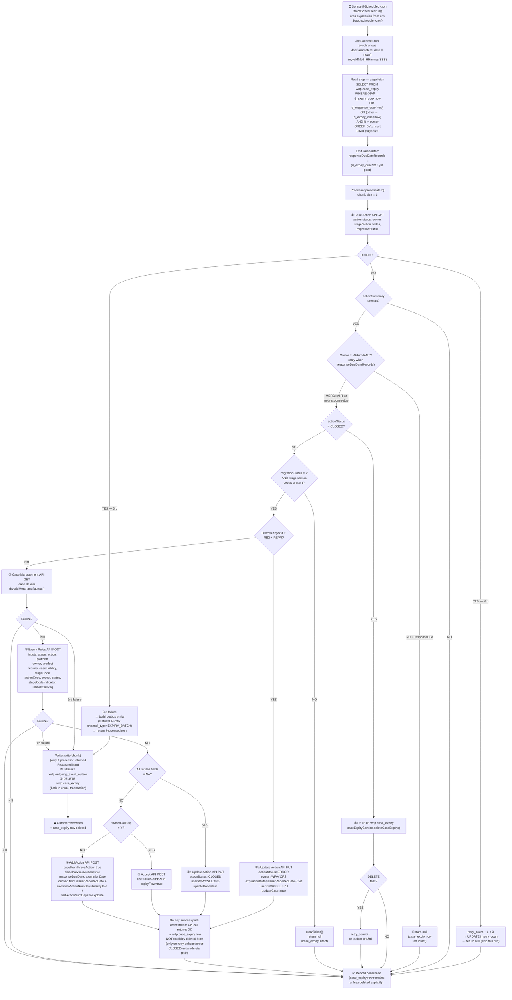

# WDP-COMP-51-CASE-EXPIRY-PROCESSOR.md
**Worldpay Dispute Platform — Component Reference**
*Version: 1.0 DRAFT | April 2026*
*Source-verified by Claude Code 2026-04-25 against `gcp-case-expiry-processor-batch` | Architect-confirmed: PENDING*

---

## ━━━ CORE SKELETON ━━━━━━━━━━━━━━━━━━━━━━━━━━━━━━━━━━━━━━

---

## Identity

| Field | Value |
|---|---|
| **Name** | `CaseExpiryProcessor` |
| **Type** | Batch / Scheduler |
| **Artefact** | `gcp-case-expiry-processor-batch` |
| **Repository** | `gcp-case-expiry-processor-batch` |
| **Runtime** | Spring Boot + Spring Batch (chunk-oriented), Java |
| **Status** | ✅ Production |
| **Doc status** | 📝 DRAFT |
| **Sections present** | Core \| Block C (Batch / Scheduler) |
| **Related components** | COMP-17 CaseExpiryUpdateConsumer (writer of `wdp.case_expiry`); COMP-12 InboundDisputeEventScheduler (Scheduler3 — downstream handler of `wdp.outgoing_event_outbox` rows this component writes) |

---

## Purpose

**What it does**

CaseExpiryProcessor is the deadline-enforcement engine for the `wdp.case_expiry` table. It is the **reader** half of the case-expiry subsystem; COMP-17 CaseExpiryUpdateConsumer is the **writer** half. Together the two components implement the full lifecycle of a dispute action's deadline tracking: COMP-17 maintains the schedule, COMP-51 acts on it when due.

The component runs on a Spring `@Scheduled` cron trigger. On each fire, it scans `wdp.case_expiry` for rows whose deadline has passed — `d_expiry_due < now()` for all platforms, plus `d_response_due < now()` for the NAP platform — and processes each due row through a multi-step pipeline that calls Case Action API, Case Management API, Expiry Rules API, and one of three terminal APIs (Update Action, Accept, or Add Action) depending on the rules-driven outcome.

A successful processing outcome **deletes the row from `wdp.case_expiry`** (because the action either advances to its next phase or is closed). A skipped record (non-MERCHANT owner on a response-due record, or `migrationStatus ≠ Y`) leaves the row intact for the next run. A retry-exhausted failure (after 3 attempts on any single REST call) writes a row to `wdp.outgoing_event_outbox` with `channel_type = EXPIRY_BATCH` and `status = ERROR`, **and also deletes the source `wdp.case_expiry` row** in the same Spring Batch chunk transaction — handing off recovery to whatever consumer reads `EXPIRY_BATCH` rows downstream.

The component publishes nothing to Kafka and exposes no REST endpoints. All side-effects are database mutations on `wdp.case_expiry` (DELETE, UPDATE retry counter) and `wdp.outgoing_event_outbox` (INSERT on retry exhaustion only), plus seven outbound REST calls.

**What it does NOT do**

- Does NOT publish to Kafka. `spring-kafka`, `kafka-clients`, and `aws-msk-iam-auth` are declared in `pom.xml` but no producer or consumer code exists.
- Does NOT consume from Kafka. No `@KafkaListener` anywhere in source.
- Does NOT expose REST endpoints. No `@RestController`, `@Controller`, or `@RequestMapping`.
- Does NOT use the transactional outbox pattern in the producer sense. The outbox INSERT is a **failure-capture sink**, not a means to guarantee Kafka delivery. The business state changes (Update Action, Accept, Add Action) that happened before the failure were direct REST calls and are not replayable from the outbox row — DEC-001 partial.
- Does NOT apply timeouts on any outbound REST call. Plain `RestTemplate` with default `SimpleClientHttpRequestFactory` — no connect timeout, no read timeout, no connection pool. A hung remote ties up the chunk thread until the JVM closes the socket itself.
- Does NOT use Resilience4j. No circuit breakers, no `@Retry`, no bulkheads — DEC-014 absent (factual record only; DEC-014 is platform-VOID).
- Does NOT use `@Retryable`. `spring-retry` is on the classpath but unused. The retry mechanism is hand-rolled in every service implementation: increment `i_retry_count` on `wdp.case_expiry`, fail through to outbox-write on the third consecutive failure.
- Does NOT enforce single-replica execution at the application level. No `@SchedulerLock`, no ShedLock, no advisory lock. Concurrency safety relies entirely on the K8s manifest setting `replicas: 1` — a DEC-023 operational-only deviation.
- Does NOT propagate `v-correlation-id` consistently across calls within one record. The header is regenerated as a **fresh random UUID per outbound REST call**, so the per-record audit trail is fragmented across the 4–5 calls it makes. The header is also missing entirely on the IDP token call.
- Does NOT have any test coverage. `src/test/` directory is empty; `spring-batch-test` and `spring-boot-starter-test` are declared but unused.
- Does NOT have liveness, readiness, or startup probes configured.
- Does NOT use MDC, custom Micrometer metrics, or `@Timed` / `@Counted`. Observability is the OpenTelemetry agent + structured Logstash JSON appender only.

---

## Internal Processing Flow

---

## Boundaries

### Inbound Interfaces

| Source | Protocol | Endpoint / Trigger | Description |
|---|---|---|---|
| Spring `@Scheduled` (internal) | Cron | `${app.scheduler.cron}` resolved from env `${scheduler_cron}` | Sole inbound trigger. No REST surface, no Kafka inbound, no queue listener. |

### Outbound Interfaces

| Target | Protocol | Endpoint | Purpose | On failure |
|---|---|---|---|---|
| `wdp-idp-token-service` | REST GET | `/merchant/gcp/idp-token/token` | IDP bearer token for downstream calls. **No `v-correlation-id`** propagated. Token cached in step-scoped holder; cleared on errors so next call refreshes. | Throws `CaseExpiryServiceException`; not caught by token holder; propagates to whichever service tried `getToken()` and is caught there → retry-counter path |
| `mdvs-gcp-case-actions-service` (GET action) | REST GET | `/merchant/gcp/case-actions/{platform}/case/{caseNumber}/actions/{actionSequence}` | Fetch current action status, owner, stage/action codes, migrationStatus | retry_count++; outbox + delete on 3rd failure |
| `mdvs-gcp-case-management-service` | REST GET | `/merchant/gcp/case-management/{platform}/case` | Fetch case details (hybrid-merchant flag etc.) | retry_count++; outbox + delete on 3rd failure |
| `mdvs-gcp-rules-service` | REST POST | `/merchant/gcp/rules/expiryrules` | Look up next-action rules based on stage / action / platform / owner / product | retry_count++; outbox + delete on 3rd failure |
| `mdvs-gcp-case-actions-service` (Update Action) | REST PUT | `/merchant/gcp/case-actions/{platform}/case/{caseNumber}/action` | Used in Discover-RE2-REPR-hybrid path and in NA-rules path. | retry_count++; outbox + delete on 3rd failure |
| `mdvs-gcp-disputes-accept-service` | REST POST | `/merchant/gcp/accept/{platform}/{caseNumber}/accept` | Network-call branch (rules.isNtwkCallReq = Y). | retry_count++; outbox + delete on 3rd failure |
| `mdvs-gcp-case-actions-service` (Add Action) | REST POST | `/merchant/gcp/case-actions/{platform}/case/{caseNumber}/actions` | Default branch — create the next action. | retry_count++; outbox + delete on 3rd failure |
| `wdp.case_expiry` | PostgreSQL (JPA) | `wdp` schema | SELECT (page fetch), UPDATE (retry counter), DELETE (CLOSED action, retry exhaustion). | retry_count++ via UPDATE; outbox on 3rd |
| `wdp.outgoing_event_outbox` | PostgreSQL (JPA) | `wdp` schema | INSERT only on retry exhaustion. `channel_type = EXPIRY_BATCH`, `status = ERROR`, `created_by = WCSEEXPB`. | Chunk transaction rollback; Spring Batch fails the chunk |

---

## Database Ownership

### Tables Owned (written by this component)

| Schema.Table | Purpose | Key columns | Notes |
|---|---|---|---|
| `wdp.case_expiry` | **Shared write** with COMP-17. COMP-17 inserts/upserts/deletes via Kafka-driven flow; COMP-51 reads, updates `i_retry_count`, and deletes on success or retry exhaustion. | `id`, `i_case`, `i_action_seq`, `c_acq_platform`, `d_expiry_due`, `d_response_due`, `i_retry_count`, `c_workflow_name`, `z_insrt`, `z_updt` | ⚠️ **Shared write boundary.** COMP-17 is the inserter; COMP-51 is the deleter and retry-counter updater. There is no row-level lock or coordination between the two — COMP-17 may upsert a row while COMP-51 has it cached in a chunk in flight. Cursor-based reader uses `id > :id` predicate that prevents in-run reprocessing but does not coordinate with COMP-17. Sort key on read: `z_insrt`. |
| `wdp.outgoing_event_outbox` | Failure-capture sink only. INSERT triggered exclusively when any single REST call fails 3 times consecutively for a given record. | `id`, `i_case`, `i_action_seq`, `channel_type` (constant `EXPIRY_BATCH`), `retry_count` (hardcoded 0 on insert), `status` (constant `ERROR` on insert), `created_by` (constant `WCSEEXPB`), `created_at`, `updated_by` (constant `WCSEEXPB`), `updated_at`, `original_event` (CaseExpiryEntity serialised by default Jackson `ObjectMapper` — a fresh instance per call, no Java-time module), `error_message` | ⚠️ **Distinct `channel_type` from COMP-17.** COMP-17 writes `EXPIRY_EVENTS`; COMP-51 writes `EXPIRY_BATCH`. The two are logically separated by discriminator and **must remain so** — the COMP-12 Scheduler3 contract for `EXPIRY_BATCH` rows is currently undefined (gap, see below). Columns NOT written: `id` (sequence), `next_retry_at` (commented-out at write site), `error_code`, `idempotency_id`, `event_timestamp`. INSERT and `wdp.case_expiry` DELETE happen in the **same Spring Batch chunk transaction** — atomic by chunk boundary, not by service-level `@Transactional`. |

### Tables Read (not owned by this component)

*This component reads only from `wdp.case_expiry` (which it also writes to). No read-only table dependencies.*

### Spring Batch Metadata Tables

Spring Batch writes its standard `BATCH_JOB_INSTANCE`, `BATCH_JOB_EXECUTION`, `BATCH_STEP_EXECUTION` etc. to whatever schema the env-templated `spring.batch.jdbc.tablePrefix` resolves to. The exact prefix is not in source. `spring.batch.jdbc.initialize-schema = never`, so the schema must be pre-created externally.

---

## Key Architectural Decisions

| Topic | Decision | Rationale | Status |
|---|---|---|---|
| Case-expiry subsystem split into writer + reader | COMP-17 maintains the schedule (Kafka consumer); COMP-51 acts on it (scheduled batch). They share `wdp.case_expiry` as the coordination surface. | Decouples real-time schedule maintenance from cron-driven deadline enforcement. Failure modes of one do not block the other. | Confirmed — source structure |
| Writer handoff via outbox `channel_type = EXPIRY_BATCH` | COMP-51 captures retry-exhausted failures into `wdp.outgoing_event_outbox` with a discriminator distinct from COMP-17's `EXPIRY_EVENTS` | Prevents COMP-17's predecessor-blocking logic and COMP-12's Scheduler3 from inadvertently coupling to COMP-51 failures | ⚠️ Downstream reader of `EXPIRY_BATCH` rows is **not yet identified** in the platform — open gap |
| Hand-rolled retry mechanism | Each service impl catches `Exception`, increments `i_retry_count` via `caseExpiryDao.updateRetryCount(...)` if `< 3`, builds outbox entity if `≥ 3`. `spring-retry` is on classpath but `@Retryable` is not used anywhere. | Enables persistent retry counter across cron runs (cannot be done with in-memory `@Retryable`). | Confirmed — source |
| Step-scoped IDP token holder | `StepTokenHolder` caches the IDP bearer token within a single Spring Batch step. Cleared on every error path. | Avoids re-fetching a token per call within a record while ensuring failures force refresh. | Confirmed — source |
| Three-way downstream branch | (a) Discover hybrid + RE2 + REPR → Update Action with ERROR/WPAYOPS; (b) `checkIfNA` over 6 rules fields → Update Action with CLOSED; (c) `isNtwkCallReq = Y` → Accept API; (d) default → Add Action API | Encodes business policy: the Discover special case is regulatory; NA-rules indicates the case has no further actions; Network call vs Add Action splits the rest. | Confirmed — source. Discover special case is a hardcoded regulatory rule — flagged for review. |
| Fresh `v-correlation-id` per call | `RestInvoker.getHttpHeaders()` generates a new random UUID per outbound call | Not deliberate — emergent from the helper method's design. | ⚠️ Risk — fragments per-record audit trail. Likely bug. |
| No code-level singleton guard | No `@SchedulerLock`, no advisory lock, no leader election | Relies on K8s `replicas: 1` operational constraint | ⚠️ DEC-023 deviation — operational only |

---

## Risk Register

| Risk | Severity | Detail |
|---|---|---|
| Shared write to `wdp.case_expiry` with COMP-17 (no coordination) | 🔴 High | COMP-17 may upsert a row mid-flight while COMP-51 has it in a chunk. Worst-case: COMP-17 upserts new dates onto a row COMP-51 is about to delete on success — the new dates are lost. Cursor-based reader prevents in-run reprocessing of already-emitted rows but does not protect against COMP-17 race. No row-level lock, no `SELECT FOR UPDATE`, no version column. |
| `EXPIRY_BATCH` outbox rows have no identified downstream reader | 🔴 High | COMP-51 writes outbox rows with `channel_type = EXPIRY_BATCH` and `status = ERROR` on retry exhaustion. **No platform component currently identified as consumer of `EXPIRY_BATCH`** — COMP-12 Scheduler3 reads `FAILED` and `PENDING_DEFERRED` rows of any channel, but COMP-51 writes `ERROR` directly, which COMP-12 Scheduler3 does not pick up. These rows may be terminal-write-only with no recovery path. Manual intervention required. |
| Potential feedback loop with COMP-17 (mitigated by status discriminator) | 🟡 Medium | If COMP-12 Scheduler3 ever republishes `EXPIRY_BATCH` rows to `case-action-events`, COMP-17 would consume them and rewrite `case_expiry` — completing a loop with COMP-51. Currently this loop **does not exist** because (a) COMP-51 writes status `ERROR`, not `FAILED`; and (b) the `channel_type` is `EXPIRY_BATCH`, not `EXPIRY_EVENTS`. **Both safeguards must be preserved.** Documented as a risk if either ever changes. |
| No timeouts on REST calls — 7 distinct upstream services | 🔴 High | Plain `RestTemplate` with `SimpleClientHttpRequestFactory`, no `setConnectTimeout` / `setReadTimeout`. A hung remote on any of the 7 calls ties up the chunk thread until the JVM-level socket close fires — could be hours. Combined with chunk size = 1 and unknown page size, a single hung remote can stall the entire run. |
| No code-level singleton guard | 🟡 Medium | Two replicas firing on the same cron tick would both read the same page, both increment retry counters, both call downstream APIs — duplicate Update Action / Accept / Add Action calls would occur. Spring Batch's `JobRepository` would not dedupe because the JobParameters include `LocalDateTime.now()` to millisecond precision — two replicas firing within the same millisecond window get distinct parameters. **DEC-023 operational-only mitigation.** |
| Retry counter persistence races with COMP-17 upsert | 🟡 Medium | When COMP-51 calls `updateRetryCount`, it issues a single `UPDATE wdp.case_expiry SET i_retry_count = :n WHERE id = :id`. If COMP-17's UPSERT happens concurrently and resets `i_retry_count` to 0 (per its insert mapping), the COMP-51 UPDATE is still well-defined but the new retry counter overwrites the COMP-17 reset, or the COMP-17 reset wins depending on commit order. Outcome: retry counter may be either too low or too high. Low risk in practice because COMP-17 only inserts on first event; subsequent COMP-17 traffic is UPSERT update which preserves `i_retry_count`. |
| `v-correlation-id` regenerated per call | 🟡 Medium | `RestInvoker.getHttpHeaders()` generates a fresh UUID per outbound call. Per-record processing makes 4–5 distinct REST calls and each carries a different correlation ID. End-to-end audit trail across the 4–5 hops cannot be reconstructed from headers alone. |
| `v-correlation-id` missing on IDP token call | 🟢 Low | `IdpRestInvoker` only sets Content-Type and Accept. Same gap as COMP-17. |
| Unused Spring Batch metadata schema config | 🟢 Low | `spring.batch.jdbc.initialize-schema = never` and `tablePrefix = ${table_prefix}` rely entirely on external DB pre-creation. If env var unset, startup fails with cryptic JDBC error rather than a clean config error. |
| `DriverManagerDataSource` instead of pooled DataSource | 🟢 Low | `PersistenceConfig.dataSource()` returns `DriverManagerDataSource` — opens a fresh JDBC connection per request. Acceptable for low-frequency batch but not for high-throughput. |
| No tests in repo | 🟢 Low | `src/test/` is empty. `spring-batch-test` and `spring-boot-starter-test` declared as dependencies. Refactoring risk unmitigated. |
| Unused dependencies | 🟢 Low | `spring-kafka`, `kafka-clients`, `aws-msk-iam-auth`, `spring-retry`, `commons-beanutils`, `spring-aspects`, `spring-batch-test`, `spring-boot-starter-test` — none wired. Increases JAR size and attack surface. |

---

## Deviation Flags

| Standard | Status | Detail |
|---|---|---|
| **DEC-001** — Transactional outbox | ⚠️ PARTIAL DEVIATION | `wdp.outgoing_event_outbox` is used as a **failure-capture sink**, not as a transactional producer outbox. Outbox INSERT and `wdp.case_expiry` DELETE share the same Spring Batch chunk transaction (atomic), but the **business state changes already executed by the failed REST call** (Update Action / Accept / Add Action) are NOT reconstructable from the outbox row — the outbox entry contains the source `CaseExpiryEntity` only, not the in-flight downstream payload. Recovery requires manual reasoning, not automated replay. |
| **DEC-003** — Partition key = merchantId | ✅ NOT APPLICABLE | No Kafka producer. `spring-kafka` and `aws-msk-iam-auth` declared but unused. |
| **DEC-004** — PAN encryption before persistence | ✅ COMPLIES | This component reads no PAN. The DTOs that include `cardNumberLast4`, `token`, `tokenId` are deserialised from upstream responses but never written to any column. Outbox `original_event` JSON is built from `CaseExpiryEntity` only, which has no card-number columns. |
| **DEC-005** — Manual offset commit AFTER processing | ✅ NOT APPLICABLE | No Kafka consumer. |
| **DEC-019** — Clear PAN on persistent store | ✅ COMPLIES | No PAN-shaped column in either table written. |
| **DEC-020** — Full at-least-once idempotency | ⚠️ PARTIAL | Idempotency is only via `wdp.case_expiry` row deletion after success or retry exhaustion. There is no idempotency key stored or checked against downstream APIs. If the job re-runs after a crash that occurred after a successful Add Action / Accept call but before the row was processed off, the call could be re-issued (downstream-side dedup must protect, not COMP-51-side). Two replicas running concurrently have no guard — see DEC-023. |
| **DEC-023** — Replica = 1 hard constraint | ⚠️ OPERATIONAL ONLY | No `@SchedulerLock`, no ShedLock, no advisory lock anywhere. Concurrency safety relies entirely on the K8s manifest setting `replicas` to 1. The code does not enforce single-replica execution. Same operational-only posture as COMP-07 / COMP-08 / COMP-09. |
| **DEC-014** — Resilience4j circuit breakers | ✅ ABSENT (factual record only — DEC-014 is platform-VOID) | No `io.github.resilience4j` dependency. No circuit breaker, retry, or bulkhead annotations anywhere. |

---

## Deployment and Operations

### Kubernetes Configuration

| Parameter | Value |
|---|---|
| **Resource type** | Deployment |
| **Replica count** | `{{ replicas-gcp-case-expiry-processor-batch }}` — templated; resolved at deploy time. **No default value in repo.** Production value not visible in source. ⚠️ Must be 1 per DEC-023 operational constraint. |
| **Memory limit** | 2048Mi |
| **Memory request** | 1024Mi |
| **CPU limit** | Not configured (Burstable QoS) |
| **CPU request** | Not configured |
| **HPA** | Absent |
| **Rolling update** | `maxSurge: 1`, `maxUnavailable: 0`, `minReadySeconds: 30` |
| **PodDisruptionBudget** | Absent |
| **Topology spread constraints** | Absent |
| **Liveness probe** | **Not configured** |
| **Readiness probe** | **Not configured** |
| **Startup probe** | **Not configured** |
| **Container port** | 8082 |
| **K8s Secrets mounted** | `gcp-case-expiry-processor-batch-secrets`, `wdp-common-secrets`, `{{ ingressTLSsecretName }}` (templated) |

### Observability

| Component | Status | Detail |
|---|---|---|
| OpenTelemetry agent | ✅ Present | Annotation `instrumentation.opentelemetry.io/inject-java: opentelemetry-operator-system/default` on pod template |
| Spring Actuator | ✅ Present | `spring-boot-starter-actuator` on classpath |
| Actuator endpoints exposed | Defaults only | `management.endpoints.web.exposure.include` not set in any `application*.yml` — Spring Boot defaults to `health, info` only |
| Logstash appender | ✅ Present | `LogstashTcpSocketAppender` with JSON encoder |
| MDC context | ❌ Absent | No `MDC.put` / `MDC.clear` anywhere. No correlation across log lines from one record-processing run. |
| Custom Micrometer metrics | ❌ Absent | No custom `Counter`, `Timer`, `Gauge`, or `@Timed`. No per-outcome counters (skipped, retried, exhausted, success, error). Default JVM and Kafka-client meters only (Kafka meters present despite no Kafka usage — declared dependency). |

### Planned and Incomplete Work

**Commented-out fields (deferred contract work):**
- `AcceptRequest.notes` — commented out, signalling a deferred request-shape change.
- `ActionRequest.previousActions` — commented out for the same reason.
- `next_retry_at` outbox column population is commented out at the write site — suggests the next-retry mechanism was either deferred or owned by a downstream consumer that does not yet exist.

**Dead-code self-comment:** `RestInvoker.java:45` carries `// Can be removed.` on a `TimeoutException` catch. The catch is **not** dead — `RestTemplateResponseErrorHandler` raises `TimeoutException` for HTTP 504. Removing it would change behaviour. The comment is misleading.

**Unused repository method:** `OutgoingEventOutboxRepository.checkPreviousOutBoxInfo` is declared but never invoked. Suggests deduplication-on-write was planned but not wired.

**Unused pom dependencies:** `spring-kafka`, `kafka-clients`, `aws-msk-iam-auth`, `commons-beanutils`, `spring-aspects`, `spring-retry`, `spring-batch-test`, `spring-boot-starter-test`. None wired.

**No tests:** `src/test/` is empty.

---

## ━━━ TYPE BLOCK C — BATCH / SCHEDULER CONTRACTS ━━━━━━━━━━━

---

## Batch / Scheduler Contracts

| Item | Value |
|---|---|
| **Trigger mechanism** | Spring `@Scheduled` cron — NOT a Kubernetes CronJob |
| **Schedule expression** | `${app.scheduler.cron}` resolved from env `${scheduler_cron}` |
| **Schedule value** | Not in source — templated |
| **JobLauncher TaskExecutor** | Not customised; Spring Boot default `SyncTaskExecutor` — `BatchScheduler.run()` blocks until the job completes |
| **Job name** | `${app.batchProperties.jobName}` = `CaseExpiryProcessorBatchJob` |
| **Job uniqueness mechanism** | Single `JobParameters` with key `"date"` set to `LocalDateTime.now()` formatted `yyyyMMdd_HHmmss.SSS`. Spring Batch dedupes only if two runs share identical parameters — same-millisecond firing on two replicas would yield distinct parameters and would NOT be deduped. |
| **Concurrent execution guard** | None. No `@SchedulerLock`, no ShedLock, no advisory lock. Relies on `replicas: 1` operational constraint (DEC-023). |
| **Reader / Processor / Writer** | Spring Batch chunk-oriented step. Reader = `BatchItemReader` (paged native query against `wdp.case_expiry`); Processor = `BatchItemProcessor` (per-record state machine); Writer = `BatchItemWriter` (only invoked when processor returns a non-null `ProcessedItem` — i.e. retry-exhausted failure). |
| **Chunk size** | 1 |
| **Step transaction manager** | JPA `PlatformTransactionManager` (single datasource) |
| **Page size** | `${app.batchProperties.pageSize}` resolved from env `${page_size}` — not in source |
| **Pagination mechanism** | `PageRequest.of(0, pageSize, Sort.by("z_insrt"))` plus a manual cursor variable `id` advanced after every read. Effectively offset-zero + monotonic-id cursor. Reader pre-fetches page 0 in `@BeforeStep`, then re-fetches further pages as needed. |
| **Spring Batch metadata** | `spring.batch.jdbc.initialize-schema = never`, `tablePrefix = ${table_prefix}` (env-driven, not in source), `isolation-level-for-create = REPEATABLE_READ`. Schema must be pre-created externally. |
| **Auto-launch on context start** | Disabled — `spring.batch.job.enabled = false`. Only the scheduler triggers runs. |
| **Restart behaviour** | No explicit restart logic. A failed prior run does NOT block the next cron fire because each run gets distinct JobParameters via the timestamp. |

### Input Source Query — `wdp.case_expiry`

Native SQL (paraphrased from source):

- Predicate: `(c_acq_platform = 'NAP' AND (d_expiry_due < :currentDate OR d_response_due < :currentDate))` OR `(c_acq_platform <> 'NAP' AND d_expiry_due < :currentDate)` AND `id > :id`
- Date source: `new java.util.Date()` — JVM default time zone. No `Clock` bean. No timezone control.
- ORDER BY: `z_insrt` (from `Pageable.Sort`)
- LIMIT: `pageSize` (from `Pageable`)

**Confirmed absent:** REST API surface, Kafka producer, Kafka consumer.

---

## Remaining Gaps

| Gap | Action required |
|---|---|
| Cron expression actual value | Inspect XLD deployment config / K8s Secret for `${scheduler_cron}` |
| Page size actual value | Inspect XLD deployment config / K8s Secret for `${page_size}` |
| Production replica count | Inspect XLD deployment config for `{{ replicas-gcp-case-expiry-processor-batch }}` value — must be 1 per DEC-023 |
| Spring Batch table prefix actual value | Inspect XLD deployment config / K8s Secret for `${table_prefix}` |
| Downstream reader of `EXPIRY_BATCH` outbox rows | Cross-component sweep needed: which platform component reads `wdp.outgoing_event_outbox WHERE channel_type = 'EXPIRY_BATCH' AND status = 'ERROR'`? COMP-12 Scheduler3 reads only `FAILED` and `PENDING_DEFERRED`, so this reader is not yet identified. May be terminal-write-only — architect decision required. |
| `v-correlation-id` regeneration | Architect decision required — bug or intentional? Same call signature as COMP-17 (which also regenerates per call within IDP path). Likely a platform-wide remediation candidate. |
| Discover hybrid-merchant RE2/REPR special case | Confirm with business — is this a permanent regulatory rule or migration-era workaround? Hardcoded constants `RE2`, `REPR`, `WPAYOPS`, `EXPIRY_DAYS = 32` |
| Hardcoded user IDs `WCSEEXPB` and `WCSEEXPC` | Both are 8-character constants. COMP-17 uses `WCSEEXPC`, COMP-51 uses `WCSEEXPB` — confirm the distinction is intentional and recorded in the platform user-ID registry |
| Two replicas would issue duplicate REST calls | Confirm with platform team that DEC-023 operational constraint is monitored / enforced for COMP-51 (matching the existing posture for COMP-07/08/09) |
| Race between COMP-17 upsert and COMP-51 retry-counter UPDATE | Architect decision required — accept (current state) or remediate via row-version column / SELECT FOR UPDATE in the reader? |
| HTTP 504 → `TimeoutException` is caught + wrapped + retry-counter incremented | Confirm with team that 504 retries are appropriate for all 7 upstream services — POST endpoints (Accept, Add Action, Rules) may not be safely retryable on 504 if the upstream completed before timing out |

---

*End of WDP-COMP-51-CASE-EXPIRY-PROCESSOR.md*
*File status: 📝 DRAFT v1.0 — source-verified 2026-04-25 by Claude Code; architect confirmation pending*
*Companion change-log entry to be appended to WDP-CHANGE-LOG.md.*
