# WDP-ARCHITECTURE.md
**Worldpay Dispute Platform — Architecture Reference**
*Version: 2.2 — Baseline*

---

## Table of Contents

1. [Purpose & Context](#1-purpose--context)
2. [System Context](#2-system-context)
3. [UI & Access Layer](#3-ui--access-layer)
4. [WDP Core Services](#4-wdp-core-services)
5. [Inbound Processing](#5-inbound-processing)
6. [Kafka Event Bus](#6-kafka-event-bus)
7. [Event Consumers](#7-event-consumers)
8. [Outbound Processing](#8-outbound-processing)
9. [Acquiring Platform Integration](#9-acquiring-platform-integration)
10. [Cross-Cutting Concerns](#10-cross-cutting-concerns)
11. [Deployment Context](#11-deployment-context)
12. [Component Status Registry](#12-component-status-registry)

---

## Knowledge Base Navigation

This document covers platform-level topology, principles, and deployment context. It is the starting point — not the complete picture.

For deeper detail, use the documents below. Claude searches all project files simultaneously, so these cross-references help orient every response toward the right source of truth.

| Question type | Go to |
|---------------|-------|
| What does component X do? | WDP-COMP-INDEX.md → WDP-COMP-[NN]-*.md |
| What are the REST endpoints for component X? | WDP-COMP-[NN]-*.md Block A |
| Which Kafka topics does component X produce or consume? | WDP-COMP-[NN]-*.md Block B/C + WDP-KAFKA.md |
| Which database tables does component X own? | WDP-COMP-[NN]-*.md + WDP-DB.md |
| How does a dispute flow end to end? | WDP-FLOW-INDEX.md → WDP-FLOW-*.md |
| What are the architecture decisions and tradeoffs? | WDP-DECISIONS.md |
| What does WDP integrate with externally? | WDP-INTEGRATIONS.md |
| What are the performance and resilience constraints? | WDP-NFRS.md |
| What is the current work position and session context? | WDP-HANDOVER.md |

---

## 1. Purpose & Context

### 1.1 What is WDP?

The Worldpay Dispute Platform (WDP) is a centralised, event-driven financial dispute resolution platform serving major card networks and acquiring platforms. It provides a single, auditable, scalable system that ingests dispute data from card networks and acquiring platforms, applies business rules, manages the full dispute lifecycle, and delivers structured outcomes back to merchants, networks, and acquiring platforms.

The platform handles three categories of work: processing inbound dispute events and evidence files from card networks and acquiring platforms, enabling merchants and operations teams to actively manage dispute responses, and delivering dispute outcomes to acquiring platforms for money movement and to external notification systems.

### 1.2 Why WDP Exists

Card networks (Visa, Mastercard, Amex, Discover) and acquiring platforms transmit dispute events to WDP through multiple integration channels — real-time APIs, batch polling jobs, and file-based transfers. Prior to WDP, each acquiring platform managed its own chargeback workflow independently, leading to duplicated logic, inconsistent merchant notifications, and no unified audit trail.

WDP centralises all of this under a single platform, enforcing PCI-DSS compliance, providing a single dispute case ledger, enabling self-service dispute management for merchants at scale, and delivering dispute outcomes to acquiring platforms through both direct integrations and the enterprise EDIA streaming platform.

### 1.3 Core Architectural Principles

Five principles govern every design decision in WDP:

**Event-driven over request-driven.** All high-volume, cross-component communication flows through Kafka. Components are decoupled through well-defined topics and consumer groups. This eliminates message loss even when downstream consumers are temporarily unavailable.

**Idempotency everywhere.** Every operation — case creation, evidence attachment, business rule execution, notification delivery — is safe to retry. Deduplication keys exist at every boundary.

**Isolation by merchant.** Kafka partitioning and processing concurrency are scoped per merchant. A failure or slowdown for one merchant cannot cascade to others.

**Compliance is non-negotiable.** PAN data is never stored in plaintext anywhere in the system. Audit trails are immutable and retained for seven years. Every cardholder data operation is logged.

**Common processing paths over special cases.** Where acquiring platforms or card networks have unique integration patterns today, the architectural direction is to migrate them to the common inbound and outbound processing paths over time. NAP is the primary example of this migration in progress.


---

## 2. System Context

### 2.1 External Actors & Systems

WDP interacts with four categories of external actors:

**Card Networks** transmit dispute events to WDP through real-time API polling and file-based transfers. WDP also submits dispute responses back to card networks on behalf of merchants. The networks integrated with WDP are Visa, Mastercard, Amex, and Discover.

**Acquiring Platforms** are the financial platforms that hold merchant accounts and are responsible for money movement when a dispute is resolved. WDP receives dispute events from acquiring platforms and delivers dispute outcomes back to them. Current acquiring platforms are NAP, CORE, LATAM, and VAP.

**Merchants & Operations Teams** interact with WDP through WDP Portal — a single Angular SPA that runs in Merchant mode (merchant-facing) and Ops mode (operations-facing) — to view disputes, take actions, manage queues, and submit evidence and responses.

**External Notification & Intelligence Systems** receive dispute lifecycle events from WDP. These include SignifyD and JustAI for fraud intelligence, BEN for merchant notifications, and the enterprise EDIA streaming platform for acquiring platform integrations.

**On-Premise File Infrastructure** forms the file exchange boundary between WDP and external systems. This includes the DM Mainframe for mainframe-to-mainframe file transfers, Sterling Mailbox as the universal file aggregation and distribution hub, and ControlM as the on-premise agent that bridges Sterling and AWS S3.

### 2.2 High Level Architecture Overview

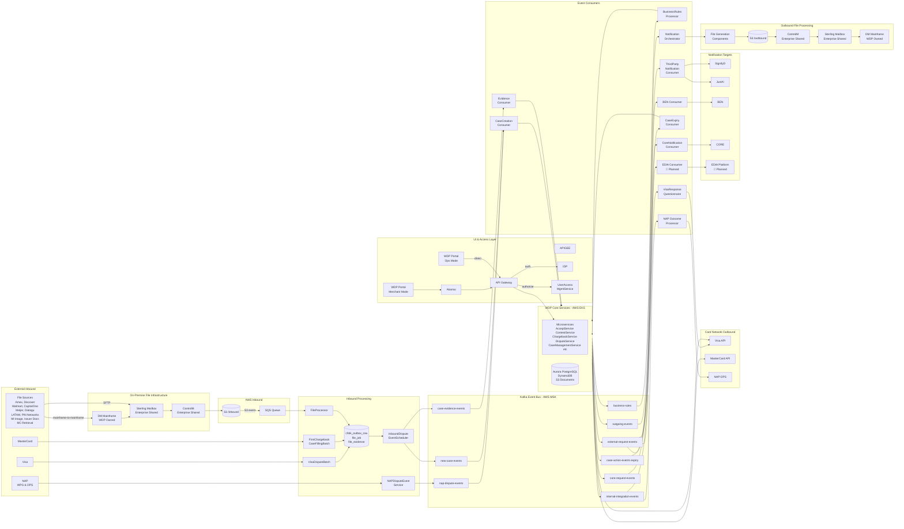

### 2.3 Inbound Dispute Reception Models

WDP supports three models for receiving inbound disputes:

| Model | Description | Current Usage |
|---|---|---|
| API Push | WDP exposes an API for acquiring platforms to push dispute events directly into WDP | NAP via WPG/DPS |
| Pull | WDP polls card network APIs on a schedule to fetch dispute events | Visa, MasterCard |
| File | Dispute events and evidence arrive as files through on-premise file infrastructure | All file-based sources |

### 2.4 Card Network Integration Patterns

WDP receives disputes from two categories of card networks:

- **API-capable networks** (Visa, MasterCard) — WDP polls these networks directly via scheduled batch jobs
- **File-only networks** (Discover, DiscoverHybrid, Amex, AmexHybrid, PIN Networks, and others) — these networks support file interface only and send disputes via DM Mainframe → Sterling → ControlM → S3 file-based path

Regardless of the inbound path, all dispute events converge at `chbk_outbox_row` and follow the common processing path from there.

⚠️ Full list of file-only networks and their acquiring platform mapping to be documented in the File Content Classification section (Section 5.4 — pending).


---

## 3. UI & Access Layer

### 3.1 Portal UIs & Major UI Sections

WDP exposes a single Angular SPA that runs in two distinct runtime modes — Merchant and Ops — both deployed on AWS EKS. The two modes share a single repository and a single build artifact; mode identity is derived from DNS hostname plus IDP firm name combination, with `EnvironmentService` selecting `apiBaseUrl` per host. There is no separate build, no compile-time flag, and no distinct entry point.

**Merchant mode** is the merchant-facing surface. Traffic routes through Akamai for CDN and edge security before reaching the WDP API Gateway.

**Ops mode** is the internal operations surface. It connects directly to the WDP API Gateway — it does not route through Akamai.

**User types.** Three distinct user types are assigned at runtime by `WdpSharedService`:
- `MERCHANT_USER` — external merchant users via merchant DNS.
- `OPS_USER` — internal Worldpay operations users via Ops DNS.
- `PB_USER` — Worldpay-internal users (`us_worldpay_fis_int` firm) authenticated via merchant DNS, distinct from MERCHANT_USER.

**Documentation note.** COMP-49 and COMP-50 share documentation. `WDP-COMP-49-WDP-PORTAL.md` is the canonical file covering both modes; `WDP-COMP-50-OPS-PORTAL.md` is a stub pointer.

**Major UI sections by mode:**

| UI Section | Merchant | Ops | Platform Scope |
|---|---|---|---|
| Disputes | ✅ | ✅ | All |
| Queues | ❌ | ✅ | All |
| User Management | ✅ | ✅ | All |
| Org Management | ✅ | ✅ | All |
| Administration | ❌ | ✅ | NAP only |
| Fax Matching | ❌ | ✅ | CORE only |
| Fax Analytics | ❌ | ✅ | CORE only |
| Card Authorization History | ❌ | ✅ | CORE only |
| Card Settlement | ❌ | ✅ | CORE + PIN |
| Card Dispute History | ❌ | ✅ | CORE + PIN |
| Dashboard | 🔴 Planned | 🔴 Planned | All |
| Automations | 🔴 Planned | 🔴 Planned | All |

**Disputes Section** is the primary working area. It provides dispute search, dispute detail view, and all dispute actions including accept, contest (Defend), evidence submission, and notes. Dispute search export returns synchronously up to 200 records; above that threshold (or when `isAlwaysLFTExport=true`) the export is asynchronous via Large File Transfer.

**Queues Section** (Ops mode only) provides queue-based workload management for operations teams. Cases are routed to queues based on configurable skill-based routing rules. Operators work through disputes assigned to their queues.

**User Management Section** allows administrators to manage users within their organisation — creating, modifying, and deactivating users and managing their roles and permissions.

**Org Management Section** allows administrators to manage organisational hierarchies, configure merchant accounts, and manage org-level settings and routing rules.

**Platform-specific Ops sections.** Several Ops-mode sections are scoped to specific acquiring platforms: Administration (NAP only), Fax Matching and Fax Analytics (CORE only, backed by COMP-29 FaxQueueService), Card Authorization History (CORE only), Card Settlement and Card Dispute History (CORE + PIN). These reflect platform-specific operational workflows rather than platform-wide capability.

**Dashboard Section** and **Automations Section** are 🔴 Planned — left-nav entries are commented out in source; not yet developed.

### 3.2 APIGEE (B2B / System-to-System)

APIGEE is the enterprise API gateway sitting in the B2B integration path. It handles system-to-system API connections between external merchant systems and WDP. External merchant systems connect through Akamai for CDN and edge security and then through APIGEE before reaching the WDP API Gateway.

WDP exposes **ChargebackService** through APIGEE and Akamai to external merchants. This is the only WDP Core service accessible programmatically to external merchants. It supports both read and action operations.

APIGEE is responsible for:
- API contract enforcement for external merchant integrations
- API key management for system-to-system authentication
- Rate limiting for external API consumers
- Traffic management and routing for B2B connections

### 3.3 API Gateway

The WDP API Gateway is the single internal entry point for all requests from all paths — WDP Portal Merchant mode, Ops mode, and B2B. It is responsible for:

- **Authentication** — validates JWT tokens issued by the shared IDP for all incoming requests
- **Authorization** — calls UserAccessManagementService to verify the caller has permission to perform the requested action
- **Routing** — routes authenticated and authorized requests to the appropriate WDP Core microservice

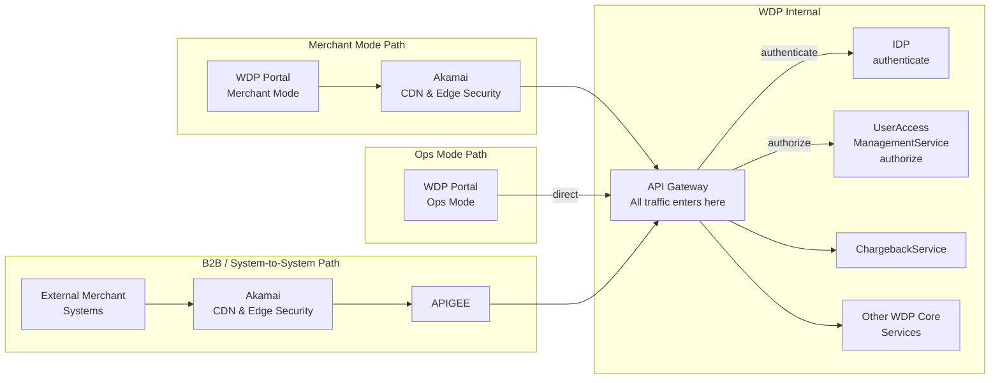


⚠️ **Gap — CORE/VAP/LATAM gateway-level authorization absent.** No CORE platform value exists in API Gateway source code. CORE, VAP, and LATAM platform requests receive **no role-level or case-level authorization at the gateway layer**. NAP and PIN requests are routed through the case-level authorization filter (UAMS / CHAS); CORE/VAP/LATAM bypass it entirely. Architect decision required — see WDP-DECISIONS.md ADR-CAND-029.

⚠️ **Resilience gap — blocking RestTemplate on Netty event-loop.** API Gateway uses Spring Cloud Gateway on Netty (a reactive non-blocking framework), but `CaseNumberFilter` invokes UAMS and CHAS using **blocking `RestTemplate` on Netty event-loop threads with no timeout**. A single degraded auth service can exhaust all gateway threads. Blast radius: the entire gateway. See WDP-NFRS.md RISK-093 and WDP-DECISIONS.md ADR-CAND-028.

⚠️ **Listen port `8082`.**

### 3.4 Authentication & Authorization

**IDP (Identity Provider)** is the shared enterprise OAuth 2.0 identity infrastructure. It issues JWT tokens consumed by the API Gateway for all user and service authentication.

**UserAccessManagementService** is the WDP-owned authorization service. It enforces access control rules across the platform:
- Users may only act on disputes belonging to their org hierarchy
- Queue access is restricted to disputes assigned to the user's role and skill
- Merchant data is isolated by merchant_id at both API and database levels
- Operations users have tiered permissions — actions available depend on their assigned role

⚠️ **UAMS — 4-path summary:**
1. **NAP `POST /authorize`** — case-level authorization for NAP requests (3-layer model: consumer authorization → entity-class gate → entity-value lookup).
2. **Entity CRUD** — six write endpoint families across `nap_parent_entity`, `nap_child_entity`, `nap_merchant`, `nap_entity_rel`. Application-level SELECT-then-INSERT only; no DB UNIQUE visible. ⚠️ **DEC-021 wrong-TM scope expansion (RISK-010 promoted 🟠→🔴):** 7 methods write to NAP-schema tables under `wdpTransactionManager` instead of `napTransactionManager`. See WDP-DECISIONS.md DEC-021.
3. **SunGard IdP user-lifecycle proxy** — two firm-routed instances (`Merchant_Fraud_Disputes` → MFD; else → standard `US_Merchant`). See WDP-INTEGRATIONS.md §6.1.
4. **AWS S3 bulk onboarding** — direct write to `${wdp_entity_file}` bucket, key prefix `RECEIVED/{ENV}/`, hardcoded `eu-west-2` region. ⚠️ **No downstream parser identified** — open question. See WDP-INTEGRATIONS.md §7.2.

⚠️ **CHAS — 9 endpoints.** V2 controller adds three endpoints: `POST /{platform}/v2/merchant/entitytype` (paginated), `GET /{platform}/v2/merchant/orgentity/{orgId}`, `GET /{platform}/v2/merchant/defaultentity/{orgId}`. **Scope is PIN+CORE** (`RequestValidator.validatePlatform` accepts both). The data API surface serves both PIN and CORE platform consumers.

⚠️ **`validateOrgId()` finding:** Method is documented as commented-out, **and the method body is itself absent** from `RequestValidator` — remediation cannot be done by uncomment alone; reimplementation required. See RISK-012, ADR-CAND-029-class.

⚠️ **Internal firm bypass scope:** Bypass (`iss` contains `us_worldpay_fis_int`) applies to **BOTH** `/authorize` AND `/entity-authorize` — both share `AuthorizationServiceImpl.authorizeEntity`. Plus partial-bypass on `POST /{platform}/merchant/entitytype` (V1 and V2): internal callers skip JWT `iqentities` extraction and use `orgId` from request body directly.

⚠️ **COMP-04 unauthenticated SecurityConfig.** All COMP-04 NAPDisputeEventService endpoints are unauthenticated at app level — SecurityConfig whitelist is `/**`. Auth relies entirely on Ingress / network controls. See WDP-NFRS.md RISK-115 and WDP-DECISIONS.md ADR-CAND-031.

⚠️ **COMP-22 internal-firm enforcement is application-layer (not Spring Security).** `contains` check on JWT `iss` claim against literal `us_worldpay_fis_int`. `ForbiddenException` constructor uses `HttpStatus.UNAUTHORIZED` but global handler returns 403 — constructor's status code is dead. See RISK-138.

⚠️ **3-layer authorization model.** Both COMP-02 UAMS and COMP-03 CHAS implement the same shape: (1) Spring Security JWT validation, (2) internal-firm bypass on `iss` substring `us_worldpay_fis_int`, (3) entity-scope check against the platform-specific relationship table. Same constants, same shape, two implementations. Candidate to formalise as a platform pattern — see ADR-CAND-038.

---

## 4. WDP Core Services

All WDP Core services are microservices running on the same AWS EKS cluster. The grouping below reflects functional responsibility, not deployment or ownership boundaries.

### 4.1 Case Action Services

These services handle all actions that can be taken on a dispute case. They are the primary services called by both portal UIs and external merchant systems via the API Gateway.

**AcceptService** processes merchant decisions to accept a dispute. When a merchant accepts a dispute, AcceptService makes a direct synchronous API call to Visa or MasterCard to notify the network of the acceptance. For NAP disputes across all networks, it additionally publishes to `internal-integration-events` so the NAP Outcome Processor can notify NAP-DPS of the dispute outcome.

**ContestService** processes merchant decisions to contest a dispute. It makes a direct synchronous API call to Visa or MasterCard to submit the contest. After a successful contest call it publishes two categories of events to `internal-integration-events`:
- NAP dispute events across all networks — for NAP Outcome Processor to notify NAP-DPS
- Visa dispute events across all acquiring platforms — for VisaResponseQuestionnaire to retrieve and attach the Visa questionnaire to the dispute case

ContestService supports three contest modes, surfaced in the merchant UI as "Defend": `SELF_ASSISTANCE` (merchant submits the response directly), `WORLDPAY_ASSISTANCE` (Worldpay operations team prepares the response on behalf of the merchant), and `RETRIEVAL_RESPONSE` (retrieval-request response, distinct from a chargeback contest). The mode determines which questionnaire is presented and which downstream submission path is taken.

**ChargebackService** is the **sole externally-exposed WDP REST API** and the primary merchant-facing and partner-facing gateway, available to merchant systems via APIGEE → Akamai. It supports both read operations (case search, case detail, activity search, document retrieval) and action operations (contest, accept, add note, change owner, document upload). Two partner identities are coded for the simplified-authorization flow: SignifyD and JustAI (consumer name `JUSTTAI`, double-T spelling in source — active in production). After receiving outbound notifications, third-party systems (SignifyD, BEN, JustAI) call back ChargebackService for full dispute details and actions.

⚠️ ChargebackService is the largest single-component outbound-integration owner in WDP — 38 distinct downstream call sites across 12 target applications, all on a single shared `RestTemplate` with no pool, no timeouts, no retries, no circuit breaker. The documented "concurrent ACL+case-lookup" pattern is **effectively serial under current production sizing** (`asyncExecutor` core=1, max=1, queue=5) — see WDP-NFRS.md RISK-026.

**DisputeService** manages the core dispute lifecycle — state transitions, dispute data retrieval, and dispute-level operations. It is read-only at runtime — owns no database state and performs no writes. A Kafka producer to `business-rules` is wired in source but all publish call sites are commented out (Kafka-free at runtime).

**CaseManagementService** owns the dispute case record. It is responsible for case creation, case updates, and maintaining the integrity of the case state machine. It is the authoritative source for all case data in WDP.

**CaseActionService** handles specific case-level actions taken by operations teams — such as routing a case to a queue, writing off a case, splitting a case, or advancing a case through the dispute lifecycle.

**NotesService** allows operations teams and merchants to add notes to a dispute case. Notes are attached to the case record and retained as part of the immutable case audit trail.

**QuestionnaireService** manages the response questionnaire that merchants complete before submitting a contest. The questionnaire captures structured evidence and reasoning that is submitted to the card network as part of the contest response.

**DocumentManagementService** handles evidence document storage and retrieval. Documents are stored in S3 with metadata maintained in DynamoDB. It serves both inbound evidence attached during file processing and merchant-submitted evidence during dispute response.

### 4.2 Search & Display Services

**CaseSearchService** provides dispute search capability across the platform. It supports extensive filter criteria and serves both the Disputes Section in the portal UIs and programmatic search requests.

**DisplayCodeService** manages the mapping between internal WDP codes and human-readable display values shown in the UI — reason codes, network codes, status codes, and action codes.

### 4.3 Queue & Workflow Services

**FaxQueueService** handles fax communications sent by merchants to WDP. Operations teams act on merchant faxes through this service. Available to Ops mode (OPS_USER) only.

⚠️ **Detailed fax functionality to be covered in a dedicated section under Queues during component-level documentation.**

**UserQueueSkillService** manages the relationship between users, queues, and skills. It determines which queues a user can access and which cases within those queues are eligible for that user based on their assigned skills.


### 4.4 Rules & Configuration Services

**BusinessRulesService** provides CRUD management of business rules used in dispute processing. It is called synchronously by the portal UIs and operations tools to add, modify, retrieve, and delete rules. Rules are persisted in the dispute rules database. This service manages rule definitions — it does not execute them.

**RulesService** manages additional configuration rules for dispute routing, queue assignment, and case handling behaviour. It works alongside BusinessRulesService to provide the full rules configuration capability of the platform.

⚠️ **RulesService (COMP-32) — pure read-only.** Zero writes, zero Kafka, zero PAN, zero outbound REST/HTTP, zero `@Transactional` mutations. Hosts 14 active REST endpoints + 2 controller-disabled endpoints with full backing code intact (`/documentType`, `/eventRule` — abandon-or-re-enable decision pending; ADR-CAND-050). 14 active endpoints map 1:1 to 14 distinct `@Cacheable` cache names backed by Spring's default `ConcurrentMapCacheManager`. ⚠️ **Production migration kill-switch (RISK-164 / ADR-CAND-049):** `/actionrules` `migrationStatus="N"` is an **undocumented production migration kill-switch** — when triggered, every UI action is blocked for the affected case. Not in any runbook.

### 4.5 Organisation & User Management Services

**OrgManagementService** manages organisational hierarchies within WDP. Component documentation deferred — GitHub repository not found.

**CoreHierarchyAuthorizationService (COMP-03 CHAS)** enforces authorization based on the organisational hierarchy. **9 REST endpoints** across two controllers. `RequestValidator.validatePlatform` accepts **both PIN and CORE** — the data API surface serves both PIN- and CORE-platform consumers. Internal firm bypass (`iss` contains `us_worldpay_fis_int`) applies to both `/authorize` and `/entity-authorize`; partial-bypass on `POST /{platform}/merchant/entitytype` (V1 and V2). See §3.4 for full scope and known gaps (`validateOrgId` method body absent).

**UserAccessManagementService (COMP-02 UAMS)** — 4-path summary in §3.4. Authorization fail-mode on nap-DB outage is platform-wide NAP halt: every NAP request returns 500 → API Gateway 403 fail-closed (RISK-098).

⚠️ **UserQueueSkillService (COMP-30) — DEC-021 second offender.** Service-level `@Transactional` on `createQueue`/`updateQueue` binds to `@Primary usTransactionManager` because `jakarta.transaction.Transactional` default-bean-selection silently picks `@Primary`. UK writes to `nap.queues`, `nap.queue_criterion`, `nap.user_queue` are NOT covered by the outer TX. Same root cause class as COMP-02 — see WDP-DECISIONS.md DEC-021 + ADR-CAND-033 (multi-datasource binding contract).

### 4.6 Platform Integration Services

**MerchantTransactionService** provides merchant and transaction data enrichment for CORE acquiring platform disputes. It is called by CaseCreationConsumer during dispute case creation to fetch merchant and transaction details from the CORE platform — which is owned by WDP.

For other acquiring platforms, enrichment works differently:
- **LATAM and VAP** — CaseCreationConsumer calls those platform APIs directly
- **NAP** — NAP-DPS pre-enriches dispute events before sending to WDP, so no additional enrichment call is needed


### 4.7 Supporting Services

**EncryptionService (COMP-35)** is the sole component authorised to handle plaintext PAN data in WDP. It encrypts PANs at the point of ingestion and provides decryption only to authorised callers. No other service stores or processes raw cardholder data. Full details are covered in Section 10.1.

⚠️ **DEK rotation interval is days,** configured via `${dek_rotation_interval_days}`. See WDP-DECISIONS.md DEC-008.

⚠️ **EncryptionService is a single global dependency for all PAN ingestion (RISK-170).** COMP-07 / COMP-08 / COMP-09 / COMP-11 all call EncryptionService for PAN encrypt; COMP-43 for HPAN decrypt. Outage halts all four ingestion paths. HA posture is an open architectural question.

**TokenService (COMP-36)** is the centralised JWT token management service. ⚠️ **Read-only on Redis** — performs HGET only; zero write operations exist anywhere in the wdp-idp-token-service repository. The `wdpinternalidptoken:token` Redis hash is populated by an UNKNOWN EXTERNAL COMPONENT not present in any audited WDP repo. External writer identity is an open question. Two-layer cache: AWS ElastiCache Redis (primary) + Spring in-memory OAuth2 store (secondary). Falls through to IDP `client_credentials` grant only on full cache miss.

**APILogService** provides API-level audit logging across the platform. It captures all inbound API calls for audit, compliance, and operational troubleshooting purposes.

### 4.8 Core Data Stores

**Aurora PostgreSQL** is the primary operational database for WDP. It holds the canonical case record, outbox tables, rules, notes, questionnaires, org and user data, wdp.file_generation_event table, and all operational state. It runs in a multi-AZ configuration with read replicas for query offload.

**DynamoDB** is used exclusively by DocumentManagementService for evidence document metadata storage. It provides fast, scalable access to document metadata without impacting the primary Aurora PostgreSQL instance.

**S3 Documents** is the object store for all evidence documents attached to dispute cases. DocumentManagementService writes documents here and stores the S3 path reference in DynamoDB.

**IBM DB2** is the CORE platform enterprise database. WDP has one writer (COMP-43 CoreNotificationConsumer, sole writer to BC schema) and two read-only consumers (COMP-03 CHAS, COMP-34 MerchantTransactionService).


⚠️ **Storage pattern note — non-standard datasource patterns.** Multiple components confirmed with non-standard datasource patterns within the Aurora model:
- **COMP-37 DocumentManagementService** — only WDP component using AWS S3 and DynamoDB as primary data stores. Also has two PostgreSQL datasources (NAP and WDP) for desk-blanking column-level updates. The S3 + DynamoDB + dual-PostgreSQL pattern is unique to COMP-37.
- **COMP-22 DisputeService** — HikariCP pools unconfigured on both datasources; Spring Boot defaults apply (`maximumPoolSize=10`).
- **COMP-26 QuestionnaireService** — uses `DriverManagerDataSource` (no HikariCP, no application-tier pool). Every JPA call opens a new JDBC connection. Architect decision pending — ADR-CAND-042.
- **COMP-32 RulesService** — uses `DataSourceBuilder.create().build()` with no explicit pool tuning on either of two PostgreSQL datasources.
- **COMP-30 UserQueueSkillService** — dual-datasource design with `ukTransactionManager` (UK / nap) and `usTransactionManager` (US / wdp, `@Primary`). DEC-021 second offender — see §4.5.
- **COMP-02 UAMS** — also writes to AWS S3 directly (separate from COMP-37 path) for bulk onboarding. Hardcoded `eu-west-2` region. See §11.1 / WDP-INTEGRATIONS.md §7.2.

These patterns should not be replicated without explicit architectural review.

⚠️ **Outbox writers — `wdp.outgoing_event_outbox` is a 5-channel shared outbox:**
- EXPIRY_EVENTS (COMP-17, `WCSEEXPC`)
- GP_EVENTS (COMP-41, `WNEC`)
- BEN_EVENTS (COMP-42, `WBENC`)
- CORE_EVENTS (COMP-43, `PCSECRTC`)
- EXPIRY_BATCH (COMP-51, `WCSEEXPB`) — ⚠️ terminal-write-only with no consumer identified — see §10.2

⚠️ **Case Expiry Subsystem coordination surface.** `wdp.case_expiry` is shared between COMP-17 (writer half — Kafka consumer maintaining the table) and COMP-51 (reader half — scheduled batch acting on past-due rows). Coordination is **operational-only — no row-level lock, no version column, no SELECT FOR UPDATE**. See WDP-DECISIONS.md ADR-CAND-027.

---

## 5. Inbound Processing

WDP receives dispute events through three distinct inbound paths. Each path reflects a different integration pattern with external systems. Regardless of path, all dispute events converge at `chbk_outbox_row` and follow the common event-driven processing path from there.

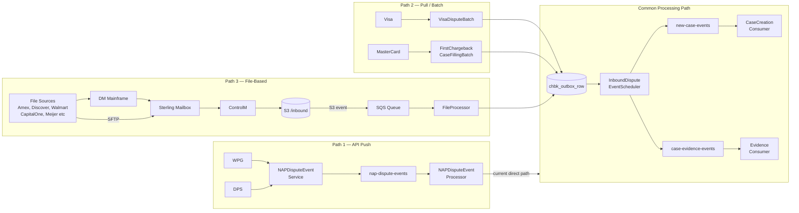

### 5.1 NAP/WPG Path (Current)

The NAP inbound path handles real-time dispute events from the NAP acquiring platform. It is a direct event-driven integration that currently operates independently of the common file-based inbound path.

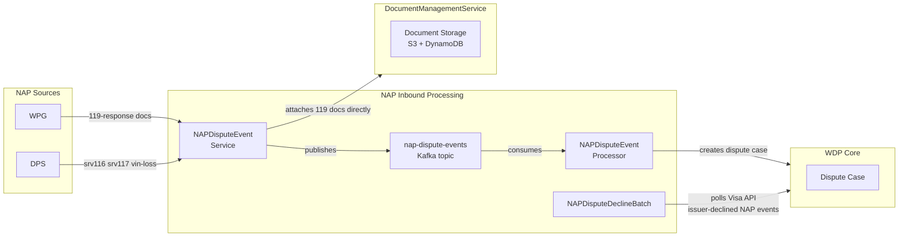

**NAPDisputeEventService** receives events from two NAP sources and handles them differently:

From **NAP-DPS:**
- **srv 116** — new dispute events for migrated merchants
- **srv 117** — dispute update events for non-migrated merchants still on CB911 portal, sent to WDP for data consistency
- **vin-loss** — vin-loss events for non-migrated merchants, sent to WDP for data consistency

These events are published to the `nap-dispute-events` Kafka topic for processing by NAPDisputeEventProcessor.

From **WPG:**
- **119-response documents** — response documents sent by WPG are attached directly to dispute cases via DocumentManagementService. They do not go through the Kafka topic.

**NAP CB911 Migration Context:** WDP is currently migrating NAP dispute events from the legacy CB911 portal to WDP. During this migration, srv 117 and vin-loss events from non-migrated merchants are sent to WDP to ensure data consistency and a seamless merchant experience once fully migrated.

**NAPDisputeEventProcessor** consumes from the `nap-dispute-events` topic and processes NAP dispute events directly into WDP Core. NAP dispute data does not contain a full PAN, so no EncryptionService call is made during NAP dispute processing.

**NAPDisputeDeclineBatch** is a special case specific to NAP disputes. It polls the Visa API to fetch issuer-declined dispute events for NAP disputes and surfaces them to merchants through WDP Core.

⚠️ **PLANNED WORK** — The NAP inbound path will be migrated to the common inbound processing path. NAPDisputeEventProcessor will be updated to write to `chbk_outbox_row`, allowing CaseCreationConsumer to handle NAP case creation uniformly alongside all other acquiring platforms.

⚠️ **COMP-04 enrichment chain — alternative, not sequential.** The chain is:
- CaseManagement is tried first
- FraudSwitch only runs when CaseManagement returns null
- DisplayCodeService only runs on the GUARPAY1 / GUARPAY4 + fraudIndemnified branch

Bypass condition (`enrichment_failure=true OR function_code=603`) is honoured **only on POST `/event`**. Case-update and outcome paths do not pass through `EventBusinessValidator.validateRequest`. The `enrichmentFailure` field on the outbound `NapEvent` is a **pass-through copy** of the inbound flag — COMP-04 never sets it itself.

⚠️ **NAP path has TWO REST surfaces for manual operator reprocessing:**
- **COMP-05 NAPDisputeEventProcessor** — JWT-authenticated `POST /event` for inbound NAP error reprocessing (Ops mode access path).
- **COMP-39 NAPOutcomeProcessor** — JWT-authenticated `POST /event` for outbound NAP error reprocessing.

Both endpoints drive the same business pipeline as the Kafka path with **no per-record locking**. A manual reprocess POST and a Kafka prior-error scan can race on the same record. See ADR-CAND-037.

🔴 **MATERIAL DEFICIENCY — CVV-at-rest in NAP path.** PCI-DSS 3.2.1 deficiency:
- **COMP-04** logs CVV via Lombok-generated `NapEvent.toString()` at INFO before Kafka publish.
- **COMP-05** persists CVV at rest in `NAP.DISPUTE_EVENT_CONSUMER_ERROR.C_CVV` and inside `C_KAFKA_EVENT` raw JSON.

Together these constitute a CVV-on-disk path. Architect decision required (remediate or document approved exception). See WDP-NFRS.md RISK-084 / WDP-DECISIONS.md ADR-CAND-023 / WDP-INTEGRATIONS.md §2.4.

🔴 **Cross-component shared error-table consumption hazard.** `NAP.DISPUTE_EVENT_CONSUMER_ERROR` has **four writers**: COMP-05 (primary), COMP-23 (NAP create path blind-merge), COMP-24 (NAP conditional outbox), COMP-39 (outbound NAP write). Discriminator: `C_ACQ_PLATFORM` + `C_EVENT_TYPE`. Both COMP-05 and COMP-39 prior-error scans query without `C_EVENT_TYPE` filter — rows written by either consumer (plus COMP-23 / COMP-24) may be reprocessed through the wrong outbound pipeline. See RISK-085 / ADR-CAND-024.

### 5.2 Card Network Batch Path

WDP polls Visa and MasterCard APIs directly using scheduled batch jobs to retrieve dispute events. This is the primary inbound integration with these two card networks for API-capable network connectivity.

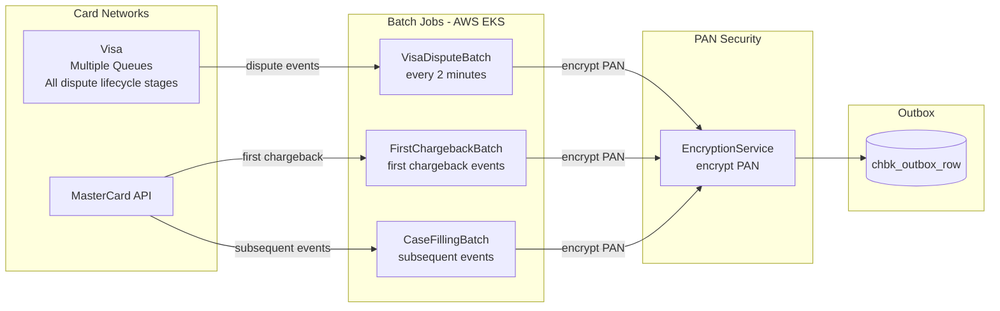

**VisaDisputeBatch** runs every 2 minutes and polls multiple Visa queues to fetch dispute events across all stages of the Visa dispute lifecycle. Each Visa queue corresponds to a different stage of the dispute cycle. Fetched events are written to `chbk_outbox_row` for downstream processing.

⚠️ Visa queue details and dispute stage mapping are deferred to component-level documentation.

**FirstChargebackBatch** polls the MasterCard API to fetch first chargeback events — the initial dispute filing from MasterCard. Fetched events are written to `chbk_outbox_row`.

**CaseFillingBatch** polls the MasterCard API to fetch subsequent dispute events — updates and progressions that occur after the first chargeback is filed. Fetched events are written to `chbk_outbox_row`.

⚠️ Schedule details and further specifics for FirstChargebackBatch and CaseFillingBatch are deferred to component-level documentation.

**PAN Encryption:** All card network batch jobs make an EncryptionService API call to encrypt PAN before writing to `chbk_outbox_row`.

### 5.3 File-Based Inbound Path

The file-based inbound path handles dispute events, evidence documents, and issuer documents arriving from multiple sources through a combination of on-premise file infrastructure and AWS services.

#### 5.3.1 File Transfer Infrastructure

All file-based inbound traffic flows through a shared on-premise file infrastructure before reaching AWS. Sterling Mailbox is the universal aggregation point — all inbound files arrive at Sterling regardless of transport mechanism.

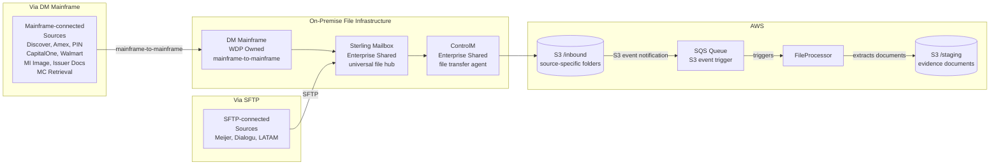

**DM Mainframe** is the on-premise mainframe system that provides direct mainframe-to-mainframe connectivity with external systems. It acts as the file exchange gateway for all mainframe-connected sources, both receiving files inbound and sending files outbound. It exchanges files with Sterling Mailbox in both directions.

**Sterling Mailbox** is the universal on-premise file aggregation hub. All inbound files arrive at Sterling regardless of transport mechanism — whether via DM Mainframe or direct SFTP. Sterling is the single point from which ControlM collects files for transfer to AWS S3.

**ControlM** is the on-premise file transfer agent that bridges the on-premise file infrastructure and AWS S3. It transfers files from Sterling Mailbox to source-specific folders in the S3 `/inbound` bucket and from target-specific folders in the S3 `/outbound` bucket back to Sterling Mailbox for outbound delivery.

**S3 /inbound** is the AWS landing zone for all inbound files. Every inbound source has its own dedicated folder under `/inbound`. When a file arrives in the S3 `/inbound` bucket, S3 generates an event notification delivered to the SQS Queue, triggering FileProcessor.

**S3 /staging** is the AWS storage location where FileProcessor extracts and stores evidence and issuer documents from inbound files. FileProcessor writes the S3 staging path to the `file_evidence` table for downstream processing.

**SQS Queue** receives S3 event notifications when files land in the S3 `/inbound` bucket. FileProcessor listens to this queue and is triggered to begin processing each arriving file.

#### 5.3.2 Inbound Sources via DM Mainframe → Sterling → ControlM → S3

The following sources transmit files to WDP via mainframe-to-mainframe connectivity to DM Mainframe:

| Source | File Content |
|---|---|
| MI Image Extractor | Merchant images |
| IssuerDocumentFile (MAP incoming) | Issuer documents |
| MasterCard Retrieval/Rejects | MasterCard retrieval and reject events |
| Discover / DiscoverHybrid | Dispute events |
| Amex / AmexHybrid | Dispute events |
| PIN Networks (NYCE) | PIN network dispute events |
| CapitalOne (BJs) | Dispute events and response evidence |
| Walmart (PIN/SIGNATURE) | Response evidence for PIN and SIGNATURE networks |

⚠️ File content details to be confirmed and updated per source during component-level documentation.

#### 5.3.3 Inbound Sources via SFTP → Sterling → ControlM → S3

The following sources transmit files to WDP via SFTP directly to Sterling Mailbox:

| Source | File Content |
|---|---|
| Meijer | Response evidence |
| Dialogu Merchant Notifications | Merchant notifications for PIN and SIGNATURE networks |
| LATAM | Dispute events from LATAM acquiring platform |

⚠️ File content details to be confirmed and updated per source during component-level documentation.

#### 5.3.4 FileProcessor

FileProcessor is the core inbound file processing component. It listens to the SQS Queue and processes each file that lands in the S3 `/inbound` bucket.

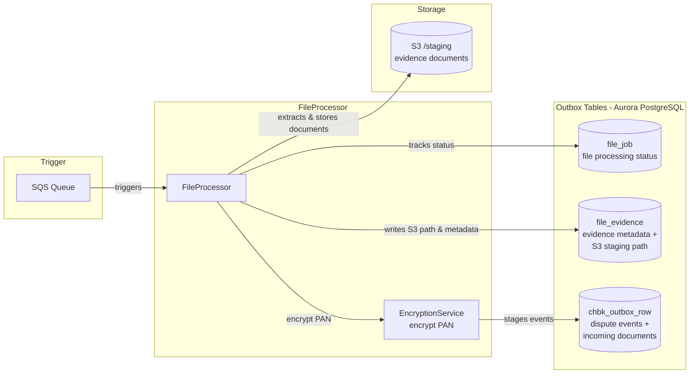

FileProcessor performs the following on each inbound file:
- Creates a `file_job` record to track the overall file processing status
- Parses the file to identify its content type — dispute events, evidence documents, issuer documents, or a combination
- Extracts evidence and issuer documents from the file and stores them in S3 `/staging`
- Writes document metadata and S3 staging path to `file_evidence`
- Calls EncryptionService to encrypt PAN before writing to `chbk_outbox_row`
- Stages dispute events and incoming document data in `chbk_outbox_row` for downstream event-driven processing

**PAN Encryption note:** FileProcessor makes an EncryptionService API call to encrypt PAN before writing to `chbk_outbox_row`. This enforces the PAN security boundary at the earliest possible point in the inbound path.

#### 5.3.5 Outbox Tables

Three database tables in Aurora PostgreSQL form the file processing state machine:

**file_job** tracks the overall processing status of each inbound file. It is the file-level ledger — one record per file, recording whether the file has been received, is in processing, completed, or failed.

**file_evidence** stores evidence document metadata for each document extracted from an inbound file. It holds the reference to the document's location in S3 `/staging`, allowing downstream consumers to retrieve the document for attachment to a dispute case.

**chbk_outbox_row** is the central outbox table that stages dispute events and incoming document data for downstream event-driven processing via Kafka. It is the handoff point between the file-based inbound world and WDP's internal event-driven architecture. All inbound paths — NAP (planned), card network batches, and file-based — converge here.

#### 5.3.6 InboundDisputeEventScheduler

InboundDisputeEventScheduler polls `chbk_outbox_row` every 2 minutes and publishes eligible rows to the appropriate Kafka topics for downstream processing.

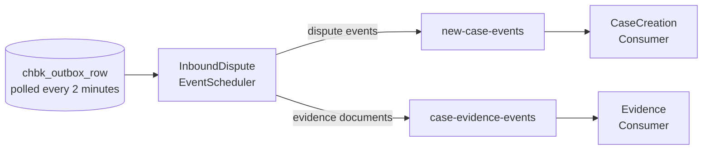

It publishes to two topics:
- **`new-case-events`** — for dispute events that require case creation
- **`case-evidence-events`** — for evidence documents that need to be attached to existing cases

#### 5.3.7 FileAcknowledgementProcessor

FileAcknowledgementProcessor handles both inbound ACK processing and outbound ACK file generation. It currently generates acknowledgement files for the following sources and places them in source-specific folders in S3 `/outbound` for ControlM to transfer to Sterling:

- Meijer — ACK file
- Walmart — ACK file
- CapitalOne — ACK file

⚠️ **SECTION PENDING — File Content Classification & ACK Rules**

A dedicated section is required to document:
- Which inbound sources require acknowledgement files and which do not
- Files containing dispute events only
- Files containing merchant response documents only
- Files containing issuer documents only
- Files containing both dispute events and issuer documents
- Discover vs DiscoverHybrid file processing differences
- Amex vs AmexHybrid file processing differences
- S3 folder key structure and naming conventions per source and target

⚠️ **FOLLOW-UP REQUIRED — File-only network issuer documents:**
Confirm whether file-only networks (Discover, Amex, PIN Networks etc.) send issuer documents in separate files via the DM Mainframe path. Document which networks send issuer documents and in what format.

⚠️ **FOLLOW-UP REQUIRED — Visa & MasterCard issuer document retrieval:**
WDP makes direct API calls to Visa and MasterCard to retrieve issuer documents. Confirm at which processing stage this occurs (CaseCreationConsumer or BusinessRulesProcessor) and which component makes the API call.


---

## 6. Kafka Event Bus

WDP uses Apache Kafka, managed via AWS MSK, as the backbone for all asynchronous communication between components. All high-volume, cross-component communication flows through Kafka.

### 6.1 Architecture & Design Principles

**Event-driven by default.** Every significant state change in WDP produces a Kafka event. Components react to events rather than polling each other or making synchronous calls for high-volume flows.

**Transactional outbox pattern.** No component publishes directly to Kafka from within a business transaction. Events are first written to the outbox tables in the same database transaction as the business data change. The InboundDisputeEventScheduler then reads eligible rows and publishes to Kafka. This guarantees events are never lost due to a crash between a business write and a Kafka publish.

**Merchant-scoped partitioning.** All dispute-related topics are partitioned by `merchant_id`. This ensures all events for a given merchant are processed in order by the same consumer instance, maintaining event ordering without distributed coordination. It also provides natural merchant isolation — a processing failure for one merchant does not affect others.

**At-least-once delivery.** Kafka offsets are committed manually only after full processing of a message is complete. This guarantees at-least-once delivery — if a consumer crashes mid-processing, the message is redelivered. All consumers are designed to be idempotent to handle redelivery safely.

**Error handling via outbox tables.** Each consumer maintains its own outbox table to track processing state, idempotency keys, and error conditions. This ensures no event is silently lost and all error states are recoverable and auditable.

⚠️ Per-consumer outbox table details deferred to component-level documentation.

### 6.2 Topic Registry

The following diagram shows all topics, their publishers, and their consumers:

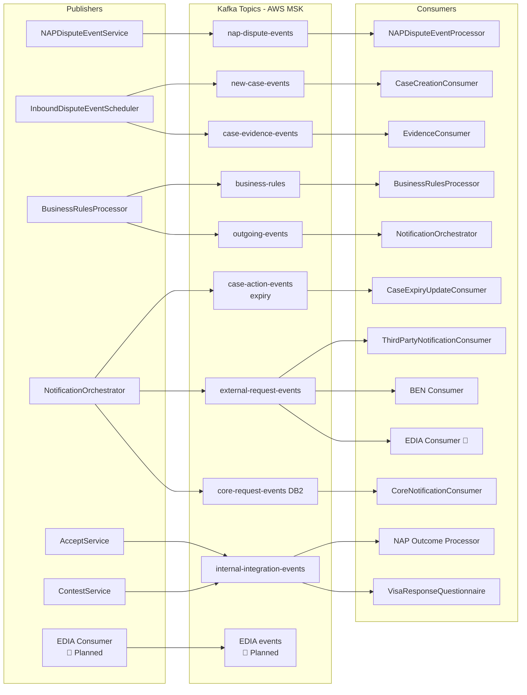

#### Inbound Topics

**`nap-dispute-events`**
Carries dispute events received from the NAP acquiring platform via WPG and DPS. Published by NAPDisputeEventService. Consumed by NAPDisputeEventProcessor.

| Attribute | Value |
|---|---|
| Publisher | NAPDisputeEventService |
| Consumer | NAPDisputeEventProcessor |
| Partition key | merchant_id |
| Purpose | NAP real-time dispute event ingestion |

**`new-case-events`**
Carries dispute events that require case creation in WDP. Published by InboundDisputeEventScheduler from `chbk_outbox_row`. Consumed by CaseCreationConsumer.

| Attribute | Value |
|---|---|
| Publisher | InboundDisputeEventScheduler |
| Consumer | CaseCreationConsumer |
| Partition key | merchant_id |
| Purpose | Dispute case creation |

**`case-evidence-events`**
Carries evidence document events for attachment to existing dispute cases. Published by InboundDisputeEventScheduler from `chbk_outbox_row`. Consumed by EvidenceConsumer.

| Attribute | Value |
|---|---|
| Publisher | InboundDisputeEventScheduler |
| Consumer | EvidenceConsumer |
| Partition key | merchant_id |
| Purpose | Evidence document attachment to dispute cases |

#### Internal Processing Topics

**`business-rules`**
Carries dispute events that require business rule evaluation and enrichment. Consumed by BusinessRulesProcessor which applies configured business rules and publishes results to `outgoing-events`.

| Attribute | Value |
|---|---|
| Publishers | COMP-12 Scheduler4, COMP-15, COMP-23, COMP-24, COMP-25, COMP-37 (six confirmed) |
| Consumer | BusinessRulesProcessor |
| Partition key | merchant_id |
| Purpose | Async business rule execution on dispute events |

**`case-action-events (expiry)`**
Carries case expiry events. Consumed by CaseExpiryUpdateConsumer which updates case expiry status in WDP Core.

| Attribute | Value |
|---|---|
| Publisher | NotificationOrchestrator |
| Consumer | CaseExpiryUpdateConsumer |
| Partition key | Pass-through `RECEIVED_KEY` from upstream COMP-18 (consumer-side variable name `caseNumber`). See WDP-DECISIONS.md DEC-003 deviation map. |
| Purpose | Case expiry lifecycle management |

#### Outbound Topics

**`outgoing-events`**
Carries processed dispute events ready for outbound routing. Published by BusinessRulesProcessor after applying business rules. Consumed by NotificationOrchestrator which routes events to appropriate outbound topics.

| Attribute | Value |
|---|---|
| Publisher | BusinessRulesProcessor |
| Consumer | NotificationOrchestrator |
| Partition key | merchant_id |
| Purpose | Outbound event routing hub |

**`internal-integration-events`**
Carries two categories of events requiring outbound network integration. Published exclusively by AcceptService and ContestService — not by NotificationOrchestrator.

| Event Category | Publisher | Consumer |
|---|---|---|
| NAP dispute accept events (all networks) | AcceptService | NAP Outcome Processor |
| NAP dispute contest events (all networks) | ContestService | NAP Outcome Processor |
| Visa dispute contest events (all acquiring platforms) | ContestService | VisaResponseQuestionnaire |

| Attribute | Value |
|---|---|
| Partition key | merchant_id |
| Purpose | Card network and NAP-DPS outbound integration |

**`external-request-events`**
Carries outbound notification events destined for external third-party systems and acquiring platforms via EDIA. Published by NotificationOrchestrator.

| Attribute | Value |
|---|---|
| Publisher | NotificationOrchestrator |
| Consumers | ThirdPartyNotificationConsumer, BEN Consumer, EDIA Consumer 🔴 Planned |
| Partition key | merchant_id |
| Purpose | External notification and EDIA integration |

**`core-request-events (DB2)`**
Carries dispute outcome events destined for the CORE acquiring platform. Published by NotificationOrchestrator. Consumed by CoreNotificationConsumer.

| Attribute | Value |
|---|---|
| Publisher | NotificationOrchestrator |
| Consumer | CoreNotificationConsumer |
| Partition key | merchant_id |
| Purpose | CORE acquiring platform money movement notification |

#### Planned Topics

**`EDIA events`** 🔴 Planned
Will carry dispute outcome events in EDIA enterprise format for consumption by NAP, LATAM, and VAP acquiring platforms. Published by EDIA Consumer after converting from WDP internal format.

| Attribute | Value |
|---|---|
| Publisher | EDIA Consumer (WDP owned) 🔴 Planned |
| Consumers | NAP, LATAM, VAP via EDIA platform 🔴 Planned |
| Partition key | TBD |
| Purpose | Enterprise acquiring platform integration via EDIA |

### 6.3 Consumer Group Map

| Topic | Consumer Group | Component |
|---|---|---|
| `nap-dispute-events` | nap-dispute-event-processor-group | NAPDisputeEventProcessor |
| `new-case-events` | case-creation-consumer-group | CaseCreationConsumer |
| `case-evidence-events` | evidence-consumer-group | EvidenceConsumer |
| `business-rules` | business-rules-processor-group | BusinessRulesProcessor |
| `case-action-events` | case-expiry-update-consumer-group | CaseExpiryUpdateConsumer |
| `outgoing-events` | notification-orchestrator-group | NotificationOrchestrator |
| `internal-integration-events` | nap-outcome-processor-group | NAP Outcome Processor |
| `internal-integration-events` | visa-response-questionnaire-group | VisaResponseQuestionnaire |
| `external-request-events` | third-party-notification-consumer-group | ThirdPartyNotificationConsumer |
| `external-request-events` | ben-consumer-group | BEN Consumer |
| `external-request-events` | edia-consumer-group | EDIA Consumer 🔴 Planned |
| `core-request-events` | core-notification-consumer-group | CoreNotificationConsumer |


⚠️ **`wdp.outgoing_event_outbox` 5-channel shared outbox** — see §4.8. Channels: EXPIRY_EVENTS (COMP-17), GP_EVENTS (COMP-41), BEN_EVENTS (COMP-42), CORE_EVENTS (COMP-43), EXPIRY_BATCH (COMP-51, terminal-write-only). See WDP-DECISIONS.md DEC-002 refinement.

⚠️ **COMP-04 partition-key per-endpoint variation:** `merchantId` on case-update and outcome paths; `cardAcceptorCodeId` on POST `/event` (new-dispute path) only. See WDP-DECISIONS.md DEC-003 deviation map.

⚠️ **CommonErrorHandler list — 11 components.** Empty anonymous `CommonErrorHandler{}` registered platform-wide on multiple consumers. Combined with `ErrorHandlingDeserializer` and pre-ACK, deserialisation exceptions are silently swallowed. Confirmed on: COMP-05, 14, 15, 16, 17, 18, 39, 40, 41, 42, 43. See WDP-NFRS.md RISK-025 and WDP-DECISIONS.md ADR-CAND-003.

⚠️ **COMP-22 DisputeService is NOT a Kafka producer at runtime.** Wired but commented out (commit `c29018cd`, 2025-08-08). No in-source rationale.

---

## 7. Event Consumers

Event consumers are WDP-owned components that listen to Kafka topics and drive the core processing pipeline. All consumers run on the same AWS EKS cluster as WDP Core Services. Each consumer maintains its own outbox table for idempotency and error handling.

### 7.1 Inbound Consumers

#### CaseCreationConsumer

CaseCreationConsumer is the primary case creation component for all non-NAP dispute events. It consumes from the `new-case-events` topic and is responsible for enriching dispute events with merchant and transaction data before creating dispute cases in WDP Core.

**Enrichment by acquiring platform:**

| Acquiring Platform | Enrichment Approach |
|---|---|
| CORE | Calls MerchantTransactionService |
| LATAM | Calls LATAM platform API directly |
| VAP | Calls VAP platform API directly |
| PIN | ⚠️ Confirmed present in codebase (sourceSystem = PIN accepted) but enrichment path not fully documented. Architect decision required — does PIN follow MerchantTransactionService path (same as CORE) or a distinct path? See WDP-COMP-14 open questions. |
| NAP | Not processed by CaseCreationConsumer by design — handled by NAPDisputeEventProcessor (current path). ⚠️ No code guard prevents NAP events from arriving and being processed — confirmed gap. |

**PAN handling during case creation:**
- Calls EncryptionService to decrypt EPAN transiently for acquiring platform API enrichment calls
- Clear PAN exists in memory only during the API call — never persisted
- Stores HPAN in the case table
- EPAN → HPAN mapping maintained by EncryptionService

#### EvidenceConsumer

EvidenceConsumer consumes from the `case-evidence-events` topic and attaches evidence documents to existing dispute cases.

Processing flow:
1. Consumes evidence event containing S3 staging path reference
2. Retrieves document directly from S3 `/staging` using path from event
3. Calls DocumentManagementService to store document in S3 and metadata in DynamoDB

#### NAPDisputeEventProcessor

NAPDisputeEventProcessor consumes from the `nap-dispute-events` topic and processes NAP dispute events directly into WDP Core. It processes three event types from NAP-DPS:

| Event Type | Description | Merchant Scope |
|---|---|---|
| srv 116 | New dispute events | Migrated merchants |
| srv 117 | Dispute update events | Non-migrated merchants (CB911) |
| vin-loss | Vin-loss events | Non-migrated merchants (CB911) |

NAP dispute data does not contain a full PAN — no EncryptionService call is made.

⚠️ **PLANNED WORK** — NAPDisputeEventProcessor to be updated to write to `chbk_outbox_row`, migrating NAP disputes to the common CaseCreationConsumer path.

### 7.2 Processing Consumers

#### BusinessRulesProcessor

BusinessRulesProcessor consumes from the `business-rules` topic and applies configured business rules to dispute events. It is the execution engine for business rules — distinct from BusinessRulesService which manages rule definitions via the UI.

- Makes direct DB calls to retrieve applicable rules from the dispute rules database
- Does not call BusinessRulesService
- After applying rules, publishes processed event to `outgoing-events`

⚠️ Publisher of `business-rules` topic to be confirmed at component-level documentation.

#### CaseExpiryUpdateConsumer

CaseExpiryUpdateConsumer consumes from the `case-action-events (expiry)` topic and updates case expiry status in WDP Core. Updates case expiry status only — no further downstream processing is triggered.


⚠️ **Case Expiry Subsystem.** This is a logical sub-grouping rather than a new layer in the topology:

**Writer half — COMP-17 CaseExpiryUpdateConsumer.** Kafka consumer on `case-action-events`; consumes deadline-update events from COMP-18 NotificationOrchestrator (Filter 1 EXPIRY_EVENT routing) and maintains `wdp.case_expiry` (upsert on event arrival; closure-delete on cancellation).

**Reader half — COMP-51 CaseExpiryProcessor.** Standalone Spring Batch Deployment in `gcp-case-expiry-processor-batch`. Trigger is a Spring `@Scheduled` cron (NOT a Kubernetes CronJob). Scans `wdp.case_expiry` for past-due rows; calls 7 distinct upstream services (IDP, Case Action, Case Management, Expiry Rules, Update Action, Accept, Add Action). Hand-rolled retry mechanism via `wdp.case_expiry.i_retry_count` (max 3); after exhaustion, writes a row to `wdp.outgoing_event_outbox` with `channel_type=EXPIRY_BATCH`, `created_by=WCSEEXPB`, `status=ERROR` direct.

⚠️ **Two architectural risks in the subsystem:**
- **Shared-write race on `wdp.case_expiry`** — COMP-17 and COMP-51 share the table with no row-level lock, no version column, no SELECT FOR UPDATE. See ADR-CAND-027.
- **EXPIRY_BATCH outbox is terminal-write-only** — COMP-12 Scheduler3 reads only FAILED and PENDING_DEFERRED, so COMP-51's `status=ERROR` rows have **no platform consumer**. See ADR-CAND-026.

### 7.3 Outbound Integration Consumers

#### NotificationOrchestrator

NotificationOrchestrator is the central outbound routing component. It consumes from `outgoing-events` and routes each event to the appropriate outbound Kafka topic based on business logic defined in code. There is no merchant configuration table — routing logic is code-defined.

NotificationOrchestrator publishes to:
- **`external-request-events`** — for third-party notifications, BEN, and EDIA acquiring platform events
- **`core-request-events`** — for CORE acquiring platform money movement notifications
- **`case-action-events (expiry)`** — for case expiry lifecycle events
- **`wdp.file_generation_event` DB table** — for file-based outbound notifications

NotificationOrchestrator does **not** publish to `internal-integration-events` — that topic is published exclusively by AcceptService and ContestService.

⚠️ Further routing logic details deferred to component-level documentation.

#### NAP Outcome Processor

NAP Outcome Processor consumes from `internal-integration-events` and delivers dispute outcomes to the NAP-DPS system for NAP acquiring platform money movement.

Processes two event categories:
- NAP dispute accept events (all networks) — published by AcceptService
- NAP dispute contest events (all networks) — published by ContestService

Makes a direct API call to NAP-DPS to deliver the dispute outcome.

⚠️ **PLANNED WORK** — NAP Outcome Processor direct API path to NAP-DPS will be migrated to the EDIA route.

#### VisaResponseQuestionnaire

VisaResponseQuestionnaire consumes from `internal-integration-events` and retrieves the Visa questionnaire submitted as part of a merchant contest, attaching it as a document to the dispute case.

- Triggered by Visa dispute contest events published by ContestService (all acquiring platforms)
- Calls Visa API to retrieve the questionnaire
- Calls DocumentManagementService to store questionnaire document in S3 and metadata in DynamoDB


⚠️ **Manual reprocess REST endpoint surface.** COMP-39 hosts JWT-authenticated `POST /event` for manual NAP outbound error reprocessing (Ops mode access path). The manual reprocessing surface is hosted by **COMP-39, not COMP-05**. See §5.1 for the COMP-05 inbound reprocess sibling.

⚠️ **NAP-DPS authentication gap (RISK-179).** COMP-39 sets no Authorization header on outbound NAP-DPS calls; no client certificate is loaded. `napcacrt.jks` is an unreferenced orphan in the COMP-39 repo. Authentication is handled outside the component at Ingress / service mesh / network layer — pending team confirmation.

⚠️ **COMP-39 sole `@KafkaListener` on `internal-integration-events`.** Therefore COMP-39 is **NOT** the consumer of COMP-24's `${kafka.topic}` ActionEvent topic; that consumer remains unidentified.

### 7.4 Notification Consumers

#### ThirdPartyNotificationConsumer

Consumes from `external-request-events` and delivers dispute events to third-party fraud and intelligence systems via REST API.

| Target | Protocol | Status | Callback |
|---|---|---|---|
| SignifyD | REST API | ✅ Production | Calls ChargebackService for dispute details and actions |
| JustAI (outbound) | REST API | 🔴 Planned — not in COMP-41 codebase | Will call ChargebackService for dispute details (when implemented) |

⚠️ **JustAI scope.** JustAI is **planned only for outbound notification in COMP-41** — no JustAI reference exists in the COMP-41 codebase. Spring Retry imports are present but dead. JustAI **is active for inbound partner identification in COMP-21** ChargebackService — partners are identified at auth time via the JWT `entitlement_params` consumer name (`SIGNIFYD`, `JUSTTAI`).

#### BEN Consumer

Consumes from `external-request-events` and **publishes dispute lifecycle notifications to a BEN-owned AWS MSK Kafka cluster** (separate from WDP's MSK, with its own SASL/JAAS credentials). Merchants enrolled in BEN receive notifications via BEN and call back ChargebackService (COMP-21) to get dispute case details and act on disputes.

⚠️ **BEN delivery mechanism.** BEN notification is delivered via Kafka publish to a BEN-owned MSK cluster — not REST or webhook. WDP has no visibility into BEN cluster health.

#### EDIA Consumer 🔴 Planned

WDP-owned consumer that will consume from `external-request-events` and convert WDP internal dispute events into the enterprise-defined EDIA format before publishing to the EDIA platform's Kafka topic.

Acts as an **anti-corruption layer** — WDP internal event format is fully decoupled from the EDIA enterprise format. WDP owns the translation responsibility.

Acquiring platforms that will consume via EDIA:
- NAP 🔴 Planned
- LATAM 🔴 Planned
- VAP 🔴 Planned

#### CoreNotificationConsumer

Consumes from `core-request-events (DB2)` and delivers dispute outcome notifications to the CORE acquiring platform via DB2. CORE is a WDP-owned acquiring platform with a direct connection, currently bypassing EDIA.

⚠️ **Future consideration** — CORE's direct DB2 connection may be migrated to the EDIA route as EDIA adoption matures.


⚠️ **BEN Consumer (COMP-42) refinements:**
- Confirmed **fourth writer of `wdp.outgoing_event_outbox`** (`channel_type=BEN_EVENTS`, `created_by=WBENC`).
- BEN Product REST API is a companion contract alongside the BEN MSK Kafka publish — `Bearer ${ben_product_license}` static license-key auth, Spring Retry 3 × 1000ms, no timeout. See WDP-INTEGRATIONS.md §4.3.
- Outbound BEN partition key is `merchantId` from `CaseSearchResponse` — DEC-003 compliant.
- PUBLISHED-orphan crash window Step 4 → Step 13 — same class as RISK-040 (COMP-41 Signifyd). See RISK-192.

---

## 8. Outbound Processing

WDP delivers dispute outcomes and events to external systems through three distinct outbound paths: direct card network API calls, notification delivery to external systems, and file-based outbound to acquiring platforms and merchants.

### 8.1 Card Network Direct API Calls

AcceptService and ContestService make direct synchronous API calls to Visa and MasterCard when a merchant accepts or contests a dispute.

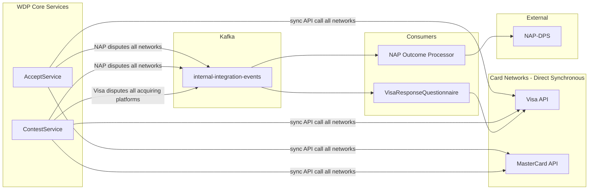

**AcceptService publishes to `internal-integration-events`:**
- NAP dispute accept events across all networks — consumed by NAP Outcome Processor to notify NAP-DPS

**ContestService publishes to `internal-integration-events`:**
- NAP dispute contest events across all networks — consumed by NAP Outcome Processor to notify NAP-DPS
- Visa dispute contest events across all acquiring platforms — consumed by VisaResponseQuestionnaire

⚠️ **AMEX / DISCOVER and MC CHI silent no-op note:**

The Section 8.1 diagram shows AMEX and DISCOVER as Visa/MC siblings, but in practice **AcceptService has no implementation path for either network** — both fall through to `log.warn` with no card-network call. Similarly, **MC CHI on both NAP and PIN platforms** is a silent no-op in `MasterCardServiceImpl.accept` (only PAB and ARB invoke an MCM call).

**🔴 NAP-publish split-brain consequence:** On NAP, when the inbound `actionCode` is eligible by the Step 8 Kafka-gate criteria (`FCHG/IPAB/IARB/IDCL`), AcceptService still publishes `AcceptEvent` to `internal-integration-events` — **even though no card network was actually notified** (silent no-op for MC CHI, AMEX, DISCOVER). NAPOutcomeProcessor consumers must not assume that an `AcceptEvent` implies the network was successfully notified. This is the same severity class as DEC-019 / DEC-020 risk-accepted ADRs. See WDP-NFRS.md RISK-028 and WDP-DECISIONS.md ADR-CAND-001.

For the file-based path that does deliver AMEX and Discover responses, see Section 8.5.

### 8.2 Visa Questionnaire Retrieval Flow

After a merchant successfully contests a Visa dispute, VisaResponseQuestionnaire retrieves the questionnaire submitted as part of the contest and attaches it to the dispute case as a document via DocumentManagementService.

This flow is triggered for all acquiring platforms — whenever any merchant contests a Visa dispute, regardless of acquiring platform.

### 8.3 NAP Outcome Flow

When a dispute belonging to the NAP acquiring platform is accepted or contested, NAP Outcome Processor delivers the dispute outcome to NAP-DPS for money movement processing.

- AcceptService publishes NAP accept events (all networks) to `internal-integration-events`
- ContestService publishes NAP contest events (all networks) to `internal-integration-events`
- NAP Outcome Processor consumes and makes direct API call to NAP-DPS

⚠️ **PLANNED WORK** — to be migrated to EDIA route.

### 8.4 Notification Targets

NotificationOrchestrator consumes from `outgoing-events` and routes dispute lifecycle events to external notification targets based on business logic defined in code.

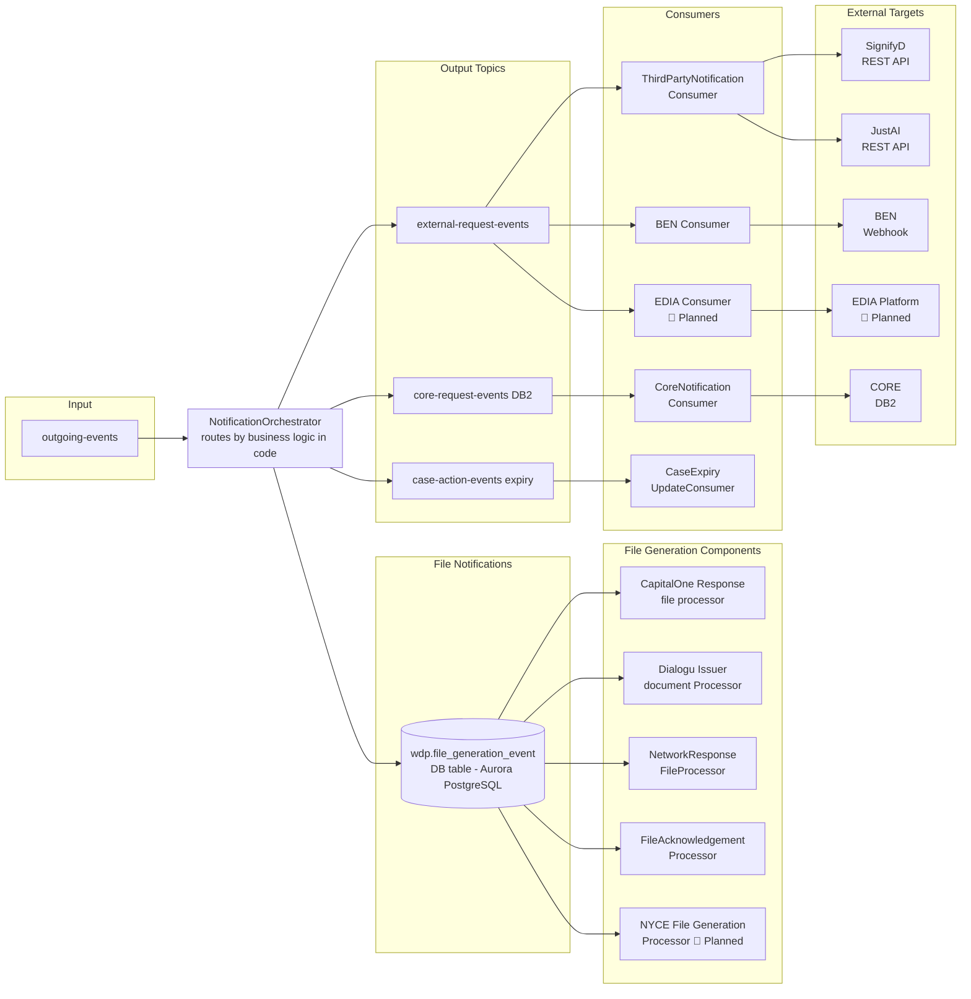

| Target | Consumer | Protocol | Callback |
|---|---|---|---|
| SignifyD | ThirdPartyNotificationConsumer | REST API | Calls ChargebackService |
| JustAI | ThirdPartyNotificationConsumer | REST API | Calls ChargebackService |
| BEN | BEN Consumer | Webhook | Merchants call ChargebackService |
| CORE | CoreNotificationConsumer | DB2 | Direct — WDP owned platform |
| NAP | EDIA Consumer 🔴 Planned | EDIA Kafka | Via EDIA platform |
| LATAM | EDIA Consumer 🔴 Planned | EDIA Kafka | Via EDIA platform |
| VAP | EDIA Consumer 🔴 Planned | EDIA Kafka | Via EDIA platform |

### 8.5 File-Based Outbound

Three file generation components read from the `wdp.file_generation_event` DB table (Aurora PostgreSQL) and generate files placed in target-specific folders in S3 `/outbound` for ControlM to transfer to Sterling Mailbox for onward delivery.

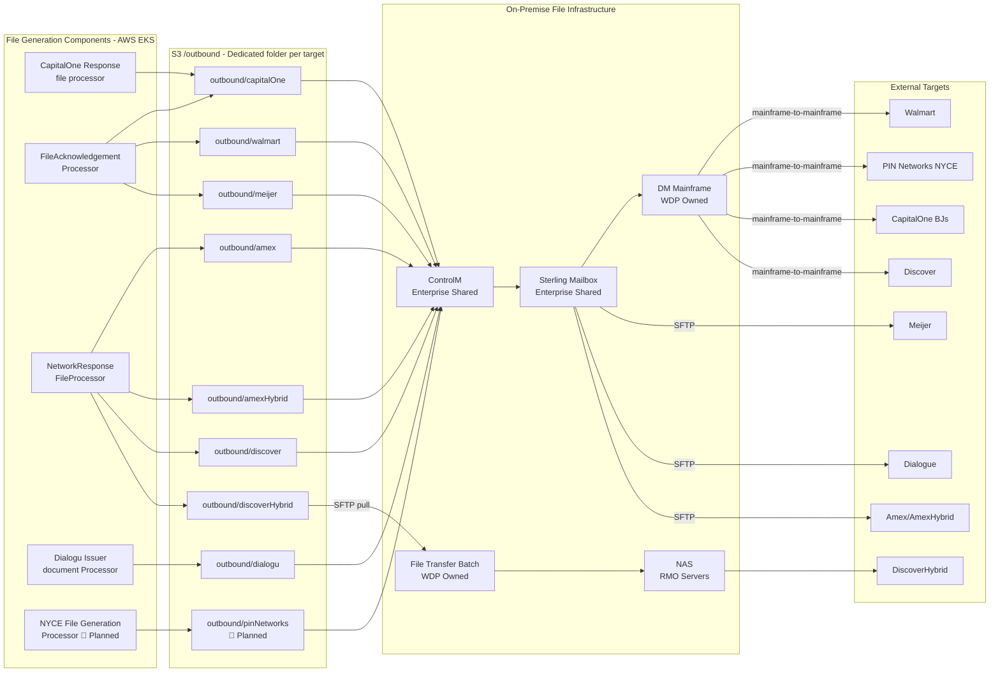

#### 8.5.1 File Generation Components

**CapitalOne Response file processor** generates CapitalOne response files and places them in the CapitalOne-specific folder in S3 `/outbound`.

**FileAcknowledgementProcessor** generates acknowledgement files for multiple targets:
- CapitalOne ACK file → S3 `/outbound/capitalOne/`
- Walmart ACK file → S3 `/outbound/walmart/`
- Meijer ACK file → S3 `/outbound/meijer/`

**NetworkResponseFileProcessor** generates four network response files, each in their own dedicated S3 `/outbound` folder:
- Amex response file → S3 `/outbound/amex/`
- AmexHybrid response file → S3 `/outbound/amexHybrid/`
- Discover response file → S3 `/outbound/discover/`
- DiscoverHybrid response file → S3 `/outbound/discoverHybrid/`

**Dialogu Issuer document Processor** generates a ZIP file containing all issuer documents received by WDP and places it in S3 `/outbound/dialogu/` for delivery to merchants.

**NYCE File Generation Processor** 🔴 Planned — will generate outbound files for PIN Networks (NYCE) and place them in S3 `/outbound/pinNetworks/`.

⚠️ File formats, generation schedules, and content details deferred to component-level documentation.

#### 8.5.2 Outbound Delivery Routes

**Via ControlM → Sterling → DM Mainframe (mainframe-to-mainframe):**

| Target | Files | Generator |
|---|---|---|
| Walmart | ACK file | FileAcknowledgementProcessor |
| PIN Networks (NYCE) | Network file 🔴 Planned | NYCE File Generation Processor |
| CapitalOne (BJs) | Response file + ACK file | CapitalOne Response file processor + FileAcknowledgementProcessor |
| Discover | Network response file | NetworkResponseFileProcessor |

**Via ControlM → Sterling → SFTP:**

| Target | Files | Generator |
|---|---|---|
| Meijer | ACK file | FileAcknowledgementProcessor |
| Dialogue | ZIP of issuer documents | Dialogu Issuer document Processor |
| Amex/AmexHybrid | Network response files | NetworkResponseFileProcessor |

**DiscoverHybrid Special Flow:**

| Target | Files | Generator | Flow |
|---|---|---|---|
| DiscoverHybrid | Network response file | NetworkResponseFileProcessor | On-premise File Transfer Batch pulls via SFTP from S3 `/outbound/discoverHybrid/` → deposits to NAS on RMO servers |


⚠️ **COMP-22 SFG SFTP NAP fallback path.** Distinct from the file-generation outbound path described in §8.5 — used by COMP-22 DisputeService for NAP-platform document delivery when the primary REST upload to DocumentManagementService fails. Fully `@Async` end-to-end; HTTP 200 returned to caller before SFTP write completes. Filename collision risk. See WDP-INTEGRATIONS.md §6.5 / WDP-NFRS.md RISK-133, RISK-134.

---

## 9. Acquiring Platform Integration

Acquiring platforms are the financial platforms that hold merchant accounts and are responsible for money movement when a dispute is resolved. WDP integrates with four acquiring platforms: NAP, CORE, LATAM, and VAP.

### 9.1 Overview

When a dispute is resolved in WDP, the outcome must be communicated back to the acquiring platform so that funds can be settled. The strategic direction is to migrate all acquiring platform integrations to the enterprise EDIA streaming platform over time.

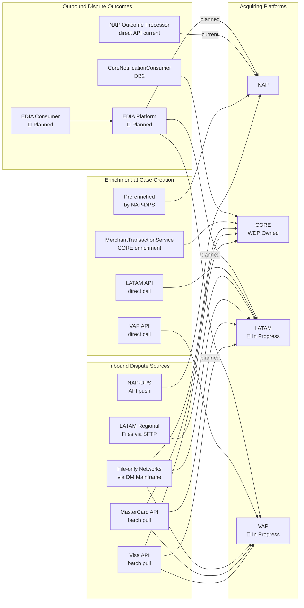

**Acquiring Platform Integration Summary:**

| Platform | Inbound Dispute Source | Enrichment | Outbound Outcome | Status |
|---|---|---|---|---|
| NAP | API Push via WPG/DPS | Pre-enriched by NAP-DPS | NAP Outcome Processor → NAP-DPS direct API | ✅ Current → 🔴 EDIA Planned |
| CORE | Visa, MasterCard + file-only networks | MerchantTransactionService | CoreNotificationConsumer → DB2 | ✅ Current |
| LATAM | Visa, MasterCard + LATAM regional files | Direct API call from CaseCreationConsumer | EDIA Consumer → EDIA platform | 🔴 In progress |
| VAP | Visa, MasterCard + file-only networks | Direct API call from CaseCreationConsumer | EDIA Consumer → EDIA platform | 🔴 In progress |

**Important:** CORE and VAP disputes come directly from Visa and MasterCard via the card network batch path, and from file-only networks via the file-based path. The acquiring platform relationship is for money movement outbound, not for inbound dispute sourcing — except for NAP which pushes disputes directly, and LATAM which additionally sends regional network files.

### 9.2 CORE Platform ✅

CORE is a WDP-owned acquiring platform with a direct integration.

**Inbound:** Disputes arrive from Visa and MasterCard via card network batch path and from file-only networks via the file-based path.

**Enrichment:** CaseCreationConsumer calls MerchantTransactionService to fetch merchant and transaction details from CORE during dispute case creation.

**Outbound:** NotificationOrchestrator publishes to `core-request-events (DB2)`. CoreNotificationConsumer delivers dispute outcomes to CORE via DB2.

⚠️ **Future consideration** — CORE's direct DB2 connection may be migrated to the EDIA route as EDIA adoption matures.

### 9.3 NAP Platform ✅ (Current) → 🔴 EDIA Planned

NAP is the acquiring platform with the most complex integration pattern. It currently has its own dedicated inbound and outbound paths, both planned for migration to common WDP processing paths.

**Inbound — Current:** NAP-DPS pushes pre-enriched dispute events via NAPDisputeEventService. No merchant or transaction enrichment call is needed as NAP-DPS pre-enriches all dispute data.

**Inbound — CB911 Migration:** srv 117 and vin-loss events from non-migrated CB911 merchants are sent to WDP for data consistency during migration.

**Outbound — Current:** AcceptService and ContestService publish NAP dispute outcome events to `internal-integration-events`. NAP Outcome Processor makes direct API call to NAP-DPS.

**NAPDisputeDeclineBatch:** Polls Visa API to fetch issuer-declined NAP dispute events. Specific to NAP disputes only. Surfaces results to merchants via WDP Core.

⚠️ **PLANNED WORK:**
- Inbound: NAPDisputeEventProcessor to write to `chbk_outbox_row` → common CaseCreationConsumer path
- Outbound: NAP Outcome Processor to migrate from direct API to EDIA route
- Goal: NAP processing fully uniform with all other acquiring platforms

⚠️ **PIN/CORE migration filter is operational:** COMP-43 CoreNotificationConsumer is the live consumer of `core-request-events` and uses `migrationStatus = Y` to gate which events it processes — `platform = CORE` events are unconditionally processed; `platform = PIN` events are processed only when `migrationStatus = Y`. Other platforms (NAP, VAP, LATAM) are silently discarded at this consumer. This filter is operational, not aspirational.

### 9.4 LATAM Platform 🔴 In Progress

**Inbound:** Disputes arrive from Visa and MasterCard via card network batch path and additionally from LATAM-specific regional networks via the file-based path (SFTP → Sterling → ControlM → S3).

**Enrichment:** CaseCreationConsumer will call LATAM platform APIs directly to fetch merchant and transaction details.

**Outbound:** LATAM will receive dispute outcome notifications via the EDIA platform.

⚠️ Full integration details to be confirmed and documented at component-level discussion.

### 9.5 VAP Platform 🔴 In Progress

**Inbound:** Disputes arrive from Visa and MasterCard via card network batch path and from file-only networks via the file-based path.

**Enrichment:** CaseCreationConsumer will call VAP platform APIs directly to fetch merchant and transaction details.

**Outbound:** VAP will receive dispute outcome notifications via the EDIA platform.

⚠️ Full integration details to be confirmed and documented at component-level discussion.

### 9.6 EDIA Integration Pattern 🔴 Planned

EDIA is the enterprise-level Kafka streaming platform that is the strategic direction for all system-to-system communication between WDP and external acquiring platforms.

**Key architectural points:**
- **EDIA Consumer is WDP-owned** — WDP owns the translation responsibility from WDP internal format to EDIA enterprise format
- **Anti-corruption layer** — WDP internal event format is fully decoupled from the EDIA enterprise format
- **Enterprise standard** — EDIA format is defined at enterprise level, not by WDP
- **Strategic direction** — all acquiring platform integrations will eventually route through EDIA, including NAP and potentially CORE

Flow:
```
NotificationOrchestrator → external-request-events → EDIA Consumer (WDP owned)
→ converts to EDIA enterprise format → EDIA events topic (EDIA platform)
→ consumed by NAP, LATAM, VAP
```

⚠️ **Discussion point noted:** CORE's direct DB2 connection vs future EDIA migration to be captured as an open architectural decision.

### 9.7 Merchant & Transaction Enrichment per Acquiring Platform

| Acquiring Platform | Enrichment Approach | Component |
|---|---|---|
| CORE | WDP calls MerchantTransactionService | MerchantTransactionService → CORE API |
| LATAM | WDP calls LATAM platform API directly | CaseCreationConsumer → LATAM API |
| VAP | WDP calls VAP platform API directly | CaseCreationConsumer → VAP API |
| NAP | Pre-enriched by NAP-DPS before sending to WDP | No enrichment call needed |


---

## 10. Cross-Cutting Concerns

### 10.1 PAN Encryption & Security Boundary

WDP enforces a strict PAN security boundary across the entire platform. PAN data is never stored in plaintext anywhere in the system.

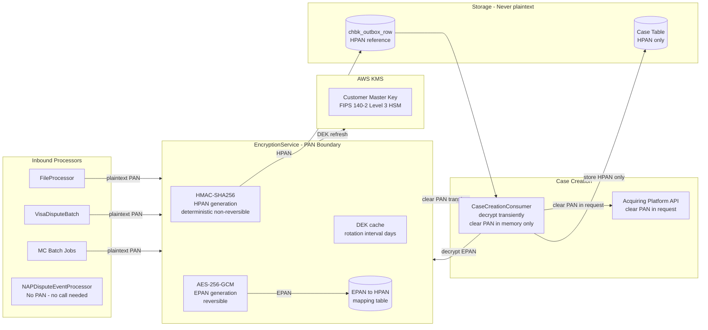

#### PAN Security Boundary Rules

| Rule | Detail |
|---|---|
| Plaintext PAN scope | Only EncryptionService may handle plaintext PAN |
| PAN at rest | Never stored in plaintext anywhere |
| PAN in transit | Never travels in plaintext across any network boundary or Kafka |
| PAN in logs | Never appears in application logs, metrics, or traces |
| PAN in ACK files | ACK files use merchant-provided identifiers, not PAN |
| NAP exception | NAP dispute data does not contain full PAN — no encryption call needed |

#### Two-Token PAN Strategy

WDP uses two tokens generated from every PAN, each serving a different purpose:

**HPAN (Hashed PAN):**
- Generated using HMAC-SHA256 with a secret key
- Deterministic — same PAN always produces same HPAN
- Non-reversible — cannot recover PAN from HPAN
- Used for case lookups and matching
- Stored in the dispute case table

**EPAN (Encrypted PAN):**
- Generated using AES-256-GCM with a rotating Data Encryption Key (DEK)
- Reversible — can recover PAN via EncryptionService
- Used when clear PAN is needed for acquiring platform API calls
- Stored in EPAN → HPAN mapping table
- Never returned directly to callers

#### PAN Lifecycle

**At inbound:** All inbound processors (FileProcessor, VisaDisputeBatch, FirstChargebackBatch, CaseFillingBatch) call EncryptionService to encrypt PAN before writing to `chbk_outbox_row`. Exception: NAPDisputeEventProcessor makes no encryption call as NAP data has no full PAN.

**At case creation:** CaseCreationConsumer decrypts EPAN via EncryptionService transiently in memory only for acquiring platform enrichment API calls. Clear PAN is never persisted. Case table stores HPAN only.

#### Key Management

| Key | Type | Storage | Rotation |
|---|---|---|---|
| Customer Master Key (CMK) | AWS KMS | FIPS 140-2 Level 3 HSM | Every 30 days |
| Data Encryption Key (DEK) | In-memory | EncryptionService cache | Days (configured via `${dek_rotation_interval_days}`) |
| HMAC Key | Secret | AWS Secrets Manager | TBD |

**DEK caching:** EncryptionService caches the DEK in memory; rotation interval is configured via `${dek_rotation_interval_days}` (days, not hours). If AWS KMS is unavailable, EncryptionService can continue operating using the cached DEK for the configured interval before forced failure.

⚠️ Full EncryptionService details deferred to component-level documentation.

⚠️ **Decrypt `@Transactional` brackets KMS network call.** COMP-35 holds a Hikari connection during the KMS round-trip on every decrypt request. Pool-exhaustion risk under sustained decrypt load + KMS slowdown. See RISK-172 / ADR-CAND-035.

⚠️ **Multi-pod DEK rotation race.** No distributed lock; concurrent COMP-35 pods may attempt rotation simultaneously. Source code carries an explicit comment acknowledging this. See RISK-173 / ADR-CAND-036.

🔴 **MATERIAL DEFICIENCY — CVV-at-rest in COMP-04 + COMP-05.** PCI-DSS 3.2.1 Requirement 3.2 prohibits CVV storage after authorisation **regardless of encryption status**. Two confirmed paths:
- **COMP-04** logs CVV via Lombok `NapEvent.toString()` at INFO before Kafka publish.
- **COMP-05** persists CVV at rest in `NAP.DISPUTE_EVENT_CONSUMER_ERROR` (`C_CVV` column AND `C_KAFKA_EVENT` JSON).

Together these constitute a CVV-on-disk path. **Encryption does not make CVV-at-rest compliant.** Architect decision required. See RISK-084 / ADR-CAND-023 / DEC-019 (third confirmed exception class — alongside DEC-019 (1) PostgreSQL clear PAN COMP-23 and DEC-019 (2) DB2 clear PAN COMP-43).

⚠️ **COMP-04 base64 file content in logs.** `UploadDocumentRequest.toString()` (Lombok) surfaces full base64 file content at controller entry. Same family as the CVV finding but distinct subject. See RISK-116 / ADR-CAND-032.

⚠️ **COMP-04 unauthenticated SecurityConfig — `/**` whitelist.** All endpoints unauthenticated at app level; auth relies entirely on Ingress / network controls. See §3.4.

### 10.2 Resilience Patterns

⚠️ **NOTE:** WDP does not implement circuit breakers or fallback mechanisms. DEC-014 (Resilience4j) is formally ⛔ VOID — confirmed absent across all 38 source-verified components. See WDP-DECISIONS.md DEC-014.

⚠️ **Strengthened evidence:** COMP-21 ChargebackService alone has **38 unprotected outbound call sites** across 12 target applications, all on a single shared `RestTemplate` with no pool, no connect timeout, no read timeout, no retry, no circuit breaker. Strongest single-component evidence for the platform-wide DEC-014 void.

If circuit breakers are introduced in a future hardening sprint, a new ADR must be raised.

Resilience in WDP is currently built around three patterns:

**Idempotency & At-Most-Once Delivery:**
- All confirmed Kafka **consumers** use pre-ACK or mid-flow ACK — offset committed BEFORE full processing completes. DEC-005 (at-least-once) is aspirational; the platform-wide pattern is at-most-once. See WDP-DECISIONS.md DEC-005.
- COMP-12 outbox-relay is the inverse pattern: **at-least-once with duplicate-possible** — mark-and-send within `@Transactional`, broker ACK precedes TX commit. Consumer-side `idempotency-key` dedup is the contracted mitigation.
- Per-consumer outbox tables track processing state and idempotency keys
- Deduplication keys at every processing boundary

**Retry & Backoff:**
- Spring Retry (`@Retryable`) is the sole active retry mechanism, present in a subset of components only — typically 3 attempts with fixed delay. Components without `@Retryable` make a single attempt; failure propagates immediately.
- Permanent failures (400, 404, auth failures) are recorded as errors and not retried.

⚠️ **Dead retry imports:** COMP-41 imports `@Retryable`/`@Backoff` but never applies them at runtime. Class names containing "Retry" describe custom try/catch, not the framework.

**Error Tracking via Outbox / Error Tables:**
- Each consumer maintains its own outbox or error table (DEC-016)
- All error states are recoverable and auditable in nominal cases

⚠️ **Orphan-path gaps:** PUBLISHED-status orphan rows on `wdp.outgoing_event_outbox` and `wdp.bre_orchestration_outbox` have no automatic re-drive mechanism — Scheduler3/4 read only FAILED/PENDING_DEFERRED rows. COMP-41 has three distinct PUBLISHED-orphan paths (RISK-040 extends RISK-015); COMP-43 has a silent-loss window between ACK and FAILED-write (RISK-036). Manual operator runbook required pending OQ-COMP41-1.

⚠️ Per-consumer outbox table details deferred to component-level documentation.

⚠️ **Strengthened evidence base.** DEC-014 VOID is confirmed across all 38 source-verified components. Components confirmed: COMP-01 (blocking RestTemplate on Netty event-loop), COMP-02 (bare RestTemplate for IdP and S3), COMP-03 (no JDBC query timeout on either datasource), COMP-04 (3 RestTemplate instances all default-constructor; one shadowed locally), COMP-05, COMP-06, COMP-22 (HikariCP and Tomcat at defaults), COMP-25 (no RestTemplate bean — `new RestTemplate()` per call), COMP-26, COMP-30, COMP-32, COMP-35 (KMS round-trip in `@Transactional`), COMP-39, COMP-42, COMP-51. See WDP-DECISIONS.md DEC-014 evidence list.

⚠️ **Empty `CommonErrorHandler{}` — 11 components.** Confirmed on: COMP-05, 14, 15, 16, 17, 18, 39, 40, 41, 42, 43. Distinct silent-loss class from pre-ACK offset window. See RISK-025 / ADR-CAND-003.

⚠️ **`minReadySeconds` platform-wide misplacement (RISK-083 / ADR-CAND-030).** Ten components confirmed to place `minReadySeconds: 30` under `spec.template.spec` instead of `spec` — silently ignored by Kubernetes. Affected: COMP-03, 05, 08, 09, 12, 25, 26, 28, 34, 40. The intended rolling-update stability gate is not actually applied. Pattern is a copy-paste-class defect — likely replicated across other WDP manifests not yet audited. DevOps remediation pass + manifest-lint rule recommended.

⚠️ **Hand-rolled retry counter persistence pattern.** Multiple components use hand-rolled retry counters persisted to source tables instead of Spring Retry framework. COMP-51 increments `wdp.case_expiry.i_retry_count` (max 3); COMP-07/08/09 use similar patterns on `chbk_outbox_row.retry_count`. Spring Retry on classpath but unused in COMP-51. See ADR-CAND-055.

⚠️ **EXPIRY_BATCH outbox terminal-write-only (RISK-090).** COMP-51 writes `status=ERROR` rows to `wdp.outgoing_event_outbox` with `channel_type=EXPIRY_BATCH`. COMP-12 Scheduler3 reads only FAILED and PENDING_DEFERRED — these rows have no platform consumer. Architect decision required (define consumer or accept as audit-only). See ADR-CAND-026.

### 10.3 Observability

⚠️ **Deferred** — observability tooling, dashboards, and alerting strategy to be documented in a dedicated operational architecture pass. The following is provisional from existing documentation.

Prometheus scrapes all services. Grafana provides operational dashboards. CloudWatch monitors AWS-managed resources. Distributed traces are propagated via a correlation ID header across all synchronous call chains.

⚠️ **`v-correlation-id` propagation gaps confirmed across multiple components:**
- **COMP-01** — always null; `RequestCorrelation.setId()` never called; `ThreadLocal` incompatible with reactive WebFlux threading model.
- **COMP-17** — not propagated on IDP token call (only on case-search call).
- **COMP-22** — not propagated on any outbound REST call. Interceptor places it in MDC for local logs only.
- **COMP-51** — generates a fresh random UUID per outbound REST call (anti-pattern). End-to-end audit trail across the 4–5 calls per record cannot be reconstructed from headers alone.

End-to-end distributed tracing is broken at multiple service boundaries. Platform-wide remediation candidate — see RISK-089 / ADR-CAND-044, ADR-CAND-054.

⚠️ **Kafka-path MDC enrichment gap.** Multiple Kafka consumers have no MDC enrichment (COMP-17, 18, 40, 43, 51). HTTP path uses `HttpInterceptor`; Kafka path has no equivalent. Per-message log correlation depends entirely on OTel agent context. See ADR-CAND-057.

⚠️ **`/actuator/prometheus` JWT-protection widespread.** Confirmed on COMP-21, COMP-25, COMP-29, COMP-35. Scrape-side configuration must carry JWT or platform-wide whitelisting needed. See RISK-140 (COMP-25-specific).

### 10.4 PCI-DSS & Compliance

| Framework | Scope | Status |
|---|---|---|
| PCI-DSS 3.2.1 | Full platform — all cardholder data flows | ✅ Active — ⚠️ **MATERIAL DEFICIENCY:** see RISK-084 (CVV at rest in COMP-05 + CVV in logs in COMP-04). Architect decision pending — see DEC-019 (third confirmed exception) and ADR-CAND-023. |
| SOC 2 Type II | Security, availability, processing integrity | ✅ Active |
| GDPR | Data subject rights, data privacy, right to erasure | ✅ Active |
| CCPA | California resident data rights | ✅ Active |
| SOX | Immutable audit trail for financial communications | ✅ Active |

**Audit & Retention:**

| Data Category | Retention | Storage |
|---|---|---|
| Audit logs | 7 years | Aurora PostgreSQL (2 years) → S3 Glacier |
| ACK snapshots | 7 years | SOX immutability requirement |
| Evidence files | 7 years | S3 with versioning enabled |
| Application logs | 1 year | CloudWatch → S3 after 90 days |
| KMS CloudTrail logs | 7 years | S3 encrypted → Glacier after 1 year |

---

## 11. Deployment Context

### 11.1 AWS Infrastructure

All WDP services and components run on AWS. The following managed services form the core infrastructure:

**AWS EKS (Elastic Kubernetes Service)**
All WDP microservices, event consumers, batch jobs, and file processing components run on a shared AWS EKS cluster. Components are stateless and horizontally scalable. Both portal UIs also run on the same EKS cluster.

**AWS MSK (Managed Streaming for Apache Kafka)**
Kafka is managed via AWS MSK with brokers across multiple availability zones. All asynchronous communication between WDP components flows through MSK.

**Aurora PostgreSQL**
Primary operational database for WDP. Runs in a multi-AZ configuration with read replicas for query offload. Holds the canonical case record, all outbox tables, rules, notes, questionnaires, org and user data, wdp.file_generation_event table, and all operational state.

**DynamoDB**
Used exclusively by DocumentManagementService for evidence document metadata storage.

**Amazon S3**
Object storage used for multiple purposes across the platform:

| Folder | Purpose |
|---|---|
| S3 /inbound | Landing zone for all inbound files from ControlM |
| S3 /staging | Evidence and issuer documents extracted by FileProcessor |
| S3 /outbound | Generated outbound files picked up by ControlM |
| S3 Documents | Evidence documents stored by DocumentManagementService |

**Amazon SQS**
Receives S3 event notifications when files land in the S3 `/inbound` bucket. Triggers FileProcessor to begin processing each arriving file.

**AWS KMS (Key Management Service)**
Manages the Customer Master Key (CMK) used to encrypt Data Encryption Keys (DEKs) that protect PAN data. Uses FIPS 140-2 Level 3 validated hardware security modules. DEK rotation interval is **days** via `${dek_rotation_interval_days}`. EncryptionService (COMP-35) is the sole KMS caller — see WDP-INTEGRATIONS.md §6.2.

**AWS ElastiCache**
ElastiCache Redis hosts the `wdpinternalidptoken:token` JWT token cache. **TokenService (COMP-36) is read-only on Redis** — performs HGET only; zero write operations exist anywhere in COMP-36 source. The Redis hash is populated by an UNKNOWN EXTERNAL COMPONENT not present in any audited WDP repo. External writer identity is an open question (RISK-class informational). Two-layer cache pattern: ElastiCache Redis (primary) + in-memory OAuth2 store (secondary).

**AWS Secrets Manager**
Stores the HMAC key used for HPAN generation. Sole caller COMP-35, startup-only. See WDP-INTEGRATIONS.md §6.9.

⚠️ **AWS S3 region inconsistency.** Three different region values confirmed across S3-using components:
- COMP-37 (DocumentManagementService) — region unspecified in source (assumes `us-east-1`)
- COMP-11 (FileProcessor) — `S3ClientConfiguration` hardcodes `us-east-2`
- COMP-02 (UAMS) — bulk onboarding `${wdp_entity_file}` bucket hardcodes `eu-west-2`

Platform-primary region per §11 / WDP-NFRS Section 5.6 is `us-east-1`. Architect decision pending on whether the `eu-west-2` and `us-east-2` instances are intentional regional choices or copy-paste drift.

⚠️ Detailed infrastructure configuration — instance sizes, broker counts, replica counts, storage provisioning, retention settings — to be documented in dedicated infrastructure documentation.

---

### 11.2 On-Premise Components — WDP Owned

These components are owned and operated by the WDP team but run on on-premise infrastructure.

**DM Mainframe**
On-premise mainframe system owned by the WDP team. Provides direct mainframe-to-mainframe connectivity with external systems. Acts as the file exchange gateway for all mainframe-connected card networks and merchants, receiving inbound files and delivering outbound files. Exchanges files with Sterling Mailbox in both directions.

**File Transfer Batch**
On-premise batch process owned by the WDP team. Specific to the DiscoverHybrid special outbound flow. Makes an SFTP call to WDP's S3 `/outbound/discoverHybrid/` folder to pull files and deposits them to a NAS location on RMO servers. This is the only outbound flow where the on-premise system pulls from AWS rather than ControlM pushing to Sterling.

---

### 11.3 On-Premise Components — Enterprise Shared Services

These components are enterprise-level shared services provided across all teams. They are not owned or operated by the WDP team. WDP consumes these services as part of its file exchange infrastructure.

**Sterling Mailbox**
Enterprise universal file aggregation and distribution hub. All inbound files arrive at Sterling regardless of transport mechanism — whether via DM Mainframe or direct SFTP. All outbound files leave Sterling either via DM Mainframe or SFTP. Sterling is the single convergence point for all file-based traffic between WDP and external systems.

**ControlM**
Enterprise file transfer agent that bridges Sterling Mailbox and AWS S3 in both directions:
- Inbound: Sterling Mailbox → S3 `/inbound` (source-specific folder per source)
- Outbound: S3 `/outbound` (target-specific folder per target) → Sterling Mailbox

---

### 11.4 Infrastructure Overview

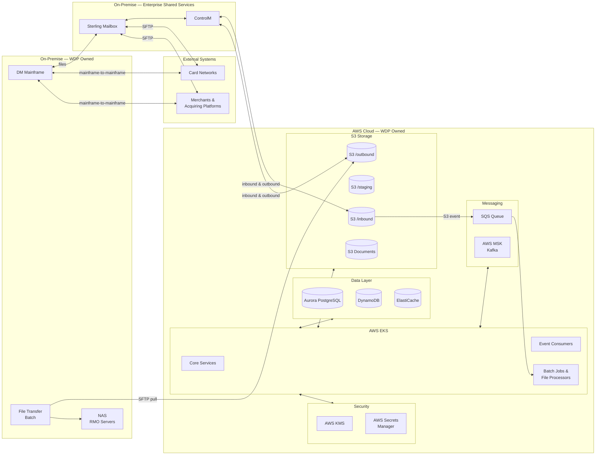


---

## 12. Component Status Registry

This section provides a single reference table covering all WDP components with their current production status. Use this as the definitive source for understanding what is live, what is planned, and what is in progress.

⚠️ **Source-verification status:** **38 of 51 components** have undergone source-verified correction passes. Detailed component-by-component status is maintained in **WDP-COMP-INDEX.md** (51 components total; 4 audit-pending — COMP-29, 31, 34, 38). The tables below show production-deployment status only.

**Status legend:**
- ✅ Production — component is live and in production
- 🔄 In Progress — component is being built or partially in production
- 🔴 Planned — component is planned but not yet started
- ⚠️ Migration Planned — component is live but has planned migration work

---

### 12.1 UI & Access Layer

| Component | Status | Notes |
|---|---|---|
| WDP Portal (Merchant + Ops modes) | ✅ Production | Single Angular SPA, two runtime modes — see §3.1 |
| WDP Portal — Ops mode (stub) | ✅ Production | Documented inside COMP-49 |
| Disputes Section | ✅ Production | Both modes |
| Queues Section | ✅ Production | Ops mode only |
| User Management Section | ✅ Production | Both modes |
| Org Management Section | ✅ Production | Both modes |
| Dashboard Section | 🔴 Planned | Dispute analytics for merchants — not yet developed |
| Akamai | ✅ Production | CDN & edge security — Merchant mode and B2B path |
| APIGEE | ✅ Production | B2B / system-to-system path only |
| API Gateway | ✅ Production | Single entry point — ⚠️ **CORE/VAP/LATAM gateway-level authorization absent (RISK-class)**; ⚠️ blocking RestTemplate on Netty event-loop (RISK-093) |
| IDP | ✅ Production | Shared enterprise OAuth 2.0 |
| UserAccessManagementService | ✅ Production | ⚠️ **DEC-021 wrong-TM scope expanded to 7 methods (RISK-010 🔴)**; 4-path summary in §3.4 / §4.5 |

---

### 12.2 WDP Core Services

| Component | Status | Notes |
|---|---|---|
| AcceptService | ✅ Production | ⚠️ NAP split-brain on MC CHI / AMEX / DISCOVER (RISK-028 / ADR-CAND-001) |
| ContestService | ✅ Production | |
| ChargebackService | ✅ Production | Externally exposed via APIGEE; 38 unprotected outbound call sites |
| **DisputeService** | ✅ Production | ⚠️ **Confirmed source-verified zero writes** — Kafka producer wired but commented out (commit `c29018cd`) |
| CaseManagementService | ✅ Production | |
| CaseActionService | ✅ Production | |
| NotesService | ✅ Production | ⚠️ **Mid-batch Kafka orphan deterministic split-brain (RISK-139)** |
| **QuestionnaireService** | ✅ Production | ⚠️ **No `@Transactional` posture; `DriverManagerDataSource`; ADR-CAND-042 / 043** |
| DocumentManagementService | ✅ Production | 6th publisher of `business-rules` |
| CaseSearchService | ✅ Production | |
| **DisplayCodeService** | ✅ Production | ⚠️ Permission-shape divergence between `/search` (11 flags) and `/privileges` (17 flags) — RISK-149 |
| FaxQueueService | ✅ Production | Ops mode only — fax detail section pending |
| **UserQueueSkillService** | ✅ Production | ⚠️ **DEC-021 second offender (RISK-class HIGH)** |
| BusinessRulesService | ✅ Production | Rule management only — does not execute rules |
| **RulesService** | ✅ Production | ⚠️ **Pure read-only confirmed; `migrationStatus="N"` undocumented prod kill-switch (RISK-164 / ADR-CAND-049)** |
| OrgManagementService | ✅ Production | GitHub repo not found |
| CoreHierarchyAuthorizationService | ✅ Production | ⚠️ **9 endpoints; PIN+CORE scope; `validateOrgId` method body absent** |
| MerchantTransactionService | ✅ Production | CORE enrichment only |
| **EncryptionService** | ✅ Production | ⚠️ **DEK rotation interval days**; single global dependency for all PAN ingestion (RISK-170); KMS-in-`@Transactional` (RISK-172) |
| **TokenService** | ✅ Production | ⚠️ **Read-only on Redis** (zero write ops); external writer of `wdpinternalidptoken:token` unknown |
| APILogService | ✅ Production | |

---

### 12.3 Core Data Stores

| Component | Status | Notes |
|---|---|---|
| Aurora PostgreSQL | ✅ Production | Multi-AZ — primary operational database |
| DynamoDB | ✅ Production | DocumentManagementService exclusive |
| S3 /inbound | ✅ Production | Source-specific folders per inbound source |
| S3 /staging | ✅ Production | Evidence and issuer documents |
| S3 /outbound | ✅ Production | Target-specific folders per outbound target |
| S3 Documents | ✅ Production | Evidence documents (via COMP-37) |
| **S3 UAMS bulk onboarding (`eu-west-2`)** | ✅ Production | ⚠️ Distinct from S3 Documents path; COMP-02 direct caller; no downstream parser identified |
| **AWS ElastiCache** | ✅ Production | ⚠️ **TokenService is read-only on Redis** |
| **AWS KMS** | ✅ Production | CMK for PAN encryption — ⚠️ DEK rotation interval days |
| **AWS Secrets Manager** | ✅ Production | ⚠️ Sole caller COMP-35, startup-only |

---

### 12.4 Inbound Processing

| Component | Status | Notes |
|---|---|---|
| NAPDisputeEventService | ✅ Production | ⚠️ Migration planned to common path; ⚠️ **`/**` whitelist unauthenticated; CVV in logs (RISK-115, RISK-114)** |
| NAPDisputeEventProcessor | ✅ Production | ⚠️ Migration planned; ⚠️ **CVV at rest (RISK-084)**; manual reprocess REST surface confirmed |
| NAPDisputeDeclineBatch | ✅ Production | Decommission-scoped |
| VisaDisputeBatch | ✅ Production | Polls multiple Visa queues every 2 minutes |
| FirstChargebackBatch | ✅ Production | Polls MasterCard for first chargeback events |
| CaseFillingBatch | ✅ Production | Polls MasterCard for subsequent dispute events |
| FileProcessor | ✅ Production | Triggered by SQS — processes all inbound files |
| InboundDisputeEventScheduler | ✅ Production | Polls outbox tables — 5 schedulers, 5-channel relay |
| FileAcknowledgementProcessor | ✅ Production | Generates ACK files for Meijer, Walmart, CapitalOne |

---

### 12.5 Outbox Tables

| Component | Status | Notes |
|---|---|---|
| chbk_outbox_row | ✅ Production | Central outbox — all inbound paths converge here |
| **wdp.outgoing_event_outbox** | ✅ Production | ⚠️ **5-channel shared outbox**: EXPIRY_EVENTS, GP_EVENTS, BEN_EVENTS, CORE_EVENTS, **EXPIRY_BATCH (terminal-write-only — no consumer)** |
| wdp.bre_orchestration_outbox | ✅ Production | Shared by COMP-12 Scheduler4 and COMP-18 |
| file_job | ✅ Production | File-level processing status tracker |
| file_evidence | ✅ Production | Evidence document metadata + S3 staging path |
| **wdp.file_generation_event** | ✅ Production | ⚠️ Sole writer COMP-18 |
| **wdp.case_expiry** | ✅ Production | ⚠️ **Case Expiry Subsystem coordination surface (COMP-17 writer half + COMP-51 reader half)**; no row-level lock |

---

### 12.6 Kafka Event Bus

| Component | Status | Notes |
|---|---|---|
| AWS MSK | ✅ Production | 3 brokers across 3 AZs |
| nap-dispute-events | ✅ Production | |
| new-case-events | ✅ Production | |
| case-evidence-events | ✅ Production | |
| **business-rules** | ✅ Production | ⚠️ **6 confirmed publishers**: COMP-12 Scheduler4, COMP-15, COMP-23, COMP-24, COMP-25, COMP-37 |
| outgoing-events | ✅ Production | |
| internal-integration-events | ✅ Production | |
| case-action-events (expiry) | ✅ Production | Cert env uses distinct topic |
| external-request-events | ✅ Production | |
| core-request-events (DB2) | ✅ Production | |
| **BEN-owned MSK cluster topic** | ✅ Production | ⚠️ Separate cluster — not WDP MSK; COMP-42 publishes; distinct SASL credentials |
| EDIA events | 🔴 Planned | Enterprise Kafka topic on EDIA platform |

---

### 12.7 Event Consumers

| Component | Status | Notes |
|---|---|---|
| CaseCreationConsumer | ✅ Production | Does not handle NAP disputes currently |
| EvidenceConsumer | ✅ Production | |
| BusinessRulesProcessor | ✅ Production | Makes direct DB calls — does not call BusinessRulesService |
| **CaseExpiryUpdateConsumer (COMP-17)** | ✅ Production | ⚠️ **Writer half of Case Expiry Subsystem** |
| NotificationOrchestrator | ✅ Production | Routes by business logic in code |
| **NAP Outcome Processor (COMP-39)** | ✅ Production | ⚠️ Migration planned to EDIA route; ⚠️ **Manual reprocess REST endpoint confirmed; NAP-DPS auth gap (RISK-179)** |
| VisaResponseQuestionnaire | ✅ Production | ⚠️ allocarb iteration partial-failure (RISK-185) |
| ThirdPartyNotificationConsumer | ✅ Production | Delivers to SignifyD via REST API; ⚠️ JustAI planned only for outbound |
| **BEN Consumer** | ✅ Production | ⚠️ **Kafka publish to BEN-owned MSK cluster**; 4th writer of `wdp.outgoing_event_outbox` |
| EDIA Consumer | 🔴 Planned | WDP owned — converts to EDIA enterprise format |
| CoreNotificationConsumer | ✅ Production | Delivers to CORE via DB2; clear PAN exception (RISK-035) |
| **CaseExpiryProcessor (COMP-51)** | ✅ Production | ⚠️ **Reader half of Case Expiry Subsystem; not a Kafka consumer (Spring Batch)** |

---

### 12.8 Outbound File Generation

| Component | Status | Notes |
|---|---|---|
| CapitalOne Response file processor | ✅ Production | Generates CapitalOne response file |
| FileAcknowledgementProcessor | ✅ Production | Generates ACK files for Meijer, Walmart, CapitalOne |
| NetworkResponseFileProcessor | ✅ Production | Generates Amex, AmexHybrid, Discover, DiscoverHybrid files |
| Dialogu Issuer document Processor | ✅ Production | Generates ZIP of issuer documents |
| NYCE File Generation Processor | 🔴 Planned | Will generate PIN Networks outbound files |

---

### 12.9 Notification Targets

| Target | Status | Integration |
|---|---|---|
| SignifyD | ✅ Production | REST API via ThirdPartyNotificationConsumer; also a partner identity in COMP-21 inbound |
| **JustAI (inbound partner identity in COMP-21)** | ✅ Production | REST HTTPS — active in COMP-21 source as `JUSTTAI` consumer name |
| **JustAI (outbound notification target in COMP-41)** | 🔴 Planned | Not in COMP-41 codebase; Spring Retry imports dead |
| **BEN** | ✅ Production | ⚠️ **Kafka publish to BEN-owned MSK cluster**; separate SASL/JAAS credentials |
| CORE | ✅ Production | DB2 via CoreNotificationConsumer |
| NAP | 🔴 Planned (via EDIA) | Currently direct API via COMP-39 |
| LATAM | 🔴 Planned | Via EDIA platform |
| VAP | 🔴 Planned | Via EDIA platform |

---

### 12.10 Acquiring Platform Integration

| Platform | Inbound Status | Outbound Status | Notes |
|---|---|---|---|
| NAP | ✅ Production | ✅ Production | ⚠️ Both inbound and outbound migration planned |
| CORE | ✅ Production | ✅ Production | ⚠️ Future EDIA migration consideration |
| LATAM | 🔄 In Progress | 🔴 Planned | Regional file path + Visa/MC batch |
| VAP | 🔄 In Progress | 🔴 Planned | Visa/MC batch + file-only networks |

---

### 12.11 On-Premise Infrastructure

| Component | Owned By | Status | Notes |
|---|---|---|---|
| DM Mainframe | WDP team | ✅ Production | Mainframe-to-mainframe connectivity |
| File Transfer Batch | WDP team | ✅ Production | DiscoverHybrid special outbound flow |
| Sterling Mailbox | Enterprise shared service | ✅ Production | Universal file hub — not WDP owned |
| ControlM | Enterprise shared service | ✅ Production | File transfer agent — not WDP owned |

---

### 12.12 Planned Work Summary

| # | Item | Section | Type |
|---|---|---|---|
| 1 | Dashboard Section (UI) | 3.1 | New feature |
| 2 | NAP inbound migration to chbk_outbox_row → CaseCreationConsumer | 5.1 / 9.3 | Migration |
| 3 | NAP outbound migration from direct API to EDIA route | 8.3 / 9.3 | Migration |
| 4 | EDIA Consumer | 7.4 | New component |
| 5 | EDIA events Kafka topic | 6.2 | New topic |
| 6 | NAP acquiring platform via EDIA | 9.3 | New integration |
| 7 | LATAM acquiring platform integration | 9.4 | New integration |
| 8 | VAP acquiring platform integration | 9.5 | New integration |
| 9 | NYCE File Generation Processor | 8.5 | New component |
| 10 | AMEX/Discover SFTP outbound | 8.5 | New integration |
| 11 | Circuit breaker strategy evaluation | 10.2 | Architectural decision |
| 12 | CORE DB2 → EDIA migration | 9.2 | Future consideration |
| **13** | **CVV-at-rest remediation (COMP-04 + COMP-05)** | **10.1 / 10.4** | **🔴 PCI-DSS material deficiency — architect decision pending (ADR-CAND-023)** |
| **14** | **EXPIRY_BATCH outbox consumer definition (COMP-51)** | **4.8 / 7.2** | **Architectural decision (ADR-CAND-026)** |
| **15** | **Case Expiry Subsystem coordination (COMP-17 + COMP-51 shared write)** | **4.8 / 7.2** | **Architectural decision (ADR-CAND-027)** |
| **16** | **DEC-021 scope expansion remediation (COMP-02 7 methods + COMP-30 second offender)** | **3.4 / 4.5** | **🔴 Defect remediation (ADR-CAND-025, ADR-CAND-033)** |
| **17** | **CORE/VAP/LATAM gateway-level authorization gap remediation** | **3.3 / 3.4** | **🔴 Architectural decision (ADR-CAND-029)** |
| **18** | **COMP-04 unauthenticated SecurityConfig — Spring Security JWT or document infrastructure-layer-only auth** | **3.4 / 5.1** | **🔴 Architectural decision (ADR-CAND-031)** |
| **19** | **COMP-01 blocking RestTemplate on Netty — migrate to WebClient or accept** | **3.3 / 10.2** | **🔴 Architectural decision (ADR-CAND-028)** |
| **20** | **`minReadySeconds` platform-wide remediation pass + manifest-lint rule** | **10.2 / 11** | **DevOps remediation (ADR-CAND-030)** |

---

## Open Discussion Points & Follow-Ups

The following items have been flagged during the architecture review and require further discussion or confirmation.

| # | Topic | Section | Priority | Status |
|---|---|---|---|---|
| 1 | Discover vs DiscoverHybrid — detailed file flow differences | 5.4 | High | Open |
| 2 | Amex vs AmexHybrid — detailed file flow differences | 5.4 | High | Open |
| 3 | File content classification per source | 5.4 | High | Open |
| 4 | Acknowledgement file rules — which sources require ACK and which do not | 5.4 | High | Open |
| 5 | S3 folder key structure and naming conventions per source and target | 5.4 | Medium | Open |
| 6 | File-only network issuer documents — confirm if sent in separate files via DM Mainframe | 5.3 | Medium | Open |
| 7 | Visa & MasterCard issuer document retrieval — confirm at which processing stage and which component | 5.3 / 7 | High | Open |
| 8 | Circuit breaker strategy — evaluate and document as future architectural decision | 10.2 | Medium | Open — see ADR-CAND-007 (No K8s probes — same hardening sprint) |
| 9 | Fax functionality — dedicated section needed under Queues | 4.3 | Medium | Open |
| 10 | CORE DB2 → EDIA migration — capture as open architectural decision | 9.2 | Low | Open |
| 11 | Observability tooling — document in dedicated operational architecture pass | 10.3 | Medium | Partial — WDP-OBSERVABILITY-ARCHITECTURE.md exists; not yet integrated into Section 10.3 |
| 12 | NAP CB911 migration timeline and completion criteria | 9.3 | Medium | Open |
| 13 | AcceptService NAP split-brain (MC CHI / AMEX / DISCOVER) | 8.1 | High | Open — ADR-CAND-001 |
| 14 | COMP-43 DB2 clear PAN — extend DEC-019 or remediate? | 4.8 | High | Open — ADR-CAND-004 |
| 15 | COMP-12 production replica count > 1 produces guaranteed duplicate Kafka publishes | 11 | High | Open — RISK-038 |
| 16 | **CVV-at-rest in COMP-04 logs + COMP-05 error tables — PCI-DSS 3.2.1 material deficiency** | **5.1 / 10.1 / 10.4** | **🔴 HIGH** | **Open — ADR-CAND-023; architect decision required** |
| 17 | **Cross-component shared error-table consumption hazard on `NAP.DISPUTE_EVENT_CONSUMER_ERROR` — uniform decision required for COMP-05 + COMP-39 prior-error scans** | **5.1 / 7.3** | **🔴 HIGH** | **Open — ADR-CAND-024** |
| 18 | **EXPIRY_BATCH outbox channel terminal-write-only — define consumer or accept as audit-only sink** | **4.8 / 7.2** | **🔴 HIGH** | **Open — ADR-CAND-026** |
| 19 | **Case Expiry Subsystem coordination — shared write to `wdp.case_expiry` between COMP-17 (writer) and COMP-51 (reader) with no row-level lock** | **4.8 / 7.2** | **MEDIUM** | **Open — ADR-CAND-027** |
| 20 | **DEC-021 scope expansion remediation — 7 wrong-TM methods in COMP-02 + COMP-30 second offender. Multi-datasource service-level `@Transactional` binding contract.** | **3.4 / 4.5** | **🔴 HIGH** | **Open — ADR-CAND-025, ADR-CAND-033** |
| 21 | **CORE/VAP/LATAM gateway-level authorization gap — these platform types receive no authorization at gateway** | **3.3 / 3.4** | **🔴 HIGH** | **Open — ADR-CAND-029** |
| 22 | **COMP-04 unauthenticated SecurityConfig (`/**` permitAll) — Spring Security JWT or document infrastructure-layer-only auth** | **3.4 / 5.1** | **🔴 HIGH** | **Open — ADR-CAND-031** |
| 23 | **COMP-01 blocking `RestTemplate` on Netty event-loop with no timeouts — migrate to `WebClient` or accept latency floor** | **3.3 / 10.2** | **🔴 HIGH** | **Open — ADR-CAND-028** |
| 24 | **`minReadySeconds` platform-wide misplacement (10 components confirmed) — DevOps remediation pass + manifest-lint rule** | **10.2 / 11** | **🟠 HIGH** | **Open — ADR-CAND-030** |
| 25 | **TokenService Redis hash external writer identity** — `wdpinternalidptoken:token` is populated by an unknown component | **4.7 / 11.1** | **MEDIUM** | **Open — team confirmation needed** |
| 26 | **AWS S3 region inconsistency — three different region values across components (`us-east-1` default, `us-east-2` COMP-11, `eu-west-2` COMP-02)** | **11.1** | **MEDIUM** | **Open** |
| 27 | **`v-correlation-id` propagation gaps (COMP-01, 17, 22, 51) — distributed tracing broken at multiple service boundaries** | **10.3** | **MEDIUM** | **Open — ADR-CAND-044, ADR-CAND-054** |

---

*This document contains architecture-level content only. Implementation details, database schemas, configuration values, code patterns, and deployment specifications are maintained separately at component level.*
