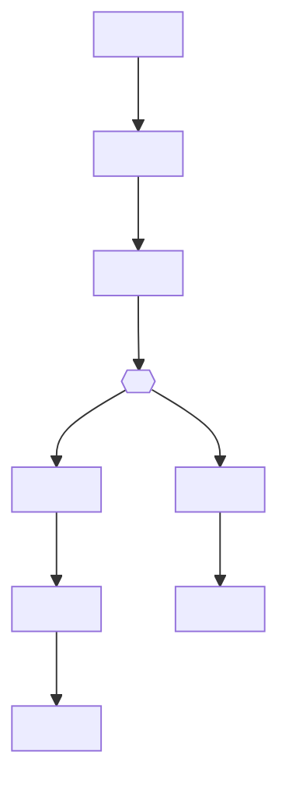

# WDP-COMP-TEMPLATE.md
**Worldpay Dispute Platform — Master Component File Template**
*Version: 1.1 | April 2026*
*Apply this template when creating any new WDP-COMP-[NN]-[NAME].md file*

---

## HOW TO USE THIS TEMPLATE

### Step 1 — Identify the component type

Before writing anything, determine which type blocks apply:

| If the component...                              | Include        |
|--------------------------------------------------|----------------|
| Exposes any HTTP REST endpoints to callers       | Block A — REST |
| Consumes messages from any Kafka topic           | Block B — Consumer |
| Publishes messages to any Kafka topic            | Block C — Producer |
| Runs on a schedule, cron, or batch trigger       | Block D — Batch |

A component may include multiple blocks. A component that consumes from
Kafka, processes, and publishes to a different Kafka topic gets both
Block B and Block C. A REST API that writes case actions and also
publishes a Kafka event gets Block A and Block C.

### Step 2 — Declare the type in the Identity section

The **Sections Present** field in Identity must list every block included.
This is the first signal to Claude and to you about what this component is
and what to expect in the file.

### Step 3 — Remove inapplicable blocks entirely

Do NOT leave empty blocks with "N/A". If the component has no Kafka
consumer side, Block B is not present at all. Omission is the signal.

### Step 4 — Replace all placeholder text

All placeholder text is enclosed in angle brackets: `<like this>`.
Replace every placeholder before the file is considered DRAFT-READY.

### Step 5 — Status indicators

Use these consistently in the Identity section:

- ✅ Production — component is live in production
- 🔄 In Progress — being built or partially live
- 🔴 Planned — not yet started
- 📝 DRAFT — template filled but not yet architect-confirmed
- ✅ COMPLETE — architect-confirmed

### Naming convention for the file itself

```
WDP-COMP-[NN]-[SHORTNAME].md
```

`NN` is a zero-padded two-digit sequence number that matches the component's
ID in WDP-COMP-INDEX.md and in WDP-COMPONENTS.md (the existing numbering
is already established — use it directly).

New components added each quarter get the next available number.
No groups. No reordering. Numbers are permanent identifiers.

Examples:
```
WDP-COMP-01-API-GATEWAY.md
WDP-COMP-02-UAMS.md
WDP-COMP-03-CHAS.md
WDP-COMP-04-NAP-DISPUTE-EVENT-SERVICE.md
WDP-COMP-05-NAP-DISPUTE-EVENT-PROCESSOR.md
WDP-COMP-51-NEW-COMPONENT-NAME.md
```

The number is the stable anchor. The name after it is human-readable context.
When Claude searches, it finds components by keyword in the file content —
not by file name — so the name segment is for your navigation, not Claude's.

---

---

# WDP-COMP-[NN]-[NAME]
**Worldpay Dispute Platform — Component Reference**
*Version: 1.0 DRAFT | <Month Year>*
*Extracted from: <repository name> using GitHub Copilot CLI | Architect-confirmed: <date or PENDING>*

---

## ━━━ CORE SKELETON ━━━━━━━━━━━━━━━━━━━━━━━━━━━━━━━━━━━━━━
*Mandatory for every component regardless of type.*

---

## Identity

| Field             | Value                                                        |
|-------------------|--------------------------------------------------------------|
| **Name**          | `<ComponentName>`                                            |
| **Type**          | `<REST API \| Kafka Consumer \| Kafka Producer \| Batch/Scheduler \| combination>` |
| **Repository**    | `<repository-name>`                                          |
| **Status**        | `<✅ Production \| 🔄 In Progress \| 🔴 Planned>`             |
| **Doc status**    | `<📝 DRAFT \| ✅ COMPLETE>`                                   |
| **Sections present** | `Core \| <Block A \| Block B \| Block C \| Block D — include only what applies>` |

---

## Purpose

**What it does**

`<2–5 paragraphs describing this component's responsibility at architecture
level. Describe what it does, why it exists, and its role in the broader
platform. Do not describe code, classes, or implementation. If the component
has multiple distinct processing paths or modes, describe each separately.>`

**What it does NOT do**

`<Explicit list of responsibilities that are out of scope for this component.
This is architecturally important — it defines the boundary. Include things
that callers or reviewers might incorrectly assume this component does.
Example: "does not persist any state", "does not produce to Kafka",
"does not perform NAP platform authorization — that is UAMS".>`

---

## Internal Processing Flow

*This diagram shows how data moves through this component from trigger to
output. It is the internal view — not the system context view in
WDP-ARCHITECTURE.md.*



*Replace the above with the actual flow for this component. Add or remove
steps and decision nodes as needed. Keep it at processing-step level —
not code level.*

---

## Boundaries

### Inbound Interfaces

*Every caller, trigger, or data source that sends data INTO this component.*

| Source | Protocol | Endpoint / Topic / Trigger | Payload / Description |
|--------|----------|----------------------------|-----------------------|
| `<caller name>` | `<REST \| Kafka \| S3 event \| Schedule \| DB poll>` | `<POST /path or topic-name or cron>` | `<what is sent>` |
| `<caller name>` | `<...>` | `<...>` | `<...>` |

*Add rows as needed. For Kafka consumer components, include the topic name
and consumer group here as well as in Block B below. For batch components,
the trigger row is the schedule or upstream dependency.*

### Outbound Interfaces

*Every system, service, or data store this component writes to or calls.*

| Target | Protocol | Endpoint / Topic / Resource | Purpose | On failure |
|--------|-----------|-----------------------------|---------|------------|
| `<target name>` | `<REST \| Kafka \| PostgreSQL \| S3 \| DB2 \| SFTP>` | `<POST /path or topic-name or schema.table>` | `<why>` | `<retry / DLQ / log and skip / fail fast>` |
| `<target name>` | `<...>` | `<...>` | `<...>` | `<...>` |

*Add rows as needed. Distinguish between writes (creates state) and reads
(fetches data). Reads in support of processing logic belong here if they
involve a synchronous network call.*

---

## Database Ownership

### Tables Owned (written by this component)

*Tables where this component is the primary writer. Include schema name.*

| Schema.Table | Purpose | Key columns | Retention / Notes |
|--------------|---------|-------------|-------------------|
| `<schema.table_name>` | `<what this table stores>` | `<key identifying columns>` | `<retention rule or note>` |

*If this component owns no tables, write:*
*"This component owns no database state. It is stateless."*

### Tables Read (not owned by this component)

*Tables this component queries but does not own. Used for lookups only.*

| Schema.Table | Owned by | Why accessed |
|--------------|----------|--------------|
| `<schema.table_name>` | `<component or system name>` | `<what data is looked up and why>` |

---

## Configuration and Scaling

| Parameter | Value | Notes |
|-----------|-------|-------|
| Replica count | `<number or "XL Deploy placeholder">` | `<env-specific or static>` |
| HPA | `<Yes / None>` | `<trigger metric if Yes>` |
| Memory request | `<e.g. 1024Mi>` | |
| Memory limit | `<e.g. 2048Mi>` | |
| CPU request | `<e.g. 500m or "Not set">` | |
| CPU limit | `<e.g. 1000m or "Not set">` | |
| Deployment type | `<Kubernetes Deployment \| CronJob \| StatefulSet>` | |
| Rollout strategy | `<RollingUpdate — maxSurge:X, maxUnavailable:Y>` | |
| PodDisruptionBudget | `<Yes — minAvailable:X \| None>` | |
| Topology spread | `<ScheduleAnyway / DoNotSchedule / None>` | `<flag if label mismatch known>` |
| Database connection pool | `<HikariCP default (10) / tuned to X>` | `<per datasource if multiple>` |
| Thread pool | `<async pool size or "default SimpleAsyncTaskExecutor">` | |
| Observability | `<OpenTelemetry Java agent \| Micrometer \| None>` | |

*Add component-specific parameters below this table as free text if needed
(e.g. Kafka-specific consumer concurrency, batch page size).*

---

## Key Architectural Decisions

*List the decisions that most shape this component's design. Reference
WDP-DECISIONS.md by ID where a platform-wide decision applies. Flag
deliberate deviations from platform standards — these are the highest
risk entries.*

| Decision | ADR reference | Notes |
|----------|---------------|-------|
| `<decision summary>` | `<DEC-XXX or "Local decision">` | `<why / consequence>` |
| `<deviation from platform standard>` | `<DEC-XXX — DEVIATION>` | `<why deviated / risk>` |

---

## Risks and Constraints

*Severity-rated risk register for this component. Every known risk must
have a severity, a description, and the consequence if it materialises.*

**Severity scale:**
- 🔴 HIGH — data loss, security breach, complete processing halt, PCI violation
- 🟡 MEDIUM — degraded throughput, incorrect behaviour under load, partial failure
- 🟢 LOW — latent bug, misleading log, dead code risk

| Severity | Risk | Consequence |
|----------|------|-------------|
| 🔴 HIGH | `<risk description>` | `<what happens if this triggers>` |
| 🟡 MEDIUM | `<risk description>` | `<what happens if this triggers>` |
| 🟢 LOW | `<risk description>` | `<what happens if this triggers>` |

---

## Planned Changes

*Quarterly cadence updates, active migrations, and open questions.
If nothing is confirmed, state that explicitly — do not leave blank.*

- `<Planned change description — include quarter if known>`
- `<Active migration — current state and gating condition>`
- `⚠️ OPEN QUESTION: <question that needs architect or team confirmation>`

*If no planned changes are confirmed:*
*"No planned changes confirmed as of <month year>. Review quarterly."*

---

---

## ━━━ TYPE BLOCK A — REST API CONTRACTS ━━━━━━━━━━━━━━━━━━━
*Include this block ONLY if this component exposes HTTP REST endpoints.*
*Remove this entire block if the component has no REST surface.*

---

## REST API Contracts

**Authentication model:**
`<Describe the auth requirement that applies to all or most endpoints —
e.g. "All endpoints require a valid Bearer JWT validated by Spring Security.
Internal callers identified by JWT iss claim bypass entity-scope checks."
Note any endpoints that are unauthenticated or whitelisted.>`

**Base URL pattern:**
`<e.g. https://<host>/merchant/gcp/<platform>/<service>>`

---

### Endpoint: `<METHOD> <path>`

**Purpose:** `<One line — what this endpoint does>`
**Caller(s):** `<Who calls this — e.g. API Gateway, NAPDisputeEventService, batch job>`
**Auth required:** `<Bearer JWT / Internal only / Unauthenticated>`

**Request**

| Field | Type | Required | Description |
|-------|------|----------|-------------|
| `<fieldName>` | `<String \| Integer \| Boolean \| Object>` | `<Yes \| No>` | `<what it represents>` |

*Or if the request body is not JSON (e.g. multipart, plain text), describe
the format as free text.*

**Response — Success**

| HTTP Status | Condition | Body |
|-------------|-----------|------|
| `<200 / 201 / 204>` | `<when returned>` | `<JSON structure or "empty body">` |

**Response — Error**

| HTTP Status | Condition | Body |
|-------------|-----------|------|
| `<400>` | `<e.g. missing required field>` | `<error body structure or "empty">` |
| `<401>` | `<e.g. missing or expired JWT>` | `<error body structure>` |
| `<403>` | `<e.g. entity scope mismatch>` | `<error body structure or "empty">` |
| `<404>` | `<e.g. case not found>` | `<error body structure>` |
| `<500>` | `<e.g. downstream service failure>` | `<error body structure>` |

**Notes:**
`<Any endpoint-specific behaviour worth capturing — e.g. idempotency key,
correlation ID propagation, retry behaviour on the caller side, known
quirks in the response contract.>`

---

*Repeat the above endpoint block for each REST endpoint this component exposes.*
*Group related endpoints under a subheading if the component has many (e.g.
"### Entity Management Endpoints", "### Authorization Endpoint").* 

---

---

## ━━━ TYPE BLOCK B — KAFKA CONSUMER CONTRACTS ━━━━━━━━━━━━━
*Include this block ONLY if this component consumes from Kafka topics.*
*Remove this entire block if the component has no Kafka consumer side.*

---

## Kafka Consumer Contracts

**Consumer framework:** `<Spring Kafka @KafkaListener / manual KafkaConsumer>`
**Offset commit strategy:** `<Manual commit after processing (DEC-005 standard) / Auto-commit / At-most-once (pre-ACK — deviation from DEC-005)>`
**Error handling strategy:** `<Kafka DLQ topic / Database DLQ table / Retry then log / Halt consumer>`

---

### Topic: `<topic-name>`

| Parameter | Value |
|-----------|-------|
| **Topic name** | `<exact topic name or config key e.g. ${kafka_consumer_topic}>` |
| **Consumer group** | `<group ID or config key e.g. ${kafka_group_id}>` |
| **Partition key** | `<what field is used as the message key — e.g. merchantId>` |
| **Concurrency** | `<number of consumer threads e.g. 1 / ${concurrency}>` |
| **Max poll records** | `<value or "default (500)">` |
| **Max poll interval** | `<value or "default (5 min)">` |
| **Offset commit** | `<Manual — after full processing / Auto / Pre-ACK before processing>` |
| **Ordering guarantee** | `<Per partition (by merchantId) / No ordering guarantee>` |

**Message payload structure**

| Field | Type | Description |
|-------|------|-------------|
| `<fieldName>` | `<String \| Integer \| Boolean \| Object>` | `<what it represents>` |

*Or describe as free text if the schema is complex or polymorphic.*

**Event classification / routing**

`<If the consumer receives multiple event types on a single topic and classifies
them at runtime, describe the classification logic here. e.g. "Sub-type is
determined by field inspection: if outcome field is non-blank → WIN_LOSS;
if napResponseType AND napResponseCode are both non-blank → SRV118;
otherwise → SRV116.">`

**On processing failure**

| Failure scenario | Behaviour |
|-----------------|-----------|
| `<e.g. Downstream REST call fails>` | `<e.g. Write to DLQ table with raw payload, commit offset, continue>` |
| `<e.g. Deserialization error>` | `<e.g. Log and skip, offset committed>` |
| `<e.g. Business rule violation>` | `<e.g. Place case ONHOLD, write error record>` |

---

*Repeat the above topic block for each Kafka topic this component consumes.*

---

---

## ━━━ TYPE BLOCK C — KAFKA PRODUCER CONTRACTS ━━━━━━━━━━━━━
*Include this block ONLY if this component publishes to Kafka topics.*
*Remove this entire block if the component has no Kafka producer side.*

---

## Kafka Producer Contracts

**Producer framework:** `<Spring Kafka KafkaTemplate>`
**Idempotent producer:** `<Yes (ENABLE_IDEMPOTENCE_CONFIG=true) / No>`
**Publish mode:** `<Synchronous (.get() / blocking) / Asynchronous (fire-and-forget)>`
**Retry on publish failure:** `<Yes — X retries with Y delay / No>`

---

### Topic: `<topic-name>`

| Parameter | Value |
|-----------|-------|
| **Topic name** | `<exact topic name or config key>` |
| **Message key** | `<what field is used as the Kafka message key — e.g. merchantId>` |
| **Ordering guarantee** | `<Per partition (key-scoped) / No guarantee>` |
| **Published on** | `<what triggers the publish — e.g. "successful enrichment of a new dispute event", "case action committed">` |
| **Consumed by** | `<known downstream consumers — reference WDP-COMP-* files>` |

**Message payload structure**

| Field | Type | Description |
|-------|------|-------------|
| `<fieldName>` | `<String \| Integer \| Boolean \| Object>` | `<what it represents>` |

*Or describe as free text if the schema is complex.*

**Payload notes**

`<Capture anything important about the payload that affects consumers:
— which fields may be null or absent (e.g. enrichmentFailure=true path)
— fields that carry flags for downstream routing (e.g. wdpOnly, migrationStatus)
— fields that have known mapping quirks (e.g. GUARPAY7 maps to TIER5)
— ordering or sequencing constraints downstream consumers depend on>`

---

*Repeat the above topic block for each Kafka topic this component publishes to.*

---

---

## ━━━ TYPE BLOCK D — BATCH AND SCHEDULER CONTRACTS ━━━━━━━━
*Include this block ONLY if this component is a batch job, scheduler,
or cron-triggered process. Remove this entire block otherwise.*

---

## Batch and Scheduler Contracts

**Batch framework:** `<Spring Batch / Spring @Scheduled / Kubernetes CronJob / Custom>`
**Deployment type:** `<Kubernetes Deployment (internal scheduler) / Kubernetes CronJob>`
**Trigger mechanism:** `<Internal @Scheduled cron / External CronJob trigger / Upstream event>`
**Job uniqueness:** `<How duplicate job runs are prevented — e.g. Spring Batch JobParameters timestamp, database lock, idempotency key>`

---

### Job: `<Job name>`

**Purpose:** `<What this job does — one or two sentences>`

**Schedule**

| Parameter | Config key | Value / Source |
|-----------|------------|----------------|
| Cron expression | `<config key e.g. app.scheduler.cron>` | `<value or "injected from K8s secret">` |
| Look-back window | `<config key if applicable>` | `<value or "injected from K8s secret">` |
| Timezone | `<if specified>` | `<value>` |

**Input source**

| Source | Type | Query / Filter | Pagination |
|--------|------|----------------|------------|
| `<e.g. PostgreSQL nap.action table>` | `<DB poll / S3 file / API poll>` | `<filter conditions e.g. stage=PAB, status=OPEN>` | `<cursor-based / page-based / none>` |

**Processing steps**

| Step | Name | Description | Chunk size | On failure |
|------|------|-------------|------------|------------|
| 1 | `<Step name>` | `<What happens>` | `<chunk size>` | `<skip / retry / fail job>` |
| 2 | `<Step name>` | `<What happens>` | `<chunk size>` | `<skip / retry / fail job>` |

*Add step rows as needed. For Spring Batch, list ItemReader → ItemProcessor
→ ItemWriter steps. For @Scheduled jobs, list the logical processing phases.*

**Downstream calls per record**

`<Describe the sequence of REST or DB calls made per record during processing.
e.g. "Each record triggers up to 4 serial REST calls: (1) Case Management GET
to verify card network, (2) Visa Adapter POST for network status, (3) Case
Actions GET for financial details, (4) Case Actions POST to create draft action."
This is important for understanding throughput and failure blast radius.>`

**Outputs**

| Target | Type | What is written | On failure |
|--------|------|-----------------|------------|
| `<target name>` | `<REST call \| DB write \| S3 write \| File write>` | `<what is created or updated>` | `<skip record / retry / fail job>` |

**Failure and recovery**

`<Describe what happens when the job fails part-way through:
— Is it safe to re-run? (idempotency)
— Does it resume from a checkpoint or restart from the beginning?
— Are partial results committed or rolled back?
— Where is the failure recorded?
— Is there a manual reprocessing path?>`

**Spring Batch metadata** *(omit if not using Spring Batch)*

| Table | Schema | Purpose |
|-------|--------|---------|
| `BATCH_JOB_INSTANCE` | `<schema>` | Job identity and deduplication |
| `BATCH_JOB_EXECUTION` | `<schema>` | Execution status per run |
| `BATCH_STEP_EXECUTION` | `<schema>` | Step-level progress and counts |

---

*Repeat the above job block for each distinct scheduled job within
this component if the component runs multiple jobs.*

---

---

*End of template.*
*File status should be updated from 📝 DRAFT to ✅ COMPLETE once all
sections have been filled and reviewed by the architect.*
*Remember to update WDP-COMP-INDEX.md, WDP-KAFKA.md, and WDP-DB.md
with entries from this file after completion.*
