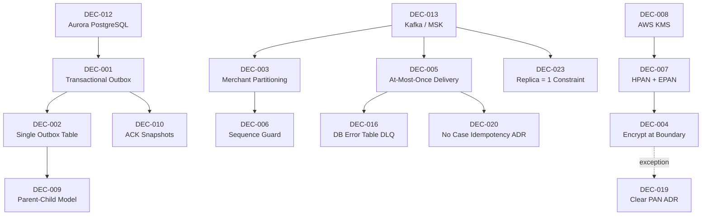

# WDP-DECISIONS.md
**Worldpay Dispute Platform — Architecture Decisions**
*Version: 2.1 | Reconciled: 2026-04-25*
*Source: v2.0 (April 2026 rebuild) + 2026-04-18/23/24/25 source-verification reconciliation*
*Reconciled entries: COMP-07, COMP-08, COMP-09, COMP-11, COMP-12, COMP-13, COMP-14, COMP-15, COMP-16, COMP-17, COMP-18, COMP-19, COMP-20, COMP-21, COMP-23, COMP-24, COMP-27, COMP-37, COMP-41, COMP-43*

---

## How to Read This Document

Each decision follows a consistent structure: the problem that forced the decision, what was chosen and why, what was rejected and why, and the lasting consequences.

Decisions are grouped into four tiers:

- **Tier 1 — Strategic**: Infrastructure and data strategy decisions made at inception. Effectively irreversible for the life of the platform.
- **Tier 2 — Platform patterns**: Processing and delivery patterns that all components are expected to follow. Deviations are explicitly recorded in Deviation Maps.
- **Tier 2 — Operational**: Structural and operational decisions confirmed from component-level analysis in April 2026.
- **Tier 3 — Risk and gap ADRs**: Formally documented exceptions, accepted risks, and known defects identified during the April 2026 component survey.

**Corrected decisions** carry a `⚠️ Corrected` marker and include a Deviation Map.

**Voided decisions** carry a `⛔ VOID` marker.

**Stage 3 proposals** carry a `⚠️ PROPOSED` marker. They have not been committed.

**v2.1 reconciliation:** Deviation maps for DEC-001, DEC-003, DEC-004, DEC-005, DEC-014, DEC-016, DEC-019, DEC-020 enriched with audit findings from the 20-entry source-verification pass. **No new DEC numbers introduced in v2.1** — new findings recorded as Candidate ADRs in Section "Candidate ADRs from Reconciliation Pass" pending architect promotion.

---

## Decision Registry

| ID | Decision | Tier | Status | Date |
|---|---|---|---|---|
| DEC-001 | Transactional Outbox for Event Delivery | 1 | ⚠️ Corrected — deviation map updated 2026-04-25 | Oct 2025 |
| DEC-002 | Single Outbox Table for Multiple Event Types | 2 | ✅ Active | Oct 2025 |
| DEC-003 | Merchant-Scoped Kafka Partitioning | 2 | ⚠️ Corrected — deviation map updated 2026-04-25 | Oct 2025 |
| DEC-004 | Encrypt PAN at the Ingestion Boundary | 1 | ⚠️ Corrected — column name + COMP-43 DB2 sibling 2026-04-25 | Oct 2025 |
| DEC-005 | At-Most-Once Delivery via Pre-Commit Offset | 2 | ⚠️ Reframed — deviation map updated 2026-04-25 | Oct 2025 |
| DEC-006 | Deferred Processing with Sequence Guard | 2 | ✅ Active (v1.6) | Oct 2025 |
| DEC-007 | Two-Token PAN Strategy (HPAN + EPAN) | 1 | ✅ Active | Oct 2025 |
| DEC-008 | AWS KMS for Key Management | 1 | ✅ Active | Oct 2025 |
| DEC-009 | Parent-Child Outbox Model for Combined Files | 2 | ✅ Active | Oct 2025 |
| DEC-010 | Immutable Versioned ACK Snapshots | 2 | ✅ Active | Oct 2025 |
| DEC-011 | BRE Crash Recovery via Step Checkpointing | — | ⛔ VOID — confirmed never implemented | Nov 2025 |
| DEC-012 | Aurora PostgreSQL as Operational Database | 1 | ✅ Active | Oct 2025 |
| DEC-013 | Kafka (AWS MSK) as Event Streaming Platform | 1 | ✅ Active | Oct 2025 |
| DEC-014 | Resilience4j for Circuit Breaking | — | ⛔ VOID — strengthened evidence 2026-04-25 (COMP-21 = 38 unprotected sites) | Oct 2025 |
| DEC-016 | Database Error Table as Consumer DLQ | 2 | ✅ Active — orphan-path gaps noted 2026-04-25 | April 2026 |
| DEC-017 | BusinessRulesProcessor Reads Rules Directly from DB | 2 | ✅ Active | April 2026 |
| DEC-018 | RBAC Not Enforced in CaseActionService — Accepted Risk | 2 | ⚠️ Risk Accepted | April 2026 |
| DEC-019 | Clear PAN Written on Standard Case Creation — Accepted Risk | 1 | ⚠️ Risk Accepted — column corrected + COMP-43 DB2 sibling 2026-04-25 | April 2026 |
| DEC-020 | No Idempotency on Case Creation — Accepted Risk | 2 | ⚠️ Risk Accepted — `idempotency-key` header void scoped 2026-04-25 | April 2026 |
| DEC-021 | UAMS Wrong Transaction Manager — Known Defect | — | 🔴 Defect — pending remediation | April 2026 |
| DEC-022 | removeItemFromQueueDisabled Operational Safety Switch | 2 | ✅ Active | April 2026 |
| DEC-023 | Polling Batch Replica Count Fixed at 1 | 2 | ✅ Active — operational-only enforcement clarified 2026-04-25 | April 2026 |
| DEC-S3-1 to DEC-S3-6 | Stage 3 proposals | 3 | ⚠️ PROPOSED | Nov 2025 |
| DEC-015 | GraphQL for Merchant Portal API | 3 | ⚠️ PROPOSED | TBD |

---

## Dependency Map

---

## Tier 1 — Strategic Decisions

### DEC-012: Aurora PostgreSQL as the Operational Database

**Context:** WDP needed a relational database to serve as the foundation for the transactional outbox pattern, hold the canonical case record, and satisfy strict compliance requirements around durability and audit.

**Decision:** Aurora PostgreSQL in a multi-AZ configuration, with read replicas for query offload.

**Why this over the alternatives:** A relational database with strong ACID guarantees is essential for the transactional outbox to be reliable. NoSQL stores like DynamoDB cannot atomically commit across two logical entity types in a way that makes the outbox pattern reliable. MongoDB was considered and rejected for the same reason and because the team's operational expertise was in PostgreSQL.

Aurora specifically (rather than vanilla PostgreSQL on RDS) was chosen for its fast failover, storage-level replication, and auto-scaling read replica capability.

**What was accepted:** Higher cost than a single-region PostgreSQL deployment. Schema migration overhead.

**What was rejected:** DynamoDB (no cross-entity atomic transactions), MongoDB (weaker ACID guarantees, different team skill set), self-managed PostgreSQL on EC2.

**Consequences:** The outbox pattern, deferred processing, and ACK snapshot designs all depend on PostgreSQL's transactional semantics. Changing the database would require revisiting every one of these patterns.

⚠️ **Note (2026-04-23):** COMP-37 DocumentManagementService is the only WDP component using AWS S3 and DynamoDB as primary data stores (documents and document metadata). It also has two PostgreSQL datasources (NAP and WDP) for desk-blanking column-level updates. The S3 + DynamoDB + dual PostgreSQL pattern is unique to COMP-37.

---

### DEC-013: Kafka (AWS MSK) as the Event Streaming Platform

[Content unchanged from v2.0.]

**Consequences:** MSK storage scales only upward — once provisioned, storage cannot be reduced. All capacity planning must account for this. Partition key discipline is critical — see DEC-003.

⚠️ **Note (2026-04-25):** A second MSK cluster is operated by the BEN team and used by COMP-42 BENConsumer for outbound publish. Distinct bootstrap servers, separate `${ben_sasl_config}` SASL credentials. WDP does not own this cluster.

---

### DEC-007: Two-Token PAN Strategy (HPAN + EPAN)

[Content unchanged from v2.0.]

---

### DEC-008: AWS KMS for Key Management

[Content unchanged from v2.0.]

---

### DEC-004: Encrypt PAN at the Ingestion Boundary ⚠️ Corrected

**Context:** WDP receives plaintext PAN from card networks and acquiring platforms. PAN must not be stored in plaintext in any persistent data store.

**Decision:** PAN is encrypted at the component that first receives it from an external system, before any database write. The encrypted form (EPAN) is what is stored.

**Confirmed implementations following this decision:**
- VisaDisputeBatch (COMP-07): encrypts PAN via EncryptionService before writing PENDING rows to `wdp.chbk_outbox_row`.
- FirstChargebackBatch (COMP-08): encrypts PAN via EncryptionService before writing PENDING rows to `wdp.chbk_outbox_row`.

**⚠️ Exception recorded — COMP-23 standard case creation (DEC-019, PostgreSQL):**
CaseManagementService `POST /{platform}/case` writes the card number in clear text to `nap.case.I_ACCT_CDH` *(corrected 2026-04-23 from typo `I_ACCI_CDH`)* and `wdp.CASE.I_ACCT_CDH`. PAN encryption in COMP-23 occurs only during the transaction enrichment flow (`POST /{platform}/transactions/enrich`), restricted to PIN and CORE platforms. DEC-019 formally records this as an accepted risk pending remediation.

**⚠️ Exception recorded — COMP-43 CORE platform (DEC-019 sibling, DB2):** *(added 2026-04-25)*
CoreNotificationConsumer (COMP-43) decrypts HPAN at the Step 6 PAN gate and writes clear PAN to `BC.TBC_DM_CASE.I_ACCT_CDH` *(corrected from `I_ACCT_CDR` in v2.0)*; PAN-last-4 to `I_ACCT_CDH_LST`. Triggered on Step 7 CREATE + `actionSequence=01` path. Whether this is intentional and approved is owed by the CORE platform team. Recorded under DEC-019.

**⚠️ Edge case — COMP-11 non-numeric `acctNum` branch (added 2026-04-18):**
COMP-11 `NetworkFileSupport` encrypts only when `acctNum` matches `\d+`. The non-numeric branch passes the raw value into `chbk_outbox_row.payload.account_number`. Whether production DNWK files can produce non-numeric PAN-bearing values is OQ-FileEdge — latent risk, not a confirmed production-active violation.

**Consequences:** Until DEC-019 is remediated for both PostgreSQL and DB2, clear PAN exists in `nap.case`, `wdp.CASE`, and `BC.TBC_DM_CASE` for cases that have not completed the enrichment flow. Database access controls on these columns are the interim protection.

---

## Tier 2 — Platform Patterns

### DEC-001: Transactional Outbox for Event Delivery ⚠️ Corrected

**Context:** WDP components that write to a database and then publish a Kafka event face a distributed consistency problem. A mechanism is needed to guarantee that both the database change and the event delivery either succeed or can be fully recovered.

**Decision:** Kafka events are published via a transactional outbox. The event payload is written to a database outbox table within the same transaction as the business data change. A separate relay process polls the outbox table and publishes confirmed rows to Kafka, marking them PUBLISHED on success.

**Outbox tables confirmed in use:** *(updated 2026-04-25)*

| Table | Owner / relay | Event types |
|---|---|---|
| `wdp.chbk_outbox_row` | COMP-12 InboundDisputeEventScheduler (Scheduler1 — relay) | Chargeback events from COMP-07, COMP-08, COMP-09, COMP-11; status transitions from COMP-14, COMP-15 |
| `wdp.bre_orchestration_outbox` | COMP-12 Schedulers 4 (relay) | BRE triggers (component=BUSINESS_RULES) and notification orchestration triggers (component=NOTIFICATION_ORCHESTRATOR) — shared table, routed by discriminator |
| `wdp.outgoing_event_outbox` | COMP-12 Scheduler3 (relay) | EXPIRY_EVENTS (COMP-17), GP_EVENTS (COMP-41 — *corrected 2026-04-25 from `GF_EVENTS`*), CORE_EVENTS (COMP-43) |
| `wdp.file_evidence` | COMP-12 Scheduler5 (read-only error report) | Evidence file tracking only |

⚠️ **v2.0 correction (2026-04-25):** v2.0 listed a `wdp.notification_orchestration_outbox` table — **this table does not exist in source.** The actual notification-orchestration rows live in `wdp.bre_orchestration_outbox` (component=NOTIFICATION_ORCHESTRATOR). v2.0 was also incorrect in stating COMP-18 writes to `wdp.outgoing_event_outbox` — source-verification 2026-04-18 confirms zero references; corrected in WDP-DB.md v2.1 and WDP-KAFKA.md v2.1.

**⚠️ Deviation Map — components that do not follow strict outbox pattern:** *(updated 2026-04-25)*

| Component | Topic published | Pattern detail | DEC-001 status |
|---|---|---|---|
| COMP-04 NAPDisputeEventService | nap-dispute-events | Direct publish on HTTP thread — no outbox | ⛔ DEVIATES |
| COMP-15 EvidenceConsumer | business-rules | Synchronous publish inside `@Transactional` via `kafkaTemplate.send(...).get()` blocking on the future. Ghost-event window: broker ACK followed by a later commit-time exception emits a published-but-unpersisted event. | ⛔ DEVIATES |
| COMP-16 BusinessRulesProcessor | outgoing-events, internal-integration-events | Direct synchronous publish — no outbox. Broker unavailable = permanent event loss. Split-brain: case state updated via REST while outgoing event may never be delivered. | ⛔ DEVIATES |
| COMP-18 NotificationOrchestrator | case-action-events, core-request-events, external-request-events | ⚠️ **PARTIAL** — `wdp.bre_orchestration_outbox` is used as the outbox, but **zero `@Transactional` annotations** in the codebase. Four distinct write points (3a ERROR, 3d PUBLISHED, 6 ERROR/PENDING_DEFERRED, 7e SUCCESS/FAILED) are independent auto-commits. PUBLISHED orphan rows have no automatic re-drive (Scheduler4 reads only FAILED/PENDING_DEFERRED — RISK-015). | ⚠️ PARTIAL |
| COMP-19 AcceptService | internal-integration-events | Direct synchronous publish — no outbox. HTTP 500 on Kafka failure does not undo the case action; NAPOutcomeProcessor not notified. State permanently inconsistent on Kafka final failure. | ⛔ DEVIATES |
| COMP-20 ContestService | internal-integration-events | Direct synchronous publish — no outbox. CaseManagement `insertActions` commit is permanent regardless of Kafka outcome. Retry-exhaustion path writes an SNOTE but does not recover the event. | ⛔ DEVIATES |
| COMP-23 CaseManagementService | business-rules | **Kafka-before-commit pattern** *(corrected 2026-04-23 from "publish after commits")* — synchronous publish inside `@Transactional` BEFORE commit. Send failure rolls back the DB. Broker ACK followed by a later commit-time exception emits a published-but-unpersisted event (narrow but non-zero window). Couples case write availability to Kafka broker availability. | ⛔ DEVIATES |
| COMP-24 CaseActionService | business-rules, ActionEvent topic | ⚠️ **PARTIAL** *(corrected 2026-04-23)*. **BRE publish IS inside `@Transactional`** — failure rolls DB back before commit. **ActionEvent publish is OUTSIDE `@Transactional` on EP 2 / 8 / 9** when `napUpdateEvent=true` — domain commit succeeds, ActionEvent publish lost on broker failure. Genuine post-commit split-brain. | ⚠️ PARTIAL |
| COMP-25 NotesService | business-rules | Synchronous publish inside `@Transactional` boundary — not atomically coupled (broker ACK pre-commit, commit-time exception emits ghost event) | ⛔ DEVIATES |
| **COMP-37 DocumentManagementService (added 2026-04-23)** | business-rules | Direct synchronous publish after DynamoDB write on primary upload paths (Endpoints 1, 9, 10). **Endpoint 11 questionnaire path mitigates with `@Transactional(rollbackOn=Exception.class)`** — partial mitigation (stronger atomicity than other publishers on this topic) but still no outbox. | ⛔ DEVIATES (PARTIAL on Endpoint 11) |
| **COMP-43 CoreNotificationConsumer (added 2026-04-25)** | (consumer side — `wdp.outgoing_event_outbox` repurposed as outbox) | Outbox INSERT on `wdpTransactionManager` commits **before** `coreDao.saveCoreCase` is invoked on `coreTransactionManager`. No XA. Crash window between outbox INSERT and DB2 write is wide open. | ⛔ DEVIATES |
| **COMP-17 CaseExpiryUpdateConsumer (added 2026-04-25)** | (consumer side — `wdp.outgoing_event_outbox` repurposed as outbox) | Dual deviation: (a) outbox repurposed as consumer-side audit/idempotency store, no Kafka publish; (b) outbox INSERT and `case_expiry` write run in **separate** transactional boundaries — outbox saves have no service `@Transactional`; `case_expiry` saves are `@Transactional REQUIRED`. Both share `wdpTransactionManager` but no method brackets both writes. | ⚠️ PARTIAL |
| **COMP-14 CaseCreationConsumer (added 2026-04-18)** | (no producer) | **Zero `@Transactional` annotations anywhere** in `gcp-case-creation-consumer` source. Parent SUCCESS save and EVIDENCE_ATTACH child `saveAll` are independent auto-commits. The upstream case-creation REST call is a third independent operation. | ⛔ DEVIATES (no transactions at all on processing path) |

Direct synchronous Kafka publish is the dominant producer pattern in WDP. The outbox pattern is implemented correctly only in the batch processing path (COMP-07, COMP-08, COMP-09 → `wdp.chbk_outbox_row`) and in the notification and scheduling path via COMP-12 relay schedulers. The REST API producer path has not adopted it. **Candidate ADRs from 2026-04-25 reconciliation propose to formalise this distinction** (see "Direct Kafka Publish for Case-Level REST Services" candidate).

---

### DEC-002: Single Outbox Table for Multiple Event Types

[Content unchanged from v2.0.]

⚠️ **Refinement (2026-04-25):** The `wdp.outgoing_event_outbox` table is also a multi-event shared outbox, written by three components with distinct `channel_type` discriminators: COMP-17 (EXPIRY_EVENTS), COMP-41 (GP_EVENTS), COMP-43 (CORE_EVENTS). The single relay (COMP-12 Scheduler3) is responsible for routing all three via `channelTypeTopicMap`. PUBLISHED-orphan paths in COMP-41 (3 distinct paths) and COMP-43 (silent-loss window) are **invisible** to Scheduler3 if Scheduler3 reads only FAILED and PENDING_DEFERRED rows — confirmation of Scheduler3's status filter is OQ-COMP41-1.

---

### DEC-003: Merchant-Scoped Kafka Partitioning ⚠️ Corrected

**Context:** WDP processes multiple concurrent events for the same merchant. Without partition key discipline, events may land on different partitions and be processed by different consumer instances, causing out-of-order execution.

**Decision:** `merchantId` is the stated Kafka partition key for all WDP topics. All events for a given merchant route to the same partition, guaranteeing ordered processing within a merchant's event stream.

**⚠️ Deviation Map — confirmed partition key deviations (updated 2026-04-25):**

| Topic | Stated key | Actual key in production | Publishers in violation |
|---|---|---|---|
| `nap-dispute-events` | merchantId | `cardAcceptorCodeId` (POST /event new disputes only); `merchantId` for other event types | COMP-04 — **partial deviation, decommission-scoped** |
| `new-case-events` | merchantId | Compound: `networkCaseId + cardNetwork + platform` | COMP-12 Scheduler1 (publisher) and COMP-14 (consumer logs same compound key as `keyNetworkCaseCardNetworkId`, not used for routing) |
| `case-evidence-events` | merchantId | `caseNumber` if non-blank, else `networkCaseId` | COMP-12 Scheduler1 |
| `business-rules` | merchantId | `caseNumber` | **All SIX confirmed publishers** *(updated 2026-04-25 — COMP-37 added; COMP-14 candidacy resolved as NOT a publisher)*: COMP-12 Scheduler4, COMP-15 EvidenceConsumer, COMP-23 CaseManagementService, COMP-24 CaseActionService, COMP-25 NotesService, **COMP-37 DocumentManagementService** |
| `outgoing-events` | merchantId | `caseNumber` | COMP-16 BusinessRulesProcessor |
| `internal-integration-events` | merchantId | Mixed — `caseNumber` (COMP-19, COMP-16) or `merchantId` (COMP-20) | COMP-19 AcceptService — `caseNumber` from `AddActionResponse`; `merchantId` exists on `CaseLookupResponse` but is never mapped into `AcceptEvent`. No documented reason in source. COMP-20 — `merchantId` (DEC-003 compliant). COMP-16 — `caseNumber` (UK/NAP path only). |
| `case-action-events` (expiry) | merchantId | Pass-through of inbound `RECEIVED_KEY` from upstream COMP-18 | COMP-18 NotificationOrchestrator |
| `core-request-events` | merchantId | Pass-through (consumer-side variable name `caseNumber`) | COMP-18 NotificationOrchestrator |
| `external-request-events` | merchantId | Pass-through (consumer-side variable names: `keyMerchantId` on COMP-41, `caseNumber` on COMP-42 — strongly suggests `caseNumber`, requires producer-side confirmation) | COMP-18 NotificationOrchestrator |
| ActionEvent topic (COMP-24 conditional) | merchantId | `caseNumber` | COMP-24 CaseActionService |

The `business-rules` topic deviates on every confirmed publisher. **The deviation is uniform across all six publishers (COMP-12, 15, 23, 24, 25, 37).** Ordering guarantees on `business-rules` are case-scoped, not merchant-scoped. For a merchant with multiple concurrent cases, events for different cases may be processed on different partitions by different consumer instances. The sequence guard (DEC-006) addresses ordering within a single case; the merchant-level ordering guarantee does not hold.

**Closed open item (2026-04-18):** COMP-14 CaseCreationConsumer is **NOT** a publisher to `business-rules` — confirmed by absence audit (no `KafkaTemplate`, no `ProducerFactory`, no topic reference in `gcp-case-creation-consumer` source).

**Candidate ADR pending (see Section "Candidate ADRs"):** Formalise `caseNumber` as the partition key for `business-rules` (effectively updating DEC-003 to recognise case-scoped ordering on this topic), or undertake a platform-wide migration to `merchantId`.

---

### DEC-005: At-Most-Once Delivery via Pre-Commit Kafka Offset ⚠️ Reframed

**Context:** v1.0 described DEC-005 as "manual Kafka offset commit after all processing completes, providing at-least-once delivery." This was incorrect. All confirmed WDP consumers commit the Kafka offset before processing begins, providing at-most-once delivery.

**Decision:** WDP Kafka consumers use pre-commit offset management as the platform standard. `acknowledgment.acknowledge()` is called before the processing logic executes. This provides at-most-once delivery: if a pod crashes after the offset commit but before processing completes, the event is permanently lost.

**Why at-most-once over at-least-once:** At-least-once delivery requires all downstream consumers to be idempotent. WDP's downstream services do not universally implement idempotency. CaseManagementService (COMP-23) has no duplicate detection on case creation (DEC-020). Redelivering events to a non-idempotent service produces duplicate case records, duplicate action entries, or duplicate notes — data integrity failures in a financial system.

**What was accepted:** Event loss on pod crash is the platform's accepted failure mode for Kafka consumers.

**Confirmed deviation map (updated 2026-04-25):**

| Component | Topic | Deviation pattern |
|-----------|-------|-------------------|
| COMP-05 NAPDisputeEventProcessor | `nap-dispute-events` | Pre-ACK — first call in `onMessage()` (canonical pattern) |
| **COMP-12 InboundDisputeEventScheduler** *(reframed 2026-04-18)* | (producer/relay only) | **At-least-once with duplicate-possible window** — mark-and-send within `@Transactional`, broker ACK precedes TX commit. *(Corrected 2026-04-18 from previously documented at-most-once.)* Consumer-side `idempotency-key` dedup is the contracted mitigation. |
| COMP-14 CaseCreationConsumer | `new-case-events` | Pre-ACK — `KafkaConsumer.java:38` ack precedes `processKafkaNotificationEvent()` at `:43` |
| COMP-15 EvidenceConsumer | `case-evidence-events` | Pre-ACK — Step 1, before all processing |
| COMP-16 BusinessRulesProcessor | `business-rules` | Pre-ACK — `KafkaConsumer.java:38` precedes `processRulesEvent()` at `:41` *(corrected from `:37`/`:40`)* |
| COMP-17 CaseExpiryUpdateConsumer | `case-action-events` | **Inconsistent** — Path A: ACK as first listener action; Path B: ACK mid-flow after outbox INSERT but before `case_expiry` write; header-blank path: ACK after error-row INSERT (and skipped if INSERT throws) |
| COMP-18 NotificationOrchestrator | `outgoing-events` | Mid-flow ACK — single ACK call site after Step 3d outbox INSERT, before all Step 7 publishes |
| COMP-39 NAPOutcomeProcessor | `internal-integration-events` | Pre-ACK |
| COMP-40 VisaResponseQuestionnaire | `internal-integration-events` | Pre-ACK |
| **COMP-41 ThirdPartyNotificationConsumer (added 2026-04-25)** | `external-request-events` | Pre-Signifyd ACK — committed after PUBLISHED outbox INSERT, before `processEvent()` and any Signifyd REST call. At-most-once delivery to Signifyd. |
| **COMP-42 BENConsumer (added 2026-04-25)** | `external-request-events` | Pre-ACK after idempotency DB check (Step 3); before CMS, BEN Product, CAS, BEN Kafka publish, outbox status update |
| **COMP-43 CoreNotificationConsumer (added 2026-04-25)** | `core-request-events` | Pre-ACK on all paths — Path A: post outbox-ERROR write, pre-DB2; Path B: pre `processCaseActionEvent`; Path C: post outbox-PUBLISHED INSERT, pre-DB2 |

**⚠️ Notable exception — COMP-23 CaseManagementService (kafka-before-commit pattern):** *(reframed 2026-04-23)* COMP-23 publishes Kafka **inside `@Transactional` before commit** — Kafka send failure rolls back the DB. This is neither pre-commit nor post-commit. It creates an availability dependency: Kafka broker unavailability causes case creation to fail entirely. *(v2.0's "publish after DB transaction commits" claim was withdrawn.)*

**Consequences:** No Kafka DLQ topics exist in WDP because they are only needed for at-least-once delivery. Database error tables are the compensating error-visibility mechanism (DEC-016). If the delivery model changes to at-least-once, idempotency must be added to all downstream services first.

⚠️ **Compounding risk surfaced 2026-04-18+ (RISK-025):** Empty anonymous `CommonErrorHandler{}` is registered platform-wide on multiple consumers (COMP-14, 15, 16, 17, 18, 39, 41, 42, 43). Combined with `ErrorHandlingDeserializer` and pre-ACK, deserialisation exceptions are silently swallowed — a *distinct* silent-loss class from the pre-ACK offset window. See candidate ADR.

---

### DEC-006: Deferred Processing with Sequence Guard for Concurrent Updates

[Content unchanged from v2.0.]

⚠️ **Note (2026-04-25):** COMP-17 CaseExpiryUpdateConsumer predecessor query is **case-scoped, not action-scoped** — a stuck row for action A blocks events for action B on the same case. Architectural intent (case-level ordering vs action-level) is OQ-COMP-17-cross-action — see Candidate ADRs.

---

### DEC-009: Parent-Child Outbox Model for Combined Files

[Content unchanged from v2.0.]

---

### DEC-010: Immutable Versioned ACK Snapshots

[Content unchanged from v2.0.]

⚠️ **Note (2026-04-18):** The `file_job` lifecycle has an undocumented contract:
- COMP-11 FileProcessor writes initial PROCESSING / PENDING; **never writes COMPLETED**.
- COMP-12 Scheduler2 is the candidate writer of COMPLETED per WDP-DB.md, but the contract is not documented in any of the three components' source.
- COMP-13 FileAcknowledgementProcessor polls for `status IN (COMPLETED, ERROR)`.

This is an architectural-contract gap — see Candidate ADR "file_job COMPLETED transition ownership".

---

## Tier 2 — Operational and Structural Decisions

### DEC-016: Database Error Table as Consumer DLQ

**Context:** Kafka consumers that fail to process a message need an error-visibility and recovery mechanism.

**Decision:** WDP uses database error tables as the consumer error-visibility mechanism. No Kafka DLQ topics exist anywhere in the platform.

**Known implementations (updated 2026-04-25):**

| Error store | Consumer | Notes |
|---|---|---|
| `NAP.DISPUTE_EVENT_CONSUMER_ERROR` table | COMP-05 NAPDisputeEventProcessor (primary owner); COMP-23 CaseManagementService (cross-component blind merge — see candidate ADR); COMP-24 CaseActionService (conditional NAP outbox — corrected 2026-04-23 from `wdp.chbk_outbox_row`) | Cross-component write contract violation flagged |
| `wdp.outgoing_event_outbox` (multi-channel) | COMP-17 (EXPIRY_EVENTS), COMP-41 (GP_EVENTS), COMP-43 (CORE_EVENTS) | Three distinct channel_type discriminators; single relay (COMP-12 Scheduler3) |
| `wdp.bre_orchestration_outbox` | COMP-18 (NOTIFICATION_ORCHESTRATOR rows), COMP-12 Scheduler4 (BUSINESS_RULES rows) | Shared, routed by component discriminator |
| `wdp.chbk_outbox_row` | COMP-14 (status transitions only — no row INSERT), COMP-15 (status transitions) | |
| REST SNOTE via NotesService (no DB table) | COMP-16 BusinessRulesProcessor | Weaker error-visibility — if SNOTE REST call also fails, error is silently lost |

⚠️ **Orphan-path gaps surfaced 2026-04-25 (RISK-015 / RISK-040 / RISK-036):**
- **PUBLISHED-status orphans on `wdp.outgoing_event_outbox`** are invisible to COMP-12 Scheduler3 if Scheduler3 reads only FAILED and PENDING_DEFERRED. COMP-41 has three distinct PUBLISHED-orphan paths (post-ACK crash, Signifyd "NO_DATA_FROM_SIGNIFYD" empty body, final outbox UPDATE failure). COMP-43 has a silent-loss window between ACK and FAILED-write.
- **PUBLISHED-status orphans on `wdp.bre_orchestration_outbox`** have no automatic re-drive — Scheduler4 reads only FAILED and PENDING_DEFERRED.

**Confirmation pending — OQ-COMP41-1:** Does Scheduler3 ever read PUBLISHED rows? Does it filter `channel_type` consistently?

**Consequences:** Error recovery requires manual intervention. There is no automatic re-drive mechanism for PUBLISHED-orphan rows. Operations teams must identify failed records, resolve the root cause, and manually trigger reprocessing. Manual runbook required for RISK-015 family.

---

### DEC-017: BusinessRulesProcessor Reads Rules Directly from the Database

[Content unchanged from v2.0.]

---

### DEC-022: removeItemFromQueueDisabled Operational Safety Switch

[Content unchanged from v2.0.]

---

### DEC-023: Polling Batch Replica Count Fixed at 1 ⚠️ Refined 2026-04-25

**Context:** VisaDisputeBatch (COMP-07), FirstChargebackBatch (COMP-08), and CaseFillingBatch (COMP-09) are Kubernetes Deployments that poll shared external card network queues using a sequential, single-threaded processing model.

**Decision:** Polling batches must run with exactly `replica = 1`. Running more than one replica is unsafe and is a hard constraint.

**Why:** Two replicas would each poll the same external queue and read overlapping items. Both would attempt to create case records for the same disputes. External queue acknowledgement and WDP case creation are not atomic.

⚠️ **Refinement (2026-04-18 / 25) — operational-only enforcement:** Source verification confirmed across COMP-07, COMP-08, COMP-09 that there is **no code-level concurrency guard** — no `@SchedulerLock`, no advisory lock, no `SELECT FOR UPDATE`, no `synchronized` guard, no Kubernetes admission webhook, no HPA configuration protecting this. Replica = 1 is **policy, not enforced by code anywhere**. Any Helm values change, HPA accident, or emergency scaling action that sets replicas > 1 begins duplicate case creation immediately with no alerting.

⚠️ **Sibling finding (2026-04-18) — COMP-12 InboundDisputeEventScheduler:** Same operational-only pattern, but COMP-12 is NOT formally part of DEC-023 (it is a Deployment-hosted scheduler, not a polling batch). Source verification confirmed **no `@SchedulerLock`, no advisory lock, no `SELECT FOR UPDATE`, no `synchronized` guard**. Any production replica value > 1 produces guaranteed duplicate Kafka publishes across all five schedulers. **RISK-038** elevates this to 🔴 CRITICAL pending replica-count confirmation.

**Consequences:** Horizontal scaling is not available for these components. Throughput is bounded by single-instance processing speed. Operational discipline must enforce replica = 1; there is no architectural barrier.

**Candidate ADR pending:** Formalise the "no code-level concurrency guard on polling batches and singleton schedulers" pattern.

---

## Tier 3 — Risk and Gap ADRs

### DEC-018: RBAC Not Enforced in CaseActionService — Accepted Risk

[Content unchanged from v2.0.]

---

### DEC-019: Clear PAN Written on Standard Case Creation — Accepted Risk (DEC-004 Exception)

**Context:** DEC-004 requires PAN to be encrypted at the ingestion boundary before any persistent write.

**Confirmed exceptions:**

**(1) PostgreSQL — COMP-23 standard case creation:** `POST /{platform}/case` writes the card number in clear text to `nap.case.I_ACCT_CDH` *(corrected 2026-04-23 from typo `I_ACCI_CDH`)* and `wdp.CASE.I_ACCT_CDH`. PAN encryption in COMP-23 only occurs during the transaction enrichment flow (`POST /{platform}/transactions/enrich`), restricted to PIN and CORE platforms.

**(2) DB2 — COMP-43 CORE platform CREATE path (added 2026-04-25):** CoreNotificationConsumer (COMP-43) decrypts HPAN at the Step 6 PAN gate and writes clear PAN to `BC.TBC_DM_CASE.I_ACCT_CDH` *(corrected from `I_ACCT_CDR` in v2.0)*; PAN-last-4 to `I_ACCT_CDH_LST`. Triggered on Step 7 CREATE + `actionSequence=01` path. Whether this is intentional and approved is owed by the CORE platform team — see Candidate ADR-CAND-COMP43-PAN.

**Risk:** Clear PAN persisted in Aurora PostgreSQL (`nap` and `wdp` schemas) and DB2 (`BC.TBC_DM_CASE`) for any case that has not yet completed the enrichment flow. PCI DSS compliance gap.

**Decision:** Accepted as a known risk pending remediation. Clear PAN in these columns is the current production state.

**Rationale:** Access controls on Aurora schema tables and DB2 BC schema are the interim mitigation.

**Remediation paths:**
- COMP-23 PostgreSQL: Move PAN encryption into the standard case creation transaction. EncryptionService must be called and EPAN derived before the JPA `nap.case` or `wdp.CASE` save. Claude Code scope.
- COMP-43 DB2: Architect decision required — document approved CORE platform exception, OR remediate by moving PAN encryption before DB2 save.

**Related — COMP-21 in-flight PAN surface (RISK-051):** ChargebackService surfaces full `cardNumber` in two response model classes (`SearchCaseList`, `Transaction`) populated from downstream `case-search-service` responses with no masking transformation in COMP-21. Whether clear PAN actually flows is downstream-dependent. Distinct from DEC-019 (which covers persistence, not in-flight transit).

---

### DEC-020: No Idempotency on Case Creation — Accepted Risk

**Context:** CaseManagementService (COMP-23) case creation (`POST /{platform}/case`) performs no duplicate detection.

**Decision:** Accepted as a known risk, contingent on the platform's at-most-once delivery model (DEC-005).

⚠️ **Refinement (2026-04-23 / 25) — `idempotency-key` header void:** Source verification across multiple components confirmed that the `idempotency-key` Kafka/HTTP header is captured, MDC-tagged, propagated to outbound Kafka records, and forwarded on outbound REST calls — but **never used for deduplication at any write site**:
- COMP-23: header captured, no seen-key store
- COMP-24: header captured by HttpInterceptor, forwarded to Kafka, no validation
- COMP-37: header propagated as outbound Kafka record header, never used for dedup
- COMP-15: header forwarded from inbound to outbound; nulls pass through
- COMP-16: header passed through to outgoing event; NOT used for duplicate detection
- COMP-17: header is a component of the dedup composite key on Path B only; Path A bypasses dedup

This is an accepted condition platform-wide. **Candidate ADR pending** to formally void the `idempotency-key` header as a contract OR mandate header-driven dedup on all write endpoints — see "Candidate ADRs from Reconciliation Pass".

**Critical dependency on DEC-005:** If the delivery model changes to at-least-once, this decision must be revisited immediately. Idempotency enforcement must be added to COMP-23 before the commit strategy can change.

**Remediation path:** A unique constraint on a composite natural key on both `nap.case` and `wdp.CASE` would enforce idempotency at the database level.

---

### DEC-021: UAMS saveChildWithMerchant — Wrong Transaction Manager (Known Defect)

[Content unchanged from v2.0.]

---

## Voided Decisions

### DEC-011: BRE Crash Recovery via Step Checkpointing ⛔ VOID

[Content unchanged from v2.0.]

---

### DEC-014: Resilience4j for Circuit Breaking ⛔ VOID

[Content unchanged — strengthened evidence noted 2026-04-25.]

⚠️ **Strengthened evidence (2026-04-25):** COMP-21 ChargebackService alone has **38 unprotected outbound call sites** across 12 target applications. All use a single shared `RestTemplate` bean with `SimpleClientHttpRequestFactory` defaults — no connection pool, no connect timeout, no read timeout, no retry, no circuit breaker, no `ClientHttpRequestInterceptor`. This is the strongest single-component evidence supporting the platform-wide void. RISK-001 reaffirmed.

⚠️ **Adjacent dead code (2026-04-25) — COMP-41 ThirdPartyNotificationConsumer:** Imports Spring Retry annotations (`@Retryable`, `@Backoff` in `SignifydService`, `TokenServiceRetry`) but never applies them at runtime. Class names containing "Retry" describe custom try/catch, not the framework. Documented as RISK-080 (LOW — dead code, no functional impact).

---

## Superseded Decisions

### DEC-006-v1.0: Initial Deferred Update Design ❌ Superseded (Oct 2025)

[Content unchanged from v2.0.]

---

## Stage 3 Proposals

[All Stage 3 proposals — DEC-S3-1 through DEC-S3-6, DEC-015 — unchanged from v2.0.]

---

## Candidate ADRs from Reconciliation Pass (2026-04-25)

The following candidates emerged from source-verification reconciliation against 20 component files. None are committed — they require architect review and formal ADR adoption. Each candidate references the underlying RISK row(s) in WDP-NFRS.md v2.1.

### Severity-ranked candidate list

| Candidate ID | Severity | Title | Affected components | Linked RISK(s) |
|--------------|----------|-------|---------------------|----------------|
| ADR-CAND-001 | 🔴 HIGH | Formalise AcceptService NAP split-brain — accept-and-document or fail-close | COMP-19 | RISK-028 |
| ADR-CAND-002 | 🔴 HIGH | "Direct Kafka publish for case-level REST services" — formal accept or remediate | COMP-19, 20, 23, 24, 25, 37 | RISK-018 + DEC-001 deviations |
| ADR-CAND-003 | 🔴 HIGH | Empty `CommonErrorHandler{}` platform pattern — formal accept or platform-wide replacement | COMP-14, 15, 16, 17, 18, 39, 41, 42, 43 | RISK-025 |
| ADR-CAND-004 | 🔴 HIGH | COMP-43 DB2 clear PAN — extend DEC-019 or remediate | COMP-43 | RISK-035 |
| ADR-CAND-005 | 🔴 HIGH | Batch writer/ACK silent exception swallow — invisible DB save failures | COMP-07, 08, 09 | RISK-052, RISK-053, RISK-081 |
| ADR-CAND-006 | 🟠 HIGH | Skip paths write no audit row in polling batches — invisible drops | COMP-07, 08, 09 | RISK-063 |
| ADR-CAND-007 | 🟠 HIGH | No K8s probes on long-running components — kubelet cannot evict hung pods | COMP-07, 08, 09, 11, 12, 14, 17, 41, 43 | RISK-024 |
| ADR-CAND-008 | 🟡 MEDIUM | "Kafka-before-commit" pattern naming — formalise as a distinct pattern | COMP-23, COMP-15, COMP-25, COMP-24 (BRE), COMP-19, COMP-20 | DEC-001 deviation map |
| ADR-CAND-009 | 🟡 MEDIUM | `@Transactional(rollbackOn=Exception.class)` stopgap atomicity pattern | COMP-37 (Endpoint 11), aspirational for COMP-25, COMP-15 alignment | DEC-001 deviation map |
| ADR-CAND-010 | 🟡 MEDIUM | `business-rules` partition key formalisation — update DEC-003 to recognise `caseNumber` or migrate to `merchantId` | All 6 publishers | DEC-003 deviation map |
| ADR-CAND-011 | 🟡 MEDIUM | `idempotency-key` header void — formalise unused-but-propagated status | Platform-wide | DEC-020 refinement |
| ADR-CAND-012 | 🟡 MEDIUM | Mark-and-send within `@Transactional` outbox-relay pattern — at-least-once with duplicate-possible (vs strict DEC-001) | COMP-12 | DEC-005 reframing |
| ADR-CAND-013 | 🟡 MEDIUM | IDP token caching contract — TTL-based cache or formal accept of per-call cost | COMP-21 (likely affects others) | RISK-026 |
| ADR-CAND-014 | 🟡 MEDIUM | Async executor sizing minimum for orchestrator services | COMP-21 (template for others) | RISK-026 |
| ADR-CAND-015 | 🟡 MEDIUM | Shared `RestTemplate` immutability contract — no per-call mutation | COMP-21, COMP-23, COMP-15 | RISK-049, RISK-066, RISK-002 (compound) |
| ADR-CAND-016 | 🟡 MEDIUM | Cross-component blind-merge into table owned by another component | COMP-23 → `NAP.DISPUTE_EVENT_CONSUMER_ERROR` (COMP-05-owned) | RISK-033 |
| ADR-CAND-017 | 🟡 MEDIUM | `file_job` COMPLETED transition ownership contract | COMP-11 / COMP-12 / COMP-13 | RISK-088 (forward) |
| ADR-CAND-018 | 🟡 MEDIUM | COMP-17 cross-action predecessor scope — case-level (current) vs action-level | COMP-17 | RISK-045 |
| ADR-CAND-019 | 🟡 MEDIUM | No code-level concurrency guard on polling batches / singleton schedulers — DEC-023 operational-only enforcement | COMP-07, 08, 09, 12 | DEC-023 refinement, RISK-038 |
| ADR-CAND-020 | 🟡 MEDIUM | COMP-09 MCM acknowledgement — implement, formally remove, or document accepted risk | COMP-09 | Component file |
| ADR-CAND-021 | 🟢 LOW | Outbox rows are INSERT-only (never UPDATEd) by polling batches — design-clarity ADR | COMP-07, 08, 09 | Component files |
| ADR-CAND-022 | 🟢 LOW | Inconsistent `v-correlation-id` propagation across REST invokers — sweep + standardise | COMP-09, COMP-17, COMP-43 | RISK-079 |

---

### Detailed candidate ADR — ADR-CAND-001: AcceptService NAP split-brain

**Severity:** 🔴 HIGH
**Status:** Candidate — architect decision required
**Same severity class as DEC-019 / DEC-020 risk-accepted ADRs.**

**Context:** Source verification 2026-04-23 confirmed two split-brain Kafka publish paths in COMP-19 AcceptService where `AcceptEvent` is published to `internal-integration-events` without any card-network notification:
1. **MC CHI on NAP** — `MasterCardServiceImpl.accept` silently returns for CHI (treats as no-op). The Step 8 Kafka gate still fires if inbound `actionCode` is `FCHG/IPAB/IARB/IDCL`.
2. **AMEX/DISCOVER on NAP** — `cardNetwork` switch defaults to `log.warn`; case action is added; AcceptEvent is published.

In both paths, NAPOutcomeProcessor (COMP-39) delivers the acceptance to NAP-DPS while the card network was never asked.

**Options:**
- **(a) Accept the risk** — Document a manual recovery procedure for affected NAP cases. NAPOutcomeProcessor consumers must not assume that an `AcceptEvent` implies the network was successfully notified.
- **(b) Remediate** — Fail-close the MC CHI / AMEX / DISCOVER branches before they reach the Kafka publish gate. Step 8 should require explicit confirmation that the network call succeeded.

**Recommendation:** Architect decision required. Same severity class as DEC-019 / DEC-020.

---

### Detailed candidate ADR — ADR-CAND-002: Direct Kafka Publish for Case-Level REST Services

**Severity:** 🔴 HIGH
**Status:** Candidate — formal pattern recognition

**Context:** Source verification across 6 components confirmed a consistent pattern of direct synchronous Kafka publish from REST request handlers without an outbox: COMP-19 AcceptService, COMP-20 ContestService, COMP-23 CaseManagementService (kafka-before-commit variant), COMP-24 CaseActionService (BRE inside @Transactional, ActionEvent post-commit on EP 2/8/9), COMP-25 NotesService, COMP-37 DocumentManagementService.

Currently these services are individually flagged under the DEC-001 deviation map without distinguishing the failure modes:
- **kafka-before-commit** (COMP-23, COMP-15) — Kafka send failure rolls DB back; broker ACK + commit-time exception emits ghost event.
- **post-commit direct publish** (COMP-19, COMP-20) — DB committed, Kafka failure permanently loses event, no compensation.
- **conditional post-commit** (COMP-24 ActionEvent EP 2/8/9 when napUpdateEvent=true) — partial split-brain.
- **post-DDB direct publish with @Transactional(rollbackOn=Exception.class) mitigation** (COMP-37 Endpoint 11).

**Options:**
- **(a) Document as accepted platform position** — REST API producer path retains direct synchronous publish; document the failure mode per pattern and the recovery procedure (manual SNOTE / re-drive runbook).
- **(b) Cross-component remediation programme** — Migrate REST publishers to outbox pattern (DEC-001 strict). Significant scope; requires schema changes for outbox tables in services that don't currently have them.
- **(c) Hybrid** — Adopt the COMP-37 Endpoint 11 `@Transactional(rollbackOn=Exception.class)` pattern as a stopgap for new code; migrate to outbox over time.

**Recommendation:** Architect decision. Linked to ADR-CAND-008 (kafka-before-commit naming) and ADR-CAND-009 (`@Transactional(rollbackOn=Exception.class)` stopgap pattern).

---

### Detailed candidate ADR — ADR-CAND-008: Kafka-Before-Commit Pattern Naming

**Severity:** 🟡 MEDIUM
**Status:** Candidate — pattern naming and contract clarity

**Context:** v2.0 documented COMP-23 as "synchronous publish after DB transaction commits — Kafka failure post-commit is unrecoverable." Source verification 2026-04-23 corrected this: COMP-23 publishes Kafka **inside `@Transactional` BEFORE commit**. Send failure rolls back the DB. This is structurally distinct from "kafka-after-commit" (COMP-19, COMP-20) and from the strict outbox pattern (DEC-001).

The pattern has three failure modes:
1. **Kafka send fails** — DB rolls back. Caller sees error. No data inconsistency. ✅ Safe.
2. **Kafka send succeeds, DB commit succeeds** — Normal path. ✅ Safe.
3. **Kafka broker ACKs the send, but a later commit-time exception rolls back the DB** — *Ghost event*: a published Kafka message exists for which no DB row was committed. ⚠️ Narrow but non-zero window.

**Affected components:** COMP-23 (confirmed), COMP-15 (inside `@Transactional` via `kafkaTemplate.send(...).get()`), COMP-24 BRE publish, COMP-25.

**Options:**
- **(a) Name and document** — Recognise "kafka-before-commit" as a deliberate platform pattern. Document the ghost-event window and downstream-tolerance contract (consumers must accept events for which no business-state exists).
- **(b) Migrate to outbox** — Eliminate the ghost-event window via DEC-001 strict relay.

**Recommendation:** Begin with (a). Migration to outbox can follow in a hardening sprint.

---

### Detailed candidate ADR — ADR-CAND-010: business-rules Partition Key

**Severity:** 🟡 MEDIUM
**Status:** Candidate — DEC-003 update or migration

**Context:** Every confirmed publisher of the `business-rules` topic (COMP-12 Scheduler4, COMP-15, COMP-23, COMP-24, COMP-25, COMP-37) uses `caseNumber` as the partition key, in uniform deviation from DEC-003. The deviation is no longer "whether to deviate" — it is whether to formally update DEC-003 to recognise case-scoped ordering on this topic, or undertake a platform-wide migration to `merchantId`.

**Trade-offs:**
- **Case-scoped ordering** — Current behaviour. Events for different cases on the same merchant may be processed concurrently on different partitions. Suitable if rule evaluation is per-case stateless.
- **Merchant-scoped ordering** — DEC-003 strict. Forces all events for a merchant onto a single partition. Risks hot partitioning on high-volume merchants (top-5 merchants account for ~40% of volume — see WDP-NFRS.md Section 4.2).

**Recommendation:** Architect decision. The COMP-37 datapoint strengthens the case for formally updating DEC-003 to recognise case-scoped ordering on this topic.

---

### Detailed candidate ADR — ADR-CAND-012: Mark-and-Send Outbox-Relay Pattern (COMP-12)

**Severity:** 🟡 MEDIUM
**Status:** Candidate — formal pattern recognition

**Context:** v2.0 DEC-005 deviation map listed COMP-12 InboundDisputeEventScheduler as "mark-before-send" / "PUBLISHED status written before Kafka send" implying at-most-once. Source verification 2026-04-18 corrected this:

The relay logic runs within a single `@Transactional` block:
1. Mark outbox row PUBLISHED (within TX).
2. Call `kafkaTemplate.send(...).get()` — broker ACK received.
3. Transaction commits.

If the relay crashes between step 2 (broker ACK received) and step 3 (TX commit), the broker has already accepted the message but the row has not been marked PUBLISHED. On restart, the row is re-read as PENDING and re-published — **producing a duplicate**.

This is **at-least-once with duplicate-possible**, not at-most-once. Consumer-side `idempotency-key` dedup is the contracted mitigation.

**Recommendation:** Recognise "mark-and-send within `@Transactional`" as a deliberate design pattern, distinct from DEC-001 strict relay (which marks PUBLISHED only after broker ACK in a separate transaction). Document that consumer-side dedup is mandatory for events from this relay.

---

### Detailed candidate ADR — ADR-CAND-007: No K8s Probes on Long-Running Components

**Severity:** 🟠 HIGH
**Status:** Candidate — formal accept or platform-wide remediation

**Context:** Source verification 2026-04-18/25 confirmed **no liveness, readiness, or startup probes** on 9 components: COMP-07 VisaDisputeBatch, COMP-08 FirstChargebackBatch, COMP-09 CaseFillingBatch, COMP-11 FileProcessor (also no Actuator), COMP-12 InboundDisputeEventScheduler, COMP-14 CaseCreationConsumer (no liveness, no startup; readiness present), COMP-17 CaseExpiryUpdateConsumer, COMP-41 ThirdPartyNotificationConsumer (paths exposed at port 8082 but no probe block in YAML), COMP-43 CoreNotificationConsumer.

The kubelet cannot detect a stalled JVM or hung listener thread. Pod readiness is governed only by `minReadySeconds: 30`. Combined with RISK-001 (no circuit breakers) and RISK-002 (no timeouts), a stalled pod holds the consumer-group slot indefinitely.

**Options:**
- **(a) Document accepted condition** — Pod liveness is not measurable on these components; operational monitoring (consumer-group lag, Kafka offset advance) is the compensating signal.
- **(b) Platform-wide remediation** — Standard probe contract for all long-running components. K8s deployment-template change.

**Recommendation:** (b). The cost is low (deployment template change), the benefit is significant (kubelet eviction restores throughput automatically on hung pods).

---

### Detailed candidate ADR — ADR-CAND-005: Batch Writer Silent Exception Swallow

**Severity:** 🔴 HIGH
**Status:** Candidate — invisible data-loss class

**Context:** Source verification across COMP-07, COMP-08, COMP-09 confirmed a consistent anti-pattern in batch writer code: writer save failures and ACK retry-exhaustion paths catch and log without propagating. Spring Batch sees chunk completion as successful even when no row was persisted.

- **COMP-07**: `BatchItemWriter.java:139-142` — caught and logged; never propagated.
- **COMP-08**: Mid-chunk JPA save failure does not prevent ACK PUT to MCM; ACK PUT exceptions swallowed silently. Items acknowledged off MCM with no corresponding outbox row are unrecoverable. **Writer-ACK hazard.**
- **COMP-09**: Writer swallows all save exceptions. Combined with skip paths writing no row, this produces invisible data loss with no audit trail.

**Recommendation:** Either (a) add error rows on writer failure (preserves audit trail at cost of additional DB write per failure), or (b) propagate writer exceptions to halt the chunk and rely on operator intervention. Severity HIGH because the current pattern produces invisible data loss in a financial system.

---

### Other candidate ADRs (summary only)

For brevity, candidate ADRs ADR-CAND-003, ADR-CAND-004, ADR-CAND-006, ADR-CAND-009, ADR-CAND-011, ADR-CAND-013 through ADR-CAND-022 are listed in the table at the start of this section. Detailed analysis is captured in the relevant component file (WDP-COMP-NN-*.md) and in the corresponding RISK row in WDP-NFRS.md v2.1.

---

## Constraints Shaping Future Decisions

Five constraints from committed decisions limit what future stages can do without re-architecture:

**MSK storage is one-directional.** Once provisioned Kafka storage is scaled up, it cannot be reduced. Every storage increase is permanent.

**PAN handling is centralised.** Any future capability that needs the actual card number must call through EncryptionService (COMP-35). The clear PAN exceptions (DEC-019: COMP-23 PostgreSQL, COMP-43 DB2) are pending remediation.

**At-most-once delivery creates a data loss window.** The platform's current Kafka consumer model accepts event loss on pod crash. Any future capability that requires guaranteed event delivery must either implement a compensating mechanism or require the platform delivery model to change — which requires idempotency to be added to all downstream services first.

**COMP-12 outbox-relay is at-least-once with duplicate-possible** *(reframed 2026-04-18)*. Any consumer of `new-case-events`, `case-evidence-events`, `business-rules` (Scheduler4 path), or `outgoing_event_outbox` (Scheduler3 path) must implement `idempotency-key`-based dedup. The contracted dedup discipline is the only mitigation.

**Polling batches and singleton schedulers cannot scale horizontally.** COMP-07, COMP-08, COMP-09 are permanently constrained to replica = 1 (DEC-023). COMP-12 has the same constraint without a formal ADR — replicas > 1 produces guaranteed duplicate Kafka publishes (RISK-038). Operational discipline is the only enforcement; no code-level guard exists.

---

*This document contains architectural decision content only. Implementation details, database schemas, configuration values, and deployment specifications are maintained in the individual component files (WDP-COMP-[NN]-*.md).*

*v2.1 reconciled 2026-04-25 — deviation maps for DEC-001, DEC-003, DEC-004, DEC-005, DEC-014, DEC-016, DEC-019, DEC-020, DEC-023 enriched. 22 candidate ADRs surfaced for architect promotion.*

*NFRs are cross-referenced via WDP-NFRS.md v2.1 RISK IDs.*
