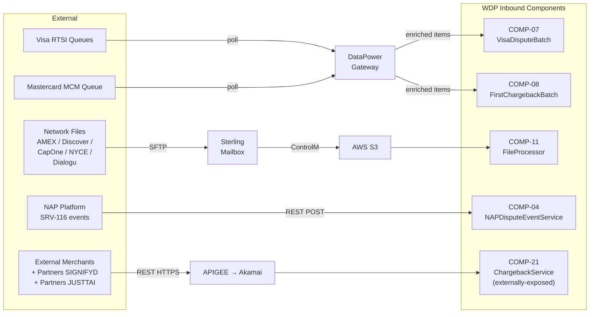
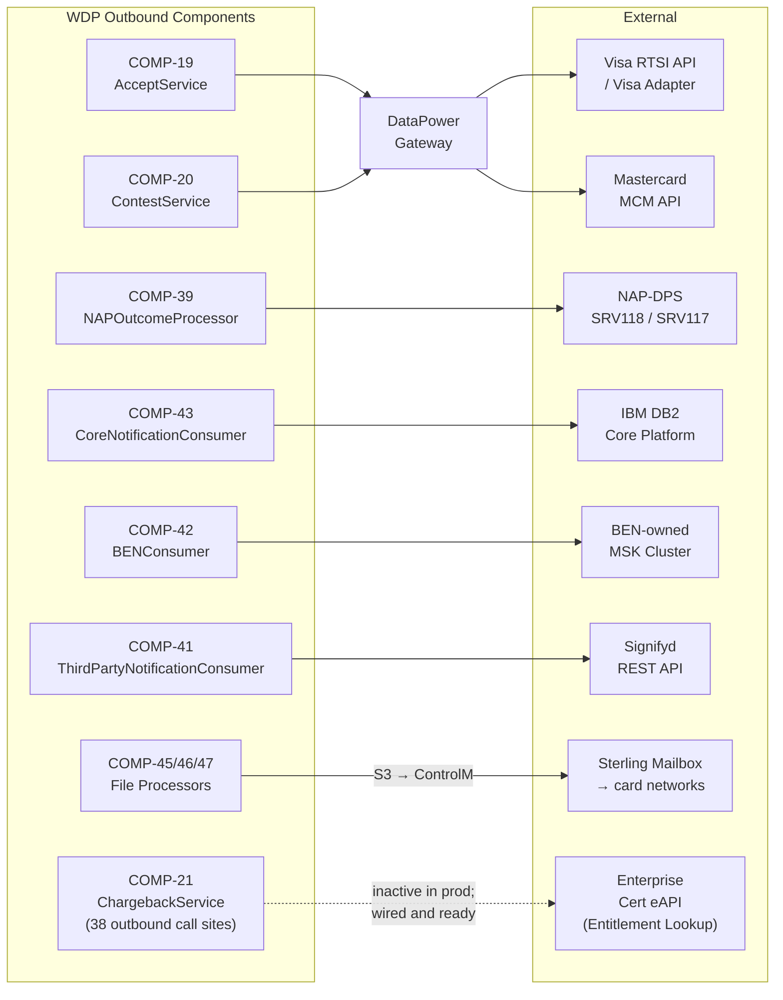

# WDP-INTEGRATIONS.md
**Worldpay Dispute Platform — External Integration Contracts**
*Version: 2.1 | Reconciled: 2026-04-25*
*Source: v2.0 (April 2026 rebuild) + 2026-04-23/25 source-verification reconciliation against COMP-19, COMP-20, COMP-21*

---

## How to Read This Document

This document covers **external integration boundaries only** — the systems outside WDP that WDP sends data to or receives data from. Internal component-to-component communication is documented in WDP-KAFKA.md (Kafka topics and consumer groups) and individual WDP-COMP-[NN]-*.md files (REST contracts between WDP services).

Every entry states: the external system, the WDP component that owns the boundary, the protocol and auth mechanism, and what happens when the external system is unavailable. Resilience capabilities are stated from confirmed source — see Section 9.

**v2.1 reconciliation summary:**
- **JustAI scope corrected** — JustAI is **active in COMP-21 ChargebackService** as a partner identity (`JUSTTAI`, double-T) for inbound merchant-API calls. It remains **absent from COMP-41 ThirdPartyNotificationConsumer** (still planned-only for outbound notification). The v2.0 statement "JustAI is planned" was over-broad.
- **COMP-21 ChargebackService added** as a major outbound integration owner — 38 distinct downstream call sites across 12 target applications, sole externally-exposed WDP REST API gateway.
- **Enterprise Cert eAPI Entitlement Lookup added** as a new outbound integration owned by COMP-21 (currently inactive in production but wired and ready).
- **MCM contract sharpened** — COMP-20 stage-dependent path detail (CH1/RE2 vs PAB); MC CHI silent no-op applies to **both NAP and PIN** (corrected from PIN-only).
- **Visa AMEX/DISCOVER gap sharpened** — NAP-publish split-brain consequence added to the existing note.

---

## 1. Integration Boundary Overview

### 1.1 Inbound Data Sources

### 1.2 Outbound Delivery Targets

---

## 2. Inbound Integrations

External systems that push or deliver dispute data into WDP.

---

### 2.1 Visa Dispute Events — RTSI Queue Polling

| Field | Value |
|---|---|
| **External system** | Visa RTSI (Real-Time Service Interface) queue API |
| **WDP owner** | COMP-07 VisaDisputeBatch |
| **Direction** | WDP polls outbound → receives inbound dispute items |
| **Protocol** | REST via DataPower enterprise gateway |
| **Auth** | vantiveLicense header (via DataPower) |
| **Status** | ✅ Production |

COMP-07 polls seven Visa RTSI queue types sequentially via the DataPower enterprise gateway. For each queued item, COMP-07 calls Visa HyperSearch to enrich dispute data, encrypts PAN via EncryptionService (COMP-35), and writes a PENDING row to `wdp.chbk_outbox_row`. Each item is acknowledged back to the RTSI queue via a MarkAsRead call only after the outbox write succeeds.

Processing is sequential and single-threaded — all seven queue types run in one job execution.

**Failure handling:** `removeItemFromQueueDisabled` safety flag (DEC-022) can suppress all MarkAsRead calls globally. No circuit breaker. No retry on queue poll itself.

**Scaling constraint:** Must run replica = 1 (DEC-023). Multiple replicas create parallel queue polling and duplicate case creation risk.

---

### 2.2 Mastercard First Chargeback Events — MCM Queue Polling

| Field | Value |
|---|---|
| **External system** | Mastercard MCM (Mastercard Merchant Connect) queue |
| **WDP owner** | COMP-08 FirstChargebackBatch |
| **Direction** | WDP polls outbound → receives inbound dispute items |
| **Protocol** | REST via DataPower enterprise gateway |
| **Auth** | vantiveLicense header (via DataPower) |
| **Poll interval** | Every 5 minutes |
| **Status** | ✅ Production |

COMP-08 polls the MCM unworked first chargeback queue via the DataPower gateway. For each item, COMP-08 fetches claim detail and settled transaction PAN from MCM, encrypts PAN via EncryptionService (COMP-35), writes a PENDING row to `wdp.chbk_outbox_row`, and acknowledges the item back to MCM.

**Failure handling:** `removeItemFromQueueDisabled` safety flag suppresses all ACK calls globally when active. No circuit breaker.

**Scaling constraint:** Must run replica = 1 (DEC-023).

---

### 2.3 Network Inbound Files — Sterling → S3 Path

| Field | Value |
|---|---|
| **External systems** | AMEX, Discover, CapitalOne, NYCE, Dialogu |
| **WDP owner** | COMP-11 FileProcessor (ingest), COMP-12 InboundEventScheduler (relay) |
| **Direction** | External networks → Sterling → ControlM → S3 → WDP |
| **Protocol** | Sterling SFTP (external → Sterling) / ControlM file transfer (Sterling → S3) |
| **Auth** | Sterling SFTP credentials (managed outside WDP) / AWS S3 IAM role |
| **Status** | ✅ Production |

Card network and issuer dispute files are deposited to the Sterling Mailbox enterprise file hub via SFTP. ControlM (on-premise file transfer agent) moves files from Sterling to WDP-owned AWS S3 buckets. COMP-11 FileProcessor polls S3 for new file job entries, downloads the file, parses rows, and writes outbox entries for downstream processing.

**DiscoverHybrid exception:** Uses a special on-premise File Transfer Batch component that pulls via SFTP directly, rather than the standard ControlM push path. All other networks use the Sterling → ControlM → S3 route.

**Failure handling:** File-level job status tracked in database. Row-level failures recorded per-row in outbox. An ACK file is generated per source file and delivered back to the originating network.

⚠️ **(2026-04-18)** COMP-11 has confirmed silent file-loss paths for `DISCHYB_NETWORK` and `AMEXOPTB` qualifiers — see WDP-NFRS.md RISK-054. Files for these acquirers fail to find a bean / `FileAcroEnum` entry and are silently discarded. Distinct from row-level failure handling above.

---

### 2.4 NAP Dispute Events — SRV-116 Push

| Field | Value |
|---|---|
| **External system** | NAP acquiring platform |
| **WDP owner** | COMP-04 NAPDisputeEventService |
| **Direction** | NAP pushes REST POST → COMP-04 |
| **Protocol** | REST (inbound to COMP-04) |
| **Auth** | Bearer JWT |
| **Status** | ✅ Production (decommission-scoped — EDIA migration planned) |

NAP pushes SRV-116 dispute event notifications and operator responses to COMP-04 via REST. COMP-04 enriches the event synchronously via internal WDP services and publishes the enriched NapEvent to the `nap-dispute-events` Kafka topic. Document uploads arriving on this path are proxied directly to DocumentManagementService (COMP-37) without Kafka involvement.

COMP-04 is stateless — no database. All persistence is downstream.

**Failure handling:** Errors propagated as HTTP error responses to NAP. No DLQ.

---

### 2.5 External Merchant API — APIGEE → Akamai → COMP-21

| Field | Value |
|---|---|
| **External systems** | External merchants; partners (SignifyD, JustAI) |
| **WDP owner** | COMP-21 ChargebackService (sole externally-exposed WDP REST API) |
| **Direction** | External → APIGEE → Akamai → COMP-21 |
| **Protocol** | REST HTTPS |
| **Auth** | OAuth 2.0 JWT Bearer (validated against JWKS endpoint) |
| **Status** | ✅ Production |

COMP-21 ChargebackService is the **sole externally-exposed WDP REST API** and the primary merchant-facing and partner-facing gateway for the entire platform. It handles two broad categories of operation:
- **Read** — case search (`POST /cases/search`), case detail (`GET /cases/{id}`), activity search (`POST /cases/activities`), document retrieval and listing, NAP/UK case search variants
- **Action** — contest, accept, add note, change owner, document upload (`POST /cases/{id}/contest`, `/cases/{id}/accept`, `/cases/{id}/notes`, `/cases/{id}/changeowner`)

**Authorization modes (mutually exclusive):**
- **Legacy ACL mode** — queries WDP user-access-management-service (UAMS) for chain-level merchant hierarchy validation. Production value at the time of survey: `entitlementFlag=false` (legacy mode active).
- **Newer Entitlement mode** — queries enterprise Cert eAPI Entitlement Lookup directly using the inbound JWT for region-scoped entitlement validation. Wired and ready; inactive in production.

**Partner identification:** Partners are identified at auth time via the JWT `entitlement_params` consumer name claim:
- `SIGNIFYD` — SignifyD fraud platform
- `JUSTTAI` (double-T spelling in source — corresponds to JustAI) — **active in COMP-21**, contradicting the v1.0/v2.0 platform-wide claim that JustAI is "planned only." Scope correction: JustAI is planned only in **COMP-41 outbound** (Section 5.2); it is **live in COMP-21 inbound partner identification**.

Partners receive a simplified authorization flow — product-type check only; ACL chain-ID validation is skipped.

**Failure handling:** Standard HTTP status propagation. `RestClientException` from any of 38 downstream calls wrapped to `WebServiceException` and surfaced as 4xx-forwarded or 500.

⚠️ **(2026-04-25) Resilience and risk findings** (see WDP-NFRS.md RISK-026, RISK-027, RISK-049, RISK-050, RISK-051):
- No connect/read timeouts on any of the 38 downstream calls.
- No IDP token cache despite the `CachedTokenServiceImpl` wrapper class name; WDP-path `contest` performs ~10 sequential round-trips on a single shared `RestTemplate` with no connection pool.
- `asyncExecutor` is core=1, max=1, queue=5 — the documented "concurrent ACL+case-lookup" pattern is effectively serial under production sizing. 7th concurrent action request hits `RejectedExecutionException`.
- LATAM silent fall-through — `SourceSystem.LATAM` matches no controller branch; action and document endpoints return HTTP 200 with empty body, no log, no metric, no error.
- Surfaces full `cardNumber` in two response model classes (`SearchCaseList`, `Transaction`) and `cardNumberLast4` in eight others, populated from downstream `case-search-service` responses with no masking transformation in COMP-21.
- `/actuator/prometheus` requires JWT — NOT in security whitelist.

---

## 3. Outbound — Card Network Submission APIs

WDP components that submit dispute responses back to card networks.

---

### 3.1 Visa RTSI API and Visa Adapter

| Field | Value |
|---|---|
| **External system** | Visa RTSI (Real-Time Service Interface) API |
| **WDP owners** | COMP-19 AcceptService, COMP-20 ContestService, COMP-40 VisaResponseQuestionnaire |
| **Direction** | WDP → Visa RTSI |
| **Protocol** | REST |
| **Status** | ✅ Production |

WDP submits Visa dispute acceptances and contests via two paths depending on acquiring platform:

**NAP path:** WDP calls the local `mdvs-gcp-visa-adapter` service (a WDP-owned internal adapter), which forwards to the Visa RTSI API using an IDP Bearer token.

**PIN path and all non-NAP platforms:** WDP calls the Visa RTSI API directly via the DataPower enterprise gateway using a vantiveLicense header.

COMP-40 additionally retrieves submitted questionnaire images from five Visa RTSI endpoints after a contest is recorded, uploading each image to DocumentManagementService (COMP-37) for S3 storage. Note that COMP-20 uses the submission set (`createDispute*`, `submitDisputeFilingRequest`) and COMP-40 uses the retrieval set (`getDispute*Details`).

**Auth:**
- NAP path: IDP Bearer token via local Visa Adapter
- PIN / non-NAP path: vantiveLicense header via DataPower

**Retry:** Spring Retry `@Retryable` present in COMP-20 (3 attempts, fixed delay) and COMP-40. No circuit breaker.

⚠️ **AMEX and DISCOVER gap in AcceptService (COMP-19) — sharpened 2026-04-23:** AMEX and DISCOVER are defined as routing constants in AcceptService but have no implementation path for network submission. The `cardNetwork` switch defaults to `log.warn` for both — case action is added to WDP, but no card network is actually notified.

**🔴 NAP-publish split-brain consequence:** On NAP, when the inbound `actionCode` is `FCHG/IPAB/IARB/IDCL` (eligible by Step 8 Kafka-gate criteria), AcceptService still publishes `AcceptEvent` to `internal-integration-events`. NAPOutcomeProcessor (COMP-39) consumes this and delivers the acceptance to NAP-DPS — **while the card network was never asked**. Same severity class as DEC-019 / DEC-020. See WDP-NFRS.md RISK-028 and WDP-DECISIONS.md ADR-CAND-001.

This is distinct from the file-based outbound path (Section 8), where AMEX and Discover responses are generated and delivered via S3 → ControlM → Sterling.

---

### 3.2 Mastercard MCM API

| Field | Value |
|---|---|
| **External system** | Mastercard MCM (Mastercard Merchant Connect) API |
| **WDP owners** | COMP-19 AcceptService, COMP-20 ContestService |
| **Direction** | WDP → MCM |
| **Protocol** | REST |
| **Auth** | vantiveLicense header (via DataPower or direct MCM adapter) |
| **Status** | ✅ Production |

WDP submits Mastercard and Maestro dispute acceptances and contests via two paths depending on acquiring platform:

**NAP path:** WDP calls the MCM adapter directly.
- COMP-19: `PUT /v6/cases/{caseId}` to accept
- COMP-20: direct MCM URL for contest

**PIN path (non-NAP):** WDP routes through the DataPower enterprise gateway. The DataPower non-NAP path uses the same VANTIV license header as Visa DataPower (shared `licenseKey` secret).

**COMP-20 contest path is stage-dependent (added 2026-04-23):**

| Stage code | MCM operation | Method |
|---|---|---|
| CHI | (silent no-op — no MCM call) | — |
| CH1, RE2 | `createSecondPresentmentChargeback` | POST |
| PAB | `retrieveClaim + updateCase(action=REJECT)` | GET then PUT |
| ARB | (per legacy contract — confirm with Claude Code if needed) | — |

⚠️ **MC CHI silent no-op clarification (corrected 2026-04-23 from PIN-only to NAP+PIN):** `MasterCardServiceImpl.accept` silently returns for CHI on **both NAP and PIN platforms** (v2.0 incorrectly stated PIN-only). Only PAB and ARB stages invoke an MCM network call on either platform. The CHI stage causes AcceptService to return without making any network call — a silent no-op on both platforms.

**Retry:** Spring Retry `@Retryable` present in COMP-20 (3 attempts, fixed delay). No circuit breaker.

⚠️ **(2026-04-23) NAP-publish split-brain consequence on MC CHI:** As with AMEX/DISCOVER (Section 3.1), MC CHI on NAP triggers a Kafka publish to `internal-integration-events` even though the network was never notified. NAPOutcomeProcessor delivers the acceptance to NAP-DPS while MCM was silently bypassed. See WDP-NFRS.md RISK-028.

---

### 3.3 DataPower Enterprise Gateway

| Field | Value |
|---|---|
| **System** | DataPower (enterprise shared infrastructure — not WDP-owned) |
| **Direction** | WDP → DataPower → card network API |
| **Protocol** | REST (WDP → DataPower); DataPower handles downstream routing and auth |
| **Status** | ✅ Production — enterprise managed |

DataPower is the enterprise HTTP gateway that proxies WDP card network API calls for the PIN platform and non-NAP paths. WDP components address DataPower as their target URL — DataPower handles protocol translation, auth header injection, and network routing to the actual card network endpoint.

**WDP components that route through DataPower:**

| Component | What routes through DataPower |
|---|---|
| COMP-07 VisaDisputeBatch | Visa RTSI queue polling |
| COMP-08 FirstChargebackBatch | MCM queue polling |
| COMP-19 AcceptService | Visa and MC on PIN platform |
| COMP-20 ContestService | Visa (non-NAP) and MC (non-NAP) — stage-dependent path detail per Section 3.2 |
| COMP-34 MerchantTransactionService | MCM and Visa Pinned API on PIN path |

**Failure handling:** DataPower unavailability causes the calling component's REST call to fail. No WDP-side circuit breaker on any of these paths.

⚠️ **Auth header note (2026-04-23):** The DataPower non-NAP path uses the same VANTIV license header as Visa DataPower — shared `licenseKey` secret across COMP-07/08 (Visa polling), COMP-19/20 PIN (Visa and MC submission), and COMP-34 PIN (transaction lookup).

---

## 4. Outbound — Acquiring Platform Delivery

[Sections 4.1 NAP-DPS, 4.2 IBM DB2 Core, 4.3 BEN Kafka Cluster, 4.4 EDIA Platform — content unchanged from v2.0 except where noted below.]

---

### 4.1 NAP-DPS

[Content unchanged from v2.0.]

⚠️ **(2026-04-23) Cross-reference:** The split-brain Kafka publish paths in COMP-19 (Section 3.1, 3.2) deliver `AcceptEvent` to NAP-DPS via COMP-39 even when the card network was not actually notified. NAPOutcomeProcessor (COMP-39) consumers should not assume that an `AcceptEvent` implies the network was successfully notified. Manual recovery procedure may be required for affected NAP cases pending ADR-CAND-001 resolution.

---

### 4.2 IBM DB2 Core Platform (Write)

| Field | Value |
|---|---|
| **External system** | IBM DB2 (CORE platform enterprise database) |
| **WDP owner** | COMP-43 CoreNotificationConsumer |
| **Direction** | WDP → IBM DB2 (write) |
| **Protocol** | Direct JDBC / JPA (Spring Data JPA, DB2 JDBC driver) |
| **Auth** | DB2 credentials managed outside WDP |
| **Status** | ✅ Production |

COMP-43 is the **sole WDP component that writes to the CORE platform IBM DB2 database**. It writes dispute case and occurrence records to three tables:

| Table | Purpose |
|---|---|
| `BC.TBC_DM_CASE` | Dispute case record |
| `BC.TBC_DM_OCCUR` | Dispute occurrence record |
| `BC.TBC_DM_NOTES` | Case notes |

Before writing, COMP-43 enriches the thin Kafka routing event by calling five WDP REST services in sequence: IDP TokenService, CaseManagementService, CaseActionsService, NotesService, and conditionally EncryptionService (COMP-35) to decrypt HPAN to clear PAN at the Step 6 PAN gate for Step 7 CREATE + actionSeq=01 path.

**All other WDP components that access IBM DB2 are read-only:**
- COMP-03 CHAS reads the Core enterprise merchant hierarchy
- COMP-34 MerchantTransactionService reads `BC.TBC_CC_TR07` for CapOne transaction lookups

**Idempotency:** Via `wdp.outgoing_event_outbox` (channel_type = `CORE_EVENTS`). Composite duplicate key: `{idempotency_id, channel_type, event_timestamp}`.

⚠️ **(2026-04-25) Clear PAN exception:** COMP-43 writes clear PAN to `BC.TBC_DM_CASE.I_ACCT_CDH` *(corrected from `I_ACCT_CDR`)* and PAN-last-4 to `I_ACCT_CDH_LST` on Step 7 CREATE + `actionSequence=01` path. Whether this is intentional and approved is owed by the CORE platform team. Recorded as DEC-019 sibling — see WDP-DECISIONS.md DEC-019 and ADR-CAND-004.

⚠️ **(2026-04-25) Read-list correction:** v2.0 stated COMP-43 reads `BC.TBC_DM_CASE`, `BC.TBC_DM_OCCUR`, and `BC.TBC_DM_NOTES` for enrichment. Source verification confirms enrichment is **fully REST-driven**; DB2 reads are limited to **`BC.TBC_DM_CASE` only** via `findByCaseId` and `findByWdpCaseNumber` in Step 7 (UPDATE and CREATE-subsequent). `BC.TBC_DM_OCCUR` and `BC.TBC_DM_NOTES` are write-only.

**Predecessor blocking:** If an earlier event for the same case is in a non-terminal state in the outbox, the current event is written as PENDING_DEFERRED and deferred for retry.

**Retry:** No inline retry on DB2 write. Retry is delegated to an external scheduler that detects FAILED outbox rows and re-submits them. ⚠️ **(2026-04-25)** Silent-loss window between ACK and FAILED-write — PostgreSQL unavailability defeats the FAILED-write fallback. See RISK-036.

**Filtering:** Only events with `platform = CORE` or `platform = PIN` AND `migrationStatus = Y` are processed. All other events (NAP, VAP, LATAM) are silently discarded.

---

### 4.3 BEN Kafka Cluster

[Content unchanged from v2.0.]

---

### 4.4 EDIA Platform (Planned)

[Content unchanged from v2.0.]

---

## 5. Outbound — Third-Party Notification

---

### 5.1 Signifyd Fraud Intelligence Platform

| Field | Value |
|---|---|
| **External system** | Signifyd |
| **WDP owner** | COMP-41 ThirdPartyNotificationConsumer |
| **Direction** | WDP → Signifyd REST API |
| **Protocol** | REST (HTTP POST) |
| **Status** | ✅ Production |

COMP-41 consumes `external-request-events` and calls the Signifyd REST API with one of three notification types depending on dispute lifecycle stage:

| Signifyd call | Trigger condition |
|---|---|
| Create Chargeback | actionSequence = `01`, eventType = `CASE_CREATED`, specific stageCode / actionCode pairs |
| Chargeback Stage | Subsequent lifecycle stage update for an existing case |
| Representment Outcome | Representment result notification |

After receiving these notifications, Signifyd calls back WDP's ChargebackService (COMP-21) for full dispute details. That callback path is owned by COMP-21 (see Section 2.5); Signifyd is identified there as a partner via the JWT `entitlement_params` consumer name = `SIGNIFYD`.

**Kafka offset:** Committed after outbox INSERT but before the Signifyd REST call. At-most-once delivery relative to Signifyd — a crash after the ACK but before Signifyd responds loses the notification.

**Idempotency and retry:** Via `wdp.outgoing_event_outbox` (channel_type = `GP_EVENTS` — *corrected 2026-04-25 from `GF_EVENTS`*). No automatic re-drive — external retry scheduler required for FAILED rows.

⚠️ **(2026-04-25) Three PUBLISHED-orphan paths confirmed (RISK-040, extends RISK-015):**
1. Post-ACK crash before Signifyd response — offset committed; pod dies; outbox row stays PUBLISHED.
2. Signifyd "NO_DATA_FROM_SIGNIFYD" empty body — no status transition performed; row retains PUBLISHED.
3. Final outbox UPDATE failure after ACK — PostgreSQL unavailability or constraint failure leaves the row at PUBLISHED.

All three paths are **invisible to COMP-12 Scheduler3** if Scheduler3 reads only FAILED/PENDING_DEFERRED rows. Confirmation pending — OQ-COMP41-1.

**Caching no-op:** `@EnableCaching` is absent and no `CacheManager` bean is configured, so the `@Cacheable` annotations on Display Code POST and Notification Rule GET do not cache. Every event hits these upstream services. See RISK-055.

---

### 5.2 JustAI

| Field | Value |
|---|---|
| **External system** | JustAI |
| **Status — inbound (partner identity in COMP-21)** | ✅ Production — active in source |
| **Status — outbound (notification target in COMP-41)** | 🔴 Planned — not present in COMP-41 codebase |

⚠️ **JustAI scope correction (2026-04-25):** v2.0 stated JustAI is "planned" without scope qualification. Source verification across COMP-21 and COMP-41 reveals two distinct integration roles for JustAI:

**Inbound — partner identity in COMP-21 ChargebackService (active in production):**
JustAI is identified as a partner caller via the JWT `entitlement_params` consumer name = `JUSTTAI` (double-T spelling in source). COMP-21 source contains the active routing branch in `isPartner` that triggers the simplified authorization flow (product-type check only; ACL chain-ID skipped). When JustAI calls the WDP merchant API for dispute information, this path is live. See Section 2.5.

**Outbound — third-party notification target in COMP-41 (planned only):**
JustAI is a planned third-party integration that will extend COMP-41 with a second notification target alongside Signifyd. **No JustAI reference exists in the current COMP-41 codebase.** Spring Retry imports (`@Retryable`, `@Backoff`) are present but dead — they govern no outbound REST call and would not change scope on JustAI activation. When this integration is implemented, COMP-41 will require schema additions to the `wdp.outgoing_event_outbox` `channel_type` enum.

**Failure handling — inbound:** Standard COMP-21 error handling — see Section 2.5.

---

## 6. Shared Enterprise Services

Services that are shared across WDP components or provided by enterprise infrastructure outside WDP.

---

### 6.1 IDP / SunGard (OAuth 2.0)

[Content unchanged from v2.0.]

---

### 6.2 AWS KMS

| Field | Value |
|---|---|
| **System** | AWS Key Management Service |
| **WDP integration point** | COMP-35 EncryptionService (sole KMS caller) |
| **Protocol** | AWS SDK |
| **Auth** | IAM role (Kubernetes pod identity) |
| **Status** | ✅ Production |

All PAN encryption and decryption in WDP flows through COMP-35 EncryptionService, which is the sole component that calls the AWS KMS API. No other WDP component calls KMS directly.

**Key callers of COMP-35:**
- COMP-07 VisaDisputeBatch — PAN encrypt on Visa dispute ingest
- COMP-08 FirstChargebackBatch — PAN encrypt on MC dispute ingest
- COMP-43 CoreNotificationConsumer — HPAN decrypt to clear PAN at Step 6 PAN gate for DB2 new case inserts (Step 7 CREATE + actionSeq=01)
- COMP-11 FileProcessor — PAN encrypt on network file ingest (with DEC-004 non-numeric edge case — see RISK-073)

---

### 6.3 APIGEE (B2B Gateway for External Merchants)

| Field | Value |
|---|---|
| **System** | APIGEE (enterprise B2B API gateway — not WDP-owned) |
| **Direction** | External merchant systems + partners → APIGEE → Akamai → COMP-21 ChargebackService |
| **Protocol** | REST |
| **Status** | ✅ Production — enterprise managed |

External merchant systems and partners (SignifyD, JustAI) access the WDP API surface via APIGEE, which handles B2B authentication, rate limiting, and routing before forwarding to Akamai and then to COMP-21 ChargebackService (the sole externally-exposed WDP REST API). See Section 2.5 for the COMP-21 inbound contract.

---

### 6.4 Akamai CDN

| Field | Value |
|---|---|
| **System** | Akamai (CDN and edge security — not WDP-owned) |
| **Direction** | Internet → Akamai → COMP-21 ChargebackService (merchant API); Internet → Akamai → COMP-49 WDP Merchant Portal (UI) |
| **Scope** | Merchant Portal (COMP-49) and external merchant API (COMP-21) |
| **Status** | ✅ Production — enterprise managed |

Merchant-facing UI traffic and external merchant API traffic both route through Akamai. Akamai provides CDN, DDoS protection, and edge security for the merchant-facing surface. The WDP Ops Portal (COMP-50) connects directly to COMP-01 API Gateway — it does not route through Akamai.

⚠️ **v2.0 correction (2026-04-25):** v2.0 limited Akamai to "Merchant Portal (COMP-49) only." Source verification confirms Akamai is also in the COMP-21 external API path: Internet → Akamai → APIGEE → COMP-21. Updated.

---

### 6.5 Sterling Mailbox

[Content unchanged from v2.0.]

---

### 6.6 ControlM

[Content unchanged from v2.0.]

---

### 6.7 DM Mainframe

[Content unchanged from v2.0.]

---

### 6.8 Enterprise Cert eAPI Entitlement Lookup ⚠️ NEW 2026-04-25

| Field | Value |
|---|---|
| **External system** | Enterprise Cert eAPI Entitlement Lookup |
| **WDP owner** | COMP-21 ChargebackService |
| **Direction** | COMP-21 → Cert eAPI |
| **Protocol** | REST HTTPS |
| **URL pattern** | `https://cert-eapi.../entitlement-lookup-api/v1/api-key-entitlements` |
| **Auth** | Bearer (forwarded inbound JWT) |
| **Status** | ⚠️ Wired — inactive in production (`entitlementFlag=false`) |

Enterprise Cert eAPI is the alternative authorization path for COMP-21 ChargebackService when the `entitlement.entitlementFlag` runtime flag is `true`. In this mode, COMP-21 forwards the inbound merchant JWT to Cert eAPI, which returns region-scoped entitlement validation results. This replaces the legacy ACL mode (which queries WDP UAMS for chain-level merchant hierarchy).

**Activation status:** Wired in source and ready, but **inactive in production** (`entitlementFlag=false` at the time of survey). Production currently uses the legacy ACL mode.

**Auth pattern:** Bearer-token forwarding — the inbound merchant JWT is passed through to Cert eAPI without re-issuance. No IDP token round-trip needed for this call (in contrast to all other COMP-21 outbound calls).

**Retry / circuit breaker:** None. Bare `RestTemplate` like all other 38 COMP-21 outbound calls — no connect timeout, no read timeout, no retry, no circuit breaker.

**Failure handling:** Cert eAPI errors propagate as HTTP 500 (or upstream-forwarded 4xx) to the calling merchant. No fallback to legacy ACL mode.

**Future enablement consideration:** Switching `entitlementFlag` to `true` in production would route every authorization decision through Cert eAPI on the request-handling thread, with no caching layer in COMP-21. Capacity planning required before enablement.

---

## 7. Document Storage

### 7.1 AWS S3 and DynamoDB via DocumentManagementService

| Field | Value |
|---|---|
| **Infrastructure** | AWS S3 (document storage), AWS DynamoDB (document metadata) |
| **WDP integration point** | COMP-37 DocumentManagementService |
| **Direction** | WDP components → COMP-37 REST → S3 / DynamoDB |
| **Protocol** | REST (internal — components call COMP-37, not S3/DynamoDB directly) |
| **Auth** | Internal JWT (Bearer token propagation) |
| **Status** | ✅ Production |

All document operations within WDP go through COMP-37 DocumentManagementService. No WDP component calls S3 or DynamoDB directly. COMP-37 manages the S3 path structure, DynamoDB metadata records, and presigned URL generation for document retrieval.

**Key COMP-37 callers:**
- COMP-04 NAPDisputeEventService — proxies NAP document uploads
- COMP-15 EvidenceConsumer — attaches evidence files to cases
- COMP-20 ContestService — attaches contest action documents
- COMP-21 ChargebackService — document upload, retrieval, listing for merchants
- COMP-40 VisaResponseQuestionnaire — stores retrieved Visa questionnaire images

⚠️ **(2026-04-23) Architectural note:** COMP-37 is the only WDP component using AWS S3 and DynamoDB as primary data stores. It also has two PostgreSQL datasources (NAP and WDP) for desk-blanking column-level updates. The S3 + DynamoDB + dual PostgreSQL pattern is unique to COMP-37.

⚠️ **(2026-04-23) Resilience finding (RISK-034):** COMP-37 primary upload path has a 5-step non-atomic write chain (S3 → DDB → desk → Kafka → action-indicator) with no compensating action at any boundary. Failure at any step after the first leaves partial state. Endpoint 11 (questionnaire path) mitigates with `@Transactional(rollbackOn=Exception.class)` — partial mitigation, stronger atomicity than other Kafka publishers on `business-rules`.

---

## 8. Outbound — Network Response Files

[Content unchanged from v2.0.]

---

## 9. Resilience: The Actual Pattern

The v1.0 document described a circuit breaker pattern with 50% failure thresholds, 30-second open windows, and exponential backoff. **This was incorrect.** DEC-014 (Resilience4j circuit breakers) is void — Resilience4j is confirmed absent from all 40 WDP components.

⚠️ **(2026-04-25) Strengthened evidence:** COMP-21 ChargebackService alone has **38 unprotected outbound call sites** across 12 target applications, all on a single shared `RestTemplate` with no pool, no connect timeout, no read timeout, no retry, no circuit breaker. This is the strongest single-component evidence supporting the platform-wide DEC-014 void.

### What WDP actually uses

**Spring Retry (`@Retryable`)** is the sole active resilience mechanism for external calls. It is present in a subset of components only. Typical configuration: 3 attempts with a fixed delay interval. Components without `@Retryable` make a single attempt — failure propagates immediately.

⚠️ **Dead code (2026-04-25) — COMP-41:** Imports Spring Retry annotations (`@Retryable`, `@Backoff`) but never applies them at runtime. Class names containing "Retry" describe custom try/catch, not the framework. See RISK-080.

**No timeouts** are configured on any WDP `RestTemplate`. All outbound REST calls rely on OS-level TCP timeouts, which are effectively infinite. A hung downstream service will block the calling thread indefinitely.

**No DLQ topics** exist in WDP. Error visibility is via database error tables (DEC-016) or SNOTE notes via NotesService, depending on component.

### Per-integration resilience summary

| Integration | Retry | Timeout | Error record |
|---|---|---|---|
| Visa RTSI / Visa Adapter (COMP-19, COMP-20) | @Retryable (COMP-20 only) | None | HTTP 400/500 to caller; error note on case |
| MCM API (COMP-19, COMP-20) | @Retryable (COMP-20 only) | None | HTTP 400/500 to caller; error note on case |
| MCM stage-dependent submission (COMP-20) | @Retryable | None | Failure propagates per stage path (POST createSecondPresentmentChargeback for CH1/RE2; GET retrieveClaim + PUT updateCase for PAB) |
| NAP-DPS SRV118/SRV117 (COMP-39) | @Retryable | None | `NAP.DISPUTE_EVENT_CONSUMER_ERROR` FAILED1 |
| IBM DB2 Core write (COMP-43) | None (inline) | None | `wdp.outgoing_event_outbox` FAILED → external scheduler |
| BEN MSK Kafka publish (COMP-42) | None confirmed | None | `wdp.outgoing_event_outbox` FAILED/ERROR |
| Signifyd REST API (COMP-41) | None — Spring Retry imports are dead | None | `wdp.outgoing_event_outbox` FAILED/ERROR |
| Transaction / settlement APIs (COMP-34) | None — bare RestTemplate | None | HTTP error propagated to caller |
| Visa RTSI questionnaire (COMP-40) | @Retryable | None | SNOTE via NotesService on failure |
| DataPower gateway (COMP-07, COMP-08) | None (single attempt per item) | None | MarkAsRead suppression or error in outbox |
| **COMP-21 ChargebackService — 38 outbound calls** | None on any of 38 sites | None on any of 38 sites | `RestClientException` wrapped to `WebServiceException`, surfaced as 4xx-forwarded or 500 |
| **Cert eAPI Entitlement Lookup (COMP-21)** | None | None | HTTP 500 / upstream-forwarded; no fallback to legacy ACL |

### Failure mode reference

| Failure mode | What happens |
|---|---|
| Card network API transient failure | Spring Retry (if wired on that component). If retries exhausted or no retry: error recorded, HTTP 400/500 to caller |
| Card network API sustained outage | No circuit breaker — all retry attempts exhaust before error is written. Consumer threads may be blocked. |
| MC CHI on NAP or PIN | Silent no-op (not a failure mode per se — but downstream split-brain consequence). See Section 3.2 and RISK-028. |
| AMEX or DISCOVER via AcceptService on NAP | Silent log.warn; case action committed; AcceptEvent published to Kafka; downstream NAP-DPS notified — split-brain. See RISK-028. |
| NAP-DPS unavailable | @Retryable exhausts → FAILED1 written to `NAP.DISPUTE_EVENT_CONSUMER_ERROR` |
| IBM DB2 unavailable | No inline retry — outbox row marked FAILED for external scheduler. PostgreSQL also unavailable → silent-loss window (RISK-036). |
| Kafka broker unavailable (COMP-19/20 publish) | @Retryable exhausts → HTTP 500 to caller; case action already committed with no rollback |
| Downstream WDP service unavailable | Varies by component — some propagate HTTP error to caller, some swallow silently |
| BEN MSK cluster unavailable | Publish fails → outbox row marked FAILED/ERROR |
| **COMP-21 downstream WDP service unavailable (any of 38 sites)** | TCP connection holds indefinitely (no timeout); calling thread blocks; 7th concurrent action request hits `RejectedExecutionException` due to asyncExecutor core=1/max=1/queue=5 |
| **COMP-21 LATAM-routed action** | Silent fall-through — HTTP 200 empty body, no log, no metric, no error (RISK-027) |

---

## 10. Integration Status Summary

| Integration | Direction | Protocol | WDP Owner | Status |
|---|---|---|---|---|
| Visa RTSI queue polling | Inbound | REST via DataPower | COMP-07 | ✅ Production |
| MCM queue polling | Inbound | REST via DataPower | COMP-08 | ✅ Production |
| Network inbound files (Sterling → S3) | Inbound | SFTP → ControlM → S3 | COMP-11 | ✅ Production |
| NAP SRV-116 events | Inbound | REST (push from NAP) | COMP-04 | ✅ Production (decommission-scoped) |
| **External merchant API (APIGEE → Akamai)** | Inbound | REST HTTPS | **COMP-21** | ✅ Production |
| Visa RTSI / Visa Adapter (accept and contest) | Outbound | REST | COMP-19, COMP-20 | ✅ Production |
| Mastercard MCM API (accept and contest) | Outbound | REST | COMP-19, COMP-20 | ✅ Production (stage-dependent path detail per Section 3.2) |
| DataPower enterprise gateway | Shared proxy | REST | COMP-07/08/19/20/34 | ✅ Production (enterprise) |
| NAP-DPS (SRV118 / SRV117) | Outbound | REST | COMP-39 | ✅ Production |
| IBM DB2 Core platform (write) | Outbound | JDBC / JPA | COMP-43 | ✅ Production |
| IBM DB2 Core platform (read-only) | Outbound | JDBC / JPA | COMP-03, COMP-34 | ✅ Production |
| BEN MSK Kafka cluster | Outbound | Kafka (SASL/JAAS) | COMP-42 | ✅ Production |
| Signifyd REST API | Outbound | REST | COMP-41 | ✅ Production |
| **JustAI (inbound partner identity)** | Inbound | REST HTTPS | **COMP-21** | ✅ Production — *active in source* |
| **JustAI (outbound third-party notification)** | Outbound | REST (planned) | COMP-41 | 🔴 Planned — not in COMP-41 codebase |
| EDIA platform | Outbound | Kafka | COMP-44 (planned) | 🔴 Planned |
| CapitalOne response files | Outbound | S3 → ControlM → Sterling → DM Mainframe | COMP-45 | ✅ Production |
| Amex / AmexHybrid / Discover / DiscoverHybrid files | Outbound | S3 → ControlM → Sterling (DiscoverHybrid: SFTP pull) | COMP-46 | 🔄 In Development — June 2026 |
| Dialogu issuer documents | Outbound | S3 → ControlM → Sterling SFTP | COMP-47 | ✅ Production |
| NYCE file generation | Outbound | S3 → ControlM → Sterling → DM Mainframe | COMP-48 | 🔴 Planned |
| IDP / SunGard (OAuth 2.0 JWT) | Shared | OAuth 2.0 / JWT | COMP-02, COMP-36, all services | ✅ Production |
| AWS KMS | Outbound | AWS SDK | COMP-35 | ✅ Production |
| APIGEE (B2B gateway) | Inbound (via) | REST | COMP-21 (via APIGEE) | ✅ Production (enterprise) |
| Akamai CDN | Shared | HTTPS | COMP-21 + COMP-49 | ✅ Production (enterprise) |
| Sterling Mailbox | Shared (file hub) | SFTP | COMP-11, 45, 46, 47 | ✅ Production (enterprise) |
| ControlM | Shared (file transfer) | File transfer agent | COMP-11, 45, 46, 47 | ✅ Production (enterprise) |
| DM Mainframe | Outbound | Mainframe-to-mainframe | COMP-45, COMP-48 (planned) | ✅ Production (WDP-owned) |
| AWS S3 + DynamoDB (via COMP-37) | Outbound | REST (via COMP-37) | COMP-37 | ✅ Production |
| Visa questionnaire RTSI (5 endpoints) | Outbound | REST | COMP-40 | ✅ Production |
| **Enterprise Cert eAPI Entitlement Lookup** | Outbound | REST HTTPS | **COMP-21** | ⚠️ Wired — inactive in prod (`entitlementFlag=false`) |

---

## 11. Documents Requiring Update

As a result of this rebuild, the following corrections are required in other documents. **v2.1 reconciliation status:**

| Document | Required change | Status |
|---|---|---|
| **WDP-COMP-INDEX.md** | COMP-42 BENConsumer description — remove "via webhook." Replace with "Kafka publish to BEN-owned MSK cluster." | Pending v2.1 reconciliation |
| **WDP-COMP-INDEX.md** | COMP-41 description — note JustAI is planned only **for outbound notification in COMP-41**; **JustAI is active in COMP-21 inbound partner identification**. Signifyd is the sole live vendor in COMP-41 outbound. | Pending v2.1 reconciliation |
| **WDP-COMP-INDEX.md** | COMP-21 ChargebackService description — note 38 outbound call sites; sole externally-exposed WDP REST API; partner identities SIGNIFYD and JUSTTAI active. | Pending v2.1 reconciliation |
| **WDP-HANDOVER.md** | JustAI scope correction; COMP-21 outbound integration count; Cert eAPI added; MCM stage-dependent path detail; AMEX/DISCOVER+MC CHI split-brain consequence. | ✅ Done in v3.1 |
| **WDP-DECISIONS.md** | DEC-014 strengthened with COMP-21's 38 unprotected sites; ADR-CAND-001 (AcceptService split-brain). | ✅ Done in v2.1 |
| **WDP-NFRS.md** | RISK-028 (AcceptService NAP split-brain), RISK-026/027/049/050/051 (COMP-21 risks), RISK-040 (COMP-41 PUBLISHED-orphan paths). | ✅ Done in v2.1 |

---

*This document covers external integration boundaries only.*
*Internal Kafka topic contracts: WDP-KAFKA.md*
*Internal REST contracts between WDP services: individual WDP-COMP-[NN]-*.md files*
*UI integration patterns (MFE embedding): to be documented in WDP-COMP-49 and WDP-COMP-50*

*v2.1 reconciled 2026-04-25 — JustAI scope corrected (active in COMP-21, planned in COMP-41); COMP-21 added as major outbound integration owner (38 call sites, 12 targets); Cert eAPI added; MCM stage-dependent contract detail; AMEX/DISCOVER+MC CHI split-brain consequence.*
