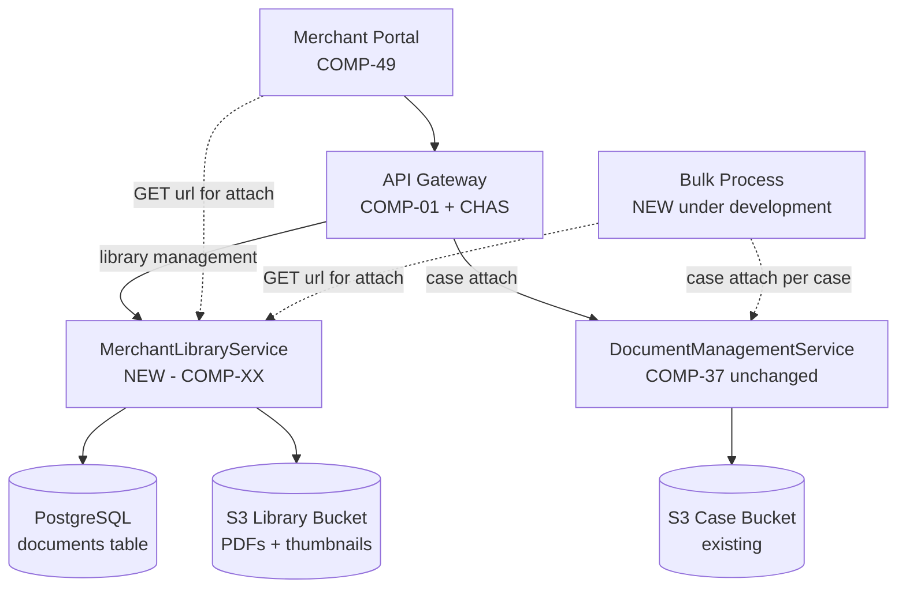
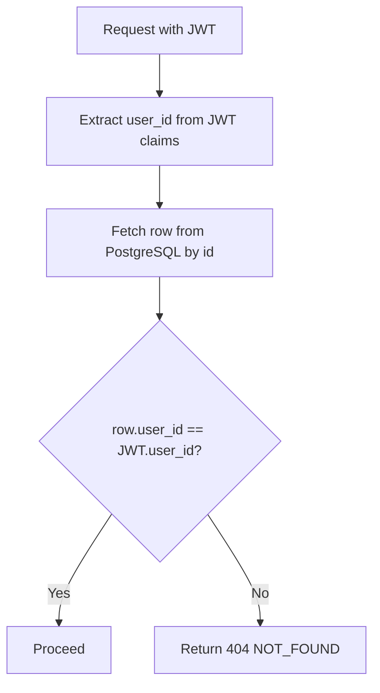
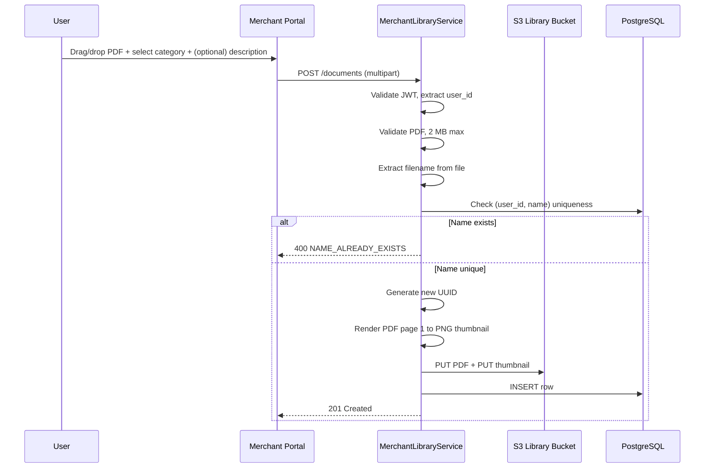
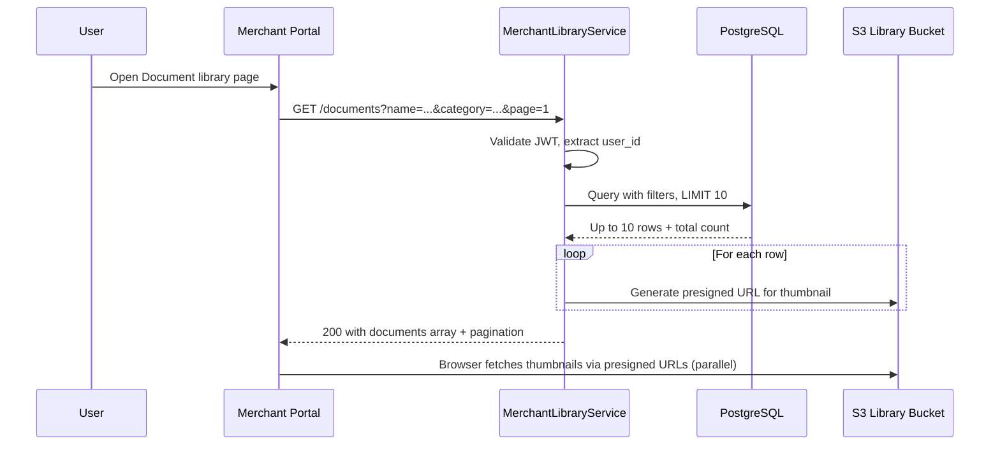
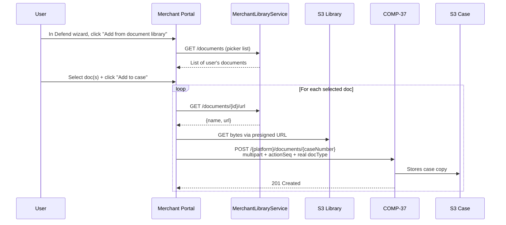
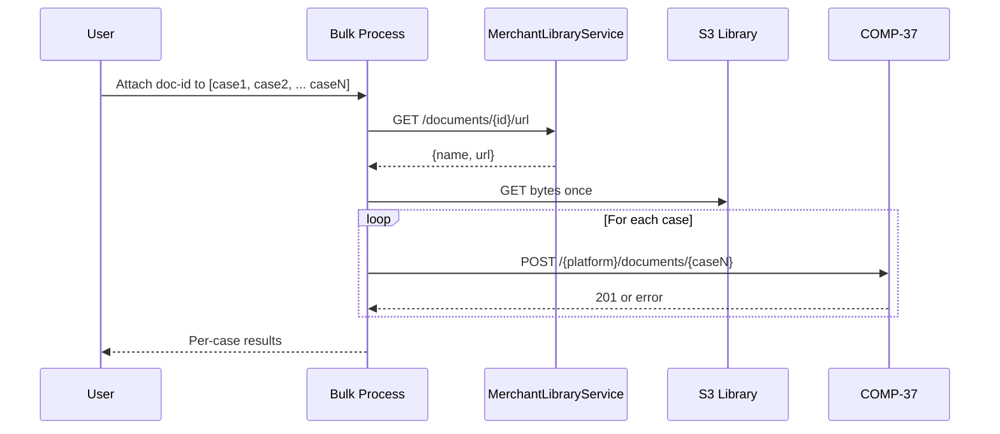

# WDP-PROPOSAL-MERCHANT-DOCUMENT-LIBRARY

**Worldpay Dispute Platform — Proposed Plan for Implementation**
*Version: 2.0 | April 2026*
*Status: 📋 PROPOSED — Awaiting approval*

---

## Status Banner

> **This is a proposed implementation plan.** It captures the confirmed design for a new
> document library feature in WDP, validated against the UI/UX design. Once approved, this
> document will drive: creation of a new component file
> (`WDP-COMP-XX-MERCHANT-LIBRARY-SERVICE.md`), updates to `WDP-COMP-INDEX.md`, `WDP-DB.md`,
> and `WDP-HANDOVER.md`, and a new ADR in `WDP-DECISIONS.md` for the copy model decision.

---

## 1. Executive Summary

WDP users need a way to store reusable evidence documents — terms and conditions, return
policies, purchase agreements — that can be attached to multiple dispute cases without
uploading the same file repeatedly.

This proposal adds a **MerchantLibraryService** component that provides a **per-user**
document library. Each user manages their own library; documents are not shared across
users in a merchant. The UI label "organisation's document library" reflects positioning
(all users are merchants), not data scope.

When a user attaches a library document to a case, bytes are copied into the case evidence
store via the existing `DocumentManagementService` (COMP-37). Case evidence is
self-contained and immutable at the point of submission — independent of any future
changes to the library document. **COMP-37 requires no changes.**

**Key characteristics:**

| Property | Value |
|---|---|
| New component | MerchantLibraryService (COMP-XX) |
| New database table | `documents` — WDP Aurora PostgreSQL (8 columns) |
| New S3 bucket | `merchant-document-library` (us-east-2) |
| Existing components impacted | None — COMP-37 unchanged |
| Library scope | Per-user (user_id from JWT) |
| Evidence model | Copy-on-attach (not reference) |
| Library content | PDF only — 2 MB maximum per upload |
| Versioning | None — same filename on second upload rejected |
| Lifecycle | ACTIVE only — no deprecation, hard delete |

---

## 2. Architecture Overview



**Key points:**
- MerchantLibraryService and COMP-37 have no direct integration
- The caller (Portal or Bulk Process) fetches the presigned URL from MerchantLibraryService, fetches bytes from S3, then posts to COMP-37 with the real `docType`
- Bulk Process orchestrates multi-case attach independently — calls MerchantLibraryService once for the URL, fetches bytes once, then posts to COMP-37 per case

---

## 3. MerchantLibraryService — New Component

### 3.1 Identity

| Field | Value |
|---|---|
| Component name | MerchantLibraryService |
| Component ID | COMP-XX (to be assigned) |
| Type | REST API |
| Status | 📋 Proposed |
| Technology | Spring Boot 3 · Java 17 · WDP EKS cluster |
| Context path | `/merchant/gcp/document-library` |
| Auth model | Spring OAuth2 Resource Server — JWT Bearer, user_id-scoped |
| Database | WDP Aurora PostgreSQL (existing instance) |
| Storage | AWS S3 — new bucket `merchant-document-library` (us-east-2) |
| Kafka | None |

### 3.2 Purpose

MerchantLibraryService manages a user-owned library of reusable evidence documents. It
handles the full library lifecycle: upload with PDF validation and thumbnail generation,
list with name search and category filter, get presigned URL for download or attach,
update mutable metadata (description, category), and hard delete.

The service has no Kafka involvement and no direct involvement in case evidence
processing. Once a document is copied into the case S3 bucket via COMP-37, the library
has no further role in that case's lifecycle.

### 3.3 Responsibilities

| Responsibility | Detail |
|---|---|
| Upload | Validate PDF + size, generate thumbnail, store both in S3, write metadata row |
| List | Return user's documents with optional name search and category filter, paginated 10 per page, sorted alphabetically by name |
| Get URL | Return presigned S3 URL for the PDF — used by download, view, and attach flows |
| Update metadata | Modify description and category only; name is immutable |
| Delete | Hard delete — remove PostgreSQL row and both S3 objects |

### 3.4 What MerchantLibraryService Does NOT Do

| Responsibility | Owner |
|---|---|
| Store case evidence | COMP-37 |
| Publish to Kafka | N/A — no Kafka involvement |
| Orchestrate multi-case attach | Bulk Process |
| Copy bytes to case bucket | Caller (Portal or Bulk Process) fetches bytes and posts to COMP-37 directly |
| Track which cases use a document | Not tracked — not required by product |
| Deprecation lifecycle | Not supported — only ACTIVE documents exist |
| Versioning | Not supported — duplicate name rejected at upload |
| Cross-user sharing | Not supported — library is per-user |

---

## 4. Data Model — PostgreSQL

### 4.1 Table: documents

Location: WDP Aurora PostgreSQL (existing instance — `globaldisputedatabase`)
Owner: MerchantLibraryService
New table — no changes to existing tables.

| # | Column | Type | Purpose |
|---|---|---|---|
| 1 | `id` | UUID | Primary key. Generated on insert. Surfaced in URLs and S3 keys. |
| 2 | `user_id` | VARCHAR(100) | Owner — extracted from JWT on every request. Indexed. |
| 3 | `name` | VARCHAR(200) | Filename derived from uploaded PDF. Unique per user. |
| 4 | `description` | VARCHAR(500) | Optional. Mutable. UI enforces 160-char max. Nullable. |
| 5 | `category` | VARCHAR(50) | Required on upload. Mutable. Values from DisplayCodeService. |
| 6 | `s3_key` | VARCHAR(500) | Full S3 object key. Immutable. Pattern: `library/{user_id}/{id}/{name}`. |
| 7 | `uploaded_at` | TIMESTAMPTZ | Set on insert. |
| 8 | `updated_at` | TIMESTAMPTZ | Set on insert, refreshed on every PATCH. |

### 4.2 Constraints

| Type | Columns | Purpose |
|---|---|---|
| PRIMARY KEY | `id` | Surrogate key |
| UNIQUE | `(user_id, name)` | No two documents with same name per user |
| INDEX | `(user_id)` | Default library list query |
| INDEX | `(user_id, category)` | Filter by category |

### 4.3 What's NOT in the Table

| Concept | Why dropped |
|---|---|
| `status`, `deprecated_at`, `deleted_at` | No deprecation. Hard delete only. ACTIVE is the only state. |
| `merchant_id`, `owner_entity_id`, `owner_entity_level` | Per-user scope per product decision. Can be added later if needed. |
| `version`, `is_latest`, `doc_id` | No system-managed versioning. Same filename = upload rejected. |
| `attached_count` | No delete guard. Counter would be unreliable across services. |
| `file_size_bytes`, `page_count`, `mime_type`, `extension` | PDF only — validated at upload, not needed at runtime. |
| `uploaded_by` separate from `user_id` | Same value. Single column. |
| Thumbnail data | Stored in S3, served via presigned URL. |

### 4.4 Authorization Pattern

Every endpoint:



A user who somehow obtains another user's document UUID receives 404, not 403 — to avoid confirming the existence of another user's documents.

---

## 5. S3 Storage Design

### 5.1 New Bucket

| Property | Value |
|---|---|
| Bucket name | `merchant-document-library` |
| Region | us-east-2 |
| Content | PDF only — 2 MB max per upload |
| Immutability | Each key is globally unique. Same key is never written twice. |
| Retention | S3 lifecycle policy — align with compliance requirements (confirm with team) |
| Encryption | S3 SSE — bucket policy |

### 5.2 Key Pattern

```
PDF:        library/{user_id}/{id}/{name}
Thumbnail:  library/{user_id}/{id}/thumbnail.png
```

**Example PDF key:**
```
library/e1234567/a3f7c291-8b2d-4e1f-9c5a-6e7f8a9b0c1d/Return Policy.pdf
```

**Example thumbnail key:**
```
library/e1234567/a3f7c291-8b2d-4e1f-9c5a-6e7f8a9b0c1d/thumbnail.png
```

The PDF and thumbnail share a key prefix. Deleting a document removes both objects.

### 5.3 Thumbnail Approach

Thumbnails are generated at upload time and stored as PNG in S3 alongside the PDF. The
list endpoint returns presigned S3 URLs for each thumbnail (1 hour validity). The UI
renders them with standard `` — browser handles parallel fetching
and caching natively.

**Why presigned URL over base64 in DB:**
- Smaller list response payload (~5 KB vs ~300 KB for 10 documents)
- Faster perceived performance — list renders immediately, thumbnails fade in
- Browser handles caching natively
- DB stays lean
- Standard pattern across document management systems

---

## 6. Key Flows

### 6.1 Upload to Library



### 6.2 List Library (with Search and Filter)



### 6.3 Single-Case Attach (from Defend wizard)



### 6.4 Multi-Case Attach (Bulk Process)



### 6.5 Download / View / Update / Delete

These follow the standard request-response patterns documented in the endpoint
specifications below.

---

## 7. API Surface — 5 Endpoints

Base URL: `https://{host}/merchant/gcp/document-library`
All endpoints require Bearer JWT. `user_id` is extracted from JWT claims — never accepted
as request parameter.

| # | Method | Path | Purpose |
|---|---|---|---|
| 1 | POST | `/documents` | Upload new document (multipart) |
| 2 | GET | `/documents` | List user's library — optional `name`, `category`, `page` |
| 3 | GET | `/documents/{id}/url` | Get presigned S3 URL for download, view, or attach |
| 4 | PATCH | `/documents/{id}` | Update description and/or category |
| 5 | DELETE | `/documents/{id}` | Hard delete |

---

### 7.1 POST /documents — Upload

**Steps:**

1. Receive multipart request
2. Validate JWT is present and extract user_id from claims
3. Extract file binary, category, and optional description from multipart body
4. Validate required fields: file present, category in allowed list, description (if provided) ≤ 160 chars
5. Validate file: content_type is `application/pdf`, size ≤ 2 MB, no invalid filename characters
6. Extract filename from uploaded file (sanitise whitespace and control characters)
7. Check name uniqueness: `SELECT id FROM documents WHERE user_id = ? AND name = ?` — if exists, return 400 NAME_ALREADY_EXISTS
8. Generate new document id (UUID v4)
9. Build S3 keys: `library/{user_id}/{id}/{name}` and `library/{user_id}/{id}/thumbnail.png`
10. Generate thumbnail in memory: render PDF page 1 to PNG (~200×260 px); if rendering fails, log warning and continue
11. PUT PDF to S3
12. PUT thumbnail to S3 (best-effort)
13. INSERT row into PostgreSQL with `uploaded_at = updated_at = NOW()`
14. If PostgreSQL insert fails after S3 PUTs succeeded: best-effort DELETE both S3 objects to avoid orphans, return 500
15. Return 201 Created with document metadata

**Request:**

```
POST https://api.disputes.worldpay.com/merchant/gcp/document-library/documents

Authorization: Bearer {JWT}
Content-Type: multipart/form-data; boundary=...

[multipart body with file, category, description]
```

**Success Response (201):**

```json
{
  "id": "a3f7c291-8b2d-4e1f-9c5a-6e7f8a9b0c1d",
  "name": "Return Policy.pdf",
  "category": "RETURN_POLICY",
  "description": "Customer return policy effective 2025",
  "uploadedBy": "e1234567",
  "uploadedAt": "2025-06-05T08:00:00Z",
  "updatedAt": "2025-06-05T08:00:00Z"
}
```

**Errors:**

| Status | Code | When |
|---|---|---|
| 400 | NAME_ALREADY_EXISTS | A document with this filename already exists for the user |
| 400 | INVALID_FILE_TYPE | File is not a PDF |
| 400 | INVALID_CATEGORY | Category value not in allowed list |
| 400 | DESCRIPTION_TOO_LONG | Description over 160 characters |
| 400 | MISSING_REQUIRED_FIELD | Required field missing from body |
| 401 | UNAUTHORIZED | JWT missing or invalid |
| 413 | FILE_TOO_LARGE | File exceeds 2 MB |
| 500 | INTERNAL_ERROR | S3 or PostgreSQL failure |

---

### 7.2 GET /documents — List User's Library

**Steps:**

1. Receive request
2. Validate JWT and extract user_id
3. Parse optional query params: `name`, `category`, `page` (default 1)
4. Validate: `name` (if provided) ≥ 3 characters → 400 NAME_TOO_SHORT; `category` (if provided) in allowed list → 400 INVALID_CATEGORY; `page` ≥ 1 → 400 INVALID_PAGE
5. Build SQL: `WHERE user_id = ? AND name ILIKE '%name%' AND category = ? ORDER BY name ASC LIMIT 10 OFFSET (page-1)*10`
6. Execute count query in parallel for pagination metadata
7. For each row, generate presigned S3 URL for thumbnail (1 hour validity); null if thumbnail does not exist
8. Build response with documents array and pagination metadata
9. Return 200 OK

**Request URLs:**

```
GET /documents                                        # default
GET /documents?name=return                            # search by name
GET /documents?category=RETURN_POLICY                 # filter
GET /documents?page=2                                 # pagination
GET /documents?name=policy&category=T_AND_C&page=2    # combined
```

**Success Response (200):**

```json
{
  "documents": [
    {
      "id": "a3f7c291-8b2d-4e1f-9c5a-6e7f8a9b0c1d",
      "name": "Return Policy.pdf",
      "category": "RETURN_POLICY",
      "description": "Customer return policy effective 2025",
      "uploadedBy": "e1234567",
      "uploadedAt": "2025-06-05T08:00:00Z",
      "updatedAt": "2025-06-05T08:00:00Z",
      "thumbnailUrl": "https://wdp-merchant-library.s3.us-east-2.amazonaws.com/library/e1234567/a3f7c291-.../thumbnail.png?X-Amz-..."
    }
  ],
  "totalCount": 11,
  "currentPage": 1,
  "totalPages": 2,
  "pageSize": 10
}
```

**Errors:**

| Status | Code | When |
|---|---|---|
| 400 | NAME_TOO_SHORT | Name query parameter under 3 characters |
| 400 | INVALID_CATEGORY | Category not in allowed list |
| 400 | INVALID_PAGE | Page number less than 1 |
| 401 | UNAUTHORIZED | JWT missing or invalid |
| 500 | INTERNAL_ERROR | Database failure |

---

### 7.3 GET /documents/{id}/url — Get Presigned URL

**Steps:**

1. Receive request
2. Validate JWT and extract user_id
3. Validate id is a well-formed UUID → 400 INVALID_ID
4. `SELECT id, user_id, name, s3_key FROM documents WHERE id = ?`
5. If no row → 404 NOT_FOUND
6. Verify ownership: if `row.user_id ≠ JWT.user_id` → 404 NOT_FOUND
7. Generate presigned S3 GET URL using row.s3_key (15 minute validity)
8. Return 200 OK with `{id, name, url}`

**Request:**

```
GET https://api.disputes.worldpay.com/merchant/gcp/document-library/documents/a3f7c291-.../url

Authorization: Bearer {JWT}
```

**Success Response (200):**

```json
{
  "id": "a3f7c291-8b2d-4e1f-9c5a-6e7f8a9b0c1d",
  "name": "Return Policy.pdf",
  "url": "https://wdp-merchant-library.s3.us-east-2.amazonaws.com/library/e1234567/a3f7c291-.../Return%20Policy.pdf?X-Amz-Expires=900&..."
}
```

**Caller usage:**

| Use case | How caller uses the response |
|---|---|
| Download | `window.location.href = url` |
| Inline view | Embed `url` in iframe or PDF viewer |
| Case attach | Fetch bytes from `url`, POST to COMP-37 with `name` as filename |

**Errors:**

| Status | Code | When |
|---|---|---|
| 400 | INVALID_ID | id is not a valid UUID |
| 401 | UNAUTHORIZED | JWT missing or invalid |
| 404 | NOT_FOUND | Document does not exist or belongs to a different user |
| 500 | INTERNAL_ERROR | S3 URL generation failure |

---

### 7.4 PATCH /documents/{id} — Update Metadata

**Steps:**

1. Receive request
2. Validate JWT and extract user_id
3. Validate id is a well-formed UUID → 400 INVALID_ID
4. Parse JSON body
5. Validate body:
   - Reject any field other than `description` and `category` → 400 IMMUTABLE_FIELD
   - If `description` present: null is treated as "no change"; empty string clears (sets DB to NULL); otherwise validate length ≤ 160 → 400 DESCRIPTION_TOO_LONG
   - If `category` present: must be non-null, non-empty, in allowed list → 400 INVALID_CATEGORY
   - If both fields are effectively "no change" → 400 NO_FIELDS_TO_UPDATE
6. `SELECT id, user_id FROM documents WHERE id = ?`
7. If no row → 404 NOT_FOUND
8. Verify ownership; if mismatch → 404 NOT_FOUND
9. Build dynamic UPDATE setting only the fields actually changing, plus `updated_at = NOW()`
10. Execute UPDATE
11. Re-read row and return current state
12. Return 200 OK

**Update convention:**

| User intent | Body | Result |
|---|---|---|
| Set new description | `{"description": "text"}` | Description = "text" |
| Clear description | `{"description": ""}` | Description = NULL |
| Leave description unchanged | omit field, or `{"description": null}` | No change |
| Switch category | `{"category": "T_AND_C"}` | Category replaced |
| Leave category unchanged | omit field | No change |
| Clear category | `{"category": null}` or `{"category": ""}` | 400 — category cannot be cleared, use OTHER |

**Request:**

```
PATCH https://api.disputes.worldpay.com/merchant/gcp/document-library/documents/a3f7c291-...

Authorization: Bearer {JWT}
Content-Type: application/json
```

**Body example:**

```json
{
  "description": "Updated for 2026",
  "category": "T_AND_C"
}
```

**Success Response (200):**

```json
{
  "id": "a3f7c291-8b2d-4e1f-9c5a-6e7f8a9b0c1d",
  "name": "Return Policy.pdf",
  "category": "T_AND_C",
  "description": "Updated for 2026",
  "uploadedBy": "e1234567",
  "uploadedAt": "2025-06-05T08:00:00Z",
  "updatedAt": "2026-04-20T10:15:00Z"
}
```

**Errors:**

| Status | Code | When |
|---|---|---|
| 400 | INVALID_ID | id is not a valid UUID |
| 400 | NO_FIELDS_TO_UPDATE | Neither description nor category provided with changes |
| 400 | IMMUTABLE_FIELD | Body contains a field other than description or category |
| 400 | DESCRIPTION_TOO_LONG | Description over 160 characters |
| 400 | INVALID_CATEGORY | Category null, empty, or not in allowed list |
| 401 | UNAUTHORIZED | JWT missing or invalid |
| 404 | NOT_FOUND | Document does not exist or belongs to different user |
| 500 | INTERNAL_ERROR | Database failure |

---

### 7.5 DELETE /documents/{id} — Hard Delete

**Steps:**

1. Receive request
2. Validate JWT and extract user_id
3. Validate id is a well-formed UUID → 400 INVALID_ID
4. `SELECT id, user_id, s3_key FROM documents WHERE id = ?`
5. If no row → 404 NOT_FOUND
6. Verify ownership; if mismatch → 404 NOT_FOUND
7. Build S3 keys: `doc_key = row.s3_key`, `thumb_key = library/{user_id}/{id}/thumbnail.png`
8. `DELETE FROM documents WHERE id = ? AND user_id = ?` (PostgreSQL first — ensures user-visible consistency)
9. DELETE S3 objects (best-effort, after PostgreSQL succeeds); if S3 delete fails, log warning, do not fail the request
10. Return 204 No Content

**Why PostgreSQL first, then S3:**

- If S3 deleted first and PostgreSQL fails → row exists with broken download link (bad UX)
- If PostgreSQL deleted first and S3 fails → row is gone from user view, S3 orphan can be swept by periodic job (acceptable operational concern)

**Request:**

```
DELETE https://api.disputes.worldpay.com/merchant/gcp/document-library/documents/a3f7c291-...

Authorization: Bearer {JWT}
```

**Success Response:** `204 No Content` (no body)

**Errors:**

| Status | Code | When |
|---|---|---|
| 400 | INVALID_ID | id is not a valid UUID |
| 401 | UNAUTHORIZED | JWT missing or invalid |
| 404 | NOT_FOUND | Document does not exist or belongs to different user |
| 500 | INTERNAL_ERROR | PostgreSQL delete failure |

---

## 8. Key Design Decisions

| # | Decision | Rationale |
|---|---|---|
| 1 | Separate service, not extended COMP-37 | COMP-37 is case-scoped with unresolved technical debt. Library is user-scoped with different lifecycle. |
| 2 | Copy model, not reference | Copy makes case evidence self-contained and immutable at submission. Reference would create runtime dependency from case processing back to the library. |
| 3 | PDF only, 2 MB maximum | UI design constraint. Eliminates need for conversion, mime_type tracking, large-file handling. |
| 4 | Per-user library scope | Product decision. UI label "organisation's library" reflects positioning, not data scope. |
| 5 | No system-managed versioning | Same filename on second upload rejected with 400. User chooses naming convention. |
| 6 | No deprecation, hard delete only | Product decision. Case evidence is self-contained via copy model — library deletion does not affect cases. |
| 7 | No delete guard, no COMP-37 integration | Tracking which cases use a library doc is not required by product. COMP-37 requires zero changes. |
| 8 | Thumbnail in S3 + presigned URL in list response | Smaller list payloads, browser-native caching, lean DB. Standard pattern. |
| 9 | PATCH allows description and category only | Name is immutable (it's an identifier). Other columns are derived or audit. |
| 10 | Clear-by-empty-string convention | Avoids JSON null/absent ambiguity. Description clearable via empty string. Category never clearable — switch to OTHER instead. |
| 11 | Pagination fixed at 10, sort fixed alphabetical | UI design constraint — list view does not expose page size or sort options. |
| 12 | Search by name only, minimum 3 characters, partial match | Single search field per UI. Min 3 enforced on both client and API. |
| 13 | 404 not 403 on ownership mismatch | Avoids confirming existence of other users' documents. Standard isolation pattern. |
| 14 | PostgreSQL row delete before S3 object delete | Ensures user-visible consistency. S3 orphans handled by periodic sweep. |

---

## 9. Alternatives Considered and Dropped

| # | Alternative | Reason Dropped |
|---|---|---|
| 1 | Reference model (cases point to library S3 object) | Library mutation would affect case evidence. Copy guarantees evidence integrity. |
| 2 | Extending COMP-37 with library endpoints | COMP-37 internal logic anchored to caseNumber. Library has none. |
| 3 | System-managed versioning with version + is_latest | Added complexity in data model, upload logic, UI, and case evidence filenames. |
| 4 | `attached_count` counter in library service | Counter would be unreliable across services. |
| 5 | COMP-37 lookup for delete guard and "which cases" view | Product confirmed neither feature is required. COMP-37 stays unchanged. |
| 6 | DynamoDB for library metadata | DEC-012 platform standard. Library volume does not justify DynamoDB. |
| 7 | Base64 thumbnails in DB | 60× larger list payloads. DB bloat. Slower first render. |
| 8 | Async multi-case orchestration in MerchantLibraryService | Bulk Process already owns this for bulk accept and contest. |
| 9 | Hierarchical or merchant-wide scope on day one | Product decision — keep simple. Add later if needed via schema migration. |

---

## 10. Integration Points

### 10.1 Inbound

| Source | Protocol | Purpose |
|---|---|---|
| Merchant Portal (COMP-49) | REST via API Gateway | All library operations + attach flow `GET /url` |
| Bulk Process (under development) | REST via API Gateway | Attach flow `GET /url` for multi-case |

### 10.2 Outbound

| Target | Protocol | Purpose | On Failure |
|---|---|---|---|
| WDP Aurora PostgreSQL | JPA / HikariCP | Read and write `documents` table | HTTP 500 to caller |
| AWS S3 `merchant-document-library` | AWS SDK v2 | Store/retrieve PDFs and thumbnails; generate presigned URLs | HTTP 500 to caller |
| CHAS (COMP-03) | Via API Gateway | JWT-based authorisation | HTTP 401/403 to caller |

### 10.3 Kafka

None — no producer, no consumer.

### 10.4 COMP-37 Integration

**None.** MerchantLibraryService and COMP-37 have no direct integration. The Portal and
Bulk Process are responsible for calling both services independently during the attach
flow.

---

## 11. Non-Functional Considerations

| Concern | Approach |
|---|---|
| Auth | Spring OAuth2 Resource Server — JWT Bearer. user_id extracted from JWT claims on every request. |
| Timeouts | Configure explicit connection + read timeouts on S3 and PostgreSQL calls (DEC-014 standard). |
| Logging | Logstash via `logstash-logback-encoder` — platform standard. |
| Observability | OpenTelemetry auto-instrumentation + Prometheus metrics on `/actuator/prometheus`. |
| Retention | S3 lifecycle policy — align with compliance team requirements. |
| Scaling | HPA on CPU. Library is low-volume compared to case processing — minimal pod footprint. |
| Backup | Standard Aurora backup. Table is small (metadata only). S3 bucket versioning optional. |

---

## 12. Documents to Update on Approval

| Document | Update |
|---|---|
| `WDP-COMP-INDEX.md` | Register MerchantLibraryService as COMP-XX. Register Bulk Process as COMP-YY (under development). |
| `WDP-DB.md` | New `documents` table under WDP Aurora PostgreSQL — owned by MerchantLibraryService. New `merchant-document-library` S3 bucket. |
| `WDP-HANDOVER.md` | Note design session complete. Note new components pending registration. |
| `WDP-DECISIONS.md` | New ADR — Copy model for library document attachment. Record rationale. |
| `WDP-COMP-XX-MERCHANT-LIBRARY-SERVICE.md` | New file — create using WDP component template, populated from this proposal. |

---

## 13. Open Items

| # | Item | Owner | Required Before |
|---|---|---|---|
| 1 | Confirm category value taxonomy with DisplayCodeService | Product team | Implementation |
| 2 | Confirm S3 retention policy with compliance team | Compliance team | Production deployment |
| 3 | Confirm UI design for edit modal (PATCH endpoint) | UI team | Implementation |
| 4 | Confirm Bulk Process design includes library-document attach flow | Bulk Process team | Bulk Process production |
| 5 | Periodic S3 orphan sweep job design | Ops team | Production deployment |

---

## 14. Summary

| Aspect | Final |
|---|---|
| Component | MerchantLibraryService (new, COMP-XX) |
| Database table | `documents` — 8 columns |
| S3 bucket | `merchant-document-library` (new) |
| S3 key pattern | `library/{user_id}/{id}/{name}` |
| Library scope | Per-user |
| Endpoints | 5 (POST, GET list, GET url, PATCH, DELETE) |
| File constraint | PDF only, 2 MB maximum |
| Versioning | None — same filename rejected |
| Lifecycle | ACTIVE only, hard delete |
| Thumbnail | Generated at upload, stored in S3, served via presigned URL |
| Search | By name, minimum 3 characters, partial match, paginated 10 per page |
| COMP-37 impact | None |
| Bulk Process | Calls MerchantLibraryService for `GET /url` during attach flow; does not call for any other operation |
| Kafka | None |

---

## 15. Change Log

| Date | Version | Author | Change |
|---|---|---|---|
| April 2026 | 1.0 | Architecture team | Initial proposal |
| April 2026 | 2.0 | Architecture team | Reconciled with UI design. Per-user scope. 8-column table. 5 endpoints. Thumbnails in S3. COMP-37 unchanged. |

---

*End of proposal document.*
*Upload to project folder and reference from `WDP-HANDOVER.md` as active design work.*
