# WDP-COMP-01-API-GATEWAY
**Worldpay Dispute Platform — Component Reference**
*Version: 2.0 DRAFT 🔍 | April 2026*
*Extracted from: `wdp-gateway` (wp-mfd/wdp-gateway) — source-verified by Copilot CLI 2026-04-30*
*Architect-confirmed: PENDING*

---

## ━━━ CORE SKELETON ━━━━━━━━━━━━━━━━━━━━━━━━━━━━━━━━━━━━━━

---

## Identity

| Field                | Value                                                                               |
|----------------------|-------------------------------------------------------------------------------------|
| **Name**             | `API Gateway`                                                                       |
| **Type**             | `REST API — Reactive Reverse Proxy with Security Filter Pipeline`                   |
| **Repository**       | `wdp-gateway` (wp-mfd/wdp-gateway)                                                  |
| **Technology**       | Spring Cloud Gateway 2024.0.0 · Spring Boot 3.4.1 · Java 17 · WebFlux / Netty     |
| **Listen port**      | `8082` — confirmed in `application.yml` and K8s manifest. No discrepancy.          |
| **Status**           | `✅ Production`                                                                     |
| **Doc status**       | `📝 DRAFT 🔍` — source-verified 2026-04-30, architect confirmation pending         |
| **Sections present** | `Core · Block A`                                                                    |

---

## Purpose

**What it does**

The API Gateway is the single entry point for all WDP traffic regardless of origin —
Merchant Portal (via Akamai), Ops Portal (direct), and external merchant systems
(via Akamai → APIGEE). It runs on a reactive WebFlux/Netty stack at port 8082 and
applies a 4-layer security filter pipeline to every inbound request before proxying
it to the appropriate backend microservice.

All routing configuration is stored in the `wdp.api_route` PostgreSQL table (26+ routes
confirmed in production — zero routes are defined in source code). Routes are loaded into
memory at startup via two separate R2DBC operations: once by
`AuthenticationFilter.createWhiteList()` (blocking `collectList().block()`) and once by
`ApiPathRouteLocatorImpl` (reactive). Routes are cached by Spring Cloud Gateway's
`CachingRouteLocator`. Route changes require a pod restart. The `auth_exceptions` column
is a comma-delimited string of JWT-exempt paths; values are not trimmed on split, creating
a silent whitelist-miss risk if the DB column contains spaces after commas.

The four filters execute in this order (with a non-determinism caveat on steps 3 and 4):

**Step 1 — JWT Authentication** (`AuthenticationFilter` / Spring Security
`SecurityWebFilterChain`). Validates the caller's Bearer token against trusted IDP
issuers. Issuer URLs are injected from environment configuration at startup. Public keys
are fetched from each issuer's `/.well-known/jwks.json` endpoint and cached by the Nimbus
library using its default key-ID-miss eviction policy — no per-request IDP call, no
TTL-based cache expiry, no scheduled refresh. Paths listed in the `authExceptions` column
of `wdp.api_route` (loaded at startup with Ant-style matching) bypass this step entirely.
JWT validation failure returns 401 with a Spring Security default JSON error body and
`WWW-Authenticate` header.

**Step 2 — Request Logging** (`LoggingGlobalFilter`, order = -1). Logs the inbound path
and matched route identifier on the inbound pass. On the outbound pass (after the chain
returns), logs the same inbound path and the HTTP response status code. Does not log
response time or inspect the response body. There is no null guard on the route attribute:
if no route was matched and the route attribute is null, a `NullPointerException` is thrown
and the request produces a 500.

**Step 3 — Region-Based Role Authorization** (`AuthorizationFilter`, order = 0). Extracts
the region from the URL path by case-insensitive substring match against exactly four
constants: `/US/`, `/UK/`, `/PIN/`, `/NAP/`. CORE, VAP, and LATAM are not recognised
region segments. If no region segment is present, the filter is skipped and the request
passes through. If a region is found, firm type is determined by the same `iss`-claim
substring check as Step 4 (match for `us_worldpay_fis_int`). Internal firms pass through
directly. For external firms, the JWT `AuthorizationList` claim is intersected against the
configured allowed roles for that region and firm type. Absence of the `AuthorizationList`
claim throws an uncaught `NullPointerException`, producing a 500. An empty intersection
returns 403 with an empty body.

**Step 4 — Case-Level Entity Authorization** (`CaseNumberFilter`, order = 0). If both a
recognised platform and a valid case ID are present in the URL path, an external
authorization service is called. Platform is derived from the same four region constants:
`/US/` or `/PIN/` → PIN; `/UK/` or `/NAP/` → NAP. The filter explicitly guards
`platform != null && caseId != null` before calling the authorization service — if either
is null, the filter passes through without any external call. Case ID is detected by
scanning path segments for exactly 12 characters, starting with an alphabetic character,
with exactly 2 alphabetic characters total. Internal firms (JWT `iss` claim contains
`us_worldpay_fis_int`) are auto-authorized without an external call. NAP requests call
UAMS `/authorize`; PIN requests call CHAS `/authorize`. Any non-2xx response or network
exception returns 403 (fail-closed, empty body). There is no timeout configured on either
call — a hung dependency blocks the calling Netty event-loop thread indefinitely.

**⚠️ Both UAMS and CHAS calls use blocking `RestTemplate` executing directly on a Reactor
Netty event-loop thread. There is no thread offloading. Under load, a slow or degraded
authorization service will exhaust event-loop threads and stall the entire gateway.**

**⚠️ Steps 3 and 4 both have `order = 0` with no secondary ordering mechanism.
Their relative execution order is genuinely non-deterministic across JVM restarts.**

After all filters pass, the gateway applies a per-route path rewrite (regex substitution
using `originalPathRegex` and `replacementPath` from `wdp.api_route`) and proxies the
request to the backend URI. No other request or response transformation is applied. Body
bytes are passed through as an opaque stream.

**What it does NOT do**

- Does not write to any database table. The only database interaction is reading
  `wdp.api_route` at startup.
- Does not inspect, log, cache, or transform request or response bodies.
- Does not log response time.
- Does not perform rate limiting. This is delegated to Akamai and APIGEE.
- Does not use a service-to-service token when calling UAMS or CHAS. It forwards the
  original caller's Bearer JWT as-is. An `oauth2-client` credential named `wdp-internal-auth`
  exists in all environment YAMLs but uses the wrong Spring Boot property namespace
  (`spring.security.oauth2.resourceserver.client` instead of the correct
  `spring.security.oauth2.client`). These properties are not loaded by Spring Boot's OAuth2
  client auto-configuration. Dead at both code level and property-binding level.
- Does not set a meaningful `v-correlation-id` header on UAMS or CHAS calls.
  `RequestCorrelation.setId()` is never called anywhere in the codebase. The header is
  always sent as null. `ThreadLocal` is also architecturally incompatible with the reactive
  WebFlux threading model.
- Does not call the CHAS `/entity-authorize` endpoint. The routing capability exists in
  `RestInvoker` but `entityHierarchy` is always null in the current filter pipeline — this
  path is never activated.
- Does not produce to or consume from Kafka.
- Does not apply Resilience4j circuit breakers, rate limiters, bulkheads, or retry.
- Does not authorize CORE, VAP, or LATAM requests at the platform or case level. These
  platform types are not recognised anywhere in the gateway. Requests pass through Steps 3
  and 4 with JWT validation only.
- Does not refresh JWK public key sets on a schedule. Nimbus cache: key-ID-miss eviction
  only, no TTL.

---

## Internal Processing Flow

```mermaid
flowchart TD
    IN["External Caller
    Merchant Portal via Akamai
    Ops Portal — direct
    B2B via Akamai → APIGEE"]

    NGINX["NGINX Ingress Controller
    Path-based routing: /api/merchant/gcp
    7 XL-Deploy hostname placeholders
    All route to port 8082"]

    NETTY["Spring WebFlux / Netty — Port 8082
    application.yml and K8s containerPort confirmed"]

    WL{{"Path in JWT whitelist?
    authExceptions from wdp.api_route
    Ant-style match
    ⚠️ Comma-split without trim"}}

    JWT["Step 1 — JWT Authentication
    Spring Security SecurityWebFilterChain
    Bearer token or ?jwt / ?access_token param
    Validate vs Nimbus-cached JWK Set
    JWK cache: key-ID-miss eviction — no TTL"]

    E401["↩ 401 Unauthorized
    Spring Security default JSON body
    WWW-Authenticate header"]

    LOG_IN["Step 2 — LoggingGlobalFilter · order = -1
    Log path + matched route ID
    ⚠️ No null guard on route attribute"]

    NULL_ROUTE{{"Route attribute null?
    No route matched for path"}}

    E500_NPE1["↩ 500 Internal Server Error
    NullPointerException
    LoggingGlobalFilter — route attr null"]

    STEP3_4_ORDER["⚠️ Steps 3 and 4 — both order = 0
    No secondary ordering mechanism
    Execution order NON-DETERMINISTIC"]

    REG{{"Step 3 — AuthorizationFilter · order = 0
    Region segment in URL path?
    /US/ /UK/ /PIN/ /NAP/ — case-insensitive
    CORE / VAP / LATAM not recognised"}}

    CLAIM{{"AuthorizationList JWT claim
    present?"}}

    E500_NPE2["↩ 500 Internal Server Error
    NullPointerException
    AuthorizationList claim absent"]

    FIRM3{{"Internal firm?
    iss claim contains us_worldpay_fis_int"}}

    ROLES{{"JWT AuthorizationList ∩ allowed roles
    for region + firm type — non-empty?"}}

    E403_ROLES["↩ 403 Forbidden · Empty body"]

    CASE{{"Step 4 — CaseNumberFilter · order = 0
    Platform AND case ID both non-null?
    Platform: /US/ or /PIN/ → PIN
              /UK/ or /NAP/ → NAP
    Case ID: 12-char / 2-alpha / first-char-alpha
    Filter guards both before calling service"}}

    FIRM4{{"Internal firm?
    iss claim contains us_worldpay_fis_int"}}

    AUTO_INT["Auto-authorized
    Internal firm — no external call"]

    PLAT{{"Platform type?"}}

    UAMS["Call UAMS /authorize · NAP platform
    ⚠️ Blocking RestTemplate on Netty event-loop
    Caller JWT forwarded as-is
    v-correlation-id always null
    No timeout / no retry / no circuit breaker"]

    CHAS["Call CHAS /authorize · PIN platform
    ⚠️ Blocking RestTemplate on Netty event-loop
    Caller JWT forwarded as-is
    v-correlation-id always null
    No timeout / no retry / no circuit breaker"]

    E403_UAMS["↩ 403 Forbidden · Empty body
    UAMS non-2xx or RestClientException"]

    E403_CHAS["↩ 403 Forbidden · Empty body
    CHAS non-2xx or RestClientException"]

    REWRITE["Path Rewrite
    originalPathRegex → replacementPath
    from wdp.api_route cache"]

    PROXY["Proxy to Backend
    uri from wdp.api_route
    Opaque body passthrough"]

    LOG_OUT["LoggingGlobalFilter — outbound pass
    Log: inbound path + HTTP status code
    No response time · No body inspection"]

    BACKEND["Backend HTTP Response
    Proxied as-is to caller"]

    E502["↩ 502 / 504
    Backend unreachable or Netty timeout"]

    IN --> NGINX --> NETTY
    NETTY --> WL
    WL -->|"Whitelisted — JWT bypassed"| LOG_IN
    WL -->|"Not whitelisted"| JWT
    JWT -->|"Invalid / missing / untrusted issuer"| E401
    JWT -->|"JWT valid"| LOG_IN
    LOG_IN --> NULL_ROUTE
    NULL_ROUTE -->|"Null — NPE thrown"| E500_NPE1
    NULL_ROUTE -->|"Route attr present"| STEP3_4_ORDER
    STEP3_4_ORDER --> REG
    STEP3_4_ORDER --> CASE
    REG -->|"No region segment — filter skips"| CASE
    REG -->|"Region found"| CLAIM
    CLAIM -->|"Absent — NPE thrown"| E500_NPE2
    CLAIM -->|"Present"| FIRM3
    FIRM3 -->|"Internal"| CASE
    FIRM3 -->|"External"| ROLES
    ROLES -->|"Non-empty intersection"| CASE
    ROLES -->|"Empty intersection"| E403_ROLES
    CASE -->|"No platform OR no case ID"| REWRITE
    CASE -->|"Both detected"| FIRM4
    FIRM4 -->|"Internal"| AUTO_INT
    FIRM4 -->|"External"| PLAT
    AUTO_INT --> REWRITE
    PLAT -->|"NAP"| UAMS
    PLAT -->|"PIN"| CHAS
    UAMS -->|"HTTP 2xx"| REWRITE
    UAMS -->|"Non-2xx or exception"| E403_UAMS
    CHAS -->|"HTTP 2xx"| REWRITE
    CHAS -->|"Non-2xx or exception"| E403_CHAS
    REWRITE --> PROXY
    PROXY --> LOG_OUT --> BACKEND
    PROXY -->|"Backend unreachable"| E502
```

---

## Boundaries

### Inbound Interfaces

| Source | Protocol | Endpoint / Trigger | Payload |
|--------|----------|--------------------|---------|
| Merchant Portal | HTTPS via Akamai → NGINX Ingress | Path prefix `/api/merchant/gcp` — routes by `wdp.api_route` | JSON REST payloads — opaque to gateway |
| Ops Portal | HTTPS direct → NGINX Ingress | Path prefix `/api/merchant/gcp` | JSON REST payloads — opaque |
| B2B External Merchants | HTTPS via Akamai → APIGEE → NGINX Ingress | Path prefix `/api/merchant/gcp` | JSON REST payloads — opaque |

### Outbound Interfaces

| Target | Protocol | Endpoint / Resource | Purpose | On Failure |
|--------|----------|---------------------|---------|------------|
| `wdp.api_route` | R2DBC PostgreSQL (startup only) | `findAll()` — no custom query | Route configuration load — called twice at startup | Pod fails to start |
| UAMS | REST — blocking `RestTemplate` | `POST {user.access-management-api-url}/authorize` | Case-level authorization — NAP platform | 403 empty body |
| CHAS | REST — blocking `RestTemplate` | `POST {user.core-hierarchy-authorization-service-url}/authorize` | Case-level authorization — PIN platform | 403 empty body |
| Backend microservices | HTTP reactive proxy | Per-route URIs from `wdp.api_route` | Forward authorized requests | 502 / 504 |

---

## Database Ownership

### Tables Owned

This component owns no database state. It is stateless.

### Tables Read

| Schema.Table | Owned By | Why Accessed |
|--------------|----------|--------------|
| `wdp.api_route` | ⚠️ Write owner TBC — team confirmation required | Route predicates, path rewrite rules, backend URIs, JWT whitelist paths. Read twice at startup. Cached for pod lifetime. No `@Transactional` — default R2DBC auto-commit read. |

---

## Deployment and Operations

### Kubernetes

| Parameter | Value | Source |
|-----------|-------|--------|
| Resource type | `Deployment` | `resources.yaml:L2` |
| Container port | `8082` | `resources.yaml:L54` |
| Application listen port | `8082` (`server.port: 8082` in `application.yml:L2`) — consistent with K8s | Confirmed |
| Replica count | `{{ replicas-wdp-gateway }}` — XL Deploy placeholder | `resources.yaml:L8` |
| Memory limit | `2048Mi` | `resources.yaml:L57` |
| Memory request | `256Mi` | `resources.yaml:L59` |
| CPU limit | **Not configured** | — |
| CPU request | **Not configured** | — |
| HPA | **Absent** | — |
| PodDisruptionBudget | **Absent** | — |
| Rolling update maxSurge | `1` | `resources.yaml:L11` |
| Rolling update maxUnavailable | `0` | `resources.yaml:L12` |
| `minReadySeconds` | ⚠️ **Misplaced — inoperative.** Value `30` placed at `spec.template.spec` (PodSpec). Not a valid PodSpec field. Kubernetes silently ignores it. Correct location: `spec.minReadySeconds` at Deployment level. | `resources.yaml:L24` |
| Topology spread | Present. `topologyKey: kubernetes.io/hostname`, `maxSkew: 1`, `whenUnsatisfiable: ScheduleAnyway`. Label selector correctly matches pod labels. | `resources.yaml:L25-L31` |
| Ingress | 7 XL Deploy hostname placeholders. All use **path-based routing** at `/api/merchant/gcp` (`pathType: ImplementationSpecific`). All route to port 8082. | `resources.yaml:L104-L184` |

**Ingress hostname placeholders (all → port 8082, path `/api/merchant/gcp`):**
`{{ hostName }}` · `{{ externalHostName }}` · `{{ internalhostName }}` · `{{ wdpInternalHostName }}` · `{{ hostName_pin }}` · `{{ wdpExternalHostName }}` · `{{ wdpreverseproxyHostName }}`

### Observability

| Capability | Status | Detail |
|------------|--------|--------|
| OpenTelemetry | Present — operator-injected | Pod annotation `instrumentation.opentelemetry.io/inject-java: opentelemetry-operator-system/default` (`resources.yaml:L22`). Agent injected by Kubernetes OTel Operator at runtime — not in container image. |
| Spring Boot Actuator | Present | `spring-boot-starter-actuator` (`pom.xml:L37`). Endpoints exposed: `health` and `gateway` only (`application.yml:L16-L22`). Same port as application. Full health path: `/api/merchant/gcp/actuator/health`. |
| Structured logging | **Absent** | No `logback-spring.xml`. No `logstash-logback-encoder` in `pom.xml`. Spring Boot default Logback plain-text output. |

---

## Planned and Incomplete Work

### Dead Dependencies in `pom.xml`

| Dependency | Lines | Why Unused |
|------------|-------|-----------|
| `spring-boot-starter-web` | `pom.xml:L50-L52` | No `@Controller` or `@RestController` in source. `spring.main.web-application-type: reactive` suppresses Tomcat at runtime. Adds Tomcat and Spring MVC to classpath unnecessarily. |
| `postgresql` (JDBC driver) | `pom.xml:L74-L77` | No JDBC usage. Gateway uses R2DBC exclusively. |
| `spring-boot-starter-oauth2-client` | `pom.xml:L93-L95` | No OAuth2 client code. Dead configuration only (see below). |

### Dead Configuration

| Item | Detail |
|------|--------|
| `wdp-internal-auth` OAuth2 client config | Present in all 7 environment YAMLs (local through prod) under the wrong namespace: `spring.security.oauth2.resourceserver.client.*`. The correct path is `spring.security.oauth2.client.*`. Spring Boot's OAuth2 client auto-configuration does not bind from `resourceserver.client`. Dead at both code level and property-binding level across all environments. |
| `SERVER_SERVLET_CONTEXT_PATH` K8s env var | `resources.yaml:L61-L62`. Servlet/Tomcat-specific property — no effect in WebFlux/Netty. The correct WebFlux equivalent (`spring.webflux.base-path`) is already set in `application.yml:L14`. |

### Temporary Workaround

| Item | Detail |
|------|--------|
| `reactor-netty` version pin | `pom.xml:L106-L118`. `reactor-netty-core` and `reactor-netty-http` pinned to `1.2.2`. Both excluded from `spring-cloud-starter-gateway` and `r2dbc-postgresql` to enforce the pin. Comment: *"temporary fix for a bug when forwarding Swagger UI — remove when Spring Cloud is upgraded."* References `https://github.com/reactor/reactor-netty/issues/3559`. |

### Dead Code

| Item | Detail |
|------|--------|
| `extractCaseIdFromRequestParameters()` in `CommonExtractors` (`CommonExtractors.java:L184-L200`) | Never called anywhere in the codebase. `CaseNumberFilter` calls only `extractCaseIdFromPath()`. |
| `RequestCorrelation` ThreadLocal | `setId()` never called in the codebase. `getId()` always returns null. `v-correlation-id` header on every UAMS and CHAS call is always null. `ThreadLocal` is also incompatible with the reactive threading model. |
| `// For PIN` entity-hierarchy paths in `AuthorizationServiceImpl` (lines 65, 70) | Two branches that populate `level4Entity` and `entityHierarchy`. Never reachable from the current filter pipeline — `CaseNumberFilter` always passes null for these parameters. The `/entity-authorize` capability in `RestInvoker` is similarly unreachable. |

---

## Remaining Gaps

| Gap | What Is Missing | Action Needed |
|-----|----------------|---------------|
| **Full route list** | 26+ routes in `wdp.api_route` — entirely database-driven, not visible from source | DB query: `SELECT id, path, original_path_regex, replacement_path, uri, auth_exceptions FROM wdp.api_route ORDER BY id;` |
| **`wdp.api_route` write owner** | No component found that writes to this table | Team confirmation: *Which service or process creates and updates rows in `wdp.api_route`?* |
| **CORE / VAP / LATAM authorization** | These platform types receive no role-level or case-level authorization at the gateway | Architect/team confirmation: *Intentional? Handled downstream?* |
| **Replica counts** | XL Deploy placeholder — per-env values not in source | Team confirmation per environment |
| **`minReadySeconds` remediation** | Currently misplaced — inoperative | Architect decision: *Move to `spec.minReadySeconds` or remove?* |
| **`wdp-internal-auth` remediation** | Wrong namespace, dead code, all envs | Team decision: *Remove from all environment YAMLs?* |
| **`gcp-wdp-gateway-secrets` content** | SecretRef referenced in manifest — content not in repo | Runtime/infra inspection: *What keys and values does this secret provide?* |

---

---

## ━━━ TYPE BLOCK A — REST API CONTRACTS ━━━━━━━━━━━━━━━━━━

---

## REST API Contracts

**Auth model:** Bearer JWT (or `?jwt` / `?access_token` query param) validated against
trusted IDP issuers via Nimbus-cached JWK public keys — key-ID-miss eviction, no TTL,
no scheduled refresh. No API key. No service-to-service token.

**Note:** The gateway exposes no application-defined REST endpoints. Its inbound surface
is entirely defined by the 26+ routes in `wdp.api_route`. The contracts below describe
gateway-level response behaviour and the two outbound authorization calls in the pipeline.

---

### Gateway-Level Response Contract

| Status | Trigger | Error body |
|--------|---------|------------|
| `2xx` | Backend responded — proxied as-is | Backend response body (opaque passthrough) |
| `401` | JWT invalid/missing on non-whitelisted path | Spring Security default JSON + `WWW-Authenticate` header |
| `403` | Empty role intersection OR UAMS/CHAS non-2xx or exception | **Empty body — no JSON. Callers must handle explicitly.** |
| `500` | NPE: route attr null (unmatched path) OR `AuthorizationList` claim absent on regional path | Spring Boot default JSON error body |
| `502`/`504` | Backend unreachable or Netty timeout | Netty-generated |

**Allowed roles by region and firm type** (`application.yml:L27-L32` — pod restart required to change):

| Region segment | Firm type | Allowed roles |
|----------------|-----------|---------------|
| `/UK/` or `/NAP/` | Internal | `WDP_NAP_REGULAR`, `WDP_NAP_ADVANCED`, `WDP_NAP_SUPERVISOR`, `WDP_NAP_ADMIN`, `WDP_NAP_READ_ONLY`, `WDP_NAP_CSM`, `WDP_NAP_ORG_MANAGER`, `WDP_NAP_ORG_MNGR` |
| `/UK/` or `/NAP/` | External | `WDP_NAP_REGULAR`, `WDP_NAP_ADMIN` |
| `/US/` or `/PIN/` | Internal | `WDP_PIN_REGULAR`, `WDP_PIN_ADVANCED`, `WDP_PIN_SUPERVISOR`, `WDP_PIN_ADMIN`, `WDP_PIN_READ_ONLY`, `vantiv-iq-merchant-chargebacks` |
| `/US/` or `/PIN/` | External | `WDP_PIN_REGULAR`, `WDP_PIN_ADMIN`, `vantiv-iq-merchant-chargebacks` |

---

### Outbound Call: UAMS `/authorize` — NAP Platform Case Authorization

| Parameter | Value |
|-----------|-------|
| **Config key** | `user.access-management-api-url` |
| **Endpoint** | `/authorize` (always — `/entity-authorize` never called) |
| **Method** | POST |
| **Request body** | `platform = "NAP"`, `caseNumber = <caseId>`. All other fields always null. |
| **Auth** | `Authorization: Bearer <original-caller-JWT>` |
| **Correlation** | `v-correlation-id` — **always null** (`RequestCorrelation.setId()` never called) |
| **Response** | `void` — pass/fail by HTTP status only |
| **Pass** | HTTP 2xx |
| **Fail** | HTTP 4xx/5xx or `RestClientException` → 403 empty body |
| **Connection timeout** | **Not configured** (JDK default — effectively infinite) |
| **Read timeout** | **Not configured** (JDK default — effectively infinite) |
| **Retry** | None |
| **Circuit breaker** | None |
| **HTTP client** | Blocking `RestTemplate` (`new RestTemplate()`) on **Netty event-loop thread** — ⚠️ thread starvation risk |

---

### Outbound Call: CHAS `/authorize` — PIN Platform Case Authorization

| Parameter | Value |
|-----------|-------|
| **Config key** | `user.core-hierarchy-authorization-service-url` |
| **Endpoint** | `/authorize` (always) |
| **Method** | POST |
| **Request body** | `platform = "PIN"`, `caseNumber = <caseId>`. All other fields always null. |
| **Auth** | `Authorization: Bearer <original-caller-JWT>` |
| **Correlation** | `v-correlation-id` — **always null** |
| **All other parameters** | Identical to UAMS — same `RestInvoker.authorizeUser()` implementation |
| **Connection timeout** | **Not configured** |
| **Read timeout** | **Not configured** |
| **Retry** | None |
| **Circuit breaker** | None |
| **HTTP client** | Blocking `RestTemplate` on **Netty event-loop thread** — ⚠️ thread starvation risk |

---

## Deviation Flags

### DEC Standard Compliance

| DEC | Status | Detail | Severity |
|-----|--------|--------|----------|
| **DEC-001** (Transactional Outbox) | ✅ NOT APPLICABLE | No database writes. | — |
| **DEC-003** (Kafka partition key = merchantId) | ✅ NOT APPLICABLE | No Kafka. | — |
| **DEC-004** (PAN encryption before write) | ✅ COMPLIES | No body inspection. Opaque passthrough. | — |
| **DEC-005** (Kafka offset after processing) | ✅ NOT APPLICABLE | No Kafka consumer. | — |
| **DEC-019** (Clear PAN in persistent store) | ✅ COMPLIES | No database writes. | — |
| **DEC-020** (Idempotency — at-least-once) | ✅ NOT APPLICABLE | Stateless proxy. No state creation. | — |

*DEC-014 (Resilience4j) was formally voided in WDP-DECISIONS.md v2.0. Absence of
Resilience4j is a platform-wide accepted position.*

---

### Additional Architectural Risks

| Concern | Detail | Severity |
|---------|--------|----------|
| Blocking `RestTemplate` on Netty event-loop | UAMS and CHAS calls block Reactor event-loop threads directly. No thread offloading. One hung auth service stalls all concurrent gateway threads. `WebClient` is the correct reactive-stack HTTP client. | 🔴 HIGH |
| No timeout on UAMS / CHAS | No connection or read timeout. Combined with blocking event-loop execution, a degraded auth service is a gateway-wide SPOF with no bounded failure time. | 🔴 HIGH |
| CORE / VAP / LATAM — no authorization | Requests for these platforms skip both role check and case-level authorization. JWT validation only. Intentionality unconfirmed — team confirmation required. | 🔴 HIGH |
| `v-correlation-id` always null | `RequestCorrelation.setId()` never called. Every UAMS and CHAS call carries a null correlation header. Cross-service tracing via correlation ID is non-functional. `ThreadLocal` is also incompatible with reactive threading. | 🟡 MEDIUM |
| Steps 3 and 4 non-deterministic order | Both `order = 0`, no secondary mechanism. Execution order non-deterministic across JVM restarts. Failure attribution and log ordering unpredictable. | 🟡 MEDIUM |
| `minReadySeconds: 30` misplaced | Under `spec.template.spec` (PodSpec) — silently ignored. Rolling deployments have no readiness wait. | 🟡 MEDIUM |
| No PodDisruptionBudget | All replicas may be evicted simultaneously during node maintenance. | 🟡 MEDIUM |
| No CPU limits | CPU unconstrained in K8s manifest. | 🟡 MEDIUM |
| No structured logging | No Logstash appender, no JSON log format. Gateway is the primary observability surface for all platform traffic. | 🟡 MEDIUM |
| `authExceptions` trim bug | Comma-split without trim — space after comma creates a leading-space entry that silently fails to match, enforcing JWT auth on a path that should be whitelisted. | 🟡 MEDIUM |
| NPE on missing `AuthorizationList` claim | Unhandled NPE → 500 instead of clean 403. | 🟡 MEDIUM |
| NPE on unmatched route in LoggingGlobalFilter | No null guard on route attribute. Unmatched path → NPE → 500 instead of clean 404. | 🟡 MEDIUM |
| Double DB query at startup | DB hit twice on every pod start — blocking + reactive. | 🟢 LOW |
| `extractCaseIdFromRequestParameters()` dead code | Latent dead method. If inadvertently activated, introduces query-parameter-based case ID extraction not covered by current security model. | 🟢 LOW |

---

*End of WDP-COMP-01-API-GATEWAY.md*
*File status: 📝 DRAFT 🔍 — source-verified 2026-04-30, architect confirmation PENDING*
*After architect confirmation: update WDP-COMP-INDEX.md doc status to ✅ COMPLETE.*
