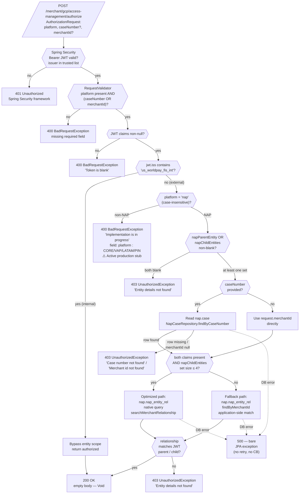
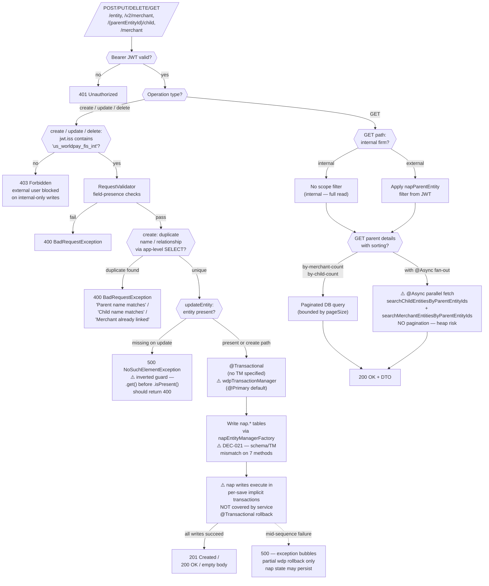
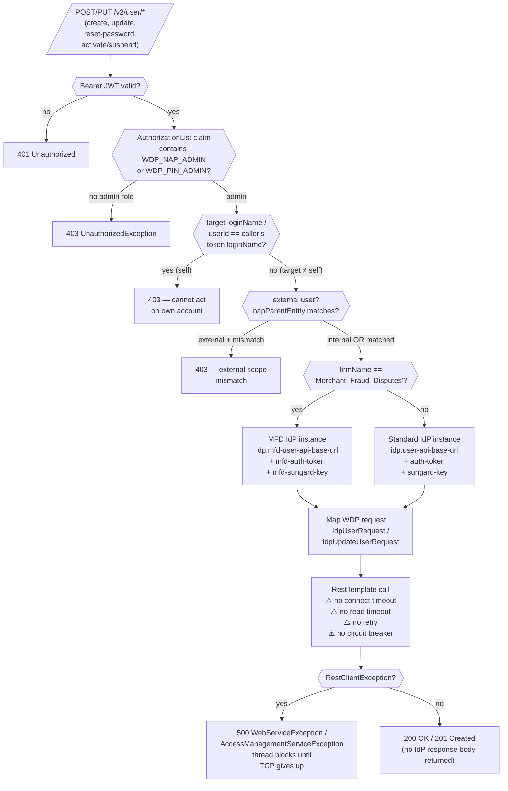
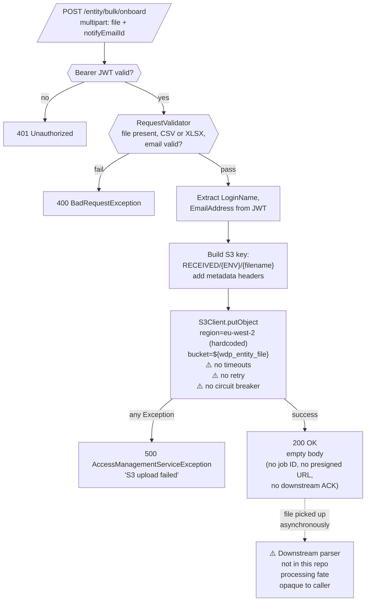

# WDP-COMP-02-UAMS
**Worldpay Dispute Platform — Component Reference**
*Version: 1.0 DRAFT | April 2026*
*Extracted from: `gcp-user-access-management-service` using GitHub Copilot CLI | Source-verified: 2026-04-29 | Architect-confirmed: PENDING*

---

## ━━━ CORE SKELETON ━━━━━━━━━━━━━━━━━━━━━━━━━━━━━━━━━━━━━━

---

## Identity

| Field             | Value                                                        |
|-------------------|--------------------------------------------------------------|
| **Name**          | UserAccessManagementService (UAMS)                           |
| **Type**          | REST API                                                     |
| **Repository**    | `gcp-user-access-management-service`                         |
| **Status**        | ✅ Production                                                 |
| **Doc status**    | 📝 DRAFT — source-verified 2026-04-29, architect confirmation pending |
| **Sections present** | Core, Block A (REST API)                                  |

---

## Purpose

**What it does**

UserAccessManagementService is the access-control and user-lifecycle service for the **NAP** acquiring platform within WDP. A single deployable carries four largely independent responsibilities:

1. **Runtime case-level authorization for NAP.** Exposes `POST /authorize`, called by the API Gateway (COMP-01) on every NAP request that contains a case ID. Determines whether a JWT-bearer's `napParentEntity` and `napChildEntities` claims grant access to the requested merchant — either supplied directly or resolved from a case number via the `nap.case` table. Returns 200 (authorized) or 403 (denied). This endpoint is the NAP-side counterpart of COMP-03 CHAS, which serves the same role for PIN / CORE / VAP / LATAM.

2. **Reference-data CRUD for the NAP merchant entity hierarchy.** Owns and manages parent entities, child entities, merchants (MIDs), and the merchant-to-entity relationships that underpin the runtime authorization check. CRUD is exposed through the `/entity`, `/merchant`, and `/{parentEntityId}/child` endpoint families. Internal callers can manage the full hierarchy; external callers are scoped to their own `napParentEntity` claim.

3. **User-lifecycle proxy to SunGard IdP.** Every user-management action — create, update, reset password, activate, suspend — is forwarded to one of two SunGard IdP instances. The instance is selected at runtime by the caller's firm: `Merchant_Fraud_Disputes` traffic goes to the MFD IdP, all other firm values go to the standard `US_Merchant` IdP. UAMS stores no user credentials, no passwords, and no IdP tokens — it is a stateless pass-through for user data.

4. **Bulk entity onboarding via S3.** A single multipart endpoint (`POST /entity/bulk/onboard`) writes the uploaded CSV/XLSX file to `RECEIVED/{ENV}/{filename}` in an S3 bucket fixed to the `eu-west-2` region. UAMS does not parse, validate, or process the file content — downstream processing is handled outside this component, and the response carries no job ID, no presigned URL, and no acknowledgement of downstream pickup.

UAMS additionally maintains an **Access Control List (ACL)** in `wdp.acl` through `/acl`, `/acl/search`, and `PUT /acl`. The ACL is maintained as a service to downstream consumers — UAMS does **not** consult its own ACL when deciding `/authorize`. Whoever consumes the ACL is not identified anywhere in this repository.

**What it does NOT do**

- Issue, mint, or refresh JWT tokens — Spring Security acts as a resource server only.
- Store user credentials, passwords, or IdP refresh tokens.
- Process financial transactions or dispute cases — this component does not touch chargebacks, evidence, or case actions.
- Handle PIN, CORE, VAP, or LATAM platform authorization. `POST /authorize` returns HTTP 400 "Implementation is in progress" for any non-NAP platform value. PIN authorization is owned by COMP-03 CHAS.
- Process bulk-onboarding file content — only the upload to S3. Downstream parsing happens elsewhere.
- Use the ACL it owns for its own authorization decisions — ACL is purely a downstream-consumer artefact.
- Produce to or consume from any Kafka topic. UAMS is Kafka-free (zero `KafkaTemplate`, zero `@KafkaListener`, zero `kafka.*` config). The `KAFKA_SERVICE_ERROR` enum constant in source is vestigial.
- Run any scheduled job, batch, or cron. REST is the sole entry mechanism — no `@Scheduled`, no `CronJob`, no webhook.
- Apply circuit breakers, REST timeouts, or retries on any outbound call. Resilience4j is absent.
- Enforce method-level RBAC via Spring Security annotations. No `@PreAuthorize`, no `@Secured`. All authorization is programmatic in controller and utility code.
- Connect to IBM DB2. The `com.ibm.db2:jcc` JDBC driver is on the build path but no datasource references it — vestigial.

---

## Internal Processing Flow

UAMS exposes **four functionally independent processing paths** that share only the JWT validation entry filter. Each is documented as a separate flow.

### Flow A — POST /authorize (NAP runtime authorization)

### Flow B — Reference-data CRUD (Entity / Child / Merchant)

### Flow C — User-lifecycle proxy to SunGard IdP

### Flow D — Bulk entity onboarding upload

---

## Boundaries

### Inbound Interfaces

| Source | Protocol | Endpoint / Trigger | Payload / Description |
|--------|----------|--------------------|-----------------------|
| API Gateway (COMP-01) | REST | `POST /merchant/gcp/access-management/authorize` | NAP case-level entity authorization. Caller's JWT forwarded as Bearer; `void.class` response on success. |
| WDP Merchant Portal (COMP-49) | REST | Entity / merchant / user / ACL CRUD | External-user paths scoped to `napParentEntity` from JWT. |
| WDP Ops Portal (COMP-50) | REST | Entity / merchant / user / ACL CRUD | Internal-firm callers; full hierarchy access. |
| Internal Worldpay systems | REST | All endpoint families | `iss` contains `us_worldpay_fis_int` — bypasses all entity scoping. |
| K8s liveness/readiness probes | REST | `GET /merchant/gcp/access-management/livez`, `/readyz` | Operational health. |

### Outbound Interfaces

| Target | Protocol | Endpoint / Resource | Purpose | On failure |
|--------|----------|---------------------|---------|------------|
| SunGard IdP — US_Merchant instance | REST (blocking) | `${idp.user-api-base-url}/...` | All non-MFD user-lifecycle ops | 500 — thread blocks until TCP gives up; no retry, no CB, no timeout |
| SunGard IdP — MFD instance | REST (blocking) | `${idp.mfd-user-api-base-url}/...` | Merchant_Fraud_Disputes user ops | 500 — same pattern as standard IdP |
| AWS S3 (eu-west-2) | AWS SDK v2 | `${wdp_entity_file}` bucket, key `RECEIVED/{ENV}/{filename}` | Bulk-onboarding file upload — UAMS does not parse content | 500 "S3 upload failed"; SDK default retry only |
| PostgreSQL `nap` schema | JDBC (HikariCP) | `nap.nap_parent_entity`, `nap.nap_child_entity`, `nap.nap_merchant`, `nap.nap_entity_rel`, `nap.case` (read) | Entity hierarchy + authorization lookup | JPA exception → 500; transaction-manager mismatch (DEC-021) means partial-write hazard |
| PostgreSQL `wdp` schema | JDBC (HikariCP) | `wdp.acl` | ACL maintenance for downstream consumers | JPA exception → 500 |

---

## ━━━ TYPE BLOCK A — REST API CONTRACTS ━━━━━━━━━━━━━━━━━━━

---

## REST API Contracts

**Framework:** Spring Boot 3.5 / Java 17, Spring Web MVC.
**Authentication:** Spring Security OAuth2 Resource Server. Issuer trust list configured via `${jwt_trusted_issuer_urls}` (issuer URLs not in repo).
**Base URL pattern:** `https://<host>/merchant/gcp/access-management`
**RBAC mechanism:** **Programmatic only** — every authorization check is in controller or `AuthorizationUtil` code. No `@PreAuthorize`, no `@Secured`, no method-level Spring Security annotations anywhere.
**Whitelisted paths (no JWT required):** `/actuator/health`, `/livez`, `/readyz`. In non-prod profiles only: `/access-management-service-api-docs`, `/access-management-service-api-docs/swagger-config`, `/swagger-ui/**`.
**Correlation header:** `v-correlation-id` (note: `v-` not `x-`). Read by request interceptor, written to MDC, written to response. **Not propagated** on outbound IdP or S3 calls.
**Error body:** Structured JSON via `GlobalExceptionHandler` with `message` and field-reference fields. Empty body on 200/201 unless otherwise noted.

UAMS exposes **22 application endpoints** across 5 controller families plus 5 health/observability endpoints. The full inventory below is at architecture level — request and response field-by-field schemas live in source.

### Endpoint family 1 — Authorization

| Method | Path | Caller | Auth model | Success | Failure modes |
|--------|------|--------|-----------|---------|---------------|
| `POST` | `/authorize` | API Gateway (COMP-01) | JWT + internal-firm bypass + entity-scope check | 200 OK, empty body | 400 (token blank, non-NAP platform, missing merchantId+caseNumber); 403 (case not found, merchant not found, no entity match); 500 (DB error) |

**Notes:**
- The 200 status code is the authorization signal — **no body returned** on success.
- The internal-firm short-circuit is `iss` contains `us_worldpay_fis_int` (substring match). Same string as COMP-03 CHAS.
- For NAP, an **optimization branch** runs a native `searchMerchantRelationship` query on `nap.nap_entity_rel` when both claims are present and `napChildEntities.size() ≤ 4`. Otherwise the fallback path uses `findByMerchantId` and matches in application code.
- Unlike CHAS, UAMS does **not** apply chain-first / merchant-fallback; the lookup is direct against `nap.nap_entity_rel`.

### Endpoint family 2 — Entity Management

| Method | Path | Internal-only | Notes |
|--------|------|---------------|-------|
| `POST` | `/entity` | Yes (create) | Creates parent entity (and matching child) or child entity. App-level uniqueness check by name. |
| `GET` | `/entity` | No | Paginated parent entity list with optional name / column / order filters. External callers scoped to `napParentEntity`. |
| `PUT` | `/entity/{entityId}` | Yes | ⚠️ Inverted-guard NPE: missing entity returns 500 instead of 400. |
| `DELETE` | `/entity` | Yes (parent), scoped (child) | Deletes parent or child entity by `DeleteEntityRequest`. |
| `POST` | `/entity/bulk/onboard` | No | Multipart upload to S3 — fire-and-forget. |
| `GET` | `/v2/entity/{parentEntityId}/child` | No | Paginated child list within parent scope. |
| `POST` | `/{parentEntityId}/child` | No (validated user) | Create child under parent. |
| `PUT` | `/{parentEntityId}/child/{childEntityId}` | No (validated user) | Update child. |

### Endpoint family 3 — Merchant Management

| Method | Path | Internal-only | Notes |
|--------|------|---------------|-------|
| `POST` | `/v2/merchant` | Yes | `saveChildWithMerchant` — creates child + merchants + relationships. **DEC-021 occurrence #1** (root-cause method). |
| `GET` | `/merchant` | No | Paginated merchant list with filters. External callers scoped. |
| `PUT` | `/merchant/{merchantId}` | Yes | Update merchant attributes. |
| `DELETE` | `/v2/merchant` | Yes | Bulk delete by request body. |

### Endpoint family 4 — User Lifecycle (proxy to SunGard IdP)

| Method | Path | RBAC | Notes |
|--------|------|------|-------|
| `GET` | `/user/entity` | Entity scope | Paginated parent/child entity list for user. |
| `POST` | `/v2/user` | Admin role | Create user → IdP. |
| `PUT` | `/v2/user/{loginName}` | Admin role + not-self | Update user → IdP. |
| `PUT` | `/v2/user/reset-password/{userId}` | Admin role + not-self | Reset password → IdP. |
| `PUT` | `/v2/user/{userId}/{status}` | Admin role + not-self | Activate / suspend → IdP. |
| `GET` | `/v2/users` | Entity scope | Paginated IDP user list. |
| `GET` | `/user/entity/{loginName}/child` | Entity scope | User-scoped child entity list. |

**IdP routing:** `firmName == "Merchant_Fraud_Disputes"` selects the MFD instance; all other firms select the standard `US_Merchant` instance. `firmName` is parsed from the JWT `iss` claim (substring after the last `/`). The user controller hardcodes the `MERCHANT_DISPUTES_FIRM` constant for several endpoints — whether traffic for the standard `US_Merchant` IdP reaches UAMS through a separate deployment or routing layer is **not determinable from this repository alone**.

### Endpoint family 5 — ACL

| Method | Path | RBAC | Notes |
|--------|------|------|-------|
| `POST` | `/acl` | Any authenticated | Bulk-create ACL records via `List<CreateAclRequest>`. App-level duplicate check on composite key `(consumerName, sourceSystem, entityType, entityValue)`. |
| `PUT` | `/acl` | Any authenticated | Update ACL record. ACTIVE / INACTIVE status transitions tracked by activated/deactivated timestamps. |
| `POST` | `/acl/search` | Any authenticated | Search ACL records by `SearchAclRequest`. |

### Health and observability

| Method | Path | Purpose |
|--------|------|---------|
| `GET` | `/livez` | K8s liveness probe |
| `GET` | `/readyz` | K8s readiness probe |
| `GET` | `/actuator/health` | Spring Actuator health |
| `GET` | `/actuator/info` | Spring Actuator info |
| `GET` | `/actuator/prometheus` | Prometheus scrape endpoint |

---

## Functional Behaviour

### Classification and routing logic

| Decision | Field examined | Outcomes |
|----------|----------------|----------|
| Platform on `/authorize` | `request.platform` (case-insensitive) | `nap` → NAP authorization flow; anything else → 400 stub |
| Internal vs external caller | `jwt.iss` substring | contains `us_worldpay_fis_int` → bypass entity scope; else → external scope filter |
| IdP instance selection | `firmName` parsed from JWT `iss` | `Merchant_Fraud_Disputes` → MFD IdP; else → US_Merchant IdP |
| Entity create branch | `request.type` | `PARENT` → parent + matching child; `CHILD` → child under parent |
| Authorization lookup branch | `napChildEntitiesSet.size()` | `≤ 4` AND both claims present → native query; else → fallback `findByMerchantId` |
| Resolution path | `request.caseNumber` | present → `nap.case` lookup; absent → use `request.merchantId` directly |

### Business rules applied locally

- **JWT presence**: `jwt == null` OR `jwt.getClaims() == null` → 400 "Token is blank".
- **Platform restriction**: only `nap` is implemented; CORE / VAP / LATAM / PIN return 400 "Implementation is in progress" — **active production stub**.
- **Resolution validity**: `caseNumber` must resolve to a non-null `merchantId` from `nap.case`, or `request.merchantId` must be non-blank — failure is 403.
- **Entity-scope match**: at least one JWT-supplied parent or child entity must match a row in `nap.nap_entity_rel` for the resolved merchant — failure is 403.
- **Internal-only writes**: external callers cannot create / update / delete parent entities or saveChildWithMerchant — failure is 403.
- **Name uniqueness**: parent name (case-insensitive) and child name within parent must be unique — failure is 400. Application-level only (no DB unique constraint visible in source).
- **Merchant relationship uniqueness**: a merchant cannot be linked to two different parents — failure is 400.
- **Admin role**: user-lifecycle endpoints require `WDP_NAP_ADMIN` or `WDP_PIN_ADMIN` in the `AuthorizationList` JWT claim — failure is 403.
- **Self-exclusion**: an admin cannot perform user-lifecycle ops on their own account — failure is 403.
- **File contract**: bulk-upload accepts CSV / XLSX only — failure is 400. No file-size cap in code (Spring Boot defaults apply).

### Data transformations

- `EntityRequest` → `ParentEntity` / `ChildEntity`: name uppercased unconditionally, sequence ID generated.
- `UserRequest` → `IdpUserRequest`: department fields and custom fields mapped per IdP contract.
- `UpdateUserRequest` → `IdpUpdateUserRequest`: caller's user ID is the `updatedBy` source.
- `CreateAclRequest` → `MerchantDisputeAcl`: created/updated/activated timestamps populated from system clock.

### Idempotency

UAMS implements **no formal idempotency**. No `idempotency-key` header is read at any write site. Per write endpoint:

| Endpoint | Detection | Gap |
|----------|-----------|-----|
| `POST /entity` (PARENT) | Application-level SELECT by name | No DB unique constraint visible — replica race window |
| `POST /entity` (CHILD) | Application-level SELECT by parent + name | Same gap |
| `POST /v2/merchant` | `existsRelationshipForInsert()` SELECT | Same gap. SQL state `23505` constant defined but not used here |
| `POST /v2/user` | Delegated to SunGard IdP | UAMS-side: no record kept |
| `POST /acl` | Composite-key SELECT | Same gap |
| `PUT /acl` | ACL ID + composite-key SELECT | Same gap |

This component **DEVIATES from DEC-020**.

---

## Database Ownership

### Tables Owned (written by this component)

| Schema.Table | Purpose | Key columns | Notes |
|--------------|---------|-------------|-------|
| `nap.nap_parent_entity` | Top-level NAP entity hierarchy | `i_entity_id`, `c_name` | Created with name uppercased; no DB UNIQUE on name visible. |
| `nap.nap_child_entity` | Child entities under a parent | `i_entity_id`, `c_name`, `i_parent_entity_id` | Created with name uppercased; no DB UNIQUE visible. **🔴 DEC-021 — written under wrong TM** (Risk Register). |
| `nap.nap_merchant` | Merchant master (MID, MCC, WPG ID) | `i_mid`, `c_name`, `c_mcc`, `c_wpg_id` | Created via `saveChildWithMerchant`. **🔴 DEC-021 — written under wrong TM**. |
| `nap.nap_entity_rel` | Merchant ↔ parent ↔ child relationships — primary NAP authorization lookup | `i_parent_entity_id`, `i_child_entity_id`, `i_mid` | Read on every `/authorize`. **🔴 DEC-021 — written under wrong TM**. |
| `wdp.acl` | Access Control List for downstream consumers | `i_acl_id`, `c_consumer_name`, `c_source_system`, `c_entity_type`, `c_entity_value`, `c_status`, `c_created_by`, `t_created_timestamp`, `c_updated_by`, `t_updated_timestamp`, `c_activated_by`, `t_activated_timestamp`, `c_deactivated_by`, `t_deactivated_timestamp` | Status transitions ACTIVE / INACTIVE tracked by paired audit columns. **Downstream consumers not identifiable from source.** |

### Tables Read (not owned by this component)

| Schema.Table | Owned by | Why accessed |
|--------------|----------|--------------|
| `nap.case` | COMP-23 CaseManagementService | Case-number → `merchantId` resolution on `/authorize` when `caseNumber` is provided. Confirmed read-only — UAMS never writes `nap.case`. |

### DEC-021 occurrences within UAMS

Seven service / DAO methods write `nap.*` tables under `@Transactional` with no transaction-manager qualifier — the default is `@Primary` `wdpTransactionManager`. Because `nap.*` repositories are bound to a separate `napEntityManagerFactory`, the nap writes execute in their own per-save implicit transactions and are **not covered by the service-method `@Transactional` rollback boundary**.

| # | Method | Schema written | Severity |
|---|--------|----------------|----------|
| 1 | `MerchantServiceImpl.saveChildWithMerchant` | nap_child_entity, nap_merchant, nap_entity_rel | 🔴 Cross-table — root-cause method recorded in DEC-021 |
| 2 | `AccessManagementServiceImpl.createEntity` | nap_parent_entity, nap_child_entity | 🔴 Cross-table |
| 3 | `AccessManagementServiceImpl.updateEntity` | nap_parent_entity, nap_child_entity | 🔴 Cross-table |
| 4 | `MerchantDaoImpl.updateMerchantRelationships` | nap_entity_rel | 🟠 Single-table |
| 5 | `MerchantDaoImpl.deleteMerchantByParent` | nap_entity_rel, nap_merchant | 🔴 Cross-table |
| 6 | `AccessManagementDaoImpl.deleteChildEntity` | nap_entity_rel, nap_merchant, nap_child_entity | 🔴 Cross-table |
| 7 | `AccessManagementDaoImpl.deleteParentEntity` | nap_entity_rel, nap_merchant, nap_child_entity, nap_parent_entity | 🔴 Cross-table |

Only one method correctly specifies `napTransactionManager`: `AccessManagementServiceImpl.createOrUpdateChildEntity`.

**Implication:** any multi-table NAP-side write that fails part-way through leaves the NAP schema in an inconsistent state. The wdp transaction (which carries no nap writes) rolls back cleanly, but no nap state is rolled back. **This is broader than the v2.0 DEC-021 record indicated** — the issue is a pattern across UAMS, not a single method defect.

### Locking

No `SELECT FOR UPDATE`, no row locks, no advisory locks anywhere in source.

---

## Dependencies

### SunGard IdP (two instances, firm-routed)

| Property | Standard (US_Merchant) | MFD |
|----------|------------------------|-----|
| Base URL config | `${idp_user_api_base_url}` | `${idp_mfd_user_api_base_url}` |
| Auth scheme | `Bearer ${idp_auth_token}` + `X-SunGard-IdP-API-Key: ${idp_sungard_key}` | `Bearer ${idp_mfd_auth_token}` + `X-SunGard-IdP-API-Key: ${idp_mfd_sungard_key}` |
| Selection rule | `firmName != "Merchant_Fraud_Disputes"` | `firmName == "Merchant_Fraud_Disputes"` |
| Connect timeout | **Not configured** | **Not configured** |
| Read timeout | **Not configured** | **Not configured** |
| Retry | **Not configured** | **Not configured** |
| Circuit breaker | **Not configured** | **Not configured** |
| Behaviour if unavailable | Thread blocks indefinitely until TCP timeout; `RestClientException` → 500 | Same |

The auth pattern (`Bearer + X-SunGard-IdP-API-Key`) matches COMP-30 UserQueueSkillService.

### AWS S3 (eu-west-2)

| Property | Value |
|----------|-------|
| Bucket | `${wdp_entity_file}` (env-resolved, not in repo) |
| Region | `eu-west-2` **hardcoded** in source — does not honour environment |
| Key prefix | `RECEIVED/{ENV}/` |
| Credential chain | AWS SDK v2 default chain (no explicit override) |
| Connect / read timeout | **Not configured** (SDK defaults apply) |
| Retry | **Not configured** (SDK default retry only) |
| Circuit breaker | **Not configured** |
| Behaviour if unavailable | Generic `Exception` → 500 "S3 upload failed" |

### PostgreSQL — `nap` schema

| Property | Value |
|----------|-------|
| JDBC URL | `${nap_datasource_jdbc_url}` |
| Pool | HikariCP — Spring Boot defaults (max 10 connections) |
| Transaction manager | `napTransactionManager` (explicitly bound) |
| Behaviour if unavailable | Pool exhaustion → request blocks; JPA exception → 500 |

### PostgreSQL — `wdp` schema

| Property | Value |
|----------|-------|
| JDBC URL | `${wdp_datasource_jdbc_url}` |
| Pool | HikariCP — Spring Boot defaults (max 10 connections) |
| Transaction manager | `wdpTransactionManager` (`@Primary` — used as default for unqualified `@Transactional`) |
| Behaviour if unavailable | Same as `nap` |

### Vestigial / unused dependencies

- **IBM DB2 JDBC driver** (`com.ibm.db2:jcc`) is on the build path but no DB2 datasource or query exists in source. Likely inherited from a parent / shared template.

---

## Configuration and Scaling

| Parameter | Value | Notes |
|-----------|-------|-------|
| Replica count | `{{ replicas-user-access-management-service }}` (XL Deploy placeholder) | Production value not in repo |
| HPA | None | No `HorizontalPodAutoscaler` resource present |
| Memory request | 1024Mi | |
| Memory limit | 2048Mi | |
| CPU request | **Not configured** | Best-effort QoS class |
| CPU limit | **Not configured** | |
| Deployment type | Kubernetes Deployment | |
| Rollout strategy | RollingUpdate — `maxSurge: 1`, `maxUnavailable: 0` | One extra pod created before old pod removed |
| `minReadySeconds` | Present in manifest but **mis-indented** | Whether it takes effect at runtime is not determinable from repo |
| PodDisruptionBudget | None | No PDB resource present |
| Topology spread | **Non-functional — `gcp-` prefix label drift** | Constraint selector uses `app: gcp-user-access-management-service<branch>`; pod label uses `app: user-access-management-service<branch>`. All pods can schedule to the same node. Same class of defect as COMP-03 CHAS. |
| Liveness probe | HTTP `GET /merchant/gcp/access-management/livez` on port 8082; `initialDelay=30s`, `timeout=5s`, `period=10s`, `failureThreshold=3` | |
| Readiness probe | HTTP `GET /merchant/gcp/access-management/readyz` on port 8082; `initialDelay=20s`, `timeout=5s`, `period=10s`, `failureThreshold=3` | |
| Startup probe | **Not configured** | |
| Container port | 8082 | |
| Image pull policy | `Always` | |
| Database connection pool | HikariCP defaults (10 per datasource, 2 datasources = up to 20 per pod) | Not tuned in source; runtime tuning via env vars cannot be confirmed from repo |
| Async thread pool | `asyncExecutor` bean defined (`AsyncConfiguration`) with env-driven core/max/queue sizes | ⚠️ `@Async` methods do **not** specify the executor by name — fall-through is **non-deterministic**: Spring picks up the sole `Executor` bean only when no qualifier is needed; bean is named `asyncExecutor`, not `taskExecutor`, so behaviour depends on Spring's auto-detection rules |
| OpenTelemetry | Pod annotation `instrumentation.opentelemetry.io/inject-java` — agent injected at runtime | Memory/CPU overhead unaccounted in resource limits |
| Spring Actuator | `/actuator/health`, `/actuator/info`, `/actuator/prometheus` exposed | |
| Prometheus | Enabled via Actuator | Scraped by cluster Prometheus |
| Logstash appender | `LogstashTcpSocketAppender` configured — destination `${logstash_server_host_port}` | Console fallback active alongside Logstash; if env var empty, Logstash side fails to connect, console continues |
| Correlation ID | `v-correlation-id` header read by request interceptor, written to MDC and response | **Not propagated** on outbound IdP / S3 calls |
| Secrets | `user-access-management-service`, `wdp-common-secrets`, `{{ ingressTLSsecretName }}` | XL-Deploy template syntax |
| Ingress | NGINX with CORS, 4 host rules (external, internal, wdp-internal, reverse-proxy) | |
| Context path | `/merchant/gcp/access-management` | |

**Helm chart / `values.yaml` are not in the repo** — manifest uses XL Deploy `{{ }}` template syntax. **No Dockerfile in repo** — image build is external.

---

## Key Architectural Decisions

| Decision | Reference | Notes |
|----------|-----------|-------|
| Single deployable serves runtime authorization AND reference-data ownership | Local | Tightly couples UAMS uptime to gateway authorization. Planned consolidation under a single platform-wide authorization service (joint with COMP-03 CHAS) |
| Authorization for NAP only — non-NAP returns 400 stub | Local | CORE / VAP / LATAM / PIN authorization is owned by COMP-03 CHAS via the API Gateway routing |
| Authorization model is **3-layer** (corrects v1.0 "2-layer") | Local | (1) Spring Security JWT issuer validation; (2) internal-firm bypass on `iss` containing `us_worldpay_fis_int`; (3) entity-scope check against `nap.nap_entity_rel` using `napParentEntity` / `napChildEntities` claims |
| Internal-firm bypass uses substring match `us_worldpay_fis_int` on JWT `iss` | Local | Same constant as COMP-03 CHAS — platform pattern |
| User credentials fully delegated to SunGard IdP | Local | Zero credential, password, or refresh-token persistence in UAMS |
| Two SunGard IdP instances routed by firm | Local | `Merchant_Fraud_Disputes` → MFD; everything else → standard |
| ACL (`wdp.acl`) maintained for downstream consumers — not consulted by UAMS | Local | Architecturally separate concern from `/authorize` |
| Bulk onboarding fire-and-forget to S3 | Local | UAMS does not parse the file; downstream parsing is opaque to caller |
| ⚠️ DEC-021 — wrong transaction manager scope expanded to 7 methods | DEC-021 (was scoped to 1 method in v2.0) | **Pattern across UAMS**, not a single defect. Cross-schema partial-write hazard on every multi-table NAP write. |
| ⚠️ DEC-014 deviation — Resilience4j absent | DEC-014 VOID | Confirmed: no circuit breaker, no REST timeout, no retry on any outbound call. Same as platform-wide pattern |
| ⚠️ DEC-020 deviation — no idempotency at any write endpoint | DEC-020 PARTIAL | Application-level duplicate checks only; no idempotency keys, no DB unique constraints visible |
| ⚠️ Programmatic-only RBAC — no `@PreAuthorize` / `@Secured` | Local | Same RBAC posture as COMP-24 (DEC-018) and COMP-27. No central enforcement layer |

---

## Platform Standard Deviations

| ADR | Standard | Status | Detail |
|-----|----------|--------|--------|
| **DEC-001** | Transactional Outbox for Event Delivery | ✅ NOT APPLICABLE | UAMS is Kafka-free. No outbox table, no event publish |
| **DEC-003** | Kafka Partition Key = merchantId | ✅ NOT APPLICABLE | No Kafka producer or consumer present |
| **DEC-004** | PAN Encryption Before Persistence | ✅ NOT APPLICABLE | UAMS handles no PAN data — merchant data is MID, name, MCC, WPG ID only |
| **DEC-005** | Manual Kafka Offset Commit | ✅ NOT APPLICABLE | No Kafka consumer present |
| **DEC-014** | Resilience4j Circuit Breakers | ⛔ DEVIATES (platform VOID) | No circuit breaker, no REST timeout, no retry on IdP or S3 calls. Bare `RestTemplate` bean. Severity 🔴 HIGH |
| **DEC-019** | No Clear PAN in Persistent Store | ✅ NOT APPLICABLE | No PAN handled |
| **DEC-020** | Full At-Least-Once Idempotency | ⛔ DEVIATES | No idempotency keys at any write endpoint. Application-level duplicate checks only — race window between SELECT and INSERT on replica concurrency. Severity 🟠 MEDIUM-HIGH |
| **DEC-021** | UAMS saveChildWithMerchant — Wrong Transaction Manager | ⛔ DEVIATES — **scope expanded** | v2.0 record scoped DEC-021 to one method. Source verification confirms **7 methods** write `nap.*` tables under the `@Primary` `wdpTransactionManager`. Effectively all multi-table NAP-side writes are uncoordinated. Severity 🔴 HIGH |
| **DEC-023** | Polling Batch Replica Count Fixed at 1 | ✅ NOT APPLICABLE | UAMS has no polling batch — REST API only |

---

## Risks and Constraints

**Severity scale:**
- 🔴 HIGH — data loss, security breach, complete processing halt
- 🟠 MEDIUM-HIGH — partial-failure hazard, cross-component contract gap
- 🟡 MEDIUM — degraded throughput, incorrect behaviour under load, latent defect
- 🟢 LOW — observability gap, dead code, vestigial dependency

| Severity | Risk | Consequence |
|----------|------|-------------|
| 🔴 | **DEC-021 scope expansion — 7 methods write `nap.*` tables under `wdpTransactionManager`.** Because nap repositories are bound to `napEntityManagerFactory`, nap writes execute in per-save implicit transactions and are NOT rolled back when the service method's `@Transactional` rolls back. | Mid-sequence failure on any multi-table NAP-side write (createEntity, updateEntity, saveChildWithMerchant, deleteParentEntity, deleteChildEntity, deleteMerchantByParent, updateMerchantRelationships) leaves NAP schema in an inconsistent state. No automatic recovery. |
| 🔴 | **No timeouts on outbound RestTemplate** — IdP calls can block threads indefinitely. Same RestTemplate bean used for all IdP traffic. | A slow or hung SunGard IdP saturates the application thread pool. Compounds with absence of `@Async` qualifier — runaway thread creation possible. |
| 🟠 | **Authorization fail-mode on DB outage** — `nap.case` lookup, `nap.nap_entity_rel` fallback, and `nap.nap_entity_rel` native query all surface raw JPA exceptions as 500. No circuit breaker, no fallback, no degraded mode. | A nap-database disruption blocks the entire NAP authorization plane platform-wide. API Gateway returns 403 (fail-closed) on UAMS 500, but every NAP request path is broken. |
| 🟠 | **No idempotency at any write endpoint.** Application-level SELECT-then-INSERT pattern. No DB unique constraints visible in source. | Two replicas racing on the same entity create can both pass the duplicate check and both INSERT. No DB-level protection. |
| 🟠 | **`updateEntity` NPE — inverted entity-existence guard.** `.get()` is called before `.isPresent()`. | Caller updating a non-existent entity receives a 500 (mapped from `NoSuchElementException`) instead of a 400. Misleading error class; alerting on 500 rate cannot distinguish from genuine server faults. |
| 🟠 | **Cross-schema atomicity is broken.** No XA, no `ChainedTransactionManager`. Every endpoint that writes both `nap` and `wdp` schemas has a partial-failure window. | Partial state on any failure path. Recovery is manual. |
| 🟡 | **Topology spread non-functional — `gcp-` prefix label drift.** Constraint label vs pod template label do not match. | All pods can schedule to the same node. No availability protection from node failure. Same class as COMP-03 CHAS. |
| 🟡 | **`@Async` executor binding is non-deterministic.** Methods don't qualify the executor; the bean is named `asyncExecutor` (not `taskExecutor`). | Behaviour depends on Spring's sole-Executor-bean auto-detection. If a future change adds another Executor bean, fall-through to unbounded `SimpleAsyncTaskExecutor` becomes the runtime reality. |
| 🟡 | **Unbounded fan-out in entity aggregation.** `searchChildEntitiesByParentEntityIds` and `searchMerchantEntitiesByParentEntityIds` use `@Async` parallel fetch over a parent-ID list with no pagination. | Heap pressure proportional to entity-hierarchy depth. JVM OOM possible under large-tenant query. |
| 🟡 | **S3 region hardcoded to `eu-west-2`.** | Bulk-onboarding upload is cross-region from non-EU clusters. Latency and egress cost. |
| 🟡 | **No HPA, no PDB, no startup probe.** | Pod count is static; no automated response to load. Voluntary disruptions can take all replicas down. Slow-starting pods may be killed by liveness probe before they're ready. |
| 🟡 | **No formal RBAC annotations.** Authorization is programmatic in controller / utility code. | Any future endpoint can be added without going through a central RBAC enforcement point — high regression risk. Same pattern as COMP-24 (DEC-018) and COMP-27. |
| 🟢 | **`v-correlation-id` not propagated on outbound IdP / S3 calls.** | Distributed-trace correlation breaks at the IdP and S3 boundary. OTel agent provides trace context, but business-key correlation is lost. |
| 🟢 | **`minReadySeconds` is mis-indented in `resources.yaml`.** | Whether it takes effect at runtime cannot be confirmed from source. Rolling-update protection may be silently absent. |
| 🟢 | **`logstash_server_host_port` empty-secret risk.** | If the env-injected secret is empty in production, the Logstash appender fails to connect. Console fallback continues — log aggregation degraded silently. Same class as COMP-21 RISK-050. |
| 🟢 | **DB2 JDBC driver vestigial in build path.** | Increases artifact size; presents an attack surface for a database the service does not use. |
| 🟢 | **Active production stub on non-NAP `/authorize` path.** Returns 400 "Implementation is in progress". | Misleading error code if any non-NAP traffic ever reaches UAMS — should be a 404 / 405 / 501 architecturally. The API Gateway is supposed to route non-NAP `/authorize` to CHAS instead, so this code path is operationally unreachable, but remains as latent risk. |

---

## Planned Changes

- **Case-level authorization consolidation** — joint with COMP-01 API Gateway and COMP-03 CHAS, the NAP / non-NAP split is to be replaced by a single platform-wide authorization service. Timing not committed in this repository. UAMS' `/authorize` endpoint and CHAS' `/authorize` endpoint converge under that programme.
- **DEC-021 remediation** — pending. Two architecturally valid options: (a) qualify all 7 methods with `@Transactional("napTransactionManager")`; (b) introduce `ChainedTransactionManager` on the affected service methods. **Architect decision required**.
- **No active migration in repo.** No feature flags. No commented-out future paths beyond a single Logstash destination line.

---

## Open Questions

- ⚠️ **OQ-COMP-02-1** — Production replica count for UAMS. XL Deploy placeholder; runtime value not in repo. (Environment config / team confirmation.)
- ⚠️ **OQ-COMP-02-2** — `${jwt_trusted_issuer_urls}` actual issuer list. Env-resolved. (Environment config / team confirmation.)
- ⚠️ **OQ-COMP-02-3** — `${idp_user_api_base_url}` and `${idp_mfd_user_api_base_url}` runtime values. (Environment config / team confirmation.)
- ⚠️ **OQ-COMP-02-4** — `${wdp_entity_file}` actual S3 bucket name and region of bucket vs hardcoded client region. (Environment config / team confirmation.)
- ⚠️ **OQ-COMP-02-5** — Downstream consumers of `wdp.acl`. Source has no comments, no Swagger tags, no test fixtures identifying them. (Cross-component review.)
- ⚠️ **OQ-COMP-02-6** — Downstream parser of bulk-onboarding S3 files. Not in this repo. UAMS gives no caller-visible signal of pickup or completion. (Cross-component review.)
- ⚠️ **OQ-COMP-02-7** — Whether HikariCP pool size is tuned at runtime via `spring.datasource.nap.*` / `spring.datasource.wdp.*` env vars. (Environment config / team confirmation.)
- ⚠️ **OQ-COMP-02-8** — Whether `logstash_server_host_port` is populated with a non-empty value in production. (Runtime observation — log inspection.)
- ⚠️ **OQ-COMP-02-9** — Whether the user-controller hardcoded `MERCHANT_DISPUTES_FIRM` reflects a routing reality where standard-IdP traffic reaches a separate UAMS deployment, or whether the standard-IdP code path is unreachable in production. (Architect decision / routing inspection.)
- ⚠️ **OQ-COMP-02-10** — Whether `minReadySeconds` mis-indentation in `resources.yaml` is honoured by the K8s manifest engine. (Runtime observation / XL Deploy team.)
- ⚠️ **OQ-COMP-02-11** — DEC-021 remediation strategy: per-method `@Transactional("napTransactionManager")` or `ChainedTransactionManager`. (Architect decision.)
- ⚠️ **OQ-COMP-02-12** — DB-level UNIQUE constraints on `nap.nap_parent_entity.c_name`, `(nap.nap_child_entity.i_parent_entity_id, c_name)`, and `(nap.nap_entity_rel.i_parent_entity_id, i_child_entity_id, i_mid)`. No DDL in repo. (DBA confirmation.)

---

## Items Not Verifiable From Source

These claims could not be cross-checked against code or config and require follow-up beyond a Copilot CLI re-run:

- All env-injected secrets and configuration values (production replica count, JWT issuer list, IdP base URLs / tokens / API keys, S3 bucket name, JDBC URLs, `logstash_server_host_port`, async pool sizing).
- DB-level UNIQUE constraints on owned tables (no DDL / Flyway / Liquibase scripts in repo).
- Whether HikariCP pool tuning is applied via env vars.
- The `MERCHANT_DISPUTES_FIRM` hardcoding implication for whether standard-IdP user endpoints are reachable in production.
- Whether `minReadySeconds` mis-indentation is honoured at deploy time.
- Downstream consumers of `wdp.acl`.
- Downstream processor of bulk-onboarding S3 files.

---

*End of WDP-COMP-02-UAMS.md*
*File status: 📝 DRAFT v1.0 — source-verified 2026-04-29, architect confirmation pending.*
*First source-verified pass; supersedes WDP-COMPONENTS.md § 1.2 as the authoritative component reference.*
