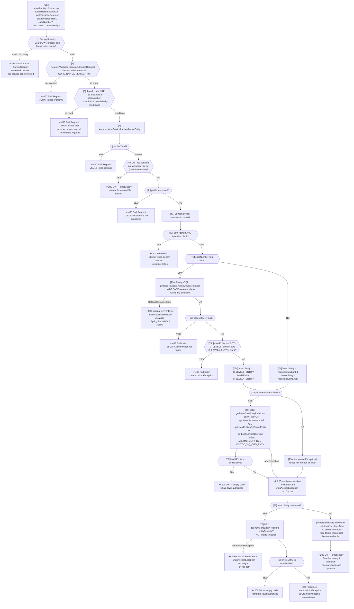
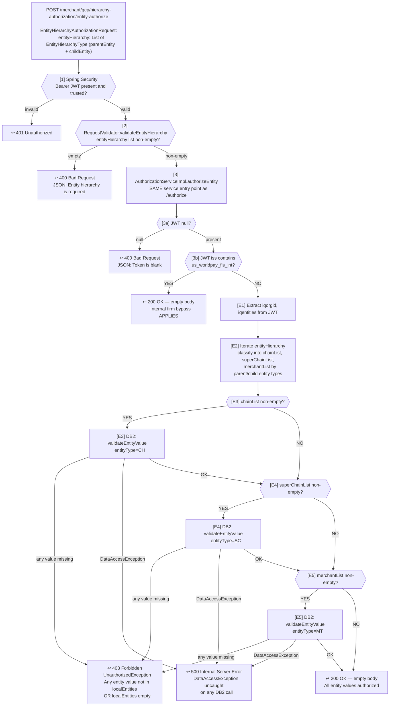

# WDP-COMP-03-CHAS
**Worldpay Dispute Platform — Component Reference**
*Version: 1.1 DRAFT | April 2026*
*Source-verified: 2026-04-29 from `gcp-core-hierarchy-authorization-service` via GitHub Copilot CLI | Architect-confirmed: PENDING*
*Supersedes v1.0 DRAFT. See WDP-CHANGE-LOG.md entry dated 2026-04-29 for the platform-level impact.*

---

## ━━━ CORE SKELETON ━━━━━━━━━━━━━━━━━━━━━━━━━━━━━━━━━━━━━━━━

---

## Identity

| Field | Value |
|---|---|
| **Name** | `CoreHierarchyAuthorizationService` |
| **Alias** | CHAS |
| **Type** | `REST API` |
| **Repository** | `gcp-core-hierarchy-authorization-service` |
| **Technology** | Spring Boot 3.4.7 / Java 17 |
| **K8s Deployment name** | `core-hierarchy-authorization-service` (with `${BRANCH_NAME_PLACEHOLDER}` suffix on non-main branches) |
| **Status** | `✅ Production` |
| **Doc status** | `📝 DRAFT 🔍 v1.1 — source-verified 2026-04-29; architect confirmation pending` |
| **Sections present** | `Core | Block A — REST` |

---

## Purpose

**What it does**

CoreHierarchyAuthorizationService (CHAS) is a stateless, read-only authorization and merchant data service for the PIN, CORE, VAP, and LATAM platforms. It provides two distinct capabilities within a single deployable.

Its primary function is runtime case-level entity authorization for the API Gateway. For every non-NAP platform request that carries a case identifier, the API Gateway calls CHAS to confirm the caller is allowed to act on that case. CHAS validates the caller's JWT entity claims — `iqorgid` and `iqentities` — against the Core enterprise merchant hierarchy in IBM DB2. It confirms the requested merchant or chain is a descendant of the caller's entity scope. An HTTP 200 empty-body response signals authorization granted; HTTP 403 with a JSON body signals denial.

Its secondary function is a read-only merchant hierarchy data API for PIN-platform and CORE-platform consumers. This surface exposes seven endpoints across two API versions (V1 and V2): entity hierarchy lookup by org ID, entity-type search (paginated in V2), default-entity lookup (V2 only), individual merchant detail lookup, and product entitlement query. All reads target IBM DB2 directly. No WDP-owned data is returned from this surface.

Authorization runs in two sequentially evaluated layers before any database call is made. The first is JWT validation, handled entirely by the Spring Security framework before the controller is reached — invalid or missing tokens produce HTTP 401 before service code executes. The second is an internal firm bypass: if the JWT `iss` claim contains `us_worldpay_fis_int` (case-insensitive), the caller is treated as an internal Worldpay system and HTTP 200 is returned immediately with no database lookup. **This bypass applies to both `/authorize` AND `/entity-authorize`** because both endpoints share a single service entry point. External callers proceed to DB2 entity scope validation.

The authorization endpoint applies a chain-first, merchant-fallback strategy. When a chain ID (level4Entity) is available — either supplied directly or resolved from a case number via PostgreSQL — CHAS attempts chain-level (CH type) DB2 lookup. If that lookup fails for any reason — including a DB2 connection failure — control falls through via a broad `catch (Exception e)` to a merchant-level (MT type) lookup. This pattern means DB2 connectivity failures during chain lookup are indistinguishable from a missing chain relationship and are never surfaced to the caller as an error on the CH path.

**What it does NOT do**

- Issue, mint, or validate JWT tokens — JWT validation is delegated entirely to Spring Security OAuth2 Resource Server
- Write to any database — all access across PostgreSQL and DB2 is read-only with no exceptions (zero `save`, `persist`, `merge`, `delete`, or write SQL anywhere in source)
- Handle NAP platform authorization — NAP requests to `/authorize` reach the service layer and are rejected with HTTP 400; NAP case-level authorization is owned by UserAccessManagementService (COMP-02)
- Manage users, entities, or merchants — no CRUD of any kind
- Cache authorization results — every request produces live database queries with no caching layer
- Produce to or consume from any Kafka topic
- Apply circuit breakers or retry logic on any outbound dependency (Resilience4j absent from `pom.xml`; no Spring Retry usage either)
- Check DB2 or PostgreSQL connectivity in its health probes — probes serve Spring Actuator health data only with `show-details: never`
- Handle PAN — full-codebase scan for `pan` / `cardNumber` / `accountNumber` / `acctNum` / `primaryAccountNumber` returns zero matches

---

## Internal Processing Flow

*Two diagrams below. Diagram 1 covers `POST /authorize`. Diagram 2 covers `POST /entity-authorize` (newly traced in v1.1). The seven hierarchy data endpoints are simpler reads and are described tabularly under REST API Contracts rather than diagrammed.*

### Diagram 1 — `POST /authorize` flow

### Diagram 2 — `POST /entity-authorize` flow

*Notes:*
- *An `HttpInterceptor` logs all inbound requests across both flows.*
- *`GlobalExceptionHandler` translates `BadRequestException`, `UnauthorizedException`, and `NotFoundException` into structured JSON error responses (`{"errors":[{"errorMessage":...,"target":...}]}`). `DataAccessException` has no handler registered and falls through to Spring Boot's default 500 with a different (generic) error JSON.*
- *On `/authorize`: the controller returns HTTP 200 unconditionally if `authorizeEntity()` returns without throwing. This means a `false` return value (only reachable via the silent-200 catch-block path described in Diagram 1) would also result in 200. See Risks for the reachability analysis.*

---

## Boundaries

### Inbound Interfaces

| Source | Protocol | Endpoint / Trigger | Payload / Description |
|--------|----------|--------------------|----------------------|
| API Gateway (COMP-01) | REST — HTTPS | `POST /merchant/gcp/hierarchy-authorization/authorize` | AuthorizationRequest: platform, caseNumber?, merchantId?, level4Entity?. Bearer JWT forwarded from original caller. |
| Caller unconfirmed | REST — HTTPS | `POST /merchant/gcp/hierarchy-authorization/entity-authorize` | EntityHierarchyAuthorizationRequest: entityHierarchy list (parentEntity + childEntity). Bearer JWT forwarded. **Not called by API Gateway based on COMP-01 source.** |
| PIN/CORE platform consumers | REST — HTTPS | `GET /merchant/gcp/hierarchy-authorization/{platform}/merchant/orgentity/{orgId}` | Platform path param (PIN or CORE), orgId path param. Bearer JWT. |
| PIN/CORE platform consumers | REST — HTTPS | `POST /merchant/gcp/hierarchy-authorization/{platform}/merchant/entitytype` | Platform path param (PIN or CORE), MerchantEntityTypeRequest body. Bearer JWT. |
| Any authenticated caller | REST — HTTPS | `POST /merchant/gcp/hierarchy-authorization/merchant` | MerchantDetailsRequest: merchantId (numeric, max 16 chars). Bearer JWT. |
| Any authenticated caller | REST — HTTPS | `GET /merchant/gcp/hierarchy-authorization/productentitlement` | Query params: chain (optional), mid (optional). Bearer JWT. `v-correlation-id` header optional. |
| PIN/CORE platform consumers | REST — HTTPS | `POST /merchant/gcp/hierarchy-authorization/{platform}/v2/merchant/entitytype` | V2 paginated entity-type search (`selectedAll`, `startRecordNumber`, `pageSize`). Bearer JWT. |
| PIN/CORE platform consumers | REST — HTTPS | `GET /merchant/gcp/hierarchy-authorization/{platform}/v2/merchant/orgentity/{orgId}` | V2 hierarchy-by-orgId. Bearer JWT. |
| PIN/CORE platform consumers | REST — HTTPS | `GET /merchant/gcp/hierarchy-authorization/{platform}/v2/merchant/defaultentity/{orgId}` | V2 default-entity lookup by orgId. Bearer JWT. |

### Outbound Interfaces

| Target | Protocol | Endpoint / Resource | Purpose | On failure |
|--------|----------|---------------------|---------|------------|
| WDP PostgreSQL — `WDP.CASE` | JPA/JDBC (read-only) | `findByCaseNumber()` | Resolve caseNumber → levelEntity (merchantId) + level4Entity (chainId) on `/authorize` path | `DataAccessException` — unhandled — HTTP 500. Outside try/catch block. |
| IBM DB2 — Core merchant master | JPA/JDBC (read-only) | `MD.TMD_ENTY_REL`, `DC.TDC_VIQ_ORG_ENTY` | CH-, SC-, and MT-type entity scope validation on `/authorize` and `/entity-authorize` paths | On `/authorize` CH path: caught silently by `catch (Exception e)` — falls through to MT. On MT path: `DataAccessException` unhandled — HTTP 500. On `/entity-authorize` (any path): `DataAccessException` unhandled — HTTP 500. |
| IBM DB2 — Core merchant master | JPA/JDBC (read-only) | Multiple tables (see Database Ownership) | Merchant hierarchy data API — all seven V1+V2 hierarchy data endpoints | `DataAccessException` propagates — HTTP 500. |
| Trusted JWT Issuers (IDP) | HTTPS GET | `/.well-known/jwks.json` (per OIDC discovery) | JWT signature validation on every authenticated request | Spring Security returns 401 to caller before controller is reached. |

---

## Database Ownership

### Tables Owned (written by this component)

This component owns no database state. It is stateless. Confirmed: zero `save`, `saveAll`, `persist`, `merge`, `delete`, `deleteAll` calls, zero `INSERT`/`UPDATE`/`DELETE` SQL anywhere in source.

### Tables Read (not owned by this component)

**PostgreSQL — WDP schema**

| Schema.Table | Owned by | Why accessed | Columns read |
|---|---|---|---|
| `WDP.CASE` | Write owner unconfirmed (handover open question) | Resolve `caseNumber` → `level1Entity` (merchantId) and `level4Entity` (chainId) for `/authorize` | `I_CASE` (caseNumber predicate), `C_LEVEL1_ENTITY`, `C_LEVEL4_ENTITY`. PK `I_CASE_ID` not projected. |

**IBM DB2 — Core merchant master (external — not WDP owned)**

| Schema.Table | Entity class | Usage |
|---|---|---|
| `MD.TMD_ENTY` | `EntityDetails` | Entity master — used in entity scope queries and hierarchy enrichment |
| `MD.TMD_ENTY_REL` | `EntityRelDetails` | Entity relationship (parent/child) — used in scope validation |
| `DC.TDC_VIQ_ORG_ENTY` | `OrgEntity` | Org-to-entity mapping — used when iqentitiesList is empty (orgId fallback) |
| `BC.TBC_MRCHNT_MAST_BO` | `MerchantEntity` | Merchant master — used by `POST /merchant` |
| `MD.TMD_DISPLAY_CODES` | `DisplayCode` | Display code descriptions — used by hierarchy endpoints |
| `MD.TMD_MRCHNT_WOMPLY` | `MerchantWomplyEntity` | Product entitlement (DEFRDR + CHGBD) — used by `GET /productentitlement` |
| `BC.TMD_CHAIN` | `ChainEntity` | Chain pre-note indicator — used by `GET /productentitlement` |
| `MD.TMD_CHAIN_ANALY` | `ProductEntitlementEntity` | ⚠️ Mapped via `ProductEntitlementRepository`, injected, but **never invoked at runtime**. Dead dependency — the implementation uses `MerchantWomplyRepository` and `ChainRepository` instead. |

**Additional DB2 tables accessed via native SQL (`MerchantDaoImpl` — not via JPA entity annotations):**

| Table | Alias | Purpose |
|---|---|---|
| `MD.TMD_CHAIN` | TMD1 | Chain-superchain hierarchy |
| `MD.TMD_SUPR_CHAIN` | TMD4 | Superchain lookup |
| `MD.TMD_STORE` | TMD | Store-level data *(corrected from v1.0 alias TMD3)* |
| `MD.TMD_MRCHNT` | TMD3 | Merchant-level data *(corrected from v1.0 alias TMD5)* |
| `MD.TMD_DIVISION` | TMD2 | Division-level data |
| `MD.TMD_ADDRESS` | address | Address lookup with predicate `C_ADR = 'PH'` |

### Transaction Boundaries

Two completely separate transaction managers exist. No shared transaction is possible between PostgreSQL and DB2.

| Transaction manager | Database | Scope |
|---|---|---|
| `wdpTransactionManager` (PostgreSQL/JPA) | WDP PostgreSQL | `WDP.CASE` reads |
| `coreTransactionManager` (DB2/JPA) | IBM DB2 Core merchant master | All DB2 entity reads |

Service methods are **not** annotated with `@Transactional` — full-source grep returns zero matches in `src/main`. PostgreSQL reads and DB2 reads are independent, non-transactional operations. They cannot be part of the same transaction even if a future change attempts it without first defining a chained transaction manager.

---

## Configuration and Scaling

| Parameter | Value | Notes |
|---|---|---|
| Replica count | `{{ replicas-core-hierarchy-authorization-service }}` | XL Deploy template variable — actual count environment-specific, not in repo |
| HPA | None | No HorizontalPodAutoscaler manifest in repo. Scaling is purely static. |
| Memory request | `1024Mi` | |
| Memory limit | `2048Mi` | |
| CPU request | Not configured | Burstable QoS — risk of CPU starvation under shared-node load |
| CPU limit | Not configured | |
| Deployment type | Kubernetes Deployment | |
| Rollout strategy | `RollingUpdate` — `maxSurge: 1`, `maxUnavailable: 0` | |
| `minReadySeconds: 30` | ⚠️ **Misplaced** under `spec.template.spec.minReadySeconds` instead of `spec.minReadySeconds` | **Silently ignored by Kubernetes at this position.** Same defect class as COMP-08, COMP-09, COMP-12, COMP-25, COMP-28, COMP-34, COMP-40. The deployment effectively has `minReadySeconds: 0` — pods are considered Ready as soon as readiness probe passes, no rollout stability gate. |
| PodDisruptionBudget | None | No PDB manifest in repo — simultaneous eviction risk during node maintenance |
| Topology spread | Configured — **non-functional** | Label mismatch confirmed: pod label `app: core-hierarchy-authorization-service${BRANCH_NAME_PLACEHOLDER}`; constraint matchLabels `app: gcp-core-hierarchy-authorization-service${BRANCH_NAME_PLACEHOLDER}`. The `gcp-` prefix is in the constraint selector but not on pods. Constraint is a no-op — all pods can schedule to the same node. |
| DB connection pool — PostgreSQL | HikariCP defaults | No explicit `spring.datasource.wdp.hikari.*` overrides in repo |
| DB connection pool — DB2 | HikariCP defaults | No explicit `spring.datasource.core.hikari.*` overrides. A single `/authorize` call may consume from both pools simultaneously. |
| JDBC timeout — DB2 | None configured | No `socketTimeout` or `connectTimeout` in JDBC URL, no HikariCP overrides, no `@Transactional(timeout=…)` (the latter is moot — there are no `@Transactional` annotations), no `@QueryHints`. **No query-level timeout anywhere.** HikariCP defaults apply for pool acquisition only. |
| JDBC timeout — PostgreSQL | None configured | Same as DB2 |
| Liveness probe | HTTP `GET /merchant/gcp/hierarchy-authorization/livez` on port 8082 | initialDelay 30s, period 10s, timeout 5s, failureThreshold 3. Backed by Spring Actuator health group via `additional-path: server:/livez`. **Does not check DB connectivity** (`show-details: never`). |
| Readiness probe | HTTP `GET /merchant/gcp/hierarchy-authorization/readyz` on port 8082 | initialDelay 20s, period 10s, timeout 5s, failureThreshold 3. Same Actuator-backed pattern. **Does not check DB connectivity.** |
| Startup probe | Absent | |
| Container port | `8082` | Consistent across `application.yaml` `server.port`, `resources.yaml` `containerPort`, Service `targetPort`, Ingress backend port, both probe ports |
| Servlet context path | `/merchant/gcp/hierarchy-authorization` | `SERVER_SERVLET_CONTEXT_PATH` env var |
| OpenTelemetry | Java agent injected via `instrumentation.opentelemetry.io/inject-java` pod annotation | |
| Spring Actuator | `info`, `health`, `prometheus` endpoints exposed | |
| `/actuator/prometheus` auth | ⚠️ **Requires JWT** — only `/actuator/health`, `/livez`, `/readyz` are unauthenticated (plus Swagger UI in non-prod). Whether prod Prometheus scrape has a service-account token is a runtime concern. |
| Logstash appender | Active — `LogstashTcpSocketAppender` in `logback-spring.xml` consumes `${LOGSTASH_SERVER_HOST_PORT}` from `logstash.server.host.port` Spring property. *(v1.0's "medium-confidence orphaned" claim is corrected — the binding is wired.)* | |
| Swagger UI | Enabled in non-prod | Controlled by `gcp_env` env var; `SecurityConfig` checks `equalsIgnoreCase("prod")` and only admits Swagger paths when not prod |

**Manifest inventory in repo:** `resources.yaml` (Deployment + Service + Ingress as a single file), `Jenkinsfile`, `deployit-manifest.xml` (XL Deploy), `pom.xml`, `application.yaml` plus profile YAMLs, `logback-spring.xml`.

**NOT in repo:** Helm chart, `values.yaml`, Kustomize directory, `Dockerfile`, separate HPA / PDB / NetworkPolicy / ServiceAccount manifests.

---

## Key Architectural Decisions

| Decision | ADR reference | Notes |
|---|---|---|
| Authorization only — no data ownership | Local decision | Owns no state. Pure read-only service — deliberate contrast to UAMS (COMP-02) which combines auth with data management. |
| PIN/CORE/VAP/LATAM only — NAP explicitly excluded | Local decision | NAP is a valid `SourceSystemName` enum value but rejected at the service layer with HTTP 400. Clear platform boundary with UAMS. |
| Internal firm bypass consistent with platform pattern | Local decision | JWT `iss` claim check using `ApplicationConstants.INTERNAL_FIRM = "us_worldpay_fis_int"`. Case-insensitive substring check via `containsAnyIgnoreCase`. Consistent with API Gateway, UAMS, and other platform services. **Bypass applies to BOTH `/authorize` AND `/entity-authorize`** (single shared service entry point). |
| Internal firm partial-bypass on `/entitytype` | Local decision | On `POST /{platform}/merchant/entitytype` (V1 and V2), internal callers skip the JWT `iqentities` extraction and use `orgId` from the request body directly. This is **not** a full bypass — DB queries still execute. New behaviour confirmed in v1.1 source pass. |
| Chain-first, merchant-fallback with broad exception catch | Local decision | `catch (Exception e)` wraps the chain-lookup branch — silently swallows DB2 connection failures on the CH path. The MT path is uncaught. Primary exception-swallowing risk in this service. See Risks. |
| Dual database dependency | Local decision | WDP PostgreSQL for case resolution; IBM DB2 (enterprise, not WDP-owned) for entity scope validation. Two separate transaction managers — operations cannot be atomic across both. No `@Transactional` is applied even within a single manager. |
| HTTP 200 empty body as authorization signal | Local decision | The 200 status code itself is the signal — no body on success. Consumers must not parse a response body on 200. |
| No Resilience4j on any outbound dependency | DEC-014 — VOID (platform-wide) | Resilience4j absent from `pom.xml`. No circuit breaker, retry, bulkhead, or rate limiter on DB2 or PostgreSQL. Spring Retry not used either. A hung DB2 connection blocks the calling thread with no timeout. Consistent with platform-wide pattern. |
| V2 endpoint family for paginated and default-entity lookups | Local decision | `MerchantControllerV2` adds three V2 endpoints (paginated entity-type search, V2 hierarchy by orgId, default-entity by orgId). V1 endpoints retained — not deprecated. |
| Planned consolidation to single auth service | Planned — not implemented | NAP/PIN split between UAMS and CHAS to be replaced by a unified authorization service. No delivery date confirmed. |

---

## Risks and Constraints

| Severity | Risk | Consequence |
|---|---|---|
| 🔴 HIGH | **`validateOrgId()` commented out on GET `/orgentity` endpoint.** The call `RequestValidator.validateOrgId(orgId, jwt)` is commented out in `MerchantController.getMerchantHieararchyByOrgId()`. ⚠️ **The method itself is not present in `RequestValidator`** — only `validatePlatform`, `validateAuthorizeRequest`, and `validateEntityHierarchyAuthorizeRequest` exist. Remediation cannot be done by uncommenting alone — the method must be reimplemented. Any authenticated caller can query any orgId's hierarchy without scope validation. | Unauthorized data exposure — any PIN- or CORE-platform authenticated caller can retrieve the full entity hierarchy for any org ID. Formal ADR escalation already tracked in WDP-HANDOVER. |
| 🔴 HIGH | **No circuit breaker or timeout on DB2 (chain lookup path).** A slow or unavailable DB2 during the chain lookup is silently caught and falls through to merchant lookup. A slow or unavailable DB2 during the MT lookup is unhandled — propagates as HTTP 500. The API Gateway sees 500 and returns 403 fail-closed to the caller, but the root cause is invisible. No Resilience4j, no JDBC `socketTimeout`, no query-level timeout. | All external authorization requests fail with 500 during MT-path DB2 unavailability. CH-path DB2 degradation is hidden entirely. |
| 🔴 HIGH | **PostgreSQL unavailable → HTTP 500 on caseNumber path.** The `findByCaseNumber()` call is outside the try/catch block. A `DataAccessException` propagates uncaught to Spring Boot's default error handler — not the service's `GlobalExceptionHandler`. The API Gateway receives a 500 with Spring's default error JSON (not the service error format), which it returns as 403 to the caller. | Any caseNumber-based authorization request fails with 500 during a PostgreSQL outage. |
| 🔴 HIGH | **No Resilience4j and no JDBC query timeout on either datasource.** Confirmed absent — zero matches for `io.github.resilience4j` in `pom.xml`, zero `@CircuitBreaker`/`@Bulkhead`/`@RateLimiter`/`@TimeLimiter` in `src/main`, zero Spring Retry annotations, no socket timeout, no query timeout. HikariCP `connectionTimeout` (30s default) covers pool acquisition only. | Under sustained DB2 latency, threads accumulate blocked on query execution. Progressive thread pool exhaustion possible under load. |
| 🟡 MEDIUM | **`catch (Exception e)` on chain lookup silently swallows DB2 connection failures.** If DB2 is degraded and the CH lookup throws a `DataAccessException`, it is caught and the MT lookup is attempted next. There is no log entry or metric distinguishing a missing chain relationship from a DB2 connection failure on the CH path. | Operational blindness — CH-path DB2 failures are silent in production. Misdiagnosis of authorization failures during DB2 degradation events. |
| 🟡 MEDIUM | **Topology spread constraint non-functional — label mismatch.** Pod label `app: core-hierarchy-authorization-service${BRANCH_NAME_PLACEHOLDER}`; constraint matchLabels `app: gcp-core-hierarchy-authorization-service${BRANCH_NAME_PLACEHOLDER}`. The `gcp-` prefix is in the constraint selector but not on pods. Constraint is a no-op. | Single-node failure takes down all CHAS pods simultaneously, making all non-NAP case-level authorization unavailable. |
| 🟡 MEDIUM | **No CPU limits or requests configured.** No CPU resource constraints on pods — Burstable QoS. | Poor Kubernetes scheduling decisions. Risk of CPU starvation on shared nodes under load. |
| 🟡 MEDIUM | **No PodDisruptionBudget.** No PDB manifest in repo. | All pods could be evicted simultaneously during node maintenance with no minimum availability guarantee. |
| 🟡 MEDIUM | **No DB connectivity check in liveness or readiness probes.** Probes serve Spring Actuator health groups only with `show-details: never`. A pod will pass health checks even if both databases are unreachable. | Pod continues to receive traffic during a DB outage, returning 500 for every request instead of being removed from the load balancer pool. |
| 🟢 LOW | **`minReadySeconds: 30` misplaced under `spec.template.spec` instead of `spec`.** Silently ignored by Kubernetes. The Deployment effectively has `minReadySeconds: 0`. Same defect class as COMP-08, COMP-09, COMP-12, COMP-25, COMP-28, COMP-34, COMP-40. | New pods are considered Ready as soon as readiness probe passes — no rollout stability gate. Brief turbulence during rolling updates if the application takes longer than the readiness probe period to actually stabilise. |
| 🟢 LOW | **Silent-200 path: theoretically present, currently unreachable.** *(Reframed in v1.1.)* When `authorizeToken()` reaches the catch block AND `level1Entity` is also blank, `isAuthorized` stays false, no exception is thrown, and the controller returns HTTP 200 because it ignores the boolean. **Under current validation rules this branch is unreachable** because `RequestValidator.validateAuthorizeRequest` rejects the all-blank case upstream, and the case-resolution path throws `UnauthorizedException` if both `C_LEVEL1_ENTITY` and `C_LEVEL4_ENTITY` are blank. v1.0 listed this as 🟡 MEDIUM reachable bypass — corrected. The latent code path remains and would become reachable if upstream validation is loosened. | No current production exposure. Latent risk if a future code change loosens upstream validation. |
| 🟢 LOW | **`ProductEntitlementRepository` injected but never called at runtime.** The repository is `@Autowired` into `ProductEntitlementServiceImpl` but the implementation uses `MerchantWomplyRepository` and `ChainRepository` instead. | No functional impact. Misleading to maintainers — gives a false impression that `MD.TMD_CHAIN_ANALY` is read at runtime. |
| 🟢 LOW | **`RestTemplate` bean declared but never injected.** Defined in `CommonConfig` but no `@Autowired RestTemplate` anywhere in the codebase. | Dead bean — no functional impact. |
| 🟢 LOW | **Native SQL queries simplified — original versions commented out.** Three native SQL queries in `MerchantDaoImpl` had joins removed (last deposit date joins, address/bank joins, GROUP BY clauses). | Possible data completeness gap in hierarchy and entity detail responses. No confirmed functional regression. |

---

## Planned Changes / Open Questions

- **Formal ADR for `validateOrgId` org-scope validation gap.** Already tracked in WDP-HANDOVER. With the v1.1 finding that the method body is also absent (not just the call), remediation requires implementation work, not just an uncomment. Architect decision needed on whether to (a) reimplement and reactivate, (b) replace with a different scope-validation pattern, or (c) document as accepted risk.
- **Architect decision on JDBC query-level timeout.** HikariCP `connectionTimeout` covers pool acquisition only. No `socketTimeout`, no query timeout, no Resilience4j. Decision needed on whether to add JDBC URL `socketTimeout=…` (PostgreSQL and DB2) or accept current posture under platform-wide DEC-014 VOID.
- **Architect decision on `minReadySeconds` YAML correction.** Recurring defect — eight components confirmed so far (COMP-08, 09, 12, 25, 28, 34, 40, 03). Candidate for a platform-wide remediation pass rather than per-component fix.
- **Cross-component review — `WDP.CASE` write owner.** v1.1 reconfirms CHAS reads `WDP.CASE` but does not write. Write owner remains an open question across multiple components (handover-tracked).
- ⚠️ **OPEN QUESTION — callers of `POST /entity-authorize`.** Not called by API Gateway based on COMP-01 source. Caller(s) unknown. Cross-repo grep required.
- ⚠️ **OPEN QUESTION — callers of the seven hierarchy data API endpoints.** Likely PIN-platform services, but no specific consumer confirmed from CHAS repo alone.
- ⚠️ **OPEN QUESTION — `app.name` resolution.** `management.metrics.tags.application: ${app.name}` references a property that is not explicitly defined in YAML. Boot may alias to `spring.application.name` via convention, or fail silently with empty string. Confirmation needed via runtime inspection.
- ⚠️ **OPEN QUESTION — `/actuator/prometheus` scrape posture in production.** Endpoint exposed, JWT-required. Whether infra has a service-account token to scrape is operational/runtime, not source-determinable.
- ⚠️ **OPEN QUESTION — production HikariCP pool sizing on both datasources.** No explicit overrides in repo. With nine endpoints all hitting one of two datasources, the Spring Boot default pool (10) may be a production bottleneck under load.

---

---

## ━━━ TYPE BLOCK A — REST API CONTRACTS ━━━━━━━━━━━━━━━━━━━━

---

## REST API Contracts

**Authentication model:**
All endpoints require a valid Bearer JWT validated by Spring Security OAuth2 Resource Server. Trusted issuers are configured via `${jwt_trusted_issuer_urls}` (injected from Kubernetes secret). Multi-issuer support via `JwtIssuerAuthenticationManagerResolver`. CSRF is disabled. Unauthenticated paths: `/actuator/health`, `/livez`, `/readyz`. In non-prod environments (when `gcp_env != "prod"`), Swagger UI paths are also permitted. **`/actuator/prometheus` requires JWT.**

Internal firm bypass behaviour:
- On `/authorize` and `/entity-authorize` — JWT `iss` claim containing `us_worldpay_fis_int` (case-insensitive) returns HTTP 200 immediately with no DB lookup.
- On `/{platform}/merchant/entitytype` (V1 and V2) — internal callers skip JWT `iqentities` extraction and use `orgId` from the request body directly. **Not a full bypass** — DB queries still execute.
- On all other hierarchy data endpoints — no internal firm logic.

**Base URL:** `https://<host>/merchant/gcp/hierarchy-authorization`

**Common error body structure** (4xx responses): `{ "errors": [ { "errorMessage": "...", "target": "..." } ] }` — type `ErrorResponses` containing `List<StandardError>`. 5xx responses use Spring Boot's default JSON when `DataAccessException` falls through (no service-format handler registered).

---

### Authorization Endpoints

---

### Endpoint: `POST /authorize`

**Purpose:** Case-level entity authorization for API Gateway — confirms the caller's JWT entity scope grants access to a specific case, merchant, or chain.
**Caller(s):** API Gateway (COMP-01) — for all non-NAP platform requests carrying a caseId.
**Auth required:** Bearer JWT. Internal firm bypass applies.

**Request**

| Field | Type | Required | Description |
|---|---|---|---|
| `platform` | String | Yes (`@NotBlank`) | Platform identifier. Enum values: CORE, NAP, VAP, LATAM, PIN. NAP is accepted by validator but rejected in service layer with 400. |
| `caseNumber` | String | No | If provided, triggers PostgreSQL `WDP.CASE` lookup to resolve merchant and chain IDs. |
| `merchantId` | String | No | Direct merchant identifier. Used if caseNumber not provided. |
| `level4Entity` | String | No | Direct chain identifier. Used if caseNumber not provided. |

Business rule: if platform ≠ NAP, at least one of `caseNumber`, `merchantId`, or `level4Entity` must be non-blank.

**Response**

| HTTP Status | Condition | Body |
|---|---|---|
| 200 | Authorization granted (internal bypass OR entity scope confirmed) | Empty |
| 400 | Platform not in enum | Service error JSON |
| 400 | NAP platform | `{"errors":[{"errorMessage":"Platform is not supported","target":"platform : NAP"}]}` |
| 400 | All three identifiers absent (non-NAP) | `{"errors":[{"errorMessage":"Either case number or merchant id or chain is required.","target":"…"}]}` |
| 400 | JWT null | `{"errors":[{"errorMessage":"Token is blank","target":"…"}]}` |
| 401 | JWT missing or untrusted issuer | Spring Security default — no service handler |
| 403 | iqorgid AND iqentities both absent | `{"errors":[{"errorMessage":"Token doesn't contain orgId & entities","target":"…"}]}` |
| 403 | Case not found | Service error JSON |
| 403 | Entity not in scope | `{"errors":[{"errorMessage":"… doesnt have relation","target":"level4Entity : <value>"}]}` |
| 500 | PostgreSQL unavailable on caseNumber resolution | Spring Boot default JSON |
| 500 | DB2 unavailable on MT-path lookup | Spring Boot default JSON |

The 200 status code itself is the signal — callers must not depend on a body. The API Gateway returns 403 to its own callers whenever CHAS returns any non-2xx response, including 500.

---

### Endpoint: `POST /entity-authorize`

**Purpose:** Entity hierarchy authorization — validates caller's access to a list of entity hierarchy items, classified into chain, super-chain, and merchant lists and validated against DB2 entity relations.
**Caller(s):** **Unconfirmed** — not called by API Gateway (COMP-01) based on current gateway source.
**Auth required:** Bearer JWT. Internal firm bypass applies.

**Request**

| Field | Type | Required | Description |
|---|---|---|---|
| `entityHierarchy` | `List<EntityHierarchyType>` | Yes (validated non-empty) | Each item contains `parentEntity` (EntityIDType) and `childEntity` (List of EntityIDType). `EntityIDType` has `type` (String) and `value` (String). |

**Response**

| HTTP Status | Condition | Body |
|---|---|---|
| 200 | All entity values authorized (or internal bypass) | Empty |
| 400 | entityHierarchy list empty | `{"errors":[{"errorMessage":"Entity hierarchy is required.","target":"…"}]}` |
| 400 | JWT null | Service error JSON |
| 401 | JWT missing or untrusted issuer | Spring Security default |
| 403 | Any entity value missing from localEntities, OR localEntities empty | UnauthorizedException JSON (one error per missing value) |
| 500 | DB2 unavailable on any of CH / SC / MT lookups | Spring Boot default JSON |

---

### Merchant Hierarchy Data API Endpoints

*All seven endpoints below serve the read-only merchant hierarchy data surface for PIN- and CORE-platform consumers. All require Bearer JWT via Spring Security. Internal firm bypass applies as noted per endpoint.*

---

### Endpoint: `GET /{platform}/merchant/orgentity/{orgId}` (V1)

**Purpose:** Retrieve the full entity hierarchy for a given org ID.
**Caller(s):** PIN/CORE platform consumers — specific callers unconfirmed.
**Auth required:** Bearer JWT. ⚠️ **OrgId JWT scope validation is commented out and the underlying method is also absent** — any authenticated caller can query any orgId.

**Request**

| Field | Location | Required | Description |
|---|---|---|---|
| `platform` | Path | Yes | Must be `PIN` or `CORE` (case-insensitive). 400 otherwise. *(v1.0 said PIN only — corrected.)* |
| `orgId` | Path | Yes | Org identifier to look up. |
| `v-correlation-id` | Header | No | Correlation ID for tracing. |

**Response**

| HTTP Status | Condition | Body |
|---|---|---|
| 200 | Entities found | `MerchantEntityHieararchyResponse` with `entityTypeDescriptionMap`, `localEntities`, `entityLevel` |
| 400 | Platform not PIN/CORE | Service error JSON |
| 404 | No entities found, or no child entities | `NotFoundException` JSON |
| 500 | DB2 unavailable | Spring Boot default JSON |

DB2 tables used: `DC.TDC_VIQ_ORG_ENTY`, `MD.TMD_ENTY_REL`, `MD.TMD_ENTY`, `MD.TMD_DISPLAY_CODES`.

---

### Endpoint: `POST /{platform}/merchant/entitytype` (V1)

**Purpose:** Search for merchant entities by type, scoped to the caller's JWT entity claims for external callers, or to the request body's orgId for internal callers.
**Caller(s):** PIN/CORE platform consumers — specific callers unconfirmed.
**Auth required:** Bearer JWT. **Internal firm partial-bypass:** internal callers skip `iqentities` JWT extraction and use `orgId` from the request body directly. DB queries still execute either way.

**Request**

| Field | Type | Required | Description |
|---|---|---|---|
| `entityType` | String | Yes | Entity type to search (e.g. MT, CH, DV, SC, PT) |
| `localEntityId` | `List<String>` | No | Entity ID filter list |
| `orgId` | String | No | Org ID scope |

Path: `platform` must be `PIN` or `CORE`.

**Response**

| HTTP Status | Condition | Body |
|---|---|---|
| 200 | Entities found | `MerchantEntityTypeResponse` with `count`, `entityDisplayColumns`, `entityDetailsRowData` |
| 200 | No entities found (`NotFoundException` swallowed to 200) | Body structure not fully confirmed — see Open Questions |
| 400 | Platform not PIN/CORE, or neither orgId nor entity ID present, or user could not be validated | Service error JSON |
| 500 | DB2 unavailable | Spring Boot default JSON |

DB2 tables used: `DC.TDC_VIQ_ORG_ENTY`, `MD.TMD_ENTY`, `MD.TMD_ENTY_REL`, `MD.TMD_MRCHNT`, `MD.TMD_STORE`, `MD.TMD_DIVISION`, `MD.TMD_CHAIN`, `MD.TMD_SUPR_CHAIN`, `MD.TMD_ADDRESS`.

---

### Endpoint: `POST /merchant`

**Purpose:** Retrieve detailed merchant information by merchant ID.
**Caller(s):** Unconfirmed.
**Auth required:** Bearer JWT. No platform restriction. No internal firm logic.

**Request**

| Field | Type | Required | Description |
|---|---|---|---|
| `merchantId` | String | Yes (`@NotBlank`, numeric only `^[0-9]+$`, max 16 chars) | Merchant identifier |

Header: `v-correlation-id` (optional).

**Response**

| HTTP Status | Condition | Body |
|---|---|---|
| 200 | Merchant found | `MerchantDetailsResponse`: `iso`, `isc`, `superChain`, `chainCode`, `division`, `storeNumber`, `merchantEntity`, `merchantName`, `merchantCity`, `merchantState`, `merchantCountry`, `agentBank` |
| 400 | Validation failure (blank, non-numeric, > 16 chars) | `MethodArgumentNotValidException` translated by `GlobalExceptionHandler` |
| 404 | Merchant not found | `NotFoundException` JSON |
| 500 | DB2 unavailable | Spring Boot default JSON |

DB2 table used: `BC.TBC_MRCHNT_MAST_BO`.

---

### Endpoint: `GET /productentitlement`

**Purpose:** Retrieve product entitlement data for a given chain and/or merchant.
**Caller(s):** Unconfirmed.
**Auth required:** Bearer JWT. No platform restriction. No internal firm logic.

**Request**

| Field | Location | Required | Description |
|---|---|---|---|
| `chain` | Query | No | Chain identifier for entitlement lookup |
| `mid` | Query | No | Merchant ID for entitlement lookup |
| `v-correlation-id` | Header | No | Correlation ID for tracing |

**Response**

| HTTP Status | Condition | Body |
|---|---|---|
| 200 | Match found | `ProductEntitlementResponse`: `preNoteIndicator`, `rdrdefProductName`, `rdrdefOptOutDate`, `rdrdefOptInDate`, `defProductName`, `defOptOutDate`, `defOptInDate` *(`chain` field commented out — see Planned and Incomplete Work)* |
| 200 | No match (no rdrDef, no defender, chain blank) | Null body — empty 200 |
| 500 | DB2 unavailable | Spring Boot default JSON |

DB2 tables used: `MD.TMD_MRCHNT_WOMPLY` (DEFRDR and CHGBD lookups), `BC.TMD_CHAIN` (pre-note indicator).

---

### V2 Endpoints

*The V2 controller (`MerchantControllerV2`) adds three endpoints. V1 endpoints are retained — not deprecated.*

---

### Endpoint: `POST /{platform}/v2/merchant/entitytype` (V2 — paginated)

**Purpose:** V2 paginated entity-type search.
**Caller(s):** Unconfirmed.
**Auth required:** Bearer JWT. Internal firm partial-bypass mirrors V1 entitytype.

**Request additions over V1:** `selectedAll` (boolean), `startRecordNumber` (int), `pageSize` (int).

**Response:** Paginated `MerchantEntityTypeResponse` variant. Full schema not detailed in v1.1 pass — see Open Questions.

---

### Endpoint: `GET /{platform}/v2/merchant/orgentity/{orgId}` (V2 hierarchy)

**Purpose:** V2 hierarchy lookup by orgId.
**Caller(s):** Unconfirmed.
**Auth required:** Bearer JWT.

**Note:** Whether the `validateOrgId` gap on V1 also applies to V2 is not confirmed in this pass — see Open Questions.

---

### Endpoint: `GET /{platform}/v2/merchant/defaultentity/{orgId}` (V2 default-entity)

**Purpose:** V2 default-entity lookup by orgId — returns the default entity for the given org.
**Caller(s):** Unconfirmed.
**Auth required:** Bearer JWT.

---

## Idempotency

No idempotency mechanism required. This component is fully read-only — no writes occur. All operations are safe to retry by the caller.

---

---

## Remaining Gaps

The following items could not be determined from the v1.1 source pass and require follow-up.

| Gap | Type | Action |
|---|---|---|
| `POST /entity-authorize` callers | Cross-repo grep / team confirmation | Not called by API Gateway. Caller identity unknown. |
| Callers of the seven hierarchy data API endpoints | Cross-repo grep / team confirmation | Likely PIN-platform services. Specific consumers unconfirmed. |
| V2 endpoint full request/response schemas | Follow-up Copilot question | The v1.1 pass identified V2 endpoints exist but did not detail their full payload contracts. |
| Whether V2 `/orgentity/{orgId}` also has the `validateOrgId` gap | Follow-up Copilot question | V1 has the gap. V2 was not specifically traced for the same control. |
| Production replica count | Environment config | XL Deploy placeholder `{{ replicas-core-hierarchy-authorization-service }}` |
| Production trusted JWT issuer URLs | Environment config | `${jwt_trusted_issuer_urls}` env var values per environment |
| Production HikariCP pool sizing | Environment config / DBA | No overrides in repo; defaults likely apply unless env-var-injected at runtime |
| `app.name` property resolution | Runtime observation | YAML references `${app.name}` but only defines `spring.application.name` — alias or empty fallback unconfirmed |
| `/actuator/prometheus` scrape posture | Runtime observation | Endpoint exposed, JWT-required. Whether prod monitoring has a service-account token is operational |
| `Dockerfile` location | Build pipeline confirmation | Not in repo — assumed managed externally via shared Jenkins pipeline |
| Formal ADR for `validateOrgId` gap | Architect decision | v1.1 confirms method body is also absent — remediation requires implementation, not uncomment |
| Architect decision on JDBC query timeout | Architect decision | No `socketTimeout`, no query timeout. Accept under DEC-014 VOID, or remediate per-component? |
| Platform-wide `minReadySeconds` correction | Architect decision | Eight components confirmed defective. Candidate for platform-wide remediation. |

---

*End of WDP-COMP-03-CHAS.md*
*File status: 📝 DRAFT 🔍 v1.1 — source-verified 2026-04-29; architect confirmation pending.*
*Supersedes v1.0 DRAFT. See WDP-CHANGE-LOG.md entry dated 2026-04-29 for the platform-level impact.*
