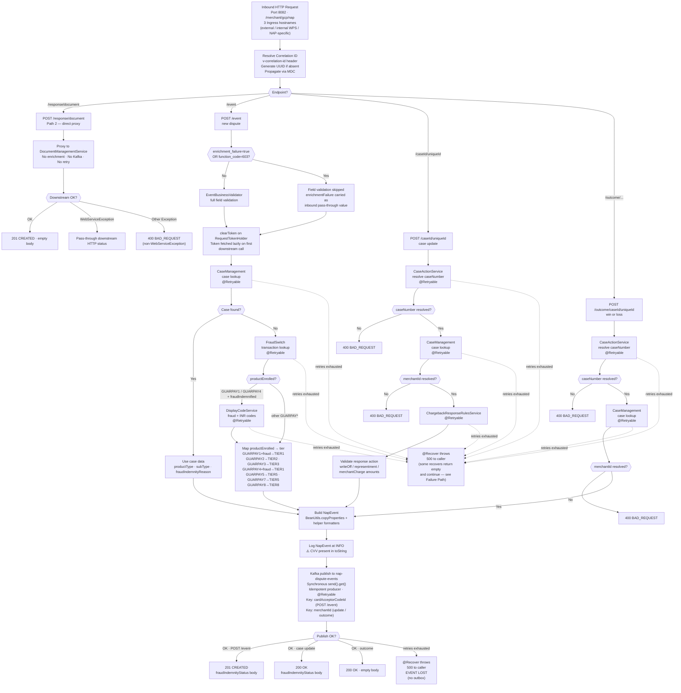

# WDP-COMP-04-NAP-DISPUTE-EVENT-SERVICE
**Worldpay Dispute Platform — Component Reference**
*Version: 2.0 DRAFT | April 2026*
*Source-verified: 2026-04-29 via GitHub Copilot CLI against
 `mdvs-gcp-nap-dispute-event-service` | Architect-confirmed: PENDING*

> ⚠️ DECOMMISSION-SCOPED COMPONENT
> This component sits on the NAP/WPG inbound path which is planned
> for decommission. No new development or design work is planned.
> This file is produced for knowledge-base completeness only.
> Do not use as a design reference for new inbound integration work.
> Note: source code itself contains no decommission markers — the
> decommission status is architectural, not code-visible.

---

## ━━━ CORE SKELETON ━━━━━━━━━━━━━━━━━━━━━━━━━━━━━━━━━━━━━━

---

## Identity

| Field                | Value                                                                 |
|----------------------|-----------------------------------------------------------------------|
| **Name**             | `NAPDisputeEventService`                                              |
| **Type**             | `REST API + Kafka Producer`                                           |
| **Repository**       | `mdvs-gcp-nap-dispute-event-service`                                  |
| **Maven artifact**   | `nap-event-service v1.4.4`                                            |
| **Technology**       | Spring Boot / Java                                                    |
| **Owner**            | Integration Team                                                      |
| **Status**           | `✅ Production`                                                       |
| **Doc status**       | `📝 DRAFT — source-verified 2026-04-29`                               |
| **Sections present** | `Core \| Block A (REST) \| Block C (Kafka Producer)`                  |
| **Decommission flag**| `⚠️ NAP/WPG inbound path — planned for decommission. No new work.`   |

---

## Purpose

**What it does**

NAPDisputeEventService is the inbound integration boundary between the
NAP (Network Acquirer Processing) acquiring platform and the WDP internal
event architecture. It is a REST-to-Kafka event bridge with synchronous
enrichment — it receives raw dispute lifecycle notifications over REST,
enriches each event by making sequential lookups against internal WDP
services, and publishes the enriched event to AWS MSK for downstream
consumption by COMP-05.

It exposes four REST endpoints that fall into two architecturally
distinct paths with asymmetric behaviour:

**Path 1 — Kafka path (3 endpoints).** New dispute notifications from
NAP-DPS, case-update operator actions from the WDP OPS Portal, and
win/loss outcomes from the OPS Portal. Each is validated, enriched
synchronously by 2–3 downstream REST services, and published to the
`nap-dispute-events` Kafka topic on the inbound HTTP thread.

**Path 2 — Document upload path (1 endpoint).** Base64-encoded evidence
documents from the OPS Portal are proxied directly to
DocumentManagementService. This path has no Kafka involvement, no
enrichment, and no retry.

The component is entirely stateless — no database, no cache, no Kafka
consumer side.

**What it does NOT do**

- Does not consume from any Kafka topic — Kafka producer only.
- Does not own or write to any database table.
- Does not perform any business logic on dispute outcomes — enrichment
  and routing only. All processing logic lives in downstream consumers.
- Does not handle NAP platform authorization — that belongs to
  UserAccessManagementService (COMP-02).
- Does not encrypt or tokenise PAN — the inbound payload carries only
  `pan_last_four`, never a full PAN. EncryptionService (COMP-35) is not
  called.
- Does not perform application-level authentication of inbound callers
  despite OAuth2 dependencies being present on the classpath. SecurityConfig
  whitelists `/**`. Authentication relies entirely on Ingress / network
  controls.
- Does not apply circuit-breaking or any timeout to any downstream REST
  dependency.
- Does not persist events for replay — no transactional outbox. Events
  lost between enrichment completion and Kafka publish are unrecoverable.
- Does not set the `enrichmentFailure` flag itself. If enrichment fails,
  the service throws HTTP 500 — it does not publish a degraded event.
  `enrichmentFailure` on the outbound payload is a pass-through copy of
  the value supplied by the inbound caller.

---

## Internal Processing Flow

---

## Boundaries

### Inbound Interfaces

| Source | Protocol | Endpoint | Payload / Description |
|--------|----------|----------|-----------------------|
| NAP-DPS | REST | `POST /event` | New chargeback dispute notification (SRV-116 contract; SRV-116 label is architectural — not present in source). |
| WDP OPS Portal | REST | `POST /{caseId}/{uniqueId}` | Operator response action (write-off, representment, merchant charge). |
| WDP OPS Portal | REST | `POST /outcome/{caseId}/{uniqueId}` | Win / loss / NA / closed outcome. |
| WDP OPS Portal | REST | `POST /response/document` | Base64-encoded evidence document. Proxied directly to DocumentManagementService. |

**Transport:** Port 8082, context path `/merchant/gcp/nap`. Three Ingress
hostnames (external, internal WPS, NAP-specific) backed by template
variables resolved by XL Deploy. TLS terminated at Ingress.

### Outbound Interfaces

| Target | Protocol | Purpose | On failure |
|--------|----------|---------|------------|
| IDPTokenService | REST GET | Fetch Bearer JWT for downstream calls. Lazy per-request fetch via `RequestTokenHolder` (request-scoped). | No retry. Throws → 500. All downstream calls in the request fail. |
| CaseManagementService | REST | Case lookup by ARN / networkCaseId / caseNumber → returns productType, subProductType, fraudIndemnityReason, merchantId. Called on all three Kafka-path endpoints. | `@Retryable`. Recovery throws 500 (new-event path) or returns empty object (update path). |
| CaseActionService | REST | Resolve internal WDP caseNumber from sourceSystemCaseId + uniqueId. Update + outcome paths only. | `@Retryable`. Recovery throws 500 or returns empty object. |
| FraudSwitch (Transaction Lookup) | REST | Lookup by merchantId + gatewayTranId → returns productEnrolled (GUARPAY1–8), fraudIndemnified, fraudIndemnityReason. New-event path only — and only when CaseManagement returns null. | `@Retryable`. Recovery always throws 500. |
| DisplayCodeService | REST | Reason-code list for fraud + INR. New-event path only — and only on the GUARPAY1 / GUARPAY4 fraud-indemnified branch. | `@Retryable`. Recovery always throws 500. |
| ChargebackResponseRulesService | REST | Validate operator response action. Update path only. | `@Retryable`. Recovery throws 500 or returns empty list. |
| DocumentManagementService | REST | Attach base64 evidence document to NAP dispute case. Path 2 only. | No retry. WebServiceException is pass-through; other exceptions → 400. |
| `nap-dispute-events` (AWS MSK) | Kafka | Publish enriched NapEvent. Synchronous `.send().get()`. Idempotent producer. | `@Retryable`. Recovery throws 500. **Event lost — no outbox.** |

---

## Database Ownership

### Tables Owned

This component owns no database state. It is stateless.

### Tables Read

This component makes no direct database reads. No JPA, no JDBC, no
datasource, no flyway/liquibase. All data is obtained via synchronous
REST calls.

---

## Configuration and Scaling

| Parameter | Value | Notes |
|-----------|-------|-------|
| Replica count | XL Deploy placeholder `replicas-mdvs-gcp-nap-dispute-event-service` | Resolved per environment. Actual production count not in repo. |
| HPA | Absent | Not defined in `resources.yaml`. |
| Memory request / limit | 1024Mi / 3072Mi | |
| CPU request / limit | Not set | Prevents CPU-based HPA. Noisy-neighbour risk. |
| Deployment type | Kubernetes Deployment | |
| Rollout strategy | maxSurge=1, maxUnavailable=0 | Single-step surge. |
| minReadySeconds | 30 | |
| PodDisruptionBudget | Absent | |
| Topology spread | maxSkew=1, whenUnsatisfiable=ScheduleAnyway, topologyKey=`kubernetes.io/hostname` | Soft constraint only. |
| Liveness probe | GET `/merchant/gcp/nap/livez:8082` · initialDelay 35s · period 10s · timeout 5s · failureThreshold 3 | |
| Readiness probe | GET `/merchant/gcp/nap/readyz:8082` · initialDelay 25s · period 10s · timeout 5s · failureThreshold 3 | |
| Startup probe | Absent | |
| Ports | 8082 | |
| Database connection pool | N/A | Stateless component. |
| Thread pool | Embedded Tomcat thread pool | No async pool. HTTP threads block on enrichment + Kafka publish. |
| Observability — OpenTelemetry | Operator-injected via pod annotation `instrumentation.opentelemetry.io/inject-java`. No javaagent flag (no Dockerfile in repo — buildpack-built). | |
| Observability — Actuator | `health`, `info`, `prometheus` exposed; `/livez` and `/readyz` health groups configured. | |
| Observability — Logstash | TCP socket appender to `${LOGSTASH_SERVER_HOST_PORT}` via `logstash-logback-encoder`. | |
| Correlation ID | `v-correlation-id` header. UUID generated if absent. Propagated via MDC. | |
| Kafka idempotence | `ENABLE_IDEMPOTENCE_CONFIG=true` | |
| Kafka max-in-flight | `MAX_IN_FLIGHT_REQUESTS_PER_CONNECTION=1` | Preserves partition ordering on retry. |

---

## Key Architectural Decisions

| Decision | ADR reference | Notes |
|----------|---------------|-------|
| REST-to-Kafka bridge with synchronous enrichment | Local | All processing logic lives downstream in COMP-05. |
| Push model from NAP-DPS | Local | NAP-DPS pushes events; WDP does not poll. |
| Two-path design with asymmetric behaviour | Local | Document-upload path is a deliberate direct-proxy pattern with no Kafka, no enrichment, no retry. |
| Enrichment-before-publish | Local | productType, subType, fraud indemnity resolved synchronously. Consumers receive fully-enriched events. |
| Bypass condition for degraded ingestion (POST /event only) | Local | When `enrichment_failure=true` OR `function_code=603`, `EventBusinessValidator` skips field validation. **Enrichment still runs.** `enrichmentFailure` on the outbound NapEvent is a pass-through copy — never set to `true` by this component on its own enrichment failure. |
| Stateless by design | Local | No DB, no cache, no Kafka consumer. |
| Idempotent Kafka producer | DEC-013 (legacy) | `ENABLE_IDEMPOTENCE_CONFIG=true`, `MAX_IN_FLIGHT=1`. Within-session only. |
| Replica count managed externally via XL Deploy | Local | No HPA. |
| Security delegated to Ingress / network | **Local — DEVIATION from platform auth standard** | All endpoints whitelisted (`/**`). OAuth2 dependencies on classpath but unused for endpoint protection. |
| **No transactional outbox** | **DEC-001 — DEVIATION** | Direct publish on the HTTP thread. Events lost after enrichment but before broker ACK are unrecoverable. |
| **Direct synchronous Kafka publish on HTTP thread** | **DEC-001 — DEVIATION** | `kafkaTemplate.send().get()` with no timeout argument holds the HTTP thread for the full broker roundtrip and all retries. |
| **Partition key = `cardAcceptorCodeId` for new events** | **DEC-003 — PARTIAL DEVIATION** | Update and outcome paths use `merchantId` (compliant). New events (`POST /event`) use `cardAcceptorCodeId` from `transactions[0].meta.card_acceptor_code_id`. |
| Circuit-breaker absence | DEC-014 (VOIDED at platform) | No Resilience4j, no Hystrix. Recorded as factual state, not a deviation. |
| Retry-config sharing across distinct dependencies | Local — finding | `${kafka_retry_count}` / `${kafka_retry_delay}` are reused for the Kafka publish AND for CaseManagement (new-event path), FraudSwitch, and DisplayCodeService. Tuning Kafka retries silently changes REST retry behaviour for those three calls. |

---

## Risks and Constraints

| Severity | Risk | Consequence |
|----------|------|-------------|
| 🔴 HIGH | No HTTP timeout on any RestTemplate. Three RestTemplate instances all use the default constructor — including a local one inside `getDisplayCodeDetails` that shadows the field-level instance. | Any slow or hung downstream service blocks the inbound HTTP thread indefinitely. Under load, exhausts the embedded Tomcat thread pool. A future centralised timeout fix on the field would not reach the shadowed local instance. |
| 🔴 HIGH | Blocking synchronous Kafka publish on the HTTP thread — `kafkaTemplate.send().get()` with no timeout argument and `@Retryable` on top. Worst-case blocking ≈ `retry_count × retry_delay`. | HTTP threads held for full Kafka roundtrip including retries. Combined with no RestTemplate timeouts, the service has no upper bound on per-request latency. |
| 🔴 HIGH | CVV logged in plain text at INFO via `NapEvent.toString()` immediately before Kafka publish (`NapEventServiceImpl` log line "Kafka event: {}"). | CVV is PCI-DSS 3.2.1 prohibited from storage. Logging to Logstash constitutes effective persistence. Active PCI compliance violation. |
| 🔴 HIGH | All endpoints unauthenticated at app level. SecurityConfig whitelist `/**`. OAuth2 client/resource-server dependencies are on the classpath but unused. | Any caller reaching the Ingress can submit dispute events, case updates, win/loss outcomes, or document uploads with no authentication. |
| 🟡 MEDIUM | POST /response/document logs the inbound body via Lombok-generated `toString()` at controller entry. The `file` field carrying the base64 document content is included. The Checkmarx sanitizer is invoked but does not strip the base64 payload itself. | Full document content reaches the log pipeline. Family of risk distinct from CVV but same root cause: logging request DTOs without payload-aware filtering. |
| 🟡 MEDIUM | Up to four serial REST hops per case-update request (CaseAction → CaseManagement → ChargebackResponseRules → Kafka). Each hop has its own `@Retryable`. No overall request deadline. | A single slow downstream service degrades the entire ingestion pipeline. No partial-enrichment fallback. |
| 🟡 MEDIUM | Retry config sharing — `${kafka_retry_count}` and `${kafka_retry_delay}` govern the Kafka publish AND CaseManagement (new-event path), FraudSwitch, and DisplayCodeService. | Operators tuning one value silently retune three other components. Hidden coupling. |
| 🟡 MEDIUM | No CPU requests or limits configured. | Prevents CPU-based HPA. Noisy-neighbour risk on node. No CPU guarantee for the pod. |
| 🟡 MEDIUM | No application-level inbound idempotency. Duplicate inbound POSTs result in duplicate enrichment and duplicate Kafka publishes. Producer idempotence does not span separate inbound HTTP requests. | Re-issued or replayed inbound calls produce duplicate downstream events. Downstream consumers (COMP-05) bear the entire dedup burden. |
| 🟡 MEDIUM | No transactional outbox (DEC-001 deviation). Direct publish to Kafka on the HTTP thread. | Events lost between enrichment completion and broker ACK are unrecoverable. No at-least-once delivery guarantee. |
| 🟡 MEDIUM | GUARPAY7 silently maps to TIER5 (same as GUARPAY5). No constant `PRODUCT_SUB_TYPE_GUARPAY7` exists. | Downstream consumers cannot distinguish GUARPAY5 from GUARPAY7 merchants via `productSubType` alone. Intent not determinable from source. |
| 🟢 LOW | `getDisplayCodeDetails` instantiates a local `new RestTemplate()` that shadows the field-level instance in the same class. | Future configuration changes to the field would not reach this code path. Silent maintenance hazard. |
| 🟢 LOW | `@EnableCaching` is imported in the application class but the annotation is not applied. Spring caching is therefore not active despite the import suggesting otherwise. | Misleading signal in code. Reader may assume caching is in play when it is not. |
| 🟢 LOW | `BeanUtils.copyProperties` silent field-drop risk. Currently no name mismatches between EventRequestDTO and NapEvent, but additions to either side without coordinated naming will silently drop. | Future maintenance hazard. |
| 🟢 LOW | OAuth2 client and resource-server dependencies present on the classpath but unused for inbound auth. | Code-base bloat and reader confusion. |

---

## Planned Changes

- ⚠️ DECOMMISSION SCOPE: NAP/WPG inbound path is planned for decommission.
  No code-visible decommission markers. Timeline and migration path not
  confirmed.
- ⚠️ OPEN: enforce application-level authentication, resolving the
  inconsistency between OAuth2 dependencies and the `/**` whitelist.
- ⚠️ OPEN: confirm GUARPAY7 → TIER5 mapping intent.
- ⚠️ OPEN: separate retry config for Kafka publish vs. shared REST
  dependencies (CaseManagement new-event path, FraudSwitch, DisplayCode)
  to remove the hidden coupling.
- ⚠️ OPEN: confirm whether `@EnableCaching` import is intentional
  (caching planned but not yet wired) or accidental (left over from a
  prior pattern).

---

---

## ━━━ TYPE BLOCK A — REST API CONTRACTS ━━━━━━━━━━━━━━━━━━━

---

## REST API Contracts

**Authentication model.** All endpoints unauthenticated at app level —
SecurityConfig whitelists `/**`. OAuth2 client and resource-server
dependencies are on the classpath but not used for endpoint protection.
Authentication relies entirely on Kubernetes Ingress and network firewall
controls. Confirmed HIGH risk.

**Base URL pattern.** `https://<host>/merchant/gcp/nap`

**Common error body.**
`{"errors": [{"errorMessage": "<msg>", "target": "<field or component>"}]}`

---

### Endpoint: `POST /event`

**Purpose:** Receive a new chargeback dispute notification from NAP-DPS,
enrich it, and publish to Kafka.
**Caller(s):** NAP-DPS (architectural; not source-verifiable).
**Auth required:** None enforced at app level.

**Request — `EventRequest`**

The request is a structured envelope: `{message, chargeback, transactions[], card_acceptor, card_holder, version}`.
Top-level objects are optional at the deserialiser level (commented-out
`@NotNull`); business validation enforces required fields via
`EventBusinessValidator` unless the bypass condition is met.

| Object | Key fields | Validation |
|--------|------------|------------|
| `message` | `acquirer_case_number` (≤25), `function_code` (≤3), `reason_code` (≤6), `enrichment_failure` (boolean), `unique_id`, `confirmed_fraud`, `confirmed_refund`, `data_record`, `wdp_only`, `transaction_type`, `reversal_indicator`, `reversal_date` (yyyy-MM-dd) | `@Size`, `@DateFormat` only |
| `chargeback` | `arn` (≤50), `case_number`, `dispute_amount`, `dispute_currency`, `dispute_exponent`, reconciliation triplet, converted-reconciliation triplet, `post_date`, `document_indicator`, `fraud_notification_service_*`, `amex_case_update_type`, `tlid` | `@Size`, `@DateFormat` only |
| `transactions[]` | Per element: `amount` / `currency` / `exponent` triplet, converted-amount triplet, `meta` (CVV up to 4 chars, AVS, auth code, processor, gcms_identifier, scheme/iso response codes, funded triplet etc.), `pos`, `fraud`, `worldpayTranId`, `processing_date`, `reversal_date`, `transaction_type`, `sale_method`, `terminal_id`, `ticket_number` | `@Size`, `@DateFormat`, `@Valid` cascade |
| `card_acceptor` | `name`, `mcc_code`, `meta`, `party_id`, `mid` | none |
| `card_holder` | `bin` (≤6), `scheme`, `country_code` (≤3), `pan_last_four` (≤4), `card_level`, `card_type` | `@Size` only |

Bypass condition: when `message.enrichment_failure == true` OR
`message.function_code == "603"`, `EventBusinessValidator.validateRequest`
skips all mandatory-field checks. Enrichment still runs.

**Responses**

| HTTP Status | Condition | Body |
|-------------|-----------|------|
| 201 CREATED | Successful enrichment and Kafka publish | `{"fraudIndemnityStatus": true|false}` |
| 400 BAD_REQUEST | Business validation failure (when bypass not active) | Common error body |
| 500 INTERNAL_SERVER_ERROR | Enrichment retries exhausted, OR Kafka publish retries exhausted | Common error body |

**Notes.** Correlation ID via `v-correlation-id` header (UUID generated if
absent, propagated via MDC). userId is set internally to the constant
`NAP_DPS`. CVV is logged at INFO via `NapEvent.toString()` before publish.
Idempotency at the inbound layer is absent — duplicate POSTs produce
duplicate Kafka events.

---

### Endpoint: `POST /{caseId}/{uniqueId}`

**Purpose:** Record an operator response action (write-off,
representment, merchant charge) on an existing NAP case.
**Caller(s):** WDP OPS Portal (architectural).
**Auth required:** None enforced at app level.

**Request — `NapEventCaseUpdateRequest`**

| Field | Type | Required | Validation |
|-------|------|----------|------------|
| `caseId` (path) | String | Yes | `@NotBlank` |
| `uniqueId` (path) | String | Yes | `@NotBlank` |
| `orgPartyId` | String | Yes | `@NotBlank` |
| `status` | Integer | Yes | `@NotNull` |
| `failureCode` | String | No | — |
| `type` | String | Yes | `@NotBlank`, `@EnumName(OutcomeType: RFI, CBK)` |
| `responseReason` | String | Yes | `@NotBlank` |
| `writeOff` | WriteOff | No | `@Valid` — amount, currencyCode (3 chars), exponent (0–9), reason |
| `merchantCharge` | MerchantCharge | No | `@Valid` — amount, currencyCode (3 chars), exponent (0–9) |
| `representment` | Representment | No | `@Valid` — amount, currencyCode, exponent, reason, full (Boolean default true) |
| `fee` | Fee | No | `@Valid` — controlNumber, amount, currencyCode, exponent |
| `networkCaseId` | String | No | — |
| `disputesLabCaseId` | String | No | — |
| `documentIndicator` | String | No | — |
| `dataRecord` | String | No | — |
| `userId` | String | Yes | `@NotBlank` |

Conditional service-level validation: when the rule's `responseDesc`
indicates write-off, representment, or merchant-charge, the
corresponding amount object must be present.

**Responses**

| HTTP Status | Condition | Body |
|-------------|-----------|------|
| 200 OK | Successful enrichment and Kafka publish | `{"fraudIndemnityStatus": true|false}` |
| 400 BAD_REQUEST | Bean validation failure, caseNumber not resolvable, merchantId not resolvable, or rule validation failure (missing actionCode, missing amount object) | Common error body |
| 500 INTERNAL_SERVER_ERROR | Enrichment retries exhausted, OR Kafka publish retries exhausted | Common error body |

**Notes.** Bypass condition does NOT apply to this endpoint — this path
does not pass through `EventBusinessValidator.validateRequest`.

---

### Endpoint: `POST /outcome/{caseId}/{uniqueId}`

**Purpose:** Record a win, loss, NA, or closed outcome on an existing
NAP case.
**Caller(s):** WDP OPS Portal (architectural).
**Auth required:** None enforced at app level.

**Request — `WinLossRequest`**

| Field | Type | Required | Validation |
|-------|------|----------|------------|
| `caseId` (path) | String | Yes | `@NotBlank` |
| `uniqueId` (path) | String | Yes | `@NotBlank` |
| `outcome` | String | Yes | `@NotBlank`, `@EnumName(WinLossOutcome: WIN, LOSS, NA, CLOSED)` |
| `responseReason` | String | No | Service-level: must be numeric if present |
| `userId` | String | Yes | `@NotBlank` |
| `functionCode` | String | No | — |

**Responses**

| HTTP Status | Condition | Body |
|-------------|-----------|------|
| 200 OK | Successful enrichment and Kafka publish | Empty body |
| 400 BAD_REQUEST | Bean validation, non-numeric responseReason, caseNumber not resolvable, merchantId not resolvable | Common error body |
| 500 INTERNAL_SERVER_ERROR | Enrichment retries exhausted, OR Kafka publish retries exhausted | Common error body |

**Notes.** `notificationType` is set to `UPDATE` on the outbound NapEvent
for this path only; the case-update path leaves it unset (the
corresponding setter is commented-out in source).

---

### Endpoint: `POST /response/document`

**Purpose:** Accept a base64-encoded evidence document and proxy it
directly to DocumentManagementService. **No Kafka. No enrichment.
No retry.**
**Caller(s):** WDP OPS Portal (architectural).
**Auth required:** None enforced at app level.

**Request — `UploadDocumentRequest`**

| Field | Type | Required | Validation |
|-------|------|----------|------------|
| `acquirerCaseNumber` | String | No | — |
| `uniqueId` | String | No | — |
| `arn` | String | No | — |
| `fileName` | String | Yes | `@NotBlank` |
| `file` | String (base64) | Yes | `@NotBlank` |
| `userId` | String | Yes | `@NotBlank` |

**Responses**

| HTTP Status | Condition | Body |
|-------------|-----------|------|
| 201 CREATED | Document successfully proxied | Empty body |
| 4xx / 5xx | DocumentManagementService returned a non-2xx — pass-through of downstream HTTP status | Common error body |
| 400 BAD_REQUEST | Other exceptions in the service layer (non-WebServiceException) | Common error body |

**Notes.** This endpoint is architecturally distinct — a deliberate
direct-proxy pattern, no Kafka, no enrichment, no retry. The full inbound
DTO including the `file` (base64 payload) is logged at controller entry
via Lombok-generated `toString()`. The Checkmarx string sanitizer is
invoked on the log argument but does not strip the base64 payload itself.
Documented as MEDIUM risk above.

---

---

## ━━━ TYPE BLOCK C — KAFKA PRODUCER CONTRACTS ━━━━━━━━━━━━━

---

## Kafka Producer Contracts

**Producer framework:** Spring Kafka `KafkaTemplate`.
**Idempotent producer:** Yes — `ENABLE_IDEMPOTENCE_CONFIG=true`.
**Max in-flight requests:** `MAX_IN_FLIGHT_REQUESTS_PER_CONNECTION=1`
(preserves partition ordering on retry).
**Publish mode:** Synchronous — `kafkaTemplate.send(...).get()` with no
timeout argument. Blocking on the HTTP thread.
**Retry on publish failure:** `@Retryable` — max attempts and delay
governed by `${kafka_retry_count}` and `${kafka_retry_delay}` (env-injected,
production values not in repo). Fixed delay (no multiplier). Catches
`Exception.class`. Recovery throws `EventServiceException` → HTTP 500.

---

### Topic: `nap-dispute-events`

| Parameter | Value |
|-----------|-------|
| **Topic name** | `${kafka_nap_topic}` (config key `kafka.nap-topic`). Logical name `nap-dispute-events` per platform registry. |
| **Message key** | `merchantId` for case-update and outcome paths · `cardAcceptorCodeId` for new dispute events (POST /event) — **partial deviation from DEC-003** |
| **Ordering guarantee** | Per partition (key-scoped). |
| **Published on** | Successful enrichment and HTTP-thread publish for any of: `POST /event`, `POST /{caseId}/{uniqueId}`, `POST /outcome/{caseId}/{uniqueId}`. |
| **NOT published on** | `POST /response/document` (direct proxy path). |
| **Consumed by** | COMP-05 NAPDisputeEventProcessor. |
| **Partition count** | Not in repo — managed externally (broker-side). |
| **Retention** | Not in repo — managed externally (broker-side). |

**Message payload structure**

The payload is a `NapEvent` object (≈138 fields). The full schema is
captured under "Confirmed Architectural Facts" in the change-log entry
accompanying this revision and is not duplicated here. Significant
characteristics for downstream consumers:

| Aspect | Detail |
|--------|--------|
| Population mechanism | Most fields populated via `BeanUtils.copyProperties(EventRequestDTO, NapEvent)` for the new-event path; selective formatters (`NapEventHelper.formatUpdateNotification`, `EventUtils.formatWinLossotification`) for update and outcome paths. |
| Service-set fields | `topicCreatedTimestamp` (Instant.now), `notificationType` (`UPDATE` — win/loss only; case-update path leaves unset), `userId` (`NAP_DPS` for new events; carried from request for update / outcome). |
| Enriched fields | `productType`, `productSubType`, `merchantOrderId`, `fraudVendorTranId`, `fraudVendorGroupingId`, `fraudIndemnityReason`, `externalCaseNumber` (caseNumber from CaseAction), `arn` / `cardNetwork` / `networkCaseNumber` / `issuerBin` / `merchantId` on update + outcome paths (sourced from CaseSearchResponse). |
| Pass-through fields | `enrichmentFailure` (string `"true"` / `"false"`, originating from inbound `message.enrichment_failure`). |
| PCI / sensitive | `cvv` is on the payload. Present in `NapEvent.toString()`. Logged at INFO before publish. |
| PAN | Only `panLastFour` (≤4 chars) traverses the boundary. No full PAN in inbound payload or NapEvent. |

**Payload notes**

- `enrichmentFailure=true` on the outbound event signals the
  *inbound caller's* assertion of degraded ingestion — not this
  component's enrichment outcome. If this component's own enrichment
  fails, the inbound HTTP request returns 500; no event is published
  with `enrichmentFailure=true`.
- The case-update path leaves `notificationType` unset (the setter is
  present-but-commented in source). Win/loss path sets it to `UPDATE`.
  Downstream consumers should treat absence of `notificationType` as a
  case-update signal.
- `BeanUtils.copyProperties` matches field names. Currently no name
  mismatches between EventRequestDTO and NapEvent; future additions on
  either side without coordinated naming will silently drop.
- Tier mapping (new-event path, FraudSwitch branch):
  GUARPAY1 + fraudIndemnified → TIER1 ·
  GUARPAY2 → TIER2 · GUARPAY3 → TIER3 ·
  GUARPAY4 + fraudIndemnified → TIER1 ·
  GUARPAY5 → TIER5 · **GUARPAY7 → TIER5** · GUARPAY8 → TIER8.
  Downstream cannot distinguish GUARPAY5 from GUARPAY7 by `productSubType`.

---

*End of WDP-COMP-04-NAP-DISPUTE-EVENT-SERVICE.md*
*Status: 📝 DRAFT — source-verified 2026-04-29 via Copilot CLI.*
*Architect sign-off: PENDING.*
*Last updated: April 2026.*
