# WDP-COMP-05-NAP-DISPUTE-EVENT-PROCESSOR
**Worldpay Dispute Platform — Component Reference**
*Version: 2.0 DRAFT | April 2026*
*Source-verified: 2026-04-29 against `gcp-nap-dispute-event-consumer` (Copilot CLI pass)*
*Architect-confirmed: PENDING*

---

> ⚠️ **DECOMMISSION-SCOPED COMPONENT**
> This component sits on the NAP/WPG inbound path which is planned for
> decommission as CB911 merchant migration completes. No new development
> or design work is planned. The `wdpOnly` runtime flag is the active
> migration gate. This file documents the component as-built.

---

## ━━━ CORE SKELETON ━━━━━━━━━━━━━━━━━━━━━━━━━━━━━━━━━━━━━━

---

## Identity

| Field             | Value |
|-------------------|-------|
| **Name**          | NAPDisputeEventProcessor |
| **Type**          | Kafka Consumer + REST API (manual reprocessing endpoint) |
| **Repository**    | gcp-nap-dispute-event-consumer |
| **Maven artifact**| gcp-nap-dispute-event-consumer v1.6.5 |
| **Technology**    | Spring Boot 3.5.7 / Java 17 / Spring Kafka / Spring Data JPA |
| **Owner**         | Integration Team |
| **Status**        | ✅ Production |
| **Doc status**    | 📝 DRAFT 🔍 v2.0 (2026-04-29) — source-verified, architect confirmation pending |
| **Decommission scope** | ⚠️ NAP/WPG inbound path — planned for decommission |
| **Sections present** | Core \| Block A (REST — manual reprocessing) \| Block B (Kafka Consumer) |

---

## Purpose

**What it does**

NAPDisputeEventProcessor is the stateful, event-driven downstream processor on
the NAP acquiring platform inbound path. It consumes enriched dispute
notification messages from the `nap-dispute-events` AWS MSK topic (published by
COMP-04 NAPDisputeEventService) and translates them into case management
actions on the WDP case management platform via synchronous REST calls to
COMP-23 CaseManagementService and adjacent services.

The component receives a single unified `NotificationEvent` payload on a
single Kafka topic. At runtime it classifies each message into one of three
sub-types — SRV116 (new chargeback notification), WIN/LOSS (arbitration
outcome), or SRV118 (chargeback response/representment) — by field inspection,
and routes each to a distinct processing path.

The component is in an active hybrid migration state. A `wdpOnly` /
`migrationStatus` flag (carried on the inbound event or on the case's max
action summary) gates whether the event belongs to a migrated legacy merchant
or a native NAP case. WIN/LOSS and SRV118 flows are skipped entirely under
that flag. The SRV116 path also applies MASTERCARD/MAESTRO-specific MCM Queue
lookup logic not present for other card networks.

It also exposes a single JWT-authenticated REST endpoint
(`POST /merchant/gcp/event-consumer/nap/event`) for operator-driven manual
reprocessing of a single record from the database error store. The Kafka and
REST entry paths converge inside the case service at the same processing
pipeline.

This is the only inbound consumer operating on the NAP acquiring platform path.
All other acquiring platforms (Visa batch, file-based) flow through
CaseCreationConsumer (COMP-14).

**What it does NOT do**

- Does not publish to any Kafka topic. Zero `KafkaTemplate`, zero
  `ProducerFactory`, zero producer wiring in source. The
  `SEND_BUSINESS_RULES_INFO_TO_KAFKA` terminal state is a constant string
  assigned to `apiName` for audit/state purposes only — no publish ever
  occurs. See Risks.
- Does not perform NAP platform authorization — that is COMP-02 UAMS.
- Does not enrich events — enrichment (productType, subProductType, fraud
  indemnity) is performed upstream by COMP-04 NAPDisputeEventService before
  the Kafka message is published.
- Does not use a Kafka DLQ topic. All error state is persisted to the
  PostgreSQL `NAP.DISPUTE_EVENT_CONSUMER_ERROR` table.
- Does not process non-NAP acquiring platform events — COMP-14
  CaseCreationConsumer handles all other platforms.
- Does not apply circuit-breaker logic — Resilience4j is absent from
  classpath (DEC-014 platform VOID).
- Does not perform inbound idempotency dedup. The `idempotency-key` header
  on `nap-dispute-events` is not read by this consumer.

---

## Internal Processing Flow

```mermaid
flowchart TD
    %% Entry paths
    KAFKA_IN["Kafka receipt<br/>nap-dispute-events<br/>NotificationEvent payload"]
    REST_IN["REST receipt<br/>POST /event<br/>EventConsumerErrorRequest"]

    ACK["acknowledge() — pre-ACK<br/>BEFORE all processing<br/>⚠️ DEC-005 deviation"]
    REHYDRATE["Reconstitute NapMessageEvent<br/>from stored ConsumerError row"]
    NORMALISE["Normalise WorldpayTranId<br/>(strip leading zeros)"]
    CLASSIFY{{"Classify event by<br/>field inspection"}}

    SRV116["IN_SRV116 — default<br/>(new chargeback notification)"]
    WINLOSS["IN_WIN_LOSS<br/>(outcome non-blank)"]
    SRV118["IN_SRV118<br/>(napResponseType AND<br/>napResponseCode non-blank)"]

    %% wdpOnly gates
    WDPONLY_WL{{"wdpOnly = 'Y' OR<br/>maxAction migrationStatus = 'Y'?"}}
    WDPONLY_118{{"wdpOnly = 'Y' OR<br/>maxAction migrationStatus = 'Y'?"}}
    OUTCOME_CHK{{"outcome ∈<br/>{NA, CLOSED}?"}}

    SKIP_WL["SKIPPED row written<br/>apiName = BLANK"]
    SKIP_118["SKIPPED row written<br/>apiName = BLANK"]
    SKIP_OUTCOME["SKIPPED row written<br/>apiName = BLANK"]

    %% Card network branch
    CARDNET["Modify card network<br/>(MASTERCARD+GCMS → MAESTRO)"]
    MCM_BRANCH{{"MASTERCARD<br/>or MAESTRO?"}}
    MCM_LOOKUP["MCM Queue lookup<br/>NAP.mcm_queue_data<br/>by acqRefNumber (ARN)"]
    MCM_COUNT{{"Result count<br/>= 1?"}}
    MCM_HOLD["FAILED1 row<br/>(ONHOLD marker)<br/>await napEventExpiryHour"]
    MCM_EXPIRED{{"napEventExpiryHour<br/>elapsed?"}}
    MCM_DEFAULT["Use default claim ID<br/>(reprocess path)"]

    %% Prior-error scan
    PRIOR_SCAN["Prior-error scan<br/>by ARN OR networkCaseId<br/>+ sourceSystemName='NAP'<br/>⚠️ no C_EVENT_TYPE filter"]
    PRIOR_DRAFT{{"Prior row in<br/>DRAFT status?"}}
    PRIOR_ERROR{{"Prior row in<br/>ERROR status?"}}
    BLOCK_ERR["ERROR row written<br/>processing halts"]
    REPROCESS_PRIOR["Reprocess each prior FAILED1/FAILED2<br/>through full pipeline<br/>(synchronous, on consumer thread)"]

    %% Case lookup + routing
    LOOKUP{{"VISA?"}}
    LOOKUP_VISA["Case search by<br/>networkCaseId"]
    LOOKUP_OTHER["Case search by ARN"]
    EXISTS{{"Case found?"}}

    %% NEW path (case not found)
    NEW_WORKFLOW["Workflow Rule Lookup (POST)"]
    NEW_RULES["New Case Action Rules (POST)"]
    NEW_TIMEFRAME["Timeframe Rules (DB read)<br/>NAP.issuer_raised_dispute_timefrm_rules"]
    NEW_CREATE["Create Case (POST)"]

    %% UPDATE path (case found)
    UPD_ACTION_LOOKUP["Case Action Search (GET)"]
    UPD_DUP{{"SRV116 duplicate?<br/>composite key match"}}
    UPD_SKIP_DUP["SKIPPED row written"]
    UPD_CBK["CBK Response Rules (GET)<br/>SRV118 only"]
    UPD_RULES["New Case Action Rules (POST)"]
    UPD_TIMEFRAME["Timeframe Rules (DB read)"]
    UPD_PRESTATUS["Pre-Action Status Rules (POST)"]
    UPD_ADD["Update Case / Add Action (POST)"]

    %% Notes + mismatch tail
    NOTES_GATE{{"dataRecord<br/>non-blank?"}}
    NOTES_CALL["Insert Notes (POST)"]
    NOTES_FAIL["SKIPPED_FAILED row<br/>processing CONTINUES"]
    MISMATCH{{"Field mismatch?<br/>reversalIndicator OR<br/>cardAcceptorCodeId/merchantId OR<br/>transactionType"}}
    APILOG_CALL["API Log (POST)"]
    APILOG_FAIL["SKIPPED_FAILED row<br/>processing CONTINUES"]

    %% Terminal
    TERMINAL["apiName = SEND_BUSINESS_RULES_INFO_TO_KAFKA<br/>(no-op terminal state)"]
    TOKEN_CLEAR_K["tokenService.clear()<br/>(Kafka path finally)"]
    TOKEN_LEAK["⚠️ token NOT cleared<br/>(REST path)"]
    DONE["Done — offset already committed<br/>or HTTP response returned"]

    %% Failure target
    FAIL_REST["REST call failure<br/>after retry exhaustion"]
    REC_NEW{{"isErrorTopic?"}}
    REC_FAIL1["@Recover writes<br/>FAILED1 row"]
    REC_FAIL2["@Recover writes<br/>FAILED2 row"]
    REC_FAIL2_TO_ERR["@Recover writes<br/>ERROR row"]
    HALT["Halts current message<br/>(offset already committed)"]

    %% --- Edges: entry → ACK / rehydrate ---
    KAFKA_IN --> ACK
    ACK --> NORMALISE
    REST_IN --> REHYDRATE
    REHYDRATE --> NORMALISE
    NORMALISE --> CLASSIFY

    %% --- Classification ---
    CLASSIFY -->|"outcome non-blank"| WINLOSS
    CLASSIFY -->|"napResponseType AND<br/>napResponseCode non-blank"| SRV118
    CLASSIFY -->|"otherwise"| SRV116

    %% WIN/LOSS gating
    WINLOSS --> WDPONLY_WL
    WDPONLY_WL -->|"Yes"| SKIP_WL
    WDPONLY_WL -->|"No"| OUTCOME_CHK
    OUTCOME_CHK -->|"Yes"| SKIP_OUTCOME
    OUTCOME_CHK -->|"No"| PRIOR_SCAN

    %% SRV118 gating
    SRV118 --> WDPONLY_118
    WDPONLY_118 -->|"Yes"| SKIP_118
    WDPONLY_118 -->|"No"| PRIOR_SCAN

    %% SRV116 → card network
    SRV116 --> CARDNET
    CARDNET --> MCM_BRANCH
    MCM_BRANCH -->|"Yes"| MCM_LOOKUP
    MCM_BRANCH -->|"No"| PRIOR_SCAN
    MCM_LOOKUP --> MCM_COUNT
    MCM_COUNT -->|"= 1 result"| PRIOR_SCAN
    MCM_COUNT -->|"≠ 1 result"| MCM_EXPIRED
    MCM_EXPIRED -->|"No — first event"| MCM_HOLD
    MCM_EXPIRED -->|"Yes — reprocess"| MCM_DEFAULT
    MCM_DEFAULT --> PRIOR_SCAN

    %% Prior-error scan
    PRIOR_SCAN --> PRIOR_ERROR
    PRIOR_ERROR -->|"Yes"| BLOCK_ERR
    PRIOR_ERROR -->|"No"| PRIOR_DRAFT
    PRIOR_DRAFT -->|"Yes — re-drive"| REPROCESS_PRIOR
    PRIOR_DRAFT -->|"No"| LOOKUP
    REPROCESS_PRIOR --> LOOKUP

    %% Case lookup
    LOOKUP -->|"VISA"| LOOKUP_VISA
    LOOKUP -->|"non-VISA"| LOOKUP_OTHER
    LOOKUP_VISA --> EXISTS
    LOOKUP_OTHER --> EXISTS
    EXISTS -->|"No — NEW"| NEW_WORKFLOW
    EXISTS -->|"Yes — UPDATE"| UPD_ACTION_LOOKUP

    %% NEW path
    NEW_WORKFLOW --> NEW_RULES
    NEW_RULES --> NEW_TIMEFRAME
    NEW_TIMEFRAME --> NEW_CREATE
    NEW_CREATE --> NOTES_GATE

    %% UPDATE path with duplicate gate
    UPD_ACTION_LOOKUP --> UPD_DUP
    UPD_DUP -->|"Yes — duplicate"| UPD_SKIP_DUP
    UPD_DUP -->|"No"| UPD_CBK
    UPD_CBK --> UPD_RULES
    UPD_RULES --> UPD_TIMEFRAME
    UPD_TIMEFRAME --> UPD_PRESTATUS
    UPD_PRESTATUS --> UPD_ADD
    UPD_ADD --> NOTES_GATE

    %% Notes / mismatch tail
    NOTES_GATE -->|"Yes"| NOTES_CALL
    NOTES_GATE -->|"No"| MISMATCH
    NOTES_CALL --> MISMATCH
    NOTES_CALL -->|"REST failure"| NOTES_FAIL
    NOTES_FAIL --> MISMATCH
    MISMATCH -->|"Yes"| APILOG_CALL
    MISMATCH -->|"No"| TERMINAL
    APILOG_CALL --> TERMINAL
    APILOG_CALL -->|"REST failure"| APILOG_FAIL
    APILOG_FAIL --> TERMINAL

    %% Terminal + token cleanup divergence
    TERMINAL -->|"Kafka path"| TOKEN_CLEAR_K
    TERMINAL -->|"REST path"| TOKEN_LEAK
    TOKEN_CLEAR_K --> DONE
    TOKEN_LEAK --> DONE
    SKIP_WL --> DONE
    SKIP_118 --> DONE
    SKIP_OUTCOME --> DONE
    UPD_SKIP_DUP --> DONE
    BLOCK_ERR --> DONE
    MCM_HOLD --> DONE

    %% Halting REST failures (any of: Case Search, Workflow Rule, Case Action,
    %% New Case Action Rules, CBK Response, Pre-Action Status, Create/Update Case,
    %% Modify Card Network, MCM Queue, IDP Token)
    LOOKUP_VISA -->|"failure"| FAIL_REST
    LOOKUP_OTHER -->|"failure"| FAIL_REST
    NEW_WORKFLOW -->|"failure"| FAIL_REST
    NEW_RULES -->|"failure"| FAIL_REST
    NEW_CREATE -->|"failure"| FAIL_REST
    UPD_ACTION_LOOKUP -->|"failure"| FAIL_REST
    UPD_CBK -->|"failure"| FAIL_REST
    UPD_RULES -->|"failure"| FAIL_REST
    UPD_PRESTATUS -->|"failure"| FAIL_REST
    UPD_ADD -->|"failure"| FAIL_REST
    CARDNET -->|"failure"| FAIL_REST

    FAIL_REST --> REC_NEW
    REC_NEW -->|"new event"| REC_FAIL1
    REC_NEW -->|"reprocess of FAILED1"| REC_FAIL2
    REC_NEW -->|"reprocess of FAILED2"| REC_FAIL2_TO_ERR
    REC_FAIL1 --> HALT
    REC_FAIL2 --> HALT
    REC_FAIL2_TO_ERR --> HALT
    HALT --> DONE
```

**Flow notes**

- The component has **two entry paths** that converge at the case service
  pipeline. The Kafka path runs the platform filter (offset commit + payload
  classification) before reaching the prior-error scan. The REST path
  reconstitutes a `NapMessageEvent` from the stored error row and joins the
  same pipeline at the prior-error scan stage. Source-verified.
- The offset commit always precedes all downstream work (DEC-005 deviation).
  A JVM crash after the commit and before any error-row write results in
  permanent message loss — there is no broker-side redelivery.
- The prior-error scan runs synchronously on the consumer thread and drives
  the FULL pipeline (all retries + REST + DB) for each FAILED1/FAILED2 row
  found for the same ARN/networkCaseId. On an ARN with many accumulated
  error rows this can plausibly approach `max.poll.interval.ms` — see Risks.
- The prior-error scan filters on `arn` OR `networkCaseId` plus
  `sourceSystemName = "NAP"` only. It does NOT filter on `C_EVENT_TYPE`,
  even though that column exists on the entity. Mirror of the COMP-39
  finding — see Risks (cross-component shared-table consumption hazard).
- `Insert Notes` and `API Log` are non-halting. On retry exhaustion they
  write a `SKIPPED_FAILED` row and processing continues to the terminal
  state. Every other REST call is halting (writes FAILED1 / FAILED2 / ERROR
  on the row state machine and stops the message).
- The terminal `SEND_BUSINESS_RULES_INFO_TO_KAFKA` state is a constant
  assigned to `apiName` for audit/state purposes only. There is no Kafka
  publish — zero `KafkaTemplate` exists in the codebase.
- IDP JWT is held on a `ThreadLocal`. The Kafka path clears it in a
  `finally` block. The REST manual-reprocess path **does not** — flagged
  as a token-leak hazard for any subsequent operator call landing on the
  same Tomcat thread.

---

## Boundaries

### Inbound Interfaces

| Source | Protocol | Endpoint / Topic / Trigger | Payload / Description |
|--------|----------|----------------------------|-----------------------|
| COMP-04 NAPDisputeEventService | Kafka | `nap-dispute-events` (config key `${kafka_consumer_topic}`) | Unified `NotificationEvent` JSON encoding SRV116, WIN/LOSS, and SRV118 sub-types. Partition key: `merchantId` (standard event types) or `cardAcceptorCodeId` (POST /event new disputes — DEC-003 partial deviation, see WDP-COMP-04). |
| Operations team / Ops Portal tooling | REST | `POST /merchant/gcp/event-consumer/nap/event` | `EventConsumerErrorRequest` — manual reprocessing trigger for a previously-failed error row. JWT-required. |

### Outbound Interfaces

| Target | Protocol | Endpoint / Resource | Purpose | On failure |
|--------|----------|---------------------|---------|------------|
| IDP Token Service | REST GET | `${wdp_token_service_url}` | Obtain JWT bearer for all WDP-internal REST calls; ThreadLocal token holder | Not `@Retryable`; exception propagates to caller's `@Recover` → halts |
| Case Search (COMP-23 CaseManagementService via API Gateway) | REST GET | `${case_search_url}` | Determine if a case exists for the inbound dispute (VISA: by `networkCaseId`; others: by `arn`) | `@Retryable` `maxAttempts=1` (no retry); `@Recover` writes FAILED1/FAILED2; halts |
| Workflow Rule Lookup | REST POST | `${workflow_rule_lookup_url}` | NEW path only — resolve workflow name | `@Retryable` `maxAttempts=1`; `@Recover` writes FAILED1/FAILED2; halts |
| Case Action Search (COMP-24 CaseActionService) | REST GET | `${case_action_search_url}` | UPDATE path — retrieve existing actions for duplicate detection and status routing | `@Retryable` `maxAttempts=1`; `@Recover` writes FAILED1/FAILED2; halts |
| New Case Action Rules | REST POST | `${new_case_action_rules_response_url}` | Resolve next stage / action / owner / SLA | `@Retryable` `maxAttempts=1`; `@Recover` conditional on `isErrorHandlingRequired` writes FAILED1/FAILED2; halts |
| CBK Response Rules | REST GET | `${cbk_response_rules_url}` | SRV118 only — chargeback response rules | `@Retryable` `maxAttempts=1`; `@Recover` writes FAILED1/FAILED2; halts |
| Pre-Action Status Rules | REST POST | `${preaction_status_rule_url}` | UPDATE path — pre-action status resolution | `@Retryable` `maxAttempts=1`; `@Recover` writes FAILED1/FAILED2; halts |
| Create Case (COMP-23) | REST POST | `${create_case_url}` | NEW path — persist new case | `@Retryable` `maxAttempts=${napevent.retrycount}`; `@Recover` writes FAILED1/FAILED2; halts |
| Update Case / Add Action (COMP-23) | REST POST | `${update_case_url}` | UPDATE path — append action | `@Retryable` `maxAttempts=${napevent.retrycount}`; `@Recover` writes FAILED1/FAILED2; halts |
| Insert Notes (COMP-25 NotesService) | REST POST | `${add_note_url}` | Add `dataRecord` as case note when non-blank | `@Retryable` `maxAttempts=${napevent.retrycount}`; `@Recover` writes SKIPPED_FAILED; **does NOT halt** — flow continues |
| API Log (COMP-38) | REST POST | `${log_api_url}` | Log field-mismatch diagnostic | `@Retryable` `maxAttempts=${napevent.retrycount}`; `@Recover` writes SKIPPED_FAILED; **does NOT halt** |
| PostgreSQL — `NAP.DISPUTE_EVENT_CONSUMER_ERROR` | JDBC / JPA | NAP datasource | Database DLQ — read at start of every event (prior-error scan); write/update on every failure path | Read `@Retryable maxAttempts=${napevent.retrycount}`; write `@Retryable`; recovery returns null → flow proceeds without prior-error context |
| PostgreSQL — `NAP.mcm_queue_data` | JDBC / JPA | NAP datasource | MCM Queue lookup for MASTERCARD/MAESTRO — resolve ARN to claim ID | `@Retryable maxAttempts=1`; `@Recover` falls through to ONHOLD branch |
| PostgreSQL — `NAP.issuer_raised_dispute_timefrm_rules` | JDBC / JPA | NAP datasource | Timeframe rules lookup by dispute type + reason code + card network | `@Retryable maxAttempts=1`; `@Recover` returns null; flow continues |
| PostgreSQL — `NAP.BUSINESS_RULE_CONSUMER_ERROR` | JDBC / JPA | NAP datasource | Separate error table for business-rule-related processing failures (read + write) | Same retry pattern as primary error table |

**Note on REST resilience posture:** Every REST call uses a single shared
`RestTemplate` with no connection timeout, no read timeout, and no connection
pool tuning. Resilience4j is absent from the classpath (DEC-014 platform
VOID). A hung downstream blocks the single consumer thread until the OS TCP
default eventually fires, at which point `max.poll.interval.ms` may be
breached and the consumer group will rebalance.

---

## Key Architectural Decisions

| Decision | ADR reference | Notes |
|----------|---------------|-------|
| At-most-once Kafka delivery — offset committed BEFORE processing | DEC-005 — **DEVIATION** | Deliberate to avoid Kafka redelivery; recovery is via DB error table only. JVM crash post-ACK = permanent loss. Mirror of COMP-39, COMP-14, COMP-15, COMP-16, COMP-17, COMP-18, COMP-40, COMP-41, COMP-42, COMP-43. |
| Database-backed DLQ over Kafka DLQ | Platform pattern | All failed events → `NAP.DISPUTE_EVENT_CONSUMER_ERROR` with raw Kafka JSON. No Kafka DLQ topic. |
| No circuit breaker | DEC-014 — **VOID (platform-wide ABSENT)** | Resilience4j not on classpath. Bare `RestTemplate` with no timeouts on any of 11 REST calls. |
| Spring Retry instead of Resilience4j | Platform pattern | `@Retryable` / `@Recover` on all outbound calls. Retry counts non-uniform: most steps `maxAttempts=1` (no retry); Create/Update Case + Insert Notes + API Log use `${napevent.retrycount}`. |
| Single-threaded processing (concurrency = 1) | Local — default-by-omission | `setConcurrency()` not invoked. Throughput scales only with replica count. No comment / commit message documents intent. |
| Hybrid migration state gated by `wdpOnly` / `migrationStatus` flag | Local — operational | Data-driven (not a Spring profile or `@ConditionalOnProperty`). WIN/LOSS and SRV118 paths skipped when set. CB911 migration in progress. |
| No transactional outbox | DEC-001 — **NOT APPLICABLE** | Component does not produce to Kafka. Error-table writes are bare auto-commit (no `@Transactional` anywhere in `src/main`) — same auto-commit pattern as COMP-39, COMP-14, COMP-42, COMP-43. |
| PAN handling — no full PAN | DEC-004 / DEC-019 — **COMPLIES at PAN level** | `NotificationEvent` carries `panLastFour` only — no clear PAN. EncryptionService not called. |
| **CVV persisted at rest** ⚠️ | NEW finding — separate from DEC-019 | `NotificationEvent` carries a `cvv` field which is mapped to `C_CVV` on the error table entity AND serialised into the raw `C_KAFKA_EVENT` JSON column. PCI-DSS concern — see Risks. Same finding-class as COMP-04 CVV logging. |
| Single unified topic for all NAP event sub-types | Local | SRV116, WIN/LOSS, SRV118 all arrive on `nap-dispute-events` as the same `NotificationEvent` payload. Sub-type determined at runtime by field inspection. |
| Manual operator reprocess endpoint pattern | Local | `POST /event` JWT-authed — reconstitutes a `NapMessageEvent` from the stored error row and drives the same pipeline. No per-record locking — Kafka path and operator post can race on the same record. |
| `SEND_BUSINESS_RULES_INFO_TO_KAFKA` is a no-op terminal state | Local | Constant assigned as `apiName` after every successful execution. No publisher exists — silent dead feature. |

---

## Risks and Constraints

| Severity | Risk | Consequence |
|----------|------|-------------|
| 🔴 HIGH | **CVV persisted at rest in `C_CVV` column AND in raw `C_KAFKA_EVENT` JSON** | PCI-DSS 3.2.1 prohibits CVV storage post-authorisation. The `cvv` field on `NotificationEvent` (originated in COMP-04 — see COMP-04 CVV logging finding) lands in two columns of the database error table. New finding 2026-04-29. Compounds the COMP-04 finding by promoting CVV from "logged" to "persisted". |
| 🔴 HIGH | At-most-once delivery — offset acknowledged BEFORE processing. JVM crash, OOM kill, or pod eviction after ACK but before any DB write means permanent loss. Error table only written if processing reaches the failure path | Unrecorded chargebacks — no broker safety net. Directly conflicts with DEC-005 platform standard. |
| 🔴 HIGH | Bare `RestTemplate` with no connect / read timeout, no circuit breaker (DEC-014 deviation). At concurrency=1, a single hung downstream blocks all NAP inbound on that pod | `max.poll.interval.ms` eventually breaches → consumer-group rebalance → all NAP processing on that pod stops |
| 🔴 HIGH | **Cross-component shared-table consumption hazard on `NAP.DISPUTE_EVENT_CONSUMER_ERROR`** | Prior-error scan filters on `arn` OR `networkCaseId` + `sourceSystemName='NAP'` only — no `C_EVENT_TYPE` filter. Rows written by COMP-23, COMP-24, COMP-39 against the same case (all under `sourceSystemName='NAP'`) may be picked up and re-driven through this consumer's SRV116/WIN_LOSS/SRV118 pipeline regardless of whether they originated from a different processing path. Mirror of the same finding on COMP-39. Same architectural class as DEC-019/DEC-020 risk-accepted ADRs. |
| 🟡 MEDIUM-HIGH | Recursive error reprocessing on the consumer thread — for an ARN with many accumulated FAILED1/FAILED2 rows, the synchronous loop iterates the full 11-REST + DB pipeline per row | `max.poll.interval.ms` violation risk under heavy backlog → consumer-group rebalance |
| 🟡 MEDIUM | No PodDisruptionBudget configured | Combined with at-most-once delivery, node drains can evict all pods simultaneously and cause permanent event loss across the pod set |
| 🟡 MEDIUM | No CPU request, no CPU limit → Burstable QoS | First candidate for eviction under node memory pressure; CPU consumption unbounded; CPU-based HPA cannot be configured |
| 🟡 MEDIUM | No HPA, no PDB, no startup probe | Static replica count from XL Deploy. No protection during rolling node operations. Liveness/readiness fire from `initialDelaySeconds` only. |
| 🟡 MEDIUM | `minReadySeconds` placed at `spec.template.spec` level — silently ignored by Kubernetes | The 30-second rollout stability gate is not actually applied at runtime. Same defect class as COMP-25. Cross-component pattern audit owed. |
| 🟡 MEDIUM | MCM Queue multi-result silent ONHOLD with misleading error message ("MCM claim id not exist") even when data does exist | MASTERCARD/MAESTRO disputes silently delayed until `napEventExpiryHour` timeout — no operator alert |
| 🟡 MEDIUM | `SEND_BUSINESS_RULES_INFO_TO_KAFKA` is dead infrastructure in production | Downstream consumers expecting a business-rules Kafka message from the NAP path will never receive one. Silent feature gap. |
| 🟡 MEDIUM | Manual reprocess REST + Kafka prior-error scan can race on the same error row (no per-record lock) | Two simultaneous pipelines can drive the same record. Mirror of COMP-39 finding. |
| 🟡 MEDIUM | `nap.timeframe_rules` (v1.0 doc) is actually `NAP.issuer_raised_dispute_timefrm_rules` — table-name correction propagated to WDP-DB.md | Documentation drift — no runtime impact |
| 🟡 MEDIUM | Bad-payload silent drop — `ErrorHandlingDeserializer` wraps a `JsonDeserializer<NotificationEvent>`; the registered `CommonErrorHandler` is empty (no method overrides) | Undeserialisable payloads silently dropped — no DLT, no log, no counter. Same pattern as COMP-14, COMP-16, COMP-40, COMP-41, COMP-42, COMP-43. |
| 🟡 MEDIUM | Deserialization failure handling not separately tested. Behaviour under poison-pill is "silently advance offset and continue" by inheritance from the empty error handler | Untestable failure mode in production — no alert |
| 🟢 LOW | Shared `RestTemplate` error-handler mutation — `IdpRestInvoker` calls `setErrorHandler()` on the singleton on every token request. Latent race if concurrency is ever raised | Currently benign at concurrency=1. Cross-component pattern (COMP-41 has equivalent shared-RestTemplate concern). |
| 🟢 LOW | IDP JWT ThreadLocal not cleared on the manual-reprocess REST path — `finally`-clear exists on the Kafka path only | Stale token may be reused on subsequent operator call landing on the same Tomcat thread |
| 🟢 LOW | Unused dependencies in `pom.xml` (`spring-boot-starter-cache`, `httpclient5`) — no `@Cacheable`/`@EnableCaching` anywhere; HttpClient5 not imported | Bloat only |
| 🟢 LOW | `JCB_FLOW`, `VISA_ALLOCATION` constants declared but unreferenced | Dead constants; suggests planned-then-paused work |

---

## Configuration and Scaling

| Parameter | Value | Notes |
|-----------|-------|-------|
| Replica count | `{{ replicas-mdvs-gcp-nap-dispute-event-consumer }}` | XL Deploy template variable — runtime value not in repo |
| HPA | None | No `HorizontalPodAutoscaler` resource in repo. No KEDA, no lag-based autoscaling. |
| Memory request | 2048Mi | |
| Memory limit | 4096Mi | |
| CPU request | Not configured | Burstable QoS class |
| CPU limit | Not configured | Unbounded JVM CPU |
| Deployment type | Kubernetes Deployment | Single Deployment + Service + Ingress in `resources.yaml` |
| Container port | 8082 | |
| Rolling update strategy | RollingUpdate — maxSurge=1, maxUnavailable=0 | |
| `minReadySeconds` | 30 — ⚠️ **misplaced under `spec.template.spec`** | Silently ignored at runtime by Kubernetes. Defect-class shared with COMP-25. |
| PodDisruptionBudget | None | |
| Topology spread | maxSkew=1, ScheduleAnyway, topologyKey=kubernetes.io/hostname | Soft constraint only |
| Liveness probe | HTTP GET `/merchant/gcp/event-consumer/nap/livez` :8082 — initialDelay 40s, timeout 5s, period 10s, failureThreshold 3 | |
| Readiness probe | HTTP GET `/merchant/gcp/event-consumer/nap/readyz` :8082 — initialDelay 30s, timeout 5s, period 10s, failureThreshold 3 | |
| Startup probe | None | |
| Kafka consumer concurrency | 1 (Spring default) | `setConcurrency()` not invoked |
| Offset commit mode | `MANUAL_IMMEDIATE`, `syncCommits=true` | Pre-ACK before processing — DEC-005 deviation |
| Auto commit | false | |
| Auto offset reset | latest | |
| Max poll records | `${max_poll_records}` (env-injected) | No committed default |
| Max poll interval | `${max_poll_interval}` (env-injected) | No committed default |
| Session timeout | `${session_timeout_ms}` (env-injected) | No committed default |
| Heartbeat interval | `${heartbeat_interval_ms}` (env-injected) | No committed default |
| MSK auth | SASL_SSL + AWS_MSK_IAM | |
| Deserializer | `ErrorHandlingDeserializer` wrapping `JsonDeserializer<NotificationEvent>` | Bad payload → silent drop (empty `CommonErrorHandler`) |
| Retry framework | Spring Retry | `@Retryable` / `@Recover` on `NapEventProcessingService` and `ConsumerErrorService` |
| OpenTelemetry agent | Yes — pod annotation `instrumentation.opentelemetry.io/inject-java` | |
| Spring Actuator endpoints exposed | `info`, `health`, `prometheus` | |
| Logging sink | Logstash TCP appender → `${logstash_server_host_port}` | |
| Dockerfile | Not in repo | Image built externally (Paketo buildpacks) |

---

## Planned Changes

- **Active migration — CB911 merchant migration:** `wdpOnly` /
  `migrationStatus` is the active gate. Non-migrated CB911 merchants
  (SRV117 and WIN/LOSS) still processed via this service. Migration
  timeline: TBD. Component scope expected to reduce as migration
  progresses, then decommission.
- **Commented-out `visaCaseLookup()` method body and call sites** — would
  have performed a secondary VISA case lookup by ARN after the initial
  `networkCaseId`-based lookup. Superseded by the unified `caseLookup()`.
- **Commented-out `FRAUD_SWITCH_LOOKUP` call site** — replaced with
  `WORKFLOW_RULE_LOOKUP`. Note: the URL property
  `${fraudswitch.fraudswitchTransactionLookupSearchUrl}` is still
  injected at startup and Spring will fail to start if the env var is
  unset — env-var dependency on dead code.
- **Commented-out NEW Case Action stage/action validation block** —
  would have skipped certain stage/action combinations for NEW
  notifications. Now always proceeds to Time Frame Rule.
- **Commented-out function-code predicate check** — duplicate-detection
  variant that was disabled.
- **Commented-out columns in `ConsumerError` entity** —
  `cardAcceptorCodeId` (`I_CARD_ACC_CODE`), `partyId` (`I_PARTY_ID`).
  Schema mismatch risk if DDL still has these columns.
- **`SEND_BUSINESS_RULES_INFO_TO_KAFKA`** — assigned as terminal `apiName`
  but no publisher exists. Silent dead feature, no timeline.
- **`JCB_FLOW`, `VISA_ALLOCATION` constants** — declared but unreferenced.
  Suggests planned-then-paused work.
- **`calculateWorkableAmount()` is NOT dead** — v1.0 said it had been
  replaced (US2137854) and the body was dead. Source-verified 2026-04-29:
  the method is still actively called. v1.0 was incorrect on this point.
- **No TODO/FIXME/XXX comments** anywhere in `src/main`.
- **Dead dependencies in `pom.xml`** — `spring-boot-starter-cache` (no
  `@Cacheable`/`@EnableCaching` in code), `httpclient5` (not imported
  anywhere — `RestTemplate` uses default JDK HTTP client). Recommend
  removal.
- ⚠️ **OPEN QUESTION — implicit:** Whether the cross-component shared-
  table consumption hazard (no `C_EVENT_TYPE` filter) is intentional
  (single-pipeline recovery model) or a defect — same architect decision
  needed as for COMP-39.

---

---

## ━━━ TYPE BLOCK A — REST API CONTRACTS ━━━━━━━━━━━━━━━━━━━

---

## REST API Contracts

**Authentication model:** JWT bearer token required. The endpoint is NOT in
the SecurityConfig whitelist; standard JWT validation applies. Trusted
issuers configured via env. CSRF disabled. Non-prod profiles additionally
whitelist Swagger/OpenAPI paths; prod whitelist excludes them.

**Base URL pattern:** `https://<host>/merchant/gcp/event-consumer/nap`

---

### Endpoint: `POST /merchant/gcp/event-consumer/nap/event`

**Purpose:** Manual reprocessing — re-drive a previously-failed error row
through the SRV116/WIN_LOSS/SRV118 pipeline.
**Caller(s):** WDP Ops Portal / operator tooling. Not called by any WDP
component on the normal processing path.
**Auth required:** Bearer JWT (validated against `${trusted_issuers}`).

**Request — `EventConsumerErrorRequest`**

| Field | Type | Required | Description |
|-------|------|----------|-------------|
| `id` | Long | Yes | Identifies the `NAP.DISPUTE_EVENT_CONSUMER_ERROR` row (`I_CONSUMER_ERR_ID`) to reprocess |
| `errorStatus` | String | Yes | Current status of the row (e.g. FAILED1, FAILED2) |
| `errorReason` | String | Yes | Recorded error reason |
| `kafkaEvent` | String | Yes | Stored raw Kafka JSON payload (rehydrated into `NapMessageEvent`) |
| `offsetSeq` | String | Yes | Original Kafka offset of the failed message |
| `partitionName` | String | Yes | Original Kafka partition name |

**Response — Success**

| HTTP Status | Condition | Body |
|-------------|-----------|------|
| 200 | Pipeline executed for the specified row (success or graceful skip) | `EventConsumerErrorResponse` — `{ errorReason, status, isErrorOccured }` |

**Response — Error**

| HTTP Status | Condition | Body |
|-------------|-----------|------|
| 400 | Request validation failure (`MethodArgumentNotValidException`, `ConstraintViolationException`, `BadRequestException`) | `StandardErrorResponse` — list of `StandardDisplayError` |
| 401 | Missing or expired JWT | Spring Security default |
| 403 | JWT issuer not in `${trusted_issuers}` | Spring Security default |
| 404 | `NoHandlerFoundException` (path not found) | `StandardErrorResponse` |
| 405 | `HttpRequestMethodNotSupportedException` | `StandardErrorResponse` |
| 500 | `HttpMessageNotReadableException` or unhandled exception during reprocess | `StandardErrorResponse` |

**Notes:**
- The endpoint does NOT run the platform classification independently — it
  reconstitutes a `NapMessageEvent` from the stored row and joins the same
  pipeline at the prior-error scan stage.
- On reprocess failure: error details returned in the HTTP response body —
  no NEW error row is written on this path. The existing row is updated
  (FAILED1 → FAILED2 → ERROR) by the prior-error reprocess loop within
  the same call.
- IDP JWT ThreadLocal is **NOT** cleared in a `finally` block on this
  path — token-leak hazard for subsequent operator calls on the same
  Tomcat thread.
- A duplicate operator POST for the same row while the Kafka path is also
  reprocessing the same case can race — there is no per-record lock.

---

---

## ━━━ TYPE BLOCK B — KAFKA CONSUMER CONTRACTS ━━━━━━━━━━━━━

---

## Kafka Consumer Contracts

**Consumer framework:** Spring Kafka `@KafkaListener` — single listener,
single topic.
**Offset commit strategy:** `MANUAL_IMMEDIATE` with `syncCommits=true` —
**pre-ACK BEFORE all processing**. ⚠️ DEC-005 deviation — at-most-once
delivery.
**Error handling strategy:** Database error table
(`NAP.DISPUTE_EVENT_CONSUMER_ERROR`) — no Kafka DLQ topic. Bad-payload
silent drop via empty `CommonErrorHandler`.

---

### Topic: `nap-dispute-events`

| Parameter | Value |
|-----------|-------|
| **Topic name** | `nap-dispute-events` (config key `${spring.kafka.consumer.topic}` → env `${kafka_consumer_topic}`) |
| **Consumer group** | `${spring.kafka.consumer.groupId}` → env `${kafka_group_id}` — value injected via Kubernetes secret, not in repo |
| **Partition key (received)** | Read into local variable `keyMerchantId` via `@Header(KafkaHeaders.RECEIVED_KEY)` — logged only, not used for routing. Producer-side: `merchantId` for standard event types, `cardAcceptorCodeId` for new-dispute events (DEC-003 partial deviation, see COMP-04). |
| **AckMode** | `MANUAL_IMMEDIATE` |
| **syncCommits** | `true` |
| **Concurrency** | 1 (Spring Kafka default — `setConcurrency()` not invoked; no documented intent) |
| **Max poll records** | `${max_poll_records}` (env-injected; no committed default) |
| **Max poll interval** | `${max_poll_interval}` (env-injected; no committed default) |
| **Session timeout** | `${session_timeout_ms}` (env-injected) |
| **Heartbeat interval** | `${heartbeat_interval_ms}` (env-injected) |
| **enable.auto.commit** | `false` |
| **auto.offset.reset** | `latest` — cold start with no committed offset SKIPS messages, not replay |
| **Offset commit timing** | ⚠️ Pre-ACK — `acknowledgment.acknowledge()` is the FIRST call in the listener method, before any processing. **DEC-005 deviation, at-most-once.** |
| **Ordering guarantee** | Per partition (key-scoped — `merchantId` on standard events, `cardAcceptorCodeId` on new-disputes) |
| **MSK auth** | SASL_SSL + AWS_MSK_IAM (`IAMLoginModule` + `IAMClientCallbackHandler`) |
| **Key deserializer** | `StringDeserializer` |
| **Value deserializer** | `ErrorHandlingDeserializer` wrapping `JsonDeserializer<NotificationEvent>` |
| **Bad-payload behaviour** | Empty `CommonErrorHandler` (no method overrides) — failed deserialisation yields a silent drop. No DLT, no halt, no audit, no counter. Same pattern as COMP-14, COMP-16, COMP-40, COMP-41, COMP-42, COMP-43. |
| **Inbound idempotency-key header** | NOT read. No dedup. (Compounds DEC-020 deviation.) |

**Message payload structure — `NotificationEvent`**

Single unified payload encoding all three sub-types. Key fields used for
classification, gating, and downstream routing:

| Field | Type | Description |
|-------|------|-------------|
| `outcome` | String | Non-blank → `IN_WIN_LOSS`. Values include NA, CLOSED (silent skip), ARB, others |
| `napResponseType` | String | Combined with `napResponseCode` — both non-blank → `IN_SRV118` |
| `napResponseCode` | String | See above |
| `arn` | String | Acquirer Reference Number — case-lookup key for non-VISA networks |
| `networkCaseId` | String | VISA-specific case-lookup key |
| `acquirerCaseNumber` | String | SRV116 duplicate-detection key component |
| `uniqueId` | String | SRV116 duplicate-detection key component |
| `stageCode` | String | SRV116 duplicate-detection key component |
| `actionCode` | String | SRV116 duplicate-detection key component |
| `creditDebitIndicator` | String | SRV116 duplicate-detection key component |
| `dataRecord` | String | Free-text notes — when non-blank triggers Insert Notes |
| `cardNetwork` | String | Routing — MASTERCARD/MAESTRO triggers MCM Queue lookup; VISA uses `networkCaseId` for case lookup |
| `migrationStatus` | String | `'Y'` on max action summary → silent skip on WIN/LOSS and SRV118 paths |
| `wdpOnly` | String | `'Y'` → silent skip on WIN/LOSS and SRV118 paths |
| `panLastFour` | String | Last 4 digits only — no clear PAN field exists on the event |
| `cvv` | String | ⚠️ **CVV field exists** — flows through to the database error table on failure paths. PCI-DSS concern. |
| `reversalIndicator` / `merchantId` / `transactionType` | String | Field-mismatch detection inputs → API Log call |
| `cardAcceptorCodeId` | String | Used as partition key by upstream COMP-04 on new-dispute events |
| `enrichmentFailure` | Boolean | Set by COMP-04 on degraded ingestion. **Not read by this consumer** — treated as any other event. |
| `sourceSystemCaseId` | String | Present — copied through to error-row writes |

**Event classification / routing**

Sub-type is determined at runtime by field inspection. Precedence order:

1. If `outcome` non-blank → `IN_WIN_LOSS`
2. Else if `napResponseType` AND `napResponseCode` both non-blank → `IN_SRV118`
3. Otherwise → `IN_SRV116` (default)

**On processing failure**

| Failure scenario | Behaviour |
|------------------|-----------|
| Halting REST call fails — Case Search, Workflow Rule, Case Action Search, New Case Action Rules, CBK Response, Pre-Action Status, Create Case, Update Case, Modify Card Network, IDP Token | Write error row to `NAP.DISPUTE_EVENT_CONSUMER_ERROR` with raw Kafka JSON. Status: `FAILED1` (new event), `FAILED2` (reprocess of FAILED1), `ERROR` (reprocess of FAILED2). Offset already committed. Message halts. |
| Non-halting REST call fails — Insert Notes, API Log | Write `SKIPPED_FAILED` row. **Processing CONTINUES** to terminal state. |
| MCM Queue: ARN maps to ≠ 1 claim ID | `FAILED1` row with ONHOLD marker and message "MCM claim id not exist" (misleading). Recover after `napEventExpiryHour` using default claim ID `1111111111111`. |
| SRV116 duplicate detected (composite key match in action summaries) | `SKIPPED` row written; no re-processing |
| WIN/LOSS `outcome` ∈ {NA, CLOSED} | `SKIPPED` row written; silent skip |
| WIN/LOSS or SRV118: `wdpOnly='Y'` OR max-action `migrationStatus='Y'` | `SKIPPED` row written with `apiName=BLANK`; silent skip |
| Prior unresolved `ERROR` row for same ARN/networkCaseId | New `ERROR` row written; current event blocked |
| Prior `FAILED1`/`FAILED2` rows for same ARN/networkCaseId | Each reprocessed synchronously through full pipeline before current event — bounded only by row count and `max.poll.interval.ms` |
| Manual reprocess REST failure | Error details returned in HTTP response body — no NEW row written on this path. Existing row updated (FAILED1 → FAILED2 → ERROR) by the embedded prior-error reprocess loop. |
| Deserialization error | Silent drop via empty `CommonErrorHandler` — no error row, no log, no halt |
| JVM crash post-ACK pre-write | **Permanent message loss** — no DB record, no Kafka redelivery |

---

*End of WDP-COMP-05-NAP-DISPUTE-EVENT-PROCESSOR.md*
*File status: 📝 DRAFT 🔍 v2.0 (2026-04-29) — content complete, architect confirmation pending.*
*Update WDP-COMP-INDEX.md status, WDP-KAFKA.md, and WDP-DB.md entries
after reconciliation.*
