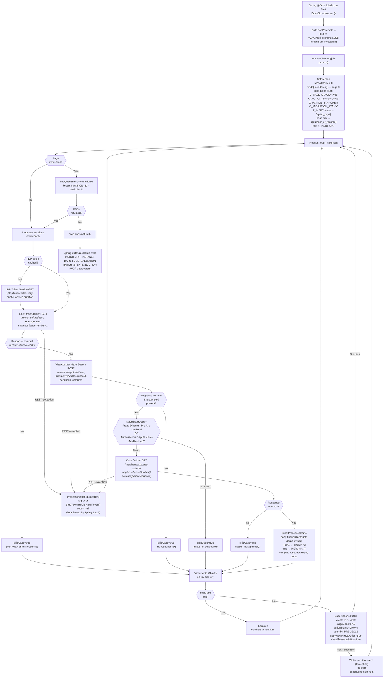

# WDP-COMP-06-NAP-DISPUTE-DECLINE-BATCH
**Worldpay Dispute Platform — Component Reference**
*Version: 1.1 DRAFT | April 2026*
*Source-verified: Copilot CLI audit 2026-04-30 against `gcp-visa-issuer-decline-batch`*
*Architect-confirmed: PENDING*
*Supersedes v1.0 DRAFT.*

> ⚠️ **CORRECTIONS APPLIED IN v1.1 (source-verified against the repo)**
>
> 1. **Pagination strategy** — v1.0 said "cursor-based, page size `${number_of_records}`."
>    Source shows a **hybrid two-stage strategy**: page 0 is offset-based with a
>    `Z_INSRT > now − ${past_days}` timestamp filter; subsequent pages use
>    keyset pagination on `I_ACTION_ID > :lastActionId`. The keyset half is
>    cursor-style; the bootstrap half is not.
> 2. **IDP token lifetime** — v1.0 said "GET once per job run." Source shows the
>    token holder is `@StepScope` with lazy initialisation, and it is **explicitly
>    cleared on any processor exception** (`StepTokenHolder.clearToken()`). It is
>    once per step execution **unless an error clears it mid-step**, in which case
>    the next item re-fetches.
> 3. **REST call count per record** — v1.0 said "up to 4 serial REST calls."
>    Strictly accurate for steady-state per-record processing, but the **first**
>    qualifying record in a step also triggers the lazy IDP Token GET. Total
>    distinct REST calls for the first qualifying record: 5. Steady state: 4.
> 4. **Kafka surface** — v1.0 said "no Kafka involvement." True at runtime, but
>    `spring-kafka`, `kafka-clients`, and `aws-msk-iam-auth` are **on the
>    classpath as compile-scope dependencies** with no Java imports referencing
>    them. Vestigial dependencies — likely from prior intent or copy-paste of
>    starter pom. Listed under Planned and Incomplete Work.
> 5. **DEC-004 reframed** — v1.0 labelled this DEC-004 DEVIATION on the basis
>    that EncryptionService is never called. Source confirms an `accountNumber`
>    field is present on `HyperSearchDetail` and `Case` model classes (populated
>    from Visa Adapter), but it is **never written to any persistent store** —
>    only Spring Batch metadata is written, which has no PAN columns. Reframed
>    as ✅ **NOT APPLICABLE** with a flagged residual risk: any future code
>    change that persists this field would silently bypass encryption.
> 6. **DEC-019 reframed** — v1.0 implied this was open. Confirmed ✅ COMPLIES
>    by absence — only Spring Batch metadata tables are written, no PAN columns.
> 7. **DEC-014** — Resilience4j confirmed not on classpath. `spring-retry` IS
>    on classpath but `@EnableRetry` is never declared and no `@Retryable`
>    annotations exist. No retry exists anywhere in the component.
> 8. **No K8s probes** — confirmed `resources.yaml` declares no liveness,
>    readiness, or startup probe. Same operational pattern as COMP-07, COMP-08,
>    COMP-12, COMP-14, COMP-21, COMP-42.
> 9. **Cross-datasource transaction risk newly surfaced** — the `processingStep`
>    receives the NAP-bound `JpaTransactionManager`; Spring Batch metadata
>    persistence uses its own `DataSourceTransactionManager` on the WDP
>    `@BatchDataSource`. These are separate transactions on separate datasources.
>    A successful Case Actions POST followed by a Spring Batch step-completion
>    write failure leaves the action created externally but the batch step
>    incomplete — on next run, a new JobInstance (unique timestamp params) is
>    created, potentially causing duplicate processing.
> 10. **Owner determination logic newly documented** — `subProductType == "TIER1"`
>     → owner = `SIGNIFYD`; otherwise (and on blank product fields) → owner =
>     `MERCHANT`. Not previously captured.
>
> **DECOMMISSION-SCOPED disclaimer retained.** All MEDIUM-severity findings
> below are recorded but not prioritised for remediation — the NAP/WPG inbound
> path will be removed when migration completes.

---

## ━━━ CORE SKELETON ━━━━━━━━━━━━━━━━━━━━━━━━━━━━━━━━━━━━━━

---

## Identity

| Field             | Value |
|-------------------|-------|
| **Name**          | `NAPDisputeDeclineBatch` |
| **Type**          | `Batch/Scheduler` |
| **Repository**    | `gcp-visa-issuer-decline-batch` |
| **Maven artifact**| `visa-issuer-decline-batch v1.1.1` |
| **Technology**    | `Java 17 · Spring Boot 3.5.7 · Spring Batch` |
| **Owner**         | Integration Team |
| **Status**        | `✅ Production` |
| **Doc status**    | `📝 DRAFT v1.1 — source-verified` |
| **Sections present** | `Core · Block D (Batch/Scheduler)` |

> ⚠️ **DECOMMISSION-SCOPED** — This component sits on the NAP/WPG inbound
> path, which is planned for decommission. No new development or design work
> is planned. All MEDIUM-severity findings below are ACCEPTED GAPS.

---

## Purpose

**What it does**

`NAPDisputeDeclineBatch` is a Spring Batch job that advances pre-arbitration
declined dispute cases on the NAP acquiring platform. It operates entirely
within the Visa card network and the NAP platform — no other card network
or acquiring platform is in scope.

The job runs on an internal Spring `@Scheduled` cron (not a Kubernetes
CronJob — it runs inside a long-lived Kubernetes Deployment). On each
firing it polls the `nap.action` table on the NAP PostgreSQL datasource
for open Pre-Arbitration (PAB) action records belonging to migrated NAP
merchants, then for each candidate it invokes the internal Case Management
service to confirm the dispute is on the Visa network, and the internal
Visa Adapter HyperSearch endpoint to obtain current Visa network state.
If the Visa network reports the case is in one of two specific Pre-Arb
Declined states *and* a `disputePreArbResponseId` is present, the job
fetches the existing action's financial details and creates a new Issuer
Decline (`IDCL`) draft action via the Case Actions service. Records that
fail any of the four filter gates are silently skipped.

Visa network access is mediated entirely through the internal Visa Adapter
service — this component does not call the Visa API directly.

**What it does NOT do**

- Does not write to or update `nap.action` rows. Source records are read
  only; status is not flipped after a successful IDCL creation. State
  reconciliation depends entirely on out-of-band updates from other
  components.
- Does not call the Visa API directly. All Visa interaction is via the
  internal Visa Adapter service.
- Does not handle PAN. NAP dispute payloads in scope do not carry full
  PAN. The `accountNumber` field that flows in from Visa Adapter is held
  in memory only and is never persisted by this component.
- Does not produce or consume Kafka events. (Kafka client libraries are
  on the classpath but unused — see Planned and Incomplete Work.)
- Does not expose any REST endpoints. Embedded Tomcat is present on port
  8082 (consequence of `spring-boot-starter-web` being on the classpath
  for Actuator), but no controllers are registered.
- Does not own any business-domain database state. Only Spring Batch
  framework metadata is written, on a separate WDP datasource.
- Does not implement any client-side idempotency guard against duplicate
  IDCL creation — it relies entirely on upstream state changing between
  job runs.

---

## Internal Processing Flow

---

## Boundaries

### Inbound Interfaces

| Source | Protocol | Endpoint / Topic / Trigger | Payload / Description |
|--------|----------|----------------------------|-----------------------|
| Internal Spring scheduler | `@Scheduled cron` | `${app.scheduler.cron}` (env `scheduler_cron` — production value not in repo) | Job trigger — no inbound payload |
| `nap.action` (NAP PostgreSQL) | JDBC SELECT | Native query — see Block D | Open PAB OPAB action records on migrated NAP cases within `${past_days}` lookback |

**Confirmed entry-path completeness:** Only one entry path. No `@RestController`,
`@RequestMapping`, `@GetMapping`, `@PostMapping` anywhere in source. No
`@KafkaListener`, no SQS listener, no webhook receiver, no secondary
`@Scheduled` method. Embedded Tomcat is bound (port 8082) because
`spring-boot-starter-web` is on the classpath, but no application-level
routes are registered.

### Outbound Interfaces

| Target | Protocol | Endpoint / Resource | Purpose | On failure |
|--------|----------|---------------------|---------|------------|
| WDP IDP Token Service | REST GET | `${idp.token.url}` (config-driven, value not in repo) | Bootstrap bearer JWT for downstream WDP REST calls (Step 1, lazy on first use per step) | Wrapped as `RuntimeException` → caught by processor catch-all → item returned as null → token cleared → next record re-fetches |
| Case Management Service (COMP-23) | REST GET | `/merchant/gcp/case-management/nap/case?caseNumber={caseNumber}` | Verify `cardNetwork = VISA` (Step 2) | `RestClientException` rethrown → processor catch-all → item null (skipped) → token cleared |
| Visa Adapter HyperSearch | REST POST | `${visa.adapter.hypersearch.url}` (internal `gcp-visa-adapter`) | Retrieve `stageStateDesc`, `disputePreArbResponseId`, deadlines, amounts (Step 3) | `Exception` wrapped/rethrown → processor catch-all → item null (skipped) → token cleared |
| Case Actions Service (COMP-24) — GET | REST GET | `/merchant/gcp/case-actions/nap/case/{caseNumber}/actions/{actionSequence}` | Retrieve existing action's financial details (Step 6) | `Exception` wrapped/rethrown → processor catch-all → item null (skipped) → token cleared |
| Case Actions Service (COMP-24) — POST | REST POST | `/merchant/gcp/case-actions/nap/case/{caseNumber}/actions` | Create new `IDCL` draft action (Step 7) | `Exception` rethrown from `addAction()` → caught by writer's per-item try/catch → logged → loop continues to next item |
| WDP PostgreSQL — Spring Batch metadata | JDBC | `${table_prefix}BATCH_JOB_*` and `${table_prefix}BATCH_STEP_EXECUTION*` | Spring Batch infrastructure persistence | Job launch or step completion fails — Spring Batch standard behaviour |
| Logstash / ELK | TCP | `${logstash_server_host_port}` | Structured JSON log shipping | Logback handles gracefully — logs may be lost; application continues |

---

## Database Ownership

### Tables Owned (written by this component)

| Schema.Table | Purpose | Key columns | Retention / Notes |
|--------------|---------|-------------|-------------------|
| `${table_prefix}BATCH_JOB_INSTANCE` (WDP datasource) | Spring Batch job identity | `job_instance_id`, `job_name`, `job_key` | Schema/prefix is env-var driven (`${table_prefix}`); production value not in repo. **Separate datasource from NAP read path.** |
| `${table_prefix}BATCH_JOB_EXECUTION` (WDP datasource) | Per-run execution status | `job_execution_id`, `job_instance_id`, `status`, `start_time`, `end_time` | Written by Spring Batch infrastructure, not by application code. |
| `${table_prefix}BATCH_JOB_EXECUTION_PARAMS` (WDP datasource) | Job parameters per run | `job_execution_id`, `parameter_name`, `parameter_value` | Always carries a unique `date` parameter — every run is a new instance (no Spring Batch dedup). |
| `${table_prefix}BATCH_STEP_EXECUTION` (WDP datasource) | Step-level progress and counts | `step_execution_id`, `step_name`, `read_count`, `write_count`, `commit_count` | Written on every commit (chunk size = 1, so per-item). |
| `${table_prefix}BATCH_STEP_EXECUTION_CONTEXT` (WDP datasource) | Step-scoped serialised state | `step_execution_id`, `serialized_context` | Spring Batch internal use. |

**No business-domain tables are written by this component.** No write to
`nap.action`, no write to `nap.case`, no write to any `wdp.*` table.

### Tables Read (not owned by this component)

| Schema.Table | Owned by | Why accessed |
|--------------|----------|--------------|
| `nap.action` (NAP datasource) | ⚠️ Owner TBC — Case Action services on the NAP path; cross-component review pending | Polled for open PAB OPAB action records matching the migration + lookback filter |

**Confirmed not read directly:**
- `nap.case` — case data is fetched only via the Case Management Service REST call.
- `wdp.case`, `wdp.action`, `wdp.chbk_outbox_row` — none of these are touched.

---

## Configuration and Scaling

| Parameter | Value | Notes |
|-----------|-------|-------|
| Kubernetes resource type | Deployment | Not CronJob, not StatefulSet |
| Replica count | `{{ replicas-gcp-visa-issuer-decline-batch }}` placeholder | Production value not in repo (XL Deploy template). Same pattern as COMP-07/08/09/11/12/14/15/16/17/18/19/20/21/23/24/27/37/41/42/43. |
| HPA | Not present in repo | No HorizontalPodAutoscaler manifest |
| Memory request | 512Mi | |
| Memory limit | 2048Mi | |
| CPU request | Not configured | Burstable QoS |
| CPU limit | Not configured | |
| Rolling update strategy | `RollingUpdate` — `maxSurge=1`, `maxUnavailable=0` | Two-replica window during rollout (DEC-023 implication if replicas>1) |
| PodDisruptionBudget | Not present in repo | |
| Topology spread | `maxSkew=1`, `whenUnsatisfiable=ScheduleAnyway`, `topologyKey=kubernetes.io/hostname` | Best-effort host spread |
| Liveness probe | **Not configured** | Same operational pattern as COMP-07, COMP-08, COMP-12, COMP-14, COMP-21, COMP-42 |
| Readiness probe | **Not configured** | |
| Startup probe | **Not configured** | |
| Container port | 8082 | Embedded Tomcat (Actuator only — no application routes) |
| Database connection pool | Not configured — `DriverManagerDataSource` (no pool) on both datasources | Plain JDBC; production may sit behind PgBouncer / Aurora-side pooling — not verifiable from source |
| OTel agent | Injected via pod annotation `instrumentation.opentelemetry.io/inject-java` | Confirmed present |
| Spring Actuator | On classpath (`spring-boot-starter-actuator`) | Default endpoints; `/actuator/prometheus` exposure depends on transitive `micrometer-registry-prometheus` — not verifiable from source |
| Logstash | TCP appender (`LogstashTcpSocketAppender`) → `${logstash_server_host_port}` | Encoder = `LogstashEncoder` |
| Spring Batch metrics | Not explicitly configured | Auto-configured presence depends on runtime classpath — not verifiable from source |

**Component-specific scheduler / batch parameters**

| Parameter | Config key | Value / Source |
|-----------|------------|----------------|
| Cron expression | `app.scheduler.cron` | env var `scheduler_cron` — production value not in repo |
| Cron timezone | (no `zone=` attribute) | Defaults to JVM/container timezone — not explicitly verifiable |
| Look-back window (days) | `app.batchProperties.pastDays` | env var `past_days` — production value not in repo, no source default |
| Page size | `app.batchProperties.numberOfRecords` | env var `number_of_records` — production value not in repo, no source default |
| Spring Batch table prefix | `spring.batch.jdbc.table-prefix` | env var `table_prefix` — production value not in repo |
| Spring Batch isolation level | `spring.batch.jdbc.isolation-level-for-create` | `REPEATABLE_READ` (in source) |
| Spring Batch auto-launch | `spring.batch.job.enabled` | `false` — auto-launch disabled; only the scheduler launches the job |
| Chunk size | (in `JobConfiguration`) | `1` — commits per item, no chunking benefit |
| Userid stamp on IDCL | `app.batchProperties.userId` | `NPRBDECLB` (hardcoded in `application-dev.yaml`; production value not verified) |

**Files present in repo:** `pom.xml`, `application.yml` (+ profile yamls),
`logback-spring.xml`, `resources.yaml`, `deployit-manifest.xml` (XL Deploy),
`Jenkinsfile`.

**Files NOT in repo:** `Dockerfile`, `values.yaml`, `Chart.yaml`, any
Helm chart artefacts.

---

## Key Architectural Decisions

| Decision | ADR reference | Notes |
|----------|---------------|-------|
| No transactional outbox — direct REST POST to Case Actions | DEC-001 — DEVIATES | IDCL creation goes via direct REST. No outbox row written. Acceptable for a decommission-scoped component. |
| No PAN handling at component boundary | DEC-004 / DEC-019 — NOT APPLICABLE | NAP dispute data does not carry full PAN. The `accountNumber` field flowing in from Visa Adapter is held in memory only and never persisted. EncryptionService never invoked. |
| No Kafka involvement at runtime | DEC-003 / DEC-005 — NOT APPLICABLE | No producer, no consumer, no listener. Kafka client libraries vestigial on classpath — see Planned and Incomplete Work. |
| No circuit breakers | DEC-014 — DEVIATES (platform VOID) | Resilience4j not on classpath. `spring-retry` on classpath but `@EnableRetry` never declared, no `@Retryable` annotations. |
| No client-side idempotency guard against duplicate IDCL | DEC-020 — DEVIATES | `nap.action` rows are not flipped after processing; on re-run within lookback window, the same row is re-evaluated. No idempotency key on the POST. Server-side dedup behaviour of COMP-24 not guaranteed by COMP-24 source. |
| Replica = singleton policy, no enforcement | DEC-023 — OPERATIONAL ONLY | Replica count is an XL Deploy placeholder. No `@SchedulerLock`, no advisory lock, no Redis lock. Two replicas would each fire their own scheduler. |
| Visa-only, NAP-only scope | Local decision | All non-Visa cases skipped immediately after Case Management GET. |
| Kubernetes Deployment + internal `@Scheduled` cron (not K8s CronJob) | Local decision | Long-lived JVM. Auto-launch disabled (`spring.batch.job.enabled=false`); only scheduler launches the job. |
| `nap.action` is read-only by this component | Local decision | Source records are never updated. State reconciliation depends on out-of-band updates from other components. |
| Two separate PostgreSQL datasources, single job | Local decision | NAP datasource for the read path; WDP datasource (`@BatchDataSource`) for Spring Batch metadata. Cross-datasource non-atomicity surfaced as a risk below. |

---

## Deviation Summary

| Standard | Status | Detail | Severity |
|----------|--------|--------|----------|
| **DEC-001** Transactional Outbox | ⛔ DEVIATES | Direct REST POST to Case Actions Service. No outbox table or pattern in this component. | 🟡 MEDIUM (decommission-scoped) |
| **DEC-003** Kafka Partition Key = merchantId | ✅ NOT APPLICABLE | No Kafka producer. Libraries on classpath but unused. | — |
| **DEC-004** PAN Encryption Before Persistence | ✅ NOT APPLICABLE | No PAN persisted by this component. `accountNumber` flows through memory only. Residual risk: any future code change adding a DB write of this field would silently bypass encryption. | 🟢 LOW (residual) |
| **DEC-005** Manual Kafka Offset Commit | ✅ NOT APPLICABLE | No Kafka consumer. | — |
| **DEC-014** Resilience4j Circuit Breakers | ⛔ ABSENT (platform-VOID) | Not on classpath. `spring-retry` on classpath but `@EnableRetry` never declared. No timeouts on `RestTemplate`. | 🟡 MEDIUM |
| **DEC-019** No Clear PAN in Persistent Store | ✅ COMPLIES (by absence) | Only Spring Batch metadata is written; no PAN columns in those tables. No DTO field named `pan`/`cardNumber` reaches any persistent write. | — |
| **DEC-020** Full At-Least-Once Idempotency | ⛔ DEVIATES | No client-side dedup, no `nap.action` flip, no idempotency key on POST, no server-side dedup contract from COMP-24. Re-run within lookback window can produce duplicate IDCL drafts. | 🟡 MEDIUM (decommission-scoped) |
| **DEC-023** Singleton Replica Constraint | ⚠️ OPERATIONAL ONLY | No code-level concurrency guard. Replica count is XL Deploy placeholder. Same pattern as COMP-07/COMP-08/COMP-09. | 🟡 MEDIUM |

---

## Risks and Constraints

| Severity | Risk | Consequence |
|----------|------|-------------|
| 🟡 MEDIUM | **No timeouts on RestTemplate.** Bare `RestTemplate` bean with no connect timeout, read timeout, or pool. | A slow or hung Visa Adapter / Case Management / Case Actions endpoint blocks the per-record loop indefinitely. Job duration degrades; subsequent cron firings may overlap if no concurrency guard. |
| 🟡 MEDIUM | **No K8s probes (liveness / readiness / startup).** | Failed JVM is not detected by Kubernetes; pod stays up but the scheduled job stops firing. Same pattern as COMP-07/08/12/14/21/42. |
| 🟡 MEDIUM | **No idempotency guard.** `nap.action` rows are not updated after processing; no client-side dedup; no idempotency key on Case Actions POST; server-side dedup behaviour of COMP-24 raw insert endpoint not guaranteed by COMP-24 source. | Duplicate IDCL draft actions on the same case if the cron re-fires within `${past_days}` before another component changes the source row state. Manual remediation required. |
| 🟡 MEDIUM | **Cross-datasource non-atomicity.** Case Actions POST commit is on the WDP REST tier; Spring Batch step-completion write is on the WDP `@BatchDataSource`; the per-step `JpaTransactionManager` is bound to NAP. A successful POST followed by a Spring Batch metadata write failure leaves the action created externally but the step incomplete. | Next run creates a new JobInstance (unique timestamp params) and may re-process the same row, causing duplicates (compounds with the idempotency gap). |
| 🟡 MEDIUM | **Replica count is XL Deploy placeholder; no concurrency guard.** No `@SchedulerLock`, no advisory lock, no Redis lock. Rolling update with `maxSurge=1` can run replicas+1 pods briefly. | Two pods firing the same `@Scheduled` cron simultaneously would race on the same `nap.action` rows, multiplying the duplicate-IDCL risk. |
| 🟢 LOW | **All scheduler tuning values are env-var-only with no source defaults** (`scheduler_cron`, `past_days`, `number_of_records`, `table_prefix`). | Misconfiguration (e.g. excessive `past_days`) could trigger unexpectedly large batch volumes and downstream load. Cannot diff against a known-good default. |
| 🟢 LOW | **Cron timezone not declared.** No `zone=` attribute on `@Scheduled`. | Schedule effectively follows JVM/container timezone; behaviour drift if the container TZ changes. |
| 🟢 LOW | **`accountNumber` flows through processor in memory.** Not persisted today, but no defensive masking or encryption. | Any future code change adding a DB write of this field would silently bypass DEC-004 / DEC-019. |
| 🟢 LOW | **Vestigial Kafka client libraries on classpath** (`spring-kafka`, `kafka-clients`, `aws-msk-iam-auth`). No imports reference them. | Misleads readers into expecting Kafka behaviour where none exists. Bloats classpath. |
| 🟢 LOW | **`spring-retry` and `spring-aspects` on classpath but unused.** No `@EnableRetry`, no `@Retryable`. | Misleading dependency footprint; suggests retry is configured when it isn't. |
| 🟢 LOW | **`spring-boot-starter-oauth2-client` on classpath but unused.** IDP token is fetched manually via custom `IdpRestInvoker`. | Misleading dependency footprint. |
| 🟢 LOW | **Component is decommission-scoped.** No active maintenance is planned. Latent bugs may remain unresolved until decommission. | Production defects discovered would require a scoping decision. |

---

## Planned Changes

- ⚠️ **Decommission** — this component will be removed as part of the
  NAP/WPG inbound path decommission. Timeline: TBD as of April 2026.
- No other planned changes confirmed. Review at decommission planning.

**Open questions deferred to decommission scoping (not raised as ADRs):**

- ⚠️ **OPEN QUESTION:** Production cron expression value (`scheduler_cron`),
  `past_days`, `number_of_records`, `table_prefix`, replica count — all are
  env-var-injected with no in-repo defaults. K8s secret / XL Deploy config
  inspection required.
- ⚠️ **OPEN QUESTION:** Server-side dedup contract on Case Actions POST
  `/{platform}/case/{caseNumber}/actions` (COMP-24 endpoint 1, "raw action
  insert"). Cross-component review with COMP-24 — current COMP-24 doc
  describes this endpoint as "Raw action insert. Caller constructs the
  full ActionRequest directly" with no mention of dedup.
- ⚠️ **OPEN QUESTION:** Whether `/actuator/prometheus` is exposed (depends
  on transitive `micrometer-registry-prometheus`) and whether Spring Batch
  step/job metrics are emitted. Runtime observation required.

---

---

## ━━━ TYPE BLOCK D — BATCH AND SCHEDULER CONTRACTS ━━━━━━━

---

## Batch and Scheduler Contracts

**Batch framework:** Spring Batch (chunk-oriented step, chunk size = 1).
**Deployment type:** Kubernetes Deployment hosting an internal Spring
`@Scheduled` cron — **not** a Kubernetes CronJob.
**Trigger mechanism:** Internal Spring `@Scheduled` annotation on
`BatchScheduler.run()`. `@EnableScheduling` declared on the application
class. Spring Batch auto-launch (`spring.batch.job.enabled`) is **disabled**
— the scheduler is the sole launcher.
**Job uniqueness:** A `JobParameters` object containing `date =
yyyyMMdd_HHmmss.SSS` is constructed on every cron firing. Every run is
therefore a new `JobInstance` from Spring Batch's perspective. There is
**no distributed lock** (`@SchedulerLock` / ShedLock / advisory lock /
Redis lock) preventing concurrent execution across replicas.

---

### Job: Visa Issuer Pre-Arbitration Decline Batch

**Purpose:** For each open PAB action on a migrated NAP Visa dispute,
query the Visa network and create an `IDCL` draft action if the case is
in a Pre-Arb Declined state.

**Schedule**

| Parameter | Config key | Value / Source |
|-----------|------------|----------------|
| Cron expression | `app.scheduler.cron` | env `scheduler_cron` — production value not in repo |
| Look-back window (days) | `app.batchProperties.pastDays` | env `past_days` — production value not in repo |
| Page size | `app.batchProperties.numberOfRecords` | env `number_of_records` — production value not in repo |
| Timezone | (not specified) | Defaults to JVM timezone — not verifiable from source |

**Input source**

| Source | Type | Query / Filter | Pagination |
|--------|------|----------------|------------|
| `nap.action` (NAP datasource) | DB poll, native SQL | `C_CASE_STAGE='PAB' AND C_ACTION_TYPE='OPAB' AND C_ACTION_STA='OPEN' AND C_MIGRATION_STA='Y' AND Z_INSRT > now − ${past_days}` | **Hybrid two-stage** — page 0 is offset-based with a `Z_INSRT` filter sorted ASC; subsequent pages use keyset pagination on `I_ACTION_ID > :lastActionId` |

**Processing steps** (chunk size = 1, single-threaded step)

| Step | Name | Description | On failure |
|------|------|-------------|------------|
| 1 | IDP Token bootstrap | `StepTokenHolder` (`@StepScope`, lazy) calls IDP Token Service GET on first invocation per step. Cached for the step duration unless cleared. | Wrapped as `RuntimeException` → propagates to processor catch-all → item null → token cleared → next item re-fetches |
| 2 | Card-network filter | Case Management GET `/nap/case?caseNumber=...`; `cardNetwork == "VISA"`? | Non-VISA or null response → `skipCase=true`. `RestClientException` → processor catch-all → item null |
| 3 | Visa network state lookup | Visa Adapter HyperSearch POST | Exception → processor catch-all → item null |
| 4 | Response-ID gate | `disputePreArbResponseId` non-blank? | Blank → `skipCase=true` |
| 5 | State filter | `stageStateDesc` ∈ {`Fraud Dispute - Pre-Arb Declined`, `Authorization Dispute - Pre-Arb Declined`} (case-insensitive)? | No match → `skipCase=true` |
| 6 | Existing-action lookup | Case Actions GET `/nap/case/{caseNumber}/actions/{actionSequence}` | Exception → processor catch-all → item null. Null response → `skipCase=true` |
| 7 | Build IDCL request | Construct `AddActionRequest`: copy financial amounts from existing action; derive owner (`TIER1`→`SIGNIFYD`, else `MERCHANT`); compute `responseDueDate`/`expirationDate` from `lastDateToAct` or today | (in-memory only) |
| 8 | IDCL action creation | Case Actions POST `/nap/case/{caseNumber}/actions` — `actionCode=IDCL`, `stageCode=PAB`, `actionStatus=DRAFT`, `userId=NPRBDECLB`, `copyFromPrevsAction=true`, `closePreviousAction=true` | Exception → writer per-item catch → log → continue to next item |

**Downstream calls per record**

- **Filtered at Step 2 (non-VISA):** 1 REST call (Case Management GET) + IDP Token (first record only).
- **Filtered at Step 3 (HyperSearch null/empty responseId):** 2 REST calls.
- **Filtered at Step 5 (state not actionable):** 2 REST calls.
- **Filtered at Step 6 (existing action lookup empty):** 3 REST calls.
- **Fully qualifying record:** 4 REST calls (CM GET, HS POST, CA GET, CA POST). First qualifying record in a step also incurs the IDP Token GET — total 5.

No parallelism within the per-record loop (chunk size = 1, single-threaded step).

**Outputs**

| Target | Type | What is written | On failure |
|--------|------|-----------------|------------|
| Case Actions Service (COMP-24) | REST POST | New `IDCL` draft action — `stageCode=PAB`, `actionStatus=DRAFT`, `userId=NPRBDECLB`, financial amounts copied from existing action, `networkPhaseId=disputePreArbResponseId` | Exception caught by writer per-item try/catch → logged → loop continues to next item. **No retry. No DLQ. The failed item is silently lost from this run.** Re-run will re-evaluate the source `nap.action` row if it still matches the filter and falls within the lookback window. |
| WDP PostgreSQL — Spring Batch metadata | DB write | Standard Spring Batch infrastructure tables on the `@BatchDataSource` (separate from the NAP read datasource) | Spring Batch standard behaviour — job/step recorded as failed; next run is a new JobInstance |

**Failure and recovery**

- **Re-run safety:** Not safe in the strict sense. Re-run within the
  `${past_days}` window before another component flips the source row will
  re-process the same `nap.action` row. Combined with no client-side
  idempotency and no confirmed server-side dedup at COMP-24, this can
  produce duplicate IDCL drafts.
- **Resume vs restart:** Every cron firing produces a new `JobInstance`
  (timestamp `JobParameters`). There is no resume-from-checkpoint — restart
  is full-restart from the first matching `nap.action` row.
- **Partial commits:** Chunk size = 1, so each item commits independently.
  A successful Case Actions POST is committed externally before any later
  failure can roll it back — Spring Batch metadata for that step records
  the commit count.
- **Failure recording:** Spring Batch metadata only. No application-level
  error table. Logstash is the only place a per-item exception is captured.
- **Manual reprocessing path:** None visible. No Actuator-based job
  launcher, no REST trigger. Operator interventions are limited to
  changing the cron expression or restarting the pod.

**Spring Batch metadata**

| Table | Schema | Purpose |
|-------|--------|---------|
| `BATCH_JOB_INSTANCE` | `${table_prefix}` on WDP datasource | Job identity (effectively unused for dedup — every run is a unique instance) |
| `BATCH_JOB_EXECUTION` | `${table_prefix}` on WDP datasource | Per-run execution status |
| `BATCH_JOB_EXECUTION_PARAMS` | `${table_prefix}` on WDP datasource | Per-run parameters (the `date` timestamp) |
| `BATCH_STEP_EXECUTION` | `${table_prefix}` on WDP datasource | Step-level read/write/commit counts |
| `BATCH_STEP_EXECUTION_CONTEXT` | `${table_prefix}` on WDP datasource | Step-scoped serialised state |

Written to the WDP PostgreSQL datasource via Spring Batch's internal
`DataSourceTransactionManager` bound to the `@BatchDataSource` bean.
**Separate datasource and separate transaction** from the per-step
`JpaTransactionManager` (which is bound to the NAP read datasource as
`@Primary`).

---

## Items Not Verifiable from Source

| Item | Why |
|------|-----|
| Production cron expression (`scheduler_cron`) | Env-var injected at runtime |
| Production `past_days` and `number_of_records` | Env-var injected at runtime; no source defaults |
| Production `table_prefix` for Spring Batch tables | Env-var injected at runtime |
| Production replica count | XL Deploy placeholder `{{ replicas-gcp-visa-issuer-decline-batch }}` |
| Cron timezone | Defaults to JVM/container TZ — depends on container config |
| Whether `/actuator/prometheus` is exposed | Depends on transitive `micrometer-registry-prometheus` not visible in `pom.xml` |
| Spring Batch metrics emission | Auto-config dependent — runtime observation required |
| Server-side dedup contract on Case Actions POST `/{platform}/case/{caseNumber}/actions` | Cross-component contract; current COMP-24 doc does not assert dedup on this endpoint |
| Whether downstream calls use mTLS | `RestTemplate` is plain HTTP with no SSL context configuration; URLs are HTTP — definitive answer requires network policy review |
| DEC-023 intent — should this run replicas=1? | No source-level lock; replica count is a placeholder |
| Secret contents (`gcp-visa-issuer-decline-batch-secrets`, `wdp-common-secrets`) | Env-var injected at runtime |

**Files referenced by template but not in repo:** `Dockerfile`,
`values.yaml`, `Chart.yaml`, any Helm chart artefacts.

---

*End of WDP-COMP-06-NAP-DISPUTE-DECLINE-BATCH.md v1.1 DRAFT.*
*File status: 📝 DRAFT — source-verified 2026-04-30 against `gcp-visa-issuer-decline-batch`. Architect confirmation pending.*
*Supersedes v1.0 DRAFT.*
*Platform-level impacts captured in WDP-CHANGE-LOG.md Pending Entry. No WDP-KAFKA.md changes (component is Kafka-free at runtime). WDP-DB.md row update pending; WDP-COMP-INDEX.md row update pending.*
